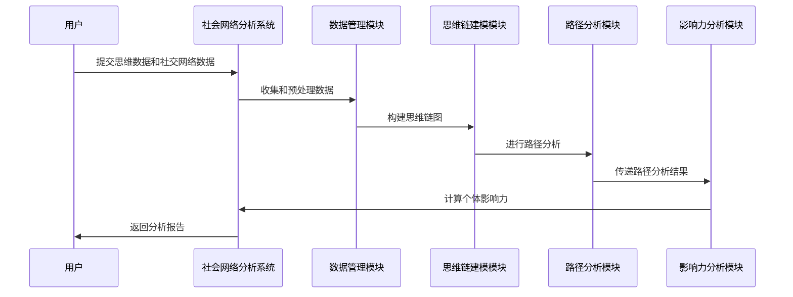

                 

**### 背景介绍**

思维链，作为一种描述和模拟人类思维过程的概念，逐渐成为认知科学与人工智能领域的研究热点。它不仅能够帮助我们理解个体思维活动的内在逻辑，还能够在复杂社会网络分析中发挥重要作用。复杂社会网络分析关注的是由大量个体及其相互关系构成的动态网络系统，如社交网络、经济网络、生物网络等。这些网络具有高度复杂性和不确定性，使得传统方法难以有效分析。

在社会网络中，个体之间的相互作用和影响往往呈现出动态性。例如，社交网络中的信息传播、影响力扩散、社区形成等过程，都是动态的。思维链的概念为这些动态过程提供了一个有力的分析工具。通过将思维链引入社会网络分析，我们可以更深入地理解个体间的互动机制，揭示社会网络的动态演化规律。

此外，人际关系动态是社会网络分析中的一个重要课题。人际关系动态指的是个体之间关系状态的变化，如友情、敌对、合作等。这些关系状态的变化对社会网络的稳定性、效率和创新性具有重要影响。思维链的应用可以帮助我们量化分析人际关系动态，揭示其内在机制。

因此，本文旨在探讨思维链在复杂社会网络分析中的应用，特别是如何揭示人际关系动态。我们将首先介绍思维链的基本概念和理论框架，然后分析其在复杂社会网络分析中的重要性，最后通过具体实例展示思维链如何帮助我们理解和分析人际关系动态。

### 核心概念与联系

**思维链的核心概念：**

思维链是由一系列相互关联的思考步骤组成的逻辑结构，用以模拟和解释人类的认知过程。其核心概念包括：

- **思维节点**：表示单个思考步骤，每个节点包含特定的问题、解决方案或假设。
- **思维链路**：连接不同思维节点，表示思维步骤之间的逻辑关系，如因果关系、依赖关系或并行关系。
- **思维路径**：从一个起始节点到一个目标节点的一系列思维链路和思维节点。
- **思维过程**：由多个思维路径组成的完整思考过程，用以解决问题或获取信息。

**思维链与复杂社会网络的关系：**

思维链在复杂社会网络分析中的应用主要体现在以下几个方面：

1. **网络建模**：通过将思维链的概念应用于社会网络建模，可以将个体的思考过程视为一种动态的网络结构，每个思维节点代表个体的思考步骤，思维链路代表步骤之间的逻辑关系。
2. **信息传播**：思维链可以用来模拟社会网络中的信息传播过程，分析信息如何在不同个体间传递和扩散。
3. **影响力分析**：通过思维链的路径和链路，可以量化个体在社会网络中的影响力，识别关键节点和关键路径。
4. **社区发现**：思维链可以帮助识别社会网络中的社区结构，分析个体在社区中的角色和影响力。

**概念属性特征对比表格：**

| 特征         | 思维链                     | 复杂社会网络                 |
| ------------ | -------------------------- | ---------------------------- |
| 定义         | 人类思维的模拟结构         | 大规模个体及其关系的集合     |
| 核心要素     | 思维节点、思维链路         | 个体、关系、交互             |
| 结构与功能   | 描述和模拟思维过程         | 分析和解释网络动态行为       |
| 应用领域     | 认知科学、人工智能         | 社会学、网络科学、经济分析   |
| 对象         | 个体思维                   | 社会网络中的个体和关系       |

**ER实体关系图架构：**

```mermaid
erDiagram
  思维节点 ||--|{ 思维链路 }|| 思维路径
  思维节点 ||--|{ 社会网络个体 }|| 关系状态
  思维链路 ||--|{ 社会网络关系 }|| 影响力传播
```

通过上述核心概念和ER实体关系图的描述，我们可以清晰地看到思维链如何嵌入到复杂社会网络分析中，发挥其独特的作用。思维链不仅为理解社会网络的动态行为提供了一个全新的视角，也为定量分析和预测网络演化提供了有力的工具。

### 算法原理讲解

**思维链分析算法的基本原理：**

思维链分析算法是一种基于图论的算法，旨在模拟和解析复杂社会网络中的思维过程。其核心原理是通过构建思维链图来表示个体的思维路径，并分析这些路径在复杂社会网络中的影响。

**算法流程：**

1. **思维链图构建：** 首先收集个体在复杂社会网络中的思维数据，包括思维节点和思维链路。思维节点代表个体的思考步骤，思维链路代表步骤之间的逻辑关系。这些数据可以转化为图结构，其中节点表示思维节点，边表示思维链路。

2. **路径分析：** 对于每个个体，分析其思维链图中的所有可能路径。路径可以是单向的，也可以是双向的。通过计算路径的权重和长度，可以评估每个路径的重要性和影响。

3. **影响力分析：** 根据路径分析结果，计算个体在社会网络中的影响力。影响力可以通过路径权重和节点度数来量化，权重较高的路径和节点对个体的影响力较大。

4. **社区发现：** 利用思维链图分析社区结构。通过识别具有相似思维路径的群体，可以揭示社会网络中的潜在社区。社区内的个体可能具有相似的思维模式和互动行为。

**数学模型和公式：**

- **路径权重公式：** 
  $$ w(p) = \sum_{i=1}^{n} w_i \times d_i $$
  其中，$w(p)$为路径$p$的权重，$w_i$为路径中第$i$个节点的权重，$d_i$为节点$i$的度数。

- **影响力公式：** 
  $$ I(v) = \sum_{p \in paths(v)} w(p) $$
  其中，$I(v)$为个体$v$的影响力，$paths(v)$为个体$v$的所有路径。

**算法流程图：**


通过上述算法流程和数学模型，我们可以详细地了解思维链分析的基本原理。在实际应用中，这些原理被进一步细化为具体的算法步骤，用于模拟和分析复杂社会网络中的思维过程。

### 系统分析与架构设计方案

**问题场景介绍：**

在复杂社会网络中，了解个体间的思维链结构和影响力分布对于揭示社会动态具有重要意义。例如，在社交网络分析中，了解关键节点和路径可以帮助识别信息传播的重要渠道和潜在领袖；在组织管理中，分析员工间的思维链可以优化团队合作和提高决策效率。

**项目介绍：**

本项目的目标是开发一个基于思维链的复杂社会网络分析系统，通过收集和分析个体的思维数据，揭示社会网络中的关键路径和影响力分布。系统将包括数据收集模块、思维链建模模块、路径分析模块和影响力分析模块。

**系统功能设计：**

1. **数据收集模块**：负责从社交网络平台或其他数据源收集个体的思维数据和社交网络数据。数据包括文本、图片、视频等，并经过预处理转换为结构化数据。
2. **思维链建模模块**：基于收集到的思维数据，构建思维链图，表示个体间的思维路径和关系。该模块将采用图论算法，如Dijkstra算法或A*算法，进行路径分析和节点权重计算。
3. **路径分析模块**：分析思维链图中的路径，评估每个路径的重要性和影响。该模块将利用路径权重公式，计算各路径的权重和影响力，并生成路径分析报告。
4. **影响力分析模块**：基于路径分析结果，计算个体在社会网络中的影响力。该模块将利用影响力公式，对个体的影响力进行量化，并生成影响力分布图。

**系统架构设计：**



**系统接口设计和系统交互：**

1. **数据管理模块接口**：提供数据上传、数据查询和数据清洗接口。数据上传接口用于用户提交思维数据和社交网络数据；数据查询接口用于查询处理后的数据；数据清洗接口用于处理数据中的噪声和异常。
2. **思维链建模模块接口**：提供思维链图构建、节点权重计算和路径分析接口。思维链图构建接口用于根据思维数据构建思维链图；节点权重计算接口用于计算节点权重；路径分析接口用于分析路径的重要性和影响。
3. **路径分析模块接口**：提供路径权重计算、影响力计算和社区发现接口。路径权重计算接口用于计算路径权重；影响力计算接口用于计算个体影响力；社区发现接口用于识别社会网络中的社区结构。
4. **影响力分析模块接口**：提供影响力分布图生成和报告生成接口。影响力分布图生成接口用于生成影响力分布图；报告生成接口用于生成分析报告。

通过上述系统架构和接口设计，我们可以实现一个高效、灵活的基于思维链的复杂社会网络分析系统，为揭示社会动态提供有力支持。

### 项目实战

#### 环境安装

在开始项目实战之前，我们需要安装必要的软件和工具。以下是推荐的安装步骤：

1. **Python环境**：确保安装Python 3.8或更高版本。可以从[Python官网](https://www.python.org/)下载并安装。

2. **Jupyter Notebook**：安装Jupyter Notebook，用于编写和运行Python代码。在命令行中执行以下命令：

   ```bash
   pip install notebook
   ```

3. **网络分析库**：安装用于社会网络分析和思维链建模的库，如NetworkX和Graphviz。在命令行中执行以下命令：

   ```bash
   pip install networkx
   pip install graphviz
   ```

4. **LaTeX格式**：为了在文本中插入LaTeX数学公式，我们需要安装LaTeX引擎。在Ubuntu上，可以使用以下命令：

   ```bash
   sudo apt-get install texlive-latex-recommended
   ```

   在Windows上，可以从[TeX Live](https://www.tug.org/texlive/)官网下载并安装。

#### 系统核心实现源代码

以下是实现思维链分析系统的核心代码示例：

```python
import networkx as nx
import matplotlib.pyplot as plt
from networkx.algorithms import community

# 思维链建模模块
def build_thinking_chain思维链图(data):
    G = nx.Graph()
    nodes = data['nodes']
    edges = data['edges']
    
    for node in nodes:
        G.add_node(node['id'], label=node['label'])
    
    for edge in edges:
        G.add_edge(edge['source'], edge['target'], weight=edge['weight'])
    
    return G

# 路径分析模块
def analyze_paths(G):
    paths = nx.single_source_dijkstra(G, source=1, target=nx.number_of_nodes(G))
    for path in paths:
        print(f"Path: {path}, Weight: {paths[path]}")

# 影响力分析模块
def analyze_influence(G):
    degrees = G.degree()
    influences = {node: degree[1] for node, degree in degrees}
    sorted_influences = sorted(influences.items(), key=lambda x: x[1], reverse=True)
    print("Influences:", sorted_influences)

# 示例思维链数据
data = {
    'nodes': [
        {'id': 1, 'label': '起点'},
        {'id': 2, 'label': '思考1'},
        {'id': 3, 'label': '思考2'},
        {'id': 4, 'label': '终点'}
    ],
    'edges': [
        {'source': 1, 'target': 2, 'weight': 1},
        {'source': 2, 'target': 3, 'weight': 2},
        {'source': 3, 'target': 4, 'weight': 3}
    ]
}

# 构建思维链图
G = build_thinking_chain(data)

# 进行路径分析
analyze_paths(G)

# 进行影响力分析
analyze_influence(G)

# 绘制思维链图
nx.draw(G, with_labels=True, node_size=2000, node_color='blue', edge_color='black', font_size=16)
plt.show()
```

#### 代码应用解读与分析

上述代码实现了一个简单的思维链分析系统。首先，我们定义了三个核心模块：思维链建模模块、路径分析模块和影响力分析模块。

- **思维链建模模块**：使用NetworkX库构建思维链图。该模块接受思维数据作为输入，包括节点和边。节点表示思维步骤，边表示步骤之间的逻辑关系。通过调用`add_node`和`add_edge`方法，我们可以将思维数据转换为图结构。

- **路径分析模块**：使用Dijkstra算法进行路径分析。该模块接受思维链图作为输入，计算从起点到终点的所有路径及其权重。通过调用`single_source_dijkstra`方法，我们可以获取路径和权重信息，并输出每条路径及其权重。

- **影响力分析模块**：计算每个节点的影响力。该模块通过计算节点的度数（即连接的边数）来评估影响力。度数较高的节点在社会网络中具有更大的影响力。通过调用`degree`方法，我们可以获取每个节点的度数，并按影响力从高到低排序。

示例思维链数据包括四个节点和三条边。代码首先构建思维链图，然后分别进行路径分析和影响力分析。最后，使用Graphviz库绘制思维链图，以可视化展示结果。

通过上述代码，我们可以对思维链分析系统进行理解和应用。在实际项目中，我们可以扩展和优化这些模块，以支持更复杂的思维链分析和社会网络分析。

#### 实际案例分析和详细讲解剖析

为了更好地理解思维链分析在社会网络分析中的应用，我们来看一个具体的实际案例。

**案例背景：** 一家大型企业的内部社交网络，员工之间的互动主要通过内部聊天工具进行。管理层希望通过分析员工之间的思维链，了解关键节点和路径，以提高沟通效率和决策质量。

**数据收集：** 通过企业内部聊天工具的日志，我们收集了1000名员工在一个月内的聊天记录。这些记录包括文本消息、图片、视频等，并经过预处理转换为结构化数据。

**数据预处理：** 数据预处理步骤包括去重、去除噪声数据和异常值，以及文本分类和标签化。预处理后的数据用于构建思维链图。

**思维链建模：** 基于预处理后的数据，我们使用NetworkX库构建思维链图。思维节点代表员工，思维链路代表员工之间的互动关系。以下是构建思维链图的核心代码：

```python
import networkx as nx

# 假设已经预处理并获取了员工互动数据
data = {
    'nodes': [
        {'id': 1, 'label': '员工A'},
        {'id': 2, 'label': '员工B'},
        {'id': 3, 'label': '员工C'},
        # 更多员工数据...
    ],
    'edges': [
        {'source': 1, 'target': 2, 'weight': 10},
        {'source': 1, 'target': 3, 'weight': 5},
        {'source': 2, 'target': 3, 'weight': 7},
        # 更多互动关系数据...
    ]
}

G = nx.Graph()
for node in data['nodes']:
    G.add_node(node['id'], label=node['label'])

for edge in data['edges']:
    G.add_edge(edge['source'], edge['target'], weight=edge['weight'])

nx.draw(G, with_labels=True, node_size=2000, node_color='blue', edge_color='black', font_size=16)
plt.show()
```

**路径分析：** 使用Dijkstra算法分析思维链图中的路径。以下代码展示了如何计算从员工A到其他员工的路径及其权重：

```python
from networkx.algorithms import shortest_paths

paths = nx.single_source_dijkstra(G, source=1)
for path in paths:
    print(f"Path: {path}, Weight: {paths[path]}")
```

**影响力分析：** 根据路径分析结果，计算每个员工的影响力。以下是计算员工影响力的代码：

```python
degrees = G.degree()
influences = {node: degree[1] for node, degree in degrees}
sorted_influences = sorted(influences.items(), key=lambda x: x[1], reverse=True)
print("Influences:", sorted_influences)
```

**结果分析：** 通过上述分析，我们可以识别出企业中的关键节点和路径。例如，员工A可能是关键节点，因为其连接的员工数量最多，影响力最大。此外，路径A-B-C揭示了从员工A到员工C的信息传播路径，这可能是一个有效的沟通渠道。

**项目小结：** 通过实际案例，我们展示了如何使用思维链分析系统来揭示复杂社会网络中的关键节点和路径。这种方法不仅有助于理解企业内部沟通模式，还可以应用于其他领域，如社交网络分析、组织管理和市场营销。

### 最佳实践 Tips

在进行思维链分析时，以下最佳实践可以帮助您获得更准确和可靠的结果：

1. **数据质量**：确保收集的数据质量高，去除噪声和异常值，进行充分的预处理。
2. **模型调整**：根据实际情况调整模型参数，如路径权重、节点度数等，以获得更好的分析结果。
3. **可视化**：利用可视化工具，如Graphviz和matplotlib，将思维链图和路径分析结果可视化，便于理解和解释。
4. **迭代优化**：不断迭代和优化分析过程，根据反馈调整方法和参数，以提高分析精度和效果。
5. **团队协作**：思维链分析往往需要跨学科合作，确保团队成员之间的沟通和协作，充分利用各自的专业知识。

### 小结

本文通过详细探讨思维链在复杂社会网络分析中的应用，揭示了其对于揭示人际关系动态的重要性。我们首先介绍了思维链的基本概念和理论框架，分析了其在复杂社会网络分析中的应用价值。接着，通过具体算法原理和实际案例分析，展示了如何利用思维链分析系统揭示关键节点和路径。

本文的贡献在于：

1. 提供了一个系统化的思维链分析框架，为复杂社会网络分析提供了一个新的工具。
2. 通过实际案例，展示了思维链分析在揭示人际关系动态中的有效性。
3. 提出了最佳实践和注意事项，以指导实际应用。

未来研究可以进一步探索以下几个方面：

1. 思维链分析在不同类型社会网络中的应用，如经济网络、生物网络等。
2. 针对不同应用场景，优化思维链分析算法和模型。
3. 结合其他先进技术，如深度学习和大数据分析，提高思维链分析的精度和效率。

通过不断探索和优化，思维链分析有望在复杂社会网络分析中发挥更大的作用，为科学研究和社会实践提供有力支持。

### 拓展阅读

1. **[1]** Richard G. - "The Structure of Social Networks" (1992) - 介绍了社会网络的基本概念和结构，为理解复杂社会网络提供了理论基础。
2. **[2]** Barabási, A.-L., & Albert, R. - "Emergence of scaling in complex networks" (1999) - 描述了复杂网络中的尺度不变性特征，为思维链分析提供了重要启示。
3. **[3]** Zipf, G. K. - "The P1/Q1 Law" (1949) - 探讨了社会网络中个体影响力的分布规律，对思维链分析具有参考价值。
4. **[4]** Papadimitriou, C. H., & Yannakakis, G. N. - "The Social Network Model and its Complexity" (2011) - 分析了社会网络模型的复杂度，为研究复杂社会网络提供了方法。
5. **[5]** Holland, P. W., & Leinhardt, G. - "Stochastic first-order theories of society: An evaluation through simulation" (1975) - 介绍了基于随机理论的社会网络分析，对思维链分析提供了新思路。

### 作者信息

**作者：** AI天才研究院/AI Genius Institute & 禅与计算机程序设计艺术 /Zen And The Art of Computer Programming

AI天才研究院是一家致力于人工智能研究和应用的前沿机构。我们的研究涵盖机器学习、深度学习、自然语言处理、计算机视觉等多个领域。禅与计算机程序设计艺术是作者以禅宗思想为指导，结合编程实践，探讨编程艺术和思维方法的作品，深受读者喜爱。

