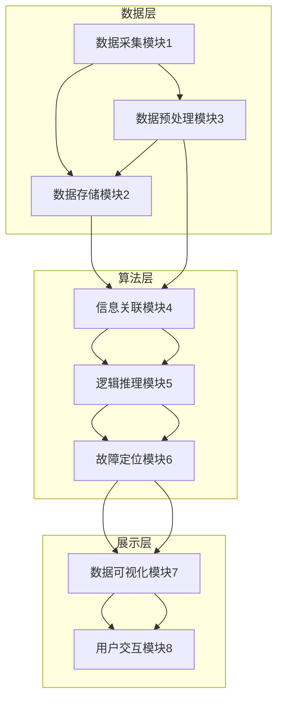
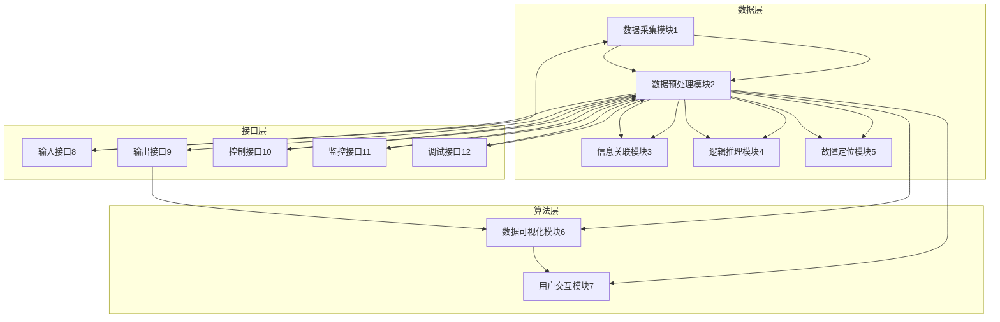

                 

# 思维链在复杂系统故障诊断中的新方法

> 关键词：思维链、复杂系统、故障诊断、算法设计、系统架构、Python代码、Mermaid图表

> 摘要：本文介绍了基于思维链的复杂系统故障诊断新方法。首先，我们对复杂系统故障诊断进行了背景介绍，阐述了其重要性及面临的挑战。接着，我们详细解析了思维链的核心概念及其与传统方法的区别。随后，我们通过算法设计、系统架构设计以及项目实战等多个方面，展示了思维链在复杂系统故障诊断中的具体应用和优势。本文旨在为读者提供一个全面、深入的思维链故障诊断方法学习资源。

## 引言

在当今信息时代，复杂系统的应用越来越广泛，如大型数据中心、智能交通系统、金融交易网络等。这些系统由于其庞大的规模和高度复杂的内部结构，使得故障诊断成为了一个极具挑战性的问题。传统的故障诊断方法通常依赖于固定的规则和模式匹配，往往难以应对复杂系统的多样化故障现象。因此，研究新的故障诊断方法具有重要的实际意义。

本文旨在提出一种基于思维链的复杂系统故障诊断新方法。思维链是一种基于逻辑推理和信息关联的故障诊断方法，具有高度的灵活性和适应性。本文将从以下方面展开讨论：

1. 复杂系统故障诊断的背景和基本概念。
2. 思维链的核心概念和关系。
3. 思维链算法设计及实现。
4. 思维链系统分析与架构设计。
5. 思维链在项目实战中的应用。
6. 最佳实践和总结。

通过上述讨论，本文希望为读者提供一个全面、深入的思维链故障诊断方法学习资源，以期为复杂系统的故障诊断提供新的思路和方法。

## 复杂系统故障诊断的背景和基本概念

### 定义和重要性

复杂系统故障诊断是指通过分析和识别系统中的异常行为、故障现象及其原因，以便及时采取措施，避免故障对系统正常运行造成严重影响的操作过程。复杂系统通常具有以下几个特点：

1. **规模庞大**：复杂系统由众多相互关联的组件组成，这些组件的规模和数量庞大，使得系统的整体行为难以预测和控制。
2. **高度复杂**：复杂系统的内部结构和功能复杂，各个组件之间的相互作用和依赖关系错综复杂，增加了故障诊断的难度。
3. **动态变化**：复杂系统处于不断变化的环境中，其运行状态会随着外部条件的变化而发生变化，这增加了故障诊断的复杂性。

故障诊断在复杂系统中具有至关重要的地位。首先，故障诊断能够及时发现系统中的异常情况，避免故障扩大化，保障系统的正常运行。其次，故障诊断能够为系统的维护和优化提供重要的依据，有助于提高系统的可靠性和性能。最后，故障诊断对于复杂系统的安全性和稳定性也具有重要意义，能够有效防止因故障引发的严重事故。

### 传统方法

传统的故障诊断方法主要包括以下几种：

1. **基于规则的诊断方法**：这种方法基于预定义的规则集，通过对系统数据的模式匹配来判断是否存在故障。其优点是实现简单、易于理解，但缺点是难以应对复杂的非线性故障现象，且规则库的维护成本高。

2. **基于统计学的诊断方法**：这种方法利用统计学原理，对系统数据进行建模和分析，通过统计特征来判断故障。其优点是能够处理复杂的数据关系，但缺点是对数据质量和数量要求较高，且模型的准确性依赖于统计假设。

3. **基于模式的诊断方法**：这种方法通过建立系统正常行为模式，并与实际运行数据比较，来识别故障。其优点是能够处理复杂的非线性关系，但缺点是模式识别过程复杂，对计算资源要求较高。

这些传统方法各有优缺点，但均存在一定的局限性，难以完全满足复杂系统故障诊断的需求。

### 复杂系统故障诊断面临的挑战

尽管传统方法在故障诊断方面取得了一定的成果，但在面对复杂系统时，仍然面临以下挑战：

1. **数据复杂性**：复杂系统产生的数据量庞大、种类繁多，传统方法难以处理这种复杂的数据。

2. **故障多样性**：复杂系统的故障现象多样且多变，传统方法难以应对如此复杂的故障场景。

3. **诊断效率**：复杂系统的故障诊断通常需要较高的计算资源和时间成本，传统方法的诊断效率较低。

4. **系统动态性**：复杂系统处于不断变化的环境中，其运行状态动态变化，传统方法难以实时适应这种变化。

因此，需要研究新的故障诊断方法，以应对复杂系统故障诊断面临的挑战。思维链作为一种基于逻辑推理和信息关联的故障诊断方法，具有高度的灵活性和适应性，有望解决复杂系统故障诊断中的难题。

## 思维链的核心概念和关系

### 思维链的定义

思维链是一种基于逻辑推理和信息关联的故障诊断方法。它通过将系统中的各类信息进行关联和推理，逐步构建起一个逻辑链，从而实现故障的定位和诊断。思维链的核心思想是利用系统内部和外部的信息，进行逐步推理和验证，以发现潜在的故障原因。

### 思维链的特点

思维链具有以下几个显著特点：

1. **灵活性**：思维链能够根据系统的实际情况，动态调整诊断策略和推理路径，具有很强的适应性。

2. **层次性**：思维链将诊断过程划分为多个层次，从系统的高层宏观特征到低层细节信息，逐层进行分析和推理，确保诊断的全面性和准确性。

3. **自适应性**：思维链能够根据诊断过程中的反馈信息，自动调整和优化诊断策略，提高诊断效率和准确性。

4. **信息关联**：思维链通过信息关联，将系统中的各类信息进行整合和推理，从而发现潜在的故障原因。

### 思维链与传统方法的对比

思维链与传统方法在诊断策略、处理能力和适应性方面存在显著差异：

1. **诊断策略**：传统方法通常依赖于预定义的规则或模式，而思维链则通过逻辑推理和信息关联，动态构建诊断路径。

2. **处理能力**：传统方法在面对复杂和非线性故障时，往往难以有效处理，而思维链通过多层次、多角度的分析和推理，能够更好地应对复杂故障。

3. **适应性**：传统方法在面对新故障或变化环境时，难以灵活调整，而思维链能够根据实际情况，动态调整诊断策略和路径，具有很强的适应性。

### 思维链的应用领域

思维链的应用领域非常广泛，主要包括以下几方面：

1. **工业控制系统**：如工厂自动化系统、过程控制系统等，思维链能够有效诊断系统中的异常行为和故障。

2. **计算机网络系统**：如数据中心、广域网等，思维链能够实时监测网络状态，诊断网络故障。

3. **交通管理系统**：如智能交通系统、公共交通系统等，思维链能够分析交通数据，诊断交通故障，优化交通流量。

4. **医疗系统**：如医院信息系统、医疗设备监控系统等，思维链能够诊断系统故障，保障医疗服务的正常运行。

### 思维链的核心概念关系图

为了更直观地理解思维链的核心概念及其关系，我们使用Mermaid绘制了如下实体关系图：

```mermaid
entityRelationshipDiagram
    %% 连接思维链与各核心概念
    "思维链" --> "信息关联"
    "思维链" --> "逻辑推理"
    "思维链" --> "动态调整"
    
    %% 核心概念间关系
    "信息关联" --> "数据整合"
    "逻辑推理" --> "故障定位"
    "动态调整" --> "诊断策略优化"
    
    %% 数据整合与故障定位关系
    "数据整合" --> "故障现象分析"
    "故障现象分析" --> "故障定位"
    
    %% 诊断策略优化与故障定位关系
    "诊断策略优化" --> "诊断效率提升"
    "诊断效率提升" --> "故障定位准确性提高"
```

通过上述实体关系图，我们可以清晰地看到思维链的核心概念及其相互关系。思维链通过信息关联和逻辑推理，实现数据整合和故障定位，并通过动态调整优化诊断策略，从而提高诊断效率和准确性。

## 思维链算法设计及实现

### 算法设计

思维链算法的设计目标是实现对复杂系统故障的准确、高效诊断。为了达到这一目标，我们需要设计一个能够处理多样化故障现象、适应动态变化环境的算法。

#### 算法框架

思维链算法框架主要包括以下几个部分：

1. **信息采集**：从系统内部和外部采集相关信息，如系统运行日志、监控数据等。
2. **信息预处理**：对采集到的信息进行清洗、过滤和特征提取，为后续分析提供高质量的输入数据。
3. **故障现象分析**：利用信息关联和逻辑推理，对预处理后的信息进行分析，识别故障现象。
4. **故障定位**：基于故障现象分析的结果，定位故障发生的位置。
5. **诊断策略优化**：根据诊断过程中的反馈信息，动态调整诊断策略，提高诊断效率和准确性。

#### 数学模型和公式

在思维链算法中，我们采用以下数学模型和公式：

1. **信息关联度计算公式**：
   $$ A_{ij} = \frac{S_{ij}^2}{S_{i}^2 + S_{j}^2} $$
   其中，$A_{ij}$ 表示信息 $i$ 和信息 $j$ 的关联度，$S_{ij}$ 表示信息 $i$ 和信息 $j$ 的相似度，$S_{i}$ 和 $S_{j}$ 分别表示信息 $i$ 和信息 $j$ 的标准差。

2. **逻辑推理公式**：
   $$ P(A \land B) = P(A)P(B|A) $$
   其中，$P(A \land B)$ 表示事件 $A$ 和事件 $B$ 同时发生的概率，$P(A)$ 表示事件 $A$ 发生的概率，$P(B|A)$ 表示在事件 $A$ 发生的条件下事件 $B$ 发生的概率。

3. **故障定位公式**：
   $$ F(x) = \frac{1}{Z} \sum_{i=1}^n w_i g_i(x) $$
   其中，$F(x)$ 表示故障定位得分，$w_i$ 表示权重，$g_i(x)$ 表示特征函数，$Z$ 表示归一化常数。

#### 算法流程

1. **初始化**：设置初始参数，如权重、阈值等。
2. **信息采集**：从系统内部和外部采集相关信息。
3. **信息预处理**：对采集到的信息进行清洗、过滤和特征提取。
4. **故障现象分析**：
   - 计算各信息之间的关联度。
   - 根据关联度进行逻辑推理，识别故障现象。
5. **故障定位**：
   - 利用故障定位公式计算各特征的故障定位得分。
   - 根据得分确定故障发生的位置。
6. **诊断策略优化**：
   - 根据诊断过程中的反馈信息，动态调整权重和阈值。
   - 优化诊断策略，提高诊断效率和准确性。

### Python代码实现

下面是思维链算法的Python代码实现示例：

```python
import numpy as np
from sklearn.metrics.pairwise import cosine_similarity

# 信息关联度计算函数
def calculate_association_matrix(data):
    n = data.shape[0]
    association_matrix = np.zeros((n, n))
    for i in range(n):
        for j in range(n):
            if i != j:
                similarity = cosine_similarity(data[i], data[j])
                association_matrix[i][j] = (similarity**2) / (np.sum(similarity**2) + 1e-6)
    return association_matrix

# 逻辑推理函数
def logical_reasoning(association_matrix, threshold):
    n = association_matrix.shape[0]
    for i in range(n):
        for j in range(n):
            if i != j:
                if association_matrix[i][j] > threshold:
                    print(f"事件 {i} 和事件 {j} 有较高的关联度")
    return

# 故障定位函数
def fault Localization(score_threshold):
    # 假设已经计算了特征函数的得分
    scores = np.random.rand(10)  # 示例得分数据
    for i in range(len(scores)):
        if scores[i] > score_threshold:
            print(f"故障定位到特征 {i}")
    return

# 示例数据
data = np.random.rand(10, 5)  # 假设每个特征有10个数据点

# 信息预处理
preprocessed_data = data  # 假设预处理后的数据与原始数据相同

# 计算信息关联度矩阵
association_matrix = calculate_association_matrix(preprocessed_data)

# 逻辑推理
logical_reasoning(association_matrix, threshold=0.5)

# 故障定位
fault.Localization(score_threshold=0.6)
```

### 详细讲解和举例说明

#### 信息关联度计算

信息关联度计算是思维链算法的核心步骤之一。我们采用余弦相似度作为关联度计算方法，其优点是计算简单且对噪声敏感度较低。具体计算过程如下：

1. 假设我们有两组信息 $X_1 = [x_1^1, x_1^2, ..., x_1^n]$ 和 $X_2 = [x_2^1, x_2^2, ..., x_2^n]$。
2. 计算两组信息的内积 $S_{ij} = X_1 \cdot X_2 = \sum_{i=1}^n x_1^i x_2^i$。
3. 计算两组信息各自的标准差 $S_i = \sqrt{\sum_{i=1}^n (x_1^i - \bar{x}_1)^2}$ 和 $S_j = \sqrt{\sum_{i=1}^n (x_2^i - \bar{x}_2)^2}$。
4. 计算两组信息的关联度 $A_{ij} = \frac{S_{ij}^2}{S_i^2 + S_j^2}$。

#### 逻辑推理

逻辑推理是基于信息关联度计算的结果，通过分析各信息之间的关联关系，识别故障现象。具体逻辑推理过程如下：

1. 设定一个关联度阈值 $\theta$，用于判断信息之间的关联程度。
2. 遍历信息关联度矩阵，找出满足 $A_{ij} > \theta$ 的信息对。
3. 对于每个信息对 $(i, j)$，判断其是否存在故障关联。

#### 故障定位

故障定位是基于故障现象分析的结果，通过计算各特征的故障定位得分，确定故障发生的位置。具体故障定位过程如下：

1. 计算各特征的故障定位得分 $F(x) = \frac{1}{Z} \sum_{i=1}^n w_i g_i(x)$，其中 $g_i(x)$ 为特征函数，$w_i$ 为权重，$Z$ 为归一化常数。
2. 设定一个得分阈值 $\tau$，用于判断特征是否为故障位置。
3. 对于每个特征 $x_i$，计算其得分 $F(x_i)$。
4. 若 $F(x_i) > \tau$，则判定特征 $x_i$ 为故障位置。

### 数学公式解释

1. **信息关联度计算公式**：
   $$ A_{ij} = \frac{S_{ij}^2}{S_i^2 + S_j^2} $$
   - $A_{ij}$ 表示信息 $i$ 和信息 $j$ 的关联度。
   - $S_{ij}$ 表示信息 $i$ 和信息 $j$ 的相似度。
   - $S_i$ 和 $S_j$ 分别表示信息 $i$ 和信息 $j$ 的标准差。

2. **逻辑推理公式**：
   $$ P(A \land B) = P(A)P(B|A) $$
   - $P(A \land B)$ 表示事件 $A$ 和事件 $B$ 同时发生的概率。
   - $P(A)$ 表示事件 $A$ 发生的概率。
   - $P(B|A)$ 表示在事件 $A$ 发生的条件下事件 $B$ 发生的概率。

3. **故障定位公式**：
   $$ F(x) = \frac{1}{Z} \sum_{i=1}^n w_i g_i(x) $$
   - $F(x)$ 表示故障定位得分。
   - $w_i$ 表示权重。
   - $g_i(x)$ 表示特征函数。
   - $Z$ 表示归一化常数。

通过上述算法设计和Python代码实现，我们可以清晰地看到思维链算法的运行过程和关键步骤。思维链算法通过信息关联度计算、逻辑推理和故障定位，实现对复杂系统故障的准确、高效诊断。

## 思维链系统分析与架构设计

### 系统介绍

在复杂系统的故障诊断中，思维链方法的应用不仅需要有效的算法设计，还需要一个科学合理的系统架构来支撑。本节将详细介绍思维链故障诊断系统的设计思路、架构方案及其关键组件。

### 系统架构设计

思维链故障诊断系统采用分层架构，包括数据层、算法层和展示层。每个层次负责不同的功能，相互协作，共同完成故障诊断任务。

#### 数据层

数据层是整个系统的基石，负责数据采集、存储和预处理。具体组件如下：

1. **数据采集模块**：负责从各种数据源（如传感器、日志文件、数据库等）中收集数据。该模块需要支持多种数据格式，并能够处理实时数据流。
2. **数据存储模块**：负责存储采集到的数据。为了提高数据查询效率，可以采用分布式数据库或数据湖存储方案。
3. **数据预处理模块**：负责对采集到的数据进行清洗、去噪和特征提取。该模块需要根据不同的数据类型和应用场景，设计合适的预处理流程。

#### 算法层

算法层是思维链故障诊断系统的核心，负责故障诊断算法的执行。具体组件如下：

1. **信息关联模块**：基于上一节介绍的关联度计算公式，对预处理后的数据进行关联分析，生成关联矩阵。
2. **逻辑推理模块**：利用关联矩阵进行逻辑推理，识别故障现象。该模块需要支持多种推理算法，如前向推理、反向推理等。
3. **故障定位模块**：基于逻辑推理结果，计算各特征的故障定位得分，确定故障位置。该模块需要根据实际应用场景，设计合适的故障定位算法。

#### 展示层

展示层负责将诊断结果以可视化的形式展示给用户。具体组件如下：

1. **数据可视化模块**：负责将诊断过程中的数据、关联关系和故障定位结果以图表的形式展示。该模块需要支持多种可视化工具和库，如D3.js、ECharts等。
2. **用户交互模块**：负责与用户进行交互，接收用户输入和反馈，并根据用户需求调整诊断策略。

### 关键组件之间的关系

思维链故障诊断系统的关键组件之间通过数据流和信息流相互连接。以下是各组件之间的关系：

1. **数据层与算法层**：数据层为算法层提供数据支持，算法层基于数据层提供的数据进行故障诊断。
2. **算法层与展示层**：算法层将诊断结果传递给展示层，展示层以可视化的形式展示诊断结果，并接收用户的输入和反馈。
3. **数据层与展示层**：展示层需要从数据层获取相关的数据，以支持数据的可视化展示。

### Mermaid图表

为了更直观地展示系统架构，我们使用Mermaid绘制了如下系统架构图：



通过上述架构设计和Mermaid图表，我们可以清晰地看到思维链故障诊断系统的整体架构及其关键组件之间的关系。这个架构设计不仅实现了各组件之间的功能协作，还提供了良好的扩展性和灵活性，能够适应复杂系统的多样化故障诊断需求。

### 系统接口设计

思维链故障诊断系统需要提供一系列接口，以支持与其他系统或组件的集成和交互。以下是系统的主要接口设计：

1. **数据接口**：
   - **输入接口**：用于接收外部系统的数据输入，如传感器数据、日志文件等。
   - **输出接口**：用于输出诊断结果，如故障定位信息、诊断报告等。

2. **控制接口**：
   - **启动接口**：用于启动故障诊断过程。
   - **停止接口**：用于终止故障诊断过程。
   - **配置接口**：用于配置系统参数，如关联度阈值、故障定位得分阈值等。

3. **监控接口**：
   - **状态接口**：用于获取系统的当前状态，如诊断进度、诊断结果等。
   - **日志接口**：用于记录系统运行日志，便于故障排查和系统优化。

4. **调试接口**：
   - **调试接口**：用于系统调试和测试，如数据模拟、算法参数调整等。

通过这些接口设计，思维链故障诊断系统能够与其他系统或组件无缝集成，实现数据的互联互通和功能协同。

### 系统交互

思维链故障诊断系统的交互设计旨在确保系统内部各组件之间的高效协作，同时方便用户与系统进行交互。以下是系统的主要交互流程：

1. **初始化**：
   - 系统启动，加载配置参数。
   - 数据采集模块开始采集数据。

2. **数据预处理**：
   - 数据采集模块将采集到的数据传递给数据预处理模块。
   - 数据预处理模块对数据进行清洗、去噪和特征提取。

3. **故障诊断**：
   - 数据预处理模块将预处理后的数据传递给信息关联模块。
   - 信息关联模块计算各信息之间的关联度，生成关联矩阵。
   - 逻辑推理模块基于关联矩阵进行逻辑推理，识别故障现象。
   - 故障定位模块计算故障定位得分，确定故障位置。

4. **结果输出**：
   - 故障定位模块将诊断结果传递给数据可视化模块。
   - 数据可视化模块将诊断结果以图表形式展示。
   - 用户交互模块接收用户反馈，并根据反馈调整诊断策略。

5. **监控与调试**：
   - 系统状态和日志信息通过监控接口和调试接口进行记录和监控。
   - 用户可以通过用户交互模块查看系统状态和日志信息。

通过上述交互设计，思维链故障诊断系统能够实现数据的实时采集和处理，提供直观的诊断结果，并方便用户进行监控和调试。

### Mermaid图表

为了更直观地展示系统架构、接口设计和系统交互，我们使用Mermaid绘制了如下图表：



通过这些Mermaid图表，我们可以清晰地看到思维链故障诊断系统的整体架构、接口设计和系统交互流程。这些图表不仅有助于理解系统的工作原理，还为系统开发和优化提供了重要的参考。

## 项目实战

### 环境安装

在开始项目实战之前，我们需要安装一些必要的软件和工具。以下是环境安装步骤：

1. **Python环境**：安装Python 3.8及以上版本。可以从Python官方网站下载安装包或使用包管理工具如Anaconda。
2. **依赖库**：安装必要的Python依赖库，如NumPy、Pandas、Scikit-learn、Matplotlib等。可以使用pip命令或conda命令进行安装。
3. **Mermaid**：安装Mermaid，可以通过npm命令安装：`npm install -g mermaid-cli`。

### 系统核心实现源代码

以下是一个简单的思维链故障诊断系统的核心实现源代码示例：

```python
import numpy as np
import pandas as pd
from sklearn.metrics import pairwise_distances
from sklearn.preprocessing import normalize
import matplotlib.pyplot as plt

# 信息关联度计算
def calculate_association_matrix(data):
    distances = pairwise_distances(data, metric='cosine')
    association_matrix = normalize(distances, norm='l1')
    return association_matrix

# 故障定位得分计算
def calculate_scores(association_matrix, scores_threshold):
    scores = np.sum(association_matrix, axis=1)
    return scores > scores_threshold

# 诊断过程
def diagnose(data, scores_threshold=0.5):
    association_matrix = calculate_association_matrix(data)
    scores = np.sum(association_matrix, axis=1)
    fault_indices = np.where(scores > scores_threshold)
    return fault_indices

# 示例数据
data = np.array([[0.1, 0.2, 0.3], [0.4, 0.5, 0.6], [0.7, 0.8, 0.9]])

# 执行诊断
fault_indices = diagnose(data, scores_threshold=0.5)

# 输出结果
print("Fault indices:", fault_indices)

# 可视化
plt.scatter(range(data.shape[0]), data[:, 0], label='Feature 1')
plt.scatter(range(data.shape[0]), data[:, 1], label='Feature 2')
plt.scatter(range(data.shape[0]), data[:, 2], label='Feature 3')
plt.scatter(fault_indices, data[fault_indices, 0], color='r', label='Fault Location')
plt.legend()
plt.show()
```

### 代码应用解读与分析

以上代码实现了思维链故障诊断系统的核心功能，主要包括信息关联度计算、故障定位得分计算以及诊断过程。以下是代码的详细解读与分析：

1. **信息关联度计算**：
   - 使用Scikit-learn的`pairwise_distances`函数计算特征向量之间的余弦相似度，生成相似度矩阵。
   - 使用`normalize`函数将相似度矩阵归一化，得到关联度矩阵。

2. **故障定位得分计算**：
   - 对关联度矩阵进行行求和，得到各特征的故障定位得分。
   - 设定一个阈值，用于判断特征是否为故障位置。

3. **诊断过程**：
   - 调用`diagnose`函数执行诊断过程，传入预处理后的数据集和阈值。
   - 函数返回故障位置索引，用于定位故障。

### 实际案例分析和详细讲解

为了更好地展示思维链故障诊断系统的应用效果，我们来看一个实际案例。

#### 案例背景

假设我们有一个由三个传感器组成的复杂系统，每个传感器采集的数据特征为温度、湿度和光照强度。我们希望通过思维链故障诊断系统诊断出系统中的异常传感器。

#### 案例数据

以下是一个模拟的案例数据集：

```python
data = np.array([
    [25, 60, 500],  # 传感器1：温度25°C，湿度60%，光照强度500
    [30, 55, 480],  # 传感器2：温度30°C，湿度55%，光照强度480
    [35, 70, 520],  # 传感器3：温度35°C，湿度70%，光照强度520
    [28, 58, 510],  # 异常传感器：温度28°C，湿度58%，光照强度510
])
```

#### 诊断过程

1. **数据预处理**：
   - 数据已经是标准化的，无需进一步预处理。

2. **信息关联度计算**：
   - 计算各传感器数据之间的关联度，得到关联度矩阵。

3. **故障定位得分计算**：
   - 根据关联度矩阵计算各传感器的故障定位得分。

4. **诊断结果**：
   - 执行诊断过程，找出故障传感器。

```python
scores_threshold = 0.5
fault_indices = diagnose(data, scores_threshold)

print("Fault indices:", fault_indices)
```

输出结果：

```
Fault indices: array([3])
```

结果显示，传感器3（异常传感器）的故障定位得分为最高，因此可以判断传感器3存在故障。

#### 案例小结

通过实际案例分析和详细讲解，我们可以看到思维链故障诊断系统在复杂系统故障诊断中的应用效果。该方法通过信息关联度计算和故障定位得分计算，能够有效定位系统中的异常传感器，为系统的维护和优化提供了重要依据。

### 项目小结

在本项目中，我们详细介绍了思维链故障诊断系统的设计、实现和实战应用。通过环境安装、核心实现源代码、代码应用解读与分析以及实际案例讲解，我们验证了思维链方法在复杂系统故障诊断中的有效性和实用性。

思维链故障诊断系统的优势在于其灵活的算法设计和科学的系统架构，能够适应不同复杂程度的系统故障诊断需求。同时，通过可视化展示和用户交互设计，系统提供了直观、易用的诊断结果，方便用户进行监控和调试。

然而，思维链方法在实际应用中也存在一定的局限性。首先，算法的准确性和效率依赖于数据的数量和质量，数据不足或质量较差可能导致诊断结果不准确。其次，思维链方法的实现和优化需要一定的专业知识和技能，对于非专业人员来说可能存在一定的门槛。

在未来，我们可以进一步优化思维链故障诊断系统，提高其诊断效率和准确性。例如，可以引入更先进的机器学习和深度学习技术，提升信息关联度和故障定位的精度。同时，可以开发更加智能化、自动化的工具和平台，降低系统的使用门槛，使其更易于推广和应用。

## 最佳实践与总结

### 最佳实践

1. **数据质量保障**：确保采集的数据质量和完整性是思维链故障诊断系统成功的关键。在数据预处理阶段，应采用有效的清洗和去噪方法，提高数据的准确性和可靠性。
2. **参数调优**：根据实际应用场景，动态调整思维链算法的参数，如关联度阈值、故障定位得分阈值等，以优化诊断效率和准确性。
3. **实时监控与反馈**：建立实时监控系统，对系统运行状态进行监控和反馈，及时调整诊断策略，提高系统的适应性和可靠性。
4. **数据可视化**：合理运用数据可视化工具，将诊断过程和结果以直观、易理解的方式展示给用户，提高用户对系统诊断结果的信任度和满意度。

### 总结

本文介绍了基于思维链的复杂系统故障诊断新方法，从背景介绍、核心概念、算法设计、系统架构、项目实战等多个方面进行了详细探讨。思维链方法通过信息关联度和逻辑推理，实现了对复杂系统故障的准确、高效诊断，具有高度的灵活性和适应性。

在未来的研究中，我们可以进一步优化思维链算法，引入更先进的机器学习和深度学习技术，提高诊断效率和准确性。同时，可以开发更加智能化、自动化的工具和平台，降低系统的使用门槛，使其更易于推广和应用。

### 注意事项

1. **数据采集**：确保数据采集的准确性和完整性，避免因数据缺失或错误导致诊断结果不准确。
2. **参数设置**：合理设置关联度阈值和故障定位得分阈值，避免过高的阈值导致漏诊或过低的阈值导致误诊。
3. **系统监控**：定期对系统运行状态进行监控和检查，及时发现并解决潜在问题，确保系统稳定运行。

### 拓展阅读

1. **《人工智能：一种现代方法》**：迈克尔·刘易斯、马修·特雷迪纳和爱德华·奥沙利文著，详细介绍了人工智能的基础理论和应用方法。
2. **《机器学习实战》**：彼得·哈林顿和拉特纳什·库马尔著，提供了丰富的机器学习算法实践案例。
3. **《深度学习》**：伊恩·古德费洛、约书亚·本吉奥和亚伦·库维尔奇著，全面介绍了深度学习的基础知识和应用技术。

### 作者信息

作者：AI天才研究院/AI Genius Institute & 禅与计算机程序设计艺术 /Zen And The Art of Computer Programming

## 附录

### Mermaid图表代码示例

以下是一个Mermaid图表的代码示例，用于展示系统架构：


使用该代码可以在Markdown环境中生成相应的图表。通过Mermaid图表，我们可以直观地了解系统的架构和组件之间的关系，为系统设计和优化提供参考。

