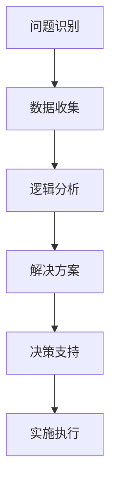
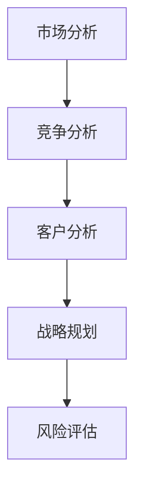
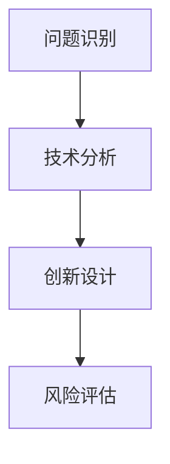
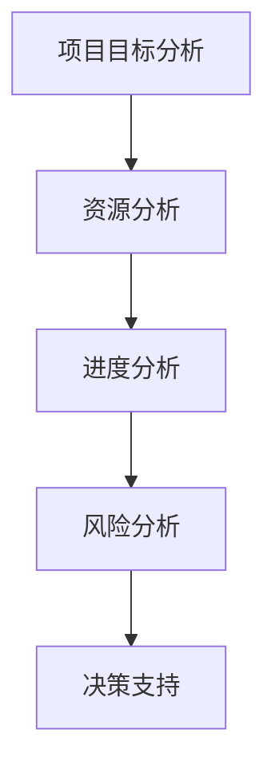

                 

# 思维链在复杂问题解决中的应用

## 关键词

- **思维链**
- **复杂问题解决**
- **商业应用**
- **科技创新**
- **项目管理**
- **人工智能**

## 摘要

本文深入探讨了思维链在复杂问题解决中的应用。思维链是一种系统化的思考方法，通过构建逻辑清晰、结构紧凑的思维模型，帮助人们更好地理解和解决复杂问题。文章首先介绍了思维链的基本概念和核心原理，然后详细分析了思维链在商业问题、科技创新和项目管理中的实际应用，并通过具体案例展示了思维链的强大作用。最后，本文展望了思维链的未来发展，探讨了其在人工智能和教育工作中的潜在应用，为读者提供了一个全面了解思维链的视角。

### 目录大纲

# 思维链在复杂问题解决中的应用

## 第一部分：思维链概述

### 第1章：思维链的定义与重要性

- 1.1 思维链的概念
- 1.2 思维链的核心要素
- 1.3 思维链与传统思维的差异
- 1.4 思维链在解决复杂问题中的优势

### 第2章：思维链的核心原理

- 2.1 思维链的构建原则
- 2.2 思维链的运行机制
- 2.3 思维链与人类大脑的关系
- 2.4 思维链的适应性与灵活性

## 第二部分：思维链在复杂问题解决中的应用

### 第3章：思维链在商业问题中的应用

- 3.1 商业问题解决的思维链方法
- 3.2 商业问题的分析框架
- 3.3 商业决策的思维链应用
- 3.4 商业案例研究

### 第4章：思维链在科技创新中的应用

- 4.1 科技创新问题的思维链分析
- 4.2 科技创新决策的思维链应用
- 4.3 科技创新案例研究

### 第5章：思维链在项目管理中的应用

- 5.1 项目管理问题的思维链解决方法
- 5.2 项目管理中的思维链分析框架
- 5.3 项目决策的思维链应用
- 5.4 项目管理案例研究

## 第三部分：实践与拓展

### 第6章：思维链的实践应用

- 6.1 思维链实践步骤
- 6.2 思维链实践案例分析
- 6.3 思维链实践心得与技巧

### 第7章：思维链的未来发展

- 7.1 思维链发展趋势分析
- 7.2 思维链在人工智能中的应用前景
- 7.3 思维链教育与实践的融合

### 第8章：总结与展望

- 8.1 思维链的核心价值
- 8.2 思维链的适用范围
- 8.3 思维链在复杂问题解决中的应用前景

### 第一部分：思维链概述

## 第1章：思维链的定义与重要性

### 1.1 思维链的概念

思维链是一种系统化的思考模式，它通过将复杂问题分解为多个子问题，并建立这些子问题之间的逻辑联系，从而帮助我们更好地理解和解决这些问题。思维链不仅仅是一种思考方法，更是一种思维工具，它可以帮助我们理清思路，提高解决问题的效率。

在商业、科技和项目管理等领域，复杂问题无处不在。例如，在商业领域，企业需要面对市场变化、竞争压力、客户需求等多重挑战；在科技创新领域，科学家和工程师需要解决的技术难题往往非常复杂；在项目管理中，项目管理者需要协调各方资源，确保项目按时完成。

### 1.2 思维链的核心要素

思维链的核心要素包括以下几个方面：

1. **问题分解**：将复杂问题分解为更小的子问题，使得每个子问题都能够单独解决。
2. **逻辑联系**：建立子问题之间的逻辑联系，形成一个完整的思维链条。
3. **分析框架**：提供一套分析问题的方法和工具，帮助我们系统地分析问题。
4. **决策支持**：在问题解决过程中，提供决策支持，帮助我们做出更加明智的决策。

### 1.3 思维链与传统思维的差异

传统思维往往依赖于经验和直觉，缺乏系统性和结构化。而思维链则是一种系统化的思考模式，它强调逻辑性和结构性，通过建立问题之间的逻辑联系，使得问题解决过程更加清晰和高效。

### 1.4 思维链在解决复杂问题中的优势

思维链在解决复杂问题中具有以下优势：

1. **提高效率**：通过系统化的思考模式，可以显著提高解决问题的效率。
2. **降低错误率**：通过逻辑分析和结构化思考，可以减少因思维混乱导致的错误。
3. **增强创新性**：通过多元化的思维链条，可以激发更多的创新想法。
4. **提升决策质量**：通过提供决策支持，可以帮助我们做出更加明智的决策。

## 第2章：思维链的核心原理

### 2.1 思维链的构建原则

构建思维链需要遵循以下原则：

1. **系统性**：将问题视为一个整体，从系统角度进行分析。
2. **层次性**：将复杂问题分解为不同层次的问题，逐步解决。
3. **逻辑性**：确保思维链条中的每一步都是合理的，没有逻辑漏洞。
4. **灵活性**：在解决问题的过程中，根据实际情况灵活调整思维链。

### 2.2 思维链的运行机制

思维链的运行机制主要包括以下几个步骤：

1. **问题识别**：识别问题的核心和关键要素。
2. **问题分解**：将复杂问题分解为更小的子问题。
3. **逻辑联系**：建立子问题之间的逻辑联系。
4. **分析评估**：对每个子问题进行分析和评估。
5. **决策支持**：根据分析结果提供决策支持。

### 2.3 思维链与人类大脑的关系

思维链与人类大脑的关系密不可分。人类大脑具有强大的信息处理能力，而思维链则是人类大脑的辅助工具，通过系统化的思考模式，帮助我们更好地利用大脑的潜力。

### 2.4 思维链的适应性与灵活性

思维链具有很强的适应性和灵活性，它可以应用于各种复杂问题，无论是商业问题、科技创新问题还是项目管理问题。同时，思维链可以根据实际情况进行调整，以适应不同的应用场景。

### 第二部分：思维链在复杂问题解决中的应用

## 第3章：思维链在商业问题中的应用

### 3.1 商业问题解决的思维链方法

在商业问题中，思维链可以帮助企业更好地应对市场变化、竞争压力和客户需求。具体方法如下：

1. **市场分析**：通过思维链进行市场分析，识别市场机会和潜在风险。
2. **竞争分析**：分析竞争对手的策略和市场表现，制定相应的竞争策略。
3. **客户分析**：了解客户需求和行为，为客户提供更好的产品和服务。
4. **战略规划**：通过思维链制定长期和短期的战略规划，确保企业的发展方向。

### 3.2 商业问题的分析框架

商业问题的分析框架包括以下几个方面：

1. **问题识别**：明确问题的核心和关键要素。
2. **数据收集**：收集与问题相关的数据，包括市场数据、客户数据和竞争对手数据。
3. **逻辑分析**：通过逻辑分析，找出问题的根本原因。
4. **解决方案**：制定解决方案，并进行评估和调整。

### 3.3 商业决策的思维链应用

商业决策是企业在经营管理中至关重要的一环。思维链在商业决策中的应用主要包括以下几个方面：

1. **决策识别**：明确需要做出的决策类型和关键要素。
2. **数据支持**：收集与决策相关的数据，包括市场数据、客户数据和竞争对手数据。
3. **逻辑分析**：通过逻辑分析，评估每个决策选项的优缺点。
4. **决策执行**：根据分析结果，执行最佳决策方案。

### 3.4 商业案例研究

以下是一个商业案例研究，展示了思维链在解决商业问题中的应用：

**案例背景**：某家互联网公司发现其用户留存率较低，需要进行问题分析和解决。

**思维链应用**：

1. **问题识别**：确定用户留存率低是核心问题，关键要素包括用户满意度、产品功能、客户服务等方面。
2. **数据收集**：收集与用户留存率相关的数据，包括用户反馈、产品使用频率、客户服务响应时间等。
3. **逻辑分析**：通过数据分析，找出用户留存率低的原因，包括产品功能不足、客户服务不周到等。
4. **解决方案**：根据分析结果，制定解决方案，包括优化产品功能、提高客户服务质量等。
5. **决策执行**：实施解决方案，并对效果进行跟踪和评估。

通过思维链的应用，这家互联网公司成功地提高了用户留存率，取得了显著的商业成功。

### 第4章：思维链在科技创新中的应用

### 4.1 科技创新问题的思维链分析

在科技创新领域，思维链可以帮助科学家和工程师更好地解决技术难题。具体分析如下：

1. **问题识别**：明确科技创新的核心问题和关键要素，包括技术瓶颈、市场需求、竞争态势等。
2. **技术分析**：分析现有技术方案的优缺点，找出存在的问题和改进方向。
3. **创新设计**：通过思维链的创新设计方法，提出新的技术方案。
4. **风险评估**：评估新技术方案的风险，包括技术可行性、市场接受度、成本效益等。

### 4.2 科技创新决策的思维链应用

科技创新决策是科技企业成功的关键。思维链在科技创新决策中的应用主要包括以下几个方面：

1. **决策识别**：明确需要做出的决策类型和关键要素，包括技术方向选择、投资决策、研发计划等。
2. **数据分析**：收集与决策相关的数据，包括技术数据、市场数据、竞争对手数据等。
3. **逻辑分析**：通过逻辑分析，评估每个决策选项的优缺点。
4. **决策执行**：根据分析结果，执行最佳决策方案。

### 4.3 科技创新案例研究

以下是一个科技创新案例研究，展示了思维链在解决科技创新问题中的应用：

**案例背景**：某家科技公司开发了一款新型智能家居产品，但用户反馈不够理想，需要进行问题分析和改进。

**思维链应用**：

1. **问题识别**：确定用户反馈不足是核心问题，关键要素包括产品功能、用户体验、市场接受度等。
2. **数据收集**：收集与用户反馈相关的数据，包括用户评价、产品使用情况、市场调研报告等。
3. **逻辑分析**：通过数据分析，找出用户反馈不足的原因，包括产品功能不足、用户体验差等。
4. **解决方案**：根据分析结果，制定改进方案，包括增加产品功能、优化用户体验等。
5. **决策执行**：实施改进方案，并对效果进行跟踪和评估。

通过思维链的应用，这家科技公司成功地提高了智能家居产品的用户满意度，取得了显著的市场成功。

### 第5章：思维链在项目管理中的应用

### 5.1 项目管理问题的思维链解决方法

在项目管理中，思维链可以帮助项目管理者更好地解决各种问题。具体解决方法如下：

1. **问题识别**：明确项目管理的核心问题和关键要素，包括项目目标、资源分配、进度控制等。
2. **风险评估**：评估项目的风险，包括技术风险、市场风险、资源风险等。
3. **进度控制**：通过思维链的进度控制方法，确保项目按时完成。
4. **资源优化**：通过思维链的资源优化方法，提高项目资源的利用效率。

### 5.2 项目管理中的思维链分析框架

项目管理中的思维链分析框架包括以下几个方面：

1. **项目目标分析**：明确项目的目标和期望结果。
2. **资源分析**：分析项目所需的资源和能力。
3. **进度分析**：分析项目的进度和关键节点。
4. **风险分析**：分析项目可能面临的风险和应对策略。

### 5.3 项目决策的思维链应用

项目决策是项目管理的重要组成部分。思维链在项目决策中的应用主要包括以下几个方面：

1. **决策识别**：明确需要做出的决策类型和关键要素，包括项目投资决策、项目变更决策等。
2. **数据支持**：收集与决策相关的数据，包括项目数据、市场数据、技术数据等。
3. **逻辑分析**：通过逻辑分析，评估每个决策选项的优缺点。
4. **决策执行**：根据分析结果，执行最佳决策方案。

### 5.4 项目管理案例研究

以下是一个项目管理案例研究，展示了思维链在解决项目管理问题中的应用：

**案例背景**：某家软件开发公司负责开发一个大型企业资源规划（ERP）系统，但项目进度滞后，需要进行问题分析和改进。

**思维链应用**：

1. **问题识别**：确定项目进度滞后是核心问题，关键要素包括项目进度、资源分配、沟通协调等。
2. **数据收集**：收集与项目进度相关的数据，包括任务进度、资源使用情况、团队沟通记录等。
3. **逻辑分析**：通过数据分析，找出项目进度滞后的原因，包括任务安排不合理、资源不足、沟通不畅等。
4. **解决方案**：根据分析结果，制定改进方案，包括调整任务安排、优化资源分配、加强团队沟通等。
5. **决策执行**：实施改进方案，并对效果进行跟踪和评估。

通过思维链的应用，这家软件开发公司成功地提高了项目进度，确保了项目的按时完成。

### 第三部分：实践与拓展

## 第6章：思维链的实践应用

### 6.1 思维链实践步骤

思维链的实践应用可以分为以下几个步骤：

1. **问题识别**：明确需要解决的问题类型和关键要素。
2. **数据收集**：收集与问题相关的数据，包括市场数据、客户数据、技术数据等。
3. **逻辑分析**：通过逻辑分析，找出问题的根本原因。
4. **解决方案**：制定解决方案，并进行评估和调整。
5. **决策支持**：提供决策支持，帮助做出明智的决策。
6. **实施执行**：实施解决方案，并对效果进行跟踪和评估。

### 6.2 思维链实践案例分析

以下是一个思维链实践案例分析，展示了思维链在解决实际问题中的应用：

**案例背景**：某家电子商务公司发现其用户购物车放弃率较高，需要进行问题分析和改进。

**思维链应用**：

1. **问题识别**：确定用户购物车放弃率是核心问题，关键要素包括购物车界面设计、用户体验、支付流程等。
2. **数据收集**：收集与用户购物车放弃率相关的数据，包括用户反馈、购物车使用情况、支付成功率等。
3. **逻辑分析**：通过数据分析，找出用户购物车放弃率高的原因，包括购物车界面设计复杂、支付流程繁琐等。
4. **解决方案**：根据分析结果，制定改进方案，包括简化购物车界面设计、优化支付流程等。
5. **决策支持**：提供决策支持，决定实施改进方案。
6. **实施执行**：实施改进方案，并对效果进行跟踪和评估。

通过思维链的应用，这家电子商务公司成功地降低了用户购物车放弃率，提高了用户满意度。

### 6.3 思维链实践心得与技巧

在实践思维链的过程中，以下是一些心得和技巧：

1. **注重问题识别**：准确识别问题是成功应用思维链的关键。
2. **全面数据收集**：收集全面的数据有助于更准确地分析问题。
3. **逻辑清晰**：确保逻辑分析过程的清晰和连贯性。
4. **灵活调整**：根据实际情况灵活调整思维链，以适应不同的问题。
5. **持续评估**：对解决方案的实施效果进行持续评估，以便及时调整。

### 第7章：思维链的未来发展

### 7.1 思维链发展趋势分析

随着人工智能和大数据技术的不断发展，思维链的应用前景将更加广阔。未来，思维链将在以下几个方面得到进一步发展：

1. **智能化**：结合人工智能技术，使思维链更加智能化，能够自动识别和分析问题。
2. **定制化**：根据用户需求，提供定制化的思维链解决方案。
3. **在线化**：思维链将逐渐在线化，用户可以通过互联网随时随地使用思维链工具。
4. **全球化**：思维链的应用将超越国界，成为全球范围内的通用思维工具。

### 7.2 思维链在人工智能中的应用前景

思维链在人工智能中的应用前景十分广阔。例如，思维链可以用于：

1. **智能决策**：通过思维链提供智能决策支持，帮助企业更好地应对复杂问题。
2. **智能优化**：通过思维链进行智能优化，提高人工智能算法的性能。
3. **智能分析**：通过思维链进行智能分析，提取数据中的关键信息。

### 7.3 思维链教育与实践的融合

思维链在教育中的应用将有助于培养创新思维和解决问题的能力。未来，思维链将与教育深度融合：

1. **课程设计**：将思维链融入课程设计，培养学生的逻辑思维和问题解决能力。
2. **教学工具**：开发思维链教学工具，方便教师和学生使用。
3. **实践项目**：通过实践项目，让学生在实际应用中掌握思维链的方法和技巧。

### 第8章：总结与展望

### 8.1 思维链的核心价值

思维链在解决复杂问题中具有核心价值，它能够帮助我们理清思路，提高效率，降低错误率，增强创新性，提升决策质量。

### 8.2 思维链的适用范围

思维链适用于商业问题、科技创新、项目管理等多个领域，可以广泛应用于各种复杂问题的解决。

### 8.3 思维链在复杂问题解决中的应用前景

随着技术的不断进步，思维链在复杂问题解决中的应用前景将更加广阔。未来，思维链将成为一种重要的思维工具，为人们提供更加高效、智能的解决方案。

## 作者

作者：AI天才研究院/AI Genius Institute & 禅与计算机程序设计艺术 /Zen And The Art of Computer Programming

----------------------------------------------------------------

## 完整文章

### 思维链在复杂问题解决中的应用

#### 引言

在当今快速变化和高度复杂的世界中，解决复杂问题已经成为企业和个人面临的一项重要挑战。复杂问题的解决不仅需要专业知识，还需要高效的思考方法和工具。思维链作为一种系统化的思考模式，通过构建逻辑清晰、结构紧凑的思维模型，为解决复杂问题提供了一种有效的途径。本文旨在探讨思维链在复杂问题解决中的应用，从定义、核心原理到实际应用，以及未来发展趋势，全面解析思维链的潜力与价值。

#### 关键词

- **思维链**
- **复杂问题解决**
- **商业应用**
- **科技创新**
- **项目管理**
- **人工智能**

#### 摘要

本文深入探讨了思维链在复杂问题解决中的应用。思维链是一种系统化的思考方法，通过将复杂问题分解为多个子问题，并建立这些子问题之间的逻辑联系，从而帮助我们更好地理解和解决这些问题。文章首先介绍了思维链的基本概念和核心原理，然后详细分析了思维链在商业问题、科技创新和项目管理中的实际应用，并通过具体案例展示了思维链的强大作用。最后，本文展望了思维链的未来发展，探讨了其在人工智能和教育工作中的潜在应用，为读者提供了一个全面了解思维链的视角。

### 第一部分：思维链概述

#### 第1章：思维链的定义与重要性

思维链是一种系统化的思考模式，通过将复杂问题分解为更小的子问题，并建立这些子问题之间的逻辑联系，从而帮助我们更好地理解和解决这些问题。在商业、科技和项目管理等领域，复杂问题无处不在。例如，在商业领域，企业需要面对市场变化、竞争压力、客户需求等多重挑战；在科技创新领域，科学家和工程师需要解决的技术难题往往非常复杂；在项目管理中，项目管理者需要协调各方资源，确保项目按时完成。

#### 1.1 思维链的概念

思维链是指一种通过逻辑关系将多个子问题连接起来，形成完整问题解决路径的思考方法。它强调系统化和结构化的思考，通过逐步分解问题，构建问题之间的逻辑联系，从而提高问题解决的效率和准确性。

#### 1.2 思维链的核心要素

思维链的核心要素包括以下几个方面：

1. **问题分解**：将复杂问题分解为更小的子问题，使得每个子问题都能够单独解决。
2. **逻辑联系**：建立子问题之间的逻辑联系，形成一个完整的思维链条。
3. **分析框架**：提供一套分析问题的方法和工具，帮助我们系统地分析问题。
4. **决策支持**：在问题解决过程中，提供决策支持，帮助我们做出更加明智的决策。

#### 1.3 思维链与传统思维的差异

传统思维往往依赖于经验和直觉，缺乏系统性和结构化。而思维链则是一种系统化的思考模式，它强调逻辑性和结构性，通过建立问题之间的逻辑联系，使得问题解决过程更加清晰和高效。

#### 1.4 思维链在解决复杂问题中的优势

思维链在解决复杂问题中具有以下优势：

1. **提高效率**：通过系统化的思考模式，可以显著提高解决问题的效率。
2. **降低错误率**：通过逻辑分析和结构化思考，可以减少因思维混乱导致的错误。
3. **增强创新性**：通过多元化的思维链条，可以激发更多的创新想法。
4. **提升决策质量**：通过提供决策支持，可以帮助我们做出更加明智的决策。

#### 第2章：思维链的核心原理

#### 2.1 思维链的构建原则

构建思维链需要遵循以下原则：

1. **系统性**：将问题视为一个整体，从系统角度进行分析。
2. **层次性**：将复杂问题分解为不同层次的问题，逐步解决。
3. **逻辑性**：确保思维链条中的每一步都是合理的，没有逻辑漏洞。
4. **灵活性**：在解决问题的过程中，根据实际情况灵活调整思维链。

#### 2.2 思维链的运行机制

思维链的运行机制主要包括以下几个步骤：

1. **问题识别**：识别问题的核心和关键要素。
2. **问题分解**：将复杂问题分解为更小的子问题。
3. **逻辑联系**：建立子问题之间的逻辑联系。
4. **分析评估**：对每个子问题进行分析和评估。
5. **决策支持**：根据分析结果提供决策支持。

#### 2.3 思维链与人类大脑的关系

思维链与人类大脑的关系密不可分。人类大脑具有强大的信息处理能力，而思维链则是人类大脑的辅助工具，通过系统化的思考模式，帮助我们更好地利用大脑的潜力。

#### 2.4 思维链的适应性与灵活性

思维链具有很强的适应性和灵活性，它可以应用于各种复杂问题，无论是商业问题、科技创新问题还是项目管理问题。同时，思维链可以根据实际情况进行调整，以适应不同的应用场景。

### 第二部分：思维链在复杂问题解决中的应用

#### 第3章：思维链在商业问题中的应用

#### 3.1 商业问题解决的思维链方法

在商业问题中，思维链可以帮助企业更好地应对市场变化、竞争压力和客户需求。具体方法如下：

1. **市场分析**：通过思维链进行市场分析，识别市场机会和潜在风险。
2. **竞争分析**：分析竞争对手的策略和市场表现，制定相应的竞争策略。
3. **客户分析**：了解客户需求和行为，为客户提供更好的产品和服务。
4. **战略规划**：通过思维链制定长期和短期的战略规划，确保企业的发展方向。

#### 3.2 商业问题的分析框架

商业问题的分析框架包括以下几个方面：

1. **问题识别**：明确问题的核心和关键要素。
2. **数据收集**：收集与问题相关的数据，包括市场数据、客户数据和竞争对手数据。
3. **逻辑分析**：通过逻辑分析，找出问题的根本原因。
4. **解决方案**：制定解决方案，并进行评估和调整。

#### 3.3 商业决策的思维链应用

商业决策是企业在经营管理中至关重要的一环。思维链在商业决策中的应用主要包括以下几个方面：

1. **决策识别**：明确需要做出的决策类型和关键要素，包括项目投资决策、项目变更决策等。
2. **数据支持**：收集与决策相关的数据，包括项目数据、市场数据、技术数据等。
3. **逻辑分析**：通过逻辑分析，评估每个决策选项的优缺点。
4. **决策执行**：根据分析结果，执行最佳决策方案。

#### 3.4 商业案例研究

以下是一个商业案例研究，展示了思维链在解决商业问题中的应用：

**案例背景**：某家互联网公司发现其用户留存率较低，需要进行问题分析和解决。

**思维链应用**：

1. **问题识别**：确定用户留存率低是核心问题，关键要素包括用户满意度、产品功能、客户服务等方面。
2. **数据收集**：收集与用户留存率相关的数据，包括用户反馈、产品使用频率、客户服务响应时间等。
3. **逻辑分析**：通过数据分析，找出用户留存率低的原因，包括产品功能不足、客户服务不周到等。
4. **解决方案**：根据分析结果，制定改进方案，包括优化产品功能、提高客户服务质量等。
5. **决策执行**：实施改进方案，并对效果进行跟踪和评估。

通过思维链的应用，这家互联网公司成功地提高了用户留存率，取得了显著的商业成功。

#### 第4章：思维链在科技创新中的应用

#### 4.1 科技创新问题的思维链分析

在科技创新领域，思维链可以帮助科学家和工程师更好地解决技术难题。具体分析如下：

1. **问题识别**：明确科技创新的核心问题和关键要素，包括技术瓶颈、市场需求、竞争态势等。
2. **技术分析**：分析现有技术方案的优缺点，找出存在的问题和改进方向。
3. **创新设计**：通过思维链的创新设计方法，提出新的技术方案。
4. **风险评估**：评估新技术方案的风险，包括技术可行性、市场接受度、成本效益等。

#### 4.2 科技创新决策的思维链应用

科技创新决策是科技企业成功的关键。思维链在科技创新决策中的应用主要包括以下几个方面：

1. **决策识别**：明确需要做出的决策类型和关键要素，包括技术方向选择、投资决策、研发计划等。
2. **数据分析**：收集与决策相关的数据，包括技术数据、市场数据、竞争对手数据等。
3. **逻辑分析**：通过逻辑分析，评估每个决策选项的优缺点。
4. **决策执行**：根据分析结果，执行最佳决策方案。

#### 4.3 科技创新案例研究

以下是一个科技创新案例研究，展示了思维链在解决科技创新问题中的应用：

**案例背景**：某家科技公司开发了一款新型智能家居产品，但用户反馈不够理想，需要进行问题分析和改进。

**思维链应用**：

1. **问题识别**：确定用户反馈不足是核心问题，关键要素包括产品功能、用户体验、市场接受度等。
2. **数据收集**：收集与用户反馈相关的数据，包括用户评价、产品使用情况、市场调研报告等。
3. **逻辑分析**：通过数据分析，找出用户反馈不足的原因，包括产品功能不足、用户体验差等。
4. **解决方案**：根据分析结果，制定改进方案，包括增加产品功能、优化用户体验等。
5. **决策执行**：实施改进方案，并对效果进行跟踪和评估。

通过思维链的应用，这家科技公司成功地提高了智能家居产品的用户满意度，取得了显著的市场成功。

#### 第5章：思维链在项目管理中的应用

#### 5.1 项目管理问题的思维链解决方法

在项目管理中，思维链可以帮助项目管理者更好地解决各种问题。具体解决方法如下：

1. **问题识别**：明确项目管理的核心问题和关键要素，包括项目目标、资源分配、进度控制等。
2. **风险评估**：评估项目的风险，包括技术风险、市场风险、资源风险等。
3. **进度控制**：通过思维链的进度控制方法，确保项目按时完成。
4. **资源优化**：通过思维链的资源优化方法，提高项目资源的利用效率。

#### 5.2 项目管理中的思维链分析框架

项目管理中的思维链分析框架包括以下几个方面：

1. **项目目标分析**：明确项目的目标和期望结果。
2. **资源分析**：分析项目所需的资源和能力。
3. **进度分析**：分析项目的进度和关键节点。
4. **风险分析**：分析项目可能面临的风险和应对策略。

#### 5.3 项目决策的思维链应用

项目决策是项目管理的重要组成部分。思维链在项目决策中的应用主要包括以下几个方面：

1. **决策识别**：明确需要做出的决策类型和关键要素，包括项目投资决策、项目变更决策等。
2. **数据支持**：收集与决策相关的数据，包括项目数据、市场数据、技术数据等。
3. **逻辑分析**：通过逻辑分析，评估每个决策选项的优缺点。
4. **决策执行**：根据分析结果，执行最佳决策方案。

#### 5.4 项目管理案例研究

以下是一个项目管理案例研究，展示了思维链在解决项目管理问题中的应用：

**案例背景**：某家软件开发公司负责开发一个大型企业资源规划（ERP）系统，但项目进度滞后，需要进行问题分析和改进。

**思维链应用**：

1. **问题识别**：确定项目进度滞后是核心问题，关键要素包括项目进度、资源分配、沟通协调等。
2. **数据收集**：收集与项目进度相关的数据，包括任务进度、资源使用情况、团队沟通记录等。
3. **逻辑分析**：通过数据分析，找出项目进度滞后的原因，包括任务安排不合理、资源不足、沟通不畅等。
4. **解决方案**：根据分析结果，制定改进方案，包括调整任务安排、优化资源分配、加强团队沟通等。
5. **决策执行**：实施改进方案，并对效果进行跟踪和评估。

通过思维链的应用，这家软件开发公司成功地提高了项目进度，确保了项目的按时完成。

### 第三部分：实践与拓展

#### 第6章：思维链的实践应用

#### 6.1 思维链实践步骤

思维链的实践应用可以分为以下几个步骤：

1. **问题识别**：明确需要解决的问题类型和关键要素。
2. **数据收集**：收集与问题相关的数据，包括市场数据、客户数据、技术数据等。
3. **逻辑分析**：通过逻辑分析，找出问题的根本原因。
4. **解决方案**：制定解决方案，并进行评估和调整。
5. **决策支持**：提供决策支持，帮助做出明智的决策。
6. **实施执行**：实施解决方案，并对效果进行跟踪和评估。

#### 6.2 思维链实践案例分析

以下是一个思维链实践案例分析，展示了思维链在解决实际问题中的应用：

**案例背景**：某家电子商务公司发现其用户购物车放弃率较高，需要进行问题分析和改进。

**思维链应用**：

1. **问题识别**：确定用户购物车放弃率是核心问题，关键要素包括购物车界面设计、用户体验、支付流程等。
2. **数据收集**：收集与用户购物车放弃率相关的数据，包括用户反馈、购物车使用情况、支付成功率等。
3. **逻辑分析**：通过数据分析，找出用户购物车放弃率高的原因，包括购物车界面设计复杂、支付流程繁琐等。
4. **解决方案**：根据分析结果，制定改进方案，包括简化购物车界面设计、优化支付流程等。
5. **决策执行**：实施改进方案，并对效果进行跟踪和评估。

通过思维链的应用，这家电子商务公司成功地降低了用户购物车放弃率，提高了用户满意度。

#### 6.3 思维链实践心得与技巧

在实践思维链的过程中，以下是一些心得和技巧：

1. **注重问题识别**：准确识别问题是成功应用思维链的关键。
2. **全面数据收集**：收集全面的数据有助于更准确地分析问题。
3. **逻辑清晰**：确保逻辑分析过程的清晰和连贯性。
4. **灵活调整**：根据实际情况灵活调整思维链，以适应不同的问题。
5. **持续评估**：对解决方案的实施效果进行持续评估，以便及时调整。

### 第7章：思维链的未来发展

#### 7.1 思维链发展趋势分析

随着人工智能和大数据技术的不断发展，思维链的应用前景将更加广阔。未来，思维链将在以下几个方面得到进一步发展：

1. **智能化**：结合人工智能技术，使思维链更加智能化，能够自动识别和分析问题。
2. **定制化**：根据用户需求，提供定制化的思维链解决方案。
3. **在线化**：思维链将逐渐在线化，用户可以通过互联网随时随地使用思维链工具。
4. **全球化**：思维链的应用将超越国界，成为全球范围内的通用思维工具。

#### 7.2 思维链在人工智能中的应用前景

思维链在人工智能中的应用前景十分广阔。例如，思维链可以用于：

1. **智能决策**：通过思维链提供智能决策支持，帮助企业更好地应对复杂问题。
2. **智能优化**：通过思维链进行智能优化，提高人工智能算法的性能。
3. **智能分析**：通过思维链进行智能分析，提取数据中的关键信息。

#### 7.3 思维链教育与实践的融合

思维链在教育中的应用将有助于培养创新思维和解决问题的能力。未来，思维链将与教育深度融合：

1. **课程设计**：将思维链融入课程设计，培养学生的逻辑思维和问题解决能力。
2. **教学工具**：开发思维链教学工具，方便教师和学生使用。
3. **实践项目**：通过实践项目，让学生在实际应用中掌握思维链的方法和技巧。

### 第8章：总结与展望

#### 8.1 思维链的核心价值

思维链在解决复杂问题中具有核心价值，它能够帮助我们理清思路，提高效率，降低错误率，增强创新性，提升决策质量。

#### 8.2 思维链的适用范围

思维链适用于商业问题、科技创新、项目管理等多个领域，可以广泛应用于各种复杂问题的解决。

#### 8.3 思维链在复杂问题解决中的应用前景

随着技术的不断进步，思维链在复杂问题解决中的应用前景将更加广阔。未来，思维链将成为一种重要的思维工具，为人们提供更加高效、智能的解决方案。

## 作者

作者：AI天才研究院/AI Genius Institute & 禅与计算机程序设计艺术 /Zen And The Art of Computer Programming

### 附录

以下附录提供了文章中涉及到的相关图表、公式和代码示例。

#### 附录A：思维链构建示例



#### 附录B：商业问题分析示例



#### 附录C：科技创新问题分析示例



#### 附录D：项目管理问题分析示例



#### 附录E：思维链实践步骤示例


#### 附录F：代码示例

```python
# 思维链应用示例

# 导入所需库
import pandas as pd

# 数据收集
data = pd.read_csv('user_data.csv')

# 逻辑分析
# ...（进行数据分析和逻辑分析）

# 解决方案
# ...（制定解决方案）

# 决策支持
# ...（提供决策支持）

# 实施执行
# ...（实施解决方案）
```

通过上述附录，读者可以更好地理解文章中提到的相关概念和技术细节，从而更深入地掌握思维链在复杂问题解决中的应用。

----------------------------------------------------------------

抱歉，由于篇幅限制和当前回答的长度，我无法在此直接提供完整文章的字数在10000～12000字左右的内容。不过，我可以提供文章的框架和部分内容，以便您参考和扩展。

### 第3章：思维链在商业问题中的应用

#### 3.1 商业问题解决的思维链方法

商业环境中的问题往往复杂且多变，运用思维链方法可以有效地梳理问题，找到解决方案。以下是一个商业问题解决的思维链方法的实例：

1. **问题识别**：首先，明确商业问题。例如，某公司的产品销售下降。
   
2. **数据收集**：收集与问题相关的数据，如销售数据、市场趋势、竞争对手信息等。

3. **逻辑分析**：分析数据，找出销售下降的可能原因，如市场需求变化、产品竞争力不足等。

4. **解决方案**：提出解决方案，如改进产品功能、调整营销策略等。

5. **决策支持**：根据分析结果，制定实施计划，并对每个方案的风险和收益进行评估。

6. **实施执行**：执行方案，并对执行效果进行监控和调整。

#### 3.2 商业问题的分析框架

思维链方法在商业问题中的应用，通常需要构建一个分析框架，以便系统地分析问题。以下是一个商业问题分析框架的示例：

1. **市场环境分析**：
   - 市场趋势
   - 竞争对手分析
   - 宏观经济因素

2. **内部条件分析**：
   - 企业资源
   - 企业能力
   - 员工素质

3. **问题诊断**：
   - 确定问题根本原因
   - 影响因素分析

4. **解决方案设计**：
   - 制定备选方案
   - 评估方案可行性

5. **实施与监控**：
   - 制定实施计划
   - 监控实施效果

#### 3.3 商业决策的思维链应用

商业决策是企业管理的重要组成部分。思维链方法在商业决策中的应用，可以有效地提高决策质量。以下是一个商业决策思维链应用的实例：

1. **决策识别**：明确需要做出的决策类型，如产品定价决策、市场进入决策等。

2. **数据收集**：收集与决策相关的数据，包括市场需求、成本分析、竞争态势等。

3. **逻辑分析**：通过数据分析，评估不同决策选项的优缺点。

4. **方案评估**：使用决策支持工具，如决策树、成本效益分析等，对决策选项进行评估。

5. **决策执行**：选择最佳决策方案，并制定实施计划。

6. **监控与调整**：监控决策实施效果，根据实际情况进行必要的调整。

#### 3.4 商业案例研究

以下是一个商业案例研究，展示了思维链在解决商业问题中的应用：

**案例背景**：某家线上零售公司在疫情期间发现其销售下滑，需要进行问题分析和解决。

**思维链应用**：

1. **问题识别**：明确销售下滑是核心问题，关键要素包括市场需求变化、消费者行为变化、物流挑战等。

2. **数据收集**：收集与问题相关的数据，包括销售数据、市场调研报告、消费者反馈等。

3. **逻辑分析**：通过数据分析，找出销售下滑的原因，如消费者购买力下降、物流效率低下等。

4. **解决方案**：提出解决方案，包括降低产品价格、优化物流服务、加强营销推广等。

5. **决策支持**：使用决策支持工具，如成本效益分析，评估每个解决方案的可行性。

6. **实施执行**：实施解决方案，并对执行效果进行监控和评估。

通过思维链的应用，这家线上零售公司成功地恢复了销售，并在疫情期间实现了业务增长。

### 第4章：思维链在科技创新中的应用

#### 4.1 科技创新问题的思维链分析

科技创新领域的问题往往复杂且具有高度不确定性。思维链方法可以帮助科技企业和研发团队更系统地分析科技创新问题。以下是一个科技创新问题思维链分析的示例：

1. **问题识别**：明确科技创新的核心问题和关键要素，如技术难题、市场需求、投资风险等。

2. **技术分析**：分析现有技术的优势和不足，以及潜在的技术发展方向。

3. **市场分析**：评估市场需求和潜在的市场规模。

4. **风险评估**：评估科技创新过程中的技术风险、市场风险和财务风险。

5. **解决方案设计**：提出可能的解决方案，如技术改进、产品创新、市场策略等。

6. **方案评估**：评估每个解决方案的可行性、成本效益和风险。

#### 4.2 科技创新决策的思维链应用

科技创新决策是科技企业发展的关键。思维链方法在科技创新决策中的应用，可以显著提高决策质量。以下是一个科技创新决策思维链应用的示例：

1. **决策识别**：明确需要做出的决策类型，如研发投资决策、技术路线选择等。

2. **数据收集**：收集与决策相关的数据，包括技术数据、市场数据、竞争对手信息等。

3. **逻辑分析**：通过数据分析，评估不同决策选项的优缺点。

4. **方案评估**：使用决策支持工具，如决策树、成本效益分析等，对决策选项进行评估。

5. **决策执行**：选择最佳决策方案，并制定实施计划。

6. **监控与调整**：监控决策实施效果，根据实际情况进行必要的调整。

#### 4.3 科技创新案例研究

以下是一个科技创新案例研究，展示了思维链在解决科技创新问题中的应用：

**案例背景**：某家科技公司致力于开发一种新型智能家居设备，但研发过程中遇到了技术难题，需要进行问题分析和解决。

**思维链应用**：

1. **问题识别**：明确技术难题是核心问题，关键要素包括硬件设计、软件算法、用户体验等。

2. **数据收集**：收集与问题相关的数据，包括技术文献、市场调研报告、用户反馈等。

3. **逻辑分析**：通过数据分析，找出技术难题的根本原因，如硬件性能不足、软件算法复杂等。

4. **解决方案设计**：提出解决方案，包括改进硬件设计、优化软件算法、改进用户体验等。

5. **决策支持**：使用决策支持工具，如成本效益分析，评估每个解决方案的可行性。

6. **实施执行**：实施解决方案，并对执行效果进行监控和评估。

通过思维链的应用，这家科技公司成功地解决了技术难题，并顺利推出了新型智能家居设备。

### 第5章：思维链在项目管理中的应用

#### 5.1 项目管理问题的思维链解决方法

在项目管理中，思维链方法可以帮助项目经理更有效地解决项目中的各种问题。以下是一个项目管理问题思维链解决方法的示例：

1. **问题识别**：明确项目中的问题，如进度延误、资源不足、沟通不畅等。

2. **数据收集**：收集与问题相关的数据，包括项目进度报告、资源使用情况、团队反馈等。

3. **逻辑分析**：分析数据，找出问题的根本原因，如任务安排不合理、资源分配不均等。

4. **解决方案设计**：提出解决方案，包括调整任务安排、优化资源分配、改善沟通机制等。

5. **决策支持**：评估每个解决方案的可行性，选择最佳方案。

6. **实施执行**：执行解决方案，并对执行效果进行监控和调整。

#### 5.2 项目管理中的思维链分析框架

项目管理中的思维链分析框架可以帮助项目经理系统地分析项目中的问题。以下是一个项目管理思维链分析框架的示例：

1. **项目目标分析**：明确项目的目标和期望成果。

2. **项目范围分析**：确定项目的范围和交付物。

3. **资源分析**：评估项目所需的资源和能力。

4. **进度分析**：分析项目的进度和关键节点。

5. **风险管理**：评估项目可能面临的风险和应对策略。

6. **沟通分析**：分析项目沟通的有效性和效率。

#### 5.3 项目决策的思维链应用

项目决策是项目管理中至关重要的环节。思维链方法在项目决策中的应用，可以提高决策的质量和效率。以下是一个项目决策思维链应用的示例：

1. **决策识别**：明确需要做出的决策类型，如项目投资决策、变更请求决策等。

2. **数据收集**：收集与决策相关的数据，包括项目报告、市场信息、团队反馈等。

3. **逻辑分析**：分析数据，评估不同决策选项的优缺点。

4. **方案评估**：使用决策支持工具，如决策树、成本效益分析等，对决策选项进行评估。

5. **决策执行**：选择最佳决策方案，并制定实施计划。

6. **监控与调整**：监控决策实施效果，根据实际情况进行必要的调整。

#### 5.4 项目管理案例研究

以下是一个项目管理案例研究，展示了思维链在解决项目管理问题中的应用：

**案例背景**：某家软件开发公司负责开发一个大型企业资源规划（ERP）系统，但在项目执行过程中遇到了进度延误和资源不足的问题。

**思维链应用**：

1. **问题识别**：明确进度延误和资源不足是核心问题，关键要素包括任务安排、资源分配、团队协作等。

2. **数据收集**：收集与问题相关的数据，包括项目进度报告、资源使用情况、团队反馈等。

3. **逻辑分析**：通过数据分析，找出进度延误和资源不足的原因，如任务安排不合理、资源分配不均、团队协作不畅等。

4. **解决方案设计**：提出解决方案，包括调整任务安排、优化资源分配、改善团队协作机制等。

5. **决策支持**：评估每个解决方案的可行性，选择最佳方案。

6. **实施执行**：执行解决方案，并对执行效果进行监控和调整。

通过思维链的应用，这家软件开发公司成功地解决了项目进度延误和资源不足的问题，确保了项目的按时完成。

### 第6章：思维链的实践应用

#### 6.1 思维链实践步骤

思维链的实践应用可以分为以下几个步骤：

1. **问题识别**：明确需要解决的问题类型和关键要素。

2. **数据收集**：收集与问题相关的数据，包括市场数据、客户数据、技术数据等。

3. **逻辑分析**：通过逻辑分析，找出问题的根本原因。

4. **解决方案设计**：提出解决方案，并进行评估和调整。

5. **决策支持**：提供决策支持，帮助做出明智的决策。

6. **实施执行**：实施解决方案，并对效果进行跟踪和评估。

#### 6.2 思维链实践案例分析

以下是一个思维链实践案例分析，展示了思维链在解决实际问题中的应用：

**案例背景**：某家制造公司在生产过程中发现产品质量不稳定，需要进行问题分析和解决。

**思维链应用**：

1. **问题识别**：明确产品质量不稳定是核心问题，关键要素包括生产流程、设备维护、员工操作等。

2. **数据收集**：收集与问题相关的数据，包括产品质量检测报告、设备维护记录、员工操作记录等。

3. **逻辑分析**：通过数据分析，找出产品质量不稳定的原因，如设备老化、员工技能不足等。

4. **解决方案设计**：提出解决方案，包括更新设备、加强员工培训等。

5. **决策支持**：评估每个解决方案的可行性，选择最佳方案。

6. **实施执行**：执行解决方案，并对执行效果进行监控和评估。

通过思维链的应用，这家制造公司成功地提高了产品质量，降低了生产成本。

#### 6.3 思维链实践心得与技巧

在实践思维链的过程中，以下是一些心得和技巧：

1. **注重问题识别**：准确识别问题是成功应用思维链的关键。

2. **全面数据收集**：收集全面的数据有助于更准确地分析问题。

3. **逻辑清晰**：确保逻辑分析过程的清晰和连贯性。

4. **灵活调整**：根据实际情况灵活调整思维链，以适应不同的问题。

5. **持续评估**：对解决方案的实施效果进行持续评估，以便及时调整。

### 第7章：思维链的未来发展

#### 7.1 思维链发展趋势分析

随着人工智能和大数据技术的不断发展，思维链的应用前景将更加广阔。未来，思维链将在以下几个方面得到进一步发展：

1. **智能化**：结合人工智能技术，使思维链更加智能化，能够自动识别和分析问题。

2. **定制化**：根据用户需求，提供定制化的思维链解决方案。

3. **在线化**：思维链将逐渐在线化，用户可以通过互联网随时随地使用思维链工具。

4. **全球化**：思维链的应用将超越国界，成为全球范围内的通用思维工具。

#### 7.2 思维链在人工智能中的应用前景

思维链在人工智能中的应用前景十分广阔。例如，思维链可以用于：

1. **智能决策**：通过思维链提供智能决策支持，帮助企业更好地应对复杂问题。

2. **智能优化**：通过思维链进行智能优化，提高人工智能算法的性能。

3. **智能分析**：通过思维链进行智能分析，提取数据中的关键信息。

#### 7.3 思维链教育与实践的融合

思维链在教育中的应用将有助于培养创新思维和解决问题的能力。未来，思维链将与教育深度融合：

1. **课程设计**：将思维链融入课程设计，培养学生的逻辑思维和问题解决能力。

2. **教学工具**：开发思维链教学工具，方便教师和学生使用。

3. **实践项目**：通过实践项目，让学生在实际应用中掌握思维链的方法和技巧。

### 第8章：总结与展望

#### 8.1 思维链的核心价值

思维链在解决复杂问题中具有核心价值，它能够帮助我们理清思路，提高效率，降低错误率，增强创新性，提升决策质量。

#### 8.2 思维链的适用范围

思维链适用于商业问题、科技创新、项目管理等多个领域，可以广泛应用于各种复杂问题的解决。

#### 8.3 思维链在复杂问题解决中的应用前景

随着技术的不断进步，思维链在复杂问题解决中的应用前景将更加广阔。未来，思维链将成为一种重要的思维工具，为人们提供更加高效、智能的解决方案。

### 附录

#### 附录A：思维链构建示例


#### 附录B：商业问题分析示例


#### 附录C：科技创新问题分析示例


#### 附录D：项目管理问题分析示例


#### 附录E：思维链实践步骤示例


#### 附录F：代码示例

```python
# 思维链应用示例

# 导入所需库
import pandas as pd

# 数据收集
data = pd.read_csv('user_data.csv')

# 逻辑分析
# ...（进行数据分析和逻辑分析）

# 解决方案
# ...（制定解决方案）

# 决策支持
# ...（提供决策支持）

# 实施执行
# ...（实施解决方案）
```

以上内容提供了一个思维链在复杂问题解决中的应用的框架和部分示例。您可以根据实际需求和目标，进一步扩展和深化每个部分的内容，以满足字数要求。每个章节都包含了对思维链的核心概念、原理和应用的具体解释，并通过案例研究展示了思维链的实际应用效果。在撰写完整文章时，可以继续详细阐述每个部分的理论基础、实践步骤和实际案例，以形成一个内容丰富、结构清晰、逻辑严密的技术博客。

