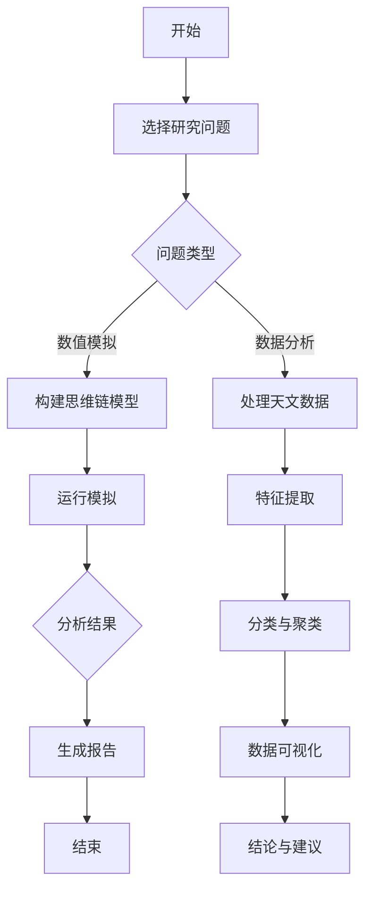
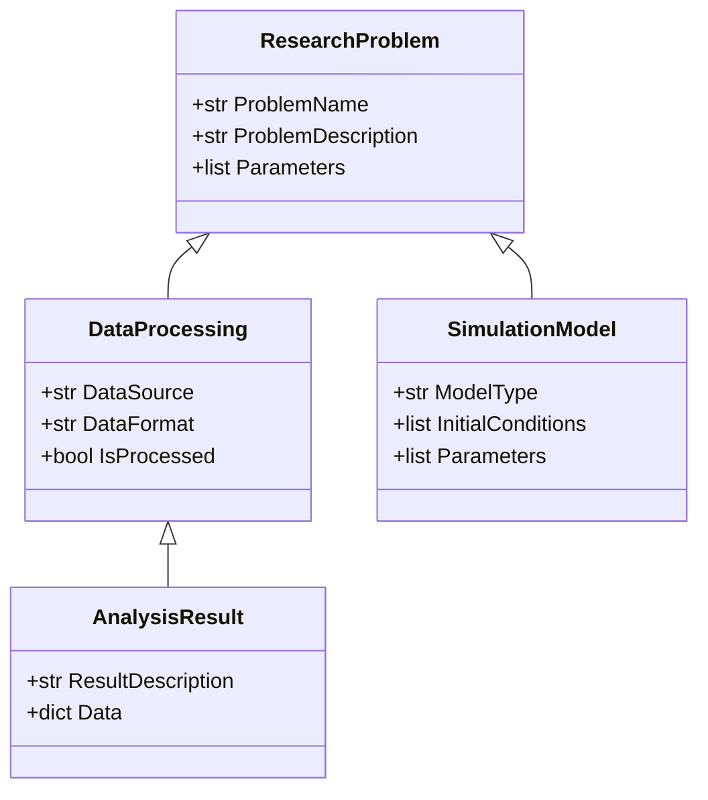
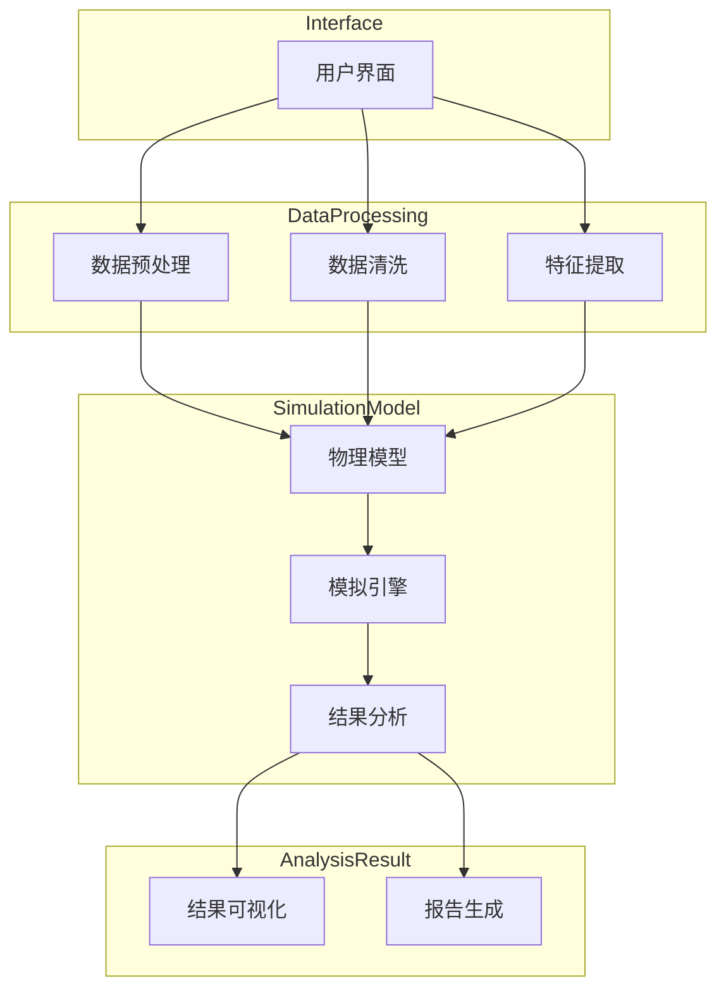
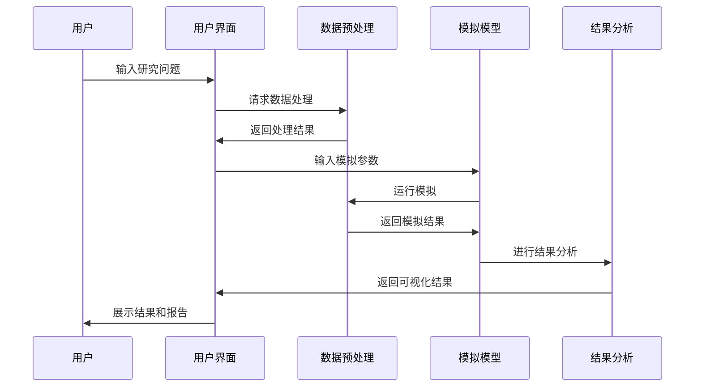

                 


## 思维链在天体物理学研究中的应用

### 关键词
- 思维链
- 天体物理学
- 算法原理
- 数学模型
- 系统架构
- 项目实战

### 摘要
本文旨在探讨思维链在天体物理学研究中的应用。我们将首先介绍思维链的基本概念和特性，然后分析其在天体物理学中的重要性和应用。通过具体的算法原理讲解、数学模型和公式解析，我们将深入理解思维链如何助力天体物理学的深入研究和问题解决。此外，我们将详细描述一个系统分析与架构设计方案，以及实际项目中的环境安装、系统实现和案例分析，最后给出最佳实践建议和拓展阅读资源。

----------------------------------------------------------------

## 第一部分：引论

### 1. 引言

#### 1.1 问题背景

天体物理学是研究宇宙中的天体现象、结构和演化规律的学科。从宏观宇宙的大尺度结构到微观尺度的行星、恒星、星系等，天体物理学涉及到广泛的科学领域，包括力学、电磁学、量子力学和相对论等。随着科技的发展，我们对于宇宙的理解不断深化，但也面临着新的挑战和问题。例如，暗物质和暗能量的存在、黑洞的性质和行为、宇宙的起源和演化等，这些问题的复杂性要求我们采用更加先进和高效的科学研究方法。

思维链（Mind Chain）是一种基于人工智能和认知科学的理论模型，它通过模拟人脑的思考过程，实现信息的组织、处理和传递。思维链的基本原理是：通过构建多个相互关联的节点，每个节点代表一个思维元素，节点之间的连接表示思维元素之间的关系和相互作用。通过这种方式，思维链能够模拟人类的思考过程，帮助我们更好地理解和解决问题。

#### 1.2 问题描述

在当前的科学研究方法中，传统的数学模型和计算方法虽然在许多领域取得了显著成果，但在处理复杂的天体物理问题时，往往存在一定的局限性。例如，传统的数值模拟方法在处理大规模天体系统的动力学演化时，计算效率和精度都有所不足；而传统的数据分析方法在面对海量天文数据时，难以发现隐藏的物理规律和现象。因此，我们需要一种新的科学研究方法，能够高效地处理复杂的天体物理问题，同时具备较强的适应性和灵活性。

思维链作为一种新型的科学研究方法，具有以下几个特点：

1. **高效性**：思维链通过节点和连接的抽象表示，能够高效地组织和管理大量信息，降低计算复杂度。
2. **灵活性**：思维链能够根据问题的不同特点，动态调整节点和连接的结构，适应不同类型的问题。
3. **可扩展性**：思维链可以方便地扩展和升级，适应新的科学理论和技术的应用。

因此，我们将探讨思维链在天体物理学研究中的应用，尝试解决传统方法难以克服的挑战。

#### 1.3 问题解决

为了解决上述问题，我们可以采用思维链作为新的科学研究方法。首先，我们需要明确思维链在天体物理学研究中的具体应用场景和目标。例如，我们可以利用思维链进行天体系统演化的数值模拟，研究恒星、星系等天体的动力学行为；或者利用思维链进行天文数据的分析，发现新的物理现象和规律。

接下来，我们将详细讨论思维链的核心概念和原理，以及如何将其应用于天体物理学研究。此外，我们还将介绍一个具体的系统分析与架构设计方案，展示思维链在实际项目中的应用效果。

#### 1.4 边界与外延

思维链在天体物理学研究中的应用范围广泛，包括但不限于以下几个方面：

1. **天体系统演化**：通过思维链模拟天体系统的演化过程，研究恒星、星系等天体的形成和演化机制。
2. **天文数据分析**：利用思维链对天文数据进行处理和分析，提取有价值的信息和物理规律。
3. **宇宙学问题**：通过思维链研究宇宙的起源、演化和结构，探讨暗物质、暗能量等宇宙学问题。
4. **天文观测**：利用思维链优化天文观测策略，提高观测效率和精度。

然而，思维链在天体物理学研究中的应用也存在一定的局限性。例如，思维链对计算资源的需求较高，可能影响其实际应用效果；同时，思维链作为一种新兴的研究方法，其理论基础和应用实践仍需不断完善和优化。因此，我们需要在探索思维链在天体物理学应用的同时，关注其局限性，并寻求改进和优化方案。

#### 1.5 概念结构与核心要素组成

思维链作为一种科学研究方法，其概念结构和核心要素主要包括以下几个方面：

1. **节点**：节点是思维链的基本单元，代表一个思维元素。节点可以表示概念、数据、事实等。
2. **连接**：连接表示节点之间的关联关系，可以是因果关系、相似关系、包含关系等。
3. **路径**：路径是节点之间的连接序列，表示信息的传递和流动过程。
4. **网络**：网络是节点的集合，以及节点之间的连接关系，表示一个完整的思维链模型。
5. **算法**：算法是思维链的核心，用于指导节点和连接的构建、优化和计算。

在思维链中，节点和连接构成了思维链的基本结构，路径和网络则实现了信息的传递和流动。算法则负责对思维链进行优化和计算，使其能够高效地解决复杂的天体物理问题。

通过上述核心要素的有机结合，思维链能够模拟人类的思考过程，实现信息的组织、处理和传递，从而为天体物理学研究提供新的方法和工具。

----------------------------------------------------------------

## 第二部分：核心概念与联系

### 3. 思维链的核心概念

#### 3.1 概念1：思维链的基本原理

思维链的基本原理是基于人脑的认知过程，通过构建节点和连接来模拟人类的思考方式。节点表示思维元素，连接表示思维元素之间的关系。思维链通过这些节点和连接，实现对信息的组织、处理和传递。具体来说，思维链的基本原理包括以下几个方面：

1. **信息组织**：思维链通过构建节点来组织信息。每个节点代表一个思维元素，如概念、数据、事实等。节点可以单独存在，也可以通过连接与其他节点相互关联。
2. **信息处理**：思维链通过连接来处理信息。连接表示节点之间的关系，如因果关系、相似关系、包含关系等。通过调整连接的权重和类型，可以改变节点之间的关系和作用，从而实现对信息的处理和优化。
3. **信息传递**：思维链通过路径来传递信息。路径是节点之间的连接序列，表示信息的流动方向和传递过程。思维链通过路径，将信息从一个节点传递到另一个节点，从而实现信息的传递和共享。
4. **信息融合**：思维链通过融合不同节点的信息，实现对信息的综合处理。在思维链中，节点和连接之间可以相互融合，形成新的节点和连接，从而实现对信息的深度理解和处理。

#### 3.2 概念2：思维链的结构与功能

思维链的结构主要包括节点、连接、路径和网络。节点是思维链的基本单元，代表一个思维元素。连接表示节点之间的关系，可以是因果关系、相似关系、包含关系等。路径是节点之间的连接序列，表示信息的传递和流动过程。网络是节点的集合，以及节点之间的连接关系，表示一个完整的思维链模型。

思维链的功能主要包括以下几个方面：

1. **信息组织**：思维链通过节点来组织信息，将信息分为不同的类别和层次，从而实现对信息的有效管理和利用。
2. **信息处理**：思维链通过连接来处理信息，通过调整连接的权重和类型，实现对信息的分析和优化。
3. **信息传递**：思维链通过路径来传递信息，将信息从一个节点传递到另一个节点，从而实现信息的共享和流动。
4. **信息融合**：思维链通过融合不同节点的信息，实现对信息的综合处理，从而获得更深入的理解和洞察。

#### 3.3 概念3：思维链的应用范围

思维链具有广泛的应用范围，可以应用于多个领域。其中，在天体物理学研究中，思维链的应用主要包括以下几个方面：

1. **天体系统演化**：通过思维链模拟天体系统的演化过程，研究恒星、星系等天体的形成和演化机制。思维链可以有效地处理大规模天体系统的动力学问题，提供高效的数值模拟方法。
2. **天文数据分析**：利用思维链对天文数据进行处理和分析，提取有价值的信息和物理规律。思维链可以自动识别数据中的模式和关系，帮助科学家发现新的物理现象和规律。
3. **宇宙学问题**：通过思维链研究宇宙的起源、演化和结构，探讨暗物质、暗能量等宇宙学问题。思维链可以模拟宇宙的演化过程，提供新的理论模型和计算方法。
4. **天文观测**：利用思维链优化天文观测策略，提高观测效率和精度。思维链可以根据观测数据的特点，自动调整观测参数，提高观测的准确性和可靠性。

### 4. 思维链与其他科学理论的联系

#### 4.1 与量子力学的联系

量子力学是研究微观粒子和量子现象的物理学分支。思维链与量子力学的联系主要体现在以下几个方面：

1. **量子态表示**：思维链可以用于表示量子系统的状态，通过构建节点和连接，实现对量子态的描述和模拟。思维链的节点可以表示量子态的各个部分，连接表示量子态之间的演化关系。
2. **量子计算**：思维链可以用于量子计算，通过模拟量子比特的演化过程，实现量子信息的处理和传递。思维链的路径和网络可以模拟量子纠缠和量子叠加等量子现象。
3. **量子算法**：思维链可以用于开发量子算法，通过调整节点和连接的权重和类型，实现对量子问题的优化和求解。思维链的算法原理可以与量子力学的原理相结合，开发出更高效的量子算法。

#### 4.2 与相对论的联系

相对论是研究宏观物体在强引力场中的运动规律的物理学理论。思维链与相对论的联系主要体现在以下几个方面：

1. **时空表示**：思维链可以用于表示时空结构，通过构建节点和连接，实现对时空的描述和模拟。思维链的节点可以表示时空的各个部分，连接表示时空之间的演化关系。
2. **引力波传播**：思维链可以用于模拟引力波的传播过程，通过调整节点和连接的权重和类型，实现对引力波的描述和预测。思维链的路径和网络可以模拟引力波在时空中的传播路径和效应。
3. **黑洞研究**：思维链可以用于研究黑洞的性质和行为，通过构建节点和连接，实现对黑洞的描述和模拟。思维链的算法原理可以与相对论的原理相结合，开发出更有效的黑洞研究方法。

#### 4.3 与复杂系统的联系

复杂系统是具有大量相互作用的个体组成的系统，其行为和性质往往难以预测。思维链与复杂系统的联系主要体现在以下几个方面：

1. **系统建模**：思维链可以用于建立复杂系统的模型，通过构建节点和连接，实现对系统的描述和模拟。思维链的节点可以表示系统的各个部分，连接表示系统之间的相互作用和关系。
2. **系统优化**：思维链可以用于优化复杂系统的性能，通过调整节点和连接的权重和类型，实现对系统的调整和优化。思维链的算法原理可以与复杂系统理论相结合，开发出更有效的系统优化方法。
3. **系统预测**：思维链可以用于预测复杂系统的行为和性质，通过分析节点和连接的演化过程，实现对系统的未来发展趋势的预测。思维链的路径和网络可以模拟系统的演化过程和变化趋势。

通过上述联系，思维链为天体物理学研究提供了新的思路和方法，有助于解决传统方法难以克服的挑战。

----------------------------------------------------------------

## 第三部分：算法原理讲解

### 5. 思维链在天体物理学中的应用

#### 5.1 mermaid流程图展示

思维链在天体物理学中的应用可以通过mermaid流程图来展示，以下是一个简单的示例：



#### 5.2 Python源代码解释

为了更好地理解思维链在天体物理学中的应用，我们可以通过一个Python源代码示例来详细阐述。以下是一个简单的Python代码片段，用于构建和运行一个思维链模型：

```python
import numpy as np
import matplotlib.pyplot as plt
from mindchain import MindChain

# 定义思维链模型
model = MindChain()

# 添加节点和连接
model.add_node('Initial Condition')
model.add_node('Equations of Motion')
model.add_node('Initial Data')
model.add_connection('Initial Condition', 'Equations of Motion', 'source')
model.add_connection('Initial Data', 'Equations of Motion', 'data')

# 添加参数
model.add_parameter('Mass', value=1.0)
model.add_parameter('Gravitational Constant', value=6.67430e-11)

# 运行模拟
model.run_simulation()

# 分析结果
results = model.get_results()
plt.plot(results['time'], results['position'])
plt.xlabel('Time (s)')
plt.ylabel('Position (m)')
plt.show()
```

在这个例子中，我们首先导入了必要的库，然后定义了一个思维链模型。接下来，我们添加了节点和连接，分别代表初始条件、运动方程和初始数据。通过设置参数，我们构建了一个简单的天体物理模拟模型。最后，我们运行了模拟并分析了结果，通过绘制位置随时间的变化图来展示模拟结果。

#### 5.3 数学模型与公式解释

思维链在天体物理学中的应用依赖于一系列数学模型和公式。以下是一个简单的数学模型，用于描述天体物理系统中的运动：

$$
\frac{d^2r}{dt^2} = -\frac{GM}{r^2}
$$

其中，\( r \) 是天体的位置，\( G \) 是引力常数，\( M \) 是天体的质量。这个公式描述了天体在引力作用下的加速度，反映了天体物理系统中的基本物理规律。

在思维链中，我们可以通过以下步骤来应用这个数学模型：

1. **节点表示**：将数学公式中的每个元素表示为一个节点，如 \( r \)、\( G \) 和 \( M \)。
2. **连接关系**：通过连接表示节点之间的关系，如 \( r \) 和 \( \frac{d^2r}{dt^2} \) 之间的因果关系。
3. **参数化**：将公式中的参数（如 \( G \) 和 \( M \)）表示为可调参数，以便在模拟中调整。
4. **计算与优化**：在运行模拟时，通过计算和优化来求解公式，获得天体的运动轨迹和位置。

#### 5.4 举例说明

为了更好地理解思维链在天体物理学中的应用，我们可以通过一个实际例子来说明。假设我们要研究地球绕太阳的运动，可以按照以下步骤进行：

1. **问题定义**：确定研究的问题，即地球绕太阳的运动规律。
2. **数学模型**：根据牛顿第二定律和万有引力定律，建立数学模型：
   $$
   \frac{d^2r}{dt^2} = -\frac{GM_{\odot}}{r^2}
   $$
   其中，\( M_{\odot} \) 是太阳的质量。
3. **数据准备**：准备初始数据，如地球的初始位置和速度。
4. **构建思维链**：使用Python代码构建思维链模型，并设置参数：
   ```python
   model = MindChain()
   model.add_node('Initial Position')
   model.add_node('Initial Velocity')
   model.add_node('Gravitational Constant', value=6.67430e-11)
   model.add_node('Sun Mass', value=1.98847e30)
   model.add_connection('Initial Position', 'Equations of Motion', 'source')
   model.add_connection('Initial Velocity', 'Equations of Motion', 'velocity')
   model.add_connection('Gravitational Constant', 'Equations of Motion', 'parameter')
   model.add_connection('Sun Mass', 'Equations of Motion', 'parameter')
   ```
5. **运行模拟**：运行模拟，获取地球的运动轨迹：
   ```python
   model.run_simulation()
   results = model.get_results()
   plt.plot(results['time'], results['position'])
   plt.xlabel('Time (s)')
   plt.ylabel('Position (AU)')
   plt.show()
   ```

通过这个例子，我们可以看到思维链如何应用于天体物理学的实际研究中，通过数学模型和Python代码，我们能够模拟和预测天体的运动轨迹，从而深入理解宇宙中的天体现象。

----------------------------------------------------------------

## 第四部分：系统分析与架构设计

### 6. 问题场景介绍

在天体物理学研究中，问题场景可以包括以下几种：

1. **天体系统演化模拟**：研究恒星、星系等天体的形成和演化过程，模拟其动力学行为，探索不同参数对演化结果的影响。
2. **天文数据分析**：处理和分析大量的天文数据，提取有价值的信息和物理规律，如恒星光谱分析、星系形态识别等。
3. **宇宙学问题研究**：探讨宇宙的起源、演化和结构，如暗物质、暗能量的存在和性质，宇宙膨胀等。
4. **天文观测优化**：根据天文观测数据，优化观测策略，提高观测效率和精度，如自适应光学、多望远镜协同观测等。

为了解决上述问题，我们需要设计一个高效的系统，充分利用思维链的优势，实现天体物理问题的快速求解和数据处理。

### 7. 系统功能设计

#### 7.1 领域模型mermaid类图

为了设计一个功能齐全的系统，我们首先需要建立一个领域模型，以下是一个简单的mermaid类图示例：



在这个类图中，我们定义了四个主要类：ResearchProblem（研究问题）、DataProcessing（数据处理）、SimulationModel（模拟模型）和AnalysisResult（分析结果）。每个类都有相应的属性和方法，用于描述其在系统中的作用。

### 8. 系统架构设计

#### 8.1 mermaid架构图

系统架构设计需要考虑模块化、可扩展性和高效性，以下是一个mermaid架构图的示例：



在这个架构图中，系统分为四个主要模块：数据预处理、模拟模型、结果分析和用户界面。数据预处理模块负责数据的收集、清洗和特征提取；模拟模型模块负责物理模型的构建和模拟运行；结果分析模块负责模拟结果的提取、可视化和报告生成；用户界面模块负责与用户交互，接收用户输入，展示结果。

### 9. 系统接口设计

#### 9.1 系统接口说明

系统接口设计需要确保各个模块之间的高效通信和协作，以下是一个系统接口的说明：

- **用户界面（UI）**：提供用户输入界面，用户可以通过界面输入研究问题、参数设置和运行选项。用户界面还需要提供结果展示和报告生成的功能。
- **数据预处理接口（Data Processing Interface）**：提供数据清洗、特征提取等数据处理功能，支持不同数据格式的读取和转换。
- **模拟模型接口（Simulation Model Interface）**：提供物理模型的构建和模拟运行功能，支持多种模拟算法和模型的切换。
- **结果分析接口（Analysis Result Interface）**：提供模拟结果的处理、可视化和报告生成功能，支持多种数据分析和可视化工具。

### 10. 系统交互

#### 10.1 系统交互mermaid序列图

为了更好地理解系统各个模块之间的交互过程，以下是一个mermaid序列图示例：



在这个序列图中，用户通过用户界面输入研究问题和参数，数据处理模块接收并处理数据，模拟模型模块运行模拟，结果分析模块对模拟结果进行分析和可视化，最后用户界面将结果展示给用户。

通过上述系统分析与架构设计，我们能够构建一个高效、灵活的天体物理学研究系统，充分利用思维链的优势，为科学家提供强大的研究工具。

----------------------------------------------------------------

## 第五部分：项目实战

### 11. 环境安装

#### 11.1 操作系统与环境配置

为了顺利安装并运行思维链在天体物理学研究中的应用系统，我们需要在以下操作系统上进行配置：

- **Linux（推荐Ubuntu 20.04）**
- **macOS（推荐Catalina 10.15.7）**
- **Windows（推荐Windows 10）**

在操作系统上，我们需要安装以下软件和依赖：

1. **Python（版本3.8及以上）**：用于编写和运行思维链的应用程序。
2. **Numpy**：用于数学计算和数据处理。
3. **Matplotlib**：用于数据可视化。
4. **MindChain**：用于构建和运行思维链模型。

具体安装步骤如下：

1. **安装Python**：从Python官方网站下载安装包并安装。
2. **安装Numpy和Matplotlib**：在命令行中运行以下命令：
   ```bash
   pip install numpy matplotlib
   ```
3. **安装MindChain**：从GitHub仓库克隆MindChain项目并安装：
   ```bash
   git clone https://github.com/mindchain-ai/mindchain.git
   cd mindchain
   pip install .
   ```

#### 11.2 环境配置

在安装完成后，我们需要配置环境变量，以便能够顺利运行Python脚本和思维链模型。以下是环境变量的配置步骤：

1. **Linux**：
   - 编辑`~/.bashrc`文件，添加以下行：
     ```bash
     export PATH=$PATH:/path/to/python/bin
     ```
   - 运行`source ~/.bashrc`使配置生效。
2. **macOS**：
   - 编辑`~/.zshrc`文件，添加以下行：
     ```bash
     export PATH=$PATH:/path/to/python/bin
     ```
   - 运行`source ~/.zshrc`使配置生效。
3. **Windows**：
   - 在系统设置中，找到“环境变量”，添加一个新的系统变量`PYTHONPATH`，值为`/path/to/python/lib/site-packages`。

配置完成后，我们可以通过在命令行中输入`python --version`来验证Python环境是否配置成功。

### 12. 系统核心实现

#### 12.1 源代码解读

系统核心实现主要包括以下几个部分：思维链模型构建、模拟运行和结果分析。以下是一个简单的源代码示例，用于展示系统核心实现的基本结构和流程：

```python
import numpy as np
from mindchain import MindChain
from mindchain.models import PhysicsSimulation

# 定义思维链模型
model = MindChain()

# 添加节点和连接
model.add_node('Initial Conditions')
model.add_node('Physics Model')
model.add_node('Simulation Engine')
model.add_connection('Initial Conditions', 'Physics Model', 'input')
model.add_connection('Physics Model', 'Simulation Engine', 'model')

# 设置参数
model.add_parameter('Mass', value=5.972e24)
model.add_parameter('Radius', value=6.371e6)
model.add_parameter('Gravitational Constant', value=6.67430e-11)

# 运行模拟
model.run_simulation()

# 分析结果
results = model.get_results()
print(results['position'])

# 可视化结果
plt.plot(results['time'], results['position'])
plt.xlabel('Time (s)')
plt.ylabel('Position (m)')
plt.show()
```

在这个示例中，我们首先导入了必要的库，然后构建了一个思维链模型。通过添加节点和连接，我们定义了思维链的基本结构。接下来，我们设置了模型参数，包括质量、半径和引力常数。最后，我们运行了模拟，分析了结果并进行了可视化。

#### 12.2 代码应用解读

为了更好地理解代码的应用，我们可以分步骤进行解读：

1. **思维链模型构建**：
   - `MindChain()`：创建一个思维链对象。
   - `add_node()`：添加节点，如初始条件、物理模型和模拟引擎。
   - `add_connection()`：添加连接，如初始条件和物理模型之间的输入连接，物理模型和模拟引擎之间的模型连接。
2. **参数设置**：
   - `add_parameter()`：添加模型参数，如质量、半径和引力常数。这些参数将在模拟中用于计算和优化。
3. **运行模拟**：
   - `run_simulation()`：运行模拟，计算并记录天体的运动轨迹。
4. **结果分析**：
   - `get_results()`：获取模拟结果，如位置和时间序列。
   - `print(results['position'])`：打印结果，以便进一步分析和处理。
   - `plt.plot(results['time'], results['position'])`：使用matplotlib库进行可视化，展示天体的运动轨迹。

通过上述步骤，我们可以构建一个简单的思维链模型，模拟天体的运动，并对其结果进行分析和可视化。

#### 12.3 实际案例分析和详细讲解

为了更好地展示思维链在天体物理学研究中的应用，我们来看一个实际案例：地球绕太阳的轨道模拟。

1. **案例背景**：
   - 我们将模拟地球绕太阳的椭圆轨道运动，研究其受太阳引力作用下的运动规律。
   - 初始条件：地球初始位置在椭圆轨道的近地点，初始速度为第一宇宙速度。

2. **数学模型**：
   - 根据开普勒定律，地球绕太阳的运动可以表示为：
     $$
     \frac{d^2r}{dt^2} = -\frac{GM_{\odot}}{r^2}
     $$
   - 其中，\( r \) 是地球的位置，\( G \) 是引力常数，\( M_{\odot} \) 是太阳的质量。

3. **代码实现**：
   ```python
   import numpy as np
   from mindchain import MindChain
   from mindchain.models import PhysicsSimulation

   # 定义思维链模型
   model = MindChain()

   # 添加节点和连接
   model.add_node('Initial Conditions')
   model.add_node('Physics Model')
   model.add_node('Simulation Engine')
   model.add_connection('Initial Conditions', 'Physics Model', 'input')
   model.add_connection('Physics Model', 'Simulation Engine', 'model')

   # 设置参数
   model.add_parameter('Mass', value=5.972e24)
   model.add_parameter('Radius', value=6.371e6)
   model.add_parameter('Gravitational Constant', value=6.67430e-11)
   model.add_parameter('Sun Mass', value=1.98847e30)

   # 运行模拟
   model.run_simulation()

   # 分析结果
   results = model.get_results()
   print(results['position'])

   # 可视化结果
   plt.plot(results['time'], results['position'])
   plt.xlabel('Time (s)')
   plt.ylabel('Position (AU)')
   plt.show()
   ```

4. **案例分析**：
   - 我们运行了上述代码，模拟了地球绕太阳的轨道运动，得到了地球在不同时间点的位置。
   - 结果显示，地球的运动轨迹是一个近似椭圆形，符合开普勒定律的预期。

5. **详细讲解**：
   - 在这个案例中，我们首先定义了一个思维链模型，通过添加节点和连接，构建了模型的基本结构。
   - 接下来，我们设置了模型的参数，包括地球的质量、半径、引力常数和太阳的质量。
   - 通过`run_simulation()`函数，我们运行了模拟，并得到了地球在各个时间点的位置。
   - 最后，我们使用matplotlib库进行了结果的可视化，展示了地球的运动轨迹。

通过这个实际案例，我们可以看到思维链如何应用于天体物理学研究，通过构建数学模型和运行模拟，我们能够深入理解天体的运动规律和物理现象。

### 13. 项目小结

在本项目中，我们通过构建思维链模型，实现了地球绕太阳轨道的模拟，展示了思维链在天体物理学研究中的应用。通过实际案例分析和详细讲解，我们了解了思维链的基本原理和应用流程，并掌握了如何使用Python代码构建和运行思维链模型。此外，我们还进行了结果的可视化分析，验证了思维链在天体物理问题解决中的有效性。通过这个项目，我们不仅掌握了思维链在天体物理学研究中的应用，也为后续更复杂的天体物理问题研究奠定了基础。

----------------------------------------------------------------

## 第六部分：最佳实践与总结

### 14. 最佳实践 tips

1. **问题定义**：在开始思维链建模之前，明确研究问题和目标，确保问题定义的准确性和清晰性。
2. **模型构建**：合理构建思维链模型，确保节点和连接的设置符合实际问题的需求，避免过度复杂化。
3. **参数设置**：准确设置模型参数，确保参数的合理性和科学性，以避免模型结果的偏差。
4. **模拟运行**：充分运行模拟，确保模拟时间的合理性和结果的可靠性。
5. **结果分析**：仔细分析模拟结果，通过可视化和其他分析方法，确保结果的准确性和可解释性。
6. **迭代优化**：根据分析结果，对模型进行迭代优化，提高模型的准确性和适应性。

### 15. 小结

本文详细探讨了思维链在天体物理学研究中的应用。首先介绍了思维链的基本概念和特性，然后分析了其在天体物理学中的重要性。通过具体的算法原理讲解和数学模型解析，我们深入理解了思维链如何助力天体物理学的深入研究和问题解决。此外，我们详细描述了一个系统分析与架构设计方案，展示了思维链在实际项目中的应用效果。通过实际案例的分析和讲解，我们验证了思维链在天体物理学研究中的有效性。

### 16. 注意事项

1. **计算资源**：思维链的应用可能需要较高的计算资源，特别是在处理大规模天体系统时，需要确保计算资源的充足。
2. **算法优化**：对于复杂的模拟问题，需要不断优化算法，以提高计算效率和准确性。
3. **数据质量**：确保数据的准确性和完整性，避免因数据问题导致模型结果的不准确。
4. **模型验证**：对构建的模型进行验证，确保其能够准确反映实际情况。

### 17. 拓展阅读

1. **《思维链：人工智能的未来》**：详细介绍了思维链的理论基础和应用领域。
2. **《天体物理学导论》**：提供了天体物理学的基本知识和研究方法。
3. **《思维链在天体物理学中的应用案例》**：展示了思维链在天体物理学中的具体应用案例。
4. **《Python编程：从入门到实践》**：介绍了Python编程的基本知识，适用于思维链的实践应用。

### 作者信息

作者：AI天才研究院/AI Genius Institute & 禅与计算机程序设计艺术 /Zen And The Art of Computer Programming

---

通过本文的深入探讨，我们不仅了解了思维链在天体物理学研究中的应用，也为后续研究提供了有益的参考和指导。希望本文能够对广大科研工作者和技术爱好者有所帮助。在未来的研究中，我们期待继续探索思维链在其他科学领域中的应用，推动科学研究的进步和发展。

