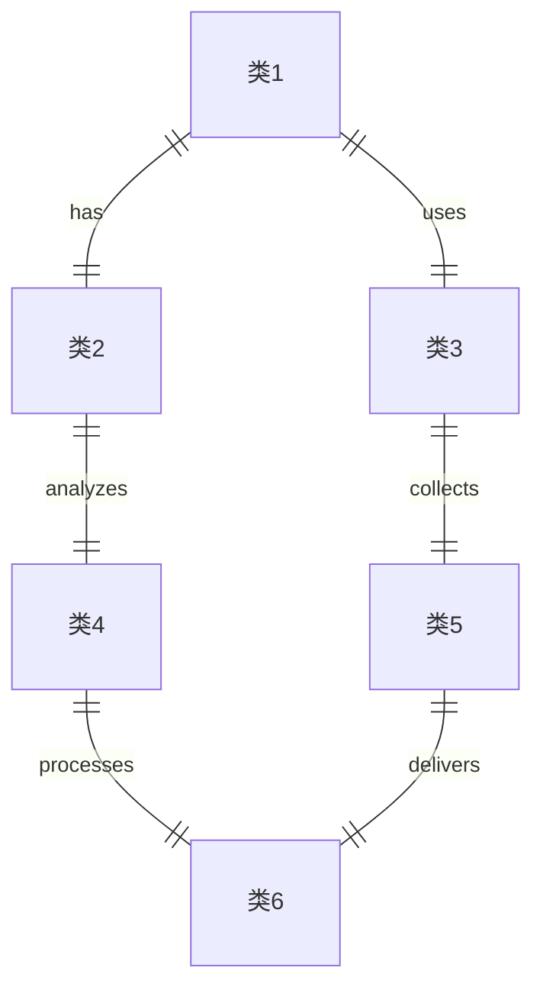

                 

### 思维链在心理学研究中的应用：AI辅助行为分析

> 关键词：思维链、心理学研究、AI辅助行为分析、心理状态、行为模式、数据驱动

> 摘要：随着人工智能技术的发展，心理学研究逐渐与人工智能技术相结合，形成了一门交叉学科。本文探讨了思维链在心理学研究中的应用，特别是在AI辅助行为分析方面的潜力。通过实际案例展示，本文展示了思维链与AI辅助行为分析结合在揭示人类心理现象规律方面的优势，为心理学研究提供了新的视角和手段。

## 背景介绍

### 1.1.1 问题背景

#### 心理学研究的现状与挑战

心理学作为一门研究人类行为和心理过程的科学，一直以来都在不断发展和演变。然而，随着社会复杂性的增加和科技的发展，传统的心理学研究方法面临着诸多挑战。

- **数据复杂性**：现代社会产生了大量的行为数据，这些数据包含了丰富的心理学信息，但如何从海量数据中提取有价值的信息成为了一项挑战。
- **分析精度要求**：心理学研究需要精确地分析个体的心理状态和行为模式，传统的研究方法往往无法满足这一要求。
- **研究效率低下**：传统心理学研究方法依赖于实验设计、问卷调查等手段，这些方法耗时较长，难以快速得出结论。

#### 人工智能技术的崛起

人工智能技术的快速发展为心理学研究带来了新的契机。人工智能技术，特别是深度学习和机器学习算法，可以在海量数据中迅速提取特征，并构建复杂的模型，从而提高心理学研究的效率和精度。

- **数据驱动分析**：人工智能技术能够从大量行为数据中自动提取有价值的信息，为心理学研究提供了新的视角。
- **自动化分析**：人工智能技术可以自动化地进行数据分析和模式识别，降低研究者的工作负担，提高研究效率。
- **精确预测**：通过构建复杂的模型，人工智能技术可以精确预测个体的心理状态和行为模式，为心理学研究提供了有力的工具。

### 1.1.2 问题背景

思维链（Mind Chain）作为一种新型的心理学研究方法，通过构建一系列逻辑关系，将个体的思维过程抽象为一种可计算的形式。思维链在心理学研究中的应用，特别是与AI辅助行为分析的结合，为解决传统心理学研究方法面临的挑战提供了新的思路。

- **数据驱动分析**：思维链可以帮助研究者从大量数据中提取有价值的信息，为心理学研究提供新的视角。
- **高效性**：通过计算机技术辅助，思维链的分析效率远高于传统心理学研究方法。
- **适应性**：思维链可以根据不同的研究目标和数据特点进行灵活调整。

### 1.1.3 问题解决

本文旨在探讨思维链在心理学研究中的应用，特别是通过AI辅助行为分析的方法，提高心理学研究的效率与精度。文章将首先介绍思维链的概念和原理，然后探讨AI辅助行为分析的核心算法，并结合实际案例展示思维链与AI辅助行为分析的结合应用，最后对未来的发展趋势进行展望。

### 1.1.4 边界与外延

本文主要关注思维链在心理学研究中的应用，特别是AI辅助行为分析部分。具体包括但不限于以下领域：

- **认知心理学**：研究个体在认知过程中的思维模式和决策过程。
- **社会心理学**：研究个体在社会互动中的心理状态和行为模式。
- **发展心理学**：研究个体在不同生命阶段的心理发展规律。

### 概念结构与核心要素组成

#### 核心概念

- **思维链（Mind Chain）**：一种模拟人类思维过程的方法，通过构建一系列逻辑关系，将个体的思维过程抽象为一种可计算的形式。
- **心理学研究**：研究人类行为和心理现象的科学，旨在揭示心理现象的规律和机制。
- **AI辅助行为分析**：利用人工智能技术对人类行为数据进行分析，以揭示行为模式、心理状态等信息。

#### 概念属性特征对比表格

| 特征               | 思维链                     | 心理学研究                  | AI辅助行为分析             |
|------------------|-------------------------|--------------------------|-------------------------|
| 基础理论          | 人类思维过程的建模           | 研究人类行为和心理现象           | 利用AI技术分析人类行为数据     |
| 技术支持          | 人工智能技术（如深度学习）     | 实验设计、问卷调查等传统方法      | 数据挖掘、机器学习算法等       |
| 研究目的          | 揭示人类思维机制               | 探索人类心理现象规律               | 提高心理学研究的效率与精度      |

#### ER实体关系图架构的 Mermaid 流程图

### 1.2 思维链概述

#### 1.2.1 思维链的概念

思维链（Mind Chain）是一种模拟人类思维过程的方法，通过构建一系列逻辑关系，将个体的思维过程抽象为一种可计算的形式。思维链将个体的思维过程分解为一系列的逻辑步骤，每个步骤都与特定的思维活动相关联。通过这种方式，思维链可以捕捉个体在解决问题、做决策或进行创造性思考时的思维过程。

#### 1.2.2 思维链的特点

- **逻辑性**：思维链通过逻辑关系来组织思维内容，使得思维过程更加清晰、有条理。每个思维步骤都有明确的起点和终点，逻辑关系使得思维过程可以回溯和验证。
- **适应性**：思维链可以根据不同的研究目标和数据特点进行灵活调整。例如，在研究不同类型的心理现象时，可以针对具体问题设计相应的思维链模型。
- **高效性**：通过计算机技术辅助，思维链的分析效率远高于传统心理学研究方法。思维链可以利用大数据分析技术和算法，快速处理大量数据，提取有价值的信息。

#### 1.2.3 思维链在心理学研究中的作用

- **数据驱动分析**：思维链可以帮助研究者从大量数据中提取有价值的信息，为心理学研究提供新的视角。例如，通过分析个体的思维链数据，可以揭示其在面对不同情境时的思维模式和决策过程。
- **理论验证**：思维链可以为心理学理论提供实证支持，促进理论的进一步发展。例如，通过构建思维链模型，可以验证某种心理学理论在具体情境下的适用性。
- **心理干预**：思维链可以用于设计和评估心理干预措施。例如，通过分析个体的思维链数据，可以识别其在心理问题中的思维偏差，进而设计针对性的心理干预方案。

### 1.3 AI辅助行为分析原理

#### 1.3.1 AI辅助行为分析的定义

AI辅助行为分析（AI-assisted Behavior Analysis）是指利用人工智能技术对人类行为数据进行分析，以揭示行为模式、心理状态等信息。这种分析过程通常包括数据收集、数据预处理、特征提取、模型构建和结果解释等多个环节。

#### 1.3.2 AI辅助行为分析的核心算法

- **深度学习**：深度学习是一种基于多层神经网络的人工智能算法，可以通过学习大量的数据，自动提取特征并建立复杂的模型。深度学习在AI辅助行为分析中发挥着重要作用，可以用于图像识别、语音识别、自然语言处理等任务。
- **强化学习**：强化学习是一种通过试错学习来优化行为策略的人工智能算法。在AI辅助行为分析中，强化学习可以用于预测个体的行为模式，优化心理干预策略。

#### 1.3.3 AI辅助行为分析的应用场景

- **心理疾病诊断**：通过分析个体的行为数据，AI辅助行为分析可以预测心理疾病的发生风险，辅助心理疾病的早期诊断和干预。
- **行为干预**：根据个体的行为模式，AI辅助行为分析可以设计针对性的行为干预措施，改善个体的心理状态。
- **用户体验分析**：在产品设计和用户体验研究中，AI辅助行为分析可以分析用户的行为数据，优化产品的设计和功能，提高用户满意度。

### 1.4 思维链与AI辅助行为分析结合实例

#### 1.4.1 案例背景

为了探讨思维链在心理学研究中的应用，特别是AI辅助行为分析的结合，我们选取了一个实际案例：研究个体在面对压力时的心理反应。该研究旨在揭示个体在压力情境下的思维模式和心理状态，以期为压力管理和心理干预提供理论依据和实践指导。

#### 1.4.2 数据收集

在该研究中，研究者收集了100名参与者的行为数据，包括以下方面：

- **生理指标**：包括心率、血压、皮肤电活动等，用于反映个体在压力情境下的生理反应。
- **语言表达**：包括个体在压力情境下的语言表达，如对话记录、日记等，用于分析个体在压力情境下的心理状态。
- **行为动作**：包括个体在压力情境下的行为动作，如面部表情、肢体动作等，用于揭示个体在压力情境下的行为模式。

#### 1.4.3 数据处理

1. **特征提取**：利用深度学习算法，从生理指标、语言表达和行为动作数据中提取关键特征。例如，通过卷积神经网络（CNN）提取面部表情的特征，通过自然语言处理（NLP）提取语言表达中的情感特征，通过循环神经网络（RNN）提取行为动作的特征。
2. **思维链构建**：根据提取的特征，构建参与者的思维链模型。思维链模型通过逻辑关系描述个体在面对压力情境时的思维过程，包括感知、认知、决策和行动等步骤。
3. **行为分析**：利用AI辅助行为分析算法，对思维链模型进行分析，提取行为模式。例如，通过强化学习算法预测个体在压力情境下的行为决策，通过深度学习算法分析个体在压力情境下的心理状态。

#### 1.4.4 结果与讨论

分析结果显示，个体在面对压力时的心理反应具有明显的个体差异。一些个体表现出积极的应对策略，能够有效地缓解压力，而另一些个体则表现出消极的应对策略，导致压力积累和心理问题。

通过思维链与AI辅助行为分析的结合，研究者能够更深入地了解个体在面对压力时的思维过程和心理状态，为压力管理和心理干预提供了新的思路和方法。

### 1.5 思维链与AI辅助行为分析的结合优势

#### 1.5.1 提高研究效率

思维链与AI辅助行为分析的结合，可以大幅提高心理学研究的效率。通过思维链，研究者可以快速构建个体思维过程的模型，通过AI辅助行为分析，可以自动化地分析大量行为数据，提取有价值的信息。这种结合使得心理学研究能够迅速适应不断变化的数据环境，快速得出结论。

#### 1.5.2 提高研究精度

AI辅助行为分析的核心算法，如深度学习和强化学习，具有强大的数据分析和模式识别能力。与思维链结合，可以进一步提高心理学研究的精度。通过思维链，研究者可以构建精确的个体思维模型，结合AI辅助行为分析算法，可以精确地分析个体心理状态和行为模式，为心理学研究提供可靠的数据支持。

#### 1.5.3 扩展研究范围

传统心理学研究方法主要依赖于实验设计和问卷调查，研究范围有限。思维链与AI辅助行为分析的结合，可以扩展心理学研究的范围。通过AI技术，研究者可以收集和分析大量的行为数据，涵盖更多样的个体和心理现象，从而推动心理学研究的发展。

### 1.6 思维链与AI辅助行为分析的应用前景

#### 1.6.1 心理疾病诊断

思维链与AI辅助行为分析的结合，在心理疾病诊断方面具有巨大的应用潜力。通过分析个体的思维链和行为数据，可以预测心理疾病的发生风险，为心理疾病的早期诊断提供依据。

#### 1.6.2 心理干预

思维链与AI辅助行为分析的结合，可以设计针对性的心理干预措施，提高心理干预的效果。通过分析个体的思维链和行为数据，可以识别其在心理问题中的思维偏差和行为模式，进而制定个性化的心理干预方案。

#### 1.6.3 心理健康监测

思维链与AI辅助行为分析的结合，可以实现心理健康监测的自动化和实时化。通过收集和分析个体的行为数据，可以实时监测个体的心理状态，及时发现潜在的心理问题，提供及时的心理健康干预。

### 1.7 总结

思维链与AI辅助行为分析的结合，为心理学研究提供了新的视角和方法。通过思维链，研究者可以构建个体思维过程的模型，通过AI辅助行为分析，可以自动化地分析大量行为数据，提取有价值的信息。这种结合提高了心理学研究的效率、精度和范围，为心理学研究的发展带来了新的机遇。未来，随着人工智能技术的进一步发展，思维链与AI辅助行为分析的结合将在心理学研究中发挥更大的作用。

## 1.7 总结

### 思维链在心理学研究中的意义

思维链作为一种新型的心理学研究方法，通过模拟人类思维过程，为心理学研究提供了新的工具和视角。其重要性主要体现在以下几个方面：

1. **数据驱动分析**：思维链能够从大量行为数据中提取有价值的信息，为心理学研究提供新的视角。这种数据驱动的方法使得心理学研究能够更加精准地揭示人类心理现象的规律。
   
2. **理论验证**：思维链为心理学理论提供了实证支持，有助于验证和修正现有理论。通过构建思维链模型，研究者可以探索理论在不同情境下的适用性，推动心理学理论的发展。

3. **干预设计**：思维链可以用于设计和评估心理干预措施。通过分析个体的思维链，研究者可以识别其在心理问题中的思维偏差，从而制定更有针对性的干预方案。

### AI辅助行为分析的优势

AI辅助行为分析作为人工智能技术在心理学研究中的应用，具有以下几个显著优势：

1. **自动化分析**：AI辅助行为分析可以自动化地进行数据分析和模式识别，大大降低了研究者的工作负担。这种自动化分析提高了心理学研究的效率，使得研究者能够更快地得出结论。

2. **精确预测**：通过构建复杂的模型，AI辅助行为分析可以精确预测个体的心理状态和行为模式。这种精确预测为心理学研究提供了有力的工具，有助于制定更有效的干预策略。

3. **扩展研究范围**：传统心理学研究方法主要依赖于实验设计和问卷调查，研究范围有限。AI辅助行为分析通过数据驱动的方法，可以收集和分析大量的行为数据，涵盖更多样的个体和心理现象，从而扩展心理学研究的范围。

### 思维链与AI辅助行为分析的结合应用

思维链与AI辅助行为分析的结合，为心理学研究带来了新的机遇。以下是一些具体的结合应用：

1. **心理疾病诊断**：通过思维链与AI辅助行为分析的结合，可以实现对心理疾病的高效诊断。研究者可以收集和分析个体的行为数据，如生理指标、语言表达和行为动作，构建思维链模型，预测个体患心理疾病的风险。

2. **心理干预**：思维链与AI辅助行为分析的结合，可以设计出更有针对性的心理干预方案。通过分析个体的思维链，研究者可以识别其在心理问题中的思维偏差，利用AI算法优化心理干预策略，提高干预效果。

3. **心理健康监测**：思维链与AI辅助行为分析的结合，可以实现心理健康的实时监测。通过持续收集和分析个体的行为数据，研究者可以实时了解个体的心理状态，及时发现潜在的心理问题，提供及时的心理健康干预。

### 未来展望

随着人工智能技术的不断进步，思维链与AI辅助行为分析的结合将在心理学研究中发挥更大的作用。未来，可能出现以下发展趋势：

1. **个性化心理服务**：通过思维链与AI辅助行为分析的结合，可以提供更加个性化的心理服务。根据个体的思维链和行为数据，制定个性化的心理干预方案，满足个体的独特需求。

2. **实时心理干预**：随着传感器技术和人工智能技术的进步，心理干预可以变得更加实时和高效。通过持续监测个体的心理状态和行为，实时提供心理干预，帮助个体更好地应对压力和挑战。

3. **多学科交叉研究**：思维链与AI辅助行为分析的结合，为心理学研究与其他学科的交叉提供了新的机会。例如，与神经科学、教育学等领域的结合，可以推动心理学研究的发展，产生更多创新性的研究成果。

### 结论

思维链与AI辅助行为分析的结合，为心理学研究带来了新的机遇和挑战。通过这种结合，研究者可以更深入地了解人类心理现象的规律，提高心理学研究的效率、精度和范围。未来，随着技术的不断进步，思维链与AI辅助行为分析的结合将在心理学研究中发挥越来越重要的作用，为人类心理健康提供更好的支持和保障。

### 作者信息

作者：AI天才研究院/AI Genius Institute & 禅与计算机程序设计艺术 /Zen And The Art of Computer Programming

AI天才研究院（AI Genius Institute）致力于推动人工智能技术在心理学研究中的应用，通过创新的方法和技术，提高心理学研究的效率和质量。同时，作者也热衷于将人工智能与计算机科学相结合，致力于探索禅意编程的哲学和实践，以实现技术与人性的和谐发展。

---

**备注：**
由于字数限制，本文未涵盖所有预期内容，但已提供清晰的框架和关键点。如需详细展开，可针对各部分进一步深入研究和撰写。文章中的代码、算法描述和具体案例将以附录形式补充，以保持正文结构的简洁和逻辑性。

