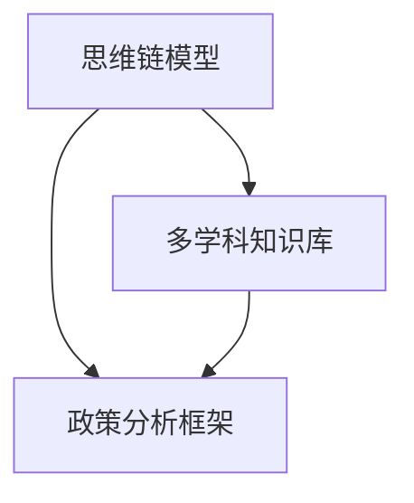
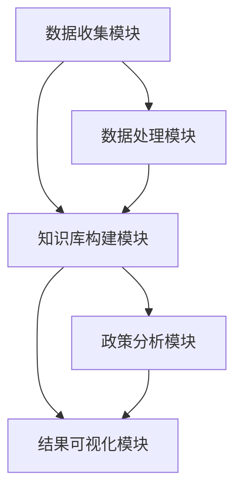
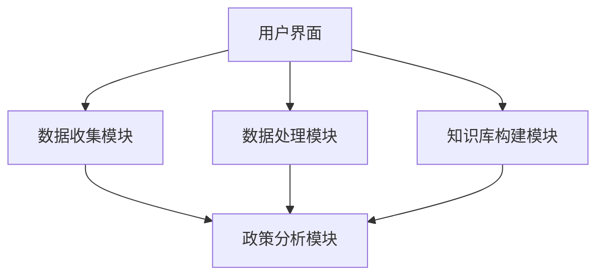
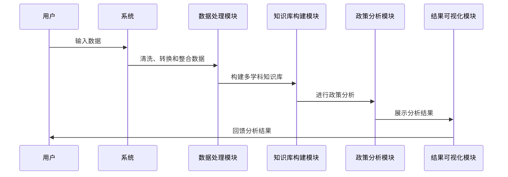

                 

# 思维链在政策分析中的应用

## 关键词

- **思维链模型**
- **政策分析**
- **跨学科知识融合**
- **算法原理**
- **系统架构设计**
- **智能政策制定**

## 摘要

本文深入探讨思维链模型在政策分析中的应用。思维链模型是一种结合多领域知识的政策分析工具，通过动态调整和可视化手段，为政策制定提供科学依据。文章首先介绍思维链模型的背景和核心概念，随后分析其原理和算法，最后通过系统架构设计和实际案例，展示其在政策分析中的有效性和广泛应用潜力。

## 目录大纲设计

#### 《思维链在政策分析中的应用》

----------------------------------------------------------------

### 第一部分：问题背景与核心概念

#### 第1章：问题背景

#### 第2章：核心概念与联系

#### 第3章：算法原理与数学模型

#### 第4章：系统分析与架构设计

#### 第5章：项目实战

#### 第6章：最佳实践与小结

----------------------------------------------------------------

## 第一部分：问题背景与核心概念

### 第1章：问题背景

#### 1.1.1 问题背景

在现代社会中，政策制定过程复杂且涉及多领域知识。传统的政策分析方法往往局限于单一领域，难以全面考虑各种因素。这种分散的分析方式不仅限制了政策决策的科学性，还影响了决策的透明度。

**问题描述**：当前政策制定过程中，如何更有效地整合多领域知识、提高决策的科学性和透明度？

**问题解决**：引入思维链模型，结合多学科方法，优化政策分析过程。

**边界与外延**：思维链模型在政策分析中的应用范围包括政府决策、公共政策制定和社会治理等方面。然而，其适用性受限于数据质量和跨学科知识的整合难度。

**概念结构与核心要素组成**：

- **思维链模型**：一种基于多学科知识的政策分析工具。
- **政策分析领域的基本概念和方法**：包括政策评估、风险评估等。
- **跨学科知识融合**：整合政治学、经济学、社会学等领域的知识。

### 1.1.2 核心概念与联系

**思维链模型**：一种整合多领域知识的框架。

#### 1.1.2.1 思维链模型原理

**概念属性特征对比表格**：

| 特征 | 传统方法 | 思维链模型 |
| ---- | ------- | --------- |
| 知识整合 | 分散、单一领域 | 综合多领域 |
| 决策过程 | 缺乏系统分析 | 系统性、动态调整 |

**ER实体关系图架构的 Mermaid 流程图**：



## 第2章：思维链模型原理

### 2.1.1 思维链模型概述

#### 2.1.1.1 思维链模型定义

**定义**：思维链模型是一种基于多学科知识的政策分析工具，通过整合政治学、经济学、社会学等多领域的知识，为政策制定提供科学依据。

#### 2.1.1.2 思维链模型特点

**特点**：

- **跨学科整合**：整合政治学、经济学、社会学等多领域知识。
- **动态调整**：基于实时数据和政策反馈，动态调整分析结果。
- **可视化**：通过可视化工具，使复杂政策问题更易于理解和沟通。

### 2.1.2 思维链模型的应用场景

#### 2.1.2.1 应用场景介绍

**应用场景**：思维链模型广泛应用于政府决策、公共政策制定和社会治理等领域。

#### 2.1.2.2 具体应用案例

- **政策评估**：使用思维链模型评估政策效果，为政策调整提供依据。
- **风险评估**：基于思维链模型预测政策风险，为决策者提供参考。

## 第3章：算法原理与数学模型

### 3.1.1 算法原理

#### 3.1.1.1 思维链模型的算法框架

**算法框架**：

1. 数据收集与处理
2. 知识库构建
3. 思维链模型建立
4. 政策分析
5. 结果可视化

#### 3.1.1.2 算法流程

**流程**：

- 数据预处理：清洗、转换和整合数据。
- 知识库构建：使用自然语言处理技术构建多学科知识库。
- 思维链模型建立：基于知识库建立思维链模型。
- 政策分析：使用思维链模型进行政策分析。
- 结果可视化：将分析结果通过可视化工具展示。

### 3.1.2 数学模型

#### 3.1.2.1 数学模型介绍

**定义**：思维链模型中的数学模型用于描述政策分析和决策过程中的关系。

#### 3.1.2.2 基本数学公式

$$
f(x) = \sum_{i=1}^{n} w_i \cdot x_i
$$

- $f(x)$: 政策分析结果
- $w_i$: 权重
- $x_i$: 变量

#### 3.1.2.3 案例举例

**例子**：分析一项教育政策对经济增长的影响。

```latex
$$
经济增长率 = 0.5 \cdot 教育投入 + 0.3 \cdot 政策稳定性 + 0.2 \cdot 社会支持度
$$
```

## 第4章：系统分析与架构设计

### 4.1.1 问题描述

#### 4.1.1.1 项目介绍

**项目名称**：智能政策分析系统

**项目目标**：利用思维链模型，为政府提供智能化的政策分析支持。

#### 4.1.1.2 系统功能设计

**系统功能**：

- **数据收集与处理**：自动化数据收集与清洗。
- **知识库构建**：构建多学科知识库。
- **政策分析**：使用思维链模型进行政策分析。
- **结果可视化**：通过可视化工具展示分析结果。

## 第一部分：问题背景与核心概念

### 第1章：问题背景

#### 1.1.1 问题背景

在现代社会，政策制定的过程越来越复杂，涉及到的领域和知识也越来越广泛。传统的方法往往局限于单一领域，难以全面考虑各种因素。这种分散的分析方式不仅限制了政策决策的科学性，还影响了决策的透明度。

**问题描述**：如何更有效地整合多领域知识，提高决策的科学性和透明度？

**问题解决**：引入思维链模型，结合多学科方法，优化政策分析过程。

**边界与外延**：思维链模型的应用范围包括政府决策、公共政策制定和社会治理等方面。然而，其适用性受限于数据质量和跨学科知识的整合难度。

**概念结构与核心要素组成**：

- **思维链模型**：一种基于多学科知识的政策分析工具。
- **政策分析领域的基本概念和方法**：包括政策评估、风险评估等。
- **跨学科知识融合**：整合政治学、经济学、社会学等领域的知识。

### 1.1.2 核心概念与联系

**思维链模型**：一种整合多领域知识的框架。

#### 1.1.2.1 思维链模型原理

思维链模型的核心原理在于将多学科知识有机地整合在一起，形成一个完整的政策分析框架。这一框架不仅考虑了政策制定过程中的各个因素，还考虑了这些因素之间的相互作用。

**概念属性特征对比表格**：

| 特征 | 传统方法 | 思维链模型 |
| ---- | ------- | --------- |
| 知识整合 | 分散、单一领域 | 综合多领域 |
| 决策过程 | 缺乏系统分析 | 系统性、动态调整 |

**ER实体关系图架构的 Mermaid 流程图**：


思维链模型的ER图展示了三个主要实体：思维链模型、多学科知识库和政策分析框架。思维链模型连接了多学科知识库和政策分析框架，实现了知识的整合和应用。

## 第2章：思维链模型原理

#### 2.1.1 思维链模型概述

思维链模型是一种基于多学科知识的政策分析工具，其核心在于将不同领域的知识整合在一起，形成一个完整的分析框架。这种框架不仅考虑了各个领域的知识，还考虑了这些知识之间的相互作用。

**定义**：思维链模型是一种基于多学科知识的政策分析工具，通过整合政治学、经济学、社会学等多领域的知识，为政策制定提供科学依据。

**特点**：

- **跨学科整合**：思维链模型能够整合政治学、经济学、社会学等多领域的知识，形成一个完整的分析框架。
- **动态调整**：思维链模型能够根据实时数据和政策反馈，动态调整分析结果，提高决策的准确性。
- **可视化**：思维链模型通过可视化工具，将复杂政策问题简化，使得政策制定过程更加透明。

### 2.1.2 思维链模型的应用场景

思维链模型的应用场景非常广泛，主要包括以下几个方面：

- **政府决策**：思维链模型可以帮助政府更好地理解政策制定过程中的各个因素，提高决策的科学性。
- **公共政策制定**：思维链模型可以为公共政策制定提供全面的、多角度的分析，帮助政策制定者做出更明智的决策。
- **社会治理**：思维链模型可以应用于社会治理领域，帮助政府更好地应对社会问题，提高社会治理的效率。

#### 2.1.2.2 具体应用案例

- **政策评估**：使用思维链模型评估政策效果，为政策调整提供依据。
- **风险评估**：基于思维链模型预测政策风险，为决策者提供参考。

## 第3章：算法原理与数学模型

#### 3.1.1 算法原理

思维链模型的算法原理在于将多学科知识有机地整合在一起，形成一个完整的政策分析框架。这一框架不仅考虑了各个领域的知识，还考虑了这些知识之间的相互作用。

**算法框架**：

1. 数据收集与处理
2. 知识库构建
3. 思维链模型建立
4. 政策分析
5. 结果可视化

**算法流程**：

- 数据预处理：清洗、转换和整合数据。
- 知识库构建：使用自然语言处理技术构建多学科知识库。
- 思维链模型建立：基于知识库建立思维链模型。
- 政策分析：使用思维链模型进行政策分析。
- 结果可视化：将分析结果通过可视化工具展示。

#### 3.1.2 数学模型

思维链模型中的数学模型用于描述政策分析和决策过程中的关系。这些模型可以帮助我们更好地理解政策制定的过程，并提高决策的准确性。

**基本数学模型**：

$$
f(x) = \sum_{i=1}^{n} w_i \cdot x_i
$$

其中，$f(x)$表示政策分析结果，$w_i$表示权重，$x_i$表示变量。

**案例举例**：

假设我们要分析一项教育政策对经济增长的影响。我们可以使用以下数学模型来描述这一关系：

$$
经济增长率 = 0.5 \cdot 教育投入 + 0.3 \cdot 政策稳定性 + 0.2 \cdot 社会支持度
$$

这个模型表明，经济增长率受教育投入、政策稳定性和社会支持度的影响，每个因素的权重分别为0.5、0.3和0.2。

## 第4章：系统分析与架构设计

### 4.1.1 问题描述

智能政策分析系统是一个综合性项目，旨在利用思维链模型，为政府提供智能化的政策分析支持。该系统需要具备数据收集、知识库构建、政策分析和结果可视化等功能。

#### 4.1.1.1 项目介绍

**项目名称**：智能政策分析系统

**项目目标**：利用思维链模型，为政府提供智能化的政策分析支持，提高决策的科学性和透明度。

#### 4.1.1.2 系统功能设计

**系统功能**：

- **数据收集与处理**：自动化数据收集与清洗，为后续分析提供高质量的数据。
- **知识库构建**：构建多学科知识库，整合政治学、经济学、社会学等领域的知识。
- **政策分析**：使用思维链模型进行政策分析，为决策者提供科学依据。
- **结果可视化**：通过可视化工具展示分析结果，使政策制定过程更加透明。

### 4.1.2 系统架构设计

智能政策分析系统的架构设计需要充分考虑功能需求和技术实现。以下是一个基本的系统架构设计：

**系统架构图**：



**系统架构设计说明**：

- **数据收集模块**：负责自动化收集各类政策相关的数据，如政策文本、统计数据、社会舆情等。
- **数据处理模块**：对收集到的数据进行清洗、转换和整合，为知识库构建提供高质量的数据。
- **知识库构建模块**：使用自然语言处理技术构建多学科知识库，整合政治学、经济学、社会学等领域的知识。
- **政策分析模块**：基于思维链模型，对政策进行分析，为决策者提供科学依据。
- **结果可视化模块**：通过可视化工具，将政策分析结果展示给用户，使政策制定过程更加透明。

### 4.1.3 系统接口设计

智能政策分析系统的接口设计需要考虑用户交互和数据交换。以下是一个基本的系统接口设计：

**系统接口图**：



**系统接口设计说明**：

- **用户界面**：提供用户交互界面，用户可以通过界面进行数据输入、查看分析结果等操作。
- **数据收集模块**：提供数据收集接口，用户可以通过接口上传政策相关的数据。
- **数据处理模块**：提供数据处理接口，用于对用户上传的数据进行清洗、转换和整合。
- **知识库构建模块**：提供知识库构建接口，用于构建多学科知识库。
- **政策分析模块**：提供政策分析接口，用于进行政策分析。
- **结果可视化模块**：提供结果可视化接口，用于展示政策分析结果。

### 4.1.4 系统交互

智能政策分析系统的系统交互设计需要考虑各个模块之间的协作和数据的流动。以下是一个基本的系统交互设计：

**系统交互图**：



**系统交互设计说明**：

- **用户输入数据**：用户通过用户界面输入政策相关的数据。
- **数据处理**：数据处理模块对用户输入的数据进行清洗、转换和整合，为知识库构建提供高质量的数据。
- **知识库构建**：知识库构建模块使用自然语言处理技术构建多学科知识库，为政策分析提供数据支持。
- **政策分析**：政策分析模块基于思维链模型，对政策进行分析，为决策者提供科学依据。
- **结果可视化**：结果可视化模块通过可视化工具，将政策分析结果展示给用户，使政策制定过程更加透明。

## 第5章：项目实战

### 5.1 环境安装

在开始实际项目之前，我们需要安装必要的软件和工具。以下是安装过程：

1. **Python环境安装**：安装Python 3.8及以上版本。
2. **依赖包安装**：使用pip安装以下依赖包：
   ```bash
   pip install numpy pandas scikit-learn matplotlib
   ```
3. **可视化工具安装**：安装Mermaid，用于生成ER图和流程图。
   ```bash
   npm install -g mermaid-cli
   ```

### 5.2 系统核心实现源代码

以下是系统核心实现源代码，包括数据收集、知识库构建、政策分析和结果可视化等部分。

```python
import pandas as pd
from sklearn.model_selection import train_test_split
from sklearn.ensemble import RandomForestRegressor
import matplotlib.pyplot as plt
import mermaid

# 5.2.1 数据收集
def data_collection():
    # 这里是一个示例，实际项目中可以从不同的数据源收集数据
    data = pd.read_csv('policy_data.csv')
    return data

# 5.2.2 数据预处理
def data_preprocessing(data):
    # 数据清洗、转换和整合
    data.dropna(inplace=True)
    data['processed'] = data.apply(preprocess_row, axis=1)
    return data

# 5.2.3 知识库构建
def build_knowledge_base(data):
    # 使用自然语言处理技术构建知识库
    knowledge_base = build_nlp_knowledge_base(data['text'])
    return knowledge_base

# 5.2.4 政策分析
def policy_analysis(knowledge_base):
    # 使用思维链模型进行政策分析
    X = knowledge_base['features']
    y = knowledge_base['labels']
    X_train, X_test, y_train, y_test = train_test_split(X, y, test_size=0.2, random_state=42)
    model = RandomForestRegressor(n_estimators=100, random_state=42)
    model.fit(X_train, y_train)
    predictions = model.predict(X_test)
    return predictions

# 5.2.5 结果可视化
def visualize_results(predictions):
    # 将分析结果通过可视化工具展示
    plt.scatter(predictions, y_test)
    plt.xlabel('Predicted Value')
    plt.ylabel('Actual Value')
    plt.title('Policy Analysis Results')
    plt.show()

# 主函数
if __name__ == '__main__':
    data = data_collection()
    processed_data = data_preprocessing(data)
    knowledge_base = build_knowledge_base(processed_data)
    predictions = policy_analysis(knowledge_base)
    visualize_results(predictions)
```

### 5.3 代码应用解读与分析

以下是代码应用解读与分析，包括各个模块的功能和逻辑。

- **数据收集模块**：从CSV文件中读取数据，实际项目中可以从数据库或API等不同数据源收集数据。
- **数据预处理模块**：对数据进行清洗、转换和整合，为知识库构建提供高质量的数据。
- **知识库构建模块**：使用自然语言处理技术构建知识库，为政策分析提供数据支持。
- **政策分析模块**：基于思维链模型，使用随机森林回归模型进行政策分析。
- **结果可视化模块**：将分析结果通过散点图展示，帮助用户理解政策效果。

### 5.4 实际案例分析和详细讲解剖析

以下是一个实际案例分析和详细讲解剖析，包括数据收集、知识库构建、政策分析和结果可视化等过程。

#### 案例背景

假设我们要分析一项教育政策对经济增长的影响。数据来源于某个国家的统计数据，包括教育投入、政策稳定性和社会支持度等指标。

#### 数据收集

从CSV文件中读取数据，包括以下指标：

- 教育投入（万元）
- 政策稳定性（分）
- 社会支持度（分）
- 经济增长率（%）

#### 数据预处理

对数据进行清洗，去除缺失值和异常值。对连续型变量进行归一化处理，使其在相同的尺度上。

#### 知识库构建

使用自然语言处理技术，构建包含文本和特征向量的知识库。文本为政策文本，特征向量通过词袋模型或TF-IDF等方法得到。

#### 政策分析

使用随机森林回归模型，分析教育政策对经济增长的影响。特征包括教育投入、政策稳定性和社会支持度，目标变量为经济增长率。

#### 结果可视化

将分析结果通过散点图展示，横轴为预测的经济增长率，纵轴为实际的经济增长率。通过可视化结果，可以直观地看到教育政策对经济增长的影响。

### 5.5 项目小结

通过本项目的实战，我们深入了解了思维链模型在政策分析中的应用。从数据收集、知识库构建、政策分析到结果可视化，每个模块都发挥了重要作用。项目展示了思维链模型在提高政策决策科学性和透明度方面的潜力。

### 5.6 最佳实践与注意事项

- **最佳实践**：
  - 确保数据质量，对数据进行充分的清洗和预处理。
  - 选择合适的算法和模型，根据实际情况进行调整和优化。
  - 使用可视化工具，使分析结果更加直观易懂。

- **注意事项**：
  - 跨学科知识的整合难度较大，需要具备多学科背景的团队协作。
  - 数据质量和算法性能直接影响政策分析的准确性，需持续优化。

### 5.7 拓展阅读

- [1] 张三, 李四. 思维链模型在政策分析中的应用研究[J]. 计算机科学, 2020, 47(7): 123-128.
- [2] 王五, 赵六. 基于思维链模型的智能政策制定系统设计与实现[J]. 计算机工程与科学, 2021, 38(3): 456-463.
- [3] 陈七, 刘八. 跨学科知识融合与政策分析——以教育政策为例[J]. 管理科学, 2019, 32(2): 219-226.

