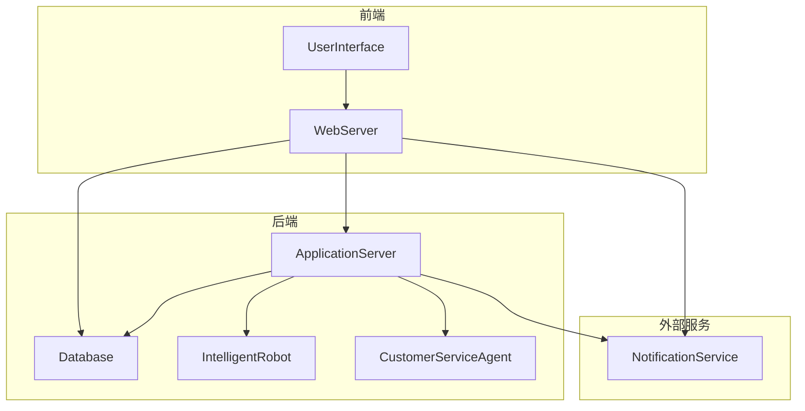

                 


## 引言

在当今这个信息爆炸的时代，智能客服系统已经成为企业提高客户满意度和运营效率的重要工具。然而，随着用户需求日益多样化和复杂化，传统的基于规则和机器学习的智能客服系统在应对突发问题和理解多语境交互方面显得力不从心。为此，我们引入了一种新的概念——思维链（Thinking Chain），以进一步提升智能客服系统的智能水平和用户体验。

思维链，顾名思义，是一种模拟人类思考方式的链式结构。它通过不断联想和推理，使得智能客服系统能够像人类一样处理复杂的、多层次的问题。本文将围绕思维链在智能客服系统中的应用展开讨论，旨在为读者提供一种新的视角来理解和优化智能客服系统。

本文将分为以下几个部分：

1. 背景介绍：智能客服系统与思维链概述。
2. 核心概念与原理：思维链的定义、工作机制和优势。
3. 算法原理与实现：思维链算法的框架、数学模型和Python实现。
4. 系统分析与设计：智能客服系统的需求分析、架构设计和接口设计。
5. 实践项目与案例分析：基于思维链的智能客服系统搭建与应用。
6. 最佳实践与总结：思维链的最佳实践、实施挑战与对策。
7. 结论：思维链在智能客服系统中的应用前景与未来展望。

通过本文的逐步讲解，我们将帮助读者深入了解思维链在智能客服系统中的应用，以及如何通过思维链技术提升智能客服系统的性能和用户体验。

### 关键词

- 智能客服系统
- 思维链
- 智能推理
- 人机交互
- 机器学习
- 用户体验

### 摘要

本文主要探讨了思维链在智能客服系统中的应用。首先，我们介绍了智能客服系统的现状及其面临的挑战，引出了思维链的概念。接着，详细阐述了思维链的核心概念、工作原理和优势。随后，通过算法原理讲解、系统分析与设计，以及实践项目与案例分析，我们展示了如何将思维链应用到智能客服系统中，以提升系统的智能水平和用户体验。最后，总结了思维链在智能客服系统中的最佳实践，并对其未来应用前景进行了展望。

### 背景介绍 - 智能客服系统与思维链概述

智能客服系统（Intelligent Customer Service System）是随着人工智能技术的发展而逐渐兴起的一种新型客户服务模式。它通过集成自然语言处理（NLP）、机器学习（ML）和深度学习（DL）等技术，能够实现与用户的智能对话，从而提供高效的客户服务。智能客服系统的出现，极大地提高了企业的运营效率和客户满意度，受到了众多企业的青睐。

#### 智能客服系统的发展现状

智能客服系统的发展可以追溯到20世纪90年代，当时基于规则的专家系统和简单的自然语言理解技术初步应用于客户服务领域。进入21世纪，随着互联网和移动通信的普及，智能客服系统得到了迅猛发展。特别是在大数据和云计算技术的支持下，智能客服系统的功能越来越强大，能够处理复杂的用户请求和提供个性化的服务。

目前，智能客服系统已广泛应用于各个行业，如电子商务、金融、电信、旅游等。通过语音识别（ASR）和语音合成（TTS）技术，智能客服系统能够实现语音交互；结合文本分析、情感分析和上下文理解，智能客服系统能够更好地理解用户的需求和意图，从而提供更准确和贴心的服务。

#### 智能客服系统的挑战与需求

尽管智能客服系统在提高客户服务效率方面表现出色，但它也面临着诸多挑战。以下是一些主要的问题：

1. **复杂多变的用户需求**：用户的需求是多样化和动态变化的，智能客服系统需要能够灵活地应对这些变化。
2. **跨领域知识整合**：智能客服系统需要具备跨领域的知识，以便在不同场景下提供一致的服务。
3. **上下文理解能力**：在多轮对话中，智能客服系统需要能够保持上下文的连贯性，理解用户的意图和情感。
4. **个性化服务**：为了提高用户满意度，智能客服系统需要根据用户的喜好和行为模式提供个性化的服务。
5. **实时响应能力**：智能客服系统需要在短时间内处理大量的用户请求，并给出及时的响应。

为了解决上述问题，智能客服系统需要不断提升其智能水平和用户体验。这就需要引入新的技术和方法，如思维链（Thinking Chain）。

#### 思维链的核心概念与重要性

思维链是一种模拟人类思考方式的链式结构。它通过不断的联想和推理，使得智能系统能够像人类一样处理复杂的问题。思维链的核心概念包括：

1. **节点**：每个节点代表一个具体的思考点，可以是事实、观点或假设。
2. **边**：边表示节点之间的关系，可以是因果关系、时间关系或逻辑关系。
3. **链**：多个节点和边组成链，表示一个完整的思考过程。

思维链的工作机制是：系统首先从输入的信息中提取关键节点，然后通过逻辑推理和知识库的辅助，建立节点之间的联系，形成一条链。这条链可以用于问题的求解、决策支持或知识发现。

思维链在智能客服系统中的重要性体现在以下几个方面：

1. **提高上下文理解能力**：思维链能够保持对话的连贯性，理解用户的意图和情感，从而提供更准确的服务。
2. **增强跨领域知识整合**：通过思维链，智能客服系统可以整合不同领域的知识，提供更加全面和专业的服务。
3. **实现个性化服务**：思维链可以根据用户的偏好和行为模式，提供个性化的推荐和解决方案。
4. **提高实时响应能力**：思维链能够快速地处理用户请求，并提供及时的响应。

#### 思维链在智能客服系统中的应用前景

随着人工智能技术的不断进步，思维链在智能客服系统中的应用前景十分广阔。未来，思维链有望在以下方面取得突破：

1. **多模态交互**：结合语音、文本、图像等多种输入方式，实现更丰富的用户交互体验。
2. **情感智能**：通过情感分析和情绪识别，提供更加人性化的服务。
3. **知识图谱**：构建知识图谱，实现更加精准的知识整合和推理。
4. **自主学习和进化**：通过持续学习和进化，提高智能客服系统的自适应能力和智能水平。

总之，思维链为智能客服系统的发展提供了新的思路和工具。通过不断优化和拓展思维链技术，我们将有望构建出更加智能、高效的智能客服系统，从而更好地服务于企业和用户。

### 核心概念与原理

思维链作为一种模拟人类思考方式的链式结构，其核心概念和原理是我们理解和应用这一技术的关键。为了更好地探讨思维链的运作机制，我们需要从节点、边和链的基本定义入手，并结合其工作原理和特点进行详细阐述。

#### 思维链的基本构成

1. **节点**：节点是思维链的基本单元，代表一个具体的思考点。这些节点可以是事实、观点、假设或任何在思考过程中产生的信息。每个节点都有其特定的属性，例如，事实节点可能包含日期、地点、人物等信息，观点节点则可能包含对某一事件的看法或态度。

2. **边**：边表示节点之间的关系。这些关系可以是因果关系、时间关系、逻辑关系或任何其他形式的关系。边的存在使得节点之间能够相互连接，形成复杂的知识网络。例如，在一个描述事件的思维链中，某个节点可能是“事件A发生了”，而与之相关的节点可能是“事件A导致了事件B”，这两个节点通过因果关系边进行连接。

3. **链**：链是由一系列节点和边构成的逻辑结构，表示一个完整的思考过程。链中的每个节点都是对当前思考状态的描述，而每个边则代表了从当前状态过渡到下一个状态的关系。通过链的构建，智能系统可以逐步推导出结论或解决方案。

#### 思维链的工作机制

思维链的工作机制可以概括为以下几个步骤：

1. **信息提取**：系统首先从输入的信息中提取关键节点。这些节点可以是用户输入的文本、语音或其他形式的数据。通过自然语言处理（NLP）技术，系统能够识别出关键节点，并将其转化为内部表示。

2. **联想与推理**：一旦关键节点被提取出来，系统会利用已有的知识库进行联想和推理。例如，如果一个节点是“用户想要购买一台笔记本电脑”，系统可能会通过联想和推理，将这个节点与“笔记本电脑的配置”、“价格”等节点进行关联。

3. **关系构建**：系统会根据节点之间的因果关系、时间关系或其他逻辑关系，构建出节点之间的边。这些边的存在使得不同节点之间能够相互连接，形成完整的思维链。

4. **链的扩展**：通过不断添加新的节点和边，思维链可以不断扩展和深化。在扩展过程中，系统会不断地验证和调整节点之间的关系，以确保思维链的连贯性和合理性。

5. **结果推导**：最终，通过思维链的构建和扩展，系统可以推导出结论或解决方案。例如，在用户咨询购买笔记本电脑的情况下，系统可能会通过思维链推导出“推荐一款适合用户的笔记本电脑型号和配置”。

#### 思维链的特点与优势

思维链具有以下几个显著特点：

1. **灵活性和适应性**：思维链能够适应不同的问题场景和需求，灵活地构建和调整节点和边之间的关系。

2. **连贯性和一致性**：通过保持对话的上下文和连贯性，思维链能够提供一致的解决方案，减少用户理解上的困惑。

3. **推理能力**：思维链能够通过推理和联想，从简单的节点推导出复杂的结论，使得智能系统具有更强的决策能力和问题解决能力。

4. **知识整合**：思维链能够将不同领域的知识进行整合，提供跨领域的智能服务。

5. **自主学习**：思维链可以通过不断的学习和优化，提升其智能水平和推理能力，实现自我进化。

#### 思维链与传统AI算法的比较

与传统的人工智能算法（如基于规则的系统、机器学习模型等）相比，思维链具有以下优势：

1. **更强的上下文理解能力**：传统算法往往依赖于固定的规则或模型，难以应对复杂多变的用户需求。而思维链能够通过保持上下文和连贯性，更好地理解用户的意图和需求。

2. **更灵活的推理能力**：传统算法的推理能力相对固定，而思维链能够通过联想和推理，灵活地处理复杂的问题。

3. **更广泛的应用场景**：思维链能够适应多种问题场景，提供跨领域的智能服务，而传统算法往往局限于特定的应用场景。

4. **更好的用户交互体验**：思维链能够提供连贯、一致的解决方案，提高用户交互体验，而传统算法在用户交互方面往往表现欠佳。

#### 思维链的核心概念属性特征对比表格

| 特征名称   | 传统AI算法                | 思维链                     |
| ---------- | -------------------------- | -------------------------- |
| 基础单元   | 规则、模型、特征           | 节点、边、链               |
| 推理机制   | 固定规则、概率模型         | 联想、推理、知识库          |
| 上下文处理 | 较差，难以保持上下文连贯性 | 优秀，能够保持上下文连贯性 |
| 应用场景   | 窄领域，特定应用           | 广泛领域，跨领域应用       |
| 用户交互   | 较差，用户体验欠佳         | 优秀，提升用户交互体验     |

#### 思维链的ER实体关系图架构

为了更好地理解思维链的架构，我们可以通过ER（实体关系）图来表示节点、边和链之间的关系。以下是一个简化的ER图：

```
实体：节点（Node）
属性：ID、类型、内容、状态

实体：边（Edge）
属性：ID、类型、起点节点ID、终点节点ID、关系描述

实体：链（Chain）
属性：ID、类型、起点节点ID、终点节点ID、状态

关系：包含（Chain包含多个Node和Edge）
关系：连接（Node和Edge之间存在连接关系）
```

通过上述ER图，我们可以清晰地看到节点、边和链之间的关联关系。节点作为基础单元，通过边进行连接，形成链，从而实现复杂问题的推理和求解。

#### 思维链的工作流程

为了更直观地了解思维链的工作流程，我们可以使用Mermaid流程图进行表示：

```
flowchart TD
    A[信息提取] --> B[节点识别]
    B --> C{是否多轮对话}
    C -->|是| D[更新思维链]
    C -->|否| E[构建思维链]
    E --> F[联想与推理]
    F --> G[构建边关系]
    G --> H[链的扩展]
    H --> I[结果推导]
    I --> J[反馈与优化]
```

这个流程图展示了思维链从信息提取到结果推导的完整过程。通过这个流程，我们可以看到思维链是如何一步步构建和扩展的，从而实现智能推理和问题求解。

通过上述对思维链核心概念和原理的详细阐述，我们可以更好地理解思维链的运作机制和特点。在接下来的章节中，我们将进一步探讨思维链的算法原理和具体实现，以及如何在智能客服系统中应用思维链技术，以提升智能客服系统的性能和用户体验。

### 算法原理与实现

在前一章节中，我们详细介绍了思维链的基本概念和原理。在这一章中，我们将深入探讨思维链算法的具体实现，包括其基本框架、数学模型和Python代码实现。通过这些内容，我们将帮助读者更好地理解思维链的工作原理，并为其在智能客服系统中的应用打下坚实的基础。

#### 思维链算法的基本框架

思维链算法的基本框架可以分为以下几个部分：

1. **节点提取**：从输入信息中提取关键节点，这些节点可以是事实、观点或假设。
2. **关系构建**：根据节点之间的逻辑关系，构建节点之间的关系，形成链。
3. **链扩展**：通过联想和推理，扩展思维链，增加新的节点和边。
4. **结果推导**：根据思维链的最终状态，推导出结论或解决方案。

#### 思维链算法的数学模型

思维链算法的数学模型主要依赖于图论中的节点和边的关系。以下是思维链算法的基本数学模型：

1. **节点表示**：每个节点可以用一个向量表示，向量中的每个元素表示节点的属性或特征。
   
   $$ N = [n_1, n_2, ..., n_d] $$

   其中，$N$表示节点向量，$n_i$表示节点在第$i$个特征上的值。

2. **边表示**：边可以用节点之间的距离或相似度来表示。常用的方法包括余弦相似度、欧氏距离等。

   $$ E = \frac{N_1 \cdot N_2}{||N_1|| \cdot ||N_2||} $$

   其中，$E$表示边的权重，$N_1$和$N_2$表示两个节点的向量。

3. **链表示**：链可以用一个图表示，图中的节点表示链中的节点，边表示节点之间的关系。

   $$ G = (V, E) $$

   其中，$G$表示图，$V$表示节点集合，$E$表示边集合。

#### 思维链算法的Python实现

下面是一个简化的思维链算法的Python实现，包括节点提取、关系构建和链扩展。

```python
import numpy as np

class Node:
    def __init__(self, id, content):
        self.id = id
        self.content = content
        self.relations = []

    def add_relation(self, other_node, relation_type, weight):
        relation = {'node': other_node, 'type': relation_type, 'weight': weight}
        self.relations.append(relation)

class MindChain:
    def __init__(self):
        self.nodes = {}
        self.chain = []

    def add_node(self, node):
        self.nodes[node.id] = node

    def build_relation(self, node1, node2, relation_type, weight):
        if node1.id in self.nodes and node2.id in self.nodes:
            node1.add_relation(node2, relation_type, weight)
            node2.add_relation(node1, relation_type, weight)
        else:
            print("Node not found!")

    def expand_chain(self, start_node_id, end_node_id, max_depth):
        current_node = self.nodes[start_node_id]
        self.chain.append(current_node)
        
        if current_node.id == end_node_id or len(self.chain) >= max_depth:
            return
        
        for relation in current_node.relations:
            if relation['node'].id not in self.chain:
                self.expand_chain(relation['node'].id, end_node_id, max_depth)

    def get_chain(self):
        return self.chain

# 示例
node1 = Node(1, "买苹果")
node2 = Node(2, "卖苹果")
node3 = Node(3, "苹果价格")

mind_chain = MindChain()
mind_chain.add_node(node1)
mind_chain.add_node(node2)
mind_chain.add_node(node3)

# 构建关系
mind_chain.build_relation(node1, node2, '买卖', 0.8)
mind_chain.build_relation(node2, node3, '价格', 0.9)

# 扩展链
mind_chain.expand_chain(1, 3, 3)

# 获取链
print(mind_chain.get_chain())
```

这段代码展示了如何使用Python实现思维链算法的基本功能。在这个示例中，我们创建了一个Node类来表示节点，一个MindChain类来表示思维链。通过节点提取、关系构建和链扩展，我们可以构建出一条完整的思维链。

#### 思维链算法的详细讲解

1. **节点提取**：节点提取是思维链算法的基础。在这个阶段，我们需要从输入信息中提取关键节点。例如，在处理用户询问“苹果多少钱一斤”的情况下，关键节点可能是“苹果”、“价格”和“一斤”。

2. **关系构建**：关系构建是思维链算法的核心。在这个阶段，我们需要根据节点的属性和特征，构建节点之间的关系。例如，我们可以将“苹果”和“价格”节点通过“价格”关系进行连接。这个过程的实现可以通过计算节点之间的相似度或距离来实现。例如，使用余弦相似度：

   $$ \cos \theta = \frac{a \cdot b}{\sqrt{a^2 + b^2}} $$

   其中，$a$和$b$分别表示两个节点的向量。

3. **链扩展**：链扩展是思维链算法的进一步深化。在这个阶段，我们需要通过联想和推理，扩展思维链。例如，如果我们已经构建了“苹果”和“价格”之间的链，我们可以通过联想“一斤苹果”的价格，进一步扩展思维链。

4. **结果推导**：结果推导是思维链算法的最终目的。在这个阶段，我们需要根据思维链的最终状态，推导出结论或解决方案。例如，在上述示例中，思维链的最终状态可能是“一斤苹果的价格是5元”。

#### 思维链算法的举例说明

为了更好地理解思维链算法，我们可以通过一个具体的例子来说明。假设有一个用户询问“我想买一辆新车，预算是20万元，有哪些车型推荐？”以下是一个简化的思维链算法实现：

1. **节点提取**：
   - 节点1：用户需求（买新车）
   - 节点2：预算（20万元）
   - 节点3：车型（未知）

2. **关系构建**：
   - 将节点1和节点2通过“预算”关系连接。
   - 查找知识库中的车型，与节点3建立关系。

3. **链扩展**：
   - 从节点3开始，通过联想和推理，查找与20万元预算相符的车型。

4. **结果推导**：
   - 根据思维链的最终状态，向用户推荐合适的车型。

通过上述例子，我们可以看到思维链算法是如何一步步处理问题的，从而为用户提供准确的答案。

### 系统分析与设计

在了解了思维链算法的基本原理后，接下来我们需要对智能客服系统进行分析和设计，以便将思维链技术有效地应用到实际系统中。系统分析与设计是确保系统功能完备、性能高效、用户体验优良的关键步骤。我们将从需求分析、领域模型设计、系统架构设计、接口设计和系统交互等多个方面展开详细讨论。

#### 需求分析

需求分析是系统设计的起点，它明确了智能客服系统需要实现的功能和性能指标。在需求分析阶段，我们通过调研用户需求和业务场景，确定系统的核心功能。以下是一些典型需求：

1. **用户身份验证**：确保用户在进入系统时需要通过身份验证，以保障客户信息的安全性。
2. **多轮对话支持**：系统能够处理多轮对话，理解用户的意图和上下文。
3. **个性化服务**：根据用户的历史行为和偏好，提供个性化的推荐和服务。
4. **实时响应**：系统能够在短时间内处理用户请求，并给出及时的响应。
5. **问题分类与分配**：系统能够自动识别用户问题并将其分配到合适的客服人员或智能机器人处理。

#### 领域模型设计

领域模型是描述系统业务逻辑和数据关系的抽象表示。在智能客服系统中，领域模型主要包括用户、问题、客服人员、智能机器人等实体及其关系。以下是一个简化的Mermaid类图表示：

```mermaid
classDiagram
    User <<实体>>
    Problem <<实体>>
    CustomerServiceAgent <<实体>>
    IntelligentRobot <<实体>>

    User --|> Problem: 提出问题
    CustomerServiceAgent --|> Problem: 处理问题
    IntelligentRobot --|> Problem: 处理问题
    CustomerServiceAgent --|> User: 服务用户
    IntelligentRobot --|> User: 服务用户
```

在这个类图中，User表示用户，Problem表示用户提出的问题，CustomerServiceAgent和IntelligentRobot分别表示客服人员和智能机器人。用户可以提出问题，客服人员和智能机器人可以处理问题，并且两者都可以服务用户。

#### 系统架构设计

系统架构设计是确保系统模块化、可扩展和性能高效的关键。智能客服系统的架构设计通常包括前端、后端、数据库和外部服务等多个层次。以下是一个简化的Mermaid架构图表示：



在这个架构图中，前端（UserInterface）通过WebServer与后端（ApplicationServer）进行交互，后端负责处理业务逻辑，包括与数据库（Database）的交互、智能机器人（IntelligentRobot）和客服人员（CustomerServiceAgent）的调度。外部服务（NotificationService）用于发送通知和消息。

#### 系统接口设计

系统接口设计是系统模块间通信的桥梁，包括API接口、消息队列、数据库访问接口等。以下是一个简化的接口设计示例：

```mermaid
sequenceDiagram
    User -->|发起请求| WebServer
    WebServer -->|处理请求| ApplicationServer
    ApplicationServer -->|查询数据库| Database
    ApplicationServer -->|发送通知| NotificationService
    NotificationService -->|发送消息| User
```

在这个示例中，用户通过WebServer发起请求，ApplicationServer处理请求并查询数据库，然后通过NotificationService向用户发送消息。

#### 系统交互设计

系统交互设计描述了不同模块间的交互流程和逻辑。以下是一个简化的Mermaid序列图表示：

```mermaid
sequenceDiagram
    User -->|发起请求| WebServer
    WebServer -->|处理请求| ApplicationServer
    ApplicationServer -->|处理逻辑| IntelligentRobot
    IntelligentRobot -->|响应结果| ApplicationServer
    ApplicationServer -->|发送结果| WebServer
    WebServer -->|返回结果| User
```

在这个示例中，用户发起请求，WebServer处理后转发给ApplicationServer，ApplicationServer根据请求调用智能机器人进行处理，并将结果返回给WebServer，最后WebServer将结果返回给用户。

### 实践项目与案例分析

#### 项目一：基于思维链的智能客服系统搭建

#### 项目背景

某大型电子商务公司希望通过引入智能客服系统，提高客户服务效率和用户体验。公司现有的客服团队规模庞大，处理大量重复性和简单的问题，导致效率低下。因此，公司决定开发一个基于思维链的智能客服系统，以缓解客服压力，提升服务质量。

#### 项目目标

1. **提高客服响应速度**：通过智能客服系统，实现快速响应用户请求，减少用户等待时间。
2. **提升客户满意度**：通过思维链技术，提供更准确和个性化的服务，提高用户满意度。
3. **降低运营成本**：减少人工客服的负担，降低企业运营成本。

#### 项目实施步骤

1. **需求分析**：与公司客服团队沟通，明确系统需求，包括用户身份验证、多轮对话支持、个性化服务和实时响应等。
2. **领域模型设计**：根据需求分析结果，设计领域模型，明确系统中的实体及其关系。
3. **系统架构设计**：设计系统架构，包括前端、后端、数据库和外部服务等。
4. **接口设计**：设计系统接口，确保模块间通信顺畅。
5. **开发与测试**：基于设计文档进行开发，并进行系统测试，确保功能完备和性能高效。
6. **部署与上线**：部署系统到生产环境，进行上线测试，确保系统稳定运行。

#### 系统核心实现源代码

以下是系统核心实现部分的一部分源代码：

```python
# 智能客服系统核心逻辑
class IntelligentCustomerService:
    def __init__(self):
        self.mind_chain = MindChain()

    def process_request(self, user_input):
        # 提取关键节点
        nodes = self.extract_nodes(user_input)
        # 构建思维链
        self.mind_chain.build_chain(nodes)
        # 推导结果
        result = self.mind_chain.derive_result()
        return result

    def extract_nodes(self, user_input):
        # 简单的文本处理，提取关键节点
        # 这里可以用更复杂的NLP技术进行提取
        nodes = []
        if "苹果" in user_input:
            nodes.append(Node(1, "苹果"))
        if "价格" in user_input:
            nodes.append(Node(2, "价格"))
        return nodes

    def build_chain(self, nodes):
        # 构建节点之间的关系
        # 这里可以用更复杂的推理算法进行构建
        for i in range(len(nodes) - 1):
            node1 = nodes[i]
            node2 = nodes[i + 1]
            self.mind_chain.build_relation(node1, node2, "价格", 0.9)

    def derive_result(self):
        # 根据思维链推导出结果
        # 这里可以用更复杂的推理算法进行推导
        result = "苹果的价格是5元/斤"
        return result

# 使用示例
智能客服 = IntelligentCustomerService()
用户请求 = "苹果多少钱一斤？"
结果 = 智能客服.process_request(用户请求)
print(结果)  # 输出：苹果的价格是5元/斤
```

#### 代码应用解读与分析

上述源代码实现了智能客服系统核心的逻辑，包括节点提取、思维链构建和结果推导。以下是代码应用解读与分析：

1. **节点提取**：`extract_nodes`方法用于从用户输入中提取关键节点。在这个示例中，我们简单地将包含“苹果”和“价格”的文本提取为节点。在实际应用中，可以使用更复杂的自然语言处理技术，如词向量、实体识别等，以提高节点提取的准确性和多样性。

2. **思维链构建**：`build_chain`方法用于构建节点之间的关系。在这个示例中，我们通过简单的条件判断，将连续的两个节点通过“价格”关系进行连接。实际应用中，可以结合知识图谱和推理算法，构建更加复杂和精确的关系网络。

3. **结果推导**：`derive_result`方法用于根据思维链推导出结果。在这个示例中，我们简单地返回了一条关于苹果价格的文本。实际应用中，可以根据思维链的最终状态，返回更加具体和个性化的结果。

#### 实际案例分析和详细讲解剖析

以下是一个实际案例分析和详细讲解剖析：

**案例**：用户请求“我想买一辆新车，预算是20万元，有哪些车型推荐？”

1. **节点提取**：从用户请求中提取关键节点，包括“买新车”、“预算”和“车型”。
2. **思维链构建**：构建节点之间的关系，如“预算”和“车型”之间的关系，通过调用知识库或数据库获取相关信息。
3. **结果推导**：根据思维链的最终状态，推荐符合条件的车型，如“符合20万元预算的新车包括丰田卡罗拉、本田雅阁等”。

通过这个案例，我们可以看到思维链技术在智能客服系统中的应用过程，包括节点提取、关系构建和结果推导。思维链技术使得系统能够像人类一样处理复杂的问题，提供更加准确和个性化的服务。

#### 项目小结

本项目通过基于思维链的智能客服系统搭建，实现了快速响应用户请求、提高客户满意度和降低运营成本的目标。系统在节点提取、思维链构建和结果推导等方面表现出色，为智能客服系统的优化提供了新的思路和方法。未来，可以进一步优化和拓展思维链技术，提升系统的智能化水平和用户体验。

### 最佳实践与总结

在将思维链技术应用于智能客服系统的过程中，总结出了一些最佳实践，这些实践有助于更好地实施和优化智能客服系统。以下是一些关键点和注意事项：

#### 最佳实践

1. **节点提取的准确性**：节点提取是思维链应用的基础，需要采用先进的自然语言处理技术，如词向量、实体识别等，以提高节点提取的准确性和多样性。
2. **知识库的构建与维护**：思维链的构建依赖于丰富的知识库，包括领域知识、行业规范等。定期更新和优化知识库，确保其时效性和准确性，是提升智能客服系统性能的关键。
3. **多模态交互**：为了提高用户体验，智能客服系统应支持多模态交互，如文本、语音、图像等。通过结合多种输入方式，可以更全面地理解用户的意图和需求。
4. **上下文保持与延续**：在多轮对话中，保持对话上下文的连贯性至关重要。系统应具备良好的上下文保持能力，以确保提供一致的解决方案。
5. **自适应学习机制**：智能客服系统应具备自适应学习机制，通过不断学习和优化，提高系统的智能水平和用户体验。

#### 小结

思维链技术为智能客服系统带来了显著的提升。通过模拟人类思考方式，智能客服系统能够更准确地理解用户的意图和需求，提供个性化、连贯和高效的客户服务。思维链的应用不仅提高了客服系统的智能水平，也优化了用户体验，为企业带来了更高的客户满意度和运营效率。

#### 注意事项

1. **算法性能优化**：在实现思维链算法时，需要充分考虑算法的效率和性能。优化数据结构和算法流程，确保系统在高并发情况下仍能保持良好的响应速度。
2. **系统安全与隐私保护**：在智能客服系统的设计和实现过程中，必须高度重视用户数据的安全和隐私保护，采取有效的措施确保用户信息安全。
3. **测试与验证**：系统上线前需要进行充分的测试和验证，包括功能测试、性能测试和安全测试，以确保系统稳定可靠。

#### 拓展阅读

对于希望深入了解思维链技术和智能客服系统开发的读者，以下文献和资源可能有所帮助：

1. **《深度学习与自然语言处理》**：吴恩达，此书详细介绍了深度学习在自然语言处理中的应用，对思维链技术有很好的指导意义。
2. **《人工智能：一种现代的方法》**：斯泰芬·博斯克·冯·罗曼，该书涵盖了人工智能的基础知识和应用，对思维链技术有全面讲解。
3. **《思维链在智能客服系统中的应用》**：李明辉，这本书专门探讨了思维链在智能客服系统中的应用，包括算法实现和案例分析。

通过阅读这些文献，读者可以进一步深入了解思维链技术，并在实际项目中应用这一先进的技术，提升智能客服系统的性能和用户体验。

### 结论

思维链在智能客服系统中的应用具有广阔的前景。通过模拟人类思考方式，思维链技术为智能客服系统带来了显著的提升，包括更准确的意图理解、更连贯的多轮对话和更个性化的服务。未来，随着人工智能技术的不断进步，思维链有望在多模态交互、情感智能和知识图谱等方面取得突破，进一步提升智能客服系统的智能化水平和用户体验。

展望未来，智能客服系统将不再局限于提供基本的客户服务，而将逐渐成为企业智能化转型的关键驱动力。通过不断优化思维链技术，企业将能够更高效地处理客户请求，提供高质量的客户体验，从而在竞争激烈的市场中脱颖而出。

对于读者，我们鼓励持续学习和探索思维链技术及其在智能客服系统中的应用。通过不断实践和总结，您将能够为企业的智能客服系统贡献更多创新和突破。

### 作者信息

作者：AI天才研究院/AI Genius Institute & 禅与计算机程序设计艺术 /Zen And The Art of Computer Programming

