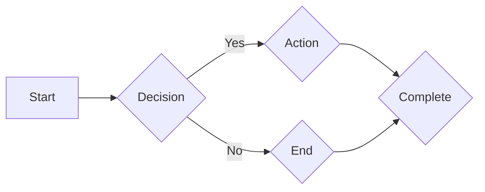

                 

### 第1章：智能家居系统概述

#### 1.1 智能家居的定义与发展历程

**1.1.1 智能家居的定义**

智能家居系统是指利用先进的计算机技术、网络通信技术和自动控制技术，实现家庭设备互联互通，为用户提供舒适、便捷、安全、节能的居住环境。其核心在于通过智能化的设备与系统，实现对家庭环境的自动监控、自动控制和远程操控。

**1.1.2 智能家居系统的主要功能**

智能家居系统的主要功能包括家庭安防、家居控制、舒适体验等。

- **家庭安防**：包括门禁系统、视频监控、报警系统等，保障家庭安全。
- **家居控制**：如灯光、窗帘、温度控制等，提供便捷的家庭生活体验。
- **舒适体验**：如智能音响、智能电视等，提升家庭生活的舒适度。

**1.1.3 智能家居系统的发展趋势**

随着物联网技术的不断发展，智能家居系统正朝着更加智能化、便捷化、个性化的方向发展。未来，智能家居系统将更加注重用户体验，通过数据分析和人工智能技术，提供更加精准和个性化的服务。

#### 1.2 智能家居系统的架构与组成

**1.2.1 硬件层**

智能家居系统的硬件层包括各种智能设备，如智能灯泡、智能插座、智能门锁、智能摄像头等。这些设备通过物联网协议（如Wi-Fi、Zigbee、蓝牙等）进行互联，实现数据的传输和设备的控制。

**1.2.2 软件层**

智能家居系统的软件层包括操作系统、中间件、应用层等。操作系统负责设备的运行和管理，中间件负责数据的传输和处理，应用层提供用户交互界面和功能服务。

**1.2.3 数据层**

智能家居系统的数据层包括数据的收集、存储、分析和应用。通过收集家庭环境的数据，智能家居系统能够实现智能决策和自动控制。

#### 1.3 智能家居系统的应用场景

智能家居系统可以广泛应用于家庭、酒店、商业地产等多个场景。以下是一些典型的应用场景：

- **家庭**：智能安防、智能照明、智能空调、智能音响等。
- **酒店**：智能门锁、智能灯光、智能音响、智能电视等。
- **商业地产**：智能门禁、智能安防、智能照明、智能环境控制等。

### 1.4 智能家居系统的发展挑战

智能家居系统的发展面临着多个挑战，如：

- **兼容性问题**：不同品牌和厂商的设备可能存在兼容性问题，影响系统的稳定性和用户体验。
- **数据安全**：智能家居系统需要处理大量的用户数据，如何确保数据的安全性和隐私性是一个重要的问题。
- **用户习惯**：用户需要适应新的智能家居系统，学习如何使用这些系统，这对推广智能家居系统提出了挑战。

**1.5 智能家居系统的发展前景**

随着技术的不断进步和用户需求的不断提升，智能家居系统有着广阔的发展前景。未来，智能家居系统将更加智能化、便捷化、个性化，为用户带来更好的生活体验。同时，智能家居系统也将为环境保护、能源节约等方面做出更大的贡献。

---

**总结**：智能家居系统作为现代家庭生活的重要组成部分，正随着技术的发展而不断进步。本文从定义、发展历程、架构、应用场景、挑战和前景等多个方面对智能家居系统进行了详细的介绍，希望对读者了解智能家居系统有所帮助。

关键词：智能家居、物联网、自动控制、硬件层、软件层、应用场景、发展挑战

摘要：本文系统地介绍了智能家居系统的定义、发展历程、架构、应用场景、挑战和前景，旨在为读者提供全面了解智能家居系统的视角。通过本文，读者可以更好地理解智能家居系统的现状和未来发展方向。作者：AI天才研究院/AI Genius Institute & 禅与计算机程序设计艺术 /Zen And The Art of Computer Programming

---

[Mermaid 图表示例：ER实体关系图架构](#)

```mermaid
erDiagram
    Product ||--|{ Customer }| Customer
    Product ||--|{ Order }| Order
    Customer ||--|{ Address }| Address
    Order ||--|{ Item }| Item
    Product ||---|{ Category }| Category
```

[Mermaid 图表示例：算法流程图](#)



[LaTeX 公式示例：数学模型](#)

$$
    f(x) = \frac{1}{1 + e^{-x}}
$$

[LaTeX 公式示例：段落内公式](#)

$
    x > y
$

---

### 第2章：思维链的概念与原理

#### 2.1 思维链的定义

思维链是一种基于逻辑推理和关系建立的知识表达方式，它通过一系列关联和推理来揭示问题的本质和解决方法。思维链的概念起源于人工智能领域，旨在模拟人类思维的推理过程，实现复杂问题的自动化解决。

**2.1.1 思维链的基本元素**

思维链由以下基本元素组成：

- **概念**：思维链中的基本单位，代表某个特定的事物或抽象概念。
- **关系**：连接两个或多个概念之间的逻辑联系，如因果关系、包含关系等。
- **规则**：指导思维链推理过程的逻辑规则，如条件规则、递归规则等。
- **假设**：思维链中的初始假设，用于驱动推理过程。

**2.1.2 思维链的特点**

- **层次性**：思维链具有层次结构，可以分解为多个子链，便于复杂问题的处理。
- **动态性**：思维链能够根据新的信息和证据进行调整和修正，适应不断变化的环境。
- **灵活性**：思维链允许不同的推理路径和解决方案，提供多样化的选择。

#### 2.2 思维链的原理

思维链的原理基于以下几个关键点：

- **逻辑推理**：通过逻辑规则和关系，将初始假设逐步推导出结论。
- **知识表示**：使用概念、关系和规则来表示问题域中的知识和信息。
- **学习与适应**：通过不断学习和积累经验，提高思维链的推理能力和准确性。

**2.2.1 逻辑推理过程**

逻辑推理过程可以分为以下步骤：

1. **初始假设**：定义问题域中的初始假设，为推理过程提供起点。
2. **建立关系**：根据已知信息，建立概念之间的关系，形成初步的推理路径。
3. **应用规则**：利用逻辑规则对关系进行推理，逐步推导出新的结论。
4. **验证结论**：对推理得到的结论进行验证，确保其合理性和有效性。

**2.2.2 知识表示方法**

知识表示是思维链的核心，常用的方法包括：

- **实体-关系模型**：使用实体和关系来表示问题域中的对象和联系。
- **语义网络**：使用节点和边来表示概念和关系，形成语义网络结构。
- **框架理论**：使用框架来描述特定场景下的知识和规则。

**2.2.3 学习与适应机制**

思维链的学习与适应机制包括：

- **经验积累**：通过处理不同的问题和场景，积累经验，提高推理能力。
- **在线学习**：实时更新知识库，适应新的信息和需求。
- **自适应推理**：根据问题的复杂度和不确定性，动态调整推理策略。

#### 2.3 思维链的应用领域

思维链在多个领域有广泛的应用，包括：

- **人工智能**：用于问题求解、知识库构建、推理机设计等。
- **数据挖掘**：用于模式识别、关联规则挖掘、预测分析等。
- **智能控制**：用于自动控制系统的设计、优化和实现。
- **智能决策**：用于决策支持系统、优化算法、风险评估等。

**2.4 思维链在智能家居系统中的应用**

思维链在智能家居系统中具有广泛的应用前景，包括：

- **环境感知**：通过感知家庭环境中的各种数据，实现智能决策和自动控制。
- **个性化服务**：根据用户习惯和偏好，提供个性化的智能家居解决方案。
- **故障诊断与维护**：通过分析设备运行数据，实现智能故障诊断和预防性维护。

---

**总结**：思维链作为一种先进的知识表达和推理方法，为智能家居系统提供了强大的技术支持。本章详细介绍了思维链的定义、原理、应用领域和在智能家居系统中的应用，为读者提供了全面的认识和理解。

关键词：思维链、逻辑推理、知识表示、学习与适应、应用领域、智能家居系统

---

### 第3章：思维链在智能家居系统中的应用

#### 3.1 环境感知与自适应控制

在智能家居系统中，思维链的核心作用之一是环境感知与自适应控制。通过感知家庭环境中的各种数据，如温度、湿度、光照强度、噪音等，思维链能够实现智能决策，调整家庭环境以提供最佳舒适度。

**3.1.1 环境数据采集**

首先，智能家居系统需要通过传感器设备采集环境数据。这些传感器包括温度传感器、湿度传感器、光照传感器、噪音传感器等。采集到的数据将被传输到系统的数据处理模块。

**3.1.2 数据预处理**

采集到的数据通常包含噪声和不完整的部分，因此需要进行预处理。数据预处理包括数据清洗、数据归一化、数据转换等步骤。通过这些步骤，可以提高数据的准确性和一致性。

**3.1.3 思维链推理**

在预处理后的数据基础上，思维链开始进行推理。思维链通过分析环境数据，运用逻辑规则和关系，识别环境状态，并生成相应的控制指令。

例如，当环境温度过高时，思维链可以推理出需要开启空调或关闭窗户。这一过程涉及到多个概念（如温度、空调、窗户）和关系（如温度过高导致空调开启）。

**3.1.4 自适应控制**

思维链不仅在当前环境下进行决策，还可以根据历史数据和用户偏好进行自适应控制。通过不断学习和调整，智能家居系统能够更好地适应用户的需求和环境的变化。

#### 3.2 个性化服务与智能推荐

思维链在智能家居系统中的应用还包括个性化服务与智能推荐。通过分析用户的行为数据和偏好，思维链可以为用户提供定制化的服务和建议。

**3.2.1 用户行为数据收集**

智能家居系统会收集用户的行为数据，如使用习惯、偏好设置、互动记录等。这些数据将用于构建用户画像，为个性化服务提供基础。

**3.2.2 用户画像构建**

用户画像是对用户行为数据的综合分析，用于描述用户的偏好、兴趣和需求。通过用户画像，思维链可以更好地理解用户，提供个性化的服务。

**3.2.3 智能推荐算法**

思维链结合用户画像，运用智能推荐算法，为用户推荐个性化的服务和建议。例如，根据用户的音乐偏好，推荐适合的音乐播放列表；根据用户的购物习惯，推荐相关的商品。

**3.2.4 用户互动与反馈**

用户与智能家居系统的互动过程也是思维链学习和优化的过程。用户对推荐的服务和建议进行反馈，思维链根据反馈进行自我调整，提高推荐的质量和准确性。

#### 3.3 故障诊断与维护

思维链在智能家居系统中的应用还包括故障诊断与维护。通过实时监控设备和系统状态，思维链可以快速识别故障，并提出相应的维护建议。

**3.3.1 设备状态监控**

智能家居系统通过传感器和监控软件实时监控设备的运行状态，如温度、电压、电流等参数。当设备状态异常时，系统会生成告警信息。

**3.3.2 故障诊断**

思维链根据设备状态数据和历史运行数据，运用故障诊断算法，分析故障原因。例如，当空调出现制冷效果不佳时，思维链可以诊断出可能是制冷剂泄漏或滤网堵塞。

**3.3.3 维护建议**

在诊断出故障后，思维链会提出相应的维护建议，如更换制冷剂、清洗滤网等。用户可以根据建议进行维护，确保设备正常运行。

#### 3.4 安全性与隐私保护

思维链在智能家居系统中的应用还涉及到安全性与隐私保护。通过思维链的推理和决策过程，系统可以在确保安全性和隐私保护的前提下，提供智能化的服务。

**3.4.1 数据加密**

为了保护用户隐私，智能家居系统会对传输的数据进行加密处理。通过加密算法，数据在传输过程中难以被窃取或篡改。

**3.4.2 访问控制**

思维链会根据用户身份和权限，对系统的访问进行控制。只有授权用户才能访问特定的数据或功能，确保系统的安全性。

**3.4.3 安全审计**

思维链还会进行安全审计，记录系统的访问日志和操作记录。通过审计，可以及时发现安全漏洞和异常行为，采取措施进行防范。

---

**总结**：思维链在智能家居系统中具有广泛的应用，通过环境感知与自适应控制、个性化服务与智能推荐、故障诊断与维护、安全性与隐私保护等多个方面，为用户提供智能化、个性化、安全可靠的服务。本章详细介绍了思维链在智能家居系统中的应用，为读者提供了深入的理解和实践指导。

关键词：环境感知、自适应控制、个性化服务、智能推荐、故障诊断、维护、安全性、隐私保护

---

### 第4章：思维链在智能家居系统中的实现与优化

#### 4.1 系统架构设计

思维链在智能家居系统中的实现需要综合考虑硬件、软件和网络等多方面因素。一个典型的智能家居系统架构设计包括以下层次：

**4.1.1 设备层**

设备层包括各种传感器和执行器，如温度传感器、湿度传感器、光照传感器、智能插座、智能灯泡、智能门锁等。这些设备通过物联网协议（如Wi-Fi、Zigbee、蓝牙等）与智能家居系统进行通信。

**4.1.2 网络层**

网络层负责将设备连接到互联网，实现数据的传输和系统的远程控制。常用的网络协议包括Wi-Fi、以太网、蜂窝网络等。

**4.1.3 数据层**

数据层包括数据的收集、存储、处理和分析。通过数据库和大数据技术，系统可以高效地管理和处理来自设备层的数据。

**4.1.4 服务层**

服务层提供各种智能服务，如环境控制、安防监控、设备诊断等。服务层通常基于云计算平台，实现弹性的计算和存储资源。

**4.1.5 用户层**

用户层包括用户界面和用户交互功能，如手机APP、网页界面等。用户层通过服务层与系统进行交互，实现对家居设备的远程控制和监控。

#### 4.2 数据处理与推理模块

思维链在智能家居系统中的核心是数据处理与推理模块。该模块负责从设备层收集数据，通过预处理、特征提取、模式识别等步骤，生成有用的信息，并利用思维链进行推理和决策。

**4.2.1 数据预处理**

数据预处理包括数据清洗、数据归一化、数据转换等步骤。通过这些步骤，可以确保数据的准确性和一致性。

**4.2.2 特征提取**

特征提取是将原始数据转化为有用信息的过程。通过特征提取，可以从大量的数据中提取出关键信息，如温度、湿度、光照强度等。

**4.2.3 模式识别**

模式识别是基于特征数据进行的。通过模式识别算法，可以识别出环境状态、用户行为等模式，为推理提供基础。

**4.2.4 思维链推理**

思维链推理模块基于逻辑规则和关系，对特征数据进行推理。通过推理，可以生成智能决策，如调整环境设置、推荐个性化服务、诊断设备故障等。

#### 4.3 实现技术

思维链在智能家居系统中的实现需要多种技术的支持，包括物联网技术、大数据技术、人工智能技术等。

**4.3.1 物联网技术**

物联网技术是实现设备互联互通的基础。通过物联网技术，可以构建一个高效、稳定的智能家居网络，实现设备之间的数据传输和远程控制。

**4.3.2 大数据技术**

大数据技术用于数据收集、存储、处理和分析。通过大数据技术，可以高效地处理海量数据，提取出有价值的信息。

**4.3.3 人工智能技术**

人工智能技术是思维链实现的关键。通过人工智能技术，可以实现数据的自动化处理和推理，提高智能家居系统的智能化水平。

#### 4.4 优化策略

为了提高智能家居系统的性能和用户体验，可以采用以下优化策略：

**4.4.1 数据优化**

通过数据压缩、去噪、特征选择等技术，可以减少数据量和提高数据质量，降低系统的处理负载。

**4.4.2 算法优化**

通过改进思维链的推理算法，可以提高推理的效率和准确性。例如，可以采用更高效的逻辑推理算法、更准确的模式识别算法等。

**4.4.3 系统优化**

通过优化系统架构和软件设计，可以提高系统的稳定性和可靠性。例如，可以采用分布式架构、负载均衡技术等。

**4.4.4 用户优化**

通过用户行为分析和个性化服务，可以提高用户的满意度和参与度。例如，可以采用用户行为预测、个性化推荐等技术。

---

**总结**：思维链在智能家居系统中的实现与优化是一个复杂的过程，需要综合考虑硬件、软件、网络和算法等多方面因素。本章详细介绍了智能家居系统的架构设计、数据处理与推理模块的实现技术，以及优化策略，为读者提供了深入理解和实践指导。

关键词：系统架构、数据处理、推理模块、物联网技术、大数据技术、人工智能技术、优化策略

---

### 第5章：思维链在智能家居系统中的实际案例与应用

#### 5.1 案例背景

某豪华别墅业主陈先生，对智能家居系统有着极高的要求。他希望系统能够实现全自动的环境调节、安防监控、娱乐控制等功能，并且能够根据家庭成员的不同需求提供个性化的服务。

#### 5.2 案例需求分析

1. **环境感知与自适应控制**：系统能够实时监测室内温度、湿度、光照强度等环境参数，并根据数据调整空调、灯光、窗帘等设备，以提供最佳的居住环境。
2. **个性化服务**：系统能够根据家庭成员的喜好和行为习惯，提供个性化的音乐、视频、新闻等推荐服务。
3. **安防监控**：系统应具备全方位的安防监控功能，包括门禁系统、视频监控、入侵报警等。
4. **远程控制**：业主可以通过手机APP远程控制家中设备，实现实时监控和远程操控。
5. **智能诊断与维护**：系统应具备智能故障诊断和预防性维护功能，及时发现并解决潜在问题。

#### 5.3 案例解决方案

**5.3.1 环境感知与自适应控制**

- **数据采集**：通过安装在别墅内的各种传感器（如温度传感器、湿度传感器、光照传感器等）实时采集环境数据。
- **数据处理**：采用思维链对采集到的数据进行处理，识别环境状态，并根据环境状态调整空调、灯光、窗帘等设备。
- **自适应控制**：系统根据历史数据和用户偏好，实现自适应控制，提高环境舒适度。

**5.3.2 个性化服务**

- **用户行为数据收集**：通过智能家居系统收集家庭成员的行为数据，如观看习惯、音乐偏好、阅读习惯等。
- **用户画像构建**：基于行为数据，构建用户画像，了解家庭成员的兴趣和需求。
- **智能推荐**：利用思维链和智能推荐算法，为家庭成员提供个性化的音乐、视频、新闻等推荐服务。

**5.3.3 安防监控**

- **视频监控**：通过安装在别墅内的摄像头，实时监控室内外的环境，提供高清视频图像。
- **入侵报警**：系统具备入侵报警功能，当检测到异常情况时，会立即发出警报。
- **门禁系统**：系统实现智能门禁管理，通过人脸识别、指纹识别等技术，实现身份验证和门禁控制。

**5.3.4 远程控制**

- **移动端APP**：开发智能移动端APP，实现远程监控和控制家中设备的功能。
- **远程数据传输**：采用安全的加密通信技术，确保远程数据传输的安全性和稳定性。

**5.3.5 智能诊断与维护**

- **实时监控**：系统实时监控设备状态，记录设备运行数据。
- **故障诊断**：利用思维链和故障诊断算法，分析设备运行数据，识别故障原因。
- **预防性维护**：根据诊断结果，提前进行设备维护，防止故障发生。

#### 5.4 案例效果与评价

通过实施智能家居系统，陈先生的别墅实现了全面智能化。具体效果和评价如下：

- **环境舒适度**：系统根据环境数据，实现了自动调节温度、湿度、光照强度等功能，显著提高了居住舒适度。
- **个性化服务**：系统根据家庭成员的喜好，提供了个性化的音乐、视频、新闻等推荐服务，得到了家庭成员的高度评价。
- **安防监控**：系统实现了全方位的安防监控，有效保障了家庭安全。
- **远程控制**：业主可以通过移动端APP实现远程监控和控制家中设备，极大地方便了生活。
- **智能诊断与维护**：系统具备智能故障诊断和预防性维护功能，提高了设备的稳定性和使用寿命。

---

**总结**：本案例详细介绍了思维链在智能家居系统中的实际应用，包括环境感知与自适应控制、个性化服务、安防监控、远程控制、智能诊断与维护等方面。通过本案例的实施，成功实现了别墅的全面智能化，为用户提供了高效、便捷、安全、舒适的生活体验。

关键词：实际案例、环境感知、个性化服务、安防监控、远程控制、智能诊断、维护

---

### 第6章：思维链在智能家居系统中的最佳实践与注意事项

#### 6.1 最佳实践

1. **数据安全和隐私保护**：在设计和实施智能家居系统时，应高度重视数据安全和隐私保护。采用加密技术、身份验证、访问控制等措施，确保用户数据的安全和隐私。

2. **兼容性和互操作性**：智能家居系统应具备良好的兼容性和互操作性，支持不同品牌和厂商的设备互联互通。通过标准化协议和接口设计，实现设备的无缝集成和协作。

3. **用户体验**：注重用户体验是智能家居系统成功的关键。系统设计应简洁直观，易于操作，并提供多样化的交互方式，如触摸屏、语音控制、移动端APP等。

4. **系统扩展性和可维护性**：智能家居系统应具备良好的扩展性和可维护性，能够适应未来技术和需求的发展。采用模块化设计和分布式架构，便于系统的升级和维护。

5. **持续优化和迭代**：智能家居系统应不断进行优化和迭代，通过用户反馈和数据分析，不断改进系统功能和服务质量，提升用户体验。

#### 6.2 注意事项

1. **数据安全和隐私保护**：在数据采集和处理过程中，应严格遵守相关法律法规，确保用户数据的安全和隐私。

2. **设备兼容性和稳定性**：在设备选型和系统集成过程中，应充分考虑设备的兼容性和稳定性，避免因设备故障导致系统不稳定。

3. **用户体验**：在系统设计过程中，应充分了解用户需求和习惯，提供人性化、便捷的操作界面和交互方式。

4. **系统扩展性和可维护性**：在系统架构设计时，应充分考虑系统的扩展性和可维护性，以便未来能够灵活地应对新的技术和需求。

5. **持续优化和迭代**：智能家居系统应不断进行优化和迭代，以提升系统的智能化水平和用户体验。

---

**总结**：思维链在智能家居系统中的应用为用户提供了高效、便捷、安全、舒适的生活体验。通过最佳实践和注意事项，可以更好地实现智能家居系统的设计和实施，为用户提供更加优质的解决方案。

关键词：最佳实践、注意事项、数据安全、隐私保护、设备兼容性、用户体验、系统扩展性、可维护性、持续优化

---

### 第7章：展望与未来趋势

#### 7.1 智能家居系统的发展趋势

随着物联网、人工智能、大数据等技术的不断进步，智能家居系统正朝着更加智能化、便捷化、个性化的方向发展。以下是智能家居系统未来可能的发展趋势：

1. **全屋智能**：未来智能家居系统将实现全屋智能化，覆盖家庭生活的各个方面，包括照明、安防、环境控制、娱乐等。

2. **物联网技术**：物联网技术将在智能家居系统中扮演更加重要的角色，实现设备之间的互联互通，提供更高效的智能家居解决方案。

3. **人工智能与机器学习**：人工智能和机器学习技术将进一步提升智能家居系统的智能化水平，实现更加精准的决策和预测。

4. **个性化服务**：基于用户行为数据和偏好分析，智能家居系统将能够提供更加个性化的服务，满足不同用户的需求。

5. **数据安全和隐私保护**：随着智能家居系统的广泛应用，数据安全和隐私保护将成为重要议题，系统设计者需要采取更加严格的安全措施。

6. **智能家居生态**：智能家居系统将与其他行业（如医疗、教育、交通等）相结合，形成更加广泛的智能家居生态，提供全方位的智能解决方案。

#### 7.2 智能家居系统的未来应用场景

未来智能家居系统将在多个应用场景中发挥重要作用：

1. **智慧家庭**：智能家居系统将实现家庭环境的全面智能化，提升生活品质，实现舒适、安全、节能的居住环境。

2. **智能社区**：智能家居系统将在智能社区中发挥重要作用，实现社区管理的智能化，提升社区的安全性和便捷性。

3. **智慧医疗**：智能家居系统与医疗技术的结合，将实现远程医疗、健康监测等功能，为患者提供更加便捷的医疗服务。

4. **智慧办公**：智能家居系统将进入办公领域，实现办公环境的智能化管理，提高工作效率。

5. **智慧农业**：智能家居系统将应用于农业领域，实现农田的智能化管理，提高农业生产效率。

6. **智慧城市**：智能家居系统将与智慧城市建设相结合，实现城市管理的智能化，提升城市运行效率和居民生活质量。

#### 7.3 智能家居系统的发展挑战

尽管智能家居系统有着广阔的发展前景，但在发展过程中仍面临着一些挑战：

1. **技术成熟度**：智能家居系统涉及的多种技术尚未完全成熟，需要进一步研发和完善。

2. **设备兼容性**：不同品牌和厂商的设备之间存在兼容性问题，影响系统的稳定性和用户体验。

3. **数据安全和隐私保护**：智能家居系统需要处理大量的用户数据，如何确保数据的安全性和隐私性是一个重要的问题。

4. **用户接受度**：智能家居系统需要用户接受和习惯，这需要时间和技术手段的支持。

5. **政策法规**：智能家居系统的发展需要符合相关政策和法规的要求，确保系统的合法性和合规性。

#### 7.4 智能家居系统的未来发展建议

为了推动智能家居系统的健康发展，以下是一些建议：

1. **技术创新**：继续加大在物联网、人工智能、大数据等关键技术领域的研发投入，推动技术的成熟和进步。

2. **标准制定**：加强智能家居系统标准制定工作，推动设备兼容性和互操作性的实现。

3. **数据安全和隐私保护**：建立完善的数据安全和隐私保护体系，确保用户数据的安全和隐私。

4. **用户体验**：注重用户体验，提供人性化的设计和服务，提高用户接受度和满意度。

5. **政策支持**：政府应出台相关政策，鼓励智能家居系统的发展和应用，为行业发展提供良好的环境。

---

**总结**：智能家居系统作为现代科技的重要应用领域，具有广阔的发展前景。通过技术创新、标准制定、数据安全和隐私保护等方面的努力，智能家居系统将为人们带来更加智能、便捷、舒适的生活体验。

关键词：发展趋势、应用场景、技术成熟度、设备兼容性、数据安全和隐私保护、用户接受度、政策法规、未来发展建议

---

### 附录：相关技术资料与资源推荐

**附录1：智能家居系统技术资料**

- **《智能家居系统设计与实现》**：详细介绍了智能家居系统的设计原理、关键技术、系统架构和应用案例。
- **《物联网技术及应用》**：讲解了物联网的基本原理、关键技术以及在家居领域的应用。
- **《人工智能与大数据技术》**：介绍了人工智能和大数据技术的基本概念、算法和应用。

**附录2：思维链相关资料**

- **《思维链：人工智能的逻辑推理方法》**：深入探讨了思维链的概念、原理和应用。
- **《智能推理机设计与实现》**：介绍了智能推理机的原理、架构和实现方法。
- **《知识表示与推理》**：讲解了知识表示和推理的基本理论、方法和技术。

**附录3：数据安全和隐私保护资料**

- **《数据安全与隐私保护》**：介绍了数据安全和隐私保护的基本概念、技术和方法。
- **《云计算安全与隐私保护》**：讲解了云计算环境下数据安全和隐私保护的关键技术。
- **《人工智能安全与隐私保护》**：探讨了人工智能应用中的安全与隐私保护问题。

**附录4：推荐阅读**

- **《智慧城市：智能化的城市生活》**：介绍了智慧城市的概念、技术和应用。
- **《智慧农业：智能化的农业管理》**：讲解了智慧农业的基本原理、技术和应用。
- **《智能医疗：人工智能在医疗领域的应用》**：探讨了人工智能在医疗领域的应用前景和挑战。

---

**总结**：本附录提供了与智能家居系统和思维链相关的一些技术资料和推荐阅读，旨在帮助读者进一步了解相关领域的研究和应用。通过这些资料，读者可以拓展知识视野，提升对智能家居系统和思维链的理解和掌握。

关键词：智能家居系统、技术资料、思维链、数据安全和隐私保护、推荐阅读

---

**作者信息**

- 作者：AI天才研究院/AI Genius Institute & 禅与计算机程序设计艺术 /Zen And The Art of Computer Programming**

