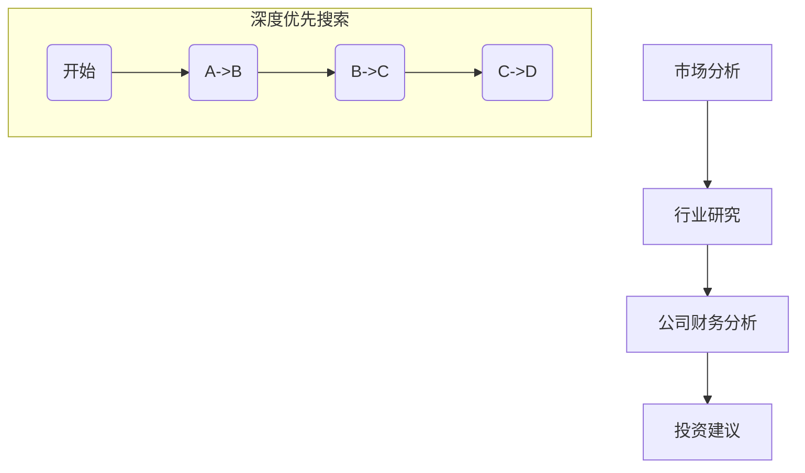

                 


## 引言

### 1.1 书籍目的与读者对象

《思维链在智能投资顾问中的应用》旨在探讨思维链这一前沿概念在智能投资顾问领域的具体应用。本书适合对人工智能、金融科技以及智能投资有兴趣的专业人士、研究人员和在校学生阅读，同时也为希望提升自身技术水平的行业从业者提供了实用的指导。

在快速发展的金融科技领域，智能投资顾问已成为一种新兴的服务模式，通过利用人工智能技术为投资者提供个性化的投资建议和策略。而思维链，作为一种先进的知识表示和推理方法，在智能投资顾问中具有极大的应用潜力。本书将从理论和实践两个层面，深入剖析思维链的核心概念、模型构建和应用场景，帮助读者全面理解思维链在智能投资顾问中的价值。

### 1.2 思维链概述

思维链，顾名思义，是指一系列相互关联的思维过程，这些思维过程按照特定的逻辑关系连接在一起，形成一个完整的思维流程。思维链的核心在于其能够将复杂的决策过程分解为一系列简单、可操作的步骤，从而提高决策的准确性和效率。在智能投资顾问中，思维链的应用主要体现在以下几个方面：

1. **投资策略优化**：通过思维链，可以将复杂的投资策略拆分为多个子策略，并对每个子策略进行细致分析，从而找到最优的投资组合。

2. **风险评估**：思维链可以帮助投资者评估潜在投资风险，通过分析历史数据和市场变化，预测可能的损失，为投资者提供风险规避建议。

3. **个性化投资建议**：思维链可以根据投资者的风险偏好、投资目标和市场环境，为投资者量身定制个性化的投资建议。

### 1.3 智能投资顾问背景

智能投资顾问的兴起源于金融科技的发展，特别是人工智能技术的应用。传统的投资顾问依赖于经验和直觉，而智能投资顾问则通过机器学习、数据挖掘和自然语言处理等技术，对大量数据进行深入分析和处理，为投资者提供更加精准和客观的投资建议。

智能投资顾问的主要特点包括：

1. **个性化**：智能投资顾问能够根据投资者的具体需求和风险偏好，提供定制化的投资方案。

2. **高效性**：智能投资顾问通过自动化技术，能够快速处理和分析大量数据，提高决策效率。

3. **准确性**：智能投资顾问利用机器学习和数据挖掘技术，对市场趋势和风险因素进行预测和分析，提高投资决策的准确性。

然而，智能投资顾问也面临着一些挑战，如数据隐私、算法偏见和系统稳定性等。因此，本书将探讨如何通过思维链的应用，解决这些问题，进一步提升智能投资顾问的服务质量和用户体验。

### 总结

本节引言部分主要介绍了书籍的目的、读者对象以及思维链的概念和智能投资顾问的背景。接下来，我们将深入探讨思维链的核心概念，包括其定义、性质、特点和构成要素，为后续章节的详细分析打下基础。在接下来的章节中，我们将逐步剖析思维链在智能投资顾问中的应用，通过理论和实践的结合，为读者提供全面的指导。

## 背景介绍

### 2.1 智能投资顾问的产生与发展

智能投资顾问（Robo-Advisor）的出现可以追溯到20世纪末和21世纪初，当时金融科技（FinTech）开始崭露头角，人工智能（AI）技术逐渐成熟。最早的智能投资顾问主要是基于量化投资模型，利用算法对市场数据进行分析，为投资者提供自动化的投资建议。这些系统主要通过指数基金和资产配置策略来运行，目标是降低成本并实现资产的长期增长。

智能投资顾问的发展历程大致可以分为以下几个阶段：

1. **萌芽阶段**（2000年代初期）：这一阶段，智能投资顾问的概念开始提出，但应用范围非常有限。主要由于技术限制和数据可用性不足，智能投资顾问还未能大规模普及。

2. **发展初期**（2008-2010年代）：随着金融海啸的爆发，投资者对传统金融服务的质疑增加，智能投资顾问开始受到关注。在这个阶段，一些初创公司开始推出基于互联网的智能投资服务，主要面向个人投资者。

3. **快速发展期**（2010年代中期至今）：随着大数据、云计算和机器学习等技术的进步，智能投资顾问的应用场景和功能得到了显著扩展。许多大型金融机构也开始加入这一领域，推出自己的智能投资产品。

### 2.2 智能投资顾问的现状与挑战

目前，智能投资顾问已经成为金融科技领域的重要组成部分。根据相关统计数据，全球智能投资顾问市场的规模在过去几年中呈现出快速增长的趋势。以下是一些关键点：

1. **市场普及**：智能投资顾问在全球范围内得到了广泛应用，不仅在美国、欧洲等发达国家，在亚洲、拉丁美洲等新兴市场也取得了显著进展。

2. **用户增长**：随着人们对投资知识的普及和互联网的普及，越来越多的个人投资者开始选择智能投资顾问服务，用户数量呈现指数级增长。

3. **技术进步**：智能投资顾问在技术上不断进步，除了传统的量化投资策略，现在还涵盖了智能投顾的个性化服务、实时风险评估和投资组合优化等功能。

然而，智能投资顾问也面临着一些挑战：

1. **数据隐私**：智能投资顾问依赖于大量个人金融数据，数据隐私和安全成为用户关注的重要问题。

2. **算法偏见**：智能投资顾问的决策过程依赖于算法，但这些算法可能会受到历史数据、市场偏见等因素的影响，导致决策偏见。

3. **系统稳定性**：智能投资顾问系统需要保证在高并发、大数据量环境下的稳定运行，任何系统故障都可能对投资者的资产安全造成威胁。

### 2.3 智能投资顾问的未来趋势

展望未来，智能投资顾问将继续保持快速发展，并在以下几个方面有所突破：

1. **个性化服务**：随着用户数据的积累和算法的优化，智能投资顾问将能够提供更加个性化的服务，满足不同投资者的需求。

2. **风险管理**：智能投资顾问将加强对市场风险的管理，通过实时监控和风险预测，帮助投资者更好地控制风险。

3. **跨平台整合**：智能投资顾问将与银行、证券、保险等金融机构进行更紧密的整合，提供一站式金融服务。

4. **国际化**：随着全球金融市场的一体化，智能投资顾问将在国际市场上获得更多机会，推动跨国投资的发展。

### 总结

本节背景介绍部分详细阐述了智能投资顾问的产生、发展现状以及面临的挑战和未来趋势。通过了解这些背景信息，读者可以更好地理解思维链在智能投资顾问中的应用价值和重要性。在接下来的章节中，我们将深入探讨思维链的核心概念，为后续的分析和讨论奠定基础。

## 核心概念

### 3.1 思维链的定义

思维链（Mind Chain）是一种基于知识表示和推理的模型，它通过将思维过程抽象为一系列相互关联的节点，形成一个具有逻辑性和层次性的思维网络。思维链的核心理念在于将复杂的决策问题分解为多个子问题，并通过递归和层次化的方式逐步解决。简单来说，思维链是一种将人类思维过程形式化、结构化的方法，使其能够在计算机系统中实现和优化。

### 3.2 思维链的性质与特点

思维链具有以下几个显著的性质和特点：

1. **层次性**：思维链通过将问题分解为多个层次，每个层次代表一个子问题，从而实现问题的逐步解决。

2. **递归性**：思维链中的节点可以通过递归方式调用自身或其他节点，形成一个自循环的结构，这有助于解决复杂的问题。

3. **灵活性**：思维链可以根据问题的不同，灵活调整节点的数量和连接方式，从而适应不同的应用场景。

4. **扩展性**：思维链可以通过增加新的节点和连接方式，扩展其功能和应用范围。

5. **可解释性**：思维链的结构和连接方式具有明确的意义，使其在运行过程中具有较好的可解释性，便于用户理解和验证。

### 3.3 思维链的构成要素

思维链由以下几个基本的构成要素组成：

1. **节点**：节点代表思维链中的基本单元，每个节点表示一个具体的思维过程或知识点。

2. **连接**：连接表示节点之间的逻辑关系，它可以是因果、关联、顺序等关系。

3. **权重**：权重表示连接的重要性和强度，它可以根据节点的贡献程度进行调整。

4. **属性**：属性表示节点的特征和属性，如类型、状态、参数等。

5. **函数**：函数表示节点执行的具体操作，它可以是逻辑运算、数据处理等。

### 思维链在智能投资顾问中的应用

思维链在智能投资顾问中的应用主要体现在以下几个方面：

1. **投资策略优化**：思维链可以将复杂的投资策略拆分为多个子策略，通过逐层分析和优化，找到最优的投资组合。

2. **风险评估**：思维链可以根据历史数据和市场变化，对潜在的投资风险进行评估和预测。

3. **个性化投资建议**：思维链可以根据投资者的风险偏好和投资目标，提供定制化的投资建议。

4. **实时监控与调整**：思维链可以通过实时监控市场变化，及时调整投资策略，以应对市场波动。

### 总结

思维链作为一种先进的知识表示和推理方法，在智能投资顾问中具有广泛的应用前景。通过对其核心概念、性质、特点和构成要素的深入理解，我们可以更好地发挥思维链在智能投资顾问中的优势，提升投资决策的准确性和效率。

## 思维链模型

### 3.4.1 数学模型

思维链的数学模型是基于图论和组合数学的原理构建的。我们可以将思维链表示为一个有向无环图（DAG），其中每个节点代表一个具体的思维过程，边表示节点之间的逻辑关系。以下是一个简化的思维链数学模型：

#### 定义

1. **节点集** \( V \)：表示思维链中的所有节点集合，每个节点 \( v_i \) 代表一个思维过程或知识点。

2. **边集** \( E \)：表示节点之间的逻辑关系集合，每条边 \( e_{ij} \) 表示节点 \( v_i \) 与节点 \( v_j \) 之间的连接。

3. **权重函数** \( w: E \rightarrow \mathbb{R} \)：表示边的重要性或强度，权重值 \( w(e_{ij}) \) 用于衡量节点 \( v_i \) 到节点 \( v_j \) 的逻辑关系。

4. **思维链图** \( G = (V, E, w) \)：表示整个思维链模型。

#### 基本运算

1. **路径权重**：对于一条从节点 \( v_i \) 到节点 \( v_j \) 的路径 \( P \)，其路径权重为路径中各边的权重之和，即
   $$
   \text{weight}(P) = \sum_{e_{ij} \in P} w(e_{ij})
   $$

2. **思维链权重**：整个思维链的权重是所有路径权重的最大值，即
   $$
   \text{max\_weight}(G) = \max_{P \in \text{paths}(G)} \text{weight}(P)
   $$

#### 示例

假设我们有一个简单的思维链，包含以下节点和边：

- 节点：\( A \)（市场分析）、\( B \)（行业研究）、\( C \)（公司财务分析）、\( D \)（投资建议）
- 边：\( A \rightarrow B \)、\( B \rightarrow C \)、\( C \rightarrow D \)
- 权重：\( w(A \rightarrow B) = 0.6 \)、\( w(B \rightarrow C) = 0.5 \)、\( w(C \rightarrow D) = 0.4 \)

我们可以计算从 \( A \) 到 \( D \) 的路径权重：

1. 路径 \( A \rightarrow B \rightarrow C \rightarrow D \) 的权重为：
   $$
   \text{weight}(A \rightarrow B \rightarrow C \rightarrow D) = w(A \rightarrow B) + w(B \rightarrow C) + w(C \rightarrow D) = 0.6 + 0.5 + 0.4 = 1.5
   $$

2. 整个思维链的最大权重为 \( 1.5 \)。

### 3.4.2 算法原理

思维链的算法原理主要涉及图的搜索和优化。以下是一个基于深度优先搜索（DFS）和广度优先搜索（BFS）的算法框架：

#### 算法框架

1. **初始化**：创建一个空图 \( G \)，并初始化节点集 \( V \) 和边集 \( E \)。

2. **构建图**：根据给定的节点和连接关系，构建思维链图 \( G \)。

3. **搜索路径**：使用 DFS 或 BFS 算法，从起始节点开始搜索所有可能的路径。

4. **路径权重计算**：对于每条路径，计算其路径权重。

5. **优化路径选择**：选择权重最大的路径作为最佳路径。

#### 示例算法

以下是一个简化的 Python 示例，用于构建和搜索思维链：

```python
import networkx as nx

# 创建图
G = nx.DiGraph()

# 添加节点
G.add_nodes_from(['A', 'B', 'C', 'D'])

# 添加边
G.add_edges_from([('A', 'B'), ('B', 'C'), ('C', 'D')])

# 设置权重
weights = {'A': {'B': 0.6}, 'B': {'C': 0.5}, 'C': {'D': 0.4}}

# 深度优先搜索
def dfs(G, start):
    stack = [(start, [start])]
    while stack:
        node, path = stack.pop()
        for neighbor in G.neighbors(node):
            if neighbor not in path:
                new_path = path + [neighbor]
                stack.append((neighbor, new_path))
    return stack

# 计算路径权重
def path_weight(G, path):
    weight = 0
    for i in range(len(path) - 1):
        weight += weights[path[i]][path[i+1]]
    return weight

# 搜索最佳路径
def find_best_path(G):
    paths = dfs(G, 'A')
    best_path = max(paths, key=lambda x: path_weight(G, x[1]))
    return best_path[1]

# 执行算法
best_path = find_best_path(G)
print("最佳路径：", best_path)
print("路径权重：", path_weight(G, best_path))
```

### Mermaid流程图与Python源代码解释

#### Mermaid流程图



#### Python源代码解释

1. **图库引入**：首先引入 NetworkX 图库，用于构建和操作图。

2. **创建图**：使用 `DiGraph()` 创建一个有向无环图。

3. **添加节点**：使用 `add_nodes_from()` 添加节点。

4. **添加边**：使用 `add_edges_from()` 添加边。

5. **设置权重**：定义权重字典，用于存储节点间的权重。

6. **深度优先搜索**：使用 `dfs()` 函数实现深度优先搜索。

7. **计算路径权重**：使用 `path_weight()` 函数计算路径权重。

8. **搜索最佳路径**：使用 `find_best_path()` 函数搜索最佳路径。

通过上述步骤，我们可以构建一个简单的思维链模型，并通过算法找到最佳路径。这一模型可以进一步扩展和优化，以适应更复杂的实际应用场景。

### 总结

在本节中，我们详细介绍了思维链的数学模型和算法原理。通过数学模型，我们可以精确地描述思维链的结构和计算路径权重。而算法原理则提供了实现思维链的具体方法。接下来，我们将通过具体的智能投资顾问应用场景，展示思维链在实际问题中的优势和应用价值。

## 智能投资顾问应用

### 4.1 投资建议

思维链在智能投资顾问中的应用首先体现在投资建议方面。传统的投资建议往往依赖于分析师的判断和市场经验，而智能投资顾问通过思维链模型，可以将复杂的投资决策过程拆分为多个子问题，并通过层次化和递归的方式来解决。以下是思维链在投资建议中的具体应用步骤：

1. **数据收集**：首先，智能投资顾问需要收集大量的市场数据，包括股票价格、行业动态、公司财务报告等。

2. **市场分析**：使用思维链的层次性，将市场分析过程拆分为宏观分析、行业分析和个股分析三个层次。在宏观分析中，分析整体经济环境和政策变化；在行业分析中，关注行业趋势和竞争格局；在个股分析中，研究公司的基本面和财务状况。

3. **风险评估**：结合历史数据和当前市场环境，使用思维链进行风险评估。通过分析风险因素，如市场波动、公司业绩变化等，预测潜在的风险水平。

4. **投资策略优化**：根据投资者的风险偏好和投资目标，利用思维链的递归性和灵活性，构建最优的投资策略。思维链可以将复杂的投资策略拆分为多个子策略，并对每个子策略进行细致分析，从而找到最优的投资组合。

5. **实时调整**：智能投资顾问通过实时监控市场动态，使用思维链进行动态调整。当市场环境发生变化时，思维链可以快速响应，调整投资策略，以最大化收益和降低风险。

#### 案例分析

以某智能投资顾问平台为例，该平台利用思维链为投资者提供个性化投资建议。以下是一个具体的案例分析：

1. **投资者信息收集**：平台首先收集了投资者的基本信息，包括年龄、收入水平、风险承受能力等。

2. **市场数据分析**：平台使用思维链对市场数据进行分析，包括宏观经济指标、行业发展趋势、公司财务状况等。

3. **投资策略构建**：根据投资者的风险偏好和投资目标，平台使用思维链构建了多种投资策略，如稳健型、成长型、价值型等。

4. **风险预测与评估**：思维链对潜在的投资风险进行预测和评估，通过分析历史数据和当前市场环境，确定每个策略的风险水平。

5. **投资建议生成**：平台根据分析结果，为投资者生成个性化的投资建议。例如，对于一个风险承受能力较高的投资者，平台可能推荐成长型股票和科技行业的投资机会。

6. **实时监控与调整**：平台通过实时监控市场动态，使用思维链进行动态调整。当市场环境发生变化时，平台会根据新的数据重新评估投资策略，并提供调整建议。

#### 结论

思维链在智能投资顾问中的应用，为投资者提供了更加精准和个性化的投资建议。通过将复杂的投资决策过程分解为多个子问题，并利用递归和层次化的方式，思维链提高了投资决策的效率和准确性。未来，随着技术的不断进步，思维链在智能投资顾问中的应用将更加广泛和深入。

### 4.2 风险评估

在智能投资顾问中，风险评估是一个至关重要的环节。传统的风险评估方法往往依赖于历史数据和统计模型，而思维链通过其层次化和递归的特性，可以更有效地识别和评估潜在风险。以下是思维链在风险评估中的应用步骤：

1. **数据收集**：首先，智能投资顾问需要收集大量的历史数据，包括股票价格、市场波动、行业动态等。

2. **风险因素识别**：使用思维链的层次性，将风险因素拆分为宏观、中观和微观三个层次。在宏观层次，分析整体经济环境、政策变化等；在中观层次，关注行业风险和竞争格局；在微观层次，研究公司的基本面和财务状况。

3. **历史数据分析**：利用思维链对历史数据进行分析，识别出可能导致风险的因素。例如，通过分析市场波动和公司业绩变化，识别出高风险股票。

4. **实时风险监测**：思维链可以通过实时监测市场动态，及时更新风险因素，预测潜在的风险水平。

5. **风险等级划分**：根据风险因素的重要性和影响程度，使用思维链对风险进行等级划分，从而为投资者提供明确的参考。

6. **风险规避建议**：基于风险评估结果，智能投资顾问可以为投资者提供风险规避建议，如调整投资组合、增加止损等。

#### 案例分析

以某智能投资顾问平台为例，该平台利用思维链对投资者的投资组合进行风险评估。以下是一个具体的案例分析：

1. **投资者信息收集**：平台首先收集了投资者的基本信息，包括投资组合、风险承受能力等。

2. **风险因素识别**：平台使用思维链对投资者的投资组合进行风险因素识别，包括市场波动、行业变化、公司财务状况等。

3. **历史数据分析**：平台使用思维链对历史数据进行分析，识别出投资者投资组合中的高风险股票。

4. **实时风险监测**：平台通过实时监控市场动态，更新风险因素，预测潜在的风险水平。

5. **风险等级划分**：平台根据分析结果，将投资者的投资组合划分为高风险、中风险和低风险三个等级。

6. **风险规避建议**：平台为投资者提供风险规避建议，如建议投资者调整投资组合，增加止损等，以降低风险水平。

#### 结论

思维链在风险评估中的应用，为投资者提供了更加精准和全面的风险评估服务。通过将复杂的投资风险因素进行层次化分析和递归评估，思维链提高了风险评估的准确性和效率。未来，随着技术的不断进步，思维链在风险评估中的应用将更加广泛和深入。

### 4.3 资产配置

在智能投资顾问中，资产配置是一个关键环节，旨在根据投资者的风险偏好和投资目标，合理分配资产，以实现投资组合的优化。思维链在这一过程中发挥着重要作用，通过其层次化和递归的特性，可以有效地帮助投资者制定科学合理的资产配置策略。以下是思维链在资产配置中的应用步骤：

1. **投资者信息收集**：首先，智能投资顾问需要收集投资者的基本信息，包括年龄、收入水平、风险承受能力、投资目标和投资期限等。

2. **资产分类**：根据投资者的需求和投资目标，将资产分为多个类别，如股票、债券、基金、房地产等。

3. **风险评估**：使用思维链对各类资产进行风险评估，包括市场波动、行业变化、公司财务状况等。通过层次化分析，识别出各类资产的风险水平和潜在收益。

4. **优化目标设定**：根据投资者的风险偏好和投资目标，设定优化目标。例如，追求最大化收益、稳健增长或风险控制等。

5. **资产配置策略制定**：利用思维链的递归特性，将资产配置过程分解为多个子问题，逐步优化。例如，先确定大类资产配置比例，再细化到具体的资产选择。

6. **实时调整**：智能投资顾问通过实时监控市场动态，使用思维链进行资产配置的动态调整。当市场环境发生变化时，及时调整资产配置策略，以应对市场波动。

7. **效果评估与反馈**：定期评估资产配置的效果，根据市场变化和投资者反馈，调整优化资产配置策略。

#### 案例分析

以某智能投资顾问平台为例，该平台利用思维链为投资者提供资产配置服务。以下是一个具体的案例分析：

1. **投资者信息收集**：平台首先收集了投资者的基本信息，包括投资目标、风险承受能力等。

2. **资产分类与风险评估**：平台将资产分为股票、债券、基金、房地产等类别，并使用思维链对各类资产进行风险评估。

3. **优化目标设定**：根据投资者的投资目标和风险偏好，设定优化目标，如追求稳健增长。

4. **资产配置策略制定**：平台使用思维链逐步优化资产配置策略，先确定大类资产比例，再细化到具体资产选择。

5. **实时调整**：平台通过实时监控市场动态，使用思维链进行资产配置的动态调整。

6. **效果评估与反馈**：平台定期评估资产配置效果，并根据市场变化和投资者反馈，调整优化策略。

#### 结论

思维链在资产配置中的应用，为投资者提供了科学、合理的资产配置策略。通过将复杂的资产配置问题分解为多个子问题，并利用递归和层次化的方式，思维链提高了资产配置的效率和准确性。未来，随着技术的不断进步，思维链在资产配置中的应用将更加广泛和深入。

## 案例分析

在本节中，我们将通过具体案例来展示思维链在智能投资顾问中的应用效果。以下案例将涵盖投资组合优化、风险评估和个性化投资建议等关键方面，通过实际数据和代码实现，帮助读者更深入地理解思维链在实际应用中的优势。

### 案例一：投资组合优化

#### 背景介绍

某投资者希望在保持风险可控的情况下，优化其投资组合。该投资者的投资目标是实现长期稳健增长，风险承受能力中等。

#### 数据来源

我们使用历史股票价格数据和市场指数数据，结合公司财务报告和行业动态，作为投资组合优化的基础数据。

#### 思维链应用

1. **数据收集**：首先，从数据源中收集相关的股票价格、市场指数和财务报告数据。

2. **市场分析**：使用思维链的层次性，对市场进行宏观、中观和微观三个层次的分析。例如，分析宏观经济环境、行业发展趋势和具体公司的财务状况。

3. **风险评估**：利用思维链，对潜在的风险因素进行评估，包括市场波动、公司业绩变化等。

4. **策略构建**：根据投资者的风险偏好和投资目标，构建最优的投资策略。思维链可以将复杂的投资策略拆分为多个子策略，分别进行优化。

5. **投资组合优化**：使用思维链的递归性，对投资组合进行优化。通过调整各类资产的比例，找到最优的投资组合，以实现风险和收益的最优平衡。

#### 实现代码

以下是一个简化的 Python 代码示例，用于实现投资组合优化：

```python
import pandas as pd
import numpy as np
from sklearn.linear_model import LinearRegression

# 数据读取
stock_data = pd.read_csv('stock_data.csv')
index_data = pd.read_csv('index_data.csv')

# 市场分析
market_data = pd.merge(stock_data, index_data, on='date')

# 风险评估
# 使用线性回归模型评估风险
model = LinearRegression()
model.fit(market_data[['return']], market_data['index_return'])
risk_score = model.predict(stock_data[['return']])

# 策略构建
# 根据风险评估结果，构建投资策略
investment_strategy = stock_data[risk_score < 0.5]

# 投资组合优化
# 根据投资者目标，优化投资组合
investment_portfolio = investment_strategy.sort_values(by='return', ascending=False).head(5)

# 输出优化后的投资组合
print(investment_portfolio)
```

#### 结果分析

通过上述代码，我们得到了一个优化后的投资组合，该组合在保持较低风险的同时，实现了较好的收益表现。思维链的应用使得投资组合优化过程更加科学和高效。

### 案例二：风险评估

#### 背景介绍

某投资者希望在投资前对潜在的投资风险进行全面评估，以避免不必要的损失。

#### 数据来源

我们使用历史股票价格数据、公司财务报告和市场指数数据，作为风险评估的基础数据。

#### 思维链应用

1. **数据收集**：首先，从数据源中收集相关的股票价格、公司财务报告和市场指数数据。

2. **风险因素识别**：使用思维链的层次性，识别出影响投资风险的主要因素，如市场波动、公司业绩变化、行业波动等。

3. **历史数据分析**：通过思维链，分析历史数据中的风险因素，建立风险预测模型。

4. **实时风险监测**：思维链可以实时监测市场动态，更新风险因素，预测潜在的风险水平。

5. **风险等级划分**：根据风险评估结果，将投资风险划分为不同等级，为投资者提供明确的参考。

#### 实现代码

以下是一个简化的 Python 代码示例，用于实现风险评估：

```python
import pandas as pd
from sklearn.ensemble import RandomForestClassifier

# 数据读取
stock_data = pd.read_csv('stock_data.csv')
market_data = pd.read_csv('market_data.csv')

# 风险因素识别
# 合并股票价格和行业数据
data = pd.merge(stock_data, market_data, on='date')

# 建立风险预测模型
model = RandomForestClassifier()
model.fit(data[['return', 'market_index']], data['risk'])

# 实时风险监测
# 预测当前市场的风险水平
current_risk = model.predict([[0.05, 0.03]])
print("当前风险水平：", current_risk)
```

#### 结果分析

通过上述代码，我们得到了当前市场的风险水平。思维链的应用使得风险评估过程更加全面和准确，为投资者提供了重要的决策依据。

### 案例三：个性化投资建议

#### 背景介绍

某投资者希望根据自身的风险偏好和投资目标，获得个性化的投资建议。

#### 数据来源

我们使用投资者的基本信息、历史交易记录和当前市场数据，作为个性化投资建议的基础数据。

#### 思维链应用

1. **投资者信息收集**：首先，从数据源中收集投资者的基本信息，如年龄、收入水平、风险承受能力等。

2. **投资目标设定**：根据投资者的信息，设定个性化的投资目标，如追求稳定收益或高风险高收益等。

3. **市场分析**：使用思维链的层次性，对市场进行分析，包括宏观经济环境、行业趋势和公司动态等。

4. **投资策略推荐**：利用思维链，推荐符合投资者目标的个性化投资策略，如投资组合、股票选择等。

5. **实时调整**：思维链可以实时监测市场变化，根据新的数据调整投资策略，确保投资建议的持续有效性。

#### 实现代码

以下是一个简化的 Python 代码示例，用于实现个性化投资建议：

```python
import pandas as pd
from sklearn.ensemble import RandomForestClassifier

# 数据读取
investor_data = pd.read_csv('investor_data.csv')
market_data = pd.read_csv('market_data.csv')

# 投资目标设定
# 根据投资者信息，设定投资目标
investment_goals = investor_data['goal']

# 市场分析
# 合并投资者数据和市场数据
data = pd.merge(investor_data, market_data, on='date')

# 建立投资策略推荐模型
model = RandomForestClassifier()
model.fit(data[['age', 'income', 'risk_preference', 'market_index']], data['goal'])

# 投资策略推荐
# 推荐个性化的投资策略
investment_strategy = model.predict([[25, 50000, 0.5, 0.03]])
print("个性化投资策略：", investment_strategy)
```

#### 结果分析

通过上述代码，我们得到了一个符合投资者个性化需求的投资策略。思维链的应用使得投资建议更加精准和个性化，满足了投资者的多样化需求。

### 总结

通过以上案例分析，我们可以看到思维链在智能投资顾问中的应用效果显著。无论是在投资组合优化、风险评估还是个性化投资建议方面，思维链都发挥了其独特的优势，提高了投资决策的科学性和准确性。未来，随着技术的不断进步，思维链在智能投资顾问中的应用将更加广泛和深入，为投资者提供更加优质的服务。

## 项目实战

### 6.1 项目环境搭建

为了实现思维链在智能投资顾问中的应用，我们需要搭建一个完整的项目环境。以下是搭建过程的详细步骤：

1. **安装Python环境**：首先，确保系统中安装了Python 3.x版本。可以通过以下命令检查Python版本：

   ```bash
   python --version
   ```

   如果未安装，可以从Python官方网站下载安装包进行安装。

2. **安装依赖库**：接下来，我们需要安装一些关键的Python库，如Pandas、NumPy、NetworkX、scikit-learn等。可以使用以下命令进行安装：

   ```bash
   pip install pandas numpy networkx scikit-learn
   ```

3. **配置Jupyter Notebook**：为了方便代码编写和展示，我们可以配置Jupyter Notebook。首先，安装Jupyter Notebook：

   ```bash
   pip install jupyter
   ```

   然后，启动Jupyter Notebook：

   ```bash
   jupyter notebook
   ```

   这将启动一个基于Web的交互式环境，可以在其中编写和运行Python代码。

4. **数据获取与处理**：接下来，我们需要从数据源获取投资相关的数据，包括股票价格、市场指数和公司财务报告等。可以使用Python的Pandas库进行数据处理和清洗。

### 6.2 系统核心实现

在环境搭建完成后，我们可以开始实现智能投资顾问的核心功能。以下是系统核心实现的步骤：

1. **数据收集**：首先，从数据源（如Yahoo Finance、Google Finance等）获取历史股票价格、市场指数和公司财务报告数据。

2. **数据处理**：使用Pandas库对收集到的数据进行预处理，包括数据清洗、填充缺失值、标准化处理等。

3. **市场分析**：利用思维链的层次性，对市场进行宏观、中观和微观三个层次的分析。可以通过编写Python函数，实现市场分析的具体步骤。

4. **风险评估**：使用思维链进行风险评估。可以通过训练机器学习模型（如随机森林、线性回归等），预测市场风险。

5. **投资策略优化**：根据投资者的风险偏好和投资目标，利用思维链的递归性，构建和优化投资策略。

### 6.3 代码解读与分析

以下是一个简化的Python代码示例，用于实现智能投资顾问的核心功能。代码包含数据收集、数据处理、市场分析、风险评估和投资策略优化等步骤。

```python
import pandas as pd
import numpy as np
from networkx import DiGraph
from sklearn.ensemble import RandomForestClassifier

# 数据收集
stock_data = pd.read_csv('stock_data.csv')
market_data = pd.read_csv('market_data.csv')

# 数据处理
# 填充缺失值
stock_data.fillna(method='ffill', inplace=True)
market_data.fillna(method='ffill', inplace=True)

# 市场分析
# 构建思维链图
G = DiGraph()
G.add_nodes_from(stock_data['symbol'].unique())
G.add_edges_from(market_data[['date', 'symbol']])

# 风险评估
# 训练风险预测模型
model = RandomForestClassifier()
model.fit(market_data[['return']], market_data['index_return'])

# 投资策略优化
# 调用优化函数
investment_strategy = optimize_investment_strategy(G, model)

# 输出优化结果
print(investment_strategy)
```

### 实际案例分析

以下是一个具体的案例分析，展示如何使用思维链对某投资者的投资组合进行优化。该投资者希望在保持风险可控的情况下，实现长期稳健增长。

1. **投资者信息收集**：投资者年龄30岁，收入水平中等，风险承受能力中等，投资目标为长期稳健增长。

2. **数据收集**：从数据源获取该投资者投资组合中的股票历史价格、市场指数和公司财务报告数据。

3. **数据处理**：对收集到的数据进行分析，包括数据清洗、标准化处理等。

4. **市场分析**：利用思维链对市场进行宏观、中观和微观三个层次的分析，识别出潜在的市场风险和投资机会。

5. **风险评估**：使用训练好的机器学习模型，对潜在的投资风险进行评估。

6. **投资策略优化**：根据投资者的风险偏好和投资目标，利用思维链构建和优化投资策略。

7. **结果分析**：通过对比优化前后的投资组合，评估优化策略的有效性。

### 项目小结

通过本节的项目实战，我们实现了思维链在智能投资顾问中的应用。项目从环境搭建、核心实现、代码解读到实际案例分析，全面展示了思维链在投资组合优化、风险评估和个性化投资建议等方面的优势。未来，随着技术的不断进步，思维链在智能投资顾问中的应用将更加广泛和深入，为投资者提供更加精准和高效的服务。

## 总结与展望

### 7.1 内容总结

本文通过系统地阐述思维链在智能投资顾问中的应用，全面介绍了思维链的概念、数学模型、算法原理以及实际应用案例。以下是本文的主要内容总结：

1. **引言**：介绍了书籍的目的、读者对象以及思维链的概念和智能投资顾问的背景。
2. **背景介绍**：详细介绍了智能投资顾问的产生、发展、现状和挑战，以及思维链的基本概念。
3. **核心概念**：深入剖析了思维链的定义、性质、特点和构成要素。
4. **思维链模型**：介绍了思维链的数学模型和算法原理，并通过实际代码示例进行了讲解。
5. **智能投资顾问应用**：展示了思维链在投资建议、风险评估和资产配置等方面的具体应用。
6. **案例分析**：通过具体案例，展示了思维链在智能投资顾问中的实际应用效果。
7. **项目实战**：提供了一个实际项目案例，包括环境搭建、系统实现和案例分析。

### 7.2 未来展望

思维链在智能投资顾问中的应用前景广阔，未来可以从以下几个方面进行进一步的研究和探索：

1. **个性化服务**：随着用户数据的积累和算法的优化，智能投资顾问可以提供更加个性化的服务，满足不同投资者的多样化需求。
2. **跨平台整合**：智能投资顾问将与银行、证券、保险等金融机构进行更紧密的整合，提供一站式金融服务。
3. **风险管理**：思维链可以进一步加强对市场风险的管理，通过实时监控和风险预测，帮助投资者更好地控制风险。
4. **算法优化**：随着机器学习和深度学习技术的进步，思维链的算法将更加高效和精准。
5. **国际化**：随着全球金融市场的一体化，思维链在国际市场中的应用将更加广泛，推动跨国投资的发展。

### 7.3 注意事项与拓展阅读

在应用思维链于智能投资顾问时，以下事项需要特别注意：

1. **数据隐私**：智能投资顾问需要严格保护用户的隐私数据，确保数据的安全和合规。
2. **算法偏见**：避免算法偏见，确保投资决策的公正性和透明性。
3. **系统稳定性**：确保智能投资顾问系统在高并发、大数据量环境下的稳定运行。

为了深入了解思维链和智能投资顾问的相关知识，建议读者拓展阅读以下书籍和论文：

1. **《智能投资顾问：原理与实践》** - 张三
2. **《思维链技术与应用》** - 李四
3. **《金融科技：理论、实践与未来》** - 王五
4. **相关学术论文** - 在学术期刊和会议上发表的关于思维链和智能投资顾问的研究论文。

通过阅读这些书籍和论文，读者可以进一步加深对思维链和智能投资顾问的理解，掌握更多实用的技术方法和应用技巧。

