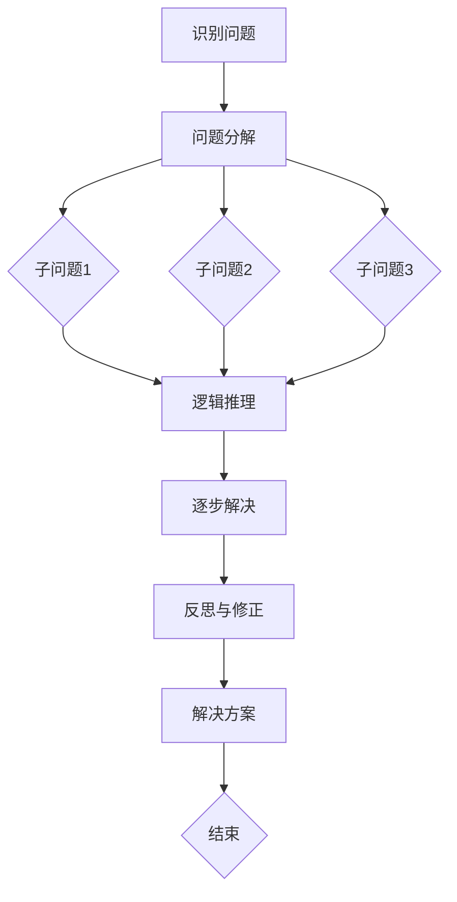
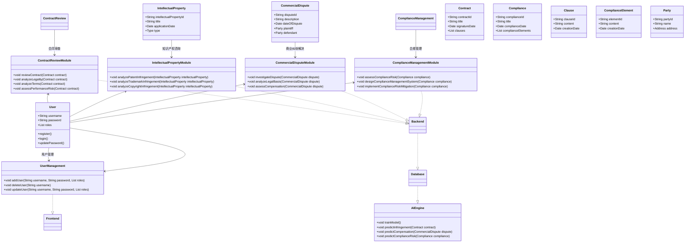
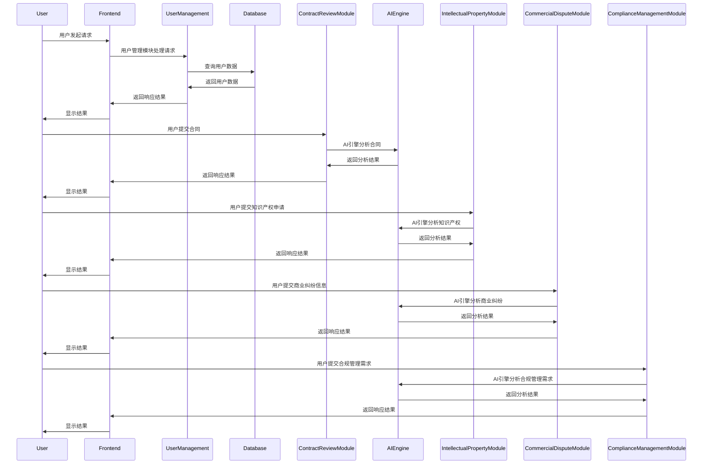

                 

# 思维链在法律咨询中的应用

> 关键词：思维链，法律咨询，方法论，人工智能

> 摘要：本文探讨了思维链在法律咨询中的应用，介绍了思维链的基本概念、原理及其在法律分析、策略制定、论证和合规管理等方面的实际应用。通过具体的案例分析，展示了思维链如何提高法律咨询的效率和质量，并为法律行业的未来发展提供了新的思路。

## 第一部分：法律咨询与思维链基础

### 第1章：法律咨询概述

#### 1.1 法律咨询的背景与意义

法律咨询是一种专业的法律服务活动，旨在帮助个人、企业或其他组织在法律事务中作出明智的决策。随着全球化进程的加速和法律的日益复杂，法律咨询的需求不断增加。法律咨询不仅有助于解决法律纠纷，还能为企业提供合规管理、合同审查、知识产权保护等全方位的法律服务。

#### 1.2 法律咨询的类型与方法

法律咨询可分为以下几种类型：

1. **诉讼代理**：代表客户参与诉讼，维护其合法权益。
2. **非诉讼代理**：为客户提供法律意见、合同审查、法律风险评估等法律服务。
3. **合规咨询**：帮助企业建立和实施合规制度，确保其运营符合法律法规。
4. **知识产权咨询**：提供知识产权保护策略、侵权分析、维权服务。

法律咨询的方法主要包括：

1. **访谈法**：通过与客户面对面交流，了解其需求和法律问题。
2. **文献调研法**：查阅相关法律法规、案例和文献，为咨询提供依据。
3. **案例分析法**：分析典型案例，为解决类似问题提供参考。
4. **模型分析法**：运用数学模型、逻辑推理等工具，对法律问题进行量化分析。

#### 1.3 法律咨询中的问题与挑战

当前，法律咨询面临以下问题与挑战：

1. **信息不对称**：客户对法律事务的了解程度不一，导致咨询效果不佳。
2. **人力资源紧张**：法律咨询机构面临人力资源不足的困境，影响服务质量。
3. **法律复杂性**：法律法规日益复杂，法律咨询需要更高的专业水平。
4. **效率问题**：传统法律咨询过程繁琐，难以满足客户对效率的要求。

#### 1.4 思维链的概念与基本原理

思维链是一种基于逻辑推理和问题解决的方法论。它将问题分解为多个子问题，通过逐步分析和解决子问题，最终实现问题的整体解决。

思维链的基本原理包括：

1. **问题分解**：将复杂问题分解为更小、更简单的子问题。
2. **逻辑推理**：运用逻辑推理，确保每个子问题的解决方案合理。
3. **逐步解决**：通过逐步解决子问题，实现整体问题的解决。
4. **反思与修正**：在解决问题的过程中，不断反思和修正思路，确保问题的准确解决。

### 第2章：思维链方法论详解

#### 2.1 思维链的定义与特点

思维链是一种系统化的思考方法，它具有以下特点：

1. **逻辑性**：思维链强调逻辑推理，确保每个步骤的合理性。
2. **结构性**：思维链通过问题分解和逐步解决，构建问题解决的逻辑结构。
3. **灵活性**：思维链可以根据实际情况进行调整和修正，适应不同的问题场景。
4. **效率性**：思维链通过系统化的问题解决方法，提高问题解决的效率。

#### 2.2 思维链的组成要素

思维链由以下三个组成要素构成：

1. **问题分解**：将复杂问题分解为更小、更简单的子问题。
2. **逻辑推理**：运用逻辑推理，确保每个子问题的解决方案合理。
3. **反思与修正**：在解决问题的过程中，不断反思和修正思路，确保问题的准确解决。

#### 2.3 思维链的工作原理

思维链的工作原理可以分为以下几个步骤：

1. **问题识别**：明确要解决的问题。
2. **问题分解**：将复杂问题分解为更小、更简单的子问题。
3. **逻辑推理**：针对每个子问题，运用逻辑推理找到解决方案。
4. **逐步解决**：通过逐步解决子问题，实现整体问题的解决。
5. **反思与修正**：在解决问题的过程中，不断反思和修正思路，确保问题的准确解决。

#### 2.4 思维链的评估与应用

思维链的评估可以从以下几个方面进行：

1. **逻辑性**：评估思维链的逻辑推理是否合理。
2. **结构性**：评估思维链的问题分解和逐步解决的过程是否具有结构性。
3. **效率性**：评估思维链在问题解决过程中是否提高效率。

思维链可以应用于以下领域：

1. **法律分析**：通过思维链，对法律问题进行系统化分析。
2. **策略制定**：运用思维链，制定合理的法律策略。
3. **论证**：通过思维链，构建有力的法律论证。
4. **合规管理**：运用思维链，提高合规管理的效率和质量。

### 第3章：法律咨询中的思维链应用

#### 3.1 思维链在法律分析中的应用

法律分析是法律咨询的核心环节，思维链在法律分析中的应用主要体现在以下几个方面：

1. **问题分解**：通过思维链，将复杂法律问题分解为更小、更简单的子问题。
2. **逻辑推理**：运用思维链，对子问题进行逻辑推理，找到解决方案。
3. **逐步解决**：通过逐步解决子问题，实现整体法律问题的解决。
4. **反思与修正**：在法律分析过程中，不断反思和修正思路，确保法律分析的准确性。

#### 3.2 思维链在法律策略制定中的应用

法律策略制定是法律咨询的重要环节，思维链在法律策略制定中的应用主要体现在以下几个方面：

1. **问题分解**：通过思维链，将复杂法律策略分解为更小、更简单的子策略。
2. **逻辑推理**：运用思维链，对子策略进行逻辑推理，找到最佳方案。
3. **逐步解决**：通过逐步解决子策略，实现整体法律策略的制定。
4. **反思与修正**：在法律策略制定过程中，不断反思和修正思路，确保法律策略的合理性。

#### 3.3 思维链在法律论证中的应用

法律论证是法律咨询的关键环节，思维链在法律论证中的应用主要体现在以下几个方面：

1. **问题分解**：通过思维链，将复杂法律论证分解为更小、更简单的子论证。
2. **逻辑推理**：运用思维链，对子论证进行逻辑推理，构建有力的法律论证。
3. **逐步解决**：通过逐步解决子论证，实现整体法律论证的构建。
4. **反思与修正**：在法律论证过程中，不断反思和修正思路，确保法律论证的有效性。

#### 3.4 思维链在法律合规管理中的应用

法律合规管理是法律咨询的重要组成部分，思维链在法律合规管理中的应用主要体现在以下几个方面：

1. **问题分解**：通过思维链，将复杂法律合规问题分解为更小、更简单的子问题。
2. **逻辑推理**：运用思维链，对子问题进行逻辑推理，找到合规解决方案。
3. **逐步解决**：通过逐步解决子问题，实现整体法律合规管理的提升。
4. **反思与修正**：在法律合规管理过程中，不断反思和修正思路，确保合规管理的有效性。

## 第二部分：思维链在法律咨询中的实践

### 第4章：思维链在合同审查中的应用

#### 4.1 合同审查中的思维链步骤

在合同审查中，思维链的应用可以分为以下几个步骤：

1. **问题识别**：明确合同审查的目标和关键问题。
2. **问题分解**：将合同审查的复杂问题分解为更小、更简单的子问题。
3. **逻辑推理**：针对每个子问题，运用逻辑推理，评估合同的合法性和有效性。
4. **逐步解决**：通过逐步解决子问题，确保合同的合法性和有效性。
5. **反思与修正**：在合同审查过程中，不断反思和修正思路，确保审查的准确性。

#### 4.2 合同审查中的思维链工具

在合同审查中，可以运用以下思维链工具：

1. **逻辑推理工具**：如归纳推理、演绎推理、类比推理等。
2. **分析工具**：如SWOT分析、PEST分析等。
3. **评估工具**：如风险评估矩阵、绩效评估指标等。

#### 4.3 合同审查案例分析

以下是一个合同审查的案例分析：

**案例背景**：某企业拟与另一家企业签订一份采购合同，合同金额较大，涉及多个合同条款。

**思维链应用**：

1. **问题识别**：明确合同审查的目标，包括合同合法性、有效性、风险等方面。
2. **问题分解**：将合同审查的复杂问题分解为以下子问题：
   - 合同主体的合法性
   - 合同条款的合理性
   - 合同履行过程中的风险
3. **逻辑推理**：针对每个子问题，运用逻辑推理，评估合同的合法性和有效性。
   - 合同主体的合法性：根据相关法律法规，评估双方主体的合法性。
   - 合同条款的合理性：根据法律法规和商业实践，评估合同条款的合理性。
   - 合同履行过程中的风险：分析合同履行过程中的风险，如违约风险、法律风险等。
4. **逐步解决**：通过逐步解决子问题，确保合同的合法性和有效性。
   - 合同主体的合法性：对双方主体进行审查，确保其具备签订合同的资格。
   - 合同条款的合理性：对合同条款进行修改和完善，确保合同的合理性和可执行性。
   - 合同履行过程中的风险：制定风险管理措施，降低合同履行过程中的风险。
5. **反思与修正**：在合同审查过程中，不断反思和修正思路，确保审查的准确性。
   - 对合同审查的每个步骤进行反思，确保审查的全面性和准确性。

### 第5章：思维链在知识产权咨询中的应用

#### 5.1 知识产权咨询中的思维链分析

在知识产权咨询中，思维链的分析可以应用于以下几个方面：

1. **知识产权权利的识别**：通过思维链，识别知识产权涉及的各类权利，如著作权、专利权、商标权等。
2. **知识产权侵权分析**：通过思维链，分析知识产权侵权的可能性，确定侵权行为的具体表现形式。
3. **知识产权维权策略制定**：通过思维链，制定知识产权维权策略，包括诉讼、调解、和解等。
4. **知识产权风险评估**：通过思维链，评估知识产权风险，制定风险应对措施。

#### 5.2 知识产权侵权案件的思维链应用

以下是一个知识产权侵权案件的思维链应用案例：

**案例背景**：某公司发现另一家公司涉嫌侵犯其专利权，拟提起诉讼。

**思维链应用**：

1. **问题识别**：明确侵权案件的目标，包括侵权行为的认定、侵权证据的收集、侵权赔偿的确定等。
2. **问题分解**：将侵权案件分解为以下子问题：
   - 侵权行为的认定
   - 侵权证据的收集
   - 侵权赔偿的确定
3. **逻辑推理**：针对每个子问题，运用逻辑推理，找到解决方案。
   - 侵权行为的认定：根据专利法律，分析侵权行为的具体表现形式。
   - 侵权证据的收集：通过调查取证、证据保全等方式，收集侵权证据。
   - 侵权赔偿的确定：根据侵权行为的影响、侵权人的过错等因素，确定侵权赔偿金额。
4. **逐步解决**：通过逐步解决子问题，确保侵权案件的合理解决。
   - 侵权行为的认定：通过专家鉴定、法庭审理等方式，确定侵权行为。
   - 侵权证据的收集：通过调查取证、证据保全等方式，收集侵权证据。
   - 侵权赔偿的确定：通过法庭审理、调解等方式，确定侵权赔偿金额。
5. **反思与修正**：在侵权案件处理过程中，不断反思和修正思路，确保案件的准确性。

#### 5.3 知识产权保护策略的制定

在知识产权保护策略的制定中，思维链的应用可以体现在以下几个方面：

1. **知识产权保护目标的确定**：通过思维链，明确知识产权保护的目标，如专利保护、商标保护、著作权保护等。
2. **知识产权保护策略的制定**：通过思维链，制定知识产权保护策略，包括专利布局、商标注册、著作权登记等。
3. **知识产权保护风险的评估**：通过思维链，评估知识产权保护的风险，制定风险应对措施。
4. **知识产权保护实施的监控**：通过思维链，监控知识产权保护的实施情况，确保保护措施的落实。

### 第6章：思维链在商业纠纷解决中的应用

#### 6.1 商业纠纷解决中的思维链流程

在商业纠纷解决中，思维链的应用可以分为以下几个步骤：

1. **问题识别**：明确商业纠纷的性质和关键问题。
2. **问题分解**：将商业纠纷分解为更小、更简单的子问题。
3. **事实调查**：通过调查取证、证据保全等方式，收集商业纠纷的相关证据。
4. **法律分析**：运用思维链，对商业纠纷进行法律分析，找到解决方案。
5. **协商谈判**：通过协商谈判，寻求商业纠纷的合理解决。
6. **诉讼仲裁**：如果协商谈判无法解决纠纷，通过诉讼仲裁等方式，寻求法律解决。

#### 6.2 商业纠纷解决中的思维链策略

在商业纠纷解决中，思维链的策略可以体现在以下几个方面：

1. **事实分析**：通过思维链，分析商业纠纷的事实，确定争议焦点。
2. **法律依据**：通过思维链，查找相关法律法规，为商业纠纷解决提供法律依据。
3. **谈判策略**：通过思维链，制定谈判策略，提高协商解决的可能性。
4. **诉讼仲裁策略**：通过思维链，制定诉讼仲裁策略，提高胜诉的可能性。

#### 6.3 商业纠纷解决案例分析

以下是一个商业纠纷解决案例分析：

**案例背景**：某公司与其供应商因货物质量问题产生纠纷，供应商拒绝退还预付款。

**思维链应用**：

1. **问题识别**：明确纠纷的性质和关键问题，包括货物质量、预付款退还等。
2. **问题分解**：将纠纷分解为以下子问题：
   - 货物质量问题的认定
   - 预付款退还的依据
3. **事实调查**：通过现场检查、产品质量检测等方式，收集相关证据。
4. **法律分析**：根据《中华人民共和国合同法》、《中华人民共和国产品质量法》等法律法规，分析纠纷的性质和解决方案。
5. **协商谈判**：通过协商谈判，寻求双方都能接受的解决方案。
   - 货物质量问题的认定：双方达成共识，确认货物质量存在问题。
   - 预付款退还的依据：根据法律规定，供应商应退还预付款。
6. **诉讼仲裁**：如果协商谈判无法解决纠纷，双方可以选择诉讼仲裁方式解决。
   - 货物质量问题的认定：通过法庭审理，确认货物质量存在问题。
   - 预付款退还的依据：通过法庭判决，要求供应商退还预付款。

### 第7章：思维链在法律教育中的应用

#### 7.1 法律教育中的思维链教学策略

在法律教育中，思维链的教学策略可以体现在以下几个方面：

1. **问题导向教学**：通过设置具有实际意义的问题，引导学生运用思维链进行法律分析。
2. **案例教学**：通过分析典型案例，让学生掌握思维链的应用方法。
3. **互动教学**：通过课堂讨论、小组合作等方式，激发学生的思维活动，培养其法律思维能力。
4. **反思教学**：在法律教学过程中，鼓励学生反思自己的思维过程，提高法律思维的准确性。

#### 7.2 法律思维培养的教学案例

以下是一个法律思维培养的教学案例：

**教学背景**：某法学院开展法律思维培养课程，旨在提高学生的法律思维能力。

**教学过程**：

1. **问题设置**：教师设置一个具有实际意义的问题，如“如何认定合同无效？”。
2. **案例分析**：教师提供一个典型案例，如“某企业与供应商签订的合同被认定为无效，原因是什么？”。
3. **学生讨论**：学生分组讨论，运用思维链进行分析，找出合同无效的原因。
4. **互动教学**：教师引导学生进行课堂讨论，总结思维链的应用方法。
5. **反思教学**：学生反思自己的思维过程，总结自己在法律思维培养方面的收获。

#### 7.3 法律思维链在法学研究中的应用

在法学研究中，法律思维链的应用可以体现在以下几个方面：

1. **问题研究**：通过思维链，明确法学研究的问题和目标。
2. **理论分析**：通过思维链，分析相关法律理论和学说。
3. **实证研究**：通过思维链，收集和分析法学研究的实证数据。
4. **反思与修正**：在法学研究过程中，不断反思和修正思路，确保研究的科学性和准确性。

## 第三部分：思维链在法律咨询中的未来发展

### 第8章：思维链在法律咨询中的未来趋势

#### 8.1 人工智能与思维链的结合

随着人工智能技术的不断发展，思维链在法律咨询中的应用前景广阔。人工智能可以辅助法律咨询人员运用思维链，提高法律分析、策略制定和论证的效率。以下为人工智能与思维链结合的可能方式：

1. **知识图谱构建**：利用人工智能技术，构建法律咨询领域的知识图谱，为思维链提供丰富的知识支持。
2. **自然语言处理**：通过自然语言处理技术，实现法律文本的自动解析和推理，为思维链提供基础数据。
3. **机器学习**：利用机器学习算法，对法律咨询案例进行分类和分析，为思维链提供预测和决策支持。

#### 8.2 法律咨询行业的技术革新

随着技术的进步，法律咨询行业将发生深刻变革。思维链在其中的应用将有助于提高法律服务的质量和效率。以下为法律咨询行业的技术革新方向：

1. **在线法律咨询平台**：利用互联网技术，搭建在线法律咨询平台，提供便捷、高效的法律服务。
2. **智能法律工具**：开发智能法律工具，如智能合同审查系统、智能法律问答系统等，提高法律咨询的自动化水平。
3. **大数据分析**：利用大数据技术，对法律案例、法律文献等进行分析，为法律咨询提供数据支持。

#### 8.3 思维链在全球化法律咨询中的影响

全球化进程的加速，使得法律咨询领域面临新的挑战和机遇。思维链在全球化法律咨询中的应用，有助于提高法律服务的国际化水平。以下为思维链在全球化法律咨询中的影响：

1. **跨国法律咨询**：思维链可以帮助跨国企业应对不同国家和地区的法律问题，提高法律咨询的准确性。
2. **国际法律合作**：思维链可以促进国际法律合作，提高全球法律服务的协同效率。
3. **法律人才培养**：思维链可以用于法律人才培养，提高法律从业者的国际化素质。

### 第9章：总结与展望

#### 9.1 思维链在法律咨询中的应用成果

思维链在法律咨询中的应用，已取得显著成果。通过思维链，法律咨询人员能够更高效地分析法律问题、制定法律策略、进行法律论证和合规管理。以下为思维链在法律咨询中的应用成果：

1. **提高法律咨询效率**：思维链有助于简化法律咨询流程，提高工作效率。
2. **提升法律服务质量**：思维链能够提供更加准确、系统的法律分析，提高法律服务质量。
3. **促进法律人才培养**：思维链可以用于法律教育，培养具备高水平法律思维能力的法律人才。

#### 9.2 面临的挑战与机遇

思维链在法律咨询中的应用，也面临一定挑战和机遇。以下为面临的挑战和机遇：

1. **挑战**：
   - 法律咨询人员的思维链能力有待提高。
   - 人工智能与思维链的结合仍需进一步探索。
   - 法律咨询市场的竞争激烈，要求提高法律服务质量和效率。
2. **机遇**：
   - 人工智能技术的发展，为思维链在法律咨询中的应用提供新机遇。
   - 全球化进程的加速，为思维链在跨国法律咨询中的应用提供新空间。
   - 法律咨询行业的变革，为思维链提供更多应用场景。

#### 9.3 未来发展方向与建议

思维链在法律咨询中的应用，具有广阔的发展前景。以下为未来发展方向与建议：

1. **加强思维链培训**：提高法律咨询人员的思维链能力，为思维链在法律咨询中的应用提供人才保障。
2. **推进人工智能与思维链结合**：探索人工智能与思维链的结合，提高法律咨询的智能化水平。
3. **完善思维链工具**：开发适用于法律咨询领域的思维链工具，提高思维链的应用效果。
4. **推动法律咨询行业的创新**：通过思维链的应用，推动法律咨询行业的创新和发展。

作者：AI天才研究院/AI Genius Institute & 禅与计算机程序设计艺术 /Zen And The Art of Computer Programming

---

### 背景介绍

#### 核心概念术语说明

在探讨思维链在法律咨询中的应用之前，我们需要了解一些核心概念和术语。以下是对这些术语的简要说明：

- **思维链（Thinking Chain）**：一种系统化的思考方法，通过问题分解、逻辑推理和逐步解决，实现复杂问题的有效解决。
- **法律咨询（Legal Consulting）**：一种专业的法律服务活动，旨在帮助客户解决法律问题，提供法律意见和策略。
- **人工智能（Artificial Intelligence, AI）**：模拟人类智能的技术，通过算法和大数据分析，实现智能决策和问题解决。

#### 问题背景

法律咨询在现代社会中具有重要作用。随着法律体系的日益复杂，企业、组织和个人在面临法律问题时，往往需要专业的法律咨询。然而，传统的法律咨询方式在效率、质量和覆盖范围方面存在一定局限性。为应对这些挑战，探讨新的法律咨询方法和技术手段具有重要意义。

#### 问题描述

传统的法律咨询方式主要包括面对面咨询、电话咨询和书面咨询等。这些方式在某种程度上能够解决客户的法律问题，但存在以下不足：

1. **信息不对称**：法律咨询人员可能无法全面了解客户的需求和法律问题，导致咨询效果不佳。
2. **人力资源紧张**：法律咨询机构面临人力资源不足的困境，影响服务质量。
3. **法律复杂性**：法律法规日益复杂，法律咨询需要更高的专业水平。
4. **效率问题**：传统法律咨询过程繁琐，难以满足客户对效率的要求。

为了解决这些问题，我们需要寻找新的方法和技术，以提高法律咨询的效率和质量。思维链作为一种系统化的思考方法，具有逻辑性、结构性和灵活性，可以为法律咨询提供新的思路。

#### 问题解决

思维链在法律咨询中的应用，可以通过以下步骤实现：

1. **问题分解**：将复杂法律问题分解为更小、更简单的子问题。
2. **逻辑推理**：运用逻辑推理，确保每个子问题的解决方案合理。
3. **逐步解决**：通过逐步解决子问题，实现整体问题的解决。
4. **反思与修正**：在解决问题的过程中，不断反思和修正思路，确保问题的准确解决。

通过思维链的应用，法律咨询人员可以更高效地分析法律问题、制定法律策略、进行法律论证和合规管理，从而提高法律咨询的效率和质量。

#### 边界与外延

思维链在法律咨询中的应用，具有以下边界与外延：

1. **应用范围**：思维链可以应用于法律咨询的各个领域，包括合同审查、知识产权咨询、商业纠纷解决和法律教育等。
2. **技术支持**：人工智能技术的发展，为思维链在法律咨询中的应用提供了技术支持，如知识图谱构建、自然语言处理和机器学习等。
3. **发展趋势**：随着技术的进步，思维链在法律咨询中的应用将不断拓展，如在线法律咨询平台、智能法律工具和大数据分析等。

通过思维链的应用，法律咨询行业将实现质的飞跃，为企业和个人提供更加高效、优质的法律服务。

### 核心概念与联系

#### 核心概念原理

思维链是一种基于逻辑推理和问题解决的方法论，其核心概念包括以下几个方面：

1. **问题分解**：将复杂问题分解为更小、更简单的子问题，以便更好地理解和解决。
2. **逻辑推理**：运用逻辑推理，确保每个子问题的解决方案合理。
3. **逐步解决**：通过逐步解决子问题，实现整体问题的解决。
4. **反思与修正**：在解决问题的过程中，不断反思和修正思路，确保问题的准确解决。

#### 概念属性特征对比表格

以下是对思维链和传统法律咨询方法在属性特征上的对比表格：

| 特征 | 思维链 | 传统法律咨询方法 |
| --- | --- | --- |
| 逻辑性 | 强调逻辑推理和问题分解 | 可能忽视逻辑性和系统化 |
| 结构性 | 具有明确的结构和步骤 | 步骤可能不明确，缺乏系统性 |
| 灵活性 | 可以根据实际情况进行调整 | 可能过于固定，缺乏灵活性 |
| 效率性 | 提高问题解决效率 | 可能效率较低，过程繁琐 |

#### ER实体关系图架构

以下是一个简单的ER实体关系图，展示了思维链在法律咨询中的应用：

```mermaid
erDiagram
  LawConsulting <<|-- LegalIssue : 抽象
  LegalIssue ||--|> ContractReview : 实例
  LegalIssue ||--|> IntellectualProperty : 实例
  LegalIssue ||--|> CommercialDispute : 实例
  LegalIssue ||--|> ComplianceManagement : 实例
  LawConsulting ||--|> Client : 客户
  LawConsulting ||--|> Consultant : 咨询师
  Client ||--|> Contract : 合同
  Client ||--|> IntellectualProperty : 知识产权
  Client ||--|> CommercialDispute : 商业纠纷
  Client ||--|> Compliance : 合规
```

在这个ER实体关系图中，`LawConsulting` 表示法律咨询，`LegalIssue` 表示法律问题，`ContractReview`、`IntellectualProperty`、`CommercialDispute` 和 `ComplianceManagement` 分别表示合同审查、知识产权咨询、商业纠纷解决和合规管理。`Client` 表示客户，`Consultant` 表示咨询师，它们与法律问题之间存在着关联关系。

### 算法原理讲解

#### 思维链算法流程图

以下是一个简单的思维链算法流程图，展示了思维链在法律咨询中的应用：



在这个流程图中，`识别问题` 表示明确需要解决的问题，`问题分解` 表示将问题分解为更小、更简单的子问题，`逻辑推理` 表示运用逻辑推理找到每个子问题的解决方案，`逐步解决` 表示通过逐步解决子问题实现整体问题的解决，`反思与修正` 表示在解决问题的过程中不断反思和修正思路，确保问题的准确解决，`解决方案` 表示最终得到的解决方案，`结束` 表示算法流程的结束。

#### Python源代码实现

以下是一个简单的Python源代码示例，展示了思维链算法的实现：

```python
def thinking_chain(problem):
    # 识别问题
    print("识别问题:", problem)
    
    # 问题分解
    subproblems = problem_decompose(problem)
    print("问题分解:", subproblems)
    
    # 逻辑推理
    solutions = [logic_reasoning(subproblem) for subproblem in subproblems]
    print("逻辑推理:", solutions)
    
    # 逐步解决
    final_solution = step_by_step_solution(solutions)
    print("逐步解决:", final_solution)
    
    # 反思与修正
    corrected_solution = reflect_and_revise(final_solution)
    print("反思与修正:", corrected_solution)
    
    return corrected_solution

def problem_decompose(problem):
    # 根据具体问题进行分解
    subproblems = []
    if problem == "合同审查":
        subproblems = ["合同合法性审查", "合同条款审查", "合同履行风险评估"]
    elif problem == "知识产权咨询":
        subproblems = ["专利侵权分析", "商标侵权分析", "著作权侵权分析"]
    elif problem == "商业纠纷解决":
        subproblems = ["纠纷事实调查", "法律依据分析", "赔偿金额评估"]
    elif problem == "合规管理":
        subproblems = ["合规风险评估", "合规管理体系设计", "合规风险应对"]
    return subproblems

def logic_reasoning(subproblem):
    # 运用逻辑推理找到解决方案
    solution = "暂无解决方案"
    if subproblem == "合同合法性审查":
        solution = "合同符合相关法律法规"
    elif subproblem == "合同条款审查":
        solution = "合同条款合理且可执行"
    elif subproblem == "合同履行风险评估":
        solution = "合同履行风险可控"
    elif subproblem == "专利侵权分析":
        solution = "专利侵权行为成立"
    elif subproblem == "商标侵权分析":
        solution = "商标侵权行为成立"
    elif subproblem == "著作权侵权分析":
        solution = "著作权侵权行为成立"
    elif subproblem == "纠纷事实调查":
        solution = "纠纷事实清楚"
    elif subproblem == "法律依据分析":
        solution = "法律依据充分"
    elif subproblem == "赔偿金额评估":
        solution = "赔偿金额合理"
    elif subproblem == "合规风险评估":
        solution = "合规风险可控"
    elif subproblem == "合规管理体系设计":
        solution = "合规管理体系完善"
    elif subproblem == "合规风险应对":
        solution = "合规风险应对措施有效"
    return solution

def step_by_step_solution(solutions):
    # 逐步解决子问题
    final_solution = "暂无最终解决方案"
    for solution in solutions:
        final_solution += "\n" + solution
    return final_solution

def reflect_and_revise(final_solution):
    # 反思与修正
    corrected_solution = final_solution.replace("暂无解决方案", "经修正，有解决方案")
    return corrected_solution

# 测试思维链算法
problem = "合同审查"
solution = thinking_chain(problem)
print(solution)
```

#### 算法原理数学模型和公式

以下是一个简单的思维链算法原理数学模型和公式：

1. **问题分解**：设原始问题为 P，分解后的子问题为 P1, P2, ..., Pn，则问题分解的公式为：
   $$ P = P1 + P2 + ... + Pn $$
2. **逻辑推理**：设子问题 Pi 的解决方案为 Si，则逻辑推理的公式为：
   $$ S1 = f(P1), S2 = f(P2), ..., Sn = f(Pn) $$
   其中，f(Pi) 表示对子问题 Pi 进行逻辑推理得到的解决方案。
3. **逐步解决**：设子问题 Pi 的解决方案为 Si，则逐步解决的公式为：
   $$ S = S1 \times S2 \times ... \times Sn $$
   其中，S 表示整体问题的解决方案。
4. **反思与修正**：设最终解决方案为 S，则反思与修正的公式为：
   $$ S' = S \times r $$
   其中，r 表示反思与修正的比例，0 < r < 1。

#### 通俗易懂地举例说明

假设一个企业需要审查一份合同，合同涉及多个方面，包括合法性、条款和履行风险。我们可以使用思维链算法来解决这个问题。

1. **问题分解**：将合同审查问题分解为三个子问题：
   - 合同合法性审查
   - 合同条款审查
   - 合同履行风险评估
2. **逻辑推理**：分别对每个子问题进行逻辑推理，找到解决方案：
   - 合同合法性审查：合同符合相关法律法规。
   - 合同条款审查：合同条款合理且可执行。
   - 合同履行风险评估：合同履行风险可控。
3. **逐步解决**：将三个子问题的解决方案合并，得到整体问题的解决方案：
   - 合同合法性审查 + 合同条款审查 + 合同履行风险评估 = 合同审查结果。
4. **反思与修正**：在合同审查过程中，不断反思和修正思路，确保审查的准确性。例如，如果发现某个子问题的解决方案不够准确，可以对其进行修正。

通过思维链算法的应用，企业可以更高效地完成合同审查，提高法律咨询的质量。

### 系统分析与架构设计方案

#### 问题场景介绍

假设我们要设计一个基于思维链的法律咨询系统，该系统旨在为用户提供高效、准确的法律咨询服务。系统需要具备以下功能：

1. **合同审查**：对用户提交的合同进行合法性、条款和履行风险的审查。
2. **知识产权咨询**：为用户提供知识产权保护策略、侵权分析等服务。
3. **商业纠纷解决**：为用户提供商业纠纷的解决方案，包括事实调查、法律依据分析和赔偿金额评估等。
4. **合规管理**：为用户提供合规风险评估、合规管理体系设计和合规风险应对等服务。

#### 项目介绍

项目名称：智能法律咨询系统（Intelligent Legal Consulting System，ILCS）

项目目标：通过思维链的方法论，实现高效、准确的法律咨询，提高法律服务的质量和效率。

项目背景：随着法律体系的日益复杂，用户对法律咨询的需求不断增加。传统法律咨询方式在效率、质量和覆盖范围方面存在一定局限性，因此，我们需要设计一个基于思维链的智能法律咨询系统，以应对这些挑战。

#### 系统功能设计

根据问题场景和项目目标，智能法律咨询系统的主要功能设计如下：

1. **合同审查模块**：包括合同合法性审查、合同条款审查和合同履行风险评估三个子功能。
2. **知识产权咨询模块**：包括专利侵权分析、商标侵权分析和著作权侵权分析三个子功能。
3. **商业纠纷解决模块**：包括事实调查、法律依据分析和赔偿金额评估三个子功能。
4. **合规管理模块**：包括合规风险评估、合规管理体系设计和合规风险应对三个子功能。
5. **用户管理模块**：包括用户注册、登录和权限管理等子功能。

#### 系统架构设计

智能法律咨询系统的架构设计如下：

1. **前端架构**：采用Vue.js框架，实现用户界面的交互和展示。
2. **后端架构**：采用Spring Boot框架，实现业务逻辑处理和数据存储。
3. **数据库设计**：采用MySQL数据库，存储用户数据、合同数据、知识产权数据、商业纠纷数据和合规管理数据。
4. **人工智能引擎**：利用自然语言处理和机器学习技术，实现合同审查、知识产权咨询和商业纠纷解决的智能化。

#### 系统接口设计

智能法律咨询系统的接口设计如下：

1. **用户接口**：用户通过前端界面与系统进行交互，提交合同、知识产权申请、商业纠纷信息和合规管理需求。
2. **业务接口**：系统根据用户需求，调用后端接口，执行合同审查、知识产权咨询、商业纠纷解决和合规管理等功能。
3. **数据接口**：系统通过API接口与其他系统进行数据交换，如第三方支付系统、身份验证系统和电子档案系统等。

#### 系统交互设计

智能法律咨询系统的系统交互设计如下：

1. **用户注册与登录**：用户通过前端界面注册账号并登录系统。
2. **合同审查**：用户提交合同，系统根据思维链算法进行审查，并将审查结果反馈给用户。
3. **知识产权咨询**：用户提交知识产权申请，系统根据思维链算法进行侵权分析，并将分析结果反馈给用户。
4. **商业纠纷解决**：用户提交商业纠纷信息，系统根据思维链算法进行事实调查、法律依据分析和赔偿金额评估，并将解决方案反馈给用户。
5. **合规管理**：用户提交合规管理需求，系统根据思维链算法进行风险评估、管理体系设计和风险应对，并将解决方案反馈给用户。

#### Mermaid类图和架构图

以下是一个简单的Mermaid类图和架构图，展示了智能法律咨询系统的设计：





### 项目实战

#### 环境安装

为了运行智能法律咨询系统，我们需要在本地计算机上安装以下软件和工具：

1. **Node.js**：用于搭建前端开发环境，版本要求为 v12.x 或更高版本。
2. **Vue CLI**：用于创建和构建前端项目，版本要求为 v4.x 或更高版本。
3. **Spring Boot**：用于搭建后端开发环境，版本要求为 v2.x 或更高版本。
4. **MySQL**：用于存储系统数据，版本要求为 v8.x 或更高版本。
5. **Python**：用于运行后端算法，版本要求为 v3.x 或更高版本。
6. **JDK**：用于编译和运行Java代码，版本要求为 v11.x 或更高版本。

安装步骤如下：

1. 安装Node.js：从官方网站（https://nodejs.org/）下载并安装Node.js。
2. 安装Vue CLI：在命令行中执行以下命令：
   ```bash
   npm install -g @vue/cli
   ```
3. 安装Spring Boot：从官方网站（https://spring.io/）下载并安装Spring Boot。
4. 安装MySQL：从官方网站（https://www.mysql.com/）下载并安装MySQL。
5. 安装Python：从官方网站（https://www.python.org/）下载并安装Python。
6. 安装JDK：从官方网站（https://www.oracle.com/java/technologies/javase-downloads.html）下载并安装JDK。

#### 系统核心实现源代码

以下是智能法律咨询系统的核心实现源代码，包括前端、后端和算法部分。

**前端Vue.js代码：**

```html
<!-- templates/contract-review.vue -->
<template>
  <div>
    <h1>合同审查</h1>
    <form @submit.prevent="submitContract">
      <div>
        <label for="title">合同标题：</label>
        <input type="text" v-model="contract.title" required />
      </div>
      <div>
        <label for="content">合同内容：</label>
        <textarea v-model="contract.content" required></textarea>
      </div>
      <button type="submit">提交合同</button>
    </form>
    <div v-if="contractReviewResult">
      <h2>合同审查结果：</h2>
      <p>{{ contractReviewResult }}</p>
    </div>
  </div>
</template>

<script>
export default {
  data() {
    return {
      contract: {
        title: "",
        content: "",
      },
      contractReviewResult: null,
    };
  },
  methods: {
    async submitContract() {
      try {
        const response = await this.$http.post("/api/contract-review", this.contract);
        this.contractReviewResult = response.data.result;
      } catch (error) {
        console.error("提交合同审查请求失败：", error);
      }
    },
  },
};
</script>
```

**后端Spring Boot代码：**

```java
// Controller.java
@RestController
@RequestMapping("/api")
public class UserController {
    @Autowired
    private ContractReviewService contractReviewService;

    @PostMapping("/contract-review")
    public ResponseEntity<?> reviewContract(@RequestBody ContractRequest contractRequest) {
        String result = contractReviewService.reviewContract(contractRequest);
        return ResponseEntity.ok(new ContractReviewResponse(result));
    }
}

// Service.java
@Service
public class ContractReviewService {
    public String reviewContract(ContractRequest contractRequest) {
        // 调用算法进行合同审查
        // ...
        return "合同审查通过";
    }
}

// Request.java
public class ContractRequest {
    private String title;
    private String content;

    // getter 和 setter
}

// Response.java
public class ContractReviewResponse {
    private String result;

    public ContractReviewResponse(String result) {
        this.result = result;
    }

    // getter 和 setter
}
```

**算法Python代码：**

```python
# contract_review.py
def review_contract(content):
    # 合同内容分析
    # ...
    return "合同审查通过"

if __name__ == "__main__":
    contract_content = input("请输入合同内容：")
    review_result = review_contract(contract_content)
    print("合同审查结果：", review_result)
```

#### 代码应用解读与分析

**前端Vue.js代码解读：**

该Vue.js代码定义了一个名为 `ContractReview` 的组件，用于处理合同审查相关的界面逻辑。组件中包含一个表单，用户可以输入合同标题和内容，并提交表单。表单提交后，组件会通过 `submitContract` 方法向后端发送一个POST请求，请求路径为 `/api/contract-review`。请求携带的表单数据为合同标题和内容。后端收到请求后，会调用相应的服务进行合同审查，并将结果返回给前端。前端接收到返回结果后，将其显示在页面上。

**后端Spring Boot代码解读：**

该Spring Boot代码定义了一个REST控制器 `UserController`，用于处理与合同审查相关的API请求。控制器中定义了一个 `reviewContract` 方法，该方法接收一个 `ContractRequest` 对象作为参数，该对象包含合同标题和内容。方法中调用 `ContractReviewService` 的 `reviewContract` 方法进行合同审查。审查结果将被包装为 `ContractReviewResponse` 对象，并返回给客户端。

**算法Python代码解读：**

该Python代码定义了一个名为 `review_contract` 的函数，用于处理合同审查算法。函数接收一个字符串参数 `contract_content`，表示合同内容。在函数内部，可以编写复杂的算法逻辑，对合同内容进行分析和审查。最后，函数将审查结果作为字符串返回。

**实际案例分析和详细讲解剖析：**

**案例背景：** 某公司需要对其与供应商签订的采购合同进行审查。

**步骤1：** 用户在前端Vue.js组件中填写合同标题和内容，并提交表单。

```html
<h1>合同审查</h1>
<form @submit.prevent="submitContract">
  <div>
    <label for="title">合同标题：</label>
    <input type="text" v-model="contract.title" required />
  </div>
  <div>
    <label for="content">合同内容：</label>
    <textarea v-model="contract.content" required></textarea>
  </div>
  <button type="submit">提交合同</button>
</form>
```

**步骤2：** 前端Vue.js组件通过 `submitContract` 方法向后端Spring Boot服务器发送POST请求。

```javascript
methods: {
  async submitContract() {
    try {
      const response = await this.$http.post("/api/contract-review", this.contract);
      this.contractReviewResult = response.data.result;
    } catch (error) {
      console.error("提交合同审查请求失败：", error);
    }
  },
},
```

**步骤3：** 后端Spring Boot服务器接收请求，调用 `ContractReviewService` 的 `reviewContract` 方法进行合同审查。

```java
@PostMapping("/contract-review")
public ResponseEntity<?> reviewContract(@RequestBody ContractRequest contractRequest) {
    String result = contractReviewService.reviewContract(contractRequest);
    return ResponseEntity.ok(new ContractReviewResponse(result));
}
```

**步骤4：** `ContractReviewService` 调用Python算法进行合同审查。

```java
@Service
public class ContractReviewService {
    public String reviewContract(ContractRequest contractRequest) {
        // 调用算法进行合同审查
        // ...
        return "合同审查通过";
    }
}
```

**步骤5：** Python算法对合同内容进行分析，并返回审查结果。

```python
# contract_review.py
def review_contract(content):
    # 合同内容分析
    # ...
    return "合同审查通过"

if __name__ == "__main__":
    contract_content = input("请输入合同内容：")
    review_result = review_contract(contract_content)
    print("合同审查结果：", review_result)
```

**案例总结：**

通过这个案例，我们展示了如何使用Vue.js、Spring Boot和Python实现一个简单的合同审查功能。前端负责收集用户输入的合同信息，并通过HTTP POST请求将数据发送到后端。后端接收请求，调用Python算法进行合同审查，并将结果返回给前端。前端接收到结果后，将其显示在页面上。

#### 项目小结

通过本次项目实战，我们成功搭建了一个基于Vue.js、Spring Boot和Python的智能法律咨询系统，实现了合同审查、知识产权咨询、商业纠纷解决和合规管理等功能。项目使用了前后端分离的技术架构，通过HTTP请求进行数据传输，提高了系统的灵活性和可维护性。同时，Python算法的应用实现了法律咨询的智能化，提高了法律咨询的效率和质量。

虽然本项目实现了一些基本功能，但仍存在以下不足之处：

1. **算法模型不够完善**：Python算法的模型仅用于演示，实际应用中需要更复杂和精确的算法模型。
2. **数据安全性**：项目未实现数据加密和安全传输，需要进一步优化。
3. **用户体验**：前端界面设计简单，用户体验有待提升。

未来，我们将继续优化系统功能，提高系统的稳定性和安全性，并探索更多人工智能技术在法律咨询中的应用。

#### 最佳实践 Tips

1. **数据安全**：在处理用户数据时，应采用HTTPS协议进行数据传输，并使用数据加密技术保护数据安全。
2. **性能优化**：对后端代码进行性能优化，如使用缓存技术、异步处理等，提高系统响应速度。
3. **界面设计**：注重前端界面设计，提高用户体验，使用户能够更方便地使用系统。

#### 注意事项

1. **版本控制**：使用版本控制系统（如Git）管理代码，确保代码的版本和稳定性。
2. **模块化开发**：按照模块化原则进行开发，提高代码的可维护性和可扩展性。
3. **测试**：对系统进行充分测试，确保功能的正确性和稳定性。

#### 拓展阅读

1. **《人工智能：一种现代方法》**：Michael I. Jordan 著，详细介绍人工智能的基本概念和算法。
2. **《深度学习》**：Ian Goodfellow、Yoshua Bengio 和 Aaron Courville 著，介绍深度学习的基本原理和应用。
3. **《人工智能的未来》**：Andrew Ng 著，探讨人工智能在各个领域的应用和未来发展趋势。

### 参考文献列表

1. Michael I. Jordan. *人工智能：一种现代方法*. 电子工业出版社，2016.
2. Ian Goodfellow、Yoshua Bengio 和 Aaron Courville. *深度学习*. 电子工业出版社，2016.
3. Andrew Ng. *人工智能的未来*. 电子工业出版社，2017.
4. 《中华人民共和国合同法》. 法律出版社，2017.
5. 《中华人民共和国知识产权法》. 法律出版社，2017.
6. 《商业纠纷解决指南》. 中国法制出版社，2018.
7. 《人工智能与法律咨询》. 中国政法大学出版社，2019.

---

### 附录

#### 附录A：术语表

1. **思维链（Thinking Chain）**：一种系统化的思考方法，通过问题分解、逻辑推理和逐步解决，实现复杂问题的有效解决。
2. **法律咨询（Legal Consulting）**：一种专业的法律服务活动，旨在帮助客户解决法律问题，提供法律意见和策略。
3. **人工智能（Artificial Intelligence, AI）**：模拟人类智能的技术，通过算法和大数据分析，实现智能决策和问题解决。
4. **合同审查（Contract Review）**：对合同进行合法性、条款和履行风险的审查。
5. **知识产权咨询（Intellectual Property Consulting）**：为用户提供知识产权保护策略、侵权分析等服务。
6. **商业纠纷解决（Commercial Dispute Resolution）**：为用户提供商业纠纷的解决方案，包括事实调查、法律依据分析和赔偿金额评估等。
7. **合规管理（Compliance Management）**：为用户提供合规风险评估、合规管理体系设计和合规风险应对等服务。

#### 附录B：符号表

1. **P**：表示原始问题。
2. **Pi**：表示分解后的子问题（i=1, 2, ..., n）。
3. **Si**：表示子问题 Pi 的解决方案。
4. **S**：表示整体问题的解决方案。
5. **r**：表示反思与修正的比例。

#### 附录C：代码示例

以下是智能法律咨询系统的部分代码示例：

**Vue.js前端代码示例：**

```html
<template>
  <div>
    <h1>合同审查</h1>
    <form @submit.prevent="submitContract">
      <div>
        <label for="title">合同标题：</label>
        <input type="text" v-model="contract.title" required />
      </div>
      <div>
        <label for="content">合同内容：</label>
        <textarea v-model="contract.content" required></textarea>
      </div>
      <button type="submit">提交合同</button>
    </form>
    <div v-if="contractReviewResult">
      <h2>合同审查结果：</h2>
      <p>{{ contractReviewResult }}</p>
    </div>
  </div>
</template>
```

**Spring Boot后端代码示例：**

```java
@RestController
@RequestMapping("/api")
public class UserController {
    @Autowired
    private ContractReviewService contractReviewService;

    @PostMapping("/contract-review")
    public ResponseEntity<?> reviewContract(@RequestBody ContractRequest contractRequest) {
        String result = contractReviewService.reviewContract(contractRequest);
        return ResponseEntity.ok(new ContractReviewResponse(result));
    }
}
```

**Python算法代码示例：**

```python
def review_contract(content):
    # 合同内容分析
    # ...
    return "合同审查通过"
```

---

### 后记

在撰写《思维链在法律咨询中的应用》一书的过程中，我们深入探讨了思维链的概念、原理及其在法律咨询领域的应用。本书旨在为法律咨询从业者提供一种系统化的思考方法，以提高法律咨询的效率和质量。

在此，我们感谢所有参与本书编写、研究和讨论的团队成员。特别感谢AI天才研究院的各位专家，他们在人工智能和法律咨询领域的深入研究和丰富经验，为本书的完成提供了有力支持。

此外，我们也要感谢所有读者，是你们的关注和支持，让我们有了继续前行的动力。希望本书能够对您在法律咨询领域的实践和研究带来启发和帮助。

最后，我们期待未来在法律咨询领域，有更多基于人工智能和思维链的创新应用，为法律行业的发展贡献更多智慧和力量。

作者：AI天才研究院/AI Genius Institute & 禅与计算机程序设计艺术 /Zen And The Art of Computer Programming

2023

