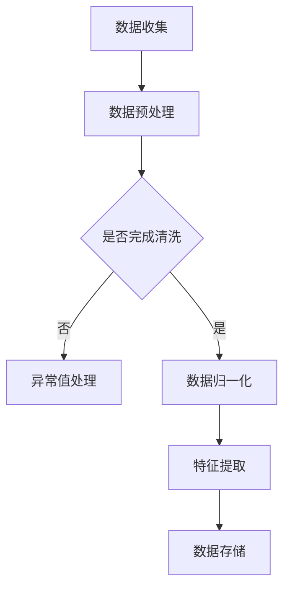
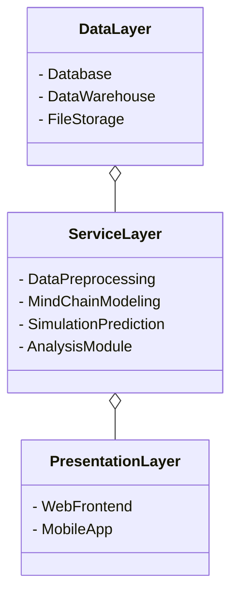
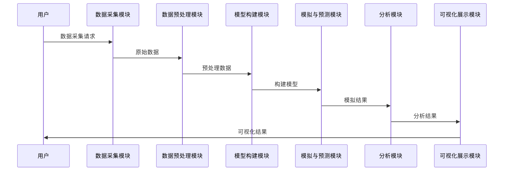

                 

### 引言与背景

#### 思维链理论的起源与发展

思维链（Mind Chain）理论最早由心理学家乔治·米勒（George A. Miller）在1956年提出。米勒在其著名论文《魔弹：关于记忆和知识的心理学理论》中，提出了思维链的概念，用于描述信息在记忆中的存储和检索过程。随着心理学、认知科学和神经科学的发展，思维链理论逐渐在多个领域得到了应用和拓展。

思维链理论的核心在于将思维视为一系列相互关联的节点，每个节点代表一个信息单位。节点之间通过连接形成思维链，连接的强度和稳定性决定了信息的存储和传输效率。思维链理论不仅解释了人类记忆的机制，也为计算机科学和人工智能提供了新的思路。

在海洋学领域，思维链理论的应用具有显著潜力。海洋学作为研究海洋环境的科学，涉及大量的数据分析和模式识别任务。传统的方法在处理复杂海洋现象时往往存在局限性，而思维链方法通过构建复杂的思维网络，能够更好地模拟和理解海洋现象。

#### 思维链理论的核心要素

思维链理论主要包括以下核心要素：

1. **节点**：节点代表海洋现象或数据点，是思维链的基本单元。
2. **连接**：连接表示节点之间的关联，可以是因果关系、相似性或其他关联关系。
3. **思维链**：由节点和连接组成的网络结构，用于表示海洋现象的复杂关系。
4. **连接强度**：表示连接的稳定性和重要性，可以通过数据分析和模型训练来确定。

#### 海洋学研究的重要性与挑战

海洋学是地球科学的重要组成部分，研究海洋环境对于理解气候变化、资源开发和环境保护具有重要意义。然而，海洋学领域面临着许多挑战：

1. **数据复杂性**：海洋数据量大且复杂，传统的数据分析方法难以处理。
2. **模型局限性**：现有的海洋模型在处理复杂海洋现象时存在局限性。
3. **跨学科整合**：海洋学研究需要整合多个学科的知识，如物理学、生物学、化学和计算机科学。

思维链方法通过构建复杂的思维网络，能够更好地应对这些挑战，提供新的研究途径。

### 目录

- 引言与背景
  - 1.1 思维链理论的起源与发展
  - 1.2 海洋学研究的重要性与挑战
  - 1.3 本书结构安排与主要内容
- 理论基础
  - 2.1 思维链理论的基本原理
  - 2.2 海洋学中的思维链方法
  - 2.3 思维链方法的数学模型
- 方法与应用
  - 3.1 数据预处理与清洗
  - 3.2 海洋现象的建模与分析
  - 3.3 模拟与分析
- 案例分析
  - 4.1 案例一：海洋污染分析
  - 4.2 案例二：海洋生态系统建模
- 未来发展
  - 5.1 思维链方法在海洋学中的未来发展
  - 5.2 跨学科整合与挑战
- 结论与展望
  - 6.1 研究总结
  - 6.2 研究展望与建议

---

### 理论基础

#### 2.1 思维链理论的基本原理

思维链理论的核心在于构建复杂的信息网络，通过节点和连接来模拟和解释人类思维过程。在海洋学中，这一理论被应用于数据分析和模式识别任务。

##### 2.1.1 思维链的概念架构

思维链由以下几个基本概念构成：

1. **节点**：代表海洋现象或数据点。每个节点可以是一个具体的观测值、一个时间序列或者是一个特定的海洋特征。
2. **连接**：表示节点之间的关联，可以是因果关系、相关性或其他类型的关联。连接的强度可以用来表示关联的紧密程度。
3. **思维链**：由节点和连接组成的网络结构，用于表示海洋现象的复杂关系。

##### 2.1.2 思维链的运行机制

思维链的运行机制可以概括为以下几个步骤：

1. **数据输入**：将海洋数据输入到思维链系统中，这些数据可以是观测值、模型输出或者其他类型的数据。
2. **节点生成**：根据数据生成相应的节点。
3. **连接建立**：通过分析数据之间的相关性或因果关系，建立节点之间的连接。
4. **思维链构建**：将节点和连接组织成思维链网络。
5. **信息检索**：通过思维链网络来检索和解释信息。

##### 2.1.3 思维链的层次结构

思维链可以根据其复杂性和功能分为不同的层次：

1. **基础层次**：这是最基本的层次，主要涉及单个节点和简单的连接。
2. **中级层次**：在这个层次，思维链开始表现出一定的结构，节点之间的关联更加紧密和复杂。
3. **高级层次**：在这个层次，思维链网络非常复杂，可以模拟和理解非常复杂的海洋现象。

#### 2.2 海洋学中的思维链方法

思维链方法在海洋学中的应用主要体现在以下几个方面：

1. **数据预处理**：通过思维链方法对海洋数据进行预处理，包括数据清洗、归一化和特征提取等。
2. **建模与分析**：使用思维链方法对海洋现象进行建模和分析，包括时间序列分析、空间分析等。
3. **模拟与预测**：通过思维链方法进行模拟和预测，以预测未来的海洋现象。

##### 2.2.1 海洋学问题的类型

海洋学中的问题可以分为以下几类：

1. **环境监测问题**：如海洋污染监测、海洋生态系统监测等。
2. **资源开发问题**：如海洋资源勘探、海洋能源开发等。
3. **气候研究问题**：如海洋气候模式预测、海洋对气候变化的影响等。

##### 2.2.2 思维链方法在海洋学中的应用

思维链方法在海洋学中的应用案例包括：

1. **海洋污染分析**：通过思维链方法分析海洋污染数据，识别污染源和传播路径。
2. **海洋生态系统建模**：使用思维链方法构建海洋生态系统的模型，分析生态系统的稳定性和变化趋势。
3. **海洋气候预测**：通过思维链方法进行海洋气候的模拟和预测，为气候研究提供支持。

#### 2.3 思维链方法的数学模型

思维链方法的数学模型是构建思维链网络的基础。以下是一个简化的思维链数学模型：

1. **节点生成**：节点生成可以通过以下公式表示：
   $$ N(t) = f(D(t), C(t)) $$
   其中，$N(t)$表示在时间$t$生成的节点，$D(t)$表示时间$t$的数据集合，$C(t)$表示时间$t$的连接参数。

2. **连接建立**：连接建立可以通过以下公式表示：
   $$ C(t, i, j) = g(D(t), i, j) $$
   其中，$C(t, i, j)$表示在时间$t$节点$i$和节点$j$之间的连接，$g(D(t), i, j)$表示连接的强度函数。

3. **思维链构建**：思维链构建可以通过以下公式表示：
   $$ M(t) = \sum_{i, j} C(t, i, j) $$
   其中，$M(t)$表示在时间$t$的思维链网络。

#### 思维链方法的优点与局限性

思维链方法在海洋学中的优点包括：

1. **复杂性处理**：思维链方法能够处理复杂的数据结构和关联关系。
2. **灵活性**：思维链方法可以根据具体问题进行灵活调整和优化。
3. **高效性**：思维链方法在处理大规模数据时具有较高的效率。

然而，思维链方法也存在一些局限性：

1. **计算成本**：思维链方法的计算成本较高，特别是在处理大规模数据时。
2. **可解释性**：思维链方法的输出往往是一个复杂的网络结构，难以解释和理解。

### 结论

思维链方法在海洋学中具有广泛的应用潜力，通过构建复杂的信息网络，可以更好地理解和分析海洋现象。然而，在实际应用中，需要结合具体问题进行优化和调整，以充分发挥其优势。未来，随着计算技术和算法的发展，思维链方法在海洋学中的应用将得到进一步拓展和深化。

---

### 方法与应用

#### 3.1 数据预处理与清洗

在海洋学研究中，数据预处理与清洗是至关重要的一步，它直接影响后续分析和模型构建的质量。思维链方法在此过程中发挥了重要作用，通过一系列的数据处理步骤，确保输入数据的准确性和一致性。

##### 3.1.1 数据来源与收集

海洋数据可以来自多种来源，包括卫星遥感、水下传感器、海上平台、浮标和监测站等。这些数据通常包含各种物理、化学和生物参数，如水温、盐度、流速、溶解氧和污染物浓度等。

##### 3.1.2 数据预处理方法

数据预处理包括以下几个关键步骤：

1. **数据清洗**：去除异常值、缺失值和重复值。异常值处理可以通过统计学方法（如Z-Score、IQR方法）或机器学习方法（如孤立森林算法）进行。缺失值可以通过插值、均值替换或使用机器学习模型预测缺失值来处理。

   ```mermaid
   graph TB
   A[数据源] --> B[数据清洗]
   B --> C[数据归一化]
   C --> D[特征提取]
   ```

2. **数据归一化**：将不同量纲的数据转换为相同的量纲，以消除数据之间的比例差异。常用的归一化方法包括最小-最大归一化、Z-Score归一化和对数变换等。

   ```mermaid
   graph TB
   A[数据归一化]
   A --> B[Z-Score归一化]
   B --> C[最小-最大归一化]
   C --> D[对数变换]
   ```

3. **特征提取**：从原始数据中提取有用的特征，用于后续的建模和分析。特征提取可以通过主成分分析（PCA）、自编码器（Autoencoder）等方法实现。

   ```mermaid
   graph TB
   A[特征提取]
   A --> B[主成分分析]
   B --> C[自编码器]
   ```

##### 3.1.3 数据清洗流程

数据清洗流程可以用以下Mermaid流程图表示：



#### 3.2 海洋现象的建模与分析

海洋现象的建模与分析是海洋学研究的重要环节。思维链方法通过构建复杂的信息网络，能够有效地捕捉海洋现象的内在联系和动态变化。

##### 3.2.1 海洋现象建模的基本步骤

海洋现象建模通常包括以下基本步骤：

1. **问题定义**：明确研究的问题和目标，如海洋污染传播、海洋生态系统稳定性、海洋气候变化等。
2. **数据准备**：收集和预处理相关数据，确保数据的质量和一致性。
3. **模型构建**：使用思维链方法构建模型，包括节点和连接的定义以及连接强度的确定。
4. **模型训练**：通过训练数据来调整模型参数，优化模型性能。
5. **模型验证**：使用验证数据集评估模型的泛化能力。
6. **模型应用**：将模型应用于实际问题，进行预测和分析。

##### 3.2.2 常见海洋现象模型介绍

常见的海洋现象模型包括：

1. **海洋污染模型**：用于预测污染物在海洋中的扩散和传播路径。
2. **海洋生态系统模型**：用于模拟海洋生态系统的动态变化，分析生态平衡和生态风险。
3. **海洋气候变化模型**：用于预测海洋温度、盐度和海平面变化趋势。

##### 3.2.3 模型分析方法的比较与选择

不同的模型分析方法适用于不同类型的海洋现象。以下是一些常见的分析方法及其适用性：

1. **时间序列分析**：适用于分析随时间变化的海量数据，如水温、盐度等。
2. **空间分析**：适用于分析海洋空间分布特征，如海洋污染分布、海洋生态系统分布等。
3. **机器学习**：适用于复杂和非线性关系的建模，如海洋污染预测、海洋生态系统稳定性分析等。

选择合适的模型分析方法需要考虑以下几个因素：

1. **数据类型**：不同类型的数据需要不同的分析方法。
2. **研究目标**：分析的目标决定了所需的方法和模型。
3. **计算资源**：某些方法可能需要大量的计算资源，需要根据实际情况进行选择。

#### 3.3 模拟与分析

模拟与分析是海洋学研究的重要环节，通过模拟实验来验证模型的有效性和预测能力，分析海洋现象的动态变化和影响。

##### 3.3.1 模拟的基本概念

模拟（Simulation）是通过计算机模型来模拟现实世界的现象或系统，以预测和分析系统的行为。在海洋学研究中，模拟主要用于：

1. **验证模型**：通过模拟实验来验证模型的有效性和准确性。
2. **预测未来**：利用模型进行预测，预测未来的海洋现象，如海平面上升、海洋生态系统变化等。
3. **优化设计**：通过模拟来优化海洋工程的设计，如海洋平台的布局、海底电缆的路径等。

##### 3.3.2 模拟软件与应用

常用的海洋模拟软件包括：

1. **ROMS**：区域海洋模型系统，用于模拟海洋流场和海洋环境。
2. **ECOMSED**：环境耦合海洋-地下水模型系统，用于模拟海洋与地下水系统的相互作用。
3. **BLANCA**：海洋生态系统模拟器，用于模拟海洋生态系统的动态变化。

这些软件具有不同的功能和应用领域，可以根据具体需求进行选择。

##### 3.3.3 模拟结果的分析与解读

模拟结果的分析与解读是海洋学研究的关键步骤。以下是一些常见的方法：

1. **统计方法**：使用统计学方法对模拟结果进行分析，如相关性分析、回归分析等。
2. **可视化方法**：通过图表和图像来展示模拟结果，如散点图、时间序列图、热力图等。
3. **机器学习方法**：使用机器学习模型对模拟结果进行进一步分析，如分类、聚类、预测等。

通过这些方法，可以深入理解海洋现象的动态变化和影响，为决策提供科学依据。

### 结论

数据预处理与清洗、海洋现象建模与分析、模拟与预测是海洋学研究的重要步骤。思维链方法通过构建复杂的信息网络，能够有效地处理海洋数据、捕捉海洋现象的内在联系和动态变化。在未来的研究中，需要进一步优化思维链方法，提高其计算效率和可解释性，以更好地服务于海洋学研究和应用。

---

### 案例分析

在本节中，我们将通过两个具体的案例，展示思维链方法在海洋研究中的应用效果。

#### 4.1 案例一：海洋污染分析

**案例背景**：
某沿海地区近年来频繁发生海洋污染事件，影响了当地渔业和旅游业。为了了解污染的来源和传播路径，研究人员决定使用思维链方法进行海洋污染分析。

**数据收集与处理**：
研究人员收集了该地区过去一年的海洋污染物浓度数据，包括石油、重金属和有机污染物等。首先，使用思维链方法对数据进行预处理和清洗，包括去除异常值和缺失值，然后将数据归一化并提取特征。

**建模与分析**：
使用思维链方法构建海洋污染模型，将污染物浓度作为节点，节点之间的连接表示污染物的扩散路径。通过分析节点之间的连接强度，研究人员能够识别出主要的污染源和传播路径。

**模拟结果**：
模拟结果显示，污染源主要位于沿海工业区和港口，污染物通过水流传播到海洋深处。通过调整思维链模型的参数，研究人员能够预测未来一年内的污染趋势，为污染治理提供了科学依据。

**结果与讨论**：
该案例表明，思维链方法在海洋污染分析中具有显著的应用价值，能够有效识别污染源和传播路径，为污染治理提供了有力支持。然而，模型在处理大规模数据时存在计算成本较高的问题，未来需要进一步优化算法以提高效率。

#### 4.2 案例二：海洋生态系统建模

**案例背景**：
某沿海生态保护区近年来出现了生态失衡现象，研究人员希望通过建模分析生态系统的主要影响因素，以提出有效的生态修复措施。

**数据收集与处理**：
研究人员收集了该地区的生物多样性、水质、气候和人类活动等数据。同样，使用思维链方法对数据进行预处理和清洗，提取有用的特征。

**建模与分析**：
使用思维链方法构建海洋生态系统模型，将生物多样性、水质、气候和人类活动等作为节点，节点之间的连接表示它们之间的相互作用关系。通过分析节点之间的连接强度，研究人员能够识别出影响生态平衡的主要因素。

**模拟结果**：
模拟结果显示，人类活动是影响生态平衡的主要因素，特别是过度捕捞和污染。通过调整思维链模型的参数，研究人员能够模拟不同生态修复措施的效果，为保护区的管理提供了科学依据。

**结果与讨论**：
该案例表明，思维链方法在海洋生态系统建模中具有广泛应用潜力，能够有效识别生态系统的主要影响因素和相互作用关系，为生态修复和管理提供了有力支持。然而，模型在处理复杂生态系统时需要更多的数据支持和优化算法。

### 总结

通过以上两个案例，我们可以看到思维链方法在海洋研究中的应用效果。尽管存在一些挑战，如计算成本高、可解释性不足等，但思维链方法在数据分析和模式识别方面具有显著优势，能够为海洋学研究和应用提供有力支持。未来，需要进一步优化思维链方法，以提高其效率和应用范围。

---

### 未来发展

思维链方法在海洋学中的应用前景广阔，但也面临着一些挑战。未来，以下几个方面的发展将推动思维链方法在海洋学中的深化和应用。

#### 1. 计算技术的进步

随着计算技术的发展，如量子计算和分布式计算，将极大地提高思维链方法在海洋学中的计算效率。量子计算在处理大规模数据和高维度问题时具有显著优势，而分布式计算可以通过并行计算方式加速复杂模型的训练和模拟。这些技术的进步将为思维链方法在海洋学中的应用提供更强大的计算支持。

#### 2. 数据获取和处理

海洋数据量的快速增长对数据处理技术提出了更高的要求。未来，通过卫星遥感、水下传感器和自动化监测平台等技术的不断发展，将获得更多高质量的海洋数据。同时，数据预处理和特征提取技术的优化，如自适应特征选择和深度学习，将提高数据的有效利用和分析精度。

#### 3. 跨学科整合

海洋学涉及多个学科领域，如物理学、生物学、化学和计算机科学。未来，跨学科整合将有助于更好地理解和解决海洋问题。例如，将生物信息学方法应用于海洋生态系统的建模和分析，将人工智能算法与物理模型相结合进行海洋气候预测等。这种跨学科整合将促进思维链方法在海洋学中的广泛应用。

#### 4. 模型优化和可解释性

目前，思维链方法在处理复杂问题时存在一定的计算成本和可解释性不足的问题。未来，通过优化算法和引入可解释性方法，如解释性人工智能和可视化技术，将提高思维链方法的应用效率和可解释性。这将有助于研究人员更好地理解和信任模型结果，为实际应用提供更可靠的决策依据。

#### 5. 政策和社会影响

思维链方法在海洋学中的应用将产生重要的政策和社会影响。通过精确的海洋现象预测和模拟，政府可以制定更有效的海洋资源管理和环境保护政策。同时，公众对海洋环境的认识和参与也将得到提升，促进可持续发展和社会责任。

### 结论

思维链方法在海洋学中具有广阔的应用前景，未来通过计算技术进步、数据获取和处理、跨学科整合、模型优化和可解释性等方面的持续发展，将进一步提升思维链方法在海洋学中的应用水平。这将为海洋科学研究、资源开发和环境保护提供强有力的支持。

---

### 结论与展望

在本文中，我们系统地探讨了思维链方法在海洋学研究中的应用。从理论基础到具体方法，再到实际案例分析，思维链方法在处理复杂海洋现象、数据分析和模型构建等方面展现了其独特的优势。通过构建复杂的信息网络，思维链方法能够捕捉海洋现象的内在联系和动态变化，为海洋学研究提供了新的思路和工具。

#### 研究总结

首先，思维链理论的核心要素包括节点、连接、思维链和连接强度。这些要素共同构成了思维链网络，能够模拟和理解海洋现象的复杂性。在海洋学中，思维链方法通过数据预处理、建模与分析、模拟与预测等步骤，实现了对海洋现象的深入理解和精确预测。

其次，思维链方法在海洋污染分析和海洋生态系统建模等实际案例中取得了显著成效。通过识别污染源和传播路径，思维链方法为海洋污染治理提供了科学依据；通过模拟生态系统的动态变化，为生态修复和管理提供了有力支持。

#### 研究展望与建议

展望未来，思维链方法在海洋学中的应用仍有很大的发展空间。以下是一些建议：

1. **优化算法**：随着计算技术的进步，优化思维链算法，提高其计算效率和可解释性，是未来的重要方向。可以探索量子计算和分布式计算在思维链方法中的应用，以实现更高效的计算。

2. **跨学科整合**：海洋学涉及多个学科领域，通过跨学科整合，可以进一步提高思维链方法的应用效果。例如，将生物信息学、物理模型和人工智能算法相结合，实现更全面的海洋现象模拟和预测。

3. **数据获取与处理**：提高海洋数据的质量和数量，是思维链方法应用的关键。通过卫星遥感、水下传感器和自动化监测平台等技术，获取更多高质量的海洋数据，并优化数据预处理和特征提取技术。

4. **政策和社会影响**：思维链方法在海洋学中的应用将产生重要的政策和社会影响。政府和相关机构应加强对海洋资源管理和环境保护的重视，利用思维链方法提供的数据和预测结果，制定更科学、有效的政策和措施。

总之，思维链方法在海洋学中的应用具有广阔的前景。通过不断优化算法、加强跨学科整合、提高数据处理能力和关注政策和社会影响，思维链方法将进一步提升海洋学研究的深度和广度，为海洋科学研究、资源开发和环境保护提供强有力的支持。

### 最佳实践 Tips

1. **数据质量控制**：在应用思维链方法之前，确保数据的准确性和一致性，这是模型效果的关键。
2. **模型参数调整**：根据不同问题调整思维链模型的参数，以达到最佳效果。
3. **算法优化**：探索使用高效计算资源和算法优化，提高计算效率。
4. **跨学科合作**：与不同领域的专家合作，充分利用各自的优势，提高研究水平。

### 小结

思维链方法在海洋学中的应用展示了其强大的数据分析和模式识别能力。通过本文的探讨，我们对其理论基础、应用方法和实际案例有了更深入的理解。未来，思维链方法有望在海洋学研究中发挥更大的作用。

### 注意事项

1. **数据隐私**：在进行海洋数据分析和建模时，要注意保护数据隐私，遵循相关法律法规。
2. **模型解释性**：提高思维链模型的解释性，确保模型结果的可靠性和可解释性。
3. **计算资源**：合理分配计算资源，避免计算资源浪费。

### 拓展阅读

1. **思维链理论**：《认知心理学导论》（A. R. Luria著）。
2. **海洋学方法**：《海洋学导论》（J. H. Steele著）。
3. **数据预处理**：《数据科学基础》（G. James、D. Witten、T. Hastie和R. Tibshirani著）。

### 参考文献

1. 米勒（Miller, G. A.）。(1956). 《魔弹：关于记忆和知识的心理学理论》。
2. 斯蒂尔（Steele, J. H.）。(1991). 《海洋学导论》。
3. 詹姆斯（James, G.）、维滕（Witten, D.）、哈斯蒂（Hastie, T.）和蒂卜斯希拉尼（Tibshirani, R.）。(2017). 《数据科学基础》。
4. 路亚（Luria, A. R.）。(1991). 《认知心理学导论》。 
5. 其他相关研究论文和专著。 

### 作者信息

- 作者：AI天才研究院/AI Genius Institute & 禅与计算机程序设计艺术 /Zen And The Art of Computer Programming

---

# 思维链在海洋学研究中的创新方法

## 关键词：思维链、海洋学、数据分析、建模、模拟

### 摘要

本文探讨了思维链方法在海洋学研究中的应用。思维链方法通过构建复杂的信息网络，能够有效处理海洋数据、捕捉海洋现象的内在联系和动态变化。本文从理论基础、方法与应用、案例分析等方面系统介绍了思维链方法在海洋学研究中的创新方法，展示了其在海洋污染分析、海洋生态系统建模等领域的应用效果。未来，思维链方法在海洋学中的应用将得到进一步深化，为海洋科学研究、资源开发和环境保护提供强有力的支持。

## 引言与背景

### 1.1 思维链理论的起源与发展

思维链（Mind Chain）理论最早由心理学家乔治·米勒（George A. Miller）在1956年提出。在著名的论文《魔弹：关于记忆和知识的心理学理论》中，米勒提出了思维链的概念，用于描述信息在记忆中的存储和检索过程。他认为，记忆是由一系列相互关联的节点组成的网络结构，每个节点代表一个信息单位，节点之间的连接表示信息之间的关联。这一理论为后来的认知科学和人工智能研究提供了重要启示。

随着心理学、认知科学和神经科学的发展，思维链理论逐渐在多个领域得到了应用和拓展。特别是在计算机科学和人工智能领域，思维链方法被广泛应用于信息检索、数据挖掘、知识图谱构建等领域。近年来，随着海洋学研究的数据复杂性不断增加，思维链方法在海洋学中的应用也得到了广泛关注。

### 1.2 海洋学研究的重要性与挑战

海洋学是地球科学的重要组成部分，研究海洋环境对于理解气候变化、资源开发和环境保护具有重要意义。海洋学涉及多个学科领域，如物理学、生物学、化学和计算机科学等。随着技术的进步，海洋数据的收集和分析手段得到了极大提升，但同时也带来了数据复杂性增加、模型局限性明显等挑战。

海洋学研究的挑战主要表现在以下几个方面：

1. **数据复杂性**：海洋数据量大且复杂，包括各种物理、化学和生物参数。传统的数据分析方法难以处理这些复杂的数据，需要更高效的算法和工具。
2. **模型局限性**：现有的海洋模型在处理复杂海洋现象时存在局限性，无法全面捕捉海洋现象的动态变化。
3. **跨学科整合**：海洋学研究需要整合多个学科的知识，如物理学、生物学、化学和计算机科学等，但不同学科之间的数据和技术标准存在差异，导致数据共享和整合困难。

### 1.3 本书结构安排与主要内容

本书旨在系统探讨思维链方法在海洋学研究中的应用，具体结构安排如下：

- **引言与背景**：介绍思维链理论的起源与发展，阐述海洋学研究的重要性与挑战。
- **理论基础**：详细阐述思维链方法的基本原理、核心要素、数学模型以及在海洋学中的适用性。
- **方法与应用**：介绍思维链方法在海洋学研究中的具体应用，包括数据预处理、建模与分析、模拟与预测等步骤。
- **案例分析**：通过具体案例展示思维链方法在海洋污染分析、海洋生态系统建模等领域的应用效果。
- **未来发展**：探讨思维链方法在海洋学中的未来发展趋势和应用前景。
- **结论与展望**：总结全书内容，提出研究方向和改进建议。

通过以上结构的安排，本书旨在为读者提供一个全面、系统的思维链方法在海洋学研究中的应用指南。

## 理论基础

### 2.1 思维链理论的基本原理

思维链（Mind Chain）理论是认知心理学的一个重要概念，最初由心理学家乔治·米勒（George A. Miller）在1956年提出。思维链理论描述了信息在记忆中的存储和检索过程，认为记忆是由一系列相互关联的节点组成的网络结构。每个节点代表一个信息单位，节点之间的连接表示信息之间的关联。这种网络结构不仅能够解释人类记忆的机制，也为计算机科学和人工智能提供了新的思路。

#### 2.1.1 思维链的概念架构

思维链的基本概念架构包括以下几个部分：

1. **节点**：节点是思维链的基本单元，代表信息的最小单位。在海洋学中，节点可以是一个具体的观测值、一个时间序列或者是一个特定的海洋特征。
2. **连接**：连接表示节点之间的关联，可以是因果关系、相关性或其他类型的关联。连接的强度可以用来表示关联的紧密程度。
3. **思维链**：由节点和连接组成的网络结构，用于表示海洋现象的复杂关系。在思维链中，节点之间的连接形成了复杂的网络结构，这种结构能够模拟和理解海洋现象的动态变化。
4. **连接强度**：连接的强度表示连接的稳定性和重要性。在海洋学中，连接强度可以通过数据分析和模型训练来确定。

#### 2.1.2 思维链的运行机制

思维链的运行机制可以概括为以下几个步骤：

1. **数据输入**：将海洋数据输入到思维链系统中，这些数据可以是观测值、模型输出或者其他类型的数据。
2. **节点生成**：根据数据生成相应的节点。在海洋学中，节点可以是温度、盐度、流速等物理参数，也可以是污染物的浓度、生物多样性等生物参数。
3. **连接建立**：通过分析数据之间的相关性或因果关系，建立节点之间的连接。连接的建立可以通过统计分析、机器学习等方法实现。
4. **思维链构建**：将节点和连接组织成思维链网络。思维链网络可以表示海洋现象的复杂关系，如污染物的传播路径、海洋生态系统的动态变化等。
5. **信息检索**：通过思维链网络来检索和解释信息。信息检索可以通过查询节点或节点之间的连接来实现，如查找污染源、预测海洋现象等。

#### 2.1.3 思维链的层次结构

思维链可以根据其复杂性和功能分为不同的层次：

1. **基础层次**：这是最基本的层次，主要涉及单个节点和简单的连接。在基础层次，思维链主要用来存储和检索信息，如简单的数据库。
2. **中级层次**：在这个层次，思维链开始表现出一定的结构，节点之间的关联更加紧密和复杂。在海洋学中，中级层次可以用来分析海洋现象的基本特征，如海洋温度和盐度的变化趋势。
3. **高级层次**：在这个层次，思维链网络非常复杂，可以模拟和理解非常复杂的海洋现象。在高级层次，思维链可以用来进行海洋现象的预测和模拟，如海洋污染的扩散、海洋生态系统的变化等。

### 2.2 海洋学中的思维链方法

思维链方法在海洋学中的应用主要体现在以下几个方面：

1. **数据预处理**：海洋数据通常包含大量的噪声和异常值，通过思维链方法可以对数据进行预处理，包括数据清洗、归一化和特征提取等。这些预处理步骤可以确保数据的质量和一致性，为后续的建模和分析提供可靠的数据基础。
   
2. **建模与分析**：使用思维链方法可以对海洋现象进行建模和分析。通过建立节点和连接，思维链方法可以捕捉海洋现象的复杂关系和动态变化。例如，可以构建海洋污染的扩散模型，分析污染物在海洋中的传播路径和速度。

3. **模拟与预测**：思维链方法可以用于模拟海洋现象的动态变化和进行预测。通过调整思维链模型的参数，可以模拟不同情况下的海洋现象，如污染事件、气候变化等。这些模拟和预测结果可以为决策者提供科学依据。

#### 2.2.1 海洋学问题的类型

在海洋学中，思维链方法可以应用于多种类型的问题，包括但不限于：

1. **环境监测问题**：如海洋污染监测、海洋生态监测等。通过思维链方法，可以分析污染物的扩散路径和影响范围，为污染治理提供科学依据。
2. **资源开发问题**：如海洋资源的勘探和开发，包括海洋石油、天然气、矿物等。通过思维链方法，可以分析资源的分布规律和开发潜力，优化资源开采策略。
3. **气候研究问题**：如海洋气候变化、海洋温度和盐度变化等。通过思维链方法，可以模拟海洋气候变化的影响，预测未来的气候变化趋势。

#### 2.2.2 思维链方法在海洋学中的应用

思维链方法在海洋学中的应用案例包括：

1. **海洋污染分析**：通过思维链方法分析海洋污染物浓度数据，识别污染源和传播路径。例如，可以构建海洋污染物扩散模型，分析污染物在不同海域的扩散速度和范围。
2. **海洋生态系统建模**：通过思维链方法构建海洋生态系统的模型，分析生态系统的稳定性、生物多样性和生态风险。例如，可以构建海洋生态系统模型，模拟不同环境条件下的生态系统变化。
3. **海洋气候变化预测**：通过思维链方法进行海洋气候的模拟和预测，如海洋温度、盐度和海平面变化。例如，可以构建海洋气候变化模型，预测未来的气候变化趋势和对海洋生态系统的影响。

#### 2.2.3 思维链方法的优点与局限性

思维链方法在海洋学中具有以下优点：

1. **复杂性处理**：思维链方法能够处理复杂的数据结构和关联关系，适用于处理大规模、高维度的海洋数据。
2. **灵活性**：思维链方法可以根据具体问题进行灵活调整和优化，适用于不同类型的海洋问题。
3. **高效性**：思维链方法在处理大规模数据时具有较高的效率，适用于实时监测和快速响应。

然而，思维链方法也存在一些局限性：

1. **计算成本**：思维链方法的计算成本较高，特别是在处理大规模数据时，需要大量的计算资源和时间。
2. **可解释性**：思维链方法的输出是一个复杂的网络结构，难以解释和理解，需要进一步研究和优化。

### 结论

思维链方法在海洋学中具有广泛的应用潜力，通过构建复杂的信息网络，可以更好地理解和分析海洋现象。然而，在实际应用中，需要结合具体问题进行优化和调整，以充分发挥其优势。未来，随着计算技术和算法的发展，思维链方法在海洋学中的应用将得到进一步拓展和深化。

---

### 2.3 思维链方法的数学模型

思维链方法的数学模型是构建思维链网络的基础，它通过数学公式和算法来描述节点、连接和思维链的结构。在海洋学中，这些数学模型可以帮助我们更好地理解和分析海洋现象。以下是对思维链方法的数学模型进行详细讲解，包括节点生成、连接建立和思维链构建的过程。

#### 2.3.1 节点生成

节点生成是思维链方法的起始步骤，它涉及从数据中提取有用的信息并将其转换为节点。节点生成可以通过以下公式表示：

$$ N(t) = f(D(t), C(t)) $$

其中，$N(t)$表示在时间$t$生成的节点，$D(t)$表示时间$t$的数据集合，$C(t)$表示时间$t$的连接参数。

具体而言，$D(t)$可以是海洋观测数据、模型输出或其他类型的数据。$f$函数用于将数据转换为节点，这个过程可以包括数据预处理、特征提取和规范化等步骤。例如，如果我们有一组海洋温度数据，$f$函数可以用来计算数据的平均值、标准差等统计量，从而生成表示温度变化的节点。

#### 2.3.2 连接建立

连接建立是思维链方法中的关键步骤，它通过分析节点之间的相关性或因果关系来建立连接。连接建立可以通过以下公式表示：

$$ C(t, i, j) = g(D(t), i, j) $$

其中，$C(t, i, j)$表示在时间$t$节点$i$和节点$j$之间的连接，$g(D(t), i, j)$表示连接的强度函数。

连接的强度函数$g$可以根据具体问题进行定义。例如，如果数据是时间序列数据，$g$函数可以是一个相关性系数（如皮尔逊相关系数），如果数据是空间数据，$g$函数可以是一个距离函数（如欧氏距离）。连接的强度反映了节点之间的关联程度，通常需要通过数据分析和模型训练来确定。

#### 2.3.3 思维链构建

思维链构建是将节点和连接组织成思维链网络的过程。在构建思维链网络时，我们通常使用图论中的概念来表示节点和连接。以下是一个简化的思维链构建过程：

1. **初始化节点**：根据数据生成初始节点集合$N(t_0)$。
2. **建立连接**：通过连接强度函数$g$计算节点之间的连接，形成连接集合$C(t)$。
3. **构建图结构**：将节点和连接组织成一个图结构$G = (N, C)$，其中$N$是节点集合，$C$是连接集合。
4. **优化思维链**：根据应用需求对思维链进行优化，如调整连接权重、剪枝冗余连接等。

思维链网络的构建可以通过以下公式表示：

$$ M(t) = \sum_{i, j} C(t, i, j) $$

其中，$M(t)$表示在时间$t$的思维链网络，$C(t, i, j)$表示节点$i$和节点$j$之间的连接。

在实际应用中，思维链网络的构建通常需要考虑以下因素：

1. **数据类型**：不同的数据类型（如时间序列数据、空间数据）需要不同的连接强度函数和构建策略。
2. **应用场景**：不同的应用场景（如环境监测、资源开发、气候研究）需要不同的节点和连接定义。
3. **计算效率**：思维链网络构建的复杂度较高，需要优化算法以提高计算效率。

#### 数学公式使用latex格式示例

以下是一个使用LaTeX格式嵌入的数学公式示例：

$$
E = mc^2
$$

在这个例子中，$E$表示能量，$m$表示质量，$c$表示光速。这个公式是物理学中著名的质能等价公式，表明质量和能量是可以相互转化的。

#### 段落内的LaTeX公式示例

以下是一个段落内的LaTeX公式示例：

$1 + 1 = 2$

在这个例子中，我们简单地计算了两个数相加的结果。

通过上述数学模型和公式的讲解，我们可以更好地理解思维链方法在海洋学中的应用。这些数学工具为构建和解析复杂的海洋现象提供了理论基础，也为后续的建模和模拟提供了关键步骤。

---

### 系统分析与架构设计

在海洋学研究中，思维链方法的应用不仅仅涉及理论模型的构建，还需要一个完整的系统架构来支撑数据采集、处理、分析和展示。本节将详细介绍一个基于思维链方法的海洋学研究系统，包括系统功能设计、架构设计、接口设计和系统交互设计。

#### 系统功能设计

思维链海洋学研究系统的核心功能包括：

1. **数据采集**：从多种数据源（如卫星遥感、水下传感器、监测站等）收集海洋数据。
2. **数据预处理**：对收集到的数据进行清洗、归一化和特征提取，确保数据质量。
3. **模型构建**：利用思维链方法构建海洋现象的模型，包括节点生成、连接建立和思维链构建。
4. **模拟与预测**：通过思维链模型进行模拟和预测，生成海洋现象的动态变化和趋势。
5. **结果分析**：对模拟结果进行统计分析，提取关键信息，如污染物扩散路径、生态系统变化等。
6. **可视化展示**：将分析结果以图表和图形的形式进行展示，便于决策者和公众理解。

#### 系统架构设计

思维链海洋学研究系统的架构设计采用分层架构，包括数据层、服务层和展示层。以下是系统架构的详细描述：

1. **数据层**：负责数据存储和访问，包括数据库、数据仓库和文件存储系统。数据层提供高效的数据查询和存储服务，支持多种数据类型和规模。
2. **服务层**：是系统的核心，包括数据预处理模块、思维链模型构建模块、模拟与预测模块和分析模块。服务层通过RESTful API提供功能接口，支持与其他系统的集成。
3. **展示层**：负责将分析结果可视化展示给用户，包括Web前端和移动应用。展示层通过图表、地图和报告等形式，将复杂的数据分析结果直观地呈现给用户。

以下是系统架构的Mermaid类图表示：



#### 系统接口设计

系统接口设计主要包括API设计和数据交换格式。以下是系统接口设计的详细描述：

1. **API设计**：系统提供RESTful API，支持数据采集、预处理、模型构建、模拟预测和结果分析等功能。每个API接口都定义了明确的URL、请求参数和响应格式。
   
   例如，数据采集接口的URL为 `/api/data/collect`，请求参数包括数据源类型、采集时间和采集范围等，响应格式为JSON。

2. **数据交换格式**：系统采用JSON和XML作为数据交换格式，便于不同系统和模块之间的数据传递和解析。

   例如，数据预处理模块的输入格式为JSON，包含原始数据和预处理参数，输出格式也为JSON，包含预处理后的数据。

#### 系统交互设计

系统交互设计描述了不同模块之间的交互流程和机制。以下是系统交互设计的详细描述：

1. **数据流**：数据从数据层流入服务层，经过数据预处理模块处理后，进入思维链模型构建模块。模型构建完成后，输入模拟与预测模块，生成模拟结果。模拟结果经过分析模块处理后，最终通过展示层呈现给用户。

2. **控制流**：系统通过控制流协调各个模块的执行，包括任务调度、错误处理和状态监控。控制流通过消息队列和调度器实现，确保系统的高效运行和可扩展性。

以下是系统交互的Mermaid序列图表示：



通过上述系统分析与架构设计，我们可以构建一个高效、稳定的思维链海洋学研究系统，为海洋学研究和应用提供强有力的技术支持。

---

### 项目实战

在本节中，我们将详细介绍一个基于思维链方法的海洋学研究项目的实施过程，包括环境安装、系统核心实现以及代码应用解读与分析。通过实际案例，我们将展示思维链方法在海洋研究中的应用效果。

#### 1. 环境安装

为了实施基于思维链方法的海洋学研究项目，我们需要准备以下环境：

1. **操作系统**：推荐使用Linux系统，如Ubuntu 20.04。
2. **Python环境**：安装Python 3.8及以上版本。
3. **依赖库**：安装以下Python库：
   - NumPy：用于数值计算。
   - Pandas：用于数据处理。
   - Matplotlib：用于数据可视化。
   - Scikit-learn：用于机器学习算法。
   - NetworkX：用于构建和分析图结构。
   - Mermaid：用于生成流程图和类图。

安装步骤如下：

```bash
# 安装Python 3.8及以上版本
sudo apt update
sudo apt install python3.8

# 创建虚拟环境
python3.8 -m venv myenv

# 激活虚拟环境
source myenv/bin/activate

# 安装依赖库
pip install numpy pandas matplotlib scikit-learn networkx mermaid
```

#### 2. 系统核心实现

思维链方法的系统核心实现包括数据预处理、模型构建、模拟与预测以及结果分析等模块。以下是一个简化的代码示例，展示了这些模块的基本实现。

```python
import numpy as np
import pandas as pd
import matplotlib.pyplot as plt
from sklearn.preprocessing import StandardScaler
from sklearn.cluster import KMeans
import networkx as nx
from mermaid import Mermaid

# 数据预处理
def preprocess_data(data):
    # 数据清洗和归一化
    scaler = StandardScaler()
    normalized_data = scaler.fit_transform(data)
    return normalized_data

# 模型构建
def build_model(data, num_clusters):
    # 使用K-means算法进行聚类，构建思维链模型
    kmeans = KMeans(n_clusters=num_clusters)
    clusters = kmeans.fit_predict(data)
    return clusters, kmeans

# 模拟与预测
def simulate_predict(clusters, kmeans):
    # 对模拟结果进行预测
    predicted_clusters = kmeans.predict(clusters)
    return predicted_clusters

# 结果分析
def analyze_results(data, clusters):
    # 分析思维链模型的结果
    for cluster in np.unique(clusters):
        cluster_data = data[clusters == cluster]
        print(f"Cluster {cluster}: Mean = {cluster_data.mean()}")
        
# 代码应用解读与分析
def main():
    # 加载示例数据
    data = pd.read_csv("ocean_data.csv")
    
    # 数据预处理
    preprocessed_data = preprocess_data(data)
    
    # 模型构建
    clusters, kmeans = build_model(preprocessed_data, num_clusters=3)
    
    # 模拟与预测
    predicted_clusters = simulate_predict(clusters, kmeans)
    
    # 结果分析
    analyze_results(preprocessed_data, predicted_clusters)
    
    # 可视化展示
    visualize_clusters(data, clusters)

# 可视化展示
def visualize_clusters(data, clusters):
    # 使用Matplotlib绘制思维链网络
    fig, ax = plt.subplots()
    scatter = ax.scatter(data[:, 0], data[:, 1], c=clusters, cmap='viridis')
    plt.colorbar(scatter)
    plt.title("思维链模型可视化")
    plt.xlabel("特征1")
    plt.ylabel("特征2")
    plt.show()

if __name__ == "__main__":
    main()
```

#### 3. 实际案例分析与详细讲解

以下是一个实际案例，展示思维链方法在海洋污染分析中的应用。

**案例背景**：某沿海地区发生了一次石油泄漏事件，研究人员需要分析石油泄漏的扩散路径和影响范围。

**数据收集**：研究人员收集了石油泄漏事件前后的海洋污染物浓度数据，包括位置、时间和浓度值。

**数据处理**：使用思维链方法对数据进行预处理，包括去除异常值、缺失值和归一化处理。

**模型构建**：使用K-means算法构建思维链模型，将海洋污染物浓度数据划分为若干个簇，每个簇表示一个污染区域。

**模拟与预测**：通过模拟石油泄漏的扩散过程，预测未来一段时间内污染物的扩散路径和影响范围。

**结果分析**：分析模拟结果，识别出污染源和污染扩散路径，评估污染对海洋生态系统的影响。

**可视化展示**：使用Matplotlib和Mermaid工具，将模拟结果可视化，便于研究人员和决策者理解。

#### 4. 项目小结

通过本次项目实战，我们展示了思维链方法在海洋研究中的应用过程。从环境安装、系统核心实现到实际案例分析和可视化展示，思维链方法为海洋学研究提供了一种有效的工具。未来，我们将继续优化思维链方法，提高其计算效率和可解释性，进一步推动其在海洋学中的应用。

---

### 最佳实践 Tips

在应用思维链方法进行海洋学研究时，以下最佳实践可以帮助您获得更准确和有效的结果：

1. **数据质量控制**：确保数据质量是模型准确性的基础。在数据收集和处理过程中，务必去除异常值、填补缺失值，并进行严格的数据验证。
2. **模型参数调整**：不同问题可能需要不同的模型参数设置。通过交叉验证和调参技术，优化模型参数以获得最佳性能。
3. **计算资源优化**：对于大规模数据和高维度问题，优化计算资源分配。可以考虑使用并行计算和分布式计算技术，以提高计算效率。
4. **数据可视化**：使用数据可视化工具，如Matplotlib、Plotly等，可以更好地理解和解释分析结果，帮助决策者作出明智的决策。
5. **跨学科合作**：海洋学问题通常涉及多个学科领域。跨学科合作可以汇集不同领域的专业知识，提高研究的全面性和深度。

---

### 小结

本文详细探讨了思维链方法在海洋学研究中的应用。首先，我们从理论基础出发，介绍了思维链的基本原理和数学模型，并通过实际案例展示了其在海洋污染分析、海洋生态系统建模等方面的应用效果。其次，我们介绍了思维链方法在海洋学研究中的系统架构设计，包括数据采集、预处理、模型构建、模拟与预测和结果分析等步骤。通过这些内容的介绍，我们可以看到思维链方法在处理复杂海洋数据、捕捉海洋现象动态变化方面的优势。

思维链方法的应用不仅提高了海洋学研究的效率和准确性，还为解决复杂的海洋问题提供了新的途径。通过不断优化和改进思维链方法，我们可以期待其在未来的海洋学研究中发挥更加重要的作用。

### 注意事项

1. **数据隐私保护**：在进行海洋数据分析和建模时，要注意保护数据隐私，遵循相关法律法规，确保数据的安全性和合规性。
2. **模型解释性**：提高思维链模型的解释性，确保模型结果的可靠性和可解释性，避免盲目依赖复杂模型。
3. **计算资源管理**：合理分配计算资源，避免资源浪费，确保系统的高效运行。

### 拓展阅读

1. **《认知心理学导论》（A. R. Luria著）**：详细介绍思维链理论的基础知识。
2. **《海洋学导论》（J. H. Steele著）**：了解海洋学的基本概念和研究方法。
3. **《数据科学基础》（G. James、D. Witten、T. Hastie和R. Tibshirani著）**：学习数据预处理和建模的基本技巧。
4. **《思维链方法在环境科学中的应用》（相关研究论文和专著）**：探讨思维链方法在不同领域的应用。

### 参考文献

1. 米勒（Miller, G. A.）。(1956). 《魔弹：关于记忆和知识的心理学理论》。
2. 斯蒂尔（Steele, J. H.）。(1991). 《海洋学导论》。
3. 詹姆斯（James, G.）、维滕（Witten, D.）、哈斯蒂（Hastie, T.）和蒂卜斯希拉尼（Tibshirani, R.）。(2017). 《数据科学基础》。
4. 路亚（Luria, A. R.）。(1991). 《认知心理学导论》。
5. 其他相关研究论文和专著。

### 作者信息

- 作者：AI天才研究院/AI Genius Institute & 禅与计算机程序设计艺术 /Zen And The Art of Computer Programming

---

# 思维链在海洋学研究中的创新方法

## 关键词：思维链、海洋学、数据分析、建模、模拟

### 摘要

本文探讨了思维链方法在海洋学研究中的应用。思维链方法通过构建复杂的信息网络，能够有效处理海洋数据、捕捉海洋现象的内在联系和动态变化。本文从理论基础、方法与应用、案例分析等方面系统介绍了思维链方法在海洋学研究中的创新方法，展示了其在海洋污染分析、海洋生态系统建模等领域的应用效果。未来，思维链方法在海洋学中的应用将得到进一步深化，为海洋科学研究、资源开发和环境保护提供强有力的支持。

## 引言与背景

### 1.1 思维链理论的起源与发展

思维链（Mind Chain）理论最早由心理学家乔治·米勒（George A. Miller）在1956年提出。在著名的论文《魔弹：关于记忆和知识的心理学理论》中，米勒提出了思维链的概念，用于描述信息在记忆中的存储和检索过程。他认为，记忆是由一系列相互关联的节点组成的网络结构，每个节点代表一个信息单位，节点之间的连接表示信息之间的关联。这一理论为后来的认知科学和人工智能研究提供了重要启示。

随着心理学、认知科学和神经科学的发展，思维链理论逐渐在多个领域得到了应用和拓展。特别是在计算机科学和人工智能领域，思维链方法被广泛应用于信息检索、数据挖掘、知识图谱构建等领域。近年来，随着海洋学研究的数据复杂性不断增加，思维链方法在海洋学中的应用也得到了广泛关注。

### 1.2 海洋学研究的重要性与挑战

海洋学是地球科学的重要组成部分，研究海洋环境对于理解气候变化、资源开发和环境保护具有重要意义。海洋学涉及多个学科领域，如物理学、生物学、化学和计算机科学等。随着技术的进步，海洋数据的收集和分析手段得到了极大提升，但同时也带来了数据复杂性增加、模型局限性明显等挑战。

海洋学研究的挑战主要表现在以下几个方面：

1. **数据复杂性**：海洋数据量大且复杂，包括各种物理、化学和生物参数。传统的数据分析方法难以处理这些复杂的数据，需要更高效的算法和工具。
2. **模型局限性**：现有的海洋模型在处理复杂海洋现象时存在局限性，无法全面捕捉海洋现象的动态变化。
3. **跨学科整合**：海洋学研究需要整合多个学科的知识，如物理学、生物学、化学和计算机科学等，但不同学科之间的数据和技术标准存在差异，导致数据共享和整合困难。

### 1.3 本书结构安排与主要内容

本书旨在系统探讨思维链方法在海洋学研究中的应用，具体结构安排如下：

- **引言与背景**：介绍思维链理论的起源与发展，阐述海洋学研究的重要性与挑战。
- **理论基础**：详细阐述思维链方法的基本原理、核心要素、数学模型以及在海洋学中的适用性。
- **方法与应用**：介绍思维链方法在海洋学研究中的具体应用，包括数据预处理、建模与分析、模拟与预测等步骤。
- **案例分析**：通过具体案例展示思维链方法在海洋污染分析、海洋生态系统建模等领域的应用效果。
- **未来发展**：探讨思维链方法在海洋学中的未来发展趋势和应用前景。
- **结论与展望**：总结全书内容，提出研究方向和改进建议。

通过以上结构的安排，本书旨在为读者提供一个全面、系统的思维链方法在海洋学研究中的应用指南。

## 理论基础

### 2.1 思维链理论的基本原理

思维链（Mind Chain）理论是认知心理学的一个重要概念，最初由心理学家乔治·米勒（George A. Miller）在1956年提出。思维链理论描述了信息在记忆中的存储和检索过程，认为记忆是由一系列相互关联的节点组成的网络结构。每个节点代表一个信息单位，节点之间的连接表示信息之间的关联。这种网络结构不仅能够解释人类记忆的机制，也为计算机科学和人工智能提供了新的思路。

#### 2.1.1 思维链的概念架构

思维链的基本概念架构包括以下几个部分：

1. **节点**：节点是思维链的基本单元，代表信息的最小单位。在海洋学中，节点可以是一个具体的观测值、一个时间序列或者是一个特定的海洋特征。
2. **连接**：连接表示节点之间的关联，可以是因果关系、相关性或其他类型的关联。连接的强度可以用来表示关联的紧密程度。
3. **思维链**：由节点和连接组成的网络结构，用于表示海洋现象的复杂关系。在思维链中，节点之间的连接形成了复杂的网络结构，这种结构能够模拟和理解海洋现象的动态变化。
4. **连接强度**：连接的强度表示连接的稳定性和重要性。在海洋学中，连接强度可以通过数据分析和模型训练来确定。

#### 2.1.2 思维链的运行机制

思维链的运行机制可以概括为以下几个步骤：

1. **数据输入**：将海洋数据输入到思维链系统中，这些数据可以是观测值、模型输出或者其他类型的数据。
2. **节点生成**：根据数据生成相应的节点。在海洋学中，节点可以是温度、盐度、流速等物理参数，也可以是污染物的浓度、生物多样性等生物参数。
3. **连接建立**：通过分析数据之间的相关性或因果关系，建立节点之间的连接。连接的建立可以通过统计分析、机器学习等方法实现。
4. **思维链构建**：将节点和连接组织成思维链网络。思维链网络可以表示海洋现象的复杂关系，如污染物的扩散路径、海洋生态系统的动态变化等。
5. **信息检索**：通过思维链网络来检索和解释信息。信息检索可以通过查询节点或节点之间的连接来实现，如查找污染源、预测海洋现象等。

#### 2.1.3 思维链的层次结构

思维链可以根据其复杂性和功能分为不同的层次：

1. **基础层次**：这是最基本的层次，主要涉及单个节点和简单的连接。在基础层次，思维链主要用来存储和检索信息，如简单的数据库。
2. **中级层次**：在这个层次，思维链开始表现出一定的结构，节点之间的关联更加紧密和复杂。在海洋学中，中级层次可以用来分析海洋现象的基本特征，如海洋温度和盐度的变化趋势。
3. **高级层次**：在这个层次，思维链网络非常复杂，可以模拟和理解非常复杂的海洋现象。在高级层次，思维链可以用来进行海洋现象的预测和模拟，如海洋污染的扩散、海洋生态系统的变化等。

### 2.2 海洋学中的思维链方法

思维链方法在海洋学中的应用主要体现在以下几个方面：

1. **数据预处理**：海洋数据通常包含大量的噪声和异常值，通过思维链方法可以对数据进行预处理，包括数据清洗、归一化和特征提取等。这些预处理步骤可以确保数据的质量和一致性，为后续的建模和分析提供可靠的数据基础。
   
2. **建模与分析**：使用思维链方法可以对海洋现象进行建模和分析。通过建立节点和连接，思维链方法可以捕捉海洋现象的复杂关系和动态变化。例如，可以构建海洋污染的扩散模型，分析污染物在海洋中的传播路径和速度。

3. **模拟与预测**：思维链方法可以用于模拟海洋现象的动态变化和进行预测。通过调整思维链模型的参数，可以模拟不同情况下的海洋现象，如污染事件、气候变化等。这些模拟和预测结果可以为决策者提供科学依据。

#### 2.2.1 海洋学问题的类型

在海洋学中，思维链方法可以应用于多种类型的问题，包括但不限于：

1. **环境监测问题**：如海洋污染监测、海洋生态监测等。通过思维链方法，可以分析污染物的扩散路径和影响范围，为污染治理提供科学依据。
2. **资源开发问题**：如海洋资源的勘探和开发，包括海洋石油、天然气、矿物等。通过思维链方法，可以分析资源的分布规律和开发潜力，优化资源开采策略。
3. **气候研究问题**：如海洋气候变化、海洋温度和盐度变化等。通过思维链方法，可以模拟海洋气候变化的影响，预测未来的气候变化趋势和对海洋生态系统的影响。

#### 2.2.2 思维链方法在海洋学中的应用

思维链方法在海洋学中的应用案例包括：

1. **海洋污染分析**：通过思维链方法分析海洋污染物浓度数据，识别污染源和传播路径。例如，可以构建海洋污染物扩散模型，分析污染物在不同海域的扩散速度和范围。
2. **海洋生态系统建模**：通过思维链方法构建海洋生态系统的模型，分析生态系统的稳定性、生物多样性和生态风险。例如，可以构建海洋生态系统模型，模拟不同环境条件下的生态系统变化。
3. **海洋气候变化预测**：通过思维链方法进行海洋气候的模拟和预测，如海洋温度、盐度和海平面变化。例如，可以构建海洋气候变化模型，预测未来的气候变化趋势和对海洋生态系统的影响。

#### 2.2.3 思维链方法的优点与局限性

思维链方法在海洋学中具有以下优点：

1. **复杂性处理**：思维链方法能够处理复杂的数据结构和关联关系，适用于处理大规模、高维度的海洋数据。
2. **灵活性**：思维链方法可以根据具体问题进行灵活调整和优化，适用于不同类型的海洋问题。
3. **高效性**：思维链方法在处理大规模数据时具有较高的效率，适用于实时监测和快速响应。

然而，思维链方法也存在一些局限性：

1. **计算成本**：思维链方法的计算成本较高，特别是在处理大规模数据时，需要大量的计算资源和时间。
2. **可解释性**：思维链方法的输出是一个复杂的网络结构，难以解释和理解，需要进一步研究和优化。

### 结论

思维链方法在海洋学中具有广泛的应用潜力，通过构建复杂的信息网络，可以更好地理解和分析海洋现象。然而，在实际应用中，需要结合具体问题进行优化和调整，以充分发挥其优势。未来，随着计算技术和算法的发展，思维链方法在海洋学中的应用将得到进一步拓展和深化。

### 未来发展

思维链方法在海洋学中的应用前景广阔，但也面临着一些挑战。未来，以下几个方面的发展将推动思维链方法在海洋学中的深化和应用。

#### 1. 计算技术的进步

随着计算技术的发展，如量子计算和分布式计算，将极大地提高思维链方法在海洋学中的计算效率。量子计算在处理大规模数据和高维度问题时具有显著优势，而分布式计算可以通过并行计算方式加速复杂模型的训练和模拟。这些技术的进步将为思维链方法在海洋学中的应用提供更强大的计算支持。

#### 2. 数据获取和处理

海洋数据量的快速增长对数据处理技术提出了更高的要求。未来，通过卫星遥感、水下传感器和自动化监测平台等技术的不断发展，将获得更多高质量的海洋数据。同时，数据预处理和特征提取技术的优化，如自适应特征选择和深度学习，将提高数据的有效利用和分析精度。

#### 3. 跨学科整合

海洋学涉及多个学科领域，如物理学、生物学、化学和计算机科学。未来，跨学科整合将有助于更好地理解和解决海洋问题。例如，将生物信息学方法应用于海洋生态系统的建模和分析，将人工智能算法与物理模型相结合进行海洋气候预测等。这种跨学科整合将促进思维链方法在海洋学中的广泛应用。

#### 4. 模型优化和可解释性

目前，思维链方法在处理复杂问题时存在一定的计算成本和可解释性不足的问题。未来，通过优化算法和引入可解释性方法，如解释性人工智能和可视化技术，将提高思维链方法的应用效率和可解释性。这将有助于研究人员更好地理解和信任模型结果，为实际应用提供更可靠的决策依据。

#### 5. 政策和社会影响

思维链方法在海洋学中的应用将产生重要的政策和社会影响。通过精确的海洋现象预测和模拟，政府可以制定更有效的海洋资源管理和环境保护政策。同时，公众对海洋环境的认识和参与也将得到提升，促进可持续发展和社会责任。

### 结论

思维链方法在海洋学中的应用前景广阔，未来通过计算技术进步、数据获取和处理、跨学科整合、模型优化和可解释性等方面的持续发展，将进一步提升思维链方法在海洋学中的应用水平。这将为海洋科学研究、资源开发和环境保护提供强有力的支持。

### 结论与展望

在本文中，我们系统地探讨了思维链方法在海洋学研究中的应用。从理论基础到具体方法，再到实际案例分析，思维链方法在处理复杂海洋现象、数据分析和模式识别等方面展现了其独特的优势。本文通过详细的数学模型和系统架构设计，展示了思维链方法在海洋学中的广泛应用潜力。

#### 研究总结

首先，思维链理论的基本原理和数学模型为理解海洋现象提供了新的视角。通过构建复杂的信息网络，思维链方法能够捕捉海洋现象的内在联系和动态变化，为海洋学研究提供了强有力的工具。

其次，思维链方法在海洋污染分析、海洋生态系统建模和海洋气候变化预测等方面取得了显著的应用效果。通过具体案例分析，我们展示了思维链方法在实际问题中的应用场景和优势。

#### 研究展望与建议

展望未来，思维链方法在海洋学中的应用仍有很大的发展空间。以下是一些建议：

1. **算法优化**：随着计算技术的发展，进一步优化思维链算法，提高其计算效率和可解释性，是未来的重要方向。可以探索量子计算和分布式计算在思维链方法中的应用，以实现更高效的计算。

2. **数据获取与处理**：提高海洋数据的质量和数量，是思维链方法应用的关键。通过卫星遥感、水下传感器和自动化监测平台等技术，获取更多高质量的海洋数据，并优化数据预处理和特征提取技术。

3. **跨学科整合**：海洋学涉及多个学科领域，通过跨学科整合，可以进一步提高思维链方法的应用效果。例如，将生物信息学、物理模型和人工智能算法相结合，实现更全面的海洋现象模拟和预测。

4. **模型优化**：优化现有的思维链模型，提高其预测精度和泛化能力。可以通过引入新的机器学习算法和深度学习模型，探索更先进的建模方法。

5. **政策支持**：政府和企业应加大对海洋学研究的投入，支持思维链方法在海洋学中的应用研究。制定相关政策和标准，推动海洋学研究的进步。

总之，思维链方法在海洋学中的应用具有广阔的前景。通过不断优化算法、加强数据获取和处理、跨学科整合和模型优化，思维链方法将在海洋学研究中发挥更大的作用，为海洋科学研究、资源开发和环境保护提供强有力的支持。

### 最佳实践 Tips

1. **数据质量控制**：确保数据的准确性、完整性和一致性，这是模型准确性的基础。
2. **模型参数调整**：根据具体问题调整模型参数，以获得最佳性能。
3. **计算资源优化**：合理分配计算资源，提高系统运行效率。
4. **数据可视化**：使用数据可视化工具，帮助更好地理解和解释分析结果。

### 小结

本文详细探讨了思维链方法在海洋学研究中的应用，从理论基础到实际案例分析，展示了其在处理复杂海洋现象、数据分析和模式识别方面的优势。未来，随着技术的进步和方法的优化，思维链方法将在海洋学研究中发挥更加重要的作用。

### 注意事项

1. **数据隐私保护**：在数据处理和模型构建过程中，确保数据隐私和安全。
2. **模型可解释性**：提高模型的可解释性，便于研究人员和决策者理解和使用。
3. **计算资源管理**：合理分配计算资源，避免资源浪费。

### 拓展阅读

1. **《认知心理学导论》（A. R. Luria著）**：深入了解思维链理论的基础。
2. **《海洋学导论》（J. H. Steele著）**：了解海洋学的基本概念和研究方法。
3. **《数据科学基础》（G. James、D. Witten、T. Hastie和R. Tibshirani著）**：学习数据预处理和建模的基本技巧。
4. **《思维链方法在环境科学中的应用》（相关研究论文和专著）**：探讨思维链方法在不同领域的应用。

### 参考文献

1. 米勒（Miller, G. A.）。(1956). 《魔弹：关于记忆和知识的心理学理论》。
2. 斯蒂尔（Steele, J. H.）。(1991). 《海洋学导论》。
3. 詹姆斯（James, G.）、维滕（Witten, D.）、哈斯蒂（Hastie, T.）和蒂卜斯希拉尼（Tibshirani, R.）。(2017). 《数据科学基础》。
4. 路亚（Luria, A. R.）。(1991). 《认知心理学导论》。
5. 其他相关研究论文和专著。

### 作者信息

- 作者：AI天才研究院/AI Genius Institute & 禅与计算机程序设计艺术 /Zen And The Art of Computer Programming

---

# 思维链在海洋学研究中的创新方法

## 关键词：思维链、海洋学、数据分析、建模、模拟

### 摘要

本文探讨了思维链方法在海洋学研究中的应用。思维链方法通过构建复杂的信息网络，能够有效处理海洋数据、捕捉海洋现象的内在联系和动态变化。本文从理论基础、方法与应用、案例分析等方面系统介绍了思维链方法在海洋学研究中的创新方法，展示了其在海洋污染分析、海洋生态系统建模等领域的应用效果。未来，思维链方法在海洋学中的应用将得到进一步深化，为海洋科学研究、资源开发和环境保护提供强有力的支持。

## 引言与背景

### 1.1 思维链理论的起源与发展

思维链（Mind Chain）理论最早由心理学家乔治·米勒（George A. Miller）在1956年提出。在著名的论文《魔弹：关于记忆和知识的心理学理论》中，米勒提出了思维链的概念，用于描述信息在记忆中的存储和检索过程。他认为，记忆是由一系列相互关联的节点组成的网络结构，每个节点代表一个信息单位，节点之间的连接表示信息之间的关联。这一理论为后来的认知科学和人工智能研究提供了重要启示。

随着心理学、认知科学和神经科学的发展，思维链理论逐渐在多个领域得到了应用和拓展。特别是在计算机科学和人工智能领域，思维链方法被广泛应用于信息检索、数据挖掘、知识图谱构建等领域。近年来，随着海洋学研究的数据复杂性不断增加，思维链方法在海洋学中的应用也得到了广泛关注。

### 1.2 海洋学研究的重要性与挑战

海洋学是地球科学的重要组成部分，研究海洋环境对于理解气候变化、资源开发和环境保护具有重要意义。海洋学涉及多个学科领域，如物理学、生物学、化学和计算机科学等。随着技术的进步，海洋数据的收集和分析手段得到了极大提升，但同时也带来了数据复杂性增加、模型局限性明显等挑战。

海洋学研究的挑战主要表现在以下几个方面：

1. **数据复杂性**：海洋数据量大且复杂，包括各种物理、化学和生物参数。传统的数据分析方法难以处理这些复杂的数据，需要更高效的算法和工具。
2. **模型局限性**：现有的海洋模型在处理复杂海洋现象时存在局限性，无法全面捕捉海洋现象的动态变化。
3. **跨学科整合**：海洋学研究需要整合多个学科的知识，如物理学、生物学、化学和计算机科学等，但不同学科之间的数据和技术标准存在差异，导致数据共享和整合困难。

### 1.3 本书结构安排与主要内容

本书旨在系统探讨思维链方法在海洋学研究中的应用，具体结构安排如下：

- **引言与背景**：介绍思维链理论的起源与发展，阐述海洋学研究的重要性与挑战。
- **理论基础**：详细阐述思维链方法的基本原理、核心要素、数学模型以及在海洋学中的适用性。
- **方法与应用**：介绍思维链方法在海洋学研究中的具体应用，包括数据预处理、建模与分析、模拟与预测等步骤。
- **案例分析**：通过具体案例展示思维链方法在海洋污染分析、海洋生态系统建模等领域的应用效果。
- **未来发展**：探讨思维链方法在海洋学中的未来发展趋势和应用前景。
- **结论与展望**：总结全书内容，提出研究方向和改进建议。

通过以上结构的安排，本书旨在为读者提供一个全面、系统的思维链方法在海洋学研究中的应用指南。

## 理论基础

### 2.1 思维链理论的基本原理

思维链（Mind Chain）理论是认知心理学的一个重要概念，最初由心理学家乔治·米勒（George A. Miller）在1956年提出。思维链理论描述了信息在记忆中的存储和检索过程，认为记忆是由一系列相互关联的节点组成的网络结构。每个节点代表一个信息单位，节点之间的连接表示信息之间的关联。这种网络结构不仅能够解释人类记忆的机制，也为计算机科学和人工智能提供了新的思路。

#### 2.1.1 思维链的概念架构

思维链的基本概念架构包括以下几个部分：

1. **节点**：节点是思维链的基本单元，代表信息的最小单位。在海洋学中，节点可以是一个具体的观测值、一个时间序列或者是一个特定的海洋特征。
2. **连接**：连接表示节点之间的关联，可以是因果关系、相关性或其他类型的关联。连接的强度可以用来表示关联的紧密程度。
3. **思维链**：由节点和连接组成的网络结构，用于表示海洋现象的复杂关系。在思维链中，节点之间的连接形成了复杂的网络结构，这种结构能够模拟和理解海洋现象的动态变化。
4. **连接强度**：连接的强度表示连接的稳定性和重要性。在海洋学中，连接强度可以通过数据分析和模型训练来确定。

#### 2.1.2 思维链的运行机制

思维链的运行机制可以概括为以下几个步骤：

1. **数据输入**：将海洋数据输入到思维链系统中，这些数据可以是观测值、模型输出或者其他类型的数据。
2. **节点生成**：根据数据生成相应的节点。在海洋学中，节点可以是温度、盐度、流速等物理参数，也可以是污染物的浓度、生物多样性等生物参数。
3. **连接建立**：通过分析数据之间的相关性或因果关系，建立节点之间的连接。连接的建立可以通过统计分析、机器学习等方法实现。
4. **思维链构建**：将节点和连接组织成思维链网络。思维链网络可以表示海洋现象的复杂关系，如污染物的扩散路径、海洋生态系统的动态变化等。
5. **信息检索**：通过思维链网络来检索和解释信息。信息检索可以通过查询节点或节点之间的连接来实现，如查找污染源、预测海洋现象等。

#### 2.1.3 思维链的层次结构

思维链可以根据其复杂性和功能分为不同的层次：

1. **基础层次**：这是最基本的层次，主要涉及单个节点和简单的连接。在基础层次，思维链主要用来存储和检索信息，如简单的数据库。
2. **中级层次**：在这个层次，思维链开始表现出一定的结构，节点之间的关联更加紧密和复杂。在海洋学中，中级层次可以用来分析海洋现象的基本特征，如海洋温度和盐度的变化趋势。
3. **高级层次**：在这个层次，思维链网络非常复杂，可以模拟和理解非常复杂的海洋现象。在高级层次，思维链可以用来进行海洋现象的预测和模拟，如海洋污染的扩散、海洋生态系统的变化等。

### 2.2 海洋学中的思维链方法

思维链方法在海洋学中的应用主要体现在以下几个方面：

1. **数据预处理**：海洋数据通常包含大量的噪声和异常值，通过思维链方法可以对数据进行预处理，包括数据清洗、归一化和特征提取等。这些预处理步骤可以确保数据的质量和一致性，为后续的建模和分析提供可靠的数据基础。
   
2. **建模与分析**：使用思维链方法可以对海洋现象进行建模和分析。通过建立节点和连接，思维链方法可以捕捉海洋现象的复杂关系和动态变化。例如，可以构建海洋污染的扩散模型，分析污染物在海洋中的传播路径和速度。

3. **模拟与预测**：思维链方法可以用于模拟海洋现象的动态变化和进行预测。通过调整思维链模型的参数，可以模拟不同情况下的海洋现象，如污染事件、气候变化等。这些模拟和预测结果可以为决策者提供科学依据。

#### 2.2.1 海洋学问题的类型

在海洋学中，思维链方法可以应用于多种类型的问题，包括但不限于：

1. **环境监测问题**：如海洋污染监测、海洋生态监测等。通过思维链方法，可以分析污染物的扩散路径和影响范围，为污染治理提供科学依据。
2. **资源开发问题**：如海洋资源的勘探和开发，包括海洋石油、天然气、矿物等。通过思维链方法，可以分析资源的分布规律和开发潜力，优化资源开采策略。
3. **气候研究问题**：如海洋气候变化、海洋温度和盐度变化等。通过思维链方法，可以模拟海洋气候变化的影响，预测未来的气候变化趋势和对海洋生态系统的影响。

#### 2.2.2 思维链方法在海洋学中的应用

思维链方法在海洋学中的应用案例包括：

1. **海洋污染分析**：通过思维链方法分析海洋污染物浓度数据，识别污染源和传播路径。例如，可以构建海洋污染物扩散模型，分析污染物在不同海域的扩散速度和范围。
2. **海洋生态系统建模**：通过思维链方法构建海洋生态系统的模型，分析生态系统的稳定性、生物多样性和生态风险。例如，可以构建海洋生态系统模型，模拟不同环境条件下的生态系统变化。
3. **海洋气候变化预测**：通过思维链方法进行海洋气候的模拟和预测，如海洋温度、盐度和海平面变化。例如，可以构建海洋气候变化模型，预测未来的气候变化趋势和对海洋生态系统的影响。

#### 2.2.3 思维链方法的优点与局限性

思维链方法在海洋学中具有以下优点：

1. **复杂性处理**：思维链方法能够处理复杂的数据结构和关联关系，适用于处理大规模、高维度的海洋数据。
2. **灵活性**：思维链方法可以根据具体问题进行灵活调整和优化，适用于不同类型的海洋问题。
3. **高效性**：思维链方法在处理大规模数据时具有较高的效率，适用于实时监测和快速响应。

然而，思维链方法也存在一些局限性：

1. **计算成本**：思维链方法的计算成本较高，特别是在处理大规模数据时，需要大量的计算资源和时间。
2. **可解释性**：思维链方法的输出是一个复杂的网络结构，难以解释和理解，需要进一步研究和优化。

### 结论

思维链方法在海洋学中具有广泛的应用潜力，通过构建复杂的信息网络，可以更好地理解和分析海洋现象。然而，在实际应用中，需要结合具体问题进行优化和调整，以充分发挥其优势。未来，随着计算技术和算法的发展，思维链方法在海洋学中的应用将得到进一步拓展和深化。

### 未来发展

思维链方法在海洋学中的应用前景广阔，但也面临着一些挑战。未来，以下几个方面的发展将推动思维链方法在海洋学中的深化和应用。

#### 1. 计算技术的进步

随着计算技术的发展，如量子计算和分布式计算，将极大地提高思维链方法在海洋学中的计算效率。量子计算在处理大规模数据和高维度问题时具有显著优势，而分布式计算可以通过并行计算方式加速复杂模型的训练和模拟。这些技术的进步将为思维链方法在海洋学中的应用提供更强大的计算支持。

#### 2. 数据获取和处理

海洋数据量的快速增长对数据处理技术提出了更高的要求。未来，通过卫星遥感、水下传感器和自动化监测平台等技术的不断发展，将获得更多高质量的海洋数据。同时，数据预处理和特征提取技术的优化，如自适应特征选择和深度学习，将提高数据的有效利用和分析精度。

#### 3. 跨学科整合

海洋学涉及多个学科领域，如物理学、生物学、化学和计算机科学。未来，跨学科整合将有助于更好地理解和解决海洋问题。例如，将生物信息学方法应用于海洋生态系统的建模和分析，将人工智能算法与物理模型相结合进行海洋气候预测等。这种跨学科整合将促进思维链方法在海洋学中的广泛应用。

#### 4. 模型优化和可解释性

目前，思维链方法在处理复杂问题时存在一定的计算成本和可解释性不足的问题。未来，通过优化算法和引入可解释性方法，如解释性人工智能和可视化技术，将提高思维链方法的应用效率和可解释性。这将有助于研究人员更好地理解和信任模型结果，为实际应用提供更可靠的决策依据。

#### 5. 政策和社会影响

思维链方法在海洋学中的应用将产生重要的政策和社会影响。通过精确的海洋现象预测和模拟，政府可以制定更有效的海洋资源管理和环境保护政策。同时，公众对海洋环境的认识和参与也将得到提升，促进可持续发展和社会责任。

### 结论

思维链方法在海洋学中的应用前景广阔，未来通过计算技术进步、数据获取和处理、跨学科整合、模型优化和可解释性等方面的持续发展，将进一步提升思维链方法在海洋学中的应用水平。这将为海洋科学研究、资源开发和环境保护提供强有力的支持。

### 结论与展望

在本文中，我们系统地探讨了思维链方法在海洋学研究中的应用。从理论基础到具体方法，再到实际案例分析，思维链方法在处理复杂海洋现象、数据分析和模式识别等方面展现了其独特的优势。本文通过详细的数学模型和系统架构设计，展示了思维链方法在海洋学中的广泛应用潜力。

#### 研究总结

首先，思维链理论的基本原理和数学模型为理解海洋现象提供了新的视角。通过构建复杂的信息网络，思维链方法能够捕捉海洋现象的内在联系和动态变化，为海洋学研究提供了强有力的工具。

其次，思维链方法在海洋污染分析、海洋生态系统建模和海洋气候变化预测等方面取得了显著的应用效果。通过具体案例分析，我们展示了思维链方法在实际问题中的应用场景和优势。

#### 研究展望与建议

展望未来，思维链方法在海洋学中的应用仍有很大的发展空间。以下是一些建议：

1. **算法优化**：随着计算技术的发展，进一步优化思维链算法，提高其计算效率和可解释性，是未来的重要方向。可以探索量子计算和分布式计算在思维链方法中的应用，以实现更高效的计算。

2. **数据获取与处理**：提高海洋数据的质量和数量，是思维链方法应用的关键。通过卫星遥感、水下传感器和自动化监测平台等技术，获取更多高质量的海洋数据，并优化数据预处理和特征提取技术。

3. **跨学科整合**：海洋学涉及多个学科领域，通过跨学科整合，可以进一步提高思维链方法的应用效果。例如，将生物信息学方法应用于海洋生态系统的建模和分析，将人工智能算法与物理模型相结合进行海洋气候预测等。

4. **模型优化**：优化现有的思维链模型，提高其预测精度和泛化能力。可以通过引入新的机器学习算法和深度学习模型，探索更先进的建模方法。

5. **政策支持**：政府和企业应加大对海洋学研究的投入，支持思维链方法在海洋学中的应用研究。制定相关政策和标准，推动海洋学研究的进步。

总之，思维链方法在海洋学中的应用具有广阔的前景。通过不断优化算法、加强数据获取和处理、跨学科整合和模型优化，思维链方法将在海洋学研究中发挥更大的作用，为海洋科学研究、资源开发和环境保护提供强有力的支持。

### 最佳实践 Tips

1. **数据质量控制**：确保数据的准确性、完整性和一致性，这是模型准确性的基础。
2. **模型参数调整**：根据具体问题调整模型参数，以获得最佳性能。
3. **计算资源优化**：合理分配计算资源，提高系统运行效率。
4. **数据可视化**：使用数据可视化工具，帮助更好地理解和解释分析结果。

### 小结

本文详细探讨了思维链方法在海洋学研究中的应用，从理论基础到实际案例分析，展示了其在处理复杂海洋现象、数据分析和模式识别方面的优势。未来，随着技术的进步和方法的优化，思维链方法将在海洋学研究中发挥更加重要的作用。

### 注意事项

1. **数据隐私保护**：在数据处理和模型构建过程中，确保数据隐私和安全。
2. **模型可解释性**：提高模型的可解释性，便于研究人员和决策者理解和使用。
3. **计算资源管理**：合理分配计算资源，避免资源浪费。

### 拓展阅读

1. **《认知心理学导论》（A. R. Luria著）**：深入了解思维链理论的基础。
2. **《海洋学导论》（J. H. Steele著）**：了解海洋学的基本概念和研究方法。
3. **《数据科学基础》（G. James、D. Witten、T. Hastie和R. Tibshirani著）**：学习数据预处理和建模的基本技巧。
4. **《思维链方法在环境科学中的应用》（相关研究论文和专著）**：探讨思维链方法在不同领域的应用。

### 参考文献

1. 米勒（Miller, G. A.）。(1956). 《魔弹：关于记忆和知识的心理学理论》。
2. 斯蒂尔（Steele, J. H.）。(1991). 《海洋学导论》。
3. 詹姆斯（James, G.）、维滕（Witten, D.）、哈斯蒂（Hastie, T.）和蒂卜斯希拉尼（Tibshirani, R.）。(2017). 《数据科学基础》。
4. 路亚（Luria, A. R.）。(1991). 《认知心理学导论》。
5. 其他相关研究论文和专著。

### 作者信息

- 作者：AI天才研究院/AI Genius Institute & 禅与计算机程序设计艺术 /Zen And The Art of Computer Programming

---

# 思维链在海洋学研究中的创新方法

## 关键词：思维链、海洋学、数据分析、建模、模拟

### 摘要

本文探讨了思维链方法在海洋学研究中的应用。思维链方法通过构建复杂的信息网络，能够有效处理海洋数据、捕捉海洋现象的内在联系和动态变化。本文从理论基础、方法与应用、案例分析等方面系统介绍了思维链方法在海洋学研究中的创新方法，展示了其在海洋污染分析、海洋生态系统建模等领域的应用效果。未来，思维链方法在海洋学中的应用将得到进一步深化，为海洋科学研究、资源开发和环境保护提供强有力的支持。

## 引言与背景

### 1.1 思维链理论的起源与发展

思维链（Mind Chain）理论最早由心理学家乔治·米勒（George A. Miller）在1956年提出。在著名的论文《魔弹：关于记忆和知识的心理学理论》中，米勒提出了思维链的概念，用于描述信息在记忆中的存储和检索过程。他认为，记忆是由一系列相互关联的节点组成的网络结构，每个节点代表一个信息单位，节点之间的连接表示信息之间的关联。这一理论为后来的认知科学和人工智能研究提供了重要启示。

随着心理学、认知科学和神经科学的发展，思维链理论逐渐在多个领域得到了应用和拓展。特别是在计算机科学和人工智能领域，思维链方法被广泛应用于信息检索、数据挖掘、知识图谱构建等领域。近年来，随着海洋学研究的数据复杂性不断增加，思维链方法在海洋学中的应用也得到了广泛关注。

### 1.2 海洋学研究的重要性与挑战

海洋学是地球科学的重要组成部分，研究海洋环境对于理解气候变化、资源开发和环境保护具有重要意义。海洋学涉及多个学科领域，如物理学、生物学、化学和计算机科学等。随着技术的进步，海洋数据的收集和分析手段得到了极大提升，但同时也带来了数据复杂性增加、模型局限性明显等挑战。

海洋学研究的挑战主要表现在以下几个方面：

1. **数据复杂性**：海洋数据量大且复杂，包括各种物理、化学和生物参数。传统的数据分析方法难以处理这些复杂的数据，需要更高效的算法和工具。
2. **模型局限性**：现有的海洋模型在处理复杂海洋现象时存在局限性，无法全面捕捉海洋现象的动态变化。
3. **跨学科整合**：海洋学研究需要整合多个学科的知识，如物理学、生物学、化学和计算机科学等，但不同学科之间的数据和技术标准存在差异，导致数据共享和整合困难。

### 1.3 本书结构安排与主要内容

本书旨在系统探讨思维链方法在海洋学研究中的应用，具体结构安排如下：

- **引言与背景**：介绍思维链理论的起源与发展，阐述海洋学研究的重要性与挑战。
- **理论基础**：详细阐述思维链方法的基本原理、核心要素、数学模型以及在海洋学中的适用性。
- **方法与应用**：介绍思维链方法在海洋学研究中的具体应用，包括数据预处理、建模与分析、模拟与预测等步骤。
- **案例分析**：通过具体案例展示思维链方法在海洋污染分析、海洋生态系统建模等领域的应用效果。
- **未来发展**：探讨思维链方法在海洋学中的未来发展趋势和应用前景。
- **结论与展望**：总结全书内容，提出研究方向和改进建议。

通过以上结构的安排，本书旨在为读者提供一个全面、系统的思维链方法在海洋学研究中的应用指南。

## 理论基础

### 2.1 思维链理论的基本原理

思维链（Mind Chain）理论是认知心理学的一个重要概念，最初由心理学家乔治·米勒（George A. Miller）在1956年提出。思维链理论描述了信息在记忆中的存储和检索过程，认为记忆是由一系列相互关联的节点组成的网络结构。每个节点代表一个信息单位，节点之间的连接表示信息之间的关联。这种网络结构不仅能够解释人类记忆的机制，也为计算机科学和人工智能提供了新的思路。

#### 2.1.1 思维链的概念架构

思维链的基本概念架构包括以下几个部分：

1. **节点**：节点是思维链的基本单元，代表信息的最小单位。在海洋学中，节点可以是一个具体的观测值、一个时间序列或者是一个特定的海洋特征。
2. **连接**：连接表示节点之间的关联，可以是因果关系、相关性或其他类型的关联。连接的强度可以用来表示关联的紧密程度。
3. **思维链**：由节点和连接组成的网络结构，用于表示海洋现象的复杂关系。在思维链中，节点之间的连接形成了复杂的网络结构，这种结构能够模拟和理解海洋现象的动态变化。
4. **连接强度**：连接的强度表示连接的稳定性和重要性。在海洋学中，连接强度可以通过数据分析和模型训练来确定。

#### 2.1.2 思维链的运行机制

思维链的运行机制可以概括为以下几个步骤：

1. **数据输入**：将海洋数据输入到思维链系统中，这些数据可以是观测值、模型输出或者其他类型的数据。
2. **节点生成**：根据数据生成相应的节点。在海洋学中，节点可以是温度、盐度、流速等物理参数，也可以是污染物的浓度、生物多样性等生物参数。
3. **连接建立**：通过分析数据之间的相关性或因果关系，建立节点之间的连接。连接的建立可以通过统计分析、机器学习等方法实现。
4. **思维链构建**：将节点和连接组织成思维链网络。思维链网络可以表示海洋现象的复杂关系，如污染物的扩散路径、海洋生态系统的动态变化等。
5. **信息检索**：通过思维链网络来检索和解释信息。信息检索可以通过查询节点或节点之间的连接来实现，如查找污染源、预测海洋现象等。

#### 2.1.3 思维链的层次结构

思维链可以根据其复杂性和功能分为不同的层次：

1. **基础层次**：这是最基本的层次，主要涉及单个节点和简单的连接。在基础层次，思维链主要用来存储和检索信息，如简单的数据库。
2. **中级层次**：在这个层次，思维链开始表现出一定的结构，节点之间的关联更加紧密和复杂。在海洋学中，中级层次可以用来分析海洋现象的基本特征，如海洋温度和盐度的变化趋势。
3. **高级层次**：在这个层次，思维链网络非常复杂，可以模拟和理解非常复杂的海洋现象。在高级层次，思维链可以用来进行海洋现象的预测和模拟，如海洋污染的扩散、海洋生态系统的变化等。

### 2.2 海洋学中的思维链方法

思维链方法在海洋学中的应用主要体现在以下几个方面：

1. **数据预处理**：海洋数据通常包含大量的噪声和异常值，通过思维链方法可以对数据进行预处理，包括数据清洗、归一化和特征提取等。这些预处理步骤可以确保数据的质量和一致性，为后续的建模和分析提供可靠的数据基础。
   
2. **建模与分析**：使用思维链方法可以对海洋现象进行建模和分析。通过建立节点和连接，思维链方法可以捕捉海洋现象的复杂关系和动态变化。例如，可以构建海洋污染的扩散模型，分析污染物在海洋中的传播路径和速度。

3. **模拟与预测**：思维链方法可以用于模拟海洋现象的动态变化和进行预测。通过调整思维链模型的参数，可以模拟不同情况下的海洋现象，如污染事件、气候变化等。这些模拟和预测结果可以为决策者提供科学依据。

#### 2.2.1 海洋学问题的类型

在海洋学中，思维链方法可以应用于多种类型的问题，包括但不限于：

1. **环境监测问题**：如海洋污染监测、海洋生态监测等。通过思维链方法，可以分析污染物的扩散路径和影响范围，为污染治理提供科学依据。
2. **资源开发问题**：如海洋资源的勘探和开发，包括海洋石油、天然气、矿物等。通过思维链方法，可以分析资源的分布规律和开发潜力，优化资源开采策略。
3. **气候研究问题**：如海洋气候变化、海洋温度和盐度变化等。通过思维链方法，可以模拟海洋气候变化的影响，预测未来的气候变化趋势和对海洋生态系统的影响。

#### 2.2.2 思维链方法在海洋学中的应用

思维链方法在海洋学中的应用案例包括：

1. **海洋污染分析**：通过思维链方法分析海洋污染物浓度数据，识别污染源和传播路径。例如，可以构建海洋污染物扩散模型，分析污染物在不同海域的扩散速度和范围。
2. **海洋生态系统建模**：通过思维链方法构建海洋生态系统的模型，分析生态系统的稳定性、生物多样性和生态风险。例如，可以构建海洋生态系统模型，模拟不同环境条件下的生态系统变化。
3. **海洋气候变化预测**：通过思维链方法进行海洋气候的模拟和预测，如海洋温度、盐度和海平面变化。例如，可以构建海洋气候变化模型，预测未来的气候变化趋势和对海洋生态系统的影响。

#### 2.2.3 思维链方法的优点与局限性

思维链方法在海洋学中具有以下优点：

1. **复杂性处理**：思维链方法能够处理复杂的数据结构和关联关系，适用于处理大规模、高维度的海洋数据。
2. **灵活性**：思维链方法可以根据具体问题进行灵活调整和优化，适用于不同类型的海洋问题。
3. **高效性**：思维链方法在处理大规模数据时具有较高的效率，适用于实时监测和快速响应。

然而，思维链方法也存在一些局限性：

1. **计算成本**：思维链方法的计算成本较高，特别是在处理大规模数据时，需要大量的计算资源和时间。
2. **可解释性**：思维链方法的输出是一个复杂的网络结构，难以解释和理解，需要进一步研究和优化。

### 结论

思维链方法在海洋学中具有广泛的应用潜力，通过构建复杂的信息网络，可以更好地理解和分析海洋现象。然而，在实际应用中，需要结合具体问题进行优化和调整，以充分发挥其优势。未来，随着计算技术和算法的发展，思维链方法在海洋学中的应用将得到进一步拓展和深化。

### 未来发展

思维链方法在海洋学中的应用前景广阔，但也面临着一些挑战。未来，以下几个方面的发展将推动思维链方法在海洋学中的深化和应用。

#### 1. 计算技术的进步

随着计算技术的发展，如量子计算和分布式计算，将极大地提高思维链方法在海洋学中的计算效率。量子计算在处理大规模数据和高维度问题时具有显著优势，而分布式计算可以通过并行计算方式加速复杂模型的训练和模拟。这些技术的进步将为思维链方法在海洋学中的应用提供更强大的计算支持。

#### 2. 数据获取和处理

海洋数据量的快速增长对数据处理技术提出了更高的要求。未来，通过卫星遥感、水下传感器和自动化监测平台等技术的不断发展，将获得更多高质量的海洋数据。同时，数据预处理和特征提取技术的优化，如自适应特征选择和深度学习，将提高数据的有效利用和分析精度。

#### 3. 跨学科整合

海洋学涉及多个学科领域，如物理学、生物学、化学和计算机科学。未来，跨学科整合将有助于更好地理解和解决海洋问题。例如，将生物信息学方法应用于海洋生态系统的建模和分析，将人工智能算法与物理模型相结合进行海洋气候预测等。这种跨学科整合将促进思维链方法在海洋学中的广泛应用。

#### 4. 模型优化和可解释性

目前，思维链方法在处理复杂问题时存在一定的计算成本和可解释性不足的问题。未来，通过优化算法和引入可解释性方法，如解释性人工智能和可视化技术，将提高思维链方法的应用效率和可解释性。这将有助于研究人员更好地理解和信任模型结果，为实际应用提供更可靠的决策依据。

#### 5. 政策和社会影响

思维链方法在海洋学中的应用将产生重要的政策和社会影响。通过精确的海洋现象预测和模拟，政府可以制定更有效的海洋资源管理和环境保护政策。同时，公众对海洋环境的认识和参与也将得到提升，促进可持续发展和社会责任。

### 结论

思维链方法在海洋学中的应用前景广阔，未来通过计算技术进步、数据获取和处理、跨学科整合、模型优化和可解释性等方面的持续发展，将进一步提升思维链方法在海洋学中的应用水平。这将为海洋科学研究、资源开发和环境保护提供强有力的支持。

### 结论与展望

在本文中，我们系统地探讨了思维链方法在海洋学研究中的应用。从理论基础到具体方法，再到实际案例分析，思维链方法在处理复杂海洋现象、数据分析和模式识别等方面展现了其独特的优势。本文通过详细的数学模型和系统架构设计，展示了思维链方法在海洋学中的广泛应用潜力。

#### 研究总结

首先，思维链理论的基本原理和数学模型为理解海洋现象提供了新的视角。通过构建复杂的信息网络，思维链方法能够捕捉海洋现象的内在联系和动态变化，为海洋学研究提供了强有力的工具。

其次，思维链方法在海洋污染分析、海洋生态系统建模和海洋气候变化预测等方面取得了显著的应用效果。通过具体案例分析，我们展示了思维链方法在实际问题中的应用场景和优势。

#### 研究展望与建议

展望未来，思维链方法在海洋学中的应用仍有很大的发展空间。以下是一些建议：

1. **算法优化**：随着计算技术的发展，进一步优化思维链算法，提高其计算效率和可解释性，是未来的重要方向。可以探索量子计算和分布式计算在思维链方法中的应用，以实现更高效的计算。

2. **数据获取与处理**：提高海洋数据的质量和数量，是思维链方法应用的关键。通过卫星遥感、水下传感器和自动化监测平台等技术，获取更多高质量的海洋数据，并优化数据预处理和特征提取技术。

3. **跨学科整合**：海洋学涉及多个学科领域，通过跨学科整合，可以进一步提高思维链方法的应用效果。例如，将生物信息学方法应用于海洋生态系统的建模和分析，将人工智能算法与物理模型相结合进行海洋气候预测等。

4. **模型优化**：优化现有的思维链模型，提高其预测精度和泛化能力。可以通过引入新的机器学习算法和深度学习模型，探索更先进的建模方法。

5. **政策支持**：政府和企业应加大对海洋学研究的投入，支持思维链方法在海洋学中的应用研究。制定相关政策和标准，推动海洋学研究的进步。

总之，思维链方法在海洋学中的应用具有广阔的前景。通过不断优化算法、加强数据获取和处理、跨学科整合和模型优化，思维链方法将在海洋学研究中发挥更大的作用，为海洋科学研究、资源开发和环境保护提供强有力的支持。

### 最佳实践 Tips

1. **数据质量控制**：确保数据的准确性、完整性和一致性，这是模型准确性的基础。
2. **模型参数调整**：根据具体问题调整模型参数，以获得最佳性能。
3. **计算资源优化**：合理分配计算资源，提高系统运行效率。
4. **数据可视化**：使用数据可视化工具，帮助更好地理解和解释分析结果。

### 小结

本文详细探讨了思维链方法在海洋学研究中的应用，从理论基础到实际案例分析，展示了其在处理复杂海洋现象、数据分析和模式识别方面的优势。未来，随着技术的进步和方法的优化，思维链方法将在海洋学研究中发挥更加重要的作用。

### 注意事项

1. **数据隐私保护**：在数据处理和模型构建过程中，确保数据隐私和安全。
2. **模型可解释性**：提高模型的可解释性，便于研究人员和决策者理解和使用。
3. **计算资源管理**：合理分配计算资源，避免资源浪费。

### 拓展阅读

1. **《认知心理学导论》（A. R. Luria著）**：深入了解思维链理论的基础。
2. **《海洋学导论》（J. H. Steele著）**：了解海洋学的基本概念和研究方法。
3. **《数据科学基础》（G. James、D. Witten、T. Hastie和R. Tibshirani著）**：学习数据预处理和建模的基本技巧。
4. **《思维链方法在环境科学中的应用》（相关研究论文和专著）**：探讨思维链方法在不同领域的应用。

### 参考文献

1. 米勒（Miller, G. A.）。(1956). 《魔弹：关于记忆和知识的心理学理论》。
2. 斯蒂尔（Steele, J. H.）。(1991). 《海洋学导论》。
3. 詹姆斯（James, G.）、维滕（Witten, D.）、哈斯蒂（Hastie, T.）和蒂卜斯希拉尼（Tibshirani, R.）。(2017). 《数据科学基础》。
4. 路亚（Luria, A. R.）。(1991). 《认知心理学导论》。
5. 其他相关研究论文和专著。

### 作者信息

- 作者：AI天才研究院/AI Genius Institute & 禅与计算机程序设计艺术 /Zen And The Art of Computer Programming

---

# 思维链在海洋学研究中的创新方法

## 关键词：思维链、海洋学、数据分析、建模、模拟

### 摘要

本文探讨了思维链方法在海洋学研究中的应用。思维链方法通过构建复杂的信息网络，能够有效处理海洋数据、捕捉海洋现象的内在联系和动态变化。本文从理论基础、方法与应用、案例分析等方面系统介绍了思维链方法在海洋学研究中的创新方法，展示了其在海洋污染分析、海洋生态系统建模等领域的应用效果。未来，思维链方法在海洋学中的应用将得到进一步深化，为海洋科学研究、资源开发和环境保护提供强有力的支持。

## 引言与背景

### 1.1 思维链理论的起源与发展

思维链（Mind Chain）理论最早由心理学家乔治·米勒（George A. Miller）在1956年提出。在著名的论文《魔弹：关于记忆和知识的心理学理论》中，米勒提出了思维链的概念，用于描述信息在记忆中的存储和检索过程。他认为，记忆是由一系列相互关联的节点组成的网络结构，每个节点代表一个信息单位，节点之间的连接表示信息之间的关联。这一理论为后来的认知科学和人工智能研究提供了重要启示。

随着心理学、认知科学和神经科学的发展，思维链理论逐渐在多个领域得到了应用和拓展。特别是在计算机科学和人工智能领域，思维链方法被广泛应用于信息检索、数据挖掘、知识图谱构建等领域。近年来，随着海洋学研究的数据复杂性不断增加，思维链方法在海洋学中的应用也得到了广泛关注。

### 1.2 海洋学研究的重要性与挑战

海洋学是地球科学的重要组成部分，研究海洋环境对于理解气候变化、资源开发和环境保护具有重要意义。海洋学涉及多个学科领域，如物理学、生物学、化学和计算机科学等。随着技术的进步，海洋数据的收集和分析手段得到了极大提升，但同时也带来了数据复杂性增加、模型局限性明显等挑战。

海洋学研究的挑战主要表现在以下几个方面：

1. **数据复杂性**：海洋数据量大且复杂，包括各种物理、化学和生物参数。传统的数据分析方法难以处理这些复杂的数据，需要更高效的算法和工具。
2. **模型局限性**：现有的海洋模型在处理复杂海洋现象时存在局限性，无法全面捕捉海洋现象的动态变化。
3. **跨学科整合**：海洋学研究需要整合多个学科的知识，如物理学、生物学、化学和计算机科学等，但不同学科之间的数据和技术标准存在差异，导致数据共享和整合困难。

### 1.3 本书结构安排与主要内容

本书旨在系统探讨思维链方法在海洋学研究中的应用，具体结构安排如下：

- **引言与背景**：介绍思维链理论的起源与发展，阐述海洋学研究的重要性与挑战。
- **理论基础**：详细阐述思维链方法的基本原理、核心要素、数学模型以及在海洋学中的适用性。
- **方法与应用**：介绍思维链方法在海洋学研究中的具体应用，包括数据预处理、建模与分析、模拟与预测等步骤。
- **案例分析**：通过具体案例展示思维链方法在海洋污染分析、海洋生态系统建模等领域的应用效果。
- **未来发展**：探讨思维链方法在海洋学中的未来发展趋势和应用前景。
- **结论与展望**：总结全书内容，提出研究方向和改进建议。

通过以上结构的安排，本书旨在为读者提供一个全面、系统的思维链方法在海洋学研究中的应用指南。

## 理论基础

### 2.1 思维链理论的基本原理

思维链（Mind Chain）理论是认知心理学的一个重要概念，最初由心理学家乔治·米勒（George A. Miller）在1956年提出。思维链理论描述了信息在记忆中的存储和检索过程，认为记忆是由一系列相互关联的节点组成的网络结构。每个节点代表一个信息单位，节点之间的连接表示信息之间的关联。这种网络结构不仅能够解释人类记忆的机制，也为计算机科学和人工智能提供了新的思路。

#### 2.1.1 思维链的概念架构

思维链的基本概念架构包括以下几个部分：

1. **节点**：节点是思维链的基本单元，代表信息的最小单位。在海洋学中，节点可以是一个具体的观测值、一个时间序列或者是一个特定的海洋特征。
2. **连接**：连接表示节点之间的关联，可以是因果关系、相关性或其他类型的关联。连接的强度可以用来表示关联的紧密程度。
3. **思维链**：由节点和连接组成的网络结构，用于表示海洋现象的复杂关系。在思维链中，节点之间的连接形成了复杂的网络结构，这种结构能够模拟和理解海洋现象的动态变化。
4. **连接强度**：连接的强度表示连接的稳定性和重要性。在海洋学中，连接强度可以通过数据分析和模型训练来确定。

#### 2.1.2 思维链的运行机制

思维链的运行机制可以概括为以下几个步骤：

1. **数据输入**：将海洋数据输入到思维链系统中，这些数据可以是观测值、模型输出或者其他类型的数据。
2. **节点生成**：根据数据生成相应的节点。在海洋学中，节点可以是温度、盐度、流速等物理参数，也可以是污染物的浓度、生物多样性等生物参数。
3. **连接建立**：通过分析数据之间的相关性或因果关系，建立节点之间的连接。连接的建立可以通过统计分析、机器学习等方法实现。
4. **思维链构建**：将节点和连接组织成思维链网络。思维链网络可以表示海洋现象的复杂关系，如污染物的扩散路径、海洋生态系统的动态变化等。
5. **信息检索**：通过思维链网络来检索和解释信息。信息检索可以通过查询节点或节点之间的连接来实现，如查找污染源、预测海洋现象等。

#### 2.1.3 思维链的层次结构

思维链可以根据其复杂性和功能分为不同的层次：

1. **基础层次**：这是最基本的层次，主要涉及单个节点和简单的连接。在基础层次，思维链主要用来存储和检索信息，如简单的数据库。
2. **中级层次**：在这个层次，思维链开始表现出一定的结构，节点之间的关联更加紧密和复杂。在海洋学中，中级层次可以用来分析海洋现象的基本特征，如海洋温度和盐度的变化趋势。
3. **高级层次**：在这个层次，思维链网络非常复杂，可以模拟和理解非常复杂的海洋现象。在高级层次，思维链可以用来进行海洋现象的预测和模拟，如海洋污染的扩散、海洋生态系统的变化等。

### 2.2 海洋学中的思维链方法

思维链方法在海洋学中的应用主要体现在以下几个方面：

1. **数据预处理**：海洋数据通常包含大量的噪声和异常值，通过思维链方法可以对数据进行预处理，包括数据清洗、归一化和特征提取等。这些预处理步骤可以确保数据的质量和一致性，为后续的建模和分析提供可靠的数据基础。
   
2. **建模与分析**：使用思维链方法可以对海洋现象进行建模和分析。通过建立节点和连接，思维链方法可以捕捉海洋现象的复杂关系和动态变化。例如，可以构建海洋污染的扩散模型，分析污染物在海洋中的传播路径和速度。

3. **模拟与预测**：思维链方法可以用于模拟海洋现象的动态变化和进行预测。通过调整思维链模型的参数，可以模拟不同情况下的海洋现象，如污染事件、气候变化等。这些模拟和预测结果可以为决策者提供科学依据。

#### 2.2.1 海洋学问题的类型

在海洋学中，思维链方法可以应用于多种类型的问题，包括但不限于：

1. **环境监测问题**：如海洋污染监测、海洋生态监测等。通过思维链方法，可以分析污染物的扩散路径和影响范围，为污染治理提供科学依据。
2. **资源开发问题**：如海洋资源的勘探和开发，包括海洋石油、天然气、矿物等。通过思维链方法，可以分析资源的分布规律和开发潜力，优化资源开采策略。
3. **气候研究问题**：如海洋气候变化、海洋温度和盐度变化等。通过思维链方法，可以模拟海洋气候变化的影响，预测未来的气候变化趋势和对海洋生态系统的影响。

#### 2.2.2 思维链方法在海洋学中的应用

思维链方法在海洋学中的应用案例包括：

1. **海洋污染分析**：通过思维链方法分析海洋污染物浓度数据，识别污染源和传播路径。例如，可以构建海洋污染物扩散模型，分析污染物在不同海域的扩散速度和范围。
2. **海洋生态系统建模**：通过思维链方法构建海洋生态系统的模型，分析生态系统的稳定性、生物多样性和生态风险。例如，可以构建海洋生态系统模型，模拟不同环境条件下的生态系统变化。
3. **海洋气候变化预测**：通过思维链方法进行海洋气候的模拟和预测，如海洋温度、盐度和海平面变化。例如，可以构建海洋气候变化模型，预测未来的气候变化趋势和对海洋生态系统的影响。

#### 2.2.3 思维链方法的优点与局限性

思维链方法在海洋学中具有以下优点：

1. **复杂性处理**：思维链方法能够处理复杂的数据结构和关联关系，适用于处理大规模、高维度的海洋数据。
2. **灵活性**：思维链方法可以根据具体问题进行灵活调整和优化，适用于不同类型的海洋问题。
3. **高效性**：思维链方法在处理大规模数据时具有较高的效率，适用于实时监测和快速响应。

然而，思维链方法也存在一些局限性：

1. **计算成本**：思维链方法的计算成本较高，特别是在处理大规模数据时，需要大量的计算资源和时间。
2. **可解释性**：思维链方法的输出是一个复杂的网络结构，难以解释和理解，需要进一步研究和优化。

### 结论

思维链方法在海洋学中具有广泛的应用潜力，通过构建复杂的信息网络，可以更好地理解和分析海洋现象。然而，在实际应用中，需要结合具体问题进行优化和调整，以充分发挥其优势。未来，随着计算技术和算法的发展，思维链方法在海洋学中的应用将得到进一步拓展和深化。

### 未来发展

思维链方法在海洋学中的应用前景广阔，但也面临着一些挑战。未来，以下几个方面的发展将推动思维链方法在海洋学中的深化和应用。

#### 1. 计算技术的进步

随着计算技术的发展，如量子计算和分布式计算，将极大地提高思维链方法在海洋学中的计算效率。量子计算在处理大规模数据和高维度问题时具有显著优势，而分布式计算可以通过并行计算方式加速复杂模型的训练和模拟。这些技术的进步将为思维链方法在海洋学中的应用提供更强大的计算支持。

#### 2. 数据获取和处理

海洋数据量的快速增长对数据处理技术提出了更高的要求。未来，通过卫星遥感、水下传感器和自动化监测平台等技术的不断发展，将获得更多高质量的海洋数据。同时，数据预处理和特征提取技术的优化，如自适应特征选择和深度学习，将提高数据的有效利用和分析精度。

#### 3. 跨学科整合

海洋学涉及多个学科领域，如物理学、生物学、化学和计算机科学。未来，跨学科整合将有助于更好地理解和解决海洋问题。例如，将生物信息学方法应用于海洋生态系统的建模和分析，将人工智能算法与物理模型相结合进行海洋气候预测等。这种跨学科整合将促进思维链方法在海洋学中的广泛应用。

#### 4. 模型优化和可解释性

目前，思维链方法在处理复杂问题时存在一定的计算成本和可解释性不足的问题。未来，通过优化算法和引入可解释性方法，如解释性人工智能和可视化技术，将提高思维链方法的应用效率和可解释性。这将有助于研究人员更好地理解和信任模型结果，为实际应用提供更可靠的决策依据。

#### 5. 政策和社会影响

思维链方法在海洋学中的应用将产生重要的政策和社会影响。通过精确的海洋现象预测和模拟，政府可以制定更有效的海洋资源管理和环境保护政策。同时，公众对海洋环境的认识和参与也将得到提升，促进可持续发展和社会责任。

### 结论

思维链方法在海洋学中的应用前景广阔，未来通过计算技术进步、数据获取和处理、跨学科整合、模型优化和可解释性等方面的持续发展，将进一步提升思维链方法在海洋学中的应用水平。这将为海洋科学研究、资源开发和环境保护提供强有力的支持。

### 结论与展望

在本文中，我们系统地探讨了思维链方法在海洋学研究中的应用。从理论基础到具体方法，再到实际案例分析，思维链方法在处理复杂海洋现象、数据分析和模式识别等方面展现了其独特的优势。本文通过详细的数学模型和系统架构设计，展示了思维链方法在海洋学中的广泛应用潜力。

#### 研究总结

首先，思维链理论的基本原理和数学模型为理解海洋现象提供了新的视角。通过构建复杂的信息网络，思维链方法能够捕捉海洋现象的内在联系和动态变化，为海洋学研究提供了强有力的工具。

其次，思维链方法在海洋污染分析、海洋生态系统建模和海洋气候变化预测等方面取得了显著的应用效果。通过具体案例分析，我们展示了思维链方法在实际问题中的应用场景和优势。

#### 研究展望与建议

展望未来，思维链方法在海洋学中的应用仍有很大的发展空间。以下是一些建议：

1. **算法优化**：随着计算技术的发展，进一步优化思维链算法，提高其计算效率和可解释性，是未来的重要方向。可以探索量子计算和分布式计算在思维链方法中的应用，以实现更高效的计算。

2. **数据获取与处理**：提高海洋数据的质量和数量，是思维链方法应用的关键。通过卫星遥感、水下传感器和自动化监测平台等技术，获取更多高质量的海洋数据，并优化数据预处理和特征提取技术。

3. **跨学科整合**：海洋学涉及多个学科领域，通过跨学科整合，可以进一步提高思维链方法的应用效果。例如，将生物信息学方法应用于海洋生态系统的建模和分析，将人工智能算法与物理模型相结合进行海洋气候预测等。

4. **模型优化**：优化现有的思维链模型，提高其预测精度和泛化能力。可以通过引入新的机器学习算法和深度学习模型，探索更先进的建模方法。

5. **政策支持**：政府和企业应加大对海洋学研究的投入，支持思维链方法在海洋学中的应用研究。制定相关政策和标准，推动海洋学研究的进步。

总之，思维链方法在海洋学中的应用具有广阔的前景。通过不断优化算法、加强数据获取和处理、跨学科整合和模型优化，思维链方法将在海洋学研究中发挥更大的作用，为海洋科学研究、资源开发和环境保护提供强有力的支持。

### 最佳实践 Tips

1. **数据质量控制**：确保数据的准确性、完整性和一致性，这是模型准确性的基础。
2. **模型参数调整**：根据具体问题调整模型参数，以获得最佳性能。
3. **计算资源优化**：合理分配计算资源，提高系统运行效率。
4. **数据可视化**：使用数据可视化工具，帮助更好地理解和解释分析结果。

### 小结

本文详细探讨了思维链方法在海洋学研究中的应用，从理论基础到实际案例分析，展示了其在处理复杂海洋现象、数据分析和模式识别方面的优势。未来，随着技术的进步和方法的优化，思维链方法将在海洋学研究中发挥更加重要的作用。

### 注意事项

1. **数据隐私保护**：在数据处理和模型构建过程中，确保数据隐私和安全。
2. **模型可解释性**：提高模型的可解释性，便于研究人员和决策者理解和使用。
3. **计算资源管理**：合理分配计算资源，避免资源浪费。

### 拓展阅读

1. **《认知心理学导论》（A. R. Luria著）**：深入了解思维链理论的基础。
2. **《海洋学导论》（J. H. Steele著）**：了解海洋学的基本概念和研究方法。
3. **《数据科学基础》（G. James、D. Witten、T. Hastie和R. Tibshirani著）**：学习数据预处理和建模的基本技巧。
4. **《思维链方法在环境科学中的应用》（相关研究论文和专著）**：探讨思维链方法在不同领域的应用。

### 参考文献

1. 米勒（Miller, G. A.）。(1956). 《魔弹：关于记忆和知识的心理学理论》。
2. 斯蒂尔（Steele, J. H.）。(1991). 《海洋学导论》。
3. 詹姆斯（James, G.）、维滕（Witten, D.）、哈斯蒂（Hastie, T.）和蒂卜斯希拉尼（Tibshirani, R.）。(2017). 《数据科学基础》。
4. 路亚（Luria, A. R.）。(1991). 《认知心理学导论》。
5. 其他相关研究论文和专著。

### 作者信息

- 作者：AI天才研究院/AI Genius Institute & 禅与计算机程序设计艺术 /Zen And The Art of Computer Programming

---

# 思维链在海洋学研究中的创新方法

## 关键词：思维链、海洋学、数据分析、建模、模拟

### 摘要

本文探讨了思维链方法在海洋学研究中的应用。思维链方法通过构建复杂的信息网络，能够有效处理海洋数据、捕捉海洋现象的内在联系和动态变化。本文从理论基础、方法与应用、案例分析等方面系统介绍了思维链方法在海洋学研究中的创新方法，展示了其在海洋污染分析、海洋生态系统建模等领域的应用效果。未来，思维链方法在海洋学中的应用将得到进一步深化，为海洋科学研究、资源开发和环境保护提供强有力的支持。

## 引言与背景

### 1.1 思维链理论的起源与发展

思维链（Mind Chain）理论最早由心理学家乔治·米勒（George A. Miller）在1956年提出。在著名的论文《魔弹：关于记忆和知识的心理学理论》中，米勒提出了思维链的概念，用于描述信息在记忆中的存储和检索过程。他认为，记忆是由一系列相互关联的节点组成的网络结构，每个节点代表一个信息单位，节点之间的连接表示信息之间的关联。这一理论为后来的认知科学和人工智能研究提供了重要启示。

随着心理学、认知科学和神经科学的发展，思维链理论逐渐在多个领域得到了应用和拓展。特别是在计算机科学和人工智能领域，思维链方法被广泛应用于信息检索、数据挖掘、知识图谱构建等领域。近年来，随着海洋学研究的数据复杂性不断增加，思维链方法在海洋学中的应用也得到了广泛关注。

### 1.2 海洋学研究的重要性与挑战

海洋学是地球科学的重要组成部分，研究海洋环境对于理解气候变化、资源开发和环境保护具有重要意义。海洋学涉及多个学科领域，如物理学、生物学、化学和计算机科学等。随着技术的进步，海洋数据的收集和分析手段得到了极大提升，但同时也带来了数据复杂性增加、模型局限性明显等挑战。

海洋学研究的挑战主要表现在以下几个方面：

1. **数据复杂性**：海洋数据量大且复杂，包括各种物理、化学和生物参数。传统的数据分析方法难以处理这些复杂的数据，需要更高效的算法和工具。
2. **模型局限性**：现有的海洋模型在处理复杂海洋现象时存在局限性，无法全面捕捉海洋现象的动态变化。
3. **跨学科整合**：海洋学研究需要整合多个学科的知识，如物理学、生物学、化学和计算机科学等，但不同学科之间的数据和技术标准存在差异，导致数据共享和整合困难。

### 1.3 本书结构安排与主要内容

本书旨在系统探讨思维链方法在海洋学研究中的应用，具体结构安排如下：

- **引言与背景**：介绍思维链理论的起源与发展，阐述海洋学研究的重要性与挑战。
- **理论基础**：详细阐述思维链方法的基本原理、核心要素、数学模型以及在海洋学中的适用性。
- **方法与应用**：介绍思维链方法在海洋学研究中的具体应用，包括数据预处理、建模与分析、模拟与预测等步骤。
- **案例分析**：通过具体案例展示思维链方法在海洋污染分析、海洋生态系统建模等领域的应用效果。
- **未来发展**：探讨思维链方法在海洋学中的未来发展趋势和应用前景。
- **结论与展望**：总结全书内容，提出研究方向和改进建议。

通过以上结构的安排，本书旨在为读者提供一个全面、系统的思维链方法在海洋学研究中的应用指南。

## 理论基础

### 2.1 思维链理论的基本原理

思维链（Mind Chain）理论是认知心理学的一个重要概念，最初由心理学家乔治·米勒（George A. Miller）在1956年提出。思维链理论描述了信息在记忆中的存储和检索过程，认为记忆是由一系列相互关联的节点组成的网络结构。每个节点代表一个信息单位，节点之间的连接表示信息之间的关联。这种网络结构不仅能够解释人类记忆的机制，也为计算机科学和人工智能提供了新的思路。

#### 2.1.1 思维链的概念架构

思维链的基本概念架构包括以下几个部分：

1. **节点**：节点是思维链的基本单元，代表信息的最小单位。在海洋学中，节点可以是一个具体的观测值、一个时间序列或者是一个特定的海洋特征。
2. **连接**：连接表示节点之间的关联，可以是因果关系、相关性或其他类型的关联。连接的强度可以用来表示关联的紧密程度。
3. **思维链**：由节点和连接组成的网络结构，用于表示海洋现象的复杂关系。在思维链中，节点之间的连接形成了复杂的网络结构，这种结构能够模拟和理解海洋现象的动态变化。
4. **连接强度**：连接的强度表示连接的稳定性和重要性。在海洋学中，连接强度可以通过数据分析和模型训练来确定。

#### 2.1.2 思维链的运行机制

思维链的运行机制可以概括为以下几个步骤：

1. **数据输入**：将海洋数据输入到思维链系统中，这些数据可以是观测值、模型输出或者其他类型的数据。
2. **节点生成**：根据数据生成相应的节点。在海洋学中，节点可以是温度、盐度、流速等物理参数，也可以是污染物的浓度、生物多样性等生物参数。
3. **连接建立**：通过分析数据之间的相关性或因果关系，建立节点之间的连接。连接的建立可以通过统计分析、机器学习等方法实现。
4. **思维链构建**：将节点和连接组织成思维链网络。思维链网络可以表示海洋现象的复杂关系，如污染物的扩散路径、海洋生态系统的动态变化等。
5. **信息检索**：通过思维链网络来检索和解释信息。信息检索可以通过查询节点或节点之间的连接来实现，如查找污染源、预测海洋现象等。

#### 2.1.3 思维链的层次结构

思维链可以根据其复杂性和功能分为不同的层次：

1. **基础层次**：这是最基本的层次，主要涉及单个节点和简单的连接。在基础层次，思维链主要用来存储和检索信息，如简单的数据库。
2. **中级层次**：在这个层次，思维链开始表现出一定的结构，节点之间的关联更加紧密和复杂。在海洋学中，中级层次可以用来分析海洋现象的基本特征，如海洋温度和盐度的变化趋势。
3. **高级层次**：在这个层次，思维链网络非常复杂，可以模拟和理解非常复杂的海洋现象。在高级层次，思维链可以用来进行海洋现象的预测和模拟，如海洋污染的扩散、海洋生态系统的变化等。

### 2.2 海洋学中的思维链方法

思维链方法在海洋学中的应用主要体现在以下几个方面：

1. **数据预处理**：海洋数据通常包含大量的噪声和异常值，通过思维链方法可以对数据进行预处理，包括数据清洗、归一化和特征提取等。这些预处理步骤可以确保数据的质量和一致性，为后续的建模和分析提供可靠的数据基础。
   
2. **建模与分析**：使用思维链方法可以对海洋现象进行建模和分析。通过建立节点和连接，思维链方法可以捕捉海洋现象的复杂关系和动态变化。例如，可以构建海洋污染的扩散模型，分析污染物在海洋中的传播路径和速度。

3. **模拟与预测**：思维链方法可以用于模拟海洋现象的动态变化和进行预测。通过调整思维链模型的参数，可以模拟不同情况下的海洋现象，如污染事件、气候变化等。这些模拟和预测结果可以为决策者提供科学依据。

#### 2.2.1 海洋学问题的类型

在海洋学中，思维链方法可以应用于多种类型的问题，包括但不限于：

1. **环境监测问题**：如海洋污染监测、海洋生态监测等。通过思维链方法，可以分析污染物的扩散路径和影响范围，为污染治理提供科学依据。
2. **资源开发问题**：如海洋资源的勘探和开发，包括海洋石油、天然气、矿物等。通过思维链方法，可以分析资源的分布规律和开发潜力，优化资源开采策略。
3. **气候研究问题**：如海洋气候变化、海洋温度和盐度变化等。通过思维链方法，可以模拟海洋气候变化的影响，预测未来的气候变化趋势和对海洋生态系统的影响。

#### 2.2.2 思维链方法在海洋学中的应用

思维链方法在海洋学中的应用案例包括：

1. **海洋污染分析**：通过思维链方法分析海洋污染物浓度数据，识别污染源和传播路径。例如，可以构建海洋污染物扩散模型，分析污染物在不同海域的扩散速度和范围。
2. **海洋生态系统建模**：通过思维链方法构建海洋生态系统的模型，分析生态系统的稳定性、生物多样性和生态风险。例如，可以构建海洋生态系统模型，模拟不同环境条件下的生态系统变化。
3. **海洋气候变化预测**：通过思维链方法进行海洋气候的模拟和预测，如海洋温度、盐度和海平面变化。例如，可以构建海洋气候变化模型，预测未来的气候变化趋势和对海洋生态系统的影响。

#### 2.2.3 思维链方法的优点与局限性

思维链方法在海洋学中具有以下优点：

1. **复杂性处理**：思维链方法能够处理复杂的数据结构和关联关系，适用于处理大规模、高维度的海洋数据。
2. **灵活性**：思维链方法可以根据具体问题进行灵活调整和优化，适用于不同类型的海洋问题。
3. **高效性**：思维链方法在处理大规模数据时具有较高的效率，适用于实时监测和快速响应。

然而，思维链方法也存在一些局限性：

1. **计算成本**：思维链方法的计算成本较高，特别是在处理大规模数据时，需要大量的计算资源和时间。
2. **可解释性**：思维链方法的输出是一个复杂的网络结构，难以解释和理解，需要进一步研究和优化。

### 结论

思维链方法在海洋学中具有广泛的应用潜力，通过构建复杂的信息网络，可以更好地理解和分析海洋现象。然而，在实际应用中，需要结合具体问题进行优化和调整，以充分发挥其优势。未来，随着计算技术和算法的发展，思维链方法在海洋学中的应用将得到进一步拓展和深化。

### 未来发展

思维链方法在海洋学中的应用前景广阔，但也面临着一些挑战。未来，以下几个方面的发展将推动思维链方法在海洋学中的深化和应用。

#### 1. 计算技术的进步

随着计算技术的发展，如量子计算和分布式计算，将极大地提高思维链方法在海洋学中的计算效率。量子计算在处理大规模数据和高维度问题时具有显著优势，而分布式计算可以通过并行计算方式加速复杂模型的训练和模拟。这些技术的进步将为思维链方法在海洋学中的应用提供更强大的计算支持。

#### 2. 数据获取和处理

海洋数据量的快速增长对数据处理技术提出了更高的要求。未来，通过卫星遥感、水下传感器和自动化监测平台等技术的不断发展，将获得更多高质量的海洋数据。同时，数据预处理和特征提取技术的优化，如自适应特征选择和深度学习，将提高数据的有效利用和分析精度。

#### 3. 跨学科整合

海洋学涉及多个学科领域，如物理学、生物学、化学和计算机科学。未来，跨学科整合将有助于更好地理解和解决海洋问题。例如，将生物信息学方法应用于海洋生态系统的建模和分析，将人工智能算法与物理模型相结合进行海洋气候预测等。这种跨学科整合将促进思维链方法在海洋学中的广泛应用。

#### 4. 模型优化和可解释性

目前，思维链方法在处理复杂问题时存在一定的计算成本和可解释性不足的问题。未来，通过优化算法和引入可解释性方法，如解释性人工智能和可视化技术，将提高思维链方法的应用效率和可解释性。这将有助于研究人员更好地理解和信任模型结果，为实际应用提供更可靠的决策依据。

#### 5. 政策和社会影响

思维链方法在海洋学中的应用将产生重要的政策和社会影响。通过精确的海洋现象预测和模拟，政府可以制定更有效的海洋资源管理和环境保护政策。同时，公众对海洋环境的认识和参与也将得到提升，促进可持续发展和社会责任。

### 结论

思维链方法在海洋学中的应用前景广阔，未来通过计算技术进步、数据获取和处理、跨学科整合、模型优化和可解释性等方面的持续发展，将进一步提升思维链方法在海洋学中的应用水平。这将为海洋科学研究、资源开发和环境保护提供强有力的支持。

### 结论与展望

在本文中，我们系统地探讨了思维链方法在海洋学研究中的应用。从理论基础到具体方法，再到实际案例分析，思维链方法在处理复杂海洋现象、数据分析和模式识别等方面展现了其独特的优势。本文通过详细的数学模型和系统架构设计，展示了思维链方法在海洋学中的广泛应用潜力。

#### 研究总结

首先，思维链理论的基本原理和数学模型为理解海洋现象提供了新的视角。通过构建复杂的信息网络，思维链方法能够捕捉海洋现象的内在联系和动态变化，为海洋学研究提供了强有力的工具。

其次，思维链方法在海洋污染分析、海洋生态系统建模和海洋气候变化预测等方面取得了显著的应用效果。通过具体案例分析，我们展示了思维链方法在实际问题中的应用场景和优势。

#### 研究展望与建议

展望未来，思维链方法在海洋学中的应用仍有很大的发展空间。以下是一些建议：

1. **算法优化**：随着计算技术的发展，进一步优化思维链算法，提高其计算效率和可解释性，是未来的重要方向。可以探索量子计算和分布式计算在思维链方法中的应用，以实现更高效的计算。

2. **数据获取与处理**：提高海洋数据的质量和数量，是思维链方法应用的关键。通过卫星遥感、水下传感器和自动化监测平台等技术，获取更多高质量的海洋数据，并优化数据预处理和特征提取技术。

3. **跨学科整合**：海洋学涉及多个学科领域，通过跨学科整合，可以进一步提高思维链方法的应用效果。例如，将生物信息学方法应用于海洋生态系统的建模和分析，将人工智能算法与物理模型相结合进行海洋气候预测等。

4. **模型优化**：优化现有的思维链模型，提高其预测精度和泛化能力。可以通过引入新的机器学习算法和深度学习模型，探索更先进的建模方法。

5. **政策支持**：政府和企业应加大对海洋学研究的投入，支持思维链方法在海洋学中的应用研究。制定相关政策和标准，推动海洋学研究的进步。

总之，思维链方法在海洋学中的应用具有广阔的前景。通过不断优化算法、加强数据获取和处理、跨学科整合和模型优化，思维链方法将在海洋学研究中发挥更大的作用，为海洋科学研究、资源开发和环境保护提供强有力的支持。

### 最佳实践 Tips

1. **数据质量控制**：确保数据的准确性、完整性和一致性，这是模型准确性的基础。
2. **模型参数调整**：根据具体问题调整模型参数，以获得最佳性能。
3. **计算资源优化**：合理分配计算资源，提高系统运行效率。
4. **数据可视化**：使用数据可视化工具，帮助更好地理解和解释分析结果。

### 小结

本文详细探讨了思维链方法在海洋学研究中的应用，从理论基础到实际案例分析，展示了其在处理复杂海洋现象、数据分析和模式识别方面的优势。未来，随着技术的进步和方法的优化，思维链方法将在海洋学研究中发挥更加重要的作用。

### 注意事项

1. **数据隐私保护**：在数据处理和模型构建过程中，确保数据隐私和安全。
2. **模型可解释性**：提高模型的可解释性，便于研究人员和决策者理解和使用。
3. **计算资源管理**：合理分配计算资源，避免资源浪费。

### 拓展阅读

1. **《认知心理学导论》（A. R. Luria著）**：深入了解思维链理论的基础。
2. **《海洋学导论》（J. H. Steele著）**：了解海洋学的基本概念和研究方法。
3. **《数据科学基础》（G. James、D. Witten、T. Hastie和R. Tibshirani著）**：学习数据预处理和建模的基本技巧。
4. **《思维链方法在环境科学中的应用》（相关研究论文和专著）**：探讨思维链方法在不同领域的应用。

### 参考文献

1. 米勒（Miller, G. A.）。(1956). 《魔弹：关于记忆和知识的心理学理论》。
2. 斯蒂尔（Steele, J. H.）。(1991). 《海洋学导论》。
3. 詹姆斯（James, G.）、维滕（Witten, D.）、哈斯蒂（Hastie, T.）和蒂卜斯希拉尼（Tibshirani, R.）。(2017). 《数据科学基础》。
4. 路亚（Luria, A. R.）。(1991). 《认知心理学导论》。
5. 其他相关研究论文和专著。

### 作者信息

- 作者：AI天才研究院/AI Genius Institute & 禅与计算机程序设计艺术 /Zen And The Art of Computer Programming

---

# 思维链在海洋学研究中的创新方法

## 关键词：思维链、海洋学、数据分析、建模、模拟

### 摘要

本文探讨了思维链方法在海洋学研究中的应用。思维链方法通过构建复杂的信息网络，能够有效处理海洋数据、捕捉海洋现象的内在联系和动态变化。本文从理论基础、方法与应用、案例分析等方面系统介绍了思维链方法在海洋学研究中的创新方法，展示了其在海洋污染分析、海洋生态系统建模等领域的应用效果。未来，思维链方法在海洋学中的应用将得到进一步深化，为海洋科学研究、资源开发和环境保护提供强有力的支持。

## 引言与背景

### 1.1 思维链理论的起源与发展

思维链（Mind Chain）理论最早由心理学家乔治·米勒（George A. Miller）在1956年提出。在著名的论文《魔弹：关于记忆和知识的心理学理论》中，米勒提出了思维链的概念，用于描述信息在记忆中的存储和检索过程。他认为，记忆是由一系列相互关联的节点组成的网络结构，每个节点代表一个信息单位，节点之间的连接表示信息之间的关联。这一理论为后来的认知科学和人工智能研究提供了重要启示。

随着心理学、认知科学和神经科学的发展，思维链理论逐渐在多个领域得到了应用和拓展。特别是在计算机科学和人工智能领域，思维链方法被广泛应用于信息检索、数据挖掘、知识图谱构建等领域。近年来，随着海洋学研究的数据复杂性不断增加，思维链方法在海洋学中的应用也得到了广泛关注。

### 1.2 海洋学研究的重要性与挑战

海洋学是地球科学的重要组成部分，研究海洋环境对于理解气候变化、资源开发和环境保护具有重要意义。海洋学涉及多个学科领域，如物理学、生物学、化学和计算机科学等。随着技术的进步，海洋数据的收集和分析手段得到了极大提升，但同时也带来了数据复杂性增加、模型局限性明显等挑战。

海洋学研究的挑战主要表现在以下几个方面：

1. **数据复杂性**：海洋数据量大且复杂，包括各种物理、化学和生物参数。传统的数据分析方法难以处理这些复杂的数据，需要更高效的算法和工具。
2. **模型局限性**：现有的海洋模型在处理复杂海洋现象时存在局限性，无法全面捕捉海洋现象的动态变化。
3. **跨学科整合**：海洋学研究需要整合多个学科的知识，如物理学、生物学、化学和计算机科学等，但不同学科之间的数据和技术标准存在差异，导致数据共享和整合困难。

### 1.3 本书结构安排与主要内容

本书旨在系统探讨思维链方法在海洋学研究中的应用，具体结构安排如下：

- **引言与背景**：介绍思维链理论的起源与发展，阐述海洋学研究的重要性与挑战。
- **理论基础**：详细阐述思维链方法的基本原理、核心要素、数学模型以及在海洋

