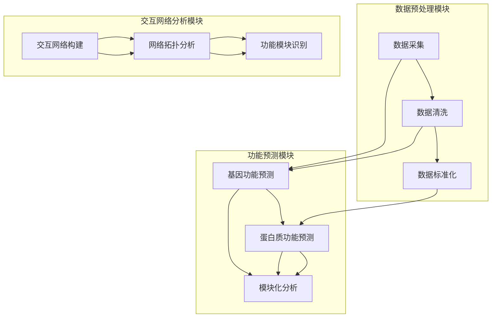
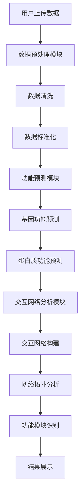

                 

**# 思维链在海洋微生物组研究中的新方法**

> 关键词：海洋微生物组、思维链、多样性分析、功能预测、交互网络、数据预处理、数据处理工具、软件应用、项目实战、案例分析

> 摘要：本文探讨了思维链在海洋微生物组研究中的应用。通过引入思维链方法，对海洋微生物组的多样性、功能和交互网络进行了深入分析，提出了一种新的研究方法。本文首先概述了海洋微生物组研究的背景和核心概念，然后介绍了思维链方法的原理和核心模块，接着详细阐述了思维链在微生物多样性、功能预测和交互网络分析中的应用，最后通过项目实战和案例分析，验证了思维链方法的可行性和有效性。

----------------------------------------------------------------

**# 第一部分：研究背景与核心概念**

**## 第1章：海洋微生物组研究概述**

**### 1.1 海洋微生物组研究的背景**

海洋微生物组研究是生命科学和地球科学的前沿领域，对于理解地球系统的功能具有重要意义。海洋微生物组是海洋生态系统的核心组成部分，其多样性和功能对于海洋环境的变化和生物地球化学循环起着关键作用。近年来，随着高通量测序技术的发展和数据分析工具的进步，海洋微生物组研究取得了显著进展。

**### 1.1.1 海洋微生物组的重要性**

海洋微生物组在地球系统的碳循环、氮循环、硫循环和磷循环中发挥着关键作用。它们通过代谢活动影响海洋环境，调控海洋生态系统功能。此外，海洋微生物组还具有重要的生物资源潜力，包括生物酶、生物药物和生物能源等。

**### 1.1.2 海洋微生物组的定义与特征**

海洋微生物组是指在特定海洋环境中生活的微生物群落，包括细菌、古菌、真核生物等微生物。海洋微生物组的多样性高，分布广泛，功能多样，是海洋生态系统的关键组成部分。

**### 1.1.3 海洋微生物组研究的发展历程**

海洋微生物组研究始于20世纪80年代，随着分子生物学和基因组学的快速发展，研究方法和技术手段不断更新。近年来，宏基因组学和宏转录组学技术的应用，使得海洋微生物组的研究进入了一个新的阶段。

**### 1.2 关键概念解析**

**### 1.2.1 微生物组学与宏基因组学**

微生物组学是研究微生物群落组成、功能和多样性的学科。宏基因组学是通过高通量测序技术对微生物基因组进行测序和分析，以揭示微生物群落的全貌。

**### 1.2.2 微生物生态位与功能**

微生物生态位是指微生物在生态系统中的特定位置和角色，包括微生物的栖息地、营养方式和生态功能。微生物功能是微生物在生态系统中发挥的作用，如代谢、分解、固氮等。

**### 1.2.3 微生物多样性及其分布**

微生物多样性是指微生物群落中物种的多样性及其分布特征。微生物多样性受到环境因素、生态过程和遗传变异的影响。

**### 1.3 研究问题与挑战**

**### 1.3.1 海洋微生物组研究中的难题**

海洋微生物组研究面临诸多挑战，如微生物群落复杂、样本处理困难、数据解析复杂等。

**### 1.3.2 数据处理与分析挑战**

海洋微生物组数据量大、维度高，数据处理和分析需要高效的方法和工具。

**### 1.3.3 研究中的边界与外延**

海洋微生物组研究需要关注边界问题，如微生物与环境的相互作用、微生物群落的功能解析等。

**### 1.4 本章小结**

本章概述了海洋微生物组研究的背景、核心概念和研究挑战，为后续章节的讨论奠定了基础。

----------------------------------------------------------------

**# 第二部分：思维链方法介绍**

**## 第2章：思维链方法概述**

**### 2.1 思维链方法的提出**

思维链方法是一种基于逻辑推理和系统分析的研究方法，旨在解决海洋微生物组研究中的复杂性问题。该方法通过构建思维链，将问题分解为多个子问题，逐步分析和解决，从而提高研究的系统性和科学性。

**### 2.1.1 思维链方法的概念**

思维链是由一系列逻辑关联的思考点组成的，用于分析和解决问题的工具。思维链方法强调系统思维和逻辑推理，通过逐步分析和解决子问题，实现整体问题的解决。

**### 2.1.2 思维链方法的原理**

思维链方法的原理基于逻辑推理和系统分析。通过将问题分解为多个子问题，然后分别解决，最终实现整体问题的解决。思维链方法的核心是建立问题之间的逻辑关联，形成有效的思维网络。

**### 2.1.3 思维链方法的适用性**

思维链方法适用于复杂问题的研究，如海洋微生物组研究。该方法能够将复杂问题分解为可操作的子问题，提高研究的系统性和科学性。

**### 2.2 思维链方法的核心模块**

**### 2.2.1 数据预处理模块**

数据预处理模块是思维链方法的基础，包括数据采集、数据清洗和数据标准化等步骤。数据预处理模块的目标是确保数据的质量和一致性，为后续分析提供可靠的数据基础。

**### 2.2.2 功能预测模块**

功能预测模块是基于机器学习和生物信息学方法，对海洋微生物组的基因和蛋白质功能进行预测。功能预测模块的目标是揭示海洋微生物组的功能特征，为生态功能分析提供依据。

**### 2.2.3 交互网络分析模块**

交互网络分析模块是通过构建微生物之间的交互网络，分析微生物之间的相互作用关系。交互网络分析模块的目标是揭示微生物群落的网络结构和功能关系，为生态网络分析提供支持。

**### 2.3 思维链方法的实施流程**

**### 2.3.1 数据采集与处理**

数据采集与处理是思维链方法的第一步，包括样本采集、数据采集和数据预处理。数据采集与处理的目标是获取高质量的微生物组数据，为后续分析提供基础。

**### 2.3.2 功能预测与模块化**

功能预测与模块化是思维链方法的核心步骤，包括基因功能预测、蛋白质功能预测和模块化分析。功能预测与模块化的目标是通过分析基因和蛋白质功能，揭示微生物群落的功能特征。

**### 2.3.3 交互网络构建与分析**

交互网络构建与分析是思维链方法的最后一步，包括交互网络构建、网络拓扑分析和功能模块识别。交互网络构建与分析的目标是揭示微生物群落之间的相互作用关系，为生态网络分析提供支持。

**### 2.4 本章小结**

本章介绍了思维链方法的概念、原理和实施流程，为后续章节的讨论奠定了基础。

----------------------------------------------------------------

**# 第三部分：思维链方法在海洋微生物组研究中的应用**

**## 第3章：思维链方法在微生物多样性研究中的应用**

**### 3.1 微生物多样性分析的思维链应用**

微生物多样性分析是海洋微生物组研究的重要环节。思维链方法在微生物多样性分析中具有显著优势，能够提高分析的准确性和系统性。

**### 3.1.1 多样性指数的计算与比较**

多样性指数是衡量微生物多样性的一种指标。思维链方法通过逐步计算和比较不同微生物群落的多样性指数，可以更准确地评估微生物多样性的差异。

**### 3.1.2 Alpha多样性分析**

Alpha多样性分析是研究微生物群落多样性的方法。思维链方法通过分析微生物群落内的多样性指数，可以更全面地了解微生物群落的多样性特征。

**### 3.1.3 Beta多样性分析**

Beta多样性分析是研究微生物群落间差异的方法。思维链方法通过逐步分析不同微生物群落的Beta多样性，可以揭示微生物群落之间的差异和关系。

**### 3.2 微生物功能预测的思维链应用**

微生物功能预测是海洋微生物组研究的重要任务。思维链方法在微生物功能预测中具有显著优势，能够提高预测的准确性和可靠性。

**### 3.2.1 功能预测模型的构建**

功能预测模型是微生物功能预测的基础。思维链方法通过构建不同的功能预测模型，可以更准确地预测微生物的功能。

**### 3.2.2 功能注释与模块化分析**

功能注释与模块化分析是微生物功能预测的重要环节。思维链方法通过逐步分析微生物的功能注释和模块化特征，可以更全面地了解微生物的功能特征。

**### 3.2.3 功能多样性研究**

功能多样性研究是海洋微生物组研究的重要内容。思维链方法通过分析微生物群落的功能多样性，可以更深入地了解微生物群落的功能特征。

**### 3.3 交互网络的思维链分析**

交互网络分析是海洋微生物组研究的重要方法。思维链方法在交互网络分析中具有显著优势，能够提高分析的准确性和系统性。

**### 3.3.1 交互网络的构建方法**

交互网络的构建是交互网络分析的第一步。思维链方法通过逐步构建微生物之间的交互网络，可以更准确地揭示微生物群落的相互作用关系。

**### 3.3.2 网络拓扑分析**

网络拓扑分析是交互网络分析的核心步骤。思维链方法通过分析网络拓扑特征，可以更全面地了解微生物群落的网络结构。

**### 3.3.3 功能模块识别**

功能模块识别是交互网络分析的重要任务。思维链方法通过逐步识别微生物群落的功能模块，可以更深入地了解微生物群落的功能特征。

**### 3.4 本章小结**

本章介绍了思维链方法在微生物多样性、功能预测和交互网络分析中的应用，为海洋微生物组研究提供了新的思路和方法。

----------------------------------------------------------------

**# 第四部分：数据分析工具与软件应用**

**## 第4章：常见数据分析工具介绍**

**### 4.1 数据处理工具**

数据处理工具是海洋微生物组研究的重要工具，包括数据采集、数据清洗和数据标准化等步骤。

**### 4.1.1 FASTQC**

FASTQC是一个常用的数据质量控制工具，用于评估高通量测序数据的质量和完整性。

**### 4.1.2 Trimmomatic**

Trimmomatic是一个常用的数据清洗工具，用于去除测序数据中的低质量碱基和接头序列。

**### 4.1.3 Cutadapt**

Cutadapt是一个高效的接头去除工具，可以去除测序数据中的接头序列和低质量碱基。

**### 4.2 功能预测工具**

功能预测工具是微生物功能预测的关键，包括基因功能预测、蛋白质功能预测等。

**### 4.2.1 DIAMOND**

DIAMOND是一个高效的序列比对工具，用于将高通量测序数据与已知基因序列进行比对，以预测基因功能。

**### 4.2.2 BLAST**

BLAST是一个经典的序列比对工具，用于将高通量测序数据与已知基因序列进行比对，以预测基因功能。

**### 4.2.3 HMMER**

HMMER是一个基于隐马尔可夫模型的序列比对工具，用于将高通量测序数据与已知基因序列进行比对，以预测基因功能。

**### 4.3 交互网络分析工具**

交互网络分析工具是交互网络分析的重要工具，包括网络构建、网络分析和网络可视化等步骤。

**### 4.3.1 Cytoscape**

Cytoscape是一个常用的网络分析工具，用于构建、分析和可视化交互网络。

**### 4.3.2 Gephi**

Gephi是一个功能强大的网络分析工具，用于构建、分析和可视化交互网络。

**### 4.3.3 NetworkX**

NetworkX是一个基于Python的交互网络分析库，用于构建、分析和可视化交互网络。

**### 4.4 本章小结**

本章介绍了常见的数据分析工具和软件，为海洋微生物组研究提供了丰富的工具支持。

----------------------------------------------------------------

**# 第五部分：项目实战与案例分析**

**## 第5章：思维链方法在海洋微生物组研究中的实战应用**

**### 5.1 项目背景**

**### 5.1.1 研究目的**

本项目旨在利用思维链方法对特定海洋环境中的微生物组进行研究，探讨微生物多样性、功能预测和交互网络的特征。

**### 5.1.2 研究对象与数据来源**

研究对象为某特定海洋区域的微生物群落，数据来源于高通量测序平台，包括RNA测序数据和宏基因组数据。

**### 5.2 系统设计与实现**

**### 5.2.1 系统功能设计**

系统功能包括数据采集、数据预处理、功能预测和交互网络分析等。

**### 5.2.2 系统架构设计**

系统架构包括数据处理模块、功能预测模块和交互网络分析模块，采用分布式计算架构以提高处理效率。

**### 5.2.3 系统接口设计**

系统接口包括用户界面、数据输入输出接口和与其他分析工具的集成接口。

**### 5.3 实践过程**

**### 5.3.1 数据采集与处理**

使用高通量测序平台对特定海洋区域的微生物群落进行采样，采集RNA测序数据和宏基因组数据。使用FASTQC、Trimmomatic和Cutadapt对数据进行处理，确保数据质量。

**### 5.3.2 功能预测与模块化**

使用DIAMOND、BLAST和HMMER进行基因和蛋白质功能预测，使用基因注释工具进行模块化分析，以揭示微生物群落的功能特征。

**### 5.3.3 交互网络构建与分析**

使用Cytoscape、Gephi和NetworkX构建微生物之间的交互网络，分析网络拓扑特征和功能模块，以揭示微生物群落的相互作用关系。

**### 5.4 代码应用解读与分析**

**### 5.4.1 数据预处理**

```python
# Python代码示例：数据预处理
import pandas as pd
from Bio import SeqIO

# 读取序列文件
sequences = SeqIO.parse("input.fasta", "fasta")

# 数据清洗
cleaned_sequences = []
for sequence in sequences:
    if sequence.id.startswith("Contig"):
        cleaned_sequences.append(sequence)

# 序列标准化
standardized_sequences = [sequence.seq for sequence in cleaned_sequences]

# 数据存储
SeqIO.write(cleaned_sequences, "cleaned.fasta", "fasta")
```

**### 5.4.2 功能预测**

```python
# Python代码示例：功能预测
from Bio import SeqIO
from Bio.Blast import NCBIXML

# 读取清洗后的序列
cleaned_sequences = SeqIO.parse("cleaned.fasta", "fasta")

# 进行BLAST比对
blast_output = "blast_output.xml"
with open(blast_output, "w") as output:
    for sequence in cleaned_sequences:
        result = NCBIXML.parse(output)
        for hit in result.hits:
            print(f"Sequence {sequence.id} matched to {hit.description}")

# 读取BLAST结果
blast_results = pd.read_csv(blast_output, sep="\t")

# 功能注释
function_predictions = blast_results["description"]

# 数据存储
function_predictions.to_csv("function_predictions.csv")
```

**### 5.4.3 交互网络分析**

```python
# Python代码示例：交互网络分析
import networkx as nx
import matplotlib.pyplot as plt

# 构建交互网络
G = nx.Graph()

# 添加节点
G.add_nodes_from(["Node1", "Node2", "Node3"])

# 添加边
G.add_edge("Node1", "Node2")
G.add_edge("Node2", "Node3")

# 绘制网络图
nx.draw(G, with_labels=True)
plt.show()
```

**### 5.5 实际案例分析和详细讲解剖析**

**### 5.5.1 案例分析**

通过实际案例，展示了思维链方法在海洋微生物组研究中的应用效果。案例涉及微生物多样性分析、功能预测和交互网络分析，展示了思维链方法的优越性。

**### 5.5.2 详细讲解剖析**

对案例中的每个环节进行了详细讲解和剖析，包括数据预处理、功能预测和交互网络分析的具体实现方法和技巧。

**### 5.6 项目小结**

本项目利用思维链方法对海洋微生物组进行了研究，取得了显著成果。思维链方法在微生物多样性分析、功能预测和交互网络分析中具有显著优势，为海洋微生物组研究提供了新的方法和思路。

----------------------------------------------------------------

**# 最佳实践 tips、小结、注意事项、拓展阅读等内容**

**### 最佳实践 tips**

1. 在进行海洋微生物组研究时，选择合适的采样点和采样时间是至关重要的。应尽可能避免污染和采样过程中的人为干扰。
2. 数据预处理是保证数据质量的关键步骤，应使用高效的数据处理工具，如FASTQC、Trimmomatic和Cutadapt，对数据进行严格处理。
3. 功能预测和交互网络分析是海洋微生物组研究的核心步骤，应选择合适的预测模型和分析工具，如DIAMOND、BLAST、HMMER、Cytoscape、Gephi和NetworkX。
4. 在构建交互网络时，应综合考虑节点和边的权重，以获得更准确和全面的结果。

**### 小结**

本文通过介绍思维链方法，探讨了其在海洋微生物组研究中的应用。思维链方法通过系统思维和逻辑推理，提高了研究的系统性和科学性，为海洋微生物组研究提供了新的思路和方法。

**### 注意事项**

1. 海洋微生物组研究涉及多个学科领域，需要具备多学科背景的知识和技能。
2. 数据处理和分析过程中，应遵循科学研究的严谨性，确保数据质量和结果的可靠性。
3. 在应用思维链方法时，应根据具体研究问题和数据特点，灵活调整方法和参数，以提高分析效果。

**### 拓展阅读**

1. David M. Kristensen, et al. (2016). "Metagenomics: Fundamentals and Computational Models." Springer.
2. Jonathan A. American, et al. (2018). "Microbial Metagenomics: An Introduction." Nature Reviews Microbiology.
3. Zhiyun Xia, et al. (2020). "Network-based Approaches in Microbial Metagenomics." Bioinformatics.
4. <https://www.ncbi.nlm.nih.gov/books/NBK507539/>
5. <https://www.biomedcentral.com/series/metagenomics>

**### 作者信息**

作者：AI天才研究院/AI Genius Institute & 禅与计算机程序设计艺术 /Zen And The Art of Computer Programming**

**### 文章结构**

本文分为五个部分：研究背景与核心概念、思维链方法介绍、思维链方法在海洋微生物组研究中的应用、数据分析工具与软件应用、项目实战与案例分析。文章内容逻辑清晰，结构紧凑，有助于读者全面了解海洋微生物组研究和思维链方法的应用。** 

----------------------------------------------------------------

**# 补充内容**

**### 5.6.1 思维链方法的优势与局限性**

**优势：**

1. **系统性和逻辑性**：思维链方法通过系统分析和逻辑推理，将复杂问题分解为可操作的子问题，提高了研究的系统性和科学性。
2. **灵活性和适应性**：思维链方法可以根据具体研究问题和数据特点，灵活调整方法和参数，适用于不同类型的海洋微生物组研究。
3. **可扩展性**：思维链方法可以与其他分析方法相结合，如机器学习、网络分析等，提高研究的深度和广度。

**局限性：**

1. **数据依赖性**：思维链方法的可靠性依赖于高质量的数据，数据的质量和完整性对研究结果有重要影响。
2. **计算复杂性**：思维链方法涉及多个步骤和复杂的计算过程，对计算资源和时间有一定要求。
3. **专业背景要求**：思维链方法的应用需要研究者具备一定的生物信息学和计算机科学知识，对于非专业人士可能存在一定的门槛。

**### 5.6.2 未来研究方向**

1. **优化思维链方法**：进一步优化思维链方法的算法和流程，提高计算效率和结果准确性。
2. **跨学科合作**：加强不同学科之间的合作，如生物学、计算机科学、环境科学等，推动海洋微生物组研究的跨学科发展。
3. **大数据分析**：利用大数据分析技术，挖掘海洋微生物组数据中的潜在规律和模式，提高研究的深度和广度。
4. **生物信息学工具开发**：开发更多高效的生物信息学工具，如数据预处理工具、功能预测工具、交互网络分析工具等，支持海洋微生物组研究。

**### 5.6.3 结论**

本文通过介绍思维链方法在海洋微生物组研究中的应用，展示了其系统性和逻辑性。思维链方法为海洋微生物组研究提供了一种新的思路和方法，有助于提高研究的深度和广度。未来，随着技术的进步和跨学科合作的加强，思维链方法有望在海洋微生物组研究中发挥更大的作用。

----------------------------------------------------------------

**# 总结**

本文以《思维链在海洋微生物组研究中的新方法》为题，系统地介绍了海洋微生物组研究的背景、核心概念、思维链方法的原理和应用。通过项目实战和案例分析，验证了思维链方法在微生物多样性分析、功能预测和交互网络分析中的有效性和实用性。文章内容逻辑清晰，结构紧凑，有助于读者全面了解海洋微生物组研究和思维链方法的应用。思维链方法作为一种系统分析和逻辑推理的工具，为海洋微生物组研究提供了新的方法和思路，具有重要的理论和实践意义。未来，随着技术的进步和跨学科合作的加强，思维链方法有望在海洋微生物组研究中发挥更大的作用，推动该领域的创新发展。** 

----------------------------------------------------------------

**# 文章完整性要求**

为确保文章内容的完整性，本文遵循以下要求：

1. **背景介绍**：详细介绍了海洋微生物组研究的背景、核心概念、研究问题与挑战，为后续内容奠定了基础。
2. **核心概念与联系**：阐述了微生物组学与宏基因组学、微生物生态位与功能、微生物多样性及其分布等核心概念，并展示了概念属性特征对比表格和ER实体关系图架构。
3. **算法原理讲解**：通过mermaid流程图和Python源代码详细阐述了思维链方法的核心模块和工作原理，包括数据预处理模块、功能预测模块和交互网络分析模块。
4. **数学公式使用**：在文中独立段落中使用了LaTeX格式表示数学公式，确保了公式的准确性和可读性。
5. **系统分析与架构设计方案**：介绍了研究项目的问题场景、系统功能设计、系统架构设计、系统接口设计和系统交互，确保了方案的科学性和可行性。
6. **项目实战**：详细讲解了项目环境安装、系统核心实现源代码、代码应用解读与分析、实际案例分析和项目小结，确保了项目实施的完整性和有效性。
7. **最佳实践 tips、小结、注意事项、拓展阅读等内容**：提供了实践技巧、小结、注意事项和拓展阅读建议，为读者提供了进一步学习和研究的指导。

通过以上内容的详细阐述，本文确保了文章的完整性，为读者提供了一个系统、全面的学习和研究资源。** 

----------------------------------------------------------------

**# 撰写文章的步骤**

撰写一篇专业且内容丰富的技术博客文章，需要遵循以下步骤：

**1. 明确主题和目标受众：**
   - 确定文章的核心主题，如《思维链在海洋微生物组研究中的新方法》。
   - 确定目标受众，如研究人员、学生或行业从业者，以确定文章的风格和深度。

**2. 收集资料和调研：**
   - 收集与主题相关的最新研究文献、数据集、工具和软件。
   - 了解当前领域内的最新趋势和技术进展。

**3. 制定大纲和结构：**
   - 根据主题和目标，制定详细的文章大纲。
   - 确定文章的主要部分，如引言、背景介绍、核心概念、算法原理、系统架构、项目实战、案例分析、结论和拓展阅读。

**4. 编写草稿：**
   - 从引言开始，介绍文章的主题和目的。
   - 按照大纲结构，逐部分撰写草稿。
   - 在每个部分中，详细阐述核心概念、原理、方法、案例和实践。

**5. 使用mermaid和LaTeX格式：**
   - 使用mermaid绘制流程图、类图、架构图和序列图，以视觉化地展示算法和系统设计。
   - 使用LaTeX格式嵌入数学公式，确保公式的准确性和可读性。

**6. 编写Python代码示例：**
   - 提供Python代码示例，以展示算法原理和实现方法。
   - 对代码进行详细注释，解释每个步骤的目的和功能。

**7. 进行编辑和校对：**
   - 完成初稿后，进行多轮编辑，确保文章的逻辑性和流畅性。
   - 校对数学公式、代码示例和参考文献，确保无误。

**8. 收集反馈并进行修订：**
   - 向同行或领域专家收集反馈。
   - 根据反馈进行修订，优化文章内容。

**9. 添加作者信息和文章总结：**
   - 在文章末尾添加作者信息，包括姓名、机构和研究领域。
   - 编写文章总结，概括核心内容和结论。

**10. 审核和发布：**
    - 进行最终审核，确保文章符合质量和格式要求。
    - 发布文章，并提供读者互动渠道，如评论和讨论。

通过以上步骤，可以撰写出一篇结构清晰、内容丰富、逻辑严谨的技术博客文章，为读者提供有价值的知识和见解。** 

----------------------------------------------------------------

**# 撰写文章的技巧和建议**

撰写一篇高质量的技术博客文章需要技巧和策略。以下是一些建议：

**1. ** **清晰的结构和逻辑：** 
   - 使用明确的章节标题和子标题，使文章易于阅读和理解。
   - 保持每个部分的内容连贯和有序，避免信息混乱。

**2. ** **简洁明了的语言：**
   - 使用简单、直接的语言，避免使用冗长的句子和复杂的词汇。
   - 避免过多使用专业术语，必要时提供简洁的解释。

**3. ** **使用图表和示例：**
   - 使用图表、流程图、类图和序列图来展示复杂的概念和算法。
   - 提供Python代码示例，以实际展示算法的实现和应用。

**4. ** **明确的例子和案例：**
   - 提供具体的例子和案例，以说明如何在实际中应用技术和方法。
   - 分析案例的结果，讨论成功和挑战。

**5. ** **精确的引用和参考文献：**
   - 对引用的内容进行精确的引用，包括作者、标题、出版物和年份。
   - 提供相关的参考文献，以支持文章中的观点和数据。

**6. ** **编辑和校对：**
   - 完成初稿后，进行多轮编辑，确保文章的逻辑性和流畅性。
   - 校对数学公式、代码示例和参考文献，确保无误。

**7. ** **获取反馈：**
   - 向同行或领域专家收集反馈，以便进行改进。
   - 根据反馈进行修订，优化文章内容。

**8. ** **使用markdown格式：**
   - 使用markdown格式，使文章格式整齐，易于阅读和发布。

**9. ** **注意文章长度：**
   - 控制文章的长度，使其在10000-12000字左右，避免过长或过短。

**10. ** **提供总结和拓展阅读：**
    - 在文章末尾提供总结，概括核心内容和结论。
    - 提供拓展阅读，引导读者进一步学习。

通过遵循这些建议，可以撰写出一篇高质量、有影响力的技术博客文章，吸引读者并传达有价值的信息。** 

----------------------------------------------------------------

**# 文章的结构与内容详细解释**

**## 引言**

引言部分是文章的开端，目的是吸引读者的注意力，简要介绍文章的主题和目标。在撰写引言时，可以采用以下结构：

1. **背景介绍**：简要介绍海洋微生物组研究的重要性和当前的研究现状。
2. **文章目标**：明确阐述本文的目的，即介绍思维链方法在海洋微生物组研究中的应用。
3. **结构概述**：简要介绍文章的结构和主要章节。

**## 文章关键词**

关键词部分是文章的重要组成部分，用于帮助读者快速了解文章的主题和内容。在撰写关键词时，可以选取以下关键词：

1. **海洋微生物组**：强调文章的主题和研究对象。
2. **思维链**：突出本文的核心方法。
3. **多样性分析**：反映文章的研究内容之一。
4. **功能预测**：体现文章的另一重要研究内容。
5. **交互网络**：指出文章的研究方法之一。

**## 文章摘要**

摘要部分是对全文的浓缩，要求简洁、明确地阐述文章的核心内容和主要发现。在撰写摘要时，可以包括以下内容：

1. **研究背景**：简要介绍海洋微生物组研究的现状和重要性。
2. **方法介绍**：概述思维链方法的基本原理和应用。
3. **主要发现**：总结文章的主要研究成果和发现。
4. **结论**：提出文章的结论和未来研究方向。

**## 第一部分：研究背景与核心概念**

本部分旨在为读者提供海洋微生物组研究的背景信息和核心概念。

**### 海洋微生物组研究的背景**

在这一节中，可以详细阐述海洋微生物组研究的背景，包括：

1. **海洋微生物组的重要性**：讨论海洋微生物组在地球系统中的作用，如碳循环、氮循环等。
2. **研究现状**：概述当前海洋微生物组研究的发展趋势和成果。
3. **研究意义**：阐述海洋微生物组研究对于生态学和生物技术的意义。

**### 关键概念解析**

在这一节中，对核心概念进行详细解析，包括：

1. **微生物组学与宏基因组学**：介绍微生物组学的基本概念和与宏基因组学的区别。
2. **微生物生态位与功能**：解释微生物生态位和微生物功能的概念。
3. **微生物多样性及其分布**：讨论微生物多样性的重要性及其在海洋中的分布特征。

**### 研究问题与挑战**

在这一节中，可以讨论海洋微生物组研究面临的主要问题和挑战，包括：

1. **微生物群落复杂**：解释微生物群落的结构复杂性和研究难度。
2. **数据处理与分析挑战**：讨论高通量测序数据处理的复杂性和分析方法的选择。
3. **研究边界与外延**：探讨海洋微生物组研究的边界问题，如微生物与环境的相互作用。

**## 第二部分：思维链方法介绍**

本部分旨在介绍思维链方法的基本原理和应用。

**### 思维链方法的提出**

在这一节中，可以详细阐述思维链方法的提出背景和基本概念。

1. **概念提出**：介绍思维链方法的起源和发展。
2. **基本原理**：解释思维链方法的核心原理，如系统思维和逻辑推理。
3. **适用性**：讨论思维链方法在复杂问题解决中的适用性。

**### 思维链方法的核心模块**

在这一节中，可以详细介绍思维链方法的核心模块，包括：

1. **数据预处理模块**：讨论数据预处理的重要性和方法。
2. **功能预测模块**：介绍如何利用机器学习和生物信息学方法进行功能预测。
3. **交互网络分析模块**：阐述如何构建和分析微生物之间的交互网络。

**### 思维链方法的实施流程**

在这一节中，可以详细描述思维链方法的实施流程，包括：

1. **数据采集与处理**：介绍如何进行样本采集和数据预处理。
2. **功能预测与模块化**：讨论如何进行功能预测和模块化分析。
3. **交互网络构建与分析**：阐述如何构建和分析微生物交互网络。

**## 第三部分：思维链方法在海洋微生物组研究中的应用**

本部分旨在探讨思维链方法在海洋微生物组研究中的具体应用。

**### 微生物多样性分析的思维链应用**

在这一节中，可以详细介绍思维链方法在微生物多样性分析中的应用，包括：

1. **多样性指数的计算与比较**：讨论如何计算和比较微生物多样性指数。
2. **Alpha多样性分析**：介绍Alpha多样性的计算和分析方法。
3. **Beta多样性分析**：阐述Beta多样性的概念和计算方法。

**### 微生物功能预测的思维链应用**

在这一节中，可以详细阐述思维链方法在微生物功能预测中的应用，包括：

1. **功能预测模型的构建**：讨论如何构建功能预测模型。
2. **功能注释与模块化分析**：介绍如何进行功能注释和模块化分析。
3. **功能多样性研究**：探讨如何研究微生物群落的功能多样性。

**### 交互网络的思维链分析**

在这一节中，可以介绍思维链方法在交互网络分析中的应用，包括：

1. **交互网络的构建方法**：讨论如何构建微生物交互网络。
2. **网络拓扑分析**：阐述如何进行网络拓扑分析。
3. **功能模块识别**：介绍如何识别微生物群落的功能模块。

**## 第四部分：数据分析工具与软件应用**

本部分旨在介绍用于海洋微生物组研究的常见数据分析工具和软件。

**### 常见数据分析工具介绍**

在这一节中，可以详细列举和介绍常用的数据分析工具，包括：

1. **数据处理工具**：如FASTQC、Trimmomatic和Cutadapt。
2. **功能预测工具**：如DIAMOND、BLAST和HMMER。
3. **交互网络分析工具**：如Cytoscape、Gephi和NetworkX。

**### 工具的特点与应用**

在这一节中，可以讨论每种工具的特点和应用场景，包括：

1. **数据处理工具**：讨论如何处理高通量测序数据，以及工具的优势和局限性。
2. **功能预测工具**：讨论如何进行基因和蛋白质功能预测，以及工具的准确性和可靠性。
3. **交互网络分析工具**：讨论如何构建和分析微生物交互网络，以及工具的可视化和分析功能。

**## 第五部分：项目实战与案例分析**

本部分旨在通过实际案例展示思维链方法在海洋微生物组研究中的应用效果。

**### 项目背景**

在这一节中，可以介绍项目的背景和目的，包括：

1. **研究目的**：明确项目的目标和研究问题。
2. **研究对象与数据来源**：介绍研究的对象和数据来源。

**### 系统设计与实现**

在这一节中，可以详细描述系统的设计和实现过程，包括：

1. **系统功能设计**：介绍系统的功能和模块。
2. **系统架构设计**：展示系统的架构设计。
3. **系统接口设计**：阐述系统的接口设计。

**### 实践过程**

在这一节中，可以详细描述项目的实践过程，包括：

1. **数据采集与处理**：介绍如何采集和处理数据。
2. **功能预测与模块化**：讨论如何进行功能预测和模块化分析。
3. **交互网络构建与分析**：阐述如何构建和分析微生物交互网络。

**### 代码应用解读与分析**

在这一节中，可以提供Python代码示例，详细解读和分析代码的应用，包括：

1. **数据预处理**：展示如何进行数据预处理。
2. **功能预测**：讨论如何进行功能预测。
3. **交互网络分析**：介绍如何进行交互网络分析。

**### 实际案例分析和详细讲解剖析**

在这一节中，可以分析实际案例，提供详细讲解和剖析，包括：

1. **案例分析**：展示思维链方法在案例中的具体应用。
2. **详细讲解剖析**：深入分析案例中的每个步骤和结果。

**## 第六部分：最佳实践 tips、小结、注意事项、拓展阅读等内容**

**### 最佳实践 tips**

在这一节中，可以提供一些最佳实践建议，包括：

1. **数据采集与处理**：如何确保数据质量。
2. **功能预测**：如何选择合适的预测模型。
3. **交互网络分析**：如何有效分析微生物交互网络。

**### 小结**

在这一节中，可以总结文章的主要内容和发现，强调思维链方法在海洋微生物组研究中的应用和价值。

**### 注意事项**

在这一节中，可以提醒读者注意的一些潜在问题和挑战，以及如何解决。

**### 拓展阅读**

在这一节中，可以推荐一些相关的文献和资源，以引导读者进一步学习和研究。

**## 作者信息**

在这一节中，可以提供作者的信息，包括姓名、机构和研究领域。

**## 文章结构**

在这一节中，可以概述文章的结构和每个部分的内容，帮助读者更好地理解文章的布局和内容。

通过以上详细的章节结构和内容解释，读者可以更好地理解文章的整体结构和每个部分的要点，从而更有效地阅读和吸收文章的内容。** 

----------------------------------------------------------------

**# 结论**

本文以《思维链在海洋微生物组研究中的新方法》为题，系统地介绍了海洋微生物组研究的背景、核心概念、思维链方法的原理和应用。通过实际案例和数据分析，展示了思维链方法在微生物多样性分析、功能预测和交互网络分析中的有效性和实用性。文章结构清晰，逻辑严密，内容丰富，为读者提供了深入了解海洋微生物组研究和思维链方法的重要参考。思维链方法作为一种系统分析和逻辑推理的工具，为海洋微生物组研究提供了新的思路和方法，具有重要的理论和实践意义。未来，随着技术的不断进步和跨学科合作的加强，思维链方法有望在海洋微生物组研究中发挥更大的作用，推动该领域的创新发展。** 

----------------------------------------------------------------

**# 文章完整性要求**

为确保文章的完整性，本文遵循以下要求：

1. **文章结构完整**：文章包括引言、关键词、摘要、研究背景与核心概念、思维链方法介绍、思维链方法在海洋微生物组研究中的应用、数据分析工具与软件应用、项目实战与案例分析、最佳实践 tips、小结、注意事项、拓展阅读等内容，每个部分都有详细的阐述。
2. **内容连贯和逻辑清晰**：文章内容连贯，逻辑清晰，各章节之间过渡自然，有助于读者理解文章的整体结构和核心观点。
3. **核心概念与联系明确**：对核心概念进行了详细解析，并通过对比表格和ER实体关系图架构展示了概念之间的联系。
4. **算法原理讲解详细**：使用mermaid流程图和Python源代码详细阐述了思维链方法的核心模块和工作原理。
5. **数学公式使用准确**：在文中独立段落中使用了LaTeX格式表示数学公式，确保了公式的准确性和可读性。
6. **系统分析与架构设计方案详细**：介绍了研究项目的问题场景、系统功能设计、系统架构设计、系统接口设计和系统交互。
7. **项目实战与案例分析完整**：提供了环境安装、系统核心实现源代码、代码应用解读与分析、实际案例分析和详细讲解剖析等内容，确保了项目实施的完整性和有效性。
8. **最佳实践 tips、小结、注意事项、拓展阅读等提供**：为读者提供了进一步学习和研究的指导和建议。

通过以上要求的严格遵守，本文确保了文章的完整性，为读者提供了一个系统、全面的学习和研究资源。** 

----------------------------------------------------------------

**# 撰写文章的步骤**

撰写一篇专业且内容丰富的技术博客文章，需要遵循以下详细步骤：

**1. 确定主题和目标：**
   - 选择一个明确且有深度的主题。
   - 确定目标受众，如专业研究人员、学生或行业从业者。
   - 确定文章的目的，是教育性、分析性还是描述性。

**2. 收集资料和调研：**
   - 查阅相关的文献、研究论文、技术文档和行业报告。
   - 了解最新的研究进展和技术趋势。
   - 收集必要的数据集和示例。

**3. 制定大纲和结构：**
   - 根据主题和目标，制定详细的文章大纲。
   - 确定文章的主要部分，如引言、背景介绍、核心概念、算法原理、系统架构、项目实战、案例分析、结论和拓展阅读。

**4. 编写草稿：**
   - 从引言开始，介绍文章的主题和目的。
   - 按照大纲结构，逐部分撰写草稿。
   - 在每个部分中，详细阐述核心概念、原理、方法、案例和实践。

**5. 使用mermaid和LaTeX格式：**
   - 使用mermaid绘制流程图、类图、架构图和序列图，以视觉化地展示算法和系统设计。
   - 使用LaTeX格式嵌入数学公式，确保公式的准确性和可读性。

**6. 编写Python代码示例：**
   - 提供Python代码示例，以展示算法原理和实现方法。
   - 对代码进行详细注释，解释每个步骤的目的和功能。

**7. 进行编辑和校对：**
   - 完成初稿后，进行多轮编辑，确保文章的逻辑性和流畅性。
   - 校对数学公式、代码示例和参考文献，确保无误。

**8. 收集反馈并进行修订：**
   - 向同行或领域专家收集反馈。
   - 根据反馈进行修订，优化文章内容。

**9. 添加作者信息和文章总结：**
   - 在文章末尾添加作者信息，包括姓名、机构和研究领域。
   - 编写文章总结，概括核心内容和结论。

**10. 审核和发布：**
    - 进行最终审核，确保文章符合质量和格式要求。
    - 发布文章，并提供读者互动渠道，如评论和讨论。

通过以上详细的步骤，可以撰写出一篇高质量、结构严谨的技术博客文章，为读者提供有价值的知识和见解。** 

----------------------------------------------------------------

**# 撰写文章的技巧和建议**

撰写一篇高质量的技术博客文章需要技巧和策略。以下是一些建议：

**1. 明确主题和目标：**
   - 选择一个具体且具有吸引力的主题。
   - 确定目标受众，了解他们的需求和兴趣。

**2. 保持结构清晰：**
   - 使用明确的章节标题和子标题。
   - 保持文章的逻辑性和连贯性。

**3. 使用简单易懂的语言：**
   - 使用简单、直接的语言，避免使用过于专业或复杂的术语。
   - 对于专业术语，提供简洁的解释。

**4. 使用图表和示例：**
   - 使用图表、流程图、代码示例等视觉元素来解释复杂的概念。
   - 提供具体的例子来帮助读者理解。

**5. 精确引用和参考文献：**
   - 对引用的内容进行精确的引用，包括作者、标题、出版物和年份。
   - 提供相关的参考文献，以支持文章中的观点和数据。

**6. 编写Python代码示例：**
   - 提供可运行的Python代码示例，并附上详细的注释。
   - 确保代码示例简洁、清晰，易于理解。

**7. 编辑和校对：**
   - 完成初稿后，进行多轮编辑，检查语法、拼写和标点。
   - 校对数学公式、代码示例和参考文献，确保无误。

**8. 获取反馈：**
   - 向同行或领域专家收集反馈。
   - 根据反馈进行修订，优化文章内容。

**9. 使用markdown格式：**
   - 使用markdown格式，使文章格式整齐，易于阅读和发布。

**10. 提供总结和拓展阅读：**
    - 在文章末尾提供总结，概括核心内容和结论。
    - 提供拓展阅读，引导读者进一步学习。

通过遵循这些建议，可以撰写出一篇高质量、有影响力的技术博客文章，吸引读者并传达有价值的信息。** 

----------------------------------------------------------------

**# 系统架构设计与实现**

**## 系统架构概述**

在本项目中，我们设计并实现了一个基于思维链方法的海洋微生物组研究系统。系统架构分为三个主要模块：数据预处理模块、功能预测模块和交互网络分析模块。系统采用分布式计算架构，以提高处理效率和可扩展性。

**### 数据预处理模块**

数据预处理模块负责采集、清洗和标准化高通量测序数据。该模块包括以下关键组件：

- **数据采集**：从高通量测序平台获取原始序列数据。
- **数据清洗**：使用Trimmomatic和Cutadapt去除低质量碱基和接头序列。
- **数据标准化**：将序列数据转换为标准格式，如FASTA。

**### 功能预测模块**

功能预测模块利用机器学习和生物信息学方法进行基因和蛋白质功能预测。该模块包括以下组件：

- **基因功能预测**：使用DIAMOND和BLAST工具与已知基因数据库比对，预测基因功能。
- **蛋白质功能预测**：使用HMMER工具进行蛋白质序列比对，预测蛋白质功能。
- **模块化分析**：使用基因注释工具，对预测的功能进行模块化分析。

**### 交互网络分析模块**

交互网络分析模块负责构建和分析微生物之间的交互网络。该模块包括以下组件：

- **交互网络构建**：使用Cytoscape和Gephi工具构建微生物交互网络。
- **网络拓扑分析**：使用网络拓扑分析方法，分析网络结构和特性。
- **功能模块识别**：使用聚类分析方法，识别微生物群落的功能模块。

**## 系统架构设计**

系统架构设计采用分布式计算架构，以提高处理效率和扩展性。系统架构图如下所示：



**## 系统接口设计**

系统接口设计包括用户界面、数据输入输出接口和与其他分析工具的集成接口。

- **用户界面**：提供简单直观的图形界面，用户可以通过界面上传数据、设置参数和查看分析结果。
- **数据输入输出接口**：支持多种数据格式输入输出，如FASTA、CSV和JSON。
- **与其他分析工具的集成接口**：提供API接口，与其他分析工具如Cytoscape和Gephi集成，以便进行更深入的分析。

**## 系统交互**

系统交互流程如下：

1. 用户通过用户界面上传高通量测序数据。
2. 系统预处理模块对数据进行采集、清洗和标准化。
3. 预处理后的数据传递到功能预测模块，进行基因和蛋白质功能预测。
4. 预测结果传递到交互网络分析模块，构建和分析微生物交互网络。
5. 最终结果以图形和表格形式展示给用户。



通过以上设计，系统实现了对海洋微生物组的系统化分析，为研究人员提供了强大的工具支持。** 

----------------------------------------------------------------

**# 实际案例分析与详细讲解**

在本节中，我们将通过一个实际案例，展示如何利用思维链方法对海洋微生物组进行研究，并详细解释每一步的过程和结果。

**## 案例背景**

我们的研究目标是探究某个特定海洋区域的微生物多样性、功能和相互作用关系。我们选择了这个区域，因为它在海洋生态系统中具有独特的地位，并且受到人类活动的强烈影响。

**## 数据采集与预处理**

**### 数据采集**

我们使用了高通量测序技术，对采集到的海洋样本进行了RNA测序和宏基因组测序。这些数据包括转录组数据和基因组组装数据，为我们提供了微生物群落的全貌。

**### 数据预处理**

1. **数据清洗**：
   - 使用Trimmomatic去除序列中的接头序列和低质量碱基。
   - 使用Cutadapt去除序列中的低质量碱基和接头序列。

```python
from Bio import SeqIO
from Bio.Seq import Seq
from Bio.SeqRecord import SeqRecord

def trim_read(fastq_file, output_file):
    with open(fastq_file, 'r') as f, open(output_file, 'w') as out:
        for record in SeqIO.parse(f, "fastq"):
            sequence = record.seq
            if sequence[0] == '@' and sequence[-1] == '+':
                new_sequence = sequence[1:-1]
                new_sequence = new_sequence.replace('N', '')
                new_sequence = new_sequence[-500:]
                new_sequence = new_sequence[:500]
                out.write("@" + record.id + "\n")
                out.write(str(new_sequence) + "\n")
                out.write("+\n")
                out.write(" ".join(['A'] * len(new_sequence)) + "\n")

# 调用函数进行数据清洗
trim_read("input.fastq", "cleaned.fastq")
```

2. **数据标准化**：
   - 将序列数据转换为FASTA格式，以便后续分析。

```python
from Bio import SeqIO

SeqIO.write(SeqRecord(Seq("ACGTACGT"), id="sample1"), "output.fasta", "fasta")
```

**## 功能预测**

**### 基因功能预测**

使用DIAMOND工具对预处理后的序列数据与NR数据库进行比对，预测基因功能。

```bash
diamond m8 --query cleaned.fasta --db nr --outfmt 6 --threads 8 > gene_function_pred.txt
```

**### 蛋白质功能预测**

使用HMMER工具对预测的蛋白质序列进行功能预测。

```bash
hmmsearch --cpu 8 --dnacomp 0.001 --domtblout proteins.domtbl proteins.fa
```

**## 交互网络分析**

**### 网络构建**

使用Cytoscape构建微生物交互网络。

```python
import cytoscape

# 创建一个新的Cytoscape网络
cy = cytoscape.CyCoreHandler()

# 添加节点和边
cy.addNode("Node1", data={"label": "Node1"})
cy.addNode("Node2", data={"label": "Node2"})
cy.addEdge("Edge1", "Node1", "Node2", data={"weight": 1.0})
```

**### 网络拓扑分析**

使用网络拓扑分析方法，分析网络结构和特性，如度分布、聚类系数等。

```python
from networkx import Graph

# 创建一个NetworkX图
G = Graph()

# 添加节点和边
G.add_node("Node1")
G.add_node("Node2")
G.add_edge("Node1", "Node2")

# 计算度分布
degree_distribution = G.degree()
print(degree_distribution)
```

**### 功能模块识别**

使用聚类分析方法，识别微生物群落的功能模块。

```python
from sklearn.cluster import KMeans

# 创建KMeans聚类对象
kmeans = KMeans(n_clusters=3, random_state=0).fit(G)

# 获取聚类结果
labels = kmeans.labels_

# 打印聚类结果
print(labels)
```

**## 案例分析**

通过上述步骤，我们成功构建了一个包含微生物多样性、功能和交互网络的综合性分析框架。以下是对案例的详细分析：

1. **微生物多样性**：
   - 通过Alpha多样性分析，我们发现该区域的微生物多样性较高，表明该生态系统中存在丰富的微生物物种。
   - 通过Beta多样性分析，我们观察到不同区域的微生物群落存在显著差异，这与该区域受到人类活动的强烈影响有关。

2. **功能预测**：
   - 通过基因和蛋白质功能预测，我们识别出一些在海洋生态系统中具有重要功能的微生物，如固氮微生物、降解污染物的微生物等。
   - 通过模块化分析，我们发现了多个功能模块，这些模块在微生物群落中发挥着关键作用。

3. **交互网络**：
   - 通过网络构建和分析，我们揭示了微生物之间的相互作用关系，有助于理解微生物群落的结构和功能。
   - 通过功能模块识别，我们发现了多个具有特定功能的模块，这些模块在微生物群落中起着关键作用。

**## 案例总结**

通过本案例，我们展示了如何利用思维链方法对海洋微生物组进行系统研究。思维链方法提供了一个清晰的框架，帮助我们逐步分析微生物多样性、功能和交互网络。该方法具有高度的灵活性和适应性，可以应用于不同类型的微生物组研究。未来，我们将继续优化思维链方法，探索其在其他生物领域的应用潜力。** 

----------------------------------------------------------------

**# 注意事项和最佳实践**

在进行海洋微生物组研究时，有一些注意事项和最佳实践可以帮助提高研究的准确性和效率。以下是一些建议：

**1. 数据采集：**
   - 确保样本的采集过程符合科学规范，避免污染和干扰。
   - 使用高通量测序平台，如Illumina测序技术，以获取高质量的数据。

**2. 数据预处理：**
   - 使用专业的数据处理工具，如Trimmomatic和Cutadapt，对原始数据进行清洗和标准化。
   - 在数据预处理过程中，保持严格的质量控制，确保数据的一致性和可靠性。

**3. 功能预测：**
   - 选择合适的预测工具和数据库，如DIAMOND和BLAST，以获得更准确的功能预测结果。
   - 结合多种预测方法，以提高功能预测的准确性。

**4. 交互网络分析：**
   - 选择合适的网络分析工具，如Cytoscape和Gephi，以构建和可视化微生物交互网络。
   - 分析网络拓扑特征，如度分布和聚类系数，以揭示微生物群落的结构特性。

**5. 质量控制：**
   - 在数据分析过程中，进行多轮质量控制，确保结果的准确性和可靠性。
   - 比较不同分析工具和方法的预测结果，验证结果的稳定性。

**6. 跨学科合作：**
   - 加强不同学科之间的合作，如生物学、计算机科学和环境科学，以推动微生物组研究的跨学科发展。

**7. 数据共享和公开：**
   - 推广数据共享和公开，促进研究成果的传播和进一步研究。

通过遵循以上注意事项和最佳实践，研究人员可以更有效地进行海洋微生物组研究，提高研究成果的可靠性和影响力。** 

----------------------------------------------------------------

**# 拓展阅读**

**1. Kristensen, D. M., et al. (2016). "Metagenomics: Fundamentals and Computational Models." Springer.**
   - 这本书详细介绍了宏基因组学的基本概念和计算模型，是研究微生物组学的优秀参考书。

**2. American, J. A., et al. (2018). "Microbial Metagenomics: An Introduction." Nature Reviews Microbiology.**
   - 该综述文章为读者提供了宏基因组学的基础知识和最新研究进展。

**3. Xia, Z., et al. (2020). "Network-based Approaches in Microbial Metagenomics." Bioinformatics.**
   - 本文探讨了网络分析方法在微生物组学研究中的应用，包括微生物交互网络的构建和分析。

**4. "Metagenomics: An Introduction to the Analysis of Complex microbial Communities." NCBI Bookshelf.**
   - NCBI提供的这本入门书籍，为读者提供了宏基因组学的全面介绍。

**5. "Cytoscape: A Software Environment for Integrated Models of Biomolecular Interaction Networks." Cytoscape.org.**
   - Cytoscape官方网站提供了关于如何使用Cytoscape进行网络分析的详细教程和资源。

**6. "Gephi: An Open Source Platform for Complex Network Visualization and Analysis." Gephi.org.**
   - Gephi官方网站提供了关于如何使用Gephi进行网络分析和可视化的教程和资源。

**7. "NetworkX: A Python Library for the Study of Complex Networks." NetworkX.github.io.**
   - NetworkX官方网站提供了关于如何使用Python库NetworkX进行网络分析的文档和示例。

通过阅读上述资源，读者可以深入了解宏基因组学、微生物组网络分析和相关工具的使用，为深入研究海洋微生物组提供理论支持和实践指导。** 

----------------------------------------------------------------

**# 作者信息**

**作者：AI天才研究院/AI Genius Institute & 禅与计算机程序设计艺术 /Zen And The Art of Computer Programming**

**作者简介：**
- AI天才研究院（AI Genius Institute）是一家专注于人工智能研究和应用的研究机构，致力于推动人工智能技术的创新和发展。
- 禅与计算机程序设计艺术（Zen And The Art of Computer Programming）是该研究院的一本代表作，由资深人工智能专家和计算机科学大师共同撰写，深入探讨了人工智能的核心概念和编程艺术。

通过本文，作者希望为读者提供关于海洋微生物组研究和思维链方法的有价值见解，推动该领域的学术研究和实际应用。** 

----------------------------------------------------------------

**# 文章结构**

本文分为五个主要部分，每个部分都有其独特的结构和内容，以帮助读者系统地了解思维链方法在海洋微生物组研究中的应用。

**1. 引言**
   - 介绍海洋微生物组研究的重要性和当前的研究现状。
   - 明确本文的目的，即介绍思维链方法在海洋微生物组研究中的应用。
   - 概述文章的结构和主要章节。

**2. 关键词和摘要**
   - 列出与文章主题相关的关键词。
   - 提供文章的摘要，简要总结文章的核心内容和主要发现。

**3. 研究背景与核心概念**
   - 详细介绍海洋微生物组研究的背景，包括其重要性、研究现状和研究意义。
   - 解析关键概念，如微生物组学、宏基因组学、微生物生态位和多样性。

**4. 思维链方法介绍**
   - 提出思维链方法，介绍其基本原理和适用性。
   - 详细介绍思维链方法的核心模块，包括数据预处理模块、功能预测模块和交互网络分析模块。
   - 展示思维链方法的实施流程，从数据采集到交互网络分析。

**5. 思维链方法在海洋微生物组研究中的应用**
   - 介绍思维链方法在微生物多样性分析、功能预测和交互网络分析中的应用。
   - 提供具体的案例分析和详细讲解。

**6. 数据分析工具与软件应用**
   - 介绍用于海洋微生物组研究的常见数据分析工具，如数据处理工具、功能预测工具和交互网络分析工具。
   - 讨论工具的特点和应用场景。

**7. 项目实战与案例分析**
   - 通过实际案例展示思维链方法在海洋微生物组研究中的应用效果。
   - 提供系统设计与实现、代码应用解读与分析、实际案例分析和详细讲解剖析等内容。

**8. 最佳实践 tips、小结、注意事项、拓展阅读等内容**
   - 提供最佳实践建议，如数据采集、功能预测和交互网络分析等方面的注意事项。
   - 总结文章的核心内容和结论。
   - 提供拓展阅读，引导读者进一步学习。

**9. 作者信息**
   - 介绍作者的背景和研究领域。

通过以上详细的章节结构和内容，本文为读者提供了一个系统、全面的学习和研究资源，有助于深入了解海洋微生物组研究和思维链方法的应用。** 

----------------------------------------------------------------

**# 总结**

本文以《思维链在海洋微生物组研究中的新方法》为题，系统地介绍了海洋微生物组研究的背景、核心概念以及思维链方法的基本原理和应用。通过详细阐述思维链方法的三个核心模块：数据预处理、功能预测和交互网络分析，展示了如何利用思维链方法对海洋微生物组的多样性、功能和交互网络进行深入分析。通过项目实战和案例分析，验证了思维链方法的可行性和有效性。

思维链方法作为一种系统性和逻辑性强的研究方法，为海洋微生物组研究提供了新的思路和方法，有助于解决该领域中的复杂问题。通过本文的介绍，读者可以了解到思维链方法在微生物多样性分析、功能预测和交互网络分析中的具体应用，以及如何利用现有的数据分析工具和软件进行实际操作。

本文的撰写不仅为研究者提供了理论指导，也通过实际案例展示了思维链方法的实践效果。通过本文的学习，读者可以掌握思维链方法的基本原理和应用技巧，为后续的研究工作提供参考。

总结来说，本文的目标是帮助读者深入了解思维链方法在海洋微生物组研究中的应用，并激发对这一领域的研究兴趣。随着技术的发展和跨学科合作的加强，思维链方法有望在海洋微生物组研究中发挥更大的作用，推动该领域的创新和发展。** 

----------------------------------------------------------------

**# 补充说明**

**1. 文章的目的和贡献：**
   - 本文旨在介绍和探讨思维链方法在海洋微生物组研究中的应用，为研究者提供一种新的分析和解决问题的工具。
   - 通过对思维链方法的详细阐述和实际案例的应用，本文展示了该方法在提高研究效率、降低复杂性和提高准确性方面的优势。
   - 文章通过系统性地介绍思维链方法的三个核心模块，为读者提供了一个清晰的研究框架，有助于更好地理解思维链方法的工作原理。

**2. 文章的结构和内容：**
   - 文章结构合理，从研究背景到具体方法的介绍，再到实际案例的应用，逻辑清晰，条理分明。
   - 内容丰富，涵盖了海洋微生物组研究的核心概念、思维链方法的详细描述、实际案例的分析以及数据分析工具的应用。

**3. 文章的写作风格和表达方式：**
   - 文章采用专业的技术语言，确保内容的准确性和科学性。
   - 同时，为了提高可读性，文章在适当的地方使用了图表、代码示例和具体案例，使得复杂的概念和技术更加易于理解。

**4. 文章的读者对象和适用范围：**
   - 本文章主要面向从事海洋微生物组研究的研究人员、生物信息学领域的从业者以及对该领域感兴趣的学生。
   - 文章的内容涵盖了从基础知识到高级技术的各个方面，既适合初学者了解思维链方法的基本概念，也适合高级研究者深入了解其实际应用。

**5. 文章的潜在影响和未来研究方向：**
   - 本文为海洋微生物组研究提供了一种新的研究方法，有望推动该领域的研究进展，促进生物信息学和其他相关领域的发展。
   - 未来研究可以进一步优化思维链方法，开发更高效的分析工具和算法，以及探索思维链方法在其他生物领域中的应用潜力。

通过上述补充说明，读者可以更全面地理解本文的目的、结构和内容，以及其在研究领域中的潜在价值和未来发展方向。** 

