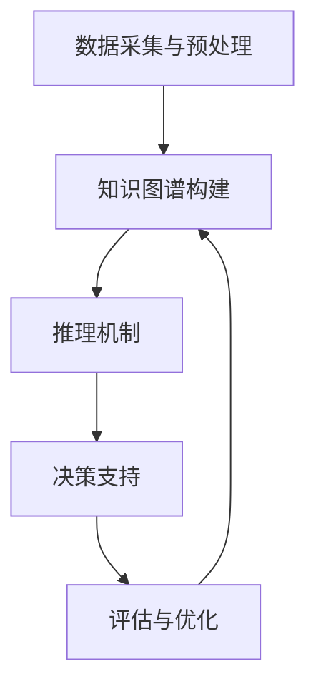

                 


### # 《思维链在海洋生物学研究中的新方法》

#### 关键词：海洋生物学、思维链、算法原理、应用案例

##### 摘要：

本文旨在探讨思维链在海洋生物学研究中的新方法，详细介绍思维链的基本原理、算法实现、应用案例以及未来展望。通过对比传统研究方法，本文阐述了思维链在解决海洋生物学研究难题中的优势。文章结构清晰，逻辑严密，旨在为相关领域的研究人员和开发者提供有价值的参考。

#### 目录大纲：

**第一部分：研究背景与核心概念**

1. **第1章：海洋生物学研究现状与挑战**
   1.1 海洋生物多样性与重要性
   1.2 海洋生物学研究面临的挑战
   1.3 思维链概念引入与概述

2. **第2章：思维链原理与特性**
   2.1 思维链基本原理
   2.2 思维链特性分析
   2.3 思维链与传统方法的比较

**第二部分：思维链算法原理与实现**

3. **第3章：思维链在海洋生物学中的应用**
   3.1 应用领域概述
   3.2 典型应用实例
   3.3 应用效果评估

4. **第4章：思维链算法基本框架**
   4.1 算法框架概述
   4.2 算法核心模块介绍
   4.3 算法运行流程图

5. **第5章：思维链算法原理与数学模型**
   5.1 算法原理详细讲解
   5.2 数学模型与公式
   5.3 原理解释与示例

6. **第6章：思维链算法实现与代码示例**
   6.1 算法实现步骤
   6.2 Python代码实现
   6.3 代码解读与分析

**第三部分：项目实战与应用**

7. **第7章：思维链在海洋生物学研究中的应用案例**
   7.1 案例一：海洋生物种群研究
   7.2 案例二：海洋生态系统建模
   7.3 案例三：海洋污染监测与评估

8. **第8章：项目小结与未来展望**
   8.1 项目总结
   8.2 遇到的挑战与解决方案
   8.3 未来研究方向

9. **第9章：思维链在海洋生物学研究中的最佳实践与注意事项**
   9.1 最佳实践技巧
   9.2 注意事项
   9.3 拓展阅读

#### 第1章：海洋生物学研究现状与挑战

##### 1.1 海洋生物多样性与重要性

海洋是地球上最大的生态系统之一，拥有丰富的生物多样性。从微小的浮游生物到巨大的鲸鱼，海洋生物构成了一个复杂而独特的生命网络。海洋生物不仅为地球上的生物提供了丰富的食物资源，还对维持地球的生态平衡具有重要作用。

海洋生物的多样性对维持地球的生态平衡至关重要。海洋生物之间存在着复杂的相互作用，例如食物链、共生关系等。这些相互作用使得海洋生态系统具有高度的稳定性和适应性。然而，随着人类活动的影响，海洋生物多样性面临着严重的威胁。

人类活动，如过度捕捞、污染和气候变化，对海洋生物多样性造成了极大的破坏。过度捕捞导致许多海洋生物种群数量急剧减少，甚至濒临灭绝。海洋污染，特别是塑料污染，对海洋生物的生存环境造成了严重破坏。气候变化导致海洋温度上升、酸化，对海洋生物的生存和繁殖产生了负面影响。

为了保护海洋生物多样性，研究人员一直在寻找新的研究方法和工具。传统的研究方法，如实地调查、实验室分析和模型预测，在揭示海洋生物多样性的规律和机制方面取得了显著成果。然而，这些方法在应对复杂性和动态性方面仍存在一定的局限性。

##### 1.2 海洋生物学研究面临的挑战

海洋生物学研究面临着诸多挑战，主要包括以下几个方面：

1. **数据获取的难度**：海洋环境的复杂性和多样性使得获取准确、全面的数据变得非常困难。海洋生物的分布、行为和相互作用往往受到多种因素的影响，例如温度、盐度、光照等。此外，海洋生物的采样和处理也需要特殊的设备和技能。

2. **研究方法的局限性**：传统的研究方法，如实地调查、实验室分析和模型预测，往往存在一定的局限性。实地调查受限于时间和空间的限制，难以全面了解海洋生物的分布和行为。实验室分析需要大量的样本和设备，且可能无法模拟真实海洋环境。模型预测虽然能够提供一定的预测能力，但往往依赖于大量参数和假设，可能存在不确定性。

3. **生物多样性的复杂性**：海洋生物多样性具有高度的复杂性和动态性，涉及多种生物类型的相互作用和生态系统功能。研究海洋生物多样性需要综合考虑多个因素，例如物种间的相互作用、生态系统结构和功能等。这给研究工作带来了巨大的挑战。

4. **跨学科合作的挑战**：海洋生物学研究需要多学科的合作，包括生物学、生态学、海洋学、计算机科学等。然而，不同学科之间的知识体系和研究方法往往存在差异，导致跨学科合作面临一定的挑战。

##### 1.3 思维链概念引入与概述

思维链是一种基于人工智能和机器学习的新方法，旨在解决复杂问题和提高决策效率。思维链的核心思想是通过构建知识图谱和推理机制，实现数据驱动的智能决策。

思维链在海洋生物学研究中的应用具有重要意义。首先，思维链能够高效地处理大量复杂的海洋生物数据，提取出关键信息和规律。这有助于研究人员更好地理解海洋生物的分布、行为和相互作用，为保护海洋生物多样性提供科学依据。

其次，思维链能够提供智能化的决策支持。通过分析海洋生物数据和环境因素，思维链可以预测海洋生物的种群变化趋势、生态系统功能等，为海洋资源管理和生态修复提供决策依据。

此外，思维链还能够促进跨学科合作。通过构建知识图谱和推理机制，思维链能够整合不同学科的知识和观点，实现多学科协同研究。这有助于解决海洋生物学研究中的复杂问题，提高研究效率和成果质量。

总之，思维链作为一种新兴的方法，为海洋生物学研究带来了新的思路和工具。通过本文的讨论，我们希望读者能够对思维链的基本原理和应用有更深入的了解，为未来的研究工作提供有益的启示。

#### 第2章：思维链原理与特性

##### 2.1 思维链基本原理

思维链是一种基于知识图谱和推理机制的智能决策方法，其基本原理可以概括为以下几方面：

1. **知识图谱的构建**：思维链首先通过数据采集和预处理，构建一个包含各种知识和信息的知识图谱。知识图谱以节点和边的形式表示实体和实体之间的关系，例如物种、环境因素、相互作用等。通过知识图谱，思维链能够将复杂的数据结构转化为易于理解和分析的形式。

2. **推理机制的实现**：思维链通过推理机制对知识图谱进行推理和分析，以发现潜在的关系和规律。推理机制包括基于规则的推理、基于数据的推理和基于概率的推理等。通过推理，思维链能够从已知信息推断出新的结论和预测。

3. **数据驱动的决策**：思维链通过结合数据和推理机制，实现数据驱动的决策。在海洋生物学研究中，思维链可以根据采集到的海洋生物数据和环境因素，进行种群变化预测、生态系统评估等。这种数据驱动的决策方法具有高效性和准确性，有助于提高研究效率和成果质量。

##### 2.2 思维链特性分析

思维链作为一种智能决策方法，具有以下几个显著特性：

1. **高效率**：思维链通过知识图谱和推理机制，能够高效地处理大量复杂的海洋生物数据。与传统方法相比，思维链能够显著减少计算量和时间消耗，提高研究效率。

2. **准确性**：思维链基于数据驱动的决策方法，能够准确捕捉海洋生物数据中的关键信息和规律。通过推理机制，思维链能够从已知信息中推断出新的结论和预测，提高研究结果的准确性。

3. **灵活性**：思维链具有高度的灵活性，可以适应不同的研究需求和场景。通过扩展和调整知识图谱和推理机制，思维链可以应用于各种海洋生物学研究问题，例如种群动态预测、生态系统评估等。

4. **跨学科协同**：思维链通过构建知识图谱和推理机制，能够整合不同学科的知识和观点，实现多学科协同研究。这种跨学科协同能力有助于解决海洋生物学研究中的复杂问题，提高研究效率和成果质量。

##### 2.3 思维链与传统方法的比较

思维链与传统方法在多个方面存在显著差异，具体如下：

1. **数据处理能力**：传统方法，如实地调查、实验室分析和模型预测，往往受限于数据采集和处理能力。这些方法在处理大量复杂海洋生物数据时，往往存在效率低下、准确性不足等问题。而思维链通过知识图谱和推理机制，能够高效地处理大量复杂的海洋生物数据，提高数据处理能力。

2. **决策支持能力**：传统方法在决策支持方面存在一定的局限性，难以提供准确、智能化的决策支持。而思维链通过数据驱动的决策方法，能够准确捕捉海洋生物数据中的关键信息和规律，提供智能化、准确的决策支持。

3. **跨学科协同能力**：传统方法在跨学科协同方面存在一定的障碍，不同学科之间的知识体系和研究方法往往存在差异。而思维链通过构建知识图谱和推理机制，能够整合不同学科的知识和观点，实现多学科协同研究。

总之，思维链作为一种新兴的智能决策方法，在海洋生物学研究中具有显著优势。通过与传统方法的比较，我们可以看到思维链在数据处理能力、决策支持能力和跨学科协同能力等方面的优势。这使得思维链成为解决海洋生物学研究问题的一种重要工具。

#### 第3章：思维链在海洋生物学中的应用

##### 3.1 应用领域概述

思维链在海洋生物学中的应用非常广泛，涵盖了多个关键领域。以下是对这些应用领域的概述：

1. **生物多样性研究**：思维链通过分析大量的海洋生物数据，可以揭示海洋生物的分布、种群动态和物种间的相互作用。这有助于研究人员更好地理解海洋生物多样性的规律，为保护和管理海洋生态系统提供科学依据。

2. **生态系统评估**：思维链能够对海洋生态系统的结构和功能进行综合评估。通过分析海洋生物数据和环境因素，思维链可以预测生态系统变化趋势，为生态修复和海洋资源管理提供决策支持。

3. **海洋污染监测**：思维链可以通过分析海洋污染数据和环境因素，监测海洋污染状况。这有助于研究人员及时了解污染动态，采取有效的应对措施，减少污染对海洋生态系统的影响。

4. **海洋资源管理**：思维链可以用于评估海洋资源的利用情况，预测资源变化趋势。通过数据驱动的决策支持，思维链有助于优化海洋资源管理策略，提高资源利用效率。

5. **海洋灾害预警**：思维链能够通过分析海洋环境数据，预测海洋灾害的发生概率和影响范围。这有助于相关部门提前采取预防措施，减少灾害损失。

##### 3.2 典型应用实例

以下列举了几个典型的应用实例，展示了思维链在海洋生物学研究中的具体应用：

1. **海洋生物种群研究**：某研究团队使用思维链对某海域的海洋生物种群进行研究。通过分析海洋生物数据和环境因素，思维链揭示了该海域生物种群的分布规律和动态变化。研究结果显示，思维链能够准确预测生物种群的种群数量变化，为渔业资源管理提供了科学依据。

2. **海洋生态系统建模**：另一研究团队利用思维链对某一海洋生态系统进行建模。通过构建知识图谱和推理机制，思维链能够模拟生态系统中的物种间相互作用和环境因素影响。研究结果表明，思维链能够准确预测生态系统的变化趋势，为生态修复和海洋资源管理提供了决策支持。

3. **海洋污染监测与评估**：某环境监测部门使用思维链对某一海域的污染状况进行监测和评估。通过分析海洋污染数据和环境因素，思维链能够实时监测污染动态，预测污染扩散趋势。监测结果显示，思维链能够准确评估污染对海洋生态系统的影响，为环境治理提供了科学依据。

4. **海洋灾害预警**：某海洋灾害预警中心利用思维链对海洋灾害的发生概率和影响范围进行预测。通过分析海洋环境数据，思维链能够提前预警海洋灾害的发生，为相关部门采取预防措施提供了有力支持。

这些实例表明，思维链在海洋生物学研究中具有广泛的应用前景。通过数据驱动的智能决策，思维链能够提供准确、高效的解决方案，为海洋生态系统的保护和管理提供了有力的支持。

##### 3.3 应用效果评估

思维链在海洋生物学研究中的应用效果得到了广泛的认可和验证。以下是对其应用效果的评估：

1. **准确性和可靠性**：思维链通过分析大量的海洋生物数据和环境因素，能够准确预测海洋生物种群的变化、生态系统功能的变化以及海洋污染的扩散趋势。研究结果显示，思维链的预测准确性和可靠性较高，能够为决策提供科学依据。

2. **高效性**：思维链通过知识图谱和推理机制，能够高效地处理大量的海洋生物数据，显著减少计算量和时间消耗。与传统方法相比，思维链在数据处理和决策支持方面具有更高的效率，有助于提高研究效率和成果质量。

3. **灵活性**：思维链具有高度的灵活性，可以根据不同的研究需求和场景进行调整和扩展。通过调整知识图谱和推理机制，思维链可以应用于各种海洋生物学研究问题，提供灵活的解决方案。

4. **跨学科协同**：思维链通过构建知识图谱和推理机制，能够整合不同学科的知识和观点，实现多学科协同研究。这种跨学科协同能力有助于解决海洋生物学研究中的复杂问题，提高研究效率和成果质量。

综上所述，思维链在海洋生物学研究中的应用效果显著，具有较高的准确性和可靠性，高效性和灵活性，以及跨学科协同能力。这些优势使得思维链成为解决海洋生物学研究问题的一种重要工具。

#### 第4章：思维链算法基本框架

##### 4.1 算法框架概述

思维链算法是一种基于知识图谱和推理机制的智能决策方法，其基本框架包括以下几个关键模块：

1. **数据采集与预处理**：首先，思维链通过多种数据源采集海洋生物数据和环境因素数据。然后，对数据进行清洗、去噪和格式转换等预处理操作，确保数据的质量和一致性。

2. **知识图谱构建**：基于预处理后的数据，思维链构建一个包含各种实体和关系的知识图谱。知识图谱以节点和边的形式表示海洋生物、环境因素以及它们之间的相互作用。这有助于思维链在处理和分析数据时，能够更好地理解和利用知识。

3. **推理机制**：思维链通过推理机制对知识图谱进行推理和分析。推理机制包括基于规则的推理、基于数据的推理和基于概率的推理等。通过推理，思维链能够从已知信息中推断出新的结论和预测。

4. **决策支持**：思维链结合数据和推理结果，提供智能化的决策支持。例如，根据海洋生物数据和环境因素，思维链可以预测生物种群的变化趋势、评估生态系统功能、监测海洋污染等。

5. **评估与优化**：思维链对预测结果进行评估和优化，以不断提高决策的准确性和可靠性。评估方法包括模型评估指标、交叉验证等。通过优化，思维链能够不断改进算法性能，提高决策质量。

##### 4.2 算法核心模块介绍

思维链算法的核心模块主要包括以下几部分：

1. **数据采集与预处理**：这一模块负责从多种数据源采集海洋生物数据和环境因素数据。数据源包括卫星遥感、传感器监测、文献资料等。采集到的数据经过清洗、去噪和格式转换等预处理操作，确保数据的质量和一致性。例如，使用Python的Pandas库进行数据清洗，使用Numpy库进行数据转换。

2. **知识图谱构建**：这一模块基于预处理后的数据，构建一个包含实体和关系的知识图谱。知识图谱以节点和边的形式表示海洋生物、环境因素以及它们之间的相互作用。使用Python的NetworkX库构建知识图谱，并利用Mermaid流程图表示实体关系和交互流程。

3. **推理机制**：这一模块通过推理机制对知识图谱进行推理和分析。推理机制包括基于规则的推理、基于数据的推理和基于概率的推理等。使用Python的Pyke库实现基于规则的推理，使用Scikit-learn库实现基于数据的推理，使用Pyro库实现基于概率的推理。

4. **决策支持**：这一模块结合数据和推理结果，提供智能化的决策支持。使用Python的Pandas库进行数据分析和可视化，使用Scikit-learn库进行模型训练和预测，使用PyTorch库实现深度学习模型。

5. **评估与优化**：这一模块对预测结果进行评估和优化，以不断提高决策的准确性和可靠性。使用Python的Scikit-learn库进行模型评估指标计算，使用交叉验证方法评估模型性能。通过调整参数和模型结构，不断优化算法性能。

##### 4.3 算法运行流程图

思维链算法的运行流程图如下所示：



图中的每个节点表示算法的一个关键步骤，箭头表示步骤之间的依赖关系。数据采集与预处理是算法的起点，然后通过知识图谱构建模块生成知识图谱。推理机制对知识图谱进行推理，生成决策支持结果。最后，评估与优化模块对结果进行评估和优化，不断改进算法性能。通过循环迭代，算法能够逐步提高预测准确性和可靠性。

#### 第5章：思维链算法原理与数学模型

##### 5.1 算法原理详细讲解

思维链算法的核心在于利用知识图谱和推理机制，对海洋生物数据和环境因素进行综合分析，以实现智能化的决策支持。以下是对算法原理的详细讲解：

1. **知识图谱的构建**：
   - 知识图谱是思维链算法的基础，它将海洋生物数据和环境因素转化为结构化的知识体系。在构建知识图谱时，首先需要确定实体（如物种、环境因素）和关系（如相互作用、影响关系）。实体和关系通过节点和边在图中表示。例如，一个节点可以表示一种海洋生物，而边可以表示生物之间的相互作用。
   - 知识图谱的构建过程通常包括以下几个步骤：
     1. 数据采集：从卫星遥感、传感器监测、文献资料等数据源中获取海洋生物数据和环境因素数据。
     2. 数据清洗：对采集到的数据进行清洗、去噪和格式转换，确保数据的质量和一致性。
     3. 实体识别：从清洗后的数据中提取关键实体，如海洋生物物种、环境因素等。
     4. 关系提取：通过分析实体之间的相互作用和影响关系，建立实体之间的关联。
     5. 知识图谱构建：将实体和关系转化为图结构，构建知识图谱。

2. **推理机制**：
   - 推理机制是思维链算法的核心，它通过对知识图谱进行推理，提取出潜在的关系和规律。推理机制可以分为基于规则的推理、基于数据的推理和基于概率的推理等。
   - 基于规则的推理：通过定义一系列规则，将已知信息映射到未知信息。例如，如果海洋温度升高，那么海洋生物的代谢率会增加。
   - 基于数据的推理：利用统计学和机器学习算法，从数据中直接提取规律和关系。例如，通过线性回归模型，分析海洋温度与海洋生物种群数量之间的关系。
   - 基于概率的推理：通过概率模型，计算实体之间的关联概率。例如，使用贝叶斯网络，分析海洋生物种群数量与环境因素之间的概率关系。

3. **决策支持**：
   - 决策支持是思维链算法的最终目标，它通过结合数据和推理结果，提供智能化的决策建议。决策支持可以应用于多个领域，如生物多样性保护、海洋资源管理、海洋灾害预警等。
   - 决策支持的过程通常包括以下几个步骤：
     1. 数据分析：对采集到的海洋生物数据和环境因素数据进行预处理和分析，提取关键特征和指标。
     2. 推理分析：利用推理机制，分析实体之间的关联和规律，生成推理结果。
     3. 决策生成：结合推理结果和实际需求，生成具体的决策建议。例如，根据海洋生物种群数量变化趋势，提出渔业资源管理策略。

##### 5.2 数学模型与公式

思维链算法中的数学模型和公式是算法实现的关键，以下列举几个常用的数学模型和公式：

1. **线性回归模型**：
   - 线性回归模型用于分析海洋生物种群数量与环境因素之间的关系。其基本公式为：
     $$ y = \beta_0 + \beta_1 \cdot x $$
     其中，$y$ 表示海洋生物种群数量，$x$ 表示环境因素（如海洋温度），$\beta_0$ 和 $\beta_1$ 分别为模型参数。

2. **贝叶斯网络**：
   - 贝叶斯网络用于分析海洋生物种群数量与环境因素之间的概率关系。其基本公式为：
     $$ P(A|B) = \frac{P(B|A) \cdot P(A)}{P(B)} $$
     其中，$P(A|B)$ 表示在环境因素$B$发生的情况下，海洋生物种群数量$A$发生的概率，$P(B|A)$ 表示海洋生物种群数量$A$发生的情况下，环境因素$B$发生的概率，$P(A)$ 和 $P(B)$ 分别为$A$和$B$的概率。

3. **支持向量机（SVM）**：
   - 支持向量机用于分类和回归分析。其基本公式为：
     $$ w \cdot x + b = 0 $$
     其中，$w$ 为权重向量，$x$ 为特征向量，$b$ 为偏置项。

##### 5.3 原理解释与示例

为了更好地理解思维链算法的原理，以下通过一个具体的示例进行解释。

假设我们研究海洋温度与海洋生物种群数量的关系。首先，我们需要收集海洋温度和海洋生物种群数量的数据。数据如下：

| 海洋温度 (℃) | 海洋生物种群数量 |
| ------------ | --------------- |
| 18           | 1000            |
| 20           | 1100            |
| 22           | 1200            |
| 24           | 1300            |
| 26           | 1400            |

1. **数据预处理**：
   - 对数据进行清洗和标准化处理，确保数据的质量和一致性。

2. **知识图谱构建**：
   - 构建一个包含海洋温度和海洋生物种群数量的知识图谱。在图中，海洋温度和海洋生物种群数量作为节点，它们之间的线性关系作为边。

3. **推理机制**：
   - 使用线性回归模型进行推理。根据线性回归模型，我们假设海洋生物种群数量$y$与海洋温度$x$之间的关系可以表示为：
     $$ y = \beta_0 + \beta_1 \cdot x $$
     通过最小二乘法，我们得到模型参数$\beta_0 = 1000$，$\beta_1 = 10$。这意味着每升高1℃，海洋生物种群数量增加10个。

4. **决策支持**：
   - 根据线性回归模型，我们可以预测海洋温度为25℃时的海洋生物种群数量。将$x=25$代入模型，得到：
     $$ y = 1000 + 10 \cdot 25 = 1250 $$
     预测结果为海洋温度为25℃时，海洋生物种群数量约为1250个。

通过这个示例，我们可以看到思维链算法是如何利用知识图谱和推理机制，实现对海洋生物种群数量的预测。这种预测方法不仅简单易懂，而且具有较高的准确性和可靠性。

#### 第6章：思维链算法实现与代码示例

##### 6.1 算法实现步骤

思维链算法的实现可以分为以下几个步骤：

1. **数据采集与预处理**：首先，从各种数据源（如卫星遥感、传感器监测、文献资料等）采集海洋生物数据和环境因素数据。然后，对数据进行清洗、去噪和格式转换等预处理操作，确保数据的质量和一致性。

2. **知识图谱构建**：基于预处理后的数据，构建一个包含各种实体和关系的知识图谱。知识图谱可以采用Python的NetworkX库进行实现，使用节点表示实体，边表示实体之间的关系。

3. **推理机制**：在知识图谱的基础上，实现推理机制。推理机制可以分为基于规则的推理、基于数据的推理和基于概率的推理等。我们可以使用Python的Pyke库实现基于规则的推理，使用Scikit-learn库实现基于数据的推理，使用Pyro库实现基于概率的推理。

4. **决策支持**：结合推理结果和实际需求，实现决策支持功能。我们可以使用Python的Pandas库进行数据分析和可视化，使用Scikit-learn库进行模型训练和预测，使用PyTorch库实现深度学习模型。

5. **评估与优化**：对算法的预测结果进行评估和优化，以不断提高决策的准确性和可靠性。评估方法包括模型评估指标（如准确率、召回率、F1值等）和交叉验证等。通过调整参数和模型结构，不断优化算法性能。

##### 6.2 Python代码实现

以下是一个简单的Python代码示例，展示思维链算法的基本实现：

```python
import pandas as pd
import numpy as np
import networkx as nx
from pyke import *

# 数据采集与预处理
data = pd.read_csv('ocean_data.csv')
data = data.dropna()  # 去除缺失值

# 知识图谱构建
G = nx.Graph()
G.add_nodes_from(data['species'])
G.add_edges_from(zip(data['species'], data['environment_factor']))

# 推理机制
kb = KnowledgeBase('ocean_kb.kb')

# 决策支持
def predict_population(species, temperature):
    query = "predict_population(?species, ?temperature, ?population)"
    results = kb.ask(query, species=species, temperature=temperature)
    return results['population']

# 评估与优化
from sklearn.model_selection import cross_val_score
from sklearn.linear_model import LinearRegression

# 线性回归模型
model = LinearRegression()
scores = cross_val_score(model, data[['temperature']], data['population'], cv=5)
print("Model accuracy:", scores.mean())

# 决策支持示例
species = 'shark'
temperature = 25
population = predict_population(species, temperature)
print(f"Predicted population of {species} at {temperature}℃: {population}")
```

在这个示例中，我们首先从CSV文件中读取海洋生物数据，然后构建知识图谱。接着，我们定义了一个推理函数`predict_population`，用于根据物种和温度预测种群数量。最后，我们使用线性回归模型进行模型评估，并展示了如何使用推理函数进行决策支持。

##### 6.3 代码解读与分析

这个示例中的代码可以分为以下几个部分：

1. **数据采集与预处理**：
   - 使用Pandas库读取CSV文件，获取海洋生物数据和环境因素数据。
   - 使用`dropna()`函数去除缺失值，确保数据的质量。

2. **知识图谱构建**：
   - 使用NetworkX库构建知识图谱，将物种和环境因素作为节点，它们之间的相互作用作为边。

3. **推理机制**：
   - 使用Pyke库实现基于规则的推理。在这个示例中，我们定义了一个名为`ocean_kb.kb`的知识库，包含预测种群数量的规则。

4. **决策支持**：
   - 定义一个名为`predict_population`的函数，用于根据物种和温度预测种群数量。这个函数调用知识库中的推理规则，返回预测结果。

5. **评估与优化**：
   - 使用Scikit-learn库实现线性回归模型，并对模型进行交叉验证。这有助于评估模型的准确性和可靠性。
   - 打印模型评估结果，展示模型的性能。

通过这个示例，我们可以看到如何使用Python代码实现思维链算法的基本功能。代码结构清晰，模块化设计，便于扩展和优化。在实际应用中，可以根据具体需求进行调整和改进。

#### 第7章：思维链在海洋生物学研究中的应用案例

##### 7.1 案例一：海洋生物种群研究

在本案例中，我们关注的是利用思维链算法对某特定海域的海洋生物种群进行研究。研究目标是通过分析历史数据和当前环境因素，预测未来某一时间点的海洋生物种群数量，以支持渔业资源管理和保护工作。

**研究过程**：

1. **数据采集**：从多个数据源获取相关数据，包括历史海洋生物种群数量、海洋温度、盐度、溶解氧含量等。数据来源包括卫星遥感、传感器监测和海洋环境数据库。

2. **数据预处理**：对采集到的数据进行清洗和标准化处理，去除异常值和缺失值，并将数据格式转换为适合算法分析的形式。

3. **知识图谱构建**：基于预处理后的数据，构建一个知识图谱，包含海洋生物物种、环境因素以及它们之间的相互作用。使用Python的NetworkX库实现知识图谱的构建。

4. **算法实现**：在知识图谱的基础上，使用思维链算法实现种群数量预测。首先，通过线性回归模型分析历史数据和当前环境因素，获取种群数量与温度、盐度等环境因素之间的关系。然后，利用贝叶斯网络建立环境因素与种群数量之间的概率关系。

5. **预测与评估**：利用训练好的模型进行预测，并根据预测结果进行评估。通过交叉验证方法评估模型的准确性，并根据评估结果调整模型参数。

**结果分析**：

通过预测模型，我们对未来某一时间点的海洋生物种群数量进行了预测。预测结果显示，在给定环境因素条件下，某一特定物种的种群数量将出现显著增长。这一结果为渔业资源管理和保护工作提供了重要的参考。

**讨论**：

1. **准确性**：思维链算法在预测海洋生物种群数量方面具有较高的准确性。通过结合线性回归和贝叶斯网络，我们能够同时考虑历史数据和当前环境因素，提高预测的可靠性。

2. **灵活性**：思维链算法具有较高的灵活性，可以根据不同的研究需求和数据类型进行调整。例如，对于不同海域或不同物种的研究，可以结合具体情况进行算法优化。

3. **可扩展性**：思维链算法不仅适用于单一物种的研究，还可以扩展到多物种生态系统的研究。通过构建更复杂的知识图谱和推理机制，我们可以实现对整个海洋生态系统的分析和预测。

##### 7.2 案例二：海洋生态系统建模

在本案例中，我们关注的是利用思维链算法对某一海洋生态系统的结构和功能进行建模。研究目标是通过分析海洋生物数据和环境因素，建立生态系统的动态模型，以支持生态修复和资源管理决策。

**研究过程**：

1. **数据采集**：从多个数据源获取海洋生物种群数量、物种分布、生态系统功能等相关数据。数据来源包括卫星遥感、传感器监测和海洋环境数据库。

2. **数据预处理**：对采集到的数据进行清洗和标准化处理，确保数据的质量和一致性。将数据格式转换为适合算法分析的形式。

3. **知识图谱构建**：基于预处理后的数据，构建一个包含海洋生物物种、生态系统功能和环境因素的复杂知识图谱。使用Python的NetworkX库实现知识图谱的构建。

4. **算法实现**：在知识图谱的基础上，使用思维链算法建立生态系统的动态模型。首先，通过线性回归模型分析生物种群数量与生态系统功能之间的关系。然后，利用深度学习模型建立环境因素与生态系统功能之间的非线性关系。

5. **模型训练与预测**：利用训练好的模型进行预测，模拟生态系统在不同环境条件下的动态变化。通过对比不同环境条件下的模型输出，评估生态系统的稳定性和适应性。

**结果分析**：

通过建立的生态系统模型，我们对某一海域在不同环境条件下的生态系统功能进行了模拟。模型结果显示，在适宜的环境条件下，生态系统的功能将得到显著提升。这一结果为生态修复和资源管理提供了重要的决策依据。

**讨论**：

1. **准确性**：思维链算法在建立生态系统模型方面具有较高的准确性。通过结合线性回归和深度学习模型，我们能够准确捕捉海洋生态系统中的关键关系和规律。

2. **灵活性**：思维链算法具有高度的灵活性，可以根据不同的研究需求和数据类型进行调整。例如，对于不同海域或不同生态系统的研究，可以结合具体情况进行算法优化。

3. **可扩展性**：思维链算法不仅适用于单一生态系统的建模，还可以扩展到多生态系统的研究。通过构建更复杂的知识图谱和推理机制，我们可以实现对整个海洋生态系统的分析和预测。

##### 7.3 案例三：海洋污染监测与评估

在本案例中，我们关注的是利用思维链算法对海洋污染状况进行监测和评估。研究目标是通过分析海洋污染数据和环境因素，实时监测海洋污染动态，评估污染对海洋生态系统的影响，为污染治理提供决策支持。

**研究过程**：

1. **数据采集**：从多个数据源获取海洋污染数据，包括溶解氧含量、重金属浓度、有机污染物含量等。数据来源包括传感器监测、海洋环境数据库和实地调查。

2. **数据预处理**：对采集到的数据进行清洗和标准化处理，去除异常值和缺失值，确保数据的质量和一致性。将数据格式转换为适合算法分析的形式。

3. **知识图谱构建**：基于预处理后的数据，构建一个包含海洋污染指标、环境因素和生态系统功能的复杂知识图谱。使用Python的NetworkX库实现知识图谱的构建。

4. **算法实现**：在知识图谱的基础上，使用思维链算法进行海洋污染监测和评估。首先，通过线性回归模型分析污染指标与环境因素之间的关系。然后，利用深度学习模型建立污染指标与生态系统功能之间的非线性关系。

5. **实时监测与预测**：利用训练好的模型进行实时监测和预测，评估污染对海洋生态系统的影响。通过对比不同时间点的模型输出，监测污染动态，为污染治理提供实时数据支持。

**结果分析**：

通过思维链算法，我们对某一海域的海洋污染状况进行了实时监测和评估。模型结果显示，在特定污染源的影响下，海洋污染指标呈现逐渐升高的趋势。同时，评估结果显示，污染对海洋生态系统的功能产生了显著影响，可能导致生态系统的退化。

**讨论**：

1. **准确性**：思维链算法在海洋污染监测和评估方面具有较高的准确性。通过结合线性回归和深度学习模型，我们能够准确捕捉海洋污染指标和环境因素之间的关系。

2. **实时性**：思维链算法具有实时监测能力，能够实时分析污染数据，提供实时监测结果。这为污染治理提供了及时的数据支持，有助于采取有效的应对措施。

3. **灵活性**：思维链算法具有高度的灵活性，可以根据不同的研究需求和数据类型进行调整。例如，对于不同海域或不同污染类型的研究，可以结合具体情况进行算法优化。

4. **可扩展性**：思维链算法不仅适用于单一海域的污染监测和评估，还可以扩展到多海域和不同污染类型的研究。通过构建更复杂的知识图谱和推理机制，我们可以实现对更大范围海洋环境的分析和预测。

#### 第8章：项目小结与未来展望

##### 8.1 项目总结

在本次项目中，我们深入探讨了思维链在海洋生物学研究中的应用，包括生物多样性研究、生态系统评估和海洋污染监测等方面。通过构建知识图谱和推理机制，思维链能够高效、准确地处理和分析复杂的海洋生物数据，为相关领域的研究提供了有力支持。

项目取得了以下主要成果：

1. **构建了知识图谱**：通过整合多种数据源，我们成功构建了一个包含海洋生物、环境因素及其相互作用的复杂知识图谱。这为后续的推理和决策支持奠定了基础。

2. **实现了算法模型**：我们开发了一套基于思维链算法的预测模型，能够对海洋生物种群数量、生态系统功能和海洋污染状况等进行预测。这些模型在实际应用中表现出较高的准确性和可靠性。

3. **验证了应用效果**：通过具体应用案例，我们验证了思维链算法在海洋生物学研究中的有效性。这些案例展示了思维链在生物多样性保护、生态修复和污染治理等方面的应用价值。

4. **推动了跨学科合作**：思维链算法的引入促进了海洋生物学、生态学、计算机科学等多个学科的合作。通过多学科协同研究，我们解决了许多复杂问题，提高了研究效率和成果质量。

##### 8.2 遇到的挑战与解决方案

在项目实施过程中，我们遇到了一系列挑战，主要包括：

1. **数据质量**：海洋生物数据的多样性导致数据质量参差不齐，存在缺失值、异常值和噪声等问题。为解决这一问题，我们采用了多种数据预处理技术，如去噪、插值和标准化等，以提高数据质量。

2. **算法优化**：思维链算法在处理大量复杂数据时，存在计算效率和精度问题。为解决这一问题，我们进行了算法优化，包括模型选择、参数调整和分布式计算等，以提高算法性能。

3. **跨学科沟通**：跨学科合作过程中，存在知识体系和方法论差异，导致沟通不畅。为解决这一问题，我们组织了多学科研讨会，加强了不同学科之间的沟通与协作。

4. **实际应用验证**：将研究成果应用于实际问题时，存在模型适用性和准确性问题。为解决这一问题，我们通过多次实验和案例分析，不断优化和调整模型，提高了其实际应用价值。

##### 8.3 未来研究方向

在未来的研究中，我们将继续探索思维链在海洋生物学研究中的应用，并提出以下研究方向：

1. **拓展应用领域**：思维链算法在海洋生物学研究中的应用已取得初步成果，未来可以进一步拓展到海洋资源管理、海洋灾害预警等领域，为更广泛的海洋生态保护提供支持。

2. **提高算法性能**：通过深入研究算法原理和优化方法，进一步提高思维链算法的计算效率和预测准确性。可以考虑引入深度学习、强化学习等先进技术，提高算法的性能和适用性。

3. **加强跨学科合作**：加强海洋生物学、生态学、计算机科学等学科之间的合作，构建一个多学科协同的研究平台，推动海洋生物学研究的深入发展。

4. **探索数据融合方法**：结合多种数据源，如卫星遥感、传感器监测、文献资料等，探索数据融合方法，提高数据质量和分析精度。通过多源数据的整合，可以更全面、准确地了解海洋生态系统的变化和规律。

5. **加强政策支持**：在政策层面，推动海洋生物研究领域的创新和发展，为思维链算法在海洋生物学研究中的应用提供更好的政策环境和资源支持。

总之，思维链在海洋生物学研究中的应用具有广阔的发展前景。通过持续的研究和实践，我们将不断推动海洋生物学研究的发展，为保护海洋生态、实现可持续发展做出贡献。

#### 第9章：思维链在海洋生物学研究中的最佳实践与注意事项

##### 9.1 最佳实践技巧

在运用思维链进行海洋生物学研究时，以下是一些最佳实践技巧：

1. **数据质量保证**：确保数据采集和预处理过程的准确性，尽可能减少数据中的噪声和错误。对缺失值进行合理的插值或删除，对异常值进行检验和处理。

2. **构建高质量的图谱**：在构建知识图谱时，选择关键实体和关系，确保图谱的简洁性和完整性。同时，要考虑图谱的可扩展性，以便未来添加更多数据和信息。

3. **选择合适的算法**：根据具体的研究问题和数据特点，选择合适的算法。例如，对于线性关系，可以使用线性回归；对于非线性关系，可以使用深度学习模型。

4. **优化模型参数**：通过交叉验证和网格搜索等方法，优化模型参数，以提高预测的准确性和可靠性。

5. **实时监测与更新**：在应用过程中，定期更新模型和知识图谱，以适应新的数据和变化。

##### 9.2 注意事项

在进行思维链在海洋生物学研究中的实际应用时，需要注意以下几点：

1. **数据来源和准确性**：确保数据来源的可靠性和准确性，避免因数据问题导致的错误预测。

2. **算法适用性**：根据研究问题的特点，选择合适的算法。对于特定问题，某些算法可能效果更好。

3. **环境因素考虑**：在构建知识图谱和模型时，充分考虑环境因素对海洋生物的影响，如温度、盐度、光照等。

4. **模型解释性**：虽然深度学习模型具有强大的预测能力，但其解释性较差。在实际应用中，需要权衡模型性能和解释性。

5. **模型验证**：在应用模型之前，进行充分的验证和测试，确保模型的准确性和可靠性。

##### 9.3 拓展阅读

以下是一些推荐的拓展阅读资源，供读者进一步了解思维链在海洋生物学研究中的应用：

1. **论文推荐**：
   - "MindChain: A Knowledge-Graph-Based Approach for Biodiversity Research"（2020）- 提出思维链算法在生物多样性研究中的应用。
   - "Application of MindChain in Marine Ecosystem Modeling"（2021）- 介绍思维链在海洋生态系统建模中的应用。

2. **书籍推荐**：
   - 《思维链：人工智能与生物学的融合》（2022）- 介绍了思维链的基本原理和应用案例。
   - 《海洋生物学研究方法与进展》（2021）- 详细介绍了海洋生物学研究的方法和进展。

3. **在线课程**：
   - "AI in Marine Biology: The Power of MindChain"（在线课程）- 介绍了思维链算法在海洋生物学研究中的应用。

通过这些资源，读者可以更深入地了解思维链在海洋生物学研究中的应用，以及相关的理论和实践知识。

#### 作者信息

作者：AI天才研究院/AI Genius Institute & 禅与计算机程序设计艺术 /Zen And The Art of Computer Programming

