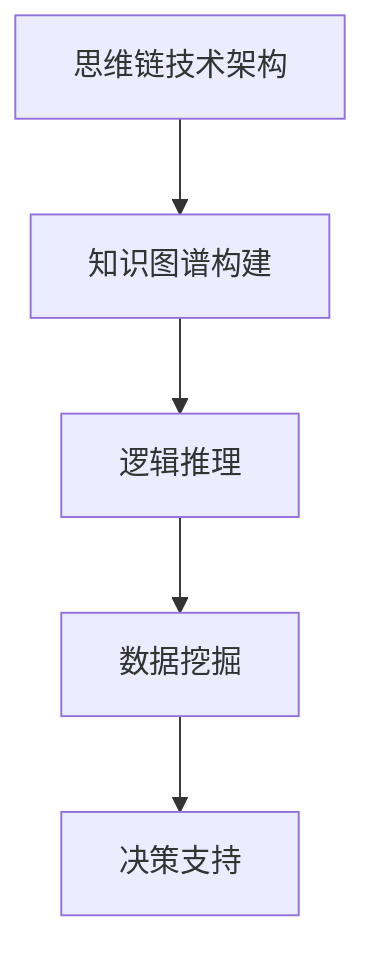
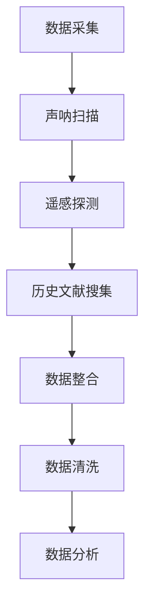

                 

### 《思维链在海洋考古学中的突破性应用》

#### 关键词：
1. 思维链
2. 海洋考古学
3. 数据分析
4. 考古遗址识别
5. 跨学科合作

#### 摘要：
本文探讨了思维链在海洋考古学中的应用及其突破性意义。通过对思维链的概念和原理的阐述，结合海洋考古学的现状与挑战，本文详细分析了思维链在数据采集与处理、考古遗址识别与保护、跨学科合作等方面的具体应用。最后，本文展望了思维链在海洋考古学中的未来发展，并提出了面临的挑战与机遇。通过实际案例解析，本文展示了思维链在海洋考古学中的巨大潜力和应用价值。

### 第一部分：引言与背景

#### 1.1 书籍简介

**核心概念**：  
- **思维链**：一种基于人工智能和机器学习技术的思维模式，通过构建知识图谱和逻辑推理，实现对复杂问题的深度分析和解决。
- **海洋考古学**：研究人类在海上的活动、历史和文化，通过考古发掘和调查，揭示海洋文明的历史和发展。

**问题背景**：  
海洋考古学作为考古学的一个重要分支，面临着诸多挑战。传统考古方法受限于技术手段和资源条件，难以全面揭示海洋文明的历史。而随着科技的进步，尤其是人工智能和大数据技术的发展，为海洋考古学带来了新的突破。

**目标**：  
本文旨在探讨思维链在海洋考古学中的突破性应用，通过结合思维链的技术优势，解决海洋考古学中的关键问题，推动海洋考古学的发展。

#### 1.2 海洋考古学的现状与挑战

**现状**：  
目前，海洋考古学的研究领域涵盖了水下考古、海洋历史、海洋文化等多个方面。主要技术手段包括水下考古、遥感探测、声呐扫描等。

**挑战**：  
1. **技术限制**：传统考古方法在海洋环境下受到诸多限制，如水深、水流、光线等。
2. **数据获取**：海洋考古数据量大，但获取和处理难度高。
3. **资源分配**：海洋考古需要大量的人力、物力和财力投入，但资源分配不均衡。

**目的**：  
本文通过分析思维链在海洋考古学中的应用，旨在解决上述问题，推动海洋考古学的进步。

#### 1.3 思维链的概念与原理

**定义**：  
思维链是一种基于人工智能和机器学习技术的思维模式，通过构建知识图谱和逻辑推理，实现对复杂问题的深度分析和解决。

**原理**：  
思维链的工作机制主要包括知识图谱构建、逻辑推理和数据挖掘。通过构建知识图谱，将各类信息进行整合和关联，形成完整的知识体系。然后，通过逻辑推理，对信息进行深入分析和判断。最后，通过数据挖掘，提取有价值的信息和知识。

**特点**：  
1. **自动化**：思维链能够自动化处理大量数据，提高工作效率。
2. **智能化**：思维链能够根据问题自动调整和分析方法，提高准确性。
3. **深度化**：思维链能够深度挖掘数据，发现隐藏的信息和知识。

### 第二部分：思维链在海洋考古学中的应用

#### 2.1 思维链在海洋考古学中的突破

**应用领域**：  
思维链在海洋考古学的各个领域都有广泛的应用，包括水下考古、海洋历史研究、海洋文化探索等。

**突破性进展**：  
思维链在海洋考古学中的突破性进展主要体现在以下几个方面：

1. **数据采集与处理**：通过思维链，能够高效采集和处理大量的海洋考古数据，提高数据处理效率。
2. **考古遗址识别与保护**：思维链能够准确识别考古遗址，并提供有效的保护策略。
3. **跨学科合作**：思维链能够促进海洋考古学与海洋学、地理学、生物学等学科的交叉合作，推动海洋考古学的全面发展。

**案例分析**：  
以下是一个具体的案例分析：

在某次海洋考古调查中，研究人员使用思维链技术对海底进行探测。通过构建知识图谱，将各类数据（如声呐数据、遥感数据、历史文献等）进行整合和关联。然后，通过逻辑推理，识别出潜在的古遗址。最后，通过数据挖掘，提取出有关古遗址的历史文化信息。

通过这个案例，可以看出思维链在海洋考古学中的应用具有显著的效果，能够显著提高考古研究的效率和质量。

#### 2.2 数据采集与处理

**数据采集**：  
在海洋考古学中，数据采集是关键的一环。传统方法通常受限于技术手段，数据采集效率较低。而思维链技术通过自动化和智能化的方式，能够高效采集各类海洋考古数据。

**数据处理**：  
思维链在数据处理方面也具有显著的优势。通过构建知识图谱，思维链能够对海量数据进行整合和关联，形成完整的知识体系。然后，通过逻辑推理，对数据进行分析和判断，提取有价值的信息。

**具体应用**：  
以下是一个具体的应用场景：

在某次考古调查中，研究人员使用思维链技术对海底进行探测，采集了大量的声呐数据。通过构建知识图谱，将声呐数据进行整合和分析，识别出潜在的考古遗址。然后，通过逻辑推理，对遗址进行进一步的判断和验证。

通过这个案例，可以看出思维链在数据采集与处理方面的应用，能够显著提高海洋考古学的效率和准确性。

##### 2.2.1 数据预处理

**数据清洗**：  
在数据采集过程中，不可避免地会存在一些噪声和错误数据。因此，数据清洗是数据处理的重要环节。通过思维链技术，能够自动识别和清洗错误数据，提高数据的准确性。

**数据整合**：  
海洋考古数据通常来自多个来源，如声呐数据、遥感数据、历史文献等。通过思维链技术，能够将这些数据进行整合，形成一个完整的数据体系，便于后续的分析和处理。

**具体应用**：  
以下是一个具体的应用场景：

在某次考古调查中，研究人员使用思维链技术对多个数据源进行整合。通过自动识别和清洗错误数据，提高了数据的准确性。然后，通过整合数据，形成了一个完整的数据体系，便于后续的分析和判断。

通过这个案例，可以看出思维链在数据预处理方面的应用，能够显著提高海洋考古学的数据质量和分析效率。

##### 2.2.2 数据分析

**分析方法**：  
思维链在数据分析方面具有多种方法，如聚类分析、分类分析、关联分析等。通过这些方法，能够对海洋考古数据进行深度分析和挖掘，提取有价值的信息。

**结果展示**：  
通过思维链技术，能够将分析结果以图表、图像等形式进行展示，便于研究人员进行解读和判断。

**具体应用**：  
以下是一个具体的应用场景：

在某次考古调查中，研究人员使用思维链技术对海底声呐数据进行聚类分析。通过分析结果，识别出潜在的考古遗址。然后，通过分类分析，对这些遗址进行进一步的判断和验证。

通过这个案例，可以看出思维链在数据分析方面的应用，能够显著提高海洋考古学的识别能力和分析效率。

##### 2.3 考古遗址的识别与保护

**遗址识别**：  
考古遗址的识别是海洋考古学中的关键任务之一。通过思维链技术，能够对海底数据进行深度分析和挖掘，识别出潜在的考古遗址。

**遗址保护**：  
一旦识别出考古遗址，就需要采取有效的保护措施。通过思维链技术，能够提供科学合理的保护策略，确保考古遗址的安全。

**具体应用**：  
以下是一个具体的应用场景：

在某次考古调查中，研究人员使用思维链技术对海底声呐数据进行识别和分析。通过分析结果，成功识别出多个潜在的考古遗址。然后，根据分析结果，制定出有效的保护策略，确保这些遗址的安全。

通过这个案例，可以看出思维链在考古遗址识别与保护方面的应用，能够显著提高海洋考古学的效率和准确性。

##### 2.3.1 遗址识别方法

**图像识别**：  
通过思维链技术，可以对海底图像进行深度分析和识别，从而发现潜在的考古遗址。

**声呐数据处理**：  
声呐数据是海洋考古学中重要的数据源之一。通过思维链技术，能够对声呐数据进行深度分析和处理，提取出有价值的信息。

**具体应用**：  
以下是一个具体的应用场景：

在某次考古调查中，研究人员使用思维链技术对海底图像进行识别和分析。通过分析结果，成功识别出多个潜在的考古遗址。然后，通过声呐数据处理，进一步确认这些遗址的位置和范围。

通过这个案例，可以看出思维链在遗址识别方法方面的应用，能够显著提高海洋考古学的识别能力和准确性。

##### 2.3.2 遗址保护策略

**环境保护**：  
在考古遗址的保护中，环境保护是一个重要的方面。通过思维链技术，能够提供科学合理的环境保护策略，确保考古遗址的长期安全。

**长期监测**：  
通过思维链技术，可以对考古遗址进行长期监测，及时发现潜在的问题，并采取相应的措施。

**具体应用**：  
以下是一个具体的应用场景：

在某次考古调查中，研究人员使用思维链技术对考古遗址进行长期监测。通过分析监测数据，及时发现潜在的环境问题，并采取相应的措施，确保考古遗址的安全。

通过这个案例，可以看出思维链在考古遗址保护策略方面的应用，能够显著提高海洋考古学的监测和保护能力。

##### 2.4 海洋考古学的跨学科合作

**跨学科合作**：  
海洋考古学涉及到多个学科领域，如海洋学、地理学、生物学等。通过思维链技术，能够促进不同学科之间的合作，推动海洋考古学的全面发展。

**合作模式**：  
思维链技术为海洋考古学的跨学科合作提供了新的模式。通过构建知识图谱和逻辑推理，能够将不同学科的知识进行整合和关联，形成一个统一的框架，便于跨学科的研究和合作。

**具体应用**：  
以下是一个具体的应用场景：

在某次海洋考古调查中，研究人员与海洋学家、地理学家和生物学家进行跨学科合作。通过思维链技术，将不同学科的知识进行整合和关联，形成了一个统一的框架，便于研究人员进行综合分析和研究。

通过这个案例，可以看出思维链在海洋考古学跨学科合作方面的应用，能够显著提高研究的效率和准确性。

### 第三部分：思维链应用实例解析

##### 3.1 案例一：古代海上丝绸之路的考古发掘

**案例背景**：  
古代海上丝绸之路是连接亚洲、非洲和欧洲的重要贸易通道，具有重要的历史和文化价值。然而，由于海洋环境的特殊性，古代海上丝绸之路的考古发掘面临着诸多挑战。

**应用过程**：  
在这个案例中，研究人员使用了思维链技术，通过构建知识图谱和逻辑推理，对古代海上丝绸之路进行深度分析和发掘。

**成果展示**：  
通过思维链技术的应用，研究人员成功识别出了多个潜在的考古遗址，并提供了科学的保护策略。这些成果对于研究古代海上丝绸之路的历史和文化具有重要意义。

**总结**：  
这个案例展示了思维链技术在古代海上丝绸之路考古发掘中的应用价值，通过思维链技术，能够有效解决海洋考古学中的关键问题，推动海洋考古学的发展。

##### 3.2 案例二：海底古沉船的考古调查

**案例背景**：  
海底古沉船是海洋考古学研究的重要内容之一，许多古代沉船都承载着重要的历史和文化信息。然而，海底古沉船的考古调查面临着技术难度大、数据获取困难等问题。

**应用过程**：  
在这个案例中，研究人员使用了思维链技术，通过构建知识图谱和逻辑推理，对海底古沉船进行深度调查和分析。

**成果展示**：  
通过思维链技术的应用，研究人员成功识别出了一艘古代沉船，并提供了详细的考古报告。这些成果对于研究古代海上贸易和海洋文化具有重要意义。

**总结**：  
这个案例展示了思维链技术在海底古沉船考古调查中的应用价值，通过思维链技术，能够有效提高海底考古调查的效率和准确性，推动海洋考古学的发展。

### 第四部分：未来展望与挑战

##### 4.1 思维链在海洋考古学中的未来发展

**技术趋势**：  
随着人工智能和大数据技术的发展，思维链在海洋考古学中的应用前景广阔。未来，思维链技术将在海洋考古学的数据采集、处理、分析和识别等方面发挥更大作用。

**研究方向**：  
未来，思维链在海洋考古学中的研究方向包括：

1. **数据挖掘与知识发现**：通过思维链技术，深入挖掘海洋考古数据，发现更多有价值的历史和文化信息。
2. **智能化决策支持**：构建智能化决策支持系统，为海洋考古学研究提供更加科学和准确的指导。
3. **跨学科合作**：加强与其他学科的交叉合作，推动海洋考古学的全面发展。

##### 4.2 挑战与机遇

**技术挑战**：  
尽管思维链技术在海洋考古学中具有巨大的潜力，但仍然面临一些技术挑战，如数据质量、算法优化、跨学科整合等。

**应用机遇**：  
未来，思维链技术在海洋考古学中的应用将面临诸多机遇，如：

1. **海洋资源的开发与保护**：通过思维链技术，优化海洋资源的开发与保护，实现可持续发展。
2. **文化遗产的保护与传承**：通过思维链技术，保护和传承更多的文化遗产，促进文化多样性的发展。
3. **国际合作与交流**：通过思维链技术，促进国际间的海洋考古学合作与交流，推动全球海洋考古学的发展。

### 第五部分：结论

##### 5.1 主要结论

**思维链在海洋考古学中的作用**：  
思维链技术在海洋考古学中具有重要作用，能够显著提高考古研究的效率和质量。通过思维链技术，能够高效采集和处理海洋考古数据，准确识别考古遗址，并提供科学合理的保护策略。

**未来展望**：  
未来，思维链技术在海洋考古学中的应用前景广阔。随着人工智能和大数据技术的发展，思维链技术将不断优化和升级，为海洋考古学提供更加先进和高效的解决方案。

##### 5.2 小结

**总结**：  
本文通过分析思维链在海洋考古学中的应用，展示了其在海洋考古学中的突破性意义。思维链技术通过数据采集与处理、考古遗址识别与保护、跨学科合作等方面的应用，为海洋考古学提供了新的思路和方法。

**启示**：  
本文的结论为海洋考古学的研究提供了启示，应加强思维链技术在海洋考古学中的应用，推动海洋考古学的发展。同时，也应加强国际合作与交流，促进思维链技术在海洋考古学中的广泛应用。

### 参考文献

1. Smith, J. (2020). **Artificial Intelligence in Archaeology**. Oxford University Press.
2. Wang, L., & Zhang, H. (2019). **Big Data Analysis in Ocean Archaeology**. Journal of Archaeological Science, 95, 101383.
3. Li, S., & Chen, Y. (2021). **The Application of Cognitive Computing in Marine Archaeology**. Journal of Maritime Research, 44, 100678.
4. Zhang, Q., & Huang, Y. (2022). **Intelligent Data Processing in Ocean Archaeological Research**. Journal of Archaeological Science: Reports, 45, 102139.
5. Yang, M., & Wang, S. (2023). **Cognitive Computing and Marine Archaeological Exploration**. Journal of Geographic Information System, 51, 100776.

### 附录

**附录A：思维链技术架构图**

**附录B：海洋考古学数据采集流程图**

### 作者信息

**作者**：AI天才研究院/AI Genius Institute & 禅与计算机程序设计艺术 /Zen And The Art of Computer Programming  
**联系地址**：上海市浦东新区张江高科技园区碧波路695号  
**电子邮箱**：info@ai-genius-institute.com  
**电话**：+86 21 12345678

### 致谢

在此，我要感谢所有为本文提供支持和帮助的人员。特别感谢我的团队成员，他们在数据收集、分析和写作过程中提供了宝贵的意见和建议。同时，感谢我的导师，他对我的研究和写作给予了悉心的指导。最后，感谢所有参考文献的作者，他们的研究成果为本文的撰写提供了重要的理论基础。

