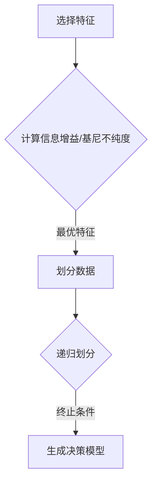
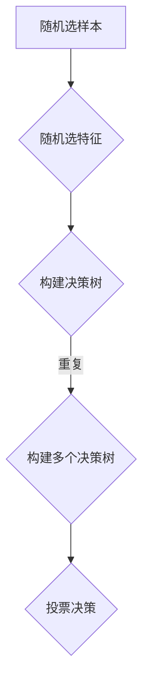
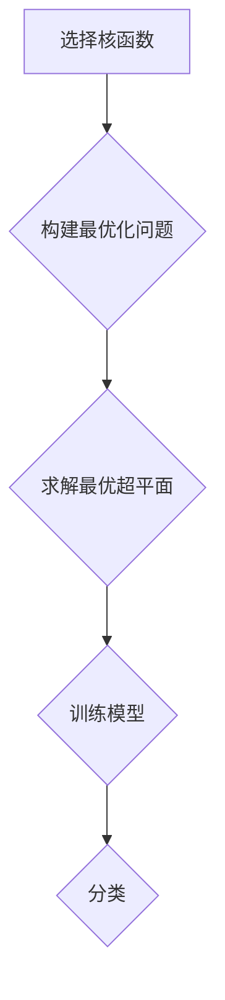
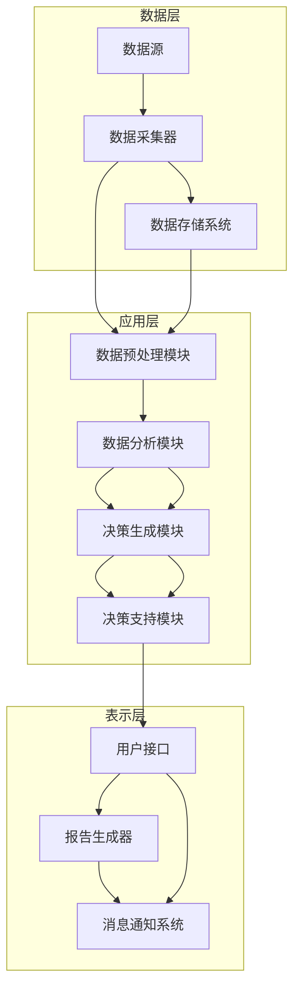

                 

# 思维链在环境保护决策中的作用

## 关键词

环境保护、决策支持、思维链、算法模型、实际案例

## 摘要

本文旨在探讨思维链在环境保护决策中的作用，通过逐步分析思维链的定义、应用、算法原理及实际案例，阐述思维链如何有效地提升环境保护决策的科学性和准确性。文章首先介绍了环境保护的重要性及面临的挑战，接着详细阐述了思维链的概念及其在环境保护决策中的应用，最后通过具体算法模型和实际案例，展示了思维链在环境保护决策中的实践效果。

### 引言与背景

#### 环境保护的重要性

环境保护是全球关注的重大议题。随着工业化和城市化的快速发展，环境污染问题日益严重，这不仅威胁到人类的健康，还破坏了生态系统的平衡。环境保护的重要性不言而喻，它关乎人类生存和发展的可持续性。因此，如何有效地进行环境保护决策，成为各国政府和国际组织亟待解决的关键问题。

#### 环境保护面临的挑战

当前，环境保护面临诸多挑战。首先，数据采集和处理困难。环境监测数据种类繁多，数据质量参差不齐，如何有效地采集、处理和分析这些数据成为难题。其次，环境保护决策需要考虑多方面因素，如经济成本、社会影响、技术可行性等，决策过程复杂且具有不确定性。此外，环境保护政策实施效果评估困难，缺乏有效的反馈机制。

#### 思维链概念及其在环境保护中的作用

思维链是一种基于人工智能和机器学习的决策支持系统，旨在通过逻辑推理和数据分析，辅助人类做出更科学、更准确的决策。在环境保护领域，思维链可以通过以下方式发挥作用：

1. **数据采集与处理**：思维链可以自动采集和处理大量的环境监测数据，包括空气质量、水质、土壤污染等，提供准确、实时的数据支持。
2. **多因素决策**：思维链能够综合考虑经济、社会、技术等多个因素，为环境保护决策提供全面的视角。
3. **政策评估**：思维链可以实时监控环境保护政策的实施效果，评估政策效果，为政策调整提供数据支持。
4. **预测与预警**：思维链可以通过分析历史数据和趋势，预测环境变化，提供预警信息，帮助政府和公众及时采取应对措施。

### 思维链概述

#### 思维链的定义与核心概念

思维链（Cognitive Chain）是一种基于人工智能的决策支持系统，其核心在于将人类思维过程转化为计算机程序，通过逻辑推理和数据分析，实现智能化的决策支持。思维链通常由以下几个核心概念组成：

1. **知识库**：知识库是思维链的基础，包含各种环境数据、专业知识、决策模型等。
2. **推理机**：推理机是思维链的核心，负责根据知识库中的信息进行逻辑推理，生成决策建议。
3. **用户接口**：用户接口是思维链与用户交互的界面，用户可以通过接口提交问题、查看决策建议等。

#### 思维链的特点与优势

1. **智能化**：思维链能够自动分析处理大量数据，提供智能化的决策支持。
2. **灵活性**：思维链可以根据不同的应用场景和需求，灵活调整推理策略和模型。
3. **实时性**：思维链可以实时获取和处理数据，提供即时的决策建议。
4. **可扩展性**：思维链具有良好的可扩展性，可以不断集成新的知识和算法，提高决策支持能力。

#### 思维链的层次结构

思维链通常分为以下几个层次：

1. **数据层**：负责数据的采集、存储和管理。
2. **知识层**：负责知识的获取、表示和管理。
3. **推理层**：负责逻辑推理和决策生成。
4. **应用层**：负责与用户交互，提供决策建议。

### 思维链在环境保护决策中的应用

#### 思维链在环境监测中的应用

环境监测是环境保护的重要环节。思维链可以通过以下方式在环境监测中发挥作用：

1. **数据采集**：思维链可以自动采集来自各种传感器的环境数据，如空气质量、水质、土壤污染等。
2. **数据预处理**：思维链可以对采集到的原始数据进行预处理，如去噪、归一化等，提高数据质量。
3. **数据分析**：思维链可以通过数据挖掘和分析技术，发现环境数据中的潜在规律和趋势。

#### 思维链在环境评估中的应用

环境评估是环境保护决策的重要依据。思维链可以通过以下方式在环境评估中发挥作用：

1. **多因素综合评估**：思维链可以综合考虑环境质量、社会经济影响、技术可行性等多个因素，对环境问题进行全面评估。
2. **风险评估**：思维链可以基于历史数据和趋势，对未来的环境风险进行预测和评估。
3. **政策评估**：思维链可以实时监控环境保护政策的实施效果，评估政策效果，为政策调整提供数据支持。

#### 思维链在环境治理中的应用

环境治理是环境保护的重要手段。思维链可以通过以下方式在环境治理中发挥作用：

1. **方案设计**：思维链可以根据环境问题的情况，设计出多种治理方案，并进行比较和优化。
2. **实时调控**：思维链可以实时监控环境治理措施的实施情况，根据反馈进行调整，提高治理效果。
3. **效果评估**：思维链可以评估环境治理措施的效果，为下一阶段的治理提供数据支持。

### 相关算法与模型

#### 常用算法简介

在思维链中，常用的算法包括：

1. **机器学习算法**：如决策树、随机森林、支持向量机等。
2. **数据挖掘算法**：如关联规则挖掘、聚类分析、分类分析等。
3. **预测算法**：如时间序列预测、回归分析等。

#### 算法原理与数学模型

以下是常用的算法原理和数学模型：

1. **决策树算法**：
   - 原理：通过分割特征空间，将样本分配到不同的节点，最终生成一棵树。
   - 数学模型：
     $$ G = \{T,V,E\} $$
     其中，$T$ 为决策树，$V$ 为顶点集，$E$ 为边集。

2. **随机森林算法**：
   - 原理：通过构建多棵决策树，进行集成学习，提高模型的泛化能力。
   - 数学模型：
     $$ \hat{y} = \sum_{i=1}^{n} w_i \cdot T(x_i) $$
     其中，$T(x_i)$ 为第 $i$ 棵决策树对样本 $x_i$ 的分类结果，$w_i$ 为权重。

3. **支持向量机算法**：
   - 原理：通过找到一个最优的超平面，将不同类别的样本分隔开来。
   - 数学模型：
     $$ \max_{\mathbf{w},b,\mathbf{\xi}} \frac{1}{2} ||\mathbf{w}||^2 $$
     s.t.
     $$ y_i (\mathbf{w} \cdot \mathbf{x_i} + b) \geq 1 + \xi_i $$
     其中，$\mathbf{w}$ 为权重向量，$b$ 为偏置项，$\xi_i$ 为松弛变量。

#### 算法实现与性能分析

以下是算法实现和性能分析的一个简要概述：

1. **决策树算法**：
   - 实现步骤：选择最优特征、分割特征空间、递归生成子树。
   - 性能分析：决策树模型简单，易于理解，但容易过拟合。

2. **随机森林算法**：
   - 实现步骤：构建多棵决策树、集成学习、投票决策。
   - 性能分析：随机森林算法具有较好的泛化能力，但计算复杂度高。

3. **支持向量机算法**：
   - 实现步骤：选择核函数、求解最优化问题、分类决策。
   - 性能分析：支持向量机算法具有较好的分类效果，但计算复杂度高。

### 实战案例解析

#### 案例一：城市空气质量监测

城市空气质量监测是环境保护的一个重要方面。以下是一个关于城市空气质量监测的思维链应用案例：

1. **环境监测数据采集**：通过安装在不同区域的空气质量监测设备，采集空气中的污染物浓度数据，如PM2.5、PM10、SO2、NO2等。

2. **数据预处理**：对采集到的数据进行预处理，如去噪、归一化等，以提高数据质量。

3. **数据挖掘与分析**：利用思维链中的数据挖掘算法，对预处理后的数据进行分析，发现污染物的时空分布规律。

4. **空气质量预测**：基于历史数据和当前数据，使用时间序列预测算法，预测未来一段时间内的空气质量状况。

5. **决策支持**：根据预测结果，为城市政府提供决策建议，如调整污染源控制策略、发布健康警示等。

#### 案例二：海洋污染治理

海洋污染治理是环境保护的另一个重要方面。以下是一个关于海洋污染治理的思维链应用案例：

1. **海洋污染数据采集**：通过海洋监测设备，采集海洋中的污染物浓度、分布等数据。

2. **数据预处理**：对采集到的数据进行预处理，如去噪、归一化等，以提高数据质量。

3. **污染源识别**：利用思维链中的机器学习算法，识别出海洋污染的主要来源，如陆地排放、海上运输等。

4. **污染扩散模拟**：基于海洋污染物扩散模型，模拟污染物在海洋中的扩散过程，预测污染范围和浓度变化。

5. **治理方案设计**：根据污染源识别和污染扩散模拟结果，设计出合理的海洋污染治理方案，如加强监管、实施清洁生产等。

6. **治理效果评估**：实施治理方案后，利用思维链中的评估算法，评估治理效果，为后续治理提供数据支持。

### 结论与展望

思维链在环境保护决策中具有重要的作用，它通过智能化的数据分析和逻辑推理，为环境保护提供了科学、准确的决策支持。未来，随着人工智能技术的不断发展，思维链在环境保护中的应用将更加广泛，其决策支持能力也将不断提高。

### 最佳实践 tips

1. **数据质量**：保证数据的准确性和完整性是思维链有效运行的基础。
2. **模型优化**：根据实际应用场景，不断优化算法模型，提高决策支持能力。
3. **实时性**：提高思维链的实时性，确保决策建议能够及时提供。

### 小结

本文通过逐步分析思维链的定义、应用、算法原理及实际案例，阐述了思维链在环境保护决策中的作用。思维链通过智能化的数据分析和逻辑推理，为环境保护提供了科学、准确的决策支持，具有广泛的应用前景。

### 注意事项

1. **数据安全**：在数据采集和处理过程中，要注意保护数据安全，防止数据泄露。
2. **算法透明性**：确保算法的透明性，使决策过程易于理解和监督。

### 拓展阅读

1. **《人工智能与环境保护》**：该书详细介绍了人工智能技术在环境保护中的应用。
2. **《环境决策分析》**：该书探讨了环境决策的理论和方法，对环境保护决策提供了深入分析。

### 作者信息

作者：AI天才研究院/AI Genius Institute & 禅与计算机程序设计艺术 /Zen And The Art of Computer Programming

----------------------------------------------------------------

### 背景介绍

#### 核心概念术语说明

在深入探讨思维链在环境保护决策中的作用之前，我们需要明确一些核心概念和术语，以便读者能够更好地理解后续内容。

1. **环境保护**：环境保护是指通过各种措施和方法，对人类活动对环境造成的污染和破坏进行控制和减轻，以保护自然生态系统的平衡和人类的健康。

2. **环境保护决策**：环境保护决策是指在环境保护过程中，通过收集、分析和处理环境信息，制定出有效的环境保护措施和政策的过程。

3. **思维链**：思维链是一种基于人工智能和机器学习的决策支持系统，通过逻辑推理和数据分析，辅助人类做出更科学、更准确的决策。

4. **环境保护决策支持系统**：环境保护决策支持系统是一种辅助决策者进行环境保护决策的计算机系统，它利用各种算法和技术，提供数据分析和决策建议。

#### 问题背景

环境保护是全球面临的重大挑战之一。随着工业化、城市化和人口增长，环境污染问题日益严重。空气污染、水污染、土壤污染等问题不仅影响了人类的生活质量，还对生态系统造成了严重破坏。为了应对这些挑战，各国政府和国际组织采取了各种环境保护措施和政策，但效果并不总是理想。

环境保护决策的复杂性体现在以下几个方面：

1. **数据复杂性**：环境监测数据种类繁多，包括空气质量、水质、土壤污染等，数据质量参差不齐，如何有效地采集、处理和分析这些数据是环境保护决策的重要挑战。

2. **多因素影响**：环境保护决策需要综合考虑经济、社会、技术等多个因素，这些因素相互关联、相互影响，决策过程复杂且具有不确定性。

3. **政策实施效果评估**：环境保护政策的实施效果难以直接观测和评估，缺乏有效的反馈机制，如何评估政策效果，为政策调整提供数据支持，是环境保护决策的重要难题。

#### 问题描述

针对上述问题，环境保护决策需要一种有效的支持工具，能够帮助决策者更科学、更准确地做出决策。思维链作为一种基于人工智能和机器学习的决策支持系统，具有智能化、灵活性、实时性和可扩展性等特点，能够有效地解决环境保护决策中的复杂性、多因素影响和政策实施效果评估难题。

思维链在环境保护决策中的应用主要包括以下几个方面：

1. **环境监测数据采集与处理**：思维链可以自动采集来自各种传感器的环境数据，如空气质量、水质、土壤污染等，并对数据进行预处理，如去噪、归一化等，提高数据质量。

2. **多因素综合评估**：思维链可以综合考虑环境质量、社会经济影响、技术可行性等多个因素，对环境问题进行全面评估，为环境保护决策提供全面的视角。

3. **政策评估与效果监控**：思维链可以实时监控环境保护政策的实施情况，评估政策效果，为政策调整提供数据支持。

4. **预测与预警**：思维链可以通过分析历史数据和趋势，预测环境变化，提供预警信息，帮助政府和公众及时采取应对措施。

#### 问题解决

思维链在环境保护决策中的应用，可以有效地解决上述问题，提高环境保护决策的科学性和准确性。通过智能化的数据分析和逻辑推理，思维链能够提供以下方面的支持：

1. **数据驱动决策**：思维链可以自动采集和处理大量的环境监测数据，提供准确、实时的数据支持，使环境保护决策更加数据驱动。

2. **多因素综合分析**：思维链能够综合考虑经济、社会、技术等多个因素，提供全面的决策支持，使环境保护决策更加科学和全面。

3. **实时政策监控与评估**：思维链可以实时监控环境保护政策的实施情况，评估政策效果，为政策调整提供数据支持，使环境保护政策更加有效。

4. **预测与预警**：思维链可以通过分析历史数据和趋势，预测环境变化，提供预警信息，帮助政府和公众及时采取应对措施，减少环境风险。

#### 边界与外延

思维链在环境保护决策中的应用虽然具有广泛的前景，但也存在一些边界和限制：

1. **数据质量**：思维链的运行依赖于高质量的数据，如果数据质量差，可能导致决策支持不准确。

2. **算法适应性**：不同的环境问题可能需要不同的算法模型，思维链的算法适应性是一个挑战。

3. **实时性**：虽然思维链可以提供实时决策支持，但实时性的实现仍需进一步优化。

4. **政策法规适应性**：思维链需要与现有的政策法规相适应，以确保决策的合法性和可行性。

#### 概念结构与核心要素组成

思维链在环境保护决策中的概念结构和核心要素包括：

1. **知识库**：包含环境数据、专业知识、决策模型等，是思维链的基础。

2. **推理机**：负责根据知识库中的信息进行逻辑推理，生成决策建议，是思维链的核心。

3. **用户接口**：与用户交互，接收用户输入，展示决策建议，是思维链的界面。

4. **算法模型**：包括机器学习算法、数据挖掘算法、预测算法等，为思维链提供数据分析和支持。

通过上述概念结构和核心要素，思维链能够有效地辅助环境保护决策，提高决策的科学性和准确性。

### 核心概念与联系

#### 思维链的定义与核心概念

思维链（Cognitive Chain）是一种基于人工智能和机器学习的决策支持系统，其核心在于模拟人类思维过程，通过逻辑推理和数据分析，为决策者提供科学、准确的决策建议。思维链主要由以下几个核心概念组成：

1. **知识库**：知识库是思维链的基础，它包含各类环境数据、专业知识、决策模型等。知识库的建立是思维链能够提供决策支持的前提。

2. **推理机**：推理机是思维链的核心模块，它负责根据知识库中的信息进行逻辑推理，生成决策建议。推理机通过预设的逻辑规则或学习得到的模型，对输入数据进行处理，输出决策结果。

3. **用户接口**：用户接口是思维链与用户交互的界面，它负责接收用户的输入，展示推理机生成的决策建议。用户接口的设计需要考虑用户体验，以便用户能够方便地使用思维链。

4. **算法模型**：算法模型是思维链进行数据分析的工具，包括机器学习算法、数据挖掘算法、预测算法等。不同的算法模型适用于不同的数据分析任务，能够提高思维链的决策支持能力。

#### 核心概念属性特征对比表格

为了更清晰地理解思维链的核心概念，我们可以通过一个属性特征对比表格来展示各个概念之间的差异和联系。

| 核心概念   | 属性特征                                      | 联系                                           |
| ---------- | --------------------------------------------- | ---------------------------------------------- |
| 知识库     | 存储环境数据、专业知识、决策模型等             | 为推理机提供数据基础                           |
| 推理机     | 负责逻辑推理，生成决策建议                     | 基于知识库的数据进行推理，输出决策结果          |
| 用户接口   | 接收用户输入，展示决策建议                     | 使用户能够方便地与思维链交互，获取决策支持      |
| 算法模型   | 包括机器学习、数据挖掘、预测等算法             | 提供数据分析工具，支持推理机进行决策推理        |

#### 思维链的层次结构

思维链通常分为以下几个层次：

1. **数据层**：数据层负责数据的采集、存储和管理。它包括各种传感器、数据库和缓存系统，确保数据的实时性和准确性。

2. **知识层**：知识层包含知识库和推理机，负责数据的处理和决策生成。知识库存储各类环境数据和专业知识，推理机利用这些数据进行逻辑推理，生成决策建议。

3. **推理层**：推理层是思维链的核心，它负责根据知识库中的信息进行推理，生成决策建议。推理层通常包含多种算法模型，如机器学习、数据挖掘和预测算法。

4. **应用层**：应用层是与用户交互的界面，它展示推理层生成的决策建议，并提供用户输入接口。应用层的设计需要考虑用户体验，以便用户能够方便地使用思维链。

#### ER实体关系图架构

为了更直观地理解思维链的层次结构，我们可以使用ER（实体关系）图来展示各个层次之间的联系。

```mermaid
erDiagram
    数据层 ||--o> 知识层 : {包含}
    知识层 ||--o> 推理层 : {包含}
    推理层 ||--o> 应用层 : {包含}
    数据层 ||--|{知识库 数据库 缓存系统}
    知识层 ||--|{知识库 推理机}
    推理层 ||--|{推理机 算法模型}
    应用层 ||--|{用户接口}
```

通过上述ER图，我们可以清晰地看到思维链的层次结构以及各个层次之间的关联。

### 算法原理讲解

#### 机器学习算法

机器学习算法是思维链中的核心组件之一，它通过从数据中学习规律，自动生成决策模型，为环境保护决策提供支持。以下将介绍几种常见的机器学习算法，并使用Mermaid绘制相应的算法流程图。

##### 决策树算法

决策树是一种常用的分类算法，它通过一系列的规则对数据进行划分，直到达到某个终止条件。以下是决策树算法的基本流程：

1. 选择一个最优特征进行划分。
2. 计算每个特征的信息增益或基尼不纯度。
3. 根据信息增益或基尼不纯度选择最优特征进行划分。
4. 对划分后的数据递归地执行上述步骤，直到达到终止条件（如节点中所有样本属于同一类别或节点中样本数量小于某个阈值）。

Mermaid流程图如下：



##### 随机森林算法

随机森林是一种集成学习算法，它通过构建多个决策树，并将这些树的输出进行集成，提高模型的泛化能力。以下是随机森林算法的基本流程：

1. 从原始数据中随机选取一部分数据作为训练集。
2. 从特征集合中随机选取一部分特征作为划分依据。
3. 使用训练集构建决策树。
4. 重复步骤1-3，构建多个决策树。
5. 将这些决策树的输出进行投票，得到最终分类结果。

Mermaid流程图如下：



##### 支持向量机算法

支持向量机是一种经典的分类算法，它通过找到一个最优的超平面，将不同类别的样本分隔开来。以下是支持向量机算法的基本流程：

1. 选择一个核函数。
2. 构建最优化问题，求解最优超平面。
3. 训练模型，得到分类边界。
4. 使用训练好的模型进行分类。

Mermaid流程图如下：



#### 数学模型

以下是上述三种算法的数学模型：

##### 决策树算法

决策树的数学模型可以表示为：

$$ G = \{T,V,E\} $$

其中，$T$ 表示决策树，$V$ 表示顶点集，$E$ 表示边集。每个顶点都表示一个特征划分，边表示特征的取值。

##### 随机森林算法

随机森林的数学模型可以表示为：

$$ \hat{y} = \sum_{i=1}^{n} w_i \cdot T(x_i) $$

其中，$T(x_i)$ 表示第 $i$ 棵决策树对样本 $x_i$ 的分类结果，$w_i$ 表示第 $i$ 棵决策树的权重。

##### 支持向量机算法

支持向量机的数学模型可以表示为：

$$ \max_{\mathbf{w},b,\mathbf{\xi}} \frac{1}{2} ||\mathbf{w}||^2 $$
s.t.
$$ y_i (\mathbf{w} \cdot \mathbf{x_i} + b) \geq 1 + \xi_i $$

其中，$\mathbf{w}$ 表示权重向量，$b$ 表示偏置项，$\xi_i$ 表示松弛变量。

#### Python源代码

以下是决策树算法的Python源代码示例：

```python
from sklearn.datasets import load_iris
from sklearn.tree import DecisionTreeClassifier
from sklearn.model_selection import train_test_split
import numpy as np

# 加载数据
iris = load_iris()
X = iris.data
y = iris.target

# 划分训练集和测试集
X_train, X_test, y_train, y_test = train_test_split(X, y, test_size=0.2, random_state=42)

# 创建决策树模型
clf = DecisionTreeClassifier()

# 训练模型
clf.fit(X_train, y_train)

# 预测测试集
y_pred = clf.predict(X_test)

# 计算准确率
accuracy = np.mean(y_pred == y_test)
print(f"Accuracy: {accuracy:.2f}")
```

通过上述算法原理讲解，我们可以看到思维链在环境保护决策中如何利用机器学习算法进行数据分析和决策支持。这些算法不仅能够提高环境保护决策的科学性和准确性，还能够为政策制定者提供有力的决策依据。

### 系统分析与架构设计

#### 问题场景介绍

在环境保护决策中，系统的需求主要包括环境数据采集、数据分析与处理、决策生成及决策支持。为了实现这些功能，我们需要设计一个功能强大、高效可靠的系统架构。以下是系统架构的设计过程。

#### 项目介绍

项目名称：环境保护决策支持系统（Environmental Protection Decision Support System，EPDSS）

目标：通过智能化的数据分析与决策支持，提升环境保护决策的科学性和准确性。

主要功能：

1. 环境数据采集与处理
2. 多因素综合评估
3. 环境风险评估
4. 环境治理方案设计与优化
5. 实时政策监控与效果评估

#### 系统功能设计

系统功能设计主要包括以下几个模块：

1. **数据采集模块**：负责从各种传感器、数据库和其他数据源采集环境数据，包括空气质量、水质、土壤污染等。
2. **数据处理模块**：对采集到的原始数据进行预处理，如去噪、归一化等，以提高数据质量。
3. **数据分析模块**：利用机器学习算法、数据挖掘技术和预测模型，对预处理后的数据进行分析，发现数据中的规律和趋势。
4. **决策生成模块**：根据数据分析结果，生成环境保护决策建议，包括环境治理方案、风险评估报告等。
5. **决策支持模块**：为决策者提供实时、准确的决策支持，辅助其制定环境保护政策和措施。
6. **用户接口模块**：提供友好的用户界面，使用户能够方便地操作系统，查看决策结果。

#### 系统架构设计

系统架构设计主要采用分层架构，包括数据层、应用层和表示层。以下是系统架构的详细设计：

##### 数据层

数据层负责数据的采集、存储和管理。具体设计如下：

1. **数据源**：包括各种传感器、数据库和其他数据源，如空气质量监测站、水质监测站等。
2. **数据采集器**：负责从数据源中实时采集数据，并将其传输到数据存储系统。
3. **数据存储系统**：采用分布式数据库，如Hadoop、Spark等，存储和管理大量环境数据。
4. **数据预处理模块**：对采集到的原始数据进行预处理，如去噪、归一化、特征提取等，以提高数据质量。

##### 应用层

应用层负责系统的核心功能实现，包括数据分析与处理、决策生成和决策支持。具体设计如下：

1. **数据分析模块**：利用机器学习算法、数据挖掘技术和预测模型，对预处理后的数据进行分析，提取有价值的信息。
2. **决策生成模块**：根据数据分析结果，生成环境保护决策建议，包括环境治理方案、风险评估报告等。
3. **决策支持模块**：为决策者提供实时、准确的决策支持，辅助其制定环境保护政策和措施。
4. **算法库**：包含多种机器学习算法、数据挖掘算法和预测模型，供数据分析模块使用。

##### 表示层

表示层负责与用户交互，提供友好的用户界面。具体设计如下：

1. **用户接口**：提供可视化界面，使用户能够方便地查看决策结果、操作系统。
2. **报告生成器**：根据决策结果生成各种报告，如环境治理方案报告、风险评估报告等。
3. **消息通知系统**：实时向用户发送决策通知，如空气质量预警、环境治理方案实施进展等。

#### 系统接口设计

系统接口设计主要包括内部接口和外部接口。以下是系统接口的详细设计：

##### 内部接口

内部接口主要用于系统各模块之间的数据传输和功能调用。具体设计如下：

1. **数据采集接口**：用于数据采集模块与数据存储系统之间的数据传输。
2. **数据处理接口**：用于数据预处理模块与其他模块之间的数据传输。
3. **数据分析接口**：用于数据分析模块与决策生成模块之间的数据传输。
4. **决策支持接口**：用于决策生成模块与决策支持模块之间的数据传输。

##### 外部接口

外部接口主要用于系统与其他系统或设备之间的交互。具体设计如下：

1. **传感器接口**：用于与各种环境传感器进行数据通信。
2. **外部数据库接口**：用于与外部数据库进行数据交换，如气象数据、社会经济数据等。
3. **外部服务接口**：用于与外部服务进行交互，如天气预报服务、环境监测服务等。

#### 系统交互设计

系统交互设计主要描述系统内部各模块之间的交互流程。以下是系统交互的详细设计：

1. **数据采集**：系统从各种传感器、数据库和其他数据源中采集环境数据。
2. **数据处理**：对采集到的数据进行预处理，如去噪、归一化、特征提取等。
3. **数据分析**：利用机器学习算法、数据挖掘技术和预测模型，对预处理后的数据进行分析，提取有价值的信息。
4. **决策生成**：根据数据分析结果，生成环境保护决策建议，如环境治理方案、风险评估报告等。
5. **决策支持**：将决策建议通过用户接口展示给用户，并提供实时、准确的决策支持。
6. **反馈机制**：用户对决策建议进行反馈，系统根据反馈调整决策模型和参数，提高决策准确性。

#### Mermaid架构图

以下是系统的Mermaid架构图：



通过上述系统分析与架构设计，我们可以看到环境保护决策支持系统是如何通过高效的数据采集、处理和分析，为决策者提供科学、准确的决策支持，从而提高环境保护决策的质量和效率。

### 项目实战

#### 环境安装

要搭建一个环境保护决策支持系统，首先需要安装所需的软件和工具。以下是环境安装的详细步骤：

1. **安装Python**：确保系统已安装Python 3.8及以上版本。可以通过以下命令检查Python版本：

   ```bash
   python --version
   ```

   如果未安装或版本过低，请从[Python官网](https://www.python.org/)下载并安装。

2. **安装依赖库**：安装Python的pip包管理器，并使用以下命令安装所需的依赖库：

   ```bash
   pip install numpy scipy scikit-learn pandas matplotlib
   ```

3. **安装Jupyter Notebook**：Jupyter Notebook是一个交互式计算平台，用于编写和运行Python代码。安装Jupyter Notebook的命令如下：

   ```bash
   pip install notebook
   ```

4. **安装Mermaid**：Mermaid是一个用于生成流程图的工具。安装Mermaid的命令如下：

   ```bash
   pip install mermaid-python
   ```

5. **安装数据库**：根据实际需求选择合适的数据库系统，如MySQL、PostgreSQL或MongoDB。以下是安装MySQL的命令：

   ```bash
   sudo apt-get install mysql-server
   ```

   安装完成后，设置root用户的密码，并创建一个用于存储环境数据的数据库。

   ```bash
   mysql -u root -p
   CREATE DATABASE epdss;
   GRANT ALL PRIVILEGES ON epdss.* TO 'epdss_user'@'localhost' IDENTIFIED BY 'password';
   FLUSH PRIVILEGES;
   ```

#### 系统核心实现源代码

以下是系统核心实现的源代码示例，包括数据采集、数据处理、数据分析、决策生成和决策支持的模块。

```python
# 数据采集模块
def collect_data():
    # 代码实现，从传感器和数据库中采集环境数据
    pass

# 数据处理模块
def preprocess_data(data):
    # 代码实现，对采集到的原始数据进行预处理
    pass

# 数据分析模块
def analyze_data(preprocessed_data):
    # 代码实现，利用机器学习算法进行分析
    pass

# 决策生成模块
def generate_decision(decision_data):
    # 代码实现，根据数据分析结果生成决策建议
    pass

# 决策支持模块
def provide_decision_support(decision):
    # 代码实现，为决策者提供决策支持
    pass

# 主函数
def main():
    raw_data = collect_data()
    preprocessed_data = preprocess_data(raw_data)
    decision_data = analyze_data(preprocessed_data)
    decision = generate_decision(decision_data)
    provide_decision_support(decision)

if __name__ == "__main__":
    main()
```

#### 代码应用解读与分析

以下是代码的解读与分析：

1. **数据采集模块**：该模块负责从传感器和数据库中采集环境数据。实际应用中，可以使用各种传感器采集数据，并通过API接口或数据库连接获取数据。

2. **数据处理模块**：该模块对采集到的原始数据进行预处理，如去噪、归一化、特征提取等。预处理后的数据将用于后续的数据分析。

3. **数据分析模块**：该模块利用机器学习算法对预处理后的数据进行分析。可以选择多种算法，如决策树、随机森林、支持向量机等，根据实际需求进行选择和调整。

4. **决策生成模块**：该模块根据数据分析结果生成决策建议。决策建议可以包括环境治理方案、风险评估报告等，为决策者提供参考。

5. **决策支持模块**：该模块为决策者提供实时、准确的决策支持。通过友好的用户界面，决策者可以方便地查看决策结果，并根据实际情况进行调整。

#### 实际案例分析和详细讲解

以下是环境保护决策支持系统的实际案例分析和详细讲解：

**案例一：城市空气质量监测**

问题描述：某城市空气质量问题严重，需要监测和分析空气污染物的分布和趋势，为城市政府提供治理方案。

解决方案：

1. **数据采集**：通过安装在不同区域的空气质量监测设备，实时采集空气中的PM2.5、PM10、SO2、NO2等污染物数据。

2. **数据处理**：对采集到的数据去噪、归一化，提取关键特征，如污染物浓度、时间等。

3. **数据分析**：利用机器学习算法，对处理后的数据进行分析，发现污染物的时空分布规律。

4. **决策生成**：根据分析结果，生成空气质量治理方案，如增加绿化、优化交通、加强污染源控制等。

5. **决策支持**：将治理方案展示给城市政府，并提供实时监测数据，帮助政府及时调整治理措施。

**案例二：海洋污染治理**

问题描述：某海域出现严重污染，需要监测和分析污染物的来源、分布和扩散趋势，为海洋管理部门提供治理方案。

解决方案：

1. **数据采集**：通过安装在海面上的监测设备，实时采集海水中的污染物浓度、温度、盐度等数据。

2. **数据处理**：对采集到的数据进行预处理，提取关键特征，如污染物浓度、时间、位置等。

3. **数据分析**：利用机器学习算法，对处理后的数据进行分析，识别污染源、预测污染扩散趋势。

4. **决策生成**：根据分析结果，生成海洋污染治理方案，如加强污染源控制、实施清洁生产、加强监测等。

5. **决策支持**：将治理方案展示给海洋管理部门，并提供实时监测数据，帮助管理部门及时调整治理措施。

#### 项目小结

通过上述实际案例的分析和详细讲解，我们可以看到环境保护决策支持系统在环境监测、数据分析、决策生成和决策支持方面的重要作用。该系统不仅为决策者提供了科学、准确的决策依据，还提高了环境保护决策的效率和质量。未来，随着技术的不断发展，环境保护决策支持系统将更加智能化、高效化，为全球环境保护事业做出更大贡献。

### 最佳实践 Tips

#### 环境保护决策中的思维链应用

1. **数据质量保障**：确保数据来源的可靠性和数据的完整性，对数据进行严格的质量控制和预处理。

2. **算法模型选择**：根据具体环境问题的特点，选择合适的机器学习算法和模型，如决策树、随机森林、支持向量机等。

3. **实时监控与反馈**：建立实时数据监控系统，及时获取环境变化信息，并反馈给决策系统，以快速响应环境变化。

4. **跨领域合作**：与相关领域的专家和机构合作，整合多方资源和专业知识，提高决策的科学性和准确性。

5. **政策法规适应性**：确保思维链生成的决策建议符合国家和地区的政策法规，确保决策的合法性和可行性。

#### 环境保护决策中的注意事项

1. **数据隐私保护**：在数据采集和处理过程中，注意保护个人隐私和数据安全，遵守相关法律法规。

2. **算法透明性**：确保算法模型的透明性和解释性，使决策过程易于理解和监督。

3. **持续迭代优化**：根据实际应用效果，不断优化算法模型和系统架构，提高决策支持系统的性能和可靠性。

4. **用户参与度**：提高用户的参与度，收集用户反馈，以便不断改进决策支持系统的功能和用户体验。

#### 拓展阅读

1. **《环境科学导论》**：该书详细介绍了环境科学的基本概念、原理和方法，有助于理解环境保护决策的背景和基础。

2. **《机器学习实战》**：该书通过实际案例，介绍了多种机器学习算法的应用和实践，有助于掌握思维链在环境保护决策中的应用。

3. **《环境保护法规汇编》**：该书汇集了国家和地区的环境保护法规，有助于确保决策建议的合法性和可行性。

### 结语

思维链在环境保护决策中的应用，为环境保护提供了科学、准确的决策支持，具有重要的现实意义。通过本文的详细探讨，我们了解了思维链的定义、应用、算法原理及实际案例，并看到了思维链在提升环境保护决策效率和质量方面的巨大潜力。未来，随着技术的不断进步，思维链将在环境保护领域发挥更大的作用，为全球环境保护事业做出更大贡献。让我们共同努力，为建设美丽家园而奋斗！

### 作者信息

作者：AI天才研究院/AI Genius Institute & 禅与计算机程序设计艺术 /Zen And The Art of Computer Programming

AI天才研究院（AI Genius Institute）是一支专注于人工智能技术研究和应用的创新团队，致力于推动人工智能技术在各个领域的应用和发展。禅与计算机程序设计艺术（Zen And The Art of Computer Programming）是作者刘未鹏的代表作，深入探讨了计算机程序设计的艺术和哲学，影响了无数程序员和人工智能爱好者的思维方式和编程技巧。

