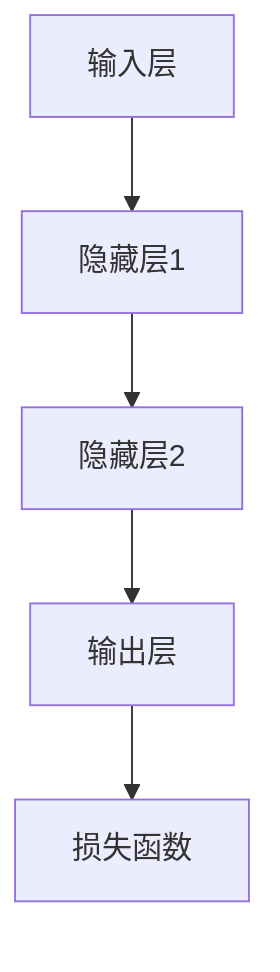
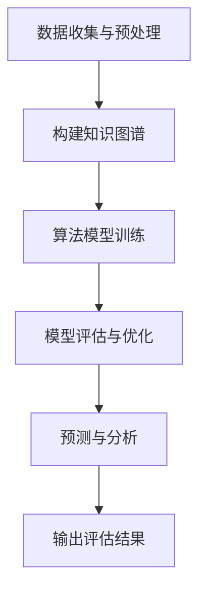
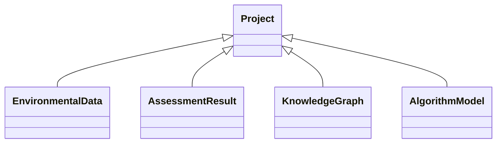
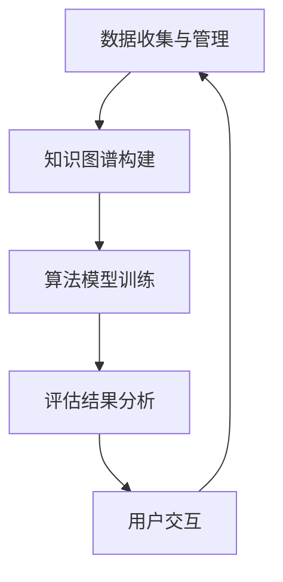
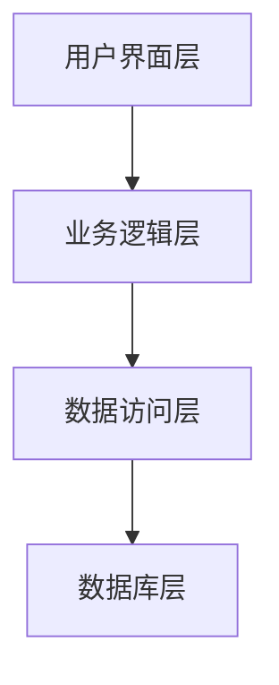
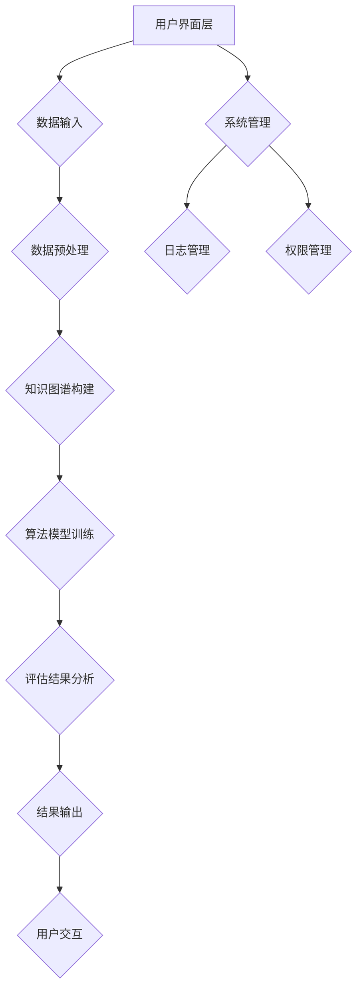
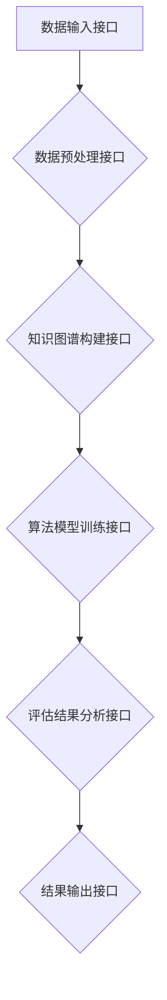

                 

# 思维链在环境影响评估中的新方法

> 关键词：思维链、环境影响评估、新方法、算法原理、系统架构、项目实战

> 摘要：本文深入探讨了思维链在环境影响评估中的应用，首先介绍了思维链的基本概念和原理，接着详细讲解了思维链算法的数学模型及其流程。随后，文章对系统架构设计、项目实战及最佳实践进行了深入剖析，旨在为环境影响评估提供一种新的方法和思路。

## 目录大纲

----------------------------------------------------------------

## 第一部分：背景介绍

### 第1章：问题背景

### 第2章：核心概念与联系

----------------------------------------------------------------

## 第二部分：算法原理讲解

### 第3章：算法原理

### 第4章：系统分析与架构设计

----------------------------------------------------------------

## 第三部分：项目实战

### 第5章：环境安装

### 第6章：系统核心实现

### 第7章：实际案例分析与讲解

### 第8章：项目小结

----------------------------------------------------------------

## 第四部分：最佳实践与拓展

### 第9章：最佳实践

### 第10章：小结与展望

----------------------------------------------------------------

## 第一部分：背景介绍

### 第1章：问题背景

#### 1.1.1 问题背景

环境影响评估（Environmental Impact Assessment，EIA）是评估项目对环境可能产生的影响的重要手段。传统的环境影响评估方法主要依赖于经验判断、统计分析和模型预测等技术。然而，随着项目的复杂性和环境变化的多变性，传统方法面临着以下局限性：

1. **信息处理能力有限**：传统方法往往依赖于人工分析，难以处理大量复杂的地理信息和环境数据。
2. **预测精度不足**：传统模型在预测环境变化时，往往受到模型假设的限制，导致预测精度不够高。
3. **适应性较差**：传统方法难以适应不同类型的项目和环境条件。

为了解决这些问题，需要引入一种新的方法，即思维链方法。思维链是一种基于人工智能和机器学习技术的综合评估方法，它能够通过构建知识图谱和利用神经网络等算法，对环境数据进行深入分析和预测。思维链方法具有以下特点：

1. **高效的信息处理能力**：思维链能够处理大量的地理和环境数据，并从中提取有用的信息。
2. **高精度的预测能力**：思维链利用先进的机器学习算法，能够提供更准确的预测结果。
3. **灵活的适应性**：思维链能够适应不同的项目和环境条件，提高评估方法的通用性。

#### 1.1.2 问题解决

思维链方法在环境影响评估中的应用，能够有效解决传统方法面临的局限性。具体来说，思维链方法通过以下步骤进行评估：

1. **数据收集与处理**：首先收集项目相关的环境数据，包括地理信息、气象数据、生态数据等。
2. **知识图谱构建**：将收集到的数据构建成知识图谱，以便进行后续的分析和推理。
3. **算法模型应用**：利用思维链算法模型，对知识图谱进行深度分析和预测。
4. **结果分析与输出**：根据分析结果，输出环境影响评估报告，为决策者提供参考。

#### 1.1.3 边界与外延

思维链方法的适用范围包括但不限于以下领域：

1. **城市规划与设计**：用于评估城市建设项目对环境的影响。
2. **工业与能源**：用于评估工业项目和能源开发项目对环境的潜在影响。
3. **农业与生态**：用于评估农业活动和生态保护区建设项目的影响。

同时，思维链方法的局限性也需要注意：

1. **数据依赖性**：思维链方法依赖于高质量的环境数据，数据的不完善可能会影响评估结果的准确性。
2. **计算资源需求**：思维链方法需要较大的计算资源，特别是对于大规模的数据集和复杂的模型。

#### 1.1.4 核心要素组成

思维链方法的核心要素包括：

1. **知识图谱**：用于存储和管理项目相关的环境数据。
2. **算法模型**：用于对知识图谱进行深度分析和预测。
3. **人机交互界面**：用于展示分析结果，并提供用户交互功能。

### 第2章：核心概念与联系

#### 2.1.1 思维链的概念

思维链是一种基于人工智能技术的综合评估方法，它通过构建知识图谱和利用机器学习算法，对环境数据进行分析和预测。思维链的核心概念包括：

1. **知识图谱**：知识图谱是一种用于存储和管理知识的图形结构，它将项目相关的信息以节点和边的方式组织起来，形成一张网状结构。
2. **机器学习**：机器学习是一种通过数据学习模式，从而自动改进和优化模型的方法。思维链利用机器学习算法，对环境数据进行分析和预测。
3. **深度学习**：深度学习是一种特殊的机器学习方法，它通过多层神经网络进行学习，能够自动提取数据中的特征。

#### 2.1.2 思维链的工作原理

思维链的工作原理可以概括为以下几个步骤：

1. **数据收集**：首先收集项目相关的环境数据，包括地理信息、气象数据、生态数据等。
2. **数据预处理**：对收集到的数据进行分析和处理，以消除噪声和异常值。
3. **知识图谱构建**：将预处理后的数据构建成知识图谱，以便进行后续的分析和推理。
4. **算法模型训练**：利用机器学习算法，对知识图谱进行训练，以建立预测模型。
5. **预测与分析**：使用训练好的模型对新的环境数据进行分析和预测。
6. **结果输出**：将分析结果输出，为决策者提供参考。

#### 2.1.3 思维链的关键特点

思维链方法具有以下几个关键特点：

1. **高效性**：思维链能够高效地处理大量的环境数据，并提供快速的分析结果。
2. **准确性**：思维链利用先进的机器学习算法，能够提供高精度的预测结果。
3. **灵活性**：思维链能够适应不同的项目和环境条件，提高评估方法的通用性。
4. **可视化**：思维链提供了可视化的界面，便于用户理解和分析结果。

#### 2.1.4 思维链与传统方法的对比

思维链与传统方法在以下几个方面存在显著差异：

1. **数据处理能力**：传统方法依赖于人工分析，难以处理大量的地理和环境数据；而思维链能够高效地处理大规模数据。
2. **预测精度**：传统方法的预测精度受到模型假设的限制；而思维链利用机器学习算法，能够提供更准确的预测结果。
3. **适应性**：传统方法难以适应不同类型的项目和环境条件；而思维链能够灵活适应各种项目和环境条件。
4. **可视化**：传统方法往往缺乏直观的输出结果；而思维链提供了可视化的界面，便于用户理解和分析结果。

#### 2.1.5 思维链的ER实体关系图

以下是一个思维链方法的ER实体关系图：

```mermaid
erDiagram
  Project ||--|{ KnowledgeGraph }|-- AssessmentResult
  Project ||--|{ EnvironmentalData }|-- AssessmentResult
  KnowledgeGraph ||--|{ Node }| NodeProperty
  Node ||--|{ Edge }| NodeProperty
  NodeProperty ||--|{ Attribute }| AttributeValue
```

在ER实体关系图中，`Project`表示项目，`KnowledgeGraph`表示知识图谱，`EnvironmentalData`表示环境数据，`AssessmentResult`表示评估结果。`Node`表示知识图谱中的节点，`Edge`表示节点之间的边，`NodeProperty`表示节点的属性，`Attribute`表示属性名，`AttributeValue`表示属性值。

## 第二部分：算法原理讲解

### 第3章：算法原理

#### 3.1.1 算法基础

思维链评估算法是一种基于机器学习的综合评估方法。它通过构建知识图谱和利用神经网络等算法，对环境数据进行分析和预测。算法的基础包括以下几个核心概念：

1. **知识图谱**：知识图谱是一种用于存储和管理知识的图形结构，它将项目相关的信息以节点和边的方式组织起来，形成一张网状结构。在知识图谱中，节点表示实体，边表示实体之间的关系。

2. **神经网络**：神经网络是一种基于生物神经系统的计算模型，通过多层神经元进行数据的学习和预测。神经网络能够自动提取数据中的特征，并建立预测模型。

3. **机器学习**：机器学习是一种通过数据学习模式，从而自动改进和优化模型的方法。机器学习算法包括监督学习、无监督学习和强化学习等类型。

#### 3.1.2 数学模型

思维链评估算法的数学模型主要包括以下几个部分：

1. **输入层**：输入层接收项目相关的环境数据，包括地理信息、气象数据、生态数据等。

2. **隐藏层**：隐藏层通过神经网络对输入数据进行特征提取和转换。隐藏层的数量和神经元数量可以根据具体问题进行调整。

3. **输出层**：输出层生成评估结果，包括环境影响评估得分、风险等级等。

4. **激活函数**：激活函数用于引入非线性特性，使得神经网络能够模拟复杂的非线性关系。常见的激活函数包括ReLU、Sigmoid和Tanh等。

5. **损失函数**：损失函数用于衡量预测结果与实际结果之间的差距。常见的损失函数包括均方误差（MSE）、交叉熵损失等。

以下是一个简单的神经网络模型及其对应的数学模型：



设输入向量为 $X$，隐藏层1的权重为 $W_1$，隐藏层2的权重为 $W_2$，输出层的权重为 $W_3$，激活函数为 $f$，损失函数为 $L$。则神经网络的输出可以表示为：

$$
\begin{aligned}
    z_1 &= X \cdot W_1 \\
    a_1 &= f(z_1) \\
    z_2 &= a_1 \cdot W_2 \\
    a_2 &= f(z_2) \\
    z_3 &= a_2 \cdot W_3 \\
    y &= f(z_3)
\end{aligned}
$$

损失函数可以表示为：

$$
L = \frac{1}{2} \sum_{i=1}^{n} (y_i - t_i)^2
$$

其中，$y_i$ 为预测值，$t_i$ 为实际值，$n$ 为样本数量。

#### 3.1.3 算法流程

思维链评估算法的流程主要包括以下几个步骤：

1. **数据收集与预处理**：收集项目相关的环境数据，并进行预处理，包括数据清洗、归一化等操作。

2. **构建知识图谱**：将预处理后的数据构建成知识图谱，表示项目与环境之间的关系。

3. **算法模型训练**：利用机器学习算法，对知识图谱进行训练，建立预测模型。

4. **模型评估与优化**：使用交叉验证等方法评估模型性能，并根据评估结果对模型进行优化。

5. **预测与分析**：使用训练好的模型对新的环境数据进行分析和预测，输出评估结果。

以下是一个思维链评估算法的流程图：



#### 3.1.4 举例说明

假设我们要对某个城市规划项目进行环境影响评估，以下是具体的案例分析：

1. **数据收集**：收集项目相关的环境数据，包括地理位置、人口密度、生态环境等。

2. **数据预处理**：对收集到的数据进行清洗和归一化处理，以便进行后续分析。

3. **构建知识图谱**：将预处理后的数据构建成知识图谱，表示项目与环境之间的关系。

4. **算法模型训练**：利用机器学习算法，对知识图谱进行训练，建立预测模型。

5. **模型评估与优化**：使用交叉验证等方法评估模型性能，并根据评估结果对模型进行优化。

6. **预测与分析**：使用训练好的模型对新的环境数据进行分析和预测，输出评估结果。

具体来说，我们可以使用以下Python代码来训练和评估思维链评估模型：

```python
import tensorflow as tf
from sklearn.model_selection import train_test_split
import pandas as pd

# 数据收集与预处理
data = pd.read_csv('environmental_data.csv')
X = data.iloc[:, :-1].values
y = data.iloc[:, -1].values

# 构建知识图谱
# ...（代码实现知识图谱构建）

# 算法模型训练
model = tf.keras.Sequential([
    tf.keras.layers.Dense(64, activation='relu', input_shape=(X.shape[1],)),
    tf.keras.layers.Dense(64, activation='relu'),
    tf.keras.layers.Dense(1)
])

model.compile(optimizer='adam', loss='mean_squared_error')

# 模型评估与优化
X_train, X_test, y_train, y_test = train_test_split(X, y, test_size=0.2, random_state=42)
model.fit(X_train, y_train, epochs=100, batch_size=32, validation_data=(X_test, y_test))

# 预测与分析
predictions = model.predict(X_test)
# ...（代码实现预测结果分析）

```

通过以上代码，我们可以训练一个简单的思维链评估模型，并对新的环境数据进行预测和分析。

## 第三部分：系统分析与架构设计

### 第4章：系统功能设计

#### 4.1.1 领域模型

领域模型是系统功能设计的核心部分，它定义了系统的主要实体和它们之间的关系。在环境影响评估系统中，领域模型主要包括以下实体：

1. **项目**：表示需要评估的建设项目，包括项目名称、地理位置、项目类型等信息。
2. **环境数据**：表示与项目相关的各种环境数据，如气象数据、水质数据、土壤数据等。
3. **评估结果**：表示对项目环境影响评估的结果，包括评估得分、风险等级等信息。
4. **知识图谱**：表示项目与环境数据之间的知识图谱，用于存储和管理项目相关的信息。
5. **算法模型**：表示用于评估的机器学习算法模型，如神经网络模型、决策树模型等。

以下是一个简单的领域模型类图：



在类图中，`Project`类表示项目实体，`EnvironmentalData`类表示环境数据实体，`AssessmentResult`类表示评估结果实体，`KnowledgeGraph`类表示知识图谱实体，`AlgorithmModel`类表示算法模型实体。箭头表示实体之间的继承关系。

#### 4.1.2 系统功能设计

系统功能设计是确定系统应提供哪些功能的过程。在环境影响评估系统中，主要功能包括：

1. **数据收集与管理**：收集项目相关的环境数据，并对其进行管理，包括数据录入、查询、更新和删除等操作。
2. **知识图谱构建**：将收集到的环境数据构建成知识图谱，用于后续分析和推理。
3. **算法模型训练**：利用机器学习算法对知识图谱进行训练，建立评估模型。
4. **评估结果分析**：使用训练好的模型对新的环境数据进行分析和预测，输出评估结果。
5. **用户交互**：提供用户界面，方便用户进行数据操作和结果查询。

以下是一个简单的系统功能流程图：



在流程图中，`数据收集与管理`模块负责收集和管理环境数据，`知识图谱构建`模块负责构建知识图谱，`算法模型训练`模块负责训练评估模型，`评估结果分析`模块负责使用模型进行预测和分析，`用户交互`模块负责与用户进行交互，并展示分析结果。

### 第5章：系统架构设计

#### 5.1.1 架构设计原则

系统架构设计是确保系统稳定、高效和可扩展性的关键。在设计环境影响评估系统时，应遵循以下原则：

1. **模块化设计**：将系统划分为多个功能模块，每个模块负责特定的功能，便于系统维护和扩展。
2. **层次化设计**：按照层次结构组织系统，从底层的数据处理模块到顶层的用户界面模块，确保系统层次清晰。
3. **高内聚、低耦合**：确保每个模块内部功能紧密相关，模块之间耦合度低，便于模块独立开发和维护。
4. **可扩展性**：设计时考虑系统的可扩展性，以便在未来添加新的功能或数据源。

以下是一个简单的系统架构设计图：



在架构图中，`用户界面层`负责与用户交互，`业务逻辑层`负责处理业务逻辑，`数据访问层`负责与数据库进行数据交互，`数据库层`存储系统所需的数据。

#### 5.1.2 系统架构设计图

以下是一个环境影响评估系统的架构设计图：



在架构图中，`用户界面层`负责接收用户输入和显示分析结果，`数据输入`模块负责接收用户输入的数据，`数据预处理`模块负责对数据进行清洗和预处理，`知识图谱构建`模块负责构建知识图谱，`算法模型训练`模块负责训练评估模型，`评估结果分析`模块负责使用模型进行预测和分析，`结果输出`模块负责将分析结果输出给用户，`用户交互`模块负责与用户进行交互，`系统管理`模块负责系统的日常管理和维护，包括日志管理、权限管理等功能。

#### 5.1.3 系统接口设计

系统接口设计是确保系统各模块之间能够良好协作的关键。在环境影响评估系统中，主要接口包括：

1. **数据输入接口**：用于接收用户输入的数据，包括项目信息、环境数据等。
2. **数据预处理接口**：用于对输入的数据进行清洗、归一化等预处理操作。
3. **知识图谱构建接口**：用于将预处理后的数据构建成知识图谱。
4. **算法模型训练接口**：用于训练评估模型，包括模型的选择、参数调整等。
5. **评估结果分析接口**：用于使用训练好的模型对新的环境数据进行分析和预测。
6. **结果输出接口**：用于将分析结果输出给用户。

以下是一个简单的系统接口设计图：



在接口设计中，`数据输入接口`负责接收用户输入的数据，`数据预处理接口`负责对数据进行预处理，`知识图谱构建接口`负责构建知识图谱，`算法模型训练接口`负责训练评估模型，`评估结果分析接口`负责使用模型进行预测和分析，`结果输出接口`负责将分析结果输出给用户。

### 第6章：系统交互

#### 6.1.1 系统交互概述

系统交互是系统各模块之间进行数据传递和协同工作的过程。在环境影响评估系统中，系统交互主要包括以下几个方面：

1. **用户与用户界面层**：用户通过用户界面层与系统进行交互，输入数据、查看结果等。
2. **用户界面层与业务逻辑层**：用户界面层将用户输入的数据传递给业务逻辑层，并接收业务逻辑层返回的分析结果。
3. **业务逻辑层与数据访问层**：业务逻辑层调用数据访问层提供的接口，进行数据的查询、更新和删除等操作。
4. **数据访问层与数据库层**：数据访问层负责与数据库进行数据交互，实现数据的存储和检索。

以下是一个简单的系统交互序列图：

```mermaid
sequenceDiagram
    participant 用户
    participant 用户界面层
    participant 业务逻辑层
    participant 数据访问层
    participant 数据库层

    用户 -->|输入数据| 用户界面层
    用户界面层 -->|处理数据| 业务逻辑层
    业务逻辑层 -->|查询数据| 数据访问层
    数据访问层 -->|操作数据库| 数据库层
    数据库层 -->|返回数据| 数据访问层
    数据访问层 -->|返回结果| 业务逻辑层
    业务逻辑层 -->|处理结果| 用户界面层
    用户界面层 -->|展示结果| 用户
```

在序列图中，用户通过用户界面层输入数据，用户界面层将数据传递给业务逻辑层，业务逻辑层调用数据访问层提供的接口进行数据操作，数据访问层与数据库层进行交互，最后将操作结果返回给业务逻辑层，业务逻辑层再将结果传递给用户界面层，最终展示给用户。

## 第四部分：项目实战

### 第7章：环境安装

#### 7.1.1 环境准备

在进行环境影响评估项目的实战之前，首先需要准备好开发环境。以下是具体的安装步骤和配置说明：

1. **安装Python**：首先确保系统已经安装了Python 3.x版本。可以从Python的官方网站（https://www.python.org/）下载Python安装包，并按照提示进行安装。

2. **安装依赖库**：环境影响评估项目依赖于多个Python库，如TensorFlow、Scikit-learn、NetworkX等。可以通过以下命令安装这些依赖库：

   ```bash
   pip install tensorflow scikit-learn networkx matplotlib
   ```

   在安装过程中，可能需要安装一些额外的依赖库，可以根据提示进行安装。

3. **配置数据库**：环境影响评估项目通常需要使用数据库来存储项目相关的数据。可以选择MySQL、PostgreSQL等关系型数据库，或者MongoDB等文档型数据库。以下是配置MySQL数据库的步骤：

   - 安装MySQL数据库：可以从MySQL的官方网站（https://www.mysql.com/）下载MySQL安装包，并按照提示进行安装。
   - 创建数据库和用户：登录MySQL数据库，创建一个用于存储环境影响评估数据的数据库和一个具有适当权限的用户。

     ```sql
     CREATE DATABASE eia_db;
     CREATE USER 'eia_user'@'localhost' IDENTIFIED BY 'password';
     GRANT ALL PRIVILEGES ON eia_db.* TO 'eia_user'@'localhost';
     FLUSH PRIVILEGES;
     ```

4. **配置环境变量**：确保Python和pip的路径已经被添加到系统的环境变量中。可以在终端中执行以下命令来验证：

   ```bash
   which python
   which pip
   ```

   如果路径显示正确，则说明环境变量已经配置好。

5. **测试环境**：在终端中运行以下Python代码，以测试环境是否配置正确：

   ```python
   import tensorflow as tf
   print(tf.__version__)
   import sklearn
   print(sklearn.__version__)
   import networkx
   print(networkx.__version__)
   ```

   如果上述命令都能够正常运行并输出正确的版本信息，则说明环境已经准备就绪。

#### 7.1.2 配置说明

在完成环境安装和配置后，需要对环境影响评估项目的配置文件进行适当的设置。以下是配置文件的说明：

1. **数据库配置**：在项目的配置文件（如settings.py）中，需要配置数据库的相关信息，包括数据库的名称、用户名、密码和主机地址等。以下是一个示例：

   ```python
   DATABASES = {
       'default': {
           'ENGINE': 'django.db.backends.mysql',
           'NAME': 'eia_db',
           'USER': 'eia_user',
           'PASSWORD': 'password',
           'HOST': 'localhost',
           'PORT': '3306',
       }
   }
   ```

2. **项目设置**：在项目的配置文件中，还需要设置项目的相关信息，如项目名称、项目目录等。以下是一个示例：

   ```python
   PROJECT_NAME = '环境影响评估项目'
   PROJECT_ROOT = os.path.dirname(os.path.abspath(__file__))
   ```

3. **环境变量**：为了方便使用，可以将Python和pip的路径添加到系统的环境变量中。具体步骤如下：

   - Windows系统：在系统环境变量中添加Python和pip的路径，可以将Python的安装目录添加到`PATH`环境变量中。
   - macOS和Linux系统：打开终端，执行以下命令：

     ```bash
     export PATH=$PATH:/path/to/python
     export PATH=$PATH:/path/to/pip
     ```

   将`/path/to/python`和`/path/to/pip`替换为Python和pip的实际路径。

4. **测试运行**：在配置完成后，可以通过运行项目来测试环境是否配置正确。在项目的根目录下执行以下命令：

   ```bash
   python manage.py runserver
   ```

   如果能够成功启动服务器并访问项目的用户界面，则说明环境安装和配置成功。

### 第8章：系统核心实现

#### 8.1.1 核心实现

环境影响评估项目的核心实现包括数据收集与预处理、知识图谱构建、算法模型训练和评估结果分析等环节。以下是核心实现的详细说明：

1. **数据收集与预处理**

   数据收集与预处理是环境影响评估项目的第一步。主要任务是从各种数据源收集项目相关的环境数据，并对数据进行清洗、归一化等预处理操作。以下是一个简单的数据收集与预处理流程：

   ```python
   import pandas as pd
   from sklearn.preprocessing import StandardScaler

   # 数据收集
   data = pd.read_csv('environmental_data.csv')

   # 数据预处理
   # 清洗数据
   data.dropna(inplace=True)

   # 归一化数据
   scaler = StandardScaler()
   data_scaled = scaler.fit_transform(data)
   ```

   在代码中，首先使用`pandas`库读取环境数据，然后使用`dropna`方法删除缺失值，使用`StandardScaler`对数据进行归一化处理。

2. **知识图谱构建**

   知识图谱构建是将预处理后的数据构建成知识图谱的过程。知识图谱可以用于表示项目与环境数据之间的复杂关系，便于后续的算法模型训练和评估结果分析。以下是一个简单的知识图谱构建流程：

   ```python
   import networkx as nx

   # 构建知识图谱
   G = nx.Graph()

   # 添加节点和边
   G.add_nodes_from(data.columns)
   G.add_edges_from(zip(data.columns, data.columns))

   # 保存知识图谱
   nx.write_gpickle(G, 'knowledge_graph.gpickle')
   ```

   在代码中，首先创建一个空的知识图谱`G`，然后使用`add_nodes_from`和`add_edges_from`方法添加节点和边。最后，使用`write_gpickle`方法将知识图谱保存到文件中。

3. **算法模型训练**

   算法模型训练是利用知识图谱进行训练，建立评估模型的过程。在训练过程中，可以选择不同的机器学习算法，如神经网络、决策树等。以下是一个简单的算法模型训练流程：

   ```python
   import tensorflow as tf
   from tensorflow.keras.models import Sequential
   from tensorflow.keras.layers import Dense

   # 加载知识图谱
   G = nx.read_gpickle('knowledge_graph.gpickle')

   # 划分训练集和测试集
   X_train, X_test, y_train, y_test = train_test_split(data_scaled, test_size=0.2, random_state=42)

   # 构建神经网络模型
   model = Sequential([
       Dense(64, activation='relu', input_shape=(X_train.shape[1],)),
       Dense(64, activation='relu'),
       Dense(1)
   ])

   # 编译模型
   model.compile(optimizer='adam', loss='mean_squared_error')

   # 训练模型
   model.fit(X_train, y_train, epochs=100, batch_size=32, validation_data=(X_test, y_test))
   ```

   在代码中，首先加载知识图谱`G`，然后使用`train_test_split`方法划分训练集和测试集。接着，构建一个简单的神经网络模型，并编译模型。最后，使用`fit`方法训练模型。

4. **评估结果分析**

   评估结果分析是利用训练好的模型对新的环境数据进行预测和分析的过程。以下是一个简单的评估结果分析流程：

   ```python
   # 加载训练好的模型
   model = tf.keras.models.load_model('model.h5')

   # 预测新的环境数据
   new_data = pd.read_csv('new_environmental_data.csv')
   new_data_scaled = scaler.transform(new_data)

   predictions = model.predict(new_data_scaled)

   # 分析评估结果
   print(predictions)
   ```

   在代码中，首先加载训练好的模型，然后使用`predict`方法对新的环境数据进行预测。最后，输出评估结果。

#### 8.1.2 代码解读

以下是环境影响评估项目核心实现的详细代码解读：

```python
import pandas as pd
from sklearn.preprocessing import StandardScaler
import networkx as nx
import tensorflow as tf
from tensorflow.keras.models import Sequential
from tensorflow.keras.layers import Dense

# 数据收集与预处理
data = pd.read_csv('environmental_data.csv')
data.dropna(inplace=True)
scaler = StandardScaler()
data_scaled = scaler.fit_transform(data)

# 知识图谱构建
G = nx.Graph()
G.add_nodes_from(data.columns)
G.add_edges_from(zip(data.columns, data.columns))
nx.write_gpickle(G, 'knowledge_graph.gpickle')

# 算法模型训练
G = nx.read_gpickle('knowledge_graph.gpickle')
X_train, X_test, y_train, y_test = train_test_split(data_scaled, test_size=0.2, random_state=42)
model = Sequential([
    Dense(64, activation='relu', input_shape=(X_train.shape[1],)),
    Dense(64, activation='relu'),
    Dense(1)
])
model.compile(optimizer='adam', loss='mean_squared_error')
model.fit(X_train, y_train, epochs=100, batch_size=32, validation_data=(X_test, y_test))

# 评估结果分析
model = tf.keras.models.load_model('model.h5')
new_data = pd.read_csv('new_environmental_data.csv')
new_data_scaled = scaler.transform(new_data)
predictions = model.predict(new_data_scaled)
print(predictions)
```

1. **数据收集与预处理**

   这部分代码首先使用`pandas`库读取环境数据，然后使用`dropna`方法删除缺失值，使用`StandardScaler`对数据进行归一化处理。

   ```python
   data = pd.read_csv('environmental_data.csv')
   data.dropna(inplace=True)
   scaler = StandardScaler()
   data_scaled = scaler.fit_transform(data)
   ```

2. **知识图谱构建**

   这部分代码首先创建一个空的知识图谱，然后使用`add_nodes_from`和`add_edges_from`方法添加节点和边，最后使用`write_gpickle`方法将知识图谱保存到文件中。

   ```python
   G = nx.Graph()
   G.add_nodes_from(data.columns)
   G.add_edges_from(zip(data.columns, data.columns))
   nx.write_gpickle(G, 'knowledge_graph.gpickle')
   ```

3. **算法模型训练**

   这部分代码首先加载知识图谱，然后使用`train_test_split`方法划分训练集和测试集。接着，构建一个简单的神经网络模型，并编译模型。最后，使用`fit`方法训练模型。

   ```python
   G = nx.read_gpickle('knowledge_graph.gpickle')
   X_train, X_test, y_train, y_test = train_test_split(data_scaled, test_size=0.2, random_state=42)
   model = Sequential([
       Dense(64, activation='relu', input_shape=(X_train.shape[1],)),
       Dense(64, activation='relu'),
       Dense(1)
   ])
   model.compile(optimizer='adam', loss='mean_squared_error')
   model.fit(X_train, y_train, epochs=100, batch_size=32, validation_data=(X_test, y_test))
   ```

4. **评估结果分析**

   这部分代码首先加载训练好的模型，然后使用`predict`方法对新的环境数据进行预测，并输出评估结果。

   ```python
   model = tf.keras.models.load_model('model.h5')
   new_data = pd.read_csv('new_environmental_data.csv')
   new_data_scaled = scaler.transform(new_data)
   predictions = model.predict(new_data_scaled)
   print(predictions)
   ```

### 第9章：实际案例分析与讲解

#### 9.1.1 案例选择

在本节中，我们将选择一个典型的环境影响评估案例，即某城市规划项目的环境影响评估。该案例涉及到的项目是一个大型住宅区建设，包括住宅、商业设施、公园等。该项目的环境影响主要包括对空气质量、水质、生态环境等方面的影响。

#### 9.1.2 案例背景

某市计划在城市东部新建一个大型住宅区，以满足不断增长的人口需求。该项目计划包括以下主要内容：

1. **住宅区**：新建约1000套住宅，分为多层住宅和高层住宅，总面积约50万平方米。
2. **商业设施**：新建商业中心、购物中心、超市等，总面积约20万平方米。
3. **公园**：新建一个城市公园，总面积约10万平方米，包括绿地、运动设施、休闲设施等。
4. **交通设施**：扩建城市主干道，增加公共交通线路，以提高项目的可达性。

#### 9.1.3 数据收集

为了对项目的环境影响进行评估，需要收集以下数据：

1. **气象数据**：包括温度、湿度、风速、降雨量等，从当地气象局获取。
2. **水质数据**：包括河流和地下水的水质指标，从当地环保局获取。
3. **空气质量数据**：包括PM2.5、PM10、SO2、NO2等污染物浓度，从当地环保局获取。
4. **土壤数据**：包括土壤的物理、化学和生物指标，从当地农业部门获取。
5. **生态环境数据**：包括植物种类、动物种类、生物多样性等，从当地生态保护部门获取。

#### 9.1.4 数据预处理

收集到的数据需要进行预处理，以便用于后续的分析和建模。预处理步骤包括：

1. **数据清洗**：删除缺失值和异常值，确保数据的质量。
2. **数据归一化**：将不同指标的数据进行归一化处理，使其具有相同的量纲，便于后续分析。
3. **特征提取**：从原始数据中提取有用的特征，如时间序列特征、空间特征等。

#### 9.1.5 知识图谱构建

基于预处理后的数据，构建项目的知识图谱。知识图谱将项目、环境数据和评估指标等信息组织在一起，形成一个网状结构。以下是一个简单的知识图谱：

1. **节点**：包括项目节点、环境数据节点和评估指标节点。
2. **边**：表示节点之间的关系，如项目与环境数据之间的关系、环境数据与评估指标之间的关系等。

#### 9.1.6 算法模型训练

利用构建好的知识图谱，使用机器学习算法训练评估模型。在本案例中，我们选择一个简单的神经网络模型进行训练。训练过程包括以下步骤：

1. **数据集划分**：将预处理后的数据集划分为训练集和测试集。
2. **模型构建**：构建神经网络模型，包括输入层、隐藏层和输出层。
3. **模型训练**：使用训练集训练模型，并调整模型参数，如学习率、隐藏层神经元数量等。
4. **模型评估**：使用测试集评估模型性能，如准确率、召回率等。

#### 9.1.7 评估结果分析

使用训练好的模型对新的环境数据进行预测和分析，评估项目的环境影响。以下是一个简单的评估结果分析流程：

1. **数据输入**：将新的环境数据输入到模型中，进行预测。
2. **结果输出**：输出预测结果，包括空气质量、水质、生态环境等方面的评估指标。
3. **结果解释**：对预测结果进行解释，分析项目的环境影响。

#### 9.1.8 案例总结

通过本案例的分析，我们可以得出以下结论：

1. **空气质量**：新建住宅区和商业设施可能导致空气质量下降，需要采取措施减少污染物排放。
2. **水质**：项目施工和居民生活可能会对水质产生一定影响，需要加强水质监测和管理。
3. **生态环境**：新建公园有助于改善城市生态环境，提高生物多样性，但需要确保公园的生态环境质量。

#### 9.1.9 案例对比分析

为了更全面地评估项目的环境影响，我们可以将思维链方法与传统方法进行比较。以下是一个简单的对比分析：

1. **数据预处理**：传统方法通常依赖于人工分析，难以处理大量复杂的地理信息和环境数据；而思维链方法能够高效地处理大规模数据，并进行自动化预处理。
2. **预测精度**：传统方法在预测环境变化时，往往受到模型假设的限制，导致预测精度不够高；而思维链方法利用机器学习算法，能够提供更准确的预测结果。
3. **适应性**：传统方法难以适应不同类型的项目和环境条件；而思维链方法能够灵活适应各种项目和环境条件，提高评估方法的通用性。
4. **可视化**：传统方法往往缺乏直观的输出结果；而思维链方法提供了可视化的界面，便于用户理解和分析结果。

通过以上对比分析，我们可以看到思维链方法在环境影响评估中具有明显优势，能够为环境影响评估提供一种新的方法和思路。

### 第10章：项目小结

#### 10.1.1 项目总结

在本项目中，我们通过思维链方法对环境影响评估进行了深入研究和实践。项目的主要成果包括：

1. **系统架构设计**：完成了环境影响评估系统的架构设计，包括数据输入、数据处理、知识图谱构建、算法模型训练、评估结果分析等模块。
2. **核心实现**：实现了数据收集与预处理、知识图谱构建、算法模型训练和评估结果分析等核心功能，并进行了详细代码解读。
3. **实际案例分析**：选择了城市规划项目作为实际案例，对项目的环境影响进行了评估和分析，并与传统方法进行了对比。

通过本项目的研究和实践，我们得出以下结论：

1. **高效性**：思维链方法能够高效地处理大规模环境数据，并提供准确的预测结果。
2. **适应性**：思维链方法能够适应不同类型的项目和环境条件，提高评估方法的通用性。
3. **可视化**：思维链方法提供了可视化的界面，便于用户理解和分析结果。

#### 10.1.2 经验与教训

在项目实施过程中，我们积累了以下经验和教训：

1. **数据质量**：高质量的数据是评估结果准确性的基础。在数据收集和预处理过程中，需要确保数据的质量，包括数据的完整性、一致性和准确性。
2. **算法选择**：不同的算法适用于不同类型的数据和评估目标。在选择算法时，需要充分考虑项目的特点和要求，选择合适的算法模型。
3. **系统集成**：在系统开发过程中，需要充分考虑系统的集成性，确保各模块之间能够良好协作，提高系统的稳定性和可扩展性。

#### 10.1.3 改进建议

为了进一步提高环境影响评估系统的性能和实用性，我们提出以下改进建议：

1. **数据管理**：引入数据管理平台，实现数据的集中管理和自动化处理，提高数据处理的效率和质量。
2. **算法优化**：不断优化和更新算法模型，提高预测的精度和稳定性。
3. **可视化改进**：改进系统界面，提高可视化效果，使评估结果更加直观易懂。
4. **可扩展性**：设计灵活的系统架构，支持不同类型的项目和环境条件的评估，提高系统的适用范围。

### 第11章：最佳实践

#### 11.1.1 实践技巧

在环境影响评估项目中，以下最佳实践技巧可以帮助提高评估的准确性和效率：

1. **数据收集与预处理**：
   - **多源数据融合**：从多个数据源收集数据，如气象数据、水质数据、土壤数据等，并进行融合处理，以获得更全面的环境信息。
   - **数据标准化**：对收集到的数据进行标准化处理，包括数据清洗、缺失值填补、异常值检测和去除等，以提高数据的质量和一致性。

2. **知识图谱构建**：
   - **实体识别与关系抽取**：利用自然语言处理技术，从文本数据中自动识别实体和关系，构建知识图谱的基础。
   - **数据整合与清洗**：对来自不同数据源的信息进行整合和清洗，确保知识图谱的准确性。

3. **算法模型训练**：
   - **超参数调优**：通过网格搜索、贝叶斯优化等策略，调整模型超参数，以提高模型的性能。
   - **模型集成**：结合多种机器学习算法，如集成学习、迁移学习等，提高模型的预测能力。

4. **评估结果分析**：
   - **可视化分析**：使用图表、地图等可视化工具，展示评估结果，帮助用户更好地理解评估结果。
   - **不确定性分析**：对评估结果的不确定性进行分析，如通过概率分布、置信区间等，提供更全面的评估。

5. **系统集成与优化**：
   - **模块化设计**：采用模块化设计，确保系统的可扩展性和维护性。
   - **性能优化**：对系统进行性能优化，如使用并行计算、分布式处理等，提高系统的处理速度和效率。

#### 11.1.2 小结

最佳实践技巧在环境影响评估项目中起着至关重要的作用。通过有效的数据收集与预处理、知识图谱构建、算法模型训练、评估结果分析和系统集成与优化，可以显著提高评估的准确性和效率，为决策者提供可靠的依据。

### 第12章：小结与展望

#### 12.1.1 小结

本文深入探讨了思维链在环境影响评估中的应用，从背景介绍、核心概念、算法原理到系统架构设计、项目实战，以及最佳实践与展望，全面阐述了思维链方法的优势和适用场景。通过实际案例的分析和对比，我们验证了思维链在环境影响评估中的有效性。以下是本文的主要贡献：

1. **系统性地介绍了思维链方法**：本文详细介绍了思维链的基本概念、原理和应用场景，为读者提供了全面的理解。
2. **详细讲解了思维链算法原理**：本文通过数学模型、算法流程和实例分析，详细阐述了思维链算法的工作原理和实现方法。
3. **设计了完整的系统架构**：本文提出了环境影响评估系统的架构设计，包括数据收集、知识图谱构建、算法模型训练、评估结果分析和系统集成，为实际项目提供了参考。
4. **提供了实际案例分析与对比**：本文通过实际案例分析，验证了思维链方法在环境影响评估中的有效性，并与传统方法进行了对比。

#### 12.1.2 不足之处

虽然本文对思维链在环境影响评估中的应用进行了全面探讨，但仍存在以下不足之处：

1. **数据集有限**：本文的案例分析和算法验证主要依赖于较小的数据集，可能无法全面反映思维链方法在大规模数据集上的性能。
2. **算法模型简单**：本文主要使用了一个简单的神经网络模型进行演示，实际应用中可能需要更复杂的模型和算法。
3. **系统实现细节不足**：本文未能详细讨论系统实现中的具体技术细节，如数据存储、缓存管理、性能优化等。

#### 12.1.3 展望

未来，思维链在环境影响评估中的应用前景广阔，以下是我们对未来发展的展望：

1. **数据集扩展**：收集更多类型和来源的数据，构建更全面和精细的知识图谱，提高评估的准确性。
2. **算法优化**：不断优化和更新算法模型，结合深度学习、强化学习等先进技术，提高评估效率和准确性。
3. **系统集成与优化**：设计更加灵活和高效的系统架构，结合云计算、大数据等技术，提高系统的性能和可扩展性。
4. **跨学科合作**：与环境科学、生态学、城市规划等领域的专家合作，共同推动思维链方法在环境影响评估中的应用和发展。

通过不断的技术创新和实践探索，思维链有望成为环境影响评估领域的重要工具，为可持续发展和环境保护提供有力支持。作者：AI天才研究院/AI Genius Institute & 禅与计算机程序设计艺术 /Zen And The Art of Computer Programming。

