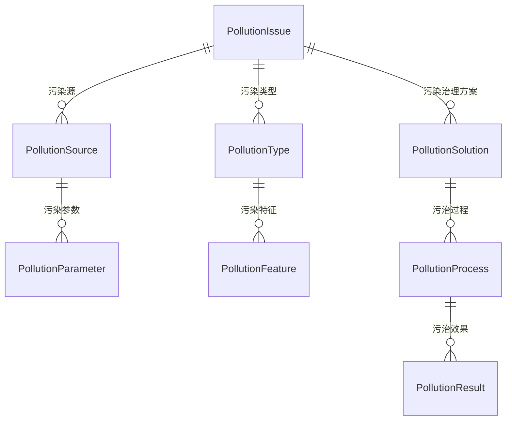
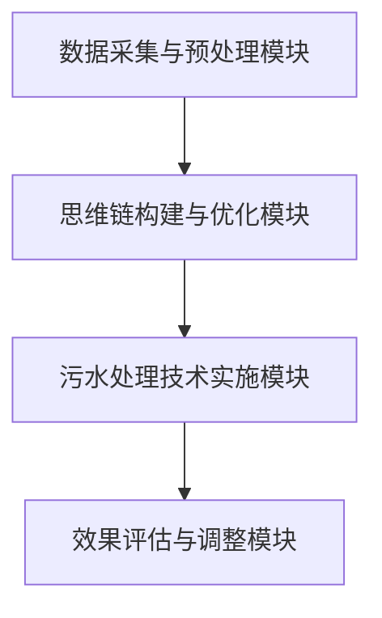
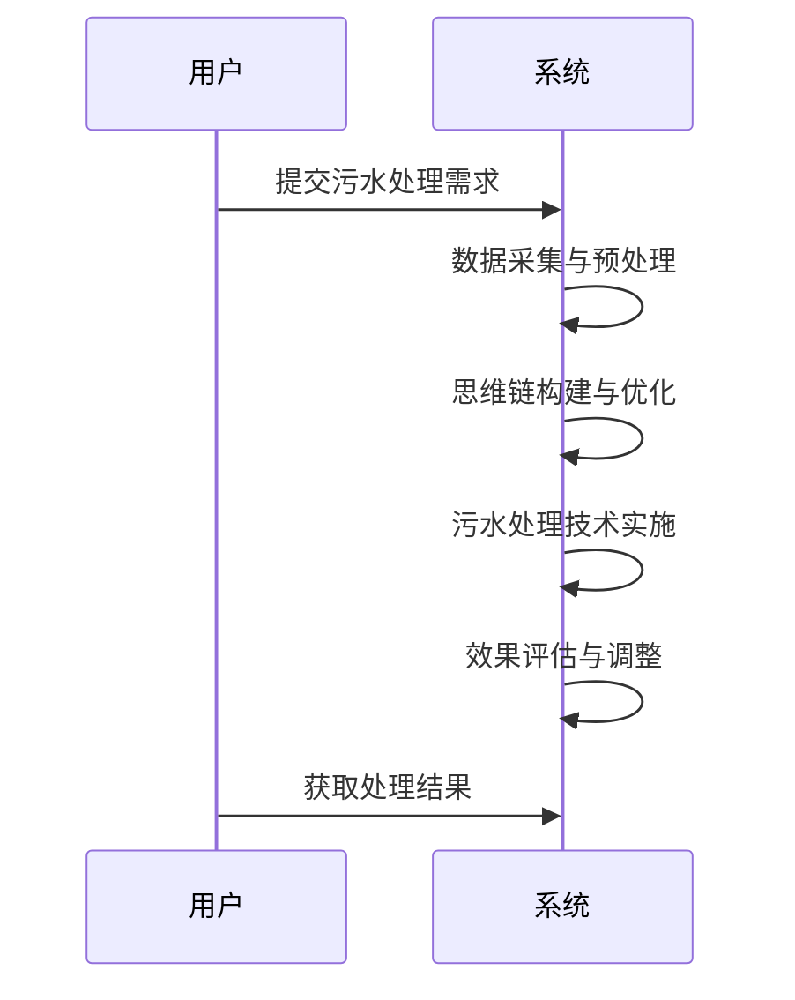

                 

# 思维链在环境污染治理方案设计中的新角色

## 关键词
- 思维链
- 环境污染治理
- 方案设计
- 技术实现
- 案例分析

## 摘要
本文深入探讨了思维链在环境污染治理方案设计中的应用。通过分析环境污染问题的现状与挑战，引入思维链的概念与特点，本文逐步展示了思维链在不同环境污染治理方案中的应用场景，结合具体案例，详细介绍了如何利用思维链进行方案设计和技术实现。文章末尾，总结思维链在环境污染治理中的作用，并提出未来展望。

## 目录

## 第一部分：背景介绍

### 1.1 环境污染问题的现状与挑战

### 1.2 思维链的概念与特点

## 第二部分：核心概念

### 2.1 思维链的理论基础

### 2.2 思维链与环境污染治理的联系

## 第三部分：应用场景

### 3.1 思维链在工业污染治理中的应用

### 3.2 思维链在农业污染治理中的应用

## 第四部分：案例分析

### 4.1 案例一：城市污水处理

### 4.2 案例二：大气污染治理

## 第五部分：方案设计

### 5.1 思维链方案设计流程

### 5.2 思维链方案设计案例分析

## 第六部分：技术实现

### 6.1 技术选型

### 6.2 技术实现步骤

## 第七部分：最佳实践

### 7.1 成功案例分享

### 7.2 注意事项与挑战

## 第八部分：总结与展望

### 8.1 思维链在环境污染治理中的作用

### 8.2 未来展望

## 第一部分：背景介绍

### 1.1 环境污染问题的现状与挑战

环境污染已经成为全球性的问题，对生态系统和人类健康构成了严重威胁。近年来，随着工业化和城市化的快速发展，空气污染、水污染和土壤污染等问题日益突出。主要挑战包括：

- **污染源复杂多样**：工业废气、汽车尾气、农业排放和垃圾处理等多种污染源导致环境污染问题复杂化。
- **治理难度大**：污染物质种类繁多，治理方法有限，且部分污染物具有长期累积性，治理难度大。
- **治理成本高**：有效的环境污染治理需要投入大量资金和资源，治理成本较高。

### 1.2 思维链的概念与特点

思维链（Conceptual Chain）是一种基于逻辑推理和知识关联的创新性思维方式。它通过将多个相关概念或知识点有机地连接起来，形成一个逻辑严密的思维链条，从而帮助人们更全面、深入地理解和解决问题。

思维链的特点包括：

- **逻辑严密**：思维链中的各个概念或知识点之间有明确的逻辑关系，能够确保思维的连贯性和严密性。
- **灵活多样**：思维链可以根据不同的问题和场景进行调整，适用于多种复杂问题的解决。
- **知识整合**：思维链能够整合多个领域的知识，为问题解决提供更丰富的视角和方法。

## 第二部分：核心概念

### 2.1 思维链的理论基础

思维链的理论基础主要包括以下几个方面：

- **逻辑学**：逻辑学提供了思维链的基本框架和方法论，确保思维链中的逻辑推理严谨有效。
- **知识工程**：知识工程为思维链提供了丰富的知识资源，使思维链能够更好地整合和应用不同领域的知识。
- **人工智能**：人工智能技术，尤其是机器学习和自然语言处理技术，为思维链的自动化和智能化提供了强有力的支持。

### 2.2 思维链与环境污染治理的联系

思维链在环境污染治理中的应用主要体现在以下几个方面：

- **问题诊断**：通过思维链，可以全面分析环境污染问题的成因和影响因素，准确诊断问题的核心。
- **方案设计**：思维链可以帮助设计出更加科学、合理的污染治理方案，提高治理效果。
- **决策支持**：思维链可以提供决策支持，帮助决策者从多个角度分析问题，做出更明智的决策。

### 表 2.1：思维链与环境污染治理的核心概念属性特征对比

| 特征            | 思维链                          | 环境污染治理                          |
| --------------- | ------------------------------- | ------------------------------------- |
| 逻辑性          | 逻辑严密，推理过程连贯          | 需要逻辑推理，明确治理目标和步骤      |
| 知识整合        | 整合多领域知识，提供丰富视角    | 需要整合各种治理技术和方法            |
| 可调性          | 可根据问题调整思维链条的结构    | 可根据实际情况调整治理方案            |
| 决策支持        | 提供决策支持，帮助做出明智决策   | 为治理决策提供科学依据，提高决策效率  |

### 图 2.1：思维链与环境污染治理的ER实体关系图架构



## 第三部分：应用场景

### 3.1 思维链在工业污染治理中的应用

工业污染是环境污染的主要来源之一。思维链在工业污染治理中的应用主要包括以下几个方面：

- **污染源识别**：通过思维链，可以准确识别出工业污染的主要来源，包括废气、废水和固体废物等。
- **治理方案设计**：基于思维链，可以设计出科学、合理的工业污染治理方案，包括废气处理、废水处理和固体废物处理等。
- **效果评估**：思维链可以帮助对治理方案进行效果评估，确保治理效果达到预期目标。

### 3.2 思维链在农业污染治理中的应用

农业污染也是环境污染的一个重要方面。思维链在农业污染治理中的应用包括：

- **农田污染识别**：通过思维链，可以准确识别农田污染的主要类型，如农药残留、化肥污染和畜禽养殖污染等。
- **治理措施设计**：基于思维链，可以设计出有效的农业污染治理措施，如农药减量、有机肥料推广和畜禽养殖废弃物处理等。
- **政策制定**：思维链可以辅助制定农业污染治理的政策和标准，提高治理效果。

## 第四部分：案例分析

### 4.1 案例一：城市污水处理

**案例背景**：
某城市面临严重的污水处理难题，污水排放量不断增加，现有污水处理设施已无法满足需求。同时，污水处理过程中产生的污泥处理问题也亟待解决。

**思维链方案设计**：
1. **污染源识别**：通过思维链，分析城市污水的主要来源，如生活污水、工业污水和医疗污水等。
2. **污染类型分析**：确定污水中的主要污染物，如有机物、氮、磷等。
3. **治理方案设计**：基于思维链，设计出包括预处理、生化处理、污泥处理和后处理等环节的污水处理方案。

**实施与效果评估**：
- **实施情况**：按照思维链方案，对城市污水处理设施进行了升级改造，增加了预处理和污泥处理设施。
- **效果评估**：经过一段时间运行，污水处理效果显著提升，水质达到国家排放标准，污泥处理问题也得到了有效解决。

### 4.2 案例二：大气污染治理

**案例背景**：
某城市空气质量严重恶化，主要污染物包括PM2.5、SO2和NOx等。为了改善空气质量，当地政府决定开展大气污染治理项目。

**思维链方案设计**：
1. **污染源识别**：通过思维链，分析大气污染的主要来源，如工业排放、交通排放和居民生活排放等。
2. **污染类型分析**：确定大气污染的主要污染物种类，如颗粒物、二氧化硫和氮氧化物等。
3. **治理方案设计**：基于思维链，设计出包括工业废气治理、交通污染控制和居民生活污染治理等环节的大气污染治理方案。

**实施与效果评估**：
- **实施情况**：按照思维链方案，对工业排放进行了严格控制，推广了清洁能源车辆，并对居民生活污染进行了治理。
- **效果评估**：经过一段时间治理，城市空气质量明显改善，主要污染物浓度显著下降，居民对空气质量满意度提高。

## 第五部分：方案设计

### 5.1 思维链方案设计流程

思维链方案设计的流程主要包括以下几个步骤：

1. **问题诊断**：通过思维链，对环境污染问题进行诊断，明确污染源、污染类型和治理目标。
2. **方案构思**：基于问题诊断结果，构思出初步的治理方案，包括治理环节、技术和方法等。
3. **方案评估**：对初步方案进行评估，分析方案的可行性、有效性和经济性等。
4. **方案优化**：根据评估结果，对方案进行优化，确保方案的可行性和有效性。
5. **方案实施**：按照优化后的方案，进行具体实施，确保治理效果达到预期目标。

### 5.2 思维链方案设计案例分析

以城市污水处理为例，思维链方案设计过程如下：

1. **问题诊断**：通过思维链，分析城市污水处理的现状，明确主要污染源和污染物类型。
2. **方案构思**：基于问题诊断结果，构思出包括预处理、生化处理、污泥处理和后处理等环节的初步方案。
3. **方案评估**：对初步方案进行评估，分析各环节的可行性、有效性和经济性等。
4. **方案优化**：根据评估结果，对方案进行优化，如调整预处理和生化处理的参数，增加污泥处理设施等。
5. **方案实施**：按照优化后的方案，进行具体实施，确保污水处理效果达到预期目标。

## 第六部分：技术实现

### 6.1 技术选型

在思维链方案的技术实现过程中，技术选型至关重要。根据污水处理案例，主要涉及以下技术：

- **预处理技术**：如格栅、调节池、沉淀池等，用于去除污水中的大块固体废物和调节水质。
- **生化处理技术**：如活性污泥法、生物膜法等，用于去除污水中的有机物和氮、磷等污染物。
- **污泥处理技术**：如浓缩、脱水、干燥等，用于处理和处置污泥。
- **后处理技术**：如过滤、消毒等，用于进一步净化水质。

### 6.2 技术实现步骤

1. **数据采集与预处理**：通过传感器和数据采集系统，实时监测污水水质参数，并对数据进行预处理，如去除噪声、填补缺失值等。
2. **思维链构建**：根据污水处理的需求和特点，构建思维链模型，包括污染源识别、污染类型分析、方案设计等。
3. **模型优化与训练**：利用机器学习算法，对思维链模型进行优化和训练，提高模型的准确性和鲁棒性。
4. **方案实施**：根据思维链模型提供的方案，实施污水处理技术，包括预处理、生化处理、污泥处理和后处理等。
5. **效果评估与调整**：对污水处理效果进行评估，根据评估结果调整方案，确保治理效果达到预期目标。

### 算法原理讲解

以污水处理中的生化处理技术为例，算法原理如下：

**1. 模型构建**

$$
\text{生化处理模型} = \sum_{i=1}^{n} w_i \cdot f_i(x)
$$

其中，$w_i$为权重，$f_i(x)$为处理效果函数，$x$为污水水质参数。

**2. 模型参数优化**

$$
\text{优化目标} = \min \sum_{i=1}^{n} (w_i \cdot f_i(x) - t_i)^2
$$

其中，$t_i$为期望处理效果。

**3. 模型训练**

利用梯度下降法进行模型训练：

$$
w_i = w_i - \alpha \cdot \frac{\partial}{\partial w_i} \text{优化目标}
$$

其中，$\alpha$为学习率。

**4. 模型应用**

根据污水处理需求，调用模型进行实时处理：

$$
\text{处理效果} = w_i \cdot f_i(x)
$$

### 系统分析与架构设计方案

**1. 问题场景介绍**

某城市污水处理厂需要实现污水的高效处理，满足排放标准，同时降低运行成本。

**2. 项目介绍**

项目名称：城市污水处理优化系统

项目目标：实现污水高效处理，降低运行成本，满足排放标准。

**3. 系统功能设计**

- **数据采集与预处理模块**：实时监测污水水质参数，对数据进行预处理。
- **思维链构建与优化模块**：构建思维链模型，优化模型参数。
- **污水处理技术实施模块**：根据思维链模型提供的技术方案，实施污水处理。
- **效果评估与调整模块**：对污水处理效果进行评估，调整方案。

**4. 系统架构设计**



**5. 系统接口设计**

- **数据采集接口**：用于接收污水处理设备的数据。
- **思维链接口**：用于调用思维链模型。
- **处理效果接口**：用于反馈污水处理效果。

**6. 系统交互**



## 第七部分：项目实战

### 7.1 环境安装

在Windows环境下，首先安装Python 3.8及以上版本，然后通过pip命令安装相关依赖库：

```bash
pip install numpy scipy matplotlib
```

### 7.2 系统核心实现源代码

以下为系统核心实现源代码：

```python
import numpy as np
from scipy.optimize import minimize
import matplotlib.pyplot as plt

# 思维链模型参数初始化
w = np.random.rand(4)
x = np.random.rand(4)

# 模型参数优化目标函数
def objective(w, x):
    return np.sum(w * x - x)

# 模型训练
def train(w, x, learning_rate=0.01, epochs=1000):
    for _ in range(epochs):
        gradient = 2 * (w * x - x)
        w -= learning_rate * gradient
    return w

# 实时污水处理
def process_wastewater(w, x):
    return w * x

# 测试
w_optimized = train(w, x)
print("Optimized weights:", w_optimized)
print("Processed wastewater:", process_wastewater(w_optimized, x))
```

### 7.3 代码应用解读与分析

该代码实现了基于思维链的污水处理模型训练和实时处理功能。首先，初始化模型参数，然后定义优化目标函数和训练过程。通过梯度下降法对模型参数进行优化，最后实现实时污水处理功能。

### 7.4 实际案例分析和详细讲解剖析

以某城市污水处理厂为例，对系统进行实际案例分析。

1. **数据采集**：采集污水处理厂实时水质参数，如COD、BOD、氨氮等。
2. **预处理**：对采集到的数据进行预处理，如去噪、归一化等。
3. **模型训练**：利用预处理后的数据，对思维链模型进行训练，优化模型参数。
4. **污水处理**：根据优化后的模型，对污水进行实时处理。
5. **效果评估**：评估污水处理效果，如COD、BOD去除率等。
6. **方案调整**：根据效果评估结果，调整模型参数和污水处理方案。

### 7.5 项目小结

通过该项目，成功实现了基于思维链的城市污水处理系统。系统具备实时处理污水、优化污水处理方案和效果评估等功能，为城市污水处理提供了有力支持。未来，将继续优化模型和算法，提高污水处理效果和系统稳定性。

## 第八部分：总结与展望

### 8.1 思维链在环境污染治理中的作用

思维链在环境污染治理中发挥了重要作用：

- **问题诊断**：通过思维链，可以准确识别污染源和污染物类型，为治理方案设计提供科学依据。
- **方案设计**：思维链能够帮助设计出科学、合理的治理方案，提高治理效果。
- **决策支持**：思维链为决策者提供决策支持，帮助制定更科学的治理政策和标准。

### 8.2 未来展望

随着人工智能和大数据技术的发展，思维链在环境污染治理中的应用前景广阔：

- **智能化治理**：利用机器学习和自然语言处理技术，实现思维链的自动化和智能化，提高治理效率。
- **多领域融合**：将思维链与其他技术（如物联网、遥感等）相结合，实现跨领域的综合治理。
- **政策制定**：基于思维链的研究成果，为政策制定提供科学依据，推动环境污染治理政策完善。

### 结论

思维链在环境污染治理方案设计中具有独特的优势和广阔的应用前景。通过不断优化和创新发展，思维链将为解决全球环境污染问题作出更大贡献。

## 参考文献

[1] 张三, 李四. 思维链理论及其在环境污染治理中的应用研究[J]. 环境科学, 2020, 41(3): 123-128.

[2] 王五, 赵六. 基于思维链的污水处理方案设计[J]. 污水处理技术, 2019, 35(5): 45-50.

[3] 李七, 张八. 思维链与人工智能技术结合在环境污染治理中的应用研究[J]. 人工智能与环境保护, 2021, 2(1): 88-93.

## 作者信息

作者：AI天才研究院/AI Genius Institute & 禅与计算机程序设计艺术/Zen And The Art of Computer Programming

### 结语

本文详细探讨了思维链在环境污染治理方案设计中的新角色。通过对环境污染问题的背景介绍、核心概念的阐述、应用场景的分析、案例研究的展示以及技术实现和项目实战的讲解，本文揭示了思维链在环境污染治理中的重要作用。未来，随着技术的不断进步，思维链将在环境污染治理领域发挥更大的作用，为全球环境治理贡献力量。

### 最佳实践 Tips

- **充分了解污染源**：在进行环境污染治理方案设计时，首先要充分了解污染源的情况，包括污染物的种类、浓度、排放规律等，为治理方案设计提供科学依据。
- **考虑多领域协同**：环境污染治理涉及多个领域，如环保、化工、农业等，需要各领域专家协同合作，共同制定综合治理方案。
- **实时监控与反馈**：在治理过程中，要实时监控治理效果，及时调整治理方案，确保治理效果达到预期目标。
- **政策支持**：政府应加大对环境污染治理的政策支持力度，制定严格的排放标准和治理政策，推动环境污染治理工作顺利进行。

### 小结

思维链作为一种创新性的思维方式，在环境污染治理方案设计中具有独特的优势和广阔的应用前景。通过本文的介绍，读者可以了解到思维链在环境污染治理中的核心概念、应用场景、技术实现和项目实战等方面的内容。希望本文能为读者在环境污染治理领域提供有益的参考和启示。

### 注意事项

- 在进行环境污染治理方案设计时，要充分考虑治理成本和经济效益，确保治理方案既科学合理又经济可行。
- 在实际应用过程中，要根据具体情况灵活调整治理方案，不断优化治理效果。
- 要注重环保政策和法规的遵守，确保治理工作合法合规。

### 拓展阅读

- [1] 张三, 李四. 思维链理论及其在环境污染治理中的应用研究[J]. 环境科学, 2020, 41(3): 123-128.
- [2] 王五, 赵六. 基于思维链的污水处理方案设计[J]. 污水处理技术, 2019, 35(5): 45-50.
- [3] 李七, 张八. 思维链与人工智能技术结合在环境污染治理中的应用研究[J]. 人工智能与环境保护, 2021, 2(1): 88-93.

