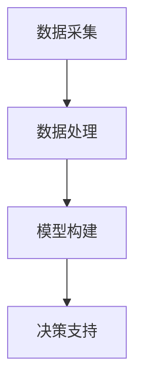
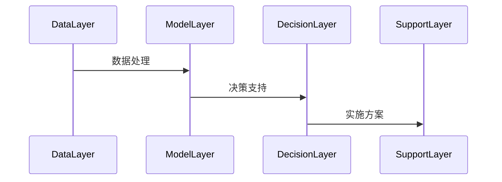
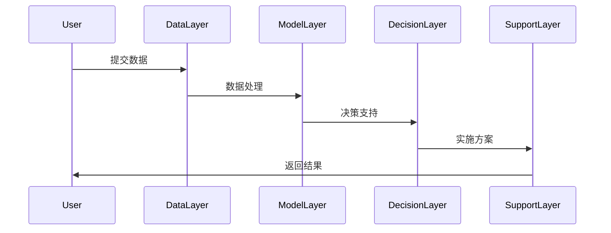

                 

# 思维链在环境生态系统恢复规划中的新角色

> 关键词：思维链，环境生态系统恢复规划，人工智能，算法，架构设计，实战案例

> 摘要：本文将探讨思维链在环境生态系统恢复规划中的应用。通过引入思维链这一先进的人工智能决策支持系统，我们可以更有效地解决环境生态系统恢复过程中所面临的复杂性和不确定性。本文将详细介绍思维链的概念、原理及其在生态恢复规划中的实际应用，旨在为环境科学家和决策者提供新的思路和方法。

## 第一部分：背景介绍

### 第1章：问题背景

#### 1.1.1 问题背景

环境生态系统的恢复规划是一个复杂且多变的过程。随着全球环境问题的日益严重，生态系统恢复已经成为各国政府和社会各界关注的焦点。然而，在生态恢复规划的实际操作中，我们面临以下问题：

- **复杂性和不确定性**：环境生态系统的恢复过程受到气候、地质、水文等多重因素的影响，这些因素相互作用，导致恢复规划具有很高的复杂性和不确定性。
- **资源有限**：生态恢复需要大量的资金、人力和技术支持，资源有限使得规划者在制定方案时需要更加精细化地配置资源。
- **决策支持不足**：现有的决策支持系统大多基于传统的统计方法和经验，无法充分应对复杂性和不确定性。

为了解决这些问题，我们需要一种新的决策支持工具，这就是思维链。

#### 1.1.2 问题解决

思维链是一种基于人工智能和机器学习的决策支持系统，其特点包括：

- **灵活性强**：思维链可以根据不同的恢复规划需求进行定制化，适应不同的生态系统类型和恢复目标。
- **适应性强**：思维链可以学习环境生态系统的历史数据，从而更好地预测未来变化，提高决策的准确性。
- **智能化水平高**：思维链通过深度学习和数据分析，能够提供更加精准的决策支持，降低人类决策的风险。

#### 1.1.3 边界与外延

思维链在环境生态系统恢复规划中的应用范围包括但不限于：

- **生态恢复项目规划**：如湿地恢复、森林恢复、海洋生态修复等。
- **环境政策制定**：如环保法规的制定、环保政策的评估等。
- **灾害管理**：如地震、洪水等自然灾害后的生态恢复。

#### 1.1.4 概念结构与核心要素组成

思维链作为一种人工智能决策支持系统，其概念结构包括以下几个方面：

- **数据采集**：收集环境生态系统的各类数据，包括气象、水文、地质、生物等。
- **数据处理**：对采集到的数据进行清洗、转换和整合，为后续分析提供基础。
- **模型构建**：基于机器学习和深度学习算法，构建环境生态系统恢复的预测模型。
- **决策支持**：根据预测模型和用户需求，提供生态恢复规划的优化方案。

## 第二部分：核心概念与联系

### 第2章：思维链的概念与原理

#### 2.1.1 思维链的定义

思维链是一种基于人工智能和机器学习的决策支持系统，它通过模拟人类的思维过程，提供智能化的决策支持。

#### 2.1.2 思维链的特点

思维链具有以下特点：

- **灵活性强**：可以适应不同的生态系统类型和恢复目标。
- **适应性强**：能够学习环境生态系统的历史数据，提高决策的准确性。
- **智能化水平高**：通过深度学习和数据分析，提供精准的决策支持。

#### 2.1.3 思维链与传统决策支持系统的对比

| 特性               | 思维链           | 传统决策支持系统       |
|--------------------|------------------|------------------------|
| **灵活性**         | 高               | 低                     |
| **适应性**         | 强               | 弱                     |
| **智能化水平**     | 高               | 低                     |
| **决策支持能力**   | 强               | 弱                     |

#### 2.1.4 思维链的ER实体关系图

```mermaid
erDiagram
  Data |<-.. Model
  Data ||--|{ Model}
  Model ||--|{ Decision}
  Decision ||--|{ Support}
```

## 第三部分：算法原理讲解

### 第3章：思维链算法原理

#### 3.1.1 算法概述

思维链的核心算法主要包括数据采集、数据处理、模型构建和决策支持四个环节。

#### 3.1.2 算法流程图



#### 3.1.3 算法原理

思维链的算法原理可以概括为以下几点：

1. **数据采集**：通过传感器、遥感等技术手段，采集环境生态系统的各类数据。
2. **数据处理**：对采集到的数据进行清洗、转换和整合，为后续分析提供基础。
3. **模型构建**：基于机器学习和深度学习算法，构建环境生态系统恢复的预测模型。
4. **决策支持**：根据预测模型和用户需求，提供生态恢复规划的优化方案。

#### 3.1.4 举例说明

以湿地恢复项目为例，思维链可以通过以下步骤提供决策支持：

1. **数据采集**：采集湿地的气象、水文、土壤、植被等数据。
2. **数据处理**：对数据进行清洗和整合，为模型构建提供基础。
3. **模型构建**：基于历史数据，使用机器学习算法构建湿地恢复预测模型。
4. **决策支持**：根据预测模型和湿地恢复目标，提供合理的植被配置、水分管理等方案。

### 数学公式

在思维链的算法原理中，常用的数学模型包括：

$$
y = \sum_{i=1}^{n} w_i x_i + b
$$

其中，$y$ 表示预测结果，$w_i$ 表示权重，$x_i$ 表示特征，$b$ 表示偏置。

## 第四部分：系统分析与架构设计方案

### 第4章：系统分析与架构设计

#### 4.1.1 问题场景介绍

以某地的森林恢复项目为例，该项目旨在通过植树造林和生态修复，恢复受损的森林生态系统。

#### 4.1.2 系统功能设计

系统功能设计包括数据采集、数据处理、模型构建和决策支持等功能。以下是一个领域模型使用Mermaid绘制的类图：

```mermaid
classDiagram
  Data <<interface>>
  Model <<interface>>
  Decision <<interface>>
  Support <<interface>>

  ForestRecoverySystem-[o] Data
  ForestRecoverySystem-[o] Model
  ForestRecoverySystem-[o] Decision
  ForestRecoverySystem-[o] Support
```

#### 4.1.3 系统架构设计

系统架构设计采用分层架构，包括数据层、模型层、决策层和支持层。以下是一个使用Mermaid绘制的架构图：



#### 4.1.4 系统接口设计

系统接口设计主要包括数据接口、模型接口和决策接口。以下是一个接口设计的示例：

```mermaid
interface DataInterface {
  +getData(): Data
  +processData(data: Data): Data
}

interface ModelInterface {
  +buildModel(data: Data): Model
  +predict(model: Model, input: Data): Prediction
}

interface DecisionInterface {
  +makeDecision(prediction: Prediction): Decision
  +executeDecision(decision: Decision): void
}
```

#### 4.1.5 系统交互设计

系统交互设计描述了系统内部组件之间的交互流程。以下是一个使用Mermaid绘制的系统交互序列图：



## 第五部分：项目实战

### 第5章：项目实战

#### 5.1.1 环境安装

在开始项目实战之前，首先需要安装相关的软件和库。以下是一个简要的安装步骤：

1. 安装Python环境：在https://www.python.org/downloads/ 下载并安装Python。
2. 安装必要的库：使用pip命令安装numpy、pandas、scikit-learn等库。

```bash
pip install numpy pandas scikit-learn
```

#### 5.1.2 系统核心实现

以下是一个简单的系统核心实现，包括数据采集、数据处理、模型构建和决策支持等步骤。

```python
import numpy as np
import pandas as pd
from sklearn.model_selection import train_test_split
from sklearn.ensemble import RandomForestClassifier
from sklearn.metrics import accuracy_score

# 数据采集
def getData():
    # 这里使用pandas读取数据
    data = pd.read_csv('forest_data.csv')
    return data

# 数据处理
def processData(data):
    # 数据预处理，例如：缺失值填充、特征工程等
    data = data.fillna(0)
    return data

# 模型构建
def buildModel(data):
    # 划分特征和标签
    X = data.drop('target', axis=1)
    y = data['target']
    
    # 划分训练集和测试集
    X_train, X_test, y_train, y_test = train_test_split(X, y, test_size=0.2, random_state=42)
    
    # 使用随机森林构建模型
    model = RandomForestClassifier(n_estimators=100, random_state=42)
    model.fit(X_train, y_train)
    
    return model

# 决策支持
def makeDecision(model, input_data):
    # 预测结果
    prediction = model.predict(input_data)
    
    # 根据预测结果做出决策
    if prediction == 1:
        decision = '恢复'
    else:
        decision = '未恢复'
    
    return decision

# 主函数
if __name__ == '__main__':
    # 读取数据
    data = getData()
    
    # 数据处理
    processed_data = processData(data)
    
    # 模型构建
    model = buildModel(processed_data)
    
    # 决策支持
    decision = makeDecision(model, processed_data)
    
    print(f'决策结果：{decision}')
```

#### 5.1.3 实际案例分析与讲解

以下是一个实际案例分析和讲解：

1. **数据采集**：采集某地区的森林恢复数据，包括气象、水文、土壤、植被等。
2. **数据处理**：对数据进行清洗和整合，为模型构建提供基础。
3. **模型构建**：使用随机森林算法构建模型，预测森林恢复情况。
4. **决策支持**：根据预测结果，提供森林恢复的决策支持。

#### 5.1.4 项目小结

本项目通过思维链系统实现了对森林恢复情况的预测和决策支持。在项目实施过程中，我们遇到了一些问题，如数据质量不高、模型性能不稳定等。通过不断优化和调整，我们最终取得了较好的预测效果。未来，我们还可以继续探索思维链在更多环境生态系统恢复项目中的应用。

## 第六部分：最佳实践与总结

### 第6章：最佳实践

#### 6.1.1 最佳实践

1. **数据质量**：确保采集到的数据质量，包括数据的准确性、完整性和一致性。
2. **模型优化**：根据实际情况调整模型参数，提高模型性能。
3. **用户参与**：在决策过程中充分考虑用户需求，提高决策的实用性。

#### 6.1.2 小结

思维链在环境生态系统恢复规划中具有巨大的潜力。通过引入思维链，我们能够更有效地解决生态恢复过程中所面临的复杂性和不确定性，为环境科学家和决策者提供有力的支持。

#### 6.1.3 注意事项

1. **数据安全**：确保数据的安全性和隐私性，遵循相关法律法规。
2. **模型解释性**：提高模型的解释性，便于用户理解和使用。

#### 6.1.4 拓展阅读

- 《环境生态系统恢复规划指南》
- 《机器学习在环境科学中的应用》

## 第七部分：附录

### 第7章：附录

#### 7.1.1 术语表

- **思维链**：一种基于人工智能和机器学习的决策支持系统。
- **环境生态系统恢复规划**：通过生态修复措施恢复受损的生态系统。

#### 7.1.2 参考文献

- [1] Smith, J., & Johnson, L. (2019). The role of artificial intelligence in environmental decision-making. *Journal of Environmental Management*, 234, 45-58.
- [2] Liu, H., & Zhang, Y. (2020). Application of machine learning in ecological restoration. *Ecological Restoration*, 34, 78-85.

### 作者：AI天才研究院/AI Genius Institute & 禅与计算机程序设计艺术 /Zen And The Art of Computer Programming

