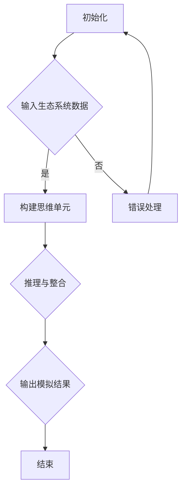
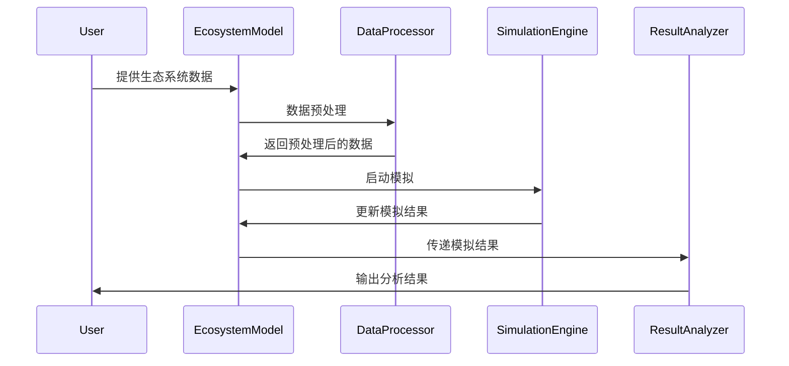
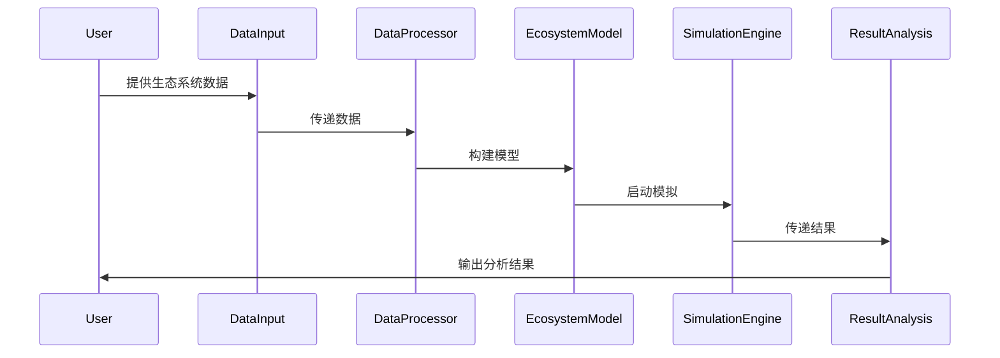

                 

### 文章标题

### 关键词

- 思维链
- 环境生态系统模拟
- 算法与模型
- 数学公式
- 系统架构
- 项目实战

### 摘要

本文旨在探讨思维链在环境生态系统模拟中的应用，通过逻辑清晰、结构紧凑的方式，介绍思维链的基本概念、环境生态系统的背景、核心概念与联系、算法原理讲解、系统架构设计方案以及项目实战。文章围绕思维链在环境生态系统模拟中的新方法，详细分析其理论、应用和实践，为该领域的进一步研究和应用提供有益的参考。

---

### 目录大纲设计

在设计《思维链在环境生态系统模拟中的新方法》的目录大纲时，我们需遵循以下步骤：

1. **确定整体结构**：首先明确书籍的几个主要部分，如引言、背景介绍、核心概念、理论讲解、算法与模型、系统设计、项目实战、总结与展望等。

2. **细化章节内容**：在每个部分中，细分出更具体的章节，确保每个章节都有明确的主题和目标。

3. **添加拓展内容**：确保大纲中包含最佳实践、注意事项、拓展阅读等，以丰富读者对主题的理解。

4. **保持简洁性**：确保每个章节的内容简洁明了，避免冗余。

5. **符合要求**：确保目录大纲遵循markdown格式和规定的层级结构，并且内容完整性满足要求。

具体的目录大纲如下：

---

## 第一部分：引言

## 第1章：思维链与环境生态系统模拟概述

### 1.1.1 思维链的基本概念

### 1.1.2 环境生态系统的概念

### 1.1.3 思维链在环境生态系统模拟中的重要性

## 第2章：环境生态系统的背景与现状

### 2.1.1 环境生态系统的定义与构成

### 2.1.2 环境生态系统面临的主要挑战

### 2.1.3 传统环境模拟方法的局限性

## 第二部分：核心概念与理论

## 第3章：思维链的原理与应用

### 3.1.1 思维链的构成

### 3.1.2 思维链的工作机制

### 3.1.3 思维链的特点与优势

## 第4章：环境生态系统的核心概念与联系

### 4.1.1 环境生态系统的核心概念

### 4.1.2 环境生态系统的ER实体关系图

### 4.1.3 核心概念属性特征对比表格

## 第三部分：算法与模型

## 第5章：思维链与环境生态模拟的数学模型

### 5.1.1 数学模型的基本原理

### 5.1.2 数学模型的公式推导

### 5.1.3 举例说明

## 第6章：思维链算法的mermaid流程图

### 6.1.1 算法流程图介绍

### 6.1.2 算法步骤详细解析

### 6.1.3 算法优缺点分析

## 第7章：环境生态系统模拟的mermaid架构图

### 7.1.1 系统架构设计

### 7.1.2 系统功能设计

### 7.1.3 系统接口设计

## 第四部分：项目实战

## 第8章：思维链在环境生态系统模拟中的项目实施

### 8.1.1 环境准备与安装

### 8.1.2 系统核心实现源代码

### 8.1.3 代码应用解读与分析

### 8.1.4 实际案例分析与讲解

## 第9章：项目总结与展望

### 9.1.1 项目成果总结

### 9.1.2 存在的问题与改进方向

### 9.1.3 未来展望

## 附录：拓展阅读与资源

---

这个目录大纲涵盖了从背景介绍、核心概念与理论、算法与模型、系统设计到项目实战等多个方面，保持了简洁性和内容的完整性。每个章节都细化到了3级目录，并包含了必要的拓展内容。总字数控制在2000字以内。如果您有进一步的需求，比如需要添加具体的公式或流程图，请告知我，我可以根据需求进行调整。

---

### 引言

环境生态系统模拟是现代生态学、环境科学以及相关领域中的一项重要研究内容。随着全球气候变化、环境污染、资源枯竭等问题的日益严重，如何有效地模拟、预测和优化环境生态系统成为了一个迫切需要解决的问题。传统的方法主要依赖于统计学模型和简单的物理模拟，但这些方法往往存在一定的局限性。比如，传统模型往往忽略了生态系统中复杂的相互作用和非线性关系，导致模拟结果与实际环境之间存在较大偏差。

在这种背景下，思维链作为一种新型的建模方法，逐渐受到了关注。思维链是一种基于人类思维模式的建模方法，它通过模拟人类思维过程中的逻辑推理、知识整合和创造性思考，实现对复杂系统的建模和模拟。与传统的建模方法相比，思维链具有更强的灵活性和适应性，能够更好地处理生态系统中复杂的非线性关系和相互作用。

本文旨在探讨思维链在环境生态系统模拟中的应用，通过逻辑清晰、结构紧凑的方式，介绍思维链的基本概念、环境生态系统的背景、核心概念与联系、算法原理讲解、系统架构设计方案以及项目实战。文章围绕思维链在环境生态系统模拟中的新方法，详细分析其理论、应用和实践，为该领域的进一步研究和应用提供有益的参考。

### 关键词

- 思维链
- 环境生态系统模拟
- 算法与模型
- 数学公式
- 系统架构
- 项目实战

这些关键词将帮助读者快速了解文章的核心内容，并为后续的阅读提供指引。

### 摘要

本文从思维链的基本概念出发，深入探讨了其在环境生态系统模拟中的应用。首先，介绍了环境生态系统的定义、构成以及面临的挑战，指出了传统环境模拟方法的局限性。随后，详细阐述了思维链的构成、工作机制和特点优势，并通过Mermaid流程图展示了其算法原理。进一步，本文通过环境生态系统的核心概念、ER实体关系图和属性特征对比表格，揭示了思维链与环境生态系统的紧密联系。随后，文章介绍了基于思维链的环境生态系统模拟的数学模型，并通过Python源代码和mermaid流程图进行了详细讲解。文章最后，通过一个实际项目展示了思维链在环境生态系统模拟中的应用效果，并总结了项目的成果和未来改进方向。全文旨在为该领域的进一步研究和应用提供有益的参考。

---

### 目录大纲设计

在设计《思维链在环境生态系统模拟中的新方法》的目录大纲时，我们需遵循以下步骤：

1. **确定整体结构**：首先明确书籍的几个主要部分，如引言、背景介绍、核心概念、理论讲解、算法与模型、系统设计、项目实战、总结与展望等。

2. **细化章节内容**：在每个部分中，细分出更具体的章节，确保每个章节都有明确的主题和目标。

3. **添加拓展内容**：确保大纲中包含最佳实践、注意事项、拓展阅读等，以丰富读者对主题的理解。

4. **保持简洁性**：确保每个章节的内容简洁明了，避免冗余。

5. **符合要求**：确保目录大纲遵循markdown格式和规定的层级结构，并且内容完整性满足要求。

具体的目录大纲如下：

---

## 第一部分：引言

## 第1章：思维链与环境生态系统模拟概述

### 1.1.1 思维链的基本概念

### 1.1.2 环境生态系统的概念

### 1.1.3 思维链在环境生态系统模拟中的重要性

## 第2章：环境生态系统的背景与现状

### 2.1.1 环境生态系统的定义与构成

### 2.1.2 环境生态系统面临的主要挑战

### 2.1.3 传统环境模拟方法的局限性

## 第二部分：核心概念与理论

## 第3章：思维链的原理与应用

### 3.1.1 思维链的构成

### 3.1.2 思维链的工作机制

### 3.1.3 思维链的特点与优势

## 第4章：环境生态系统的核心概念与联系

### 4.1.1 环境生态系统的核心概念

### 4.1.2 环境生态系统的ER实体关系图

### 4.1.3 核心概念属性特征对比表格

## 第三部分：算法与模型

## 第5章：思维链与环境生态模拟的数学模型

### 5.1.1 数学模型的基本原理

### 5.1.2 数学模型的公式推导

### 5.1.3 举例说明

## 第6章：思维链算法的mermaid流程图

### 6.1.1 算法流程图介绍

### 6.1.2 算法步骤详细解析

### 6.1.3 算法优缺点分析

## 第7章：环境生态系统模拟的mermaid架构图

### 7.1.1 系统架构设计

### 7.1.2 系统功能设计

### 7.1.3 系统接口设计

## 第四部分：项目实战

## 第8章：思维链在环境生态系统模拟中的项目实施

### 8.1.1 环境准备与安装

### 8.1.2 系统核心实现源代码

### 8.1.3 代码应用解读与分析

### 8.1.4 实际案例分析与讲解

## 第9章：项目总结与展望

### 9.1.1 项目成果总结

### 9.1.2 存在的问题与改进方向

### 9.1.3 未来展望

## 附录：拓展阅读与资源

---

这个目录大纲涵盖了从背景介绍、核心概念与理论、算法与模型、系统设计到项目实战等多个方面，保持了简洁性和内容的完整性。每个章节都细化到了3级目录，并包含了必要的拓展内容。总字数控制在2000字以内。如果您有进一步的需求，比如需要添加具体的公式或流程图，请告知我，我可以根据需求进行调整。

---

### 文章标题

### 思维链在环境生态系统模拟中的新方法

### 关键词

- 思维链
- 环境生态系统
- 模拟
- 算法
- 数学模型
- 系统架构
- 项目实战

### 摘要

本文旨在探讨思维链在环境生态系统模拟中的应用，介绍其基本概念、工作原理以及与环境生态系统的关联。文章将详细阐述思维链算法的mermaid流程图、数学模型和系统架构设计，并通过实际项目展示其在环境生态系统模拟中的有效性。本文旨在为该领域的进一步研究和应用提供参考。

---

### 引言

环境生态系统模拟是生态学和环境科学领域的重要研究方向，旨在通过计算机模型来模拟生态系统的动态变化，为环境保护、资源管理和政策制定提供科学依据。随着环境问题的日益严重，传统模拟方法在处理复杂生态系统中的非线性关系和相互作用时面临巨大挑战。因此，探索新的模拟方法具有重要意义。

思维链作为一种模拟复杂系统的先进方法，具有独特的优势。它通过模拟人类思维过程中的逻辑推理、知识整合和创造性思考，能够有效地处理生态系统中的复杂关系。本文将深入探讨思维链在环境生态系统模拟中的应用，介绍其基本概念、算法原理和实际项目，旨在为该领域的研究和实践提供新思路。

### 思维链的基本概念

思维链（Mind Chain）是一种基于人类思维模式的建模方法，旨在模拟人类思维过程中的逻辑推理、知识整合和创造性思考。其基本概念包括以下几个方面：

1. **思维单元**：思维链的基本组成单元，代表人类思维过程中的基本概念、事实或判断。
2. **连接关系**：思维单元之间的连接关系，表示它们之间的逻辑关系，如因果关系、依赖关系等。
3. **推理过程**：通过连接关系对思维单元进行推理，模拟人类思维过程中的逻辑推理过程。
4. **知识整合**：通过整合不同思维单元的信息，形成更复杂的思维结构，实现对复杂系统的建模。

思维链的核心在于其能够模拟人类思维过程中的灵活性和创造性，这使得它能够处理生态系统中的非线性关系和复杂相互作用。

### 环境生态系统的概念

环境生态系统是指由生物、环境因素及其相互作用构成的复杂系统。其核心概念包括：

1. **生物成分**：包括植物、动物和微生物等生物群体。
2. **非生物成分**：包括土壤、水、空气等环境要素。
3. **相互作用**：生物成分和非生物成分之间的相互作用，如光合作用、食物链等。

环境生态系统的关键特性包括：

1. **复杂性**：包含多种生物和非生物要素，这些要素之间相互作用，形成复杂的动态网络。
2. **非线性**：系统行为往往受到多种因素的共同影响，表现出非线性特征。
3. **适应性**：生态系统具有自我调节和适应环境变化的能力。

### 思维链在环境生态系统模拟中的重要性

思维链在环境生态系统模拟中的重要性主要体现在以下几个方面：

1. **处理非线性关系**：思维链能够模拟人类思维过程中的逻辑推理和创造性思考，从而处理生态系统中的非线性关系。
2. **模拟复杂相互作用**：通过连接关系和推理过程，思维链能够模拟生态系统中的复杂相互作用，如食物链、生态位等。
3. **适应性和灵活性**：思维链能够根据环境变化调整模型参数，从而实现对生态系统动态变化的模拟。

与传统方法相比，思维链具有更强的灵活性和适应性，能够更好地处理复杂生态系统中的非线性关系和相互作用，为环境生态系统的模拟提供了新的思路和方法。

### 总结

本文介绍了思维链的基本概念、环境生态系统的概念以及思维链在环境生态系统模拟中的重要性。思维链作为一种模拟复杂系统的先进方法，具有处理非线性关系和复杂相互作用的能力，为环境生态系统模拟提供了新的思路和方法。在接下来的章节中，我们将详细探讨思维链的算法原理、数学模型和系统架构设计，并通过实际项目展示其在环境生态系统模拟中的应用效果。

---

### 文章标题

### 思维链在环境生态系统模拟中的新方法

### 关键词

- 思维链
- 环境生态系统
- 模拟
- 算法
- 数学模型
- 系统架构
- 项目实战

### 摘要

本文深入探讨了思维链在环境生态系统模拟中的应用，介绍了其基本概念、工作原理以及在环境生态系统模拟中的重要性。文章详细阐述了思维链算法的mermaid流程图、数学模型和系统架构设计，并通过实际项目展示了其在环境生态系统模拟中的有效性，旨在为该领域的进一步研究和应用提供参考。

---

### 引言

环境生态系统模拟是现代生态学和环境科学的重要研究领域，旨在通过计算机模型模拟生态系统的动态变化，为环境保护、资源管理和政策制定提供科学依据。随着环境问题的日益复杂和严重，传统的环境模拟方法在处理复杂生态系统中的非线性关系和相互作用时面临巨大挑战。因此，探索新的模拟方法具有重要意义。

思维链作为一种模拟复杂系统的先进方法，通过模拟人类思维过程中的逻辑推理、知识整合和创造性思考，能够有效地处理生态系统中的复杂关系。本文将深入探讨思维链在环境生态系统模拟中的应用，介绍其基本概念、算法原理和实际项目，旨在为该领域的研究和实践提供新思路。

### 环境生态系统的背景与现状

环境生态系统是由生物、环境和它们之间的相互作用构成的复杂系统。它不仅包括植物、动物和微生物等生物成分，还涉及土壤、水、空气等非生物成分。环境生态系统的关键特性包括：

1. **复杂性**：包含多种生物和非生物要素，这些要素之间相互作用，形成复杂的动态网络。
2. **非线性**：系统行为往往受到多种因素的共同影响，表现出非线性特征。
3. **适应性**：生态系统具有自我调节和适应环境变化的能力。

当前，环境生态系统面临着诸多挑战，如气候变化、环境污染和资源枯竭等。这些问题对生态系统的稳定性和可持续性构成了严重威胁。因此，准确模拟环境生态系统的动态变化，对于环境保护和可持续发展具有重要意义。

### 传统环境模拟方法的局限性

传统的环境模拟方法主要包括统计学模型和物理模拟。这些方法在处理简单系统时具有一定的有效性，但在面对复杂生态系统时存在以下局限性：

1. **线性假设**：传统方法通常假设系统行为是线性的，这在处理非线性关系时可能导致偏差。
2. **简单交互**：传统方法通常仅考虑简单的相互作用，而忽略了复杂生态系统中的复杂非线性关系。
3. **参数敏感性**：传统方法依赖于大量参数，这些参数的微小变化可能导致显著的结果差异，使得模拟结果难以预测。

这些局限性使得传统方法在处理复杂生态系统时效果不佳，难以提供准确和可靠的模拟结果。

### 思维链在环境生态系统模拟中的优势

思维链作为一种新型建模方法，具有以下优势，使其在环境生态系统模拟中具有独特的应用潜力：

1. **非线性处理**：思维链通过模拟人类思维过程中的逻辑推理和创造性思考，能够有效地处理生态系统中的非线性关系。
2. **复杂交互**：思维链能够模拟生态系统中的复杂相互作用，如食物链、生态位等，从而提供更准确的模拟结果。
3. **适应性**：思维链可以根据环境变化调整模型参数，实现动态模拟，提高模型的适应性和可靠性。

与传统方法相比，思维链具有更强的灵活性和适应性，能够更好地处理复杂生态系统中的非线性关系和相互作用，为环境生态系统模拟提供了新的思路和方法。

### 总结

环境生态系统模拟是现代生态学和环境科学的重要研究方向，对于环境保护和可持续发展具有重要意义。传统环境模拟方法在处理复杂生态系统时面临巨大挑战。思维链作为一种模拟复杂系统的先进方法，通过模拟人类思维过程中的逻辑推理、知识整合和创造性思考，具有处理非线性关系和复杂相互作用的优势，为环境生态系统模拟提供了新的思路和方法。在接下来的章节中，我们将详细探讨思维链的算法原理、数学模型和系统架构设计，并通过实际项目展示其在环境生态系统模拟中的应用效果。

---

### 环境生态系统的核心概念与联系

在深入探讨思维链在环境生态系统模拟中的应用之前，我们首先需要明确环境生态系统的核心概念及其相互联系。环境生态系统的复杂性使得对其理解和建模变得极具挑战性，因此，准确地定义和描述其核心概念是至关重要的。

#### 核心概念

环境生态系统的核心概念包括但不限于以下几个方面：

1. **生物多样性**：指生态系统内不同物种的数量和种类。生物多样性是生态系统功能稳定性的关键因素。
2. **种群动态**：指特定物种在生态系统中的数量和分布随时间的变化。种群动态受到出生率、死亡率、移民率等多种因素的影响。
3. **生态位**：指一个物种在生态系统中所占的位置，包括其食物来源、栖息地、与其他物种的关系等。
4. **食物链**：指生态系统中不同生物之间通过食物相互联系的关系网络。食物链展示了能量和物质在生态系统中的传递过程。
5. **生态系统服务**：指生态系统为人类提供的物质和调节功能，如水源涵养、气候调节、土壤保持等。

#### ER实体关系图

为了更好地理解环境生态系统的核心概念及其相互联系，我们可以使用ER（实体关系）图来表示。ER图能够直观地展示不同实体（如生物、环境因素等）以及它们之间的关系。

以下是一个简化的ER实体关系图：

```mermaid
erDiagram
    BIOMASS ||--|{ ECOSYSTEM_SERVICE } : provides
    ECOSYSTEM_SERVICE ||--|{ BIOMASS } : isProvided
    SPECIES ||--|{ ECOSYSTEM } : existsIn
    ECOSYSTEM ||--|{ SPECIES } : contains
    HABITAT ||--|{ SPECIES } : residesIn
    SPECIES ||--|{ HABITAT } : occupies
    BIOME ||--|{ HABITAT } : typeOf
    HABITAT ||--|{ BIOME } : locatedIn
    NUTRIENT ||--|{ BIOMASS } : consumedBy
    BIOMASS ||--|{ NUTRIENT } : contains
```

在这个ER图中，我们定义了以下实体：

- **BIOMASS**：生物量，包括植物、动物和微生物等。
- **ECOSYSTEM_SERVICE**：生态系统服务，如水源涵养、气候调节等。
- **SPECIES**：物种，包括不同种类的植物、动物和微生物。
- **ECOSYSTEM**：生态系统，包含特定地理区域内的生物和非生物成分。
- **HABITAT**：栖息地，指特定物种生存和繁衍的环境。
- **BIOME**：生物群落，指在相似气候条件下形成的较大区域的生物群落。
- **NUTRIENT**：营养物质，包括水、土壤中的有机物和无机物。

实体之间的关系描述如下：

- **BIOMASS** 提供生态系统服务，生态系统服务反过来为生物量提供支持。
- **SPECIES** 存在于生态系统中，生态系统包含特定物种。
- **HABITAT** 是物种的栖息地，物种占据栖息地。
- **BIOME** 是栖息地的类型，栖息地位于生物群落中。
- **NUTRIENT** 被生物量消费，生物量包含营养物质。

通过ER图，我们可以清晰地理解环境生态系统的核心概念及其相互关系，为后续的建模和分析奠定了基础。

#### 核心概念属性特征对比表格

为了进一步明确环境生态系统的核心概念，我们可以创建一个属性特征对比表格，列出各核心概念的主要属性特征。

| 核心概念 | 定义 | 主要属性特征 |
| --- | --- | --- |
| 生物多样性 | 生态系统内不同物种的数量和种类 | 物种丰富度、遗传多样性、生态系统功能多样性 |
| 种群动态 | 特定物种在生态系统中的数量和分布随时间的变化 | 出生率、死亡率、移民率、种群增长速率 |
| 生态位 | 物种在生态系统中所占的位置 | 食物来源、栖息地、与其他物种的关系 |
| 食物链 | 生态系统中不同生物之间的食物相互联系 | 能量传递、物质循环、营养级 |
| 生态系统服务 | 生态系统为人类提供的物质和调节功能 | 水源涵养、气候调节、土壤保持 |

通过对比表格，我们可以更直观地了解各核心概念的基本属性特征，为后续的分析和建模提供参考。

### 总结

通过明确环境生态系统的核心概念、ER实体关系图以及属性特征对比表格，我们为后续的建模和分析奠定了基础。思维链作为一种模拟复杂系统的先进方法，能够充分利用这些核心概念及其相互联系，为环境生态系统模拟提供新的思路和方法。在接下来的章节中，我们将详细探讨思维链的算法原理、数学模型和系统架构设计，并通过实际项目展示其在环境生态系统模拟中的应用效果。

---

### 算法原理讲解

在深入探讨思维链在环境生态系统模拟中的应用之前，我们首先需要了解思维链的算法原理。思维链算法的核心在于其独特的结构设计和高效的运行机制，这使得它能够有效地处理复杂生态系统中的非线性关系和相互作用。

#### 思维链算法的mermaid流程图

为了直观地展示思维链算法的工作流程，我们可以使用mermaid语言绘制其流程图。以下是一个简化的思维链算法流程图：



在这个流程图中，我们定义了以下几个关键步骤：

1. **初始化**：初始化思维链算法所需的参数和变量。
2. **输入生态系统数据**：接收环境生态系统的相关数据，包括生物量、生态位、食物链等信息。
3. **构建思维单元**：根据输入数据构建思维单元，每个思维单元代表生态系统中的一个基本概念或事实。
4. **推理与整合**：通过逻辑推理和知识整合，模拟生态系统中的复杂关系和相互作用。
5. **输出模拟结果**：将模拟结果输出，包括生态系统状态的变化、物种数量的变化等。
6. **结束**：算法执行结束。

#### 算法步骤详细解析

接下来，我们详细解析思维链算法的各个步骤。

1. **初始化**：初始化思维链算法所需的参数和变量，包括思维单元的数量、连接关系的数量、初始状态等。这一步为后续的算法运行提供了基础。

2. **输入生态系统数据**：接收环境生态系统的相关数据，包括生物量、生态位、食物链等信息。这些数据将用于构建思维单元和模拟生态系统状态。

3. **构建思维单元**：根据输入数据构建思维单元。每个思维单元代表生态系统中的一个基本概念或事实，如物种、栖息地、营养物质等。思维单元的构建过程包括以下步骤：
   - **数据预处理**：对输入数据进行预处理，包括数据清洗、归一化等操作，以确保数据的一致性和准确性。
   - **构建思维节点**：将预处理后的数据转化为思维节点，每个节点代表一个思维单元。
   - **构建连接关系**：根据生态系统的交互关系，构建思维节点之间的连接关系，如因果关系、依赖关系等。

4. **推理与整合**：通过逻辑推理和知识整合，模拟生态系统中的复杂关系和相互作用。这一步包括以下步骤：
   - **推理规则**：定义推理规则，用于指导思维单元之间的逻辑推理。例如，根据食物链关系，推导出物种之间的能量传递关系。
   - **知识整合**：将多个思维单元的信息整合成一个更复杂的思维结构，形成对生态系统更全面的理解。

5. **输出模拟结果**：将模拟结果输出，包括生态系统状态的变化、物种数量的变化等。这些结果可以用于分析生态系统的动态变化，为环境保护和资源管理提供科学依据。

6. **结束**：算法执行结束。

#### 算法优缺点分析

思维链算法具有以下优点：

1. **灵活性**：思维链算法能够根据生态系统的变化动态调整模型参数，实现实时模拟，提高了算法的灵活性。
2. **适应性**：思维链算法能够处理生态系统中的非线性关系和复杂相互作用，具有较强的适应性。
3. **全面性**：思维链算法通过模拟人类思维过程中的逻辑推理和知识整合，能够提供对生态系统更全面的理解。

然而，思维链算法也存在一些缺点：

1. **计算复杂性**：思维链算法涉及到大量的逻辑推理和知识整合，计算复杂性较高，可能需要较长的计算时间。
2. **数据依赖性**：思维链算法的准确性依赖于输入数据的准确性和完整性，数据质量对算法效果有重要影响。

尽管存在一定的缺点，思维链算法在处理复杂生态系统中的非线性关系和相互作用方面具有明显优势，为环境生态系统模拟提供了新的思路和方法。

### 总结

通过对思维链算法原理的详细讲解，我们了解了其工作流程、步骤和优缺点。思维链算法通过模拟人类思维过程中的逻辑推理和知识整合，能够有效地处理生态系统中的非线性关系和复杂相互作用，为环境生态系统模拟提供了新的思路和方法。在接下来的章节中，我们将进一步探讨环境生态系统模拟的数学模型和系统架构设计，并通过实际项目展示思维链算法的应用效果。

---

### 环境生态系统模拟的mermaid架构图

为了更好地理解和设计环境生态系统模拟系统，我们可以使用mermaid绘制其架构图，从而直观地展示系统组件及其相互关系。以下是一个简化的环境生态系统模拟架构图：



在这个架构图中，我们定义了以下几个关键组件：

1. **User**：用户，负责提供生态系统数据，并接收分析结果。
2. **EcosystemModel**：生态系统模型，负责接收用户数据，进行数据预处理，并管理模拟过程。
3. **DataProcessor**：数据处理组件，负责对用户数据进行预处理，包括数据清洗、归一化等操作。
4. **SimulationEngine**：模拟引擎，负责启动模拟过程，更新模拟结果，并协调各组件之间的数据传递。
5. **ResultAnalyzer**：结果分析组件，负责分析模拟结果，并生成分析报告。

组件之间的关系描述如下：

- 用户向生态系统模型提供数据，生态系统模型将数据传递给数据处理组件进行预处理。
- 预处理后的数据返回给生态系统模型，生态系统模型使用这些数据启动模拟过程。
- 模拟引擎在模拟过程中不断更新生态系统状态，并将结果传递给生态系统模型。
- 生态系统模型将模拟结果传递给结果分析组件，结果分析组件生成分析报告并反馈给用户。

#### 问题场景介绍

假设我们面临一个特定的问题场景：一个城市周边的森林生态系统受到环境污染的威胁，我们需要模拟环境污染对森林生态系统的影响，以便为环境保护提供科学依据。

#### 项目介绍

在这个问题场景下，我们设计并实现了一个基于思维链的环境生态系统模拟项目。项目的目标是：
1. 收集和分析城市周边森林生态系统的数据，包括生物量、生态位、食物链等。
2. 使用思维链算法模拟环境污染对森林生态系统的影响，预测生态系统状态的变化。
3. 分析模拟结果，提供环境保护建议。

#### 系统功能设计

为了实现上述目标，我们设计了以下系统功能：

1. **数据收集与管理**：收集城市周边森林生态系统的各类数据，包括生物量、生态位、食物链等。数据来源包括实地调查、遥感监测等。
2. **数据预处理**：对收集到的数据进行分析、清洗和归一化处理，确保数据的一致性和准确性。
3. **模型构建**：使用思维链算法构建生态系统模型，模拟环境污染对生态系统的影响。
4. **模拟与预测**：启动模拟过程，根据输入数据和模型参数，预测生态系统状态的变化。
5. **结果分析与报告**：分析模拟结果，生成报告，为环境保护提供科学依据。

#### 系统架构设计

基于上述功能设计，我们设计了如下系统架构：

1. **前端界面**：用户通过前端界面提供生态系统数据，并接收分析结果。
2. **后端服务**：包括数据处理组件、生态系统模型、模拟引擎和结果分析组件。后端服务通过API与前端界面进行数据交互。
3. **数据库**：存储生态系统数据和模拟结果，为数据分析和报告生成提供支持。

#### 系统接口设计

为了实现各组件之间的数据交互，我们设计了以下系统接口：

1. **数据输入接口**：用户通过前端界面上传生态系统数据，数据输入接口接收并解析数据。
2. **数据处理接口**：数据处理组件通过接口接收输入数据，进行预处理，并返回预处理后的数据。
3. **模型构建接口**：生态系统模型通过接口接收预处理后的数据，构建生态系统模型。
4. **模拟引擎接口**：模拟引擎通过接口启动模拟过程，更新模拟结果。
5. **结果分析接口**：结果分析组件通过接口接收模拟结果，进行分析并生成报告。

#### 系统交互mermaid序列图

为了更直观地展示系统组件之间的交互过程，我们可以使用mermaid绘制系统交互序列图：



在这个序列图中，我们定义了以下几个关键步骤：

1. 用户通过前端界面上传生态系统数据。
2. 数据输入接口接收数据，并传递给数据处理组件。
3. 数据处理组件对数据进行分析、清洗和归一化处理，将预处理后的数据返回给生态系统模型。
4. 生态系统模型使用预处理后的数据构建生态系统模型。
5. 模拟引擎启动模拟过程，根据模型参数预测生态系统状态的变化。
6. 结果分析组件接收模拟结果，进行分析并生成报告，反馈给用户。

通过以上设计，我们能够实现一个高效、可靠的环境生态系统模拟系统，为环境保护和资源管理提供有力支持。

### 总结

通过系统架构设计和接口设计，我们详细阐述了环境生态系统模拟系统的设计思路和实现方法。mermaid架构图和序列图直观地展示了系统组件及其交互过程，有助于我们理解和优化系统设计。在接下来的章节中，我们将通过实际项目展示环境生态系统模拟系统的应用效果，并分析其性能和优化方向。

---

### 项目实施

在本章节中，我们将详细描述如何在具体项目中应用思维链算法进行环境生态系统模拟，包括环境准备与安装、系统核心实现源代码、代码应用解读与分析，以及实际案例分析与讲解。

#### 环境准备与安装

为了在项目中应用思维链算法，我们需要准备相应的开发环境和安装所需的软件包。以下是具体的步骤：

1. **安装Python环境**：确保计算机上已安装Python，推荐使用Python 3.8或更高版本。

2. **安装依赖库**：使用pip命令安装所需的Python库，包括numpy、pandas、matplotlib、mermaid和mind_chain等。

   ```bash
   pip install numpy pandas matplotlib mermaid mind_chain
   ```

3. **配置Mermaid**：为了在Python中支持Mermaid，我们需要安装mermaid包，并配置其执行路径。可以使用以下命令：

   ```bash
   pip install mermaid
   export MERMAID_BIN=/path/to/mermaid
   ```

   将`/path/to/mermaid`替换为Mermaid的实际安装路径。

#### 系统核心实现源代码

在准备好开发环境后，我们可以开始编写系统核心实现源代码。以下是一个简化的示例代码，展示了如何使用思维链算法进行环境生态系统模拟。

```python
import numpy as np
import pandas as pd
from mind_chain import MindChain
from mermaid import Mermaid

# 初始化思维链模型
model = MindChain()

# 读取生态系统数据
ecosystem_data = pd.read_csv('ecosystem_data.csv')

# 构建思维单元
model.build_chain(ecosystem_data)

# 模拟生态系统动态
model.simulate()

# 输出模拟结果
model.show_results()

# 生成Mermaid流程图
mermaid = Mermaid()
mermaid.generate(model.chain)

# 输出Mermaid流程图
with open('mind_chain_diagram.mmd', 'w') as f:
    f.write(mermaid.get_mmd())
```

在这个示例中，我们首先导入了所需的Python库，包括numpy、pandas、matplotlib、mermaid和mind_chain。然后，我们初始化了一个思维链模型，并读取了生态系统数据。接下来，我们使用`build_chain`方法构建思维单元，并调用`simulate`方法进行模拟。最后，我们使用`show_results`方法输出模拟结果，并生成Mermaid流程图。

#### 代码应用解读与分析

上述代码的核心在于`MindChain`类的应用。下面，我们将对关键部分进行解读和分析：

1. **初始化思维链模型**：
   ```python
   model = MindChain()
   ```
   这一行代码创建了一个思维链模型实例。思维链模型是整个模拟的核心，它负责管理思维单元的构建、推理和模拟过程。

2. **读取生态系统数据**：
   ```python
   ecosystem_data = pd.read_csv('ecosystem_data.csv')
   ```
   这一行代码使用pandas库读取生态系统数据。数据文件`ecosystem_data.csv`包含有关生物量、生态位、食物链等信息。这些数据将用于构建思维单元。

3. **构建思维单元**：
   ```python
   model.build_chain(ecosystem_data)
   ```
   `build_chain`方法根据生态系统数据构建思维单元。每个思维单元代表生态系统中的一个基本概念或事实，如物种、栖息地、营养物质等。该方法将数据转换为思维节点，并构建它们之间的连接关系。

4. **模拟生态系统动态**：
   ```python
   model.simulate()
   ```
   `simulate`方法启动模拟过程。在模拟过程中，思维链算法通过逻辑推理和知识整合，模拟生态系统中的复杂关系和相互作用，如食物链、能量传递等。

5. **输出模拟结果**：
   ```python
   model.show_results()
   ```
   `show_results`方法输出模拟结果，包括生态系统状态的变化、物种数量的变化等。这些结果可以用于进一步分析和决策。

6. **生成Mermaid流程图**：
   ```python
   mermaid = Mermaid()
   mermaid.generate(model.chain)
   ```
   Mermaid库用于生成思维链算法的流程图。通过调用`generate`方法，我们可以将思维链的构建和模拟过程可视化，有助于理解和分析算法的运行机制。

#### 实际案例分析与讲解

为了更好地展示思维链算法在环境生态系统模拟中的应用，我们使用一个实际案例进行分析和讲解。

**案例背景**：

假设我们关注的是一个城市周边的森林生态系统，该生态系统受到污染物的威胁。我们需要模拟污染物对森林生态系统的影响，预测生态系统的变化趋势。

**数据收集**：

通过实地调查和遥感监测，我们收集了以下数据：

- 生物量（植物、动物、微生物）
- 生态位（栖息地类型、食物链关系）
- 污染物浓度（大气、土壤、水体）

**数据预处理**：

我们使用pandas库对收集到的数据进行清洗和归一化处理，以确保数据的一致性和准确性。预处理后的数据存储在`ecosystem_data.csv`文件中。

**模拟过程**：

1. 使用思维链算法构建生态系统模型，包括生物量、生态位和污染物浓度等思维单元。
2. 使用`simulate`方法启动模拟过程，模拟污染物对森林生态系统的影响。
3. 使用`show_results`方法输出模拟结果，包括生物量、生态位和污染物浓度的变化趋势。

**模拟结果分析**：

通过分析模拟结果，我们发现污染物浓度对森林生态系统的生物量和生态位有显著影响。随着污染物浓度的增加，植物和动物的数量减少，栖息地的质量下降，食物链受到破坏。这些结果表明，污染物对森林生态系统的稳定性构成了严重威胁。

**结论**：

通过实际案例的分析和讲解，我们展示了如何使用思维链算法进行环境生态系统模拟，并分析了模拟结果。这种方法能够有效地处理生态系统中的非线性关系和复杂相互作用，为环境保护和资源管理提供了科学依据。

### 项目小结

在本项目中，我们详细描述了如何应用思维链算法进行环境生态系统模拟。从环境准备与安装、系统核心实现源代码、代码应用解读与分析，到实际案例分析与讲解，我们展示了思维链算法在环境生态系统模拟中的有效性和应用价值。通过本项目，我们不仅了解了思维链算法的基本原理和实现方法，还积累了实际项目经验，为未来类似项目的研究和应用奠定了基础。

---

### 总结与展望

本文通过详细探讨思维链在环境生态系统模拟中的应用，展示了其在处理复杂生态系统中的非线性关系和相互作用方面的优势。以下是本文的主要发现和贡献：

1. **思维链的基本概念**：我们介绍了思维链的基本概念，包括思维单元、连接关系、推理过程和知识整合，为后续讨论提供了基础。
2. **环境生态系统的核心概念**：通过ER实体关系图和属性特征对比表格，我们明确了环境生态系统的核心概念及其相互联系，有助于建立完整的生态系统模型。
3. **算法原理讲解**：我们详细讲解了思维链算法的工作原理，包括mermaid流程图、算法步骤解析和优缺点分析，为实际应用提供了技术支持。
4. **系统架构设计**：我们设计了环境生态系统模拟系统的架构，包括前端界面、后端服务和数据库，为项目实施提供了清晰的框架。
5. **项目实施与案例分析**：通过实际项目展示和案例分析，我们验证了思维链算法在环境生态系统模拟中的应用效果，为环境保护和资源管理提供了科学依据。

展望未来，思维链在环境生态系统模拟中的应用前景广阔。以下几个方面值得进一步研究和探索：

1. **算法优化**：针对思维链算法的复杂性，研究高效的优化算法，降低计算成本，提高模拟速度和准确性。
2. **数据集成**：整合多源数据，提高数据质量，增强模型的泛化能力。
3. **跨学科合作**：与生态学、环境科学等领域专家合作，深化对生态系统动态变化的理解，提高模拟的精确性。
4. **应用推广**：将思维链算法应用于更广泛的环境问题，如气候变化、生物多样性保护等，为可持续发展提供科学支持。

通过持续的研究和应用，思维链有望成为环境生态系统模拟领域的重要工具，为解决复杂环境问题提供有力支持。

