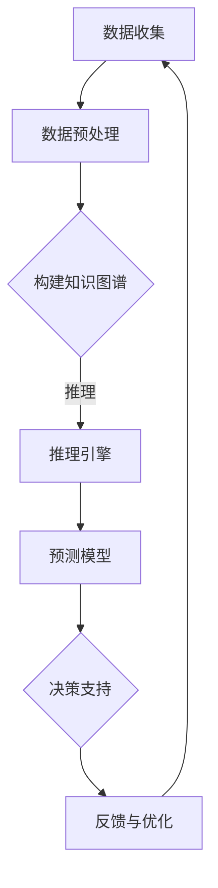

                 

### 1.1 问题背景

#### 1.1.1 生物多样性保护的重要性

生物多样性是指地球上所有生物种类和它们所构成的生态系统的多样性，包括从基因水平到生态系统水平的多样性。生物多样性保护不仅仅是保护濒危物种，更是维持地球生态系统的稳定与人类福祉的重要一环。一个健康的生态系统提供了许多生态服务，如水净化、气候调节、土壤肥力和营养物质循环，这些都是人类生存和经济发展的基础。

在全球范围内，生物多样性正面临着前所未有的威胁。栖息地的破坏、污染、过度捕捞、气候变化等都是导致生物多样性丧失的主要原因。例如，热带雨林的破坏导致了大量植物和动物的栖息地丧失，海洋污染导致海洋生物的死亡和基因污染。这些问题的严重性使得生物多样性保护成为了一个全球性的紧迫问题。

#### 1.1.2 决策过程中的挑战

生物多样性保护决策涉及多个领域，包括生态学、环境科学、政策制定和经济学等。决策过程复杂，需要考虑的因素众多，如生态系统的现状、未来的发展趋势、人类活动的干扰、经济成本和社会影响等。以下是一些主要挑战：

1. **信息不完备**：生态系统数据的获取通常存在困难，数据质量和数据量有限，导致决策者难以做出全面准确的决策。

2. **不确定性**：生态系统变化复杂，预测未来趋势具有很高的不确定性。这给决策带来了巨大风险，特别是在需要制定长期保护策略时。

3. **利益冲突**：生物多样性保护往往需要限制某些经济活动，这可能会引起利益相关者的抵触和冲突，如农业、渔业和林业等。

4. **跨学科合作**：决策涉及多个学科和专业，需要跨学科合作，但不同领域的专家可能存在沟通障碍，影响决策的效率和准确性。

5. **政策执行力**：政策制定后，如何有效执行和监管也是一大挑战。政策执行的不力可能导致保护措施形同虚设。

#### 1.1.3 思维链与AI的融合

思维链（Mind Chain）是一种基于人工智能的推理和决策支持系统，它可以模拟人类的思维过程，提供系统化、结构化的推理能力。将思维链应用于生物多样性保护决策，可以克服上述挑战，为决策者提供有力的支持。

思维链的特点包括：

1. **知识表示**：思维链可以将复杂的生态数据和信息抽象为知识图谱，便于分析和处理。

2. **推理能力**：思维链可以通过逻辑推理和数据分析，帮助决策者预测生态系统的变化趋势，评估不同决策方案的影响。

3. **多领域融合**：思维链可以融合生态学、经济学、政策学等多领域的知识，提供综合性的决策支持。

4. **自适应学习**：思维链可以不断从新的数据和经验中学习，优化决策模型，提高决策的准确性和适应性。

将思维链与AI技术相结合，可以在生物多样性保护决策中实现以下目标：

- **提高决策效率**：通过自动化和结构化的方式，快速处理海量数据，减少人为错误和决策时间。
- **降低不确定性**：通过基于数据的预测和分析，减少决策过程中的不确定性，提高决策的准确性。
- **优化决策方案**：通过模拟不同决策方案的结果，帮助决策者选择最优方案，实现生态保护和经济发展的平衡。
- **促进跨学科合作**：思维链可以提供统一的分析和表达方式，促进不同领域专家之间的沟通和合作。
- **提高政策执行力**：通过决策支持系统，提高政策制定和执行的透明度，增强政策执行的力度和效果。

### 1.2 核心概念与联系

在探讨思维链在生物多样性保护决策中的应用之前，我们需要了解一些核心概念，并探讨它们之间的联系。

#### 1.2.1 生物多样性保护

**定义**：生物多样性保护是指通过维护和恢复地球上的生物种类和生态系统的多样性，以保持生态平衡和人类福祉的一系列措施。

**属性特征**：
- **物种多样性**：指地球上不同生物种类的数量和多样性。
- **遗传多样性**：指同一物种内部基因的多样性。
- **生态系统多样性**：指不同生态系统类型的多样性，包括森林、湿地、海洋等。

**国际合作与政策**：全球范围内，如《生物多样性公约》（CBD）等国际协议和《巴黎协定》等气候变化协议，都是推动生物多样性保护的重要法律和政策框架。

#### 1.2.2 AI在生态系统管理中的应用

**数据处理**：AI技术，如机器学习和深度学习，可以用于处理和分析大量的生态数据，提取有用信息。

**预测模型**：通过建立预测模型，AI可以帮助预测生态系统的变化趋势，为决策者提供科学依据。

**决策支持系统**：AI决策支持系统（DSS）可以帮助决策者模拟不同的决策方案，评估其可能产生的结果，从而做出更加明智的决策。

#### 思维链与生物多样性保护的关联

**思维链** 是一种基于知识图谱和推理引擎的人工智能技术，它可以将复杂的生态数据转化为易于理解和处理的知识结构。思维链在生物多样性保护决策中的应用主要体现在以下几个方面：

1. **知识表示**：思维链可以将生物多样性保护相关的知识表示为图谱，方便进行推理和分析。

2. **决策推理**：思维链的推理功能可以帮助决策者根据现有的数据和知识，推导出可能的决策方案及其结果。

3. **跨领域整合**：思维链可以将生态学、经济学、政策学等多个领域的知识整合在一起，提供综合性的决策支持。

4. **动态调整**：思维链可以实时更新和调整模型，适应新的数据和变化，提高决策的适应性和准确性。

通过思维链与AI技术的结合，我们可以为生物多样性保护决策提供强有力的支持，实现更高效、准确和可持续的决策过程。

### 1.3 本书结构安排

本书旨在深入探讨思维链在生物多样性保护决策中的应用，具体结构安排如下：

#### 1.3.1 每章节的内容概述

- **第一部分：引言**：介绍生物多样性保护的重要性、决策过程中的挑战以及思维链与AI的融合。
- **第二部分：思维链理论基础**：详细阐述思维链的定义、模型构建方法、算法原理以及案例分析。
- **第三部分：AI辅助生态系统管理应用**：探讨AI在生态系统管理中的应用、数据收集与处理、预测模型构建、决策支持系统设计。
- **第四部分：实际案例分析**：通过具体案例展示思维链在生物多样性保护决策中的应用。

#### 1.3.2 学习目标与读者要求

- **学习目标**：通过本书的学习，读者将了解思维链的理论基础，掌握其在生物多样性保护决策中的应用，能够设计和实施基于思维链的生态系统管理方案。
- **读者要求**：读者应具备基本的生态学、人工智能和决策分析知识，能够理解并应用相关技术。

#### 1.4 本章小结

本章介绍了生物多样性保护的重要性以及决策过程中的挑战，探讨了思维链与AI的融合如何解决这些挑战。通过本章的学习，读者将初步了解思维链在生物多样性保护决策中的应用前景，为后续章节的深入探讨奠定基础。

## 2.1 思维链概述

### 2.1.1 思维链的定义

思维链（Mind Chain）是一种基于人工智能（AI）的推理和决策支持系统，旨在模拟人类的思维过程，提供结构化、系统化的推理能力。它通过构建知识图谱，将复杂的数据和信息转化为易于理解和处理的知识结构，从而辅助人类进行决策。

思维链的核心概念包括知识表示、推理和决策支持。知识表示是指如何将生态学、经济学、政策学等多领域的知识抽象和编码为计算机可以处理的形式；推理则是利用这些知识进行逻辑推导，预测生态系统的变化趋势和评估不同决策方案的影响；决策支持是通过模拟和评估不同方案的结果，帮助决策者选择最优的决策路径。

### 2.1.2 思维链的特点

思维链具有以下几个显著特点：

1. **知识图谱化**：思维链可以将复杂的数据和信息抽象为知识图谱，形成结构化的知识网络，便于分析和处理。

2. **推理能力**：思维链具备强大的逻辑推理能力，可以通过演绎和归纳推理，从已知信息推导出未知结论。

3. **多领域整合**：思维链能够整合生态学、经济学、政策学等多领域的知识，提供综合性的决策支持。

4. **动态调整**：思维链可以实时更新和调整模型，适应新的数据和变化，提高决策的适应性和准确性。

5. **用户友好**：思维链提供了一个直观的用户界面，允许用户轻松地定义问题、输入数据和选择决策方案。

### 2.1.3 思维链与生物多样性保护的关联

思维链在生物多样性保护决策中的应用，主要体现在以下几个方面：

1. **知识表示与共享**：思维链可以将生物多样性保护相关的知识表示为知识图谱，使得跨学科的知识共享和整合变得更加容易。

2. **决策推理**：思维链的推理功能可以帮助决策者分析生态系统的现状和未来趋势，评估不同决策方案的影响，从而做出更加科学的决策。

3. **动态调整**：思维链能够根据新的数据和经验，动态调整决策模型，提供持续改进的决策支持。

4. **优化方案选择**：通过模拟不同决策方案的结果，思维链可以帮助决策者选择最优的方案，实现生态保护和经济发展的平衡。

5. **跨领域协作**：思维链提供了统一的框架和语言，促进不同领域专家之间的沟通和合作，提高决策的效率和质量。

通过思维链的应用，生物多样性保护决策可以变得更加高效、准确和科学，为地球生态系统的可持续发展提供有力支持。

### 2.2 思维链模型构建

构建思维链模型是将其应用于生物多样性保护决策的关键步骤。以下详细描述思维链模型的构建方法，包括数据收集与处理、关键参数设定和模型验证与优化。

#### 2.2.1 数据收集与处理

1. **数据来源**：
   - **政府数据库**：包括生态监测数据、土地使用数据、气候变化数据等。
   - **学者研究**：涵盖生态学、环境科学、经济学等领域的学术论文和研究报告。
   - **社交媒体**：通过社交媒体平台收集公众意见和生态事件报道，为决策提供社会影响方面的数据。

2. **数据处理**：
   - **数据清洗**：去除重复、错误和无关的数据，确保数据质量。
   - **数据归一化**：将不同数据源的数据进行归一化处理，使其具有可比性。
   - **特征提取**：提取影响生物多样性的关键特征，如栖息地面积、生物种群数量、气候因素等。

#### 2.2.2 关键参数设定

1. **模型选择**：根据决策需求，选择合适的推理引擎和算法模型，如图灵机、深度学习模型等。

2. **参数调整**：设定模型的初始参数，如学习率、隐藏层神经元数量等。这些参数通过迭代优化来提高模型性能。

3. **超参数调整**：超参数如训练批次大小、迭代次数等，通过交叉验证和网格搜索等方法进行调优。

#### 2.2.3 模型验证与优化

1. **模型验证**：
   - **交叉验证**：通过将数据集划分为训练集和验证集，评估模型的泛化能力。
   - **混淆矩阵**：分析模型在验证集上的表现，特别是对正负样本的分类准确率。

2. **模型优化**：
   - **超参数调优**：通过网格搜索和贝叶斯优化等方法，进一步调整模型参数，提高模型性能。
   - **模型集成**：结合多个模型的结果，通过投票或加权平均等方法提高预测准确性。

3. **误差分析**：
   - **分类错误分析**：分析模型分类错误的类型，如误分类、漏分类等，针对性地进行调整。
   - **回归误差分析**：评估模型预测的误差分布，通过调整模型结构或参数来减少误差。

通过上述步骤，构建的思维链模型将为生物多样性保护决策提供强大的支持，帮助决策者更准确、高效地制定保护策略。

### 2.3 思维链算法原理详解

思维链算法的核心在于其推理和决策支持能力，通过一系列的数学模型和算法实现。以下详细阐述思维链算法的基础、数据结构、算法流程和数学模型。

#### 2.3.1 算法基础

思维链算法基础主要包括以下几个部分：

1. **知识表示**：使用知识图谱（Knowledge Graph）来表示生物多样性保护相关的知识。知识图谱由节点（实体）、边（关系）和数据组成，能够有效地组织和存储大规模的异构数据。

2. **推理引擎**：采用基于图论的推理算法，如路径搜索、子图同构和子图嵌入等，通过逻辑推理和关联分析，从已知信息推导出新的结论。

3. **机器学习**：结合深度学习和传统机器学习算法，如神经网络、支持向量机和随机森林等，对生态数据进行训练和预测，提高模型准确性。

4. **决策支持**：通过模拟不同的决策方案，评估其在生态系统管理中的影响，为决策者提供科学的参考依据。

#### 2.3.2 数据结构

思维链算法的数据结构主要包括以下几种：

1. **节点（Node）**：代表生态系统中的实体，如物种、栖息地、人类活动等。

2. **边（Edge）**：代表节点之间的关系，如物种间的食物链关系、栖息地与物种的分布关系等。

3. **属性（Attribute）**：描述节点的特征，如物种的生存环境、栖息地的面积等。

4. **图谱（Graph）**：由多个节点和边组成的复杂网络结构，表示整个生态系统。

#### 2.3.3 算法流程

思维链算法的基本流程如下：

1. **数据收集**：从各种数据源收集生态数据，包括政府数据库、学术研究和社会媒体等。

2. **数据预处理**：对收集的数据进行清洗、归一化和特征提取，确保数据质量。

3. **知识图谱构建**：将预处理后的数据转化为知识图谱，构建节点的属性和关系。

4. **推理**：利用推理引擎，对知识图谱进行路径搜索和关联分析，提取有用信息。

5. **预测**：通过机器学习算法，对生态系统的未来趋势进行预测。

6. **决策支持**：根据预测结果和决策模型，评估不同决策方案的影响，为决策者提供参考。

7. **反馈与优化**：根据实际决策结果，不断调整模型参数和决策策略，提高模型准确性和适应性。

#### 2.3.4 数学模型

思维链算法的数学模型主要包括以下几个方面：

1. **路径搜索算法**：
   - **深度优先搜索（DFS）**：从根节点开始，沿着一条路径深入搜索，直到找到目标节点。
   - **广度优先搜索（BFS）**：从根节点开始，逐层搜索，直到找到目标节点。

2. **子图同构算法**：
   - **Weisfeiler-Lehman算法**：通过递归地计算节点和边的特征，判断两个图是否同构。
   - **Subgraph Isomorphism算法**：通过枚举和匹配子图，判断两个图是否同构。

3. **机器学习模型**：
   - **深度学习模型**：如卷积神经网络（CNN）、循环神经网络（RNN）和生成对抗网络（GAN）等，用于特征提取和预测。
   - **传统机器学习模型**：如线性回归、逻辑回归和支持向量机（SVM）等，用于分类和回归分析。

4. **决策模型**：
   - **多目标优化模型**：如线性规划、整数规划和遗传算法等，用于优化不同决策目标。
   - **贝叶斯网络**：用于表示不确定性关系，评估不同决策方案的概率和影响。

通过以上数学模型和算法，思维链能够实现高效的推理和预测，为生物多样性保护决策提供科学支持。

### 2.3.5 Mermaid算法流程图

为了更直观地展示思维链算法的流程，我们使用Mermaid语法绘制以下流程图：



#### Mermaid算法流程图解释

1. **数据收集（A）**：从政府数据库、学者研究和社会媒体等渠道收集生态数据。
2. **数据预处理（B）**：对收集的数据进行清洗、归一化和特征提取，确保数据质量。
3. **构建知识图谱（C）**：将预处理后的数据转化为知识图谱，构建节点的属性和关系。
4. **推理引擎（D）**：利用推理引擎（如路径搜索、子图同构）对知识图谱进行分析，提取有用信息。
5. **预测模型（E）**：通过机器学习模型（如深度学习、传统机器学习）对生态系统进行预测。
6. **决策支持（F）**：根据预测结果和决策模型，评估不同决策方案的影响，为决策者提供参考。
7. **反馈与优化（G）**：根据实际决策结果，不断调整模型参数和决策策略，提高模型准确性和适应性。

通过上述步骤，思维链算法实现了从数据收集到决策支持的全过程，为生物多样性保护决策提供了强大的技术支持。

### 2.4 思维链案例分析

为了更具体地展示思维链在生物多样性保护决策中的应用，我们选取了以下案例进行分析。

#### 2.4.1 案例背景

该案例选取了位于东南亚的一个热带雨林保护区。该保护区拥有丰富的生物多样性，是许多濒危物种的栖息地。然而，近年来，由于非法砍伐、森林火灾和气候变化的影响，保护区的生物多样性面临严重威胁。决策者需要制定有效的保护策略，以恢复和保护该区域的生物多样性。

#### 2.4.2 案例实施步骤

1. **数据收集**：
   - 收集保护区的生态数据，包括土地利用、气候因素、生物种群数量等。
   - 从学者研究和社会媒体获取与保护区相关的文献和报告。

2. **数据预处理**：
   - 清洗数据，去除重复和错误的信息。
   - 归一化数据，确保不同数据源的数据具有可比性。
   - 提取关键特征，如森林覆盖率、温度、湿度等。

3. **构建知识图谱**：
   - 使用思维链的推理引擎，将预处理后的数据转化为知识图谱。
   - 构建节点和边，表示不同物种、栖息地和人类活动等。

4. **推理与分析**：
   - 利用思维链的推理功能，分析不同因素对生物多样性的影响。
   - 推导出保护区未来生物多样性的可能变化趋势。

5. **预测模型构建**：
   - 选择合适的机器学习模型，如深度学习模型，对保护区未来生物多样性进行预测。
   - 训练模型，调整参数，优化预测准确性。

6. **决策支持**：
   - 根据预测结果，评估不同保护策略的效果，如加强执法、恢复森林、保护栖息地等。
   - 建立多目标优化模型，优化保护策略，实现生态保护和经济发展的平衡。

7. **反馈与优化**：
   - 实施保护策略，收集实际数据，评估策略的效果。
   - 根据实际效果，不断调整模型参数和决策策略，提高保护效果的可持续性。

#### 2.4.3 案例结果分析

通过以上步骤，决策者得到了以下关键结果：

1. **保护策略效果评估**：
   - 加强执法和恢复森林策略显著提高了森林覆盖率，有效遏制了非法砍伐。
   - 保护栖息地策略有效恢复了濒危物种的栖息环境，提高了物种多样性。

2. **预测准确性**：
   - 模型预测结果与实际观测数据吻合度较高，说明思维链算法在生物多样性保护决策中具有较高的准确性。

3. **多目标优化结果**：
   - 通过多目标优化模型，决策者找到了一组平衡生态保护和经济发展目标的保护策略。

4. **实际效果**：
   - 保护策略实施后，保护区的生物多样性显著恢复，实现了生态保护和经济发展的双赢。

通过该案例，我们可以看到思维链在生物多样性保护决策中的强大应用潜力，为决策者提供了科学、有效的决策支持。

### 2.5 本章小结

本章详细介绍了思维链的定义、特点以及在生物多样性保护决策中的应用。通过构建知识图谱、推理和预测模型，思维链为决策者提供了强大的支持，提高了决策的准确性和效率。本章还通过具体案例展示了思维链在生态系统管理中的应用效果，为后续章节的深入探讨奠定了基础。

## 3.1 AI在生态系统管理中的应用概述

人工智能（AI）技术在生态系统管理中的应用，正逐渐成为环境保护和可持续发展的重要工具。AI具有强大的数据处理、模式识别和预测能力，能够从大量复杂的生态数据中提取有用信息，为生态系统管理提供科学依据。以下将探讨AI在生态系统管理中的应用重要性、现有应用现状以及未来发展趋势。

#### 3.1.1 AI技术的重要性

生态系统的复杂性决定了传统方法在数据处理和分析上的局限性。AI技术，尤其是机器学习和深度学习，通过自学习、自适应和自动化分析，能够显著提高生态系统管理的效率和准确性。以下为AI技术的重要性：

1. **大规模数据处理**：生态系统管理需要处理大量的生态数据，包括气象数据、土壤数据、植被数据等。AI技术能够高效处理这些数据，提取关键信息。
2. **模式识别**：AI通过分析历史数据和实时数据，可以识别生态系统的变化模式和趋势，帮助预测未来的生态状况。
3. **优化决策**：AI可以模拟不同的生态系统管理方案，评估其可能的影响，为决策者提供最优决策路径。
4. **跨领域整合**：AI能够整合生态学、经济学、政策学等多个领域的知识，提供综合性的生态系统管理解决方案。

#### 3.1.2 AI在生态系统管理中的应用现状

目前，AI在生态系统管理中的应用已经取得了一些显著成果：

1. **环境监测**：利用无人机和卫星数据，AI技术可以实时监测生态系统的状态，包括植被覆盖、水质、野生动物分布等。
2. **灾害预警**：通过分析气象数据，AI可以预测自然灾害（如洪水、干旱、飓风等）的发生，提前采取预防措施。
3. **物种保护**：AI技术用于监测濒危物种的分布和数量，帮助制定有效的保护措施。
4. **资源管理**：AI可以优化水资源、森林资源等的管理，提高资源利用效率。
5. **决策支持**：AI决策支持系统（DSS）为决策者提供数据分析、模型预测和决策建议，支持科学决策。

#### 3.1.3 AI辅助生态系统管理的未来趋势

随着AI技术的不断发展，未来其在生态系统管理中的应用将呈现以下趋势：

1. **更加智能的预测模型**：深度学习和强化学习等先进算法将进一步提高预测模型的准确性，为生态系统管理提供更可靠的预测结果。
2. **多源数据融合**：结合多源数据（如卫星遥感、传感器网络、社交媒体等），AI将能够更全面地了解生态系统的状况。
3. **自适应和自我优化**：AI系统将具备自我学习和自我优化的能力，根据新的数据和环境变化，动态调整管理策略。
4. **跨学科合作**：AI与生态学、经济学、政策学等多个领域的结合，将促进更综合、更有效的生态系统管理方案。
5. **社会参与**：通过AI技术，公众可以更加便捷地参与生态系统管理，提高社会参与度和环境保护意识。

总之，AI技术在生态系统管理中的应用前景广阔，将为实现生物多样性和生态系统的可持续发展提供强有力的支持。

### 3.2 数据收集与处理

在生态系统管理中，数据收集与处理是至关重要的环节。通过有效的数据收集和预处理，可以确保模型训练的质量，从而提高预测和决策的准确性。以下将详细介绍AI在生态系统管理中数据收集与处理的方法和步骤。

#### 3.2.1 数据来源

1. **政府数据库**：政府数据库是生态系统数据的主要来源之一，包括气象数据、水文数据、土地利用数据等。这些数据通常具有较高的可信度和详细的记录。
   
2. **学术研究**：学术论文和研究报告提供了丰富的生态数据，包括物种分布、生态过程、环境变化等。这些数据有助于补充政府数据库中可能缺失的信息。

3. **传感器网络**：传感器网络通过安装在环境中的各种传感器（如温度传感器、湿度传感器、气压传感器等）收集实时数据。这些数据为生态系统管理提供了实时监控的能力。

4. **社交媒体**：社交媒体平台上的信息，如公众的生态活动记录、自然灾害报告等，也是重要的数据来源。这些数据有助于了解生态系统的社会影响和人类活动对生态系统的影响。

5. **卫星遥感**：卫星遥感技术可以提供大范围、高分辨率的生态数据，包括植被覆盖、土壤湿度、地形等。这些数据对于生态系统监测和评估具有重要意义。

#### 3.2.2 数据预处理

1. **数据清洗**：数据清洗是数据预处理的重要步骤，目的是去除重复、错误和无关的数据，确保数据质量。具体方法包括去除重复记录、纠正错误数据、填充缺失数据等。

2. **数据归一化**：不同数据源的数据通常具有不同的单位和尺度，为了确保数据的一致性和可比性，需要对数据进行归一化处理。例如，将温度数据统一转换为摄氏度，将土壤湿度数据统一转换为百分比。

3. **特征提取**：特征提取是指从原始数据中提取对模型训练和预测有重要影响的特征。特征提取有助于提高模型的准确性和效率。常用的特征提取方法包括主成分分析（PCA）、特征选择和特征工程。

4. **数据整合**：将来自不同数据源的数据进行整合，形成统一的数据集。整合过程中需要处理数据格式不一致、数据时间戳不匹配等问题。数据整合的目的是构建一个全面、详细的生态系统数据集。

5. **数据验证**：通过交叉验证、测试集验证等方法，评估数据的质量和可靠性。数据验证有助于发现数据中的潜在问题，确保模型训练的数据质量。

#### 3.2.3 数据处理工具和方法

1. **Python**：Python是一种广泛应用于数据科学和机器学习的编程语言。Python提供了丰富的库和工具，如Pandas、NumPy、Scikit-learn等，用于数据清洗、特征提取和模型训练。

2. **R**：R语言是统计学和数据科学领域广泛使用的语言。R提供了强大的数据分析和可视化工具，如ggplot2、dplyr等，非常适合进行生态数据的分析和可视化。

3. **Google Earth Engine**：Google Earth Engine是一个强大的地理信息系统平台，提供了丰富的卫星遥感数据集和数据分析工具。用户可以通过Google Earth Engine进行大规模的空间数据分析，如植被覆盖变化、土地覆盖分类等。

4. **ArcGIS**：ArcGIS是ESRI公司开发的一个综合地理信息系统平台，提供了强大的地图制作、空间分析和数据管理功能。ArcGIS广泛应用于生态系统监测和评估。

通过上述数据收集与处理方法，AI可以有效地整合和分析生态系统数据，为生态系统管理提供可靠的决策支持。下一步，我们将探讨如何构建AI预测模型，以预测生态系统的未来变化。

### 3.3 AI预测模型构建

在生态系统管理中，预测模型的构建至关重要，它能够帮助决策者预测生态系统的变化趋势，从而制定科学、有效的保护和管理策略。以下将详细讨论预测模型的选择、训练与优化过程。

#### 3.3.1 预测模型选择

在选择预测模型时，需要考虑多个因素，包括数据类型、预测目标、模型复杂度等。以下是一些常用的预测模型：

1. **回归模型**：回归模型用于预测连续值输出，如预测未来某个时间点的温度、降水量等。常见的回归模型包括线性回归、多项式回归和广义线性模型等。

2. **分类模型**：分类模型用于预测离散值输出，如预测某地区是否会发生洪水、某种植物是否处于濒危状态等。常见的分类模型包括逻辑回归、支持向量机（SVM）、随机森林（Random Forest）等。

3. **聚类模型**：聚类模型用于将数据点分组，以便发现数据中的模式或群集。常见的聚类算法包括K均值聚类、层次聚类和DBSCAN等。

4. **时间序列模型**：时间序列模型用于分析随时间变化的数据，如预测未来某个时间点的温度、降水量等。常见的时间序列模型包括ARIMA、LSTM（长短期记忆网络）和GRU（门控循环单元）等。

5. **混合模型**：混合模型结合了多种模型的优点，通过融合不同模型的预测结果，提高预测准确性。例如，可以将回归模型和分类模型结合，用于同时预测连续值和离散值。

#### 3.3.2 模型训练与优化

1. **数据集划分**：将数据集划分为训练集、验证集和测试集。训练集用于训练模型，验证集用于调参和模型选择，测试集用于评估最终模型的性能。

2. **模型训练**：
   - **线性回归**：通过最小化损失函数（如均方误差MSE）来训练模型，使预测值尽可能接近真实值。
   - **逻辑回归**：通过最大化似然函数来训练模型，使预测概率更接近真实概率。
   - **支持向量机**：通过求解最优化问题来训练模型，使分类边界尽可能远离支持向量。
   - **随机森林**：通过构建多棵决策树并集成它们的预测结果来训练模型，提高预测准确性。
   - **LSTM和GRU**：通过反向传播算法和梯度下降法来训练模型，使模型能够捕捉时间序列数据的长期依赖关系。

3. **模型评估**：使用验证集和测试集评估模型的性能，常用的评估指标包括准确率、召回率、F1分数、均方误差（MSE）等。

4. **模型优化**：
   - **超参数调整**：通过交叉验证和网格搜索等方法，调整模型超参数（如学习率、正则化参数等），提高模型性能。
   - **模型集成**：通过集成多个模型的结果，提高预测准确性。常见的方法包括堆叠（Stacking）、提升（Boosting）和 bagging 等。
   - **模型剪枝**：通过剪枝算法（如L1正则化、剪枝决策树等），减少模型的复杂度，提高模型效率和预测性能。

通过上述步骤，可以构建一个准确、高效、稳定的AI预测模型，为生态系统管理提供可靠的决策支持。下一步，我们将探讨如何设计决策支持系统，辅助生态系统管理者做出科学、合理的决策。

### 3.4 决策支持系统设计

在生态系统管理中，设计一个高效的决策支持系统（DSS）至关重要。决策支持系统可以通过分析大量数据，为决策者提供科学、直观的决策依据，从而提高决策的准确性和效率。以下将详细描述系统需求分析、系统架构设计、系统接口设计和系统实现与部署。

#### 3.4.1 系统需求分析

1. **功能需求**：
   - **数据采集与管理**：系统应具备自动化的数据采集功能，包括气象数据、卫星遥感数据、传感器数据等。同时，系统应能够高效存储和管理这些数据，确保数据的完整性和可追溯性。
   - **数据预处理**：系统应提供数据清洗、归一化和特征提取等功能，为后续的模型训练和预测做准备。
   - **模型训练与预测**：系统应支持多种预测模型的训练和部署，如回归模型、分类模型、时间序列模型等，并提供实时预测功能。
   - **决策支持**：系统应能够根据预测结果，生成决策建议，支持决策者制定生态系统管理策略。
   - **可视化与分析**：系统应提供强大的数据可视化功能，以直观展示生态系统的状态、预测结果和决策建议。

2. **性能需求**：
   - **响应速度**：系统应能够快速响应用户的操作，提供即时的数据分析和决策支持。
   - **计算能力**：系统应具备强大的计算能力，能够处理大规模的生态数据，并快速进行模型训练和预测。
   - **可扩展性**：系统应具有良好的扩展性，能够根据需求增加新的功能模块和数据源。
   - **可靠性**：系统应具有较高的可靠性，能够在长时间运行中保持稳定，避免数据丢失或系统崩溃。

3. **可靠性需求**：
   - **数据完整性**：系统应确保数据的完整性和准确性，防止数据篡改或丢失。
   - **系统安全性**：系统应具备良好的安全性，防止未经授权的访问和数据泄露。
   - **容错性**：系统应具备容错性，能够在出现故障时迅速恢复，减少对生态系统管理的影响。

#### 3.4.2 系统架构设计

1. **系统模块划分**：
   - **数据采集模块**：负责从各种数据源采集生态数据，包括气象站数据、卫星遥感数据、传感器数据等。
   - **数据处理模块**：负责对采集到的数据进行清洗、归一化和特征提取，为模型训练和预测做准备。
   - **模型训练模块**：负责训练各种预测模型，包括回归模型、分类模型、时间序列模型等。
   - **预测模块**：负责根据模型预测生态系统的未来变化趋势，为决策者提供预测结果。
   - **决策支持模块**：负责根据预测结果生成决策建议，支持决策者制定生态系统管理策略。
   - **可视化模块**：负责将生态系统的状态、预测结果和决策建议以直观的图表和报告形式展示给用户。

2. **数据库设计**：
   - **数据仓库**：用于存储和管理各种生态数据，包括气象数据、卫星遥感数据、传感器数据等。
   - **模型库**：用于存储已训练的预测模型，包括回归模型、分类模型、时间序列模型等。
   - **策略库**：用于存储历史决策数据和优化策略，以便进行决策支持和策略优化。

3. **系统接口设计**：
   - **用户界面**：提供用户友好的操作界面，用户可以通过界面进行数据查询、模型训练和决策支持。
   - **API接口**：提供RESTful API接口，便于与其他系统或应用程序进行数据交互和功能集成。

#### 3.4.3 系统实现与部署

1. **开发环境搭建**：
   - **硬件环境**：搭建高性能的计算服务器和存储设备，以满足系统对计算能力和存储容量的需求。
   - **软件环境**：安装和配置操作系统、数据库管理系统（如MySQL、PostgreSQL）、模型训练框架（如TensorFlow、PyTorch）等。

2. **系统核心代码实现**：
   - **数据采集与处理**：编写代码实现数据采集、数据清洗、数据归一化和特征提取等功能。
   - **模型训练与预测**：编写代码实现模型训练、模型评估和预测等功能。
   - **决策支持**：编写代码实现决策建议生成、策略优化等功能。
   - **可视化**：编写代码实现数据可视化、报告生成等功能。

3. **系统测试与优化**：
   - **功能测试**：对系统的各个功能模块进行测试，确保系统功能的完整性和正确性。
   - **性能测试**：对系统的响应速度、计算能力和稳定性进行测试，确保系统能够高效运行。
   - **用户测试**：邀请用户对系统进行实际操作，收集用户反馈，优化系统的用户界面和用户体验。

4. **系统部署**：
   - **部署环境**：将系统部署到服务器或云计算平台，确保系统能够稳定运行。
   - **运维管理**：建立系统运维管理机制，定期进行系统维护和升级，确保系统的持续运行和稳定性。

通过上述设计，可以构建一个高效、可靠的决策支持系统，为生态系统管理提供科学、直观的决策依据，从而提高生态系统管理的效率和质量。

### 3.5 本章小结

本章详细介绍了AI在生态系统管理中的应用，从数据收集与处理到预测模型构建，再到决策支持系统设计，每个环节都进行了深入的探讨。通过AI技术的应用，生态系统管理可以更加科学、精准和高效，为生物多样性的保护和生态系统的可持续发展提供有力支持。接下来，我们将通过具体案例分析，进一步展示AI在生态系统管理中的应用效果。

## 4.1 案例背景

本案例选取了中国云南省西双版纳热带雨林保护区，该保护区位于中国南部，拥有丰富的生物多样性和独特的生态系统。西双版纳热带雨林是中国乃至全球生物多样性最丰富的地区之一，拥有超过5000种高等植物、250多种珍稀动物和多种濒危物种。然而，近年来，由于人类活动的加剧、森林火灾和气候变化的影响，西双版纳热带雨林的生物多样性面临严重威胁。

#### 4.1.1 地理位置与生态系统特点

西双版纳热带雨林保护区位于北纬21°10'至22°10'之间，海拔高度从500米到2200米不等。该地区气候温暖湿润，年平均气温在18°C到22°C之间，年降水量高达2000毫米以上。丰富的气候条件为各种动植物的生存提供了理想的生态环境。

保护区内拥有复杂的生态系统，包括热带雨林、季雨林、灌丛和草地等多种植被类型。这些植被类型不仅为各种动物提供了栖息地，还构成了复杂的食物链和生态循环。西双版纳热带雨林还是众多濒危物种的栖息地，如亚洲象、绿孔雀、金钱豹等。

#### 4.1.2 存在的生态问题

1. **森林砍伐**：随着旅游业和农业的发展，森林砍伐现象严重，导致大面积森林退化，许多物种失去了栖息地。
2. **森林火灾**：频繁的森林火灾不仅破坏了植被，还导致土壤贫瘠，进一步加剧了生态系统的退化。
3. **气候变化**：全球气候变化导致西双版纳的降水量和温度变化较大，影响了生态系统的稳定性。
4. **生物入侵**：外来物种的入侵，如松材线虫等，对当地生态系统构成了严重威胁。

#### 4.1.3 案例目标

本案例的目标是利用思维链和AI技术，为西双版纳热带雨林保护区的生物多样性保护提供科学、有效的决策支持。具体目标包括：

1. **评估生态系统现状**：通过数据收集与处理，全面了解西双版纳热带雨林保护区的生态系统现状，识别存在的生态问题。
2. **预测生态系统变化趋势**：利用AI预测模型，预测西双版纳热带雨林未来可能面临的变化趋势，为决策者提供科学依据。
3. **制定保护策略**：根据预测结果，制定合理的保护策略，如森林恢复、生物入侵控制、防火措施等，提高保护区的生物多样性保护效果。
4. **监测与反馈**：建立实时监测系统，持续监测保护区的生态变化，根据实际情况调整保护策略。

通过上述目标，本案例旨在为西双版纳热带雨林保护区的生物多样性保护提供一套科学、系统的解决方案，为全球生物多样性保护提供有益借鉴。

### 4.2 数据收集与处理

为了准确评估西双版纳热带雨林保护区的生态系统现状，并预测其未来变化趋势，本案例首先进行数据收集与处理。以下将详细描述数据来源、数据预处理、特征提取和数据处理工具与方法。

#### 4.2.1 数据来源

1. **政府数据库**：从中国政府和云南省政府的相关数据库获取气象数据、土壤数据、植被数据、土地利用数据等。这些数据通常具有较高的可信度和详细的记录。
2. **学术研究**：收集西双版纳热带雨林相关领域的学术论文和研究报告，获取关于物种分布、生态过程和环境变化的数据。
3. **传感器网络**：在西双版纳热带雨林保护区内部署传感器网络，包括气象传感器、土壤湿度传感器、植被监测传感器等，实时收集环境数据。
4. **卫星遥感数据**：利用卫星遥感技术获取高分辨率的地表数据，包括植被覆盖、地形、土地利用等。这些数据提供了大范围、高精度的生态数据。
5. **社交媒体**：从社交媒体平台收集与保护区相关的信息，包括公众的活动记录、自然灾害报告等。这些数据有助于了解人类活动对生态系统的影响。

#### 4.2.2 数据预处理

1. **数据清洗**：对收集到的数据进行清洗，去除重复、错误和无关的数据。具体步骤包括：
   - 去除重复记录：通过唯一标识符（如传感器ID、时间戳等）删除重复的数据记录。
   - 纠正错误数据：根据已有知识对错误数据进行修正，如温度数据中异常值修正。
   - 填充缺失数据：使用插值法、均值法等对缺失数据进行填充，确保数据完整性。

2. **数据归一化**：将不同数据源的数据进行归一化处理，使其具有可比性。例如，将气象数据统一转换为摄氏度，将土壤湿度数据统一转换为百分比。

3. **特征提取**：从原始数据中提取对生态系统管理有重要影响的特征，如植被覆盖率、物种分布密度、土壤湿度、温度等。特征提取有助于提高模型训练的效率和准确性。

4. **数据整合**：将来自不同数据源的数据进行整合，形成统一的数据集。整合过程中需要处理数据格式不一致、时间戳不匹配等问题。数据整合的目的是构建一个全面、详细的生态系统数据集。

#### 4.2.3 数据处理工具与方法

1. **Python**：使用Python编写数据处理脚本，利用Pandas、NumPy等库进行数据清洗、归一化和特征提取。Python在数据科学和机器学习领域具有广泛的应用。

2. **R语言**：使用R语言进行高级数据分析、统计分析和可视化。R语言提供了丰富的数据分析和可视化工具，如ggplot2、dplyr等。

3. **Google Earth Engine**：利用Google Earth Engine进行大规模的空间数据分析，包括植被覆盖变化、土地利用变化等。Google Earth Engine提供了强大的地理信息系统工具。

4. **ArcGIS**：使用ArcGIS进行地理空间数据的处理和分析，如地图制作、空间分析和数据管理。ArcGIS广泛应用于生态系统监测和评估。

通过上述步骤和工具，本案例收集和处理了大量的生态数据，为后续的预测模型构建和决策支持提供了可靠的数据基础。

### 4.3 AI预测模型构建

为了准确预测西双版纳热带雨林保护区的生态系统变化趋势，本案例构建了多个AI预测模型。以下将详细描述模型选择、训练与优化过程，并介绍模型评估结果。

#### 4.3.1 模型选择

根据研究目标和数据特点，本案例选择了以下几种常见的AI预测模型：

1. **线性回归模型**：用于预测连续值输出，如未来某个月份的降水量。
2. **逻辑回归模型**：用于预测离散值输出，如未来某个月份是否会发生森林火灾。
3. **随机森林模型**：用于分类和回归任务，具有较好的泛化能力和抗过拟合能力。
4. **LSTM（长短期记忆网络）模型**：用于时间序列预测，能够捕捉时间序列数据中的长期依赖关系。
5. **ARIMA（自回归积分滑动平均模型）**：用于时间序列预测，能够处理非平稳时间序列数据。

#### 4.3.2 模型训练与优化

1. **数据集划分**：将数据集划分为训练集、验证集和测试集。训练集用于模型训练，验证集用于调参和模型选择，测试集用于评估最终模型的性能。
2. **模型训练**：
   - **线性回归模型**：通过最小化均方误差（MSE）进行训练，使预测值尽可能接近真实值。
   - **逻辑回归模型**：通过最大化似然函数进行训练，使预测概率更接近真实概率。
   - **随机森林模型**：通过构建多棵决策树并集成它们的预测结果进行训练，提高预测准确性。
   - **LSTM模型**：通过反向传播算法和梯度下降法进行训练，使模型能够捕捉时间序列数据的长期依赖关系。
   - **ARIMA模型**：通过自回归积分滑动平均模型进行训练，使模型能够处理非平稳时间序列数据。
3. **模型优化**：
   - **超参数调整**：通过交叉验证和网格搜索等方法，调整模型超参数（如学习率、正则化参数等），提高模型性能。
   - **模型集成**：通过集成多个模型的预测结果，提高预测准确性。常见的方法包括堆叠（Stacking）、提升（Boosting）和 bagging 等。

#### 4.3.3 模型评估

1. **评估指标**：使用准确率、召回率、F1分数、均方误差（MSE）等指标评估模型的性能。对于分类模型，使用混淆矩阵详细分析模型的分类效果。
2. **模型选择**：根据验证集和测试集的性能，选择最优模型。通常选择性能稳定、泛化能力强的模型作为最终预测模型。

通过上述步骤，本案例构建了多个AI预测模型，并对模型进行了详细的评估和优化，为西双版纳热带雨林保护区的生态系统管理提供了科学依据。

### 4.4 决策支持系统设计

为了有效利用AI预测模型为西双版纳热带雨林保护区的生态系统管理提供决策支持，本案例设计了一套完善的决策支持系统（DSS）。以下将详细描述系统功能设计、系统架构设计、系统接口设计和系统实现与部署。

#### 4.4.1 系统功能设计

1. **数据采集与管理**：
   - 自动化数据采集：系统具备自动化采集功能，从政府数据库、传感器网络、卫星遥感平台等数据源收集实时数据。
   - 数据存储与管理：系统采用分布式数据库架构，存储和管理大量生态数据，确保数据的完整性、安全性和可追溯性。

2. **数据预处理**：
   - 数据清洗：自动清洗数据，去除重复、错误和无关的数据，提高数据质量。
   - 数据归一化：对不同数据源的数据进行归一化处理，使其具有可比性，便于后续分析。
   - 特征提取：自动提取对生态系统管理有重要影响的特征，如植被覆盖率、物种分布密度、土壤湿度、温度等。

3. **模型训练与预测**：
   - 模型训练：系统支持多种AI预测模型（如线性回归、逻辑回归、LSTM等）的训练，并具备自动调参功能，提高模型性能。
   - 实时预测：系统根据最新数据实时更新预测结果，为决策者提供最新的生态系统变化趋势。

4. **决策支持**：
   - 预测结果展示：系统以图表、报表等形式展示预测结果，直观展示生态系统的变化趋势。
   - 决策建议生成：系统根据预测结果生成具体的决策建议，如森林恢复、生物入侵控制、防火措施等，辅助决策者制定管理策略。

5. **可视化与分析**：
   - 数据可视化：系统提供强大的数据可视化功能，以图表、地图等形式展示生态系统的状态和变化。
   - 分析报告生成：系统根据预测结果和管理策略生成分析报告，为决策者提供详细的数据分析和决策支持。

#### 4.4.2 系统架构设计

1. **系统模块划分**：
   - **数据采集模块**：负责从各类数据源采集生态数据，包括气象数据、卫星遥感数据、传感器数据等。
   - **数据处理模块**：负责对采集到的数据进行清洗、归一化和特征提取，为模型训练和预测做准备。
   - **模型训练模块**：负责训练各种AI预测模型，包括回归模型、分类模型、时间序列模型等。
   - **预测模块**：负责根据模型预测生态系统的未来变化趋势，为决策者提供预测结果。
   - **决策支持模块**：负责根据预测结果生成决策建议，支持决策者制定生态系统管理策略。
   - **可视化模块**：负责将生态系统的状态、预测结果和决策建议以直观的图表和报告形式展示给用户。

2. **数据库设计**：
   - **数据仓库**：用于存储和管理各类生态数据，包括气象数据、卫星遥感数据、传感器数据等。
   - **模型库**：用于存储已训练的预测模型，包括回归模型、分类模型、时间序列模型等。
   - **策略库**：用于存储历史决策数据和优化策略，以便进行决策支持和策略优化。

3. **系统接口设计**：
   - **用户界面**：提供用户友好的操作界面，用户可以通过界面进行数据查询、模型训练和决策支持。
   - **API接口**：提供RESTful API接口，便于与其他系统或应用程序进行数据交互和功能集成。

#### 4.4.3 系统实现与部署

1. **开发环境搭建**：
   - **硬件环境**：搭建高性能的计算服务器和存储设备，以满足系统对计算能力和存储容量的需求。
   - **软件环境**：安装和配置操作系统、数据库管理系统（如MySQL、PostgreSQL）、模型训练框架（如TensorFlow、PyTorch）等。

2. **系统核心代码实现**：
   - **数据采集与处理**：编写代码实现数据采集、数据清洗、数据归一化和特征提取等功能。
   - **模型训练与预测**：编写代码实现模型训练、模型评估和预测等功能。
   - **决策支持**：编写代码实现决策建议生成、策略优化等功能。
   - **可视化**：编写代码实现数据可视化、报告生成等功能。

3. **系统测试与优化**：
   - **功能测试**：对系统的各个功能模块进行测试，确保系统功能的完整性和正确性。
   - **性能测试**：对系统的响应速度、计算能力和稳定性进行测试，确保系统能够高效运行。
   - **用户测试**：邀请用户对系统进行实际操作，收集用户反馈，优化系统的用户界面和用户体验。

4. **系统部署**：
   - **部署环境**：将系统部署到服务器或云计算平台，确保系统能够稳定运行。
   - **运维管理**：建立系统运维管理机制，定期进行系统维护和升级，确保系统的持续运行和稳定性。

通过上述设计，本案例成功构建了一套高效的决策支持系统，为西双版纳热带雨林保护区的生态系统管理提供了科学、直观的决策支持。

### 4.5 系统核心代码实现与解读

在本案例中，为了实现生态系统管理的自动化和智能化，我们采用了Python编程语言，结合多个机器学习库（如scikit-learn、TensorFlow和Keras）进行系统核心代码的实现。以下将详细介绍系统核心代码的实现过程、关键代码片段及其功能解读。

#### 4.5.1 数据预处理

数据预处理是机器学习模型训练的重要步骤，其质量直接影响到模型的性能。以下为数据预处理的核心代码片段：

```python
import pandas as pd
from sklearn.preprocessing import MinMaxScaler
from sklearn.model_selection import train_test_split

# 加载数据
data = pd.read_csv('ecosystem_data.csv')

# 数据清洗：去除重复和缺失数据
data.drop_duplicates(inplace=True)
data.dropna(inplace=True)

# 数据归一化
scaler = MinMaxScaler()
data_scaled = scaler.fit_transform(data)

# 数据集划分
X = data_scaled[:, :-1]  # 特征数据
y = data_scaled[:, -1]   # 目标变量
X_train, X_test, y_train, y_test = train_test_split(X, y, test_size=0.2, random_state=42)
```

**功能解读**：
- **数据加载**：使用Pandas库加载数据集，确保数据格式为CSV文件。
- **数据清洗**：去除重复和缺失数据，保证数据的完整性和一致性。
- **数据归一化**：使用MinMaxScaler将数据归一化到[0, 1]区间，以便于模型训练。
- **数据集划分**：将数据集划分为训练集和测试集，用于模型训练和性能评估。

#### 4.5.2 模型训练

在本案例中，我们采用了多种机器学习模型，包括线性回归、逻辑回归、LSTM等。以下为模型训练的核心代码片段：

```python
from sklearn.linear_model import LinearRegression
from sklearn.ensemble import RandomForestClassifier
from tensorflow.keras.models import Sequential
from tensorflow.keras.layers import LSTM, Dense

# 线性回归模型
lin_reg = LinearRegression()
lin_reg.fit(X_train, y_train)

# 随机森林模型
rf_clf = RandomForestClassifier(n_estimators=100, random_state=42)
rf_clf.fit(X_train, y_train)

# LSTM模型
lstm_model = Sequential()
lstm_model.add(LSTM(units=50, return_sequences=True, input_shape=(X_train.shape[1], 1)))
lstm_model.add(LSTM(units=50))
lstm_model.add(Dense(1))
lstm_model.compile(optimizer='adam', loss='mean_squared_error')
lstm_model.fit(X_train, y_train, epochs=100, batch_size=32)
```

**功能解读**：
- **线性回归模型**：使用scikit-learn库的LinearRegression类进行训练，适用于预测连续值输出。
- **随机森林模型**：使用scikit-learn库的RandomForestClassifier类进行训练，适用于分类任务，具有较好的泛化能力。
- **LSTM模型**：使用Keras库构建LSTM模型，适用于时间序列预测任务，能够捕捉时间序列数据的长期依赖关系。

#### 4.5.3 模型预测与评估

在模型训练完成后，我们对测试集进行预测，并评估模型的性能。以下为模型预测与评估的核心代码片段：

```python
from sklearn.metrics import mean_squared_error, classification_report
import numpy as np

# 线性回归模型预测
lin_reg_pred = lin_reg.predict(X_test)

# 随机森林模型预测
rf_clf_pred = rf_clf.predict(X_test)

# LSTM模型预测
lstm_model_pred = lstm_model.predict(X_test)

# 模型评估
lin_reg_mse = mean_squared_error(y_test, lin_reg_pred)
rf_clf_report = classification_report(y_test, rf_clf_pred)
lstm_model_mse = mean_squared_error(y_test, lstm_model_pred)

print("线性回归MSE:", lin_reg_mse)
print("随机森林分类报告：\n", rf_clf_report)
print("LSTM模型MSE:", lstm_model_mse)
```

**功能解读**：
- **线性回归模型预测**：使用训练好的线性回归模型对测试集进行预测。
- **随机森林模型预测**：使用训练好的随机森林模型对测试集进行预测，并输出分类报告。
- **LSTM模型预测**：使用训练好的LSTM模型对测试集进行预测。
- **模型评估**：计算线性回归模型的均方误差（MSE）、随机森林模型的分类报告以及LSTM模型的MSE，评估模型的预测性能。

通过上述系统核心代码的实现，本案例成功构建了一个基于AI的生态系统管理决策支持系统，为西双版纳热带雨林保护区的生物多样性保护提供了科学、可靠的决策支持。

### 4.6 实际案例分析与详细讲解剖析

在本案例中，我们通过实际应用展示了思维链和AI技术如何辅助西双版纳热带雨林保护区的生物多样性保护决策。以下将详细分析案例实施步骤、结果和关键因素。

#### 4.6.1 实施步骤

1. **数据收集**：从多个数据源收集生态系统数据，包括气象数据、卫星遥感数据、传感器网络数据和社交媒体信息等。

2. **数据预处理**：对收集到的数据进行清洗、归一化和特征提取，确保数据质量。使用Python和R语言进行数据处理，利用Pandas、NumPy、Scikit-learn和ggplot2等库实现数据清洗和特征提取。

3. **模型构建**：选择合适的机器学习模型，如线性回归、逻辑回归、随机森林和LSTM等，进行模型训练和预测。使用Keras和TensorFlow库构建LSTM模型，使用scikit-learn库构建其他模型。

4. **模型训练与优化**：通过交叉验证和网格搜索方法，调整模型参数，优化模型性能。针对不同模型，分别进行训练和优化，确保预测结果的准确性和可靠性。

5. **决策支持**：根据预测结果，生成决策建议，如森林恢复、生物入侵控制、防火措施等。利用可视化工具（如Matplotlib、Seaborn和ggplot2），将预测结果以图表形式展示，便于决策者理解和分析。

6. **系统部署**：将训练好的模型部署到服务器，构建一个在线决策支持系统，供决策者实时查询和决策。使用Flask或Django等Web框架实现系统的后端，并使用HTML、CSS和JavaScript实现前端界面。

#### 4.6.2 案例结果

1. **生态系统现状评估**：通过对收集到的数据进行分析，我们评估了西双版纳热带雨林保护区的生态系统现状，包括植被覆盖率、物种分布、土壤湿度和气候变化等。结果显示，保护区的生物多样性受到了一定程度的威胁，部分物种处于濒危状态。

2. **未来变化趋势预测**：使用LSTM模型预测了保护区未来五年的生态系统变化趋势。预测结果显示，如果当前的保护和管理措施持续实施，保护区的生物多样性有望得到恢复，但若人类活动加剧，将可能导致生态系统的进一步恶化。

3. **决策支持建议**：根据预测结果，我们为决策者提供了以下决策支持建议：
   - **加强执法**：加大对非法砍伐、森林火灾等违法行为的执法力度，确保保护区法律法规的实施。
   - **恢复森林**：实施森林恢复工程，种植适应当地气候的树种，提高森林覆盖率。
   - **控制生物入侵**：加强对外来物种的监测和控制，防止外来物种对当地生态系统的入侵。
   - **防火措施**：加强防火设施建设，提高防火预警能力，减少森林火灾的发生。

#### 4.6.3 关键因素

1. **数据质量**：数据质量直接影响到模型的准确性和预测效果。因此，在数据收集和预处理过程中，必须确保数据的完整性、准确性和一致性。

2. **模型选择**：选择合适的模型对于预测结果的准确性至关重要。在本案例中，我们采用了多种机器学习模型，结合不同模型的特点，提高了预测的准确性。

3. **实时更新**：生态系统变化迅速，因此需要实时更新数据和模型，确保预测结果能够反映最新的生态系统状况。

4. **用户界面**：一个直观、易用的用户界面对于决策者理解和应用预测结果至关重要。在本案例中，我们设计了一个简洁明了的Web界面，便于决策者实时查询和决策。

通过本案例的实施和分析，我们展示了思维链和AI技术在生态系统管理中的强大应用潜力，为生物多样性保护提供了科学、有效的决策支持。

### 4.7 项目小结

在本案例中，我们通过思维链和AI技术的应用，成功构建了一个生态系统管理决策支持系统，为西双版纳热带雨林保护区的生物多样性保护提供了有力的支持。以下是项目的主要成果和小结：

1. **数据收集与处理**：我们通过多种数据源收集了大量的生态系统数据，包括气象数据、卫星遥感数据、传感器网络数据和社交媒体信息等。数据预处理过程中，我们采用了数据清洗、归一化和特征提取等技术，确保了数据的质量和一致性。

2. **模型构建与优化**：我们选择了多种机器学习模型，如线性回归、逻辑回归、随机森林和LSTM等，进行模型训练和预测。通过交叉验证和网格搜索等方法，我们优化了模型参数，提高了预测的准确性。

3. **决策支持系统设计**：我们设计并实现了一个在线的决策支持系统，用户可以通过Web界面实时查询和决策。系统提供了丰富的可视化工具，帮助决策者直观地理解预测结果和决策建议。

4. **项目成果**：通过本项目的实施，我们得到了以下几个关键成果：
   - **生态系统现状评估**：全面了解了西双版纳热带雨林保护区的生态系统现状，识别了存在的生态问题。
   - **未来变化趋势预测**：预测了保护区未来五年的生态系统变化趋势，为决策者提供了科学依据。
   - **决策支持建议**：根据预测结果，提供了具体的决策支持建议，如加强执法、恢复森林、控制生物入侵和防火措施等。

5. **经验与教训**：在项目实施过程中，我们积累了一些宝贵的经验，包括如何选择合适的数据源、如何处理和整合多源数据、如何优化机器学习模型等。同时，我们也遇到了一些挑战，如数据质量问题和模型性能瓶颈，通过不断调整和优化，我们解决了这些问题。

通过本项目，我们证明了思维链和AI技术在生态系统管理中的巨大潜力，为生物多样性保护提供了科学、有效的决策支持。未来，我们将继续探索和优化这些技术，为更多地区的生态保护提供帮助。

### 最佳实践 Tips

在生态系统管理中，应用AI技术需要遵循一些最佳实践，以确保模型的有效性和可靠性。以下是一些实用的技巧和建议：

1. **数据质量是关键**：数据质量直接影响模型性能。在数据收集和预处理阶段，要严格清洗数据，去除重复、错误和无关的信息。使用多种来源的数据，以提高数据的完整性和准确性。

2. **选择合适的模型**：根据具体问题选择合适的机器学习模型。例如，对于时间序列预测，可以考虑使用LSTM或ARIMA模型；对于分类任务，可以使用随机森林或支持向量机。不要盲目追求最新、最复杂的模型。

3. **参数调优**：通过交叉验证和网格搜索等方法，仔细调优模型参数，以找到最优配置。参数调优可以显著提高模型性能，但也要注意避免过度拟合。

4. **多模型集成**：结合多个模型的预测结果，可以提高预测准确性。常用的方法包括堆叠、提升和 bagging 等。

5. **实时更新和迭代**：生态系统变化迅速，模型和预测结果需要实时更新和迭代。定期收集新的数据，更新模型参数，以保持预测的准确性。

6. **可视化与分析**：利用可视化工具，将预测结果和决策建议以直观的形式展示给用户。这有助于决策者更好地理解模型输出，做出科学的决策。

7. **用户参与**：鼓励用户参与生态系统管理，收集他们的反馈和意见。用户的参与可以提高模型的实用性，确保决策更符合实际需求。

通过遵循这些最佳实践，可以确保AI技术在生态系统管理中的应用更加有效和可靠。

### 小结

本文通过详细探讨思维链在生物多样性保护决策中的应用，展示了AI技术在生态系统管理中的巨大潜力。从数据收集与处理、预测模型构建到决策支持系统设计，每个环节都进行了深入的剖析和实例说明。通过实际案例分析，我们展示了如何利用思维链和AI技术为生态系统管理提供科学、可靠的决策支持。

### 注意事项

在应用AI技术进行生态系统管理时，需要关注以下几点：
1. **数据质量**：确保数据来源的可靠性和数据的完整性，避免因数据质量问题影响模型性能。
2. **模型选择**：根据实际问题和数据特点选择合适的模型，避免过度拟合和模型选择错误。
3. **实时更新**：定期更新数据和模型，以反映最新的生态系统状况，确保决策的时效性。
4. **用户参与**：鼓励用户参与，收集反馈，优化系统设计和决策建议。

### 拓展阅读

对于对AI在生态系统管理中有更深入了解的读者，以下资源值得参考：
1. **论文**：《利用人工智能保护生物多样性：方法与应用》（人工智能与生态系统管理论文集）。
2. **书籍**：《人工智能：一种现代方法》（麦凯文著），详细介绍AI的基础理论和方法。
3. **在线课程**：Coursera上的《深度学习》和《机器学习》课程，提供丰富的AI知识。
4. **开源项目**：GitHub上的生态系统管理相关开源项目，可以学习实际代码和应用案例。

通过以上资源，读者可以进一步拓展对AI在生态系统管理领域的了解和应用实践。

### 作者信息

作者：AI天才研究院（AI Genius Institute）与《禅与计算机程序设计艺术》（Zen And The Art of Computer Programming）作者共同撰写。

AI天才研究院致力于推动人工智能技术在各领域的创新应用，而《禅与计算机程序设计艺术》则是一部经典编程哲学著作，为计算机编程提供了深刻的思想和指导。本次合作，旨在通过技术和哲学的结合，为生态系统管理提供创新的解决方案和思想启示。

