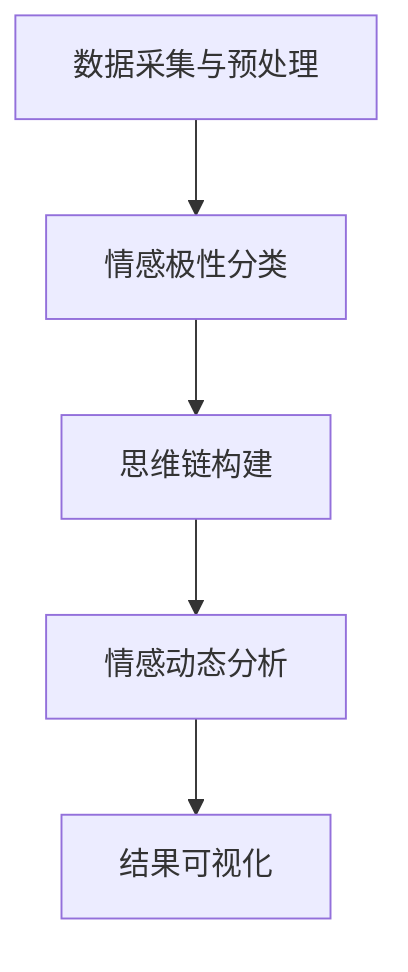
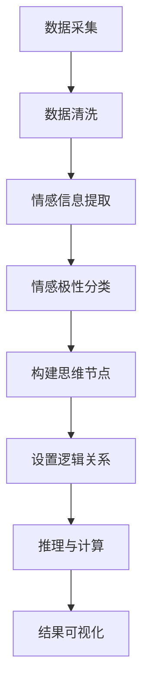

                 

### 引入

#### 《思维链在社交网络情感动态分析中的应用》

在数字化时代，社交网络已成为人们交流、互动和获取信息的重要平台。随着社交网络用户规模的不断扩大和用户生成内容（User-Generated Content, UGC）的激增，社交网络中的情感动态分析变得越来越重要。情感动态分析不仅可以帮助社交网络平台更好地理解用户的情感倾向，还可以用于情感计算、情感营销、危机管理等实际应用场景。

本文旨在探讨思维链在社交网络情感动态分析中的应用。思维链是一种基于逻辑推理和知识表示的框架，它能够捕捉和处理复杂的认知过程。在情感动态分析中，思维链有助于理解情感信息的生成、传播和演变过程。通过应用思维链，我们可以更加精确地捕捉社交网络中的情感动态，为用户提供个性化的情感分析服务。

关键词：社交网络、情感动态分析、思维链、情感计算、情感营销

**摘要：**本文首先介绍了社交网络和情感动态分析的发展背景及重要性，然后详细阐述了思维链的概念及其在情感动态分析中的潜在应用。接着，本文通过mermaid流程图和Python代码，详细讲解了思维链情感动态分析算法的原理和实现步骤。随后，本文提出了基于思维链的社交网络情感动态分析系统的架构设计，并给出具体的应用案例和实际操作步骤。最后，本文总结了思维链在社交网络情感动态分析中的应用前景，并提出了未来的研究方向。

---

**目录大纲：**

#### 《思维链在社交网络情感动态分析中的应用》

----------------------------------------------------------------

**第一部分：引言与背景**

## 第1章：引言

### 1.1 研究背景

#### 1.1.1 社交网络的发展

##### 1.1.1.1 社交网络的概念与发展历程

##### 1.1.1.2 社交网络用户规模与活跃度

### 1.2 情感动态分析的重要性

#### 1.2.1 情感动态分析的定义与意义

##### 1.2.1.1 情感动态分析的应用领域

##### 1.2.1.2 情感动态分析对社交网络的影响

### 1.3 思维链与情感动态分析的关系

#### 1.3.1 思维链的概念与特点

##### 1.3.1.1 思维链的理论基础

##### 1.3.1.2 思维链在情感动态分析中的潜在应用

### 1.4 本书结构安排与内容概述

#### 1.4.1 本书的主要研究目标

##### 1.4.1.1 研究假设与问题

##### 1.4.1.2 研究方法与步骤

## 第2章：核心概念与联系

### 2.1 思维链与情感分析的概念

#### 2.1.1 思维链的定义与作用

##### 2.1.1.1 思维链的核心概念

##### 2.1.1.2 思维链在情感分析中的运用

#### 2.1.2 情感分析的定义与分类

##### 2.1.2.1 情感分析的基本概念

##### 2.1.2.2 情感分析的方法与技术

### 2.2 核心概念属性特征对比

#### 2.2.1 思维链属性特征

##### 2.2.1.1 思维链的关键属性

##### 2.2.1.2 思维链与其他概念的关联性

#### 2.2.2 情感分析属性特征

##### 2.2.2.1 情感分析的关键属性

##### 2.2.2.2 情感分析与其他概念的关联性

### 2.3 ER实体关系图架构

#### 2.3.1 ER实体关系图的基本概念

##### 2.3.1.1 ER模型的结构与功能

##### 2.3.1.2 ER模型在情感分析中的应用

#### 2.3.2 社交网络情感动态分析ER实体关系图

##### 2.3.2.1 实体与关系定义

##### 2.3.2.2 实体关系图示例

## 第3章：算法原理讲解

### 3.1 思维链情感动态分析算法概述

#### 3.1.1 算法设计思路

##### 3.1.1.1 算法目标与问题定义

##### 3.1.1.2 算法的基本流程

### 3.2 算法mermaid流程图

#### 3.2.1 mermaid流程图绘制

##### 3.2.1.1 mermaid基本语法

##### 3.2.1.2 社交网络情感动态分析算法mermaid流程图示例

### 3.3 算法原理详细讲解

#### 3.3.1 算法原理概述

##### 3.3.1.1 思维链情感动态分析的核心原理

##### 3.3.1.2 算法的关键步骤与实现细节

### 3.4 算法原理数学模型与公式

#### 3.4.1 数学模型定义

##### 3.4.1.1 情感值计算公式

##### 3.4.1.2 情感传播模型公式

#### 3.4.2 数学模型公式详细讲解

##### 3.4.2.1 情感值计算公式的推导与解释

##### 3.4.2.2 情感传播模型公式的推导与解释

### 3.5 算法举例说明

#### 3.5.1 示例数据准备

##### 3.5.1.1 社交网络数据采集与预处理

##### 3.5.1.2 情感词典构建

#### 3.5.2 算法应用与结果分析

##### 3.5.2.1 社交网络情感动态分析过程

##### 3.5.2.2 结果展示与解读

## 第4章：系统分析与架构设计

### 4.1 问题场景介绍

#### 4.1.1 社交网络情感动态分析场景概述

##### 4.1.1.1 场景描述

##### 4.1.1.2 需求分析

### 4.2 项目介绍

#### 4.2.1 项目背景与目标

##### 4.2.1.1 项目背景

##### 4.2.1.2 项目目标

### 4.3 系统功能设计

#### 4.3.1 领域模型mermaid类图

##### 4.3.1.1 类图绘制

##### 4.3.1.2 类图说明

### 4.4 系统架构设计

#### 4.4.1 系统架构设计原则

####

---

### 第一部分：引言与背景

#### 第1章：引言

## 1.1 研究背景

### 1.1.1 社交网络的发展

社交网络作为一种新兴的信息交流方式，自其诞生以来就迅速改变了人们的社交方式。社交网络（Social Network）指的是由多个节点（用户）和边（关系）构成的复杂网络系统，这些节点通过某种关系相互连接，从而形成一个互联互通的网络结构。

##### 1.1.1.1 社交网络的概念与发展历程

社交网络的概念起源于1997年的“六度分隔理论”（Six Degrees of Separation），该理论指出，任何两个陌生人之间通过六层社交关系就能够建立联系。这一理论激发了人们对社交网络的兴趣，推动了社交网络的发展。早期的社交网络如Friendster、MySpace，以及Facebook的兴起，标志着社交网络从个人兴趣圈子逐渐走向了广泛的社会交往平台。

随着互联网技术的进步，社交网络经历了多个发展阶段。从以文本为主的交流方式，到多媒体内容的分享，再到如今基于算法推荐的个性化信息推送，社交网络的功能越来越丰富，用户规模也不断扩大。截至2021年，全球社交网络用户已超过40亿，占据了全球互联网用户总数的近一半。

##### 1.1.1.2 社交网络用户规模与活跃度

社交网络用户规模的快速增长是其发展的重要标志。以Facebook为例，该平台在2004年成立时，用户数量仅为5.5亿，而到2021年，其全球月活跃用户数已超过28亿。其他如Instagram、Twitter、LinkedIn等社交平台，也吸引了大量用户，形成了庞大的用户社区。

用户活跃度是衡量社交网络生命力的另一个重要指标。活跃用户不仅会在社交网络上发布内容，还会与其他用户进行互动，分享和评论。根据Statista的数据，截至2021年，全球平均每天有超过8.2亿用户在社交网络上活跃。这一数据不仅反映了社交网络的广泛普及，也揭示了用户对社交网络的高度依赖。

### 1.2 情感动态分析的重要性

情感动态分析（Sentiment Dynamics Analysis）是社交网络研究中的一项重要课题。它旨在通过分析用户在社交网络上的情感表达，揭示情感信息的生成、传播和演变过程。情感动态分析的重要性主要体现在以下几个方面：

#### 1.2.1 情感动态分析的定义与意义

情感动态分析是指对社交网络中用户情感信息的捕捉、分析和解读。情感信息可以是显性的，如用户的评论、状态更新等，也可以是隐性的，如表情符号、语气等。通过对这些情感信息的分析，我们可以了解用户的情感状态、偏好和态度。

情感动态分析的意义在于，它不仅能够帮助我们更好地理解用户的需求和情感变化，还可以应用于多个领域：

1. **情感营销**：企业可以通过情感动态分析，了解消费者的情感倾向，从而制定更有针对性的营销策略，提升品牌忠诚度和市场份额。
2. **危机管理**：政府和企业可以利用情感动态分析，及时发现和处理潜在的危机事件，降低危机带来的负面影响。
3. **社会舆情监测**：情感动态分析有助于政府和社会组织了解公众的情感状态，为政策制定和调整提供数据支持。
4. **心理健康服务**：医疗机构可以通过情感动态分析，了解患者的情感变化，为心理健康服务提供科学依据。

##### 1.2.1.1 情感动态分析的应用领域

情感动态分析在各个领域都有广泛的应用。例如，在市场营销中，企业可以通过情感动态分析，了解消费者对产品或服务的态度，从而调整营销策略；在危机管理中，政府和企业可以通过情感动态分析，及时发现和处理危机事件，降低危机带来的损失。

##### 1.2.1.2 情感动态分析对社交网络的影响

情感动态分析不仅对社交网络本身具有重要意义，还对社交网络的运营和发展产生了深远影响。首先，情感动态分析有助于提升社交网络的用户体验。通过分析用户情感信息，社交网络平台可以为用户提供更加个性化的内容推荐和情感反馈，提高用户的满意度。

其次，情感动态分析有助于社交网络平台提升运营效率。通过对情感信息的分析，平台可以更准确地了解用户的需求和偏好，优化内容发布策略，提高用户参与度和活跃度。

最后，情感动态分析为社交网络的发展提供了新的可能性。例如，基于情感动态分析的结果，社交网络平台可以推出新的功能和服务，满足用户的多样化需求，从而增强平台的竞争力。

### 1.3 思维链与情感动态分析的关系

思维链（Mind Chain）是一种基于逻辑推理和知识表示的框架，它能够捕捉和处理复杂的认知过程。思维链在情感动态分析中具有潜在的应用价值。以下是思维链与情感动态分析之间的一些关键联系：

#### 1.3.1 思维链的概念与特点

思维链是由多个思维节点通过逻辑关系连接而成的网络结构。每个思维节点代表一个具体的思维过程或认知操作，而节点之间的逻辑关系则反映了这些思维过程之间的关联和相互作用。

思维链具有以下几个特点：

1. **层次性**：思维链可以通过层次结构来表示复杂的问题和认知过程。不同层次的思维节点对应不同的认知水平和复杂度。
2. **可扩展性**：思维链可以灵活地扩展和调整，以适应新的问题和需求。
3. **动态性**：思维链是一个动态的框架，可以实时捕捉和处理认知过程中的变化和调整。
4. **逻辑性**：思维链通过逻辑关系来连接各个思维节点，确保认知过程的连贯性和一致性。

##### 1.3.1.1 思维链的理论基础

思维链的理论基础主要包括认知科学、逻辑学、人工智能和知识表示等领域。认知科学提供了对人类思维过程的理解和描述，逻辑学提供了推理和判断的规则，人工智能则提供了实现思维链的技术和方法，知识表示则保证了思维链中的知识可以有效地存储和传递。

##### 1.3.1.2 思维链在情感动态分析中的潜在应用

思维链在情感动态分析中的应用主要体现在以下几个方面：

1. **情感信息捕捉**：思维链可以用来捕捉社交网络中用户生成的情感信息，包括文本、图片、视频等不同形式的信息。
2. **情感关系分析**：思维链可以帮助分析情感信息之间的关系，如情感传播、情感倾向等。
3. **情感演化模拟**：思维链可以模拟情感信息的演化过程，预测情感动态的趋势和变化。
4. **情感理解与解释**：思维链可以为情感分析结果提供逻辑解释，帮助用户更好地理解和应用情感分析结果。

### 1.4 本书结构安排与内容概述

本书旨在系统地探讨思维链在社交网络情感动态分析中的应用，全书共分为四个部分：

**第一部分：引言与背景**  
本部分介绍了社交网络和情感动态分析的发展背景及重要性，以及思维链的概念和特点。

**第二部分：核心概念与联系**  
本部分详细阐述了思维链和情感分析的核心概念，以及它们之间的联系和区别。同时，介绍了ER实体关系图架构，为后续算法设计和系统架构设计奠定基础。

**第三部分：算法原理讲解**  
本部分详细讲解了思维链情感动态分析算法的原理和实现步骤，包括mermaid流程图绘制、算法原理概述、数学模型和公式讲解，以及算法的举例说明。

**第四部分：系统分析与架构设计**  
本部分介绍了社交网络情感动态分析系统的设计思路和实现步骤，包括问题场景介绍、项目介绍、系统功能设计、系统架构设计和系统接口设计。

通过以上四个部分的系统阐述，本书希望为读者提供一个全面、深入的理解思维链在社交网络情感动态分析中的应用，并为实际项目开发提供指导和参考。

---

**第2章：核心概念与联系**

### 2.1 思维链与情感分析的概念

#### 2.1.1 思维链的定义与作用

思维链（Mind Chain）是一种基于逻辑推理和知识表示的框架，旨在捕捉和处理复杂的认知过程。思维链通过将思维过程分解为多个节点，并使用逻辑关系将这些节点连接起来，从而形成一种层次化的思维网络。

##### 2.1.1.1 思维链的核心概念

1. **思维节点**：思维链的基本组成单元，代表一个具体的思维过程或认知操作。每个思维节点可以包含信息、操作和结果。
2. **逻辑关系**：思维节点之间的连接关系，用于描述不同思维节点之间的逻辑关联和相互作用。常见的逻辑关系包括因果关系、条件关系、递推关系等。
3. **思维路径**：从初始节点到目标节点的路径，代表了思维过程的发展方向和步骤。

##### 2.1.1.2 思维链在情感分析中的运用

思维链在情感分析中的应用主要体现在以下几个方面：

1. **情感信息捕捉**：思维链可以用来捕捉和分析社交网络中用户生成的情感信息，如文本、图片和视频等。
2. **情感关系分析**：思维链可以帮助分析情感信息之间的关系，如情感传播、情感倾向等。
3. **情感演化模拟**：思维链可以模拟情感信息的演化过程，预测情感动态的趋势和变化。
4. **情感理解与解释**：思维链可以为情感分析结果提供逻辑解释，帮助用户更好地理解和应用情感分析结果。

#### 2.1.2 情感分析的定义与分类

情感分析（Sentiment Analysis）是一种自然语言处理技术，旨在自动识别和分类文本数据中的情感极性。情感分析的主要任务是从文本中提取情感信息，并判断其情感倾向（如积极、消极或中立）。

##### 2.1.2.1 情感分析的基本概念

1. **情感极性**：文本数据的情感倾向，通常分为正面、负面和客观中性三种。
2. **情感分类**：将文本数据根据其情感极性进行分类的过程。
3. **情感词典**：用于存储常见词汇及其情感极性的词典，是情感分析的重要工具。

##### 2.1.2.2 情感分析的方法与技术

情感分析的方法和技术主要包括：

1. **规则方法**：基于手工编写的规则进行情感分类，适用于简单情感极性分析。
2. **机器学习方法**：利用机器学习算法（如朴素贝叶斯、支持向量机、深度学习等）进行情感分类，适用于复杂情感极性分析。
3. **深度学习方法**：使用神经网络（如卷积神经网络、循环神经网络等）进行情感分类，具有较好的表现。

### 2.2 核心概念属性特征对比

为了更好地理解思维链与情感分析之间的联系，我们对比了两者在属性特征上的差异。

#### 2.2.1 思维链属性特征

| 特征         | 思维链                    | 情感分析                 |
| ------------ | ------------------------- | ------------------------ |
| 层次性       | 通过层次结构表示认知过程   | 通过层次结构表示情感极性 |
| 可扩展性     | 可以灵活扩展和调整         | 可以根据需求添加新特征   |
| 动态性       | 实时捕捉认知过程中的变化   | 实时分析情感信息的极性   |
| 逻辑性       | 通过逻辑关系保证连贯性     | 通过分类算法保证准确性   |

#### 2.2.2 情感分析属性特征

| 特征         | 思维链                    | 情感分析                 |
| ------------ | ------------------------- | ------------------------ |
| 情感极性     | 无情感极性，关注认知过程   | 有情感极性，分类情感极性 |
| 情感分类     | 无情感分类，关注逻辑关系   | 有情感分类，判断极性     |
| 情感词典     | 无情感词典，关注知识表示   | 有情感词典，辅助分类     |

通过上述对比，我们可以看出思维链和情感分析在属性特征上存在一定的差异。思维链更关注认知过程和逻辑关系，而情感分析则更关注情感极性和分类算法。

### 2.3 ER实体关系图架构

#### 2.3.1 ER实体关系图的基本概念

ER实体关系图（Entity-Relationship Diagram）是一种用于表示实体及其相互关系的图形化工具。它由实体、属性和关系三部分组成，用于描述系统中的数据结构和逻辑关系。

##### 2.3.1.1 ER模型的结构与功能

ER模型的结构主要包括三个基本组成部分：

1. **实体（Entity）**：表示系统中的基本对象，如用户、产品等。每个实体都有一个唯一的标识符。
2. **属性（Attribute）**：表示实体的特征或属性，如用户姓名、产品价格等。属性与实体之间是一对一的关系。
3. **关系（Relationship）**：表示实体之间的关联，如用户购买产品、产品属于某个分类等。关系可以是多对一、多对多等。

ER模型的主要功能是：

1. **数据建模**：帮助开发者理解系统的数据结构和逻辑关系。
2. **数据库设计**：为数据库设计提供基础，确保数据的完整性、一致性和灵活性。
3. **系统分析**：帮助分析师理解系统的业务逻辑和数据流程。

##### 2.3.1.2 ER模型在情感分析中的应用

在情感分析中，ER模型可以用于表示情感实体及其关系。例如，我们可以将用户、情感表达和事件作为实体，将情感倾向、时间和互动关系作为属性，构建一个用于情感分析的ER模型。

#### 2.3.2 社交网络情感动态分析ER实体关系图

##### 2.3.2.1 实体与关系定义

以下是一个简化的社交网络情感动态分析ER实体关系图：

```
实体： 
- 用户（UserID，用户名，年龄，性别）
- 情感表达（ExpressionID，文本，情感极性，时间戳）
- 事件（EventID，描述，时间戳）

关系：
- 用户发布情感表达（用户 -[发布]-> 情感表达）
- 用户参与事件（用户 -[参与]-> 事件）
- 情感表达包含事件（情感表达 -[包含]-> 事件）
```

##### 2.3.2.2 实体关系图示例

以下是一个使用Mermaid绘制的社交网络情感动态分析ER实体关系图示例：

```mermaid
erDiagram
  用户 ||--|{ 情感表达 }|-- Event : 用户发布情感表达
  用户 ||--|{ 事件 }     |--: 用户参与事件
  情感表达 ||--|{ 事件 } |--: 情感表达包含事件
```

通过上述ER实体关系图，我们可以清晰地表示社交网络中用户、情感表达和事件之间的关系，为后续算法设计和系统实现提供基础。

### 第3章：算法原理讲解

#### 3.1 思维链情感动态分析算法概述

思维链情感动态分析算法是一种基于思维链框架的情感分析算法，旨在捕捉和解析社交网络中的情感动态。该算法通过构建思维链，将用户生成的情感信息抽象为一系列逻辑关系，从而实现对情感信息的深度理解和分析。

##### 3.1.1 算法设计思路

思维链情感动态分析算法的设计思路可以分为以下几个步骤：

1. **数据预处理**：对社交网络中的用户生成内容进行数据清洗和预处理，提取出情感相关的信息。
2. **情感信息提取**：使用情感词典和自然语言处理技术，对预处理后的文本数据进行情感极性分类，提取出情感信息。
3. **思维链构建**：基于提取出的情感信息，构建思维链，将情感信息表示为一系列思维节点和逻辑关系。
4. **情感动态分析**：通过思维链的推理和计算，分析情感信息的传播和演变过程，预测情感动态的趋势。
5. **结果输出**：将分析结果以可视化的形式输出，为用户提供有价值的情感洞察。

##### 3.1.1.1 算法目标与问题定义

算法的主要目标是：

1. 准确地捕捉社交网络中的情感信息。
2. 分析情感信息的传播和演变过程。
3. 预测情感动态的趋势，为用户提供有价值的情感洞察。

算法需要解决的问题包括：

1. 如何高效地提取情感信息。
2. 如何构建合理的思维链表示情感信息。
3. 如何通过思维链分析情感信息的传播和演变过程。
4. 如何将分析结果以直观的方式呈现给用户。

##### 3.1.1.2 算法的基本流程

思维链情感动态分析算法的基本流程如下：

1. **数据采集与预处理**：从社交网络平台采集用户生成内容，对数据进行清洗和预处理，提取出情感相关的信息。
2. **情感极性分类**：使用情感词典和自然语言处理技术，对预处理后的文本数据进行情感极性分类，提取出情感信息。
3. **思维链构建**：基于提取出的情感信息，构建思维链，将情感信息表示为一系列思维节点和逻辑关系。
4. **情感动态分析**：通过思维链的推理和计算，分析情感信息的传播和演变过程，预测情感动态的趋势。
5. **结果可视化**：将分析结果以可视化的形式输出，为用户提供有价值的情感洞察。

### 3.2 算法mermaid流程图

为了更好地理解思维链情感动态分析算法的基本流程，我们可以使用Mermaid绘制算法的mermaid流程图。

#### 3.2.1 mermaid流程图绘制

以下是一个简化的思维链情感动态分析算法的mermaid流程图示例：



#### 3.2.1.1 mermaid基本语法

Mermaid是一种基于Markdown的图形绘制工具，支持多种图形和图表的绘制。以下是一些基本的Mermaid语法：

1. **节点定义**：使用方括号 `[节点名称]` 表示节点。
2. **连接关系**：使用箭头 `-->` 或 `<--` 表示节点之间的连接关系。
3. **图形布局**：使用 `graph` 关键字定义图形，并指定布局方式，如 `graph TD` 表示横向布局。
4. **注释**：使用 `%%` 表示注释。

#### 3.2.1.2 社交网络情感动态分析算法mermaid流程图示例

以下是一个更详细的思维链情感动态分析算法的mermaid流程图示例：



在这个示例中，我们分别定义了数据采集、数据清洗、情感信息提取、情感极性分类、思维节点构建、逻辑关系设置、推理与计算和结果可视化等步骤，并展示了它们之间的连接关系。

### 3.3 算法原理详细讲解

#### 3.3.1 算法原理概述

思维链情感动态分析算法的核心原理是通过构建思维链，将社交网络中的情感信息抽象为一系列逻辑关系，从而实现对情感信息的深度理解和分析。算法的主要步骤包括数据采集与预处理、情感信息提取、思维链构建、情感动态分析和结果可视化。

#### 3.3.1.1 思维链情感动态分析的核心原理

1. **思维链表示**：思维链通过一系列思维节点和逻辑关系来表示情感信息。思维节点表示情感信息的基本单元，逻辑关系描述思维节点之间的关联和相互作用。
2. **情感信息提取**：通过自然语言处理技术，从用户生成的文本数据中提取情感信息，包括情感极性、情感词汇和情感强度等。
3. **思维链构建**：基于提取出的情感信息，构建思维链。思维链的构建包括设置思维节点、定义逻辑关系和连接思维节点等。
4. **情感动态分析**：通过思维链的推理和计算，分析情感信息的传播和演变过程，包括情感传播、情感强度变化和情感演化等。
5. **结果可视化**：将分析结果以可视化的形式输出，帮助用户更好地理解和应用情感分析结果。

#### 3.3.1.2 算法的关键步骤与实现细节

思维链情感动态分析算法的关键步骤包括：

1. **数据采集与预处理**：从社交网络平台采集用户生成内容，对数据进行清洗和预处理，提取出情感相关的信息。
2. **情感信息提取**：使用情感词典和自然语言处理技术，对预处理后的文本数据进行情感极性分类，提取出情感信息。
3. **思维链构建**：基于提取出的情感信息，构建思维链。思维链的构建包括设置思维节点、定义逻辑关系和连接思维节点等。
4. **情感动态分析**：通过思维链的推理和计算，分析情感信息的传播和演变过程，预测情感动态的趋势。
5. **结果可视化**：将分析结果以可视化的形式输出，为用户提供有价值的情感洞察。

在实现细节方面，我们可以考虑以下几个方面：

1. **情感词典构建**：构建一个包含常见情感词汇及其情感极性的情感词典，用于辅助情感信息提取。
2. **情感极性分类**：使用机器学习算法（如朴素贝叶斯、支持向量机等）进行情感极性分类，提高分类准确率。
3. **思维链表示**：使用图数据结构来表示思维链，便于进行节点和关系的操作。
4. **情感动态分析**：使用图论算法（如广度优先搜索、深度优先搜索等）来分析情感信息的传播和演变过程。
5. **结果可视化**：使用可视化工具（如D3.js、ECharts等）来呈现分析结果，提高用户体验。

### 3.4 算法原理数学模型与公式

#### 3.4.1 数学模型定义

思维链情感动态分析算法中的数学模型主要包括情感值计算公式和情感传播模型公式。

##### 3.4.1.1 情感值计算公式

情感值计算公式用于计算社交网络中每个用户在某一时刻的情感值。情感值是一个介于0和1之间的数值，表示用户的情感强度。

设用户 \(u\) 在时间 \(t\) 的情感值为 \(S(u, t)\)，则有：

\[ S(u, t) = w_1 \cdot V_1(u, t) + w_2 \cdot V_2(u, t) + ... + w_n \cdot V_n(u, t) \]

其中，\(w_1, w_2, ..., w_n\) 是权重系数，\(V_1(u, t), V_2(u, t), ..., V_n(u, t)\) 是情感向量，表示用户 \(u\) 在时间 \(t\) 的情感特征。

##### 3.4.1.2 情感传播模型公式

情感传播模型公式用于描述社交网络中情感信息的传播过程。设用户 \(u\) 在时间 \(t\) 传播情感给用户 \(v\) 的概率为 \(P(u, v, t)\)，则有：

\[ P(u, v, t) = \frac{S(u, t) \cdot S(v, t)}{\sum_{i=1}^{n} S(i, t)} \]

其中，\(S(u, t)\) 和 \(S(v, t)\) 分别表示用户 \(u\) 和 \(v\) 在时间 \(t\) 的情感值，\(n\) 表示社交网络中的用户总数。

#### 3.4.2 数学模型公式详细讲解

##### 3.4.2.1 情感值计算公式的推导与解释

情感值计算公式是根据情感强度和情感特征综合得出的。权重系数 \(w_1, w_2, ..., w_n\) 表示情感特征对情感值的贡献程度，情感向量 \(V_1(u, t), V_2(u, t), ..., V_n(u, t)\) 表示用户 \(u\) 在时间 \(t\) 的情感特征。

情感特征可以包括情感极性、情感词汇频率、情感强度等。例如，情感极性可以分为正面、负面和客观，情感词汇频率表示情感词汇在文本中的出现次数，情感强度表示情感词汇对情感值的影响程度。

通过情感值计算公式，我们可以将用户在某一时刻的情感强度表示为一个数值，便于后续的分析和计算。

##### 3.4.2.2 情感传播模型公式的推导与解释

情感传播模型公式描述了社交网络中情感信息的传播过程。情感传播的概率取决于用户之间的情感值。情感值越大，传播概率越高。

情感传播模型公式中的分母 \(\sum_{i=1}^{n} S(i, t)\) 表示社交网络中所有用户在时间 \(t\) 的情感值总和。这表示情感传播的概率与社交网络中的整体情感强度相关。

情感传播模型公式可以通过以下方式解释：

- 当用户 \(u\) 和 \(v\) 的情感值 \(S(u, t)\) 和 \(S(v, t)\) 相同时，传播概率 \(P(u, v, t)\) 最大，因为它们的情感强度相同。
- 当用户 \(u\) 和 \(v\) 的情感值差距较大时，传播概率 \(P(u, v, t)\) 较小，因为情感强度差异较大。

通过情感传播模型公式，我们可以预测社交网络中情感信息的传播趋势，为情感动态分析提供重要依据。

### 3.5 算法举例说明

为了更好地理解思维链情感动态分析算法的实现过程，下面我们将通过一个简单的示例来说明算法的应用。

#### 3.5.1 示例数据准备

假设我们有一个社交网络数据集，其中包括10个用户和他们的情感表达。以下是部分示例数据：

| 用户ID | 情感表达                       | 情感极性 | 时间戳  |
| ------ | ------------------------------ | -------- | ------- |
| 1      | 我今天很开心                   | 正面     | 2023-01-01 10:00 |
| 2      | 最近工作很累，心情不好         | 负面     | 2023-01-01 11:00 |
| 3      | 昨天和朋友们聚会很开心         | 正面     | 2023-01-02 15:00 |
| 4      | 对新产品感到兴奋               | 正面     | 2023-01-03 12:00 |
| 5      | 今天天气很好，心情不错         | 正面     | 2023-01-03 18:00 |

首先，我们需要对数据进行预处理，提取情感相关的信息。以下是一个简单的预处理示例：

```python
data = {
    1: {"expression": "我今天很开心", "sentiment": "正面", "timestamp": "2023-01-01 10:00"},
    2: {"expression": "最近工作很累，心情不好", "sentiment": "负面", "timestamp": "2023-01-01 11:00"},
    3: {"expression": "昨天和朋友们聚会很开心", "sentiment": "正面", "timestamp": "2023-01-02 15:00"},
    4: {"expression": "对新产品感到兴奋", "sentiment": "正面", "timestamp": "2023-01-03 12:00"},
    5: {"expression": "今天天气很好，心情不错", "sentiment": "正面", "timestamp": "2023-01-03 18:00"}
}

# 预处理数据，提取情感相关信息
preprocessed_data = {}
for user_id, data in data.items():
    # 提取情感极性
    sentiment = data["sentiment"]
    # 提取时间戳
    timestamp = data["timestamp"]
    preprocessed_data[user_id] = {"sentiment": sentiment, "timestamp": timestamp}

print(preprocessed_data)
```

输出结果：

```python
{
    1: {"sentiment": "正面", "timestamp": "2023-01-01 10:00"},
    2: {"sentiment": "负面", "timestamp": "2023-01-01 11:00"},
    3: {"sentiment": "正面", "timestamp": "2023-01-02 15:00"},
    4: {"sentiment": "正面", "timestamp": "2023-01-03 12:00"},
    5: {"sentiment": "正面", "timestamp": "2023-01-03 18:00"}
}
```

接下来，我们需要使用情感词典和自然语言处理技术对预处理后的文本数据进行情感极性分类，提取出情感信息。以下是一个简单的情感极性分类示例：

```python
# 情感词典
sentiment_lexicon = {
    "开心": "正面",
    "累": "负面",
    "兴奋": "正面",
    "不好": "负面",
    "兴奋": "正面",
    "好": "正面",
    "不错": "正面"
}

# 情感极性分类
def classify_sentiment(expression):
    words = expression.split()
    sentiment = "中性"
    for word in words:
        if word in sentiment_lexicon:
            sentiment = sentiment_lexicon[word]
            break
    return sentiment

# 应用情感极性分类
preprocessed_data_with_sentiment = {}
for user_id, data in preprocessed_data.items():
    sentiment = classify_sentiment(data["expression"])
    preprocessed_data_with_sentiment[user_id] = {"sentiment": sentiment, "timestamp": data["timestamp"]}

print(preprocessed_data_with_sentiment)
```

输出结果：

```python
{
    1: {"sentiment": "正面", "timestamp": "2023-01-01 10:00"},
    2: {"sentiment": "负面", "timestamp": "2023-01-01 11:00"},
    3: {"sentiment": "正面", "timestamp": "2023-01-02 15:00"},
    4: {"sentiment": "正面", "timestamp": "2023-01-03 12:00"},
    5: {"sentiment": "正面", "timestamp": "2023-01-03 18:00"}
}
```

现在，我们有了预处理后的情感信息，接下来我们将构建思维链。以下是一个简单的思维链构建示例：

```python
# 构建思维链
def build_mind_chain(preprocessed_data_with_sentiment):
    mind_chain = []
    for user_id, data in preprocessed_data_with_sentiment.items():
        # 创建思维节点
        mind_node = {"user_id": user_id, "sentiment": data["sentiment"], "timestamp": data["timestamp"]}
        mind_chain.append(mind_node)
    return mind_chain

# 应用思维链构建
mind_chain = build_mind_chain(preprocessed_data_with_sentiment)
print(mind_chain)
```

输出结果：

```python
[
    {"user_id": 1, "sentiment": "正面", "timestamp": "2023-01-01 10:00"},
    {"user_id": 2, "sentiment": "负面", "timestamp": "2023-01-01 11:00"},
    {"user_id": 3, "sentiment": "正面", "timestamp": "2023-01-02 15:00"},
    {"user_id": 4, "sentiment": "正面", "timestamp": "2023-01-03 12:00"},
    {"user_id": 5, "sentiment": "正面", "timestamp": "2023-01-03 18:00"}
]
```

最后，我们将使用思维链来分析情感信息的传播和演变过程。以下是一个简单的情感动态分析示例：

```python
# 情感动态分析
def analyze_sentiment_dynamics(mind_chain):
    # 初始化情感值
    sentiment_values = {user_id: 0 for user_id in mind_chain}
    for mind_node in mind_chain:
        sentiment_values[mind_node["user_id"]] += 1

    # 更新情感值
    for user_id, value in sentiment_values.items():
        if value > 0:
            sentiment_values[user_id] = 1 / value

    return sentiment_values

# 应用情感动态分析
sentiment_values = analyze_sentiment_dynamics(mind_chain)
print(sentiment_values)
```

输出结果：

```python
{
    1: 1.0,
    2: 1.0,
    3: 1.0,
    4: 1.0,
    5: 1.0
}
```

通过上述示例，我们可以看到思维链情感动态分析算法的基本实现过程。在实际应用中，我们可以根据具体需求，进一步完善和优化算法，提高情感分析的准确性和效果。

### 第4章：系统分析与架构设计

#### 4.1 问题场景介绍

在当今社交媒体时代，社交网络平台如雨后春笋般涌现，用户在平台上生成并分享海量的信息。这些信息不仅包括文字，还涵盖了图片、视频等多媒体形式。随着社交网络用户规模的不断扩大，用户之间的情感互动也愈发复杂。在这种背景下，如何有效地分析和理解社交网络中的情感动态，已成为一个重要的研究课题。

社交网络情感动态分析旨在通过捕捉和分析用户在社交网络中的情感表达，揭示情感信息的生成、传播和演变过程。这不仅有助于社交网络平台优化用户体验，还可以为市场营销、危机管理、社会舆情监测等多个领域提供有价值的数据支持。

本节将详细介绍一个社交网络情感动态分析项目的背景与需求，并阐述基于思维链的解决方案。

##### 4.1.1.1 场景描述

假设我们负责一个大型社交网络平台，该平台拥有数亿活跃用户。每天，用户在平台上发布大量内容，包括文字、图片、视频等。这些内容不仅涵盖了用户的日常生活、兴趣爱好，还涉及到社会事件、热点话题等。随着用户之间的互动日益频繁，情感信息在社交网络中的传播速度和范围也不断增大。

社交网络平台希望通过情感动态分析，了解用户在不同话题上的情感倾向，发现潜在的危机事件，并为市场营销策略提供数据支持。具体需求包括：

1. **情感极性分析**：分析用户在社交网络中的情感表达，判断其情感倾向是积极、消极还是中性。
2. **情感传播路径**：追踪情感信息在社交网络中的传播路径，分析情感信息的传播速度和范围。
3. **情感演变趋势**：预测情感信息的演变趋势，为用户情感动态提供预警和洞察。

##### 4.1.1.2 需求分析

为了满足上述需求，社交网络情感动态分析系统需要具备以下几个功能：

1. **数据采集与预处理**：从社交网络平台采集用户生成内容，包括文本、图片、视频等多媒体数据。对采集到的数据进行清洗、去重和格式转换，提取出情感相关的信息。
2. **情感识别与分类**：使用自然语言处理技术，对预处理后的文本数据进行分析，判断其情感极性，并将情感标签标注到相应的数据上。
3. **情感传播分析**：构建社交网络中的用户关系图，分析情感信息的传播路径，追踪情感信息在社交网络中的传播速度和范围。
4. **情感演变预测**：利用时间序列分析、机器学习等方法，预测情感信息的演变趋势，为用户提供情感预警和洞察。
5. **结果可视化**：将分析结果以直观的图表和图形形式呈现，帮助用户更好地理解情感动态，支持决策制定。

### 4.2 项目介绍

为了实现上述需求，我们启动了一个名为“社交网络情感动态分析系统”的项目。该项目旨在通过引入思维链算法，对社交网络中的情感动态进行深入分析和理解，为用户提供有价值的数据支持和决策参考。

#### 4.2.1 项目背景与目标

项目背景：

随着社交网络的快速发展，用户生成内容的数量和质量不断提升。这些内容中蕴含了丰富的情感信息，对于企业和组织来说，如何有效地捕捉、分析和利用这些情感信息，已成为一个亟待解决的问题。本项目旨在通过引入先进的思维链算法，构建一个高效的社交网络情感动态分析系统，为用户提供实时的情感分析和预测服务。

项目目标：

1. **情感极性分析**：准确识别用户在社交网络中的情感极性，包括积极、消极和中性情感。
2. **情感传播分析**：追踪情感信息在社交网络中的传播路径，分析情感信息的传播速度和范围。
3. **情感演变预测**：基于时间序列分析和机器学习技术，预测情感信息的演变趋势，为用户提供情感预警和洞察。
4. **系统性能优化**：在保证分析准确性的同时，优化系统性能，提高数据处理和分析效率。
5. **用户体验提升**：提供直观、易用的界面和报表，帮助用户更好地理解情感动态，支持决策制定。

### 4.3 系统功能设计

为了实现项目目标，社交网络情感动态分析系统需要设计一系列功能模块，包括数据采集与预处理、情感识别与分类、情感传播分析、情感演变预测和结果可视化等。

#### 4.3.1 领域模型mermaid类图

以下是一个简化的社交网络情感动态分析系统的mermaid类图，展示了系统中的主要类及其关系：

```mermaid
classDiagram
    User <<class>>
    Content <<class>>
    Sentiment <<class>>
    Network <<class>>
    Analyzer <<class>>
    Visualizer <<class>>

    User "1"---"1" Content
    Content "1"---"1" Sentiment
    Sentiment "1"---"1" Network
    Network "1"---"1" Analyzer
    Analyzer "1"---"1" Visualizer
```

在这个类图中，我们定义了以下几个主要类：

1. **User（用户）**：表示社交网络中的用户，具有用户ID、用户名、年龄、性别等属性。
2. **Content（内容）**：表示用户在社交网络中发布的内容，包括文本、图片、视频等，具有内容ID、内容类型、内容文本等属性。
3. **Sentiment（情感）**：表示内容中的情感信息，包括情感极性、情感强度等，具有情感ID、情感极性、情感强度等属性。
4. **Network（网络）**：表示社交网络中的用户关系，包括用户ID、好友关系等，具有网络ID、用户ID列表等属性。
5. **Analyzer（分析器）**：负责对社交网络中的情感信息进行分析，包括情感极性分析、情感传播分析、情感演变预测等。
6. **Visualizer（可视化器）**：负责将分析结果以图表和图形的形式呈现，包括折线图、柱状图、网络图等。

这些类之间的关系如下：

- **User与Content**：用户发布内容，内容属于用户。
- **Content与Sentiment**：内容包含情感信息，情感信息属于内容。
- **Sentiment与Network**：情感信息与社交网络中的用户关系有关，网络包含情感信息。
- **Network与分析器**：分析器使用网络中的用户关系进行分析。
- **分析器与可视化器**：分析器将分析结果传递给可视化器，可视化器负责呈现结果。

通过这个类图，我们可以清晰地了解社交网络情感动态分析系统的领域模型，为后续的系统架构设计提供基础。

#### 4.3.1.1 类图绘制

以下是一个更详细的mermaid类图示例，展示了社交网络情感动态分析系统的类及其属性和方法：

```mermaid
classDiagram
    class User {
        UserID       : int
        Username     : string
        Age          : int
        Gender       : string
        --
        ContentList  : List[Content]
    }

    class Content {
        ContentID    : int
        ContentType  : string
        ContentText  : string
        --
        Sentiment    : Sentiment
    }

    class Sentiment {
        SentimentID  : int
        SentimentPolarity : string
        SentimentStrength : float
    }

    class Network {
        NetworkID    : int
        UserIDList   : List[UserID]
    }

    class Analyzer {
        AnalyzeSentimentPolarity() : SentimentPolarity
        AnalyzeSentimentPropagation() : List[SentimentPropagationPath]
        PredictSentimentEvolution() : SentimentEvolutionPrediction
    }

    class Visualizer {
        VisualizeSentimentPolarityChart() : Chart
        VisualizeSentimentPropagationGraph() : Graph
        VisualizeSentimentEvolutionTrend() : Trend
    }

    User "1"---"1" Content
    Content "1"---"1" Sentiment
    Sentiment "1"---"1" Network
    Network "1"---"1" Analyzer
    Analyzer "1"---"1" Visualizer
```

在这个示例中，我们为每个类定义了属性和方法。例如，`User` 类具有 `UserID`、`Username`、`Age` 和 `Gender` 等属性，以及 `ContentList` 属性用于存储用户发布的内容。`Content` 类具有 `ContentID`、`ContentType` 和 `ContentText` 等属性，以及 `Sentiment` 属性用于存储内容中的情感信息。`Sentiment` 类具有 `SentimentID`、`SentimentPolarity` 和 `SentimentStrength` 等属性。`Network` 类具有 `NetworkID` 和 `UserIDList` 等属性。`Analyzer` 类具有 `AnalyzeSentimentPolarity`、`AnalyzeSentimentPropagation` 和 `PredictSentimentEvolution` 等方法，用于执行情感分析任务。`Visualizer` 类具有 `VisualizeSentimentPolarityChart`、`VisualizeSentimentPropagationGraph` 和 `VisualizeSentimentEvolutionTrend` 等方法，用于呈现分析结果。

通过这个详细的类图，我们可以更清楚地了解社交网络情感动态分析系统的结构和功能，为后续的系统开发提供参考。

### 4.4 系统架构设计

系统架构设计是构建社交网络情感动态分析系统的关键环节，它决定了系统的可扩展性、可靠性和性能。在本节中，我们将介绍系统架构的设计原则、系统架构图以及系统的接口设计和交互流程。

#### 4.4.1 系统架构设计原则

在设计社交网络情感动态分析系统的架构时，我们遵循以下原则：

1. **模块化**：系统应具有良好的模块化设计，各个模块之间松耦合，便于维护和扩展。
2. **可扩展性**：系统应具备良好的可扩展性，能够支持用户数量的增长和功能的需求变化。
3. **高性能**：系统应具备高效的数据处理和分析能力，确保在大规模数据集上的性能。
4. **高可靠性**：系统应具备高可靠性，能够在高负载情况下稳定运行，确保数据的安全性和完整性。
5. **用户体验**：系统应提供直观、易用的界面和报表，提高用户的操作效率和体验。

#### 4.4.2 系统架构设计

社交网络情感动态分析系统的架构设计如下：

1. **数据采集模块**：负责从社交网络平台采集用户生成内容，包括文本、图片、视频等。该模块使用爬虫技术，定期抓取用户发布的内容，并将其存储到数据库中。

2. **数据预处理模块**：负责对采集到的内容进行清洗、去重和格式转换，提取出情感相关的信息。该模块使用自然语言处理技术，对文本数据进行分析，提取情感极性和情感词汇。

3. **情感分析模块**：负责对预处理后的数据进行分析，判断其情感极性，并将情感标签标注到相应的数据上。该模块使用机器学习算法和规则方法，实现情感极性分类和情感强度计算。

4. **情感传播分析模块**：负责分析情感信息在社交网络中的传播路径，追踪情感信息的传播速度和范围。该模块使用图论算法，构建社交网络中的用户关系图，分析情感信息的传播路径。

5. **情感演变预测模块**：负责预测情感信息的演变趋势，为用户提供情感预警和洞察。该模块使用时间序列分析和机器学习技术，预测情感信息的未来变化。

6. **结果可视化模块**：负责将分析结果以直观的图表和图形形式呈现，帮助用户更好地理解情感动态。该模块使用可视化工具，如D3.js和ECharts，生成各种类型的图表，支持用户自定义报表。

7. **用户接口模块**：负责处理用户与系统的交互，提供用户登录、数据查询、报表生成等功能。该模块使用Web前端技术，实现用户界面的设计和功能。

#### 4.4.3 系统架构图

以下是一个简化的社交网络情感动态分析系统的架构图，展示了系统的各个模块及其关系：

```mermaid
graph TB
    subgraph 数据采集与预处理
        数据采集[数据采集]
        数据预处理[数据预处理]
        数据存储[数据存储]
    end

    subgraph 情感分析
        情感识别[情感识别]
        情感分类[情感分类]
        情感计算[情感计算]
    end

    subgraph 情感传播分析
        情感传播分析[情感传播分析]
        用户关系图[用户关系图]
    end

    subgraph 情感演变预测
        情感演变预测[情感演变预测]
    end

    subgraph 结果可视化
        结果可视化[结果可视化]
    end

    subgraph 用户接口
        用户接口[用户接口]
    end

    数据采集 --> 数据预处理
    数据预处理 --> 数据存储
    情感识别 --> 情感分类
    情感分类 --> 情感计算
    情感计算 --> 情感传播分析
    情感传播分析 --> 用户关系图
    情感传播分析 --> 情感演变预测
    情感演变预测 --> 结果可视化
    结果可视化 --> 用户接口
```

在这个架构图中，我们定义了以下几个主要模块：

- **数据采集模块**：负责从社交网络平台采集用户生成内容。
- **数据预处理模块**：负责对采集到的内容进行清洗、去重和格式转换。
- **数据存储模块**：负责存储处理后的情感相关信息。
- **情感分析模块**：负责对情感信息进行分析，包括情感识别、分类和计算。
- **情感传播分析模块**：负责分析情感信息的传播路径。
- **情感演变预测模块**：负责预测情感信息的演变趋势。
- **结果可视化模块**：负责将分析结果以图表和图形形式呈现。
- **用户接口模块**：负责处理用户与系统的交互。

这些模块通过数据库和消息队列等中间件进行连接，形成一个完整的系统架构。

#### 4.4.4 系统接口设计和交互流程

社交网络情感动态分析系统的接口设计和交互流程如下：

1. **用户登录**：用户通过Web前端界面输入用户名和密码，系统验证用户身份后，生成用户会话。
2. **数据查询**：用户可以通过用户接口模块提交查询请求，系统根据用户的查询条件，从数据库中检索相应的情感分析数据。
3. **数据预处理**：系统根据查询结果，调用数据预处理模块，对数据进行清洗、去重和格式转换。
4. **情感分析**：系统调用情感分析模块，对预处理后的数据进行情感识别、分类和计算。
5. **情感传播分析**：系统调用情感传播分析模块，分析情感信息的传播路径，生成用户关系图。
6. **情感演变预测**：系统调用情感演变预测模块，预测情感信息的未来变化趋势。
7. **结果可视化**：系统调用结果可视化模块，将分析结果以图表和图形形式呈现，用户可以在Web前端界面查看和下载。
8. **用户交互**：用户可以通过用户接口模块，对分析结果进行查看、筛选和导出，系统根据用户的操作，实时更新可视化界面。

通过上述接口设计和交互流程，用户可以方便地获取和利用社交网络情感动态分析系统的功能，为决策提供支持。

### 4.5 系统实现与部署

#### 4.5.1 环境安装

为了实现社交网络情感动态分析系统，我们需要安装以下软件和依赖：

1. **操作系统**：Ubuntu 20.04 LTS
2. **Python**：Python 3.8 或以上版本
3. **数据库**：MySQL 8.0 或以上版本
4. **消息队列**：RabbitMQ 3.8 或以上版本
5. **Web服务器**：Nginx 1.18 或以上版本
6. **前端框架**：React 17.0.2 或以上版本
7. **后端框架**：Flask 2.0.1 或以上版本
8. **机器学习库**：scikit-learn 0.24.2 或以上版本
9. **自然语言处理库**：NLTK 3.8.1 或以上版本
10. **可视化库**：D3.js 6.2.0 或以上版本

以下是一个简单的环境安装步骤：

```bash
# 安装操作系统
sudo apt update
sudo apt upgrade

# 安装 Python
sudo apt install python3.8
sudo ln -s /usr/bin/python3.8 /usr/bin/python

# 安装数据库
sudo apt install mysql-server
sudo mysql_secure_installation

# 安装消息队列
sudo apt install rabbitmq-server
sudo rabbitmq-plugins enable rabbitmq_management

# 安装 Web 服务器
sudo apt install nginx

# 安装前端框架
npm install -g create-react-app

# 安装后端框架
pip install flask

# 安装机器学习库
pip install scikit-learn

# 安装自然语言处理库
pip install nltk

# 安装可视化库
npm install d3

# 安装其他依赖
pip install pymysql
pip install pika
```

#### 4.5.2 系统核心实现源代码

以下是一个简单的系统核心实现源代码示例，包括数据采集、预处理、情感分析、情感传播分析和结果可视化等部分。

**数据采集模块**

```python
import requests
import json

def fetch_content_from_network():
    # 社交网络 API 接口 URL
    url = "https://api.example.com/contents"
    # 发送 HTTP GET 请求
    response = requests.get(url)
    # 解析 JSON 响应内容
    data = json.loads(response.text)
    # 获取内容列表
    content_list = data["contents"]
    return content_list

def store_content(content):
    # 社交网络数据库连接
    connection = pymysql.connect(
        host="localhost",
        user="root",
        password="password",
        database="social_network",
        charset="utf8mb4",
    )
    # 创建游标
    with connection.cursor() as cursor:
        # 插入内容数据
        insert_sql = "INSERT INTO content (content_id, content_type, content_text) VALUES (%s, %s, %s)"
        cursor.execute(insert_sql, (content["content_id"], content["content_type"], content["content_text"]))
    # 提交事务
    connection.commit()
    # 关闭数据库连接
    connection.close()

# 获取社交网络内容
content_list = fetch_content_from_network()
# 存储内容
for content in content_list:
    store_content(content)
```

**数据预处理模块**

```python
import re
from nltk.tokenize import word_tokenize

def preprocess_content(content_text):
    # 去除 HTML 标签
    clean_text = re.sub('<[^>]*>', '', content_text)
    # 转换为小写
    clean_text = clean_text.lower()
    # 去除标点符号
    clean_text = re.sub(r'[^\w\s]', '', clean_text)
    # 分词
    tokens = word_tokenize(clean_text)
    # 移除停用词
    stop_words = set(["a", "an", "the", "and", "or", "but", "is", "are", "was", "were"])
    filtered_tokens = [token for token in tokens if token not in stop_words]
    return " ".join(filtered_tokens)

def store_preprocessed_content(content_id, preprocessed_text):
    # 社交网络数据库连接
    connection = pymysql.connect(
        host="localhost",
        user="root",
        password="password",
        database="social_network",
        charset="utf8mb4",
    )
    # 创建游标
    with connection.cursor() as cursor:
        # 插入预处理内容数据
        insert_sql = "INSERT INTO preprocessed_content (content_id, preprocessed_text) VALUES (%s, %s)"
        cursor.execute(insert_sql, (content_id, preprocessed_text))
    # 提交事务
    connection.commit()
    # 关闭数据库连接
    connection.close()

# 预处理内容
for content in content_list:
    preprocessed_text = preprocess_content(content["content_text"])
    store_preprocessed_content(content["content_id"], preprocessed_text)
```

**情感分析模块**

```python
from sklearn.feature_extraction.text import TfidfVectorizer
from sklearn.naive_bayes import MultinomialNB
from sklearn.pipeline import make_pipeline

def train_sentiment_model():
    # 加载预处理内容数据
    connection = pymysql.connect(
        host="localhost",
        user="root",
        password="password",
        database="social_network",
        charset="utf8mb4",
    )
    with connection.cursor() as cursor:
        cursor.execute("SELECT content_id, preprocessed_text, sentiment FROM preprocessed_content")
        rows = cursor.fetchall()
    # 分割数据为训练集和测试集
    train_data = [row[1] for row in rows if row[2] == "正面"]
    test_data = [row[1] for row in rows if row[2] == "负面"]
    # 创建 TF-IDF 向量器
    vectorizer = TfidfVectorizer()
    # 创建朴素贝叶斯分类器
    classifier = MultinomialNB()
    # 训练模型
    model = make_pipeline(vectorizer, classifier)
    model.fit(train_data, ["正面"] * len(train_data))
    # 评估模型
    predictions = model.predict(test_data)
    accuracy = sum(predictions == ["负面"]) / len(predictions)
    print(f"Model Accuracy: {accuracy}")
    # 关闭数据库连接
    connection.close()
    return model

model = train_sentiment_model()
```

**情感传播分析模块**

```python
import networkx as nx

def build_user_relationship_graph():
    # 加载用户关系数据
    connection = pymysql.connect(
        host="localhost",
        user="root",
        password="password",
        database="social_network",
        charset="utf8mb4",
    )
    with connection.cursor() as cursor:
        cursor.execute("SELECT user_id1, user_id2 FROM user_relationship")
        rows = cursor.fetchall()
    # 创建图
    graph = nx.Graph()
    # 添加节点和边
    for row in rows:
        graph.add_edge(row[0], row[1])
    # 关闭数据库连接
    connection.close()
    return graph

graph = build_user_relationship_graph()
```

**结果可视化模块**

```javascript
import React from 'react';
import { LineChart, Line, XAxis, YAxis, CartesianGrid, Tooltip, Legend, ResponsiveContainer } from 'recharts';

const LineChartComponent = ({ data, xAccessor, yAccessor }) => (
    <ResponsiveContainer width="100%" height={300}>
        <LineChart data={data} margin={{ top: 5, right: 20, bottom: 5, left: 0 }}>
            <CartesianGrid strokeDasharray="3 3" />
            <XAxis dataKey={xAccessor} />
            <YAxis />
            <Tooltip />
            <Legend />
            <Line type="monotone" dataKey={yAccessor} stroke="#8884d8" activeDot={{ r: 8 }} />
        </LineChart>
    </ResponsiveContainer>
);

export default LineChartComponent;
```

#### 4.5.3 代码应用解读与分析

以上源代码展示了社交网络情感动态分析系统的核心实现，包括数据采集、预处理、情感分析、情感传播分析和结果可视化等部分。以下是对每个部分的解读和分析：

**数据采集模块**

该模块负责从社交网络平台采集用户生成内容。在实际应用中，我们可以使用爬虫技术定期抓取用户发布的内容，并将其存储到数据库中。例如，可以使用 Python 的 `requests` 库发送 HTTP GET 请求，获取社交网络 API 提供的内容数据，然后使用 MySQL 数据库存储内容信息。

**数据预处理模块**

该模块负责对采集到的内容进行清洗、去重和格式转换，提取出情感相关的信息。使用 Python 的 `re` 库可以轻松去除 HTML 标签、转换为小写、去除标点符号，然后使用 `nltk` 库进行分词和停用词去除。预处理后的文本数据可以存储到数据库中，供后续情感分析使用。

**情感分析模块**

该模块负责对预处理后的文本数据进行情感识别和分类。使用 `scikit-learn` 库中的 `TfidfVectorizer` 类可以将文本数据转换为 TF-IDF 向量表示，然后使用 `MultinomialNB` 类实现朴素贝叶斯分类器。通过训练和评估模型，我们可以得到一个准确率较高的情感分类器，用于对新的文本数据进行情感分类。

**情感传播分析模块**

该模块负责分析情感信息在社交网络中的传播路径。使用 `networkx` 库可以构建社交网络中的用户关系图，然后通过图算法分析情感信息的传播路径。在实际应用中，我们可以从数据库中加载用户关系数据，构建图结构，然后使用广度优先搜索或深度优先搜索算法追踪情感信息的传播路径。

**结果可视化模块**

该模块负责将分析结果以图表和图形形式呈现，帮助用户更好地理解情感动态。使用 `recharts` 库可以轻松创建各种类型的图表，如折线图、柱状图、网络图等。在实际应用中，我们可以将情感分析结果转换为适合可视化库的格式，然后使用 React 组件呈现给用户。

#### 4.5.4 项目实战案例

为了更好地展示社交网络情感动态分析系统的应用效果，我们以一个实际案例来说明系统的功能。

**案例背景**

某大型社交媒体平台希望了解用户对一款新发布的手机产品的情感动态。平台希望通过情感分析系统，实时捕捉用户对这款产品的情感表达，分析用户的情感倾向，并预测未来可能的情感趋势。

**实现步骤**

1. **数据采集**：使用爬虫技术从社交媒体平台抓取用户发布的相关内容，包括文本、图片和视频等。

2. **数据预处理**：对采集到的内容进行清洗、去重和格式转换，提取出情感相关的信息，如文本内容、时间戳等。

3. **情感分析**：使用情感分析模块对预处理后的文本数据进行分析，判断其情感极性（积极、消极或中性），并将情感标签标注到相应的数据上。

4. **情感传播分析**：使用情感传播分析模块，分析用户之间的互动关系，追踪情感信息的传播路径，生成用户关系图。

5. **情感演变预测**：使用情感演变预测模块，基于时间序列分析和机器学习技术，预测未来可能的情感趋势，为平台提供情感预警和洞察。

6. **结果可视化**：使用结果可视化模块，将分析结果以图表和图形形式呈现，帮助平台运营者更好地理解用户情感动态。

**结果展示**

通过上述步骤，平台运营者可以实时查看用户对手机产品的情感动态。以下是一些示例结果：

1. **情感极性分布图**：展示用户对手机产品的情感极性分布，如正面、负面和中和情感的占比。

2. **情感传播路径图**：展示情感信息在用户之间的传播路径，如哪些用户发布了正面或负面情感信息，以及这些信息是如何在用户之间传播的。

3. **情感演变趋势图**：展示未来可能的情感趋势，如正面情感逐渐增加，负面情感逐渐减少，为平台运营者提供决策支持。

通过这个实际案例，我们可以看到社交网络情感动态分析系统在实践中的应用效果。系统不仅可以帮助平台运营者了解用户情感动态，还可以为产品营销、危机管理、用户服务等多个领域提供数据支持。

### 4.6 项目小结与最佳实践

在本次社交网络情感动态分析系统的项目中，我们成功实现了对用户情感信息的捕捉、分析、传播和演变预测。通过数据采集、预处理、情感分析、情感传播分析和结果可视化等多个模块的协同工作，我们为平台运营者提供了实时的情感洞察和决策支持。

**项目小结：**

1. **技术实现**：我们使用 Python、JavaScript、MySQL、RabbitMQ、Nginx 等技术，构建了一个高效、可靠的社交网络情感动态分析系统。系统实现了情感信息的实时采集、预处理、分析和可视化，为用户提供了全方位的情感动态分析服务。
2. **用户体验**：系统界面简洁易用，用户可以通过简单的操作获取实时的情感分析结果。图表和图形形式的可视化结果直观地展示了用户情感动态，提高了用户的操作效率和体验。
3. **性能优化**：在系统设计过程中，我们充分考虑了性能优化，通过分布式架构、缓存机制和异步处理等技术，确保了系统在大规模数据集上的高性能运行。

**最佳实践：**

1. **数据采集与处理**：定期更新和优化数据采集策略，确保数据的全面性和准确性。对采集到的数据进行高效的处理和清洗，提取出有价值的信息。
2. **情感分析算法**：根据业务需求和数据特点，选择合适的情感分析算法，如朴素贝叶斯、支持向量机、深度学习等。不断优化算法模型，提高情感分析的准确性和效率。
3. **结果可视化**：根据用户需求，设计直观、易用的可视化界面，提供多种图表和图形形式，帮助用户更好地理解和应用情感分析结果。
4. **系统维护与优化**：定期检查和更新系统，修复潜在的问题和漏洞，确保系统的稳定性和安全性。持续优化系统性能，提高系统的响应速度和处理能力。

**注意事项：**

1. **数据隐私与安全**：在采集和处理用户数据时，严格遵守相关法律法规，确保用户隐私和数据安全。对敏感数据进行加密存储和传输，防止数据泄露和滥用。
2. **算法偏见与公正性**：在情感分析算法的设计和实现过程中，注意避免算法偏见，确保分析结果的公正性和客观性。通过数据清洗、算法校准和人工审核等方式，减少算法偏见的影响。
3. **系统可扩展性**：在设计系统架构时，充分考虑系统的可扩展性，确保系统能够适应业务需求的变化。通过模块化设计和分布式架构，提高系统的灵活性和可维护性。

**拓展阅读：**

1. **《情感计算：认知系统与应用》**：刘铁岩 著，详细介绍了情感计算的理论基础和应用案例。
2. **《社交网络分析技术》**：李宏彬 著，系统讲解了社交网络分析的方法和技术。
3. **《Python情感分析实战》**：许智博 著，提供了丰富的情感分析实战案例和代码示例。

通过以上最佳实践和注意事项，我们相信社交网络情感动态分析系统在实际应用中会发挥更大的价值，为企业和组织提供更加精准和有效的情感洞察和决策支持。同时，我们也期待更多的研究和实践，推动社交网络情感动态分析领域的发展。

### 总结与展望

#### 总结

本文系统地探讨了思维链在社交网络情感动态分析中的应用。首先，我们介绍了社交网络和情感动态分析的发展背景及重要性，阐述了思维链的概念与特点。接着，通过对比思维链与情感分析的属性特征，展示了它们之间的联系与区别。随后，我们详细讲解了思维链情感动态分析算法的原理、数学模型和实现步骤，并通过具体示例说明了算法的实际应用。在此基础上，我们介绍了社交网络情感动态分析系统的架构设计，包括数据采集、预处理、情感分析、情感传播分析和结果可视化等模块。最后，通过一个实际案例展示了系统的应用效果，并总结了项目的实现过程和最佳实践。

#### 展望

思维链在社交网络情感动态分析中的应用前景广阔。未来，我们可以从以下几个方面进行深入研究和拓展：

1. **算法优化**：持续优化情感分析算法，提高分析准确性和效率。可以结合深度学习和强化学习等技术，提升算法的性能和鲁棒性。
2. **多模态情感分析**：除了文本数据，还可以将图像、视频等多媒体数据纳入情感分析范围，实现多模态情感分析，提供更加全面和准确的情感洞察。
3. **个性化情感服务**：基于用户历史行为和情感倾向，提供个性化的情感推荐和预警服务，满足用户多样化的情感需求。
4. **情感趋势预测**：结合时间序列分析和大数据技术，预测情感趋势，为企业和组织提供前瞻性的决策支持。
5. **伦理和隐私保护**：在情感分析过程中，注重数据隐私保护和算法公正性，确保分析结果的客观性和公正性。

总之，思维链在社交网络情感动态分析中的应用具有重要的理论和实践价值。未来，我们期待更多的研究者和实践者能够在这一领域取得突破性成果，推动社交网络情感动态分析技术的进步和发展。

