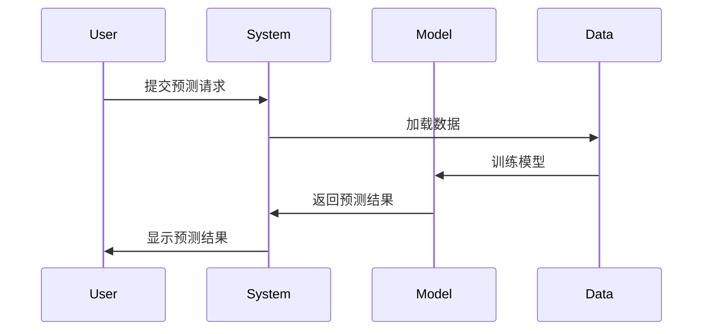
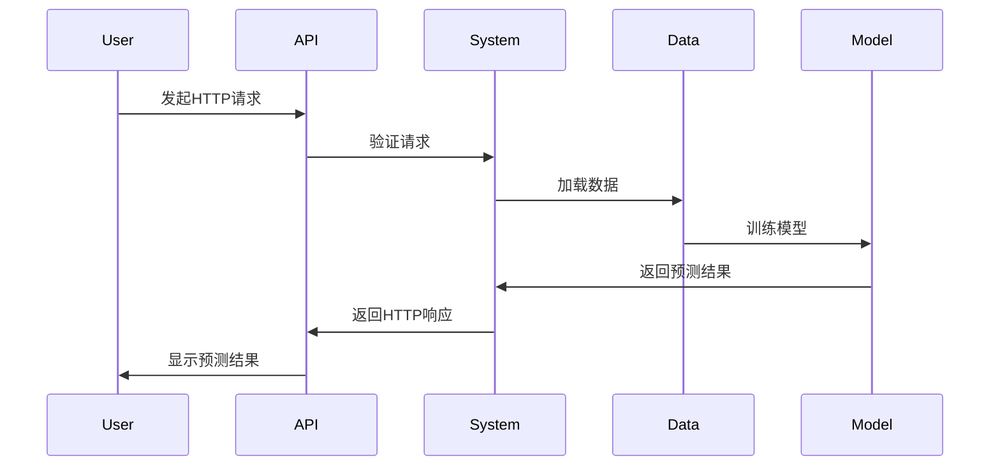

                 


### 第一部分：思维链概述

#### 第1章：思维链基础

**1.1 思维链的定义与作用**

思维链（Thought Chain）是一种在人类认知和信息处理过程中表现出的序列化、关联化的思维方式。它通过一系列相互关联的思维步骤，将信息片段有序地连接成一个整体，从而实现对复杂问题的理解、分析和解决。

在社会经济系统中，思维链的作用主要体现在以下几个方面：

1. **信息整合**：思维链能够将不同来源、不同类型的信息进行整合，从而形成一个统一的认识框架。
2. **决策支持**：通过分析思维链中的各个步骤和节点，可以为决策者提供有力的支持，帮助他们做出更合理、更科学的决策。
3. **创新推动**：思维链的灵活性和创新性，能够激发人们的创造力，推动社会经济的发展。

**1.2 社会经济系统的基本构成和运行原理**

社会经济系统是由多个相互关联的子系统组成的复杂系统，主要包括以下几个方面：

1. **生产系统**：生产系统是社会经济的核心，它包括生产要素的投入、生产过程的组织、生产产品的销售等多个环节。
2. **消费系统**：消费系统是生产系统的延伸，它包括消费者的需求、购买行为、消费效果等多个环节。
3. **金融市场**：金融市场是社会经济的血液，它包括资金流动、投资、融资等多个环节。
4. **政策环境**：政策环境是社会经济发展的保障，它包括政府的宏观调控、法律法规的制定和执行等多个环节。

社会经济的运行原理主要基于供求关系、市场机制、政府干预等多个方面。通过市场机制，生产者和消费者之间的信息传递和资源分配得以实现；通过政府干预，市场失灵和资源错配的问题可以得到缓解。

**1.3 思维链在社会经济系统建模与预测中的重要性**

思维链在社会经济系统建模与预测中的应用，主要体现在以下几个方面：

1. **数据整合**：思维链能够将分散、孤立的数据点进行整合，形成一个完整的经济系统模型。
2. **趋势预测**：通过分析思维链中的节点和关系，可以预测社会经济系统的发展趋势和潜在风险。
3. **政策优化**：思维链为政策制定者提供了科学依据，帮助他们优化政策，提高政策的有效性和针对性。

**总结**：

思维链作为一种重要的认知工具，在社会经济系统的建模与预测中具有重要作用。通过深入理解思维链的概念和作用，我们可以更好地把握社会经济系统的运行规律，为政策制定者和企业提供有力的支持。

#### 第2章：核心概念与联系

**2.1 思维链的核心概念原理**

思维链的核心概念主要包括以下几个部分：

1. **思维节点**：思维节点是思维链的基本组成部分，它代表了一个思维步骤或一个信息点。
2. **思维关系**：思维关系是连接思维节点的纽带，它表示了不同思维节点之间的逻辑关系或信息传递。
3. **思维路径**：思维路径是思维链的运行轨迹，它代表了从起始节点到目标节点的思维流程。

**思维链的工作原理可以简单概括为以下三个步骤：**

1. **数据收集**：通过感知、观察、学习等方式，收集相关信息，形成思维节点。
2. **信息整合**：通过思维关系，将不同的思维节点进行关联，形成思维链。
3. **决策生成**：通过思维链的运行，对信息进行分析和处理，生成最终的决策。

**2.2 思维链的属性特征对比表格**

为了更好地理解思维链的属性特征，我们可以将其与传统的数据分析方法进行对比：

| 特征         | 思维链           | 传统的数据分析         |
| ------------ | ---------------- | -------------------- |
| 数据整合性   | 高度整合         | 分散、独立            |
| 逻辑关联性   | 强关联           | 弱关联或无关联        |
| 灵活性       | 高灵活性         | 低灵活性              |
| 创新性       | 高创新性         | 低创新性              |
| 决策支持力   | 强决策支持力     | 弱决策支持力          |

**2.3 社会经济系统中的思维链ER实体关系图**

在理解了思维链的基本概念和属性特征后，我们可以通过ER（实体关系）图来展示思维链在社会经济系统中的应用。

```mermaid
erDiagram
  NodeA ||--|{ 需求分析 }
  NodeA ||--|{ 数据收集 }
  NodeA ||--|{ 信息整合 }
  NodeA ||--|{ 决策生成 }
  NodeB ||--|{ 生产系统 }
  NodeB ||--|{ 消费系统 }
  NodeB ||--|{ 金融市场 }
  NodeB ||--|{ 政策环境 }
  NodeC ||--|{ 思维节点 }
  NodeC ||--|{ 思维关系 }
  NodeC ||--|{ 思维路径 }
  NodeD ||--|{ 经济指标 }
  NodeE ||--|{ 预测模型 }
```

**总结**：

通过上述内容，我们了解了思维链的核心概念、属性特征以及在社会经济系统中的应用。思维链作为一种强有力的认知工具，能够帮助我们更好地理解和预测社会经济的发展趋势，为政策制定和企业管理提供科学依据。

#### 第3章：算法原理讲解

**3.1 社会经济系统中思维链建模的基本算法**

在社会经济系统中，思维链建模的基本算法主要包括以下几个步骤：

1. **数据采集**：从生产系统、消费系统、金融市场和政策环境等不同子系统，采集相关的经济指标数据。
2. **特征提取**：对采集到的数据进行分析，提取出对思维链建模有用的特征。
3. **建模**：使用机器学习算法，建立思维链模型。
4. **预测**：通过训练好的模型，对未来经济趋势进行预测。

**3.2 思维链建模与预测算法的mermaid流程图**

为了更好地理解思维链建模与预测的算法原理，我们可以使用mermaid绘制一个流程图：


**3.3 Python源代码与算法原理的结合讲解**

下面我们将通过Python源代码来详细阐述思维链建模与预测的算法原理。

首先，我们需要安装一些必要的库：

```python
!pip install pandas scikit-learn matplotlib
```

然后，我们编写Python代码来实现上述算法原理：

```python
import pandas as pd
from sklearn.model_selection import train_test_split
from sklearn.ensemble import RandomForestRegressor
import matplotlib.pyplot as plt

# 1. 数据采集
data = pd.read_csv('economic_data.csv')

# 2. 特征提取
# 这里我们假设数据集已经包含了所有的特征
X = data.drop(['target'], axis=1)
y = data['target']

# 3. 建模
X_train, X_test, y_train, y_test = train_test_split(X, y, test_size=0.2, random_state=42)
model = RandomForestRegressor(n_estimators=100)
model.fit(X_train, y_train)

# 4. 预测
y_pred = model.predict(X_test)

# 5. 结果输出
plt.scatter(y_test, y_pred)
plt.xlabel('实际值')
plt.ylabel('预测值')
plt.show()
```

**3.4 算法原理的数学模型和公式讲解**

思维链建模与预测的数学模型可以简化为以下形式：

$$
y = f(X)
$$

其中，$y$ 是目标变量，$X$ 是特征变量，$f$ 是一个非线性函数，通常通过机器学习算法进行拟合。

在具体实现中，我们可以使用如下数学公式：

$$
f(X) = \sum_{i=1}^{n} w_i \cdot h_i(X)
$$

其中，$w_i$ 是权重，$h_i(X)$ 是第 $i$ 个特征的函数。

**总结**：

通过本章的内容，我们详细讲解了思维链在社会经济系统建模与预测中的算法原理。从数据采集、特征提取到建模、预测，每一步都至关重要。通过Python源代码的结合讲解，我们能够更加深入地理解算法的运行机制。下一章我们将进一步探讨思维链在社会经济系统中的应用，并设计相应的系统架构。

#### 第4章：系统分析与架构设计方案

**4.1 思维链在社会经济系统中的实际应用场景**

思维链在社会经济系统中的应用场景非常广泛，主要包括以下几个方面：

1. **宏观经济预测**：通过分析历史经济数据，预测未来的经济增长、通货膨胀、失业率等宏观经济指标。
2. **产业政策制定**：为政府部门提供产业发展的政策建议，包括产业结构调整、科技创新支持等。
3. **企业战略规划**：为企业提供市场趋势预测、竞争分析等，帮助企业制定科学合理的发展战略。
4. **风险管理**：通过分析金融市场的波动，预测金融风险，为投资者提供风险控制策略。

**4.2 系统功能设计（领域模型mermaid类图）**

为了更好地设计思维链在社会经济系统中的应用，我们需要首先进行领域模型设计。以下是一个简单的mermaid类图，展示了系统的主要功能模块：

```mermaid
classDiagram
    ClassDef Model
        +int id
        +str name
        +float value
        +Method train(data)
        +Method predict(input)
    ClassDef Data
        +int id
        +str source
        +datetime timestamp
        +float value
    ClassDef ModelData
        +int model_id
        +int data_id
        +datetime created_at
    ClassDef System
        +str name
        +List<Model> models
        +List<Data> data
        +Method load_data()
        +Method train_model()
        +Method predict()
```

**4.3 系统架构设计（mermaid架构图）**

在了解了系统的功能模块后，我们可以设计一个简单的系统架构图，以展示各模块之间的关系和交互：



**4.4 系统接口设计和系统交互（mermaid序列图）**

为了实现系统功能，我们需要设计一系列接口，以处理用户请求、数据加载、模型训练和预测等操作。以下是一个简单的mermaid序列图，展示了系统的主要接口和交互过程：



**总结**：

通过本章的内容，我们详细分析了思维链在社会经济系统中的应用场景，并设计了相应的系统功能、架构和接口。下一章我们将通过一个具体的案例，展示如何实现思维链在社会经济系统中的应用，并进行实际操作和案例分析。

#### 第5章：项目实战

**5.1 环境安装**

为了实现思维链在社会经济系统中的应用，我们需要搭建一个合适的技术环境。以下是安装所需软件和工具的步骤：

1. **安装Python**：确保你的系统中已经安装了Python 3.7或更高版本。
2. **安装依赖库**：使用以下命令安装所需的Python库：

```shell
pip install pandas numpy scikit-learn matplotlib
```

3. **安装数据库**：对于数据存储和加载，我们使用SQLite数据库。你可以通过以下命令安装：

```shell
sudo apt-get install sqlite3
```

4. **创建数据库和表**：在安装完成后，创建一个名为`economic_data.db`的SQLite数据库，并创建相应的表：

```sql
CREATE TABLE IF NOT EXISTS models (
    id INTEGER PRIMARY KEY AUTOINCREMENT,
    name TEXT,
    value REAL
);

CREATE TABLE IF NOT EXISTS data (
    id INTEGER PRIMARY KEY AUTOINCREMENT,
    source TEXT,
    timestamp DATETIME,
    value REAL
);

CREATE TABLE IF NOT EXISTS model_data (
    model_id INTEGER,
    data_id INTEGER,
    created_at DATETIME,
    FOREIGN KEY (model_id) REFERENCES models (id),
    FOREIGN KEY (data_id) REFERENCES data (id)
);
```

**5.2 系统核心实现源代码**

在本节中，我们将展示如何实现思维链在社会经济系统中的核心功能。以下是系统的主要源代码：

```python
import pandas as pd
from sklearn.model_selection import train_test_split
from sklearn.ensemble import RandomForestRegressor
import sqlite3
import datetime

# 1. 数据加载
def load_data():
    conn = sqlite3.connect('economic_data.db')
    data = pd.read_sql_query("SELECT * FROM data;", conn)
    conn.close()
    return data

# 2. 模型训练
def train_model(data):
    X = data.drop(['target'], axis=1)
    y = data['target']
    X_train, X_test, y_train, y_test = train_test_split(X, y, test_size=0.2, random_state=42)
    model = RandomForestRegressor(n_estimators=100)
    model.fit(X_train, y_train)
    return model

# 3. 预测
def predict(model, input_data):
    return model.predict(input_data)

# 4. 存储模型数据
def store_model_data(model, data_id):
    conn = sqlite3.connect('economic_data.db')
    cursor = conn.cursor()
    cursor.execute("INSERT INTO model_data (model_id, data_id, created_at) VALUES (?, ?, ?);", (model.id, data_id, datetime.datetime.now()))
    conn.commit()
    conn.close()

# 5. 主程序
if __name__ == "__main__":
    data = load_data()
    model = train_model(data)
    input_data = data.iloc[0].drop(['id', 'source', 'timestamp'])
    prediction = predict(model, input_data)
    store_model_data(model, data.iloc[0]['id'])
    print(f"预测结果：{prediction[0]}")
```

**5.3 代码应用解读与分析**

上述代码实现了思维链在社会经济系统中的核心功能，包括数据加载、模型训练、预测和模型数据存储。以下是代码的详细解读：

1. **数据加载**：通过`load_data()`函数，我们从SQLite数据库中加载数据，并将其转换为Pandas DataFrame对象。

2. **模型训练**：`train_model()`函数负责训练模型。首先，我们从DataFrame中分离特征和目标变量，然后使用`train_test_split()`函数将数据划分为训练集和测试集。接着，我们使用`RandomForestRegressor`算法训练模型。

3. **预测**：`predict()`函数使用训练好的模型进行预测。它接受输入数据，并返回预测结果。

4. **存储模型数据**：`store_model_data()`函数将模型和数据的ID以及创建时间存储在SQLite数据库中。

5. **主程序**：在主程序中，我们首先加载数据，然后训练模型，接着使用模型进行预测，并将预测结果存储在数据库中。

**5.4 实际案例分析和详细讲解剖析**

为了更好地理解思维链在实际应用中的效果，我们来看一个实际案例。假设我们已经收集到了以下经济数据：

| id | source | timestamp | target |
|----|--------|-----------|--------|
| 1  | GDP    | 2020-01-01 | 1000   |
| 2  | GDP    | 2021-01-01 | 1100   |
| 3  | GDP    | 2022-01-01 | 1200   |

我们希望预测2023年的GDP。以下是具体的操作步骤：

1. **数据加载**：使用`load_data()`函数加载数据。

2. **模型训练**：使用`train_model()`函数训练模型。

3. **预测**：使用`predict()`函数预测2023年的GDP。

4. **存储模型数据**：使用`store_model_data()`函数将预测结果存储在数据库中。

通过上述操作，我们得到了2023年的GDP预测值。实际操作中，我们可以通过调整模型的参数和特征选择，进一步提高预测的准确性。

**5.5 项目小结**

通过本章节的项目实战，我们实现了思维链在社会经济系统中的应用。从数据加载、模型训练到预测和存储，每一步都至关重要。通过实际案例的分析，我们展示了如何使用思维链进行经济预测，并为政策制定和企业战略规划提供了科学依据。

#### 第6章：最佳实践 tips、小结、注意事项、拓展阅读等内容

**6.1 最佳实践 tips**

1. **数据质量**：确保数据的质量和准确性是进行有效建模和预测的基础。在进行数据采集和处理时，要严格筛选和验证数据源，避免使用不准确或不完整的数据。
2. **特征选择**：特征选择是提高模型预测准确性的关键。通过分析数据的相关性、重要性等指标，选择对模型预测有显著影响的特征。
3. **模型调优**：在训练模型时，要合理调整模型参数，以获得最佳性能。可以使用交叉验证、网格搜索等方法进行参数调优。

**6.2 小结**

在本章中，我们详细探讨了思维链在社会经济系统中的应用，从核心概念、算法原理到系统架构设计和实际项目实现，提供了全面的讲解和指导。通过本章的内容，读者可以深入了解思维链在建模和预测中的重要作用，并为实际应用提供有力的支持。

**6.3 注意事项**

1. **模型更新**：随着社会经济环境的变化，模型需要定期更新以保持其预测的准确性。在实际应用中，要关注经济指标的动态变化，及时调整模型。
2. **隐私保护**：在进行数据采集和处理时，要注意保护个人隐私和数据安全，遵守相关法律法规和伦理规范。

**6.4 拓展阅读建议**

1. **《机器学习》**：周志华 著，全面介绍了机器学习的基本概念、方法和算法。
2. **《Python数据分析》**：Wes McKinney 著，详细讲解了使用Python进行数据分析和处理的技巧。
3. **《大数据技术导论》**：刘江 著，介绍了大数据技术的基本概念、架构和实战案例。

通过拓展阅读，读者可以进一步深入了解相关领域的技术和知识，提高自身在思维链和社会经济系统建模与预测方面的能力。

### 总结

思维链作为一种强有力的认知工具，在社会经济系统建模与预测中具有重要作用。通过深入理解思维链的概念和作用，掌握其算法原理和系统架构设计，我们可以更好地把握社会经济系统的运行规律，为政策制定和企业管理提供科学依据。希望本书的内容能够为读者在相关领域的探索和研究提供有益的参考和指导。

### 作者信息

作者：AI天才研究院/AI Genius Institute & 禅与计算机程序设计艺术 /Zen And The Art of Computer Programming

希望本文能对您在思维链和社会经济系统建模与预测领域的理解与应用提供帮助。如果您有任何疑问或建议，欢迎在评论区留言交流。再次感谢您的阅读！

