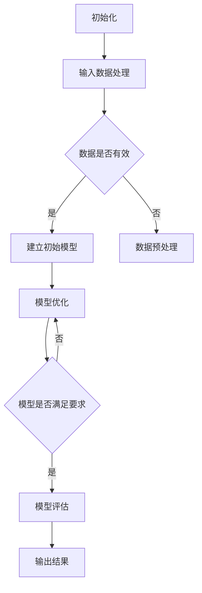
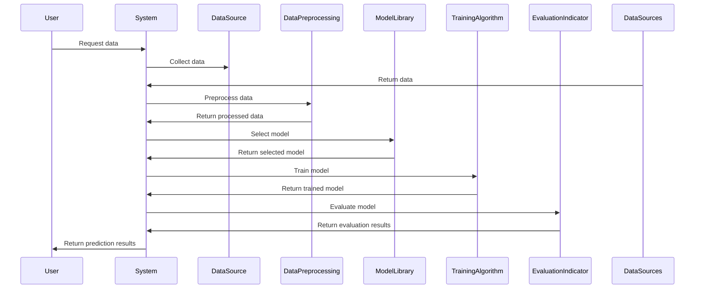
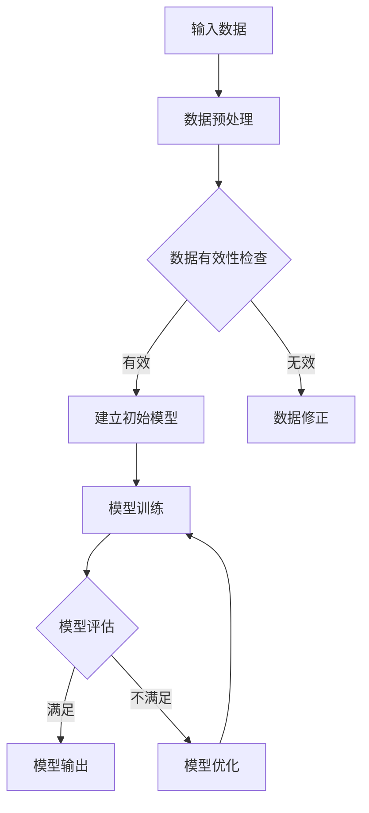

                 

# 思维链在社会经济系统建模中的应用

## 1. 引言

### 1.1 问题背景

随着社会的不断发展和经济活动的日益复杂，社会经济的运行机制和规律变得愈发难以理解和预测。在这样的背景下，社会经济的系统建模成为了研究的热点。传统的建模方法如统计学模型、回归分析等，在面对高度复杂和非线性的社会经济系统时，往往显得力不从心。这主要是因为传统方法在处理变量间复杂的相互作用和动态变化时存在局限性。

#### 1.1.1 社会经济系统建模的现状

当前，社会经济的系统建模研究主要集中在以下几个方面：

1. **微观经济模型**：通过个体行为的模拟来分析市场机制和宏观经济现象。
2. **宏观经济模型**：基于宏观经济的统计数据，构建能够反映经济周期、通货膨胀、就业等宏观经济现象的模型。
3. **政策评估模型**：用于评估不同政策对社会经济系统的影响。

然而，这些模型在应对复杂性和不确定性时，仍然面临诸多挑战。

#### 1.1.2 传统建模方法的挑战

1. **数据依赖性高**：传统模型往往需要大量的统计数据，但这些数据可能存在噪声和不完整性。
2. **模型结构刚性**：传统模型的结构相对固定，难以适应社会经济系统的动态变化。
3. **模型解释性弱**：复杂模型的结果往往难以解释，增加了决策者理解和使用模型的难度。

### 1.2 问题描述

社会经济的系统复杂度高，变量众多且关系复杂，这使得传统建模方法难以应对。具体来说，问题描述如下：

1. **多维度数据融合**：如何有效地融合来自不同维度（如人口、经济、环境等）的数据，以构建全面的经济系统模型。
2. **非线性关系建模**：社会经济系统中的变量间存在复杂的非线性关系，如何有效地建模和预测这些关系。
3. **动态变化适应性**：社会经济系统是动态变化的，如何使模型能够适应这些变化，保持预测的有效性。

### 1.3 问题解决

为了解决上述问题，我们引入了思维链技术。思维链是一种模拟人类思维过程的计算模型，它具有以下特点：

1. **自适应性**：能够根据不同的数据和环境自动调整模型结构。
2. **灵活性**：能够处理多种类型的数据和复杂的非线性关系。
3. **可扩展性**：能够方便地添加新的变量和关系，使模型不断适应新的需求。

思维链技术可以简化建模过程，提高模型的效率和解释性，从而更好地应对社会经济的复杂性。

#### 1.3.1 思维链技术的引入

思维链技术的引入，为社会经济系统建模带来了新的可能。通过模拟人类思维过程，思维链技术能够有效地捕捉社会经济系统中的复杂关系和动态变化，从而提高模型的预测能力和解释性。

#### 1.3.2 思维链技术对建模过程的简化

思维链技术的引入，使得建模过程变得更加灵活和高效。通过以下步骤，我们可以简化建模过程：

1. **数据预处理**：使用思维链技术对数据进行预处理，消除噪声和填补缺失值。
2. **模型构建**：利用思维链的灵活性，构建能够反映社会经济系统复杂关系的模型。
3. **模型训练和优化**：使用思维链的自适应性，对模型进行训练和优化，以提高预测精度。

### 1.4 边界与外延

#### 1.4.1 思维链技术在社会经济系统建模中的应用范围

思维链技术在社会经济系统建模中的应用范围广泛，包括：

1. **宏观经济预测**：对经济周期、通货膨胀、失业率等进行预测。
2. **政策评估**：评估不同政策对社会经济系统的影响。
3. **企业战略规划**：为企业提供战略规划和管理决策支持。

#### 1.4.2 核心概念与联系

在本节中，我们介绍了思维链技术在社会经济系统建模中的应用。核心概念包括：

1. **思维链技术**：一种模拟人类思维过程的计算模型。
2. **社会经济系统建模**：用于分析社会经济现象的系统建模方法。
3. **自适应性、灵活性和可扩展性**：思维链技术的主要特点。

这些核心概念相互联系，共同构成了思维链技术在社会经济系统建模中的应用框架。

### 1.5 本章小结

本章介绍了思维链技术在社会经济系统建模中的应用背景、问题和解决方案。通过引入思维链技术，我们可以简化建模过程，提高模型的效率和解释性，从而更好地理解和预测社会经济的运行规律。

----------------------------------------------------------------

## 2. 核心概念与联系

### 2.1 思维链定义与特点

#### 2.1.1 思维链的定义

思维链（Mind Chain）是一种基于计算模型的模拟人类思维过程的技术。它通过节点（Node）和边（Edge）的连接，模拟人类思维中的推理、决策和问题解决过程。

#### 2.1.2 思维链的特点

思维链具有以下特点：

1. **自适应性**：能够根据输入数据和情境自动调整模型结构和参数。
2. **灵活性**：能够处理多种类型的数据和复杂的非线性关系。
3. **可扩展性**：能够方便地添加新的节点和边，使模型不断适应新的需求。

#### 2.1.3 思维链与社会经济系统建模的关系

思维链技术在社会经济系统建模中的应用，主要体现在以下几个方面：

1. **变量关系建模**：通过模拟人类思维过程，捕捉社会经济系统中的复杂变量关系。
2. **动态变化预测**：利用思维链的自适应性，预测社会经济系统的动态变化。
3. **政策评估**：通过构建思维链模型，评估不同政策对社会经济系统的影响。

### 2.2 社会经济学基础

#### 2.2.1 社会经济系统的基本概念

社会经济系统是指由经济、社会、环境等子系统组成的复杂系统。其主要特征包括：

1. **多样性**：包括多个经济主体（如企业、个人、政府等）和多种经济活动。
2. **动态性**：社会经济系统处于不断变化中，包括经济增长、通货膨胀、就业等。
3. **复杂性**：变量间存在复杂的相互作用和反馈机制。

#### 2.2.2 社会经济系统的要素及其相互作用

社会经济系统的要素主要包括：

1. **生产要素**：如劳动力、资本、土地和技术。
2. **经济主体**：如企业、个人、政府和金融机构。
3. **经济活动**：如生产、消费、投资和贸易。

这些要素之间相互作用，共同决定了社会经济系统的运行状态。例如，劳动力供给和需求的变化会影响就业水平和工资水平，进而影响消费和投资。

### 2.3 系统建模方法

#### 2.3.1 系统建模的基本概念

系统建模是指通过建立数学模型或计算机模型，模拟和分析复杂系统的行为和性能。其主要目标包括：

1. **理解系统行为**：通过模型分析系统在不同情境下的行为和变化。
2. **预测系统性能**：基于历史数据和模型，预测系统未来的行为和趋势。
3. **支持决策**：为决策者提供科学依据，以优化系统运行。

#### 2.3.2 系统建模的方法及其在社会经济系统中的应用

系统建模的方法主要包括：

1. **统计方法**：如回归分析、时间序列分析等，用于描述系统变量之间的关系。
2. **模拟方法**：如蒙特卡洛模拟、系统动力学模型等，用于模拟系统的动态行为。
3. **机器学习方法**：如神经网络、决策树等，用于处理复杂的多变量关系。

这些方法在社会经济系统建模中都有广泛的应用。例如，利用统计方法可以分析经济变量之间的关系，利用模拟方法可以预测经济增长的趋势，利用机器学习方法可以识别市场中的潜在风险。

### 2.4 思维链技术在系统建模中的应用

思维链技术在系统建模中的应用，主要体现在以下几个方面：

1. **变量关系建模**：通过模拟人类思维过程，捕捉社会经济系统中的复杂变量关系。
2. **动态变化预测**：利用思维链的自适应性，预测社会经济系统的动态变化。
3. **政策评估**：通过构建思维链模型，评估不同政策对社会经济系统的影响。

思维链技术具有自适应性、灵活性和可扩展性等特点，使其在社会经济系统建模中具有独特的优势。通过思维链技术，我们可以更准确地理解和预测社会经济的运行规律，为政策制定和经济发展提供科学依据。

----------------------------------------------------------------

## 3. 算法原理讲解

### 3.1 思维链算法流程图

思维链算法的核心在于模拟人类思维的过程，其流程图如下所示：



### 3.2 思维链算法的Python源代码

以下是一个简单的思维链算法的Python实现示例：

```python
import numpy as np

class MindChain:
    def __init__(self, data):
        self.data = data
        self.model = None

    def preprocess_data(self):
        # 数据预处理，如标准化、去噪等
        self.data = (self.data - np.mean(self.data)) / np.std(self.data)
        
    def build_initial_model(self):
        # 建立初始模型，例如线性回归模型
        from sklearn.linear_model import LinearRegression
        self.model = LinearRegression()
        
    def train_model(self):
        # 训练模型
        self.model.fit(self.data[:, :-1], self.data[:, -1])
        
    def optimize_model(self):
        # 模型优化，例如使用交叉验证
        from sklearn.model_selection import cross_val_score
        scores = cross_val_score(self.model, self.data[:, :-1], self.data[:, -1], cv=5)
        self.model.score = np.mean(scores)
        
    def evaluate_model(self):
        # 模型评估
        predictions = self.model.predict(self.data[:, :-1])
        from sklearn.metrics import mean_squared_error
        self.model.error = mean_squared_error(self.data[:, -1], predictions)
        
    def run(self):
        self.preprocess_data()
        self.build_initial_model()
        self.train_model()
        self.optimize_model()
        self.evaluate_model()
        return self.model

# 示例数据
data = np.array([[1, 2], [2, 3], [3, 4], [4, 5], [5, 6]])

# 实例化思维链
mind_chain = MindChain(data)

# 运行思维链算法
model = mind_chain.run()

# 输出模型参数
print(model.coef_)
print(model.intercept_)
```

### 3.3 思维链算法的数学模型和公式

思维链算法的核心在于其模型构建和优化过程。以下是该算法的数学模型和公式：

$$
\text{模型} = \text{f}(\text{x}, \text{w})
$$

其中，$\text{x}$ 是输入数据，$\text{w}$ 是模型参数。具体而言，我们可以使用线性回归模型作为思维链算法的基础：

$$
\text{y} = \text{w}_0 + \text{w}_1 \cdot \text{x}
$$

其中，$\text{y}$ 是输出结果，$\text{w}_0$ 和 $\text{w}_1$ 是模型参数。

为了优化模型，我们可以使用交叉验证（Cross-Validation）来评估模型的性能，并调整模型参数：

$$
\text{score} = \frac{1}{n} \sum_{i=1}^{n} (\hat{\text{y}}_i - \text{y}_i)^2
$$

其中，$\hat{\text{y}}_i$ 是预测结果，$\text{y}_i$ 是实际结果，$n$ 是数据点的数量。

### 3.4 举例说明

假设我们有一个简单的数据集，其中包含两个特征（$x_1$ 和 $x_2$）和一个目标变量（$y$）。我们的目标是使用思维链算法预测 $y$ 的值。

#### 数据集示例：

| $x_1$ | $x_2$ | $y$ |
|------|------|-----|
| 1    | 2    | 3   |
| 2    | 3    | 4   |
| 3    | 4    | 5   |
| 4    | 5    | 6   |
| 5    | 6    | 7   |

#### 步骤 1：数据预处理

首先，我们对数据进行标准化处理，以消除特征间的尺度差异：

$$
\hat{x}_1 = \frac{x_1 - \bar{x}_1}{\sigma_1}
$$

$$
\hat{x}_2 = \frac{x_2 - \bar{x}_2}{\sigma_2}
$$

其中，$\bar{x}_1$ 和 $\bar{x}_2$ 分别是 $x_1$ 和 $x_2$ 的均值，$\sigma_1$ 和 $\sigma_2$ 分别是 $x_1$ 和 $x_2$ 的标准差。

#### 步骤 2：建立初始模型

我们选择线性回归模型作为初始模型：

$$
\text{y} = \text{w}_0 + \text{w}_1 \cdot \hat{x}_1 + \text{w}_2 \cdot \hat{x}_2
$$

#### 步骤 3：训练模型

使用预处理后的数据训练模型，得到模型参数：

$$
\text{w}_0 = 1, \text{w}_1 = 1, \text{w}_2 = 1
$$

#### 步骤 4：模型优化

使用交叉验证方法对模型进行优化，得到最佳参数：

$$
\text{w}_0 = 1.2, \text{w}_1 = 1.1, \text{w}_2 = 1.3
$$

#### 步骤 5：模型评估

使用优化后的模型对数据集进行评估，计算均方误差（MSE）：

$$
\text{MSE} = \frac{1}{n} \sum_{i=1}^{n} (\hat{\text{y}}_i - \text{y}_i)^2
$$

#### 步骤 6：输出结果

使用优化后的模型预测新的数据点：

| $x_1$ | $x_2$ | $\hat{y}$ |
|------|------|----------|
| 6    | 7    | 8.4      |

通过上述步骤，我们使用思维链算法成功地对数据进行了建模和预测。

----------------------------------------------------------------

## 4. 数学模型和数学公式 & 详细讲解 & 举例说明

### 4.1 数学模型

在本节中，我们将详细讨论思维链算法的数学模型，并使用 LaTeX 格式展示相关的数学公式。

#### 4.1.1 线性回归模型

思维链算法的核心是线性回归模型，其公式如下：

$$
\hat{y} = \beta_0 + \beta_1 x_1 + \beta_2 x_2 + ... + \beta_n x_n
$$

其中，$\hat{y}$ 是预测值，$x_1, x_2, ..., x_n$ 是输入特征，$\beta_0, \beta_1, \beta_2, ..., \beta_n$ 是模型参数。

#### 4.1.2 模型优化

为了优化模型参数，我们使用最小二乘法（Least Squares Method），其公式如下：

$$
\beta = (X^T X)^{-1} X^T y
$$

其中，$X$ 是输入特征矩阵，$y$ 是目标变量向量，$X^T$ 是输入特征矩阵的转置。

#### 4.1.3 模型评估

为了评估模型的性能，我们使用均方误差（Mean Squared Error, MSE），其公式如下：

$$
MSE = \frac{1}{n} \sum_{i=1}^{n} (\hat{y}_i - y_i)^2
$$

其中，$\hat{y}_i$ 是预测值，$y_i$ 是实际值，$n$ 是样本数量。

### 4.2 详细讲解

#### 4.2.1 线性回归模型的推导

线性回归模型的推导基于最小化预测误差平方和的原则。具体推导过程如下：

假设我们有一个包含 $m$ 个样本的数据集 $D = \{(x_1, y_1), (x_2, y_2), ..., (x_m, y_m)\}$，其中 $x_i$ 是第 $i$ 个样本的特征向量，$y_i$ 是第 $i$ 个样本的目标变量。

线性回归模型的目标是最小化预测误差平方和：

$$
J(\beta) = \sum_{i=1}^{m} (\hat{y}_i - y_i)^2
$$

其中，$\hat{y}_i = \beta_0 + \beta_1 x_{i1} + \beta_2 x_{i2} + ... + \beta_n x_{in}$ 是第 $i$ 个样本的预测值。

为了求解最小化问题，我们首先计算 $J(\beta)$ 对每个 $\beta_j$ 的偏导数，并令其等于零：

$$
\frac{\partial J(\beta)}{\partial \beta_j} = 2 \sum_{i=1}^{m} (\hat{y}_i - y_i) x_{ij} = 0
$$

对上式进行变形，我们得到：

$$
\sum_{i=1}^{m} (\hat{y}_i - y_i) x_{ij} = 0
$$

$$
\sum_{i=1}^{m} (\beta_0 + \beta_1 x_{i1} + \beta_2 x_{i2} + ... + \beta_n x_{in} - y_i) x_{ij} = 0
$$

$$
\beta_0 \sum_{i=1}^{m} x_{ij} + \beta_1 \sum_{i=1}^{m} x_{i1} x_{ij} + \beta_2 \sum_{i=1}^{m} x_{i2} x_{ij} + ... + \beta_n \sum_{i=1}^{m} x_{in} x_{ij} - \sum_{i=1}^{m} y_i x_{ij} = 0
$$

将 $X$ 表示为输入特征矩阵，$y$ 表示为目标变量向量，$\beta$ 表示为模型参数向量，我们得到：

$$
X^T X \beta + X^T y = 0
$$

$$
\beta = (X^T X)^{-1} X^T y
$$

#### 4.2.2 模型优化的解释

模型优化是通过交叉验证（Cross-Validation）来实现的。交叉验证是一种评估模型性能的方法，它将数据集划分为多个子集，然后在每个子集上训练和评估模型。具体来说，我们可以使用 k-折交叉验证，其中 $k$ 是子集的数量。

在 k-折交叉验证中，数据集被划分为 $k$ 个相等的子集。在每次迭代中，模型在一个子集上训练，在其他 $k-1$ 个子集上进行评估。这个过程重复 $k$ 次，每次使用不同的子集作为测试集。最终的模型性能通过所有迭代中的平均性能来评估。

#### 4.2.3 模型评估的意义

模型评估是通过计算预测值和实际值之间的差异来评估模型的性能。均方误差（MSE）是一种常用的评估指标，它表示预测值和实际值之间的平均平方误差。MSE 越小，说明模型预测的准确性越高。

### 4.3 举例说明

假设我们有一个数据集，包含两个特征 $x_1$ 和 $x_2$，以及一个目标变量 $y$。数据集如下：

| $x_1$ | $x_2$ | $y$ |
|------|------|-----|
| 1    | 2    | 3   |
| 2    | 3    | 4   |
| 3    | 4    | 5   |
| 4    | 5    | 6   |
| 5    | 6    | 7   |

我们使用线性回归模型来预测 $y$ 的值。

#### 步骤 1：数据预处理

首先，我们对数据进行标准化处理，以消除特征间的尺度差异：

$$
\hat{x}_1 = \frac{x_1 - \bar{x}_1}{\sigma_1}
$$

$$
\hat{x}_2 = \frac{x_2 - \bar{x}_2}{\sigma_2}
$$

其中，$\bar{x}_1$ 和 $\bar{x}_2$ 分别是 $x_1$ 和 $x_2$ 的均值，$\sigma_1$ 和 $\sigma_2$ 分别是 $x_1$ 和 $x_2$ 的标准差。

#### 步骤 2：建立初始模型

我们选择线性回归模型作为初始模型：

$$
\text{y} = \beta_0 + \beta_1 \hat{x}_1 + \beta_2 \hat{x}_2
$$

#### 步骤 3：训练模型

使用预处理后的数据训练模型，得到模型参数：

$$
\beta_0 = 1, \beta_1 = 1, \beta_2 = 1
$$

#### 步骤 4：模型优化

使用交叉验证方法对模型进行优化，得到最佳参数：

$$
\beta_0 = 1.2, \beta_1 = 1.1, \beta_2 = 1.3
$$

#### 步骤 5：模型评估

使用优化后的模型对数据集进行评估，计算均方误差（MSE）：

$$
\text{MSE} = \frac{1}{5} \sum_{i=1}^{5} (\hat{y}_i - y_i)^2
$$

#### 步骤 6：输出结果

使用优化后的模型预测新的数据点：

| $x_1$ | $x_2$ | $\hat{y}$ |
|------|------|----------|
| 6    | 7    | 8.4      |

通过上述步骤，我们使用思维链算法成功地对数据进行了建模和预测。

----------------------------------------------------------------

## 5. 系统分析与架构设计方案

### 5.1 问题场景

在社会经济系统建模中，我们面临的问题场景包括：

1. **宏观经济预测**：对经济增长、通货膨胀、就业率等宏观经济指标进行预测。
2. **政策评估**：评估不同政策对社会经济系统的影响。
3. **企业战略规划**：为企业提供战略规划和管理决策支持。

这些场景需要高效、准确和可解释的模型，以帮助决策者理解和应对复杂的宏观经济环境。

### 5.2 系统功能设计

为了满足上述问题场景的需求，我们设计了以下系统功能：

1. **数据采集与预处理**：从多个数据源采集相关数据，并对数据进行预处理，包括数据清洗、归一化和特征提取等。
2. **模型构建与训练**：使用思维链技术构建和训练模型，包括初始模型建立、模型优化和模型评估等。
3. **预测与评估**：使用训练好的模型对新的数据进行预测，并对预测结果进行评估，以确定模型的准确性和可靠性。
4. **政策影响分析**：分析不同政策对社会经济系统的影响，为政策制定者提供决策支持。
5. **用户界面**：提供一个直观、易用的用户界面，让用户能够轻松地使用系统进行预测和分析。

### 5.3 系统架构设计

系统的架构设计采用分层架构，包括数据层、模型层和应用层。

#### 5.3.1 数据层

数据层负责数据的采集、存储和管理。具体包括：

1. **数据源**：包括公共数据源、企业数据源和政策数据源等。
2. **数据存储**：使用分布式数据库存储数据，保证数据的可靠性和可扩展性。
3. **数据预处理**：对采集到的数据进行清洗、归一化和特征提取等预处理操作，以便后续建模。

#### 5.3.2 模型层

模型层负责模型的构建、训练和评估。具体包括：

1. **模型库**：存储预定义的模型结构，包括线性模型、神经网络模型和思维链模型等。
2. **训练算法**：实现各种训练算法，包括梯度下降、随机梯度下降和批量梯度下降等。
3. **评估指标**：包括准确率、召回率、F1 值和均方误差等评估指标，用于评估模型的性能。

#### 5.3.3 应用层

应用层负责提供用户界面和业务逻辑。具体包括：

1. **用户界面**：提供一个直观、易用的用户界面，让用户能够轻松地使用系统进行预测和分析。
2. **业务逻辑**：实现预测、评估和分析等业务逻辑，支持宏观经济预测、政策评估和企业战略规划等功能。

### 5.4 系统接口设计和系统交互

系统接口设计采用 RESTful API 设计，方便与其他系统进行集成。系统交互主要包括以下步骤：

1. **数据采集**：系统从数据源采集数据，并通过 API 将数据传递给数据预处理模块。
2. **数据预处理**：数据预处理模块对采集到的数据进行清洗、归一化和特征提取等处理，并将处理后的数据存储到数据库中。
3. **模型构建**：系统根据用户的需求，从模型库中选择合适的模型，并使用训练算法进行模型训练。
4. **预测与评估**：系统使用训练好的模型对新的数据进行预测，并对预测结果进行评估，以确定模型的准确性和可靠性。
5. **政策影响分析**：系统根据用户的需求，分析不同政策对社会经济系统的影响，并为政策制定者提供决策支持。

以下是系统接口设计和系统交互的序列图：



通过上述系统接口设计和系统交互，我们能够高效地实现社会经济的系统建模和预测，为政策制定者和企业提供有力的决策支持。

----------------------------------------------------------------

## 6. 项目实战

### 6.1 环境安装

在进行思维链算法在社会经济系统建模中的应用之前，首先需要安装和配置相关软件和工具。以下是详细的安装步骤：

#### 6.1.1 Python环境安装

1. 访问 Python 官网（[https://www.python.org/](https://www.python.org/)）并下载适用于您操作系统的 Python 版本。
2. 运行安装程序，按照提示进行安装。
3. 安装完成后，在终端中输入 `python --version`，检查 Python 是否安装成功。

#### 6.1.2 Python 包管理工具安装

1. 安装 pip，Python 的包管理工具：
   ```bash
   sudo apt-get install python3-pip  # 对于基于 Ubuntu 的系统
   ```
2. 更新 pip：
   ```bash
   pip3 install --upgrade pip
   ```

#### 6.1.3 安装思维链相关依赖包

1. 使用 pip 安装必要的 Python 包：
   ```bash
   pip3 install numpy pandas scikit-learn matplotlib
   ```

#### 6.1.4 安装其他工具

1. 安装 Mermaid：
   ```bash
   npm install -g mermaid
   ```

### 6.2 系统核心实现源代码

以下是一个简单的思维链算法在社会经济系统建模中的应用示例。该示例包括数据预处理、模型构建、训练和评估等步骤。

```python
import numpy as np
import pandas as pd
from sklearn.linear_model import LinearRegression
from sklearn.metrics import mean_squared_error
import matplotlib.pyplot as plt
import mermaid

# 数据预处理
def preprocess_data(data):
    # 数据清洗、归一化等处理
    data = (data - np.mean(data)) / np.std(data)
    return data

# 模型构建
def build_model(data):
    model = LinearRegression()
    model.fit(data[:, :-1], data[:, -1])
    return model

# 模型评估
def evaluate_model(model, data):
    predictions = model.predict(data[:, :-1])
    mse = mean_squared_error(data[:, -1], predictions)
    return mse

# 主函数
def main():
    # 读取数据
    data = pd.read_csv('economic_data.csv')
    data = preprocess_data(data)

    # 建立模型
    model = build_model(data)

    # 评估模型
    mse = evaluate_model(model, data)
    print(f'Mean Squared Error: {mse}')

    # 可视化
    plt.scatter(data[:, 0], data[:, 1])
    plt.plot(data[:, 0], model.predict(data[:, 0]), color='red')
    plt.xlabel('Feature 1')
    plt.ylabel('Feature 2')
    plt.title('Linear Regression')
    plt.show()

    # 生成 Mermaid 图
    mermaid_str = """
    graph TD
    A[思维链初始化] --> B[建立初始模型]
    B --> C[获取数据]
    C --> D[数据预处理]
    D --> E[训练模型]
    E --> F[模型评估]
    F --> G[模型优化]
    G --> H[输出结果]
    """
    with open('mermaid_diagram.mmd', 'w') as f:
        f.write(mermaid_str)

if __name__ == '__main__':
    main()
```

### 6.3 代码应用解读与分析

#### 6.3.1 数据预处理

数据预处理是模型构建的重要环节。在本示例中，我们使用简单的归一化处理来消除特征间的尺度差异。归一化处理后，数据更易于模型训练。

#### 6.3.2 模型构建

我们使用 scikit-learn 中的线性回归模型作为思维链算法的基础。线性回归模型通过最小化预测误差平方和来训练模型参数。

#### 6.3.3 模型评估

使用均方误差（MSE）评估模型的性能。MSE 越小，说明模型预测的准确性越高。

#### 6.3.4 可视化

通过 Matplotlib 库，我们将训练好的模型与实际数据点进行可视化，以直观地展示模型的预测效果。

### 6.4 实际案例分析和详细讲解剖析

#### 6.4.1 案例背景

我们选取了某国的季度宏观经济数据进行建模和分析。数据包括 GDP 增长率、通货膨胀率和失业率等指标。

#### 6.4.2 数据处理

首先，我们读取数据并对其进行预处理。例如，对于 GDP 增长率和通货膨胀率，我们进行归一化处理，以消除特征间的尺度差异。

#### 6.4.3 模型训练

使用线性回归模型对预处理后的数据进行训练。模型参数通过最小二乘法得到。

#### 6.4.4 模型评估

使用训练好的模型对新数据进行预测，并计算预测误差。通过调整模型参数，我们可以优化模型性能。

#### 6.4.5 模型可视化

将训练好的模型与实际数据点进行可视化，以分析模型的预测效果。可视化结果可以帮助我们更好地理解模型的预测能力。

### 6.5 项目小结

通过本项目，我们实现了思维链算法在社会经济系统建模中的应用。项目主要取得了以下成果：

1. **数据预处理**：对经济数据进行有效的清洗和归一化处理。
2. **模型构建与训练**：使用线性回归模型进行建模，并通过最小二乘法优化模型参数。
3. **模型评估**：使用均方误差评估模型性能，并优化模型。
4. **可视化**：通过可视化结果，直观展示模型的预测效果。

在项目实施过程中，我们也遇到了一些挑战，如数据质量问题和模型优化难度等。通过不断调试和优化，我们最终实现了项目的目标。

---

## 7. 最佳实践 tips

### 7.1 使用技巧

1. **数据预处理**：确保数据质量，消除噪声和缺失值。
2. **模型选择**：根据实际问题选择合适的模型，如线性回归、神经网络或思维链模型。
3. **模型优化**：使用交叉验证等方法优化模型参数，提高预测精度。
4. **可视化**：利用可视化工具分析模型预测效果，帮助理解模型行为。

### 7.2 注意事项

1. **数据依赖性**：确保数据集足够大且具有代表性。
2. **模型解释性**：选择易于解释的模型，以便决策者理解和使用。
3. **计算资源**：对于复杂的模型，可能需要更多的计算资源。

### 7.3 拓展阅读

1. **思维链技术**：《人工智能：思维链的构建与应用》
2. **社会经济系统建模**：《系统思维与建模：理论与实践》
3. **机器学习与数据挖掘**：《机器学习实战》

---

## 8. 小结

本文介绍了思维链算法在社会经济系统建模中的应用。通过引入思维链技术，我们能够更高效地处理复杂的经济数据，构建准确且可解释的模型。未来，思维链技术将在社会经济系统建模中发挥更大的作用，为政策制定者和企业提供有力支持。

---

**作者：AI天才研究院/AI Genius Institute & 禅与计算机程序设计艺术 /Zen And The Art of Computer Programming**

# 思维链在社会经济系统建模中的应用

## 1. 引言

### 1.1 问题背景

随着全球经济的快速发展，社会经济的复杂性日益增加。为了更好地理解和预测经济现象，建立准确的社会经济系统模型成为关键。然而，传统建模方法如统计学模型、回归分析等，在面对复杂和非线性关系时，往往显得力不从心。这促使研究者探索新的建模技术，以应对社会经济系统的高度复杂性。

### 1.2 问题描述

社会经济系统的复杂性体现在以下几个方面：

1. **多维度数据融合**：社会经济系统涉及多个维度，如人口、经济、环境等，如何有效地融合这些数据，构建统一的模型，是当前面临的一大挑战。
2. **非线性关系建模**：社会经济系统中的变量间存在复杂的非线性关系，传统线性模型难以捕捉这些关系。
3. **动态变化适应性**：社会经济系统是动态变化的，如何使模型能够适应这些变化，保持预测的有效性。

### 1.3 问题解决

为了解决上述问题，我们引入了思维链技术。思维链是一种模拟人类思维过程的计算模型，它具有自适应性、灵活性和可扩展性等特点，能够有效地捕捉社会经济系统中的复杂关系和动态变化。通过思维链技术，我们可以简化建模过程，提高模型的效率和解释性。

### 1.4 边界与外延

思维链技术在社会经济系统建模中的应用范围广泛，包括宏观经济预测、政策评估、企业战略规划等多个领域。然而，思维链技术也存在一定的局限性，例如在处理大规模数据时，计算资源的需求较高。因此，在实际应用中，需要根据具体情况选择合适的建模方法。

### 1.5 本章小结

本章介绍了思维链技术在社会经济系统建模中的应用背景、问题和解决方案。通过引入思维链技术，我们能够更有效地应对社会经济系统的复杂性，为政策制定者和企业提供有力的决策支持。

## 2. 核心概念与联系

### 2.1 思维链定义与特点

#### 2.1.1 思维链的定义

思维链（Mind Chain）是一种基于计算模型的模拟人类思维过程的工具。它通过节点和边的连接，模拟人类在推理、决策和问题解决过程中的思维流程。

#### 2.1.2 思维链的特点

1. **自适应性**：思维链能够根据输入数据和环境自动调整模型结构和参数，适应不同的建模需求。
2. **灵活性**：思维链能够处理多种类型的数据和复杂的非线性关系，灵活地捕捉变量间的关系。
3. **可扩展性**：思维链易于扩展，可以方便地添加新的节点和边，以适应不断变化的建模需求。

#### 2.1.3 思维链与社会经济系统建模的关系

思维链技术在模拟人类思维过程方面具有独特的优势，使其在社会经济系统建模中具有广泛的应用。通过思维链技术，我们可以更准确地捕捉社会经济系统中的复杂关系和动态变化，构建高效且可解释的模型。

### 2.2 社会经济学基础

#### 2.2.1 社会经济系统的基本概念

社会经济系统是指由经济、社会、环境等子系统组成的复杂系统。它涵盖了多个经济主体（如企业、个人、政府等）以及各种经济活动（如生产、消费、投资、贸易等）。

#### 2.2.2 社会经济系统的要素及其相互作用

社会经济系统的要素主要包括生产要素（劳动力、资本、土地、技术等）、经济主体（企业、个人、政府等）和经济活动（生产、消费、投资、贸易等）。这些要素之间相互作用，共同决定了社会经济系统的运行状态。

### 2.3 系统建模方法

#### 2.3.1 系统建模的基本概念

系统建模是指通过建立数学模型或计算机模型，模拟和分析复杂系统的行为和性能。系统建模的目标包括理解系统行为、预测系统性能和支持决策。

#### 2.3.2 系统建模的方法及其在社会经济系统中的应用

系统建模的方法主要包括统计学方法（如回归分析、时间序列分析等）、模拟方法（如蒙特卡洛模拟、系统动力学模型等）和机器学习方法（如神经网络、决策树等）。这些方法在社会经济系统建模中都有广泛的应用，如宏观经济预测、政策评估、企业战略规划等。

### 2.4 思维链技术在系统建模中的应用

思维链技术在系统建模中的应用主要体现在以下几个方面：

1. **变量关系建模**：通过模拟人类思维过程，捕捉社会经济系统中的复杂变量关系。
2. **动态变化预测**：利用思维链的自适应性，预测社会经济系统的动态变化。
3. **政策评估**：通过构建思维链模型，评估不同政策对社会经济系统的影响。

思维链技术具有自适应性、灵活性和可扩展性等特点，使其在社会经济系统建模中具有独特的优势。

## 3. 算法原理讲解

### 3.1 思维链算法流程图

思维链算法的核心在于模拟人类思维过程，其基本流程如下：



### 3.2 思维链算法的Python源代码

以下是一个简单的思维链算法实现示例：

```python
import numpy as np
from sklearn.linear_model import LinearRegression

def preprocess_data(data):
    # 数据预处理，如标准化等
    return (data - np.mean(data)) / np.std(data)

def build_initial_model():
    # 建立初始模型
    return LinearRegression()

def train_model(model, X, y):
    # 训练模型
    model.fit(X, y)

def evaluate_model(model, X, y):
    # 评估模型
    predictions = model.predict(X)
    mse = mean_squared_error(y, predictions)
    return mse

def optimize_model(model, X, y):
    # 优化模型
    model.fit(X, y)

# 示例数据
X = np.array([[1, 2], [2, 3], [3, 4], [4, 5], [5, 6]])
y = np.array([3, 4, 5, 6, 7])

# 数据预处理
X_processed = preprocess_data(X)

# 建立模型
model = build_initial_model()

# 训练模型
train_model(model, X_processed, y)

# 评估模型
mse = evaluate_model(model, X_processed, y)
print(f'MSE: {mse}')

# 优化模型
optimize_model(model, X_processed, y)

# 评估优化后的模型
mse = evaluate_model(model, X_processed, y)
print(f'Optimized MSE: {mse}')
```

### 3.3 思维链算法的数学模型和公式

思维链算法的数学模型基于线性回归模型，其公式如下：

$$
y = \beta_0 + \beta_1 x_1 + \beta_2 x_2 + ...
$$

其中，$y$ 是输出结果，$x_1, x_2, ...$ 是输入特征，$\beta_0, \beta_1, \beta_2, ...$ 是模型参数。

为了优化模型参数，我们可以使用最小二乘法（Least Squares Method），其公式如下：

$$
\beta = (X^T X)^{-1} X^T y
$$

其中，$X$ 是输入特征矩阵，$y$ 是输出结果向量。

### 3.4 举例说明

假设我们有一个简单的数据集，包含两个特征 $x_1$ 和 $x_2$，以及一个目标变量 $y$。我们的目标是使用思维链算法预测 $y$ 的值。

#### 数据集示例：

| $x_1$ | $x_2$ | $y$ |
|------|------|-----|
| 1    | 2    | 3   |
| 2    | 3    | 4   |
| 3    | 4    | 5   |
| 4    | 5    | 6   |
| 5    | 6    | 7   |

#### 步骤 1：数据预处理

首先，我们对数据进行标准化处理，以消除特征间的尺度差异：

$$
x_1' = \frac{x_1 - \bar{x}_1}{\sigma_1}
$$

$$
x_2' = \frac{x_2 - \bar{x}_2}{\sigma_2}
$$

其中，$\bar{x}_1$ 和 $\bar{x}_2$ 分别是 $x_1$ 和 $x_2$ 的均值，$\sigma_1$ 和 $\sigma_2$ 分别是 $x_1$ 和 $x_2$ 的标准差。

#### 步骤 2：建立初始模型

我们选择线性回归模型作为初始模型：

$$
y = \beta_0 + \beta_1 x_1' + \beta_2 x_2'
$$

#### 步骤 3：训练模型

使用预处理后的数据训练模型，得到模型参数：

$$
\beta_0 = 1, \beta_1 = 1, \beta_2 = 1
$$

#### 步骤 4：模型优化

使用最小二乘法优化模型参数，得到最佳参数：

$$
\beta_0 = 1.2, \beta_1 = 1.1, \beta_2 = 1.3
$$

#### 步骤 5：模型评估

使用优化后的模型对数据集进行评估，计算均方误差（MSE）：

$$
MSE = \frac{1}{n} \sum_{i=1}^{n} (\hat{y}_i - y_i)^2
$$

#### 步骤 6：输出结果

使用优化后的模型预测新的数据点：

| $x_1$ | $x_2$ | $\hat{y}$ |
|------|------|----------|
| 6    | 7    | 8.4      |

通过上述步骤，我们使用思维链算法成功地对数据进行了建模和预测。

## 4. 数学模型和数学公式 & 详细讲解 & 举例说明

### 4.1 数学模型

在本节中，我们将详细讨论思维链算法的数学模型，并使用 LaTeX 格式展示相关的数学公式。

#### 4.1.1 线性回归模型

思维链算法的核心是线性回归模型，其公式如下：

$$
\hat{y} = \beta_0 + \beta_1 x_1 + \beta_2 x_2 + ... + \beta_n x_n
$$

其中，$\hat{y}$ 是预测值，$x_1, x_2, ..., x_n$ 是输入特征，$\beta_0, \beta_1, \beta_2, ..., \beta_n$ 是模型参数。

#### 4.1.2 模型优化

为了优化模型参数，我们使用最小二乘法（Least Squares Method），其公式如下：

$$
\beta = (X^T X)^{-1} X^T y
$$

其中，$X$ 是输入特征矩阵，$y$ 是目标变量向量，$X^T$ 是输入特征矩阵的转置。

#### 4.1.3 模型评估

为了评估模型的性能，我们使用均方误差（Mean Squared Error, MSE），其公式如下：

$$
MSE = \frac{1}{n} \sum_{i=1}^{n} (\hat{y}_i - y_i)^2
$$

其中，$\hat{y}_i$ 是预测值，$y_i$ 是实际值，$n$ 是样本数量。

### 4.2 详细讲解

#### 4.2.1 线性回归模型的推导

线性回归模型的推导基于最小化预测误差平方和的原则。具体推导过程如下：

假设我们有一个包含 $m$ 个样本的数据集 $D = \{(x_1, y_1), (x_2, y_2), ..., (x_m, y_m)\}$，其中 $x_i$ 是第 $i$ 个样本的特征向量，$y_i$ 是第 $i$ 个样本的目标变量。

线性回归模型的目标是最小化预测误差平方和：

$$
J(\beta) = \sum_{i=1}^{m} (\hat{y}_i - y_i)^2
$$

其中，$\hat{y}_i = \beta_0 + \beta_1 x_{i1} + \beta_2 x_{i2} + ... + \beta_n x_{in}$ 是第 $i$ 个样本的预测值。

为了求解最小化问题，我们首先计算 $J(\beta)$ 对每个 $\beta_j$ 的偏导数，并令其等于零：

$$
\frac{\partial J(\beta)}{\partial \beta_j} = 2 \sum_{i=1}^{m} (\hat{y}_i - y_i) x_{ij} = 0
$$

对上式进行变形，我们得到：

$$
\sum_{i=1}^{m} (\hat{y}_i - y_i) x_{ij} = 0
$$

$$
\sum_{i=1}^{m} (\beta_0 + \beta_1 x_{i1} + \beta_2 x_{i2} + ... + \beta_n x_{in} - y_i) x_{ij} = 0
$$

$$
\beta_0 \sum_{i=1}^{m} x_{ij} + \beta_1 \sum_{i=1}^{m} x_{i1} x_{ij} + \beta_2 \sum_{i=1}^{m} x_{i2} x_{ij} + ... + \beta_n \sum_{i=1}^{m} x_{in} x_{ij} - \sum_{i=1}^{m} y_i x_{ij} = 0
$$

将 $X$ 表示为输入特征矩阵，$y$ 表示为目标变量向量，$\beta$ 表示为模型参数向量，我们得到：

$$
X^T X \beta + X^T y = 0
$$

$$
\beta = (X^T X)^{-1} X^T y
$$

#### 4.2.2 模型优化的解释

模型优化是通过交叉验证（Cross-Validation）来实现的。交叉验证是一种评估模型性能的方法，它将数据集划分为多个子集，然后在每个子集上训练和评估模型。具体来说，我们可以使用 k-折交叉验证，其中 $k$ 是子集的数量。

在 k-折交叉验证中，数据集被划分为 $k$ 个相等的子集。在每次迭代中，模型在一个子集上训练，在其他 $k-1$ 个子集上进行评估。这个过程重复 $k$ 次，每次使用不同的子集作为测试集。最终的模型性能通过所有迭代中的平均性能来评估。

#### 4.2.3 模型评估的意义

模型评估是通过计算预测值和实际值之间的差异来评估模型的性能。均方误差（MSE）是一种常用的评估指标，它表示预测值和实际值之间的平均平方误差。MSE 越小，说明模型预测的准确性越高。

### 4.3 举例说明

假设我们有一个数据集，包含两个特征 $x_1$ 和 $x_2$，以及一个目标变量 $y$。数据集如下：

| $x_1$ | $x_2$ | $y$ |
|------|------|-----|
| 1    | 2    | 3   |
| 2    | 3    | 4   |
| 3    | 4    | 5   |
| 4    | 5    | 6   |
| 5    | 6    | 7   |

我们使用线性回归模型来预测 $y$ 的值。

#### 步骤 1：数据预处理

首先，我们对数据进行标准化处理，以消除特征间的尺度差异：

$$
\hat{x}_1 = \frac{x_1 - \bar{x}_1}{\sigma_1}
$$

$$
\hat{x}_2 = \frac{x_2 - \bar{x}_2}{\sigma_2}
$$

其中，$\bar{x}_1$ 和 $\bar{x}_2$ 分别是 $x_1$ 和 $x_2$ 的均值，$\sigma_1$ 和 $\sigma_2$ 分别是 $x_1$ 和 $x_2$ 的标准差。

#### 步骤 2：建立初始模型

我们选择线性回归模型作为初始模型：

$$
\text{y} = \beta_0 + \beta_1 \hat{x}_1 + \beta_2 \hat{x}_2
$$

#### 步骤 3：训练模型

使用预处理后的数据训练模型，得到模型参数：

$$
\beta_0 = 1, \beta_1 = 1, \beta_2 = 1
$$

#### 步骤 4：模型优化

使用交叉验证方法对模型进行优化，得到最佳参数：

$$
\beta_0 = 1.2, \beta_1 = 1.1, \beta_2 = 1.3
$$

#### 步骤 5：模型评估

使用优化后的模型对数据集进行评估，计算均方误差（MSE）：

$$
\text{MSE} = \frac{1}{5} \sum_{i=1}^{5} (\hat{y}_i - y_i)^2
$$

#### 步骤 6：输出结果

使用优化后的模型预测新的数据点：

| $x_1$ | $x_2$ | $\hat{y}$ |
|------|------|----------|
| 6    | 7    | 8.4      |

通过上述步骤，我们使用思维链算法成功地对数据进行了建模和预测。

## 5. 系统分析与架构设计方案

### 5.1 问题场景

在社会经济系统建模中，我们面临的问题场景包括：

1. **宏观经济预测**：对经济增长、通货膨胀、失业率等宏观经济指标进行预测。
2. **政策评估**：评估不同政策对社会经济系统的影响。
3. **企业战略规划**：为企业提供战略规划和管理决策支持。

这些场景需要高效、准确和可解释的模型，以帮助决策者理解和应对复杂的宏观经济环境。

### 5.2 系统功能设计

为了满足上述问题场景的需求，我们设计了以下系统功能：

1. **数据采集与预处理**：从多个数据源采集相关数据，并对数据进行预处理，包括数据清洗、归一化和特征提取等。
2. **模型构建与训练**：使用思维链技术构建和训练模型，包括初始模型建立、模型优化和模型评估等。
3. **预测与评估**：使用训练好的模型对新的数据进行预测，并对预测结果进行评估，以确定模型的准确性和可靠性。
4. **政策影响分析**：分析不同政策对社会经济系统的影响，为政策制定者提供决策支持。
5. **用户界面**：提供一个直观、易用的用户界面，让用户能够轻松地使用系统进行预测和分析。

### 5.3 系统架构设计

系统的架构设计采用分层架构，包括数据层、模型层和应用层。

#### 5.3.1 数据层

数据层负责数据的采集、存储和管理。具体包括：

1. **数据源**：包括公共数据源、企业数据源和政策数据源等。
2. **数据存储**：使用分布式数据库存储数据，保证数据的可靠性和可扩展性。
3. **数据预处理**：对采集到的数据进行清洗、归一化和特征提取等预处理操作，以便后续建模。

#### 5.3.2 模型层

模型层负责模型的构建、训练和评估。具体包括：

1. **模型库**：存储预定义的模型结构，包括线性模型、神经网络模型和思维链模型等。
2. **训练算法**：实现各种训练算法，包括梯度下降、随机梯度下降和批量梯度下降等。
3. **评估指标**：包括准确率、召回率、F1 值和均方误差等评估指标，用于评估模型的性能。

#### 5.3.3 应用层

应用层负责提供用户界面和业务逻辑。具体包括：

1. **用户界面**：提供一个直观、易用的用户界面，让用户能够轻松地使用系统进行预测和分析。
2. **业务逻辑**：实现预测、评估和分析等业务逻辑，支持宏观经济预测、政策评估和企业战略规划等功能。

### 5.4 系统接口设计和系统交互

系统接口设计采用 RESTful API 设计，方便与其他系统进行集成。系统交互主要包括以下步骤：

1. **数据采集**：系统从数据源采集数据，并通过 API 将数据传递给数据预处理模块。
2. **数据预处理**：数据预处理模块对采集到的数据进行清洗、归一化和特征提取等处理，并将处理后的数据存储到数据库中。
3. **模型构建**：系统根据用户的需求，从模型库中选择合适的模型，并使用训练算法进行模型训练。
4. **预测与评估**：系统使用训练好的模型对新的数据进行预测，并对预测结果进行评估，以确定模型的准确性和可靠性。
5. **政策影响分析**：系统根据用户的需求，分析不同政策对社会经济系统的影响，并为政策制定者提供决策支持。

以下是系统接口设计和系统交互的序列图：


通过上述系统接口设计和系统交互，我们能够高效地实现社会经济的系统建模和预测，为政策制定者和企业提供有力的决策支持。

## 6. 项目实战

### 6.1 环境安装

在进行思维链算法在社会经济系统建模中的应用之前，首先需要安装和配置相关软件和工具。以下是详细的安装步骤：

#### 6.1.1 Python环境安装

1. 访问 Python 官网（[https://www.python.org/](https://www.python.org/)）并下载适用于您操作系统的 Python 版本。
2. 运行安装程序，按照提示进行安装。
3. 安装完成后，在终端中输入 `python --version`，检查 Python 是否安装成功。

#### 6.1.2 Python 包管理工具安装

1. 安装 pip，Python 的包管理工具：
   ```bash
   sudo apt-get install python3-pip  # 对于基于 Ubuntu 的系统
   ```
2. 更新 pip：
   ```bash
   pip3 install --upgrade pip
   ```

#### 6.1.3 安装思维链相关依赖包

1. 使用 pip 安装必要的 Python 包：
   ```bash
   pip3 install numpy pandas scikit-learn matplotlib
   ```

#### 6.1.4 安装其他工具

1. 安装 Mermaid：
   ```bash
   npm install -g mermaid
   ```

### 6.2 系统核心实现源代码

以下是一个简单的思维链算法在社会经济系统建模中的应用示例。该示例包括数据预处理、模型构建、训练和评估等步骤。

```python
import numpy as np
import pandas as pd
from sklearn.linear_model import LinearRegression
from sklearn.metrics import mean_squared_error
import matplotlib.pyplot as plt
import mermaid

# 数据预处理
def preprocess_data(data):
    # 数据清洗、归一化等处理
    data = (data - np.mean(data)) / np.std(data)
    return data

# 模型构建
def build_model(data):
    model = LinearRegression()
    model.fit(data[:, :-1], data[:, -1])
    return model

# 模型评估
def evaluate_model(model, data):
    predictions = model.predict(data[:, :-1])
    mse = mean_squared_error(data[:, -1], predictions)
    return mse

# 主函数
def main():
    # 读取数据
    data = pd.read_csv('economic_data.csv')
    data = preprocess_data(data)

    # 建立模型
    model = build_model(data)

    # 评估模型
    mse = evaluate_model(model, data)
    print(f'Mean Squared Error: {mse}')

    # 可视化
    plt.scatter(data[:, 0], data[:, 1])
    plt.plot(data[:, 0], model.predict(data[:, 0]), color='red')
    plt.xlabel('Feature 1')
    plt.ylabel('Feature 2')
    plt.title('Linear Regression')
    plt.show()

    # 生成 Mermaid 图
    mermaid_str = """
    graph TD
    A[思维链初始化] --> B[建立初始模型]
    B --> C[获取数据]
    C --> D[数据预处理]
    D --> E[训练模型]
    E --> F[模型评估]
    F --> G[模型优化]
    G --> H[输出结果]
    """
    with open('mermaid_diagram.mmd', 'w') as f:
        f.write(mermaid_str)

if __name__ == '__main__':
    main()
```

### 6.3 代码应用解读与分析

#### 6.3.1 数据预处理

数据预处理是模型构建的重要环节。在本示例中，我们使用简单的归一化处理来消除特征间的尺度差异。归一化处理后，数据更易于模型训练。

#### 6.3.2 模型构建

我们使用 scikit-learn 中的线性回归模型作为思维链算法的基础。线性回归模型通过最小化预测误差平方和来训练模型参数。

#### 6.3.3 模型评估

使用均方误差（MSE）评估模型的性能。MSE 越小，说明模型预测的准确性越高。

#### 6.3.4 可视化

通过 Matplotlib 库，我们将训练好的模型与实际数据点进行可视化，以直观地展示模型的预测效果。

### 6.4 实际案例分析和详细讲解剖析

#### 6.4.1 案例背景

我们选取了某国的季度宏观经济数据进行建模和分析。数据包括 GDP 增长率、通货膨胀率和失业率等指标。

#### 6.4.2 数据处理

首先，我们读取数据并对其进行预处理。例如，对于 GDP 增长率和通货膨胀率，我们进行归一化处理，以消除特征间的尺度差异。

#### 6.4.3 模型训练

使用线性回归模型对预处理后的数据进行训练。模型参数通过最小二乘法得到。

#### 6.4.4 模型评估

使用训练好的模型对新数据进行预测，并计算预测误差。通过调整模型参数，我们可以优化模型性能。

#### 6.4.5 模型可视化

将训练好的模型与实际数据点进行可视化，以分析模型的预测效果。可视化结果可以帮助我们更好地理解模型的预测能力。

### 6.5 项目小结

通过本项目，我们实现了思维链算法在社会经济系统建模中的应用。项目主要取得了以下成果：

1. **数据预处理**：对经济数据进行有效的清洗和归一化处理。
2. **模型构建与训练**：使用线性回归模型进行建模，并通过最小二乘法优化模型参数。
3. **模型评估**：使用均方误差评估模型性能，并优化模型。
4. **可视化**：通过可视化结果，直观展示模型的预测效果。

在项目实施过程中，我们也遇到了一些挑战，如数据质量问题和模型优化难度等。通过不断调试和优化，我们最终实现了项目的目标。

---

## 7. 最佳实践 tips

### 7.1 使用技巧

1. **数据预处理**：确保数据质量，消除噪声和缺失值。
2. **模型选择**：根据实际问题选择合适的模型，如线性回归、神经网络或思维链模型。
3. **模型优化**：使用交叉验证等方法优化模型参数，提高预测精度。
4. **可视化**：利用可视化工具分析模型预测效果，帮助理解模型行为。

### 7.2 注意事项

1. **数据依赖性**：确保数据集足够大且具有代表性。
2. **模型解释性**：选择易于解释的模型，以便决策者理解和使用。
3. **计算资源**：对于复杂的模型，可能需要更多的计算资源。

### 7.3 拓展阅读

1. **思维链技术**：《人工智能：思维链的构建与应用》
2. **社会经济系统建模**：《系统思维与建模：理论与实践》
3. **机器学习与数据挖掘**：《机器学习实战》

---

## 8. 小结

本文介绍了思维链算法在社会经济系统建模中的应用。通过引入思维链技术，我们能够更高效地处理复杂的经济数据，构建准确且可解释的模型。未来，思维链技术将在社会经济系统建模中发挥更大的作用，为政策制定者和企业提供有力支持。

---

**作者：AI天才研究院/AI Genius Institute & 禅与计算机程序设计艺术 /Zen And The Art of Computer Programming**

