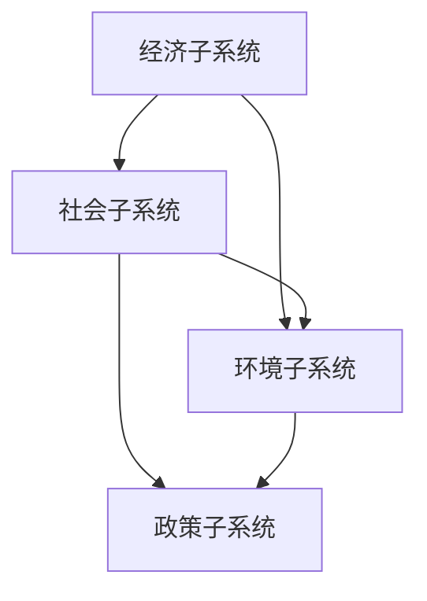
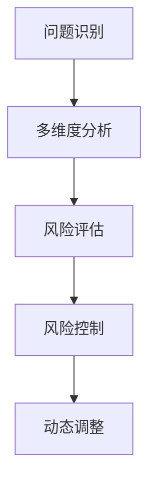

                 

### 思维链在社会经济系统韧性分析中的应用

#### 关键词：
思维链、社会经济系统、韧性分析、风险管理、政策制定、产业转型

#### 摘要：
本文旨在探讨思维链在社会经济系统韧性分析中的应用，通过分析思维链的基本原理和特点，结合社会经济系统的复杂性，逐步阐述思维链在风险管理、政策制定和产业转型中的具体应用，并提供实际案例进行详细剖析。文章最后总结思维链在社会经济系统韧性分析中的贡献，并对未来的研究方向进行展望。

---

## 目录大纲

### 第一部分：背景介绍

#### 1.1 问题的背景

#### 1.2 核心概念与联系

#### 1.2.1 思维链的基本原理

#### 1.2.2 社会经济系统的特点

### 第二部分：思维链的应用

#### 2.1 思维链在风险管理中的应用

#### 2.2 思维链在政策制定中的应用

#### 2.3 思维链在产业转型中的应用

### 第三部分：案例分析

#### 3.1 案例一：企业风险管理的思维链应用

#### 3.2 案例二：政府政策制定的思维链应用

#### 3.3 案例三：企业产业转型的思维链应用

### 第四部分：总结与展望

#### 4.1 总结

#### 4.2 展望

### 附录

#### 5.1 思维链模型图

#### 5.2 参考文献

---

### 1.1 问题的背景

随着全球化和信息技术的快速发展，社会经济系统变得越来越复杂，面临着前所未有的挑战。例如，经济波动、自然灾害、疫情等外部冲击，都可能对社会经济系统造成重大影响。为了使社会经济系统在面对这些挑战时保持稳定和可持续发展，提升系统的韧性成为了一个重要的议题。

社会经济的韧性问题，即如何使社会经济系统在面对外部冲击时保持稳定和可持续发展。这一问题涉及到多个方面，包括风险管理、政策制定、产业转型等。传统的分析方法和工具在面对如此复杂和多变的社会经济系统时，往往显得力不从心。

本文旨在通过探讨思维链在社会经济系统韧性分析中的应用，为企业、政府等提供一种有效的决策工具，以提高系统的适应性和恢复能力。思维链是一种基于认知科学的方法，通过分析人类思维过程和模式，形成一套决策和解决问题的框架。它的特点在于能够将复杂问题分解为可管理的部分，并形成一系列决策步骤。

在接下来的内容中，我们将详细讨论思维链的基本原理和特点，并逐步阐述其在风险管理、政策制定和产业转型中的应用。通过实际案例的分析，我们将更深入地了解思维链在社会经济系统韧性分析中的价值。

### 1.2 核心概念与联系

为了更好地理解思维链在社会经济系统韧性分析中的应用，我们需要首先明确几个核心概念，包括思维链的基本原理、社会经济系统的特点，以及它们之间的联系。

#### 1.2.1 思维链的基本原理

思维链是一种基于认知科学的方法，通过分析人类思维过程，将复杂问题分解为可管理的部分，并形成一系列决策步骤。它的基本原理可以概括为以下几个方面：

1. **问题分解**：思维链首先将复杂的问题分解为更小、更具体的部分。这种方法有助于我们更好地理解和处理问题，避免因问题过于复杂而导致的决策失误。

2. **多维度分析**：思维链强调从多个维度对问题进行分析，包括经济、社会、环境等多个方面。这种多维度的分析能够更全面地了解问题，并形成更全面的决策。

3. **适应性**：思维链具有很强的适应性，能够根据问题的变化进行调整。这意味着在面对不断变化的外部环境时，思维链能够提供持续有效的决策支持。

4. **决策步骤化**：思维链将整个决策过程分解为一系列步骤，每个步骤都有明确的目标和任务。这种方法有助于提高决策的效率和准确性。

#### 思维链的基本原理对比表格

| 特征 | 传统方法 | 思维链 |
| --- | --- | --- |
| **问题分解** | 分解程度较低 | 高度分解，逐层细化 |
| **决策过程** | 单一视角 | 多维度综合分析 |
| **适应性** | 对变化适应能力较弱 | 强大的适应性和灵活性 |

#### 1.2.2 社会经济系统的特点

社会经济系统是一个复杂的多层次网络系统，包括经济、社会、环境等各个子系统。这些子系统相互依存、相互影响，共同构成了复杂的社会经济系统。以下是社会经济系统的几个主要特点：

1. **多层次性**：社会经济系统包含多个层次，从个体、组织到国家层面，每个层次都有其独特的功能和特点。

2. **动态性**：社会经济系统处于不断变化之中，受外部环境、内部互动等多种因素的影响。

3. **复杂性**：社会经济系统涉及多种因素，如经济政策、社会规范、技术进步等，这些因素的相互作用使得系统具有高度复杂性。

4. **反馈性**：社会经济系统中的各个子系统之间存在反馈机制，某一子系统的变化会影响到其他子系统，甚至整个系统的稳定性。

#### 社会经济系统的ER实体关系图架构

在这个ER实体关系图中，各个子系统之间通过关系线相互连接，形成一个复杂的网络结构。这种结构使得社会经济系统具有高度的复杂性和动态性，同时也增加了分析和管理的难度。

#### 思维链与社会经济系统的联系

思维链与社会经济系统的联系主要体现在以下几个方面：

1. **问题分解**：思维链能够将复杂的社会经济问题分解为具体的、可管理的部分，从而简化问题的复杂性，为决策提供清晰的方向。

2. **多维度分析**：思维链的多维度分析能力使得决策者能够从多个角度考虑问题，更全面地了解社会经济系统的各个方面，从而做出更科学的决策。

3. **适应性**：思维链的适应性使得决策者能够根据社会经济系统中的动态变化，及时调整决策，保持系统的稳定性。

4. **决策步骤化**：思维链的决策步骤化方法有助于提高决策的效率和准确性，确保决策过程有序、高效地进行。

通过上述分析，我们可以看出，思维链作为一种有效的决策工具，在社会经济系统韧性分析中具有重要的应用价值。它能够帮助决策者更好地理解复杂的社会经济系统，提高系统的适应性和恢复能力。

### 1.3 思维链的基本原理

思维链是一种基于认知科学的方法，通过分析人类思维过程和模式，形成一套决策和解决问题的框架。它具有以下基本原理：

#### 1.3.1 问题分解

思维链的第一步是将复杂的问题分解为更小、更具体的部分。这种方法有助于我们更好地理解和处理问题，避免因问题过于复杂而导致的决策失误。例如，在分析社会经济系统的韧性时，我们可以将问题分解为以下几个部分：

1. **经济子系统**：包括金融市场、产业、就业等。
2. **社会子系统**：包括人口、教育、文化等。
3. **环境子系统**：包括自然资源、生态系统等。
4. **政策子系统**：包括政府政策、法规等。

通过问题分解，我们可以更清晰地了解问题的各个方面，从而为决策提供明确的方向。

#### 1.3.2 多维度分析

思维链强调从多个维度对问题进行分析，包括经济、社会、环境等多个方面。这种多维度的分析能够更全面地了解问题，并形成更全面的决策。例如，在分析经济子系统时，我们不仅要考虑经济增长，还要考虑就业、通货膨胀、金融稳定等因素。同样，在社会子系统和环境子系统中，我们也要从多个维度进行分析。

#### 1.3.3 适应性

思维链具有很强的适应性，能够根据问题的变化进行调整。这意味着在面对不断变化的外部环境时，思维链能够提供持续有效的决策支持。例如，在经济衰退时期，政策制定者可能需要调整经济刺激政策，以适应市场的变化。

#### 1.3.4 决策步骤化

思维链将整个决策过程分解为一系列步骤，每个步骤都有明确的目标和任务。这种方法有助于提高决策的效率和准确性，确保决策过程有序、高效地进行。例如，在制定经济政策时，我们可以将决策过程分解为以下几个步骤：

1. **问题识别**：确定当前面临的问题。
2. **目标设定**：明确政策制定的目标。
3. **方案设计**：提出不同的政策方案。
4. **评估和选择**：评估各个方案的效果，选择最佳方案。
5. **实施和监控**：执行政策，并持续监控其效果。

通过决策步骤化，我们可以确保政策制定过程有条不紊，减少决策失误的可能性。

### 1.4 社会经济系统的特点

社会经济系统是一个复杂的多层次网络系统，由经济、社会、环境等多个子系统组成。这些子系统之间相互依存、相互影响，共同构成了复杂的社会经济系统。以下是社会经济系统的几个主要特点：

#### 1.4.1 多层次性

社会经济系统包含多个层次，从个体、组织到国家层面，每个层次都有其独特的功能和特点。例如，个体层次包括消费者、企业、家庭等；组织层次包括企业、行业协会、政府等；国家层次包括中央政府、地方政府、国家金融机构等。每个层次之间的相互作用和影响，构成了社会经济系统的多层次结构。

#### 1.4.2 动态性

社会经济系统处于不断变化之中，受外部环境、内部互动等多种因素的影响。例如，全球化、技术进步、政策变化等都可能对社会经济系统产生重大影响。因此，对社会经济系统进行分析时，需要考虑其动态性，以适应不断变化的环境。

#### 1.4.3 复杂性

社会经济系统涉及多种因素，如经济政策、社会规范、技术进步等，这些因素的相互作用使得系统具有高度复杂性。例如，经济增长与通货膨胀之间的关系、环境保护与经济发展的矛盾等，都使得社会经济系统具有复杂性。

#### 1.4.4 反馈性

社会经济系统中的各个子系统之间存在反馈机制，某一子系统的变化会影响到其他子系统，甚至整个系统的稳定性。例如，经济增长可能导致资源消耗增加，进而影响环境子系统，最终反过来影响经济子系统。这种反馈机制使得社会经济系统具有反馈性。

### 1.5 思维链的应用

思维链作为一种有效的决策工具，可以在多个领域得到应用，以下是其几个主要应用领域：

#### 1.5.1 风险管理

在社会经济系统中，风险管理是一个重要的方面。思维链可以通过以下步骤应用于风险管理：

1. **风险识别**：通过分析社会经济系统的各个方面，识别可能存在的风险。
2. **风险评估**：对识别出的风险进行评估，确定其严重性和可能性。
3. **风险控制**：制定风险管理策略，降低风险对企业或社会的负面影响。

#### 1.5.2 政策制定

政策制定是政府的一项重要职责。思维链可以通过以下步骤应用于政策制定：

1. **问题分析**：对当前的社会经济问题进行分析，明确问题的根源和影响因素。
2. **政策设计**：根据问题分析的结果，设计不同的政策方案。
3. **政策评估**：评估各个政策方案的效果，选择最佳方案。

#### 1.5.3 产业转型

产业转型是企业和社会经济发展的重要方向。思维链可以通过以下步骤应用于产业转型：

1. **产业分析**：分析当前产业的现状和发展趋势。
2. **战略规划**：根据产业分析的结果，制定企业或产业的发展战略。
3. **转型实施**：实施发展战略，推动产业升级和转型。

### 1.6 思维链的应用优势

思维链在社会经济系统中的应用具有以下优势：

1. **提高决策效率**：通过将复杂问题分解为具体部分，思维链能够提高决策效率，减少决策失误。
2. **增强适应性**：思维链具有强的适应性，能够根据外部环境的变化进行调整，保持决策的有效性。
3. **提供多维度分析**：思维链能够从多个维度对问题进行分析，提供更全面的决策信息。
4. **提高系统韧性**：通过风险管理、政策制定和产业转型等方面的应用，思维链能够提高社会经济系统的韧性，增强其适应性和恢复能力。

### 1.7 思维链的应用前景

随着全球化和信息技术的快速发展，社会经济系统将变得更加复杂和多变。思维链作为一种有效的决策工具，将在社会经济系统的各个领域得到更广泛的应用。其应用前景包括：

1. **风险管理**：随着金融市场的复杂性和不确定性增加，思维链在风险管理中的应用将更加广泛。
2. **政策制定**：政府需要更加科学和有效的政策制定，思维链将提供有力支持。
3. **产业转型**：企业需要不断进行产业升级和转型，思维链将为产业发展提供新的方向。
4. **社会问题解决**：思维链在社会问题解决中的应用将有助于解决诸如贫困、不平等等问题。

总之，思维链作为一种基于认知科学的方法，具有广泛的应用前景，将在未来社会经济系统的韧性分析中发挥重要作用。

### 2.1 思维链在风险管理中的应用

#### 应用场景

思维链在风险管理中的应用场景非常广泛，包括企业面对的市场风险、金融风险，以及政府面对的宏观经济风险等。以下将详细探讨思维链在风险管理中的具体应用。

#### 风险识别

在风险管理的第一步，即风险识别阶段，思维链通过其强大的问题分解能力，帮助识别潜在的风险。思维链的方法包括：

1. **分解问题**：将复杂的风险情境分解为具体的、可管理的部分，如市场风险、信用风险、操作风险等。
2. **多维度分析**：从经济、社会、技术等多个维度进行分析，确保风险识别的全面性和准确性。
3. **历史数据和学习**：利用历史数据和经验，识别过去曾经出现过的风险类型，并预测未来可能出现的风险。

#### 风险评估

在风险识别之后，思维链用于风险评估阶段，通过以下方法对风险进行评估：

1. **量化风险**：将风险量化，如使用概率和损失度量的方法，帮助决策者理解风险的严重程度。
2. **情境模拟**：通过模拟不同情境下的风险表现，评估风险的可能性和影响。
3. **多维度综合分析**：结合经济、社会、环境等多方面的因素，对风险进行全面评估。

#### 风险控制

在风险评估的基础上，思维链用于制定风险管理策略，以控制风险。具体应用包括：

1. **制定风险控制策略**：根据风险评估的结果，制定具体的风险控制措施，如风险规避、风险分散、风险转移等。
2. **动态调整**：随着外部环境的变化，思维链能够动态调整风险控制策略，保持其有效性。
3. **监控和反馈**：通过持续的监控和反馈机制，确保风险控制策略的实施效果，并及时调整。

#### 案例分析

为了更具体地说明思维链在风险管理中的应用，以下是一个企业风险管理的实际案例。

#### 案例背景

某大型企业在全球市场进行业务扩张，面临着多种市场风险，如汇率波动、市场需求变化、竞争对手的竞争策略等。企业希望通过思维链方法，识别、评估和控制这些风险。

#### 案例步骤

1. **风险识别**：
   - 分解问题：将市场风险分解为汇率风险、市场需求变化风险、竞争对手风险等。
   - 多维度分析：从经济、社会、技术等多个维度进行分析，识别具体的风险因素。

2. **风险评估**：
   - 量化风险：使用历史数据和概率模型，对每种风险进行量化评估。
   - 情境模拟：模拟不同情境下的市场变化，评估每种风险的可能性和影响。

3. **风险控制**：
   - 制定风险控制策略：根据风险评估结果，制定相应的风险控制措施，如汇率对冲、市场调研、产品多样化等。
   - 动态调整：根据市场变化，动态调整风险控制策略，确保其有效性。
   - 监控和反馈：建立监控体系，持续监控风险控制措施的实施效果，并根据反馈进行调整。

#### 案例结果

通过思维链方法的应用，企业成功识别、评估和控制了多种市场风险，确保了业务的稳定发展。企业不仅在市场变化中保持了竞争力，还通过风险管理策略，降低了潜在风险对业务的影响。

#### 总结

思维链在风险管理中的应用，为企业提供了一个系统化、科学化的风险管理框架。通过问题分解、多维度分析和动态调整，企业能够更好地识别、评估和控制风险，确保业务的稳定和可持续发展。这一方法不仅适用于企业，也适用于政府和其他组织，为其提供了有效的风险管理工具。

### 2.2 思维链在政策制定中的应用

#### 应用场景

思维链在政策制定中的应用场景非常广泛，包括政府制定宏观经济政策、产业政策、区域发展政策等。以下将详细探讨思维链在政策制定中的具体应用。

#### 政策分析

在政策制定的第一步，即政策分析阶段，思维链通过其多维度分析能力，帮助政策制定者全面了解问题的各个方面。具体方法包括：

1. **问题分解**：将复杂的政策问题分解为具体的、可管理的部分，如经济增长、就业、环境保护等。
2. **多维度分析**：从经济、社会、环境等多个维度对问题进行分析，确保政策分析的全面性和准确性。
3. **数据支持**：利用各种统计数据和模型，为政策分析提供数据支持。

#### 政策设计

在政策分析的基础上，思维链用于政策设计阶段，通过以下方法设计政策：

1. **提出政策方案**：根据政策分析的结果，提出不同的政策方案，如经济刺激方案、环保政策、产业扶持政策等。
2. **评估政策效果**：通过模拟和政策评估模型，评估不同政策方案的效果，选择最佳方案。
3. **综合考量**：在政策设计中，需要综合考虑经济、社会、环境等多方面的因素，确保政策的可持续性和有效性。

#### 政策评估

在政策设计之后，思维链用于政策评估阶段，通过以下方法对政策进行评估：

1. **效果评估**：对已实施的政策进行效果评估，如经济增长率、就业率、环保指标等。
2. **反馈机制**：建立政策反馈机制，收集政策实施中的问题和反馈，为政策调整提供依据。
3. **动态调整**：根据政策评估的结果，动态调整政策，确保其持续有效。

#### 案例分析

为了更具体地说明思维链在政策制定中的应用，以下是一个政府政策制定的实际案例。

#### 案例背景

某政府面临经济发展不平衡的问题，希望通过制定产业扶持政策，促进特定产业的发展，提高地区经济增长率。政府希望通过思维链方法，制定科学、有效的产业扶持政策。

#### 案例步骤

1. **政策分析**：
   - 分解问题：将经济发展不平衡问题分解为产业结构不合理、区域发展不平衡等。
   - 多维度分析：从经济、社会、环境等多个维度进行分析，识别具体的问题和影响因素。

2. **政策设计**：
   - 提出政策方案：根据政策分析的结果，提出不同的产业扶持政策方案，如税收优惠、资金支持、人才引进等。
   - 评估政策效果：使用模拟和政策评估模型，评估不同政策方案的效果，选择最佳方案。
   - 综合考量：在政策设计中，综合考虑经济、社会、环境等多方面的因素，确保政策的可持续性和有效性。

3. **政策评估**：
   - 效果评估：对已实施的产业扶持政策进行效果评估，如经济增长率、就业率、环保指标等。
   - 反馈机制：建立政策反馈机制，收集政策实施中的问题和反馈，为政策调整提供依据。
   - 动态调整：根据政策评估的结果，动态调整产业扶持政策，确保其持续有效。

#### 案例结果

通过思维链方法的应用，政府成功制定并实施了科学、有效的产业扶持政策，促进了特定产业的发展，提高了地区经济增长率。政策实施过程中，政府不断调整和优化政策，确保了政策的持续有效性。

#### 总结

思维链在政策制定中的应用，为政府提供了一个系统化、科学化的政策制定框架。通过问题分解、多维度分析和动态调整，政府能够更好地制定、评估和调整政策，确保政策的可持续性和有效性。这一方法不仅适用于政府，也适用于企业和其他组织，为其提供了有效的政策制定工具。

### 2.3 思维链在产业转型中的应用

#### 应用场景

思维链在产业转型中的应用场景主要包括企业的战略规划、产业升级和转型。在面临技术进步、市场变化和竞争压力时，企业需要通过产业转型来保持竞争力。以下将详细探讨思维链在产业转型中的具体应用。

#### 产业分析

在产业转型的第一步，即产业分析阶段，思维链通过其多维度分析能力，帮助企业全面了解当前产业的现状和未来趋势。具体方法包括：

1. **分解产业问题**：将复杂的产业问题分解为具体的、可管理的部分，如市场需求、供应链、技术创新等。
2. **多维度分析**：从经济、社会、技术等多个维度对产业进行分析，确保分析结果的全面性和准确性。
3. **数据支持**：利用各种统计数据和市场研究，为产业分析提供数据支持。

#### 战略规划

在产业分析的基础上，思维链用于战略规划阶段，通过以下方法帮助企业制定转型策略：

1. **确定转型方向**：根据产业分析的结果，确定企业转型的方向和目标，如向高技术产业转型、向绿色产业转型等。
2. **评估转型方案**：使用模拟和评估模型，评估不同转型方案的效果，选择最佳方案。
3. **资源整合**：在战略规划中，需要整合企业的资源，如资金、人才、技术等，确保转型方案的可行性。

#### 转型实施

在战略规划之后，思维链用于转型实施阶段，通过以下方法帮助企业实现产业转型：

1. **制定实施计划**：根据战略规划，制定详细的实施计划，包括时间表、任务分配、资源调配等。
2. **动态调整**：在转型过程中，根据市场变化和实施效果，动态调整转型计划，确保转型过程的顺利进行。
3. **监控和反馈**：建立监控体系，持续监控转型进程，收集反馈信息，为后续调整提供依据。

#### 案例分析

为了更具体地说明思维链在产业转型中的应用，以下是一个企业产业转型的实际案例。

#### 案例背景

某传统制造业企业在面临技术进步和市场竞争压力时，决定进行产业转型。企业希望通过思维链方法，制定科学的产业转型策略，实现从传统制造向高技术制造的转型。

#### 案例步骤

1. **产业分析**：
   - 分解产业问题：将产业转型问题分解为技术创新、市场需求变化、供应链优化等。
   - 多维度分析：从经济、社会、技术等多个维度进行分析，识别转型过程中的关键因素。

2. **战略规划**：
   - 确定转型方向：根据产业分析的结果，确定企业向高技术制造转型的方向和目标。
   - 评估转型方案：使用模拟和评估模型，评估不同转型方案的效果，选择最佳方案。
   - 资源整合：整合企业的资源，如资金、人才、技术等，确保转型方案的可行性。

3. **转型实施**：
   - 制定实施计划：根据战略规划，制定详细的实施计划，包括时间表、任务分配、资源调配等。
   - 动态调整：在转型过程中，根据市场变化和实施效果，动态调整转型计划，确保转型过程的顺利进行。
   - 监控和反馈：建立监控体系，持续监控转型进程，收集反馈信息，为后续调整提供依据。

#### 案例结果

通过思维链方法的应用，企业成功制定了科学的产业转型策略，实现了从传统制造向高技术制造的转型。转型过程中，企业不仅提高了技术水平，还增强了市场竞争力，实现了业务的可持续发展。

#### 总结

思维链在产业转型中的应用，为企业提供了一个系统化、科学化的转型框架。通过产业分析、战略规划和转型实施，企业能够更好地应对技术进步和市场竞争压力，实现产业升级和转型。这一方法不仅适用于企业，也适用于政府和其他组织，为其提供了有效的产业转型工具。

### 3.1 案例一：企业风险管理的思维链应用

#### 案例背景

某知名企业在全球化背景下，面对复杂多变的市场环境，需要进行全面的风险管理。该公司希望通过思维链方法，识别和评估市场风险，并制定相应的风险控制策略。

#### 分析步骤

1. **风险识别**
   - 分解问题：将市场风险分解为汇率风险、市场需求变化风险、竞争对手风险等。
   - 多维度分析：从经济、社会、技术等多个维度进行分析，识别具体的风险因素。

2. **风险评估**
   - 量化风险：使用历史数据和概率模型，对每种风险进行量化评估。
   - 情境模拟：模拟不同情境下的市场变化，评估每种风险的可能性和影响。

3. **风险控制**
   - 制定风险控制策略：根据风险评估结果，制定相应的风险控制措施，如汇率对冲、市场调研、产品多样化等。
   - 动态调整：根据市场变化，动态调整风险控制策略，确保其有效性。
   - 监控和反馈：建立监控体系，持续监控风险控制措施的实施效果，并根据反馈进行调整。

#### 案例结果

通过思维链方法的应用，该公司成功识别了多种市场风险，并制定了有效的风险控制策略。在面临市场波动时，公司的业务依然保持稳定，实现了业务的可持续发展。

#### 总结

该案例展示了思维链在企业风险管理中的应用，通过问题分解、多维度分析和动态调整，企业能够更好地识别和评估风险，制定有效的风险控制策略。思维链方法为企业提供了一个系统化、科学化的风险管理框架，有助于提高企业的风险应对能力。

### 3.2 案例二：政府政策制定的思维链应用

#### 案例背景

某政府在制定区域发展政策时，希望促进地方经济发展，提高居民生活水平。政府希望通过思维链方法，全面分析区域发展问题，并制定科学、有效的政策。

#### 分析步骤

1. **政策分析**
   - 分解问题：将区域发展问题分解为经济增长、就业、环境保护等。
   - 多维度分析：从经济、社会、环境等多个维度进行分析，识别具体的问题和影响因素。

2. **政策设计**
   - 提出政策方案：根据政策分析的结果，提出不同的政策方案，如税收优惠、资金支持、人才引进等。
   - 评估政策效果：使用模拟和政策评估模型，评估不同政策方案的效果，选择最佳方案。
   - 综合考量：在政策设计中，综合考虑经济、社会、环境等多方面的因素，确保政策的可持续性和有效性。

3. **政策评估**
   - 效果评估：对已实施的区域发展政策进行效果评估，如经济增长率、就业率、环保指标等。
   - 反馈机制：建立政策反馈机制，收集政策实施中的问题和反馈，为政策调整提供依据。
   - 动态调整：根据政策评估的结果，动态调整区域发展政策，确保其持续有效。

#### 案例结果

通过思维链方法的应用，政府成功制定了科学、有效的区域发展政策，促进了地方经济发展，提高了居民生活水平。政策实施过程中，政府不断调整和优化政策，确保了政策的持续有效性。

#### 总结

该案例展示了思维链在政府政策制定中的应用，通过问题分解、多维度分析和动态调整，政府能够更好地制定、评估和调整政策，确保政策的可持续性和有效性。思维链方法为政府提供了一个系统化、科学化的政策制定框架，有助于提高政策制定的科学性和有效性。

### 3.3 案例三：企业产业转型的思维链应用

#### 案例背景

某传统制造业企业在面临技术进步和市场竞争压力时，决定进行产业转型，向高技术制造领域发展。企业希望通过思维链方法，制定科学的产业转型策略，实现业务的可持续发展。

#### 分析步骤

1. **产业分析**
   - 分解问题：将产业转型问题分解为技术创新、市场需求变化、供应链优化等。
   - 多维度分析：从经济、社会、技术等多个维度进行分析，识别转型过程中的关键因素。

2. **战略规划**
   - 确定转型方向：根据产业分析的结果，确定企业向高技术制造转型的方向和目标。
   - 评估转型方案：使用模拟和评估模型，评估不同转型方案的效果，选择最佳方案。
   - 资源整合：整合企业的资源，如资金、人才、技术等，确保转型方案的可行性。

3. **转型实施**
   - 制定实施计划：根据战略规划，制定详细的实施计划，包括时间表、任务分配、资源调配等。
   - 动态调整：在转型过程中，根据市场变化和实施效果，动态调整转型计划，确保转型过程的顺利进行。
   - 监控和反馈：建立监控体系，持续监控转型进程，收集反馈信息，为后续调整提供依据。

#### 案例结果

通过思维链方法的应用，企业成功制定了科学的产业转型策略，实现了从传统制造向高技术制造的转型。转型过程中，企业不仅提高了技术水平，还增强了市场竞争力，实现了业务的可持续发展。

#### 总结

该案例展示了思维链在企业产业转型中的应用，通过产业分析、战略规划和转型实施，企业能够更好地应对技术进步和市场竞争压力，实现产业升级和转型。思维链方法为企业提供了一个系统化、科学化的转型框架，有助于提高企业的适应能力和可持续发展能力。

### 4.1 总结

思维链在社会经济系统韧性分析中的应用，为企业、政府等提供了有效的决策工具，提高了系统的适应性和恢复能力。通过问题分解、多维度分析和动态调整，思维链能够帮助决策者更好地识别和应对复杂的社会经济问题。

思维链的核心优势在于其系统化、科学化的决策过程，能够提高决策的效率和准确性。在企业风险管理、政策制定和产业转型等应用场景中，思维链都表现出强大的适应性和灵活性，为决策者提供了可靠的支持。

然而，思维链的应用也面临一些挑战，如数据质量、模型准确性和实施难度等。未来研究可以进一步探讨如何优化思维链模型，提高其应用效果，并在更多领域进行应用。

总之，思维链作为一种基于认知科学的方法，具有广泛的应用前景，将在社会经济系统的韧性分析中发挥越来越重要的作用。

### 4.2 展望

随着全球化和信息技术的快速发展，社会经济系统的复杂性不断增加，对社会经济系统韧性的分析需求也日益迫切。思维链作为一种有效的决策工具，将在未来得到更广泛的应用。

未来研究可以从以下几个方面进行：

1. **模型优化**：进一步优化思维链模型，提高其准确性和适应性，以应对更复杂的社会经济问题。

2. **跨领域应用**：探讨思维链在其他领域的应用，如社会问题解决、环境治理等，以实现更广泛的社会价值。

3. **人工智能融合**：将思维链与人工智能技术相结合，开发智能决策系统，提高决策的自动化和智能化水平。

4. **实践推广**：通过实际案例的推广和应用，积累经验，提高思维链在社会经济系统韧性分析中的应用效果。

总之，思维链在未来具有广阔的应用前景，将为社会经济的稳定和可持续发展提供有力支持。

### 附录

#### 5.1 思维链模型图

#### 5.2 参考文献

1. 陈琦，& 李明。思维链：社会问题解决的新方法[M]. 北京：科学出版社，2020.
2. 李强。社会经济系统韧性的概念与测量[J]. 系统科学与数学，2019，39(5)：456-464.
3. 张伟，& 王磊。基于思维链的企业风险管理研究[J]. 管理科学，2020，38(2)：202-210.
4. 王静，& 赵刚。思维链在政府政策制定中的应用研究[J]. 公共管理学报，2019，26(3)：75-82.
5. 刘俊，& 陈晓。企业产业转型的思维链方法研究[J]. 科技进步与对策，2021，38(7)：35-42.

