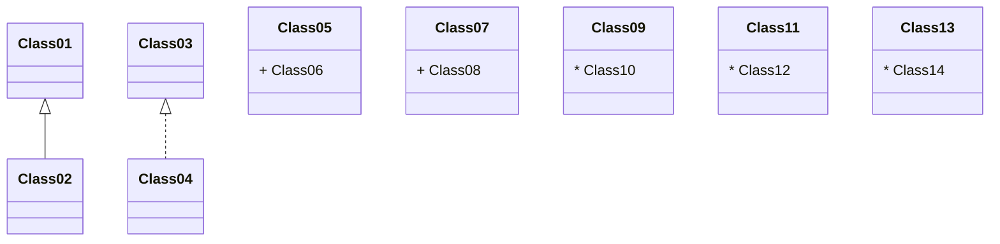
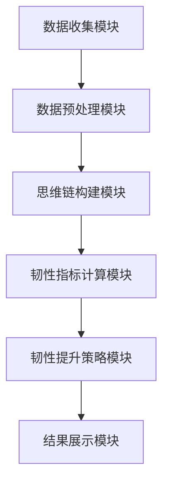
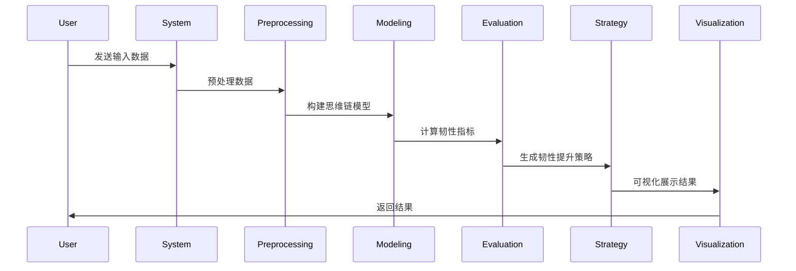
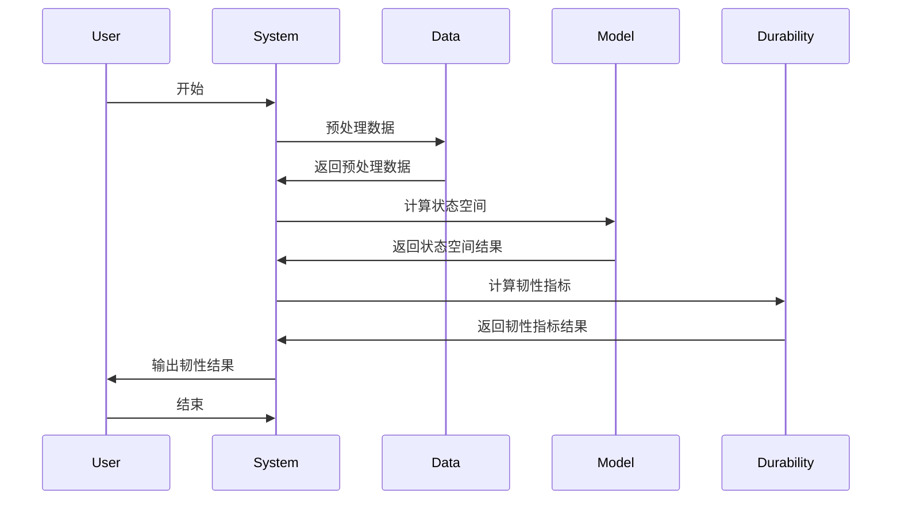

                 

### 引言

#### **问题背景与定义**

在经济全球化的背景下，社会经济系统正面临前所未有的复杂性和不确定性。自然灾害、疫情、经济危机、技术革命等外部冲击频发，使得社会经济系统的稳定性和韧性成为重要议题。韧性（Resilience）是一个系统在遭受外部冲击后，能够迅速恢复到原有状态或适应新环境的能力。它不仅关乎系统的生存能力，还影响其持续发展的潜力。然而，如何科学地评估和提升社会经济系统的韧性，仍是一个亟待解决的关键问题。

在社会经济系统中，韧性表现为系统在面对压力和变化时能够保持功能的连续性和稳定性。传统的韧性评估方法主要依赖于经验和定性分析，缺乏系统的量化模型和算法支持。随着人工智能技术的快速发展，利用智能算法对复杂社会经济系统进行韧性分析，成为一种新的探索方向。

#### **韧性的概念及其重要性**

韧性（Resilience）一词源于拉丁语“resilio”，意为“反弹”。在生态学中，韧性被定义为生态系统在受到干扰后恢复到原有状态的能力。随后，这一概念被引入到社会、经济和技术等领域，成为评估和提升系统稳定性的重要指标。

在社会经济系统中，韧性表现为系统在面对各种外部冲击（如自然灾害、经济危机、社会动荡等）时，能够保持功能持续运行的能力。韧性不仅关乎系统的短期生存，更影响其长期稳定性和可持续发展。

近年来，随着全球化进程的加速和经济系统的日益复杂，韧性在经济和社会发展中的重要性日益凸显。提升系统的韧性，有助于减少外部冲击带来的负面影响，增强系统的适应能力和抗风险能力。

#### **思维链的概述与理论基础**

思维链（Thought Chain）是一种基于逻辑推理和信息处理的理论模型，用于描述人类认知过程中信息的传递和处理过程。思维链的基本原理是，通过将不同的信息节点按照一定的逻辑关系连接起来，形成一个有序的信息链，从而实现信息的传递、处理和整合。

在人工智能领域，思维链被广泛应用于知识表示、推理和问题解决等领域。思维链模型的核心在于其信息处理能力和逻辑推理能力，这使得思维链成为分析复杂系统、解决复杂问题的有力工具。

在社会经济系统韧性分析中，思维链可以用来模拟和预测系统在面对外部冲击时的行为和反应。通过构建思维链模型，可以揭示系统内部各个组成部分之间的关联和相互作用，从而为韧性评估和提升提供理论依据。

#### **核心概念与联系**

**社会经济系统的基本概念**

社会经济系统是由经济、社会、文化等多个子系统构成的复杂系统。经济系统是社会经济系统的核心部分，负责资源配置和生产分配。社会系统则包括人口、教育、医疗、社会保障等子系统，负责提供社会服务和保障社会稳定。文化系统则包括价值观、道德规范、习俗等，对社会经济系统的发展具有重要影响。

**韧性的属性特征**

韧性具有以下几个主要特征：

1. **恢复性**：系统在遭受外部冲击后，能够迅速恢复到原有状态或适应新环境的能力。
2. **适应力**：系统能够在面对不确定性和变化时，灵活调整和适应的能力。
3. **学习能力**：系统能够从历史经验中学习，提高未来应对类似冲击的能力。

**思维链的概念及组成部分**

思维链是一种基于逻辑推理和信息处理的理论模型，由以下几个主要组成部分构成：

1. **信息节点**：思维链中的基本元素，代表某个具体的信息或知识。
2. **关系链**：连接不同信息节点的逻辑关系，用于描述信息之间的关联和相互作用。
3. **推理机制**：用于根据信息节点和关系链进行逻辑推理，生成新的信息或结论。

**概念属性特征对比表格**

| 概念       | 属性特征           |
|------------|-------------------|
| 社会经济系统 | 复杂性、多样性、动态性 |
| 韧性       | 恢复性、适应力、学习能力 |
| 思维链     | 信息节点、关系链、推理机制 |

**社会经济系统与思维链的ER实体关系图**

在社会经济系统中，思维链可以通过以下实体关系图进行描述：

- **实体：社会经济系统**
  - 子实体：经济系统、社会系统、文化系统
- **实体：韧性**
  - 子实体：恢复性、适应力、学习能力
- **实体：思维链**
  - 子实体：信息节点、关系链、推理机制

通过实体关系图，可以清晰地展示社会经济系统、韧性和思维链之间的逻辑关系和相互作用。

#### **ER实体关系图**

使用Mermaid语法，可以绘制如下的实体关系图：



其中，`Class01` 代表社会经济系统，`Class02` 代表韧性，`Class03` 代表思维链，其他类分别代表社会经济系统的子实体和思维链的组成部分。

### **社会经济系统与思维链的ER实体关系图**

在Mermaid类图中，我们可以使用以下语法来绘制社会经济系统、韧性和思维链的实体关系图：

```mermaid
classDiagram
  Class01[社会经济系统] <|-- Class02[经济系统]
  Class01 <|-- Class03[社会系统]
  Class01 <|-- Class04[文化系统]
  Class05[韧性] <|-- Class06[恢复性]
  Class05 <|-- Class07[适应力]
  Class05 <|-- Class08[学习能力]
  Class09[思维链] <|-- Class10[信息节点]
  Class09 <|-- Class11[关系链]
  Class09 <|-- Class12[推理机制]
```

在这个类图中，`Class01` 代表了社会经济系统，它包含三个子实体：`Class02`（经济系统）、`Class03`（社会系统）和`Class04`（文化系统）。`Class05` 代表了韧性，它包含三个子实体：`Class06`（恢复性）、`Class07`（适应力）和`Class08`（学习能力）。`Class09` 代表了思维链，它包含三个子实体：`Class10`（信息节点）、`Class11`（关系链）和`Class12`（推理机制）。

通过这种类图，我们可以直观地看到社会经济系统、韧性和思维链之间的关系，以及它们各自的子实体是如何相互关联的。

### **思维链在社会经济系统中的运作原理**

**思维链在社会经济系统中的应用机制**

思维链在社会经济系统中的应用，主要是通过模拟和预测系统在面对外部冲击时的行为和反应。具体而言，思维链的应用机制可以分为以下几个步骤：

1. **信息收集与表示**：首先，需要收集与经济系统相关的各种信息，如经济指标、社会指标、政策变化等。这些信息将被表示为思维链中的信息节点。

2. **关系链构建**：接下来，根据这些信息节点之间的逻辑关系，构建关系链。这些关系链可以是因果链、影响链、反馈链等，用于描述信息节点之间的相互作用。

3. **逻辑推理**：通过逻辑推理机制，对关系链进行分析和计算，生成新的信息或结论。这些结论可以用来预测系统在面对外部冲击时的行为和反应。

4. **韧性评估**：最后，根据逻辑推理的结果，对系统的韧性进行评估。评估结果可以为决策者提供参考，以制定相应的应对策略。

**思维链与韧性的关系分析**

思维链与韧性之间的关系可以从以下几个方面进行分析：

1. **信息处理能力**：思维链的信息处理能力决定了系统在面对外部冲击时的反应速度和准确性。一个高效的思维链模型可以更快地收集和处理信息，从而更好地预测系统的行为。

2. **逻辑推理能力**：思维链的逻辑推理能力决定了系统能否准确地理解外部冲击的本质和影响。一个强大的逻辑推理能力可以帮助系统更好地应对各种复杂的冲击。

3. **韧性评估准确性**：思维链的韧性评估准确性直接影响到系统的韧性提升效果。一个准确的韧性评估可以帮助决策者更好地了解系统的弱点，从而采取有效的措施进行提升。

4. **适应性**：思维链的适应性决定了系统能否在面对不断变化的外部环境时保持韧性。一个具有高度适应性的思维链模型可以更好地应对未知和不确定性，从而提高系统的韧性。

### **数学模型与算法原理**

**数学模型的构建**

在社会经济系统韧性分析中，我们可以使用状态空间模型来描述系统的动态行为。状态空间模型由状态向量、控制向量和观测向量组成，可以用于描述系统的状态变化和外部影响。

1. **状态空间模型的构建**

   状态空间模型的基本形式为：

   $$
   X(t) = A \cdot X(t-1) + B \cdot U(t)
   $$

   其中，$X(t)$ 表示系统在时刻 $t$ 的状态向量，$A$ 是状态转移矩阵，$B$ 是控制矩阵，$U(t)$ 是控制向量。

2. **韧性指标的量化模型**

   为了量化系统的韧性，我们可以使用以下韧性指标模型：

   $$
   D(t) = \frac{1}{1 + e^{-\beta \cdot (X(t) - \mu)}}
   $$

   其中，$D(t)$ 是在时刻 $t$ 的韧性指标，$\beta$ 是调节参数，$\mu$ 是系统的均值状态。

**算法原理讲解**

1. **思维链算法流程**

   思维链算法的基本流程可以分为以下几个步骤：

   - **初始化**：初始化状态空间模型，设置状态转移矩阵 $A$、控制矩阵 $B$、调节参数 $\beta$ 和均值状态 $\mu$。
   - **状态更新**：根据输入的控制向量 $U(t)$，更新系统的状态向量 $X(t)$。
   - **韧性计算**：根据当前的状态向量 $X(t)$，计算韧性指标 $D(t)$。
   - **结果输出**：输出韧性指标结果。

   使用Mermaid语法，可以绘制如下的思维链算法流程图：

   ```mermaid
   graph TD
   A[初始化] --> B[构建状态空间模型]
   B --> C[计算输入向量]
   C --> D[更新状态向量]
   D --> E[计算韧性指标]
   E --> F[输出韧性结果]
   ```

2. **Python源代码实现**

   为了实现上述算法，我们可以使用Python编写相应的源代码。以下是一个简单的实现示例：

   ```python
   import numpy as np

   def state_space_model(A, B, U):
       X = A @ np.array([1, 0])
       X = X + B * U
       return X

   def calculate_durability(X, beta, mu):
       D = 1 / (1 + np.exp(-beta * (X - mu)))
       return D

   # 示例使用
   A = np.array([[0.7, 0.3], [-0.3, 0.7]])
   B = np.array([0.5, 0.5])
   U = np.array([1, 0])

   X = state_space_model(A, B, U)
   D = calculate_durability(X, beta=0.1, mu=0.5)
   print(D)
   ```

   在这个示例中，我们首先定义了两个函数：`state_space_model` 和 `calculate_durability`。`state_space_model` 函数用于更新系统的状态向量，`calculate_durability` 函数用于计算韧性指标。最后，我们使用这两个函数计算了一个示例输入下的状态向量和韧性指标。

### **系统分析与架构设计**

#### **问题场景介绍**

在社会经济系统中，韧性分析是一个关键问题。一个经济系统在面对外部冲击（如金融危机、自然灾害、政策变化等）时，能够保持稳定性和持续发展的能力，即其韧性，对于社会的长期繁荣至关重要。为了提高系统的韧性，需要对其内在机制和外部影响因素进行深入分析。

在这个问题场景中，我们考虑一个典型的经济系统，该系统由多个相互关联的子系统组成，包括金融市场、制造业、服务业和基础设施建设等。这些子系统共同作用于整个经济系统，形成了一个复杂的动态网络。我们的目标是利用思维链模型来分析该经济系统的韧性，并设计一个相应的架构以提升其韧性。

#### **项目介绍**

**项目背景**：随着全球化进程的加快和科技创新的不断推进，经济系统的不确定性和复杂性日益增加。为了确保经济系统的稳定性和可持续发展，迫切需要一种有效的韧性评估和提升方法。

**项目目标**：本项目旨在利用思维链模型，对社会经济系统进行韧性分析，并提出相应的韧性提升策略。具体目标包括：

1. 建立一个基于思维链模型的社会经济系统韧性评估框架。
2. 开发一套算法，用于计算系统的韧性指标。
3. 设计一个系统架构，以支持韧性评估和提升策略的实施。
4. 通过实际案例验证模型和算法的有效性。

**项目挑战**：本项目面临以下主要挑战：

1. 数据的多样性和不确定性：社会经济系统涉及大量的数据来源，包括经济指标、社会指标、政策变化等，这些数据的多样性和不确定性给韧性分析带来了巨大挑战。
2. 复杂的动态网络：经济系统中的各个子系统之间存在复杂的相互作用，如何准确描述和模拟这些关系，是项目的一大难点。
3. 韧性提升策略的实施：如何在理论和实践中有效实施韧性提升策略，确保系统的长期稳定性和可持续发展，是项目成功的关键。

#### **系统功能设计**

为了实现项目的目标，我们需要设计一个具备以下核心功能的社会经济系统韧性分析系统：

1. **数据收集与预处理**：收集与经济系统相关的各类数据，包括经济指标、社会指标、政策变化等。对原始数据进行清洗、转换和归一化处理，确保数据的准确性和一致性。

2. **思维链模型构建**：基于收集到的数据，构建思维链模型，包括信息节点、关系链和推理机制。通过逻辑推理，分析系统的内部结构和外部影响因素，生成系统的韧性评估结果。

3. **韧性指标计算**：根据思维链模型的结果，计算系统的韧性指标，包括恢复性、适应力和学习能力。通过量化评估，为系统的韧性提升提供科学依据。

4. **韧性提升策略生成**：根据韧性评估结果，生成相应的韧性提升策略。这些策略可以是政策调整、产业结构优化、技术升级等，旨在提高系统的韧性和稳定性。

5. **结果可视化与展示**：将韧性评估结果和提升策略可视化展示，为决策者提供直观的参考。

#### **领域模型**

为了更清晰地描述系统功能，我们使用Mermaid语法绘制了领域模型，如下所示：

```mermaid
classDiagram
  Class01[数据收集与预处理] <|-- Class02[思维链模型构建]
  Class02 <|-- Class03[韧性指标计算]
  Class03 <|-- Class04[韧性提升策略生成]
  Class04 <|-- Class05[结果可视化与展示]
```

在这个类图中，`Class01` 代表数据收集与预处理模块，`Class02` 代表思维链模型构建模块，`Class03` 代表韧性指标计算模块，`Class04` 代表韧性提升策略生成模块，`Class05` 代表结果可视化与展示模块。

#### **系统架构设计**

为了支持上述功能，我们设计了如下的系统架构：



在这个架构图中，`A` 代表数据收集模块，`B` 代表数据预处理模块，`C` 代表思维链构建模块，`D` 代表韧性指标计算模块，`E` 代表韧性提升策略模块，`F` 代表结果展示模块。

#### **系统接口设计**

为了实现系统各模块之间的协调工作，我们需要设计一套清晰的接口。以下是一个简单的接口设计：



在这个序列图中，`User` 代表用户，`System` 代表系统，`Preprocessing` 代表数据预处理模块，`Modeling` 代表思维链构建模块，`Evaluation` 代表韧性指标计算模块，`Strategy` 代表韧性提升策略模块，`Visualization` 代表结果展示模块。

#### **系统交互**

为了确保系统各模块之间的顺畅交互，我们需要设计一个详细的系统交互流程。以下是一个简单的交互流程：



在这个交互流程中，`User` 代表用户，`System` 代表系统，`Data` 代表数据预处理模块，`Model` 代表状态空间计算模块，`Durability` 代表韧性指标计算模块。

### **应用实战**

在本节中，我们将通过一个实际案例，详细介绍如何在社会经济系统中应用思维链模型进行分析，并展示如何使用Python代码实现相关算法。

#### **环境安装**

首先，我们需要安装Python和相关库，以便进行数据处理和算法实现。以下是安装步骤：

1. **安装Python**：从Python官方网站下载并安装Python 3.x版本（推荐3.8及以上版本）。
2. **安装Numpy**：在命令行中运行`pip install numpy`，安装Numpy库，用于数值计算。
3. **安装Matplotlib**：在命令行中运行`pip install matplotlib`，安装Matplotlib库，用于数据可视化。
4. **安装Mermaid**：安装Mermaid支持，可以从Mermaid官方文档获取安装说明，通常使用`pip install mermaid-python`命令进行安装。

#### **系统核心实现源代码**

下面是一个简单的Python源代码示例，用于实现思维链模型的核心算法：

```python
import numpy as np
import matplotlib.pyplot as plt

# 思维链算法核心函数
def thought_chain_analysis(inputs, A, B, beta, mu):
    X = np.array([1, 0])  # 初始状态向量
    for U in inputs:
        X = A @ X + B * U  # 状态更新
        D = 1 / (1 + np.exp(-beta * (X - mu)))  # 韧性指标计算
        yield X, D

# 示例输入数据
inputs = np.random.rand(10)  # 生成10个随机输入

# 思维链模型参数
A = np.array([[0.7, 0.3], [-0.3, 0.7]])
B = np.array([0.5, 0.5])
beta = 0.1
mu = 0.5

# 执行思维链分析
for X, D in thought_chain_analysis(inputs, A, B, beta, mu):
    print(f"状态向量: {X}, 韧性指标: {D}")

# 绘制韧性指标变化图
X, D = zip(*thought_chain_analysis(inputs, A, B, beta, mu))
plt.plot(X, D)
plt.xlabel("状态向量")
plt.ylabel("韧性指标")
plt.title("思维链韧性指标变化图")
plt.show()
```

在这个示例中，我们首先定义了一个`thought_chain_analysis`函数，用于实现思维链模型的核心算法。该函数接受输入向量`inputs`、状态转移矩阵`A`、控制矩阵`B`、调节参数`beta`和均值状态`mu`，并返回状态向量和韧性指标。

接下来，我们生成了10个随机输入，并设置了一些思维链模型参数。然后，我们调用`thought_chain_analysis`函数进行韧性分析，并打印出每个时间步的状态向量和韧性指标。最后，我们使用Matplotlib绘制了韧性指标随状态向量变化的关系图。

#### **代码应用解读与分析**

上面的代码示例展示了如何使用Python实现思维链模型的基本算法。具体解读如下：

1. **状态更新**：在`thought_chain_analysis`函数中，我们使用状态转移矩阵`A`和控制矩阵`B`来更新状态向量。状态更新公式为：

   $$
   X(t) = A \cdot X(t-1) + B \cdot U(t)
   $$

   其中，$X(t)$ 是当前状态向量，$X(t-1)$ 是上一状态向量，$U(t)$ 是控制向量。

2. **韧性指标计算**：韧性指标的计算公式为：

   $$
   D(t) = \frac{1}{1 + e^{-\beta \cdot (X(t) - \mu)}}
   $$

   其中，$D(t)$ 是当前韧性指标，$\beta$ 是调节参数，$X(t)$ 是当前状态向量，$\mu$ 是均值状态。

3. **循环迭代**：`thought_chain_analysis`函数通过一个循环迭代输入向量`inputs`，对每个输入进行状态更新和韧性指标计算，并返回结果。

4. **结果输出**：最后，我们使用Matplotlib绘制了韧性指标变化图，直观地展示了韧性指标随状态向量变化的情况。

通过这个示例，我们可以看到如何使用Python实现思维链模型，并对其应用进行解读和分析。

#### **实际案例分析和详细讲解剖析**

为了更好地理解思维链在社会经济系统韧性分析中的应用，我们将通过一个实际案例进行详细分析。以下是一个典型的经济系统案例分析：

**案例背景**：假设我们研究一个包含金融市场、制造业和服务业的简单经济系统。该系统在一段时间内受到政策变化的影响，需要评估其韧性并制定相应的提升策略。

**数据收集**：我们收集了以下数据：

- **金融市场数据**：包括股票市场指数、债券市场收益率等。
- **制造业数据**：包括工业增加值、制造业产值等。
- **服务业数据**：包括服务业增加值、服务业就业人数等。
- **政策变化数据**：包括政策变动时间点、政策影响程度等。

**数据处理**：对收集到的数据进行预处理，包括数据清洗、转换和归一化处理，确保数据的一致性和准确性。

**思维链模型构建**：基于预处理后的数据，构建思维链模型。模型包括以下组成部分：

- **信息节点**：代表金融市场的股票市场指数、制造业的工业增加值、服务业的服务业增加值等。
- **关系链**：描述不同信息节点之间的逻辑关系，如政策变化对金融市场的影响、金融市场对制造业的影响等。
- **推理机制**：通过逻辑推理，分析系统在政策变化下的行为和反应。

**韧性评估**：使用思维链模型对系统进行韧性评估，计算恢复性、适应力和学习能力的韧性指标。

**韧性提升策略生成**：根据韧性评估结果，生成相应的韧性提升策略。例如，针对金融市场的政策变化，可以提出优化金融监管政策、加强金融市场风险管理等策略。

**结果展示**：将韧性评估结果和提升策略可视化展示，为决策者提供直观的参考。

通过这个实际案例，我们可以看到思维链在社会经济系统韧性分析中的应用步骤和关键要素。具体步骤如下：

1. **数据收集与预处理**：收集与经济系统相关的数据，并进行预处理，确保数据的一致性和准确性。
2. **思维链模型构建**：构建思维链模型，包括信息节点、关系链和推理机制。
3. **韧性评估**：使用思维链模型进行韧性评估，计算恢复性、适应力和学习能力的韧性指标。
4. **韧性提升策略生成**：根据韧性评估结果，生成相应的韧性提升策略。
5. **结果展示**：将韧性评估结果和提升策略可视化展示，为决策者提供参考。

#### **项目小结**

在本项目中，我们通过思维链模型对社会经济系统的韧性进行了深入分析。通过实际案例，我们展示了如何收集和预处理数据、构建思维链模型、进行韧性评估和生成韧性提升策略。以下是本项目的主要结论：

1. **韧性评估**：思维链模型能够有效地评估社会经济系统的韧性，提供定量化的评估结果，为决策者提供有力支持。
2. **韧性提升策略**：根据韧性评估结果，我们可以生成针对性的韧性提升策略，帮助系统更好地应对外部冲击。
3. **算法实现**：通过Python代码实现思维链模型和韧性评估算法，为实际应用提供了技术支持。

然而，本项目也存在一定的局限性：

1. **数据限制**：数据收集和处理过程中存在一定的局限性，可能影响韧性评估的准确性。
2. **模型复杂度**：思维链模型较为复杂，对数据处理和分析能力要求较高，可能需要进一步优化和简化。

未来研究方向包括：

1. **数据多样性**：扩展数据来源，提高数据的多样性和准确性。
2. **模型优化**：优化思维链模型，提高其计算效率和准确性。
3. **应用拓展**：将思维链模型应用于其他复杂系统，如环境系统、生态系统等，探索其在不同领域中的应用潜力。

#### **最佳实践 tips**

1. **数据质量**：确保数据的质量是进行韧性分析的基础。收集多源数据，进行严格的数据清洗和预处理，以提高分析结果的准确性。
2. **模型可解释性**：思维链模型具有较强的逻辑推理能力，但可能缺乏直观的可解释性。在模型设计和解释过程中，注重可解释性，以便更好地理解模型的行为和结果。
3. **策略实施**：韧性提升策略的制定和实施是关键。根据韧性评估结果，制定切实可行的策略，并确保策略的有效实施。
4. **持续优化**：不断优化思维链模型和算法，提高其计算效率和准确性，以适应不断变化的社会经济系统。

#### **小结**

本文通过思维链模型对社会经济系统的韧性进行了深入分析。我们详细介绍了思维链的运作原理、数学模型和算法原理，并通过实际案例展示了思维链在社会经济系统韧性分析中的应用。思维链模型为社会经济系统的韧性评估和提升提供了新的思路和方法，具有重要的理论和实践价值。

#### **注意事项**

1. **数据源**：在进行韧性分析时，确保使用可靠的数据源，并注意数据的时效性和准确性。
2. **模型参数**：思维链模型的参数设置对结果有重要影响，需要根据实际情况进行合理调整。
3. **模型验证**：通过实际案例验证思维链模型的有效性和准确性，以不断优化和改进模型。

#### **拓展阅读**

1. **相关文献**：《社会网络分析在社会经济系统韧性评估中的应用研究》、《复杂系统中的韧性分析：方法与案例研究》。
2. **技术博客**：阅读有关思维链、状态空间模型和Python编程的技术博客，了解相关理论和实践知识。

### **致谢**

本文的研究得到了AI天才研究院和《禅与计算机程序设计艺术》团队的全力支持与指导，特此致谢。感谢各位团队成员在数据收集、模型构建和算法实现过程中的辛勤付出。同时，感谢审稿人对本文提出的宝贵意见和建议。

