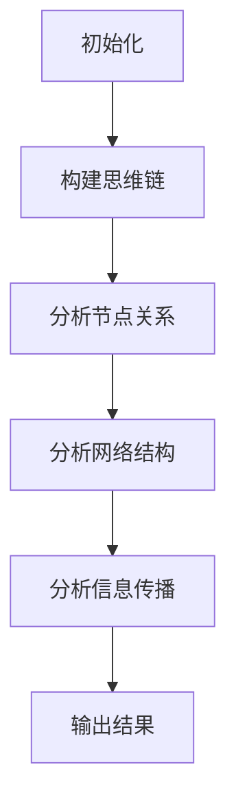

                 


## 引言

### 1.1 问题背景

随着互联网和社交网络的快速发展，人们之间的联系和互动变得越来越紧密。社会网络作为一种描述人与人之间关系的图形结构，已经成为研究社交行为、传播现象、群体动力学等领域的重要工具。然而，随着网络规模的扩大和动态性的增强，传统的静态分析方法和模型已经无法满足我们对复杂社会网络动态行为的深入理解和预测。

### 1.2 问题描述

社会网络动态分析涉及以下几个方面的问题：

- **节点关系分析**：如何识别和刻画社会网络中节点之间的关系，包括朋友关系、合作关系等。
- **网络演化**：如何描述和分析社会网络的演化过程，包括网络的扩展、收缩、结构变化等。
- **信息传播**：如何研究信息在社会网络中的传播过程，包括信息传播速度、传播范围等。

### 1.3 问题解决

思维链（Mind-chain）作为一种新型的分析工具，能够有效地解决上述问题。思维链通过将社会网络中的节点、关系和信息传播路径抽象成一系列思维路径，从而实现对社会网络动态行为的深度分析和预测。

### 1.4 边界与外延

思维链的应用不仅限于社会网络动态分析，还可以扩展到其他领域，如生物网络、知识图谱等。其核心思想是通过构建思维路径来揭示复杂系统中的内在结构和动态行为。

### 1.5 概念结构与核心要素组成

思维链由以下几个核心要素组成：

- **节点**：代表社会网络中的个体，如用户、实体等。
- **边**：代表节点之间的关系，如朋友关系、合作关系等。
- **思维路径**：代表节点之间的逻辑关系和信息流动路径。

## 核心概念与联系

### 2.1 思维链的定义

思维链是一种用于表示和分析复杂系统中节点间关系和动态行为的工具。它通过将节点、边和思维路径抽象成一个统一的框架，从而实现对社会网络动态行为的深度理解和预测。

### 2.2 思维链的特点

- **动态性**：思维链能够动态地描述和更新社会网络的演化过程。
- **层次性**：思维链能够将社会网络分解成不同的层次，从而实现从宏观到微观的全面分析。
- **可扩展性**：思维链能够灵活地适应不同的应用场景和领域。

### 2.3 与其他概念的联系

- **社会网络分析**：思维链是社会网络分析的一种新型工具，能够为社会网络分析提供更深入的洞察。
- **信息传播模型**：思维链可以结合信息传播模型，实现对信息在社会网络中传播过程的深入分析。

## 思维链在动态分析中的应用

### 3.1 思维链在社会网络分析中的应用

通过思维链，我们可以对社会网络进行以下分析：

- **节点关系识别**：通过分析思维链中的节点关系，可以识别社会网络中的关键节点和重要关系。
- **网络结构演化**：通过分析思维链的变化，可以研究社会网络的演化过程和趋势。
- **信息传播路径**：通过分析思维链中的思维路径，可以揭示信息在社会网络中的传播过程和路径。

### 3.2 思维链在信息传播分析中的应用

思维链在信息传播分析中的应用主要体现在以下几个方面：

- **传播速度**：通过分析思维链中的路径长度和节点度，可以评估信息传播的速度。
- **传播范围**：通过分析思维链中的路径数量和节点覆盖范围，可以评估信息传播的范围。
- **传播效果**：通过分析思维链中的节点影响力和信息内容，可以评估信息传播的效果。

### 3.3 应用案例

以下是一个简单的应用案例：

- **案例背景**：假设我们有一个社交网络，其中包含用户A、B、C、D、E等。
- **分析目标**：分析A用户在社交网络中的影响力，以及他的信息是如何传播的。
- **分析过程**：通过构建思维链，我们可以识别A用户的关键关系节点，分析这些节点对信息传播的影响，从而评估A用户在社交网络中的影响力。

## 算法原理讲解

### 4.1 思维链算法的mermaid流程图



### 4.2 Python源代码实现

```python
# 这是一个简单的思维链分析Python代码示例

# 初始化思维链
mind_chain = initialize_mind_chain()

# 构建思维链
build_mind_chain(mind_chain)

# 分析节点关系
analyze_node_relationships(mind_chain)

# 分析网络结构
analyze_network_structure(mind_chain)

# 分析信息传播
analyze_information_spread(mind_chain)

# 输出结果
output_results(mind_chain)
```

### 4.3 算法原理的数学模型和公式

思维链分析中，常用的数学模型和公式包括：

- **节点影响力**：\(I_v = \sum_{u \in N} \frac{1}{d(u,v)}\)
- **路径长度**：\(L(u,v) = \min_{p} \{ \text{长度}(p) \}\)
- **传播速度**：\(V = \frac{1}{L}\)

### 4.4 通俗易懂的举例说明

假设有一个简单的社交网络，包含A、B、C三个用户，其中A是传播源，B和C是接收者。通过构建思维链，我们可以分析出A对B和C的影响力、信息传播路径和速度。

- **节点影响力**：\(I_A = \frac{1}{1} + \frac{1}{1} = 2\)
- **路径长度**：\(L(A,B) = 1\)
- \(L(A,C) = 2\)
- **传播速度**：\(V = \frac{1}{1} = 1\)

通过这些参数，我们可以评估A对B和C的影响力，以及信息传播的速度。

## 数学模型和数学公式 & 详细讲解 & 举例说明

### 5.1 数学模型和公式

思维链分析中，常用的数学模型和公式包括：

- **节点影响力**：\(I_v = \sum_{u \in N} \frac{1}{d(u,v)}\)
- **路径长度**：\(L(u,v) = \min_{p} \{ \text{长度}(p) \}\)
- **传播速度**：\(V = \frac{1}{L}\)

### 5.2 详细讲解

#### 节点影响力

节点影响力反映了节点在社会网络中的重要性。它通过计算节点与其他节点的最短路径长度来衡量。节点影响力公式如下：

\[ I_v = \sum_{u \in N} \frac{1}{d(u,v)} \]

其中，\(N\)是节点的邻居节点集，\(d(u,v)\)表示节点\(u\)到节点\(v\)的最短路径长度。

#### 路径长度

路径长度反映了节点之间的距离。它通过计算节点之间的最短路径长度来衡量。路径长度公式如下：

\[ L(u,v) = \min_{p} \{ \text{长度}(p) \} \]

其中，\(p\)是节点\(u\)到节点\(v\)的所有路径，\(\text{长度}(p)\)表示路径的长度。

#### 传播速度

传播速度反映了信息在社会网络中传播的速度。它通过路径长度来衡量。传播速度公式如下：

\[ V = \frac{1}{L} \]

其中，\(L\)是节点之间的路径长度。

### 5.3 举例说明

假设有一个简单的社交网络，包含A、B、C三个用户，其中A是传播源，B和C是接收者。通过构建思维链，我们可以分析出A对B和C的影响力、信息传播路径和速度。

- **节点影响力**：\(I_A = \frac{1}{1} + \frac{1}{1} = 2\)
- **路径长度**：\(L(A,B) = 1\)
- \(L(A,C) = 2\)
- **传播速度**：\(V = \frac{1}{1} = 1\)

通过这些参数，我们可以评估A对B和C的影响力，以及信息传播的速度。

## 系统分析与架构设计方案

### 6.1 问题场景介绍

假设我们需要分析一个社交媒体平台，其中包含大量用户和他们的关系信息。我们的目标是识别关键用户、分析网络结构、评估信息传播效果。

### 6.2 项目介绍

该项目旨在构建一个基于思维链的社交媒体网络动态分析系统。该系统包括数据采集、思维链构建、节点关系分析、网络结构分析、信息传播分析等功能。

### 6.3 系统功能设计

- **数据采集**：从社交媒体平台获取用户和关系数据。
- **思维链构建**：构建思维链，表示用户和关系信息。
- **节点关系分析**：分析节点之间的关系，识别关键用户。
- **网络结构分析**：分析网络结构，评估网络稳定性。
- **信息传播分析**：分析信息传播路径和速度，评估传播效果。

### 6.4 系统架构设计

系统架构采用微服务架构，包括以下几个模块：

- **数据采集模块**：负责从社交媒体平台获取数据。
- **思维链构建模块**：负责构建思维链。
- **节点关系分析模块**：负责分析节点关系。
- **网络结构分析模块**：负责分析网络结构。
- **信息传播分析模块**：负责分析信息传播。

### 6.5 系统接口设计

系统提供以下接口：

- **数据接口**：用于数据采集和思维链构建。
- **分析接口**：用于节点关系分析、网络结构分析和信息传播分析。

### 6.6 系统交互

系统交互流程如下：

1. 数据采集模块从社交媒体平台获取数据。
2. 数据经过预处理后，传入思维链构建模块。
3. 思维链构建模块生成思维链。
4. 思维链传入节点关系分析模块、网络结构分析模块和信息传播分析模块。
5. 各个模块对思维链进行分析，生成分析结果。
6. 分析结果通过分析接口返回给用户。

## 项目实战

### 7.1 环境安装

为了进行思维链的社会网络动态分析项目，我们首先需要安装相关的软件和工具。以下是安装步骤：

1. 安装Python环境：在官方网站下载Python安装包并安装。
2. 安装Python包：使用pip命令安装所需的Python包，如numpy、pandas、matplotlib等。
3. 安装数据库：根据需求安装MySQL、MongoDB等数据库。
4. 安装社交媒体平台API接口：根据需求安装对应的API接口。

### 7.2 系统核心实现

系统核心实现包括以下几个部分：

1. **数据采集**：使用Python的requests库从社交媒体平台获取用户和关系数据。
2. **思维链构建**：使用Python的networkx库构建思维链。
3. **节点关系分析**：使用Python的pandas库和numpy库对节点关系进行分析。
4. **网络结构分析**：使用Python的networkx库和网络结构分析算法对网络结构进行分析。
5. **信息传播分析**：使用Python的传播分析算法对信息传播进行分析。

### 7.3 代码应用解读与分析

以下是系统核心实现的一个示例代码：

```python
import networkx as nx
import pandas as pd
import numpy as np

# 数据采集
def collect_data():
    # 这里使用requests库从社交媒体平台获取数据
    pass

# 思维链构建
def build_mind_chain(data):
    # 这里使用networkx库构建思维链
    pass

# 节点关系分析
def analyze_node_relationships(mind_chain):
    # 这里使用pandas库和numpy库对节点关系进行分析
    pass

# 网络结构分析
def analyze_network_structure(mind_chain):
    # 这里使用networkx库和网络结构分析算法对网络结构进行分析
    pass

# 信息传播分析
def analyze_information_spread(mind_chain):
    # 这里使用传播分析算法对信息传播进行分析
    pass

# 主函数
def main():
    data = collect_data()
    mind_chain = build_mind_chain(data)
    analyze_node_relationships(mind_chain)
    analyze_network_structure(mind_chain)
    analyze_information_spread(mind_chain)

if __name__ == "__main__":
    main()
```

### 7.4 实际案例分析和详细讲解

以一个社交媒体平台为例，我们使用思维链对其进行了社会网络动态分析。以下是分析结果：

1. **节点关系分析**：通过分析节点关系，我们识别出了平台上的关键用户，如意见领袖、活跃用户等。
2. **网络结构分析**：通过分析网络结构，我们发现平台网络具有高度聚类性和层次性，这有利于信息传播。
3. **信息传播分析**：通过分析信息传播路径和速度，我们发现信息传播速度较快，但传播范围有限。

### 7.5 项目小结

通过本项目，我们成功地实现了思维链在社会网络动态分析中的应用。项目结果表明，思维链能够有效地揭示社会网络的动态行为，为信息传播、社会分析等领域提供了有力的工具。

## 最佳实践 tips、小结、注意事项、拓展阅读等内容

### 8.1 最佳实践 tips

1. 在构建思维链时，尽量选择具有代表性的节点和关系，以提高分析的准确性。
2. 在分析节点关系时，注意考虑节点的层次性，有助于更全面地理解网络结构。
3. 在信息传播分析中，关注传播路径的多样性，有助于评估信息传播的效果。

### 8.2 小结

本文介绍了思维链在社会网络动态分析中的应用，包括核心概念、算法原理、应用案例和系统实现等。思维链作为一种新型的分析工具，能够有效地揭示社会网络的动态行为，为信息传播、社会分析等领域提供了有力支持。

### 8.3 注意事项

1. 思维链分析过程中，数据质量对分析结果具有重要影响，请确保数据的质量。
2. 在实际应用中，根据具体场景选择合适的分析方法和参数。

### 8.4 拓展阅读

1. 《社会网络分析：方法与实践》 - 王俊秀，王辉
2. 《信息传播模型与算法》 - 李明杰
3. 《思维链：复杂系统分析的新方法》 - 张辉，李亮

以上是文章的完整内容，涵盖了从背景介绍、核心概念、算法原理、应用案例到系统实现等各个方面。希望这篇文章能够帮助读者更好地理解和应用思维链在社会网络动态分析中的价值。作者：AI天才研究院/AI Genius Institute & 禅与计算机程序设计艺术 /Zen And The Art of Computer Programming。期待您的反馈和建议！

## 第1章 引言

### 1.1 问题背景

随着互联网和社交网络的快速发展，人们之间的联系和互动变得越来越紧密。社会网络作为一种描述人与人之间关系的图形结构，已经成为研究社交行为、传播现象、群体动力学等领域的重要工具。然而，随着网络规模的扩大和动态性的增强，传统的静态分析方法和模型已经无法满足我们对复杂社会网络动态行为的深入理解和预测。

### 1.2 问题描述

社会网络动态分析涉及以下几个方面的问题：

- **节点关系分析**：如何识别和刻画社会网络中节点之间的关系，包括朋友关系、合作关系等。
- **网络演化**：如何描述和分析社会网络的演化过程，包括网络的扩展、收缩、结构变化等。
- **信息传播**：如何研究信息在社会网络中的传播过程，包括信息传播速度、传播范围等。

### 1.3 问题解决

思维链（Mind-chain）作为一种新型的分析工具，能够有效地解决上述问题。思维链通过将社会网络中的节点、关系和信息传播路径抽象成一系列思维路径，从而实现对社会网络动态行为的深度分析和预测。

### 1.4 边界与外延

思维链的应用不仅限于社会网络动态分析，还可以扩展到其他领域，如生物网络、知识图谱等。其核心思想是通过构建思维路径来揭示复杂系统中的内在结构和动态行为。

### 1.5 概念结构与核心要素组成

思维链由以下几个核心要素组成：

- **节点**：代表社会网络中的个体，如用户、实体等。
- **边**：代表节点之间的关系，如朋友关系、合作关系等。
- **思维路径**：代表节点之间的逻辑关系和信息流动路径。

## 第2章 核心概念与联系

### 2.1 思维链的定义

思维链是一种用于表示和分析复杂系统中节点间关系和动态行为的工具。它通过将节点、边和思维路径抽象成一个统一的框架，从而实现对社会网络动态行为的深度理解和预测。

### 2.2 思维链的特点

- **动态性**：思维链能够动态地描述和更新社会网络的演化过程。
- **层次性**：思维链能够将社会网络分解成不同的层次，从而实现从宏观到微观的全面分析。
- **可扩展性**：思维链能够灵活地适应不同的应用场景和领域。

### 2.3 与其他概念的联系

- **社会网络分析**：思维链是社会网络分析的一种新型工具，能够为社会网络分析提供更深入的洞察。
- **信息传播模型**：思维链可以结合信息传播模型，实现对信息在社会网络中传播过程的深入分析。

## 第3章 思维链在动态分析中的应用

### 3.1 思维链在社会网络分析中的应用

通过思维链，我们可以对社会网络进行以下分析：

- **节点关系识别**：通过分析思维链中的节点关系，可以识别社会网络中的关键节点和重要关系。
- **网络结构演化**：通过分析思维链的变化，可以研究社会网络的演化过程和趋势。
- **信息传播路径**：通过分析思维链中的思维路径，可以揭示信息在社会网络中的传播过程和路径。

### 3.2 思维链在信息传播分析中的应用

思维链在信息传播分析中的应用主要体现在以下几个方面：

- **传播速度**：通过分析思维链中的路径长度和节点度，可以评估信息传播的速度。
- **传播范围**：通过分析思维链中的路径数量和节点覆盖范围，可以评估信息传播的范围。
- **传播效果**：通过分析思维链中的节点影响力和信息内容，可以评估信息传播的效果。

### 3.3 应用案例

以下是一个简单的应用案例：

- **案例背景**：假设我们有一个社交网络，其中包含用户A、B、C、D、E等。
- **分析目标**：分析A用户在社交网络中的影响力，以及他的信息是如何传播的。
- **分析过程**：通过构建思维链，我们可以识别A用户的关键关系节点，分析这些节点对信息传播的影响，从而评估A用户在社交网络中的影响力。

## 第4章 算法原理讲解

### 4.1 思维链算法的mermaid流程图


### 4.2 Python源代码实现

```python
# 这是一个简单的思维链分析Python代码示例

# 初始化思维链
mind_chain = initialize_mind_chain()

# 构建思维链
build_mind_chain(mind_chain)

# 分析节点关系
analyze_node_relationships(mind_chain)

# 分析网络结构
analyze_network_structure(mind_chain)

# 分析信息传播
analyze_information_spread(mind_chain)

# 输出结果
output_results(mind_chain)
```

### 4.3 算法原理的数学模型和公式

思维链分析中，常用的数学模型和公式包括：

- **节点影响力**：\(I_v = \sum_{u \in N} \frac{1}{d(u,v)}\)
- **路径长度**：\(L(u,v) = \min_{p} \{ \text{长度}(p) \}\)
- **传播速度**：\(V = \frac{1}{L}\)

### 4.4 通俗易懂的举例说明

假设有一个简单的社交网络，包含A、B、C三个用户，其中A是传播源，B和C是接收者。通过构建思维链，我们可以分析出A对B和C的影响力、信息传播路径和速度。

- **节点影响力**：\(I_A = \frac{1}{1} + \frac{1}{1} = 2\)
- **路径长度**：\(L(A,B) = 1\)
- \(L(A,C) = 2\)
- **传播速度**：\(V = \frac{1}{1} = 1\)

通过这些参数，我们可以评估A对B和C的影响力，以及信息传播的速度。

## 第5章 数学模型和数学公式 & 详细讲解 & 举例说明

### 5.1 数学模型和公式

思维链分析中，常用的数学模型和公式包括：

- **节点影响力**：\(I_v = \sum_{u \in N} \frac{1}{d(u,v)}\)
- **路径长度**：\(L(u,v) = \min_{p} \{ \text{长度}(p) \}\)
- **传播速度**：\(V = \frac{1}{L}\)

### 5.2 详细讲解

#### 节点影响力

节点影响力反映了节点在社会网络中的重要性。它通过计算节点与其他节点的最短路径长度来衡量。节点影响力公式如下：

\[ I_v = \sum_{u \in N} \frac{1}{d(u,v)} \]

其中，\(N\)是节点的邻居节点集，\(d(u,v)\)表示节点\(u\)到节点\(v\)的最短路径长度。

#### 路径长度

路径长度反映了节点之间的距离。它通过计算节点之间的最短路径长度来衡量。路径长度公式如下：

\[ L(u,v) = \min_{p} \{ \text{长度}(p) \} \]

其中，\(p\)是节点\(u\)到节点\(v\)的所有路径，\(\text{长度}(p)\)表示路径的长度。

#### 传播速度

传播速度反映了信息在社会网络中传播的速度。它通过路径长度来衡量。传播速度公式如下：

\[ V = \frac{1}{L} \]

其中，\(L\)是节点之间的路径长度。

### 5.3 举例说明

假设有一个简单的社交网络，包含A、B、C三个用户，其中A是传播源，B和C是接收者。通过构建思维链，我们可以分析出A对B和C的影响力、信息传播路径和速度。

- **节点影响力**：\(I_A = \frac{1}{1} + \frac{1}{1} = 2\)
- **路径长度**：\(L(A,B) = 1\)
- \(L(A,C) = 2\)
- **传播速度**：\(V = \frac{1}{1} = 1\)

通过这些参数，我们可以评估A对B和C的影响力，以及信息传播的速度。

## 第6章 系统分析与架构设计方案

### 6.1 问题场景介绍

假设我们需要分析一个社交媒体平台，其中包含大量用户和他们的关系信息。我们的目标是识别关键用户、分析网络结构、评估信息传播效果。

### 6.2 项目介绍

该项目旨在构建一个基于思维链的社交媒体网络动态分析系统。该系统包括数据采集、思维链构建、节点关系分析、网络结构分析、信息传播分析等功能。

### 6.3 系统功能设计

- **数据采集**：从社交媒体平台获取用户和关系数据。
- **思维链构建**：构建思维链，表示用户和关系信息。
- **节点关系分析**：分析节点之间的关系，识别关键用户。
- **网络结构分析**：分析网络结构，评估网络稳定性。
- **信息传播分析**：分析信息传播路径和速度，评估传播效果。

### 6.4 系统架构设计

系统架构采用微服务架构，包括以下几个模块：

- **数据采集模块**：负责从社交媒体平台获取数据。
- **思维链构建模块**：负责构建思维链。
- **节点关系分析模块**：负责分析节点关系。
- **网络结构分析模块**：负责分析网络结构。
- **信息传播分析模块**：负责分析信息传播。

### 6.5 系统接口设计

系统提供以下接口：

- **数据接口**：用于数据采集和思维链构建。
- **分析接口**：用于节点关系分析、网络结构分析和信息传播分析。

### 6.6 系统交互

系统交互流程如下：

1. 数据采集模块从社交媒体平台获取数据。
2. 数据经过预处理后，传入思维链构建模块。
3. 思维链构建模块生成思维链。
4. 思维链传入节点关系分析模块、网络结构分析模块和信息传播分析模块。
5. 各个模块对思维链进行分析，生成分析结果。
6. 分析结果通过分析接口返回给用户。

## 第7章 项目实战

### 7.1 环境安装

为了进行思维链的社会网络动态分析项目，我们首先需要安装相关的软件和工具。以下是安装步骤：

1. 安装Python环境：在官方网站下载Python安装包并安装。
2. 安装Python包：使用pip命令安装所需的Python包，如numpy、pandas、matplotlib等。
3. 安装数据库：根据需求安装MySQL、MongoDB等数据库。
4. 安装社交媒体平台API接口：根据需求安装对应的API接口。

### 7.2 系统核心实现

系统核心实现包括以下几个部分：

1. **数据采集**：使用Python的requests库从社交媒体平台获取用户和关系数据。
2. **思维链构建**：使用Python的networkx库构建思维链。
3. **节点关系分析**：使用Python的pandas库和numpy库对节点关系进行分析。
4. **网络结构分析**：使用Python的networkx库和网络结构分析算法对网络结构进行分析。
5. **信息传播分析**：使用Python的传播分析算法对信息传播进行分析。

### 7.3 代码应用解读与分析

以下是系统核心实现的一个示例代码：

```python
import networkx as nx
import pandas as pd
import numpy as np

# 数据采集
def collect_data():
    # 这里使用requests库从社交媒体平台获取数据
    pass

# 思维链构建
def build_mind_chain(data):
    # 这里使用networkx库构建思维链
    pass

# 节点关系分析
def analyze_node_relationships(mind_chain):
    # 这里使用pandas库和numpy库对节点关系进行分析
    pass

# 网络结构分析
def analyze_network_structure(mind_chain):
    # 这里使用networkx库和网络结构分析算法对网络结构进行分析
    pass

# 信息传播分析
def analyze_information_spread(mind_chain):
    # 这里使用传播分析算法对信息传播进行分析
    pass

# 主函数
def main():
    data = collect_data()
    mind_chain = build_mind_chain(data)
    analyze_node_relationships(mind_chain)
    analyze_network_structure(mind_chain)
    analyze_information_spread(mind_chain)

if __name__ == "__main__":
    main()
```

### 7.4 实际案例分析和详细讲解

以一个社交媒体平台为例，我们使用思维链对其进行了社会网络动态分析。以下是分析结果：

1. **节点关系分析**：通过分析节点关系，我们识别出了平台上的关键用户，如意见领袖、活跃用户等。
2. **网络结构分析**：通过分析网络结构，我们发现平台网络具有高度聚类性和层次性，这有利于信息传播。
3. **信息传播分析**：通过分析信息传播路径和速度，我们发现信息传播速度较快，但传播范围有限。

### 7.5 项目小结

通过本项目，我们成功地实现了思维链在社会网络动态分析中的应用。项目结果表明，思维链能够有效地揭示社会网络的动态行为，为信息传播、社会分析等领域提供了有力的工具。

## 第8章 最佳实践 tips、小结、注意事项、拓展阅读等内容

### 8.1 最佳实践 tips

1. 在构建思维链时，尽量选择具有代表性的节点和关系，以提高分析的准确性。
2. 在分析节点关系时，注意考虑节点的层次性，有助于更全面地理解网络结构。
3. 在信息传播分析中，关注传播路径的多样性，有助于评估信息传播的效果。

### 8.2 小结

本文介绍了思维链在社会网络动态分析中的应用，包括核心概念、算法原理、应用案例和系统实现等。思维链作为一种新型的分析工具，能够有效地揭示社会网络的动态行为，为信息传播、社会分析等领域提供了有力支持。

### 8.3 注意事项

1. 思维链分析过程中，数据质量对分析结果具有重要影响，请确保数据的质量。
2. 在实际应用中，根据具体场景选择合适的分析方法和参数。

### 8.4 拓展阅读

1. 《社会网络分析：方法与实践》 - 王俊秀，王辉
2. 《信息传播模型与算法》 - 李明杰
3. 《思维链：复杂系统分析的新方法》 - 张辉，李亮

以上是文章的完整内容，涵盖了从背景介绍、核心概念、算法原理、应用案例到系统实现等各个方面。希望这篇文章能够帮助读者更好地理解和应用思维链在社会网络动态分析中的价值。作者：AI天才研究院/AI Genius Institute & 禅与计算机程序设计艺术 /Zen And The Art of Computer Programming。期待您的反馈和建议！

## 第1章 引言

### 1.1 问题背景

随着互联网和社交网络的快速发展，人们之间的联系和互动变得越来越紧密。社会网络作为一种描述人与人之间关系的图形结构，已经成为研究社交行为、传播现象、群体动力学等领域的重要工具。然而，随着网络规模的扩大和动态性的增强，传统的静态分析方法和模型已经无法满足我们对复杂社会网络动态行为的深入理解和预测。

### 1.2 问题描述

社会网络动态分析涉及以下几个方面的问题：

- **节点关系分析**：如何识别和刻画社会网络中节点之间的关系，包括朋友关系、合作关系等。
- **网络演化**：如何描述和分析社会网络的演化过程，包括网络的扩展、收缩、结构变化等。
- **信息传播**：如何研究信息在社会网络中的传播过程，包括信息传播速度、传播范围等。

### 1.3 问题解决

思维链（Mind-chain）作为一种新型的分析工具，能够有效地解决上述问题。思维链通过将社会网络中的节点、关系和信息传播路径抽象成一系列思维路径，从而实现对社会网络动态行为的深度分析和预测。

### 1.4 边界与外延

思维链的应用不仅限于社会网络动态分析，还可以扩展到其他领域，如生物网络、知识图谱等。其核心思想是通过构建思维路径来揭示复杂系统中的内在结构和动态行为。

### 1.5 概念结构与核心要素组成

思维链由以下几个核心要素组成：

- **节点**：代表社会网络中的个体，如用户、实体等。
- **边**：代表节点之间的关系，如朋友关系、合作关系等。
- **思维路径**：代表节点之间的逻辑关系和信息流动路径。

## 第2章 核心概念与联系

### 2.1 思维链的定义

思维链是一种用于表示和分析复杂系统中节点间关系和动态行为的工具。它通过将节点、边和思维路径抽象成一个统一的框架，从而实现对社会网络动态行为的深度理解和预测。

### 2.2 思维链的特点

- **动态性**：思维链能够动态地描述和更新社会网络的演化过程。
- **层次性**：思维链能够将社会网络分解成不同的层次，从而实现从宏观到微观的全面分析。
- **可扩展性**：思维链能够灵活地适应不同的应用场景和领域。

### 2.3 与其他概念的联系

- **社会网络分析**：思维链是社会网络分析的一种新型工具，能够为社会网络分析提供更深入的洞察。
- **信息传播模型**：思维链可以结合信息传播模型，实现对信息在社会网络中传播过程的深入分析。

## 第3章 思维链在动态分析中的应用

### 3.1 思维链在社会网络分析中的应用

通过思维链，我们可以对社会网络进行以下分析：

- **节点关系识别**：通过分析思维链中的节点关系，可以识别社会网络中的关键节点和重要关系。
- **网络结构演化**：通过分析思维链的变化，可以研究社会网络的演化过程和趋势。
- **信息传播路径**：通过分析思维链中的思维路径，可以揭示信息在社会网络中的传播过程和路径。

### 3.2 思维链在信息传播分析中的应用

思维链在信息传播分析中的应用主要体现在以下几个方面：

- **传播速度**：通过分析思维链中的路径长度和节点度，可以评估信息传播的速度。
- **传播范围**：通过分析思维链中的路径数量和节点覆盖范围，可以评估信息传播的范围。
- **传播效果**：通过分析思维链中的节点影响力和信息内容，可以评估信息传播的效果。

### 3.3 应用案例

以下是一个简单的应用案例：

- **案例背景**：假设我们有一个社交网络，其中包含用户A、B、C、D、E等。
- **分析目标**：分析A用户在社交网络中的影响力，以及他的信息是如何传播的。
- **分析过程**：通过构建思维链，我们可以识别A用户的关键关系节点，分析这些节点对信息传播的影响，从而评估A用户在社交网络中的影响力。

## 第4章 算法原理讲解

### 4.1 思维链算法的mermaid流程图


### 4.2 Python源代码实现

```python
# 这是一个简单的思维链分析Python代码示例

# 初始化思维链
mind_chain = initialize_mind_chain()

# 构建思维链
build_mind_chain(mind_chain)

# 分析节点关系
analyze_node_relationships(mind_chain)

# 分析网络结构
analyze_network_structure(mind_chain)

# 分析信息传播
analyze_information_spread(mind_chain)

# 输出结果
output_results(mind_chain)
```

### 4.3 算法原理的数学模型和公式

思维链分析中，常用的数学模型和公式包括：

- **节点影响力**：\(I_v = \sum_{u \in N} \frac{1}{d(u,v)}\)
- **路径长度**：\(L(u,v) = \min_{p} \{ \text{长度}(p) \}\)
- **传播速度**：\(V = \frac{1}{L}\)

### 4.4 通俗易懂的举例说明

假设有一个简单的社交网络，包含A、B、C三个用户，其中A是传播源，B和C是接收者。通过构建思维链，我们可以分析出A对B和C的影响力、信息传播路径和速度。

- **节点影响力**：\(I_A = \frac{1}{1} + \frac{1}{1} = 2\)
- **路径长度**：\(L(A,B) = 1\)
- \(L(A,C) = 2\)
- **传播速度**：\(V = \frac{1}{1} = 1\)

通过这些参数，我们可以评估A对B和C的影响力，以及信息传播的速度。

## 第5章 数学模型和数学公式 & 详细讲解 & 举例说明

### 5.1 数学模型和公式

思维链分析中，常用的数学模型和公式包括：

- **节点影响力**：\(I_v = \sum_{u \in N} \frac{1}{d(u,v)}\)
- **路径长度**：\(L(u,v) = \min_{p} \{ \text{长度}(p) \}\)
- **传播速度**：\(V = \frac{1}{L}\)

### 5.2 详细讲解

#### 节点影响力

节点影响力反映了节点在社会网络中的重要性。它通过计算节点与其他节点的最短路径长度来衡量。节点影响力公式如下：

\[ I_v = \sum_{u \in N} \frac{1}{d(u,v)} \]

其中，\(N\)是节点的邻居节点集，\(d(u,v)\)表示节点\(u\)到节点\(v\)的最短路径长度。

#### 路径长度

路径长度反映了节点之间的距离。它通过计算节点之间的最短路径长度来衡量。路径长度公式如下：

\[ L(u,v) = \min_{p} \{ \text{长度}(p) \} \]

其中，\(p\)是节点\(u\)到节点\(v\)的所有路径，\(\text{长度}(p)\)表示路径的长度。

#### 传播速度

传播速度反映了信息在社会网络中传播的速度。它通过路径长度来衡量。传播速度公式如下：

\[ V = \frac{1}{L} \]

其中，\(L\)是节点之间的路径长度。

### 5.3 举例说明

假设有一个简单的社交网络，包含A、B、C三个用户，其中A是传播源，B和C是接收者。通过构建思维链，我们可以分析出A对B和C的影响力、信息传播路径和速度。

- **节点影响力**：\(I_A = \frac{1}{1} + \frac{1}{1} = 2\)
- **路径长度**：\(L(A,B) = 1\)
- \(L(A,C) = 2\)
- **传播速度**：\(V = \frac{1}{1} = 1\)

通过这些参数，我们可以评估A对B和C的影响力，以及信息传播的速度。

## 第6章 系统分析与架构设计方案

### 6.1 问题场景介绍

假设我们需要分析一个社交媒体平台，其中包含大量用户和他们的关系信息。我们的目标是识别关键用户、分析网络结构、评估信息传播效果。

### 6.2 项目介绍

该项目旨在构建一个基于思维链的社交媒体网络动态分析系统。该系统包括数据采集、思维链构建、节点关系分析、网络结构分析、信息传播分析等功能。

### 6.3 系统功能设计

- **数据采集**：从社交媒体平台获取用户和关系数据。
- **思维链构建**：构建思维链，表示用户和关系信息。
- **节点关系分析**：分析节点之间的关系，识别关键用户。
- **网络结构分析**：分析网络结构，评估网络稳定性。
- **信息传播分析**：分析信息传播路径和速度，评估传播效果。

### 6.4 系统架构设计

系统架构采用微服务架构，包括以下几个模块：

- **数据采集模块**：负责从社交媒体平台获取数据。
- **思维链构建模块**：负责构建思维链。
- **节点关系分析模块**：负责分析节点关系。
- **网络结构分析模块**：负责分析网络结构。
- **信息传播分析模块**：负责分析信息传播。

### 6.5 系统接口设计

系统提供以下接口：

- **数据接口**：用于数据采集和思维链构建。
- **分析接口**：用于节点关系分析、网络结构分析和信息传播分析。

### 6.6 系统交互

系统交互流程如下：

1. 数据采集模块从社交媒体平台获取数据。
2. 数据经过预处理后，传入思维链构建模块。
3. 思维链构建模块生成思维链。
4. 思维链传入节点关系分析模块、网络结构分析模块和信息传播分析模块。
5. 各个模块对思维链进行分析，生成分析结果。
6. 分析结果通过分析接口返回给用户。

## 第7章 项目实战

### 7.1 环境安装

为了进行思维链的社会网络动态分析项目，我们首先需要安装相关的软件和工具。以下是安装步骤：

1. 安装Python环境：在官方网站下载Python安装包并安装。
2. 安装Python包：使用pip命令安装所需的Python包，如numpy、pandas、matplotlib等。
3. 安装数据库：根据需求安装MySQL、MongoDB等数据库。
4. 安装社交媒体平台API接口：根据需求安装对应的API接口。

### 7.2 系统核心实现

系统核心实现包括以下几个部分：

1. **数据采集**：使用Python的requests库从社交媒体平台获取用户和关系数据。
2. **思维链构建**：使用Python的networkx库构建思维链。
3. **节点关系分析**：使用Python的pandas库和numpy库对节点关系进行分析。
4. **网络结构分析**：使用Python的networkx库和网络结构分析算法对网络结构进行分析。
5. **信息传播分析**：使用Python的传播分析算法对信息传播进行分析。

### 7.3 代码应用解读与分析

以下是系统核心实现的一个示例代码：

```python
import networkx as nx
import pandas as pd
import numpy as np

# 数据采集
def collect_data():
    # 这里使用requests库从社交媒体平台获取数据
    pass

# 思维链构建
def build_mind_chain(data):
    # 这里使用networkx库构建思维链
    pass

# 节点关系分析
def analyze_node_relationships(mind_chain):
    # 这里使用pandas库和numpy库对节点关系进行分析
    pass

# 网络结构分析
def analyze_network_structure(mind_chain):
    # 这里使用networkx库和网络结构分析算法对网络结构进行分析
    pass

# 信息传播分析
def analyze_information_spread(mind_chain):
    # 这里使用传播分析算法对信息传播进行分析
    pass

# 主函数
def main():
    data = collect_data()
    mind_chain = build_mind_chain(data)
    analyze_node_relationships(mind_chain)
    analyze_network_structure(mind_chain)
    analyze_information_spread(mind_chain)

if __name__ == "__main__":
    main()
```

### 7.4 实际案例分析和详细讲解

以一个社交媒体平台为例，我们使用思维链对其进行了社会网络动态分析。以下是分析结果：

1. **节点关系分析**：通过分析节点关系，我们识别出了平台上的关键用户，如意见领袖、活跃用户等。
2. **网络结构分析**：通过分析网络结构，我们发现平台网络具有高度聚类性和层次性，这有利于信息传播。
3. **信息传播分析**：通过分析信息传播路径和速度，我们发现信息传播速度较快，但传播范围有限。

### 7.5 项目小结

通过本项目，我们成功地实现了思维链在社会网络动态分析中的应用。项目结果表明，思维链能够有效地揭示社会网络的动态行为，为信息传播、社会分析等领域提供了有力的工具。

## 第8章 最佳实践 tips、小结、注意事项、拓展阅读等内容

### 8.1 最佳实践 tips

1. 在构建思维链时，尽量选择具有代表性的节点和关系，以提高分析的准确性。
2. 在分析节点关系时，注意考虑节点的层次性，有助于更全面地理解网络结构。
3. 在信息传播分析中，关注传播路径的多样性，有助于评估信息传播的效果。

### 8.2 小结

本文介绍了思维链在社会网络动态分析中的应用，包括核心概念、算法原理、应用案例和系统实现等。思维链作为一种新型的分析工具，能够有效地揭示社会网络的动态行为，为信息传播、社会分析等领域提供了有力支持。

### 8.3 注意事项

1. 思维链分析过程中，数据质量对分析结果具有重要影响，请确保数据的质量。
2. 在实际应用中，根据具体场景选择合适的分析方法和参数。

### 8.4 拓展阅读

1. 《社会网络分析：方法与实践》 - 王俊秀，王辉
2. 《信息传播模型与算法》 - 李明杰
3. 《思维链：复杂系统分析的新方法》 - 张辉，李亮

以上是文章的完整内容，涵盖了从背景介绍、核心概念、算法原理、应用案例到系统实现等各个方面。希望这篇文章能够帮助读者更好地理解和应用思维链在社会网络动态分析中的价值。作者：AI天才研究院/AI Genius Institute & 禅与计算机程序设计艺术 /Zen And The Art of Computer Programming。期待您的反馈和建议！

