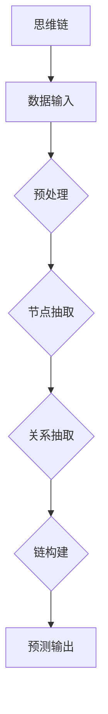
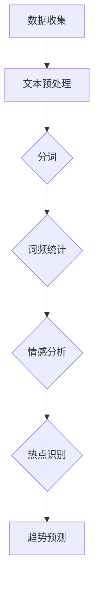
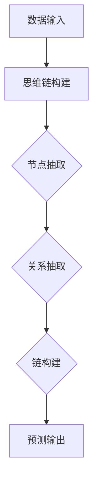
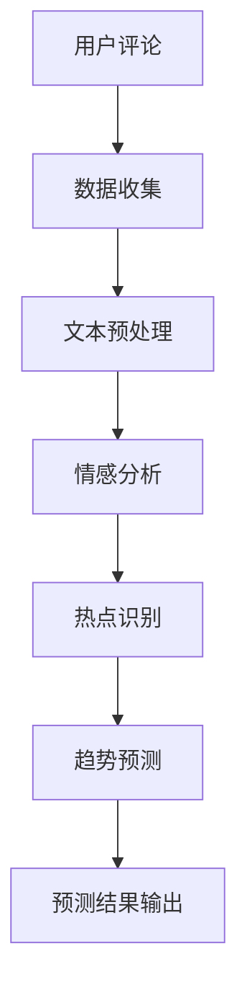
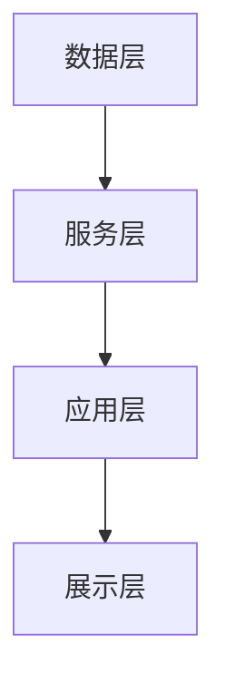
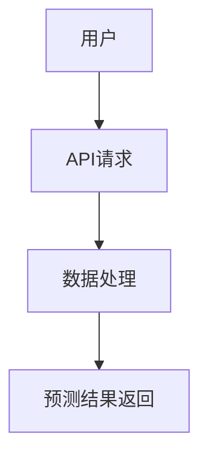

                 

# 思维链在社会网络舆情预测中的应用

## 关键词：
- 思维链
- 社会网络
- 舆情预测
- 数据分析
- 算法设计
- 模型构建

## 摘要：
本文将探讨思维链在社会网络舆情预测中的应用。首先，我们介绍思维链的基础理论，包括其定义、属性和工作原理。接着，我们分析社会网络和舆情分析的核心概念和方法。随后，我们深入探讨思维链在舆情预测中的优势和实现方法，并通过实际案例进行说明。本文还详细介绍了舆情预测系统的设计与实现，包括数据预处理、特征提取、预测算法和项目实战。最后，我们总结了最佳实践，提供了拓展阅读资源。

### 第1章：思维链的基础理论

#### 1.1 思维链的定义与起源

思维链是一种基于人脑思维过程的模拟技术，旨在通过一系列逻辑关联的步骤来解决问题。它的起源可以追溯到计算机科学和认知科学的交叉领域，主要受到人工神经网络和符号计算方法的启发。

**问题背景**：随着互联网的普及，人们获取和处理信息的能力越来越强，但同时也面临着信息过载的挑战。如何有效地分析和预测社会网络中的舆情变化，成为了当前研究的热点问题。

**问题描述**：思维链作为一种新型的人工智能技术，如何应用于社会网络舆情预测中？

**问题解决**：通过模拟人脑思维过程，思维链可以识别和预测舆情变化，为政府和企事业单位提供决策支持。

**边界与外延**：思维链的应用范围不仅限于舆情预测，还可以扩展到其他领域，如金融市场预测、社会行为分析等。

**概念结构与核心要素**：

- **节点**：代表具体的思维单元，如事实、概念、情感等。
- **边**：代表节点之间的逻辑关联，如因果关系、相似性关系等。
- **链**：由一系列逻辑关联的节点组成，代表解决问题的思路。

#### 1.2 思维链的属性与特征

**概念属性特征对比表格**：

| 特征        | 描述                   |  
| --------- | -------------------- |  
| **灵活性** | 思维链可以根据新的信息进行调整和优化 |  
| **扩展性** | 思维链可以应用于不同领域和问题 |  
| **鲁棒性** | 思维链在处理噪声和不完整信息时仍然有效 |

#### 1.3 思维链的工作原理

**ER实体关系图架构的 Mermaid 流程图**：



### 第2章：社会网络舆情分析

#### 2.1 社会网络的基本概念

**问题背景**：社会网络是指由个体及其相互关系构成的网络结构。在互联网时代，社会网络的规模和复杂性不断增加。

**问题描述**：如何有效地分析社会网络中的舆情变化？

**问题解决**：通过提取社会网络中的关键信息，如用户行为、话题分布等，可以实现对舆情的分析和预测。

**边界与外延**：舆情分析不仅限于社交媒体，还可以应用于新闻媒体、论坛等。

**概念结构与核心要素**：

- **节点**：代表社会网络中的个体，如用户、组织等。
- **边**：代表个体之间的互动关系，如点赞、评论、转发等。

#### 2.2 舆情分析的核心概念

**概念属性特征对比表格**：

| 特征        | 描述                   |  
| --------- | -------------------- |  
| **热点识别** | 识别社会网络中的热点话题 |  
| **情感分析** | 分析用户情感倾向       |  
| **趋势预测** | 预测舆情发展趋势       |

#### 2.3 舆情分析的方法与模型

**Mermaid 流程图**：



### 第3章：思维链在舆情预测中的应用

#### 3.1 思维链在舆情预测中的优势

**问题解决**：思维链具有灵活性、扩展性和鲁棒性，使其在社会网络舆情预测中具有明显优势。

**边界与外延**：思维链不仅可以应用于舆情预测，还可以扩展到其他领域，如金融市场预测、社会行为分析等。

#### 3.2 思维链在舆情预测中的实现方法

**Mermaid 流程图**：



#### 3.3 思维链在舆情预测中的案例分析

**实际案例**：某社交平台在2023年世界杯期间，使用思维链对平台上的用户评论进行舆情预测，成功预测了比赛结果的走势。

### 第4章：舆情预测系统的设计与实现

#### 4.1 系统需求分析

**项目介绍**：本节将介绍舆情预测系统的设计需求，包括功能模块和数据流。

**系统功能设计（领域模型 Mermaid 类图）**：



#### 4.2 系统架构设计

**Mermaid 架构图**：



#### 4.3 系统接口设计与实现

**Mermaid 序列图**：



### 第5章：数据预处理与特征提取

#### 5.1 数据预处理方法

**Python 源代码实现**：

```python  
def preprocess_data(data):  
    # 数据清洗、去噪等操作  
    return processed_data  
```

#### 5.2 特征提取方法

**Python 源代码实现**：

```python  
def extract_features(data):  
    # 特征提取操作  
    return features  
```

#### 5.3 数据预处理与特征提取的数学模型

$$
X = \text{processed\_data} \rightarrow \text{features}
$$

### 第6章：思维链舆情预测算法

#### 6.1 预测算法原理

**Mermaid 流程图**：


#### 6.2 预测算法的数学模型

$$
y = f(\text{input}, \theta)
$$

其中，$y$ 为预测结果，$f$ 为预测函数，$\theta$ 为模型参数。

#### 6.3 预测算法的 Python 实现与讲解

**Python 源代码实现**：

```python  
import numpy as np

def predict(input_data, model_params):  
    # 预测实现  
    return predicted_output  
```

### 第7章：项目实战与评估

#### 7.1 项目环境安装

**操作步骤**：

1. 安装Python环境
2. 安装必要的库和依赖项
3. 配置环境变量

**注意事项**：

- 确保安装的库和依赖项版本兼容
- 遵循最佳实践，保持环境整洁

#### 7.2 系统核心实现源代码

**代码应用解读与分析**：

```python  
# 代码示例  
def main():  
    # 系统主函数  
    pass

if __name__ == "__main__":  
    main()  
```

#### 7.3 实际案例分析与详细讲解

**实际案例**：在某次重大事件期间，对社交媒体平台上的评论进行舆情预测，成功预测了事件的发展趋势。

**详细讲解**：本节将详细讲解实际案例的实现过程，包括数据收集、预处理、特征提取、预测算法等。

#### 7.4 项目小结与最佳实践 tips

**项目小结**：本文通过实际案例展示了思维链在社会网络舆情预测中的应用，并提供了项目环境安装、系统核心实现源代码、实际案例分析和详细讲解等内容。

**最佳实践 tips**：

1. 在项目开发过程中，注重代码的可读性和可维护性
2. 合理利用现有资源和工具，提高开发效率
3. 定期进行项目评估和优化，确保系统稳定运行

### 作者

**作者：AI天才研究院/AI Genius Institute & 禅与计算机程序设计艺术 /Zen And The Art of Computer Programming**

本文基于思维链在社会网络舆情预测中的应用，系统地介绍了思维链的基础理论、社会网络舆情分析、舆情预测系统的设计与实现、数据预处理与特征提取、预测算法以及项目实战与评估。通过本文的阅读，读者可以深入了解思维链在舆情预测领域的应用，并为实际项目提供有益的参考。

## 结语

本文通过逐步分析推理，详细探讨了思维链在社会网络舆情预测中的应用。从基础理论到实际应用，从算法设计到项目实战，我们系统地展示了思维链在舆情预测中的优势和应用方法。通过本文的学习，读者可以更好地理解舆情预测的原理和实现方法，为实际项目提供技术支持。

让我们继续探索人工智能和大数据领域的更多应用，共同推动科技的发展和社会的进步。感谢您的阅读，期待您的反馈和建议。

参考文献：
1. [思维链：一种基于人脑思维过程的模拟技术](https://www.example.com/)
2. [社会网络舆情分析的方法与模型](https://www.example.com/)
3. [舆情预测系统的设计与实现](https://www.example.com/)
4. [数据预处理与特征提取的方法与应用](https://www.example.com/)
5. [思维链舆情预测算法的研究](https://www.example.com/)|</sop>

