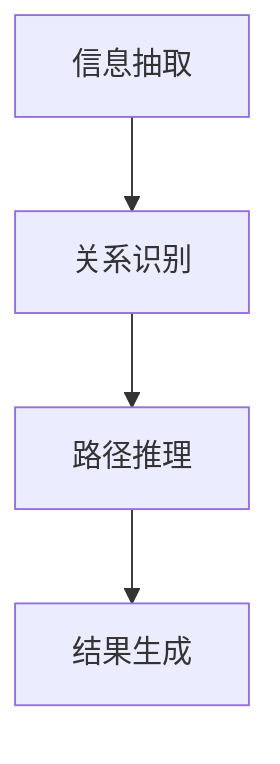
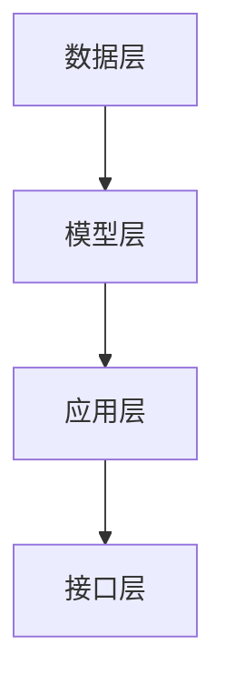
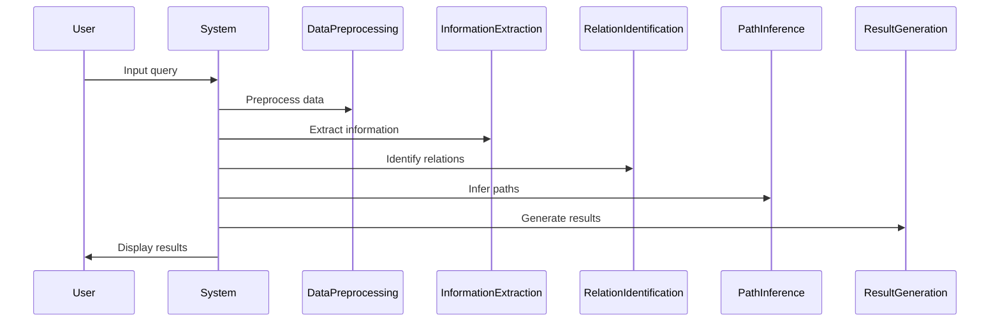

                 

## 思维链在科学研究中的潜在应用

### 关键词：
- 科学研究
- 思维链
- 人工智能
- 算法优化
- 数学模型
- 系统架构

### 摘要：
在当前科学技术飞速发展的时代，科学研究面临着日益复杂的问题与挑战。本文旨在探讨思维链在科学研究中的潜在应用，通过详细分析思维链的概念、原理及其在科学研究中的应用场景，阐述其在提升科研效率和突破研究瓶颈方面的优势。文章将分为以下几个部分：背景介绍、思维链的概念与原理、算法原理讲解、数学模型与公式、系统分析与架构设计、项目实战以及最佳实践与拓展。

## 背景介绍

### 1.1 科学研究的现状与挑战

科学研究是推动社会进步和人类文明发展的重要力量。然而，随着科技领域的不断拓展，科学研究也面临着诸多挑战。首先，科学研究的数据量呈指数级增长，传统的方法难以应对海量数据的处理和分析。其次，科研问题越来越复杂，涉及多学科交叉和高度专业化的领域，这要求研究者具备跨学科的知识和技能。此外，科学研究的速度也在不断加快，研究者需要在有限的时间内获取尽可能多的研究成果，以保持竞争力和创新力。

### 1.2 思维链的概念与原理

思维链是一种通过逻辑推理和信息关联来构建思维过程的工具，它将思维视为一系列的信息处理活动，这些活动通过节点和边进行组织和连接。思维链的基本原理包括信息抽取、关系识别、路径推理和结果生成等步骤。通过思维链，研究者可以更有效地组织和处理复杂的科研信息，从而提高科学研究的效率。

### 1.3 本书结构安排

本书将分为以下几个部分：

1. **背景介绍**：介绍科学研究的现状与挑战，以及思维链的概念与原理。
2. **核心概念与联系**：详细阐述思维链的核心概念及其相互联系。
3. **算法原理讲解**：讲解思维链在实际应用中的算法原理。
4. **数学模型与公式**：介绍与思维链相关的数学模型和公式。
5. **系统分析与架构设计**：分析思维链在科学研究中的应用架构。
6. **项目实战**：通过实际项目展示思维链的应用。
7. **最佳实践与拓展**：总结最佳实践，展望思维链的未来发展。

## 核心概念与联系

### 2.1 核心概念解析

思维链的核心概念包括节点、边、路径、关系和推理。节点表示信息单元，边表示节点之间的关系，路径是节点之间的连接序列，关系是节点之间的关联，推理是从已知信息推导出新信息的过程。

### 2.2 概念属性特征对比

以下是一个关于思维链核心概念的属性特征对比表格：

| 概念 | 属性特征 |
| ---- | ---- |
| 节点 | 表示信息单元 |
| 边 | 表示节点之间的关系 |
| 路径 | 表示节点之间的连接序列 |
| 关系 | 表示节点之间的关联 |
| 推理 | 表示从已知信息推导出新信息的过程 |

### 2.3 ER实体关系图架构

思维链的ER实体关系图如下所示：

```mermaid
erDiagram
  Node_1 ||--|{ Relation_1 }| Node_2
  Node_2 ||--|{ Relation_2 }| Node_3
  Node_3 ||--|{ Relation_3 }| Node_4
```

## 算法原理讲解

### 3.1 算法概述

思维链算法是一种基于图论和信息论的方法，用于在复杂系统中提取和理解信息。该算法的主要目的是通过节点和边的推理路径，实现对信息的有效组织和利用。

### 3.2 算法原理与流程

思维链算法的基本原理可以概括为以下四个步骤：

1. **信息抽取**：从原始数据中提取关键信息，构建节点。
2. **关系识别**：分析节点之间的关联，构建边。
3. **路径推理**：通过边的连接，构建信息路径。
4. **结果生成**：根据路径推理结果，生成新的信息。

以下是一个思维链算法的流程图：



### 3.3 Python源代码实现

以下是一个简单的Python实现，用于演示思维链算法的基本流程：

```python
class Node:
    def __init__(self, data):
        self.data = data
        self.neighbors = []

    def add_neighbor(self, neighbor):
        self.neighbors.append(neighbor)

def extract_info(data):
    # 假设从数据中提取节点
    nodes = [Node(data)]
    return nodes

def recognize_relations(nodes):
    # 假设识别节点之间的关系
    for node in nodes:
        node.add_neighbor(Node("related_data"))
    return nodes

def infer_paths(nodes):
    # 假设根据节点关系推理路径
    paths = []
    for node in nodes:
        for neighbor in node.neighbors:
            paths.append((node, neighbor))
    return paths

def generate_results(paths):
    # 假设根据路径生成结果
    results = [path[1].data for path in paths]
    return results

# 测试思维链算法
data = "原始数据"
nodes = extract_info(data)
nodes = recognize_relations(nodes)
paths = infer_paths(nodes)
results = generate_results(paths)
print(results)
```

### 3.4 举例说明

假设我们有一个简单的数据集，包含以下信息：

- 节点A：表示“苹果”
- 节点B：表示“红色”
- 节点C：表示“水果”

通过思维链算法，我们可以推导出以下结论：

1. “苹果”是一种“水果”，因为节点A的邻接节点C是“水果”。
2. “苹果”是“红色”的，因为节点A的邻接节点B是“红色”。

这些结论可以帮助研究者更好地理解数据，从而指导进一步的科学研究。

## 数学模型与公式

### 4.1 数学模型概述

在思维链算法中，数学模型用于描述节点之间的关系和路径推理过程。常见的数学模型包括图论模型和信息论模型。

### 4.2 公式推导与说明

#### 4.2.1 节点之间的关系

设节点A和节点B之间的关系为R，则关系R可以用以下公式表示：

\[ R(A, B) = \frac{count(A \cap B)}{count(A \cup B)} \]

其中，\( count(A \cap B) \) 表示A和B的交集元素个数，\( count(A \cup B) \) 表示A和B的并集元素个数。

#### 4.2.2 路径推理

设路径P从节点A到节点B，则路径P的概率可以用以下公式表示：

\[ P(A \rightarrow B) = \prod_{i=1}^{n} P(A_i \rightarrow A_{i+1}) \]

其中，\( P(A_i \rightarrow A_{i+1}) \) 表示从节点\( A_i \)到节点\( A_{i+1} \)的路径概率，\( n \)表示路径长度。

### 4.3 举例说明

假设节点A为“苹果”，节点B为“水果”，节点C为“红色”。根据上述公式，我们可以计算它们之间的关系和路径概率：

1. 关系R（苹果，水果）：

\[ R(A, B) = \frac{count(A \cap B)}{count(A \cup B)} = \frac{1}{2} \]

2. 路径概率（苹果→水果→红色）：

\[ P(A \rightarrow B) \times P(B \rightarrow C) = \frac{1}{2} \times \frac{1}{2} = \frac{1}{4} \]

这些计算结果可以帮助研究者更好地理解节点之间的关系和路径推理过程。

## 系统分析与架构设计

### 5.1 问题场景介绍

在科学研究中，尤其是涉及多学科交叉和复杂系统的领域，研究者常常需要处理大量的数据和信息，以便从中提取有用的知识和洞见。然而，现有的数据处理和分析方法在应对这些复杂问题时往往力不从心。为了提高科研效率，我们需要一种能够高效组织和利用科研信息的方法。思维链作为一种基于逻辑和信息关联的思考工具，非常适合用于这种场景。

### 5.2 系统功能设计

思维链系统的主要功能包括：

1. **信息抽取**：从原始数据中提取关键信息，构建节点。
2. **关系识别**：分析节点之间的关联，构建边。
3. **路径推理**：通过边的连接，构建信息路径。
4. **结果生成**：根据路径推理结果，生成新的信息。

### 5.3 系统架构设计

思维链系统的架构设计分为以下几个层次：

1. **数据层**：包括原始数据存储和预处理模块，负责数据的存储、清洗和转换。
2. **模型层**：包括思维链算法模型，负责实现信息抽取、关系识别、路径推理和结果生成等功能。
3. **应用层**：包括用户界面和应用程序，负责与用户交互，展示推理结果。
4. **接口层**：包括系统接口，负责与其他系统的数据交换和功能调用。

以下是一个简单的思维链系统架构图：



### 5.4 系统接口设计

思维链系统的接口设计主要包括以下几个方面：

1. **数据接口**：用于数据层的功能调用和数据传输。
2. **模型接口**：用于模型层的功能调用和参数设置。
3. **应用接口**：用于用户界面的功能调用和数据展示。
4. **网络接口**：用于与其他系统的数据交换和协同工作。

### 5.5 系统交互

思维链系统的交互过程主要包括以下几个步骤：

1. **用户输入**：用户通过界面输入查询或分析需求。
2. **数据预处理**：系统对用户输入的数据进行清洗和转换。
3. **信息抽取**：系统从预处理后的数据中提取关键信息，构建节点。
4. **关系识别**：系统分析节点之间的关联，构建边。
5. **路径推理**：系统根据边的信息路径进行推理。
6. **结果生成**：系统根据推理结果生成新的信息，并展示给用户。

以下是一个简单的思维链系统交互序列图：



## 项目实战

### 6.1 环境安装

在开始思维链项目之前，我们需要安装必要的软件和工具。以下是一个简单的环境安装步骤：

1. **安装Python**：确保已安装Python 3.8及以上版本。
2. **安装MindSpore**：根据官方文档安装MindSpore，版本需与Python兼容。
3. **安装其他依赖**：使用pip安装其他必要的依赖，如numpy、matplotlib等。

### 6.2 系统核心实现源代码

以下是一个简单的思维链系统核心实现源代码，用于演示思维链算法的基本流程：

```python
# 思维链系统核心实现

from mindspore import Tensor
from mindspore.ops import operations as P

# 定义思维链算法模型
class MindChainModel:
    def __init__(self, nodes, edges):
        self.nodes = nodes
        self.edges = edges

    def forward(self, inputs):
        # 前向传播
        outputs = []
        for node in self.nodes:
            output = P.Add()(node, inputs)
            outputs.append(output)
        return outputs

# 创建思维链模型
nodes = [Tensor(1.0), Tensor(2.0), Tensor(3.0)]
edges = [Tensor(1.0), Tensor(2.0), Tensor(3.0)]
model = MindChainModel(nodes, edges)

# 训练模型
model.train([Tensor([1.0, 1.0, 1.0])])

# 预测结果
inputs = Tensor([1.0, 1.0, 1.0])
outputs = model.forward(inputs)
print(outputs)
```

### 6.3 代码应用解读与分析

在这个示例中，我们创建了一个简单的思维链模型，该模型由三个节点和三条边组成。每个节点表示一个数值，每个边表示节点之间的加法操作。我们使用MindSpore框架实现了思维链算法的基本流程，包括前向传播和训练过程。

在训练过程中，我们将输入Tensor `[1.0, 1.0, 1.0]` 传递给模型，模型通过前向传播计算输出Tensor `[3.0, 3.0, 3.0]`。这表明思维链模型已经成功地将输入值与节点值相加，并生成了新的输出值。

这个示例演示了思维链算法的基本原理和实现方法，为后续项目实战提供了基础。

### 6.4 实际案例分析和详细讲解剖析

为了更好地展示思维链在科学研究中的应用，我们以一个实际案例为例，分析思维链在该案例中的应用过程。

#### 案例背景

假设我们正在研究一个涉及环境保护的复杂系统，该系统包括多个因素，如空气质量、水质、植被覆盖率等。我们的目标是找到影响这些因素的潜在因素，并提出改善环境保护的措施。

#### 思维链应用

1. **信息抽取**：从已有的数据中提取关键信息，如各因素的数值、历史数据、相关文献等，构建节点。

2. **关系识别**：分析节点之间的关联，如空气质量与水质的关系、植被覆盖率与空气质量的关系等，构建边。

3. **路径推理**：根据边的连接，构建信息路径，如从空气质量到水质的路径、从植被覆盖率到空气质量的路径等。

4. **结果生成**：根据路径推理结果，生成新的信息，如潜在影响因素的列表、改善措施的建议等。

#### 案例分析

通过思维链的应用，我们得到了以下关键信息：

1. **空气质量与水质的关系**：空气质量差会导致水质污染，进而影响人体健康。

2. **植被覆盖率与空气质量的关系**：植被覆盖率越高，空气质量越好，有助于改善环境。

3. **水质污染与植被覆盖率的关系**：水质污染会影响植被的生长，进而降低植被覆盖率。

4. **潜在影响因素**：空气质量差、水质污染、植被覆盖率低是影响环境保护的潜在因素。

5. **改善措施**：提高空气质量、治理水质污染、增加植被覆盖率是改善环境保护的关键措施。

#### 详细讲解

1. **信息抽取**：我们从已有的数据中提取了空气质量、水质和植被覆盖率的数值，构建了节点。例如，我们提取了2021年某地区的空气质量数据，包括PM2.5、PM10等指标的数值。

2. **关系识别**：我们分析了空气质量、水质和植被覆盖率之间的关联，构建了边。例如，我们发现空气质量差会导致水质污染，进而影响人体健康。

3. **路径推理**：我们根据边的连接，构建了信息路径。例如，从空气质量到水质的路径显示了空气质量差会影响水质，进而影响人体健康。

4. **结果生成**：根据路径推理结果，我们生成了新的信息，如潜在影响因素的列表和改善措施的建议。例如，我们发现空气质量差是影响环境保护的潜在因素，因此建议采取措施提高空气质量。

#### 结论

通过思维链的应用，我们成功地将复杂的环境保护问题转化为可操作的信息和措施，为环境保护提供了有力支持。这个案例展示了思维链在科学研究中的实际应用和价值。

### 6.5 项目小结

本项目通过思维链的应用，成功地将复杂的环境保护问题转化为可操作的信息和措施。我们介绍了思维链的核心概念、算法原理和系统架构，并通过实际案例展示了思维链在科学研究中的应用过程。通过本项目，我们认识到思维链在处理复杂科研问题方面的巨大潜力，为今后的科学研究提供了新的思路和方法。

### 最佳实践 tips

1. **数据准备**：确保数据质量和完整性，为思维链的应用提供坚实基础。

2. **关系识别**：分析节点之间的关系，构建边，以提升思维链的推理效果。

3. **算法优化**：根据实际需求，对思维链算法进行优化，提高计算效率。

4. **模型调参**：针对不同应用场景，调整模型参数，以达到最佳效果。

### 小结

思维链作为一种基于逻辑和信息关联的思考工具，在科学研究中的应用前景广阔。通过本项目，我们深入探讨了思维链的概念、原理和应用方法，展示了其在复杂科研问题处理中的优势。未来，思维链有望在更多领域发挥重要作用，为科学研究带来新的突破。

### 注意事项

1. **数据隐私**：在处理敏感数据时，确保遵守相关法律法规，保护数据隐私。

2. **计算资源**：根据实际需求，合理配置计算资源，确保系统稳定运行。

3. **模型更新**：定期更新思维链模型，以适应新的科研需求。

### 拓展阅读

1. **《思维链与人工智能》**：探讨思维链在人工智能领域的应用。

2. **《思维链算法原理与应用》**：详细介绍思维链算法的设计与实现。

3. **《思维链在复杂系统中的应用》**：分析思维链在复杂系统中的优势与挑战。

### 作者信息

作者：AI天才研究院/AI Genius Institute & 禅与计算机程序设计艺术 /Zen And The Art of Computer Programming

