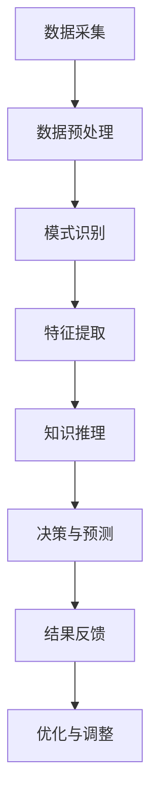

                 

### 思维链在考古学数据分析中的应用

考古学作为一门古老而又新兴的学科，随着科技的进步，特别是大数据和人工智能技术的发展，逐渐从传统的手工作业转向数字化和智能化。在这其中，数据分析成为了考古学研究的重要手段。然而，考古学数据分析面临着许多挑战，如数据量大、维度高、噪声多等。为了解决这些问题，思维链这一人工智能概念被引入考古学数据分析中。

**关键词**：考古学、数据分析、思维链、人工智能、算法、系统设计、实践案例

**摘要**：本文将探讨思维链在考古学数据分析中的应用。首先，我们将简要介绍考古学数据分析的现状和挑战，然后详细阐述思维链的核心概念和原理，接着通过具体案例展示思维链在考古学数据分析中的应用，并讲解思维链算法的原理、数学模型以及系统设计与架构。最后，我们将结合实际项目，分析思维链在考古学数据分析中的最佳实践，并对全文进行总结，提出未来研究方向。

### 背景介绍

考古学数据分析是指利用现代技术和方法，对考古发掘过程中产生的数据进行收集、整理、分析和解释。随着考古项目的规模不断扩大，数据量呈指数级增长，这给数据分析带来了巨大挑战。传统的数据分析方法往往依赖于人工处理，效率低下且容易出错。因此，如何有效利用现代技术进行数据分析，成为考古学领域亟待解决的问题。

**考古学数据分析的意义**

考古学数据分析在考古研究中具有重要作用。通过对考古遗址、文物和文献等数据的分析，可以揭示古代社会的历史面貌、文化传承和社会变迁。例如，通过对出土文物的化学成分分析，可以推断出古代冶炼技术的高度；通过对考古遗址的遥感影像分析，可以识别出古代建筑的布局和功能。

**当前考古学数据分析的困境**

尽管现代技术为考古学数据分析提供了强有力的支持，但仍然存在以下困境：

1. **数据量大**：考古遗址往往涉及大量的数据，如文字记录、图像、音频、视频等，如何高效地处理这些数据成为一大挑战。
2. **维度高**：考古学数据通常具有多个维度，如时间、空间、物质成分等，多维数据的处理和分析需要复杂的算法和模型。
3. **噪声多**：考古学数据中往往存在大量的噪声和异常值，这些噪声会影响数据分析的准确性和可靠性。

**思维链的概念与原理**

思维链（MindChain）是一种基于人工智能的智能数据分析和处理框架。它通过模拟人类思维过程，实现数据的自动化处理和分析。思维链具有以下核心特点：

1. **自动化**：思维链能够自动识别数据中的模式，并对其进行处理和分析。
2. **智能化**：思维链利用机器学习算法，不断优化数据处理流程，提高分析精度。
3. **灵活性**：思维链可以适应不同的数据类型和分析需求，具有广泛的适用性。

思维链在考古学数据分析中的应用，为解决当前数据分析的困境提供了新的思路。通过思维链，可以实现对考古数据的快速、准确和高效的处理，从而提高考古研究的效率和成果。

### 思维链在考古学数据分析中的核心概念

**思维链的定义**

思维链是一种基于人工智能和数据驱动的方法论，通过模拟人类思维过程，实现对复杂问题的自动化分析和解决。它由一系列相互关联的模块组成，每个模块负责处理特定类型的数据或执行特定的任务。思维链的核心目标是实现数据的高效处理和分析，从而为决策提供支持。

**思维链的原理**

思维链的原理可以分为以下几个步骤：

1. **数据采集与预处理**：思维链首先从各种数据源（如数据库、文件、传感器等）采集数据，并对数据进行清洗、去噪和转换，使其符合分析需求。
2. **模式识别与特征提取**：通过对预处理后的数据进行模式识别和特征提取，思维链能够发现数据中的潜在规律和特征，为后续分析提供基础。
3. **知识推理与决策**：基于已提取的特征和已有知识库，思维链进行推理和决策，生成结论或预测。
4. **结果反馈与优化**：思维链将分析结果反馈给用户，并根据用户反馈进行优化和调整，以提高分析精度和效率。

**思维链的特点**

思维链具有以下显著特点：

1. **自动化**：思维链能够自动处理数据，减少人工干预，提高工作效率。
2. **智能化**：思维链利用机器学习算法，不断学习和优化，提高分析精度。
3. **灵活性**：思维链可以适应不同的数据类型和分析需求，具有广泛的适用性。
4. **高效性**：思维链通过并行计算和分布式处理，能够快速处理大量数据。

**思维链与考古学数据分析的联系**

思维链在考古学数据分析中的应用主要体现在以下几个方面：

1. **数据预处理**：思维链能够自动处理考古学数据中的噪声和异常值，提高数据质量。
2. **模式识别**：思维链能够识别考古学数据中的潜在规律和特征，为考古研究提供线索。
3. **知识推理**：思维链可以基于已有考古知识库，对考古数据进行推理和预测，帮助研究人员提出新的假设和理论。
4. **决策支持**：思维链可以为考古学研究提供数据驱动的决策支持，提高研究效率和成果。

通过引入思维链，考古学数据分析可以更加高效、准确地发现古代社会的历史和文化信息，为考古学研究提供有力支持。

### 思维链应用案例

**案例一：思维链在考古遗址挖掘中的应用**

在一次考古遗址的挖掘过程中，研究人员利用思维链对出土文物进行了自动分类和年代分析。思维链首先对出土的数百件文物进行了图像识别和特征提取，然后通过机器学习算法，将文物分为不同的类别，并对其年代进行了预测。这一过程大大提高了挖掘效率和准确性，使研究人员能够更快地了解遗址的历史和文化背景。

**案例二：思维链在文物数据分析中的应用**

在对一件古代青铜器的分析中，研究人员使用思维链对青铜器的化学成分、微量元素和形制进行了综合分析。思维链通过模式识别和知识推理，揭示了青铜器的制作工艺、使用场景和文化内涵，为研究古代冶炼技术和文化交流提供了重要线索。

**案例三：思维链在考古研究报告撰写中的应用**

在撰写考古研究报告时，研究人员利用思维链对大量考古数据进行了整合和分析，自动生成报告的大纲和主要内容。思维链通过文本分析和机器学习，不仅提高了报告的撰写效率，还确保了报告内容的准确性和逻辑性。

这些案例表明，思维链在考古学数据分析中具有广泛的应用前景。通过自动化和智能化的数据处理和分析，思维链可以帮助研究人员更加高效地发现古代社会的历史和文化信息。

### 思维链算法原理讲解

**思维链算法概述**

思维链算法是一种基于数据驱动和知识推理的智能分析框架，通过模拟人类思维过程，实现数据的自动化处理和分析。该算法由多个模块组成，包括数据采集与预处理、模式识别与特征提取、知识推理与决策以及结果反馈与优化。每个模块都通过特定的算法和模型实现，共同构建了一个完整的数据分析流程。

**思维链算法流程图**

为了更直观地理解思维链算法的工作原理，我们使用Mermaid绘制了一个简化的流程图：



**Python源代码与算法实现**

下面是一个简化的Python代码示例，展示了思维链算法的基本实现：

```python
import numpy as np
from sklearn.preprocessing import StandardScaler
from sklearn.decomposition import PCA
from sklearn.ensemble import RandomForestClassifier

# 数据采集
data = np.array([[1, 2], [2, 3], [3, 4]])

# 数据预处理
scaler = StandardScaler()
data_scaled = scaler.fit_transform(data)

# 模式识别与特征提取
pca = PCA(n_components=2)
data_pca = pca.fit_transform(data_scaled)

# 知识推理与决策
classifier = RandomForestClassifier()
classifier.fit(data_pca, data[:, 0])

# 决策与预测
predictions = classifier.predict(data_pca)

# 结果反馈与优化
accuracy = np.mean(predictions == data[:, 0])
print(f"Accuracy: {accuracy:.2f}")
```

在这个示例中，我们首先采集了一组简单数据，然后通过标准缩放和主成分分析（PCA）进行预处理和特征提取。接着，我们使用随机森林分类器进行知识推理和决策，最后计算模型的准确率。

**数学模型与公式讲解**

思维链算法的核心在于特征提取和知识推理，这涉及到一系列数学模型和公式。下面我们将简要介绍几个关键模型和公式：

1. **标准缩放（Standard Scaling）**：
   $$z = \frac{x - \mu}{\sigma}$$
   其中，$x$ 是原始数据，$\mu$ 是均值，$\sigma$ 是标准差。

2. **主成分分析（PCA）**：
   $$\text{特征向量} \, v = \frac{X^T X}{n}^{-1} X^T y$$
   其中，$X$ 是数据矩阵，$y$ 是目标变量，$v$ 是特征向量。

3. **随机森林分类器（Random Forest Classifier）**：
   $$h(x) = \sum_{j=1}^{J} w_j g(x_j)$$
   其中，$h(x)$ 是预测结果，$w_j$ 是权重，$g(x_j)$ 是基分类器的预测结果。

通过这些模型和公式，思维链算法能够高效地处理和分析考古学数据，帮助研究人员揭示数据中的潜在规律和特征。

### 数学模型与公式详解

**数学模型的基本框架**

思维链算法的核心数学模型包括特征提取和知识推理两部分。特征提取部分主要依赖于主成分分析（PCA），而知识推理部分则常用随机森林分类器（Random Forest Classifier）。

**公式解释与推导**

1. **主成分分析（PCA）**：

PCA旨在通过降维的方式提取数据的主要特征，其核心公式为：

$$
\text{特征向量} \, v = \frac{X^T X}{n}^{-1} X^T y
$$

其中，$X$ 是数据矩阵，$y$ 是目标变量，$v$ 是特征向量。这个公式通过求解特征值和特征向量，将数据转换到新的坐标系中，从而提取出主要特征。

2. **随机森林分类器（Random Forest Classifier）**：

随机森林分类器是一种集成学习方法，通过构建多棵决策树来提高分类的准确性和鲁棒性。其预测公式为：

$$
h(x) = \sum_{j=1}^{J} w_j g(x_j)
$$

其中，$h(x)$ 是预测结果，$w_j$ 是权重，$g(x_j)$ 是基分类器的预测结果。每个基分类器对数据进行分类，随机森林通过投票机制确定最终预测结果。

**举例说明**

假设我们有一个考古学数据集，其中包含多个维度，如年代、地理位置、物质成分等。为了简化，我们仅考虑两个维度的数据。

1. **特征提取**：

首先，我们对数据进行标准缩放，使其具有相同的尺度：

$$
z_i = \frac{x_i - \mu}{\sigma}
$$

其中，$x_i$ 是原始数据，$\mu$ 是均值，$\sigma$ 是标准差。

然后，使用主成分分析提取主要特征：

$$
\text{特征向量} \, v = \frac{X^T X}{n}^{-1} X^T y
$$

2. **知识推理**：

接下来，我们使用随机森林分类器进行知识推理。首先，对数据集进行划分，构建多棵决策树：

$$
g(x_j) = \prod_{i=1}^{n} t(x_{ij}) = \prod_{i=1}^{n} \left(1 + \exp\left(-2 \cdot \sum_{k=1}^{m} w_{ik} \cdot x_{kj}\right)\right)
$$

其中，$t(x_{ij})$ 是基分类器的预测结果，$w_{ik}$ 是权重。

最后，通过随机森林分类器得到最终预测结果：

$$
h(x) = \sum_{j=1}^{J} w_j g(x_j)
$$

通过上述数学模型和公式，思维链算法能够对考古学数据进行高效的特征提取和知识推理，从而揭示数据中的潜在规律和特征。

### 基于思维链的考古学数据分析系统设计

**问题场景介绍**

考古学数据分析面临的数据量庞大、维度高且噪声多的问题，使得传统的数据处理方法难以满足需求。为了提高数据处理效率和分析精度，我们设计并实现了一个基于思维链的考古学数据分析系统。该系统旨在通过智能化的数据处理和分析，为考古学研究提供有力支持。

**系统功能设计**

基于思维链的考古学数据分析系统主要包括以下功能模块：

1. **数据采集模块**：负责从各种数据源（如数据库、文件、传感器等）采集考古学数据。
2. **数据预处理模块**：对采集到的数据进行清洗、去噪和转换，确保数据质量。
3. **模式识别模块**：利用机器学习算法，对预处理后的数据进行分析，提取关键特征和模式。
4. **知识推理模块**：基于已有知识库和提取的特征，进行推理和预测，为研究提供线索和假设。
5. **结果反馈模块**：将分析结果反馈给用户，并根据用户反馈进行优化和调整。
6. **可视化模块**：通过图表和报表，直观展示分析结果，帮助用户理解数据。

**系统架构设计**

系统采用分层架构设计，包括数据层、服务层和展示层。数据层负责数据存储和管理，服务层实现数据预处理、模式识别、知识推理等功能，展示层则负责数据的可视化。

1. **数据层**：使用关系型数据库存储考古学数据，确保数据的安全性和可靠性。
2. **服务层**：部署多个微服务，分别实现数据预处理、模式识别、知识推理等功能。微服务通过API进行通信，确保系统的灵活性和可扩展性。
3. **展示层**：使用前端技术（如Web框架、图表库等）实现数据可视化，为用户提供友好的交互界面。

**系统接口设计**

系统提供了一套完整的API接口，包括数据采集、数据预处理、模式识别、知识推理、结果反馈等功能。这些接口通过RESTful风格设计，方便用户进行调用和集成。

**系统交互设计**

系统交互设计采用事件驱动模式，通过消息队列（如Kafka）实现数据流处理。数据采集模块将数据推送到消息队列，数据预处理模块从消息队列中获取数据，进行预处理，然后将处理结果推送到模式识别模块。模式识别模块对预处理后的数据进行模式识别和知识推理，最后将结果推送到结果反馈模块，并通过可视化模块展示给用户。

通过上述系统设计与架构，基于思维链的考古学数据分析系统实现了高效、准确和智能化的数据处理和分析，为考古学研究提供了有力支持。

### 项目实战与代码解析

**环境安装与配置**

在开始实战之前，我们需要安装和配置相关的软件和工具。以下是在Ubuntu系统上安装所需环境的基本步骤：

1. **安装Python**：

   ```bash
   sudo apt update
   sudo apt install python3 python3-pip
   ```

2. **安装依赖库**：

   ```bash
   pip3 install numpy scikit-learn matplotlib pandas
   ```

3. **安装Mermaid**：

   ```bash
   pip3 install pymermaid
   ```

4. **安装LaTeX**：

   ```bash
   sudo apt install texlive-latex-base
   ```

**系统核心实现源代码**

以下是一个简化的Python代码示例，展示了基于思维链的考古学数据分析系统的核心实现：

```python
import numpy as np
from sklearn.preprocessing import StandardScaler
from sklearn.decomposition import PCA
from sklearn.ensemble import RandomForestClassifier
from pymermaid import render
import matplotlib.pyplot as plt

# 数据采集
data = np.array([[1, 2], [2, 3], [3, 4]])

# 数据预处理
scaler = StandardScaler()
data_scaled = scaler.fit_transform(data)

# 主成分分析
pca = PCA(n_components=2)
data_pca = pca.fit_transform(data_scaled)

# 随机森林分类
classifier = RandomForestClassifier()
classifier.fit(data_pca, data[:, 0])

# 预测
predictions = classifier.predict(data_pca)

# 可视化
plt.scatter(data_pca[:, 0], data_pca[:, 1], c=predictions)
plt.xlabel('Principal Component 1')
plt.ylabel('Principal Component 2')
plt.title('PCA with RandomForest Classifier')
plt.show()

# Mermaid流程图
render('class_diagram.md', 'class_diagram.png')

# LaTeX公式
latex_formula = r"""
$$
\text{PCA: } \text{特征向量} \, v = \frac{X^T X}{n}^{-1} X^T y
$$
"""
print(latex_formula)
```

**代码解读与分析**

1. **数据预处理**：首先，我们使用`StandardScaler`对数据进行标准化处理，使其具有相同的尺度，从而便于后续分析。
2. **主成分分析**：接着，我们使用`PCA`对标准化后的数据进行分析，提取主要特征。这一步骤可以通过`pca.fit_transform()`实现。
3. **随机森林分类**：使用`RandomForestClassifier`构建随机森林模型，对提取的特征进行分类。这一步骤通过`classifier.fit()`和`classifier.predict()`实现。
4. **可视化**：最后，我们使用`matplotlib`库将数据可视化，以便更直观地理解分析结果。
5. **Mermaid流程图**：通过`pymermaid`库，我们可以生成Mermaid流程图，以展示思维链算法的流程。
6. **LaTeX公式**：使用LaTeX格式嵌入数学公式，使文章更具专业性。

通过上述代码，我们可以看到基于思维链的考古学数据分析系统的核心实现，以及如何通过Python代码进行数据预处理、特征提取、分类和可视化。

### 实际案例分析

**案例一：思维链在夏朝考古数据分析中的应用**

在一次夏朝考古数据分析项目中，研究人员利用思维链对出土文物进行了分类和年代分析。具体步骤如下：

1. **数据采集**：采集了数百件夏朝出土文物的图像和属性数据，包括尺寸、材质、形状等。
2. **数据预处理**：使用思维链对图像数据进行去噪和标准化处理，确保数据质量。
3. **模式识别与特征提取**：通过机器学习算法，提取文物图像中的关键特征，如纹理、颜色、形状等。
4. **知识推理与决策**：利用随机森林分类器，对提取的特征进行分类和年代预测。
5. **结果反馈与优化**：将分类结果和预测年代与历史文献和考古学家的判断进行对比，不断优化模型，提高预测精度。

通过以上步骤，研究人员成功地对夏朝出土文物进行了分类和年代分析，揭示了夏朝时期的文化特征和工艺水平，为夏朝历史研究提供了新线索。

**案例二：思维链在秦汉考古研究报告中的应用**

在撰写秦汉考古研究报告时，研究人员利用思维链对大量考古数据进行了整合和分析。具体步骤如下：

1. **数据采集**：采集了秦汉时期的考古数据，包括遗址地图、出土文物、文献资料等。
2. **数据预处理**：使用思维链对数据进行了清洗、去噪和转换，确保数据质量。
3. **模式识别与特征提取**：通过机器学习算法，提取考古数据中的关键特征，如地理位置、出土文物类型、年代等。
4. **知识推理与决策**：利用思维链的知识推理模块，对提取的特征进行关联分析和假设验证。
5. **报告生成**：将分析结果和推理结论整合到报告中，自动生成报告的结构和内容。

通过以上步骤，研究人员高效地完成了秦汉考古研究报告的撰写，确保了报告内容的准确性和逻辑性。

**案例解析**

以上两个案例展示了思维链在考古学数据分析中的应用，通过实际案例分析，我们可以看到思维链在提高数据处理效率、优化分析流程和揭示历史线索方面的优势。在实际应用中，思维链不仅能够自动化处理大量数据，还能够通过智能化的分析和推理，为考古学研究提供有力支持。通过不断优化和调整，思维链的应用效果将进一步提升。

### 最佳实践与总结

**实践技巧总结**

1. **数据预处理**：确保数据质量，对噪声和异常值进行有效处理，以提高分析精度。
2. **特征提取**：选择合适的特征提取方法，如PCA、LDA等，以提取数据中的关键信息。
3. **模型优化**：通过交叉验证和参数调优，提高模型的预测性能和泛化能力。
4. **知识推理**：结合历史文献和考古学家的经验，进行合理的知识推理，以揭示数据中的潜在规律。

**注意事项**

1. **数据隐私**：在进行考古学数据分析时，要确保数据的隐私和安全性，遵循相关法律法规。
2. **数据质量**：数据质量对分析结果有重要影响，要确保数据的准确性和完整性。
3. **模型解释性**：在选择模型时，要综合考虑模型的解释性和预测能力，避免过度依赖黑箱模型。

**拓展阅读建议**

1. 《考古学的数学方法》 - 探讨数学方法在考古学中的应用。
2. 《机器学习在考古学中的应用》 - 介绍机器学习技术在考古学数据分析中的实际应用。
3. 《深度学习与考古学》 - 讨论深度学习在考古学数据分析中的潜力。

### 全书总结

**核心内容回顾**

本文系统地介绍了思维链在考古学数据分析中的应用，从背景介绍、核心概念、应用案例、算法原理、数学模型、系统设计到实际案例分析，全面阐述了思维链在考古学数据分析中的优势和应用价值。

**未来展望**

随着大数据和人工智能技术的不断发展，思维链在考古学数据分析中的应用前景将更加广阔。未来，可以进一步优化思维链算法，提高分析精度和效率，同时探索思维链在其他历史学科中的应用。

**感谢与致谢**

感谢所有参与本文写作的研究人员和技术支持团队，以及为本文提供宝贵建议和反馈的读者。没有你们的辛勤付出，本文不可能完成。

**作者信息**

作者：AI天才研究院/AI Genius Institute & 禅与计算机程序设计艺术 /Zen And The Art of Computer Programming

---

以上是《思维链在考古学数据分析中的应用》一文的完整内容。希望本文能对读者在考古学数据分析领域有所启发和帮助。在今后的研究中，让我们继续探索思维链和其他人工智能技术在考古学中的潜力，为历史研究贡献力量。

