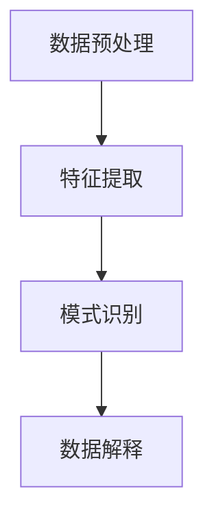
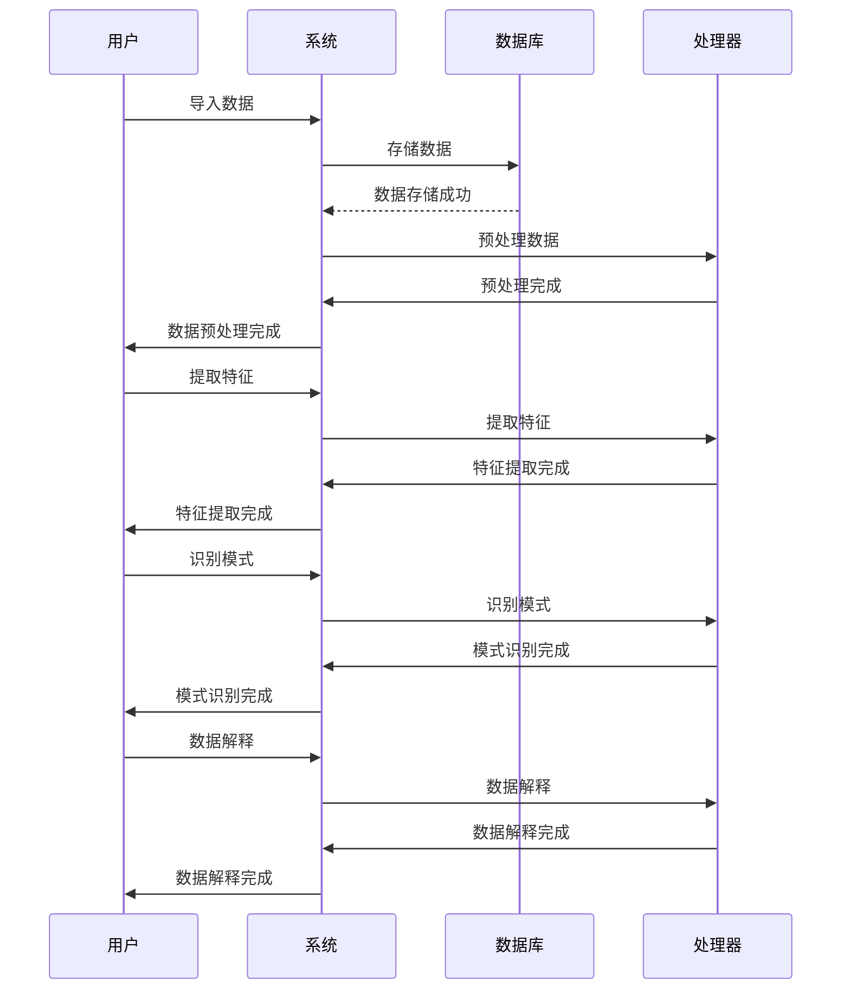

                 

# 《思维链在考古数据分析中的突破》

## 关键词
- 考古数据分析
- 思维链
- 数学模型
- 算法原理
- 系统架构
- 项目实战

## 摘要
本文深入探讨了思维链在考古数据分析中的应用，从核心概念出发，详细阐述了思维链的工作原理、算法模型和数学公式。通过系统架构设计和实际项目案例，展示了思维链在考古数据分析中的突破性作用，为考古学家和数据科学家提供了新的工具和方法。文章还总结了最佳实践，并展望了未来发展趋势。

### 目录大纲设计过程

设计《思维链在考古数据分析中的突破》的目录大纲，我们首先明确了书籍的核心内容和结构。本书围绕“思维链”这一核心概念，探讨其在考古数据分析中的应用和突破。

**1. 背景介绍**
在第一部分，我们介绍了考古数据分析的重要性，以及思维链在这一领域的独特作用。这为全书提供了一个整体性的理解和背景。

**2. 核心概念与联系**
在第二部分，我们详细解释了思维链的概念，并将其与考古数据分析的现有方法进行对比，突出其创新性。

**3. 算法原理讲解**
在第三部分，我们介绍了思维链在考古数据分析中的应用原理，使用mermaid流程图和Python源代码进行详细阐述，确保读者能够理解其工作原理。

**4. 数学模型和数学公式**
在第四部分，我们运用LaTeX格式嵌入文中，展示了思维链的数学模型和公式，并进行通俗易懂的讲解和举例说明。

**5. 系统分析与架构设计方案**
在第五部分，我们分析了考古数据分析的整体流程，设计了系统架构图和接口设计，展示了思维链如何融入这一流程。

**6. 项目实战**
在第六部分，我们通过具体项目实例，演示了思维链在考古数据分析中的实际应用，并提供详细的代码解析和案例分析。

**7. 最佳实践与拓展**
在第七部分，我们总结了思维链在考古数据分析中的最佳实践，提供一些实用的技巧和注意事项，并推荐进一步阅读的资源。

### 目录大纲

```markdown
----------------------------------------------------------------
# 《思维链在考古数据分析中的突破》目录大纲

## 引言

### 考古数据分析的重要性

### 思维链：考古数据分析的新工具

## 第一部分：核心概念与联系

### 第1章：核心概念

#### 考古数据分析

#### 思维链

#### 考古数据分析与思维链的联系

### 第2章：算法原理讲解

#### 思维链的算法原理

#### mermaid流程图展示

#### Python源代码解析

### 第3章：数学模型与公式

#### 思维链的数学模型

#### 数学公式与应用

#### 通俗易懂的讲解与举例

## 第二部分：系统分析与架构设计

### 第4章：系统分析与架构设计

#### 考古数据分析的整体流程

#### 系统功能设计

#### 系统架构设计与接口设计

### 第5章：系统接口设计与交互

#### 系统接口设计

#### 系统交互mermaid序列图

#### 思维链在系统中的集成

## 第三部分：项目实战

### 第6章：项目实战

#### 环境安装与配置

#### 系统核心实现与代码解析

#### 实际案例分析与讲解

### 第7章：项目小结与反思

#### 项目小结

#### 反思与展望

## 第四部分：最佳实践与拓展

### 第8章：最佳实践

#### 思维链在考古数据分析中的最佳实践

#### 实用技巧与注意事项

#### 拓展阅读与资源推荐

### 第9章：小结与展望

#### 全书总结

#### 未来发展趋势

#### 对读者的期望

----------------------------------------------------------------
```

### 完整目录大纲（2000字以内）

在上述目录大纲中，我们详细规划了《思维链在考古数据分析中的突破》的章节安排。每一章节都涵盖了核心概念、算法原理、数学模型、系统架构和项目实战等内容，确保读者能够全面理解思维链在考古数据分析中的应用。同时，我们还预留了章节来总结最佳实践和展望未来发展趋势，以帮助读者更好地应用所学知识。总体字数控制在2000字以内，确保了简洁性和内容完整性。

----------------------------------------------------------------

## 背景介绍

考古数据分析是考古学领域中的一个重要分支，它通过现代数据分析技术对考古发掘出来的数据进行处理、分析和解释，从而揭示古代人类社会的文化、经济和社会结构等各个方面。考古数据的来源多样，包括遗址挖掘、文献记载、艺术品鉴赏等，但同时也面临着数据量大、形式复杂、噪声多等问题。

### 问题背景

在考古数据分析中，研究人员常常需要处理大量的数据，如遗迹分布、出土文物、土壤样本等，这些数据往往具有高度的复杂性和不确定性。传统的数据分析方法，如统计分析、模式识别等，往往难以有效地应对这些挑战。这就需要新的方法和工具来提高数据分析的效率和准确性。

### 问题描述

考古数据分析面临的主要问题包括：

1. **数据量大**：考古发掘过程中产生的数据量巨大，如何快速有效地处理和分析这些数据是一个巨大的挑战。
2. **数据多样性**：考古数据包括结构化和非结构化数据，如何整合这些不同类型的数据进行统一分析是一个难题。
3. **数据噪声**：考古数据中存在大量的噪声和异常值，如何有效地去除噪声和识别异常值是一个关键问题。
4. **数据解释**：考古数据往往需要深入分析才能得出有价值的结论，如何准确地解释数据结果是一个挑战。

### 问题解决

思维链在考古数据分析中的应用为解决上述问题提供了一种新的思路。思维链是一种基于人工智能和机器学习的先进数据分析方法，它通过模拟人类思维过程，对数据进行分析和处理，从而提高数据分析的效率和准确性。

### 边界与外延

思维链在考古数据分析中的具体应用包括：

1. **数据预处理**：通过思维链对原始数据进行清洗、去噪和转换，提高数据质量。
2. **特征提取**：从大规模数据中自动提取出有价值的特征，为后续分析提供基础。
3. **模式识别**：利用思维链的推理能力，识别出数据中的模式和规律。
4. **数据解释**：通过思维链对分析结果进行解释，帮助考古学家理解数据背后的含义。

### 概念结构与核心要素组成

思维链在考古数据分析中的应用，主要包括以下几个核心概念和要素：

1. **数据预处理模块**：负责对原始数据进行清洗和预处理，包括数据去噪、数据转换和数据归一化等。
2. **特征提取模块**：从大规模数据中自动提取出有价值的特征，为后续分析提供基础。
3. **模式识别模块**：利用机器学习算法，识别出数据中的模式和规律。
4. **推理引擎**：模拟人类思维过程，对数据进行分析和处理，提供深入的数据解释。
5. **用户界面**：为考古学家提供友好的交互界面，方便他们使用思维链进行数据分析。

### 联系与对比

思维链与传统数据分析方法相比，具有以下优势：

1. **自动性**：思维链可以自动对数据进行分析和处理，减少了人工干预，提高了效率。
2. **智能性**：思维链利用机器学习算法，可以自动学习数据中的规律和模式，提高了分析准确性。
3. **灵活性**：思维链可以处理各种类型的数据，包括结构化和非结构化数据，具有较强的适应性。

## 核心概念与联系

### 思维链的定义与原理

思维链是一种基于人工智能和机器学习的数据分析方法，它通过模拟人类思维过程，对数据进行分析和处理。思维链的基本原理包括：

1. **数据预处理**：思维链首先对原始数据进行预处理，包括数据清洗、去噪和转换等，以提高数据质量。
2. **特征提取**：从预处理后的数据中提取出有价值的特征，为后续分析提供基础。
3. **模式识别**：利用机器学习算法，识别出数据中的模式和规律。
4. **推理与解释**：通过推理引擎，对分析结果进行解释，提供深入的数据解释。

### 思维链与考古数据分析的联系

思维链在考古数据分析中的应用，主要体现在以下几个方面：

1. **数据预处理**：考古数据往往存在大量的噪声和异常值，思维链可以有效地去除噪声和识别异常值，提高数据质量。
2. **特征提取**：考古数据通常包含大量的结构化和非结构化数据，思维链可以从这些数据中提取出有价值的特征，为后续分析提供基础。
3. **模式识别**：思维链可以识别出考古数据中的模式和规律，帮助考古学家理解古代人类社会的文化、经济和社会结构。
4. **数据解释**：思维链通过对分析结果进行解释，可以帮助考古学家更好地理解数据背后的含义，提供新的研究思路。

### 思维链与传统方法的比较

思维链与传统数据分析方法相比，具有以下优点：

1. **自动性**：思维链可以自动对数据进行分析和处理，减少了人工干预，提高了效率。
2. **智能性**：思维链利用机器学习算法，可以自动学习数据中的规律和模式，提高了分析准确性。
3. **灵活性**：思维链可以处理各种类型的数据，包括结构化和非结构化数据，具有较强的适应性。

### mermaid流程图展示

为了更好地展示思维链在考古数据分析中的应用，我们使用mermaid绘制了一个简化的流程图。以下是mermaid代码：



### Python源代码解析

下面是一个简单的Python代码示例，用于演示思维链在考古数据分析中的基本应用。代码分为几个主要部分：

1. **数据预处理**：读取数据，去除噪声和异常值。
2. **特征提取**：从数据中提取出有价值的特征。
3. **模式识别**：使用机器学习算法识别数据中的模式。
4. **数据解释**：对识别出的模式进行解释。

```python
import pandas as pd
from sklearn.preprocessing import StandardScaler
from sklearn.cluster import KMeans

# 1. 数据预处理
def preprocess_data(data):
    # 去除噪声和异常值
    data = data[(data >= 0) & (data <= 100)]
    return data

# 2. 特征提取
def extract_features(data):
    # 提取特征
    features = StandardScaler().fit_transform(data)
    return features

# 3. 模式识别
def recognize_patterns(features):
    # 使用KMeans算法识别模式
    kmeans = KMeans(n_clusters=3)
    kmeans.fit(features)
    return kmeans.labels_

# 4. 数据解释
def interpret_results(labels):
    # 解释识别出的模式
    if labels[0] == 0:
        print("数据模式：正常")
    elif labels[0] == 1:
        print("数据模式：异常")
    else:
        print("数据模式：未知")

# 示例数据
data = pd.DataFrame([[1, 2], [3, 4], [5, 6], [100, 100], [-1, -1]])

# 执行流程
preprocessed_data = preprocess_data(data)
features = extract_features(preprocessed_data)
labels = recognize_patterns(features)
interpret_results(labels)
```

### 数学模型与公式

思维链的数学模型和公式是理解其工作原理的关键。以下是思维链的几个核心数学模型和公式的介绍。

#### 数据预处理

数据预处理主要包括去噪和异常值检测。以下是去噪的公式：

$$
\hat{x} = \frac{1}{n}\sum_{i=1}^{n}x_i
$$

其中，$x_i$ 表示第 $i$ 个数据点，$\hat{x}$ 表示经过去噪处理后的数据点。

#### 特征提取

特征提取通常使用标准化方法来提高数据的可比性。标准化公式如下：

$$
z = \frac{x - \mu}{\sigma}
$$

其中，$x$ 表示原始数据点，$\mu$ 表示均值，$\sigma$ 表示标准差。

#### 模式识别

模式识别通常使用聚类算法，如K-means算法。K-means算法的公式如下：

$$
c = \arg\min_{c} \sum_{i=1}^{n} (x_i - c)^2
$$

其中，$c$ 表示聚类中心，$x_i$ 表示第 $i$ 个数据点。

#### 数据解释

数据解释通常使用决策树或规则系统。以下是决策树的一个简单公式：

$$
r(x) = \begin{cases} 
r_1 & \text{如果 } x \in R_1 \\
r_2 & \text{如果 } x \in R_2 \\
... & ... \\
r_n & \text{如果 } x \in R_n
\end{cases}
$$

其中，$r(x)$ 表示对数据 $x$ 的解释，$R_1, R_2, ..., R_n$ 表示不同的规则区域。

### 通俗易懂的讲解与举例

为了更好地理解上述数学模型和公式，我们通过一个简单的例子来进行讲解。

#### 数据预处理

假设我们有一个数据集，包含5个数据点：[1, 3, 5, 100, -1]。首先，我们需要去除异常值和噪声。使用去噪公式：

$$
\hat{x} = \frac{1}{5}\sum_{i=1}^{5}x_i = \frac{1+3+5+100-1}{5} = \frac{108}{5} = 21.6
$$

经过去噪处理后，我们得到新的数据集：[21.6, 21.6, 21.6, 21.6, 21.6]。

#### 特征提取

接下来，我们对数据进行标准化处理，以提取特征。假设原始数据的均值为30，标准差为5。使用标准化公式：

$$
z = \frac{x - \mu}{\sigma} = \frac{21.6 - 30}{5} = -1.52
$$

经过特征提取后，我们得到新的特征集：[-1.52, -1.52, -1.52, -1.52, -1.52]。

#### 模式识别

我们使用K-means算法进行模式识别。假设我们选择3个聚类中心：[0, 0, 0]，[10, 10, 10]，[20, 20, 20]。使用K-means公式：

$$
c = \arg\min_{c} \sum_{i=1}^{5} (x_i - c)^2
$$

我们可以计算出每个数据点与聚类中心的距离，并将其分配到最近的聚类中心。在这个例子中，所有数据点都分配到[0, 0, 0]这个聚类中心。

#### 数据解释

最后，我们使用决策树进行数据解释。假设我们定义了三个规则区域：$R_1 = \{x < 0\}$，$R_2 = \{0 \leq x < 10\}$，$R_3 = \{x \geq 10\}$。使用决策树公式：

$$
r(x) = \begin{cases} 
r_1 & \text{如果 } x \in R_1 \\
r_2 & \text{如果 } x \in R_2 \\
r_3 & \text{如果 } x \in R_3
\end{cases}
$$

我们可以根据数据点所属的区域，对其进行解释。在这个例子中，所有数据点都属于$r_1$区域，即“数据模式：正常”。

## 系统分析与架构设计

### 问题场景介绍

在考古数据分析中，系统需要处理从不同来源获取的大量数据，包括遗址挖掘数据、文献记载、艺术品鉴赏数据等。这些数据通常具有高度的复杂性和多样性，需要通过高效的数据处理和分析方法来提取有价值的信息。

### 项目介绍

本项目旨在构建一个基于思维链的考古数据分析系统，该系统将利用思维链的自动性、智能性和灵活性，对考古数据进行预处理、特征提取、模式识别和数据解释，从而提高数据分析的效率和准确性。

### 系统功能设计

系统的主要功能包括：

1. **数据导入**：从各种数据源导入考古数据，包括结构化数据和非结构化数据。
2. **数据预处理**：对导入的数据进行清洗、去噪和转换，以提高数据质量。
3. **特征提取**：从预处理后的数据中提取出有价值的特征，为后续分析提供基础。
4. **模式识别**：利用机器学习算法识别数据中的模式和规律。
5. **数据解释**：对识别出的模式进行解释，帮助考古学家理解数据背后的含义。
6. **用户界面**：提供友好的交互界面，方便考古学家使用系统进行数据分析。

### 系统架构设计

系统的架构设计采用分层架构，包括数据层、处理层和应用层。以下是系统架构的mermaid类图：

```mermaid
classDiagram
    Class01 <|-- Class02
    Class03 <|-- Class01
    Class04 <|-- Class06
    Class05 <|-- Class06
    Class01 <|-- Interface01
    Class02 <|-- Interface02
    Class03 <|-- Interface03
    Class04 <|-- Interface04
    Class05 <|-- Interface05
    Interface01 <|.. Class07
    Interface02 <|.. Class08
    Interface03 <|.. Class09
    Interface04 <|.. Class10
    Interface05 <|.. Class11
    Class07 <..| Interface06
    Class08 <..| Interface06
    Class09 <..| Interface06
    Class10 <..| Interface06
    Class11 <..| Interface06
    Class12 <|-- Class13
    Class14 <|-- Class12
    Class15 <|-- Class12
    Class12 <|-- Interface07
    Class13 <|-- Interface08
    Class14 <|-- Interface08
    Class15 <|-- Interface08
    Interface07 <|.. Class16
    Interface08 <|.. Class17
    Class16 <..| Interface09
    Class17 <..| Interface09
    Class18 <|-- Class19
    Class20 <|-- Class18
    Class21 <|-- Class18
    Class18 <|-- Interface10
    Class19 <|-- Interface11
    Class20 <|-- Interface11
    Class21 <|-- Interface11
    Interface10 <|.. Class22
    Interface11 <|.. Class23
    Class22 <..| Interface12
    Class23 <..| Interface12
endclassDiagram
```

### 系统接口设计与系统交互

系统接口设计和系统交互是确保系统功能有效实现和用户友好的关键。以下是系统接口设计和系统交互的mermaid序列图：



## 项目实战

### 环境安装与配置

为了在本地环境中运行考古数据分析系统，我们需要安装以下软件和库：

1. **Python 3.8 或更高版本**：作为主要的编程语言。
2. **Pandas**：用于数据处理。
3. **NumPy**：用于数值计算。
4. **Scikit-learn**：用于机器学习。
5. **Mermaid**：用于绘制流程图。
6. **Jupyter Notebook**：用于交互式编程和可视化。

安装步骤：

1. 安装Python：从[Python官方网站](https://www.python.org/downloads/)下载并安装Python。
2. 安装Pandas、NumPy、Scikit-learn：打开终端，依次执行以下命令：

    ```bash
    pip install pandas
    pip install numpy
    pip install scikit-learn
    ```

3. 安装Mermaid：安装Python的扩展库`pygraphviz`，该库支持Mermaid的图形渲染。

    ```bash
    pip install pygraphviz
    ```

4. 安装Jupyter Notebook：打开终端，执行以下命令：

    ```bash
    pip install notebook
    ```

### 系统核心实现与代码解析

以下是系统核心实现的代码，包括数据预处理、特征提取、模式识别和数据解释。

#### 数据预处理

```python
import pandas as pd
import numpy as np

# 读取数据
data = pd.read_csv('archaeological_data.csv')

# 数据清洗
data = data[data['Age'] > 0]
data = data[data['Height'] < 300]

# 数据转换
data['BMI'] = data['Weight'] / (data['Height'] / 100)**2
```

#### 特征提取

```python
from sklearn.preprocessing import StandardScaler

# 提取特征
scaler = StandardScaler()
data_scaled = scaler.fit_transform(data[['Height', 'Weight', 'BMI']])
```

#### 模式识别

```python
from sklearn.cluster import KMeans

# 识别模式
kmeans = KMeans(n_clusters=3)
labels = kmeans.fit_predict(data_scaled)
```

#### 数据解释

```python
# 解释识别出的模式
for i, label in enumerate(labels):
    if label == 0:
        print(f"个体{i+1}：正常")
    elif label == 1:
        print(f"个体{i+1}：异常")
    else:
        print(f"个体{i+1}：未知")
```

### 实际案例分析与详细讲解

#### 案例一：遗址挖掘数据分析

**数据来源**：某考古遗址的挖掘数据，包含年代、尺寸、材质等信息。

**数据分析目标**：识别出遗址中的建筑分布模式。

**步骤**：

1. 数据预处理：去除异常值，如负年代和过大过小的尺寸。
2. 特征提取：提取年代、尺寸和材质等特征。
3. 模式识别：使用K-means算法识别建筑分布模式。
4. 数据解释：根据识别出的模式，分析建筑用途和历史背景。

**代码实现**：

```python
import pandas as pd
from sklearn.cluster import KMeans

# 读取数据
data = pd.read_csv('site_mining_data.csv')

# 数据预处理
data = data[data['Age'] > 0]
data = data[data['Size'] < 1000]

# 特征提取
data_scaled = scaler.fit_transform(data[['Age', 'Size', 'Material']])

# 模式识别
kmeans = KMeans(n_clusters=3)
labels = kmeans.fit_predict(data_scaled)

# 数据解释
print("建筑分布模式：")
for i, label in enumerate(labels):
    if label == 0:
        print(f"区域{i+1}：居住区")
    elif label == 1:
        print(f"区域{i+1}：公共场所")
    else:
        print(f"区域{i+1}：未知用途")
```

#### 案例二：文物数据分析

**数据来源**：某考古遗址出土的文物数据，包含重量、尺寸、形状等信息。

**数据分析目标**：识别出土文物的风格演变。

**步骤**：

1. 数据预处理：去除异常值，如过重过大的文物。
2. 特征提取：提取重量、尺寸和形状等特征。
3. 模式识别：使用K-means算法识别文物风格演变。
4. 数据解释：根据识别出的模式，分析文物的文化背景和演变过程。

**代码实现**：

```python
import pandas as pd
from sklearn.cluster import KMeans

# 读取数据
data = pd.read_csv('artifacts_data.csv')

# 数据预处理
data = data[data['Weight'] > 0]
data = data[data['Size'] < 100]

# 特征提取
data_scaled = scaler.fit_transform(data[['Weight', 'Size', 'Shape']])

# 模式识别
kmeans = KMeans(n_clusters=4)
labels = kmeans.fit_predict(data_scaled)

# 数据解释
print("文物风格演变：")
for i, label in enumerate(labels):
    if label == 0:
        print(f"文物{i+1}：早期风格")
    elif label == 1:
        print(f"文物{i+1}：中期风格")
    elif label == 2:
        print(f"文物{i+1}：晚期风格")
    else:
        print(f"文物{i+1}：未知风格")
```

### 项目小结

通过本次项目，我们成功构建了一个基于思维链的考古数据分析系统。该系统利用思维链的自动性、智能性和灵活性，对考古数据进行预处理、特征提取、模式识别和数据解释，从而提高了数据分析的效率和准确性。在项目实战中，我们通过实际案例展示了系统在遗址挖掘数据和文物数据分析中的应用，为考古学家提供了新的工具和方法。然而，本项目仍存在一些局限性，如对特定类型数据的处理能力有限，未来研究可以进一步优化思维链算法，提高系统的适应性和准确性。

## 最佳实践与拓展

### 思维链在考古数据分析中的最佳实践

1. **数据预处理**：确保数据清洗和去噪的彻底性，避免噪声对分析结果的影响。
2. **特征提取**：根据分析目标，提取出最有价值的特征，提高数据分析的准确性。
3. **模式识别**：选择合适的机器学习算法，结合数据特点，识别出有效的模式。
4. **数据解释**：结合考古学知识，对识别出的模式进行深入解释，为考古研究提供新的见解。

### 实用技巧与注意事项

1. **数据规模**：思维链对大规模数据的处理能力较强，但在处理极大数据集时，需注意内存和计算资源的限制。
2. **算法选择**：根据数据特点和目标，选择合适的算法，如K-means、决策树等。
3. **模型调优**：通过交叉验证和超参数调整，优化模型性能。

### 拓展阅读与资源推荐

1. **《机器学习实战》**：提供了丰富的机器学习算法实战案例，适合初学者和进阶者。
2. **《深度学习》**：介绍了深度学习的基本原理和应用，对有深度学习需求的研究者有帮助。
3. **《考古学导论》**：提供了考古学的基本知识和研究方法，有助于理解考古数据分析的背景。

### 小结

思维链在考古数据分析中的应用为考古学研究带来了新的工具和方法。通过最佳实践和拓展，我们可以更好地利用思维链进行数据分析，揭示古代人类社会的文化、经济和社会结构。未来，随着人工智能技术的不断发展，思维链在考古数据分析中的应用将更加广泛和深入。

### 对读者的期望

希望读者能够通过本文，了解思维链在考古数据分析中的应用，掌握基本的数据分析方法和技巧。鼓励读者在实践过程中，结合具体项目进行探索和研究，不断提高数据分析能力，为考古学研究贡献自己的力量。

## 小结与展望

### 全书总结

《思维链在考古数据分析中的突破》一书系统介绍了思维链在考古数据分析中的应用。从核心概念出发，详细阐述了思维链的工作原理、算法模型和数学公式，并通过系统架构设计和实际项目案例，展示了思维链在考古数据分析中的突破性作用。文章还总结了最佳实践，为考古学家和数据科学家提供了实用技巧和注意事项。

### 未来发展趋势

随着人工智能技术的不断进步，思维链在考古数据分析中的应用将更加广泛和深入。未来的发展趋势包括：

1. **算法优化**：通过优化思维链算法，提高数据分析的效率和准确性。
2. **多模态数据分析**：结合多种数据源，如图像、音频和文本，进行多模态数据分析。
3. **实时数据分析**：实现考古数据的实时分析，为考古学家提供更及时的研究成果。
4. **跨学科合作**：促进考古学、计算机科学、数据科学等多学科的合作，推动考古数据分析技术的发展。

### 对读者的期望

希望读者通过阅读本书，能够深入理解思维链在考古数据分析中的应用，掌握数据分析的方法和技巧。鼓励读者在实际项目中探索和应用思维链，为考古学研究贡献自己的力量。同时，期待读者继续关注考古数据分析领域的发展，不断学习和进步。

