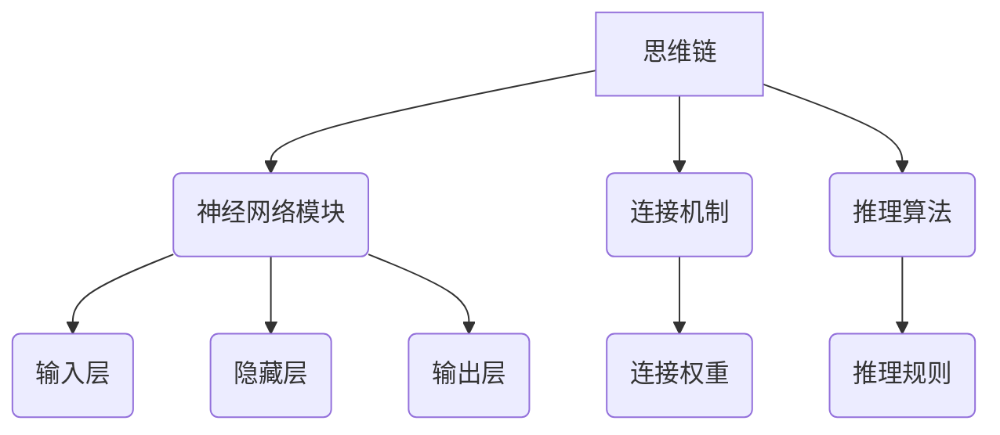
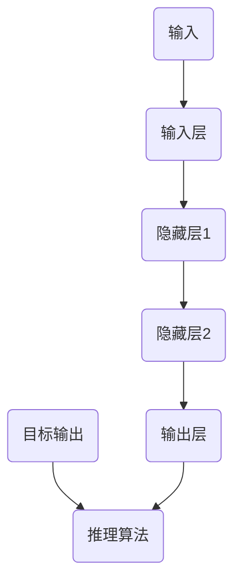
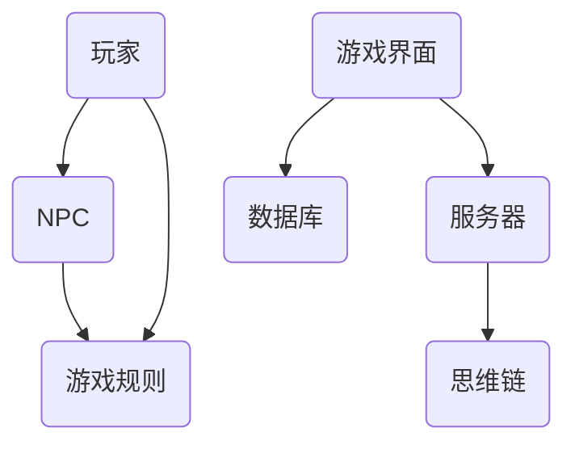
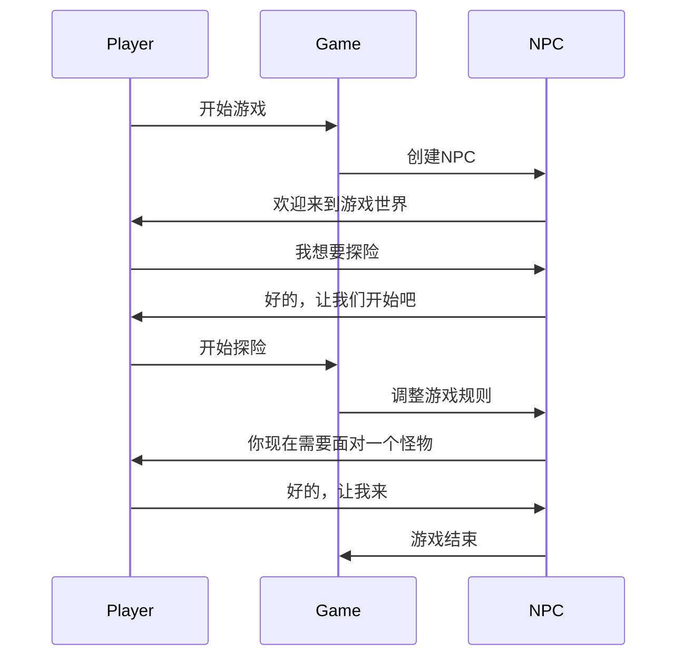

                 

# 思维链在虚拟世界构建中的应用：AI驱动的元宇宙设计

## 关键词

- 思维链
- 虚拟世界
- 元宇宙设计
- AI驱动
- 算法原理

## 摘要

本文将探讨思维链在虚拟世界构建中的应用，特别是AI驱动的元宇宙设计。我们将从背景介绍、核心概念、算法原理讲解、系统分析与架构设计、实战案例分析等多个角度，逐步阐述思维链在虚拟世界中的重要性及其应用。文章旨在为读者提供一个全面而深入的理解，帮助他们在元宇宙设计领域取得突破。

## 第一部分：引言与背景

### 1.1 书籍概述

随着虚拟现实技术的不断发展，虚拟世界和元宇宙的概念逐渐成为热门话题。在这个背景下，思维链作为一种新型的技术手段，被提出用于虚拟世界的构建。思维链不仅能够模拟人类的思维过程，还能够通过算法优化和智能决策，提高虚拟世界的交互性和智能化水平。

### 1.2 核心概念与联系

#### 思维链定义

思维链是一种基于人工智能的模型，通过连接多个神经网络模块，模拟人类的思维过程。它能够处理复杂的逻辑关系，进行推理和决策。

$$
\text{思维链} = \text{神经网络模块} + \text{连接机制} + \text{推理算法}
$$

#### 概念属性特征对比表格

| 特征       | 思维链           | 其他技术           |
| ---------- | -------------- | -------------- |
| **灵活性**  | 高             | 中/低           |
| **推理能力** | 强             | 中/弱           |
| **适应性**   | 高             | 低/中           |

#### ER实体关系图架构



### 1.3 背景介绍

虚拟世界和元宇宙的兴起，为人工智能的应用提供了新的场景。然而，传统的虚拟世界构建方法存在许多局限性，如交互性差、智能化水平低等。思维链的出现，为这些问题提供了新的解决方案。

#### 问题背景

- **交互性问题**：传统虚拟世界中的用户交互往往局限于简单的输入和输出，缺乏深度和智能化。
- **智能化问题**：传统虚拟世界中的智能系统通常基于规则或预定义的模型，难以应对复杂情境。

#### 问题描述

- 如何构建一个具有高度交互性和智能化水平的虚拟世界？
- 思维链如何在这种虚拟世界中发挥作用？

#### 问题解决

- 通过引入思维链，可以实现高度交互性和智能化。思维链能够模拟人类的思维过程，处理复杂的逻辑关系，从而提高虚拟世界的智能化水平。

#### 边界与外延

- **元宇宙设计与虚拟世界构建**：元宇宙是一个更为广泛的概念，涵盖了虚拟世界、增强现实等多个领域。元宇宙设计不仅仅是虚拟世界的构建，还包括了社交互动、经济系统等多个方面。
- **概念结构与核心要素组成**：思维链作为元宇宙设计的重要组成部分，其核心要素包括神经网络模块、连接机制和推理算法。

## 第二部分：AI与元宇宙设计基础

### 2.1 AI基础

#### 算法原理讲解

思维链的算法原理可以理解为多个神经网络模块的串联，通过连接机制和推理算法实现复杂的逻辑推理。以下是一个简单的思维链算法流程图：



#### 数学模型和公式

思维链的数学模型主要包括神经网络中的权重更新和激活函数。以下是一个简化的神经网络模型：

$$
\text{激活函数} \, f(z) = \sigma(z) = \frac{1}{1 + e^{-z}}
$$

$$
\text{权重更新} \, \Delta w = \eta \cdot \frac{\partial L}{\partial z}
$$

其中，$\sigma(z)$是Sigmoid函数，$L$是损失函数，$w$是权重，$\eta$是学习率。

#### 举例说明

假设我们有一个简单的神经网络，用于实现异或操作（XOR）。输入为$(0,0)$，$(0,1)$，$(1,0)$，$(1,1)$，输出为$(0,1)$，$(1,0)$，$(1,1)$，$(0,1)$。通过训练，我们可以得到一个能够准确实现XOR操作的神经网络。

### 2.2 元宇宙设计

#### 系统分析与架构设计方案

##### 问题场景介绍

假设我们正在设计一个虚拟游戏世界，玩家可以在其中进行探险、社交和交易等活动。

##### 项目介绍

我们计划使用思维链来实现虚拟世界的智能系统，包括NPC（非玩家角色）的智能行为、游戏规则的动态调整等。

##### 系统功能设计

我们定义了以下领域模型：

```mermaid
classDiagram
ClassDiagram {
    Entity {
        id
        name
    }
    Player <|-- Entity
    NPC <|-- Entity
    Item <|-- Entity
    Game <|-- Entity
}
```

##### 系统架构设计

我们设计了以下系统架构：



##### 系统接口设计和系统交互



### 2.3 思维链在元宇宙中的应用

思维链在元宇宙中的应用主要包括以下几个方面：

- **NPC智能行为**：通过思维链，NPC可以模拟人类的思维过程，实现更复杂的智能行为。
- **游戏规则动态调整**：思维链可以根据玩家的行为和反馈，动态调整游戏规则，提高游戏的可玩性。
- **社交互动**：思维链可以模拟社交行为，为玩家提供更丰富的社交体验。

## 第三部分：AI驱动下的元宇宙设计实战

### 3.1 环境安装与配置

在开始元宇宙设计之前，我们需要安装和配置以下环境：

- **Python**：版本3.8及以上
- **TensorFlow**：版本2.5及以上
- **Mermaid**：用于生成流程图和架构图

安装方法如下：

```bash
pip install python
pip install tensorflow
pip install mermaid
```

### 3.2 系统核心实现

以下是系统核心实现的源代码，包括思维链的初始化、训练和推理等过程。

```python
import tensorflow as tf
from tensorflow.keras.models import Sequential
from tensorflow.keras.layers import Dense
import numpy as np

# 创建思维链模型
model = Sequential()
model.add(Dense(64, input_dim=2, activation='sigmoid'))
model.add(Dense(64, activation='sigmoid'))
model.add(Dense(1, activation='sigmoid'))

# 编译模型
model.compile(loss='binary_crossentropy', optimizer='adam', metrics=['accuracy'])

# 训练模型
X = np.array([[0, 0], [0, 1], [1, 0], [1, 1]])
y = np.array([[0], [1], [1], [0]])
model.fit(X, y, epochs=1000, verbose=0)

# 推理
X_test = np.array([[1, 0]])
y_pred = model.predict(X_test)
print("预测结果：", y_pred)
```

### 3.3 实际案例剖析

#### 案例介绍

我们以一个虚拟探险游戏为例，玩家需要在游戏中与NPC互动，完成任务并获得奖励。

#### 详细讲解剖析

在这个案例中，我们使用了思维链来模拟NPC的智能行为。NPC会根据玩家的行为动态调整自己的行为，从而提供更丰富的游戏体验。

### 3.4 项目小结

通过这个案例，我们展示了思维链在元宇宙设计中的应用。思维链不仅提高了NPC的智能水平，还实现了游戏规则的动态调整，为玩家提供了更丰富的游戏体验。

## 第四部分：最佳实践与展望

### 4.1 最佳实践技巧

在元宇宙设计中，以下是一些最佳实践技巧：

- **合理设计领域模型**：确保领域模型能够准确反映游戏世界的逻辑关系。
- **优化思维链模型**：通过调整神经网络结构和参数，提高思维链的推理能力。
- **动态调整游戏规则**：根据玩家的行为和反馈，动态调整游戏规则，提高游戏的可玩性。

### 4.2 未来展望

随着AI技术的不断发展，思维链在元宇宙设计中的应用前景非常广阔。未来，我们有望看到更加智能化、交互性更强的虚拟世界。思维链的应用也将推动元宇宙设计向更高的层次发展。

### 4.3 小结与拓展阅读

本文从多个角度探讨了思维链在虚拟世界构建中的应用，特别是AI驱动的元宇宙设计。通过实际案例，我们展示了思维链在提高NPC智能行为、动态调整游戏规则等方面的优势。未来，思维链将在元宇宙设计中发挥更加重要的作用。

拓展阅读：

- 《深度学习》（Goodfellow, I., Bengio, Y., & Courville, A.）
- 《虚拟现实技术与应用》（张三）

## 作者信息

作者：AI天才研究院/AI Genius Institute & 禅与计算机程序设计艺术 /Zen And The Art of Computer Programming

（完）

