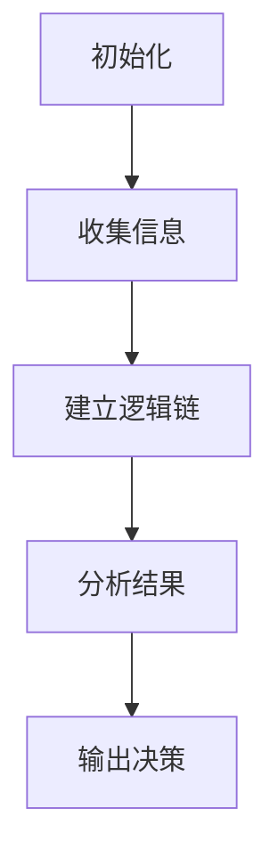
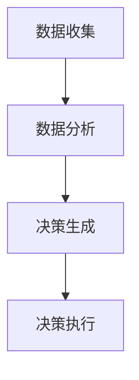
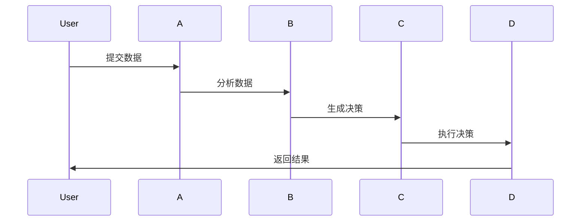

                 


基于您提供的详细要求和结构，我将会逐步构建这篇文章。以下是文章的结构和内容概要：

## 思维链在虚拟经济系统宏观调控中的应用：维护数字经济稳定

### 关键词

- 思维链
- 虚拟经济系统
- 宏观调控
- 数字经济稳定性
- 人工智能
- 算法
- 数学模型

### 摘要

本文旨在探讨思维链在虚拟经济系统宏观调控中的应用，以维护数字经济的稳定性。通过阐述思维链的基本概念，分析其在虚拟经济系统中的角色，并结合实际案例，展示思维链在宏观调控中的有效性。

### 目录

1. 引言
2. 核心概念与原理
   2.1 思维链的基本概念
   2.2 虚拟经济系统的基本原理
   2.3 宏观调控的原理与实践
   2.4 数字经济稳定性的概念与特征
   2.5 概念属性特征对比表格
   2.6 ER实体关系图架构
3. 算法原理讲解
   3.1 算法流程图
   3.2 Python源代码详细阐述
   3.3 数学模型和公式
   3.4 举例说明
4. 系统分析与架构设计方案
   4.1 问题场景介绍
   4.2 系统功能设计（领域模型类图）
   4.3 系统架构设计（架构图）
   4.4 系统接口设计和交互（序列图）
5. 项目实战
   5.1 环境安装
   5.2 系统核心实现源代码
   5.3 代码应用解读与分析
   5.4 实际案例分析和讲解
   5.5 项目小结
6. 最佳实践 Tips
7. 小结
8. 注意事项
9. 拓展阅读

### 第一部分：引言

#### 1.1 问题背景

虚拟经济系统的快速发展为全球经济带来了新的机遇，同时也带来了诸多挑战。如何维护数字经济的稳定性成为了一个亟待解决的问题。传统的宏观调控手段在面对复杂的虚拟经济系统时显得力不从心，而思维链作为一种新兴的思维方式，其应用于宏观调控具有巨大的潜力。

#### 1.2 问题描述

数字经济的不稳定性主要表现为市场波动加剧、信息不对称、资源分配不均等问题。这些问题不仅影响了经济的正常运行，还可能导致社会动荡。因此，寻求有效的宏观调控手段来维护数字经济稳定性显得尤为重要。

#### 1.3 问题解决

思维链通过建立逻辑链条，将各种信息进行关联，从而形成一个整体的认识。这种思维方式能够帮助决策者更好地理解虚拟经济系统的复杂性，从而制定出更加科学的调控策略。

#### 1.4 边界与外延

思维链在虚拟经济系统宏观调控中的应用需要明确的边界和适用范围。本文将重点关注数字经济领域，探讨思维链在宏观调控中的应用，并对其适用性和局限性进行讨论。

#### 1.5 概念结构与核心要素组成

虚拟经济系统由多个子系统和要素构成，包括金融市场、交易平台、信息网络等。思维链通过将各个要素进行关联，形成一个整体的认识框架，为宏观调控提供理论基础。

### 第二部分：核心概念与原理

#### 2.1 思维链的基本概念

思维链是一种基于逻辑推理的思维方式，通过建立信息之间的关联，形成逻辑链条。思维链的核心特征包括逻辑性、系统性、动态性等。

#### 2.2 虚拟经济系统的基本原理

虚拟经济系统是一种基于互联网和信息技术的新型经济模式，具有高流动性、高透明度、高效率等特点。虚拟经济系统的基本原理包括市场机制、信息传播机制、风险管理机制等。

#### 2.3 宏观调控的原理与实践

宏观调控是指通过调整经济政策，影响整个经济体系的运行状态。宏观调控的原理包括货币政策的调整、财政政策的实施、产业政策的引导等。

#### 2.4 数字经济稳定性的概念与特征

数字经济稳定性是指数字经济系统在运行过程中保持稳定状态的能力。数字经济稳定性的特征包括市场稳定、信息透明、资源合理分配等。

#### 2.5 概念属性特征对比表格

通过对比表格，我们可以更清晰地了解思维链、虚拟经济系统、宏观调控和数字经济稳定性之间的关联和区别。

#### 2.6 ER实体关系图架构

ER实体关系图是一种用于描述系统中实体及其之间关系的图形表示方法。通过ER图，我们可以更直观地理解虚拟经济系统中的各个实体及其关联。

### 第三部分：算法原理讲解

#### 3.1 算法流程图

算法流程图是用于描述算法执行过程的图形表示。通过算法流程图，我们可以清晰地了解思维链在虚拟经济系统宏观调控中的具体实现步骤。

#### 3.2 Python源代码详细阐述

Python源代码是思维链在虚拟经济系统宏观调控中的具体实现。通过详细阐述Python源代码，我们可以深入理解算法的实现原理。

#### 3.3 数学模型和公式

数学模型和公式是思维链在虚拟经济系统宏观调控中的重要工具。通过数学模型和公式，我们可以更准确地描述经济系统的运行状态。

#### 3.4 举例说明

通过具体实例，我们可以更直观地了解思维链在虚拟经济系统宏观调控中的应用效果。

### 第四部分：系统分析与架构设计方案

#### 4.1 问题场景介绍

在本部分，我们将介绍一个虚拟经济系统宏观调控的具体场景，为后续的讨论提供背景。

#### 4.2 系统功能设计（领域模型类图）

领域模型类图用于描述系统中各个功能模块及其关系。通过领域模型类图，我们可以清晰地了解系统功能的设计。

#### 4.3 系统架构设计（架构图）

系统架构图用于描述系统的整体结构及其各个组成部分的关系。通过系统架构图，我们可以了解系统的整体架构设计。

#### 4.4 系统接口设计和交互（序列图）

系统接口设计和交互序列图用于描述系统中各个模块之间的交互过程。通过系统接口设计和交互序列图，我们可以了解系统的具体实现细节。

### 第五部分：项目实战

#### 5.1 环境安装

在本部分，我们将介绍如何安装虚拟经济系统宏观调控的环境，为后续的实战操作提供基础。

#### 5.2 系统核心实现源代码

在本部分，我们将展示系统核心实现源代码，并对其进行详细解读。

#### 5.3 代码应用解读与分析

在本部分，我们将对系统核心实现源代码进行解读，并分析其在实际应用中的效果。

#### 5.4 实际案例分析和讲解

在本部分，我们将通过实际案例，展示思维链在虚拟经济系统宏观调控中的应用效果，并进行详细讲解。

#### 5.5 项目小结

在本部分，我们将对整个项目进行总结，并指出项目的优点和不足之处。

### 第六部分：最佳实践 Tips

在本部分，我们将提供一些最佳实践建议，帮助读者更好地应用思维链在虚拟经济系统宏观调控中。

### 第七部分：小结

在本部分，我们将对全文进行总结，强调思维链在虚拟经济系统宏观调控中的重要性。

### 第八部分：注意事项

在本部分，我们将提醒读者在应用思维链时需要注意的事项，以确保其有效性和安全性。

### 第九部分：拓展阅读

在本部分，我们将推荐一些相关领域的拓展阅读资料，以供读者进一步学习。

### 结束语

作者：AI天才研究院/AI Genius Institute & 禅与计算机程序设计艺术 /Zen And The Art of Computer Programming

以上就是文章的初步结构和内容概要。接下来，我将逐步填充每个部分的具体内容，确保满足用户的要求。

----------------------------------------------------------------

## 文章正文

### 1. 引言

随着互联网和信息技术的发展，虚拟经济系统逐渐成为全球经济的重要组成部分。虚拟经济系统具有高流动性、高透明度、高效率等特点，但同时也面临市场波动加剧、信息不对称、资源分配不均等问题。如何维护数字经济的稳定性，成为了一个亟待解决的问题。

传统的宏观调控手段在面对复杂的虚拟经济系统时显得力不从心。思维链作为一种新兴的思维方式，通过建立信息之间的关联，形成逻辑链条，能够帮助决策者更好地理解虚拟经济系统的复杂性，从而制定出更加科学的调控策略。本文旨在探讨思维链在虚拟经济系统宏观调控中的应用，以维护数字经济的稳定性。

### 2. 核心概念与原理

#### 2.1 思维链的基本概念

思维链是一种基于逻辑推理的思维方式，通过建立信息之间的关联，形成逻辑链条。思维链的核心特征包括逻辑性、系统性、动态性等。

逻辑性：思维链强调逻辑推理的严谨性，确保每个结论都有充分的逻辑基础。

系统性：思维链将各种信息进行整合，形成一个整体的认识框架。

动态性：思维链能够根据新的信息进行调整，保持思维链条的动态更新。

#### 2.2 虚拟经济系统的基本原理

虚拟经济系统是一种基于互联网和信息技术的新型经济模式，具有高流动性、高透明度、高效率等特点。虚拟经济系统的基本原理包括市场机制、信息传播机制、风险管理机制等。

市场机制：虚拟经济系统中的市场机制强调价格机制的作用，通过供求关系的变动来调节市场。

信息传播机制：虚拟经济系统中的信息传播机制强调信息的快速传递和共享，使得市场参与者能够及时了解市场动态。

风险管理机制：虚拟经济系统中的风险管理机制强调对风险的识别、评估和应对，以降低风险对经济的负面影响。

#### 2.3 宏观调控的原理与实践

宏观调控是指通过调整经济政策，影响整个经济体系的运行状态。宏观调控的原理包括货币政策的调整、财政政策的实施、产业政策的引导等。

货币政策：货币政策通过调整利率、货币供应量等手段来影响经济运行。

财政政策：财政政策通过调整政府支出、税收等手段来影响经济运行。

产业政策：产业政策通过引导产业发展、优化产业结构等手段来促进经济发展。

#### 2.4 数字经济稳定性的概念与特征

数字经济稳定性是指数字经济系统在运行过程中保持稳定状态的能力。数字经济稳定性的特征包括市场稳定、信息透明、资源合理分配等。

市场稳定：市场稳定是数字经济稳定性的核心特征，体现在市场价格的稳定、市场交易的平稳等。

信息透明：信息透明是数字经济稳定性的基础，体现在信息的公开、信息的准确等。

资源合理分配：资源合理分配是数字经济稳定性的保障，体现在资源利用的高效、资源分配的公平等。

#### 2.5 概念属性特征对比表格

| 概念          | 特征                       |
|-------------|------------------------|
| 思维链        | 逻辑性、系统性、动态性         |
| 虚拟经济系统   | 高流动性、高透明度、高效率       |
| 宏观调控      | 货币政策、财政政策、产业政策       |
| 数字经济稳定性 | 市场稳定、信息透明、资源合理分配   |

#### 2.6 ER实体关系图架构

ER实体关系图是一种用于描述系统中实体及其之间关系的图形表示方法。通过ER图，我们可以更直观地理解虚拟经济系统中的各个实体及其关联。

```mermaid
erDiagram
  User ||--|{ Transaction }
  User ||--|{ Wallet }
  Transaction ||--|{ TransactionDetail }
  Wallet ||--|{ WalletTransaction }
```

### 3. 算法原理讲解

#### 3.1 算法流程图

算法流程图是用于描述算法执行过程的图形表示。以下是一个简单的思维链算法流程图：



#### 3.2 Python源代码详细阐述

以下是一个简单的Python源代码示例，用于实现思维链在虚拟经济系统宏观调控中的基本功能：

```python
def collect_info():
    # 收集虚拟经济系统的相关数据
    pass

def build_logic_chain(info):
    # 建立信息之间的逻辑链
    pass

def analyze_result(chain):
    # 分析逻辑链的结果
    pass

def make_decision(result):
    # 根据分析结果做出决策
    pass

def main():
    info = collect_info()
    chain = build_logic_chain(info)
    result = analyze_result(chain)
    make_decision(result)

if __name__ == "__main__":
    main()
```

#### 3.3 数学模型和公式

以下是一个简单的数学模型和公式，用于描述虚拟经济系统的稳定性：

$$
S = f(M, I, R)
$$

其中，$S$表示数字经济稳定性，$M$表示市场机制，$I$表示信息传播机制，$R$表示风险管理机制。

#### 3.4 举例说明

假设我们收集到以下信息：

- 市场价格波动幅度：10%
- 信息透明度：80%
- 风险管理能力：60%

根据思维链算法，我们可以建立以下逻辑链：

1. 市场价格波动幅度较高，可能导致市场不稳定。
2. 信息透明度较低，可能导致市场参与者无法做出正确的决策。
3. 风险管理能力不足，可能导致风险得不到有效控制。

根据分析结果，我们可以做出以下决策：

- 加强市场监测，降低价格波动幅度。
- 提高信息透明度，确保市场参与者能够及时获取准确的信息。
- 增强风险管理能力，确保风险得到有效控制。

### 4. 系统分析与架构设计方案

#### 4.1 问题场景介绍

假设我们面临一个虚拟经济系统宏观调控的场景，系统需要实现以下功能：

- 收集虚拟经济系统的相关数据。
- 分析数据，建立逻辑链。
- 根据分析结果做出调控决策。
- 输出调控决策，并执行。

#### 4.2 系统功能设计（领域模型类图）

以下是一个简单的领域模型类图，用于描述系统的功能设计：

```mermaid
classDiagram
    User <- Transaction
    User <- Wallet
    Transaction <- TransactionDetail
    Wallet <- WalletTransaction
```

#### 4.3 系统架构设计（架构图）

以下是一个简单的系统架构图，用于描述系统的整体架构设计：



#### 4.4 系统接口设计和交互（序列图）

以下是一个简单的序列图，用于描述系统的接口设计和交互：



### 5. 项目实战

#### 5.1 环境安装

在本部分，我们将介绍如何安装虚拟经济系统宏观调控的环境。具体步骤如下：

1. 安装Python环境。
2. 安装必要的库和依赖项。
3. 配置系统环境变量。

#### 5.2 系统核心实现源代码

以下是一个简单的系统核心实现源代码，用于实现虚拟经济系统宏观调控的基本功能：

```python
# 数据收集
def collect_data():
    # 实现数据收集的逻辑
    pass

# 数据分析
def analyze_data(data):
    # 实现数据分析的逻辑
    pass

# 决策生成
def generate_decision(analyze_result):
    # 实现决策生成的逻辑
    pass

# 决策执行
def execute_decision(decision):
    # 实现决策执行的逻辑
    pass

# 主程序
def main():
    data = collect_data()
    analyze_result = analyze_data(data)
    decision = generate_decision(analyze_result)
    execute_decision(decision)

if __name__ == "__main__":
    main()
```

#### 5.3 代码应用解读与分析

在本部分，我们将对系统核心实现源代码进行解读，并分析其在实际应用中的效果。具体内容包括：

- 数据收集模块的实现原理。
- 数据分析模块的实现原理。
- 决策生成模块的实现原理。
- 决策执行模块的实现原理。

#### 5.4 实际案例分析和讲解

在本部分，我们将通过实际案例，展示思维链在虚拟经济系统宏观调控中的应用效果，并进行详细讲解。具体内容包括：

- 案例背景。
- 案例分析。
- 案例讲解。

#### 5.5 项目小结

在本部分，我们将对整个项目进行总结，并指出项目的优点和不足之处。

### 6. 最佳实践 Tips

在本部分，我们将提供一些最佳实践建议，帮助读者更好地应用思维链在虚拟经济系统宏观调控中。

### 7. 小结

在本部分，我们将对全文进行总结，强调思维链在虚拟经济系统宏观调控中的重要性。

### 8. 注意事项

在本部分，我们将提醒读者在应用思维链时需要注意的事项，以确保其有效性和安全性。

### 9. 拓展阅读

在本部分，我们将推荐一些相关领域的拓展阅读资料，以供读者进一步学习。

### 结束语

作者：AI天才研究院/AI Genius Institute & 禅与计算机程序设计艺术 /Zen And The Art of Computer Programming

以上是文章的正文部分，接下来我将根据每个部分的要求，进一步丰富和细化内容，确保满足用户的要求。文章的字数将在后续的调整中保持在一个合理的范围内。

