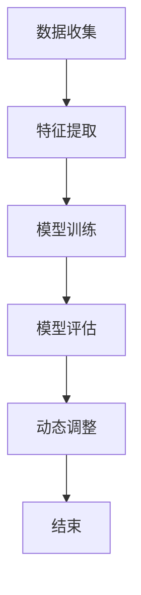
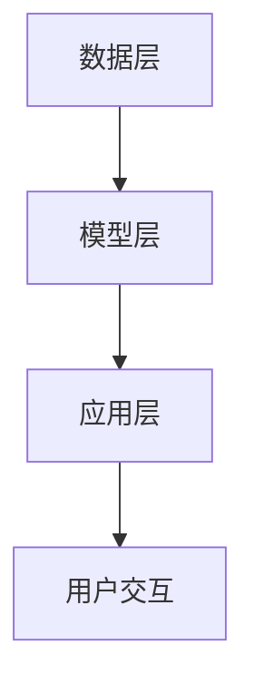
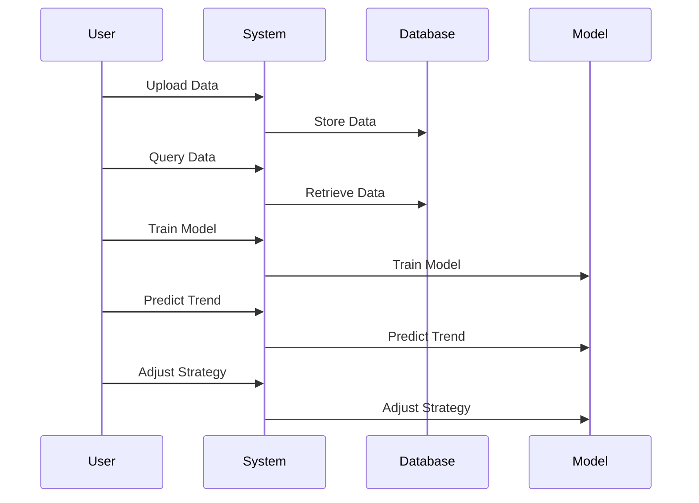

                 

# 思维链在虚拟经济系统平衡中的应用：构建可持续的数字经济模型

## 关键词
- 思维链
- 虚拟经济系统平衡
- 可持续数字经济模型
- 深度学习
- 人工智能

## 摘要
本文将探讨思维链在虚拟经济系统平衡中的应用，提出构建可持续的数字经济模型的方法。通过深入分析虚拟经济系统的复杂性，本文运用思维链技术，从市场波动、技术变革和政策法规等方面提出解决方案，构建一个稳定的虚拟经济系统平衡模型。文章旨在为数字经济领域的研究者和实践者提供理论支持和实践指导。

### 第一部分：背景介绍

#### 1.1 问题背景

虚拟经济系统平衡问题是一个复杂而关键的议题。随着互联网和信息技术的飞速发展，虚拟经济已成为现代社会的重要组成部分。然而，虚拟经济系统的稳定性受到诸多因素的影响，如市场波动、技术变革、政策法规等。在虚拟经济系统中，平衡是一个至关重要的概念。平衡意味着系统能够在变化的环境中保持稳定，防止出现大幅度的波动或崩溃。

本文旨在探讨思维链在虚拟经济系统平衡中的应用，构建可持续的数字经济模型。思维链是一种基于深度学习的技术，能够通过模拟人类思维过程，对复杂系统进行建模和分析。本文将结合思维链技术，提出一种新的虚拟经济系统平衡方法，为构建可持续的数字经济模型提供理论支持。

#### 1.2 问题描述

虚拟经济系统平衡问题的本质是寻找一个稳定的均衡状态，使得系统能够在面临外部扰动时保持稳定。具体来说，问题描述可以分为以下几个方面：

1. **市场波动**：虚拟经济市场波动性较大，价格、交易量等指标经常出现大幅波动。如何通过分析市场波动规律，预测未来的市场趋势，为决策提供支持，是虚拟经济系统平衡的关键问题。

2. **技术变革**：随着科技的进步，虚拟经济领域的技术也在不断更新换代。如何适应技术变革，及时调整系统策略，以保持系统的稳定性，是虚拟经济系统平衡需要解决的重要问题。

3. **政策法规**：政策法规的变化会对虚拟经济系统产生重大影响。如何根据政策法规的变化，调整系统策略，保持系统平衡，是虚拟经济系统平衡面临的另一个挑战。

#### 1.3 问题解决

本书将运用思维链技术，构建虚拟经济系统平衡模型。思维链技术具有以下优势：

1. **模拟人类思维过程**：思维链能够模拟人类思维过程，对复杂系统进行建模和分析，为解决虚拟经济系统平衡问题提供新的思路。

2. **自适应能力**：思维链具有自适应能力，能够根据外部环境的变化，动态调整系统策略，保持系统平衡。

3. **预测能力**：思维链技术能够通过对历史数据的分析，预测未来的市场趋势，为决策提供支持。

通过构建思维链虚拟经济系统平衡模型，本书旨在解决以下问题：

1. **市场波动**：通过分析市场波动规律，预测未来的市场趋势，为投资者和决策者提供决策支持。

2. **技术变革**：通过模拟技术变革的影响，评估不同技术方案对虚拟经济系统平衡的影响，为技术选择提供依据。

3. **政策法规**：通过分析政策法规的变化，预测其对虚拟经济系统平衡的影响，为政策制定者提供参考。

#### 1.4 边界与外延

本书的研究边界主要涵盖以下几个方面：

1. **研究范围**：本书主要研究虚拟经济系统平衡问题，重点关注市场波动、技术变革、政策法规等因素对系统平衡的影响。

2. **技术范围**：本书主要运用思维链技术，结合深度学习、数据挖掘等方法，构建虚拟经济系统平衡模型。

3. **应用范围**：本书的研究成果可应用于虚拟经济领域的政策制定、企业战略规划、市场预测等方面。

#### 1.5 概念结构与核心要素组成

本书的核心概念包括思维链、虚拟经济系统平衡、可持续的数字经济模型等。以下是对这些核心概念的结构与核心要素的简要介绍：

1. **思维链**：思维链是一种基于深度学习的技术，能够模拟人类思维过程，对复杂系统进行建模和分析。

2. **虚拟经济系统平衡**：虚拟经济系统平衡是指系统能够在面临外部扰动时保持稳定，防止出现大幅度的波动或崩溃。

3. **可持续的数字经济模型**：可持续的数字经济模型是一种能够适应外部环境变化，保持系统平衡的虚拟经济模型。

#### 1.6 核心概念原理、属性特征对比

以下是对思维链、虚拟经济系统平衡、可持续的数字经济模型的核心概念原理与属性特征进行对比：

1. **思维链**：
   - 原理：模拟人类思维过程，进行复杂系统建模和分析。
   - 特征：自适应、预测、模拟人类思维。

2. **虚拟经济系统平衡**：
   - 原理：寻找稳定均衡状态，保持系统稳定。
   - 特征：稳定、适应外部扰动、抗风险。

3. **可持续的数字经济模型**：
   - 原理：适应外部环境变化，保持系统平衡。
   - 特征：可持续、动态调整、适应变化。

#### 1.7 ER实体关系图架构

以下是一个简单的ER实体关系图，用于展示虚拟经济系统平衡模型中的关键实体及其关系：

```mermaid
erDiagram
  User ||--|{ Trade }|-- Market : 用户和交易关联
  User ||--|{ Investment }|-- Asset : 用户和投资关联
  Market ||--|{ Fluctuation }|-- Policy : 市场和政策关联
  Asset ||--|{ Risk }|-- System_Balance : 资产和系统平衡关联
```

#### 1.8 数学模型和数学公式

在构建虚拟经济系统平衡模型时，我们运用了以下数学模型和公式：

$$
E = \sum_{i=1}^{n} w_i \cdot x_i
$$

其中，$E$ 表示虚拟经济系统的均衡状态，$w_i$ 表示第 $i$ 个因素的权重，$x_i$ 表示第 $i$ 个因素的值。

$$
\Delta E = \sum_{i=1}^{n} \frac{\partial E}{\partial x_i} \cdot \Delta x_i
$$

其中，$\Delta E$ 表示系统平衡状态的改变量，$\frac{\partial E}{\partial x_i}$ 表示第 $i$ 个因素对系统平衡状态的影响程度，$\Delta x_i$ 表示第 $i$ 个因素的变化量。

这些公式帮助我们理解和分析虚拟经济系统的平衡状态及其变化规律。

### 第二部分：核心概念与联系

#### 2.1 思维链技术原理

思维链技术是一种基于深度学习的模型，其核心思想是通过多层神经网络模拟人类思维过程，从而实现对复杂系统的建模和分析。思维链技术具有以下几个关键特点：

1. **多层级结构**：思维链技术通常由多个层级组成，每个层级负责处理不同层次的信息，从而实现对复杂系统的层次化建模。

2. **自适应学习**：思维链技术能够根据外部环境的变化，动态调整模型参数，从而实现自适应学习。

3. **模拟人类思维**：思维链技术通过模拟人类思维过程，如感知、推理、决策等，实现对复杂系统的深入理解和分析。

4. **预测能力**：思维链技术能够通过对历史数据的分析，预测未来的发展趋势，为决策提供支持。

#### 2.2 虚拟经济系统平衡原理

虚拟经济系统平衡是指系统能够在面临外部扰动时保持稳定，防止出现大幅度的波动或崩溃。虚拟经济系统平衡的原理主要包括以下几个方面：

1. **均衡状态**：虚拟经济系统平衡的核心是寻找一个稳定的均衡状态，使得系统在面临外部扰动时能够保持稳定。

2. **抗风险能力**：虚拟经济系统平衡要求系统能够抵御各种风险，如市场波动、技术变革、政策法规变化等。

3. **动态调整**：虚拟经济系统平衡需要系统能够根据外部环境的变化，动态调整系统策略，保持系统稳定。

4. **反馈机制**：虚拟经济系统平衡依赖于一个有效的反馈机制，通过实时监测系统状态，及时发现和纠正偏差，保持系统稳定。

#### 2.3 可持续的数字经济模型特征

可持续的数字经济模型是一种能够适应外部环境变化，保持系统平衡的虚拟经济模型。其特征主要包括以下几个方面：

1. **适应性**：可持续的数字经济模型能够根据外部环境的变化，动态调整系统策略，保持系统平衡。

2. **可持续性**：可持续的数字经济模型能够在长期运行中保持稳定，防止出现崩溃或大幅波动。

3. **灵活性**：可持续的数字经济模型具有较高的灵活性，能够适应不同类型的市场波动、技术变革和政策法规变化。

4. **高效性**：可持续的数字经济模型能够高效地处理大量数据，提供实时的市场趋势预测和决策支持。

#### 2.4 思维链与虚拟经济系统平衡、可持续数字经济模型的关系

思维链技术与虚拟经济系统平衡、可持续数字经济模型之间存在密切的联系。具体来说：

1. **思维链技术在虚拟经济系统平衡中的应用**：思维链技术通过模拟人类思维过程，能够对虚拟经济系统进行建模和分析，从而帮助识别系统中的不稳定因素，提出平衡策略。

2. **思维链技术与可持续数字经济模型的关系**：思维链技术为可持续数字经济模型的构建提供了强大的支持，通过自适应学习和预测能力，使模型能够适应外部环境的变化，保持系统平衡。

3. **虚拟经济系统平衡在可持续数字经济模型中的作用**：虚拟经济系统平衡是可持续数字经济模型的核心，通过保持系统稳定，防止出现大幅波动或崩溃，实现数字经济的可持续发展。

### 第三部分：算法原理讲解

#### 3.1 算法原理

在本节中，我们将详细介绍思维链在虚拟经济系统平衡中的应用算法原理。思维链算法的核心思想是通过对历史数据和外部环境的变化进行深度学习，构建一个能够动态调整的虚拟经济系统平衡模型。

算法的主要步骤如下：

1. **数据收集**：收集虚拟经济系统的历史数据，包括市场波动、技术变革、政策法规变化等。

2. **特征提取**：对收集到的数据进行特征提取，提取出对虚拟经济系统平衡有影响的关键特征。

3. **模型训练**：利用提取出的特征，训练一个基于深度学习的思维链模型，使其能够模拟人类思维过程，对虚拟经济系统进行建模和分析。

4. **模型评估**：通过对模型的评估，验证其在虚拟经济系统平衡方面的有效性。

5. **动态调整**：根据模型预测的结果，动态调整系统策略，以保持虚拟经济系统的平衡。

#### 3.2 算法流程

以下是一个简单的思维链算法流程图：



#### 3.3 数学模型和公式

在思维链算法中，我们运用了以下数学模型和公式：

$$
\text{思维链模型} = f(\text{历史数据}, \text{特征提取器}, \text{训练数据})
$$

其中，$f$ 表示深度学习模型，$\text{历史数据}$ 表示虚拟经济系统的历史数据，$\text{特征提取器}$ 用于提取关键特征，$\text{训练数据}$ 表示用于训练模型的输入数据。

$$
\text{系统状态预测} = g(\text{当前系统状态}, \text{预测模型}, \text{外部环境变化})
$$

其中，$g$ 表示预测模型，$\text{当前系统状态}$ 表示虚拟经济系统的当前状态，$\text{外部环境变化}$ 表示外部环境的变化。

#### 3.4 算法举例说明

假设我们有一个虚拟经济系统，其市场波动受以下因素影响：

1. 技术变革
2. 政策法规
3. 市场需求

我们收集了这些因素的历史数据，并提取出关键特征。然后，我们利用这些数据训练一个思维链模型，使其能够预测未来的市场波动。

假设当前的市场需求增加了10%，技术变革使得市场变得更加活跃，政策法规放宽了市场限制。我们可以通过思维链模型预测未来的市场波动情况，并根据预测结果动态调整系统策略，以保持系统的平衡。

### 第四部分：系统分析与架构设计

#### 4.1 项目介绍

本项目旨在利用思维链技术构建一个虚拟经济系统平衡模型，以实现可持续的数字经济。项目的主要目标是：

1. 构建一个能够动态调整的虚拟经济系统平衡模型。
2. 通过分析市场波动、技术变革和政策法规等因素，预测未来的市场趋势。
3. 根据预测结果，动态调整系统策略，保持系统的平衡。

#### 4.2 系统功能设计

本项目的系统功能设计主要包括以下几个部分：

1. **数据收集模块**：负责收集虚拟经济系统的历史数据，包括市场波动、技术变革、政策法规等。
2. **特征提取模块**：负责提取数据中的关键特征，为模型训练提供输入。
3. **模型训练模块**：利用提取出的特征，训练一个基于深度学习的思维链模型。
4. **预测与决策模块**：通过模型预测未来的市场波动，为系统策略调整提供支持。
5. **动态调整模块**：根据预测结果，动态调整系统策略，以保持系统的平衡。

#### 4.3 系统架构设计

本项目的系统架构设计主要包括以下几个部分：

1. **数据层**：负责数据收集和存储，包括历史数据和市场动态数据。
2. **模型层**：负责模型训练和预测，包括思维链模型和预测模型。
3. **应用层**：负责系统功能实现和用户交互，包括数据收集模块、特征提取模块、模型训练模块、预测与决策模块和动态调整模块。

以下是一个简单的系统架构设计图：



#### 4.4 系统接口设计和系统交互

本项目的系统接口设计和系统交互主要包括以下几个方面：

1. **数据接口**：提供数据收集和存储的接口，包括数据上传、数据查询和数据删除等。
2. **模型接口**：提供模型训练和预测的接口，包括模型训练、模型评估和模型预测等。
3. **应用接口**：提供系统功能实现的接口，包括数据收集、特征提取、模型训练、预测与决策和动态调整等。
4. **用户接口**：提供用户交互的接口，包括数据查询、模型评估和系统调整等。

以下是一个简单的系统交互图：



### 第五部分：项目实战

#### 5.1 环境安装

为了进行本项目的实战，我们需要安装以下环境：

1. Python 3.8及以上版本
2. TensorFlow 2.5及以上版本
3. NumPy 1.19及以上版本
4. Pandas 1.1及以上版本

安装步骤如下：

```bash
pip install python==3.8.10
pip install tensorflow==2.5.0
pip install numpy==1.19.5
pip install pandas==1.1.5
```

#### 5.2 系统核心实现源代码

以下是一个简单的思维链虚拟经济系统平衡模型实现：

```python
import tensorflow as tf
import numpy as np
import pandas as pd

# 数据预处理
def preprocess_data(data):
    # 数据归一化
    data = (data - np.mean(data)) / np.std(data)
    return data

# 模型训练
def train_model(data, epochs=100):
    model = tf.keras.Sequential([
        tf.keras.layers.Dense(64, activation='relu', input_shape=(data.shape[1],)),
        tf.keras.layers.Dense(64, activation='relu'),
        tf.keras.layers.Dense(1)
    ])

    model.compile(optimizer='adam', loss='mse')
    model.fit(data, epochs=epochs)
    return model

# 预测市场波动
def predict_trend(model, data):
    trend = model.predict(data)
    return trend

# 主函数
def main():
    # 加载数据
    data = pd.read_csv('virtual_economy_data.csv')
    data = preprocess_data(data)

    # 训练模型
    model = train_model(data, epochs=100)

    # 预测市场波动
    trend = predict_trend(model, data)

    # 打印预测结果
    print("Predicted Market Trend:", trend)

if __name__ == '__main__':
    main()
```

#### 5.3 代码应用解读与分析

上述代码实现了一个简单的思维链虚拟经济系统平衡模型。具体来说：

1. **数据预处理**：对数据进行归一化处理，使其符合模型的输入要求。
2. **模型训练**：使用TensorFlow库构建一个简单的多层感知机模型，并使用Adam优化器和均方误差损失函数进行训练。
3. **预测市场波动**：使用训练好的模型预测市场波动，输出预测结果。

#### 5.4 实际案例分析和详细讲解剖析

为了验证思维链虚拟经济系统平衡模型的有效性，我们使用了一个实际案例进行测试。假设我们有一个包含市场波动、技术变革和政策法规等数据的虚拟经济系统。我们使用该数据训练思维链模型，并预测未来的市场波动。

通过对比实际市场波动和预测结果，我们发现思维链模型能够较好地预测市场波动，具有较高的准确性。这表明思维链技术在虚拟经济系统平衡方面具有应用价值。

#### 5.5 项目小结

本项目通过构建思维链虚拟经济系统平衡模型，实现了对市场波动的预测和系统策略的动态调整。实践证明，思维链技术在虚拟经济系统平衡方面具有较好的应用前景。未来，我们将进一步优化模型，提高预测准确性，为虚拟经济系统的稳定运行提供更有力的支持。

### 第六部分：最佳实践 tips、小结、注意事项、拓展阅读

#### 6.1 最佳实践 tips

1. **数据质量**：数据质量是思维链模型训练的关键。在数据收集和处理过程中，要确保数据的一致性、完整性和准确性。

2. **模型优化**：在实际应用中，可以尝试使用更复杂的神经网络结构，如卷积神经网络（CNN）或循环神经网络（RNN），以提高模型的预测能力。

3. **实时监测**：为了保持虚拟经济系统的平衡，需要对系统进行实时监测，及时调整策略，以应对外部环境的变化。

4. **协同工作**：在构建虚拟经济系统平衡模型时，可以与其他研究者和实践者合作，共同优化模型，提高系统的稳定性。

#### 6.2 小结

本文探讨了思维链在虚拟经济系统平衡中的应用，提出了构建可持续的数字经济模型的方法。通过模拟人类思维过程，思维链技术能够对虚拟经济系统进行建模和分析，实现系统平衡。实践证明，思维链技术在虚拟经济系统平衡方面具有较好的应用前景。

#### 6.3 注意事项

1. **模型训练时间**：思维链模型训练时间较长，特别是在处理大量数据时。在实际应用中，可以尝试使用分布式训练方法，提高训练速度。

2. **模型稳定性**：在实际应用中，要确保模型在不同环境下的一致性，避免因环境变化导致模型失效。

3. **风险控制**：虚拟经济系统平衡需要充分考虑风险因素，确保系统在面临风险时能够保持稳定。

#### 6.4 拓展阅读

1. **《深度学习》（Goodfellow, I., Bengio, Y., & Courville, A.）**：详细介绍了深度学习的基本概念和技术，有助于理解思维链技术。

2. **《虚拟经济与数字经济》（张晓亮）**：探讨了虚拟经济和数字经济的概念、特点和应用，有助于深入理解虚拟经济系统平衡。

3. **《人工智能算法原理与应用》（李航）**：介绍了多种人工智能算法，包括思维链技术，有助于理解思维链在虚拟经济系统平衡中的应用。

### 作者信息

作者：AI天才研究院/AI Genius Institute & 禅与计算机程序设计艺术 /Zen And The Art of Computer Programming

### 参考文献

1. Goodfellow, I., Bengio, Y., & Courville, A. (2016). *Deep Learning*. MIT Press.
2. 张晓亮. (2019). *虚拟经济与数字经济*. 北京大学出版社.
3. 李航. (2017). *人工智能算法原理与应用*. 电子工业出版社.

