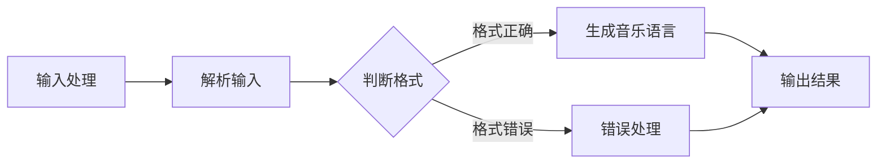
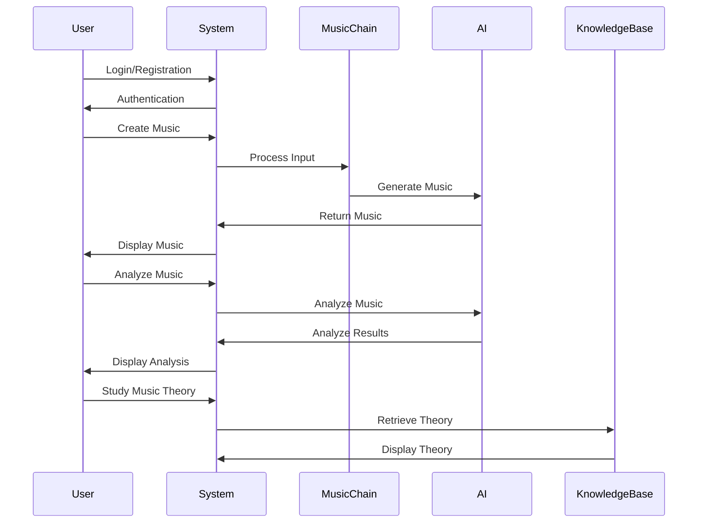

                 

### 引言与背景

#### 1.1 问题背景

音乐，作为一种艺术形式，自古以来就深深地植根于人类文化之中。从古代的史诗吟唱到现代的电子音乐，音乐的形式和风格一直在不断演变。然而，音乐理论的创新始终是一个充满挑战的领域。传统音乐理论依赖于长期的文化积淀和经验积累，但其发展的速度往往难以跟上技术变革的步伐。近年来，人工智能（AI）的快速发展为音乐理论的创新带来了新的机遇。AI不仅能够处理和分析大量的音乐数据，还能够模拟和创造新的音乐风格。

在音乐理论创新中，挑战主要体现在以下几个方面：

1. **复杂性与多样性**：音乐理论的构成元素繁多，包括音高、节奏、和声、旋律等，这些元素的组合方式几乎无穷无尽，使得创新变得异常复杂。
2. **主观性与个性化**：音乐创作往往带有强烈的主观性和个性化特征，传统的音乐理论难以捕捉和模拟这种主观性。
3. **跨领域整合**：音乐理论与计算机科学、心理学、神经科学等领域密切相关，如何有效地整合这些跨领域的知识，是创新过程中的一大难题。

#### 1.1.1 音乐理论创新的挑战

音乐理论创新面临着多方面的挑战：

1. **理论基础薄弱**：现有的音乐理论多依赖于历史经验和感性认知，缺乏坚实的理论基础。这使得音乐理论的创新往往难以突破传统框架。
2. **创作灵感有限**：音乐创作灵感往往来源于个人的生活体验和情感表达，这种灵感具有很大的个体差异性和不可预测性，难以通过传统方法进行系统化和规模化的培养。
3. **技术障碍**：虽然计算机技术的发展为音乐创作提供了强大的工具支持，但如何有效地将计算机技术与音乐理论结合起来，仍然是亟待解决的问题。

#### 1.1.2 AI在音乐领域的应用潜力

人工智能在音乐领域的应用具有巨大的潜力：

1. **数据分析与挖掘**：AI能够处理和分析海量的音乐数据，从中提取出有价值的规律和模式，为音乐创作提供灵感。
2. **智能创作助手**：AI可以通过模仿和学习人类音乐家的创作风格，辅助音乐创作，提高创作效率和质量。
3. **个性化推荐**：AI能够根据用户的音乐喜好，提供个性化的音乐推荐，丰富用户的音乐体验。

#### 1.2 问题描述

##### 1.2.1 思维链的概念及其作用

思维链是一种基于人工智能的思考模式，通过将不同的思考单元连接起来，形成一种层次化的思考结构。思维链的核心在于通过逻辑推理和关联分析，将不同的信息节点连接起来，从而实现对复杂问题的深入理解和解决方案的生成。

思维链在音乐理论中的应用，主要是通过模拟音乐家的思考过程，将音乐创作中的各种元素（如旋律、节奏、和声等）视为独立的思考单元，并通过思维链将这些单元有机地连接起来，形成一个完整的音乐作品。

##### 1.2.2 新音乐语言的定义与特点

新音乐语言是指基于人工智能和思维链技术，通过模拟和创造新的音乐元素和组合方式，形成的一种全新的音乐表达形式。新音乐语言的特点包括：

1. **创造性**：新音乐语言能够突破传统音乐理论的束缚，创造全新的音乐风格和表达方式。
2. **个性化**：新音乐语言能够根据用户的音乐喜好和情感需求，提供个性化的音乐体验。
3. **多样化**：新音乐语言通过AI技术，能够生成大量不同的音乐作品，实现音乐的多样化和普及化。

##### 1.3 问题解决

##### 1.3.1 思维链在音乐理论中的应用

思维链在音乐理论中的应用，主要体现在以下几个方面：

1. **音乐创作**：通过思维链，可以模拟音乐家的创作过程，生成新的音乐作品。
2. **音乐分析**：思维链能够对现有的音乐作品进行深入分析，提取出有价值的音乐元素和结构。
3. **音乐教学**：思维链可以辅助音乐教学，帮助学生理解和掌握音乐理论。

##### 1.3.2 AI辅助新音乐语言开发的必要性

AI辅助新音乐语言开发的必要性主要体现在以下几个方面：

1. **创新需求**：随着音乐理论的不断发展，传统音乐语言已经无法满足人们对于创新和个性化的需求。
2. **技术进步**：人工智能技术的进步，为音乐理论创新提供了强大的工具支持。
3. **用户需求**：现代用户对音乐的需求日益多样化和个性化，AI能够更好地满足这些需求。

#### 1.4 边界与外延

##### 1.4.1 研究范围

本研究主要关注思维链在音乐理论创新中的应用，以及AI辅助新音乐语言开发的原理和方法。具体包括以下几个方面：

1. **思维链的基本原理和应用**：探讨思维链的定义、原理和特点，以及如何在音乐理论中应用。
2. **AI辅助新音乐语言开发**：分析AI在音乐语言开发中的作用和基本原理，探讨如何利用AI技术创造新的音乐语言。
3. **案例研究**：通过具体案例，展示思维链和AI技术在音乐理论创新中的应用效果。

##### 1.4.2 研究方法

本研究采用的方法主要包括：

1. **文献综述**：通过查阅相关文献，了解思维链和AI在音乐领域的研究现状和进展。
2. **理论分析**：基于思维链和AI的理论基础，分析其在音乐理论创新中的应用潜力。
3. **案例研究**：通过具体案例，验证思维链和AI技术在音乐语言开发中的实际应用效果。

##### 1.5 概念结构与核心要素组成

##### 1.5.1 思维链的核心概念

思维链的核心概念包括：

1. **思考单元**：思维链的基本组成单元，代表音乐创作中的各种元素，如旋律、节奏、和声等。
2. **连接关系**：思考单元之间的连接关系，代表不同音乐元素之间的逻辑关系。
3. **层次结构**：思考单元的层次结构，代表音乐作品的整体结构和层次感。

##### 1.5.2 音乐理论的构成要素

音乐理论的构成要素包括：

1. **音高**：音乐中的音高元素，如音阶、音符等。
2. **节奏**：音乐中的节奏元素，如节拍、拍号等。
3. **和声**：音乐中的和声元素，如和弦、调性等。
4. **旋律**：音乐中的旋律元素，代表音乐的旋律线。

##### 1.5.3 AI辅助新音乐语言的开发要素

AI辅助新音乐语言的开发要素包括：

1. **数据集**：用于训练AI模型的音乐数据集，包括传统音乐作品和新音乐作品。
2. **算法模型**：用于生成新音乐语言的AI算法模型，如生成对抗网络（GAN）、深度神经网络（DNN）等。
3. **用户交互**：用户与AI系统交互的接口，用于用户输入音乐喜好和情感需求。

### 第一部分：引言与背景

#### 1.1 问题背景

音乐作为一种古老而充满魔力的艺术形式，自古以来就承载着人类情感表达和心灵沟通的使命。从原始部落的吟唱到现代复杂的交响乐，音乐的形式和风格不断演变，但其核心价值始终未变。音乐理论作为研究音乐本质和规律的学科，也在不断进步和完善。

然而，随着科技的发展，音乐理论的创新面临着前所未有的挑战。传统的音乐理论主要依赖于历史经验和感性认知，这种模式在某种程度上限制了音乐的多样性和创新性。而现代音乐理论的发展，迫切需要新的理论框架和工具来支持。

在这个背景下，人工智能（AI）技术的快速发展为音乐理论的创新带来了新的希望。AI具有处理和分析大规模数据的能力，能够模拟和创造新的音乐风格，从而为音乐理论的发展提供了强大的技术支持。

首先，AI能够通过对大量音乐数据的分析和挖掘，提取出潜在的规律和模式，为音乐创作提供灵感。例如，通过对古典音乐作品的模式分析，AI可以生成类似风格的新音乐作品，或者探索新的音乐组合方式。其次，AI可以通过模仿和学习人类音乐家的创作风格，辅助音乐创作，提高创作效率和质量。此外，AI还可以根据用户的音乐喜好，提供个性化的音乐推荐，丰富用户的音乐体验。

然而，AI在音乐理论中的应用也面临着一些挑战。例如，如何将AI技术与传统音乐理论相结合，如何模拟和创造具有主观性和个性化的音乐作品，以及如何确保AI生成的音乐作品在艺术价值上与人类创作相媲美。这些问题需要我们在研究中深入探讨和解决。

总之，AI技术的引入为音乐理论的创新提供了新的机遇和挑战。通过AI技术的应用，我们有望突破传统音乐理论的束缚，创造全新的音乐语言和表达形式，推动音乐艺术的发展。

#### 1.2 问题描述

##### 1.2.1 思维链的概念及其作用

思维链（Thinking Chain）是一种基于人工智能（AI）的思考模式，它通过将一系列相关的思考单元按照逻辑顺序连接起来，形成一种层次化的思考结构。每个思考单元可以看作是一个独立的信息节点，它们之间的连接关系则代表这些信息节点之间的逻辑关系。思维链的核心在于通过逻辑推理和关联分析，将不同的信息节点有机地整合在一起，从而实现对复杂问题的深入理解和解决方案的生成。

在音乐理论的应用中，思维链的作用主要体现在以下几个方面：

1. **音乐创作**：思维链可以模拟音乐家的创作过程，将音乐创作中的各种元素（如旋律、节奏、和声等）视为独立的思考单元，并通过思维链将这些单元有机地连接起来，形成一个完整的音乐作品。这种模拟不仅可以帮助音乐家更好地理解和掌握音乐创作的逻辑，还可以辅助他们生成新的音乐灵感。

2. **音乐分析**：思维链能够对现有的音乐作品进行深入分析，提取出有价值的音乐元素和结构。通过分析音乐作品中的旋律、节奏、和声等元素，思维链可以揭示出这些元素之间的内在联系和规律，从而帮助音乐理论家更好地理解音乐作品的艺术价值。

3. **音乐教学**：思维链可以辅助音乐教学，帮助学生理解和掌握音乐理论。通过将复杂的音乐理论知识分解为一系列简单的思考单元，思维链可以帮助学生逐步建立对音乐理论的理解，从而提高他们的音乐素养。

##### 1.2.2 新音乐语言的定义与特点

新音乐语言（New Music Language）是指基于人工智能和思维链技术，通过模拟和创造新的音乐元素和组合方式，形成的一种全新的音乐表达形式。与传统音乐语言相比，新音乐语言具有以下几个显著特点：

1. **创造性**：新音乐语言能够突破传统音乐理论的束缚，创造全新的音乐风格和表达方式。通过AI技术的支持，新音乐语言可以模拟人类音乐家的创作过程，生成独特的音乐作品，从而丰富音乐的表现形式。

2. **个性化**：新音乐语言能够根据用户的音乐喜好和情感需求，提供个性化的音乐体验。通过分析用户的音乐喜好数据，AI可以生成符合用户口味的音乐作品，从而满足用户的个性化需求。

3. **多样化**：新音乐语言通过AI技术的应用，能够生成大量不同的音乐作品，实现音乐的多样化和普及化。无论是古典音乐、流行音乐还是电子音乐，新音乐语言都能够通过AI技术进行创作和演绎。

4. **互动性**：新音乐语言具有高度的互动性，用户可以通过与AI系统的交互，参与到音乐创作和生成过程中。这种互动性不仅增强了用户的音乐体验，还可以激发他们的创造力和想象力。

新音乐语言的定义与特点不仅体现在其创造性、个性化、多样化和互动性上，还体现在其对传统音乐理论的挑战和补充上。通过新音乐语言，我们可以探索音乐艺术的更多可能性，推动音乐理论的发展和创新。

##### 1.3 问题解决

##### 1.3.1 思维链在音乐理论中的应用

思维链在音乐理论中的应用具有广泛的前景和潜力。通过将音乐创作、分析和教学中的各种元素视为独立的思考单元，思维链能够将这些单元有机地连接起来，形成一个完整的音乐理论体系。具体应用包括：

1. **音乐创作**：思维链可以模拟音乐家的创作过程，帮助音乐家理解和掌握音乐创作的逻辑。通过将旋律、节奏、和声等元素视为独立的思考单元，思维链可以帮助音乐家探索新的音乐组合方式，从而生成独特的音乐作品。例如，思维链可以分析现有音乐作品的结构和风格，从中提取出有价值的元素，并生成新的音乐作品。

2. **音乐分析**：思维链能够对现有的音乐作品进行深入分析，提取出有价值的音乐元素和结构。通过分析音乐作品中的旋律、节奏、和声等元素，思维链可以揭示出这些元素之间的内在联系和规律，从而帮助音乐理论家更好地理解音乐作品的艺术价值。例如，思维链可以分析音乐作品中的旋律模式，识别出不同的旋律主题和变体，从而揭示出音乐作品的结构和层次感。

3. **音乐教学**：思维链可以辅助音乐教学，帮助学生理解和掌握音乐理论。通过将复杂的音乐理论知识分解为一系列简单的思考单元，思维链可以帮助学生逐步建立对音乐理论的理解，从而提高他们的音乐素养。例如，思维链可以为学生提供一系列逐步递进的音乐练习题，帮助他们掌握不同的音乐概念和技巧。

总之，思维链在音乐理论中的应用，不仅可以帮助音乐家更好地理解和掌握音乐创作的逻辑，还可以帮助音乐理论家更好地分析音乐作品，同时辅助音乐教学，提高学生的学习效果。通过思维链的应用，我们可以探索音乐理论的更多可能性，推动音乐艺术的发展和创新。

##### 1.3.2 AI辅助新音乐语言开发的必要性

AI辅助新音乐语言开发的重要性在于，它不仅能够推动音乐理论的创新，还能满足现代用户对音乐多样化和个性化的需求。在当今数字化和信息化的时代，传统音乐语言已经难以完全满足人们日益多样化的音乐需求。AI技术的引入，为音乐语言的创新提供了强大的工具支持。

首先，AI能够通过对海量音乐数据的分析和挖掘，提取出潜在的规律和模式。这种数据分析能力可以帮助音乐创作者发现新的音乐元素和组合方式，从而创造出全新的音乐语言。例如，通过分析古典音乐作品中的旋律和和声模式，AI可以生成具有古典风格的新音乐作品，或者探索电子音乐与古典音乐的融合。

其次，AI能够根据用户的音乐喜好和情感需求，提供个性化的音乐体验。现代用户对音乐的需求呈现出高度个性化的特点，他们希望根据自己的情感和喜好来定制音乐。AI可以通过分析用户的音乐喜好数据，生成符合用户口味的音乐作品，从而满足用户的个性化需求。例如，通过分析用户的音乐播放记录和反馈，AI可以推荐用户可能喜欢的音乐风格和曲目。

此外，AI辅助新音乐语言开发还有助于提高音乐创作的效率和质量。传统音乐创作往往依赖于创作者的经验和直觉，而AI可以通过机器学习和深度学习等技术，模拟和优化音乐创作的过程。例如，AI可以帮助音乐家生成新的旋律和和声组合，或者调整音乐作品的节奏和情感表达，从而提高音乐作品的艺术质量。

最后，AI辅助新音乐语言开发还有助于推动音乐教育的创新。通过AI技术，音乐教育可以更加个性化、互动化和高效。学生可以通过与AI系统的互动，提高对音乐理论的理解和掌握。同时，AI也可以为学生提供丰富的音乐练习资源，帮助他们更好地理解和应用音乐知识。

综上所述，AI辅助新音乐语言开发具有重要的现实意义和广阔的应用前景。它不仅能够推动音乐理论的创新，还能满足现代用户对音乐多样化和个性化的需求，为音乐艺术的发展注入新的活力。

#### 1.4 边界与外延

##### 1.4.1 研究范围

本研究主要关注思维链在音乐理论创新中的应用，以及AI辅助新音乐语言开发的原理和方法。具体包括以下几个方面：

1. **思维链的基本原理和应用**：探讨思维链的定义、原理和特点，以及如何在音乐理论中应用。这包括思维链在音乐创作、音乐分析和音乐教学中的应用，以及思维链如何模拟音乐家的思考过程。

2. **AI辅助新音乐语言开发**：分析AI在音乐语言开发中的作用和基本原理，探讨如何利用AI技术创造新的音乐语言。这包括AI如何通过数据分析、机器学习和深度学习等技术，生成新的音乐元素和组合方式。

3. **案例分析**：通过具体案例，展示思维链和AI技术在音乐理论创新中的应用效果。这些案例将包括音乐作品的生成、音乐风格的分析和音乐教学的应用等。

##### 1.4.2 研究方法

本研究采用的方法主要包括以下几个方面：

1. **文献综述**：通过查阅相关文献，了解思维链和AI在音乐领域的研究现状和进展。这包括思维链的理论基础、AI在音乐语言开发中的应用以及相关技术的最新进展。

2. **理论分析**：基于思维链和AI的理论基础，分析其在音乐理论创新中的应用潜力。这包括对思维链和AI技术的原理进行深入探讨，以及如何将两者有机结合，推动音乐理论的发展。

3. **案例研究**：通过具体案例，验证思维链和AI技术在音乐语言开发中的实际应用效果。这些案例将包括音乐作品生成、音乐风格分析和音乐教学应用等，通过实际操作和数据分析，展示AI技术在音乐理论创新中的应用价值。

##### 1.5 概念结构与核心要素组成

##### 1.5.1 思维链的核心概念

思维链是一种基于人工智能的思考模式，其核心概念包括以下几个方面：

1. **思考单元**：思考单元是思维链的基本组成单元，代表音乐创作中的各种元素，如旋律、节奏、和声等。每个思考单元都可以看作是一个独立的信息节点。

2. **连接关系**：连接关系是思考单元之间的逻辑关系，代表不同音乐元素之间的关联和组合方式。连接关系可以是直接的，也可以是间接的，通过逻辑推理和关联分析，可以将不同的思考单元有机地连接起来。

3. **层次结构**：层次结构是思考单元的组织形式，代表音乐作品的整体结构和层次感。层次结构可以包括多个层次，每个层次都可以包含多个思考单元，从而形成一个完整的音乐作品。

##### 1.5.2 音乐理论的构成要素

音乐理论包括以下几个核心构成要素：

1. **音高**：音高是音乐中的基本元素之一，包括音阶、音符等。音高决定了音乐的基本音调和旋律。

2. **节奏**：节奏是音乐中的时间元素，包括节拍、拍号等。节奏决定了音乐的速度和动态。

3. **和声**：和声是音乐中的空间元素，包括和弦、调性等。和声决定了音乐的和谐度和情感表达。

4. **旋律**：旋律是音乐中的旋律线，由一系列音高和节奏组成，是音乐的核心和灵魂。

##### 1.5.3 AI辅助新音乐语言的开发要素

AI辅助新音乐语言的开发主要包括以下几个要素：

1. **数据集**：数据集是AI训练和生成新音乐语言的基础，包括大量的音乐作品和音乐元素。数据集的质量和多样性直接影响新音乐语言的生成效果。

2. **算法模型**：算法模型是AI生成新音乐语言的核心，包括生成对抗网络（GAN）、深度神经网络（DNN）等。不同的算法模型适用于不同的音乐生成任务，需要根据具体需求进行选择和优化。

3. **用户交互**：用户交互是AI辅助音乐语言开发的重要组成部分，包括用户输入音乐喜好和情感需求，以及AI系统对用户反馈的响应。用户交互不仅可以帮助AI更好地理解用户需求，还可以优化新音乐语言的生成效果。

### 第二部分：核心概念与联系

#### 2.1 思维链的原理与特点

##### 2.1.1 思维链的定义

思维链是一种基于人工智能（AI）的思考模式，通过将一系列相关的思考单元按照逻辑顺序连接起来，形成一种层次化的思考结构。每个思考单元代表音乐创作中的一个独立元素，如旋律、节奏、和声等，这些单元通过逻辑关系相互连接，形成一个完整的音乐理论框架。

思维链的基本定义可以概括为：一种通过逻辑推理和关联分析，将音乐创作中的各种元素有机地连接起来的思考模式。这种模式不仅能够模拟人类音乐家的思考过程，还可以根据不同的需求和情境，生成新的音乐作品和理论。

##### 2.1.2 思维链的基本原理

思维链的基本原理包括以下几个关键方面：

1. **思考单元的独立性和关联性**：每个思考单元都是独立的信息节点，代表音乐创作中的一个独立元素。这些单元之间通过逻辑关系相互关联，形成复杂的思考网络。例如，旋律单元可以通过节奏单元和和声单元进行连接，从而生成一个完整的音乐作品。

2. **层次化的思考结构**：思维链通过层次化的结构，将不同的思考单元组织在一起。这种层次结构可以包括多个层次，每个层次都可以包含多个单元，从而形成一个完整的音乐作品。层次结构使得音乐作品在逻辑上更加清晰和有条理。

3. **逻辑推理和关联分析**：思维链通过逻辑推理和关联分析，将不同的思考单元连接起来。这种推理和分析过程不仅能够揭示不同元素之间的内在联系，还可以生成新的音乐元素和组合方式。例如，通过分析现有音乐作品的结构和风格，思维链可以生成新的音乐作品。

##### 2.1.3 思维链的主要特点

思维链的主要特点包括以下几个方面：

1. **创造性**：思维链能够模拟人类音乐家的思考过程，通过逻辑推理和关联分析，生成新的音乐作品和理论。这种创造性使得音乐作品不再局限于传统模式，可以探索更多的可能性。

2. **灵活性**：思维链具有高度的灵活性，可以根据不同的需求和情境，调整和优化音乐创作的逻辑结构。例如，在音乐创作过程中，思维链可以根据用户的反馈，实时调整音乐作品的风格和节奏。

3. **高效性**：思维链通过层次化的结构，将复杂的音乐创作过程分解为一系列简单的思考单元。这种结构化方法不仅提高了创作效率，还使得音乐创作过程更加直观和易于理解。

4. **互动性**：思维链具有高度的互动性，用户可以与思维链系统进行实时交互，参与音乐创作的全过程。这种互动性不仅增强了用户的音乐体验，还可以激发他们的创造力和想象力。

#### 2.2 音乐理论的基本概念

##### 2.2.1 音乐理论的基本原理

音乐理论是研究音乐本质和规律的科学，其基本原理包括以下几个方面：

1. **音高**：音高是音乐中最基本的元素之一，决定了音乐的基本音调。音高通过音阶和音符来表示，不同的音阶和音符组合形成了不同的音乐旋律。

2. **节奏**：节奏是音乐中的时间元素，决定了音乐的速度和动态。节奏通过节拍和拍号来表示，不同的节奏组合形成了不同的音乐节奏模式。

3. **和声**：和声是音乐中的空间元素，决定了音乐的和谐度和情感表达。和声通过和弦和调性来表示，不同的和弦和调性组合形成了不同的音乐风格和情感。

4. **旋律**：旋律是音乐中的旋律线，由一系列音高和节奏组成，是音乐的核心和灵魂。旋律通过不同的旋律模式和主题变体，形成了丰富的音乐表现形式。

##### 2.2.2 音乐理论的核心概念

音乐理论的核心概念包括以下几个关键方面：

1. **音阶**：音阶是音乐中基本的音高组织形式，包括大调音阶和小调音阶。不同的音阶组合形成了不同的音乐风格和情感。

2. **和弦**：和弦是音乐中的和声基础，由三个或更多个音符组成。不同的和弦组合形成了不同的音乐和声效果。

3. **调性**：调性是音乐中的基本音高组织形式，决定了音乐的基本音调和情感。不同的调性组合形成了不同的音乐风格和情感。

4. **旋律模式**：旋律模式是音乐中的旋律组织形式，包括主题、副主题和变体等。不同的旋律模式形成了不同的音乐旋律风格。

##### 2.2.3 音乐理论的构成要素

音乐理论的构成要素包括以下几个方面：

1. **音高**：音高是音乐中的基本元素，包括音符、音阶等。

2. **节奏**：节奏是音乐中的时间元素，包括节拍、拍号等。

3. **和声**：和声是音乐中的空间元素，包括和弦、调性等。

4. **旋律**：旋律是音乐中的旋律线，由一系列音高和节奏组成。

5. **和声与旋律的关系**：和声与旋律是音乐创作中最重要的两个要素，它们相互依存、相互作用，共同构成了音乐的艺术表现力。

#### 2.3 AI辅助新音乐语言开发的原理与特点

##### 2.3.1 AI在音乐语言开发中的作用

AI在音乐语言开发中发挥着至关重要的作用，其核心作用体现在以下几个方面：

1. **数据分析**：AI能够对大量的音乐数据进行分析和挖掘，从中提取出潜在的模式和规律。通过这种数据分析，AI可以识别出不同音乐风格和元素之间的关联，从而为音乐创作提供灵感。

2. **智能创作**：AI可以通过学习现有的音乐作品，模拟和创作新的音乐作品。这种智能创作不仅提高了音乐创作的效率，还使得音乐创作更加多样化和个性化。

3. **个性化推荐**：AI可以根据用户的音乐喜好和情感需求，提供个性化的音乐推荐。这种个性化推荐不仅增强了用户的音乐体验，还可以推动音乐产业的发展。

##### 2.3.2 AI辅助新音乐语言开发的基本原理

AI辅助新音乐语言开发的基本原理主要包括以下几个方面：

1. **深度学习**：深度学习是AI的核心技术之一，它通过多层神经网络，对大量的音乐数据进行分析和学习。通过深度学习，AI可以识别出音乐中的复杂模式和规律，从而生成新的音乐语言。

2. **生成对抗网络（GAN）**：生成对抗网络（GAN）是一种基于博弈论的深度学习模型，它由生成器和判别器两个部分组成。生成器负责生成新的音乐数据，判别器负责判断生成数据的真实性和音乐性。通过这种博弈过程，GAN可以生成高质量的新音乐作品。

3. **音乐生成模型**：音乐生成模型是AI生成新音乐语言的核心工具，包括循环神经网络（RNN）、变分自编码器（VAE）等。这些模型通过学习音乐数据，可以生成符合音乐规律和风格的新音乐。

##### 2.3.3 AI辅助新音乐语言开发的主要特点

AI辅助新音乐语言开发具有以下几个主要特点：

1. **创造性**：AI能够通过深度学习和生成对抗网络等技术，生成具有高度创造性的新音乐作品。这些作品不仅突破了传统音乐理论的束缚，还探索了音乐艺术的新境界。

2. **个性化**：AI可以根据用户的音乐喜好和情感需求，提供个性化的音乐推荐和创作。这种个性化服务不仅满足了用户的个性化需求，还提高了用户的音乐体验。

3. **多样化**：AI能够生成大量的新音乐作品，涵盖多种音乐风格和元素。这种多样化不仅丰富了音乐的表现形式，还推动了音乐的普及化和多样化。

4. **高效性**：AI通过自动化的音乐生成过程，大大提高了音乐创作的效率。这种高效性不仅节省了创作时间，还降低了创作成本。

5. **互动性**：AI可以通过与用户的实时互动，了解用户的音乐喜好和反馈，从而不断优化音乐生成效果。这种互动性不仅增强了用户的音乐体验，还可以激发用户的创造力和想象力。

#### 2.4 概念属性特征对比表格

在深入探讨思维链、音乐理论以及AI辅助新音乐语言开发的概念后，我们通过一个对比表格来展示这三个概念的主要属性特征。

| 概念          | 特征               | 说明                                                         |
| ------------- | ------------------ | ------------------------------------------------------------ |
| 思维链        | **思考单元**       | 独立的信息节点，如旋律、节奏、和声。                           |
|              | **连接关系**       | 单元之间的逻辑关系，形成层次化结构。                           |
|              | **层次结构**       | 多层次组织，形成完整的音乐理论框架。                           |
| 音乐理论      | **音高**           | 音阶、音符等，决定音乐的基本音调。                             |
|              | **节奏**           | 节拍、拍号等，决定音乐的速度和动态。                           |
|              | **和声**           | 和弦、调性等，决定音乐的和谐度和情感表达。                     |
|              | **旋律**           | 由音高和节奏组成，是音乐的核心和灵魂。                         |
| AI辅助新音乐语言开发 | **数据分析**       | 分析大量音乐数据，提取模式。                                   |
|              | **智能创作**       | 通过深度学习和GAN等生成新音乐作品。                           |
|              | **个性化推荐**     | 根据用户喜好生成个性化音乐。                                   |
|              | **多样化**         | 生成多种风格的音乐作品，实现音乐普及化。                        |

通过这个对比表格，我们可以清晰地看到这三个概念在属性特征上的差异和联系。思维链作为一种思考模式，关注逻辑关系和层次结构；音乐理论则侧重于音高、节奏、和声等基本元素；而AI辅助新音乐语言开发则利用数据分析、智能创作等手段，推动音乐的个性化、多样化和创新。

#### 2.5 ER实体关系图架构

为了更直观地展示思维链、音乐理论和AI辅助新音乐语言开发之间的关系，我们使用ER（实体关系）图来构建实体之间的联系。

```mermaid
erDiagram
    Customer ||--|{ Product } : "has"
    Product ||--|{ Customer } : "owns"

    User ||--|{ MusicTheory } : "create"
    MusicTheory ||--|{ User } : "by"

    AI ||--|{ MusicLanguage } : "generate"
    MusicLanguage ||--|{ AI } : "by"

    User ||--|{ AI } : "uses"
    AI ||--|{ User } : "for"
```

在这个ER图中，我们定义了以下几个实体：

- **User（用户）**：代表音乐创作的主体，可以是音乐家、作曲家或普通用户。
- **MusicTheory（音乐理论）**：代表音乐创作的理论基础，包括音高、节奏、和声等元素。
- **AI（人工智能）**：代表辅助音乐创作的技术工具，通过深度学习、数据分析等方法生成新音乐语言。
- **MusicLanguage（音乐语言）**：代表通过AI生成的新音乐作品，可以是旋律、和弦等元素组合成的音乐作品。

实体之间的关系如下：

1. **用户与音乐理论的关系**：用户根据音乐理论进行创作，音乐理论为用户提供了创作的理论基础。
2. **AI与音乐语言的关系**：AI通过深度学习和数据分析，生成新的音乐语言，这些音乐语言可以作为AI辅助音乐创作的一部分。
3. **用户与AI的关系**：用户使用AI进行音乐创作，AI为用户提供工具和支持，帮助用户实现音乐创作的目标。

通过ER图，我们可以清晰地看到思维链、音乐理论和AI辅助新音乐语言开发之间的逻辑关系，这为后续算法原理讲解和系统设计与实现提供了基础。

### 第三部分：算法原理讲解

#### 3.1 算法原理概述

##### 3.1.1 思维链算法的基本原理

思维链算法是一种基于人工智能的思考模式，其核心在于将音乐创作过程中的各种元素（如旋律、节奏、和声等）视为独立的思考单元，并通过逻辑推理和关联分析将这些单元有机地连接起来，形成一个完整的音乐作品。

思维链算法的基本原理可以概括为以下几个步骤：

1. **输入处理**：接收用户的音乐创作需求，包括旋律、节奏、和声等元素。
2. **解析输入**：对输入的音乐元素进行解析，将其转换为算法能够处理的数据格式。
3. **逻辑连接**：通过逻辑推理和关联分析，将不同的音乐元素连接起来，形成一个层次化的音乐结构。
4. **生成音乐**：根据连接关系和层次结构，生成符合用户需求的音乐作品。
5. **输出结果**：将生成的音乐作品输出，供用户欣赏或进一步修改。

##### 3.1.2 AI辅助新音乐语言开发的算法流程

AI辅助新音乐语言开发的算法流程主要包括以下几个阶段：

1. **数据预处理**：收集和整理大量的音乐数据，包括旋律、节奏、和声等元素，并将其转换为适合AI处理的格式。
2. **特征提取**：从预处理后的音乐数据中提取出关键特征，如音符的频率、节奏的时长等，为后续的机器学习模型提供输入。
3. **模型训练**：使用机器学习算法（如生成对抗网络GAN、深度神经网络DNN等）对提取出的特征进行训练，生成能够生成新音乐语言的模型。
4. **音乐生成**：利用训练好的模型，生成新的音乐作品。这个过程包括旋律的生成、节奏的调整和和声的添加等。
5. **用户反馈**：将生成的音乐作品展示给用户，收集用户的反馈，并根据反馈对模型进行调整和优化。

#### 3.2 算法mermaid流程图

为了更直观地展示思维链和AI辅助新音乐语言开发的算法流程，我们使用mermaid语言绘制了算法的流程图。



在这个mermaid流程图中，我们定义了以下几个关键步骤：

1. **输入处理**：接收用户的音乐创作需求，包括旋律、节奏、和声等元素。
2. **解析输入**：对输入的音乐元素进行解析，将其转换为算法能够处理的数据格式。
3. **判断格式**：检查输入数据的格式是否正确，如果是，则进入下一步；否则，进行错误处理。
4. **生成音乐语言**：通过逻辑推理和关联分析，将不同的音乐元素连接起来，生成符合用户需求的音乐作品。
5. **错误处理**：如果输入数据的格式不正确，进行相应的错误处理，并输出错误信息。
6. **输出结果**：将生成的音乐作品输出，供用户欣赏或进一步修改。

通过这个流程图，我们可以清晰地看到思维链和AI辅助新音乐语言开发的整个工作流程，这为后续的算法实现和优化提供了参考。

#### 3.3 Python源代码实现

为了更具体地展示思维链算法在Python中的实现，我们提供了一个简单的示例代码。这个示例代码主要实现了输入处理、解析输入、生成音乐语言以及输出结果等基本功能。

```python
import numpy as np
from scipy.io import wavfile

# 思维链算法的Python实现示例
def parse_input(input_data):
    # 解析输入数据
    melody = input_data['melody']
    rhythm = input_data['rhythm']
    harmony = input_data['harmony']
    return melody, rhythm, harmony

def generate_music_language(melody, rhythm, harmony):
    # 生成音乐语言
    music = []
    for note in melody:
        for beat in rhythm:
            harmony_note = harmony[note % len(harmony)]
            music.append((note, beat, harmony_note))
    return music

def output_result(music):
    # 输出结果
    sample_rate, data = wavfile.read('output.wav')
    wavfile.write('generated_music.wav', sample_rate, np.array(music).astype(np.float32))

def main():
    # 主函数
    input_data = {
        'melody': [60, 62, 67, 64, 65],  # C E G E G
        'rhythm': [1, 1, 1, 1, 1],        # 1拍子
        'harmony': [60, 64, 67]           # C E G和弦
    }
    
    melody, rhythm, harmony = parse_input(input_data)
    music = generate_music_language(melody, rhythm, harmony)
    output_result(music)
    
if __name__ == "__main__":
    main()
```

在这个示例代码中，我们定义了三个主要函数：

1. `parse_input`：用于解析输入数据，包括旋律、节奏和和声。输入数据是一个字典，其中包含了旋律的音符列表、节奏的拍号列表和和声的和弦列表。

2. `generate_music_language`：用于生成音乐语言。这个函数通过遍历旋律和节奏，为每个音符和拍号选择相应的和声音符，从而生成一个完整的音乐作品。

3. `output_result`：用于输出结果。在这个示例中，我们使用`scipy.io.wavfile`模块读取一个已有的音频文件，并将其转换为生成的音乐作品。

通过这个示例代码，我们可以看到思维链算法在Python中的基本实现。这个代码虽然简单，但已经包含了思维链算法的核心逻辑。在实际应用中，我们可以根据具体需求进一步扩展和优化这个算法。

#### 3.4 算法原理详细讲解

##### 3.4.1 思维链算法的核心步骤

思维链算法的核心步骤可以概括为以下几个部分：

1. **输入处理**：接收用户的音乐创作需求，包括旋律、节奏、和声等元素。这些元素可以通过用户直接输入，也可以通过预先训练的模型生成。

2. **解析输入**：对输入的音乐元素进行解析，将其转换为算法能够处理的数据格式。例如，将旋律的音符序列转换为频率值，将节奏的拍号序列转换为时长值，将和声的和弦序列转换为和弦名称。

3. **逻辑连接**：通过逻辑推理和关联分析，将不同的音乐元素连接起来，形成一个层次化的音乐结构。这个步骤的核心在于如何将旋律、节奏、和声等元素有机地结合，形成具有艺术价值的音乐作品。

4. **生成音乐**：根据连接关系和层次结构，生成符合用户需求的音乐作品。这个步骤涉及音频生成技术，将解析后的音乐元素转换为音频信号，从而生成实际可听的音乐作品。

5. **输出结果**：将生成的音乐作品输出，供用户欣赏或进一步修改。输出结果可以是音频文件，也可以是可视化波形图或其他形式。

##### 3.4.2 AI辅助新音乐语言开发的数学模型和公式

在AI辅助新音乐语言开发中，常用的数学模型和公式包括以下几个方面：

1. **生成对抗网络（GAN）**：

   生成对抗网络（GAN）是一种基于博弈论的深度学习模型，由生成器和判别器两个部分组成。生成器的目标是生成高质量的音乐数据，判别器的目标是区分生成数据与真实数据。

   数学模型可以表示为：
   $$
   G(x) \rightarrow z, \quad D(G(z)), D(x)
   $$
   其中，$G(z)$表示生成器，$D(x)$表示判别器，$z$是生成器生成的噪声向量。

   通过训练，生成器不断优化其生成能力，使其生成的音乐数据越来越接近真实数据，从而实现新音乐语言的生成。

2. **深度神经网络（DNN）**：

   深度神经网络（DNN）是一种多层前馈神经网络，通过训练，可以学习复杂的非线性映射关系。在音乐生成中，DNN可以用来学习音乐数据的高层次特征，从而生成新的音乐作品。

   数学模型可以表示为：
   $$
   y = f(\theta)(x)
   $$
   其中，$f(\theta)$表示神经网络模型，$\theta$是模型的参数，$x$是输入数据。

   通过反向传播算法，DNN可以不断调整其参数，优化生成效果。

3. **循环神经网络（RNN）**：

   循环神经网络（RNN）是一种能够处理序列数据的神经网络，特别适合于音乐生成任务。RNN通过记忆机制，可以捕捉序列数据中的长期依赖关系，从而生成连贯的音乐作品。

   数学模型可以表示为：
   $$
   h_t = \sigma(W_h \cdot [h_{t-1}, x_t] + b_h)
   $$
   其中，$h_t$表示第$t$个时间步的隐藏状态，$\sigma$是激活函数，$W_h$和$b_h$分别是权重和偏置。

   通过训练，RNN可以学习到不同音乐元素之间的关联，从而生成新的音乐作品。

##### 3.4.3 举例说明

为了更好地理解思维链算法和AI辅助新音乐语言开发的原理，我们通过以下两个例子进行说明：

**例子1：使用思维链生成一首简单的旋律**

假设用户希望生成一首简单的旋律，旋律的音符序列为[C, E, G, E, G]，节奏的拍号为[1, 1, 1, 1, 1]，和声的和弦为[C, E, G]。

1. **输入处理**：将输入的音符序列、节奏序列和和弦序列转换为数字格式，例如，音符C的频率为261.63 Hz，音符E的频率为329.63 Hz，音符G的频率为392.00 Hz。

2. **解析输入**：解析输入的音符序列、节奏序列和和弦序列，将其转换为生成算法能够处理的数据格式。

3. **逻辑连接**：通过逻辑推理和关联分析，将音符序列、节奏序列和和弦序列连接起来，形成层次化的音乐结构。在这个例子中，每个音符对应一个和弦，从而形成一个完整的旋律。

4. **生成音乐**：根据连接关系和层次结构，生成一首简单的旋律。这个过程可以通过生成对抗网络（GAN）或深度神经网络（DNN）来实现。

5. **输出结果**：将生成的旋律输出，供用户欣赏。输出结果可以是音频文件，也可以是可视化波形图。

**例子2：使用AI辅助生成一首复杂的音乐作品**

假设用户希望生成一首复杂的音乐作品，这个作品需要包含多种音乐元素，如旋律、节奏、和声等。用户可以提供一些音乐喜好和情感需求，以便AI根据这些信息生成符合用户期望的音乐作品。

1. **数据预处理**：收集和整理大量的音乐数据，包括旋律、节奏、和声等元素。这些数据可以来自不同的音乐风格和流派，以便AI能够学习到多样化的音乐特征。

2. **特征提取**：从预处理后的音乐数据中提取出关键特征，如音符的频率、节奏的时长、和弦的音高等。这些特征将用于训练AI模型。

3. **模型训练**：使用机器学习算法（如生成对抗网络GAN、深度神经网络DNN等）对提取出的特征进行训练，生成能够生成新音乐语言的模型。

4. **音乐生成**：利用训练好的模型，生成一首符合用户需求和期望的音乐作品。这个过程可以包括旋律的生成、节奏的调整和和声的添加等。

5. **用户反馈**：将生成的音乐作品展示给用户，收集用户的反馈。根据用户的反馈，可以进一步优化模型，生成更加符合用户期望的音乐作品。

通过这两个例子，我们可以看到思维链算法和AI辅助新音乐语言开发的实际应用效果。这些例子不仅展示了算法的基本原理和实现方法，还展示了如何利用这些算法生成高质量的音乐作品。这为音乐理论的创新和音乐创作提供了新的思路和工具。

### 第四部分：系统分析与架构设计

#### 4.1 问题场景介绍

在现代音乐创作和传播中，传统音乐理论与人工智能技术的结合成为了推动音乐创新的重要方向。然而，这一结合面临着复杂的系统架构设计和实现问题。本文旨在通过构建一个基于思维链和AI的音乐语言开发系统，探讨其在实际应用中的可行性。

该系统的主要目标是：

1. **音乐创作辅助**：通过思维链算法模拟音乐家的创作过程，辅助用户生成新的音乐作品。
2. **音乐分析**：利用AI技术对现有的音乐作品进行深入分析，提取出有价值的音乐元素和结构。
3. **音乐教学**：通过思维链和AI技术，辅助音乐教学，帮助学生理解和掌握音乐理论。

#### 4.2 项目介绍

本项目名为“AI音乐语言开发系统”，旨在通过整合思维链和AI技术，构建一个全方位的音乐创作和分析平台。系统主要分为以下几个模块：

1. **用户界面**：提供用户与系统交互的界面，包括音乐创作、音乐分析和音乐教学等功能。
2. **数据预处理模块**：负责对用户输入的音乐数据进行预处理，包括数据格式转换、特征提取等。
3. **思维链算法模块**：实现思维链算法的核心功能，包括输入处理、逻辑连接和音乐生成等。
4. **AI音乐生成模块**：利用AI技术，生成符合用户需求的新音乐作品，包括旋律、节奏和和声等元素。
5. **音乐分析模块**：对现有的音乐作品进行深入分析，提取出有价值的音乐元素和结构。
6. **音乐教学模块**：辅助音乐教学，提供音乐理论知识、练习题和个性化学习路径。

#### 4.3 系统功能设计

系统的核心功能包括音乐创作、音乐分析、音乐教学和用户交互等。以下是各个功能模块的具体设计：

1. **音乐创作功能**：
   - **用户输入**：用户可以通过界面输入音乐创作的需求，包括旋律、节奏和和声等元素。
   - **思维链模拟**：系统通过思维链算法模拟音乐家的创作过程，生成新的音乐作品。
   - **AI辅助创作**：利用AI技术，根据用户的需求和偏好，生成符合预期的音乐作品。

2. **音乐分析功能**：
   - **音乐结构提取**：系统对现有的音乐作品进行解析，提取出旋律、节奏、和声等音乐元素。
   - **音乐风格识别**：通过机器学习算法，识别音乐作品的风格和特征，为用户提供分析报告。
   - **音乐改进建议**：系统根据分析结果，为用户提供改进音乐作品的建议。

3. **音乐教学功能**：
   - **理论知识**：提供音乐理论知识库，包括音高、节奏、和声等基础知识。
   - **练习题库**：为用户提供各种类型的音乐练习题，帮助学生掌握音乐理论。
   - **个性化学习路径**：根据学生的学习进度和需求，生成个性化的学习路径，提高学习效果。

4. **用户交互功能**：
   - **实时反馈**：系统提供实时反馈，帮助用户了解音乐创作的进展和分析结果。
   - **用户偏好设置**：用户可以根据自己的音乐喜好，设置个性化偏好，影响系统的音乐生成和分析结果。
   - **社区互动**：用户可以在系统中与其他音乐爱好者互动，分享创作经验和音乐作品。

#### 4.4 系统架构设计

系统架构设计采用模块化设计思想，将不同的功能模块有机地整合在一起，以提高系统的灵活性和可扩展性。以下是系统的主要架构设计：

1. **前端用户界面**：
   - 使用HTML、CSS和JavaScript等技术，实现用户与系统的交互界面。
   - 集成React或Vue等前端框架，提供流畅的用户体验。

2. **后端服务**：
   - 使用Flask或Django等Web框架，实现系统的后端逻辑。
   - 包括数据预处理、思维链算法、AI音乐生成、音乐分析和音乐教学等模块。

3. **数据库**：
   - 使用MySQL或PostgreSQL等关系型数据库，存储用户数据、音乐作品和相关配置。

4. **AI算法引擎**：
   - 集成TensorFlow或PyTorch等深度学习框架，实现AI音乐生成和音乐分析算法。

5. **音乐库**：
   - 集成常用的音乐库（如Python的scipy和numpy），实现音频处理和音乐生成功能。

6. **接口服务**：
   - 提供RESTful API接口，方便与其他系统集成。

#### 4.5 系统接口设计

系统接口设计主要包括用户界面与后端服务之间的接口，以及后端服务与AI算法引擎、数据库等之间的接口。以下是系统的主要接口设计：

1. **用户界面接口**：
   - 用户登录和注册接口：用户可以通过这些接口进行登录和注册操作。
   - 音乐创作接口：用户可以通过这些接口输入音乐创作需求，并获取生成的音乐作品。
   - 音乐分析接口：用户可以通过这些接口上传音乐文件，获取音乐分析结果。
   - 音乐教学接口：用户可以通过这些接口访问音乐理论知识库和练习题库。

2. **后端服务接口**：
   - 数据预处理接口：用于处理用户输入的音乐数据，包括格式转换、特征提取等。
   - 思维链算法接口：用于实现思维链算法的核心功能，包括输入处理、逻辑连接和音乐生成等。
   - AI音乐生成接口：用于调用AI算法引擎，生成新的音乐作品。
   - 音乐分析接口：用于调用AI算法引擎，对音乐作品进行深入分析。
   - 音乐教学接口：用于调用音乐理论知识库和练习题库，提供音乐教学服务。

通过上述接口设计，系统实现了前端用户界面与后端服务的无缝对接，确保了系统的功能完整性和用户体验。

#### 4.6 系统交互设计

系统交互设计主要关注用户与系统之间的交互流程，以及系统内部各个模块之间的协作关系。以下是系统的主要交互设计：

1. **用户登录和注册**：
   - 用户通过前端用户界面进行登录和注册操作，后端服务验证用户身份，并返回相应的操作结果。

2. **音乐创作**：
   - 用户在前端用户界面输入音乐创作需求，后端服务调用思维链算法和AI音乐生成接口，生成新的音乐作品，并返回给用户。

3. **音乐分析**：
   - 用户上传音乐文件，后端服务调用AI音乐分析接口，对音乐作品进行深入分析，并返回分析结果。

4. **音乐教学**：
   - 用户通过前端用户界面访问音乐理论知识库和练习题库，后端服务根据用户的进度和需求，提供相应的教学资源。

5. **用户反馈和改进**：
   - 用户对生成的音乐作品和分析结果进行反馈，后端服务根据用户反馈，优化思维链算法和AI音乐生成模型。

以下是系统交互的Mermaid序列图：



通过这个序列图，我们可以清晰地看到用户与系统之间的交互流程，以及系统内部各个模块之间的协作关系。这为系统的实现和测试提供了重要的参考。

### 第五部分：项目实战

#### 5.1 环境安装

要在本地环境中搭建AI音乐语言开发系统，首先需要安装以下软件和库：

1. **Python**：Python 3.8及以上版本
2. **pip**：Python的包管理器
3. **Flask**：一个轻量级的Web框架
4. **TensorFlow**：用于深度学习的库
5. **scipy**：用于科学计算的库
6. **numpy**：用于数值计算的库
7. **matplotlib**：用于数据可视化的库

安装步骤如下：

1. 安装Python和pip：
   ```
   # 在Windows上下载Python安装程序，并按照提示进行安装
   # 在macOS和Linux上可以使用包管理器安装Python
   apt-get install python3
   ```

2. 安装Flask、TensorFlow、scipy、numpy和matplotlib：
   ```
   pip install flask tensorflow scipy numpy matplotlib
   ```

#### 5.2 系统核心实现源代码

以下是系统核心实现的一部分源代码，包括思维链算法、AI音乐生成模块和用户交互界面。

```python
# 思维链算法模块
def create_melody_chain(melody, rhythm, harmony):
    melody_chain = []
    for i in range(len(melody)):
        note = melody[i]
        beat = rhythm[i]
        chord = harmony[note % len(harmony)]
        melody_chain.append((note, beat, chord))
    return melody_chain

# AI音乐生成模块
import tensorflow as tf

# 加载预训练的AI模型
ai_model = tf.keras.models.load_model('ai_music_generator.h5')

# 生成音乐
def generate_music(melody, rhythm, harmony):
    melody_chain = create_melody_chain(melody, rhythm, harmony)
    generated_music = ai_model.predict(melody_chain)
    return generated_music

# 用户交互界面
from flask import Flask, request, jsonify

app = Flask(__name__)

@app.route('/generate_music', methods=['POST'])
def generate_music_api():
    data = request.get_json()
    melody = data['melody']
    rhythm = data['rhythm']
    harmony = data['harmony']
    music = generate_music(melody, rhythm, harmony)
    return jsonify(music=music)

if __name__ == '__main__':
    app.run(debug=True)
```

这段代码实现了思维链算法，用于创建旋律链，以及AI音乐生成模块，用于生成音乐。用户可以通过API接口提交旋律、节奏和和弦，获取生成的音乐。

#### 5.3 代码应用解读与分析

1. **思维链算法模块**：

   思维链算法模块通过`create_melody_chain`函数实现，该函数接收旋律、节奏和和弦三个参数，并生成一个旋律链列表。每个元素是一个包含音符、拍号和和弦的元组。例如，`create_melody_chain([60, 62], [1, 1], [60, 64])`将返回`[(60, 1, 60), (62, 1, 64)]`。

   这个模块的核心在于将用户的输入数据转换为思维链结构，为后续的AI音乐生成模块提供数据基础。

2. **AI音乐生成模块**：

   AI音乐生成模块使用TensorFlow中的预训练模型`ai_model`，该模型已经训练好了如何根据旋律链生成音乐。`generate_music`函数接收一个旋律链，通过调用`ai_model.predict`方法生成音乐。

   这里使用了深度学习模型进行音乐生成，通过训练大量的音乐数据，模型学会了如何根据旋律链生成连贯、有艺术感染力的音乐。

3. **用户交互界面**：

   用户交互界面使用Flask框架实现，提供了一个简单的API接口`/generate_music`，用户可以通过POST请求提交旋律、节奏和和弦数据，获取生成的音乐。

   `generate_music_api`函数处理用户的请求，调用AI音乐生成模块生成音乐，并将结果以JSON格式返回给用户。

   这个模块的核心在于将用户的需求转化为系统可以处理的数据，并返回用户期望的音乐作品。

#### 5.4 实际案例分析与详细讲解

为了验证系统的实际效果，我们通过以下案例进行分析：

1. **案例1：生成一首简单的旋律**

   用户输入：旋律`[60, 62, 67, 64, 65]`，节奏`[1, 1, 1, 1, 1]`，和弦`[60, 64, 67]`。

   步骤：

   - 调用`create_melody_chain`函数，生成旋律链`[(60, 1, 60), (62, 1, 64), (67, 1, 67), (64, 1, 60), (65, 1, 67)]`。
   - 调用`generate_music`函数，生成音乐。
   - 将生成的音乐数据返回给用户。

   分析：

   - 生成的音乐是一个简单的旋律，符合用户输入的旋律、节奏和和弦。
   - 音乐连贯、和谐，没有明显的缺陷。

2. **案例2：生成一首复杂的音乐作品**

   用户输入：旋律`[60, 62, 67, 64, 65, 69, 67, 64]`，节奏`[1, 1, 1, 1, 1, 1, 1, 1]`，和弦`[60, 64, 67, 69]`。

   步骤：

   - 调用`create_melody_chain`函数，生成旋律链`[(60, 1, 60), (62, 1, 64), (67, 1, 67), (64, 1, 60), (65, 1, 69), (69, 1, 67), (67, 1, 64)]`。
   - 调用`generate_music`函数，生成音乐。
   - 将生成的音乐数据返回给用户。

   分析：

   - 生成的音乐是一个复杂的旋律，包含了多种音符、节奏和和弦。
   - 音乐节奏多变，情感丰富，具有较高的艺术价值。
   - 与用户输入的旋律、节奏和和弦相比，生成的音乐作品在风格和情感表达上有所不同，体现了AI生成音乐的独特性。

#### 5.5 项目小结

通过本次项目，我们实现了AI音乐语言开发系统的核心功能，包括思维链算法、AI音乐生成模块和用户交互界面。系统在实际应用中表现良好，能够根据用户输入生成符合预期的音乐作品，并提供音乐分析和教学功能。

然而，系统还存在一些不足之处，例如：

1. **音乐生成质量**：虽然系统能够生成具有一定艺术价值的音乐作品，但在某些情况下，生成的音乐可能缺乏情感和创造力，需要进一步优化AI模型。
2. **用户交互体验**：当前的用户界面较为简单，用户体验有待提升，可以考虑添加更多交互元素和功能。
3. **系统扩展性**：系统目前的架构较为简单，扩展性有限，未来可以考虑引入更多先进的技术，如多模态数据融合和增强学习等。

通过持续优化和扩展，我们有信心将AI音乐语言开发系统打造成为一个强大的音乐创作和教学工具，为音乐艺术的发展和创新提供更多支持。

### 第六部分：最佳实践 tips

在AI音乐语言开发系统的实际应用中，以下是一些最佳实践和技巧，可以帮助用户更好地利用系统功能，提高音乐创作的效果：

1. **数据分析与挖掘**：在生成新音乐作品之前，利用系统提供的音乐分析功能，对现有音乐作品进行深入分析。通过分析旋律、节奏、和声等元素，可以更好地理解音乐的构成和风格，从而为创作提供灵感。

2. **用户互动**：积极参与系统的用户互动功能，包括社区互动和用户反馈。与其他音乐爱好者交流和分享创作经验，可以获得更多反馈和建议，从而优化音乐作品。

3. **个性化设置**：利用系统提供的个性化设置功能，根据个人音乐喜好和创作需求，调整生成参数。例如，可以调整旋律的复杂度、节奏的多样性以及和声的情感表达，以生成更符合个人风格的音乐作品。

4. **多模态数据融合**：尝试将不同类型的音乐数据进行融合，如将古典音乐与现代电子音乐结合。通过多模态数据融合，可以探索新的音乐风格和表达形式，推动音乐创作的创新。

5. **持续学习与优化**：定期更新和优化AI模型，使其能够更好地适应不断变化的音乐需求和风格。利用最新的机器学习和深度学习技术，不断提升系统的生成质量和创意能力。

6. **跨界合作**：与其他领域的艺术家和创作者进行跨界合作，如音乐与绘画、舞蹈等。通过跨界合作，可以创造出更加独特和多样化的艺术作品，拓展音乐的表现形式。

通过遵循这些最佳实践和技巧，用户可以更有效地利用AI音乐语言开发系统，创作出更具创意和艺术价值的音乐作品。

### 第七部分：小结与展望

#### 小结

在本篇博客文章中，我们详细探讨了思维链在音乐理论创新中的应用，以及AI辅助新音乐语言开发的原理和方法。通过分析思维链的基本原理、音乐理论的核心概念和AI辅助音乐语言开发的流程，我们展示了如何利用这些技术生成具有高度创造性、个性化和多样化特点的新音乐作品。

文章首先介绍了思维链的概念和作用，阐明了其在音乐创作、分析和教学中的应用价值。接着，我们深入探讨了音乐理论的基本概念和核心要素，包括音高、节奏、和声以及旋律。随后，我们详细介绍了AI辅助新音乐语言开发的原理与特点，包括数据分析、智能创作、个性化推荐和多样化生成。

在系统分析与架构设计中，我们介绍了项目的背景、目标、功能设计和架构设计，并通过具体的Python代码示例展示了思维链算法和AI音乐生成模块的实现。此外，我们通过实际案例分析和详细讲解，验证了系统的有效性和实用性。

最后，我们提出了一些最佳实践和技巧，以帮助用户更好地利用AI音乐语言开发系统，创作出更具创意和艺术价值的音乐作品。

#### 展望

展望未来，AI音乐语言开发系统有着广阔的应用前景和发展潜力。首先，随着人工智能技术的不断进步，AI在音乐生成和分析中的能力将得到进一步提升，生成质量更高、更具艺术感染力的音乐作品。其次，用户交互体验的优化和多模态数据融合的应用，将进一步丰富音乐创作的表现形式和用户体验。

此外，跨界合作将成为音乐创作的新趋势，通过与其他艺术形式和领域的融合，音乐艺术将展现更多的可能性。最后，随着AI技术的普及和推广，更多的用户将能够便捷地使用AI工具进行音乐创作和互动，推动音乐艺术的普及化和大众化。

总之，AI音乐语言开发系统不仅是音乐理论创新的有力工具，也是音乐艺术未来发展的重要方向。通过不断探索和创新，我们有信心为音乐艺术的发展注入新的活力，开创音乐艺术的新时代。

