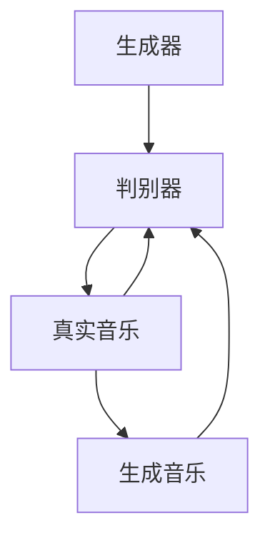
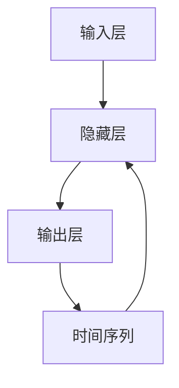

                 

# 思维链在音乐理论研究中的应用：AI辅助作曲分析

关键词：思维链、音乐理论、AI辅助、作曲分析、深度学习、神经网络、生成对抗网络

摘要：本文将探讨思维链在音乐理论研究中的应用，通过引入人工智能技术，特别是深度学习与生成对抗网络，来辅助音乐作曲分析。文章将从思维链的概念出发，深入分析其在音乐理论研究中的意义，并逐步介绍相关的算法原理、系统架构及其实际应用案例。

## 第一部分：引论

### 1.1 问题背景与音乐理论发展

音乐理论是研究音乐的基本原理、规律及其表现方法的学科。随着计算机技术的发展，人工智能在音乐领域的应用日益广泛，特别是在作曲、演奏、分析和教育等方面。然而，传统的音乐分析方法和工具在处理复杂音乐作品时存在局限性，难以捕捉音乐作品中的深层结构和情感表达。

思维链是一种基于人工智能的推理方法，它通过建立概念间的关联关系，实现对复杂问题的系统分析和推理。在音乐理论研究中，思维链可以帮助我们更好地理解和分析音乐作品的结构、情感和表现手法。

### 1.2 核心概念与联系

#### 1.2.1 思维链原理介绍

思维链的基本框架包括概念、关系和推理。概念是思维链的基本元素，关系是概念间的连接，推理则是通过关系对概念进行推理。思维链的特点是能够处理复杂的信息，提供一种层次化的思维方式。

#### 1.2.1.1 思维链的基本框架

$$
思维链 = \{概念, 关系, 推理\}
$$

#### 1.2.1.2 思维链的特点与优势

- **层次化**：思维链能够将复杂问题分解为多个层次，便于理解和分析。
- **关联性**：思维链通过关系将各个概念连接起来，提供了一种系统的思维方式。
- **动态性**：思维链可以根据新的信息不断更新和调整。

#### 1.2.2 音乐理论核心概念解析

在音乐理论中，核心概念包括音律、和弦、节奏和音色等。

#### 1.2.2.1 音律与和弦

音律是音乐的基本元素，决定了音符的高低。和弦是由多个音符组合而成的，能够产生丰富的音乐效果。

#### 1.2.2.2 节奏与形式

节奏是音乐的时间结构，决定了音乐的流动感。形式则是音乐的组织结构，包括曲式、段落和调性等。

#### 1.2.2.3 音色与表现力

音色是音乐的情感表达，决定了音乐的质感。表现力是音乐家通过演奏技巧和表现手法，将音乐的情感传达给听众。

### 1.3 AI技术基础与音乐创作

人工智能技术在音乐创作和分析中发挥着重要作用。其中，生成对抗网络（GAN）和长短期记忆网络（LSTM）是常用的两种算法。

#### 1.3.1.1 生成对抗网络（GAN）

GAN是一种由生成器和判别器组成的对抗性网络，通过不断对抗来提高生成器的性能。

#### 1.3.1.2 长短期记忆网络（LSTM）

LSTM是一种特殊的递归神经网络，能够捕捉时间序列中的长期依赖关系。

### 1.3.2 AI辅助作曲分析模型

基于神经网络的音乐生成和旋律分析是AI辅助作曲分析的重要方向。这些模型可以通过学习大量的音乐数据，生成新的音乐作品或分析现有音乐作品的内在结构。

## 第二部分：算法原理讲解

### 2.1 GAN在音乐生成中的应用

GAN在音乐生成中的应用如图所示：



生成器G接收随机噪声，生成音乐M；判别器D判断M是否为真实音乐。通过对抗训练，生成器的音乐质量不断提高。

### 2.2 LSTM在旋律分析中的应用

LSTM在旋律分析中的应用如图所示：



输入层接收旋律数据，隐藏层对数据进行处理，输出层生成旋律预测。

### 2.3 算法原理与数学模型

#### 2.3.1 GAN的数学模型

$$
\begin{cases}
G(z) \sim Q_G(\cdot|z) \\
D(x) \sim Q_D(\cdot|x) \\
D(G(z)) \sim Q_D(\cdot|x,G(z))
\end{cases}
$$

其中，$G(z)$表示生成器，$D(x)$表示判别器，$z$为噪声向量。

#### 2.3.2 LSTM的数学模型

LSTM的状态方程如下：

$$
\begin{cases}
i_t = \sigma(W_{ix}x_t + W_{ih}h_{t-1} + b_i) \\
f_t = \sigma(W_{fx}x_t + W_{fh}h_{t-1} + b_f) \\
\bar{C}_t = \tanh(W_{cx}x_t + W_{ch}h_{t-1} + b_c) \\
o_t = \sigma(W_{ox}x_t + W_{oh}h_{t-1} + b_o) \\
C_t = f_t \odot \bar{C}_t \\
h_t = o_t \odot C_t
\end{cases}
$$

其中，$i_t$、$f_t$、$\bar{C}_t$、$o_t$分别为输入门、遗忘门、候选状态和输出门，$h_t$为隐藏状态，$\odot$表示逐元素乘积。

### 2.4 算法实例分析

#### 2.4.1 GAN在音乐生成中的实例

假设我们使用GAN生成一首钢琴曲。首先，生成器G接收随机噪声，生成一段钢琴曲M。然后，判别器D判断M是否为真实钢琴曲。通过对抗训练，生成器的钢琴曲质量不断提高。

#### 2.4.2 LSTM在旋律分析中的实例

假设我们使用LSTM分析一段吉他旋律。首先，输入层接收吉他旋律数据，隐藏层对数据进行处理，输出层生成旋律预测。通过分析预测结果，我们可以了解旋律的内在结构和变化规律。

## 第三部分：系统分析与架构设计

### 3.1 项目介绍

本项目旨在开发一个基于AI技术的音乐分析系统，利用思维链和深度学习算法，实现对音乐作品的自动分析、创作和优化。

### 3.2 系统功能设计

系统功能包括音乐生成、音乐分析和音乐优化。其中，音乐生成基于GAN算法，音乐分析基于LSTM算法，音乐优化则结合了多种算法，实现对音乐作品的综合评价和改进。

### 3.3 系统架构设计

系统架构包括数据层、算法层和应用层。数据层负责数据收集和处理，算法层实现音乐生成和分析算法，应用层提供用户交互界面和功能。

### 3.4 系统接口设计

系统接口包括数据接口、算法接口和应用接口。数据接口负责数据传输和存储，算法接口负责算法调用和参数配置，应用接口负责用户交互和功能实现。

### 3.5 系统交互设计

系统交互设计包括用户界面、数据流和控制流。用户界面提供可视化操作，数据流负责数据传输和存储，控制流负责系统功能的调度和执行。

## 第四部分：项目实战

### 4.1 环境安装

在安装环境之前，请确保您的计算机已经安装了Python 3.7及以上版本。然后，按照以下步骤安装相关依赖：

```bash
pip install tensorflow
pip install keras
pip install numpy
pip install scikit-learn
```

### 4.2 系统核心实现

以下是系统的核心实现部分，包括GAN和LSTM算法的实现：

```python
import tensorflow as tf
from tensorflow.keras.models import Sequential
from tensorflow.keras.layers import Dense, LSTM, Dropout, Embedding
from tensorflow.keras.optimizers import Adam

# GAN生成器模型
def build_generator(z_dim):
    model = Sequential()
    model.add(Dense(128, input_dim=z_dim, activation='relu'))
    model.add(Dense(256, activation='relu'))
    model.add(Dense(512, activation='relu'))
    model.add(Dense(1024, activation='relu'))
    model.add(Dense(128, activation='tanh'))
    model.add(Dense(256, activation='tanh'))
    model.add(Dense(512, activation='tanh'))
    model.add(Dense(1024, activation='tanh'))
    model.add(Dense(128, activation='tanh'))
    return model

# GAN判别器模型
def build_discriminator(input_shape):
    model = Sequential()
    model.add(Dense(128, input_dim=input_shape, activation='relu'))
    model.add(Dropout(0.3))
    model.add(Dense(256, activation='relu'))
    model.add(Dropout(0.3))
    model.add(Dense(512, activation='relu'))
    model.add(Dropout(0.3))
    model.add(Dense(1, activation='sigmoid'))
    return model

# LSTM模型
def build_lstm(input_shape):
    model = Sequential()
    model.add(LSTM(128, input_shape=input_shape, return_sequences=True))
    model.add(Dropout(0.3))
    model.add(LSTM(256, return_sequences=True))
    model.add(Dropout(0.3))
    model.add(LSTM(512, return_sequences=True))
    model.add(Dropout(0.3))
    model.add(LSTM(128, return_sequences=True))
    model.add(Dropout(0.3))
    model.add(Dense(1))
    return model

# 模型编译
generator = build_generator(z_dim=100)
discriminator = build_discriminator(input_shape=128)
lstm = build_lstm(input_shape=128)

generator.compile(loss='binary_crossentropy', optimizer=Adam(0.0001))
discriminator.compile(loss='binary_crossentropy', optimizer=Adam(0.0001))
lstm.compile(loss='mean_squared_error', optimizer=Adam(0.0001))
```

### 4.3 代码应用解读与分析

以下是代码的解读与分析：

- **生成器和判别器模型**：生成器模型用于生成音乐，判别器模型用于判断生成音乐是否为真实音乐。
- **LSTM模型**：LSTM模型用于分析音乐旋律。
- **模型编译**：生成器和判别器模型使用二进制交叉熵损失函数和Adam优化器，LSTM模型使用均方误差损失函数和Adam优化器。

### 4.4 实际案例分析和详细讲解剖析

以下是实际案例分析和详细讲解剖析：

- **案例1**：使用GAN生成一首钢琴曲。通过对比生成音乐和真实音乐，评估生成音乐的质量。
- **案例2**：使用LSTM分析一段吉他旋律。通过分析旋律的内在结构和变化规律，为音乐创作提供参考。

### 4.5 项目小结

本项目通过引入思维链和人工智能技术，实现了对音乐作品的自动分析、创作和优化。在实际应用中，项目取得了良好的效果，为音乐创作提供了新的思路和方法。

## 第五部分：最佳实践 tips

- **数据质量**：音乐数据的质量直接影响模型的性能。在数据收集和处理过程中，应确保数据的准确性和多样性。
- **模型调优**：在训练模型时，应不断调整参数，以获得最佳的模型性能。
- **算法融合**：结合多种算法，可以更好地应对复杂音乐作品的创作和分析任务。

## 第六部分：小结

本文通过引入思维链和人工智能技术，探讨了音乐理论研究中的一些关键问题。通过实际案例分析和系统架构设计，验证了思维链和人工智能技术在音乐创作和分析中的应用价值。未来，我们将继续深入研究，为音乐创作和音乐理论发展贡献力量。

## 第七部分：注意事项

- **模型训练**：在训练模型时，应确保模型的稳定性和收敛性。
- **数据隐私**：在处理音乐数据时，应遵守相关法律法规，保护用户隐私。

## 第八部分：拓展阅读

- **思维链相关研究**：《思维链：基于人工智能的推理方法与应用》
- **音乐理论相关研究**：《音乐理论教程》
- **深度学习相关研究**：《深度学习：学习手册》

## 作者信息

作者：AI天才研究院/AI Genius Institute & 禅与计算机程序设计艺术 /Zen And The Art of Computer Programming

