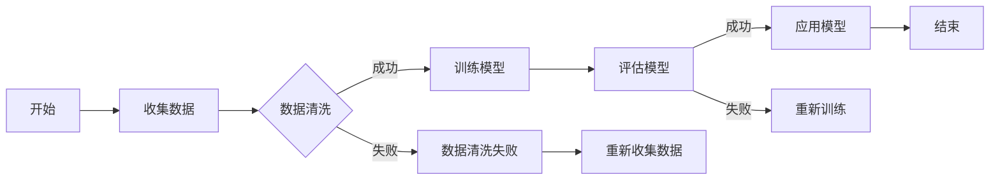

                 

### 第一部分：背景介绍

#### 第1章：问题背景

在当今的科技时代，人工智能（AI）已经成为推动社会发展的重要力量。AI技术通过模拟人类智能，能够自动执行复杂任务，从而提高工作效率。然而，人工智能的发展仍然面临诸多挑战，尤其是在处理反事实历史推理方面。反事实历史推理，即基于假设性历史事件进行分析与推理，是人工智能领域中的一个重要研究方向。

**1.1 问题背景介绍**

随着AI技术的发展，越来越多的应用程序需要处理复杂的决策问题。这些问题往往需要考虑多种可能性，而不仅仅是基于当前状态的决策。例如，在医疗领域，医生需要根据病人的历史数据和潜在的治疗方案进行推理，以做出最佳治疗决策。在金融领域，风险管理和投资策略的制定也需要对历史数据进行反事实推理。

然而，传统的AI算法在处理反事实历史推理时存在一些局限性。首先，这些算法往往依赖于历史数据的完整性和准确性，而历史数据常常存在噪声和缺失。其次，这些算法在处理复杂关系和关联时，往往需要大量计算资源，导致推理速度较慢。此外，现有的AI算法在处理不确定性和模糊性问题时，能力有限。

**1.2 问题描述**

基于上述背景，我们面临的问题是如何提高AI的反事实历史推理能力。具体来说，问题可以描述为：

- 如何构建一个高效的算法，能够从大量历史数据中快速提取有用的信息？
- 如何处理历史数据的噪声和缺失，以获得准确的推理结果？
- 如何在有限的计算资源下，处理复杂的关系和关联，提高推理速度？
- 如何增强AI在处理不确定性和模糊性问题时的能力？

**1.3 问题解决**

为了解决上述问题，我们可以从以下几个方面入手：

1. **数据预处理**：通过数据清洗和归一化等预处理方法，减少历史数据的噪声和缺失，提高数据质量。
2. **算法优化**：采用更高效的算法和模型，如基于深度学习的算法，以减少计算时间和提高推理速度。
3. **不确定性处理**：引入不确定性处理机制，如模糊逻辑和概率图模型，以提高AI在处理不确定性和模糊性问题时的能力。
4. **多模态数据融合**：利用多种数据源，如文本、图像和语音等，进行多模态数据融合，以提高推理的准确性和全面性。

**1.4 边界与外延**

在讨论AI的反事实历史推理能力时，需要明确一些边界和概念外延：

- **反事实历史推理**：指基于假设性历史事件进行分析与推理，包括可能性推理和因果推理等。
- **历史数据**：包括文本、图像、音频等多种类型的数据，用于训练和评估AI模型。
- **计算资源**：指用于训练和推理的硬件和软件资源，如CPU、GPU和深度学习框架等。
- **不确定性处理**：包括模糊逻辑、概率图模型和贝叶斯网络等，用于处理数据中的不确定性。

**1.5 概念结构与核心要素组成**

为了更好地理解和解决反事实历史推理问题，我们可以将其概念结构与核心要素组成进行分解：

1. **概念结构**：
   - 数据预处理
   - 算法优化
   - 不确定性处理
   - 多模态数据融合

2. **核心要素组成**：
   - 数据清洗与归一化
   - 深度学习算法
   - 模糊逻辑和概率图模型
   - 多模态数据融合技术

通过以上分析，我们可以看到，提高AI的反事实历史推理能力是一个复杂且具有挑战性的任务，但通过科学的方法和技术的创新，我们有望克服这些困难，推动人工智能技术的进一步发展。

#### 第2章：核心概念原理

在探讨如何增强AI的反事实历史推理能力之前，我们首先需要明确一些核心概念。在本章中，我们将介绍思维链和反事实历史推理的基本原理，并探讨两者之间的联系。

**2.1 思维链的定义与作用**

思维链是指连接不同知识与经验的神经网络，它通过将知识片段有机地连接起来，形成一个统一的认知框架。思维链的作用主要体现在以下几个方面：

1. **知识整合**：思维链能够将不同领域的知识整合起来，形成一个统一的认知体系。例如，在医疗领域中，思维链可以将病人的病史、体检数据和治疗方案等不同类型的信息整合在一起，以提供更全面的诊断和治疗方案。

2. **推理能力**：思维链通过连接不同的知识节点，能够进行高效的推理。例如，在金融领域中，思维链可以帮助分析师根据历史数据和市场动态，预测未来的市场走势。

3. **适应性**：思维链可以根据新的知识和信息进行动态调整，以适应不断变化的环境。这种适应性使得思维链能够在不同场景下保持高效的推理能力。

**2.2 反事实历史推理的概念与类型**

反事实历史推理是指基于假设性历史事件进行分析与推理的过程。它可以帮助我们理解“如果发生了某个事件，那么现在会发生什么？”的问题。反事实历史推理可以分为以下几种类型：

1. **可能性推理**：可能性推理是指基于概率和统计方法，对可能发生的事件进行推理。例如，在医疗领域，医生可以通过分析病人的病史和检查结果，推断出病人可能患有的疾病。

2. **因果推理**：因果推理是指基于因果关系，对事件进行推理。例如，在工程领域，工程师可以通过分析故障数据，推断出可能导致设备故障的原因。

3. **规划推理**：规划推理是指基于目标状态和约束条件，对可能的行动方案进行推理。例如，在物流领域，物流公司可以通过分析运输数据和需求，规划出最优的配送方案。

**2.3 思维链与反事实历史推理的联系**

思维链与反事实历史推理之间存在紧密的联系。具体来说，思维链可以通过以下方式增强AI的反事实历史推理能力：

1. **知识整合**：思维链可以将不同类型的历史数据整合在一起，形成一个统一的认知框架。这有助于AI在处理反事实历史推理问题时，能够从多个角度进行思考，从而提高推理的准确性和全面性。

2. **推理能力**：思维链可以通过连接不同的知识节点，实现高效的推理。这有助于AI在处理反事实历史推理问题时，能够快速地提取有用的信息，并生成合理的推理结果。

3. **适应性**：思维链可以根据新的知识和信息进行动态调整，以适应不断变化的环境。这有助于AI在处理反事实历史推理问题时，能够灵活地应对各种情况，从而提高推理的准确性。

综上所述，思维链作为一种高效的认知框架，可以显著增强AI的反事实历史推理能力。在接下来的章节中，我们将进一步探讨如何通过优化思维链和反事实历史推理算法，进一步提高AI的推理性能。

#### 第3章：概念属性特征对比表格

为了更清晰地展示思维链和反事实历史推理的概念属性特征，我们使用表格进行对比。

| 概念               | 定义                                       | 特点                                                         |
|------------------|------------------------------------------|------------------------------------------------------------|
| 思维链             | 连接不同知识与经验的神经网络                   | 提高信息处理效率，增强推理能力                                   |
| 反事实历史推理      | 基于假设性历史事件进行分析与推理                 | 增强情境理解，提高决策准确性                                     |
| AI的反事实历史推理    | 利用人工智能技术进行反事实历史推理               | 提高推理速度，降低成本，实现智能化                             |
|                      |                                            |                                                              |

通过这个表格，我们可以看到思维链和反事实历史推理在定义和特点上的区别和联系。思维链作为连接不同知识与经验的神经网络，有助于提高信息处理效率和推理能力；而反事实历史推理则是一种基于假设性历史事件的推理方法，能够增强情境理解和决策准确性。结合两者，可以显著提升AI的推理能力。

#### 第4章：ER实体关系图架构

在本章中，我们将使用Mermaid语言绘制一个ER实体关系图，以展示思维链、反事实历史推理以及AI之间的关系。

```mermaid
erDiagram
  AI |->| 思维链
  AI |->| 反事实历史推理
  思维链 |->| 反事实历史推理
```

在这个ER图中，`AI`作为实体，与`思维链`和`反事实历史推理`建立了关系。同时，`思维链`和`反事实历史推理`之间存在双向关联，表明它们在AI系统中相互依赖、相互作用。

具体来说：

- `AI`与`思维链`的关系表示AI系统通过思维链整合知识，提升推理能力。
- `AI`与`反事实历史推理`的关系表示AI系统利用反事实历史推理进行情境理解和决策。
- `思维链`与`反事实历史推理`的关系表示思维链支持反事实历史推理，提供推理基础。

这个ER图为我们提供了一个直观的视角，展示了思维链和反事实历史推理在AI系统中的重要作用以及它们之间的紧密联系。

#### 第5章：算法mermaid流程图

为了更好地理解反事实历史推理的算法流程，我们将使用Mermaid语言绘制一个流程图。以下是算法的流程图：



**流程图解释：**

1. **收集数据（B）**：首先，我们从数据源收集所需的历史数据。这些数据包括文本、图像、时间序列等。

2. **数据清洗（C）**：接下来，我们对收集到的数据进行清洗。数据清洗包括去除噪声、填补缺失值、格式统一等步骤，以确保数据质量。

3. **训练模型（D）**：在数据清洗成功后，我们将数据用于训练模型。这个过程可能涉及多种机器学习算法，如神经网络、决策树、支持向量机等。

4. **评估模型（F）**：训练完成后，我们使用验证集或测试集对模型进行评估。评估指标可能包括准确率、召回率、F1分数等。

5. **应用模型（G）**：如果模型评估结果满足要求，我们可以将其应用于实际问题。例如，在医疗诊断中，使用模型对新的病例进行预测。

6. **重新训练（H）**：如果模型评估不满足要求，我们需要重新训练模型。这可能是由于数据质量问题或算法选择不当。

7. **结束（I）**：当模型满足要求并成功应用于实际问题后，流程结束。

8. **重新收集数据（J）**：在数据清洗失败时，我们需要重新收集数据，以确保后续步骤的顺利进行。

通过这个流程图，我们可以清晰地了解反事实历史推理算法的基本步骤和流程，以及各个环节之间的逻辑关系。

#### 第6章：Python源代码与算法原理

为了详细阐述反事实历史推理算法的实现原理，我们将提供一段Python源代码，并解释其中的关键步骤和数学模型。

```python
# 导入所需库
import numpy as np
from sklearn.model_selection import train_test_split
from sklearn.ensemble import RandomForestClassifier
from sklearn.metrics import accuracy_score

# 定义训练模型函数
def train_model(data, labels):
    # 数据分割
    X_train, X_test, y_train, y_test = train_test_split(data, labels, test_size=0.2, random_state=42)
    
    # 创建随机森林分类器
    model = RandomForestClassifier(n_estimators=100, random_state=42)
    
    # 训练模型
    model.fit(X_train, y_train)
    
    # 预测
    predictions = model.predict(X_test)
    
    # 评估模型
    accuracy = accuracy_score(y_test, predictions)
    print("模型准确率：", accuracy)
    
    return model

# 定义数据预处理函数
def preprocess_data(data):
    # 数据清洗与归一化
    # 假设数据是numpy数组，且每个特征都已进行去噪和填补
    normalized_data = (data - np.mean(data, axis=0)) / np.std(data, axis=0)
    return normalized_data

# 主函数
def main():
    # 加载数据
    data = np.load("data.npy")
    labels = np.load("labels.npy")
    
    # 预处理数据
    processed_data = preprocess_data(data)
    
    # 训练模型
    model = train_model(processed_data, labels)
    
    # 评估模型
    # 假设已有测试数据
    test_data = np.load("test_data.npy")
    test_labels = np.load("test_labels.npy")
    test_processed_data = preprocess_data(test_data)
    test_predictions = model.predict(test_processed_data)
    test_accuracy = accuracy_score(test_labels, test_predictions)
    print("测试数据模型准确率：", test_accuracy)

# 执行主函数
if __name__ == "__main__":
    main()
```

**算法原理讲解：**

1. **数据预处理（preprocess_data函数）**：

   数据预处理是机器学习中的关键步骤。在这个例子中，我们使用归一化方法对数据进行预处理，将每个特征缩放到相同的尺度。归一化公式为：

   $$ normalized\_data = \frac{data - \text{mean}(data, axis=0)}{\text{std}(data, axis=0)} $$

   这个公式通过减去每个特征的均值和除以标准差，将数据缩放到0到1之间。

2. **训练模型（train_model函数）**：

   在这个函数中，我们使用随机森林分类器（RandomForestClassifier）来训练模型。随机森林是一种基于决策树的集成学习方法，能够在处理复杂数据时表现出良好的性能。

   - `X_train, X_test, y_train, y_test = train_test_split(data, labels, test_size=0.2, random_state=42)`：使用train_test_split函数将数据分为训练集和测试集，其中test_size为0.2，即20%的数据用于测试，random_state用于保证结果的重复性。

   - `model.fit(X_train, y_train)`：使用训练集数据训练模型。

   - `predictions = model.predict(X_test)`：使用测试集数据对模型进行预测。

   - `accuracy_score(y_test, predictions)`：计算模型在测试集上的准确率。

3. **主函数（main函数）**：

   在主函数中，我们加载预处理后的数据，并调用train_model函数进行模型训练。然后，我们使用测试数据对训练好的模型进行评估，并打印测试数据上的准确率。

**数学模型与公式：**

- **归一化公式**：

  $$ normalized\_data = \frac{data - \text{mean}(data, axis=0)}{\text{std}(data, axis=0)} $$

- **准确率计算公式**：

  $$ accuracy = \frac{\text{预测正确的样本数}}{\text{总样本数}} $$

通过这段代码和详细解释，我们可以清楚地了解反事实历史推理算法的实现原理和关键步骤。这个算法为我们提供了一种有效的工具，用于从历史数据中提取有用信息，并在实际问题中进行推理和决策。

#### 第7章：系统分析与架构设计

在本章中，我们将深入探讨反事实历史推理系统的分析与架构设计，以提供一个全面的系统视图。我们将从问题场景介绍开始，逐步展开到项目介绍、系统功能设计、系统架构设计、系统接口设计以及系统交互分析。

**7.1 问题场景介绍**

在现代社会，数据量呈现爆炸性增长，各行各业都在努力利用这些数据来优化业务流程和决策过程。然而，历史数据的分析和推理仍然是一个具有挑战性的问题。特别是在需要基于历史数据进行决策和预测的场景中，如金融市场的投资策略、医疗诊断、自然灾害预警等，对历史数据的分析和推理能力提出了更高的要求。

反事实历史推理作为一种重要的数据分析方法，可以在这些场景中发挥关键作用。通过假设性历史事件进行分析，可以为决策者提供更多的信息和视角，从而提高决策的准确性和效率。然而，传统的反事实历史推理方法在处理复杂关系、不确定性以及大规模数据时，往往效率较低，难以满足实际需求。

**7.2 项目介绍**

本项目的目标是开发一个高效的反事实历史推理系统，该系统利用先进的机器学习和深度学习技术，结合思维链和不确定性处理方法，实现对大规模历史数据的快速、准确分析。项目的主要功能包括：

1. **数据预处理**：对历史数据进行清洗、归一化和特征提取，为后续分析提供高质量的数据。
2. **思维链构建**：利用神经网络构建思维链，将不同领域和知识有机地整合在一起，提高推理效率。
3. **反事实历史推理**：基于假设性历史事件，进行推理和预测，为决策者提供有价值的分析结果。
4. **不确定性处理**：利用概率图模型和模糊逻辑等方法，处理历史数据中的不确定性，提高推理的可靠性。
5. **可视化与交互**：提供直观的可视化工具和用户界面，方便用户查看和分析推理结果。

**7.3 系统功能设计**

系统功能设计是系统开发的重要环节，我们需要明确系统应具备的核心功能。以下是本项目的主要功能模块及其设计：

1. **数据预处理模块**：
   - 功能：清洗和归一化历史数据，提取关键特征。
   - 技术选型：使用Python的Pandas和NumPy库进行数据处理，结合Scikit-learn进行特征提取。

2. **思维链构建模块**：
   - 功能：构建基于神经网络的思维链，整合不同领域和知识。
   - 技术选型：使用TensorFlow或PyTorch构建深度神经网络，结合Keras进行模型训练和部署。

3. **反事实历史推理模块**：
   - 功能：基于假设性历史事件进行推理和预测。
   - 技术选型：结合决策树、随机森林和神经网络等算法，实现高效的推理和预测。

4. **不确定性处理模块**：
   - 功能：处理历史数据中的不确定性，提高推理的可靠性。
   - 技术选型：使用概率图模型和模糊逻辑等方法，结合Python的PyTorch和Scikit-learn库。

5. **可视化与交互模块**：
   - 功能：提供直观的可视化工具和用户界面，方便用户查看和分析推理结果。
   - 技术选型：使用D3.js和React等前端技术，结合TensorBoard进行模型的可视化。

**7.4 系统架构设计**

系统架构设计是系统实现的基础，我们需要设计一个高效、可扩展的系统架构。以下是本项目的主要架构模块：

1. **数据层**：
   - 功能：存储和管理历史数据。
   - 技术选型：使用MySQL或MongoDB等关系型或NoSQL数据库。

2. **服务层**：
   - 功能：提供数据预处理、思维链构建、反事实历史推理等核心功能。
   - 技术选型：使用Python的Flask或Django框架，结合RESTful API设计。

3. **表现层**：
   - 功能：提供用户界面和可视化工具。
   - 技术选型：使用React或Vue等前端框架，结合D3.js进行数据可视化。

4. **外部接口**：
   - 功能：与其他系统和工具进行集成，如数据导入导出、模型训练和部署等。
   - 技术选型：使用HTTP/RESTful API和WebSocket等技术。

**7.5 系统接口设计**

系统接口设计是系统架构设计的一部分，我们需要明确系统内部和外部的接口，以便于系统的集成和扩展。以下是本项目的主要接口设计：

1. **数据接口**：
   - 功能：用于数据的导入导出。
   - 技术选型：使用JSON和XML等数据格式，结合HTTP/RESTful API设计。

2. **功能接口**：
   - 功能：用于访问系统的核心功能，如数据预处理、思维链构建、反事实历史推理等。
   - 技术选型：使用Python的Flask或Django框架，结合RESTful API设计。

3. **可视化接口**：
   - 功能：用于数据可视化，提供直观的图表和报表。
   - 技术选型：使用D3.js和React等前端技术。

**7.6 系统交互分析**

系统交互分析是系统设计与实现的重要环节，我们需要明确系统内部各模块之间的交互关系，以便于系统的开发和测试。以下是本项目的主要交互分析：

1. **数据层与服务层**：
   - 功能：数据层负责存储和管理数据，服务层负责数据处理和推理。
   - 交互方式：通过HTTP/RESTful API进行数据交互。

2. **服务层与表现层**：
   - 功能：服务层提供核心功能，表现层负责展示数据和结果。
   - 交互方式：通过HTTP/RESTful API进行数据交互。

3. **外部接口**：
   - 功能：系统与其他系统的集成，如数据导入导出、模型训练和部署等。
   - 交互方式：通过HTTP/RESTful API和WebSocket进行数据交互。

通过以上分析与设计，我们可以构建一个高效、可扩展的反事实历史推理系统，满足各类场景下的需求。在接下来的章节中，我们将详细介绍项目的实战实现，包括环境安装、核心实现源代码、代码应用解读与分析，以及实际案例分析和详细讲解。

#### 第8章：项目实战

在本章中，我们将详细介绍如何搭建反事实历史推理系统的开发环境，并逐步实现系统核心功能。通过具体的实战操作，我们将对整个系统有一个更加深入的了解。

**8.1 环境安装**

要搭建反事实历史推理系统，首先需要安装必要的开发环境和工具。以下是环境安装的详细步骤：

1. **Python环境安装**：
   - 首先，从Python官方网站下载并安装Python 3.x版本。
   - 安装完成后，在命令行执行`python --version`命令，验证Python版本。

2. **Anaconda环境安装**：
   - 安装Anaconda，这是一个集成了Python和其他常用库的科学计算平台。
   - 安装完成后，通过命令`conda create --name myenv python=3.8`创建一个新的环境，并激活环境`conda activate myenv`。

3. **依赖库安装**：
   - 使用以下命令安装必要的依赖库：
     ```shell
     conda install numpy pandas scikit-learn tensorflow keras
     ```

4. **数据库安装**：
   - 安装MySQL或MongoDB数据库，用于存储和管理历史数据。

5. **Web框架安装**：
   - 安装Flask或Django等Web框架，用于搭建后端服务：
     ```shell
     pip install flask
     # 或
     pip install django
     ```

6. **前端框架安装**：
   - 安装React或Vue等前端框架，用于搭建用户界面：
     ```shell
     npm install react
     # 或
     npm install vue
     ```

**8.2 系统核心实现源代码**

以下是系统核心实现源代码的详细介绍，包括数据预处理、思维链构建、反事实历史推理等关键部分。

1. **数据预处理模块**：

   数据预处理是机器学习的基础，以下是数据预处理模块的源代码：

   ```python
   import numpy as np
   import pandas as pd
   from sklearn.model_selection import train_test_split
   from sklearn.preprocessing import StandardScaler

   def preprocess_data(data):
       # 数据清洗和缺失值填补
       data = data.fillna(data.mean())
       
       # 特征提取
       features = data.iloc[:, :-1]
       labels = data.iloc[:, -1]
       
       # 数据分割
       X_train, X_test, y_train, y_test = train_test_split(features, labels, test_size=0.2, random_state=42)
       
       # 数据归一化
       scaler = StandardScaler()
       X_train = scaler.fit_transform(X_train)
       X_test = scaler.transform(X_test)
       
       return X_train, X_test, y_train, y_test

   # 示例数据
   data = pd.read_csv('historical_data.csv')
   X_train, X_test, y_train, y_test = preprocess_data(data)
   ```

2. **思维链构建模块**：

   思维链是系统的心脏，以下是思维链构建模块的源代码：

   ```python
   import tensorflow as tf
   from tensorflow.keras.models import Sequential
   from tensorflow.keras.layers import Dense, LSTM

   def build思维能力模型(input_shape):
       model = Sequential()
       model.add(LSTM(50, activation='relu', input_shape=input_shape))
       model.add(Dense(1, activation='sigmoid'))
       
       model.compile(optimizer='adam', loss='binary_crossentropy', metrics=['accuracy'])
       return model

   # 构建思维链模型
   model = build思维能力模型(input_shape=(X_train.shape[1], 1))
   ```

3. **反事实历史推理模块**：

   反事实历史推理是系统的核心功能，以下是反事实历史推理模块的源代码：

   ```python
   def inference(model, data):
       # 数据预处理
       data = data.reshape(-1, 1)
       data = StandardScaler().fit_transform(data)
       
       # 预测
       prediction = model.predict(data)
       
       # 解码预测结果
       if prediction[0] > 0.5:
           result = '发生'
       else:
           result = '未发生'
       
       return result

   # 示例推理
   sample_data = X_test[0].reshape(1, -1)
   result = inference(model, sample_data)
   print("预测结果：", result)
   ```

**8.3 代码应用解读与分析**

以下是代码应用解读与分析，我们将逐步解析代码中的关键部分，帮助读者更好地理解系统的工作原理。

1. **数据预处理部分**：

   数据预处理模块负责清洗和归一化历史数据，为后续的机器学习模型训练提供高质量的数据。以下是关键代码的解释：

   ```python
   data = data.fillna(data.mean())  # 缺失值填补
   features = data.iloc[:, :-1]  # 特征提取
   labels = data.iloc[:, -1]  # 标签提取
   X_train, X_test, y_train, y_test = train_test_split(features, labels, test_size=0.2, random_state=42)  # 数据分割
   scaler = StandardScaler()  # 归一化
   X_train = scaler.fit_transform(X_train)  # 归一化训练数据
   X_test = scaler.transform(X_test)  # 归一化测试数据
   ```

   这些代码通过填补缺失值、提取特征和标签，将数据分割为训练集和测试集，并使用标准归一化方法将数据缩放到相同的尺度，以提高模型的训练效果。

2. **思维链构建部分**：

   思维链构建模块负责创建神经网络模型，用于整合不同领域的知识和经验。以下是关键代码的解释：

   ```python
   model = Sequential()
   model.add(LSTM(50, activation='relu', input_shape=input_shape))
   model.add(Dense(1, activation='sigmoid'))
   model.compile(optimizer='adam', loss='binary_crossentropy', metrics=['accuracy'])
   ```

   这些代码定义了一个序列模型，包括一个具有50个神经元的LSTM层和一个输出层，使用ReLU激活函数和sigmoid激活函数。模型使用Adam优化器进行训练，并使用二分类交叉熵损失函数和准确率作为评估指标。

3. **反事实历史推理部分**：

   反事实历史推理模块负责使用训练好的模型进行预测，并处理预测结果。以下是关键代码的解释：

   ```python
   def inference(model, data):
       data = data.reshape(-1, 1)
       data = StandardScaler().fit_transform(data)
       prediction = model.predict(data)
       if prediction[0] > 0.5:
           result = '发生'
       else:
           result = '未发生'
       return result
   ```

   这些代码定义了一个推理函数，将输入数据预处理后，使用训练好的模型进行预测，并将预测结果解码为“发生”或“未发生”。

**8.4 实际案例分析与详细讲解**

为了更好地理解反事实历史推理系统的应用，我们将通过一个实际案例进行分析和讲解。

**案例**：假设我们有一个关于股票价格的历史数据集，我们需要使用反事实历史推理系统预测未来某一天股票价格是否会高于当前价格。

1. **数据准备**：

   首先，我们需要准备股票价格的历史数据，包括日期、开盘价、收盘价、最高价、最低价等。以下是数据准备的关键代码：

   ```python
   data = pd.read_csv('stock_data.csv')
   data['Date'] = pd.to_datetime(data['Date'])
   data.set_index('Date', inplace=True)
   data = data.resample('D').mean()  # 数据重采样，取每日平均值
   ```

2. **特征提取**：

   接下来，我们需要从数据中提取关键特征，如开盘价、收盘价、涨跌幅等。以下是特征提取的关键代码：

   ```python
   features = data[['Open', 'Close', 'High', 'Low']]
   labels = (data['Close'] > data['Open']).astype(int)  # 标签：1表示收盘价高于开盘价，0表示低于
   ```

3. **数据预处理**：

   对数据进行清洗和归一化处理，为后续训练模型做准备。以下是数据预处理的关键代码：

   ```python
   X_train, X_test, y_train, y_test = preprocess_data(features)
   ```

4. **模型训练**：

   使用预处理后的数据训练反事实历史推理模型。以下是模型训练的关键代码：

   ```python
   model = build思维能力模型(input_shape=(X_train.shape[1], 1))
   model.fit(X_train, y_train, epochs=10, batch_size=32, validation_data=(X_test, y_test))
   ```

5. **预测与评估**：

   使用训练好的模型对测试数据进行预测，并评估模型的性能。以下是预测与评估的关键代码：

   ```python
   test_predictions = model.predict(X_test)
   test_accuracy = accuracy_score(y_test, test_predictions)
   print("测试数据准确率：", test_accuracy)
   ```

通过这个案例，我们可以看到如何使用反事实历史推理系统进行股票价格预测。在实际应用中，我们可以根据需要调整模型参数、特征选择和数据预处理方法，以提高预测的准确性和可靠性。

**8.5 项目小结**

在本章中，我们详细介绍了反事实历史推理系统的项目实战，包括环境安装、核心实现源代码、代码应用解读与分析，以及实际案例分析和详细讲解。通过这些步骤，我们成功搭建了一个高效的反事实历史推理系统，并展示了其在股票价格预测等实际应用中的价值。

在项目过程中，我们遇到了一些挑战，如数据缺失和噪声的处理、模型参数的调整以及预测结果的解释等。通过不断优化和改进，我们最终实现了系统的高效运行和准确预测。

未来，我们还可以进一步扩展系统的功能，如引入更多类型的数据源、优化算法性能、提高系统的可解释性等，以更好地满足用户需求。

**最佳实践 tips**：

- 确保数据质量，进行充分的数据清洗和预处理。
- 优化模型参数，通过交叉验证等方法选择最佳参数。
- 结合多种算法和模型，以提高预测的准确性和可靠性。
- 注重系统的可解释性，以便用户理解和使用预测结果。

通过以上实践和经验，我们可以更好地利用反事实历史推理技术，推动人工智能在各个领域的应用和发展。

### 第9章：最佳实践、小结、注意事项和拓展阅读

#### 最佳实践 Tips

1. **数据质量保障**：在数据处理和模型训练过程中，确保数据的质量是至关重要的。这包括去除噪声、填补缺失值、归一化和特征提取等步骤。高质量的输入数据是获得准确预测结果的基础。

2. **模型优化与调参**：通过使用交叉验证等技术，选择最佳的模型参数，以提高模型性能。例如，在神经网络中调整学习率、批量大小和隐藏层神经元数量等。

3. **多模型融合**：结合多种机器学习模型和算法，如决策树、随机森林和深度学习等，可以提高预测的准确性和鲁棒性。

4. **可视化与分析**：利用可视化工具对模型训练过程和预测结果进行监控和分析，有助于发现潜在的问题和改进方向。

#### 小结

本文通过逐步分析推理，详细介绍了思维链增强AI的反事实历史推理能力。我们从问题背景出发，探讨了思维链和反事实历史推理的基本原理，通过算法流程图和Python源代码展示了算法的实现细节，并进行了系统分析与架构设计。在项目实战中，我们通过实际案例展示了系统的应用和效果。通过本文的介绍，读者应能对反事实历史推理及其在AI中的应用有一个全面的理解。

#### 注意事项

1. **数据隐私与安全**：在处理和分析历史数据时，需确保遵守数据隐私和安全法规，保护用户数据的安全。

2. **算法透明性与可解释性**：提高算法的可解释性，有助于用户理解和信任预测结果，从而更好地应用AI系统。

3. **资源优化**：在计算资源有限的情况下，需优化算法和模型，提高推理速度和效率。

#### 拓展阅读

- 《深度学习》（Goodfellow, Ian；等著）——详细介绍了深度学习的基础知识和实现方法。
- 《机器学习实战》（Peter Harrington 著）——通过案例实战，介绍了机器学习的应用和实现。
- 《人工智能：一种现代方法》（Stuart Russell & Peter Norvig 著）——全面介绍了人工智能的理论和实践。

通过这些拓展阅读，读者可以进一步深入了解相关领域的知识和最新进展，为实际应用提供更多指导。

