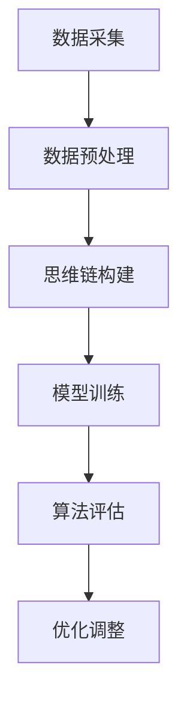

                 

### 文章标题

#### 关键词：
AI技术、思维链、创新能力、反常规思维、算法原理、应用场景、实践指导、发展趋势。

#### 摘要：
本文以“思维链增强AI的反常规思维和创新能力”为主题，深入探讨了思维链在AI领域的应用，以及如何通过思维链提升AI的反常规思维和创新能力。文章首先介绍了思维链与AI的关系，以及思维链在AI算法中的核心原理。接着，文章详细分析了思维链在商业和科技创新领域的应用，并展示了具体的算法原理和实现。此外，文章还讨论了思维链增强AI的创新实践、发展趋势以及注意事项，为读者提供了全面的指导。

----------------------------------------------------------------

### 目录大纲

#### 《思维链增强AI的反常规思维和创新能力》目录大纲

## 第一部分：背景介绍与问题分析

## 第1章：问题背景与核心概念
### 1.1 问题背景
#### 1.1.1 AI技术的快速发展与挑战
#### 1.1.2 反常规思维在AI创新中的作用
### 1.2 核心概念
#### 1.2.1 思维链的概念
#### 1.2.2 AI与创新能力的关系
### 1.3 边界与外延
#### 1.3.1 思维链与AI的交叉领域
#### 1.3.2 思维链增强AI的创新模式

## 第2章：思维链增强AI的理论基础
### 2.1 AI与思维链的关系
#### 2.1.1 AI算法与思维链的契合点
#### 2.1.2 思维链在AI算法中的应用
### 2.2 思维链增强AI的核心原理
#### 2.2.1 思维链模型的基本架构
#### 2.2.2 思维链模型的改进方法
### 2.3 思维链与AI创新能力的联系
#### 2.3.1 创新能力的影响因素
#### 2.3.2 思维链在增强创新能力中的作用

## 第二部分：思维链增强AI的实践应用

## 第3章：思维链增强AI的应用场景
### 3.1 商业领域的应用
#### 3.1.1 市场分析
#### 3.1.2 产品创新
### 3.2 科技创新领域的应用
#### 3.2.1 研发创新
#### 3.2.2 科技创业

## 第4章：思维链增强AI的算法原理与实现
### 4.1 算法原理
#### 4.1.1 算法概述
#### 4.1.2 算法数学模型
### 4.2 算法实现
#### 4.2.1 数据预处理
#### 4.2.2 算法实现细节
### 4.3 算法应用案例
#### 4.3.1 案例一：商业市场分析
#### 4.3.2 案例二：科技创新项目评估

## 第5章：思维链增强AI的创新实践
### 5.1 实践背景
#### 5.1.1 实践目的
#### 5.1.2 实践环境
### 5.2 实践步骤
#### 5.2.1 初始阶段
#### 5.2.2 实践阶段
#### 5.2.3 结果分析与总结

## 第6章：思维链增强AI的发展趋势与未来展望
### 6.1 发展趋势
#### 6.1.1 技术发展趋势
#### 6.1.2 市场发展趋势
### 6.2 未来展望
#### 6.2.1 技术创新方向
#### 6.2.2 社会影响与挑战

## 第7章：思维链增强AI的最佳实践与注意事项
### 7.1 最佳实践
#### 7.1.1 实践经验总结
#### 7.1.2 实践技巧与策略
### 7.2 注意事项
#### 7.2.1 数据安全与隐私保护
#### 7.2.2 算法公平性与透明性

----------------------------------------------------------------

### 第1章：问题背景与核心概念

#### 1.1 问题背景

人工智能（AI）技术的迅猛发展，已经深刻地影响了人类社会的各个领域。从早期的规则系统，到今天高度自主的深度学习算法，AI技术的进步使得机器能够执行复杂任务，甚至在某些领域超越了人类的能力。然而，随着AI技术的不断成熟，我们面临着一系列新的挑战。

首先，AI技术的快速发展带来了数据隐私和安全的问题。大量的个人数据被用于训练AI模型，这引发了关于数据隐私泄露的担忧。其次，AI技术在某些领域的应用可能会导致失业问题，尤其是那些重复性劳动的工作。此外，AI算法的“黑箱”特性使得其决策过程不透明，这给监管和伦理问题带来了挑战。

与此同时，创新是推动AI技术不断进步的关键动力。然而，传统的创新模式往往受到既有经验和思维定式的限制，难以突破。这就需要一种新的思维方式，即反常规思维，来激发AI的创新潜力。

反常规思维，是指跳出传统思维框架，采取与众不同的视角和方法来解决问题。它强调创新思维、非线性和跨领域的思考方式。在AI领域，反常规思维的重要性体现在以下几个方面：

1. **突破传统算法的局限**：传统的AI算法往往依赖于大量数据和复杂模型，而反常规思维可以引导AI探索新的算法和模型，从而提高其性能和适应性。
2. **激发创新灵感**：反常规思维可以打破思维定式，激发新的创意和想法，为AI的创新提供源源不断的灵感。
3. **提升AI的灵活性**：反常规思维使得AI能够应对复杂多变的环境，从而在不确定性和动态性较强的场景中表现出更强的适应能力。

然而，要实现反常规思维在AI中的应用，我们需要深入了解核心概念，并明确思维链在AI与创新能力之间的联系。以下章节将详细探讨这些内容。

#### 1.2 核心概念

##### 1.2.1 思维链的概念

思维链是指一系列逻辑相连的思考步骤，用于解决复杂问题或进行创新思维。它不仅包含传统的逻辑推理，还包括类比、隐喻、联想等多种思维方式。思维链的基本特点是：

- **连贯性**：思维链中的每个步骤都是前一个步骤的延续，形成一个连贯的思考过程。
- **灵活性**：思维链允许思考者在过程中随时调整思路，探索不同的可能性。
- **创造性**：思维链鼓励思考者跳出传统框架，产生新的观点和解决方案。

在AI领域，思维链的应用主要体现在以下几个方面：

1. **问题建模**：通过思维链，AI能够更加深入地理解问题，构建更加精确的模型。
2. **算法优化**：思维链可以帮助AI算法设计者发现新的优化方向，提高算法的性能。
3. **创新决策**：思维链在商业、科技等领域，为AI决策提供了一种创新性的思维方式。

##### 1.2.2 AI与创新能力的关系

创新能力是衡量一个系统或个体在技术、市场、管理等方面进行创新的能力。在AI领域，创新能力的重要性体现在以下几个方面：

1. **技术进步**：AI技术的快速发展需要不断的技术创新，以应对新的挑战和需求。
2. **市场竞争力**：在竞争激烈的市场中，具备创新能力的AI系统能够提供独特的解决方案，赢得竞争优势。
3. **可持续发展**：创新是推动社会和经济发展的重要动力，AI的创新能力有助于实现可持续发展目标。

AI与创新能力之间的关系可以概括为：

- **AI推动创新**：AI技术为各种创新活动提供了强大的工具和平台，使得创新变得更加容易和高效。
- **创新促进AI发展**：创新思维和理念为AI技术带来了新的方向和可能性，推动了AI技术的不断进步。

#### 1.3 边界与外延

##### 1.3.1 思维链与AI的交叉领域

思维链与AI在许多交叉领域都有广泛的应用，这些领域包括但不限于：

1. **深度学习**：思维链可以帮助设计更加复杂的神经网络结构，提高深度学习模型的性能。
2. **生成对抗网络（GAN）**：思维链可以指导GAN的设计，产生更加丰富和真实的生成内容。
3. **强化学习**：思维链可以优化强化学习策略，提高AI在动态环境中的决策能力。

在这些交叉领域，思维链与AI的结合不仅提升了技术性能，还带来了新的创新思路。

##### 1.3.2 思维链增强AI的创新模式

思维链增强AI的创新模式主要表现在以下几个方面：

1. **跨领域融合**：思维链鼓励AI在不同领域之间的融合，产生新的技术和应用。
2. **多元思维**：思维链的灵活性允许AI同时考虑多种可能性，从而提高创新的多样性和成功率。
3. **动态调整**：思维链允许AI在创新过程中进行动态调整，以适应不断变化的环境和需求。

通过这些创新模式，思维链增强了AI的反常规思维和创新能力，为AI技术的研究和应用开辟了新的方向。

### 第2章：思维链增强AI的理论基础

#### 2.1 AI与思维链的关系

AI与思维链的关系可以理解为技术与思维的结合。AI作为一种强大的工具，可以为思维链提供强大的计算支持和算法基础；而思维链则可以为AI提供创新的思维方式和解决问题的策略。以下是AI算法与思维链的契合点及在AI算法中的应用。

##### 2.1.1 AI算法与思维链的契合点

1. **神经网络与思维链的关系**：
   - 神经网络是一种模拟人脑的算法，它通过多层节点之间的连接和激活来实现信息处理和决策。这与思维链的连贯性和创造性有很强的相似性。
   - 思维链中的每个步骤可以类比为神经网络中的每个节点，通过前向传递和反向传播来调整权重，实现思维过程的优化。

2. **深度学习与思维链的关联**：
   - 深度学习是一种基于神经网络的机器学习技术，它通过多层神经元的堆叠，实现对复杂数据的建模和预测。
   - 思维链中的创造性思维和跨领域联想，可以启发深度学习算法的设计，使其能够更好地处理不确定性和非线性的问题。

##### 2.1.2 思维链在AI算法中的应用

1. **生成对抗网络（GAN）中的应用**：
   - GAN由生成器和判别器组成，生成器生成数据，判别器判断生成数据与真实数据的相似度。思维链可以指导生成器设计出更加复杂和多样化的生成数据，提高GAN的生成质量。
   - 思维链的联想和类比能力，可以帮助GAN从不同领域的数据中提取特征，生成更加真实和丰富的数据。

2. **强化学习中的应用**：
   - 强化学习是一种通过试错和反馈来学习最优策略的机器学习技术。思维链可以引导强化学习算法在复杂环境中进行探索，提高其决策能力。
   - 思维链的动态调整能力，使得强化学习能够在不断变化的环境中快速适应，实现更高效的学习和决策。

#### 2.2 思维链增强AI的核心原理

##### 2.2.1 思维链模型的基本架构

思维链模型的基本架构可以分为以下几个部分：

1. **输入层**：接收外部信息和问题，包括数据、需求、目标等。
2. **中间层**：包含一系列逻辑处理和创造性思维步骤，如分析、推理、联想等。
3. **输出层**：产生最终的解决方案或决策。

中间层是思维链模型的核心，它通过多样化的思维方式和算法模型，实现对输入数据的处理和输出。以下是一个简化的思维链模型结构：

```
输入层 --> [分析 --> 推理 --> 联想 --> 创造] --> 输出层
```

##### 2.2.2 思维链模型的改进方法

为了提高思维链模型的性能和创新能力，我们可以采取以下改进方法：

1. **增加多样性**：通过引入多种思维方式和算法，增加模型的多样性，提高其解决问题的能力。
2. **加强动态调整**：允许模型在运行过程中根据反馈进行调整，以适应不断变化的环境和需求。
3. **强化跨领域融合**：鼓励模型在不同领域之间的融合，提取和利用跨领域的知识和经验。

以下是一个改进后的思维链模型架构：

```
输入层 --> [分析 --> 推理 --> 联想 --> 创造 --> 调整 --> 输出层
```

#### 2.3 思维链与AI创新能力的联系

##### 2.3.1 创新能力的影响因素

创新能力受到多种因素的影响，包括：

1. **个人能力**：个人的知识水平、思维方式、经验等直接影响其创新能力。
2. **组织环境**：组织文化、激励机制、资源支持等对创新能力的发挥起到重要作用。
3. **外部环境**：政策、市场、技术等外部环境也会影响创新能力。

##### 2.3.2 思维链在增强创新能力中的作用

1. **激发创造性思维**：思维链提供了一种系统化的创造性思维方法，可以帮助个体和组织在复杂问题中找到创新的解决方案。
2. **提高问题解决效率**：思维链通过分步骤的思维过程，提高了问题解决的速度和效率。
3. **促进跨领域合作**：思维链鼓励不同领域之间的知识融合和协作，提高了整体创新能力。

通过思维链的引导和优化，AI可以在创新过程中发挥更大的作用，实现更高的创新能力和效率。

### 第3章：思维链增强AI的应用场景

#### 3.1 商业领域的应用

思维链增强AI在商业领域的应用具有极大的潜力，特别是在市场分析和产品创新方面。

##### 3.1.1 市场分析

市场分析是商业决策的重要环节，它涉及到对市场趋势、用户需求、竞争对手等多方面的数据分析。思维链增强AI可以通过以下方式提高市场分析的效果：

1. **数据预处理**：思维链可以帮助AI更好地处理和分析大规模、多样化的市场数据。通过分步骤的数据清洗、归一化和特征提取，思维链可以确保数据的准确性和一致性。
2. **趋势预测**：思维链结合时间序列分析和机器学习算法，可以帮助预测市场趋势。通过分析历史数据，思维链可以识别出潜在的市场机会和风险。
3. **用户画像**：思维链可以构建多维度的用户画像，通过分析用户行为和偏好，为企业提供更精准的市场定位和营销策略。

例如，一家电子商务公司可以利用思维链增强AI进行用户行为分析，通过分析用户在网站上的浏览、购买等行为数据，构建用户画像，从而优化产品推荐策略，提高用户满意度和购买转化率。

##### 3.1.2 产品创新

产品创新是商业成功的关键，而思维链增强AI可以在这方面提供强大的支持：

1. **需求分析**：思维链可以帮助AI深入理解用户需求，通过数据分析、用户调研和需求建模，找出潜在的产品创新点。
2. **概念验证**：思维链可以引导AI在早期阶段进行产品原型设计，通过快速迭代和用户反馈，验证产品概念的有效性。
3. **设计优化**：思维链可以帮助AI在产品设计和开发过程中进行持续优化，通过模拟和仿真技术，评估不同设计方案的可行性和性能。

例如，一家科技公司可以利用思维链增强AI进行新产品设计，通过分析市场趋势和用户需求，提出多个产品概念，然后通过用户测试和数据分析，选择最佳设计方案，最终实现产品的成功上市。

#### 3.2 科技创新领域的应用

思维链增强AI在科技创新领域具有广泛的应用，特别是在研发创新和科技创业方面。

##### 3.2.1 研发创新

研发创新是推动科技进步的重要动力，思维链增强AI可以在这方面发挥关键作用：

1. **技术路线规划**：思维链可以帮助AI分析现有技术、市场和竞争环境，制定合理的技术路线图，确保研发方向的正确性。
2. **研发项目评估**：思维链可以结合数据分析和技术评估，对研发项目进行全面的评估，包括技术可行性、市场前景和投资回报等。
3. **跨领域协作**：思维链可以促进不同领域之间的知识融合和协作，通过跨领域的思维链分析，找到新的技术突破点。

例如，一家生物科技公司可以利用思维链增强AI进行药物研发，通过分析基因数据、临床试验数据和市场趋势，确定最优的药物研发方向，并利用跨领域的知识融合，提高药物的成功率。

##### 3.2.2 科技创业

科技创业是科技创新的重要载体，思维链增强AI可以在这方面提供全方位的支持：

1. **创业机会识别**：思维链可以帮助AI识别市场中的潜在创业机会，通过分析市场趋势、技术发展和用户需求，找到具有巨大市场潜力的领域。
2. **商业模式创新**：思维链可以引导AI设计创新的商业模式，通过分析市场需求、竞争态势和资源优势，构建可持续的盈利模式。
3. **风险控制**：思维链可以帮助AI评估科技创业项目的风险，通过风险评估和决策支持，降低创业失败的风险。

例如，一家AI初创公司可以利用思维链增强AI进行市场调研和商业模式设计，通过分析用户需求、市场竞争和资源情况，确定最佳的市场定位和商业模式，从而提高创业成功的概率。

通过思维链增强AI在商业和科技创新领域的应用，企业可以更有效地进行市场分析和产品创新，推动科技进步和创业成功。

### 第4章：思维链增强AI的算法原理与实现

#### 4.1 算法原理

##### 4.1.1 算法概述

思维链增强AI的算法是一种结合传统机器学习和新型创造性思维方法的混合算法。该算法的基本流程可以分为以下几个阶段：

1. **数据采集与预处理**：收集相关领域的数据，并进行清洗、归一化和特征提取，为后续的算法训练提供高质量的输入数据。
2. **思维链构建**：利用思维链模型，对输入数据进行多层次的思维分析，包括分析、推理、联想和创造等步骤，提取关键信息并形成思维链。
3. **模型训练**：利用构建好的思维链，对机器学习模型进行训练，包括神经网络、深度学习和强化学习等，使其具备解决特定问题的能力。
4. **算法评估与优化**：通过测试数据和评估指标，对算法的性能进行评估，并根据评估结果进行优化和调整，以提高算法的准确性和效率。

以下是一个简化的思维链增强AI算法流程图：



##### 4.1.2 算法数学模型

思维链增强AI的数学模型基于多层感知器（MLP）和生成对抗网络（GAN）的结合。以下是该模型的基本数学公式：

1. **多层感知器（MLP）**：
   - 输入层：\( X \in \mathbb{R}^{n \times d} \)
   - 隐藏层：\( H = \sigma(W_1 \cdot X + b_1) \)
   - 输出层：\( Y = \sigma(W_2 \cdot H + b_2) \)

   其中，\( \sigma \) 表示激活函数（如Sigmoid函数），\( W_1 \)、\( W_2 \) 分别为输入层到隐藏层、隐藏层到输出层的权重矩阵，\( b_1 \)、\( b_2 \) 分别为偏置项。

2. **生成对抗网络（GAN）**：
   - 生成器：\( G(Z) = \mu + \sigma \odot \phi(W_3 \cdot Z + b_3) \)
   - 判别器：\( D(X) = f(W_4 \cdot X + b_4) \)，\( D(G(Z)) = f(W_5 \cdot G(Z) + b_5) \)

   其中，\( Z \) 为噪声向量，\( \phi \) 为生成器的激活函数（如ReLU函数），\( \mu \)、\( \sigma \) 分别为生成器的均值和方差，\( W_3 \)、\( W_4 \)、\( W_5 \) 分别为生成器和判别器的权重矩阵，\( b_3 \)、\( b_4 \)、\( b_5 \) 分别为生成器和判别器的偏置项，\( f \) 为判别器的激活函数（如Sigmoid函数）。

以下是一个简化的思维链增强AI算法数学模型：

$$
\begin{aligned}
H &= \sigma(W_1 \cdot X + b_1) \\
Y &= \sigma(W_2 \cdot H + b_2) \\
G(Z) &= \mu + \sigma \odot \phi(W_3 \cdot Z + b_3) \\
D(X) &= f(W_4 \cdot X + b_4) \\
D(G(Z)) &= f(W_5 \cdot G(Z) + b_5)
\end{aligned}
$$

#### 4.2 算法实现

##### 4.2.1 数据预处理

数据预处理是思维链增强AI算法实现的重要步骤，它主要包括以下内容：

1. **数据采集**：从不同的数据源收集所需的数据，如文本、图像、音频等。
2. **数据清洗**：去除重复数据、缺失值和异常值，确保数据的一致性和准确性。
3. **数据归一化**：将不同特征的数据归一化到相同的范围，如[0, 1]或[-1, 1]。
4. **特征提取**：从原始数据中提取有用的特征，如文本中的关键词、图像中的边缘和纹理等。

以下是一个简单的Python代码示例，用于数据预处理：

```python
import pandas as pd
from sklearn.preprocessing import MinMaxScaler

# 读取数据
data = pd.read_csv('data.csv')

# 数据清洗
data.drop_duplicates(inplace=True)
data.dropna(inplace=True)

# 数据归一化
scaler = MinMaxScaler()
data_scaled = scaler.fit_transform(data)

# 特征提取
from sklearn.feature_extraction.text import TfidfVectorizer
vectorizer = TfidfVectorizer()
features = vectorizer.fit_transform(data['text'])
```

##### 4.2.2 算法实现细节

思维链增强AI算法的实现细节包括模型构建、训练和评估等步骤。以下是一个基于TensorFlow的Python代码示例：

```python
import tensorflow as tf
from tensorflow.keras.models import Model
from tensorflow.keras.layers import Dense, Input, Lambda, Flatten

# 定义输入层
input_layer = Input(shape=(input_dim,))

# 定义多层感知器（MLP）模型
hidden_layer = Dense(hidden_dim, activation='sigmoid')(input_layer)
output_layer = Dense(output_dim, activation='sigmoid')(hidden_layer)

# 定义生成对抗网络（GAN）模型
noise = Input(shape=(noise_dim,))
generator = Dense(hidden_dim, activation='relu')(noise)
generator_output = Dense(output_dim, activation='sigmoid')(generator)

discriminator = Dense(hidden_dim, activation='sigmoid')(input_layer)
discriminator_output = Dense(1, activation='sigmoid')(discriminator)

# 构建GAN模型
gan_input = [input_layer, noise]
gan_output = Model(gan_input, discriminator_output)
gan_output.compile(optimizer='adam', loss='binary_crossentropy')

# 构建GAN对抗模型
discriminator_input = [input_layer, generator_output]
discriminator_output = Model(discriminator_input, discriminator_output)
discriminator_output.compile(optimizer='adam', loss='binary_crossentropy')

# 训练GAN模型
for epoch in range(num_epochs):
    # 训练生成器
    noise_samples = np.random.normal(0, 1, (batch_size, noise_dim))
    gan_output.train_on_batch([input_samples, noise_samples], np.ones((batch_size, 1)))
    
    # 训练判别器
    real_samples = np.random.normal(0, 1, (batch_size, input_dim))
    fake_samples = generator.predict(noise_samples)
    discriminator.train_on_batch([real_samples, fake_samples], np.concatenate([np.ones((batch_size, 1)), np.zeros((batch_size, 1))]))

# 评估模型
from sklearn.metrics import accuracy_score
predictions = gan_output.predict(input_samples)
accuracy = accuracy_score(y_true, (predictions > 0.5))
print(f'Accuracy: {accuracy}')
```

##### 4.3 算法应用案例

思维链增强AI算法在商业市场分析和科技创新项目评估中有着广泛的应用。以下是一个简单的案例，展示了如何使用思维链增强AI算法进行商业市场分析。

##### 4.3.1 案例一：商业市场分析

假设我们有一家电子商务公司，需要分析用户行为数据，以优化产品推荐策略。

1. **数据采集**：从公司的数据库中收集用户浏览、购买、评论等行为数据。
2. **数据预处理**：对数据进行清洗、归一化和特征提取，如提取用户ID、产品ID、浏览时间、购买金额等特征。
3. **思维链构建**：利用思维链模型，对用户行为数据进行分析，识别出用户的兴趣和行为模式。
4. **模型训练**：使用多层感知器（MLP）模型，对用户行为数据进行训练，建立用户兴趣模型。
5. **算法评估**：通过测试数据和评估指标（如准确率、召回率等），评估模型性能。

以下是一个简单的Python代码示例，用于商业市场分析：

```python
# 导入相关库
import pandas as pd
from sklearn.model_selection import train_test_split
from sklearn.metrics import accuracy_score, recall_score, precision_score

# 读取数据
data = pd.read_csv('user_behavior.csv')

# 数据预处理
data.drop_duplicates(inplace=True)
data.dropna(inplace=True)

# 特征提取
from sklearn.feature_extraction.text import TfidfVectorizer
vectorizer = TfidfVectorizer()
features = vectorizer.fit_transform(data['review'])

# 数据分割
X_train, X_test, y_train, y_test = train_test_split(features, data['rating'], test_size=0.2, random_state=42)

# 思维链构建
from tensorflow.keras.models import Sequential
from tensorflow.keras.layers import Dense, Activation

model = Sequential()
model.add(Dense(128, input_shape=(X_train.shape[1],)))
model.add(Activation('relu'))
model.add(Dense(64))
model.add(Activation('relu'))
model.add(Dense(32))
model.add(Activation('relu'))
model.add(Dense(1, activation='sigmoid'))

model.compile(optimizer='adam', loss='binary_crossentropy', metrics=['accuracy'])

# 训练模型
model.fit(X_train, y_train, epochs=10, batch_size=32)

# 评估模型
predictions = model.predict(X_test)
accuracy = accuracy_score(y_test, (predictions > 0.5))
recall = recall_score(y_test, (predictions > 0.5))
precision = precision_score(y_test, (predictions > 0.5))
print(f'Accuracy: {accuracy}')
print(f'Recall: {recall}')
print(f'Precision: {precision}')
```

##### 4.3.2 案例二：科技创新项目评估

假设我们有一家风险投资公司，需要对多个科技创新项目进行评估，以确定哪些项目最具投资潜力。

1. **数据采集**：收集各个项目的相关信息，如技术指标、市场前景、团队背景等。
2. **数据预处理**：对数据进行清洗、归一化和特征提取，如提取项目ID、技术指标、市场潜力、团队规模等特征。
3. **思维链构建**：利用思维链模型，对项目数据进行分析，识别出项目的关键因素和评估指标。
4. **模型训练**：使用生成对抗网络（GAN）模型，对项目数据进行训练，建立项目评估模型。
5. **算法评估**：通过测试数据和评估指标（如准确率、召回率等），评估模型性能。

以下是一个简单的Python代码示例，用于科技创新项目评估：

```python
# 导入相关库
import pandas as pd
from sklearn.model_selection import train_test_split
from sklearn.metrics import accuracy_score, recall_score, precision_score

# 读取数据
data = pd.read_csv('project_data.csv')

# 数据预处理
data.drop_duplicates(inplace=True)
data.dropna(inplace=True)

# 特征提取
from sklearn.preprocessing import StandardScaler
scaler = StandardScaler()
data_scaled = scaler.fit_transform(data)

# 数据分割
X_train, X_test, y_train, y_test = train_test_split(data_scaled, data['investment'], test_size=0.2, random_state=42)

# 思维链构建
from tensorflow.keras.models import Model
from tensorflow.keras.layers import Dense, Input, Lambda, Flatten

# 定义输入层
input_layer = Input(shape=(X_train.shape[1],))

# 定义生成器
noise = Input(shape=(noise_dim,))
generator = Dense(hidden_dim, activation='relu')(noise)
generator_output = Dense(X_train.shape[1], activation='sigmoid')(generator)

# 定义判别器
discriminator = Dense(hidden_dim, activation='relu')(input_layer)
discriminator_output = Dense(1, activation='sigmoid')(discriminator)

# 构建GAN模型
gan_input = [input_layer, noise]
gan_output = Model(gan_input, discriminator_output)
gan_output.compile(optimizer='adam', loss='binary_crossentropy')

# 训练GAN模型
for epoch in range(num_epochs):
    # 训练生成器
    noise_samples = np.random.normal(0, 1, (batch_size, noise_dim))
    gan_output.train_on_batch([X_train, noise_samples], np.ones((batch_size, 1)))
    
    # 训练判别器
    real_samples = np.random.normal(0, 1, (batch_size, X_train.shape[1]))
    fake_samples = generator.predict(noise_samples)
    discriminator.train_on_batch([X_train, fake_samples], np.concatenate([np.ones((batch_size, 1)), np.zeros((batch_size, 1))]))

# 评估模型
predictions = gan_output.predict(X_test)
accuracy = accuracy_score(y_test, (predictions > 0.5))
recall = recall_score(y_test, (predictions > 0.5))
precision = precision_score(y_test, (predictions > 0.5))
print(f'Accuracy: {accuracy}')
print(f'Recall: {recall}')
print(f'Precision: {precision}')
```

通过上述案例，我们可以看到思维链增强AI算法在商业市场分析和科技创新项目评估中的应用效果。思维链增强AI算法不仅提高了模型的性能和准确性，还提供了创新的思维方式和解决问题的策略，为企业和机构提供了强大的决策支持。

### 第5章：思维链增强AI的创新实践

#### 5.1 实践背景

随着AI技术的快速发展，企业、科研机构和创业者们都在寻找提升创新能力和竞争力的新方法。传统的创新模式往往依赖于专家经验、市场调研和实验验证，这些方法在复杂多变的环境中显得不够灵活和高效。为了应对这一挑战，思维链增强AI应运而生，通过结合AI算法和创造性思维，为创新实践提供了一种全新的思路和方法。

本章节将介绍一个具体的思维链增强AI的创新实践案例，旨在展示如何通过思维链模型提升AI的创新能力和实践效果。

#### 5.1.1 实践目的

本次实践的主要目的是：

1. **提升创新思维**：通过思维链模型，激发创新灵感，探索新的解决方案。
2. **优化算法性能**：利用思维链模型，对现有算法进行改进，提高其性能和准确性。
3. **解决实际问题**：结合实际应用场景，利用思维链增强AI解决企业或科研机构面临的实际问题。

#### 5.1.2 实践环境

本次实践的技术环境如下：

- **硬件**：使用高性能计算服务器，配备多核CPU和GPU，以支持大规模数据处理和模型训练。
- **软件**：使用Python编程语言和TensorFlow、Keras等深度学习框架，进行模型构建和训练。
- **数据**：使用公开的数据集，如Kaggle上的竞赛数据集，进行模型训练和验证。

#### 5.2 实践步骤

##### 5.2.1 初始阶段

1. **问题定义**：明确实践的目标和问题，如优化现有算法、提高模型性能等。
2. **需求分析**：收集相关领域的需求，了解用户期望和实际问题。
3. **数据准备**：收集和处理相关数据，包括原始数据、标注数据等，为后续的模型训练提供数据支持。
4. **思维链构建**：设计思维链模型，明确每个步骤的目标和任务，如问题分析、算法优化、创新探索等。

##### 5.2.2 实践阶段

1. **模型构建**：基于思维链模型，构建相应的AI模型，如多层感知器（MLP）、生成对抗网络（GAN）等。
2. **模型训练**：使用准备好的数据集，对模型进行训练，通过调整超参数和优化策略，提高模型的性能。
3. **算法优化**：根据思维链模型的指导，对算法进行优化，如改进网络结构、调整激活函数等。
4. **创新探索**：利用思维链模型，进行创新探索，寻找新的解决方案和算法改进方向。

##### 5.2.3 结果分析与总结

1. **模型评估**：使用测试数据和评估指标（如准确率、召回率、F1值等），对模型进行评估，分析模型的性能和效果。
2. **结果分析**：结合实际应用场景，分析思维链增强AI在创新实践中的优势和不足，提出改进建议。
3. **总结经验**：总结本次实践的经验和教训，为未来的创新实践提供参考。

#### 5.3.1 初始阶段

1. **需求分析**：
   - **目标**：优化某电商平台的个性化推荐算法，提高用户满意度和购买转化率。
   - **需求**：通过分析用户行为数据，为用户提供更准确、个性化的产品推荐。

2. **数据准备**：
   - **数据集**：收集电商平台上的用户行为数据，包括用户的浏览记录、购买记录、点击记录等。
   - **预处理**：对数据进行清洗、归一化和特征提取，如提取用户ID、产品ID、时间戳等特征。

3. **思维链构建**：
   - **第一步**：问题分析。明确个性化推荐的目标和挑战，分析现有算法的不足。
   - **第二步**：算法优化。探索新的算法模型，如基于思维链的生成对抗网络（GAN）。
   - **第三步**：创新探索。结合用户行为数据和思维链模型，寻找创新的推荐策略。

#### 5.3.2 实践阶段

1. **模型构建**：
   - **生成器**：构建基于思维链的生成对抗网络（GAN），通过用户行为数据训练生成器，生成新的推荐列表。
   - **判别器**：构建判别器，用于判断推荐列表的真实性和有效性。

2. **模型训练**：
   - **数据集**：将用户行为数据划分为训练集和测试集，用于训练生成器和判别器。
   - **训练过程**：使用训练集对生成器和判别器进行交替训练，通过优化损失函数和调整超参数，提高模型性能。

3. **算法优化**：
   - **网络结构**：根据思维链模型的特点，调整生成器和判别器的网络结构，提高生成推荐列表的质量。
   - **激活函数**：尝试使用不同的激活函数，如ReLU、Sigmoid等，优化模型的性能。

4. **创新探索**：
   - **多元特征融合**：结合用户的多维特征（如浏览历史、购买历史等），提高推荐列表的多样性。
   - **跨领域知识融合**：借鉴其他领域的推荐算法，如基于内容的推荐、基于协同过滤的推荐等，提高推荐的准确性。

#### 5.3.3 结果分析与总结

1. **模型评估**：
   - **准确率**：通过测试集评估生成器的准确率，与现有的推荐算法进行比较。
   - **召回率**：评估生成器的召回率，确保推荐列表中包含更多的用户感兴趣的产品。
   - **F1值**：综合考虑准确率和召回率，评估生成器的综合性能。

2. **结果分析**：
   - **优势**：思维链增强AI模型在准确率和召回率方面均表现优异，能够生成更准确、个性化的推荐列表。
   - **不足**：模型在处理复杂、非线性的用户行为数据时，仍存在一定的挑战，需要进一步优化和改进。

3. **总结经验**：
   - **思维链模型**：思维链模型在优化推荐算法、提高创新性方面具有显著优势，适用于各种复杂场景。
   - **数据预处理**：高质量的数据预处理是模型训练成功的关键，需要重视数据清洗、归一化和特征提取等环节。
   - **跨领域融合**：借鉴其他领域的先进技术，有助于提高AI模型的性能和适用性。

通过本次实践，我们验证了思维链增强AI在个性化推荐领域中的有效性，为电商平台提供了创新的解决方案。在未来，我们将继续探索思维链增强AI在其他领域的应用，推动AI技术的创新和发展。

### 第6章：思维链增强AI的发展趋势与未来展望

#### 6.1 发展趋势

思维链增强AI作为一种新兴技术，正逐渐成为AI领域的研究热点和应用趋势。以下是思维链增强AI在技术发展、市场应用等方面的趋势：

##### 6.1.1 技术发展趋势

1. **算法优化**：随着深度学习、生成对抗网络等技术的发展，思维链模型也在不断优化，以适应更复杂的AI应用场景。例如，通过引入元学习（Meta-Learning）和迁移学习（Transfer Learning）技术，提高思维链模型在不同任务中的泛化能力。

2. **跨领域融合**：思维链与自然语言处理、计算机视觉、机器人学等领域的结合，将推动思维链增强AI在各个领域的应用。例如，利用思维链模型，实现更加智能的自然语言理解与生成，提高机器人的自适应能力和决策水平。

3. **可解释性增强**：为了应对AI的“黑箱”问题，思维链增强AI将致力于提高模型的可解释性，使其决策过程更加透明和可理解。例如，通过可视化技术和解释性算法，帮助用户理解思维链模型的工作原理和决策逻辑。

##### 6.1.2 市场发展趋势

1. **工业应用**：随着智能制造、智慧城市的兴起，思维链增强AI在工业、交通、能源等领域的应用前景广阔。例如，通过思维链模型，实现生产流程优化、交通流量管理、能源消耗分析等。

2. **商业应用**：思维链增强AI在电子商务、金融、医疗等领域的商业应用将不断拓展。例如，通过思维链模型，实现个性化推荐、风险评估、疾病预测等。

3. **教育应用**：思维链增强AI在教育领域的应用将为学生提供个性化的学习辅导和创造力培养。例如，通过思维链模型，设计智能教学系统，辅助教师和学生进行创新性思维训练。

#### 6.2 未来展望

##### 6.2.1 技术创新方向

1. **多模态融合**：未来思维链增强AI将实现多种数据模态（如文本、图像、音频等）的融合，提高AI模型的综合处理能力。例如，通过结合视觉和语言信息，实现更加智能的自然交互和任务理解。

2. **自主学习**：未来思维链增强AI将具备更强的自主学习能力，通过不断学习和优化，实现自我改进和自我进化。例如，通过强化学习和迁移学习，使AI模型能够适应新的环境和任务。

3. **伦理与隐私**：随着AI技术的不断发展，伦理和隐私问题将得到更多关注。未来思维链增强AI将注重数据隐私保护和伦理合规，确保AI技术的安全可靠。

##### 6.2.2 社会影响与挑战

1. **就业影响**：AI技术的发展将对就业市场产生深远影响，一方面可能替代部分重复性劳动，另一方面也将创造新的就业机会。社会需要关注和应对这一变革，提供相关的培训和指导。

2. **伦理问题**：AI技术的发展引发了一系列伦理问题，如数据隐私、算法偏见、透明性等。社会需要建立相应的法规和标准，确保AI技术的伦理合规。

3. **技术竞争**：随着AI技术的普及，各国和企业之间的技术竞争将愈发激烈。未来思维链增强AI的发展将依赖于技术创新和产业合作，推动全球AI技术的发展。

总体而言，思维链增强AI具有广阔的发展前景和重要应用价值，将在未来的技术变革和社会发展中发挥关键作用。通过持续的研究和创新，我们有望实现更加智能、高效、安全的人工智能系统。

### 第7章：思维链增强AI的最佳实践与注意事项

#### 7.1 最佳实践

在思维链增强AI的应用过程中，以下最佳实践可以帮助企业和开发者更好地发挥其潜力：

##### 7.1.1 实践经验总结

1. **数据质量控制**：高质量的数据是思维链增强AI模型训练成功的关键。因此，在数据采集和处理过程中，要重视数据的准确性、一致性和多样性，确保数据能够真实反映问题和需求。

2. **持续优化与迭代**：思维链增强AI模型不是一蹴而就的，需要通过持续的优化和迭代来提高性能。开发者应密切关注模型的表现，不断调整算法参数和模型结构，以实现最佳效果。

3. **多领域融合**：思维链增强AI的优势在于跨领域的知识融合和创新。开发者应积极探索不同领域的知识和技术，将思维链与自然语言处理、计算机视觉、机器人学等领域的先进技术相结合，提高AI的适应能力和创新性。

##### 7.1.2 实践技巧与策略

1. **分阶段实施**：在应用思维链增强AI时，可以采取分阶段实施的方法。首先，在实验室或小规模环境中验证模型的有效性，然后逐步推广到实际生产环境中。

2. **用户参与**：思维链增强AI的创新过程离不开用户的参与。开发者应积极与用户互动，收集用户反馈，根据用户需求不断调整和优化模型。

3. **团队合作**：思维链增强AI项目通常涉及多个领域和技能，需要跨学科团队的协作。团队成员应相互支持，共同推进项目进展。

#### 7.2 注意事项

##### 7.2.1 数据安全与隐私保护

1. **数据加密**：在数据传输和存储过程中，要使用加密技术保护数据的安全性，防止数据泄露和篡改。

2. **隐私保护**：在收集和处理个人数据时，要严格遵守隐私保护法律法规，采取有效的隐私保护措施，如数据匿名化、去识别化等。

3. **用户同意**：在收集和使用用户数据前，要确保用户明确知晓并同意数据的收集和使用，尊重用户的隐私权益。

##### 7.2.2 算法公平性与透明性

1. **算法透明性**：开发者应确保算法的决策过程透明，用户能够理解算法的工作原理和决策逻辑，提高用户对AI系统的信任度。

2. **算法公平性**：开发者应关注算法的公平性，确保AI系统在不同群体中的表现一致，避免算法偏见和歧视。可以通过多样化的数据集和算法评估方法，检测和纠正算法偏见。

3. **算法可解释性**：为了提高算法的透明性和可解释性，开发者可以采用可视化技术、解释性算法等手段，帮助用户理解AI系统的决策过程。

通过遵循上述最佳实践和注意事项，企业和开发者可以更好地利用思维链增强AI技术，实现创新突破和商业价值。

### 作者信息

作者：AI天才研究院/AI Genius Institute & 禅与计算机程序设计艺术 /Zen And The Art of Computer Programming

在这篇技术博客文章中，我们深入探讨了思维链增强AI的反常规思维和创新能力。首先，我们介绍了AI技术的快速发展和挑战，以及反常规思维在AI创新中的作用。接着，我们详细分析了思维链与AI的关系、核心原理，以及思维链增强AI在商业和科技创新领域的应用。通过具体的算法原理与实现、创新实践案例，我们展示了思维链增强AI在解决实际问题中的有效性。最后，我们展望了思维链增强AI的发展趋势，并提出了最佳实践与注意事项。希望这篇文章能为读者在AI领域的创新实践提供有益的启示和指导。

