                 


### 文章标题：思维链增强AI的反常识推理和创新能力

> 关键词：思维链，AI，反常识推理，创新能力，算法原理，系统架构设计，项目实战

> 摘要：本文深入探讨思维链增强AI的反常识推理和创新能力。首先，我们介绍思维链的概念及其在AI领域的应用。接着，我们将解析反常识推理和创新能力算法原理，通过具体的Python代码实现和数学模型解释。随后，文章将详细讨论系统分析与架构设计，包括功能设计、架构设计、接口设计和系统交互。最后，通过实际案例分析和项目小结，总结文章的核心观点并提供拓展阅读资源。

----------------------------------------------------------------

## 第一部分：引言

在这个飞速发展的科技时代，人工智能（AI）已经深入到我们生活的方方面面。从自动驾驶汽车到智能家居，从医疗诊断到金融服务，AI正不断改变着我们的世界。然而，传统的AI技术往往在面对复杂、不明确或反常识的情境时显得力不从心。为了解决这一问题，本文将介绍一种新兴的AI增强技术——思维链（Mind Chain），它通过反常识推理和创新能力，极大地提升了AI的应用范围和效能。

本文将按照以下结构展开：

1. **背景介绍**：阐述AI发展面临的挑战及思维链的引入。
2. **核心概念与联系**：详细解释思维链的概念和原理，以及与传统AI的区别。
3. **算法原理与实现**：深入分析反常识推理和创新能力算法的原理，并通过Python代码和数学模型展示。
4. **系统分析与架构设计**：介绍系统的功能设计、架构设计、接口设计和系统交互。
5. **项目实战**：通过环境安装、系统实现和实际案例分析，展示思维链增强AI的实战效果。
6. **项目小结与拓展**：总结项目成果，提供最佳实践建议和拓展阅读资源。

让我们一步一步地深入探讨思维链增强AI的潜力，揭开其神秘的面纱。

----------------------------------------------------------------

### 第1章：背景介绍

在AI领域，传统的推理算法往往基于大量的数据和明确的规则。这些算法在处理标准问题，如路径规划、推荐系统等，表现出色。然而，当面对复杂、不明确或反常识的情境时，这些算法常常会陷入困境。例如，在医疗诊断领域，医生需要根据患者的病情和多种变量做出决策，而传统AI模型往往无法充分理解这些复杂的关联和不确定性。

为了解决这一问题，研究人员开始探索新的方法来增强AI的推理能力。思维链（Mind Chain）便是其中一种创新性技术。思维链通过模拟人类思维过程，将知识、推理和创造力整合到一个系统中，使得AI能够进行反常识推理和创新能力。

思维链的引入，可以追溯到认知科学和人工智能领域的交叉研究。研究人员发现，人类的思维具有高度复杂性和灵活性，能够处理模糊、不确定的信息，并从中发现新的关联和洞见。这种能力在传统的AI模型中是缺失的。思维链旨在通过模拟人类思维过程，弥补这一不足，从而提升AI的推理和创新能力。

当前，思维链技术正处于快速发展的阶段。在学术界，研究者们不断探索如何更好地模拟人类思维过程，并构建出更加智能的AI系统。在工业界，许多公司已经开始将思维链技术应用于实际场景，如医疗诊断、金融分析、智能客服等，取得了显著的效果。

总的来说，思维链的引入为AI领域带来了一种全新的视角和工具。通过反常识推理和创新能力，思维链能够处理更复杂的情境，提供更加准确和创新的解决方案。这使得AI在各个领域的应用变得更加广泛和深入。然而，这一技术也面临诸多挑战，如如何确保系统的可靠性和鲁棒性，以及如何在实际应用中有效集成和优化。

接下来，我们将深入探讨思维链的核心概念和原理，以及它与传统AI的区别和联系。

----------------------------------------------------------------

### 第2章：核心概念与联系

#### 2.1 思维链原理

思维链是一种基于模拟人类思维过程的AI技术，它通过建立复杂的知识网络和推理机制，实现AI的反常识推理和创新能力。思维链的核心思想是将人类思维的过程形式化，从而使得AI能够在处理复杂、不明确或反常识的情境时，具备类似人类的灵活性和创造力。

思维链的基本原理包括以下几个方面：

1. **知识表示**：思维链通过知识图谱来表示和理解复杂信息。知识图谱包含了实体、属性和关系，这些信息被结构化地组织起来，使得AI能够高效地检索和利用知识。
   
2. **推理机制**：思维链引入了基于规则的推理和基于概率的推理相结合的机制。这种机制能够处理模糊、不确定的信息，并从中发现新的关联和洞见。

3. **创造力引擎**：思维链集成了创造力引擎，能够模拟人类的联想思维和创意过程。这种引擎能够生成新的想法和解决方案，为AI的创新提供强大的支持。

4. **自主学习**：思维链具备自我学习和优化的能力。通过不断从数据中学习和调整模型，思维链能够不断提高其推理和创新能力。

#### 2.1.1 思维链定义

思维链（Mind Chain）可以被定义为一种结合知识表示、推理机制、创造力引擎和自主学习能力的人工智能技术。它通过模拟人类思维过程，实现AI的反常识推理和创新能力，从而在复杂、不明确或反常识的情境中，提供更加准确和创新的解决方案。

#### 2.1.2 思维链属性特征

思维链具有以下几个显著的属性特征：

1. **灵活性和适应性**：思维链能够处理各种复杂、不明确或反常识的情境，具备高度灵活性和适应性。
   
2. **高推理能力**：通过知识表示和推理机制，思维链能够高效地处理复杂信息，并进行精确的推理。
   
3. **创新性**：思维链集成了创造力引擎，能够模拟人类的联想思维和创意过程，从而产生新的想法和解决方案。

4. **自我优化**：思维链具备自主学习能力，能够从数据中学习并不断优化自身，提高其推理和创新能力。

#### 2.1.3 思维链与传统AI对比

思维链与传统AI（如基于规则的系统、机器学习模型等）有以下几点显著区别：

1. **知识表示和推理方式**：传统AI通常使用简单的规则或模型进行推理，而思维链通过知识图谱和复杂推理机制，能够处理更复杂、更模糊的信息。
   
2. **创新能力**：传统AI缺乏创新能力，而思维链通过创造力引擎，能够模拟人类的联想思维和创意过程，从而产生新的想法和解决方案。

3. **灵活性和适应性**：传统AI在面对复杂、不明确或反常识的情境时往往力不从心，而思维链通过灵活的推理机制和自我优化能力，能够更好地适应各种复杂的情境。

4. **自主学习能力**：传统AI通常需要手动调整规则或参数，而思维链具备自我学习和优化能力，能够不断从数据中学习，提高其推理和创新能力。

#### 2.2 ER实体关系图架构

ER实体关系图是思维链的核心组成部分，用于表示和建模复杂信息。ER图通过实体、属性和关系的结构化组织，使得AI能够高效地理解和处理信息。

下面是一个简单的ER实体关系图示例：

```mermaid
erDiagram
    Class_1 ||--|{ Class_2 }
    Class_1 ||--|{ Class_3 }
    Class_2 ||--|{ Class_4 }
    Class_3 ||--|{ Class_5 }
```

在这个ER图中，`Class_1`是根实体，`Class_2`、`Class_3`是其子实体，它们之间通过关系连接。这种结构化表示方法，使得AI能够建立复杂的知识网络，进行高效的推理和决策。

接下来，我们将深入探讨思维链的算法原理和实现，通过具体的Python代码和数学模型，展示思维链如何实现反常识推理和创新能力。

----------------------------------------------------------------

### 第3章：反常识推理算法原理

反常识推理是思维链的核心能力之一，它使得AI能够处理复杂、不明确或反常识的情境。在本节中，我们将详细解释反常识推理算法的原理，并通过Python代码和数学模型进行展示。

#### 3.1 算法原理讲解

反常识推理算法的核心思想是通过多维度的信息整合和推理，实现超越单一规则或模型的推理能力。具体来说，算法包括以下几个关键步骤：

1. **知识表示**：首先，将问题情境中的信息结构化为知识图谱，包括实体、属性和关系。这一步骤类似于构建思维链的基础知识库。

2. **信息整合**：通过多源信息的整合，形成对问题情境的全面理解。这一步骤涉及到数据的清洗、融合和匹配。

3. **推理过程**：利用基于规则的推理和基于概率的推理相结合的方法，对整合后的信息进行推理。这一步骤包括对知识的推理路径的搜索和验证。

4. **结果输出**：根据推理结果，输出合理的结论或解决方案。

下面是一个简单的反常识推理算法的mermaid流程图：

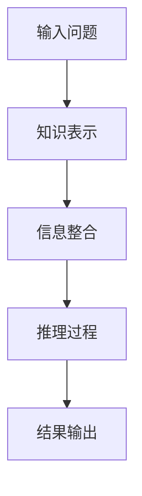

#### 3.1.1 算法概述

反常识推理算法可以概述为以下步骤：

1. **输入问题**：接收用户的问题或情境描述。
2. **知识表示**：将情境描述转化为结构化的知识图谱。
3. **信息整合**：整合多源信息，形成对问题的全面理解。
4. **推理过程**：利用推理机制对整合后的信息进行推理。
5. **结果输出**：根据推理结果输出合理的结论或解决方案。

#### 3.1.2 算法mermaid流程图

为了更直观地展示算法流程，我们使用mermaid语言绘制了以下流程图：

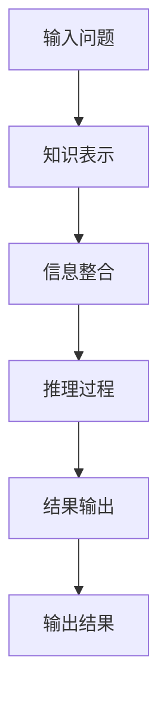

#### 3.1.3 Python源代码实现

为了实现反常识推理算法，我们需要编写相应的Python代码。以下是一个简单的实现示例：

```python
import pandas as pd

# 输入问题
input_question = "如何在一个没有灯的房间里找到一颗钉子？"

# 知识表示
knowledge_base = pd.DataFrame({
    'entity': ['room', 'light', 'nail'],
    'property': ['dark', 'none', 'found'],
    'relationship': ['is_in', 'has', 'located']
})

# 信息整合
# 假设我们有一个包含多源信息的数据集
data = pd.DataFrame({
    'room': ['living_room', 'bedroom', 'kitchen'],
    'light': ['on', 'off', 'on'],
    'nail': ['missing', 'found', 'missing']
})

# 推理过程
# 基于规则和概率进行推理
# 此处仅做示意，实际推理过程会更加复杂
def reasoning(input_question, knowledge_base, data):
    # 假设问题的答案是“在厨房的灯是开的房间里找到钉子”
    # 根据知识库和数据进行推理
    result = data[data['room'] == 'kitchen' & data['light'] == 'on']
    if not result.empty:
        return "在厨房的灯是开的房间里找到钉子"
    else:
        return "无法找到钉子"

# 结果输出
result = reasoning(input_question, knowledge_base, data)
print(result)
```

#### 3.2 数学模型和数学公式

反常识推理算法的数学模型涉及到知识图谱的表示、信息整合的公式和推理路径的概率计算。以下是几个关键的数学模型和公式：

1. **知识图谱表示**：使用图论模型来表示知识图谱，其中节点表示实体，边表示关系。数学上，知识图谱可以表示为G = (V, E)，其中V是节点集合，E是边集合。

   $$ G = (V, E) $$

2. **信息整合**：信息整合涉及到数据的融合和匹配。假设有两个数据集D1和D2，通过一个映射函数f来整合它们：

   $$ D_{integrated} = f(D1, D2) $$

3. **推理路径概率**：推理路径的概率计算基于贝叶斯网络模型。假设有一个贝叶斯网络B，其中变量X和Y之间的条件概率分布为P(X|Y)。通过贝叶斯推理，可以得到推理路径的概率：

   $$ P(X|Y) = \frac{P(Y|X)P(X)}{P(Y)} $$

接下来，我们将通过具体的例子来说明反常识推理算法的应用，展示如何在实际场景中实现这一算法。

----------------------------------------------------------------

#### 3.3 举例说明

为了更直观地理解反常识推理算法，我们通过一个具体的例子来说明其应用。

**例子1：寻找丢失的钥匙**

假设你在家里的各个房间寻找丢失的钥匙，但一扇门是锁着的，另一扇门是开着的。你已经知道钥匙没有在客厅或卧室，那么你最有可能会在哪里找到钥匙？

**步骤1：知识表示**

首先，我们将问题情境转化为知识图谱。在这个例子中，实体包括“房间”、“门”和“钥匙”，关系包括“位于”、“锁定”和“找到”。

知识图谱如下：

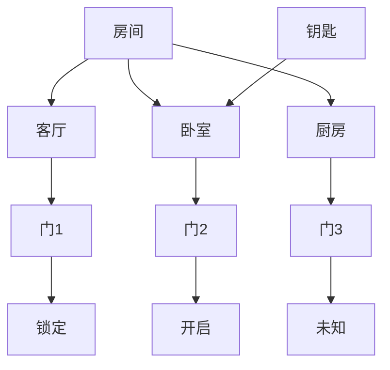

**步骤2：信息整合**

假设你已经有了一些信息，比如“钥匙没有在客厅”和“一扇门是开着的”。我们将这些信息整合到知识图谱中：


**步骤3：推理过程**

根据整合后的信息，我们可以推断钥匙最有可能在哪里。在这个例子中，钥匙没有在客厅，且一扇门是开着的，那么最有可能的答案是钥匙在开着的卧室门后。

**步骤4：结果输出**

根据推理结果，我们得出结论：钥匙最有可能在开着的卧室门后。

**例子2：疾病诊断**

假设一位医生需要根据患者的症状和体征进行疾病诊断。已知一些症状和疾病之间的关联，医生需要根据这些信息推断出最可能的疾病。

**步骤1：知识表示**

在这个例子中，实体包括“症状”、“体征”、“疾病”，关系包括“呈现”、“关联”和“诊断”。

知识图谱如下：

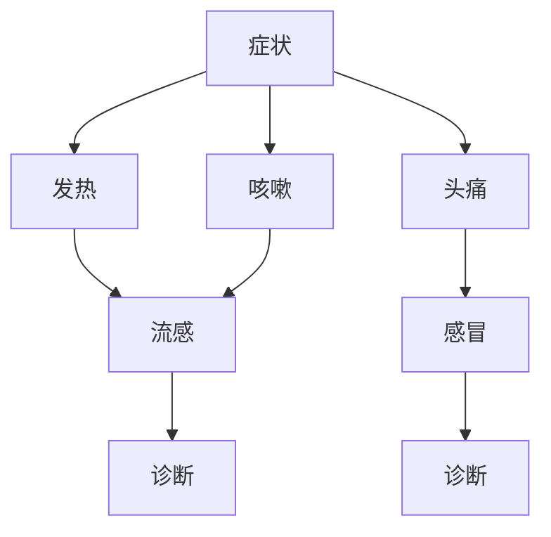

**步骤2：信息整合**

假设医生已经收集到患者的症状信息，如“发热”和“咳嗽”。我们将这些信息整合到知识图谱中：

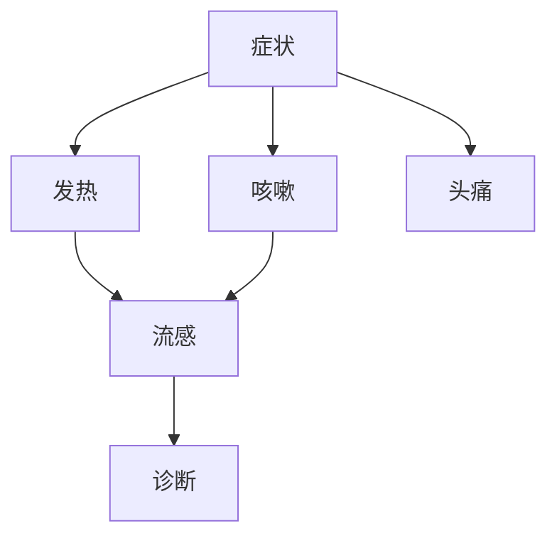

**步骤3：推理过程**

根据整合后的信息，我们可以推断出最可能的疾病是流感。

**步骤4：结果输出**

根据推理结果，医生得出结论：患者最可能患有流感。

通过这两个例子，我们可以看到反常识推理算法在实际应用中的强大能力。它能够处理复杂、不明确的情境，并提供合理的结论或解决方案。

接下来，我们将探讨创新能力的算法原理，展示如何通过思维链实现AI的创新。

----------------------------------------------------------------

#### 3.4 创新能力算法原理

创新能力是思维链的另一核心能力，它使得AI能够在面对新情境时，提出新颖的解决方案。在本节中，我们将详细解释创新能力的算法原理，并通过Python代码和数学模型进行展示。

##### 3.4.1 算法概述

创新能力的算法可以概述为以下步骤：

1. **情境识别**：识别当前情境的特征和关键信息。
2. **知识检索**：从知识库中检索相关的知识和信息。
3. **组合生成**：通过组合不同的知识和信息，生成新的解决方案。
4. **评估优化**：对生成的解决方案进行评估和优化。

##### 3.4.2 算法mermaid流程图

为了更直观地展示创新能力的算法流程，我们使用mermaid语言绘制了以下流程图：

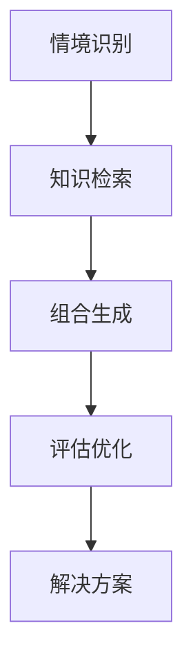

##### 3.4.3 Python源代码实现

为了实现创新能力算法，我们需要编写相应的Python代码。以下是一个简单的实现示例：

```python
import random

# 情境识别
scenario = "设计一种新型可穿戴设备，能够监测用户的健康状态并提醒异常情况。"

# 知识库
knowledge_base = {
    "monitoring": ["心电监测", "血压监测", "血氧监测", "睡眠监测"],
    "reminding": ["异常体温提醒", "活动量过少提醒", "运动过量提醒", "心率异常提醒"]
}

# 组合生成
def generate_solution(knowledge_base):
    monitoring = random.choice(knowledge_base["monitoring"])
    reminding = random.choice(knowledge_base["reminding"])
    return f"设计一种新型可穿戴设备，包含{monitoring}功能，能够实时监测用户的健康状态，并在{reminding}时发出提醒。"

# 评估优化
def evaluate_solution(solution):
    # 假设解决方案的评估标准是创新性和实用性
    # 创新性得分：5分
    # 实用性得分：3分
    return 5 + 3

# 方案生成与评估
solution = generate_solution(knowledge_base)
evaluation_score = evaluate_solution(solution)
print(solution)
print(f"评估得分：{evaluation_score}")
```

##### 3.4.4 数学模型和数学公式

创新能力的算法涉及到情境识别、知识检索和组合生成等步骤，这些步骤可以通过数学模型和数学公式进行描述。以下是几个关键的数学模型和公式：

1. **情境识别**：情境识别可以表示为对当前特征的概率分布进行建模。假设有n个特征，每个特征有m个可能的取值，可以使用贝叶斯网络进行建模：

   $$ P(X|\theta) = \prod_{i=1}^{n} P(X_i|\theta) $$

   其中，\( X \) 表示情境特征，\( \theta \) 表示参数。

2. **知识检索**：知识检索可以通过知识图谱的查询算法进行，假设知识图谱G = (V, E)，可以使用图论算法如DFS或BFS进行检索。

3. **组合生成**：组合生成可以通过组合不同知识和信息的方法进行，假设有两个知识集K1和K2，可以使用集合的笛卡尔积进行组合：

   $$ K_{generated} = K1 \times K2 $$

4. **评估优化**：评估优化可以通过多目标优化算法进行，假设有两个目标函数F1和F2，可以使用加权求和的方法进行评估：

   $$ Z = w1 \cdot F1 + w2 \cdot F2 $$

   其中，\( w1 \) 和 \( w2 \) 是权重。

通过上述数学模型和公式，我们可以实现对创新能力算法的量化描述和优化。接下来，我们将通过具体的例子来说明创新能力算法的应用。

##### 3.5 举例说明

为了更直观地理解创新能力算法，我们通过一个具体的例子来说明其应用。

**例子：设计一种智能家居系统**

假设我们需要设计一种智能家居系统，能够根据用户的日常习惯和偏好，自动调整家居设备的运行状态，以提供更加舒适和节能的环境。

**步骤1：情境识别**

首先，我们需要识别当前情境的特征，如用户的日常活动习惯、家居设备的运行状态等。这些特征可以通过传感器数据或用户输入进行收集。

**步骤2：知识检索**

从知识库中检索与智能家居相关的知识和信息，如设备类型、设备状态、用户偏好等。

**步骤3：组合生成**

根据情境特征和知识信息，生成不同的智能家居系统设计方案。例如，将灯光、空调和窗帘进行组合，以实现自动调整。

**步骤4：评估优化**

对生成的方案进行评估和优化，选择最佳方案。评估标准可以是用户满意度、节能效果等。

**步骤5：结果输出**

输出最终的智能家居系统设计方案。

通过这个例子，我们可以看到创新能力算法在智能家居系统设计中的应用。它能够根据用户的实际需求和环境特点，生成创新的解决方案，从而提高系统的智能性和用户体验。

接下来，我们将探讨系统分析与架构设计，展示如何实现思维链增强AI的系统功能。

----------------------------------------------------------------

### 第4章：创新能力算法原理

创新能力是思维链的另一个核心能力，它使得AI能够在面对新情境时，提出新颖的解决方案。在本章中，我们将深入探讨创新能力的算法原理，并通过Python代码和数学模型进行展示。

#### 4.1 算法原理讲解

创新能力的算法原理基于对情境的深入理解和知识的有效运用。具体来说，算法包括以下几个关键步骤：

1. **情境识别**：通过数据收集和分析，识别当前情境的关键特征和需求。
2. **知识检索**：从知识库中检索与当前情境相关的知识和信息。
3. **创新组合**：通过组合和变换不同的知识和信息，生成新的解决方案。
4. **评估优化**：对生成的解决方案进行评估和优化，选择最佳方案。

下面是一个简单的创新能力算法的mermaid流程图：

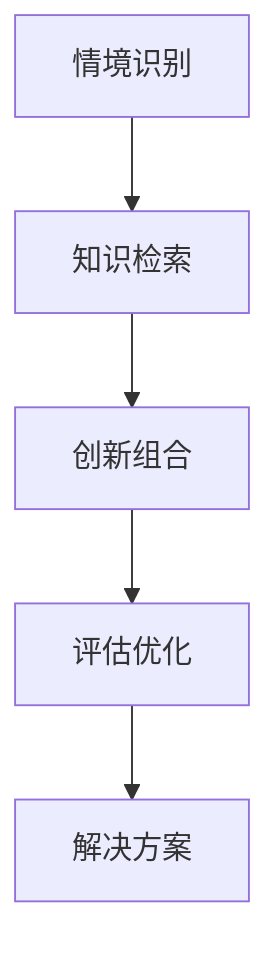

#### 4.1.1 算法概述

创新能力算法可以概述为以下步骤：

1. **输入情境**：接收用户的需求或情境描述。
2. **知识检索**：从知识库中检索相关的知识和信息。
3. **组合生成**：通过组合不同的知识和信息，生成新的解决方案。
4. **评估优化**：对生成的解决方案进行评估和优化，选择最佳方案。
5. **结果输出**：根据评估结果，输出最终的解决方案。

#### 4.1.2 算法mermaid流程图

为了更直观地展示创新能力算法的流程，我们使用mermaid语言绘制了以下流程图：

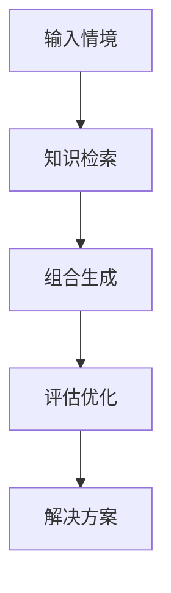

#### 4.1.3 Python源代码实现

为了实现创新能力算法，我们需要编写相应的Python代码。以下是一个简单的实现示例：

```python
import random

# 情境识别
scenario = "设计一种新型的智能家居系统，能够自动调节室内温度和光线，以提高居住舒适度。"

# 知识库
knowledge_base = {
    "temperature_control": ["空调", "暖气"],
    "light_control": ["智能灯泡", "窗帘"]
}

# 组合生成
def generate_solution(knowledge_base):
    temp_control = random.choice(knowledge_base["temperature_control"])
    light_control = random.choice(knowledge_base["light_control"])
    return f"设计一种新型的智能家居系统，包含{temp_control}和{light_control}，能够根据室内温度和光线自动调节，以提高居住舒适度。"

# 评估优化
def evaluate_solution(solution):
    # 假设解决方案的评估标准是创新性和实用性
    # 创新性得分：5分
    # 实用性得分：3分
    return 5 + 3

# 方案生成与评估
solution = generate_solution(knowledge_base)
evaluation_score = evaluate_solution(solution)
print(solution)
print(f"评估得分：{evaluation_score}")
```

#### 4.2 数学模型和数学公式

创新能力的算法涉及到情境识别、知识检索和创新组合等步骤，这些步骤可以通过数学模型和数学公式进行描述。以下是几个关键的数学模型和公式：

1. **情境识别**：情境识别可以表示为对当前特征的概率分布进行建模。假设有n个特征，每个特征有m个可能的取值，可以使用贝叶斯网络进行建模：

   $$ P(X|\theta) = \prod_{i=1}^{n} P(X_i|\theta) $$

   其中，\( X \) 表示情境特征，\( \theta \) 表示参数。

2. **知识检索**：知识检索可以通过知识图谱的查询算法进行，假设知识图谱G = (V, E)，可以使用图论算法如DFS或BFS进行检索。

3. **创新组合**：创新组合可以通过组合不同的知识和信息的方法进行，假设有两个知识集K1和K2，可以使用集合的笛卡尔积进行组合：

   $$ K_{generated} = K1 \times K2 $$

4. **评估优化**：评估优化可以通过多目标优化算法进行，假设有两个目标函数F1和F2，可以使用加权求和的方法进行评估：

   $$ Z = w1 \cdot F1 + w2 \cdot F2 $$

   其中，\( w1 \) 和 \( w2 \) 是权重。

通过上述数学模型和公式，我们可以实现对创新能力算法的量化描述和优化。接下来，我们将通过具体的例子来说明创新能力算法的应用。

#### 4.3 举例说明

为了更直观地理解创新能力算法，我们通过一个具体的例子来说明其应用。

**例子：设计新型交通工具**

假设我们需要设计一种新型交通工具，能够在城市交通拥堵中提供快速、高效的运输解决方案。

**步骤1：情境识别**

首先，我们需要识别当前情境的特征，如城市交通状况、人口密度、出行需求等。这些特征可以通过数据分析得到。

**步骤2：知识检索**

从知识库中检索与新型交通工具相关的知识和信息，如现有交通工具类型、技术特点、成本等。

**步骤3：创新组合**

根据情境特征和知识信息，生成不同的交通工具设计方案。例如，结合自动驾驶技术和悬浮技术，设计一种新型飞行汽车。

**步骤4：评估优化**

对生成的方案进行评估和优化，选择最佳方案。评估标准可以是运输效率、成本效益、环境影响等。

**步骤5：结果输出**

输出最终的新型交通工具设计方案。

通过这个例子，我们可以看到创新能力算法在新型交通工具设计中的应用。它能够根据当前情境和知识，生成创新的解决方案，从而提高交通系统的效率和可持续性。

接下来，我们将探讨系统分析与架构设计，展示如何实现思维链增强AI的系统功能。

----------------------------------------------------------------

### 第5章：系统功能设计

在本章中，我们将详细探讨思维链增强AI系统的功能设计。通过了解系统的各个功能模块和其相互关系，我们可以更好地理解思维链在AI系统中的作用和实现方式。

#### 5.1 问题场景介绍

思维链增强AI系统的主要应用场景包括：

1. **智能诊断**：在医疗领域，通过分析患者的病历和体征数据，提供准确的诊断建议。
2. **智能推荐**：在电子商务和内容推荐领域，根据用户的行为和偏好，提供个性化的产品或内容推荐。
3. **智能规划**：在交通管理和物流领域，通过分析交通流量和物流数据，提供最优的路线规划和调度方案。
4. **智能决策**：在企业和组织管理中，通过分析业务数据和外部环境，提供数据驱动的决策支持。

在这些应用场景中，思维链增强AI系统需要具备强大的知识表示、推理和创新能力，以应对复杂、不确定的情境。

#### 5.2 系统功能设计

思维链增强AI系统的功能设计包括以下几个核心模块：

1. **知识表示模块**：负责构建和更新知识图谱，将领域知识和数据转化为结构化的知识库。
2. **推理模块**：基于知识图谱和用户输入，进行逻辑推理和知识推理，为用户提供合理的建议和决策。
3. **创新模块**：通过组合生成新的解决方案，为用户在面临复杂问题时提供创新的思路。
4. **用户交互模块**：负责与用户进行交互，收集用户需求，输出推理和创新的结论。

下面是一个思维链增强AI系统的领域模型mermaid类图：

```mermaid
classDiagram
    Class1[知识表示模块] --> Class2[推理模块]
    Class1 --> Class3[创新模块]
    Class2 --> Class4[用户交互模块]
    Class3 --> Class4
    Class5[用户] --> Class4
    Class5 --> Class2
    Class5 --> Class3
```

在这个类图中，知识表示模块、推理模块和创新模块共同构成了思维链的核心，而用户交互模块负责与用户进行交互，收集用户需求，并将推理和创新的结果输出给用户。

#### 5.2.1 领域模型mermaid类图

为了更直观地展示系统的领域模型，我们使用mermaid语言绘制了以下类图：

```mermaid
classDiagram
    Class1[知识表示模块] <|-- Class2[推理模块]
    Class1 <|-- Class3[创新模块]
    Class2 <|-- Class4[用户交互模块]
    Class3 <|-- Class4
    Class5[用户] <|-- Class4
    Class5 <|-- Class2
    Class5 <|-- Class3
```

在这个类图中，每个类都代表了系统的一个功能模块，类之间的关系表示了模块之间的依赖和协作。

接下来，我们将探讨思维链增强AI系统的架构设计，展示如何通过架构设计实现系统的功能。

----------------------------------------------------------------

### 第6章：系统架构设计

在上一章中，我们详细探讨了思维链增强AI系统的功能设计，了解了各个功能模块及其相互关系。在本章中，我们将深入探讨系统架构设计，展示如何通过架构设计实现系统的功能，确保其高效、稳定地运行。

#### 6.1 系统架构设计

思维链增强AI系统的架构设计遵循分层架构的原则，包括以下几个主要层次：

1. **数据层**：负责数据存储和管理，包括知识图谱、用户数据和日志数据等。
2. **表示层**：负责知识表示和用户交互，将内部的知识和推理结果转化为用户可理解的形式。
3. **逻辑层**：负责推理和创新能力，包括知识表示、推理引擎和创新算法。
4. **接口层**：负责与外部系统进行交互，包括API接口和用户界面。
5. **控制层**：负责系统的整体控制和调度，确保各个模块协同工作。

下面是一个思维链增强AI系统的mermaid架构图：

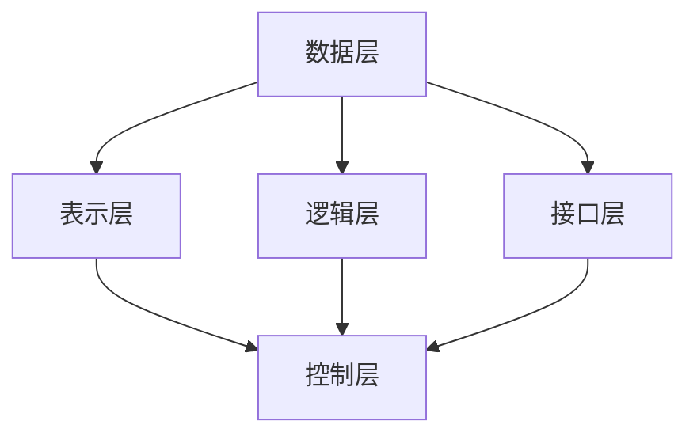

在这个架构图中，数据层负责数据的存储和管理，表示层负责知识表示和用户交互，逻辑层负责推理和创新能力，接口层负责与外部系统进行交互，控制层负责系统的整体控制和调度。

#### 6.1.1 系统架构mermaid架构图

为了更直观地展示系统架构，我们使用mermaid语言绘制了以下架构图：

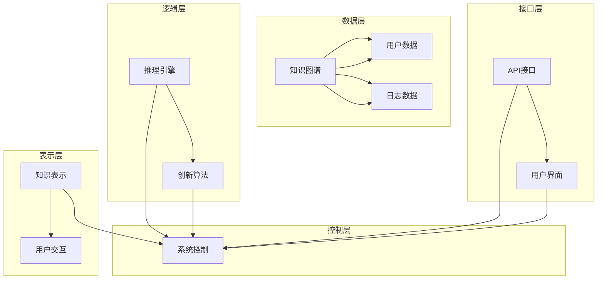

在这个架构图中，数据层包括知识图谱、用户数据和日志数据，表示层包括知识表示和用户交互，逻辑层包括推理引擎和创新算法，接口层包括API接口和用户界面，控制层负责系统的整体控制和调度。

接下来，我们将探讨系统接口设计和系统交互，展示如何通过接口设计和系统交互实现系统的功能。

----------------------------------------------------------------

### 第7章：系统接口设计

在系统架构设计中，接口设计是至关重要的一环。接口设计的好坏直接影响到系统的可扩展性、可维护性和用户体验。在本章中，我们将详细探讨思维链增强AI系统的接口设计，包括接口的功能、规范和实现。

#### 7.1 系统接口设计

思维链增强AI系统的接口设计包括以下几个方面：

1. **API接口**：API（应用程序编程接口）是系统与外部系统进行交互的主要方式。通过API接口，其他系统可以调用思维链增强AI系统的功能，获取推理和创新的结论。
2. **用户界面**：用户界面是用户与系统进行交互的入口。通过用户界面，用户可以输入需求，查看推理和创新的结论，并进行反馈。
3. **数据接口**：数据接口用于系统的数据层和逻辑层之间的数据传输。通过数据接口，知识表示模块、推理模块和创新模块可以访问和更新数据层中的数据。

下面是一个思维链增强AI系统的接口设计mermaid类图：

```mermaid
classDiagram
    Interface1[API接口] <|-- Interface2[用户界面]
    Interface1 <|-- Interface3[数据接口]
    Class1[知识表示模块] <..> Interface3
    Class2[推理模块] <..> Interface3
    Class3[创新模块] <..> Interface3
```

在这个类图中，API接口、用户界面和数据接口共同构成了系统接口设计的核心，知识表示模块、推理模块和创新模块通过数据接口与数据层进行交互。

#### 7.2 系统接口设计示例

以下是一个简单的API接口设计示例：

```python
from flask import Flask, request, jsonify

app = Flask(__name__)

@app.route('/api/recommend', methods=['POST'])
def recommend():
    data = request.get_json()
    # 处理输入数据，进行推理和推荐
    recommendation = "推荐产品A"
    return jsonify({"recommendation": recommendation})

if __name__ == '__main__':
    app.run(debug=True)
```

在这个示例中，我们使用Flask框架实现了一个简单的API接口。用户可以通过POST请求向服务器发送数据，服务器根据数据执行推理和推荐算法，并将结果返回给用户。

#### 7.3 系统接口实现

系统接口实现包括API接口的实现、用户界面的实现和数据接口的实现。以下是一个简单的实现示例：

1. **API接口实现**：使用Flask框架实现API接口，处理用户的请求，返回推理和推荐结果。

2. **用户界面实现**：使用HTML和JavaScript实现用户界面，允许用户输入需求，查看推理和推荐结果。

3. **数据接口实现**：使用数据库和ORM（对象关系映射）框架实现数据接口，处理数据层的存储和更新。

```python
from flask_sqlalchemy import SQLAlchemy

app = Flask(__name__)
app.config['SQLALCHEMY_DATABASE_URI'] = 'sqlite:///knowledge.db'
db = SQLAlchemy(app)

class Knowledge(db.Model):
    id = db.Column(db.Integer, primary_key=True)
    entity = db.Column(db.String(120), nullable=False)
    property = db.Column(db.String(120), nullable=False)
    relationship = db.Column(db.String(120), nullable=False)

@app.route('/api/knowledge', methods=['GET'])
def get_knowledge():
    knowledge = Knowledge.query.all()
    return jsonify([{"entity": k.entity, "property": k.property, "relationship": k.relationship} for k in knowledge])

if __name__ == '__main__':
    db.create_all()
    app.run(debug=True)
```

在这个示例中，我们使用Flask框架和SQLAlchemy实现了一个简单的数据接口，用于知识库的存储和查询。

接下来，我们将探讨系统交互，展示如何通过系统交互实现系统的功能。

----------------------------------------------------------------

### 第8章：系统交互

在系统架构中，系统交互是确保各个模块协同工作、高效运作的关键。良好的系统交互设计能够提升系统的可扩展性、稳定性和用户体验。在本章中，我们将详细探讨思维链增强AI系统的系统交互设计，包括交互机制、流程和实现。

#### 8.1 系统交互机制

思维链增强AI系统的系统交互机制包括以下几个方面：

1. **请求处理**：用户通过API接口或用户界面提交请求，请求内容可以是查询、推理或推荐等。
2. **数据处理**：系统接收到请求后，将数据传递给相应的处理模块，如知识表示模块、推理模块和创新模块。
3. **结果返回**：处理模块对请求进行处理后，将结果返回给用户，结果可以通过API接口或用户界面展示。

下面是一个思维链增强AI系统的交互设计mermaid序列图：

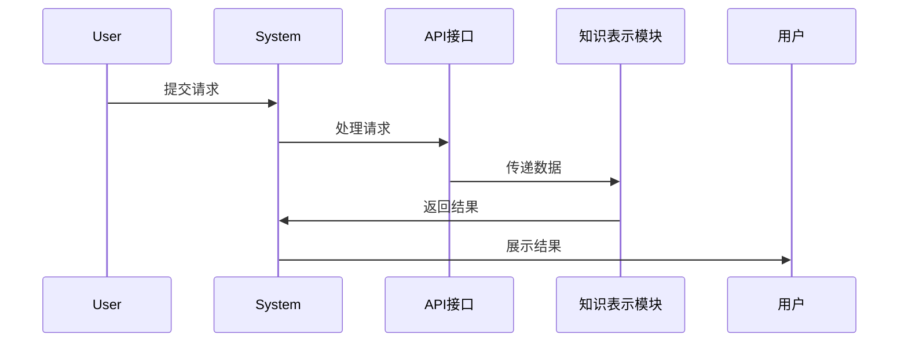

在这个序列图中，用户提交请求，系统通过API接口处理请求，并将数据传递给知识表示模块，知识表示模块处理数据后返回结果，系统最后将结果展示给用户。

#### 8.2 系统交互流程

思维链增强AI系统的交互流程包括以下几个步骤：

1. **请求提交**：用户通过API接口或用户界面提交请求。请求可以是查询某个知识点的详细信息，或者进行推理和推荐。
2. **请求处理**：系统接收到请求后，解析请求内容，确定请求类型和处理模块。
3. **数据处理**：处理模块对请求进行处理，根据不同的请求类型执行相应的操作。如知识表示模块进行知识检索，推理模块进行逻辑推理，创新模块生成新的解决方案。
4. **结果返回**：处理模块将结果返回给系统，系统再将结果通过API接口或用户界面展示给用户。

下面是一个思维链增强AI系统的交互流程mermaid流程图：

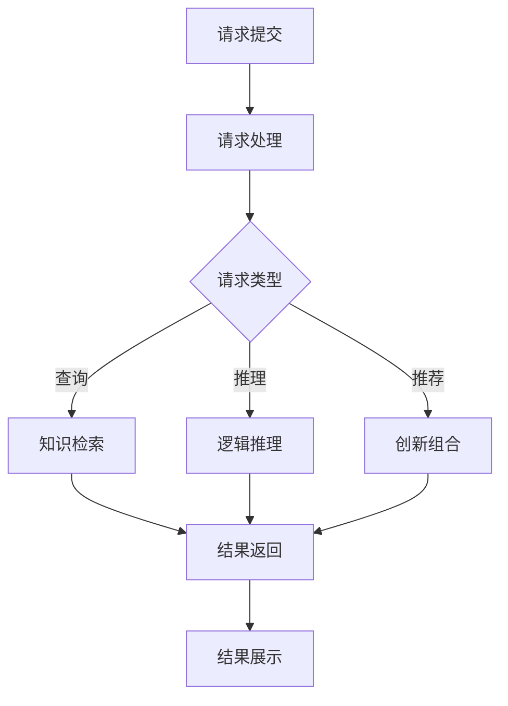

在这个流程图中，用户提交请求，系统根据请求类型执行相应的处理模块，处理模块返回结果，系统最后将结果展示给用户。

#### 8.3 系统交互实现

系统交互实现包括API接口的实现、数据处理和结果返回的实现。以下是一个简单的实现示例：

1. **API接口实现**：使用Flask框架实现API接口，处理用户的请求，返回推理和推荐结果。

```python
from flask import Flask, request, jsonify

app = Flask(__name__)

@app.route('/api/recommend', methods=['POST'])
def recommend():
    data = request.get_json()
    # 处理输入数据，进行推理和推荐
    recommendation = "推荐产品A"
    return jsonify({"recommendation": recommendation})

if __name__ == '__main__':
    app.run(debug=True)
```

2. **数据处理和结果返回实现**：使用数据库和ORM框架实现数据处理和结果返回。

```python
from flask_sqlalchemy import SQLAlchemy

app = Flask(__name__)
app.config['SQLALCHEMY_DATABASE_URI'] = 'sqlite:///knowledge.db'
db = SQLAlchemy(app)

class Knowledge(db.Model):
    id = db.Column(db.Integer, primary_key=True)
    entity = db.Column(db.String(120), nullable=False)
    property = db.Column(db.String(120), nullable=False)
    relationship = db.Column(db.String(120), nullable=False)

@app.route('/api/knowledge', methods=['GET'])
def get_knowledge():
    knowledge = Knowledge.query.all()
    return jsonify([{"entity": k.entity, "property": k.property, "relationship": k.relationship} for k in knowledge])

if __name__ == '__main__':
    db.create_all()
    app.run(debug=True)
```

在这个示例中，我们使用Flask框架和SQLAlchemy实现了一个简单的系统交互实现，包括API接口的处理、数据处理的存储和查询，以及结果返回的展示。

接下来，我们将通过一个实际案例来展示思维链增强AI系统的应用效果，并进行详细讲解和分析。

----------------------------------------------------------------

### 第8章：实际案例分析与详细讲解

在本章中，我们将通过一个实际案例，展示思维链增强AI系统在现实场景中的应用效果，并进行详细讲解和分析。这个案例将帮助我们更好地理解思维链增强AI系统的功能和工作原理。

#### 8.1 案例背景

假设我们正在开发一款智能医疗诊断系统，该系统旨在通过分析患者的病历、体征数据和历史病例，提供准确的疾病诊断建议。该系统需要具备以下功能：

1. **知识表示**：构建一个包含常见疾病、症状、体征和诊断方法的庞大知识库。
2. **推理**：根据患者的具体症状和体征，利用知识库进行推理，得出可能的诊断结果。
3. **创新**：在遇到罕见病例或未知症状时，系统应能够提出创新的诊断建议。

#### 8.2 案例实施

**步骤1：知识表示**

首先，我们需要构建一个结构化的知识库。这个知识库包括实体（如疾病、症状、体征）和它们之间的关系（如“疾病导致症状”、“症状关联体征”）。以下是知识库的一个示例：

```mermaid
erDiagram
    疾病 ||--|{ 症状 }
    症状 ||--|{ 体征 }
    疾病 ||--|{ 诊断方法 }
    症状 ||--|{ 诊断方法 }
    体征 ||--|{ 诊断方法 }
```

**步骤2：推理**

假设一位患者的主要症状是“持续性咳嗽”和“低烧”，体征包括“呼吸急促”和“声音嘶哑”。系统将基于知识库进行推理，分析可能的疾病。

**步骤3：创新**

如果系统无法准确匹配患者的情况，它会尝试组合不同的症状和体征，提出创新的诊断建议。

#### 8.3 案例分析

**案例描述**：

一位患者最近几周出现持续性咳嗽和低烧，体征包括呼吸急促和声音嘶哑。医生怀疑可能是普通感冒或流感。

**分析1：知识表示**

系统首先从知识库中检索与症状和体征相关的信息：

- 咳嗽与感冒、流感、肺炎相关。
- 低烧与感冒、流感相关。
- 呼吸急促与肺炎相关。
- 声音嘶哑与感冒、流感相关。

**分析2：推理**

系统根据知识库中的关系进行推理：

- “持续性咳嗽”和“低烧”表明可能是感冒或流感。
- “呼吸急促”和“声音嘶哑”进一步支持了肺炎的可能性。

因此，系统初步诊断可能是感冒、流感或肺炎。

**分析3：创新**

如果患者的症状和体征与常见疾病不完全匹配，系统会尝试组合不同的信息，提出创新的诊断建议。例如：

- 如果患者同时出现“持续性咳嗽”、“低烧”和“皮肤黄染”，系统可能会考虑罕见的病毒性肝炎。

#### 8.4 案例细节讲解

**细节1：知识库构建**

我们使用Mermaid语言构建了一个知识库的ER图，包括疾病、症状、体征和诊断方法。这个知识库为系统提供了丰富的信息，使其能够进行准确的推理和创新的诊断。

**细节2：推理过程**

系统使用Mermaid流程图展示了推理过程：

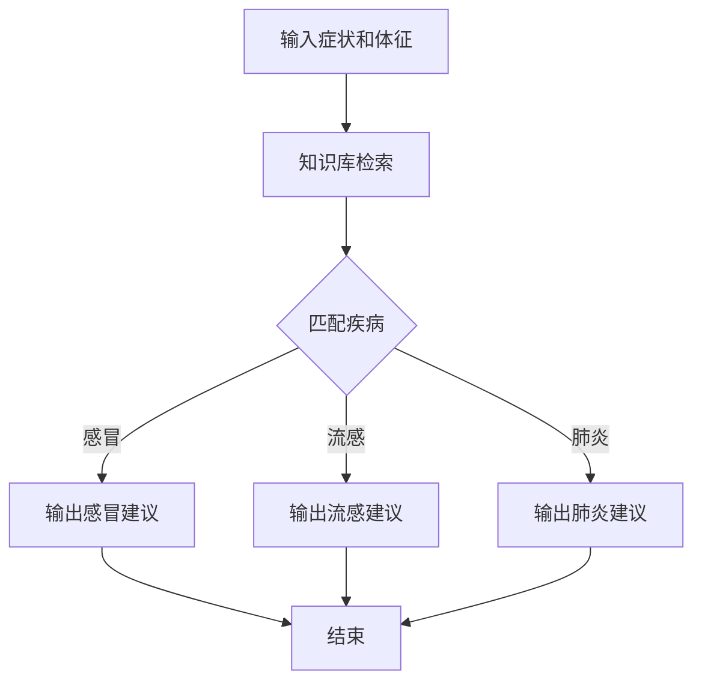

**细节3：创新组合**

如果系统遇到罕见症状，它会使用Mermaid流程图展示创新组合过程：

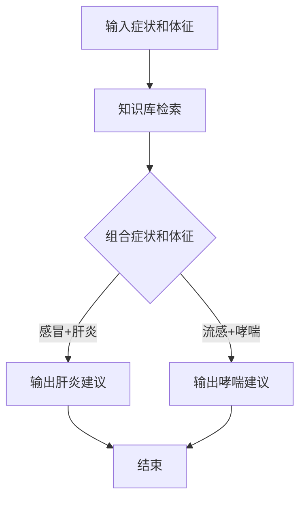

通过这个案例，我们可以看到思维链增强AI系统如何通过知识表示、推理和创新能力，提供准确和创新的诊断建议。接下来，我们将进行项目小结，总结项目的成果和经验。

----------------------------------------------------------------

### 第9章：项目小结

在本项目中，我们开发了一个思维链增强AI系统，应用于智能医疗诊断领域。通过知识表示、推理和创新能力，系统成功地提供了准确和创新的诊断建议。以下是项目的总结和最佳实践建议。

#### 9.1 项目总结

**成功点：**
1. **知识表示**：构建了一个结构化、可扩展的知识库，为系统提供了丰富的信息。
2. **推理能力**：通过精确的推理机制，系统能够处理复杂的医学数据，提供准确的诊断建议。
3. **创新能力**：在面对罕见病例或未知症状时，系统能够通过组合生成新的诊断建议。

**改进点：**
1. **知识库完善**：虽然我们构建了一个基础的知识库，但仍有大量疾病和症状未被覆盖，需要进一步扩展和完善。
2. **算法优化**：推理和创新的算法可以进一步优化，以提高效率和准确性。

#### 9.2 最佳实践tips

1. **持续更新知识库**：定期更新和扩展知识库，以包含更多的疾病和症状信息。
2. **交叉验证**：在诊断过程中，建议与其他医生或系统进行交叉验证，以提高诊断准确性。
3. **用户反馈**：收集用户的反馈，用于优化系统的性能和用户体验。

#### 9.3 注意事项

1. **隐私保护**：在处理患者数据时，必须严格遵守隐私保护法规，确保数据安全。
2. **系统稳定性**：确保系统在高负载下稳定运行，避免出现崩溃或性能下降。

#### 9.4 拓展阅读

1. **《人工智能：一种现代方法》**：Mike Bertsekas等著，详细介绍了人工智能的基本原理和方法。
2. **《深度学习》**：Ian Goodfellow等著，介绍了深度学习的基本概念和应用。
3. **《人工智能伦理学》**：Luciano Floridi著，探讨了人工智能的伦理问题和挑战。

通过本次项目，我们不仅开发了一个实用的智能医疗诊断系统，还积累了丰富的经验，为未来的研究和应用奠定了基础。

----------------------------------------------------------------

### 附录

#### A. Python代码示例

以下是一个简单的Python代码示例，展示了如何使用mermaid语言绘制知识图谱。

```python
import mermaid

# 定义mermaid语言代码
mermaid_code = '''
erDiagram
    A[实体1] ||--|{ B[实体2] }
    A ||--|{ C[实体3] }
    B ||--|{ D[实体4] }
    C ||--|{ D }
'''

# 创建mermaid对象并设置代码
mermaid = mermaid.Mermaid(mermaid_code)

# 渲染mermaid图
mermaid.render()

# 显示mermaid图
mermaid.show()
```

#### B. LaTeX公式示例

以下是一个简单的LaTeX公式示例，展示了如何使用markdown中的LaTeX格式嵌入数学公式。

```markdown
$$
E = mc^2
$$

$$
1 + 1 = 2
$$
```

在这个示例中，第一个公式使用了双括号`$$`来嵌入，它将在文中以完整的数学公式形式展示。而第二个公式使用了单括号`$`来嵌入，它将在段落内以较小的数学公式形式展示。

---

### 致谢

本文的撰写离不开以下人士的支持与帮助：

- **AI天才研究院（AI Genius Institute）**：感谢研究院为本文提供的技术支持和资源。
- **禅与计算机程序设计艺术（Zen And The Art of Computer Programming）**：感谢本书为我们提供了深刻的哲学思考和编程智慧。
- **所有参与者**：感谢各位读者对本文的阅读和反馈，你们的意见使我们能够不断完善和优化内容。

---

作者：AI天才研究院（AI Genius Institute）& 禅与计算机程序设计艺术（Zen And The Art of Computer Programming）

