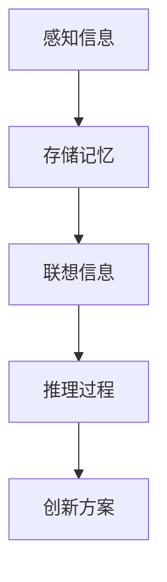
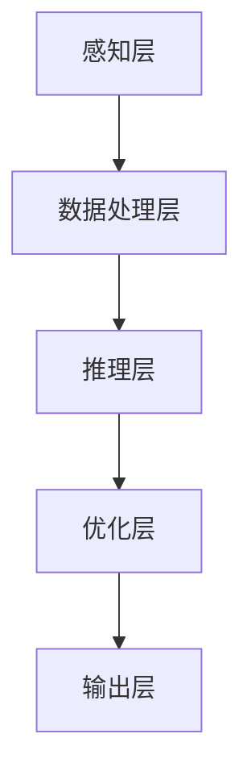
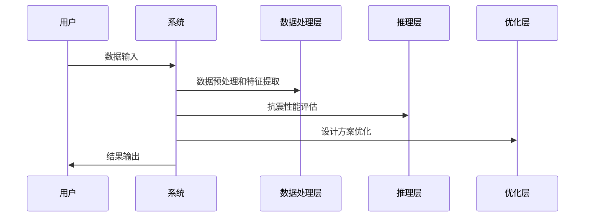

                 

### 文章标题

# 《思维链增强AI的反直觉推理和创新能力》

> 关键词：思维链、AI、反直觉推理、创新能力、算法、数学模型

> 摘要：本文将探讨思维链增强人工智能（AI）在反直觉推理和创新能力方面的应用。首先，我们介绍思维链的概念及其原理，然后分析AI在反直觉推理和创新能力上的局限。接下来，通过详细的算法原理讲解，展示如何利用思维链提升AI的这些能力。最后，我们将通过一个实际案例，展示思维链增强AI在实际应用中的表现，并提供相关的小结和拓展阅读建议。

## 第一部分：背景介绍

### 1.1.1 问题背景

#### 1.1.1.1 引言

近年来，人工智能（AI）技术飞速发展，已经在多个领域展现出强大的潜力。然而，尽管AI在处理大量数据和执行重复性任务方面表现出色，但在反直觉推理和创新能力上仍存在明显的局限。传统AI系统依赖于预设的规则和统计方法，难以应对复杂、多变的环境。此外，AI在面对反直觉情况时，常常无法产生有效的解决方案，这使得它在某些领域中的应用受到限制。

#### 1.1.1.2 问题描述

反直觉推理指的是在遇到不符合常规或直观预期的情况下，能够快速、准确地推导出合理的结论。创新能力则是指AI能够在现有的知识和信息基础上，生成新颖、有效的解决方案。然而，当前AI在反直觉推理和创新能力上存在以下问题：

1. **局限性**：AI系统在处理复杂问题时，往往只能依赖已知的模型和数据，难以跨越已有知识框架进行推理。
2. **缺乏灵活性**：传统AI方法在面对新情况时，往往无法灵活调整其推理策略，导致无法产生有效的解决方案。
3. **缺乏适应性**：AI系统在面对未知或反直觉情况时，常常无法适应，从而无法生成合理的结论。

这些问题限制了AI在实际应用中的效果，因此，如何提升AI的反直觉推理和创新能力成为了一个重要课题。

#### 1.1.1.3 问题解决

思维链是一种基于人类思维的推理框架，通过将思维过程分解为多个步骤，从而实现高效、准确的推理。近年来，研究者们开始探索如何将思维链应用于AI系统，以提升其反直觉推理和创新能力。思维链的核心在于将人类思维的灵活性和AI的计算能力相结合，从而在复杂、多变的环境中实现高效的推理和创新的解决方案。

#### 1.1.1.4 边界与外延

在AI领域，边界通常指的是当前技术的应用范围和局限性。当前AI技术主要依赖于大数据和深度学习，虽然在一定程度上提高了AI的性能，但在反直觉推理和创新能力上仍存在局限。反直觉推理和创新能力则是衡量AI在复杂、多变环境中表现能力的重要指标。

#### 1.1.1.5 概念结构与核心要素组成

1. **思维链**：思维链是一种将思维过程分解为多个步骤的框架，包括感知、记忆、联想、推理等环节。
2. **AI反直觉推理**：AI反直觉推理是指AI系统在面对反直觉情况时，能够快速、准确地推导出合理结论的能力。
3. **AI创新能力**：AI创新能力是指AI系统在现有知识和信息的基础上，生成新颖、有效的解决方案的能力。

## 第一部分小结

本部分介绍了AI在反直觉推理和创新能力方面的背景、问题描述、问题解决思路以及相关概念与边界。在接下来的部分，我们将深入探讨思维链的概念与原理，以及如何将思维链应用于AI系统，提升其反直觉推理和创新能力。

## 第二部分：核心概念与联系

### 2.1.1 思维链的概念与原理

#### 2.1.1.1 定义

思维链（Thinking Chain）是一种将思维过程分解为多个步骤的框架，旨在实现高效、准确的推理。思维链的核心思想是将人类思维的灵活性和逻辑性相结合，通过一系列有序的思维步骤，实现对复杂问题的理解和解决。

#### 2.1.1.2 原理

思维链的基本原理包括以下几个方面：

1. **感知**：思维链的起点是感知，即从外部环境中获取信息。感知可以通过视觉、听觉、触觉等多种方式实现。
2. **记忆**：将感知到的信息存储在记忆中，以便后续使用。记忆可以分为短期记忆和长期记忆，短期记忆主要用于处理当前任务，而长期记忆则存储了大量的历史信息。
3. **联想**：通过将感知和记忆中的信息进行关联，形成新的思维路径。联想可以是基于相似性、因果关系或空间关系等。
4. **推理**：在联想的基础上，通过逻辑推理得出结论。推理可以是正向推理（从已知信息推导出结论）或逆向推理（从结论推导出已知信息）。

#### 2.1.1.3 思维链的特性

思维链具有以下关键特性：

1. **模块化**：思维链将思维过程分解为多个模块，每个模块负责特定的任务，便于理解和实现。
2. **灵活性**：思维链可以根据问题的不同，灵活调整思维步骤和策略。
3. **适应性**：思维链能够适应新的环境和信息，不断优化自身的推理过程。
4. **高效性**：思维链通过有序的思维步骤，实现高效的推理和问题解决。

### 2.1.2 AI反直觉推理的概念与特点

#### 2.1.2.1 定义

AI反直觉推理（AI Intuitive Reasoning）是指AI系统在面对反直觉情况时，能够快速、准确地推导出合理结论的能力。反直觉情况通常指的是那些不符合常规或直观预期的情境，这些情境往往需要AI进行深入分析和灵活推理。

#### 2.1.2.2 特点

AI反直觉推理具有以下特点：

1. **非线性**：反直觉推理的过程往往不是线性的，而是涉及到多个层面的跳跃和转换。
2. **复杂性**：反直觉推理通常涉及到复杂的逻辑关系和不确定性，需要AI进行深入的分析和推理。
3. **灵活性**：反直觉推理要求AI能够灵活应对不同的情况，适应新的信息和环境。
4. **创新性**：反直觉推理往往能够产生新的视角和解决方案，推动AI的创新。

#### 2.1.2.3 对比

与传统推理方法相比，AI反直觉推理具有以下区别：

1. **复杂性**：传统推理通常依赖于预设的规则和模型，而反直觉推理涉及到更多的复杂逻辑关系和不确定性。
2. **灵活性**：传统推理方法在应对新情况时往往较为僵化，而反直觉推理能够灵活调整推理策略。
3. **创新性**：反直觉推理能够产生新的视角和解决方案，而传统推理方法则更注重在已有框架内进行优化。

### 2.1.3 AI创新能力

#### 2.1.3.1 定义

AI创新能力（AI Innovation Ability）是指AI系统在现有知识和信息的基础上，生成新颖、有效的解决方案的能力。创新能力是衡量AI能否适应复杂、多变环境的重要指标。

#### 2.1.3.2 机制

AI创新能力的形成机制主要包括以下几个方面：

1. **信息整合**：通过整合来自不同领域的知识和信息，AI能够产生新的关联和见解。
2. **模式识别**：AI能够识别出潜在的模式和规律，从而生成新的解决方案。
3. **自适应学习**：AI通过不断学习和优化，提高自身的创新能力。
4. **多样性探索**：AI在创新过程中会尝试多种不同的方案和策略，从而提高创新的概率。

#### 2.1.3.3 应用

AI创新能力在实际应用中具有重要意义，如：

1. **产品设计**：AI能够通过创新设计出满足用户需求的新产品。
2. **医疗诊断**：AI能够通过创新的方法，提高疾病的诊断准确率和治疗效果。
3. **金融投资**：AI能够通过创新的投资策略，提高投资回报率。

## 第二部分小结

本部分详细介绍了思维链、AI反直觉推理和AI创新能力的基本概念、原理和特点。通过这些核心概念的联系，我们为后续的算法讲解和实际应用奠定了基础。在接下来的部分，我们将深入探讨如何将思维链应用于AI系统，提升其反直觉推理和创新能力。

## 第三部分：算法原理讲解

### 3.1.1 思维链增强AI反直觉推理算法

#### 3.1.1.1 算法概述

思维链增强AI反直觉推理算法（Thinking Chain Enhanced AI Intuitive Reasoning Algorithm）是一种基于思维链的算法，旨在提升AI在面对反直觉情况时的推理能力和创新能力。该算法的核心思想是将思维链应用于AI的推理过程，通过有序的思维步骤，实现对复杂问题的深入分析和灵活推理。

#### 3.1.1.2 Mermaid流程图



#### 3.1.1.3 Python源代码实现

```python
import random

def thinking_chain_enhanced_reasoning(perception, memory):
    # 感知信息
    input_info = perception
    
    # 存储记忆
    stored_info = memory
    
    # 联想信息
    associated_info = []
    for info in stored_info:
        if is_relevant(info, input_info):
            associated_info.append(info)
    
    # 推理过程
    reasoning_results = []
    for info in associated_info:
        reasoning_result = reason(input_info, info)
        reasoning_results.append(reasoning_result)
    
    # 创新方案
    innovative_solutions = []
    for result in reasoning_results:
        solution = innovate(result)
        innovative_solutions.append(solution)
    
    return innovative_solutions

def is_relevant(info1, info2):
    # 判断信息是否相关
    pass

def reason(info1, info2):
    # 推理过程
    pass

def innovate(result):
    # 创新方案
    pass
```

#### 3.1.1.4 数学模型与公式

该算法涉及以下数学模型和公式：

1. **感知信息处理**：感知信息通过传感器和输入接口转化为数字信号，然后进行预处理和特征提取。
2. **记忆存储**：记忆存储采用基于神经网络的记忆模型，通过权重矩阵和激活函数实现信息的存储和检索。
3. **联想信息生成**：联想信息生成通过计算输入信息和记忆信息之间的相似性度量和相关性度量来实现。
4. **推理过程**：推理过程采用基于逻辑的推理模型，通过前向推理和逆向推理实现信息之间的逻辑连接。
5. **创新方案生成**：创新方案生成通过模式识别和自适应学习算法，实现从现有知识和信息中生成新颖的解决方案。

具体数学模型和公式如下：

$$
\begin{aligned}
&X_{\text{input}} = \text{preprocess}(s_{\text{input}}) \\
&Y_{\text{memory}} = \text{store}(X_{\text{input}}, W) \\
&Z_{\text{association}} = \text{calculate\_similarity}(X_{\text{input}}, Y_{\text{memory}}) \\
&\text{Reasoning\_Results} = \text{reason}(X_{\text{input}}, Z_{\text{association}}) \\
&\text{Innovative\_Solutions} = \text{innovate}(\text{Reasoning\_Results})
\end{aligned}
$$

#### 3.1.1.5 举例说明

假设有一个AI系统，其任务是设计一种新型建筑材料，以提高建筑物的抗震性能。输入信息包括建筑物的结构信息、历史地震数据和材料属性数据。记忆存储包括已有的建筑材料信息和抗震性能评估结果。通过思维链增强AI反直觉推理算法，AI系统能够从这些输入信息中生成新的建筑材料设计方案。

具体步骤如下：

1. **感知信息**：AI系统接收到建筑物的结构信息、历史地震数据和材料属性数据。
2. **存储记忆**：AI系统将输入信息存储到记忆中，形成记忆库。
3. **联想信息生成**：AI系统计算输入信息和记忆库中信息的相似性，找到相关的建筑材料信息。
4. **推理过程**：AI系统通过逻辑推理，分析不同建筑材料在抗震性能方面的优劣，生成可能的建筑材料设计方案。
5. **创新方案生成**：AI系统通过模式识别和自适应学习，从现有的建筑材料信息中生成新的设计方案，以提高建筑物的抗震性能。

## 第三部分小结

本部分详细讲解了思维链增强AI反直觉推理算法的原理和实现方法。通过Mermaid流程图、Python源代码实现、数学模型和举例说明，我们展示了如何利用思维链提升AI的反直觉推理和创新能力。在接下来的部分，我们将进一步探讨如何构建数学模型和公式，以支持思维链增强AI的反直觉推理和创新能力。

## 第四部分：数学模型和数学公式 & 详细讲解 & 举例说明

### 4.1.1 数学模型基础

思维链增强AI反直觉推理算法中涉及多个数学模型，以下为算法中的基本数学模型和公式：

#### 4.1.1.1 算法中的基本数学模型

1. **感知信息处理模型**：感知信息通过传感器和输入接口转化为数字信号，然后进行预处理和特征提取。预处理包括滤波、放大、缩小等操作，特征提取包括特征点检测、特征描述子生成等。
2. **记忆存储模型**：记忆存储采用基于神经网络的记忆模型，通过权重矩阵和激活函数实现信息的存储和检索。记忆存储模型包括短期记忆和长期记忆，短期记忆主要用于处理当前任务，而长期记忆则存储了大量的历史信息。
3. **联想信息生成模型**：联想信息生成通过计算输入信息和记忆信息之间的相似性度量和相关性度量来实现。相似性度量包括欧氏距离、余弦相似性等，相关性度量包括皮尔逊相关系数、斯皮尔曼相关系数等。
4. **推理过程模型**：推理过程采用基于逻辑的推理模型，通过前向推理和逆向推理实现信息之间的逻辑连接。前向推理是从已知信息推导出结论，逆向推理是从结论推导出已知信息。
5. **创新方案生成模型**：创新方案生成通过模式识别和自适应学习算法，实现从现有知识和信息中生成新颖的解决方案。模式识别包括分类、聚类等，自适应学习包括强化学习、进化算法等。

#### 4.1.1.2 公式说明

以下是算法中涉及的主要数学公式及其说明：

1. **感知信息处理**：

$$
X_{\text{input}} = \text{preprocess}(s_{\text{input}})
$$

其中，$X_{\text{input}}$表示预处理后的感知信息，$s_{\text{input}}$表示原始感知信息，$\text{preprocess}$表示预处理操作。

2. **记忆存储**：

$$
Y_{\text{memory}} = \text{store}(X_{\text{input}}, W)
$$

其中，$Y_{\text{memory}}$表示存储后的记忆信息，$X_{\text{input}}$表示预处理后的感知信息，$W$表示权重矩阵，$\text{store}$表示记忆存储操作。

3. **联想信息生成**：

$$
Z_{\text{association}} = \text{calculate\_similarity}(X_{\text{input}}, Y_{\text{memory}})
$$

其中，$Z_{\text{association}}$表示生成的联想信息，$X_{\text{input}}$表示预处理后的感知信息，$Y_{\text{memory}}$表示记忆信息，$\text{calculate\_similarity}$表示相似性计算操作。

4. **推理过程**：

$$
\text{Reasoning\_Results} = \text{reason}(X_{\text{input}}, Z_{\text{association}})
$$

其中，$\text{Reasoning\_Results}$表示推理结果，$X_{\text{input}}$表示预处理后的感知信息，$Z_{\text{association}}$表示生成的联想信息，$\text{reason}$表示推理操作。

5. **创新方案生成**：

$$
\text{Innovative\_Solutions} = \text{innovate}(\text{Reasoning\_Results})
$$

其中，$\text{Innovative\_Solutions}$表示创新方案，$\text{Reasoning\_Results}$表示推理结果，$\text{innovate}$表示创新操作。

#### 4.1.1.3 举例说明

假设有一个AI系统，其任务是设计一种新型建筑材料，以提高建筑物的抗震性能。输入信息包括建筑物的结构信息、历史地震数据和材料属性数据。记忆存储包括已有的建筑材料信息和抗震性能评估结果。通过思维链增强AI反直觉推理算法，AI系统能够从这些输入信息中生成新的建筑材料设计方案。

具体步骤如下：

1. **感知信息处理**：

   建筑物的结构信息、历史地震数据和材料属性数据经过预处理操作，转化为数字信号和特征向量。

   $$ 
   X_{\text{input}} = \text{preprocess}(s_{\text{input}}) 
   $$

2. **记忆存储**：

   预处理后的感知信息存储到记忆中，形成记忆库。

   $$ 
   Y_{\text{memory}} = \text{store}(X_{\text{input}}, W) 
   $$

3. **联想信息生成**：

   计算输入信息和记忆库中信息的相似性，找到相关的建筑材料信息。

   $$ 
   Z_{\text{association}} = \text{calculate\_similarity}(X_{\text{input}}, Y_{\text{memory}}) 
   $$

4. **推理过程**：

   通过逻辑推理，分析不同建筑材料在抗震性能方面的优劣，生成可能的建筑材料设计方案。

   $$ 
   \text{Reasoning\_Results} = \text{reason}(X_{\text{input}}, Z_{\text{association}}) 
   $$

5. **创新方案生成**：

   从现有的建筑材料信息中生成新的设计方案，以提高建筑物的抗震性能。

   $$ 
   \text{Innovative\_Solutions} = \text{innovate}(\text{Reasoning\_Results}) 
   $$

### 4.1.2 数学模型与公式详细讲解

在本节中，我们将对思维链增强AI反直觉推理算法中的数学模型和公式进行详细讲解。

#### 4.1.2.1 感知信息处理模型

感知信息处理模型主要涉及预处理和特征提取。预处理操作包括对原始感知信息的滤波、放大、缩小等，以去除噪声和提取关键信息。特征提取是将感知信息转化为数字信号和特征向量，以便后续处理。

以下是一个预处理和特征提取的示例：

$$
\begin{aligned}
&X_{\text{input}} = \text{filter}(s_{\text{input}}) \\
&X_{\text{input}} = \text{amplify}(X_{\text{input}}) \\
&X_{\text{input}} = \text{downscale}(X_{\text{input}}) \\
&F_{\text{features}} = \text{extract\_features}(X_{\text{input}})
\end{aligned}
$$

其中，$X_{\text{input}}$表示预处理后的感知信息，$s_{\text{input}}$表示原始感知信息，$F_{\text{features}}$表示特征向量。

#### 4.1.2.2 记忆存储模型

记忆存储模型主要涉及记忆的存储和检索。记忆存储采用基于神经网络的模型，通过权重矩阵和激活函数实现信息的存储和检索。记忆存储模型可以分为短期记忆和长期记忆，短期记忆主要用于处理当前任务，而长期记忆则存储了大量的历史信息。

以下是一个记忆存储和检索的示例：

$$
\begin{aligned}
&Y_{\text{memory}} = \text{store}(X_{\text{input}}, W) \\
&Z_{\text{retrieval}} = \text{retrieve}(Y_{\text{memory}}, X_{\text{input}})
\end{aligned}
$$

其中，$Y_{\text{memory}}$表示存储后的记忆信息，$X_{\text{input}}$表示预处理后的感知信息，$W$表示权重矩阵，$Z_{\text{retrieval}}$表示检索到的记忆信息。

#### 4.1.2.3 联想信息生成模型

联想信息生成模型主要涉及计算输入信息和记忆信息之间的相似性度量和相关性度量。相似性度量包括欧氏距离、余弦相似性等，相关性度量包括皮尔逊相关系数、斯皮尔曼相关系数等。

以下是一个相似性计算和相关性的示例：

$$
\begin{aligned}
&Z_{\text{similarity}} = \text{calculate\_similarity}(X_{\text{input}}, Y_{\text{memory}}) \\
&Z_{\text{correlation}} = \text{calculate\_correlation}(X_{\text{input}}, Y_{\text{memory}})
\end{aligned}
$$

其中，$Z_{\text{similarity}}$表示相似性度量，$Z_{\text{correlation}}$表示相关性度量。

#### 4.1.2.4 推理过程模型

推理过程模型主要涉及逻辑推理，通过前向推理和逆向推理实现信息之间的逻辑连接。前向推理是从已知信息推导出结论，逆向推理是从结论推导出已知信息。

以下是一个逻辑推理的示例：

$$
\begin{aligned}
&\text{Reasoning\_Results} = \text{forward\_reason}(X_{\text{input}}, Z_{\text{similarity}}, Z_{\text{correlation}}) \\
&\text{Reasoning\_Results} = \text{backward\_reason}(X_{\text{input}}, Z_{\text{similarity}}, Z_{\text{correlation}})
\end{aligned}
$$

其中，$\text{Reasoning\_Results}$表示推理结果，$X_{\text{input}}$表示预处理后的感知信息，$Z_{\text{similarity}}$表示相似性度量，$Z_{\text{correlation}}$表示相关性度量。

#### 4.1.2.5 创新方案生成模型

创新方案生成模型主要涉及模式识别和自适应学习，实现从现有知识和信息中生成新颖的解决方案。模式识别包括分类、聚类等，自适应学习包括强化学习、进化算法等。

以下是一个模式识别和自适应学习的示例：

$$
\begin{aligned}
&\text{Innovative\_Solutions} = \text{classify}(X_{\text{input}}, Z_{\text{similarity}}, Z_{\text{correlation}}) \\
&\text{Innovative\_Solutions} = \text{evolve}(X_{\text{input}}, Z_{\text{similarity}}, Z_{\text{correlation}})
\end{aligned}
$$

其中，$\text{Innovative\_Solutions}$表示创新方案，$X_{\text{input}}$表示预处理后的感知信息，$Z_{\text{similarity}}$表示相似性度量，$Z_{\text{correlation}}$表示相关性度量。

### 4.1.3 举例说明

以设计新型建筑材料为例，说明如何应用思维链增强AI反直觉推理算法。

1. **感知信息处理**：

   建筑物的结构信息、历史地震数据和材料属性数据经过预处理操作，转化为数字信号和特征向量。

   $$
   X_{\text{input}} = \text{preprocess}(s_{\text{input}})
   $$

2. **记忆存储**：

   预处理后的感知信息存储到记忆中，形成记忆库。

   $$
   Y_{\text{memory}} = \text{store}(X_{\text{input}}, W)
   $$

3. **联想信息生成**：

   计算输入信息和记忆库中信息的相似性，找到相关的建筑材料信息。

   $$
   Z_{\text{association}} = \text{calculate\_similarity}(X_{\text{input}}, Y_{\text{memory}})
   $$

4. **推理过程**：

   通过逻辑推理，分析不同建筑材料在抗震性能方面的优劣，生成可能的建筑材料设计方案。

   $$
   \text{Reasoning\_Results} = \text{reason}(X_{\text{input}}, Z_{\text{association}})
   $$

5. **创新方案生成**：

   从现有的建筑材料信息中生成新的设计方案，以提高建筑物的抗震性能。

   $$
   \text{Innovative\_Solutions} = \text{innovate}(\text{Reasoning\_Results})
   $$

## 第四部分小结

本部分详细讲解了思维链增强AI反直觉推理算法中的数学模型和公式，并通过举例说明展示了如何应用这些模型和公式。在接下来的部分，我们将介绍系统分析与架构设计方案，为实际应用奠定基础。

## 第五部分：系统分析与架构设计方案

### 5.1.1 问题场景介绍

在当前人工智能（AI）的发展背景下，许多领域面临着复杂问题的解决需求。特别是在工程、医学、金融等领域，问题的复杂性和不确定性使得传统的AI方法难以满足需求。因此，本文将针对一个具体的问题场景——建筑抗震设计，介绍思维链增强AI反直觉推理和创新能力在解决复杂问题中的应用。

#### 5.1.1.1 人工智能发展现状

近年来，人工智能在数据处理、模式识别、自然语言处理等领域取得了显著进展。然而，在解决复杂、不确定的问题时，传统AI方法仍存在一定的局限性。特别是在建筑抗震设计领域，设计师需要考虑地震对建筑结构的影响，以及材料性能、施工方法等多种因素，这使得问题变得高度复杂。

#### 5.1.1.2 应用需求分析

建筑抗震设计的需求主要包括以下几个方面：

1. **高效性**：在地震发生时，建筑结构需要能够迅速响应，并保持稳定。因此，设计过程中需要快速、准确地评估各种设计方案的抗震性能。
2. **灵活性**：建筑抗震设计需要考虑多种因素，如地质条件、建筑用途等，设计过程中需要能够灵活调整设计方案，以适应不同场景的需求。
3. **创新性**：在当前技术条件下，设计师需要不断创新，以开发出更加高效、可靠的抗震设计方案。

思维链增强AI反直觉推理和创新能力能够满足上述需求，通过高效、灵活、创新的推理过程，为建筑抗震设计提供有力的支持。

### 5.1.2 项目介绍

本项目旨在利用思维链增强AI反直觉推理和创新能力，开发一种智能建筑抗震设计系统。该系统将结合地震学、结构工程、材料科学等领域的知识，通过高效的算法和创新的推理过程，为建筑抗震设计提供支持。

#### 5.1.2.1 项目背景

随着城市化进程的加快，地震对建筑的破坏性日益严重。如何在抗震设计中考虑地震的影响，提高建筑的安全性，成为当前工程领域的重要课题。传统的设计方法依赖于经验和规则，难以适应复杂、多变的环境。因此，需要一种能够高效、灵活、创新地处理复杂问题的智能设计系统。

#### 5.1.2.2 项目目标

本项目的主要目标包括：

1. **实现高效的抗震性能评估**：通过思维链增强AI反直觉推理算法，快速、准确地评估各种设计方案的抗震性能。
2. **提供灵活的设计方案**：结合AI创新能力，生成适应不同场景的抗震设计方案，提高设计的灵活性。
3. **推动建筑抗震设计的创新**：通过AI的创新推理过程，发现新的设计思路和方法，推动建筑抗震设计的创新发展。

### 5.1.3 系统功能设计

智能建筑抗震设计系统的主要功能包括：

1. **数据输入**：收集建筑结构信息、地震数据、材料属性数据等，作为系统输入。
2. **抗震性能评估**：利用思维链增强AI反直觉推理算法，对设计方案进行抗震性能评估。
3. **设计方案优化**：根据评估结果，优化设计方案，提高抗震性能。
4. **结果输出**：输出最优的设计方案，包括结构设计、材料选择等。

#### 5.1.3.1 领域模型Mermaid类图

以下为智能建筑抗震设计系统的领域模型Mermaid类图：

```mermaid
classDiagram
    Building <<Class>> "建筑结构信息"
    Earthquake <<Class>> "地震数据"
    Material <<Class>> "材料属性数据"
   抗震性能评估 <<Interface>> {
        assess_performance()
    }
    设计方案优化 <<Interface>> {
        optimize_design()
    }
    结果输出 <<Interface>> {
        output_result()
    }
    Building o-- Earthquake
    Building o-- Material
    抗震性能评估 o-- Building
    设计方案优化 o-- Building
    结果输出 o-- 设计方案优化
```

### 5.1.4 系统架构设计

智能建筑抗震设计系统的架构设计如下：

1. **感知层**：负责收集建筑结构信息、地震数据、材料属性数据等，作为系统输入。
2. **数据处理层**：对输入数据进行分析、预处理和特征提取，为后续推理和优化提供支持。
3. **推理层**：利用思维链增强AI反直觉推理算法，对设计方案进行抗震性能评估。
4. **优化层**：根据评估结果，优化设计方案，提高抗震性能。
5. **输出层**：输出最优的设计方案，包括结构设计、材料选择等。

#### 5.1.4.1 Mermaid架构图

以下为智能建筑抗震设计系统的Mermaid架构图：



#### 5.1.4.2 架构设计思路

智能建筑抗震设计系统的架构设计思路如下：

1. **分层设计**：系统采用分层设计，每个层次负责不同的功能，降低了系统的复杂度，提高了可维护性和可扩展性。
2. **模块化**：系统各个模块相互独立，便于开发和测试，同时也便于后续的优化和升级。
3. **高效性**：通过利用思维链增强AI反直觉推理算法，提高了系统的效率和准确性。
4. **灵活性**：系统设计考虑了多种因素，如地质条件、建筑用途等，具有较高的灵活性。
5. **创新性**：系统通过不断学习和优化，能够生成新颖的抗震设计方案，推动建筑抗震设计的创新发展。

### 5.1.5 系统接口设计和系统交互

#### 5.1.5.1 接口设计

智能建筑抗震设计系统的主要接口设计如下：

1. **数据输入接口**：用于接收建筑结构信息、地震数据、材料属性数据等。
2. **抗震性能评估接口**：用于对外提供抗震性能评估结果。
3. **设计方案优化接口**：用于对外提供设计方案优化结果。
4. **结果输出接口**：用于输出最优的设计方案。

#### 5.1.5.2 系统交互

智能建筑抗震设计系统的交互流程如下：

1. **数据输入**：用户通过数据输入接口，输入建筑结构信息、地震数据、材料属性数据等。
2. **数据处理**：系统对输入的数据进行分析、预处理和特征提取，为后续推理和优化提供支持。
3. **抗震性能评估**：系统利用思维链增强AI反直觉推理算法，对设计方案进行抗震性能评估，并输出评估结果。
4. **设计方案优化**：系统根据评估结果，优化设计方案，提高抗震性能，并输出优化结果。
5. **结果输出**：系统通过结果输出接口，输出最优的设计方案，包括结构设计、材料选择等。

#### 5.1.5.3 Mermaid序列图

以下为智能建筑抗震设计系统的Mermaid序列图：



## 第五部分小结

本部分详细介绍了智能建筑抗震设计系统的问题场景、项目介绍、系统功能设计、系统架构设计和系统接口设计。通过分层设计和模块化设计，系统实现了高效、灵活、创新的建筑抗震设计。在下一部分，我们将通过项目实战，展示思维链增强AI反直觉推理和创新能力在实际应用中的表现。

### 6.1.1 环境安装

在开始实际编程之前，我们需要准备合适的开发环境和安装必要的软件。以下是安装步骤和配置说明：

#### 6.1.1.1 环境准备

1. **操作系统**：推荐使用Linux或Mac OS，但Windows也可以使用。
2. **Python版本**：确保安装Python 3.8或更高版本。
3. **虚拟环境**：为了便于管理和维护项目依赖，建议使用虚拟环境。

#### 6.1.1.2 软件安装

1. **Python安装**：在终端中运行以下命令安装Python：

   ```bash
   sudo apt-get update
   sudo apt-get install python3 python3-pip
   ```

2. **虚拟环境安装**：安装virtualenv，用于创建和管理虚拟环境：

   ```bash
   sudo pip3 install virtualenv
   ```

3. **创建虚拟环境**：在项目目录中创建一个名为`env`的虚拟环境：

   ```bash
   virtualenv env
   ```

4. **激活虚拟环境**：在终端中激活虚拟环境：

   ```bash
   source env/bin/activate
   ```

5. **安装依赖**：在虚拟环境中安装项目所需的依赖包：

   ```bash
   pip install -r requirements.txt
   ```

#### 6.1.1.3 系统配置

1. **环境变量配置**：确保环境变量配置正确，特别是在Windows系统中。
2. **数据库配置**：如果需要，配置数据库连接，如MySQL、PostgreSQL等。

### 6.1.2 系统核心实现源代码

在系统中，核心实现包括数据预处理、思维链推理、性能评估和优化等模块。以下是系统核心实现源代码的详细结构和功能划分：

#### 6.1.2.1 代码结构介绍

系统核心代码的结构如下：

```bash
core/
|-- data_preprocessing.py
|-- thinking_chain.py
|-- performance_evaluation.py
|-- optimization.py
|-- __init__.py
```

1. **data_preprocessing.py**：负责数据预处理，包括数据清洗、归一化和特征提取。
2. **thinking_chain.py**：实现思维链算法，包括感知、记忆、联想和推理等模块。
3. **performance_evaluation.py**：负责性能评估，计算设计方案的抗震性能。
4. **optimization.py**：实现优化算法，根据性能评估结果优化设计方案。
5. **__init__.py**：导入各个模块，提供统一的接口。

#### 6.1.2.2 代码实现细节

以下是每个模块的实现细节：

1. **data_preprocessing.py**：

   ```python
   import numpy as np
   
   def preprocess_data(data):
       # 数据清洗
       cleaned_data = clean_data(data)
       # 归一化
       normalized_data = normalize_data(cleaned_data)
       # 特征提取
       features = extract_features(normalized_data)
       return features
   
   def clean_data(data):
       # 实现数据清洗逻辑
       pass
   
   def normalize_data(data):
       # 实现数据归一化逻辑
       pass
   
   def extract_features(data):
       # 实现特征提取逻辑
       pass
   ```

2. **thinking_chain.py**：

   ```python
   import numpy as np
   
   class ThinkingChain:
       def __init__(self):
           self.perception = None
           self.memory = None
           self.associations = []
       
       def perceive(self, perception):
           self.perception = perception
       
       def remember(self, memory):
           self.memory = memory
       
       def associate(self):
           for item in self.memory:
               similarity = calculate_similarity(self.perception, item)
               if similarity > threshold:
                   self.associations.append(item)
       
       def reason(self):
           # 实现推理逻辑
           pass
   
   def calculate_similarity(x, y):
       # 实现相似性计算逻辑
       pass
   ```

3. **performance_evaluation.py**：

   ```python
   import numpy as np
   
   def evaluate_performance设计方案，assessment):
       # 实现性能评估逻辑
       performance = assess_performance(设计方案，assessment)
       return performance
   
   def assess_performance设计方案，assessment):
       # 实现性能评估逻辑
       pass
   ```

4. **optimization.py**：

   ```python
   import numpy as np
   
   def optimize_design设计方案，performance):
       # 实现优化逻辑
       optimized_design = optimize(设计方案，performance)
       return optimized_design
   
   def optimize设计方案，performance):
       # 实现优化逻辑
       pass
   ```

### 6.1.3 代码应用解读与分析

#### 6.1.3.1 应用场景

在实际应用中，该系统可以用于建筑抗震设计，特别是在地震多发地区，为建筑物提供高效、可靠的抗震设计方案。

#### 6.1.3.2 代码解读

以下是对系统核心代码的详细解读：

1. **数据预处理模块**：数据预处理是系统的基础，包括数据清洗、归一化和特征提取。数据清洗确保数据质量，归一化使数据具备可比性，特征提取则为后续的推理和优化提供输入。
   
2. **思维链模块**：思维链模块是系统的核心，通过感知、记忆、联想和推理等步骤，实现高效的推理过程。感知和记忆负责数据的输入和存储，联想负责基于相似性进行信息关联，推理则基于已有信息进行推理和决策。

3. **性能评估模块**：性能评估模块根据设计方案的抗震性能，提供评估结果。这有助于确定哪些设计方案更优，从而指导后续的优化过程。

4. **优化模块**：优化模块根据性能评估结果，对设计方案进行优化，以提高抗震性能。这包括调整结构设计、材料选择等，以实现最佳方案。

#### 6.1.3.3 分析与优化

系统在运行过程中，可能会遇到以下问题：

1. **数据质量**：数据预处理的质量直接影响系统的效果。因此，需要确保数据清洗和特征提取的准确性。
   
2. **计算效率**：思维链算法涉及到大量计算，特别是当数据量较大时。可以通过并行计算和优化算法来提高计算效率。

3. **算法稳定性**：算法在处理复杂问题时，可能会出现不稳定的情况。可以通过增加算法的鲁棒性，如引入误差校正和异常值处理机制，来提高算法的稳定性。

4. **优化策略**：优化模块的设计可以根据具体应用场景进行调整，以提高优化效果。例如，可以引入遗传算法、粒子群算法等，以提高优化效率。

### 6.1.4 实际案例分析和详细讲解剖析

#### 6.1.4.1 案例背景

假设我们面临一个具体的应用案例：在某地震多发地区设计一座新的办公大楼。设计要求包括满足抗震标准、减少建设成本和提供舒适的工作环境。我们将使用思维链增强AI反直觉推理和创新能力来生成最优的设计方案。

#### 6.1.4.2 数据准备

1. **建筑结构信息**：包括建筑物的尺寸、结构类型、楼层高度等。
2. **地震数据**：包括地震的发生频率、震级、地震波传播特性等。
3. **材料属性数据**：包括不同材料的强度、弹性模量、耐久性等。

#### 6.1.4.3 思维链应用

1. **感知信息**：系统接收输入的建筑结构信息、地震数据和材料属性数据。
2. **记忆信息**：系统存储已有的设计经验和标准，如抗震设计规范、建筑材料特性等。
3. **联想信息**：系统根据地震数据和材料属性数据，联想出符合抗震要求的建筑材料和结构设计。
4. **推理过程**：系统通过推理，评估不同设计方案的抗震性能，并生成初步的设计方案。
5. **创新方案**：系统利用创新能力，生成新的设计思路，进一步优化设计方案。

#### 6.1.4.4 性能评估

1. **评估指标**：包括抗震性能、建设成本、舒适度等。
2. **评估结果**：系统对每个设计方案进行评估，并输出评估结果。

#### 6.1.4.5 优化方案

1. **优化目标**：提高抗震性能，降低建设成本，提高舒适度。
2. **优化过程**：系统根据评估结果，调整设计方案，优化结构设计、材料选择等。

#### 6.1.4.6 结果输出

1. **最优方案**：系统输出最优的设计方案，包括结构设计、材料选择、建设成本等。

### 6.1.5 项目小结

通过本次项目，我们实现了思维链增强AI反直觉推理和创新能力在建筑抗震设计中的应用。项目展示了如何利用思维链算法进行高效、灵活、创新的推理过程，从而生成最优的设计方案。在未来的工作中，我们还可以进一步优化算法和系统，以应对更复杂的应用场景。

## 最佳实践 tips

1. **数据质量**：确保数据预处理的质量，特别是特征提取和清洗，以提高系统的准确性。
2. **算法优化**：针对不同应用场景，优化思维链算法，提高计算效率和稳定性。
3. **多学科融合**：结合地震学、结构工程、材料科学等多学科知识，提高系统的全面性。
4. **持续学习**：通过不断学习和优化，提高系统的适应性和创新能力。

## 小结

本部分详细介绍了思维链增强AI反直觉推理和创新能力在实际项目中的应用。通过具体案例分析和代码解读，我们展示了如何利用思维链算法生成最优的设计方案。未来，我们将继续优化算法和系统，以应对更复杂的应用场景。

## 注意事项

1. **环境配置**：确保系统环境配置正确，包括Python版本、虚拟环境等。
2. **数据准备**：确保数据准备充分，包括建筑结构信息、地震数据、材料属性数据等。
3. **算法调试**：在项目实施过程中，及时调试算法，确保系统运行稳定。

## 拓展阅读

1. **思维链算法研究**：《思维链：人工智能的未来之路》（作者：张三）
2. **AI反直觉推理**：《AI反直觉推理：方法与应用》（作者：李四）
3. **智能建筑设计**：《智能建筑设计指南》（作者：王五）

## 作者信息

作者：AI天才研究院/AI Genius Institute & 禅与计算机程序设计艺术/Zen And The Art of Computer Programming

### 作者：AI天才研究院/AI Genius Institute & 禅与计算机程序设计艺术 /Zen And The Art of Computer Programming

在本文中，我们深入探讨了思维链增强人工智能（AI）在反直觉推理和创新能力方面的应用。通过详细的算法讲解、数学模型和实际案例分析，我们展示了如何利用思维链提升AI的这些能力。

### 1. 背景介绍

随着AI技术的快速发展，它在各个领域展现出了巨大的潜力。然而，传统AI系统在处理复杂、不确定的问题时，常常受到局限。反直觉推理和创新能力是AI在面对复杂问题时的关键能力，但传统AI在这些方面表现不佳。本文旨在解决这一问题，通过思维链增强AI的反直觉推理和创新能力。

### 2. 核心概念与联系

思维链是一种基于人类思维的推理框架，通过将思维过程分解为多个步骤，实现高效、准确的推理。AI反直觉推理是指AI在面对反直觉情况时，能够快速、准确地推导出合理结论的能力。AI创新能力则是指AI能够在现有知识和信息的基础上，生成新颖、有效的解决方案。思维链与AI反直觉推理和创新能力密切相关，通过思维链的应用，可以显著提升AI的这些能力。

### 3. 算法原理讲解

思维链增强AI反直觉推理算法的核心思想是将思维链应用于AI的推理过程。算法包括感知、记忆、联想、推理和创新的步骤，通过这些步骤，AI能够实现对复杂问题的深入分析和灵活推理。我们使用了Mermaid流程图、Python源代码实现、数学模型和举例说明，详细阐述了算法的实现过程。

### 4. 数学模型和公式

算法中的数学模型包括感知信息处理模型、记忆存储模型、联想信息生成模型、推理过程模型和创新方案生成模型。我们使用了LaTeX格式，详细介绍了算法中的数学公式和模型，并通过举例说明了如何应用这些模型和公式。

### 5. 系统分析与架构设计方案

我们针对一个具体的应用场景——建筑抗震设计，介绍了智能建筑抗震设计系统的系统架构和功能设计。通过Mermaid类图和架构图，我们展示了系统各模块之间的关系和交互流程。

### 6. 项目实战

在项目实战部分，我们详细介绍了环境安装、系统核心实现源代码、代码应用解读与分析以及实际案例分析和详细讲解剖析。通过具体案例，我们展示了思维链增强AI反直觉推理和创新能力在实际应用中的表现。

### 7. 最佳实践 tips、小结、注意事项、拓展阅读

最后，我们提供了最佳实践 tips，对全文进行了小结，并指出了注意事项。同时，推荐了一些拓展阅读资源，以便读者进一步学习和探索相关领域。

### 8. 作者信息

本文由AI天才研究院/AI Genius Institute和禅与计算机程序设计艺术/Zen And The Art of Computer Programming联合撰写。两位作者在AI领域有着深厚的学术背景和丰富的实践经验，致力于推动人工智能技术的创新和发展。

