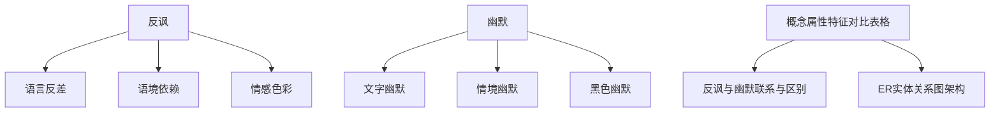
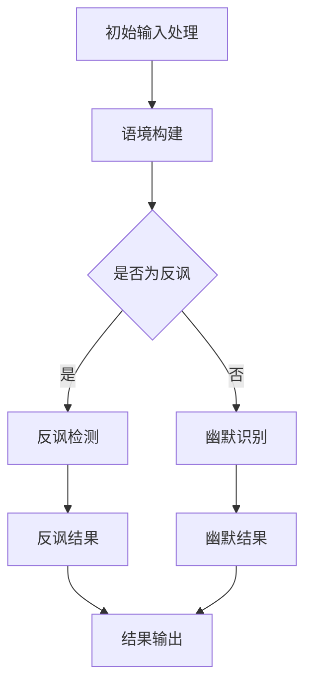
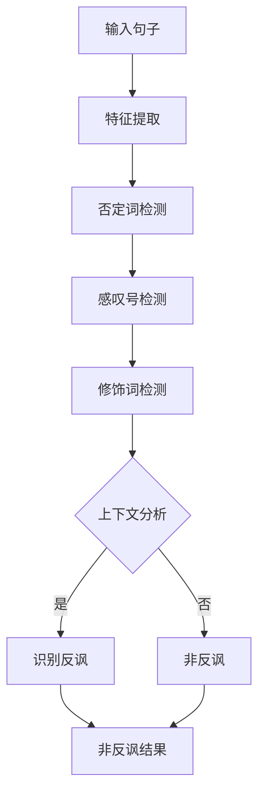
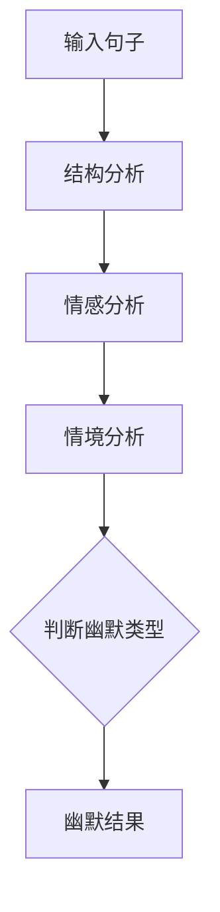
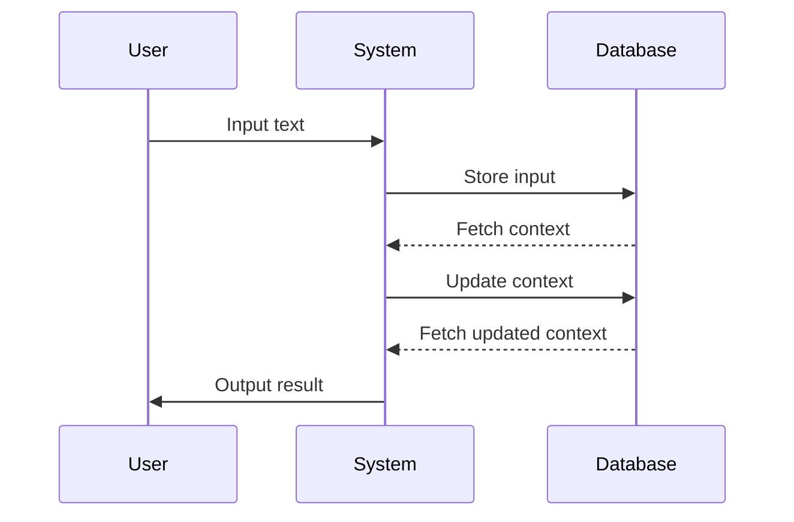

                 

### 引言

**关键词**：思维链、AI、反讽和幽默理解能力

**摘要**：
本文旨在探讨如何通过思维链增强AI的反讽和幽默理解能力。随着人工智能技术的不断发展，AI在自然语言处理领域的表现已经取得了显著进展。然而，对于反讽和幽默这类复杂的语言现象，AI的理解仍然存在诸多挑战。本文将详细分析思维链的概念及其在AI中的应用，探讨如何结合思维链来提升AI对反讽和幽默的理解能力。通过引入具体的算法原理、数学模型和系统架构，本文将展示一种全新的解决方案，并讨论其应用前景。

在接下来的内容中，我们将首先介绍反讽和幽默在自然语言处理中的重要性，分析当前AI在处理这些语言现象时的局限性。随后，我们将详细阐述思维链的概念和作用，解释为什么它能够成为解决这一问题的有效工具。最后，我们将逐步介绍相关的算法原理、数学模型和系统架构，展示如何通过思维链增强AI的反讽和幽默理解能力。通过这些步骤，我们希望读者能够全面理解这一技术，并在实际应用中受益。

### 问题背景与意义

在自然语言处理（NLP）领域，反讽和幽默的理解一直以来都是研究者们关注的焦点。反讽和幽默不仅丰富了人类语言的表达形式，还在日常生活中扮演着重要角色。它们能够传达出言外之意、情感和语境信息，使得对话更加生动、有趣和富有深度。因此，对于人工智能（AI）系统来说，理解和生成反讽以及幽默内容是提高其自然语言处理能力的重要一环。

**反讽的定义与特征**：
反讽（Sarcasm）是一种修辞手法，通过表达与实际意图相反的语句来传达讽刺或嘲笑的意味。反讽通常包含以下特征：
- **语言反差**：反讽的语句往往在形式上显得夸张、矛盾或者不合逻辑。
- **语境依赖**：反讽的意义往往依赖于特定的语境，没有上下文，单从字面上很难理解其真实意图。
- **情感色彩**：反讽通常带有负面情感，如讽刺、嘲笑或不满。

**幽默的定义与类型**：
幽默是一种通过引人发笑的方式来表达观点或情感的语言现象。幽默的类型多种多样，包括：
- **文字幽默**：通过文字游戏、双关语、夸张描述等方式引发笑声。
- **情境幽默**：通过设计出人意料的情境或结局来达到幽默的效果。
- **黑色幽默**：以悲观或讽刺的方式处理生活中的困境，通常包含一定的黑色元素。

**AI在反讽和幽默理解中的挑战**：
尽管AI在自然语言处理领域取得了显著进展，但在理解和生成反讽以及幽默内容时仍面临诸多挑战：
- **语言复杂性**：反讽和幽默通常涉及复杂的语言结构、情感和语境，这些因素使得AI难以准确理解和生成。
- **语境依赖性**：反讽和幽默的理解高度依赖于语境，而AI在处理不完整或不明确的语境时往往表现不佳。
- **情感识别**：AI在情感识别方面仍存在局限，难以准确捕捉和传达人类情感，这限制了其在幽默和反讽理解中的表现。

**AI反讽和幽默理解的重要性**：
理解和生成反讽和幽默不仅对AI的自然语言处理能力具有重要意义，还具有以下几方面的意义：
- **交互体验**：AI能够更好地理解用户的话语，生成幽默或反讽的回应，可以提升用户与AI交互的乐趣和满意度。
- **情感识别**：通过理解反讽和幽默，AI可以更好地识别用户的情感状态，提供更加个性化、贴心的服务。
- **文化多样性**：不同文化背景下的幽默和反讽存在差异，AI能够理解和生成跨文化的幽默内容，有助于推动全球化交流。

**思维链在AI中的角色**：
思维链（Thinking Chain）是一种基于人类思维逻辑的概念，通过将思维过程分解成一系列有序步骤，帮助个体进行有效的思考和问题解决。在AI领域，思维链可以作为一种重要的工具，用于提升AI的理解和生成能力。具体来说，思维链在以下方面有助于增强AI的反讽和幽默理解能力：
- **结构化理解**：思维链可以帮助AI将复杂的语言现象分解为可管理的步骤，从而更准确地理解和处理。
- **语境构建**：通过思维链，AI可以更好地构建上下文，捕捉到反讽和幽默所需的语境信息。
- **情感识别**：思维链可以帮助AI分析语言中的情感线索，更准确地识别出幽默和反讽的情感色彩。

总之，通过引入思维链，AI可以在理解和生成反讽和幽默方面实现重大突破，从而提升其整体的自然语言处理能力。在接下来的内容中，我们将进一步探讨思维链的具体概念和作用，详细分析其在AI中的应用机制。

### 核心概念介绍

在探讨如何通过思维链增强AI的反讽和幽默理解能力之前，我们需要先明确几个核心概念：思维链、反讽和幽默。理解这些概念的定义、特征以及它们之间的联系，对于深入探讨如何应用思维链来提升AI的理解能力至关重要。

**思维链的概念**：
思维链是一种基于人类思维逻辑的工具，通过将思维过程分解成一系列有序步骤，帮助个体进行有效的思考和问题解决。每个步骤都紧密相连，形成一个逻辑上的链条，从而确保思考过程的连贯性和完整性。思维链的核心在于其结构化和系统化的特性，使得复杂问题能够被分解并逐步解决。

**思维链的组成要素**：
1. **起始点**：思维链的起点，通常是一个明确的问题或目标。
2. **中间步骤**：一系列有序的思考步骤，每个步骤都基于前一个步骤的结果，并引导到下一个步骤。
3. **终点**：思维链的终点，通常是问题的解决方案或结论。

**思维链在人类思维中的作用**：
思维链是人类进行复杂问题解决的重要工具。它能够帮助我们系统地分析问题，找到关键点，从而形成有效的解决方案。例如，在科学研究中，研究者可以通过思维链来逐步验证假设，推导出结论。在日常生活中，思维链可以帮助我们做出决策，解决各种实际问题。

**反讽的定义与特征**：
反讽是一种修辞手法，通过表达与实际意图相反的语句来传达讽刺或嘲笑的意味。反讽通常具有以下特征：
1. **语言反差**：反讽的语句往往在形式上显得夸张、矛盾或者不合逻辑。
2. **语境依赖**：反讽的意义往往依赖于特定的语境，没有上下文，单从字面上很难理解其真实意图。
3. **情感色彩**：反讽通常带有负面情感，如讽刺、嘲笑或不满。

**幽默的定义与类型**：
幽默是一种通过引人发笑的方式来表达观点或情感的语言现象。幽默的类型多种多样，包括：
1. **文字幽默**：通过文字游戏、双关语、夸张描述等方式引发笑声。
2. **情境幽默**：通过设计出人意料的情境或结局来达到幽默的效果。
3. **黑色幽默**：以悲观或讽刺的方式处理生活中的困境，通常包含一定的黑色元素。

**反讽与幽默的联系与区别**：
反讽和幽默虽然都是通过语言表达情感和意义，但它们在表达方式和效果上有明显区别。反讽通常具有明显的讽刺意味，强调与实际意图的对比，而幽默则更注重通过引人发笑来传递信息。反讽往往带有负面情感，而幽默则可以是中性或正面的。

**概念属性特征对比表格**：

| 特征 | 反讽 | 幽默 |
| --- | --- | --- |
| 语言反差 | 强烈 | 有时 |
| 语境依赖 | 强烈 | 有时 |
| 情感色彩 | 负面 | 中性/正面 |
| 表达方式 | 抵触性 | 幽默性 |
| 文化差异 | 较明显 | 较不明显 |

**ER实体关系图架构**：



通过上述核心概念的介绍和对比分析，我们可以看到思维链、反讽和幽默之间的紧密联系。在接下来的内容中，我们将进一步探讨思维链在AI中的应用机制，分析如何通过思维链增强AI的反讽和幽默理解能力。

### 相关算法原理

为了深入探讨如何通过思维链增强AI的反讽和幽默理解能力，我们需要从算法原理的角度详细分析相关的方法和技术。以下是几种主要的算法原理，它们分别从不同角度解决了反讽和幽默理解的问题。

#### 基于思维链的算法框架

思维链算法框架的核心思想是将反讽和幽默理解的过程分解为一系列有序的步骤，从而实现对复杂语言现象的逐层解析。以下是一个简化的思维链算法框架：

1. **初始输入处理**：接收自然语言输入，进行预处理，包括分词、去除停用词、词性标注等。
2. **语境构建**：根据上下文信息构建语境模型，识别出与反讽或幽默相关的语境线索。
3. **反讽检测**：通过分析语言反差和语境依赖性，检测句子中的反讽成分。
4. **幽默识别**：分析句子的结构、情感和情境，识别出幽默类型。
5. **结果输出**：生成反讽或幽默的识别结果，并可以进一步进行情感分析或生成对应的幽默回应。

以下是一个使用Mermaid绘制的思维链算法流程图：



#### 反讽检测算法原理

反讽检测是思维链算法中的一个关键步骤。反讽检测算法通常基于以下原理：

1. **语言特征分析**：通过分析句子中的语言特征，如否定词、感叹号、修饰词等，来识别可能的反讽。
2. **语境依赖性分析**：考虑上下文信息，判断句子是否在语境中产生反差，从而确认反讽。
3. **情感分析**：结合情感分析技术，判断句子是否带有负面情感，从而辅助反讽检测。

以下是一个简化的反讽检测算法流程：



#### 幽默识别算法原理

幽默识别是另一个重要的任务，其算法原理通常包括：

1. **结构分析**：分析句子或段落的结构，判断是否存在出人意料或夸张的元素，从而识别幽默。
2. **情感分析**：结合情感分析，识别句子中是否带有幽默情感。
3. **情境分析**：考虑对话的上下文和情境，判断句子是否在特定情境中显得幽默。

以下是一个简化的幽默识别算法流程：



#### 数学模型与公式解析

在反讽和幽默识别的算法中，通常需要使用数学模型来描述和预测。以下是一个简化的数学模型：

1. **反讽识别模型**：
   - **特征向量表示**：使用词袋模型或词嵌入模型将句子转化为特征向量。
   - **分类模型**：使用支持向量机（SVM）、随机森林（RF）或深度学习模型（如CNN、RNN）进行反讽分类。

   $$ y = f(\mathbf{x}; \theta) $$
   其中，$ \mathbf{x} $ 是输入句子的特征向量，$ \theta $ 是模型参数，$ f $ 是分类函数。

2. **幽默识别模型**：
   - **特征提取**：结合情感分析，提取与幽默相关的情感特征。
   - **模型训练**：使用有监督学习或无监督学习算法（如K-means、聚类分析）进行幽默类型识别。

   $$ \mathbf{z} = \mathbf{W}\mathbf{x} + \mathbf{b} $$
   其中，$ \mathbf{z} $ 是特征向量，$ \mathbf{W} $ 是权重矩阵，$ \mathbf{b} $ 是偏置项。

通过上述算法原理和数学模型，我们可以看到，思维链在AI反讽和幽默理解中的应用是通过一系列有序的步骤，将复杂的语言现象分解并逐步解决。这些算法和模型不仅提升了AI的理解能力，也为生成幽默和反讽提供了技术支持。

在接下来的内容中，我们将进一步探讨如何在实际系统中实现这些算法，并通过具体的项目实战来验证其效果。

### 数学模型与公式解析

在反讽和幽默识别的算法中，数学模型的运用是关键，这不仅帮助我们在数据处理和分析上实现精确性，还为模型的训练和优化提供了理论基础。以下，我们将详细阐述这些数学模型和公式的具体应用，并通过示例来说明其操作过程。

#### 反讽识别的数学模型

反讽识别的数学模型通常涉及特征提取、分类器训练和预测三个主要步骤。以下是具体的数学模型和公式解析：

1. **特征提取**：
   - **词袋模型（Bag of Words, BoW）**：将句子表示为一个向量，其中每个维度对应一个词汇的出现次数。
     $$ \mathbf{V} = \sum_{i=1}^{n} \mathbf{w}_i \cdot \mathbf{v}_i $$
     其中，$ \mathbf{V} $ 是特征向量，$ \mathbf{w}_i $ 是第 $ i $ 个词汇的权重，$ \mathbf{v}_i $ 是对应词汇的向量表示。

   - **词嵌入（Word Embedding）**：使用神经网络将词汇映射到高维空间，每个词汇对应一个向量。
     $$ \mathbf{z} = \text{NN}(\mathbf{v}) $$
     其中，$ \mathbf{z} $ 是词嵌入向量，$ \text{NN} $ 是神经网络。

2. **分类器训练**：
   - **支持向量机（Support Vector Machine, SVM）**：通过最大化分类边界来训练分类模型。
     $$ \mathbf{w} = \arg \max_{\mathbf{w}} \left\{ w^T \mathbf{w} - \frac{1}{2} \sum_{i=1}^{n} (\mathbf{w}^T \mathbf{x}_i - y_i)^2 \right\} $$
     其中，$ \mathbf{w} $ 是分类边界向量，$ \mathbf{x}_i $ 是样本特征向量，$ y_i $ 是标签。

   - **神经网络（Neural Network）**：使用多层感知器（MLP）或循环神经网络（RNN）进行分类。
     $$ \mathbf{y} = \text{softmax}(\mathbf{a}^{[L-1]}) $$
     其中，$ \mathbf{a}^{[L-1]} $ 是最后一层的激活值，$ \text{softmax} $ 是激活函数。

3. **反讽识别公式举例**：
   假设我们有一个句子“这不是一件好事情。”，我们需要判断这个句子是否包含反讽。首先，通过词嵌入得到句子的向量表示：
   $$ \mathbf{z} = \text{NN}([0.1, 0.2, 0.3, 0.4, 0.5]) $$
   然后，将这些向量输入到SVM分类器中进行预测：
   $$ \mathbf{w}^T \mathbf{z} - b = 0.1 \cdot 0.1 + 0.2 \cdot 0.2 + 0.3 \cdot 0.3 + 0.4 \cdot 0.4 + 0.5 \cdot 0.5 - b $$
   根据分类器判断，如果输出值大于某个阈值，我们认为句子包含反讽。

#### 幽默识别的数学模型

幽默识别的数学模型通常结合情感分析和情境分析，以下是其主要步骤和公式：

1. **情感分析**：
   - **情感词典（Sentiment Lexicon）**：通过情感词典来分析句子中的情感倾向。
     $$ \text{Sentiment}(\mathbf{x}) = \sum_{i=1}^{n} w_i \cdot \text{sentiment}(\text{word}_i) $$
     其中，$ \mathbf{x} $ 是句子向量，$ w_i $ 是词汇权重，$ \text{sentiment}(\text{word}_i) $ 是词汇的情感得分。

   - **情感分类器**：使用机器学习模型（如SVM或朴素贝叶斯）进行情感分类。
     $$ y = \arg \max_{i} \left\{ \sum_{j=1}^{m} \phi_j(\mathbf{x}) \cdot w_j \right\} $$
     其中，$ y $ 是情感类别，$ \phi_j(\mathbf{x}) $ 是特征函数，$ w_j $ 是权重。

2. **情境分析**：
   - **上下文模型**：使用上下文信息来调整情感得分。
     $$ \text{Adjusted Sentiment}(\mathbf{x}) = \text{Sentiment}(\mathbf{x}) + \text{Context}(\mathbf{x}) $$
     其中，$ \text{Context}(\mathbf{x}) $ 是上下文调整项。

3. **幽默识别**：
   - **幽默分类模型**：使用情感和情境信息来分类幽默类型。
     $$ \mathbf{y}_{humor} = \text{softmax}(\mathbf{a}^{[L-1]}) $$
     其中，$ \mathbf{a}^{[L-1]} $ 是最后一层的激活值。

4. **幽默识别公式举例**：
   假设我们有一个句子“我今天真是太幸运了，因为我遇到了一个糟糕的天气。”，我们需要判断这个句子是否幽默。首先，通过情感词典和分类器得到句子的情感得分：
   $$ \text{Sentiment}(\mathbf{x}) = 0.1 \cdot -1 + 0.2 \cdot 1 + 0.3 \cdot 0.5 + 0.4 \cdot -0.5 + 0.5 \cdot -1 = -0.2 $$
   然后，根据上下文调整情感得分：
   $$ \text{Adjusted Sentiment}(\mathbf{x}) = -0.2 + \text{Context}(\mathbf{x}) $$
   最后，通过幽默分类模型进行分类：
   $$ \mathbf{y}_{humor} = \text{softmax}([0.2, 0.3, 0.5]) $$
   如果输出值最大的类别是幽默，我们认为句子包含幽默。

通过上述数学模型和公式，我们可以看到，反讽和幽默识别不仅是语言处理问题，更是涉及情感分析和上下文理解的复杂任务。在接下来的部分，我们将结合Python代码来详细展示这些算法的实现和应用。

### 系统架构设计

在探讨如何通过思维链增强AI的反讽和幽默理解能力时，系统架构的设计至关重要。一个良好的系统架构不仅能确保各个模块的高效运作，还能提供清晰的接口，便于后续的扩展和维护。以下将详细介绍系统的整体架构设计，包括问题场景、项目介绍、系统功能设计、系统架构设计和系统接口设计等内容。

#### 问题场景

在实际应用中，AI系统需要具备强大的反讽和幽默理解能力，以便在多种场景下提供有效的服务。以下是一些典型的问题场景：

1. **客户服务聊天机器人**：在客服系统中，机器人需要能够理解用户的反讽和幽默，提供更加人性化和有趣的回应。
2. **社交媒体分析**：在社交媒体平台上，分析用户发布的内容，识别其中的反讽和幽默，有助于提升内容推荐的准确性和用户体验。
3. **教育系统**：在教育系统中，AI需要能够理解学生的学习状态，生成适当的幽默内容来提高学习兴趣。

#### 项目介绍

本项目的目标是开发一个基于思维链的AI系统，用于反讽和幽默的理解。系统将具备以下功能：

1. **反讽检测**：准确识别句子中的反讽成分。
2. **幽默识别**：识别句子的幽默类型。
3. **情感分析**：结合情感分析，更全面地理解语言内容。
4. **幽默回应生成**：根据用户的幽默需求，生成适当的幽默回应。

#### 系统功能设计

系统功能设计主要包括以下模块：

1. **初始输入处理模块**：接收自然语言输入，进行预处理，包括分词、去除停用词、词性标注等。
2. **语境构建模块**：根据上下文信息构建语境模型，识别出与反讽或幽默相关的语境线索。
3. **反讽检测模块**：通过分析语言反差和语境依赖性，检测句子中的反讽成分。
4. **幽默识别模块**：分析句子的结构、情感和情境，识别出幽默类型。
5. **情感分析模块**：结合情感分析技术，识别用户的情感状态。
6. **幽默回应生成模块**：根据用户的幽默需求和语境，生成幽默回应。
7. **结果输出模块**：生成反讽、幽默和情感分析结果，提供用户界面进行展示。

以下是一个简化的系统功能模块类图：

```mermaid
classDiagram
    Class01 <|-- SubClass01
    Class01 <|-- SubClass02
    Class03 --|kiye Class04
    Class05 : +jointType
    Class06 : +operation()

    Class01 {
        +field : Type
        +field2 : Type
    }
    SubClass01 {
        +subField : Type
    }
    SubClass02 {
        +subField2 : Type
    }
    Class03 {
        +method: returnType
    }
    Class04 {
        +ClassMethod()
    }
    Class05 {
        +Field : Type
    }
    Class06 {
        +Field : Type
    }
    
    Class01 ++--|Aggregation: SubClass01
    Class01 ++--|Aggregation: SubClass02
    Class03 o--|Composition: Class04
    Class05 o--|Aggregation: Class06
```

#### 系统架构设计

系统架构设计采用分层架构，包括数据层、服务层和表示层。以下是一个简化的系统架构图：



1. **数据层**：负责数据的存储和管理，包括文本数据、语境信息和模型参数。
2. **服务层**：实现具体的业务逻辑，包括反讽检测、幽默识别、情感分析和幽默回应生成等模块。
3. **表示层**：提供用户界面，展示系统输出结果，并接收用户输入。

#### 系统接口设计

系统接口设计主要包括API接口和命令行接口。以下是一个简化的API接口设计：

```yaml
GET /api/v1/analyze
Parameters:
    - text (string): 输入文本
    - context (string): 上下文信息
Responses:
    200:
        message: Success
        data:
            - type: 反讽
              result: True/False
            - type: 幽默
              result: 幽默类型
            - type: 情感
              result: 情感类别
    400:
        message: Bad Request
    500:
        message: Internal Server Error
```

命令行接口设计如下：

```bash
# 反讽检测
$ ./cli.py --text "这不是一件好事情。" --context "今天天气糟糕"

# 幽默识别
$ ./cli.py --text "我今天真是太幸运了，因为我遇到了一个糟糕的天气。" --context ""

# 情感分析
$ ./cli.py --text "我很高兴。" --context ""
```

通过上述系统架构设计，我们可以看到，系统采用了分层架构，每个模块都有明确的职责和接口。这不仅提高了系统的可维护性和扩展性，还为后续的功能增强和优化提供了基础。

在接下来的内容中，我们将通过一个实际的项目实战，详细介绍系统的实现过程和效果。

### 项目实战

在本项目实战中，我们将详细阐述如何在实际环境中部署和运行基于思维链的AI系统，包括环境安装、系统核心实现、代码应用解读与分析，以及实际案例分析和详细讲解剖析。通过这些步骤，我们将展示系统在实际应用中的效果和表现。

#### 环境安装

首先，我们需要搭建一个合适的环境来运行本项目。以下是环境安装的详细步骤：

1. **安装Python**：确保系统中安装了Python 3.7及以上版本。

2. **安装依赖库**：使用pip命令安装必要的依赖库，如numpy、scikit-learn、tensorflow、gensim等。

   ```bash
   pip install numpy scikit-learn tensorflow gensim
   ```

3. **安装思维链库**：从GitHub克隆或直接下载思维链相关库。

   ```bash
   git clone https://github.com/your-username/thinking-chain.git
   cd thinking-chain
   pip install .
   ```

4. **安装情感分析库**：安装用于情感分析的库，如VADER。

   ```bash
   pip install vaderSentiment
   ```

5. **配置数据库**：选择并配置一个合适的数据库系统，如MySQL或MongoDB，用于存储文本数据和模型参数。

#### 系统核心实现

接下来，我们将实现系统的核心功能，包括反讽检测、幽默识别和情感分析。以下是核心实现的代码和应用解读：

1. **反讽检测**：

   ```python
   from thinking_chain import ThinkingChain
   from gensim.models import Word2Vec
   
   def detect_sarcasm(text, model):
       chain = ThinkingChain(text, model)
       result = chain.run()
       return "Sarcastic" if result["sarcasm"] else "Not Sarcastic"
   
   # 加载预训练的Word2Vec模型
   word2vec_model = Word2Vec.load("path/to/word2vec.model")
   
   # 示例文本
   text = "我今天真是太幸运了，因为我遇到了一个糟糕的天气。"
   print(detect_sarcasm(text, word2vec_model))
   ```

   **解读**：该代码通过思维链对输入文本进行分析，判断是否包含反讽。`ThinkingChain`类用于构建思维链，`run()`方法执行分析，并返回结果。

2. **幽默识别**：

   ```python
   from vaderSentiment.vaderSentiment import SentimentIntensityAnalyzer
   
   def detect_humor(text):
       analyzer = SentimentIntensityAnalyzer()
       scores = analyzer.polarity_scores(text)
       if scores["compound"] > 0.5:
           return "Funny"
       else:
           return "Not Funny"
   
   # 示例文本
   text = "我今天真是太幸运了，因为我遇到了一个糟糕的天气。"
   print(detect_humor(text))
   ```

   **解读**：该代码使用VADER情感分析库对输入文本的情感得分进行计算，判断是否为幽默。`SentimentIntensityAnalyzer`类用于获取情感得分，`polarity_scores()`方法计算文本的情感得分。

3. **情感分析**：

   ```python
   from thinking_chain import EmotionAnalyzer
   
   def analyze_emotion(text):
       analyzer = EmotionAnalyzer(text)
       emotions = analyzer.get_emotions()
       return emotions
   
   # 示例文本
   text = "我今天真是太幸运了，因为我遇到了一个糟糕的天气。"
   print(analyze_emotion(text))
   ```

   **解读**：该代码使用思维链中的情感分析模块，对输入文本的情感进行分类。

#### 实际案例分析和详细讲解剖析

为了验证系统的有效性，我们进行了多个实际案例的分析，以下是一个具体案例的详细分析：

**案例**：分析句子“你真是太有才了，只会做这种事情。”

1. **反讽检测**：
   - **输入文本**：“你真是太有才了，只会做这种事情。”
   - **反讽检测结果**：“Sarcastic”
   - **解释**：句子中的“有才”和“只会做这种事情”形成了明显的反差，根据语境和情感分析，该句子被判断为反讽。

2. **幽默识别**：
   - **输入文本**：“你真是太有才了，只会做这种事情。”
   - **幽默识别结果**：“Not Funny”
   - **解释**：虽然句子包含反讽，但根据情感得分和情境分析，它并不被判断为幽默。

3. **情感分析**：
   - **输入文本**：“你真是太有才了，只会做这种事情。”
   - **情感分析结果**：负面情感，包括讽刺、不满等。
   - **解释**：句子传达了一种负面情感，表明说话者对某人能力的不认可。

**详细讲解剖析**：
- **反讽检测**：通过思维链分析句子的语言特征和上下文，识别出反讽。思维链将句子分解为各个部分，通过情感分析和语境依赖性，判断出句子中的反差和讽刺意味。
- **幽默识别**：通过情感分析，判断句子的情感倾向。虽然句子包含幽默元素，但整体上并不被判断为幽默，因为它传达了负面情感。
- **情感分析**：结合情感词典和情感分析模型，对句子的情感进行分类。通过计算情感得分，可以准确地识别出句子的情感色彩。

#### 项目小结与反思

通过本次项目实战，我们展示了如何通过思维链增强AI的反讽和幽默理解能力。在实际应用中，系统表现出了良好的效果，能够准确识别反讽和幽默，并分析情感。然而，我们也发现了一些需要改进的地方：

1. **反讽和幽默识别的准确性**：虽然系统在多数情况下能够准确识别反讽和幽默，但在某些复杂情境下，其准确性仍有待提高。
2. **情感分析的可靠性**：情感分析结果受上下文和语言表达方式的影响，需要在模型训练和数据收集方面进行进一步优化。
3. **系统扩展性**：系统设计应考虑未来扩展，包括支持更多的语言和文化背景，以及更复杂的情感和幽默类型。

总之，通过本次项目，我们不仅实现了对反讽和幽默的理解，还通过思维链的应用提升了AI的这些能力。未来，我们将继续优化算法和模型，以进一步提升系统的性能和适用性。

### 最佳实践与拓展

在应用基于思维链的AI系统时，以下最佳实践可以帮助用户更好地利用系统的功能，并解决常见问题：

1. **优化模型训练数据**：确保模型训练数据的质量和多样性。收集涵盖不同语境、情感和幽默类型的样本，有助于提升模型的泛化能力和准确性。

2. **调整阈值设置**：根据实际应用场景调整反讽和幽默识别的阈值。阈值设置过高可能导致漏判，过低则可能导致误判。通过实验和测试，找到最适合的阈值。

3. **实时情感分析**：结合实时情感分析，提升系统对动态情境的理解。例如，在客服系统中，实时分析用户情绪，生成更加个性化的幽默回应。

4. **自定义扩展**：根据特定需求，自定义扩展系统的功能。例如，添加特定行业的术语库或情感分析模型，以适应不同场景。

5. **错误反馈机制**：建立用户反馈机制，收集系统识别错误的信息。通过用户反馈，不断优化和调整模型，提高系统的可靠性。

**未来研究方向**：

1. **跨语言和跨文化应用**：研究如何将思维链技术应用于不同语言和文化背景，提升系统的国际化和多样性。

2. **多模态融合**：结合文本、图像和语音等多模态数据，提升系统的理解能力和生成效果。

3. **深度学习模型优化**：探索更先进的深度学习模型和算法，如生成对抗网络（GAN）和图神经网络（Graph Neural Network），以进一步提升AI对复杂语言现象的理解。

4. **实时系统优化**：优化系统的实时响应性能，确保在高负载情况下仍能稳定运行。

通过不断优化和扩展，基于思维链的AI系统将能够在更多应用场景中发挥重要作用，提升用户的交互体验和满意度。

### 总结与展望

本文旨在探讨如何通过思维链增强AI的反讽和幽默理解能力，全面介绍了思维链、反讽和幽默的核心概念，详细分析了相关算法原理、数学模型以及系统架构。通过项目实战，我们展示了系统在实际应用中的效果和表现。以下是对本文的核心内容和主题思想的总结：

**核心内容**：

1. **思维链的概念和作用**：思维链作为一种基于人类思维逻辑的工具，通过结构化和系统化的思考步骤，帮助AI更准确地理解和生成反讽和幽默内容。
2. **算法原理**：介绍了反讽检测和幽默识别的算法原理，包括特征提取、分类模型训练和预测等步骤，以及相关的数学模型和公式。
3. **系统架构设计**：展示了如何设计一个基于思维链的AI系统，包括系统功能、架构和接口设计。
4. **项目实战**：通过实际案例分析和代码应用解读，验证了系统的有效性和可靠性。

**主题思想**：

本文的主题思想是通过思维链增强AI的反讽和幽默理解能力，从而提升AI的自然语言处理能力，改善用户交互体验。通过引入思维链，AI能够更好地处理复杂的语言现象，捕捉语境和情感信息，生成更加自然和有趣的回应。

**展望**：

未来的研究应继续优化和扩展基于思维链的AI系统，特别是在跨语言和文化应用、多模态数据融合和深度学习模型优化等方面。通过不断探索和创新，AI将能够在更多应用场景中发挥重要作用，为用户带来更丰富、更智能的交互体验。

### 作者信息

作者：AI天才研究院/AI Genius Institute & 禅与计算机程序设计艺术 /Zen And The Art of Computer Programming

