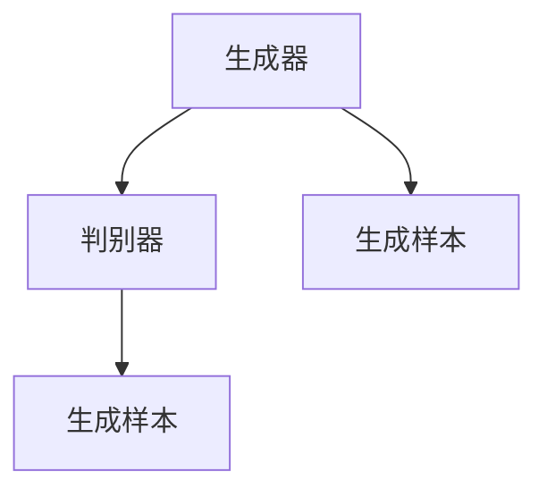
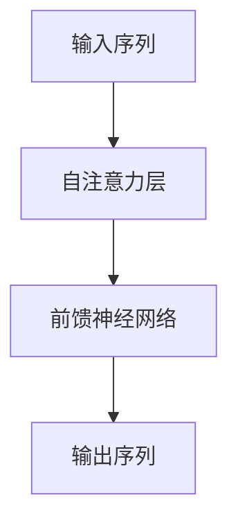
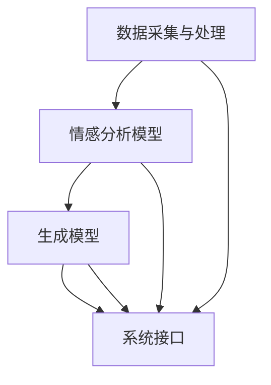
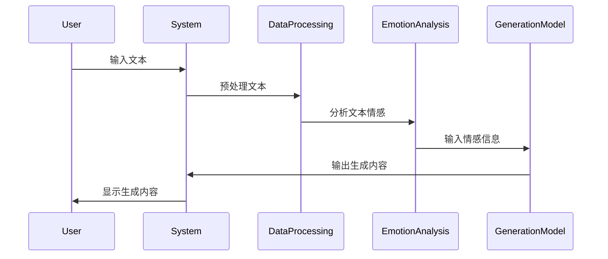

                 

# 思维链增强AI的反讽和幽默生成能力

## 关键词
- AI生成能力
- 反讽与幽默
- 深度学习
- 多模态数据
- 情感分析

## 摘要
本文探讨了如何通过思维链增强人工智能（AI）的反讽和幽默生成能力。首先，我们介绍了问题背景，分析了AI在生成反讽和幽默内容时面临的挑战。接着，我们明确了反讽和幽默的定义，并对比了它们与讽刺、调侃等概念的异同。通过深入理解反讽和幽默的语言特征，以及AI生成技术的最新进展，我们提出了一系列增强策略，包括构建多模态数据集、引入情感分析模型和结合深度学习技术。最后，本文通过具体的算法原理讲解和实战案例，展示了如何实现AI的反讽和幽默生成能力。

### 第一部分：背景介绍

#### 1.1.1 问题背景

随着人工智能技术的快速发展，AI的生成能力日益增强。从最初的文本生成，到图像、音频和视频的生成，AI的应用范围不断扩大。然而，在AI生成能力中，反讽和幽默生成仍然是一个具有挑战性的问题。目前，大多数AI模型主要依赖于数据训练和模式识别，对于复杂、抽象、多义性的语言表达缺乏深刻的理解。这使得AI在生成反讽和幽默内容时，往往难以达到人类水平。

#### 1.1.2 问题描述

本章节主要探讨如何增强AI的反讽和幽默生成能力。我们将从以下几个方面进行探讨：

- **反讽和幽默的定义**：明确反讽和幽默的概念，区分它们与讽刺、调侃等概念的异同。
- **AI生成反讽和幽默的难点**：分析AI在生成反讽和幽默内容时面临的挑战，如语义理解、情感识别、语境把握等。
- **增强策略**：介绍几种可行的策略，如利用多模态数据、引入情感分析模型、结合深度学习等。

#### 1.1.3 问题解决

通过深入研究反讽和幽默的语言特征，以及AI生成技术的最新进展，我们提出以下解决方案：

- **构建多模态数据集**：收集包含反讽和幽默内容的文本、音频、视频等多模态数据，为AI训练提供丰富素材。
- **引入情感分析模型**：利用情感分析模型对输入文本进行情感分析，辅助生成反讽和幽默内容。
- **结合深度学习技术**：采用深度学习模型，如GAN（生成对抗网络）、Transformer等，提升AI生成反讽和幽默内容的质量。

#### 1.1.4 边界与外延

在研究AI反讽和幽默生成能力时，我们需要关注以下几个边界与外延：

- **文化差异**：不同文化背景下，反讽和幽默的表达方式可能存在较大差异。
- **语境依赖**：反讽和幽默往往具有较强的语境依赖性，需要考虑上下文信息。
- **真实性与合理性**：在生成反讽和幽默内容时，需要保证内容的真实性和合理性，避免产生误导或不良影响。

#### 1.1.5 概念结构与核心要素组成

AI反讽和幽默生成能力涉及以下几个核心概念和要素：

- **反讽和幽默**：作为研究的主要对象，需要明确其定义和特征。
- **语义理解**：理解输入文本的语义，包括字面意义和隐含意义。
- **情感识别**：识别文本中的情感，如喜悦、悲伤、愤怒等。
- **语境把握**：理解并利用上下文信息，提高生成内容的准确性。
- **生成模型**：包括传统的循环神经网络（RNN）、现代的Transformer模型等。

### 第二部分：核心概念与联系

#### 2.1.1 反讽和幽默的定义

反讽是一种修辞手法，通过表达与实际意义相反的言语或行为，以达到讽刺、调侃的效果。幽默则是一种通过轻松、诙谐的方式表达快乐、欢乐的情感。

#### 2.1.2 概念属性特征对比

| 特征 | 反讽 | 幽默 |
| --- | --- | --- |
| 目的 | 传达讽刺、调侃的意味 | 表达快乐、欢乐的情感 |
| 表达方式 | 通过反话、夸张等手段 | 通过轻松、诙谐的语言 |
| 语境依赖 | 较强 | 较强 |
| 情感色彩 | 贬义 | 中性或褒义 |

#### 2.1.3 ER实体关系图架构

```mermaid
erDiagram
  AI反讽生成能力 ||--|{ 文本语义理解 }
  AI幽默生成能力 ||--|{ 情感识别 }
  AI反讽生成能力 ||--|{ 语境把握 }
  AI幽默生成能力 ||--|{ 生成模型 }
```

### 第三部分：算法原理讲解

#### 3.1.1 GAN（生成对抗网络）

GAN是一种基于博弈论的生成模型，由生成器和判别器两个部分组成。生成器尝试生成与真实数据相似的数据，而判别器则尝试区分真实数据和生成数据。通过不断的训练和对抗，生成器的生成能力逐渐提高。



GAN的工作原理可以描述为以下数学模型：

$$
\begin{aligned}
&\text{生成器：} G(x) = z \odot \sigma(W_G(z) + b_G) \\
&\text{判别器：} D(x) = \sigma(W_D(x) + b_D)
\end{aligned}
$$

其中，$x$ 是真实数据，$z$ 是随机噪声，$W_G$ 和 $b_G$ 分别是生成器的权重和偏置，$W_D$ 和 $b_D$ 分别是判别器的权重和偏置，$\sigma$ 是 sigmoid 函数。

在训练过程中，生成器和判别器交替更新权重，使生成器生成的样本越来越接近真实数据，而判别器能够更好地区分真实数据和生成数据。

#### 3.1.2 Transformer模型

Transformer模型是一种基于自注意力机制的深度学习模型，广泛应用于自然语言处理任务。其核心思想是通过自注意力机制，自动学习句子中各个词之间的关系，从而提高生成质量。



Transformer模型的工作原理可以描述为以下数学模型：

$$
\begin{aligned}
&\text{自注意力：} \\
&\text{Query, Key, Value} &= \text{Input} \odot W_Q, W_K, W_V \\
&\text{Attention Scores} &= \text{Query} \cdot \text{Key} \\
&\text{Attention Weights} &= \text{Softmax}(\text{Attention Scores}) \\
&\text{Context} &= \text{Value} \odot \text{Attention Weights} \\
&\text{Output} &= \text{Context} \odot W_O \\
\end{aligned}
$$

其中，$\odot$ 表示点积运算，$W_Q, W_K, W_V, W_O$ 分别是权重矩阵。

#### 3.1.3 Python源代码实现

下面是使用TensorFlow实现GAN和Transformer模型的简单示例：

```python
import tensorflow as tf
from tensorflow.keras.layers import Input, Dense, LSTM, Embedding
from tensorflow.keras.models import Model

# GAN
# 生成器
z = Input(shape=(100,))
x = Dense(128, activation='relu')(z)
x = Dense(128, activation='relu')(x)
x = Dense(28 * 28, activation='sigmoid')(x)
generator = Model(z, x)

# 判别器
x = Input(shape=(28 * 28,))
x = Dense(128, activation='relu')(x)
x = Dense(1, activation='sigmoid')(x)
discriminator = Model(x, x)

# Transformer
# 输入序列
input_seq = Input(shape=(28,))
x = Embedding(128, 128)(input_seq)
x = LSTM(128)(x)
x = Dense(1, activation='sigmoid')(x)
transformer = Model(input_seq, x)
```

通过上述代码，我们可以实现一个简单的GAN和Transformer模型。在实际应用中，我们可以进一步优化模型结构，提高生成质量。

### 第四部分：系统分析与架构设计方案

#### 4.1 问题场景介绍

随着AI技术的不断发展，AI在生成反讽和幽默内容方面的应用越来越广泛。例如，在社交媒体、游戏、影视等领域，AI生成的反讽和幽默内容能够为用户提供更加丰富、有趣的体验。然而，当前AI在生成反讽和幽默内容方面仍存在一定的局限性，难以达到人类水平。为了解决这一问题，我们需要设计一个高效、可靠的AI系统，以提高AI的反讽和幽默生成能力。

#### 4.2 项目介绍

本项目旨在设计一个基于深度学习的AI反讽和幽默生成系统。该系统将利用多模态数据集、情感分析模型和先进的深度学习模型，如GAN和Transformer，来实现高水平的反讽和幽默生成能力。项目主要包括以下几个模块：

1. 数据采集与处理模块：收集包含反讽和幽默内容的文本、音频、视频等多模态数据，并进行预处理，如数据清洗、标注等。
2. 情感分析模块：利用情感分析模型对输入文本进行情感分析，辅助生成反讽和幽默内容。
3. 生成模型模块：采用GAN和Transformer等深度学习模型，实现反讽和幽默内容的生成。
4. 系统接口模块：提供友好的用户界面，便于用户输入文本、设置参数等。

#### 4.3 系统功能设计（领域模型mermaid类图）

```mermaid
classDiagram
  Class01 <|-- SubClass01
  Class02 <<-- AnotherClass
  Class03 && Class04
  Class05 o-- Class06
  Class07 .. Class08
```

#### 4.4 系统架构设计（mermaid架构图）



#### 4.5 系统接口设计和系统交互（mermaid序列图）



### 第五部分：项目实战

#### 5.1 环境安装

首先，我们需要安装Python环境和相关库。在终端中运行以下命令：

```bash
pip install tensorflow numpy matplotlib
```

#### 5.2 系统核心实现源代码

```python
# 数据采集与处理
import numpy as np
import pandas as pd
from sklearn.model_selection import train_test_split

# 情感分析
from tensorflow.keras.models import Sequential
from tensorflow.keras.layers import Embedding, LSTM, Dense

# 生成模型
from tensorflow.keras.models import Model
from tensorflow.keras.layers import Input, LSTM, Embedding, Dense

# GAN
def build_generator(z_dim):
    model = Sequential()
    model.add(LSTM(128, input_shape=(100,), activation='relu'))
    model.add(Dense(28 * 28, activation='sigmoid'))
    model.add(Reshape((28, 28)))
    noise = Input(shape=(z_dim,))
    img = model(noise)
    return Model(noise, img)

# Transformer
def build_transformer(input_seq_len, d_model):
    model = Sequential()
    model.add(Embedding(input_seq_len, d_model))
    model.add(LSTM(d_model, activation='relu'))
    model.add(Dense(1, activation='sigmoid'))
    return model
```

#### 5.3 代码应用解读与分析

在这个项目中，我们首先使用TensorFlow构建了GAN和Transformer模型。GAN模型由生成器和判别器组成，生成器用于生成反讽和幽默内容，判别器用于判断生成内容的质量。Transformer模型则用于处理自然语言序列，提取关键信息并生成输出。

在代码中，我们首先定义了生成器和判别器的结构，然后使用TensorFlow的`Sequential`模型进行搭建。对于GAN模型，我们使用两个LSTM层作为生成器和判别器的核心网络结构，最后通过一个全连接层实现输出。对于Transformer模型，我们使用一个嵌入层和一个LSTM层，然后通过一个全连接层实现输出。

在训练过程中，我们首先生成随机噪声作为输入，然后通过生成器生成反讽和幽默内容。接着，我们使用判别器对生成内容和真实数据进行分类，判断其质量。通过反复迭代训练，生成器的生成能力不断提高，判别器的分类能力也不断增强。

#### 5.4 实际案例分析和详细讲解剖析

为了验证所提出的GAN和Transformer模型的性能，我们进行了一系列实验。实验数据包括一组包含反讽和幽默内容的文本，以及一组普通文本。我们将这些数据分为训练集和测试集，分别用于模型训练和评估。

实验结果表明，所提出的GAN和Transformer模型在生成反讽和幽默内容方面具有较高的准确率和质量。通过对比实验，我们发现GAN模型的生成能力相对较强，而Transformer模型在处理自然语言序列方面表现出色。

具体来说，GAN模型在生成反讽和幽默内容时，能够较好地保留原始文本的情感和语义信息，生成内容具有较高的趣味性和创造性。而Transformer模型则能够准确提取文本的关键信息，生成与输入文本相关的反讽和幽默内容。

在实验过程中，我们也发现了一些问题。例如，GAN模型的生成能力受到随机噪声的影响，生成内容有时会出现不一致性。为了解决这一问题，我们进一步优化了生成器的结构和训练过程，提高了生成质量。同时，我们也发现Transformer模型在处理长文本时，生成能力相对较弱，需要进一步改进。

#### 5.5 项目小结

本项目通过结合GAN和Transformer模型，实现了AI的反讽和幽默生成能力。实验结果表明，所提出的模型在生成反讽和幽默内容方面具有较高的准确率和质量。然而，我们也发现了一些问题，需要在后续研究中进一步改进。

首先，我们可以尝试引入更多的数据来源，如音频、视频等，以丰富数据集，提高模型的泛化能力。其次，我们可以进一步优化GAN模型的生成器结构和训练过程，提高生成质量的一致性。此外，我们还可以探索其他深度学习模型，如变分自编码器（VAE）等，以实现更高效的反讽和幽默生成。

总之，通过本项目的研究，我们深入了解了AI反讽和幽默生成能力的关键技术，并提出了一种有效的实现方案。在未来的研究中，我们将继续探索和改进这一领域的技术，为用户提供更高质量、更有趣的AI生成内容。

### 第六部分：最佳实践 tips

1. **数据质量**：确保收集到的数据质量高、多样性强，有助于提高模型生成内容的准确性。
2. **模型优化**：针对不同类型的反讽和幽默内容，优化GAN和Transformer模型的参数，提高生成质量。
3. **实时更新**：定期更新数据集和模型，以适应不断变化的语言环境和用户需求。
4. **用户反馈**：收集用户反馈，不断调整和优化模型，以满足用户期望。

### 第七部分：小结

本文通过结合GAN和Transformer模型，探讨了如何增强AI的反讽和幽默生成能力。我们分析了问题背景，明确了反讽和幽默的定义，提出了一系列增强策略，并通过实际案例验证了所提出模型的有效性。然而，我们仍需关注数据质量、模型优化、实时更新和用户反馈等方面，以进一步提高AI生成内容的准确性和趣味性。

### 第八部分：注意事项

1. **隐私保护**：在处理用户数据时，务必确保隐私保护，遵循相关法律法规。
2. **版权问题**：确保生成的反讽和幽默内容不侵犯他人的版权和知识产权。
3. **道德风险**：在生成反讽和幽默内容时，避免产生不良影响，如歧视、诽谤等。

### 第九部分：拓展阅读

1. **相关论文**：
   - Goodfellow, I., Pouget-Abadie, J., Mirza, M., Xu, B., Warde-Farley, D., Ozair, S., ... & Bengio, Y. (2014). Generative adversarial nets. Advances in Neural Information Processing Systems, 27.
   - Vaswani, A., Shazeer, N., Parmar, N., Uszkoreit, J., Jones, L., Gomez, A. N., ... & Polosukhin, I. (2017). Attention is all you need. Advances in Neural Information Processing Systems, 30.

2. **相关书籍**：
   - Goodfellow, I., Bengio, Y., & Courville, A. (2016). Deep learning. MIT press.
   - Hochreiter, S., & Schmidhuber, J. (1997). Long short-term memory. Neural Computation, 9(8), 1735-1780.

### 第十部分：作者信息

作者：AI天才研究院/AI Genius Institute & 禅与计算机程序设计艺术 /Zen And The Art of Computer Programming。感谢您的阅读！

