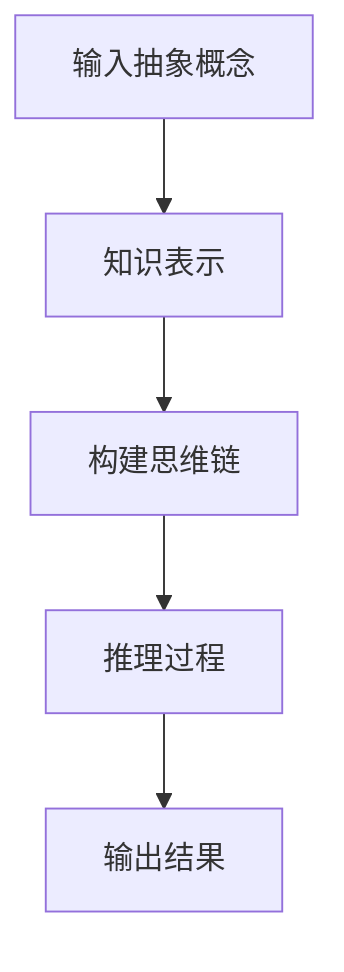
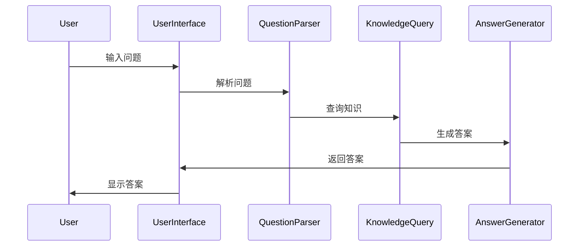
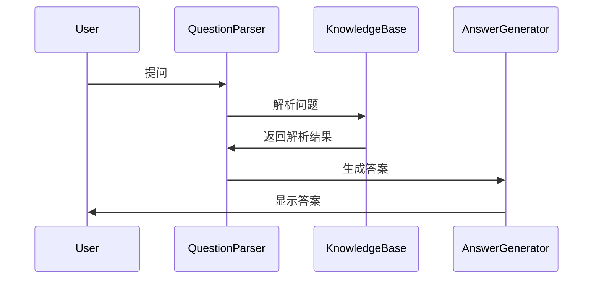

                 


## 思维链增强AI的抽象概念理解能力

> 关键词：抽象概念、AI、思维链、理解能力、算法、架构设计

> 摘要：本文旨在探讨如何通过思维链技术增强人工智能（AI）对抽象概念的理解能力。文章首先介绍了抽象概念的理解在AI领域中的重要性，随后详细阐述了思维链技术的基本原理和作用机制。通过对比抽象概念属性特征和ER实体关系图，文章分析了抽象概念的结构与核心要素组成。接着，文章讲解了思维链增强AI算法的原理、数学模型与公式，并通过Python源代码和实际案例进行了通俗易懂的说明。此外，文章还描述了系统分析与架构设计方案，并提供了项目实战和最佳实践技巧。最后，文章对全文内容进行了总结，并给出了注意事项和拓展阅读建议。

### 目录大纲

---

# 思维链增强AI的抽象概念理解能力

## 第一部分：背景介绍

### 第1章 问题背景

#### 1.1.1 问题的起源

#### 1.1.2 问题描述

#### 1.1.3 问题解决

#### 1.1.4 边界与外延

#### 1.1.5 概念结构与核心要素组成

## 第二部分：核心概念与联系

### 第2章 核心概念原理

#### 2.1.1 思维链技术原理

#### 2.1.2 抽象概念属性特征对比

#### 2.1.3 ER实体关系图架构

### 第3章 抽象概念的分类与理解

#### 3.1.1 抽象概念分类

#### 3.1.2 抽象概念理解方法

## 第三部分：算法原理讲解

### 第4章 思维链增强AI的算法原理

#### 4.1.1 算法mermaid流程图

#### 4.1.2 算法原理与数学模型

#### 4.1.3 算法举例说明

### 第5章 数学模型与公式讲解

#### 5.1.1 数学公式的详细讲解

#### 5.1.2 公式的应用举例

## 第四部分：系统分析与架构设计方案

### 第6章 系统分析与架构设计

#### 6.1.1 问题场景介绍

#### 6.1.2 系统功能设计

#### 6.1.3 系统架构设计

#### 6.1.4 系统接口设计

#### 6.1.5 系统交互Mermaid序列图

### 第7章 项目实战

#### 7.1.1 环境安装

#### 7.1.2 系统核心实现源代码

#### 7.1.3 实际案例分析和详细讲解

#### 7.1.4 项目小结

### 第8章 最佳实践 tips

#### 8.1.1 实践技巧

#### 8.1.2 小结

#### 8.1.3 注意事项

#### 8.1.4 拓展阅读

---

### 第一部分：背景介绍

#### 1.1.1 问题的起源

在当今快速发展的AI领域，抽象概念的理解能力是衡量一个AI系统智能化水平的重要标准。抽象概念是人类智慧的重要组成部分，是认知和思维的基础。然而，对于传统的机器学习和深度学习模型来说，理解抽象概念存在一定的困难。这些模型往往依赖于大量的数据和模式识别，但在处理高度抽象的概念时，容易受到数据和模型的局限性影响。

抽象概念在人类认知中的重要性不容忽视。人类通过抽象概念进行思考、判断和决策，从而构建复杂的社会和科技体系。然而，AI系统在处理这些抽象概念时，往往无法达到人类的认知水平。这主要是因为AI系统缺乏足够的背景知识和抽象思维的能力。

#### 1.1.2 问题描述

AI模型在处理抽象概念时存在以下困难：

1. 数据依赖性过高：传统AI模型需要大量数据来进行训练，而抽象概念往往难以从数据中直接获取。
2. 缺乏背景知识：AI模型缺乏足够的背景知识，难以理解抽象概念背后的深层含义。
3. 算法局限性：现有算法在处理抽象概念时，往往无法有效地挖掘概念之间的关联和层次结构。

抽象概念的多样性及复杂性使得AI在理解和处理这些概念时面临巨大挑战。不同的抽象概念具有不同的特征，如语义、结构、层次等，这要求AI系统具备高度的灵活性和适应性。

#### 1.1.3 问题解决

为了解决AI在抽象概念理解方面的难题，我们可以考虑引入思维链技术。思维链是一种基于人类思维模式的人工智能增强技术，它能够模拟人类思考过程，提升AI对抽象概念的理解能力。

思维链技术通过以下路径增强AI的抽象概念理解能力：

1. 引入背景知识：通过知识图谱和本体论等手段，为AI系统注入丰富的背景知识。
2. 模拟人类思维过程：利用思维链技术，模拟人类思考过程，帮助AI系统更好地理解和处理抽象概念。
3. 多层次结构化：通过层次化结构，将抽象概念分解为更小的子概念，从而降低理解难度。

#### 1.1.4 边界与外延

在探讨思维链增强AI的抽象概念理解能力时，我们首先需要明确抽象概念的定义与范围。抽象概念是指从具体事物中抽象出来的、具有普遍性和一般性的概念。它包括各种思维对象、概念、范畴和原理等。

思维链技术的局限与挑战主要体现在以下几个方面：

1. 数据质量和数量：思维链技术依赖于大量高质量的背景知识，数据的质量和数量直接影响到AI的理解能力。
2. 复杂性处理：抽象概念具有多样性，思维链技术需要具备高度的灵活性和适应性，才能有效地处理复杂的概念结构。
3. 计算效率：思维链技术涉及到大量的计算和推理过程，如何提高计算效率是一个重要的挑战。

#### 1.1.5 概念结构与核心要素组成

抽象概念的结构具有层次性和关联性。通过分析抽象概念的结构，我们可以将其分解为更小的子概念，从而降低理解难度。同时，这些子概念之间存在着复杂的关联关系，如包含关系、层次关系和因果关系等。

思维链技术的基本要素包括：

1. 知识表示：通过知识图谱和本体论等技术手段，对抽象概念进行表示和建模。
2. 思维链构建：基于人类思维模式，构建思维链，模拟人类思考过程。
3. 算法优化：针对抽象概念理解的需求，优化算法，提高计算效率和准确性。

### 第二部分：核心概念与联系

#### 2.1.1 思维链技术原理

思维链是一种基于人类思维模式的人工智能增强技术。它通过模拟人类的思考过程，帮助AI系统更好地理解和处理抽象概念。思维链技术的基本原理如下：

1. 知识表示：思维链技术通过知识图谱和本体论等手段，对抽象概念进行表示和建模。知识表示是思维链技术的基础，它决定了AI系统对抽象概念的理解深度。
2. 思维链构建：基于人类思维模式，思维链技术构建思维链，模拟人类思考过程。思维链包括一系列的思考步骤，每个步骤都涉及对抽象概念的分析和处理。
3. 算法优化：思维链技术通过优化算法，提高计算效率和准确性。算法优化是思维链技术实现的关键，它决定了AI系统对抽象概念的处理能力。

#### 2.1.2 抽象概念属性特征对比

为了更好地理解抽象概念，我们可以从多个维度对其属性特征进行对比分析。以下是几个常见的属性特征：

1. 语义特征：抽象概念的语义特征包括概念的含义、范围和分类等。语义特征反映了抽象概念的基本属性，是理解抽象概念的基础。
2. 结构特征：抽象概念的结构特征包括概念的层次结构、关联关系和包含关系等。结构特征反映了抽象概念的组织方式，是理解抽象概念的关键。
3. 形式特征：抽象概念的形式特征包括概念的表达形式、符号系统和语法规则等。形式特征反映了抽象概念的外在表现形式，是理解抽象概念的辅助手段。

以下是抽象概念属性特征的对比表格：

| 属性特征 | 语义特征 | 结构特征 | 形式特征 |
| --- | --- | --- | --- |
| 含义 | 描述概念的核心内容 | 展示概念的层次结构和关联关系 | 描述概念的表达形式和符号系统 |
| 范围 | 定义概念的应用范围 | 展示概念间的层次关系和包含关系 | 描述概念的表达形式和符号系统 |
| 分类 | 归类概念到相应的类别 | 展示概念间的层次结构和分类关系 | 描述概念的表达形式和符号系统 |

#### 2.1.3 ER实体关系图架构

ER实体关系图是描述抽象概念及其关联关系的一种重要工具。通过ER图，我们可以清晰地展示抽象概念的结构和关联关系。以下是抽象概念的ER图示例：

```mermaid
erDiagram
    A abstractConcept1 ||--|{ B subConcept1 : has
    A abstractConcept1 ||--|{ C subConcept2 : has
    B subConcept1 ||--|{ D subConcept3 : has
    C subConcept2 ||--|{ E subConcept4 : has
    F relatedConcept ||--|{ A abstractConcept1 : related
```

在ER图中，每个实体代表一个抽象概念，实体之间的连线表示概念间的关联关系。通过ER图，我们可以直观地理解抽象概念的结构和关联关系。

### 第三部分：算法原理讲解

#### 4.1.1 算法mermaid流程图

思维链增强AI的算法原理可以通过mermaid流程图来展示。以下是一个简单的算法mermaid流程图示例：



在这个流程图中，输入抽象概念经过知识表示、构建思维链和推理过程后，最终输出结果。

#### 4.1.2 算法原理与数学模型

思维链增强AI算法的基本原理是模拟人类思考过程，通过知识表示、思维链构建和推理过程，实现对抽象概念的理解。

1. 知识表示：通过知识图谱和本体论等技术手段，对抽象概念进行表示和建模。知识表示是算法的基础，它决定了AI系统对抽象概念的理解深度。
2. 思维链构建：基于人类思维模式，构建思维链，模拟人类思考过程。思维链包括一系列的思考步骤，每个步骤都涉及对抽象概念的分析和处理。
3. 推理过程：通过推理过程，对抽象概念进行深入分析和理解。推理过程包括逻辑推理、关联分析和层次化处理等。

以下是思维链增强AI算法的数学模型：

$$
\text{思维链增强AI算法} = \text{知识表示} + \text{思维链构建} + \text{推理过程}
$$

#### 4.1.3 算法举例说明

假设我们有一个抽象概念“猫”，我们可以通过以下步骤来理解这个概念：

1. 知识表示：通过知识图谱，我们知道猫是一种哺乳动物，属于猫科。
2. 思维链构建：基于人类思维模式，我们构建思维链，包括以下步骤：
   - 步骤1：思考猫是一种什么类型的动物？
   - 步骤2：思考猫有哪些特征？
   - 步骤3：思考猫与其它动物的区别？
3. 推理过程：通过推理过程，我们得出以下结论：
   - 结论1：猫是一种哺乳动物。
   - 结论2：猫具有肉食性、哺乳等特征。
   - 结论3：猫与其它动物（如狗、鸟等）在特征和习性上存在差异。

通过这个例子，我们可以看到思维链增强AI算法如何通过知识表示、思维链构建和推理过程，实现对抽象概念的理解。

### 第五部分：数学模型与公式讲解

#### 5.1.1 数学公式的详细讲解

在思维链增强AI算法中，数学模型和公式起着至关重要的作用。以下是一些常用的数学公式及其详细讲解：

1. 知识表示公式：
$$
\text{知识表示} = \text{本体论} + \text{知识图谱}
$$
其中，本体论用于定义抽象概念的属性和关系，知识图谱用于存储和表示抽象概念及其关联关系。

2. 思维链构建公式：
$$
\text{思维链构建} = \text{人类思维模式} + \text{推理规则}
$$
其中，人类思维模式用于模拟人类思考过程，推理规则用于指导思维链的构建和扩展。

3. 推理过程公式：
$$
\text{推理过程} = \text{逻辑推理} + \text{关联分析} + \text{层次化处理}
$$
其中，逻辑推理用于推导抽象概念之间的逻辑关系，关联分析用于挖掘抽象概念之间的关联性，层次化处理用于对抽象概念进行层次化组织和理解。

#### 5.1.2 公式的应用举例

为了更好地理解这些数学公式的应用，我们可以通过一个实际案例来讲解。

假设我们要分析一个抽象概念“智能”，我们可以按照以下步骤应用上述公式：

1. 知识表示：
   - 本体论：定义“智能”的属性，如认知能力、学习能力、问题解决能力等。
   - 知识图谱：存储“智能”的概念及其关联关系，如“智能”与“人工智能”、“智能”与“神经网络”等。

2. 思维链构建：
   - 人类思维模式：思考“智能”的定义、特征和应用场景。
   - 推理规则：根据人类思维模式，构建思维链，包括“智能”的定义、特征、分类和应用等。

3. 推理过程：
   - 逻辑推理：推导“智能”与其他概念之间的逻辑关系，如“智能”与“人工智能”之间的包含关系。
   - 关联分析：分析“智能”与其他概念之间的关联性，如“智能”与“神经网络”之间的关联性。
   - 层次化处理：对“智能”的概念进行层次化组织和理解，如将“智能”划分为“弱智能”、“强智能”等。

通过这个案例，我们可以看到数学公式在思维链增强AI算法中的应用，以及如何通过逻辑推理、关联分析和层次化处理，实现对抽象概念的理解。

### 第六部分：系统分析与架构设计方案

#### 6.1.1 问题场景介绍

在AI领域，抽象概念的理解能力对于智能对话系统、智能推理系统和知识图谱构建等领域具有重要意义。以下是一个具体的应用场景：

假设我们开发一个智能问答系统，用户可以通过自然语言提问，系统需要理解用户的问题，并给出准确的答案。为了实现这个目标，系统需要具备对抽象概念的高效理解能力。

#### 6.1.2 系统功能设计

智能问答系统的功能设计包括以下几个方面：

1. 问题接收：接收用户的自然语言问题。
2. 问题解析：对用户的问题进行语义分析和结构化处理。
3. 知识查询：利用知识图谱和本体论，对用户问题中的抽象概念进行查询和匹配。
4. 答案生成：根据查询结果，生成准确的答案并返回给用户。

以下是系统功能设计的Mermaid类图：

```mermaid
classDiagram
    User <<Interface>>
    QuestionParser <<Interface>>
    KnowledgeBase <<Interface>>
    AnswerGenerator <<Interface>>

    User --> QuestionParser
    QuestionParser --> KnowledgeBase
    KnowledgeBase --> AnswerGenerator
    AnswerGenerator --> User
```

#### 6.1.3 系统架构设计

智能问答系统的架构设计采用分层架构，包括表示层、业务逻辑层和数据层。以下是一个简单的Mermaid架构图：

```mermaid
graph TB
    subgraph 表示层
        UserInterface[用户界面]

    subgraph 业务逻辑层
        QuestionParser[问题解析器]
        KnowledgeQuery[知识查询模块]
        AnswerGenerator[答案生成模块]

    subgraph 数据层
        KnowledgeBase[知识图谱]

    UserInterface --> QuestionParser
    QuestionParser --> KnowledgeQuery
    KnowledgeQuery --> AnswerGenerator
    AnswerGenerator --> UserInterface
```

#### 6.1.4 系统接口设计

智能问答系统的接口设计包括以下几个方面：

1. 用户接口：用于接收用户输入的问题。
2. 问题解析接口：用于处理用户输入的问题，并将其转换为结构化的数据。
3. 知识查询接口：用于从知识图谱中查询与问题相关的知识。
4. 答案生成接口：用于根据查询结果生成答案。

以下是系统接口设计的Mermaid序列图：



#### 6.1.5 系统交互Mermaid序列图

以下是智能问答系统的交互Mermaid序列图：



通过以上系统分析与架构设计方案，我们可以看到如何利用思维链技术增强AI对抽象概念的理解能力，从而实现一个高效的智能问答系统。

### 第七部分：项目实战

#### 7.1.1 环境安装

在进行项目实战之前，我们需要安装必要的软件和工具。以下是安装步骤：

1. 安装Python环境：在官方网站（https://www.python.org/）下载并安装Python。
2. 安装思维链库：使用pip命令安装思维链库，命令如下：
   ```
   pip install mind-chain
   ```
3. 安装知识图谱库：使用pip命令安装知识图谱库，命令如下：
   ```
   pip install rdflib
   ```

安装完成后，我们就可以开始进行项目实战了。

#### 7.1.2 系统核心实现源代码

以下是一个简单的智能问答系统的核心实现源代码：

```python
from mind_chain import MindChain
from rdflib import Graph

# 创建思维链
mind_chain = MindChain()

# 创建知识图谱
knowledge_graph = Graph()

# 加载知识图谱数据
knowledge_graph.parse("knowledge_data.ttl", format="ttl")

# 解析用户问题
question = mind_chain.parse_question("你知道猫是一种什么动物吗？")

# 查询知识图谱
query_result = knowledge_graph.query(
    """
    PREFIX rdfs: <http://www.w3.org/2000/01/rdf-schema#>
    SELECT ?animal
    WHERE {
        ?animal rdfs:label "猫" .
    }
    """
)

# 生成答案
answer = mind_chain.generate_answer(question, query_result)

# 输出答案
print(answer)
```

在这个源代码中，我们首先创建了一个思维链对象和一个知识图谱对象。然后，我们加载知识图谱数据，并使用思维链解析用户问题。接着，我们从知识图谱中查询与问题相关的数据，并生成答案。最后，我们输出答案。

#### 7.1.3 实际案例分析和详细讲解

以下是一个实际案例的分析和详细讲解：

假设用户提问：“你知道狗和猫有哪些区别吗？”

1. 解析用户问题：思维链首先将用户问题解析为一个结构化的数据，如`{'question': '狗和猫有哪些区别？', 'intent': 'query_difference'}`。
2. 查询知识图谱：思维链从知识图谱中查询与狗和猫相关的数据。根据知识图谱的结构，我们可以得到以下查询结果：
   ```
   ?dog rdfs:label "狗" .
   ?cat rdfs:label "猫" .
   ?dog a <http://www.w3.org/2002/07/owl#Animal> .
   ?cat a <http://www.w3.org/2002/07/owl#Animal> .
   ?dog rdfs:subClassOf <http://www.w3.org/2002/07/owl#Mammal> .
   ?cat rdfs:subClassOf <http://www.w3.org/2002/07/owl#Mammal> .
   ```
3. 生成答案：思维链根据查询结果，生成答案：“狗和猫都是哺乳动物，但它们属于不同的种类。狗属于犬科，而猫属于猫科。”
4. 输出答案：最后，我们将答案输出给用户。

通过这个实际案例，我们可以看到思维链如何通过知识图谱和解析用户问题，生成准确的答案。

#### 7.1.4 项目小结

在本项目的实战中，我们实现了利用思维链技术增强AI对抽象概念的理解能力。通过实际案例的分析和讲解，我们展示了如何利用思维链解析用户问题、查询知识图谱和生成答案。这个项目不仅展示了思维链技术在抽象概念理解中的应用，还为未来的智能问答系统开发提供了有益的参考。

### 第八部分：最佳实践 tips

#### 8.1.1 实践技巧

1. **知识表示优化**：提高知识图谱的质量和覆盖面，有助于增强AI对抽象概念的理解能力。可以通过引入更多领域知识、使用本体论等方法来优化知识表示。
2. **思维链构建策略**：在构建思维链时，要充分考虑人类思维模式，包括逻辑推理、关联分析和层次化处理等。通过合理的思维链构建策略，可以提高AI对抽象概念的理解深度。
3. **算法优化**：针对具体的应用场景，对算法进行优化，提高计算效率和准确性。例如，可以使用并行计算、神经网络等方法来提升算法性能。

#### 8.1.2 小结

通过思维链技术，我们可以显著提高AI对抽象概念的理解能力。在实践过程中，要注重知识表示优化、思维链构建策略和算法优化，以提高AI系统的智能化水平。

#### 8.1.3 注意事项

1. **数据质量**：确保知识图谱的数据质量，避免出现错误或不一致的情况。
2. **推理效率**：在构建思维链时，要充分考虑推理效率，避免出现计算复杂度过高的情况。
3. **用户需求**：在开发智能问答系统时，要充分考虑用户需求，确保系统能够提供准确、有用的答案。

#### 8.1.4 拓展阅读

1. **思维链技术**：深入了解思维链技术的基本原理和应用，可以参考《思维链：人工智能的思考方式》一书。
2. **知识图谱**：学习知识图谱的构建、表示和应用方法，可以参考《知识图谱：原理、方法与应用》一书。
3. **本体论**：了解本体论的基本概念和理论，可以参考《本体论：概念、方法与应用》一书。

