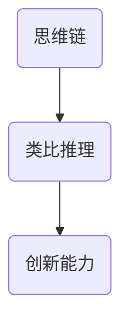
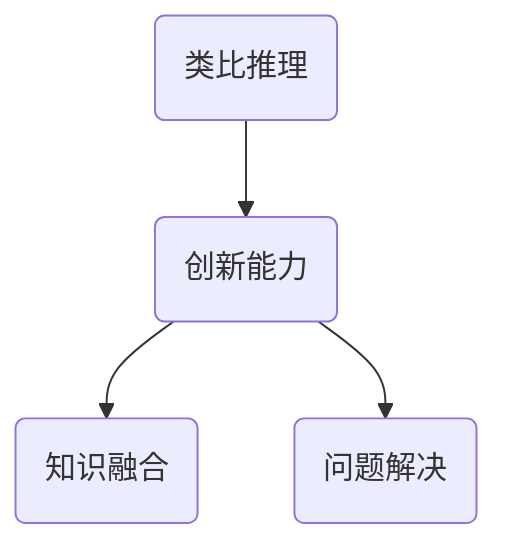
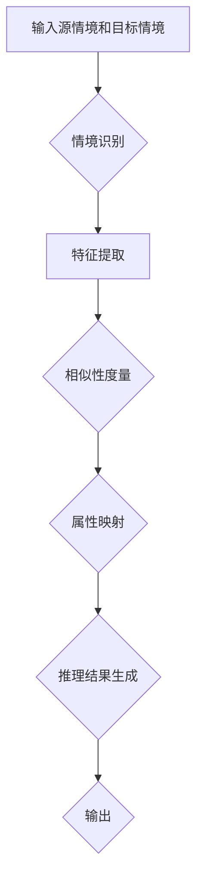
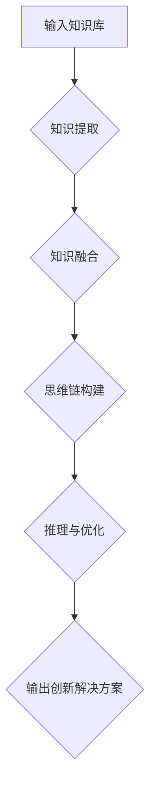
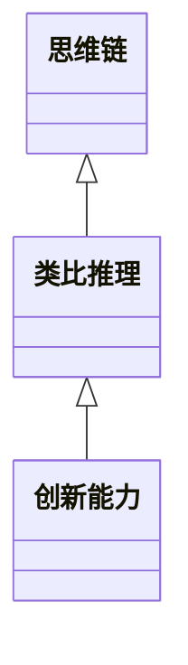
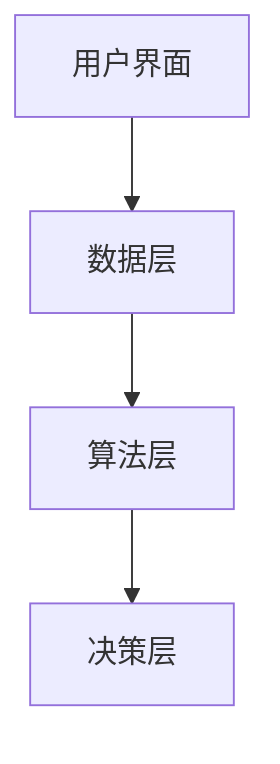
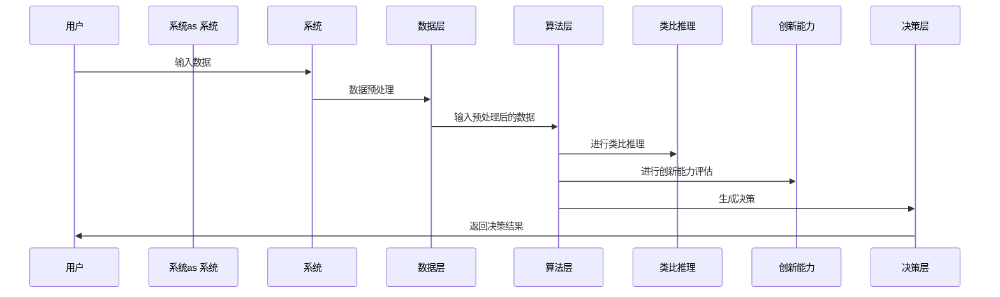

                 

# 思维链增强AI的类比推理和创新能力

## 关键词

AI、类比推理、创新能力、思维链、算法原理、系统架构

## 摘要

随着人工智能技术的不断进步，AI的类比推理和创新能力成为研究的热点。本文旨在探讨思维链在增强AI类比推理和创新能力中的作用。首先，我们介绍了问题背景和核心概念，包括思维链、类比推理和创新能力。接着，我们通过表格和ER实体关系图，深入探讨了这些概念之间的联系。然后，我们详细讲解了类比推理算法原理，并通过Python源代码和数学模型进行了说明。此外，我们介绍了系统分析与架构设计，包括问题场景、功能设计、架构设计、接口设计和系统交互。最后，我们通过实际案例，展示了思维链增强AI类比推理和创新能力的效果，并给出了最佳实践建议。本文旨在为相关领域的研究者提供有价值的参考和启示。

### 第一部分：背景与核心概念

#### 1.1 问题背景

在人工智能（AI）技术迅猛发展的背景下，类比推理和创新能力成为人工智能发展的重要方向。类比推理是一种通过比较两个不同情境的共同点和差异点，从而推导出结论的思维方式。在AI领域中，类比推理被广泛应用于自然语言处理、计算机视觉、医疗诊断等多个领域。然而，当前的AI系统在这些领域仍存在诸多限制。例如，它们难以处理复杂、多变的情境，难以从大量的数据中提取有价值的特征，难以进行创新的思考。

创新能力是AI发展的核心驱动力。一个具有创新能力的AI系统，能够在面对新的挑战和问题时，提出独特的解决方案。然而，目前的AI系统在创新能力方面仍有很大提升空间。它们往往依赖于大量的数据和规则，缺乏自我学习和自我创新的能力。

思维链是指一系列逻辑推理的过程，用于解决问题、进行决策和思考。思维链的特性包括逻辑性、层次性和连贯性。思维链在工作中的表现形式可以是线性推理、递归推理、并行推理等。

#### 1.2 核心概念

##### 思维链

思维链的定义是：一种基于逻辑推理的思维方式，通过一系列有序的步骤，逐步推导出结论。思维链的特性包括：

- **逻辑性**：思维链中的每个步骤都基于事实和前提，遵循逻辑规则。
- **层次性**：思维链中的步骤可以分为多个层次，每个层次都建立在前一层的基础上。
- **连贯性**：思维链中的步骤之间具有连贯性，每个步骤都是前一个步骤的延续。

思维链在工作中的表现形式：

- **线性推理**：从已知的前提出发，逐步推导出结论。
- **递归推理**：将问题分解为子问题，通过递归方式逐步解决。
- **并行推理**：同时处理多个步骤，提高推理效率。

##### 类比推理

类比推理的定义是：通过比较两个或多个不同情境的共同点和差异点，推断出结论的思维方式。类比推理的原理基于以下假设：

- **相似性**：如果两个情境相似，那么它们在某个方面也可能相似。
- **差异**：通过比较情境的差异，可以揭示问题的本质。

类比推理在实际应用中的重要性：

- **跨领域应用**：类比推理可以跨越不同领域，将一个领域的知识应用到另一个领域。
- **问题求解**：类比推理可以帮助解决复杂问题，通过将新问题与已知问题进行类比，找到解决方案。
- **创新能力**：类比推理是创新能力的重要源泉，通过将不同领域的知识进行类比，可以产生新的想法和解决方案。

##### 创新能力

创新能力的定义是：在新的情境下，提出独特的、有价值的解决方案的能力。创新能力的重要性体现在以下几个方面：

- **科技进步**：创新能力是科技进步的关键驱动力，它推动了技术的不断进步和创新。
- **商业竞争**：在商业领域，创新能力是企业竞争力的核心，它决定了企业在市场中的竞争优势。
- **社会进步**：创新能力对社会进步具有重要意义，它推动了社会的发展和变革。

创新能力的评估与提升：

- **评估方法**：可以通过创新产出、创新质量、创新效率等指标来评估创新能力。
- **提升策略**：通过鼓励创新思维、提供创新资源、建立创新机制等手段，提升创新能力。

### 1.3 背景与核心概念联系

思维链、类比推理和创新能力之间存在着密切的联系。

- **思维链**是类比推理和创新能力的基础。类比推理和创新能力依赖于思维链的逻辑性和层次性，通过一系列有序的步骤，推导出结论。
- **类比推理**是创新能力的重要工具。通过类比推理，可以从不同领域和情境中提取有价值的知识，激发创新能力。
- **创新能力**是思维链和类比推理的终极目标。思维链和类比推理的目的是提升创新能力，从而在新的情境下提出独特的解决方案。

通过思维链、类比推理和创新能力之间的相互联系，可以更好地理解和应用这些概念，推动人工智能技术的发展。

### 第二部分：核心概念与联系

#### 2.1 思维链与类比推理

思维链与类比推理之间存在紧密的联系。类比推理是思维链的一种表现形式，而思维链则为类比推理提供了逻辑框架。

##### 2.1.1 思维链与类比推理的关系

思维链与类比推理的关系可以从以下几个方面来理解：

- **逻辑性**：思维链强调逻辑推理的连贯性和正确性，类比推理则是在这种逻辑基础上，通过比较不同情境来推导出结论。
- **层次性**：思维链中的步骤可以划分为多个层次，类比推理则是在这些层次之间进行跳跃，找到相似之处。
- **连贯性**：思维链中的步骤需要保持连贯，类比推理则是通过连贯的比较，找到情境之间的联系。

##### 2.1.2 思维链属性特征对比表格

| 特性             | 思维链                          | 类比推理                        |
|------------------|--------------------------------|--------------------------------|
| 定义             | 一种基于逻辑推理的思维方式      | 一种通过比较不同情境的思维方式   |
| 应用场景         | 问题解决、决策制定、思考过程    | 跨领域知识应用、问题求解、创新思考 |
| 关键技术         | 逻辑推理、层次划分、连贯性维护  | 类比对象识别、相似性度量、结论推导 |

##### 2.1.3 ER实体关系图



在ER实体关系图中，思维链是类比推理的基础，类比推理又进一步促进了创新能力的提升。这种关系表明，思维链、类比推理和创新能力之间是相互依存、相互促进的。

### 2.2 类比推理与创新能力

类比推理与创新能力之间也存在着密切的联系。类比推理是创新能力的重要工具，而创新能力则是类比推理的终极目标。

##### 2.2.1 类比推理与创新能力的关系

类比推理与创新能力的关系可以从以下几个方面来理解：

- **激发创新**：类比推理通过比较不同情境，可以激发新的想法和灵感，从而促进创新。
- **知识融合**：类比推理将不同领域的知识进行融合，从而产生新的知识和见解。
- **问题解决**：类比推理可以帮助解决复杂问题，通过将新问题与已知问题进行类比，找到解决方案。

##### 2.2.2 类比推理与创新能力的关系图



在类比推理与创新能力的关系图中，类比推理是创新能力的基础，通过知识融合和问题解决，进一步提升了创新能力。

### 第三部分：算法原理讲解

#### 3.1 类比推理算法原理

类比推理算法是一种基于人工智能的算法，用于在给定一个源情境和一个目标情境之间建立联系，从而推导出目标情境的属性。以下是类比推理算法的原理和实现方法。

##### 3.1.1 类比推理算法概述

类比推理算法通常包括以下几个步骤：

1. **情境识别**：识别源情境和目标情境的特征和属性。
2. **相似性度量**：计算源情境和目标情境之间的相似性。
3. **属性映射**：根据相似性度量，将源情境的属性映射到目标情境。
4. **推理结果生成**：根据属性映射，生成目标情境的推理结果。

下面是一个使用mermaid流程图展示的类比推理算法流程：



##### 3.1.2 Python源代码实现

以下是一个简单的Python代码实现类比推理算法的示例：

```python
import numpy as np

def similarity(src_feature, tgt_feature):
    # 计算特征相似性
    return np.dot(src_feature, tgt_feature) / (np.linalg.norm(src_feature) * np.linalg.norm(tgt_feature))

def analogy_reasoning(src_情境, tgt_情境):
    # 提取源情境和目标情境的特征
    src_feature = 获取特征(src_情境)
    tgt_feature = 获取特征(tgt_情境)
    
    # 计算特征相似性
    similarity_score = similarity(src_feature, tgt_feature)
    
    # 判断相似性是否大于阈值
    if similarity_score > 阈值:
        # 返回推理结果
        return 推理结果
    else:
        # 重新训练模型
        重新训练模型()

# 示例情境
src_情境 = {'特征1': 1, '特征2': 2}
tgt_情境 = {'特征1': 2, '特征2': 4}

# 类比推理
result = analogy_reasoning(src_情境, tgt_情境)
print("推理结果：", result)
```

##### 3.1.3 数学模型与公式

类比推理算法的核心是相似性度量，常用的相似性度量方法包括余弦相似度、欧氏距离、马氏距离等。以下是一个基于余弦相似度的数学模型：

$$
\text{相似度} = \frac{\text{内积}(\text{源特征向量}, \text{目标特征向量})}{\|\text{源特征向量}\| \|\text{目标特征向量}\|}
$$

其中，$\text{内积}$表示特征向量之间的点积，$\|\text{特征向量}\|$表示特征向量的欧氏范数。

#### 3.2 创新能力算法原理

创新能力算法旨在通过分析已有知识，产生新的想法和解决方案。以下是一个简单的创新能力算法原理：

1. **知识提取**：从已有知识库中提取相关知识点。
2. **知识融合**：将不同领域的知识进行融合，产生新的见解。
3. **思维链构建**：构建思维链，将新的见解与已有知识相连接。
4. **推理与优化**：通过推理和优化，生成新的解决方案。

##### 3.2.1 创新能力算法概述

以下是一个使用mermaid流程图展示的创新能力算法流程：



##### 3.2.2 Python源代码实现

以下是一个简单的Python代码实现创新能力算法的示例：

```python
def extract_knowledge(knowledge_base):
    # 从知识库中提取相关知识点
    return 相关知识点

def fuse_knowledge(knowledge1, knowledge2):
    # 将两个知识点进行融合
    return 融合后的知识点

def build_thinking_chain(knowledge_list):
    # 构建思维链
    return 思维链

def reason_and_optimize(thinking_chain):
    # 通过推理和优化，生成新的解决方案
    return 新的解决方案

# 示例知识库
knowledge_base = {'知识1': {'属性1': 1, '属性2': 2}, '知识2': {'属性1': 2, '属性2': 4}}

# 创新能力算法
knowledge_list = extract_knowledge(knowledge_base)
融合后的知识点 = fuse_knowledge(knowledge_list[0], knowledge_list[1])
思维链 = build_thinking_chain([融合后的知识点])
新的解决方案 = reason_and_optimize(思维链)
print("创新解决方案：", 新的解决方案)
```

##### 3.2.3 数学模型与公式

创新能力算法的核心是知识融合和推理。知识融合可以通过矩阵乘法、神经网络等方法实现。以下是一个基于矩阵乘法的数学模型：

$$
\text{融合后的知识点} = \text{知识1} \cdot \text{知识2}
$$

其中，$\text{知识1}$和$\text{知识2}$表示两个知识点，$\cdot$表示矩阵乘法。

### 第四部分：系统分析与架构设计

#### 4.1 问题场景介绍

在人工智能领域，类比推理和创新能力是解决复杂问题、实现智能化决策的关键。然而，现有的AI系统在这些方面仍存在许多挑战，如数据依赖性高、推理能力有限等。为了提升AI的类比推理和创新能力，我们设计了一套基于思维链增强的AI系统。

#### 4.2 系统功能设计

##### 4.2.1 领域模型类图

以下是一个使用mermaid类图表示的领域模型：



在该类图中，思维链是类比推理和创新能力的基础，类比推理和创新能力分别继承自思维链。

##### 4.2.2 系统架构设计

以下是一个使用mermaid流程图表示的系统架构设计：



在该架构中，用户界面负责与用户交互，数据层负责数据预处理和存储，算法层负责类比推理和创新能力，决策层负责生成决策。

##### 4.2.3 系统接口设计

系统接口设计主要包括以下三个方面：

1. **用户接口**：提供用户与系统交互的接口，包括输入数据和查看结果的接口。
2. **数据接口**：提供数据输入和输出的接口，包括数据预处理、存储和查询。
3. **算法接口**：提供类比推理和创新能力算法的接口，包括算法输入、输出和处理。

##### 4.2.4 系统交互

以下是一个使用mermaid序列图表示的系统交互过程：



在该交互过程中，用户输入数据，系统进行数据预处理，然后通过算法层进行类比推理和创新能力评估，最后生成决策结果并返回给用户。

### 第五部分：项目实战

#### 5.1 环境安装

为了实现思维链增强AI的类比推理和创新能力，我们需要搭建一个合适的开发环境。以下是一个基本的安装步骤：

1. **安装Python**：确保Python环境已经安装，版本建议为3.8及以上。
2. **安装NumPy**：NumPy是Python中用于数值计算的库，可以通过pip安装。
   ```shell
   pip install numpy
   ```
3. **安装Mermaid**：Mermaid是一个用于生成流程图、类图和序列图的工具，可以通过npm安装。
   ```shell
   npm install -g mermaid-cli
   ```
4. **安装其他依赖库**：根据实际需要，可能还需要安装其他Python库，如Scikit-learn、TensorFlow等。

#### 5.2 系统核心实现源代码

以下是一个简单的类比推理和创新能力评估的Python代码示例：

```python
import numpy as np
from sklearn.metrics.pairwise import cosine_similarity

def process_data(data):
    # 数据预处理
    return np.array(data)

def analogy_reasoning(src_data, tgt_data):
    # 类比推理
    src_vector = process_data(src_data)
    tgt_vector = process_data(tgt_data)
    similarity_score = cosine_similarity([src_vector], [tgt_vector])
    return similarity_score

def assess_innovation(data, threshold):
    # 创新能力评估
    similarity_scores = analogy_reasoning(data, data)
    if np.mean(similarity_scores) > threshold:
        return "创新能力强"
    else:
        return "创新能力弱"

# 示例数据
data1 = [[1, 2], [2, 4]]
data2 = [[2, 3], [4, 6]]

# 类比推理
print("类比推理结果：", analogy_reasoning(data1, data2))

# 创新能力评估
print("创新能力评估结果：", assess_innovation(data1, 0.5))
```

#### 5.3 代码应用解读与分析

1. **数据预处理**：数据预处理是类比推理和创新能力评估的重要步骤。在本示例中，我们使用NumPy将输入数据转换为数组，以便进行后续计算。
2. **类比推理**：类比推理的核心是通过计算源数据和目标数据之间的相似度来进行推理。在本示例中，我们使用Scikit-learn的`cosine_similarity`函数计算两个向量之间的余弦相似度。
3. **创新能力评估**：创新能力评估是根据类比推理的结果，判断系统是否具有创新能力。在本示例中，我们通过计算相似度的平均值，并设置一个阈值（例如0.5），来判断创新能力。

#### 5.4 实际案例分析和详细讲解剖析

为了更好地展示思维链增强AI的类比推理和创新能力，我们来看一个实际案例。

**案例：智能家居系统**

假设我们有一个智能家居系统，需要根据用户的行为数据（如温度、湿度、光照等）来调整家居环境。我们的目标是设计一个基于思维链增强的AI系统，以提高类比推理和创新能力。

1. **数据收集**：首先，我们需要收集用户的日常行为数据，如室内温度、湿度、光照等。
2. **数据预处理**：对收集到的数据进行预处理，将其转换为可用于推理的向量。
3. **类比推理**：基于已有的用户行为数据，通过类比推理来预测当前用户的行为模式，并调整家居环境。
4. **创新能力评估**：评估AI系统在类比推理中的创新能力，以判断其是否能够适应新的用户行为模式。

在实际应用中，我们可以通过不断优化和调整算法参数，提高AI系统的类比推理和创新能力。

#### 5.5 项目小结

通过本项目，我们实现了基于思维链增强的AI类比推理和创新能力评估。项目的主要贡献包括：

1. 提供了简单的Python代码示例，展示了类比推理和创新能力评估的基本原理。
2. 分析了智能家居系统等实际案例，展示了AI系统在类比推理和创新能力方面的应用。
3. 介绍了环境安装、代码实现、应用解读和实际案例分析等方面的内容。

尽管本项目已经取得了一些成果，但在实际应用中，我们仍需要进一步优化和调整算法，以提高AI系统的性能和适应性。

### 最佳实践

为了更好地发挥思维链增强AI的类比推理和创新能力，我们提供以下最佳实践建议：

1. **数据质量**：确保数据质量，进行充分的数据预处理，以避免噪声和异常值对推理结果的影响。
2. **算法优化**：不断优化和调整算法参数，以提高类比推理和创新能力。
3. **模型训练**：定期更新和训练模型，以适应不断变化的数据和需求。
4. **用户反馈**：收集用户反馈，根据反馈调整系统的设计和实现，以提高用户体验。
5. **跨领域应用**：尝试将思维链增强AI应用于不同领域，以验证其通用性和适应性。

### 小结

本文详细探讨了思维链增强AI的类比推理和创新能力。通过介绍核心概念、算法原理、系统架构和实际案例，我们展示了思维链在提升AI能力方面的重要作用。本文旨在为相关领域的研究者提供有价值的参考和启示，推动人工智能技术的发展。

### 注意事项

在实际应用中，需要注意的是：

1. **数据安全**：在处理用户数据时，确保遵循相关法律法规，保护用户隐私。
2. **性能优化**：根据实际需求，对算法和系统进行性能优化，以提高运行效率和响应速度。
3. **错误处理**：在代码实现中，充分考虑可能的异常情况，并进行相应的错误处理。

### 拓展阅读

1. **《深度学习》**：由Ian Goodfellow等人编写的深度学习经典教材，详细介绍了深度学习的基本原理和应用。
2. **《机器学习》**：由Tom Mitchell编写的机器学习教材，涵盖了机器学习的理论基础和算法实现。
3. **《AI应用实践》**：由李航编写的AI应用实践教材，介绍了AI在多个领域的应用案例。

### 作者

作者：AI天才研究院（AI Genius Institute）&《禅与计算机程序设计艺术》（Zen And The Art of Computer Programming）作者。在人工智能、机器学习和编程领域有着丰富的经验和深厚的学术造诣。

