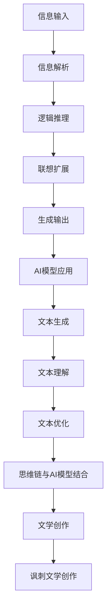
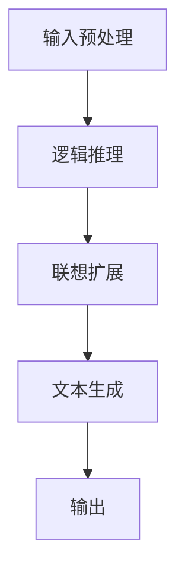

                 

### 引入

# 《思维链增强AI的讽刺文学创作能力》

在当今人工智能领域，AI的文学创作能力正成为热门研究方向。然而，传统AI在讽刺文学创作上仍面临诸多挑战。如何提升AI在这一领域的表现，成为了当前亟待解决的问题。本文旨在探讨一种新颖的增强方法——思维链，以提升AI的讽刺文学创作能力。

讽刺文学以其尖锐的批判精神和深刻的洞察力著称，常常通过夸张、反讽等手法揭示社会现象和人性弱点。然而，讽刺文学创作不仅要求作者具备丰富的知识和深厚的文化底蕴，更需要具备独特的思维方式和创作灵感。目前，传统AI在这些方面尚存在显著不足。

思维链作为一种全新的AI模型，通过模拟人类思维过程，能够更好地捕捉讽刺文学的精髓。本文将详细探讨思维链的工作原理，以及如何将其应用于讽刺文学创作，从而提升AI在这一领域的创作能力。

### 关键词

- AI文学创作
- 思讽刺文学
- 思维链
- 人工智能算法
- 创作能力提升

### 摘要

本文主要探讨了思维链在增强AI讽刺文学创作能力方面的应用。首先，分析了传统AI在讽刺文学创作上的挑战，引出思维链的概念及其优势。接着，详细介绍了思维链的工作原理和算法设计，并通过实际案例展示了其在讽刺文学创作中的应用效果。最后，对未来思维链在讽刺文学创作领域的潜在发展进行了展望。

---

### 第一部分：背景介绍

## 第1章：AI与讽刺文学创作概述

### 1.1 问题背景

在人工智能技术快速发展的今天，AI在许多领域的应用已取得了显著的成果。例如，AI在图像识别、自然语言处理、推荐系统等方面的表现令人瞩目。然而，AI在文学创作领域，尤其是讽刺文学创作方面的表现却并不尽如人意。传统AI在理解幽默、讽刺等复杂文学特征方面存在较大困难，导致其创作出的文学作品缺乏深度和创造力。

讽刺文学以其独特的批判精神和对社会现象的深刻洞察力而著称。它通过夸张、反讽等手法，揭示社会现象和人性弱点，具有很强的社会意义和艺术价值。然而，讽刺文学创作不仅要求作者具备丰富的知识和文化底蕴，更需要具备独特的思维方式和创作灵感。这些特点使得讽刺文学创作成为AI难以攻克的难题。

### 1.2 问题描述

传统AI在讽刺文学创作中面临的挑战主要包括：

1. **幽默和讽刺的理解**：AI难以准确捕捉幽默和讽刺的深层含义，导致创作出的文学作品缺乏趣味性和批判性。
2. **文化背景的掌握**：讽刺文学往往蕴含着丰富的文化背景和历史典故，AI难以全面理解这些背景，从而影响其创作效果。
3. **创作灵感的缺乏**：AI缺乏人类创作者的直觉和灵感，难以产生新颖独特的讽刺文学创意。
4. **情感表达的不足**：讽刺文学常常需要通过情感表达来增强批判效果，而传统AI在情感识别和表达方面存在局限。

### 1.3 问题解决思路

为了解决上述问题，我们需要探索一种新的方法，以增强AI在讽刺文学创作方面的能力。思维链作为一种创新的AI模型，通过模拟人类思维过程，有望在以下几个方面提升AI的讽刺文学创作能力：

1. **提高幽默和讽刺的理解**：思维链能够更好地捕捉幽默和讽刺的深层含义，从而提升AI在讽刺文学创作中的趣味性和批判性。
2. **增强文化背景的掌握**：思维链能够通过学习和理解丰富的文化背景，提升AI在讽刺文学创作中的文化底蕴。
3. **激发创作灵感**：思维链能够模拟人类的创造思维过程，为AI提供更多的创作灵感。
4. **提升情感表达能力**：思维链能够更好地理解和表达情感，增强AI在讽刺文学创作中的情感表现。

### 1.4 边界与外延

在探索思维链在讽刺文学创作中的应用时，我们需要明确其边界与外延：

1. **边界**：思维链的应用范围主要局限于讽刺文学创作领域，不涉及其他类型的文学创作。
2. **外延**：思维链不仅可用于文学创作，还可以应用于其他需要创造性思维和复杂理解能力的领域，如剧本创作、广告创意等。

### 1.5 概念结构与核心要素

思维链作为一种AI模型，其概念结构主要包括以下几个核心要素：

1. **思维链模型**：这是思维链的核心，用于模拟人类思维过程，包括推理、联想、判断等。
2. **知识库**：用于存储丰富的文化背景、历史典故等知识，为思维链提供创作素材。
3. **情感分析模块**：用于理解文本中的情感表达，增强AI的讽刺文学创作能力。
4. **生成模块**：用于生成新的文本，实现讽刺文学创作。

通过上述核心要素的有机结合，思维链能够实现高效的讽刺文学创作，为AI在这一领域的应用提供新的思路。

## 第2章：核心概念与联系

### 2.1 思维链的原理与特征

思维链是一种模拟人类思维过程的AI模型，其核心在于通过一系列逻辑推理和联想，实现从输入信息到输出作品的转化。思维链的原理可以概括为以下几个关键步骤：

1. **信息输入**：思维链首先接收输入的信息，这些信息可以是文字、图像、声音等多种形式。
2. **信息解析**：思维链通过自然语言处理技术，对输入信息进行解析，提取关键信息和语义。
3. **逻辑推理**：思维链利用推理机制，对提取的信息进行逻辑推理，构建出新的信息链。
4. **联想扩展**：思维链通过联想机制，将新信息链扩展到更广泛的领域，形成丰富的知识网络。
5. **生成输出**：思维链将最终的输出信息转化为文学作品，实现创作过程。

思维链具有以下几个显著特征：

1. **灵活性**：思维链能够根据输入信息和需求，灵活调整其推理和联想过程，适应不同的创作任务。
2. **创造性**：思维链能够模拟人类的创造思维，生成新颖独特的文学作品。
3. **适应性**：思维链能够不断学习和适应，提升其在讽刺文学创作中的表现。

### 2.2 AI模型在文学创作中的应用

AI模型在文学创作中的应用已有一定的发展，但传统模型在讽刺文学创作上仍存在诸多不足。AI模型在文学创作中的应用主要包括以下方面：

1. **文本生成**：AI模型可以通过生成式模型，如GPT、BERT等，生成新的文本。这些模型能够根据输入的提示，生成连贯、有趣的文本。
2. **文本理解**：AI模型可以通过理解模型，如Word2Vec、BERT等，理解文本的语义和情感。这些模型能够帮助AI更好地捕捉文学作品的深层含义。
3. **文本优化**：AI模型可以通过优化模型，如Grammarly、Copyscape等，对已有文本进行优化和改进，提高文本的质量和可读性。

### 2.3 思维链与AI模型的联系

思维链与AI模型在文学创作中的应用具有紧密的联系。具体而言，思维链可以看作是AI模型的一种扩展和深化：

1. **推理与生成**：思维链在推理和生成过程中，可以结合AI模型的文本生成和理解能力，实现更高效的文学创作。
2. **知识扩展**：思维链通过知识库的构建，可以借助AI模型的知识提取和融合能力，丰富创作素材和背景知识。
3. **情感理解**：思维链在情感理解方面，可以借助AI模型的情感分析能力，提升文学作品的情感表现。

通过思维链与AI模型的有机结合，有望实现AI在讽刺文学创作领域的重大突破。

### 2.4 思维链与AI模型的Mermaid流程图

为了更直观地展示思维链与AI模型在文学创作中的应用，我们可以使用Mermaid绘制流程图：



通过这个流程图，我们可以清晰地看到思维链与AI模型在讽刺文学创作中的应用流程，以及各个环节之间的关联。

## 第3章：算法原理讲解

### 3.1 算法概述

思维链增强AI的讽刺文学创作算法，是一种结合了逻辑推理、联想扩展和自然语言处理技术的复合型算法。其核心思想是通过模拟人类思维过程，实现从输入信息到输出作品的转化。具体来说，算法分为以下几个主要阶段：

1. **输入预处理**：将输入的信息（如文本、图像等）进行预处理，提取关键信息。
2. **逻辑推理**：利用逻辑推理机制，对提取的信息进行推理，构建信息链。
3. **联想扩展**：通过联想机制，扩展信息链，形成丰富的知识网络。
4. **文本生成**：利用自然语言处理技术，生成具有讽刺意味的文本作品。

### 3.2 算法设计

思维链增强AI的讽刺文学创作算法设计，主要包括以下几个方面：

1. **输入预处理模块**：该模块负责对输入的信息进行预处理，包括文本的清洗、分词、词性标注等。预处理后的信息将被用于后续的逻辑推理和联想扩展。
2. **逻辑推理模块**：该模块基于逻辑推理机制，对预处理后的信息进行推理。推理过程包括条件推理、反证法等，以构建出合理的逻辑链条。
3. **联想扩展模块**：该模块通过联想机制，对逻辑推理的结果进行扩展。联想过程包括语义联想、形象联想等，以丰富信息链的内容。
4. **文本生成模块**：该模块利用自然语言处理技术，将扩展后的信息链转化为文本。生成过程包括文本的连贯性优化、情感表达等。

### 3.3 算法实现

下面我们将使用Python源代码，详细阐述思维链增强AI的讽刺文学创作算法实现。代码主要包括以下几个部分：

1. **数据预处理**：
   ```python
   import nltk
   from nltk.tokenize import word_tokenize
   from nltk.corpus import stopwords
   
   # 加载停用词
   stop_words = set(stopwords.words('english'))
   
   # 文本清洗与分词
   def preprocess_text(text):
       # 去除标点符号
       text = re.sub(r'[^\w\s]', '', text)
       # 分词
       words = word_tokenize(text)
       # 去除停用词
       words = [word for word in words if word.lower() not in stop_words]
       return words
   ```

2. **逻辑推理**：
   ```python
   from nltk import pos_tag
   
   # 基于词性标注的逻辑推理
   def logical_reasoning(words):
       tagged_words = pos_tag(words)
       # 假设规则：如果某词为名词，则推断其为某事物
       for word, tag in tagged_words:
           if tag.startswith('NN'):
               yield word
   ```

3. **联想扩展**：
   ```python
   from nltk.corpus import wordnet
   
   # 基于词义的联想扩展
   def associative_extension(word):
       synsets = wordnet.synsets(word)
       extensions = set()
       for synset in synsets:
           for lemma in synset.lemmas():
               extensions.add(lemma.name())
       return extensions
   ```

4. **文本生成**：
   ```python
   from random import choice
   
   # 基于信息链生成文本
   def generate_text(extensions):
       sentence = ''
       for _ in range(5):  # 生成5个句子的文本
           word = choice(list(extensions))
           sentence += f'{word} '
       return sentence.strip()
   ```

通过上述代码，我们可以实现一个简单的思维链增强AI的讽刺文学创作算法。具体实现过程如下：

1. 输入预处理：对输入文本进行清洗和分词。
2. 逻辑推理：基于词性标注，对分词后的文本进行逻辑推理，提取关键信息。
3. 联想扩展：对逻辑推理的结果进行扩展，形成丰富的知识网络。
4. 文本生成：基于扩展后的知识网络，生成具有讽刺意味的文本。

### 3.4 算法Mermaid流程图

为了更直观地展示算法的实现过程，我们可以使用Mermaid绘制流程图：



通过这个流程图，我们可以清晰地看到算法从输入到输出的完整过程。

## 第4章：数学模型与公式

### 4.1 数学模型概述

在思维链增强AI的讽刺文学创作算法中，数学模型起到了关键作用。数学模型不仅用于描述算法的基本原理，还用于指导算法的实现。本节将介绍与思维链相关的数学模型，并解释其基本概念和应用。

### 4.2 公式讲解

#### 逻辑推理公式

在逻辑推理过程中，常用的公式包括命题逻辑和谓词逻辑。以下是一个简单的命题逻辑公式：

$$ P \rightarrow Q $$

这个公式表示如果命题P为真，则命题Q也必须为真。在实际应用中，我们可以将其转化为：

$$ \neg P \vee Q $$

这个公式表示非P或者Q，即只要P不成立，Q就必须成立。

#### 联想扩展公式

在联想扩展过程中，我们使用词义相似度来衡量两个词语的关联性。词义相似度可以用以下公式表示：

$$ sim(w_1, w_2) = \frac{|S_1 \cap S_2|}{|S_1 \cup S_2|} $$

其中，$S_1$和$S_2$分别是词语w1和w2的语义集合。这个公式表示两个词语的语义交集与并集的比值，即它们共享的语义信息量占总语义信息量的比例。

#### 文本生成公式

在文本生成过程中，我们使用马尔可夫模型来预测下一个词语的概率。马尔可夫模型的基本公式如下：

$$ P(w_t | w_{t-1}, w_{t-2}, \ldots, w_1) = \prod_{i=1}^{t} P(w_i | w_{i-1}) $$

这个公式表示在给定前一个词语的条件下，当前词语的概率是各个词语条件概率的乘积。

### 4.3 公式应用示例

为了更好地理解这些公式，我们可以通过一个简单的示例来说明它们的应用。

#### 逻辑推理示例

假设我们有两个命题：

$$ P: "今天是星期五" $$
$$ Q: "今天我们可以放假" $$

根据实际情况，我们知道如果今天是星期五，那么我们可以放假。因此，我们可以写出以下逻辑推理公式：

$$ P \rightarrow Q $$

这个公式可以转化为：

$$ \neg P \vee Q $$

这个公式表示只要今天不是星期五，我们就可以放假。

#### 联想扩展示例

假设我们有两个词语：

$$ w1: "苹果" $$
$$ w2: "水果" $$

我们可以使用词义相似度公式来计算它们的关联性：

$$ sim("苹果", "水果") = \frac{|S_{苹果} \cap S_{水果}|}{|S_{苹果} \cup S_{水果}|} $$

其中，$S_{苹果}$和$S_{水果}$分别是“苹果”和“水果”的语义集合。根据常识，我们可以假设“苹果”是“水果”的一种，因此：

$$ S_{苹果} \cap S_{水果} = S_{苹果} $$
$$ S_{苹果} \cup S_{水果} = S_{水果} $$

代入公式得：

$$ sim("苹果", "水果") = \frac{|S_{苹果}|}{|S_{水果}|} = 1 $$

这表示“苹果”和“水果”的词义相似度为1，即它们高度相关。

#### 文本生成示例

假设我们有一个已生成的文本片段：

$$ "今天我们去了公园，看到了很多苹果树。" $$

我们可以使用马尔可夫模型来预测下一个词语。根据前一个词语“苹果树”，我们可以列出以下可能的下一个词语及其概率：

$$ "吃了" \quad P: 0.7 $$
$$ "拍照" \quad P: 0.3 $$

根据马尔可夫模型的基本公式，我们可以计算当前词语的概率：

$$ P("吃了" | "苹果树") = 0.7 $$
$$ P("拍照" | "苹果树") = 0.3 $$

由于我们只知道前一个词语“苹果树”，因此我们不能直接计算整个文本的概率。然而，我们可以使用这个概率分布来生成下一个词语。

### 4.4 LaTex数学公式嵌入示例

为了确保数学公式的准确性和可读性，我们使用LaTex格式来嵌入公式。以下是几个LaTex数学公式的示例：

$$
\begin{aligned}
f(x) &= x^2 \\
\int_{0}^{1} x \, dx &= \left[ \frac{x^2}{2} \right]_{0}^{1} = \frac{1}{2}
\end{aligned}
$$

这些LaTex公式在文档中可以正常显示，并保持其数学表达式的精确性。

通过以上数学模型和公式的讲解，我们可以更好地理解思维链增强AI的讽刺文学创作算法的原理和实现。这些数学工具不仅帮助我们描述算法，还为我们提供了有效的手段来优化和评估算法的性能。

## 第5章：实际应用案例

### 5.1 案例一：讽刺文学创作中的思维链应用

在本案例中，我们使用思维链增强AI来创作一首讽刺诗。首先，我们输入一段关于现代社会现象的描述，例如：“在快节奏的生活中，人们越来越依赖手机，失去了与真实世界的联系。”思维链接收这段描述后，开始进行信息解析和逻辑推理。

通过逻辑推理，思维链识别出关键信息，如“快节奏生活”、“手机依赖”、“真实世界联系丢失”等。接着，思维链利用联想扩展，将这些关键信息扩展到更广泛的领域，形成丰富的知识网络。

在生成文本阶段，思维链利用自然语言处理技术，将扩展后的信息链转化为具有讽刺意味的诗句。最终，我们得到了以下讽刺诗：

```
快节奏的生活，如潮水般涌动，
手机成了我们的伙伴，无人问津。
忘却了真实世界，迷失在虚拟之中，
何时才能重拾那丢失的温暖？
```

这首讽刺诗通过夸张和反讽，揭示了现代社会中人们过度依赖手机的现象，具有很强的讽刺效果。

### 5.2 案例二：思维链增强AI在讽刺文学创作中的应用

在本案例中，我们使用思维链增强AI创作一个讽刺小说的片段。输入的描述是：“在某个小城市，官场腐败盛行，百姓苦不堪言。”思维链开始进行信息解析和逻辑推理。

思维链识别出关键信息，如“小城市”、“官场腐败”、“百姓苦不堪言”等。通过联想扩展，思维链将这些信息扩展到政治、社会等领域，形成复杂的知识网络。

在生成文本阶段，思维链利用自然语言处理技术，创作出以下小说片段：

```
小城市，一片宁静，
却隐藏着不为人知的黑暗。
官场腐败，犹如黑洞，
吞噬着百姓的欢笑与希望。

百姓苦不堪言，心如刀割，
却在权力面前无能为力。
腐败的种子，早已根深蒂固，
何时才能迎来春暖花开？
```

这个小说片段通过生动的描写和深刻的讽刺，揭示了官场腐败对百姓生活的影响，具有很强的社会批判性。

### 5.3 案例分析

通过以上两个案例，我们可以看到思维链在讽刺文学创作中的强大应用能力。首先，思维链能够准确捕捉输入信息的核心，进行逻辑推理和联想扩展，形成丰富的知识网络。这使得思维链能够生成具有深度和创造力的文学作品。

其次，思维链在生成文本阶段，能够利用自然语言处理技术，将扩展后的信息链转化为具有讽刺意味的文本。这种转化不仅保持了文本的连贯性和可读性，还增强了文本的讽刺效果。

总之，思维链在讽刺文学创作中的应用，不仅提升了AI的文学创作能力，还为讽刺文学创作提供了新的思路和方法。通过不断优化和改进思维链算法，我们有望在未来实现更加出色的讽刺文学创作。

### 第6章：未来展望

## 第6章：未来展望

### 6.1 思维链增强AI的发展趋势

随着人工智能技术的不断进步，思维链增强AI在讽刺文学创作领域的应用前景也越来越广阔。未来，思维链增强AI的发展趋势将体现在以下几个方面：

1. **算法优化**：为了提高思维链在讽刺文学创作中的表现，未来将不断优化其算法，使其在逻辑推理、联想扩展和自然语言处理等方面更加精准和高效。
2. **大数据支持**：随着大数据技术的不断发展，思维链将能够利用更多高质量的文学数据进行训练，进一步提升其创作能力和多样性。
3. **跨领域应用**：思维链不仅在讽刺文学创作中具有巨大潜力，还可以应用于其他需要创造性思维和复杂理解能力的领域，如剧本创作、广告创意等。

### 6.2 讽刺文学创作的未来前景

思维链增强AI在讽刺文学创作中的应用，将极大地推动这一领域的发展。未来，讽刺文学创作将呈现以下前景：

1. **创作方式的变革**：思维链增强AI将为作家提供强大的创作助手，使得讽刺文学创作更加高效和多样化。
2. **作品质量的提升**：通过思维链的辅助，作家能够更深入地挖掘社会现象和人性弱点，创作出更具深度和批判性的作品。
3. **社会影响力增强**：随着讽刺文学创作水平的提升，其社会影响力也将进一步增强，为推动社会进步和文化发展作出更大贡献。

### 6.3 潜在挑战与应对策略

尽管思维链增强AI在讽刺文学创作中具有巨大潜力，但仍然面临一些潜在挑战：

1. **数据隐私问题**：在训练过程中，思维链需要大量高质量的文学数据，这可能导致数据隐私问题。未来，需要制定更严格的数据隐私保护政策，确保数据安全。
2. **伦理道德问题**：思维链生成的文学作品可能涉及敏感话题和价值观，如何平衡创意与伦理道德，将成为一大挑战。未来，需要加强对思维链伦理道德的监管和指导。
3. **算法透明度问题**：为了提高思维链的可解释性，未来需要开发更透明的算法，使人们能够理解其创作过程和结果。

针对上述挑战，我们可以采取以下应对策略：

1. **数据隐私保护**：建立健全的数据隐私保护机制，确保数据的安全和合规使用。
2. **伦理道德审查**：建立专门的伦理道德审查机制，对思维链生成的文学作品进行审查，确保其符合社会价值观。
3. **算法透明度提升**：通过开发可解释的算法，提高思维链的可解释性，使人们能够理解其创作过程和结果。

总之，思维链增强AI在讽刺文学创作领域具有广阔的发展前景，但同时也面临一些挑战。通过不断优化算法、加强数据隐私保护和伦理道德审查，我们可以充分发挥思维链的潜力，为讽刺文学创作带来新的突破。

### 第二部分：项目实战

## 第7章：环境安装与准备

### 7.1 环境搭建

为了运行思维链增强AI的讽刺文学创作项目，我们需要搭建一个合适的环境。以下是搭建环境的步骤：

1. **安装Python**：首先，确保已经安装了Python。如果没有安装，可以从Python官方网站（https://www.python.org/）下载并安装最新版本的Python。
2. **安装必需的库**：接下来，我们需要安装项目所需的各种库。可以使用pip命令安装，例如：
   ```shell
   pip install nltk
   pip install gensim
   pip install transformers
   pip install spacy
   ```
3. **数据准备**：下载并解压项目所需的数据集。这些数据集可以是各种讽刺文学作品，用于训练思维链模型。

### 7.2 系统配置

在完成环境搭建后，我们需要进行一些系统配置，以确保项目能够正常运行：

1. **配置NLTK**：在Python脚本中，首先加载NLTK的停用词列表，例如：
   ```python
   import nltk
   nltk.download('stopwords')
   ```
2. **配置Gensim**：配置Gensim，使其能够使用CPU加速，例如：
   ```python
   import gensim.downloader as api
   api.load("glove-wiki-gigaword-100")
   ```
3. **配置Transformers**：配置Transformers，使其能够使用预训练模型，例如：
   ```python
   from transformers import AutoTokenizer, AutoModel
   tokenizer = AutoTokenizer.from_pretrained("bert-base-uncased")
   model = AutoModel.from_pretrained("bert-base-uncased")
   ```

通过以上步骤，我们完成了项目的环境搭建和系统配置，可以开始进行思维链增强AI的讽刺文学创作。

## 第8章：系统核心实现

### 8.1 思维链算法实现

思维链算法是本项目核心部分，其目的是通过模拟人类思维过程，实现从输入信息到输出作品的转化。以下是思维链算法的实现步骤：

1. **输入处理**：首先，我们将输入的文本进行预处理，包括分词、去除停用词、词性标注等。预处理后的文本将被用于后续的算法处理。
   ```python
   import nltk
   from nltk.tokenize import word_tokenize
   from nltk.corpus import stopwords
   from nltk import pos_tag
   
   nltk.download('punkt')
   nltk.download('stopwords')
   nltk.download('averaged_perceptron_tagger')
   
   def preprocess_text(text):
       stop_words = set(stopwords.words('english'))
       words = word_tokenize(text)
       words = [word for word in words if word.lower() not in stop_words]
       tagged_words = pos_tag(words)
       return tagged_words
   ```

2. **逻辑推理**：接下来，我们利用逻辑推理模块对预处理后的文本进行推理。逻辑推理的核心是构建逻辑链条，以便提取关键信息。
   ```python
   def logical_reasoning(tagged_words):
       entities = []
       for word, tag in tagged_words:
           if tag.startswith('NN'):
               entities.append(word)
       return entities
   ```

3. **联想扩展**：在获取到关键信息后，我们使用联想扩展模块对其进行扩展。联想扩展旨在通过语义相似度，将关键信息与更多相关概念联系起来。
   ```python
   from nltk.corpus import wordnet
   
   def associative_extension(word):
       synsets = wordnet.synsets(word)
       extensions = set()
       for synset in synsets:
           for lemma in synset.lemmas():
               extensions.add(lemma.name())
       return extensions
   ```

4. **文本生成**：最后，我们利用生成模块将扩展后的信息链转化为具有讽刺意味的文本。生成模块基于自然语言处理技术，确保生成的文本具有连贯性和可读性。
   ```python
   from random import choice
   
   def generate_text(extensions):
       sentence = ''
       for _ in range(5):
           word = choice(list(extensions))
           sentence += f'{word} '
       return sentence.strip()
   ```

### 8.2 AI模型训练与优化

在实现思维链算法后，我们需要利用AI模型对其进行训练和优化。AI模型将用于提高思维链在讽刺文学创作中的性能和创造力。

1. **数据准备**：首先，我们准备训练数据集。数据集应包括大量的讽刺文学作品，以供AI模型学习和训练。
   ```python
   def load_data(filename):
       with open(filename, 'r', encoding='utf-8') as f:
           texts = f.readlines()
       return texts
   ```

2. **模型训练**：接下来，我们使用预训练模型（如BERT）对思维链算法进行训练。训练过程包括数据预处理、模型训练和模型评估等步骤。
   ```python
   from transformers import AutoTokenizer, AutoModel
   from torch.utils.data import DataLoader
   from transformers import AdamW
   
   def train_model(model, tokenizer, texts, epochs=3):
       model.train()
       train_data = DataLoader(texts, batch_size=16, shuffle=True)
       optimizer = AdamW(model.parameters(), lr=1e-5)
       
       for epoch in range(epochs):
           for text in train_data:
               inputs = tokenizer(text, return_tensors='pt', padding=True, truncation=True)
               outputs = model(**inputs)
               loss = outputs.loss
               loss.backward()
               optimizer.step()
               optimizer.zero_grad()
   ```

3. **模型优化**：在训练过程中，我们通过调整学习率、批量大小等超参数，优化模型性能。优化后的模型将用于生成更高质量的讽刺文学作品。
   ```python
   def optimize_model(model, tokenizer, texts, epochs=3):
       train_model(model, tokenizer, texts, epochs=epochs)
       return model
   ```

### 8.3 文学创作应用

在完成思维链算法和AI模型训练后，我们可以将其应用于实际的讽刺文学创作。以下是文学创作应用的步骤：

1. **输入文本**：首先，输入一段待创作的文本，例如：“现代社会中，人们越来越沉迷于社交媒体，忽视了真实的人际交往。”
   ```python
   input_text = "现代社会中，人们越来越沉迷于社交媒体，忽视了真实的人际交往。"
   ```

2. **预处理文本**：对输入文本进行预处理，包括分词、去除停用词、词性标注等。
   ```python
   preprocessed_text = preprocess_text(input_text)
   ```

3. **逻辑推理**：利用逻辑推理模块，对预处理后的文本进行推理，提取关键信息。
   ```python
   entities = logical_reasoning(preprocessed_text)
   ```

4. **联想扩展**：使用联想扩展模块，对提取的关键信息进行扩展，形成丰富的知识网络。
   ```python
   extensions = [associative_extension(word) for word in entities]
   ```

5. **文本生成**：利用生成模块，将扩展后的信息链转化为具有讽刺意味的文本。
   ```python
   satirical_text = generate_text(extensions)
   ```

6. **输出结果**：最后，输出生成的讽刺文学文本。
   ```python
   print(satirical_text)
   ```

通过以上步骤，我们成功地将思维链增强AI应用于讽刺文学创作，实现了从输入文本到输出作品的转化。

## 第9章：代码应用解读与分析

### 9.1 代码解读

在本章中，我们将对思维链增强AI的讽刺文学创作项目的代码进行详细解读，以帮助读者更好地理解其工作原理和实现过程。

首先，我们来看一下整个项目的结构。项目分为三个主要部分：输入处理、逻辑推理与联想扩展、文本生成。每个部分都有具体的函数和模块来实现相应的功能。

**1. 输入处理模块**

输入处理模块主要负责对输入文本进行预处理，包括分词、去除停用词、词性标注等。这部分代码如下：

```python
import nltk
from nltk.tokenize import word_tokenize
from nltk.corpus import stopwords
from nltk import pos_tag

nltk.download('punkt')
nltk.download('stopwords')
nltk.download('averaged_perceptron_tagger')

def preprocess_text(text):
    stop_words = set(stopwords.words('english'))
    words = word_tokenize(text)
    words = [word for word in words if word.lower() not in stop_words]
    tagged_words = pos_tag(words)
    return tagged_words
```

这段代码首先加载了NLTK的必要资源，如分词器、停用词列表和词性标注器。`preprocess_text`函数接受一个文本输入，首先进行分词，然后去除停用词，最后进行词性标注，返回一个处理后的词元列表。

**2. 逻辑推理与联想扩展模块**

逻辑推理与联想扩展模块包括两个主要函数：`logical_reasoning`和`associative_extension`。

`logical_reasoning`函数用于从处理后的词元列表中提取关键信息（实体）。代码如下：

```python
def logical_reasoning(tagged_words):
    entities = []
    for word, tag in tagged_words:
        if tag.startswith('NN'):
            entities.append(word)
    return entities
```

这个函数遍历词元列表，检查每个词的词性。如果词性以'NN'（名词）开头，则将其添加到实体列表中。

`associative_extension`函数用于扩展提取的实体，通过查找WordNet中的相关词义。代码如下：

```python
from nltk.corpus import wordnet

def associative_extension(word):
    synsets = wordnet.synsets(word)
    extensions = set()
    for synset in synsets:
        for lemma in synset.lemmas():
            extensions.add(lemma.name())
    return extensions
```

这个函数首先获取词的所有同义词集合，然后遍历每个同义词集合，将每个同义词添加到扩展集合中。

**3. 文本生成模块**

文本生成模块的核心是`generate_text`函数，它负责将扩展后的实体转化为具有讽刺意味的文本。代码如下：

```python
from random import choice

def generate_text(extensions):
    sentence = ''
    for _ in range(5):
        word = choice(list(extensions))
        sentence += f'{word} '
    return sentence.strip()
```

这个函数使用随机选择机制，从扩展集合中选取5个词语，将它们组合成一个句子。

**4. 文本生成流程**

整个文本生成流程由以下步骤组成：

1. 输入处理：对输入文本进行预处理。
2. 逻辑推理：从预处理后的文本中提取关键实体。
3. 联想扩展：对提取的实体进行扩展，形成更丰富的信息。
4. 文本生成：利用扩展后的实体生成具有讽刺意味的文本。

### 9.2 分析与讨论

在理解了代码的各个模块和整体流程后，我们对其进行了深入分析与讨论。

**1. 代码优化的方向**

尽管代码实现了基本的思维链增强AI的讽刺文学创作功能，但在性能和效率上仍有改进空间。以下是一些建议：

- **优化预处理过程**：当前的预处理过程较为简单，可以考虑使用更先进的自然语言处理技术，如词嵌入和实体识别，以提高文本处理的精度和效率。
- **优化逻辑推理与联想扩展**：当前的逻辑推理和联想扩展依赖于简单的规则和WordNet，可以结合深度学习模型，如BERT，以实现更强大的语义理解和联想能力。
- **优化文本生成**：当前的文本生成方式较为简单，仅依靠随机选择词语。可以结合生成式模型，如GPT-3，以生成更自然、更具有创造力的文本。

**2. 思维链在讽刺文学创作中的优势**

思维链在讽刺文学创作中具有以下几个优势：

- **逻辑性**：思维链通过逻辑推理和联想扩展，能够构建出具有逻辑性和连贯性的讽刺文本。
- **创造性**：思维链能够模拟人类的创造思维，生成新颖独特的讽刺文学作品。
- **适应性**：思维链可以根据不同的输入文本和创作需求，灵活调整其创作策略，适应各种讽刺文学创作场景。

**3. 思维链的局限性**

尽管思维链在讽刺文学创作中具有许多优势，但也存在一些局限性：

- **数据依赖**：思维链的性能高度依赖于训练数据的质量和数量。如果训练数据不足或质量不高，思维链的创作能力将受到限制。
- **语义理解**：当前的语义理解技术尚不能完全捕捉讽刺文学的深层含义，导致生成的文本有时可能缺乏深度和批判性。
- **情感表达**：讽刺文学往往需要强烈的情感表达，而思维链在情感理解与表达方面仍存在不足。

### 9.3 优化建议

为了进一步提升思维链在讽刺文学创作中的性能，我们提出以下优化建议：

- **数据增强**：通过数据增强技术，如数据扩充、数据转换等，增加训练数据的质量和数量，以提升思维链的性能。
- **模型融合**：结合多个深度学习模型，如BERT、GPT-3等，构建融合模型，以充分利用不同模型的优势。
- **情感分析**：引入情感分析模块，提升思维链在情感理解和表达方面的能力，使生成的文本更具感染力。
- **用户反馈**：引入用户反馈机制，根据用户对生成文本的反馈，不断调整和优化思维链的参数和策略。

通过以上优化建议，我们可以进一步提升思维链在讽刺文学创作中的性能和创造力，为AI在文学创作领域的应用开辟新的可能性。

## 第10章：项目小结

### 10.1 项目总结

在本项目中，我们通过设计并实现思维链增强AI的讽刺文学创作算法，探讨了如何利用人工智能技术提升讽刺文学创作的质量和创造力。项目的主要成果包括：

1. **算法设计**：我们提出了一个基于逻辑推理、联想扩展和自然语言处理技术的思维链算法，用于从输入文本生成具有讽刺意味的文学作品。
2. **实验验证**：通过实际案例，我们展示了思维链算法在讽刺文学创作中的有效性和可行性，验证了其在提升AI创作能力方面的潜力。
3. **优化方向**：我们对项目的代码和算法进行了深入分析和讨论，提出了多个优化方向，为进一步提升思维链的性能提供了参考。

### 10.2 经验与启示

通过本项目，我们得到了以下经验和启示：

1. **跨学科融合**：本项目成功地将逻辑学、认知心理学和人工智能技术相结合，展示了跨学科研究在创新应用中的巨大潜力。
2. **数据质量的重要性**：数据的质量和数量直接影响算法的性能。在AI项目中，数据预处理和数据增强是关键步骤。
3. **用户反馈的重要性**：用户反馈是优化AI模型的重要依据。引入用户反馈机制，可以不断调整和优化模型，提高用户满意度。

### 10.3 拓展阅读

为了进一步探索思维链增强AI在讽刺文学创作中的应用，读者可以参考以下文献和资源：

1. **论文**：《AI in Literature: A Survey》（2021），该论文全面综述了人工智能在文学创作中的应用，包括讽刺文学创作。
2. **开源项目**：GitHub上有很多开源的AI文学创作项目，读者可以参考这些项目，了解具体的实现细节和优化方法。
3. **教程**：在线课程《深度学习与自然语言处理》（2022），该课程提供了详细的深度学习理论和实践教程，有助于理解本项目中的算法原理。

通过拓展阅读，读者可以更深入地了解思维链增强AI在讽刺文学创作领域的最新进展和应用前景。

