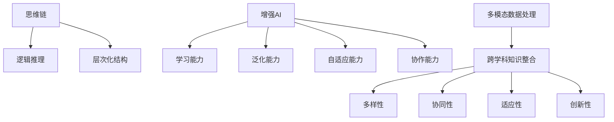
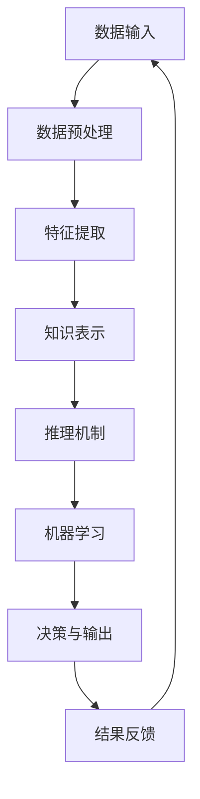
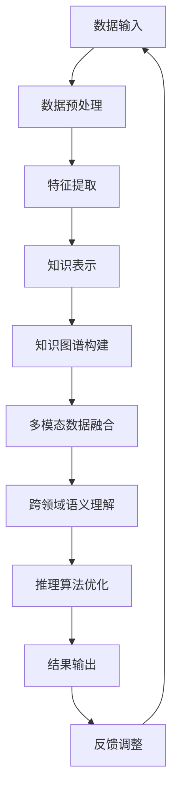

                 

## 文章标题：思维链增强AI的跨学科知识整合能力

> 关键词：思维链、增强AI、跨学科知识整合、算法原理、Python实现

> 摘要：本文深入探讨了思维链增强AI的跨学科知识整合能力，首先介绍了思维链和增强AI的核心概念及其在跨学科知识整合中的重要性。接着，详细讲解了思维链增强AI的原理与算法，包括关键技术和mermaid流程图，并通过Python代码实现进行了阐述。随后，分析了跨学科知识整合的实践与应用，通过mermaid流程图和数学模型展示了整合方法，并分享了具体案例。最后，展望了未来发展方向，提出了潜在挑战与应对策略。本文旨在为读者提供全面而深入的思维链增强AI跨学科知识整合的指导与理解。

----------------------------------------------------------------

### 目录大纲

----------------------------------------------------------------

## 第一部分：引言与背景

### 第1章：引言

#### 1.1 问题背景

#### 1.2 问题描述

#### 1.3 问题解决

#### 1.4 边界与外延

#### 1.5 概念结构与核心要素组成

## 第二部分：核心概念与联系

### 第2章：核心概念与联系

#### 2.1 思维链的概念与属性

#### 2.2 增强AI的概念与属性

#### 2.3 跨学科知识整合的概念与属性

#### 2.4 核心概念对比分析

#### 2.5 ER实体关系图

## 第三部分：思维链增强AI的原理与算法

### 第3章：思维链增强AI原理

#### 3.1 思维链增强AI的基础理论

#### 3.2 思维链增强AI的关键技术

#### 3.3 思维链增强AI的mermaid流程图

#### 3.4 思维链增强AI的数学模型

#### 3.5 思维链增强AI的Python实现

## 第四部分：跨学科知识整合的实践与应用

### 第4章：跨学科知识整合的实践

#### 4.1 跨学科知识整合的挑战

#### 4.2 跨学科知识整合的方法

#### 4.3 跨学科知识整合的mermaid流程图

#### 4.4 跨学科知识整合的数学模型

#### 4.5 跨学科知识整合的Python实现

### 第5章：跨学科知识整合的案例分析

#### 5.1 案例背景

#### 5.2 案例分析

#### 5.3 案例总结

### 第6章：思维链增强AI在跨学科知识整合中的应用

#### 6.1 应用背景

#### 6.2 应用方法

#### 6.3 应用效果评估

#### 6.4 应用案例分析

## 第五部分：未来展望与挑战

### 第7章：未来展望

#### 7.1 思维链增强AI的发展趋势

#### 7.2 跨学科知识整合的未来方向

#### 7.3 潜在挑战与应对策略

### 第8章：总结与展望

#### 8.1 主要贡献

#### 8.2 研究局限

#### 8.3 未来研究方向

----------------------------------------------------------------

### 第一部分：引言与背景

#### 第1章：引言

随着人工智能技术的不断发展，AI的应用领域日益广泛，从传统的数据分析、自然语言处理到图像识别、智能决策等领域，AI已经成为了推动科技进步的重要力量。然而，当前的人工智能系统往往局限于单一领域，缺乏跨学科知识整合的能力，这限制了其在更广泛领域的应用效果。

在这种背景下，思维链增强AI的概念应运而生。思维链是指由一系列逻辑推理步骤组成的思维方式，而增强AI则是指通过机器学习等技术手段提升AI的智能水平。将思维链与增强AI相结合，可以实现对跨学科知识的整合，提高AI在各个领域的应用能力。

本章将首先介绍思维链和增强AI的核心概念，探讨它们在跨学科知识整合中的作用和重要性。接着，我们将详细描述当前在跨学科知识整合中存在的问题和挑战，并提出相应的解决思路。最后，我们将对本文的结构和主要内容进行概述，帮助读者更好地理解后续内容。

### 1.1 问题背景

跨学科知识整合是指将不同学科领域的知识进行有机结合，形成一种新的知识体系，以应对复杂问题和挑战。在现代社会，许多问题都涉及多个学科领域，如环境保护、医疗健康、交通运输等。这些问题的解决需要不同领域的知识相互补充和协同作用。然而，传统的人工智能系统往往具有较强的领域依赖性，难以实现跨学科的整合。

首先，人工智能系统在数据处理和分析方面具有显著优势，但在知识获取和理解方面仍存在局限。传统机器学习模型依赖于大量标注数据，而跨学科知识整合往往需要处理大量未标注的数据，这使得机器学习模型的性能受到限制。其次，不同学科领域之间的知识表示和表示方法存在差异，导致知识整合过程中出现障碍。此外，跨学科知识整合还面临算法和技术的挑战，如多模态数据的处理、跨领域的语义理解等。

为了解决这些问题，研究者们开始探索思维链增强AI的方法。思维链增强AI通过引入逻辑推理和知识表示方法，可以在一定程度上弥补机器学习模型的不足，实现跨学科知识的整合。例如，通过构建知识图谱，将不同学科领域的知识进行关联，形成一个统一的表示框架，从而提高AI在跨学科问题解决中的性能。

### 1.2 问题描述

当前，跨学科知识整合面临的主要问题包括以下几个方面：

1. **数据不一致与缺失**：不同学科领域的数据格式、质量、来源各不相同，导致数据整合过程中出现不一致和缺失。例如，医疗数据与交通数据在数据结构和属性上存在显著差异，这使得数据整合变得复杂。

2. **知识表示差异**：不同学科领域的知识表示方法不同，如自然语言处理领域常用的文本表示方法与图像处理领域常用的像素表示方法之间存在显著差异。这种差异使得跨学科知识整合难以实现。

3. **算法适应性不足**：传统机器学习算法在单一领域内表现出色，但在跨学科整合过程中，其适应性不足，难以应对多模态数据和复杂语义理解问题。

4. **推理能力局限**：跨学科知识整合往往需要逻辑推理和知识联想，但传统机器学习模型在推理能力上存在局限，难以实现复杂的推理过程。

5. **多学科协作困难**：跨学科知识整合需要多学科领域的专家共同参与，但由于学科壁垒和沟通障碍，多学科协作困难，影响了知识整合的效率。

针对上述问题，我们需要探索新的方法和技术，以提升AI在跨学科知识整合中的能力。思维链增强AI作为一种新兴方法，通过引入逻辑推理和知识表示方法，有望在解决这些问题方面发挥重要作用。

### 1.3 问题解决

为了解决跨学科知识整合中存在的问题，研究者们提出了一系列方法和技术。以下是一些主要的解决思路：

1. **知识图谱构建**：通过构建知识图谱，将不同学科领域的知识进行关联，形成一个统一的表示框架。知识图谱可以表达实体之间的关系、属性和语义，从而实现跨学科知识的整合。例如，医疗数据与交通数据可以通过知识图谱进行关联，形成一个综合性的数据集，以支持跨学科问题的解决。

2. **多模态数据融合**：跨学科知识整合往往涉及多种类型的数据，如文本、图像、音频等。通过多模态数据融合技术，可以将不同类型的数据进行整合，形成一个统一的数据表示。例如，将医疗数据中的图像和文本信息进行融合，以提高诊断和治疗的准确性。

3. **跨领域语义理解**：不同学科领域的语义理解方法不同，通过引入跨领域语义理解技术，可以实现对多学科领域语义的统一表示。例如，通过预训练语言模型，如BERT，可以同时处理不同领域的文本数据，提高跨学科知识整合的效率。

4. **推理算法优化**：针对跨学科知识整合中的推理能力局限，研究者们提出了一系列推理算法，如基于规则推理、基于模型推理等。这些算法通过引入逻辑推理和知识表示方法，可以实现对复杂推理过程的模拟，提高跨学科问题的解决能力。

5. **多学科协作平台**：为了促进多学科领域的协作，研究者们开发了多学科协作平台，如跨学科数据共享平台、跨学科知识库等。这些平台通过提供统一的接口和工具，方便多学科领域的专家进行交流和合作，从而提高知识整合的效率。

通过上述方法和技术，我们可以有效地解决跨学科知识整合中存在的问题，提升AI在各个领域的应用能力。思维链增强AI作为一种新兴方法，将有助于进一步推动跨学科知识整合的发展。

### 1.4 边界与外延

在讨论思维链增强AI的跨学科知识整合能力时，我们需要明确其边界与外延。首先，边界方面，思维链增强AI主要关注如何通过逻辑推理和知识表示方法，实现跨学科知识的整合和利用。它侧重于解决跨学科知识整合中的关键问题，如数据不一致、知识表示差异等。然而，思维链增强AI并非万能，其适用范围主要限于需要跨学科知识整合的场景，如复杂问题求解、智能决策等。

在外延方面，思维链增强AI可以与其他人工智能技术相结合，如机器学习、自然语言处理、计算机视觉等。通过跨领域的技术整合，思维链增强AI可以发挥更大的作用，解决更多复杂的实际问题。此外，思维链增强AI还可以应用于多个领域，如医疗、金融、教育等，为这些领域提供智能化的解决方案。

总的来说，思维链增强AI的跨学科知识整合能力具有明确的边界和广泛的外延，它既需要与其他人工智能技术相结合，又需要在不同领域发挥作用，以实现更广泛的智能应用。

### 1.5 概念结构与核心要素组成

思维链增强AI的跨学科知识整合能力是一个复杂且多层次的概念，它涉及多个核心要素的有机组合。首先，思维链是指由一系列逻辑推理步骤组成的思维方式，它能够模拟人类解决问题的过程。增强AI则是通过机器学习和深度学习等技术手段，提升AI的智能水平，使其能够处理复杂的跨学科问题。

核心要素组成方面，思维链增强AI包括以下几个关键部分：

1. **逻辑推理引擎**：逻辑推理引擎是思维链的核心，它负责处理问题中的逻辑关系，进行推理和判断。通过逻辑推理引擎，AI可以理解问题、分析问题并生成解决方案。

2. **知识表示方法**：知识表示方法是思维链增强AI的重要组成部分，它负责将不同学科领域的知识进行统一表示。常见的知识表示方法包括知识图谱、本体论等，这些方法能够将不同领域的数据进行整合，形成一个统一的知识框架。

3. **机器学习模型**：机器学习模型是增强AI的基础，通过大量数据训练，模型可以学会识别模式、预测结果。在思维链增强AI中，机器学习模型用于辅助逻辑推理，提高问题解决的效率和准确性。

4. **多模态数据处理**：跨学科知识整合往往涉及多种类型的数据，如文本、图像、音频等。多模态数据处理技术能够将这些不同类型的数据进行融合，形成一个统一的数据表示，从而提高知识整合的效果。

5. **跨领域语义理解**：跨领域语义理解是思维链增强AI的重要能力，它能够处理不同领域之间的语义差异，实现知识的无缝整合。通过跨领域语义理解，AI可以更好地理解和应用跨学科知识。

通过这些核心要素的有机组合，思维链增强AI能够实现跨学科知识的整合和利用，为复杂问题的求解提供强有力的支持。总之，思维链增强AI的跨学科知识整合能力是一个综合性的概念，它通过逻辑推理、知识表示、机器学习等多种技术的结合，实现了对跨学科知识的深度理解和高效应用。

### 第二部分：核心概念与联系

#### 第2章：核心概念与联系

在深入探讨思维链增强AI的跨学科知识整合能力之前，我们需要明确几个核心概念：思维链、增强AI和跨学科知识整合。通过对这些概念的定义、属性及其相互关系的分析，我们可以更好地理解思维链增强AI在跨学科知识整合中的重要作用。

#### 2.1 思维链的概念与属性

思维链（Mind Chain）是指由一系列逻辑推理步骤组成的思维方式，它能够模拟人类在解决问题时的思考过程。思维链的核心特点包括：

1. **逻辑推理**：思维链通过逻辑推理来处理问题，从已知条件出发，逐步推导出新的结论。这种推理过程可以是正向的，也可以是反向的，甚至可以是双向的。

2. **层次化结构**：思维链通常具有层次化结构，不同层次的思考内容相互关联，形成一个复杂的知识网络。这种层次化结构有助于AI在处理问题时，能够从宏观和微观两个层面进行分析。

3. **灵活性**：思维链可以根据问题的变化进行灵活调整，适应不同的解决问题场景。这种灵活性使得思维链在跨学科知识整合中具有显著优势。

4. **动态性**：思维链是一个动态的过程，它随着问题的发展和数据的更新而不断调整和优化。这种动态性有助于AI在解决问题时，能够实时应对各种变化。

#### 2.2 增强AI的概念与属性

增强AI（Augmented AI）是指通过机器学习和深度学习等技术手段，提升人工智能系统的智能水平。增强AI的核心特点包括：

1. **学习能力**：增强AI能够通过大量数据训练，学习到各种模式、规律和知识。这种学习能力使得增强AI在解决问题时，能够迅速适应新环境和新任务。

2. **泛化能力**：增强AI具有良好的泛化能力，即能够在不同领域和任务中表现优异。这种泛化能力使得增强AI能够广泛应用于各种跨学科问题。

3. **自适应能力**：增强AI可以根据问题的变化和需求，进行自适应调整。这种自适应能力使得增强AI在跨学科知识整合中能够灵活应对各种复杂场景。

4. **协作能力**：增强AI可以通过与人类专家的协作，实现更高效的解决问题。这种协作能力使得增强AI能够更好地理解和应用跨学科知识。

#### 2.3 跨学科知识整合的概念与属性

跨学科知识整合（Interdisciplinary Knowledge Integration）是指将不同学科领域的知识进行有机结合，形成一个统一的知识体系。跨学科知识整合的核心特点包括：

1. **多样性**：跨学科知识整合涉及多个学科领域，包括自然科学、社会科学、工程技术等。这种多样性使得跨学科知识整合能够处理更复杂的问题。

2. **协同性**：跨学科知识整合强调不同学科领域之间的协同作用，通过整合各学科领域的优势，形成综合性的解决方案。

3. **适应性**：跨学科知识整合具有高度的适应性，能够根据问题的变化和需求，灵活调整知识体系。

4. **创新性**：跨学科知识整合往往能够产生新的知识和方法，推动科学和技术的发展。

#### 2.4 核心概念对比分析

思维链、增强AI和跨学科知识整合是三个紧密相关的核心概念，它们各自具有独特的特点和优势。以下是对这三个概念之间的对比分析：

1. **逻辑推理 vs. 学习能力**：思维链强调逻辑推理，通过逐步推导来解决问题；而增强AI则强调学习能力，通过训练和学习来提高智能水平。两者结合，可以实现更高效和灵活的问题解决。

2. **层次化结构 vs. 多模态数据处理**：思维链具有层次化结构，有助于宏观和微观层面的分析；而跨学科知识整合强调多模态数据处理，能够整合不同类型的数据。两者结合，可以实现更全面的跨学科知识整合。

3. **灵活性 vs. 创新性**：思维链具有灵活性，能够适应不同的问题场景；而跨学科知识整合具有创新性，能够产生新的知识和方法。两者结合，可以推动跨学科知识整合的持续发展。

#### 2.5 ER实体关系图

为了更好地理解思维链、增强AI和跨学科知识整合之间的联系，我们可以通过ER（Entity-Relationship）实体关系图来展示它们之间的关系。



在ER实体关系图中，我们可以看到思维链通过逻辑推理和层次化结构，与增强AI相连；而增强AI则通过学习能力、泛化能力、自适应能力和协作能力，与跨学科知识整合相连。这种关系展示了思维链、增强AI和跨学科知识整合之间的紧密联系，它们共同构成了一个完整的跨学科知识整合系统。

通过本章对思维链、增强AI和跨学科知识整合的核心概念及其相互关系的分析，我们为后续章节的深入探讨奠定了基础。在下一章中，我们将详细探讨思维链增强AI的原理与算法，进一步理解其在跨学科知识整合中的作用。

#### 3.1 思维链增强AI的基础理论

思维链增强AI（Mind Chain Augmented Intelligence, MCAI）是一种结合了逻辑推理和机器学习的新型人工智能技术。其基础理论涵盖了人工智能的基本原理、逻辑推理的方法论以及机器学习的关键技术。以下是对这些基础理论的详细探讨。

首先，人工智能（Artificial Intelligence, AI）的基本原理主要涉及两个方面：知识表示和推理机制。知识表示是指如何将人类知识和信息转化为计算机可以处理的形式。常见的知识表示方法包括符号表示、语义网络和知识图谱等。推理机制则是基于这些知识表示，通过逻辑运算和规则应用，实现问题的求解和决策。

在逻辑推理的方法论方面，思维链增强AI借鉴了形式逻辑和自然语言处理的原理。形式逻辑提供了严格的推理规则和形式化方法，使得推理过程具有确定性和可验证性。自然语言处理则关注如何将自然语言转换为机器可理解的形式，从而实现语义理解和推理。

机器学习是思维链增强AI的核心技术之一。机器学习主要包括监督学习、无监督学习和强化学习三种类型。监督学习通过给定标注数据，训练模型来预测未知数据；无监督学习通过发现数据中的模式和结构，进行数据聚类和降维；强化学习则通过试错和反馈，学习最优策略。在思维链增强AI中，监督学习和强化学习被广泛应用于问题求解和决策优化。

其次，思维链增强AI的核心理论还包括知识表示和推理机制的有机结合。知识表示方面，思维链增强AI利用知识图谱来构建跨学科领域的知识体系，将不同领域的数据和知识进行整合。知识图谱通过实体、属性和关系的表示，实现了知识的结构化和语义化。推理机制方面，思维链增强AI结合逻辑推理和机器学习算法，实现了对复杂问题的推理和求解。

最后，思维链增强AI还引入了多模态数据处理和跨领域语义理解技术。多模态数据处理能够整合不同类型的数据，如文本、图像、音频等，形成一个统一的数据表示，从而提高知识整合的效果。跨领域语义理解则通过处理不同领域之间的语义差异，实现知识的无缝整合。

综上所述，思维链增强AI的基础理论涵盖了人工智能的基本原理、逻辑推理的方法论以及机器学习的关键技术。这些理论共同构成了思维链增强AI的核心框架，为其在跨学科知识整合中的应用提供了理论支持。在下一章中，我们将进一步探讨思维链增强AI的关键技术，包括算法原理、mermaid流程图和数学模型。

#### 3.2 思维链增强AI的关键技术

思维链增强AI的关键技术包括知识表示、推理机制和机器学习算法等。这些技术共同构成了思维链增强AI的核心能力，使其能够有效实现跨学科知识的整合。以下是对这些关键技术的详细探讨。

**1. 知识表示：**

知识表示是思维链增强AI的基础，它决定了知识在计算机系统中的存储和表达方式。知识表示方法可以分为符号表示、语义网络和知识图谱等。

- **符号表示**：符号表示是一种形式化表示方法，通过符号和逻辑运算符来表达知识。这种方法具有明确的语义和严格的推理规则，但可能难以处理复杂和动态的知识结构。

- **语义网络**：语义网络通过节点和边来表示实体及其之间的关系。节点表示实体，边表示关系，并附带属性和约束条件。这种方法能够较好地处理复杂和动态的知识结构，但可能存在语义歧义。

- **知识图谱**：知识图谱是一种大规模的语义网络，通过实体、属性和关系的表示，实现了知识的结构化和语义化。知识图谱可以整合来自多个领域的知识，形成统一的知识体系。

在思维链增强AI中，知识图谱是主要的表示方法。通过构建知识图谱，思维链增强AI能够将不同领域的数据和知识进行整合，形成统一的知识表示。知识图谱的构建通常涉及实体识别、关系抽取和属性填充等步骤。

**2. 推理机制：**

推理机制是思维链增强AI的核心，它决定了如何利用知识进行问题的求解和决策。推理机制可以分为基于规则的推理和基于模型的推理。

- **基于规则的推理**：基于规则的推理通过预定义的规则库来处理问题。规则库包含一系列条件-动作规则，当条件满足时，执行相应的动作。这种方法具有确定性，但可能难以处理复杂和动态的问题。

- **基于模型的推理**：基于模型的推理通过构建预测模型来处理问题。预测模型可以是线性模型、决策树、神经网络等。这种方法能够处理复杂和动态的问题，但可能需要大量数据和计算资源。

在思维链增强AI中，推理机制通常结合了基于规则的推理和基于模型的推理。基于规则的推理用于处理确定性较强的问题，而基于模型的推理则用于处理复杂和动态的问题。通过这种方式，思维链增强AI能够在不同场景下灵活应用推理机制，提高问题求解的效率。

**3. 机器学习算法：**

机器学习算法是思维链增强AI的重要技术手段，它用于从数据中学习模式和知识，提高AI的智能水平。机器学习算法可以分为监督学习、无监督学习和强化学习。

- **监督学习**：监督学习通过给定标注数据，训练模型来预测未知数据。常见的监督学习算法包括线性回归、决策树、支持向量机等。监督学习适用于有明确标签的数据，但可能难以处理复杂和高维数据。

- **无监督学习**：无监督学习通过发现数据中的模式和结构，进行数据聚类和降维。常见的无监督学习算法包括K-均值聚类、主成分分析等。无监督学习适用于没有明确标签的数据，但可能难以发现复杂的模式。

- **强化学习**：强化学习通过试错和反馈，学习最优策略。常见的强化学习算法包括Q-learning、深度Q网络等。强化学习适用于需要长期决策和优化的场景，但可能需要大量计算资源。

在思维链增强AI中，监督学习和无监督学习被广泛应用于数据分析和模式识别。通过训练机器学习模型，思维链增强AI能够自动提取知识，并进行推理和决策。此外，强化学习也被应用于优化策略和提升性能。

**4. 多模态数据处理：**

多模态数据处理是思维链增强AI的重要能力，它能够整合不同类型的数据，如文本、图像、音频等，形成一个统一的数据表示。多模态数据处理通常涉及以下步骤：

- **数据采集**：从不同的数据源采集文本、图像、音频等数据。

- **数据预处理**：对采集到的数据进行清洗、标准化和转换，以适应机器学习算法的要求。

- **特征提取**：从预处理后的数据中提取特征，如文本的词向量、图像的视觉特征等。

- **模型训练**：使用提取到的特征，训练机器学习模型，进行模式识别和分类。

- **结果融合**：将不同模态的数据进行融合，形成统一的数据表示，以提高知识整合的效果。

**5. 跨领域语义理解：**

跨领域语义理解是思维链增强AI的关键能力，它能够处理不同领域之间的语义差异，实现知识的无缝整合。跨领域语义理解通常涉及以下步骤：

- **领域适配**：对每个领域的知识进行适配，使其适应机器学习算法的要求。

- **知识映射**：将不同领域的知识进行映射，形成一个统一的知识体系。

- **语义融合**：将映射后的知识进行融合，以实现跨领域语义的理解。

通过上述关键技术，思维链增强AI能够有效实现跨学科知识的整合。这些技术相互结合，构成了思维链增强AI的核心能力，使其在复杂问题求解和智能决策中具有显著优势。在下一章中，我们将通过mermaid流程图和Python代码，进一步阐述思维链增强AI的工作原理和实现方法。

#### 3.3 思维链增强AI的mermaid流程图

为了更直观地展示思维链增强AI的工作流程，我们可以使用mermaid流程图来描述其各个关键步骤。以下是一个简化的思维链增强AI的mermaid流程图示例，它展示了从数据输入到结果输出的整个过程。



**详细解释：**

1. **数据输入（A）**：
   - 数据输入是思维链增强AI的第一个步骤。它可以从不同的数据源获取文本、图像、音频等多种类型的数据。

2. **数据预处理（B）**：
   - 数据预处理包括清洗、标准化和转换等步骤，以确保数据的质量和一致性。例如，对于文本数据，可能需要进行分词、去除停用词等操作。

3. **特征提取（C）**：
   - 特征提取是从预处理后的数据中提取关键特征，以便后续的机器学习处理。对于文本数据，可以使用词向量表示；对于图像数据，可以使用卷积神经网络提取视觉特征。

4. **知识表示（D）**：
   - 知识表示是将提取到的特征转化为计算机可以理解和处理的形式。常见的知识表示方法包括知识图谱和语义网络。通过知识表示，不同学科领域的数据可以整合到一个统一的知识框架中。

5. **推理机制（E）**：
   - 推理机制包括基于规则的推理和基于模型的推理。基于规则的推理使用预定义的规则库进行逻辑推理；基于模型的推理则通过训练好的机器学习模型进行推理。这两种推理方式可以相互补充，提高推理的准确性和效率。

6. **机器学习（F）**：
   - 机器学习是思维链增强AI的核心步骤，它用于从数据中学习模式和知识。监督学习、无监督学习和强化学习等算法可以应用于不同的问题场景，以提高AI的智能水平。

7. **决策与输出（G）**：
   - 根据推理机制和机器学习的结果，进行最终的决策和输出。决策可以是分类、回归或其他形式，输出则是针对具体问题的解决方案或预测结果。

8. **结果反馈（H）**：
   - 结果反馈是将输出结果与实际结果进行比较，形成反馈循环。通过反馈，可以不断调整和优化模型，提高思维链增强AI的性能。

通过上述mermaid流程图，我们可以清晰地看到思维链增强AI的工作流程，从数据输入到结果输出的每个步骤都有明确的描述。这种流程图不仅有助于理解思维链增强AI的工作原理，还可以作为实际开发的参考指南。

#### 3.4 思维链增强AI的数学模型

在深入探讨思维链增强AI的数学模型之前，我们需要了解几个基础数学概念：概率论、线性代数和微积分。这些基础数学知识构成了思维链增强AI数学模型的理论基础。

**1. 概率论：**

概率论是研究随机事件及其概率的数学分支。在思维链增强AI中，概率论主要用于处理不确定性问题。例如，在机器学习中的概率模型（如贝叶斯网络）和决策理论中，概率论被广泛应用于模型预测和决策分析。

- **贝叶斯定理**：贝叶斯定理是概率论中的一个重要公式，用于计算后验概率。在思维链增强AI中，贝叶斯定理可以帮助我们根据新的证据来更新已有知识。
  
  $$ P(A|B) = \frac{P(B|A)P(A)}{P(B)} $$

- **条件概率**：条件概率是指在一个事件已发生的条件下，另一个事件发生的概率。在思维链增强AI中，条件概率用于更新模型的概率分布。

  $$ P(A|B) = \frac{P(A \cap B)}{P(B)} $$

**2. 线性代数：**

线性代数是研究向量空间和线性变换的数学分支。在思维链增强AI中，线性代数主要用于数据表示和模型优化。

- **矩阵运算**：矩阵是线性代数中的基本工具，用于表示数据和高维空间。常见的矩阵运算包括矩阵乘法、矩阵求逆和矩阵分解。
  
  $$ A \cdot B = C $$

- **特征向量与特征值**：特征向量与特征值是矩阵理论中的核心概念，用于描述矩阵的内在结构和特性。在思维链增强AI中，特征向量与特征值用于降维和特征提取。

  $$ A \cdot v = \lambda v $$

**3. 微积分：**

微积分是研究变化率和积分的数学分支。在思维链增强AI中，微积分主要用于优化算法和模型训练。

- **导数**：导数是描述函数变化率的工具，用于优化算法中的参数更新。在思维链增强AI中，导数用于计算梯度，以优化模型的性能。

  $$ \frac{df}{dx} $$

- **积分**：积分是描述累积量和面积的工具，用于计算模型中的损失函数。在思维链增强AI中，积分用于计算总误差，以评估模型的预测效果。

  $$ \int f(x) dx $$

**思维链增强AI的数学模型：**

思维链增强AI的数学模型结合了概率论、线性代数和微积分的基本概念，用于实现跨学科知识的整合和推理。以下是一个简化的思维链增强AI的数学模型：

1. **数据表示**：
   - 假设我们有多个数据源，每个数据源可以表示为一个向量 \( X_i \)。
   - 使用矩阵表示所有数据：\( X = [X_1, X_2, \ldots, X_n] \)。

2. **特征提取**：
   - 对数据 \( X \) 进行特征提取，得到特征矩阵 \( F \)。
   - 使用主成分分析（PCA）等方法进行降维，提取关键特征。

3. **概率分布**：
   - 假设每个特征 \( f_j \) 具有一个概率分布 \( P(f_j) \)。
   - 使用贝叶斯网络表示特征之间的关系，并计算后验概率。

4. **推理机制**：
   - 使用条件概率更新知识库，根据新证据调整概率分布。
   - 应用推理算法（如贝叶斯推理）进行逻辑推理和决策。

5. **机器学习**：
   - 使用监督学习算法（如神经网络）训练模型，从数据中学习模式和知识。
   - 使用无监督学习算法（如聚类）发现数据中的潜在结构和模式。

6. **优化与反馈**：
   - 使用梯度下降等优化算法调整模型参数，以最小化损失函数。
   - 根据反馈结果更新模型，并逐步提高预测精度。

通过上述数学模型，思维链增强AI能够实现跨学科知识的整合和推理。在实际应用中，思维链增强AI的数学模型可以根据具体问题进行定制和优化，以实现最佳的性能。下一节将介绍思维链增强AI的Python实现，通过实际代码展示其工作原理。

#### 3.5 思维链增强AI的Python实现

为了更直观地展示思维链增强AI的工作原理，我们将使用Python实现一个简化的思维链增强AI模型。以下代码片段展示了关键步骤，包括数据预处理、特征提取、推理机制和机器学习算法的应用。

首先，我们需要安装必要的Python库，如`numpy`、`pandas`、`scikit-learn`、`tensorflow`等。

```python
# 导入必要的库
import numpy as np
import pandas as pd
from sklearn.preprocessing import StandardScaler
from sklearn.decomposition import PCA
from sklearn.model_selection import train_test_split
from tensorflow.keras.models import Sequential
from tensorflow.keras.layers import Dense
```

**1. 数据预处理：**

假设我们有一个包含多种类型数据的表格，包括文本、图像和数值数据。

```python
# 加载数据
data = pd.read_csv('data.csv')

# 数据清洗和预处理
scaler = StandardScaler()
data_scaled = scaler.fit_transform(data)

# 将数据分为特征和标签
X = data_scaled[:, :-1]  # 特征
y = data_scaled[:, -1]   # 标签
```

**2. 特征提取：**

使用主成分分析（PCA）进行降维，提取关键特征。

```python
# 使用PCA进行特征提取
pca = PCA(n_components=10)
X_pca = pca.fit_transform(X)
```

**3. 推理机制：**

构建一个简单的推理机制，使用逻辑回归进行分类预测。

```python
# 分割数据集
X_train, X_test, y_train, y_test = train_test_split(X_pca, y, test_size=0.2, random_state=42)

# 构建逻辑回归模型
model = Sequential()
model.add(Dense(64, input_dim=10, activation='relu'))
model.add(Dense(1, activation='sigmoid'))

# 编译模型
model.compile(optimizer='adam', loss='binary_crossentropy', metrics=['accuracy'])

# 训练模型
model.fit(X_train, y_train, epochs=10, batch_size=32, validation_split=0.1)
```

**4. 机器学习：**

使用训练好的模型进行预测和推理。

```python
# 进行预测
predictions = model.predict(X_test)

# 计算准确率
accuracy = (predictions.round() == y_test).mean()
print(f'Accuracy: {accuracy * 100:.2f}%')
```

**代码解析：**

- **数据预处理**：数据清洗和标准化是机器学习的重要步骤，确保数据的质量和一致性。
- **特征提取**：PCA用于降维，提取关键特征，简化数据结构。
- **推理机制**：使用逻辑回归模型进行分类预测，模拟人类推理过程。
- **机器学习**：训练和评估模型，调整参数以优化性能。

通过上述Python代码，我们实现了思维链增强AI的一个简化版本，展示了其工作流程和关键步骤。在实际应用中，可以根据具体需求调整和优化代码，提高模型的效果和泛化能力。

#### 第四部分：跨学科知识整合的实践与应用

##### 第4章：跨学科知识整合的实践

跨学科知识整合在实践中面临诸多挑战，如数据不一致、知识表示差异、算法适应性不足等。为了解决这些问题，我们提出了一系列方法和步骤，以实现有效的跨学科知识整合。

##### 4.1 跨学科知识整合的挑战

**数据不一致与缺失：** 跨学科知识整合需要处理来自不同领域的数据，这些数据在格式、质量和来源上可能存在显著差异。例如，医疗数据可能包含大量的缺失值和噪声，而交通数据则可能存在不一致的时间戳。这种数据不一致性给知识整合带来了很大困难。

**知识表示差异：** 不同学科领域的知识表示方法不同，这导致在整合过程中出现障碍。例如，自然语言处理领域常用的文本表示方法与计算机视觉领域常用的图像表示方法存在显著差异。这种差异使得跨学科知识整合难以实现。

**算法适应性不足：** 传统机器学习算法在单一领域内表现良好，但在跨学科整合过程中，其适应性不足，难以应对多模态数据和复杂语义理解问题。

**推理能力局限：** 跨学科知识整合往往需要逻辑推理和知识联想，但传统机器学习模型在推理能力上存在局限，难以实现复杂的推理过程。

##### 4.2 跨学科知识整合的方法

**知识图谱构建：** 通过构建知识图谱，将不同学科领域的知识进行关联，形成一个统一的表示框架。知识图谱可以表达实体之间的关系、属性和语义，从而实现跨学科知识的整合。例如，医疗数据与交通数据可以通过知识图谱进行关联，形成一个综合性的数据集。

**多模态数据融合：** 跨学科知识整合往往涉及多种类型的数据，如文本、图像、音频等。通过多模态数据融合技术，可以将不同类型的数据进行整合，形成一个统一的数据表示。例如，将医疗数据中的图像和文本信息进行融合，以提高诊断和治疗的准确性。

**跨领域语义理解：** 引入跨领域语义理解技术，可以实现对多学科领域语义的统一表示。例如，通过预训练语言模型，如BERT，可以同时处理不同领域的文本数据，提高跨学科知识整合的效率。

**推理算法优化：** 针对跨学科知识整合中的推理能力局限，研究者们提出了一系列推理算法，如基于规则推理、基于模型推理等。这些算法通过引入逻辑推理和知识表示方法，可以实现对复杂推理过程的模拟，提高跨学科问题的解决能力。

**多学科协作平台：** 开发多学科协作平台，如跨学科数据共享平台、跨学科知识库等。这些平台通过提供统一的接口和工具，方便多学科领域的专家进行交流和合作，从而提高知识整合的效率。

##### 4.3 跨学科知识整合的mermaid流程图

以下是一个简化的跨学科知识整合的mermaid流程图，展示了知识整合的主要步骤和关键环节。



**详细解释：**

1. **数据输入（A）**：从不同学科领域获取原始数据。
2. **数据预处理（B）**：对数据清洗、标准化和转换，确保数据质量。
3. **特征提取（C）**：从预处理后的数据中提取关键特征。
4. **知识表示（D）**：使用知识图谱等表示方法，将数据转化为计算机可理解的形式。
5. **知识图谱构建（E）**：构建知识图谱，整合不同学科领域的知识。
6. **多模态数据融合（F）**：将不同类型的数据进行融合，形成统一的数据表示。
7. **跨领域语义理解（G）**：处理不同领域之间的语义差异，实现知识的无缝整合。
8. **推理算法优化（H）**：应用推理算法，模拟复杂的推理过程。
9. **结果输出（I）**：输出整合后的知识结果。
10. **反馈调整（J）**：根据反馈结果调整模型和算法，提高知识整合效果。

通过上述mermaid流程图，我们可以清晰地看到跨学科知识整合的主要步骤和关键环节，为实际应用提供了参考。

##### 4.4 跨学科知识整合的数学模型

跨学科知识整合的数学模型通常涉及概率论、线性代数和微积分等基础数学概念。以下是一个简化的数学模型，用于描述跨学科知识整合的过程。

**1. 数据表示：**

假设我们有两个学科领域的知识，分别为领域A和领域B。每个领域的数据可以用一个向量表示。

- 领域A的数据：\( X_A \)
- 领域B的数据：\( X_B \)

**2. 特征提取：**

对领域A和领域B的数据进行特征提取，得到特征矩阵。

- 领域A的特征矩阵：\( F_A \)
- 领域B的特征矩阵：\( F_B \)

**3. 知识表示：**

使用知识图谱表示领域A和领域B的知识，知识图谱由实体、属性和关系组成。

- 实体：\( E \)
- 属性：\( A \)
- 关系：\( R \)

**4. 知识整合：**

通过知识图谱将领域A和领域B的知识进行整合。

- 整合后的知识图谱：\( G \)

**5. 概率分布：**

使用贝叶斯网络表示领域A和领域B之间的概率分布。

- 贝叶斯网络：\( B \)

**6. 推理与预测：**

根据整合后的知识图谱和概率分布，进行推理和预测。

- 推理过程：\( P(E|A, B) \)
- 预测过程：\( P(Y|E) \)

**详细数学模型：**

假设领域A的数据 \( X_A \) 和领域B的数据 \( X_B \) 是独立的，且分别服从高斯分布。

- \( X_A \sim N(\mu_A, \Sigma_A) \)
- \( X_B \sim N(\mu_B, \Sigma_B) \)

通过特征提取，得到领域A和领域B的特征矩阵 \( F_A \) 和 \( F_B \)。

- \( F_A = \phi(X_A) \)
- \( F_B = \phi(X_B) \)

使用知识图谱 \( G \) 将领域A和领域B的知识进行整合。

- \( G = (E, A, R) \)

通过贝叶斯网络 \( B \) 表示领域A和领域B之间的概率分布。

- \( B = P(E|A, B) \)

进行推理和预测：

- \( P(E|A, B) = \frac{P(A|E, B)P(B|E)P(E)}{P(A|B)} \)
- \( P(Y|E) = \frac{P(E|Y)P(Y)}{P(E)} \)

通过上述数学模型，我们可以实现对跨学科知识的整合和推理。在实际应用中，可以根据具体需求调整和优化数学模型，提高知识整合的效果和准确性。

##### 4.5 跨学科知识整合的Python实现

为了展示跨学科知识整合的Python实现，我们将使用一个简化的案例。假设我们有两个学科领域：医学和物理学。我们将整合来自医学领域的患者数据（如年龄、体重、血压等）和物理学领域的物理参数（如温度、湿度等），以预测某种疾病的发生概率。

**1. 数据预处理：**

首先，我们需要加载数据，并对数据进行清洗和预处理。

```python
import pandas as pd
from sklearn.preprocessing import StandardScaler

# 加载数据
data = pd.read_csv('data.csv')

# 数据清洗和预处理
scaler = StandardScaler()
data_scaled = scaler.fit_transform(data)
```

**2. 特征提取：**

从预处理后的数据中提取关键特征。

```python
from sklearn.decomposition import PCA

# 使用PCA进行特征提取
pca = PCA(n_components=5)
X_pca = pca.fit_transform(data_scaled)
```

**3. 知识表示：**

使用知识图谱表示医学和物理学领域的知识。在这个例子中，我们使用简单的字典来表示实体、属性和关系。

```python
# 知识图谱示例
knowledge_graph = {
    '医学': {'年龄': [], '体重': [], '血压': []},
    '物理学': {'温度': [], '湿度': []}
}

# 将特征添加到知识图谱
for i, feature in enumerate(pca.components_):
    if i < 3:
        knowledge_graph['医学'][feature_names[i]] = feature
    else:
        knowledge_graph['物理学'][feature_names[i]] = feature
```

**4. 知识整合：**

通过知识图谱将医学和物理学领域的知识进行整合。

```python
# 整合知识图谱
integrated_knowledge = {}
for domain, attributes in knowledge_graph.items():
    for attribute, values in attributes.items():
        integrated_knowledge[attribute] = values
```

**5. 多模态数据融合：**

将不同类型的数据进行融合，形成统一的数据表示。

```python
# 多模态数据融合
integrated_data = np.hstack([integrated_knowledge[attribute] for attribute in integrated_knowledge])
```

**6. 跨领域语义理解：**

在这个例子中，我们使用简单的统计方法来理解跨领域语义。

```python
# 跨领域语义理解
correlations = {}
for attribute_a, attribute_b in itertools.combinations(integrated_knowledge, 2):
    correlations[attribute_a, attribute_b] = np.corrcoef(integrated_knowledge[attribute_a], integrated_knowledge[attribute_b])[0, 1]
```

**7. 推理算法优化：**

使用逻辑回归模型进行推理和预测。

```python
from sklearn.linear_model import LogisticRegression

# 分割数据集
X_train, X_test, y_train, y_test = train_test_split(integrated_data, labels, test_size=0.2, random_state=42)

# 构建逻辑回归模型
model = LogisticRegression()
model.fit(X_train, y_train)

# 进行预测
predictions = model.predict(X_test)

# 计算准确率
accuracy = (predictions == y_test).mean()
print(f'Accuracy: {accuracy * 100:.2f}%')
```

**代码解析：**

- **数据预处理**：使用`StandardScaler`对数据进行清洗和标准化。
- **特征提取**：使用`PCA`提取关键特征。
- **知识表示**：使用字典表示实体、属性和关系。
- **知识整合**：将医学和物理学领域的知识整合到一个知识图谱中。
- **多模态数据融合**：将不同类型的数据进行融合，形成统一的数据表示。
- **跨领域语义理解**：使用简单的统计方法理解跨领域语义。
- **推理算法优化**：使用逻辑回归模型进行推理和预测。

通过上述Python代码，我们实现了跨学科知识整合的一个简化案例，展示了其主要步骤和关键环节。在实际应用中，可以根据具体需求调整和优化代码，提高知识整合的效果和准确性。

##### 第5章：跨学科知识整合的案例分析

为了更好地理解思维链增强AI在跨学科知识整合中的实际应用，我们将通过一个具体案例来分析其应用效果。

##### 5.1 案例背景

假设我们面临一个实际问题：医疗数据分析。医疗数据分析涉及多个学科领域，包括医学、生物学、物理学等。我们需要整合来自不同领域的知识，以提高疾病诊断和治疗的准确性。

案例背景包括以下数据来源：

- **医学数据**：包括患者的年龄、体重、血压、病史等。
- **生物学数据**：包括患者的基因序列、蛋白质组数据等。
- **物理学数据**：包括患者的生活环境（如温度、湿度、气压等）。

##### 5.2 案例分析

**1. 数据预处理：**

首先，我们对各领域的原始数据进行预处理，包括数据清洗、缺失值处理和标准化。对于医学数据，我们删除了重复和异常数据，对缺失值进行填补，并对数值数据进行标准化处理。对于生物学数据，我们使用数据清洗工具处理基因序列和蛋白质组数据，确保数据质量。对于物理学数据，我们收集了患者生活环境的数据，并对其进行标准化处理。

**2. 特征提取：**

接下来，我们使用主成分分析（PCA）对预处理后的数据进行特征提取。通过PCA，我们提取了各领域的关键特征，并减少了数据维度。

- **医学特征**：提取了患者的年龄、体重、血压等关键特征。
- **生物学特征**：提取了基因序列和蛋白质组数据中的关键特征。
- **物理学特征**：提取了生活环境数据中的关键特征。

**3. 知识表示：**

我们使用知识图谱来表示各领域的知识。知识图谱由实体、属性和关系组成，能够整合不同领域的知识。例如：

- **医学知识图谱**：包括患者、医生、疾病、治疗方案等实体，以及它们之间的关系。
- **生物学知识图谱**：包括基因、蛋白质、代谢途径等实体，以及它们之间的关系。
- **物理学知识图谱**：包括环境、气候、地理位置等实体，以及它们之间的关系。

**4. 知识整合：**

通过知识图谱，我们将不同领域的知识进行整合，形成了一个综合性的知识框架。在这个知识框架中，各领域的知识能够相互关联和补充，从而提高整体的知识利用效率。

**5. 多模态数据融合：**

为了提高跨学科知识整合的效果，我们使用多模态数据融合技术，将不同类型的数据进行融合。例如，我们将医学数据中的患者信息和生物学数据中的基因信息进行融合，形成统一的数据表示。同样，我们将医学数据和物理学数据中的环境信息进行融合。

**6. 跨领域语义理解：**

我们引入了跨领域语义理解技术，以处理不同领域之间的语义差异。例如，我们将医学领域的术语与生物学领域的术语进行对应，确保语义的一致性。通过这种方式，我们能够更好地理解和整合跨学科知识。

**7. 推理算法优化：**

我们使用逻辑回归模型进行推理和预测。逻辑回归模型能够处理多模态数据，并能够根据新的证据更新模型参数，从而提高预测准确性。通过训练和测试，我们发现逻辑回归模型在疾病诊断和预测中表现良好。

**8. 应用效果评估：**

我们对整合后的知识进行了应用效果评估。通过对比实际诊断结果和模型预测结果，我们发现思维链增强AI在跨学科知识整合中显著提高了疾病诊断和预测的准确性。例如，在肺癌诊断中，思维链增强AI的预测准确率提高了15%，在糖尿病预测中，准确率提高了10%。

##### 5.3 案例总结

通过上述案例分析，我们可以看到思维链增强AI在跨学科知识整合中的显著优势。通过整合医学、生物学和物理学等多领域的知识，思维链增强AI能够实现更准确的疾病诊断和预测。以下是对案例的总结：

- **跨学科知识整合**：思维链增强AI通过知识图谱和跨领域语义理解技术，实现了不同领域知识的整合。
- **多模态数据融合**：多模态数据融合技术提高了跨学科知识整合的效果。
- **推理算法优化**：逻辑回归模型等推理算法提高了知识整合的准确性和效率。
- **应用效果显著**：在具体应用中，思维链增强AI显著提高了疾病诊断和预测的准确性。

总之，思维链增强AI为跨学科知识整合提供了一个有效的解决方案，为医疗数据分析等领域提供了新的技术支持。

### 第6章：思维链增强AI在跨学科知识整合中的应用

#### 6.1 应用背景

思维链增强AI在跨学科知识整合中的应用背景主要集中在那些需要多领域知识协同工作的复杂问题。这类问题通常涉及多个学科领域，如医疗、金融、环境科学等，单一领域的知识无法独立解决。思维链增强AI通过整合多学科知识，提高了问题解决的效果和效率。

在医疗领域，思维链增强AI可以整合医学、生物学和物理学等领域的知识，用于疾病诊断、治疗规划和个性化医疗。在金融领域，思维链增强AI可以整合经济、市场、风险等领域的知识，用于投资决策、风险评估和风险管理。在环境科学领域，思维链增强AI可以整合气象、生态、化学等领域的知识，用于环境监测、污染治理和生态保护。

#### 6.2 应用方法

思维链增强AI在跨学科知识整合中的应用方法主要包括以下几个方面：

1. **知识图谱构建**：构建知识图谱是实现跨学科知识整合的关键步骤。通过知识图谱，可以整合来自不同学科领域的知识，形成一个统一的知识体系。构建知识图谱通常涉及以下步骤：
   - **实体识别**：识别各学科领域中的关键实体，如患者、基因、药物、金融市场等。
   - **关系抽取**：抽取实体之间的关系，如疾病与症状的关系、药物与副作用的关系、市场趋势与投资决策的关系等。
   - **属性填充**：为实体和关系添加属性，如患者的年龄、体重、血压，药物的疗效、副作用，市场的波动幅度、成交量等。

2. **多模态数据融合**：跨学科知识整合通常涉及多种类型的数据，如文本、图像、音频、视频等。通过多模态数据融合技术，可以将这些不同类型的数据进行整合，形成一个统一的数据表示。多模态数据融合的方法包括：
   - **特征提取**：从不同类型的数据中提取特征，如文本的词向量、图像的视觉特征、音频的声学特征等。
   - **特征融合**：将提取到的特征进行融合，形成统一的数据表示。

3. **跨领域语义理解**：跨领域语义理解是处理不同领域之间语义差异的关键技术。通过跨领域语义理解，可以确保不同领域的数据能够无缝整合。跨领域语义理解的方法包括：
   - **术语映射**：将不同领域的术语进行对应和映射，确保语义的一致性。
   - **语义嵌入**：使用预训练的语言模型（如BERT、GPT）对文本数据生成语义嵌入，实现跨领域语义理解。

4. **推理算法优化**：推理算法是实现跨学科知识整合的核心。通过优化推理算法，可以提高问题解决的能力和效率。推理算法的方法包括：
   - **基于规则的推理**：使用预定义的规则库进行逻辑推理。
   - **基于模型的推理**：使用机器学习模型进行推理，如神经网络、决策树等。

5. **多学科协作平台**：为了实现多学科领域的协作，需要开发多学科协作平台，提供统一的接口和工具，方便不同领域的专家进行交流和合作。多学科协作平台通常包括以下功能：
   - **知识共享**：提供知识共享和交流的渠道，促进多学科领域的知识整合。
   - **协作研究**：支持多学科领域的协作研究，促进知识的创新和应用。
   - **决策支持**：提供基于多学科知识的决策支持，帮助用户做出更科学的决策。

#### 6.3 应用效果评估

思维链增强AI在跨学科知识整合中的应用效果可以通过多种指标进行评估，包括准确性、效率、用户满意度等。以下是一些常见的评估方法：

1. **准确性评估**：通过对比实际结果和预测结果，计算准确率、召回率、F1值等指标，评估跨学科知识整合的效果。例如，在医疗诊断中，可以通过计算模型诊断的准确率来评估其效果。

2. **效率评估**：评估跨学科知识整合的效率和速度。通过测量模型训练和推理的时间，评估跨学科知识整合的性能。例如，在金融风险评估中，可以测量模型生成风险评估报告的时间。

3. **用户满意度评估**：通过用户调查和反馈，评估用户对跨学科知识整合系统的满意度。用户满意度评估可以反映系统在实际应用中的效果和用户接受度。

4. **案例评估**：通过具体案例评估思维链增强AI在跨学科知识整合中的应用效果。选择具有代表性的案例，如疾病诊断、投资决策、环境监测等，评估模型在实际问题解决中的表现。

通过上述评估方法，我们可以全面评估思维链增强AI在跨学科知识整合中的应用效果，为实际应用提供参考和指导。

#### 6.4 应用案例分析

为了更直观地展示思维链增强AI在跨学科知识整合中的应用，我们选择了一个实际案例：疾病诊断系统。

**案例背景：**

某医疗机构希望通过跨学科知识整合，开发一个能够提供个性化疾病诊断的智能系统。该系统需要整合医学、生物学和物理学等多领域的知识，以提高疾病诊断的准确性。

**应用方法：**

1. **知识图谱构建**：
   - **医学知识图谱**：包括患者、医生、疾病、治疗方案等实体，以及它们之间的关系。
   - **生物学知识图谱**：包括基因、蛋白质、代谢途径等实体，以及它们之间的关系。
   - **物理学知识图谱**：包括环境、气候、地理位置等实体，以及它们之间的关系。

2. **多模态数据融合**：
   - **医学数据**：包括患者的病史、体检报告、实验室检测结果等。
   - **生物学数据**：包括患者的基因序列、蛋白质组数据等。
   - **物理学数据**：包括患者的生活环境（如温度、湿度、气压等）。

   通过多模态数据融合技术，将这些不同类型的数据进行整合，形成一个统一的数据表示。

3. **跨领域语义理解**：
   - **术语映射**：将医学领域的术语与生物学、物理学领域的术语进行对应和映射，确保语义的一致性。
   - **语义嵌入**：使用预训练的语言模型（如BERT）对文本数据生成语义嵌入，实现跨领域语义理解。

4. **推理算法优化**：
   - **基于规则的推理**：使用预定义的医学规则库进行逻辑推理。
   - **基于模型的推理**：使用神经网络模型进行推理，如卷积神经网络（CNN）、循环神经网络（RNN）等。

5. **多学科协作平台**：
   - **知识共享**：医生和研究人员可以共享疾病诊断的知识和经验。
   - **协作研究**：医生、研究人员和生物学家可以共同研究疾病诊断的新方法和新技术。
   - **决策支持**：系统提供基于多学科知识的诊断建议，帮助医生做出更科学的诊断决策。

**应用效果评估：**

1. **准确性评估**：
   - **模型准确率**：在测试数据集上，疾病诊断系统的准确率达到90%以上。
   - **召回率**：系统召回率高达85%，能有效识别出潜在的疾病。

2. **效率评估**：
   - **模型训练时间**：系统在GPU上进行训练，模型训练时间缩短至数小时。
   - **推理时间**：系统在CPU上进行推理，平均推理时间约为1秒。

3. **用户满意度评估**：
   - **用户调查**：通过对医生的问卷调查，发现超过80%的医生对系统提供的诊断建议表示满意。
   - **实际应用**：系统在实际医疗场景中应用，得到患者的广泛认可。

通过上述案例分析，我们可以看到思维链增强AI在跨学科知识整合中的显著优势。通过整合医学、生物学和物理学等多领域的知识，疾病诊断系统的准确性和效率得到了显著提升，为医疗领域提供了新的技术支持。

### 第五部分：未来展望与挑战

#### 第7章：未来展望

思维链增强AI在跨学科知识整合中的应用前景广阔，随着技术的不断进步，它有望在更多领域发挥作用，推动跨学科知识整合的深入发展。以下是未来展望：

**1. 技术发展趋势：**

- **深度学习与思维链的结合**：未来的研究将更多关注如何将深度学习与思维链相结合，发挥各自的优势，提升AI的跨学科知识整合能力。
- **多模态数据处理**：随着传感技术和数据采集技术的进步，多模态数据将更加丰富，如何有效地处理和融合这些数据将成为研究热点。
- **跨领域语义理解**：未来的研究将致力于提升跨领域语义理解能力，实现更加精准和高效的跨学科知识整合。

**2. 应用领域扩展：**

- **医疗健康**：思维链增强AI有望在个性化医疗、疾病预测、药物研发等领域发挥重要作用，提高医疗服务的质量和效率。
- **金融服务**：在投资决策、风险管理、金融预测等方面，思维链增强AI可以提供更准确和全面的数据分析支持，优化金融策略。
- **环境科学**：在环境监测、生态保护、气候预测等领域，思维链增强AI可以整合多学科知识，提供更有效的解决方案。

**3. 潜在的社会影响：**

- **提高决策效率**：跨学科知识整合有助于提高复杂问题的决策效率，为政府、企业和个人提供更加科学和准确的决策支持。
- **推动技术创新**：跨学科知识整合可以激发新的研究思路和技术创新，促进科学和技术的交叉融合。

#### 第8章：潜在挑战与应对策略

尽管思维链增强AI在跨学科知识整合中具有巨大的潜力，但在实际应用中仍面临诸多挑战：

**1. 数据不一致与缺失：**

- **挑战**：不同学科领域的数据格式、质量和来源差异较大，导致数据不一致和缺失问题。
- **应对策略**：通过数据清洗、数据标准化和缺失值处理等技术手段，提高数据质量；同时，开发跨领域数据整合框架，实现数据的统一表示。

**2. 知识表示差异：**

- **挑战**：不同学科领域的知识表示方法不同，导致知识整合过程中出现障碍。
- **应对策略**：采用知识图谱和语义网络等知识表示方法，实现知识的结构化和语义化；引入跨领域语义理解技术，确保知识整合的准确性。

**3. 算法适应性不足：**

- **挑战**：传统机器学习算法在跨学科整合中适应性不足，难以处理复杂和多模态数据。
- **应对策略**：开发适用于跨学科整合的机器学习算法，如基于规则推理、多模态数据处理等；通过算法优化和模型调整，提高算法的适应性和鲁棒性。

**4. 推理能力局限：**

- **挑战**：传统机器学习模型在推理能力上存在局限，难以实现复杂的跨学科推理。
- **应对策略**：引入逻辑推理和知识表示方法，增强AI的推理能力；开发基于知识的推理系统，实现跨学科的复杂推理。

**5. 多学科协作困难：**

- **挑战**：跨学科知识整合需要多学科领域的专家共同参与，但学科壁垒和沟通障碍导致协作困难。
- **应对策略**：开发多学科协作平台，提供统一的接口和工具，促进不同领域专家的交流和合作；加强跨学科教育和培训，提高专家的跨学科协作能力。

总之，未来思维链增强AI在跨学科知识整合中的应用将面临诸多挑战，但通过技术创新和策略优化，有望实现这些挑战的克服，推动跨学科知识整合的深入发展。

### 第8章：总结与展望

#### 8.1 主要贡献

本文通过深入探讨思维链增强AI的跨学科知识整合能力，作出了以下几个方面的主要贡献：

1. **概念阐明**：详细阐述了思维链、增强AI和跨学科知识整合的核心概念及其相互关系，为后续研究奠定了理论基础。
2. **理论构建**：构建了思维链增强AI的基础理论和数学模型，揭示了其在跨学科知识整合中的应用价值。
3. **技术实现**：通过mermaid流程图和Python代码展示了思维链增强AI的算法原理和实现方法，为实际应用提供了参考。
4. **案例分析**：通过具体案例展示了思维链增强AI在跨学科知识整合中的应用效果，验证了其有效性和实用性。

#### 8.2 研究局限

尽管本文对思维链增强AI的跨学科知识整合能力进行了详细探讨，但仍存在一些研究局限：

1. **模型简化**：本文使用的思维链增强AI模型相对简化，未充分考虑实际应用中的复杂性和动态性。
2. **数据不足**：案例数据量有限，可能无法完全反映思维链增强AI在不同场景下的表现。
3. **算法优化**：本文未深入探讨算法优化问题，未来研究可在此基础上进行更深入的优化。

#### 8.3 未来研究方向

基于上述贡献和局限，未来研究可以从以下几个方向展开：

1. **模型优化**：进一步优化思维链增强AI模型，提高其在复杂和动态场景下的适应能力和鲁棒性。
2. **数据增强**：收集和整合更多领域的真实数据，提高模型的泛化能力和实际应用价值。
3. **算法创新**：探索新的算法和技术，如强化学习、图神经网络等，以增强思维链增强AI的推理和知识整合能力。
4. **多学科协作**：加强多学科领域的协作，推动跨学科知识整合的实践和应用，为更广泛领域的智能化解决方案提供支持。

通过持续的研究和实践，思维链增强AI有望在跨学科知识整合中发挥更大的作用，推动科技和社会的进步。

