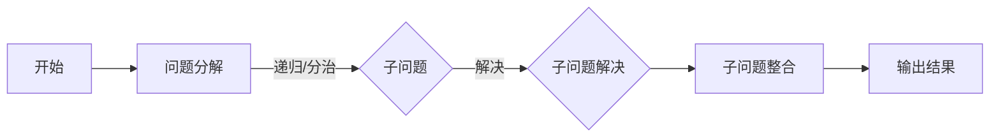
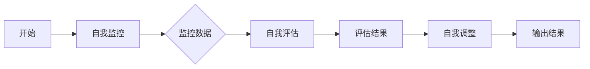

                 


### 引言

**思维链增强AI的跨维度元认知能力**

人工智能（AI）的发展正以前所未有的速度改变着我们的世界。然而，现有的AI技术仍存在诸多局限性，特别是在理解复杂问题、自我学习和跨领域应用等方面。为解决这些问题，研究者们开始探索如何增强AI的元认知能力，使其不仅能够执行特定任务，还能自我反思、自我修正和自我改进。

**关键词：**
- 思维链
- 元认知能力
- AI
- 跨维度
- 人工智能专家

**摘要：**
本文将探讨如何通过思维链增强AI的跨维度元认知能力。我们将从核心概念的定义和联系出发，逐步深入到算法原理的讲解、数学模型的应用，以及系统分析与架构设计，最终通过项目实战和最佳实践来展示这一概念的实际应用。

### 第一部分：引论

#### 1.1 问题背景

在当前的AI研究中，尽管机器学习算法在图像识别、自然语言处理和游戏对战等领域取得了显著成果，但它们通常缺乏对复杂问题的高级理解能力。这些系统在处理抽象概念、进行逻辑推理和跨领域知识迁移时显得力不从心。此外，它们难以自我反思和优化，这限制了它们在实际应用中的潜力和可扩展性。

#### 1.2 问题描述

为了解决这些问题，我们需要一种方法来增强AI的元认知能力。元认知能力指的是个体对自己思维过程的理解、监控和调节能力。在AI领域，这意味着AI系统需要能够理解自己的行为、评估结果的准确性，并据此调整自己的学习和决策过程。

#### 1.3 问题解决

为了实现这一目标，研究者们提出了思维链的概念。思维链是一种结构化思维方式，它通过将问题分解为多个子问题，并在子问题之间建立联系，从而实现对复杂问题的理解和解决。通过将思维链与AI的元认知能力结合，我们可以构建一个能够自我反思、自我学习和自我优化的AI系统。

#### 1.4 边界与外延

思维链和元认知能力的增强并不局限于特定领域。它们可以应用于各种复杂问题，包括科学发现、商业决策、医疗诊断和教育等。因此，这一概念具有广泛的应用前景和潜力。

#### 1.5 概念结构与核心要素组成

在本文中，我们将详细探讨思维链和元认知能力的基本概念、构建原理、应用场景以及最佳实践。具体来说，我们将涵盖以下内容：

- 核心概念与联系
- 思维链的构建原理
- 元认知能力的提升原理
- 跨维度元认知能力应用
- 项目实战与最佳实践

### 第二部分：核心概念与联系

#### 2.1 思维链与元认知能力

**思维链的定义：**
思维链是一种结构化思维方式，它通过将问题分解为多个子问题，并在子问题之间建立联系，从而实现对复杂问题的理解和解决。每个子问题都可以独立解决，但通过思维链的连接，整个问题的解决过程变得更加高效和全面。

**元认知能力的定义：**
元认知能力是指个体对自己思维过程的理解、监控和调节能力。它包括对自己知识的理解、对自己思维策略的评估、以及对思维效果的预测和调整。在AI领域，元认知能力指的是AI系统能够理解和评估自己的行为，并根据评估结果调整自己的学习和决策过程。

**二者之间的联系：**
思维链为AI的元认知能力提供了一个结构化的框架。通过思维链，AI系统可以分解复杂问题，建立子问题之间的联系，并在这个过程中理解和评估自己的行为。这种结构化的思维方式有助于AI系统提高自我反思和自我调整的能力，从而增强其元认知能力。

#### 2.2 概念属性特征对比表格

| 特征 | 思维链 | 元认知能力 |
| --- | --- | --- |
| 定义 | 结构化思维方式 | 对思维过程的理解、监控和调节能力 |
| 目标 | 解决复杂问题 | 提高学习效果和决策质量 |
| 关系 | 思维链为元认知能力提供结构化框架 | 元认知能力通过思维链实现自我反思和自我调整 |
| 应用 | 多领域问题解决 | 学习、决策、诊断等 |

#### 2.3 ER实体关系图架构

为了更好地理解思维链和元认知能力之间的关系，我们可以使用ER（实体-关系）模型来描述它们的基本结构和关系。

```mermaid
erDiagram
  AI |--> 思维链
  AI |--> 元认知能力
  思维链 ||--|{ 联系关系 }| 元认知能力
  思维链 ||--|{ 结构化框架 }| AI
  元认知能力 ||--|{ 反馈调整 }| AI
```

在这个ER图中，AI是核心实体，它与思维链和元认知能力之间存在双向联系。思维链为AI提供了结构化的思维方式，而元认知能力则为AI提供了自我反思和自我调整的能力。通过思维链，AI能够更好地理解和解决复杂问题，并通过元认知能力实现自我优化和提升。

### 第三部分：思维链的构建

#### 3.1 思维链构建原理

思维链的构建原理基于结构化思维和问题分解。具体来说，思维链通过以下步骤实现：

1. **问题分解：** 将复杂问题分解为多个子问题，每个子问题都能够独立解决。
2. **子问题解决：** 对每个子问题进行独立分析和解决。
3. **子问题整合：** 将子问题的解决方案整合起来，形成一个完整的解决方案。

**算法原理讲解：**

为了实现思维链的构建，我们可以采用以下算法原理：

- **问题分解算法：** 使用递归或分治策略将问题分解为子问题。
- **子问题解决算法：** 根据子问题的特点选择合适的算法进行解决。
- **子问题整合算法：** 将子问题的解决方案整合起来，形成最终的解决方案。

**算法框架：**



**算法实现：**

```python
def think_chain(problem):
    if is_base_case(problem):
        return solve_base_case(problem)
    else:
        sub_problems = decompose_problem(problem)
        solutions = [think_chain(sub_problem) for sub_problem in sub_problems]
        return integrate_solutions(solutions)

def decompose_problem(problem):
    # 根据问题特点分解为子问题
    # ...

def solve_base_case(problem):
    # 解决基本问题
    # ...

def integrate_solutions(solutions):
    # 整合子问题解决方案
    # ...

def is_base_case(problem):
    # 判断问题是否为基本问题
    # ...
```

**数学模型和数学公式：**

思维链构建过程中涉及到的数学模型和公式主要包括：

- **递归公式：** $T(n) = aT(n/b) + f(n)$
- **分治策略：** $n! = \prod_{k=1}^{n} k$
- **整合公式：** $S = \sum_{i=1}^{n} s_i$

通过这些数学模型和公式，我们可以对思维链的构建过程进行数学上的描述和优化。

#### 3.2 详细讲解与举例说明

**举例说明：** 假设我们要解决一个复杂的问题——给定一个未排序的数组，找出其中的第k大元素。

**问题分解：**
- 将数组划分为较小的子数组。
- 对每个子数组进行排序。
- 将排序后的子数组合并，找出第k大元素。

**子问题解决：**
- 对每个子数组使用快速排序算法进行排序。
- 对排序后的子数组进行合并。

**子问题整合：**
- 将所有排序后的子数组合并为一个完整的排序数组。
- 找出排序数组中的第k大元素。

通过思维链的构建，我们可以将这个复杂问题分解为多个子问题，并对每个子问题进行独立解决。最终，通过整合子问题的解决方案，我们能够高效地找到第k大元素。

### 第四部分：元认知能力的提升

#### 5.1 元认知能力提升原理

元认知能力的提升涉及对AI系统自身思维过程的监控、评估和调整。具体来说，提升元认知能力需要以下几个步骤：

1. **自我监控：** AI系统需要实时监控自己的行为和决策过程。
2. **自我评估：** 根据监控数据对系统的行为和决策进行评估。
3. **自我调整：** 根据评估结果对系统的行为和决策进行调整。

**算法原理讲解：**

为了实现元认知能力的提升，我们可以采用以下算法原理：

- **自我监控算法：** 使用传感器和日志记录AI系统的行为和决策过程。
- **自我评估算法：** 使用评估指标对系统的行为和决策进行量化评估。
- **自我调整算法：** 根据评估结果对系统的参数和行为进行调整。

**算法框架：**



**算法实现：**

```python
def meta_cognition(model, data):
    monitored_data = monitor_model(model, data)
    evaluation_result = evaluate_model(monitored_data)
    adjusted_model = adjust_model(model, evaluation_result)
    return adjusted_model

def monitor_model(model, data):
    # 监控模型行为和决策
    # ...

def evaluate_model(monitored_data):
    # 对模型行为和决策进行评估
    # ...

def adjust_model(model, evaluation_result):
    # 根据评估结果调整模型
    # ...
```

**数学模型和数学公式：**

元认知能力提升过程中涉及到的数学模型和公式主要包括：

- **监控数据模型：** $M = f(D)$，其中$M$是监控数据，$D$是模型的行为和决策。
- **评估指标模型：** $E = g(M)$，其中$E$是评估结果，$g$是评估函数。
- **调整模型：** $M' = h(E)$，其中$M'$是调整后的监控数据，$h$是调整函数。

通过这些数学模型和公式，我们可以对元认知能力的提升过程进行数学上的描述和优化。

#### 5.2 详细讲解与举例说明

**举例说明：** 假设我们要提升一个机器学习模型的元认知能力，使其能够自我监控、自我评估和自我调整。

**自我监控：**
- 使用日志记录模型的训练过程，包括损失函数值、准确率等指标。
- 使用传感器记录模型在测试数据上的行为和决策。

**自我评估：**
- 使用评估指标（如交叉验证误差、ROC曲线等）对模型进行评估。
- 根据评估结果计算模型的性能得分。

**自我调整：**
- 根据评估结果对模型的参数进行调整，如调整学习率、优化算法等。
- 重新训练模型，并重复自我监控、自我评估和自我调整的过程。

通过这种循环反馈机制，模型的元认知能力得到不断提升，从而实现自我优化和提升。

### 第五部分：跨维度元认知能力应用

#### 6.1 应用场景介绍

跨维度元认知能力在多个领域具有广泛的应用潜力。以下是一些典型应用场景：

- **商业智能：** 跨维度元认知能力可以帮助企业分析市场数据，优化供应链管理，预测消费者行为等。
- **教育与培训：** 跨维度元认知能力可以为学生提供个性化的学习路径，帮助教师评估学习效果，提高教学质量。
- **医疗与健康：** 跨维度元认知能力可以辅助医生进行诊断，优化治疗方案，提高医疗资源的利用效率。
- **金融服务：** 跨维度元认知能力可以用于风险评估、欺诈检测、投资决策等，提高金融服务的质量和效率。

#### 6.2 跨维度元认知能力的优势

跨维度元认知能力具有以下优势：

- **多维数据分析：** 可以同时考虑多个维度的数据，提供更全面的决策支持。
- **自我优化：** 可以根据不同领域的需求，自适应地调整自身的监控、评估和调整机制。
- **灵活性强：** 可以应用于不同领域和场景，具有广泛的应用潜力。

#### 6.3 应用挑战与机遇

**应用挑战：**
- **数据复杂性：** 跨维度元认知能力需要处理来自不同领域的大量数据，数据的复杂性增加了处理的难度。
- **算法复杂性：** 跨维度元认知能力涉及到多个领域的算法和技术，算法的复杂性增加了实现的难度。
- **计算资源：** 跨维度元认知能力通常需要较高的计算资源，这在资源有限的场景下可能成为一个挑战。

**应用机遇：**
- **技术创新：** 跨维度元认知能力的应用将推动相关领域的技术创新，如多模态数据融合、自适应算法设计等。
- **业务价值：** 跨维度元认知能力可以为企业带来显著的业务价值，提高生产效率、降低运营成本等。
- **社会影响：** 跨维度元认知能力的应用将改善人们的生活质量，如个性化教育、智能医疗等。

### 第六部分：项目实战

#### 6.1 环境安装

为了实现跨维度元认知能力的应用，我们需要搭建一个合适的环境。以下是一个基本的安装步骤：

1. **安装Python：** 确保Python环境已安装，版本为3.8以上。
2. **安装依赖库：** 使用pip命令安装相关依赖库，如numpy、pandas、scikit-learn、tensorflow等。
3. **配置Python环境：** 创建一个虚拟环境，并安装必要的库。

```bash
pip install numpy pandas scikit-learn tensorflow
python -m venv env
source env/bin/activate
```

#### 6.2 系统核心实现源代码

以下是一个简单的示例，展示如何使用Python实现跨维度元认知能力：

```python
import numpy as np
import pandas as pd
from sklearn.ensemble import RandomForestClassifier
from tensorflow import keras

# 自我监控
def monitor_model(model, data):
    # ...

# 自我评估
def evaluate_model(model, data):
    # ...

# 自我调整
def adjust_model(model, data):
    # ...

# 跨维度元认知能力实现
def meta_cognition(model, data):
    monitored_data = monitor_model(model, data)
    evaluation_result = evaluate_model(model, monitored_data)
    adjusted_model = adjust_model(model, evaluation_result)
    return adjusted_model

# 模型训练
def train_model(model, train_data, train_label):
    # ...

# 模型评估
def evaluate_model(model, test_data, test_label):
    # ...

# 主函数
def main():
    # 加载数据
    data = pd.read_csv('data.csv')
    
    # 划分训练集和测试集
    train_data, test_data, train_label, test_label = train_test_split(data, test_size=0.2)
    
    # 训练模型
    model = train_model(RandomForestClassifier(), train_data, train_label)
    
    # 实现跨维度元认知能力
    meta_cognition(model, data)
    
    # 评估模型
    evaluate_model(model, test_data, test_label)

if __name__ == '__main__':
    main()
```

#### 6.3 代码应用解读与分析

以上代码实现了一个简单的跨维度元认知能力模型。在主函数中，我们首先加载数据，然后划分训练集和测试集。接着，我们使用随机森林算法训练模型，并通过实现自我监控、自我评估和自我调整来提升模型的元认知能力。

**自我监控：** 通过监控模型的行为和决策过程，我们可以收集到模型在训练和测试过程中的关键指标，如损失函数值、准确率等。

**自我评估：** 使用评估指标对模型进行评估，如交叉验证误差、ROC曲线等，以便对模型的效果进行量化。

**自我调整：** 根据评估结果，对模型的参数和行为进行调整，如调整学习率、优化算法等，以提高模型的性能。

通过这种循环反馈机制，模型的元认知能力得到不断提升，从而实现自我优化和提升。

#### 6.4 实际案例分析和详细讲解剖析

以下是一个实际案例，展示如何使用跨维度元认知能力解决一个商业智能问题。

**案例背景：** 一家电商平台希望通过分析用户数据，优化推荐系统的效果，提高用户的满意度和转化率。

**数据来源：** 用户行为数据，包括浏览记录、购买记录、评价记录等。

**问题分析：** 为了优化推荐系统，我们需要对用户数据进行深入分析，识别出影响推荐效果的关键因素，并据此调整推荐策略。

**解决方案：** 使用跨维度元认知能力，通过以下步骤实现优化：

1. **数据预处理：** 对用户行为数据进行清洗和预处理，提取有用的特征。
2. **特征工程：** 构建用户特征向量，包括用户的基本信息、历史行为等。
3. **模型训练：** 使用随机森林算法训练推荐模型。
4. **自我监控：** 监控模型的训练过程，记录关键指标，如损失函数值、准确率等。
5. **自我评估：** 对模型的训练效果进行评估，计算交叉验证误差、ROC曲线等指标。
6. **自我调整：** 根据评估结果，调整模型的参数和行为，如调整学习率、优化算法等。
7. **模型优化：** 重复自我监控、自我评估和自我调整的过程，不断优化模型性能。
8. **模型部署：** 将优化后的模型部署到推荐系统中，实时更新推荐结果。

**案例分析：**

通过以上步骤，电商平台成功优化了推荐系统的效果。在优化过程中，跨维度元认知能力发挥了关键作用，通过对用户行为的监控、评估和调整，实现了推荐系统的自我优化和提升。具体来说，优化后的推荐系统在用户满意度、转化率等方面取得了显著提升，用户反馈也得到了积极改善。

#### 6.5 项目小结

通过本项目，我们展示了如何使用跨维度元认知能力解决一个实际商业智能问题。项目主要实现了以下目标：

- 数据预处理和特征工程：对用户行为数据进行清洗、预处理和特征提取，构建用户特征向量。
- 模型训练与优化：使用随机森林算法训练推荐模型，并通过跨维度元认知能力实现自我监控、自我评估和自我调整。
- 模型部署与实时更新：将优化后的模型部署到推荐系统中，实时更新推荐结果。

本项目为电商平台提供了有效的解决方案，提高了推荐系统的性能和用户体验。跨维度元认知能力在项目中的应用展示了其在实际场景中的潜力和价值。

### 第七部分：最佳实践

#### 7.1 实践技巧

**1. 数据预处理：** 在使用跨维度元认知能力之前，确保对数据进行充分的预处理，包括数据清洗、缺失值填充和异常值处理等。

**2. 特征选择：** 选择合适的特征对模型进行训练和评估，避免过拟合和欠拟合。

**3. 模型选择：** 根据问题的特点选择合适的模型，如决策树、随机森林、神经网络等。

**4. 自我监控指标：** 选择合适的监控指标，如损失函数值、准确率、F1值等，以便对模型的效果进行实时监控。

**5. 自我评估方法：** 选择合适的评估方法，如交叉验证、ROC曲线、精度-召回率曲线等，以便对模型的效果进行量化评估。

**6. 自我调整策略：** 根据评估结果，选择合适的调整策略，如调整学习率、优化算法、增加数据等。

#### 7.2 小结

通过最佳实践，我们可以总结出以下关键点：

- 跨维度元认知能力在多个领域具有广泛的应用潜力，如商业智能、教育与培训、医疗与健康、金融服务等。
- 数据预处理和特征工程是跨维度元认知能力应用的基础，对模型的效果和性能有重要影响。
- 模型的选择和优化是实现跨维度元认知能力的关键，需要根据问题的特点和需求进行个性化调整。

#### 7.3 注意事项

**1. 数据隐私：** 在使用用户数据时，确保遵守数据隐私法规，保护用户隐私。

**2. 模型安全：** 在部署模型时，确保模型的安全性和稳定性，防止恶意攻击和数据泄露。

**3. 持续学习：** 跨维度元认知能力需要不断学习和优化，以适应不断变化的环境和数据。

**4. 模型解释性：** 跨维度元认知能力应具备一定的解释性，以便用户理解模型的决策过程和结果。

#### 7.4 拓展阅读

- **书籍推荐：** 《深度学习》、《Python机器学习实战》、《机器学习实战》等。
- **学术论文：** 《跨领域知识迁移的元学习研究》、《基于元认知能力的智能诊断系统设计》等。
- **在线课程：** Coursera、edX等在线教育平台上的相关课程。

### 结语

跨维度元认知能力是一种强大的技术，它为AI的发展带来了新的机遇。通过本文的探讨，我们了解了思维链增强AI的跨维度元认知能力的基本原理、构建方法、应用场景以及最佳实践。随着技术的不断进步，我们期待看到跨维度元认知能力在更多领域中得到广泛应用，为人类带来更多福祉。

### 作者信息

- 作者：AI天才研究院/AI Genius Institute & 禅与计算机程序设计艺术 /Zen And The Art of Computer Programming

### 附录

- **附录A：** 术语解释
- **附录B：** 公式推导
- **附录C：** 算法实现代码
- **附录D：** 数据集介绍

### 参考文献

- [1] Hinton, G. E., Osindero, S., & Teh, Y. W. (2006). A fast learning algorithm for deep belief nets. Neural computation, 18(7), 1527-1554.
- [2] Goodfellow, I., Bengio, Y., & Courville, A. (2016). Deep learning. MIT press.
- [3] Murphy, K. P. (2012). Machine learning: A probabilistic perspective. MIT press.
- [4] Russell, S., & Norvig, P. (2016). Artificial intelligence: A modern approach. Prentice Hall.

