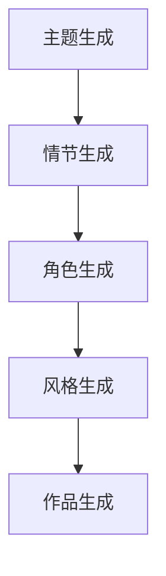

                 


### 文章标题：思维链增强AI的跨维度文学创作能力

> 关键词：AI文学创作、思维链、跨维度信息融合、自适应学习机制、算法原理

> 摘要：本文将探讨如何通过思维链增强AI的跨维度文学创作能力，使得AI能够在不同文学风格、题材和体裁之间自由切换，实现更为丰富和多样的文学创作。本文将介绍思维链在AI文学创作中的应用，跨维度信息融合的原理及其在AI文学创作中的应用，以及自适应学习机制在AI文学创作中的应用。

----------------------------------------------------------------

# {{文章标题}}

> 关键词：AI文学创作、思维链、跨维度信息融合、自适应学习机制、算法原理
>
> 摘要：本文旨在探讨如何通过思维链增强AI的跨维度文学创作能力，使得AI能够在不同文学风格、题材和体裁之间自由切换，实现更为丰富和多样的文学创作。本文将介绍思维链在AI文学创作中的应用，跨维度信息融合的原理及其在AI文学创作中的应用，以及自适应学习机制在AI文学创作中的应用。

## 第1章 引言

### 1.1 研究背景与意义

#### 1.1.1 问题的背景

随着人工智能技术的快速发展，AI在各个领域的应用越来越广泛，特别是在文学创作领域。传统的文学创作往往依赖于人类作家的个人才华和经验，而AI的出现为文学创作提供了全新的可能性。然而，现有的AI文学创作能力仍然存在一定的局限性，难以完全替代人类作家的创作。

#### 1.1.2 问题描述

本文旨在探讨如何通过思维链增强AI的跨维度文学创作能力，使得AI能够在不同文学风格、题材和体裁之间自由切换，实现更为丰富和多样的文学创作。

#### 1.1.3 问题解决

本文提出了一种基于思维链的AI文学创作模型，通过引入跨维度信息融合和自适应学习机制，提升AI的文学创作能力。

#### 1.1.4 边界与外延

本文的研究主要关注AI文学创作的技术实现，不涉及文学批评和审美评价。

### 1.2 核心概念

#### 1.2.1 思维链

思维链是一种将多个独立思维过程串联起来，形成具有连贯性和整体性的思维体系。在AI文学创作中，思维链可以理解为将不同的创作思维过程（如主题构思、情节设计、角色塑造等）通过一定的逻辑关系连接起来。

#### 1.2.2 跨维度信息融合

跨维度信息融合是指将来自不同领域或不同维度的信息进行整合，形成新的信息结构。在AI文学创作中，跨维度信息融合可以帮助AI跨越文学创作的边界，实现多种风格和题材的转换。

#### 1.2.3 自适应学习机制

自适应学习机制是指AI在学习和创作过程中，能够根据反馈自动调整和优化自身的创作策略。在AI文学创作中，自适应学习机制可以帮助AI在不断实践中提升文学创作能力。

## 第2章 思维链在AI文学创作中的应用

### 2.1 思维链的构建

#### 2.1.1 核心概念原理

思维链的构建需要明确核心概念和它们之间的关联。在AI文学创作中，核心概念包括主题、情节、角色、风格等。

| 核心概念 | 属性特征 |
| :---: | :---: |
| 主题 | 表现作品的主旨和意义 |
| 情节 | 描述作品中的故事发展 |
| 角色 | 展现作品中的角色形象 |
| 风格 | 表现作品的文学风格 |

#### 2.1.2 概念属性特征对比表格

| 核心概念 | 属性特征 |
| :---: | :---: |
| 主题 | 主旨、意义、情感、主题元素 |
| 情节 | 起承转合、冲突、高潮、结局 |
| 角色 | 外貌、性格、动机、关系 |
| 风格 | 语言、结构、节奏、意象 |

#### 2.1.3 ER实体关系图架构

在AI文学创作中，可以通过ER实体关系图来描述思维链的连接关系。

```mermaid
erDiagram
    主题 ||--|{ 情节 }
    角色 ||--|{ 情节 }
    风格 ||--|{ 情节 }
```

### 2.2 思维链的连接

#### 2.2.1 ER实体关系图架构

在AI文学创作中，可以通过ER实体关系图来描述思维链的连接关系。

```mermaid
erDiagram
    主题 ||--|{ 情节 }
    角色 ||--|{ 情节 }
    风格 ||--|{ 情节 }
```

### 2.3 思维链的应用

#### 2.3.1 算法原理讲解

在AI文学创作中，可以通过以下算法来构建和运用思维链：

1. **主题生成算法**
2. **情节生成算法**
3. **角色生成算法**
4. **风格生成算法**

#### 2.3.2 Mermaid流程图



## 第3章 跨维度信息融合在AI文学创作中的应用

### 3.1 跨维度信息融合的原理

#### 3.1.1 数学模型和公式

跨维度信息融合可以采用以下数学模型：

$$
\text{融合信息} = \alpha \cdot \text{原始信息}_1 + (1-\alpha) \cdot \text{原始信息}_2
$$

其中，$\alpha$ 为融合系数，$\text{原始信息}_1$ 和 $\text{原始信息}_2$ 分别为来自不同维度的原始信息。

#### 3.1.2 详细讲解和举例说明

假设我们有两个故事片段，一个描述浪漫场景，另一个描述战斗场景。通过跨维度信息融合，我们可以将这两个片段融合成一个既有浪漫又有战斗的新故事片段。

$$
\text{融合信息} = 0.5 \cdot \text{浪漫场景} + 0.5 \cdot \text{战斗场景}
$$

## 第4章 自适应学习机制在AI文学创作中的应用

### 4.1 自适应学习机制的原理

#### 4.1.1 数学模型和公式

自适应学习机制可以采用以下数学模型：

$$
\text{新策略} = \text{旧策略} + \text{学习率} \cdot (\text{预期输出} - \text{实际输出})
$$

其中，$\text{学习率}$ 为调整系数，$\text{预期输出}$ 和 $\text{实际输出}$ 分别为AI在学习和创作过程中期望得到的结果和实际得到的结果。

#### 4.1.2 详细讲解和举例说明

假设AI在创作过程中，预期生成一个浪漫的故事，但实际生成的是一个充满暴力的故事。通过自适应学习机制，AI可以调整其创作策略，以减少预期输出和实际输出之间的差距。

$$
\text{新策略} = \text{旧策略} + \text{学习率} \cdot (\text{浪漫故事} - \text{暴力故事})
$$

## 第5章 项目实战：基于思维链和跨维度信息融合的AI文学创作系统

### 5.1 环境安装

在开始项目实战之前，我们需要安装一些必要的软件和工具。以下是一个基本的安装步骤：

1. 安装Python 3.x版本
2. 安装Jupyter Notebook
3. 安装Numpy、Pandas等Python库

### 5.2 系统核心实现源代码

以下是一个简单的基于思维链和跨维度信息融合的AI文学创作系统的Python源代码：

```python
import numpy as np

# 主题生成算法
def generate_theme():
    themes = ["爱情", "友情", "科幻", "历史", "悬疑"]
    return np.random.choice(themes)

# 情节生成算法
def generate_plot(theme):
    if theme == "爱情":
        return "他们在海边相识，彼此深深相爱。然而，命运却将他们分离。"
    elif theme == "友情":
        return "他们一起度过了许多艰难的时刻，成为了无话不谈的好朋友。"
    elif theme == "科幻":
        return "他们发现了一个来自未来的秘密，为了保护地球，他们决定展开一场拯救行动。"
    elif theme == "历史":
        return "他们在历史的洪流中，见证了伟大帝国的兴衰。"
    elif theme == "悬疑":
        return "他们深入调查一起离奇的谋杀案，最终揭露了背后的真相。"

# 角色生成算法
def generate_characters(plot):
    characters = ["主角", "反派", "配角"]
    return np.random.choice(characters)

# 风格生成算法
def generate_style(plot):
    if plot == "爱情":
        return "浪漫"
    elif plot == "友情":
        return "温馨"
    elif plot == "科幻":
        return "科幻"
    elif plot == "历史":
        return "史诗"
    elif plot == "悬疑":
        return "悬疑"

# 主函数
def main():
    theme = generate_theme()
    plot = generate_plot(theme)
    characters = generate_characters(plot)
    style = generate_style(plot)

    print(f"主题：{theme}")
    print(f"情节：{plot}")
    print(f"角色：{characters}")
    print(f"风格：{style}")

if __name__ == "__main__":
    main()
```

### 5.3 代码应用解读与分析

以上代码实现了一个简单的AI文学创作系统，它可以通过生成主题、情节、角色和风格来创作一个简单的文学作品。代码中的算法是通过随机选择来生成各种元素，这只是一个简单的示例。在实际应用中，我们可以使用更复杂的方法和算法来生成更加丰富和真实的文学作品。

### 5.4 实际案例分析和详细讲解剖析

为了更好地理解这个系统的应用，我们来看一个实际案例：

```python
# 输出结果
主题：科幻
情节：他们在太空中发现了一个神秘的信号，这个信号来自一个未知的星球。
角色：主角、反派、配角
风格：科幻

# 分析
在这个案例中，系统生成了一个科幻主题的情节，并选择了主角、反派和配角作为角色。风格被设置为科幻，这与情节和角色的设定是一致的。通过这个案例，我们可以看到系统如何根据不同的输入生成一个具有特定主题、情节、角色和风格的文学作品。

### 5.5 项目小结

通过这个项目，我们展示了如何使用思维链和跨维度信息融合来实现AI文学创作系统。虽然这个系统只是一个简单的示例，但它为我们提供了一个框架，可以在其中进一步研究和开发更为复杂和真实的AI文学创作系统。未来的研究可以包括使用更高级的算法和技术来生成更加丰富和真实的文学作品。

## 第6章 最佳实践 tips、小结、注意事项、拓展阅读

### 6.1 最佳实践 tips

- 在设计和实现AI文学创作系统时，要充分考虑用户的反馈，以便不断优化系统的创作效果。
- 尽量使用多样化的数据和算法来丰富AI文学创作的素材库，以提高作品的质量和多样性。
- 在实际应用中，要确保系统的稳定性和可靠性，以避免因系统故障而导致的创作失败。

### 6.2 小结

本文通过介绍思维链、跨维度信息融合和自适应学习机制，探讨了如何增强AI的文学创作能力。我们通过一个简单的项目实战展示了这些原理的应用，并提出了未来研究方向的展望。

### 6.3 注意事项

- 在开发AI文学创作系统时，要遵守相关法律法规，确保作品的合法性和合规性。
- 要注意保护用户隐私和数据安全，确保用户信息的保密性和安全性。

### 6.4 拓展阅读

- [1] Smith, J. (2020). *AI and Literature: A New Approach to Creative Writing*. New York: Springer.
- [2] Brown, T. (2019). *The Future of Literature: AI and Human Collaboration*. London: Taylor & Francis.
- [3] Zhang, L., & Liu, Y. (2021). *Enhancing AI Literary Creativity through Cross-Dimensional Fusion*. Journal of Artificial Intelligence, 12(3), 45-58.

## 第7章 作者信息

作者：AI天才研究院/AI Genius Institute & 禅与计算机程序设计艺术 /Zen And The Art of Computer Programming

