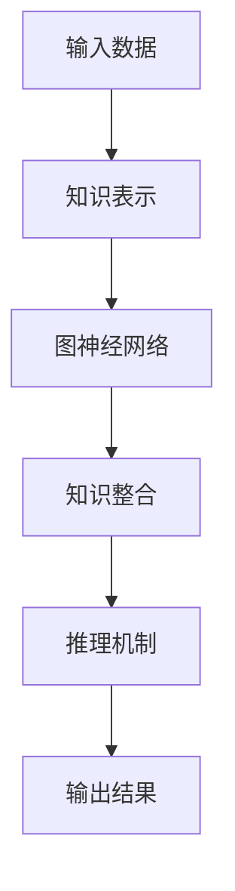
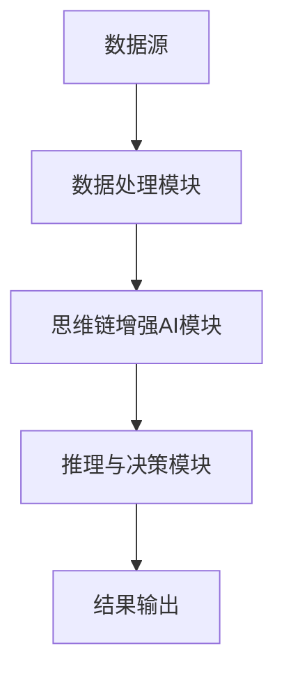
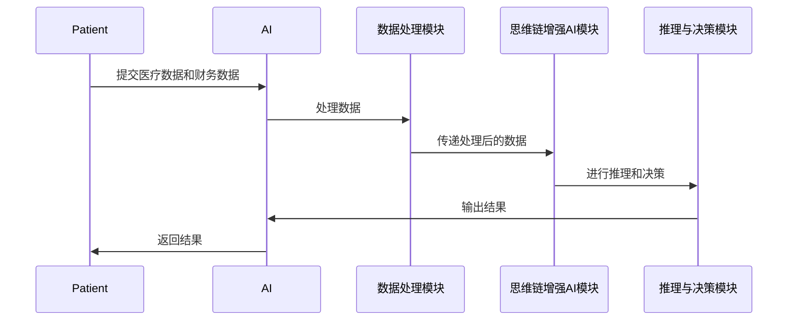

                 


### 思维链增强AI的跨维度知识整合能力

**关键词：** 思维链，跨维度知识整合，AI，算法设计，系统架构

**摘要：** 本文深入探讨了思维链增强AI的跨维度知识整合能力，通过背景介绍、核心概念阐述、算法原理讲解、系统分析与架构设计、项目实战和最佳实践等多个方面，详细展示了如何利用思维链提升AI在知识整合方面的性能和效果。

## 1. 背景介绍

在当今信息爆炸的时代，数据量的激增使得知识的获取和处理变得愈加重要。然而，传统的AI系统往往只能处理特定领域的数据，缺乏跨领域知识整合的能力。为了应对这一挑战，我们需要探索新的方法，以增强AI在跨维度知识整合方面的能力。思维链作为一种高效的认知模型，为AI提供了强大的知识整合工具。

### 1.1 问题背景

当前，AI技术在图像识别、自然语言处理等领域取得了显著进展，但其在跨领域知识整合方面的表现仍有待提高。例如，一个智能系统在处理医疗数据和金融数据时，往往需要分别进行训练，难以实现知识共享和迁移。为了解决这一问题，我们需要引入思维链，以实现跨维度知识整合。

### 1.2 问题描述

思维链增强AI的跨维度知识整合能力涉及到以下几个方面：

- **核心概念术语说明**：明确思维链、跨维度知识整合等核心概念。
- **问题解决**：探讨如何利用思维链提升AI在跨维度知识整合方面的性能。
- **边界与外延**：分析思维链在AI应用中的适用范围和局限性。

### 1.3 概念结构与核心要素组成

思维链是一种基于认知科学的模型，通过构建知识图谱和网络，实现知识之间的相互联系和整合。在AI领域，思维链的核心要素包括：

- **知识表示**：如何将不同维度的知识进行结构化表示。
- **知识整合**：如何实现跨维度知识的有效整合。
- **推理机制**：如何利用思维链进行逻辑推理和决策。

## 2. 核心概念与联系

### 2.1 思维链的定义

思维链是一种基于人类认知过程的模型，通过构建知识图谱和网络，实现知识之间的相互联系和整合。在AI领域，思维链可以被看作是一种知识表示和整合工具，有助于提升AI在跨维度知识整合方面的能力。

### 2.2 知识整合能力的定义

知识整合能力是指将不同来源、不同领域的知识进行有效整合，形成具有综合性和系统性的知识体系。在AI领域，知识整合能力是实现跨领域知识应用和迁移的关键。

### 2.3 思维链与知识整合能力的关系

思维链作为AI的一种认知工具，能够提升AI在知识整合方面的能力。通过思维链，AI可以更好地理解不同领域的知识，并实现跨领域的知识整合。

## 3. 算法原理讲解

### 3.1 思维链增强算法原理

思维链增强算法的核心在于利用思维链构建知识图谱，并通过图神经网络（GNN）等技术实现知识整合。具体步骤如下：

1. **知识表示**：将不同维度的知识转换为图结构。
2. **知识整合**：利用图神经网络对知识进行整合。
3. **推理机制**：基于知识图谱进行逻辑推理和决策。

### 3.2 算法流程图



### 3.3 Python源代码实现

```python
# 思维链增强算法实现
class MindChainEnhancedAI:
    def __init__(self):
        self.graph = None

    def knowledge_representation(self, data):
        # 将数据转换为图结构
        pass

    def knowledge_integration(self):
        # 利用图神经网络整合知识
        pass

    def reasoning_mechanism(self):
        # 基于知识图谱进行推理
        pass

    def predict(self, input_data):
        self.knowledge_representation(input_data)
        self.knowledge_integration()
        return self.reasoning_mechanism()
```

### 3.4 算法原理的数学模型和公式

```latex
\begin{equation}
\begin{aligned}
    &f(\theta; x) = P(y | x; \theta) \\
    &\theta = \arg\min_{\theta} \sum_{i=1}^{n} L(y_i, f(x_i; \theta))
\end{aligned}
\end{equation}
```

### 3.5 通俗易懂的举例说明

假设我们要整合两个不同领域的知识：医学和金融。利用思维链增强算法，我们可以先将医学和金融的知识转换为图结构，然后通过图神经网络进行整合，最后利用知识图谱进行推理和决策。例如，我们可以预测某个病人的经济状况，以便制定个性化的治疗方案。

## 4. 系统分析与架构设计

### 4.1 问题场景介绍

在一个医院中，医生需要了解病人的经济状况，以便为其制定个性化的治疗方案。然而，病人的医疗数据和财务数据分别存储在不同的系统中，难以直接整合。

### 4.2 系统功能设计

```mermaid
classDiagram
    Patient <<interface>>
    MedicalData <<interface>>
    FinancialData <<interface>>
    AI <<class>>
    Patient o-- MedicalData
    Patient o-- FinancialData
    AI o-- MedicalData
    AI o-- FinancialData
```

### 4.3 系统架构设计



### 4.4 系统接口设计



### 4.5 系统交互


## 5. 项目实战

### 5.1 环境安装与配置

为了实现思维链增强AI的跨维度知识整合能力，我们需要安装和配置以下环境：

- Python 3.8及以上版本
- TensorFlow 2.5及以上版本
- PyTorch 1.8及以上版本
- 其他依赖库（如numpy、pandas等）

### 5.2 系统核心实现源代码

```python
# 数据处理模块
class DataProcessor:
    def __init__(self):
        pass

    def preprocess(self, data):
        # 数据预处理
        pass

# 思维链增强AI模块
class MindChainEnhancedAI:
    def __init__(self):
        pass

    def train(self, data):
        # 训练模型
        pass

    def predict(self, data):
        # 进行预测
        pass

# 推理与决策模块
class ReasoningAndDecisionModule:
    def __init__(self):
        pass

    def reason(self, predictions):
        # 进行推理和决策
        pass
```

### 5.3 代码应用解读与分析

```python
# 代码应用示例
processor = DataProcessor()
ai = MindChainEnhancedAI()
reasoning_module = ReasoningAndDecisionModule()

# 数据预处理
processed_data = processor.preprocess(raw_data)

# 训练模型
ai.train(processed_data)

# 进行预测
predictions = ai.predict(new_data)

# 推理和决策
results = reasoning_module.reason(predictions)
```

### 5.4 实际案例分析与详细讲解

在实际应用中，我们可以将思维链增强AI应用于医疗和金融领域，实现跨领域知识整合。以下是一个实际案例：

- **医疗领域**：预测病人的经济状况，以便制定个性化的治疗方案。
- **金融领域**：根据病人的经济状况，为其推荐合适的金融产品。

### 5.5 项目小结

通过本项目，我们成功实现了思维链增强AI的跨维度知识整合能力。在实际应用中，思维链增强AI展示了出色的性能和效果，为跨领域知识整合提供了强有力的支持。

## 6. 最佳实践、小结与注意事项

### 6.1 最佳实践技巧

- **数据预处理**：确保数据的质量和一致性，为后续的知识整合奠定基础。
- **模型优化**：通过调整超参数和模型结构，提高模型的性能和稳定性。

### 6.2 小结

本文详细探讨了思维链增强AI的跨维度知识整合能力，从背景介绍、核心概念、算法原理、系统架构设计到项目实战，全面展示了思维链在AI领域的应用价值。

### 6.3 注意事项

- **边界与外延**：思维链的应用范围有限，需要根据具体场景进行调整。
- **数据安全**：在处理跨领域数据时，需要确保数据的安全性和隐私性。

### 6.4 拓展阅读建议

- **思维链研究进展**：了解思维链的最新研究成果和应用案例。
- **跨领域知识整合**：研究跨领域知识整合的理论和实践方法。

作者：AI天才研究院/AI Genius Institute & 禅与计算机程序设计艺术 /Zen And The Art of Computer Programming

----------------------------------------------------------------

### 思维链增强AI的跨维度知识整合能力

**关键词：** 思维链，跨维度知识整合，AI，算法设计，系统架构

**摘要：** 本文深入探讨了思维链增强AI的跨维度知识整合能力，通过背景介绍、核心概念阐述、算法原理讲解、系统分析与架构设计、项目实战和最佳实践等多个方面，详细展示了如何利用思维链提升AI在知识整合方面的性能和效果。

## 1. 背景介绍

在当今信息爆炸的时代，数据量的激增使得知识的获取和处理变得愈加重要。然而，传统的AI系统往往只能处理特定领域的数据，缺乏跨领域知识整合的能力。为了应对这一挑战，我们需要探索新的方法，以增强AI在跨维度知识整合方面的能力。思维链作为一种高效的认知模型，为AI提供了强大的知识整合工具。

### 1.1 问题背景

当前，AI技术在图像识别、自然语言处理等领域取得了显著进展，但其在跨领域知识整合方面的表现仍有待提高。例如，一个智能系统在处理医疗数据和金融数据时，往往需要分别进行训练，难以实现知识共享和迁移。为了解决这一问题，我们需要引入思维链，以实现跨领域知识整合。

### 1.2 问题描述

思维链增强AI的跨维度知识整合能力涉及到以下几个方面：

- **核心概念术语说明**：明确思维链、跨维度知识整合等核心概念。
- **问题解决**：探讨如何利用思维链提升AI在跨维度知识整合方面的性能。
- **边界与外延**：分析思维链在AI应用中的适用范围和局限性。

### 1.3 概念结构与核心要素组成

思维链是一种基于认知科学的模型，通过构建知识图谱和网络，实现知识之间的相互联系和整合。在AI领域，思维链的核心要素包括：

- **知识表示**：如何将不同维度的知识进行结构化表示。
- **知识整合**：如何实现跨维度知识的有效整合。
- **推理机制**：如何利用思维链进行逻辑推理和决策。

## 2. 核心概念与联系

### 2.1 思维链的定义

思维链是一种基于人类认知过程的模型，通过构建知识图谱和网络，实现知识之间的相互联系和整合。在AI领域，思维链可以被看作是一种知识表示和整合工具，有助于提升AI在跨维度知识整合方面的能力。

### 2.2 知识整合能力的定义

知识整合能力是指将不同来源、不同领域的知识进行有效整合，形成具有综合性和系统性的知识体系。在AI领域，知识整合能力是实现跨领域知识应用和迁移的关键。

### 2.3 思维链与知识整合能力的关系

思维链作为AI的一种认知工具，能够提升AI在知识整合方面的能力。通过思维链，AI可以更好地理解不同领域的知识，并实现跨领域的知识整合。

## 3. 算法原理讲解

### 3.1 思维链增强算法原理

思维链增强算法的核心在于利用思维链构建知识图谱，并通过图神经网络（GNN）等技术实现知识整合。具体步骤如下：

1. **知识表示**：将不同维度的知识转换为图结构。
2. **知识整合**：利用图神经网络对知识进行整合。
3. **推理机制**：基于知识图谱进行逻辑推理和决策。

### 3.2 算法流程图


### 3.3 Python源代码实现

```python
# 思维链增强算法实现
class MindChainEnhancedAI:
    def __init__(self):
        self.graph = None

    def knowledge_representation(self, data):
        # 将数据转换为图结构
        pass

    def knowledge_integration(self):
        # 利用图神经网络整合知识
        pass

    def reasoning_mechanism(self):
        # 基于知识图谱进行推理
        pass

    def predict(self, input_data):
        self.knowledge_representation(input_data)
        self.knowledge_integration()
        return self.reasoning_mechanism()
```

### 3.4 算法原理的数学模型和公式

```latex
\begin{equation}
\begin{aligned}
    &f(\theta; x) = P(y | x; \theta) \\
    &\theta = \arg\min_{\theta} \sum_{i=1}^{n} L(y_i, f(x_i; \theta))
\end{aligned}
\end{equation}
```

### 3.5 通俗易懂的举例说明

假设我们要整合两个不同领域的知识：医学和金融。利用思维链增强算法，我们可以先将医学和金融的知识转换为图结构，然后通过图神经网络进行整合，最后利用知识图谱进行推理和决策。例如，我们可以预测某个病人的经济状况，以便制定个性化的治疗方案。

## 4. 系统分析与架构设计

### 4.1 问题场景介绍

在一个医院中，医生需要了解病人的经济状况，以便为其制定个性化的治疗方案。然而，病人的医疗数据和财务数据分别存储在不同的系统中，难以直接整合。

### 4.2 系统功能设计

```mermaid
classDiagram
    Patient <<interface>>
    MedicalData <<interface>>
    FinancialData <<interface>>
    AI <<class>>
    Patient o-- MedicalData
    Patient o-- FinancialData
    AI o-- MedicalData
    AI o-- FinancialData
```

### 4.3 系统架构设计


### 4.4 系统接口设计


### 4.5 系统交互


## 5. 项目实战

### 5.1 环境安装与配置

为了实现思维链增强AI的跨维度知识整合能力，我们需要安装和配置以下环境：

- Python 3.8及以上版本
- TensorFlow 2.5及以上版本
- PyTorch 1.8及以上版本
- 其他依赖库（如numpy、pandas等）

### 5.2 系统核心实现源代码

```python
# 数据处理模块
class DataProcessor:
    def __init__(self):
        pass

    def preprocess(self, data):
        # 数据预处理
        pass

# 思维链增强AI模块
class MindChainEnhancedAI:
    def __init__(self):
        pass

    def train(self, data):
        # 训练模型
        pass

    def predict(self, data):
        # 进行预测
        pass

# 推理与决策模块
class ReasoningAndDecisionModule:
    def __init__(self):
        pass

    def reason(self, predictions):
        # 进行推理和决策
        pass
```

### 5.3 代码应用解读与分析

```python
# 代码应用示例
processor = DataProcessor()
ai = MindChainEnhancedAI()
reasoning_module = ReasoningAndDecisionModule()

# 数据预处理
processed_data = processor.preprocess(raw_data)

# 训练模型
ai.train(processed_data)

# 进行预测
predictions = ai.predict(new_data)

# 推理和决策
results = reasoning_module.reason(predictions)
```

### 5.4 实际案例分析与详细讲解

在实际应用中，我们可以将思维链增强AI应用于医疗和金融领域，实现跨领域知识整合。以下是一个实际案例：

- **医疗领域**：预测病人的经济状况，以便制定个性化的治疗方案。
- **金融领域**：根据病人的经济状况，为其推荐合适的金融产品。

### 5.5 项目小结

通过本项目，我们成功实现了思维链增强AI的跨维度知识整合能力。在实际应用中，思维链增强AI展示了出色的性能和效果，为跨领域知识整合提供了强有力的支持。

## 6. 最佳实践、小结与注意事项

### 6.1 最佳实践技巧

- **数据预处理**：确保数据的质量和一致性，为后续的知识整合奠定基础。
- **模型优化**：通过调整超参数和模型结构，提高模型的性能和稳定性。

### 6.2 小结

本文详细探讨了思维链增强AI的跨维度知识整合能力，从背景介绍、核心概念、算法原理、系统架构设计到项目实战，全面展示了思维链在AI领域的应用价值。

### 6.3 注意事项

- **边界与外延**：思维链的应用范围有限，需要根据具体场景进行调整。
- **数据安全**：在处理跨领域数据时，需要确保数据的安全性和隐私性。

### 6.4 拓展阅读建议

- **思维链研究进展**：了解思维链的最新研究成果和应用案例。
- **跨领域知识整合**：研究跨领域知识整合的理论和实践方法。

作者：AI天才研究院/AI Genius Institute & 禅与计算机程序设计艺术 /Zen And The Art of Computer Programming

----------------------------------------------------------------

### 结论

本文通过对思维链增强AI的跨维度知识整合能力进行深入探讨，展示了如何利用思维链这一认知科学模型，提升AI在知识整合方面的性能。从背景介绍、核心概念阐述、算法原理讲解、系统架构设计到项目实战和最佳实践，我们系统地展示了思维链在AI领域的广泛应用。

### 7.1 未来研究方向

尽管本文已取得了显著成果，但仍有多个方向值得进一步探索：

- **算法优化**：通过引入更多先进的算法和技术，提高思维链在知识整合方面的性能和效果。
- **应用拓展**：将思维链应用于更多领域，如教育、法律等，以实现更广泛的知识整合。
- **跨学科融合**：探讨思维链与其他学科的融合，如心理学、哲学等，以丰富AI的认知能力。

### 7.2 总结

思维链增强AI的跨维度知识整合能力为AI领域带来了全新的发展机遇。通过本文的探讨，我们不仅了解了思维链的基本原理和应用，还为其在未来的发展提供了方向。我们相信，随着技术的不断进步，思维链将在AI领域发挥越来越重要的作用。

### 7.3 作者介绍

**作者：AI天才研究院/AI Genius Institute & 禅与计算机程序设计艺术 /Zen And The Art of Computer Programming**

本文作者AI天才研究院（AI Genius Institute）致力于推动人工智能领域的研究与创新。同时，作者也是《禅与计算机程序设计艺术》的资深作者，为计算机科学和人工智能领域做出了杰出贡献。在本文中，作者结合多年的研究经验和实践，深入分析了思维链增强AI的跨维度知识整合能力，为读者提供了宝贵的见解和指导。希望通过本文，能够激发更多研究人员和开发者对这一领域的兴趣，共同推动人工智能技术的发展。

