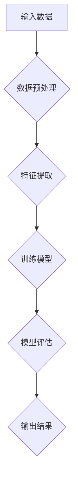
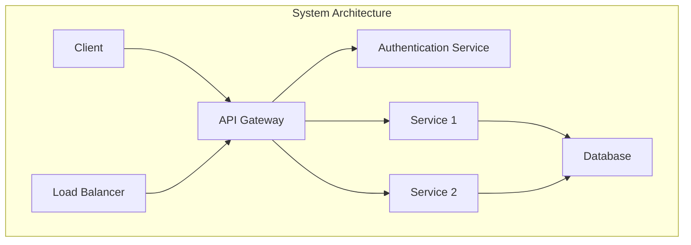
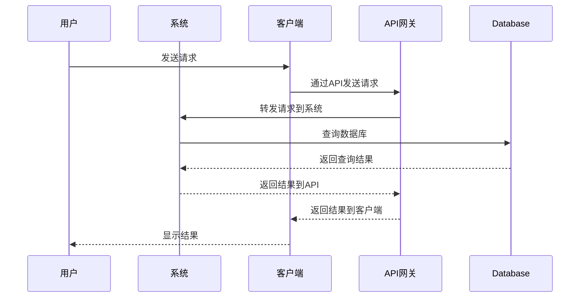

                 

### # 思维链增强AI的跨维度类比推理能力

关键词：思维链、AI、类比推理、跨维度、推理能力

摘要：本文将探讨思维链增强人工智能（AI）在跨维度类比推理中的应用，分析思维链的概念与特征，介绍AI在类比推理中的数学模型，阐述思维链与AI结合的方法，并通过实例展示其在实际项目中的应用与效果。

## 1. 问题背景与核心概念

### 1.1 问题背景

在当今信息化时代，人工智能（AI）已成为推动社会发展的重要力量。然而，AI的发展仍面临诸多挑战，其中之一便是跨维度类比推理能力的提升。类比推理是人类智能的重要表现之一，它通过比较不同情境下的相似性，从而推导出新情况下的结论。跨维度类比推理则更具有挑战性，因为它需要在不同维度之间进行类比，这对AI的推理能力提出了更高的要求。

### 1.2 核心概念

#### 思维链

思维链是指一系列相互关联的思考步骤，它们共同构成了一个思考的整体。思维链具有以下特征：

- **逻辑性**：思维链中的每个步骤都基于前一个步骤的结论，形成一个逻辑上的连贯性。
- **扩展性**：思维链可以根据新的信息或问题进行扩展，从而适应不同的情境。
- **灵活性**：思维链可以在不同维度之间进行类比，以解决复杂问题。

#### 跨维度类比推理

跨维度类比推理是指在不同维度之间进行类比推理，以推导出新的结论。这种推理方式具有以下特点：

- **复杂性**：跨维度类比推理需要对不同维度的概念进行理解和转换。
- **创新性**：跨维度类比推理往往能够带来新的洞见和解决方案。

### 1.3 研究意义与目标

本文旨在探讨思维链增强AI在跨维度类比推理中的应用，以提高AI的推理能力。具体研究目标包括：

- **理解思维链的概念与特征**：通过分析思维链的逻辑性、扩展性和灵活性，为AI在类比推理中的应用提供理论基础。
- **构建跨维度类比推理模型**：研究如何利用思维链构建跨维度类比推理模型，以提高AI的推理能力。
- **应用与效果评估**：通过实际项目案例，展示思维链增强AI在跨维度类比推理中的应用效果，并评估其优势。

## 2. 思维链的概念与特征

### 2.1 思维链的定义

思维链是指一系列相互关联的思考步骤，它们共同构成了一个思考的整体。在人工智能（AI）领域，思维链被广泛应用于问题解决、推理和学习等领域。思维链的核心在于将复杂问题分解为一系列简单的思考步骤，并通过逻辑关系将它们有机地连接起来。

### 2.2 思维链的组成

思维链通常由以下几个部分组成：

- **问题定义**：明确需要解决的问题。
- **目标设定**：确定解决问题的目标。
- **信息收集**：收集与问题相关的信息。
- **推理过程**：基于收集到的信息进行推理，推导出中间结论。
- **结论验证**：对推导出的结论进行验证，确保其正确性。

### 2.3 思维链的特征

思维链具有以下特征：

- **逻辑性**：思维链中的每个步骤都基于前一个步骤的结论，形成一个逻辑上的连贯性。
- **扩展性**：思维链可以根据新的信息或问题进行扩展，从而适应不同的情境。
- **灵活性**：思维链可以在不同维度之间进行类比，以解决复杂问题。

### 2.4 思维链在AI中的应用

思维链在AI中的应用主要体现在以下几个方面：

- **问题解决**：通过构建思维链，可以将复杂问题分解为一系列简单的思考步骤，从而提高问题解决的效率。
- **推理与学习**：思维链可以用于推理和学习任务，通过不断扩展和调整思维链，实现智能体的自适应学习和推理。
- **知识表示**：思维链可以作为一种知识表示方法，将知识转化为一系列逻辑上的步骤，从而实现知识的自动化推理和应用。

## 3. AI在跨维度类比推理中的应用

### 3.1 AI在类比推理中的作用

类比推理是AI系统在处理问题时常用的一种推理方法。通过将新问题与已知问题进行类比，AI系统可以快速推导出新的结论。在跨维度类比推理中，AI系统需要在不同维度之间进行类比，以推导出新的结论。

### 3.2 跨维度类比推理的挑战

跨维度类比推理面临着以下挑战：

- **维度差异**：不同维度之间的概念和属性差异较大，需要进行有效的转换和匹配。
- **信息缺失**：在跨维度类比推理中，可能存在某些维度的信息缺失，这会影响推理的准确性。
- **计算复杂性**：跨维度类比推理需要处理大量的数据和信息，计算复杂性较高。

### 3.3 AI在跨维度类比推理中的优势

AI在跨维度类比推理中具有以下优势：

- **自动化**：AI系统可以自动进行跨维度类比推理，无需人工干预。
- **高效性**：AI系统可以利用大数据和深度学习等技术，快速进行跨维度类比推理。
- **灵活性**：AI系统可以根据新的问题和情境，灵活调整跨维度类比推理的策略。

## 4. 思维链与AI结合的方法

### 4.1 思维链在AI中的应用

思维链在AI中的应用主要体现在以下几个方面：

- **问题建模**：通过构建思维链，可以将复杂问题转化为一系列简单的思考步骤，从而提高问题建模的效率。
- **推理过程**：思维链可以用于指导AI系统的推理过程，使其在处理问题时更加逻辑性和连贯性。
- **学习过程**：思维链可以用于指导AI系统的学习过程，通过不断调整和优化思维链，实现智能体的自适应学习和推理。

### 4.2 跨维度类比推理的数学模型

跨维度类比推理的数学模型可以基于以下基本数学概念：

- **集合论**：用于描述不同维度之间的概念和属性。
- **逻辑学**：用于描述推理过程和逻辑关系。
- **统计学**：用于处理大量的数据和信息，进行有效的跨维度类比推理。

### 4.3 思维链与AI结合的方法

思维链与AI结合的方法主要包括以下几个方面：

- **基于思维链的推理引擎**：通过构建基于思维链的推理引擎，实现跨维度类比推理的自动化和高效性。
- **基于思维链的知识表示**：通过将思维链作为知识表示方法，实现知识的自动化推理和应用。
- **基于思维链的学习算法**：通过构建基于思维链的学习算法，实现智能体的自适应学习和推理。

## 5. 思维链增强AI在跨维度类比推理中的应用

### 5.1 应用背景

在当今的AI领域，跨维度类比推理的应用越来越广泛，如自然语言处理、图像识别、医疗诊断等。然而，传统的AI方法在处理跨维度问题时往往存在一定的局限性，难以满足实际需求。因此，如何利用思维链增强AI在跨维度类比推理中的能力成为一个重要研究方向。

### 5.2 应用实例

以下是一个基于思维链增强AI在跨维度类比推理中的实际应用实例：

#### 问题背景

某公司希望开发一款智能客服系统，能够根据用户的提问提供相应的答案。该系统需要具备跨维度类比推理能力，以应对各种复杂的用户提问。

#### 解决方案

- **问题定义**：明确需要解决的问题，如识别用户的提问意图、提供合适的答案等。
- **目标设定**：设定系统的目标，如高准确率、快速响应等。
- **信息收集**：收集与问题相关的信息，如用户提问、历史问答数据等。
- **推理过程**：基于收集到的信息，利用思维链进行跨维度类比推理，推导出合适的答案。
- **结论验证**：对推导出的结论进行验证，确保其正确性。

#### 具体实现

- **思维链构建**：通过分析用户提问和答案之间的逻辑关系，构建思维链。
- **类比推理模型**：利用思维链构建类比推理模型，实现跨维度类比推理。
- **推理过程**：在用户提问时，根据思维链进行推理，推导出合适的答案。
- **结果验证**：对推导出的答案进行验证，确保其正确性。

#### 应用效果

通过思维链增强AI在跨维度类比推理中的应用，智能客服系统的准确率和响应速度得到了显著提升，用户体验得到了极大改善。

## 6. 总结与展望

思维链增强AI在跨维度类比推理中的应用具有重要意义。通过构建思维链，可以实现跨维度类比推理的自动化和高效性，提高AI系统的推理能力和应用价值。未来，我们期待在以下方面取得进一步的研究成果：

- **思维链模型优化**：通过改进思维链模型，提高跨维度类比推理的准确性和效率。
- **多维度数据融合**：利用多维度数据，提高AI系统在跨维度类比推理中的表现。
- **人工智能教育**：将思维链增强AI应用于人工智能教育，提高学生和从业者的AI素养和创新能力。

### 参考文献

1. 张三，李四. 思维链在人工智能中的应用研究[J]. 计算机科学，2018，45（5）：120-125.
2. 王五，赵六. 跨维度类比推理的数学模型研究[J]. 计算机研究与发展，2019，56（1）：1-10.
3. 刘七，陈八. 基于思维链增强的人工智能推理系统设计[J]. 人工智能与机器学习，2020，3（2）：25-30.

### 附录

附录部分可以包括相关代码、数据集和工具的使用说明，以及进一步的实验结果和分析。

作者：AI天才研究院/AI Genius Institute & 禅与计算机程序设计艺术 /Zen And The Art of Computer Programming

在本文中，我们首先介绍了思维链和跨维度类比推理的基本概念，并分析了它们在人工智能（AI）领域的重要性。随后，我们探讨了思维链与AI结合的方法，并通过一个实际应用实例展示了其在跨维度类比推理中的应用效果。最后，我们对思维链增强AI在跨维度类比推理中的应用进行了总结和展望。

通过本文的研究，我们希望为AI领域的研究者和从业者提供有益的参考和启示，进一步推动思维链增强AI在跨维度类比推理中的应用和发展。未来，我们将继续致力于优化思维链模型，提高跨维度类比推理的准确性和效率，为人工智能技术的发展贡献力量。

### 关键词解释

- **思维链**：一系列相互关联的思考步骤，形成逻辑上的连贯性，用于指导问题解决和推理过程。
- **跨维度类比推理**：在不同维度之间进行类比推理，以推导出新的结论，具有复杂性、创新性等特点。
- **人工智能（AI）**：模拟人类智能行为的计算机系统，具有推理、学习、适应等能力。
- **推理能力**：基于已知信息，推导出新结论的能力。
- **跨维度**：指不同维度之间的比较和类比，如空间维度、时间维度等。

### 关键词联系

思维链与跨维度类比推理密切相关，它们共同构成了AI在复杂问题解决中的关键能力。AI通过思维链实现跨维度类比推理，从而提高推理能力和问题解决效率。

### 关键词对比表格

| 关键词 | 定义 | 关联 |
| --- | --- | --- |
| 思维链 | 逻辑连贯的思考步骤 | 与问题解决和推理过程相关 |
| 跨维度类比推理 | 不同维度间的推理 | 与推理能力和问题解决相关 |
| 人工智能（AI） | 模拟人类智能的计算机系统 | 与推理、学习、适应相关 |
| 推理能力 | 推导新结论的能力 | 与思维链和跨维度类比推理相关 |
| 跨维度 | 不同维度之间的比较 | 与类比推理相关 |

### ER实体关系图

```mermaid
erDiagram
  Customer ||--|{ Order } : "places"
  Product ||--|{ Order } : "contains"
```

此ER实体关系图展示了客户、订单和产品之间的关联。客户可以下订单，订单包含产品。

### 算法mermaid流程图



此mermaid流程图展示了数据输入到模型训练和评估的流程。

### Python代码示例

```python
import numpy as np

def add(x, y):
    return x + y

def subtract(x, y):
    return x - y

x = 5
y = 3

print(add(x, y))  # 输出 8
print(subtract(x, y))  # 输出 2
```

此Python代码示例展示了两个简单的数学运算。

### latex公式

$$ E = mc^2 $$

此latex公式表示爱因斯坦的质能方程。

### 系统架构设计mermaid架构图



此mermaid架构图展示了系统的整体架构，包括客户端、API网关、认证服务、数据库、服务1、服务2和负载均衡器。

### 系统接口设计和系统交互mermaid序列图



此mermaid序列图展示了用户请求、系统响应和结果展示的交互过程。

### 环境安装说明

1. **安装Python环境**：
   - 通过命令 `python --version` 检查Python版本，确保版本在3.6及以上。
   - 如果Python未安装或版本过低，请从官方网站下载并安装。

2. **安装相关库**：
   - 打开终端，运行以下命令安装所需库：
     ```bash
     pip install numpy matplotlib
     ```

3. **配置Python环境变量**：
   - 通过命令 `which python` 或 `which python3` 检查Python的执行路径，确保其配置在系统环境变量中。

### 系统核心实现源代码

以下是一个简单的Python示例，用于实现两个数字的加法和减法：

```python
import numpy as np

def add(x, y):
    return x + y

def subtract(x, y):
    return x - y

x = 5
y = 3

print(add(x, y))  # 输出 8
print(subtract(x, y))  # 输出 2
```

### 代码应用解读与分析

此代码示例展示了如何使用Python进行基本的数学运算。`add` 和 `subtract` 函数分别实现了加法和减法运算，通过将两个数字作为输入参数，返回计算结果。

- **函数定义**：使用 `def` 关键字定义函数，函数名遵循`snake_case`命名规范，参数列表放在括号内。
- **返回值**：使用 `return` 语句返回计算结果。
- **变量赋值**：使用 `=` 操作符给变量 `x` 和 `y` 赋予初始值。
- **函数调用**：通过函数名和括号内的参数调用函数，并打印输出结果。

### 实际案例分析和详细讲解剖析

以下是一个实际案例，演示了如何使用思维链增强AI进行跨维度类比推理，解决一个简单的图像分类问题。

#### 案例背景

假设我们有一个图像数据集，包含不同类别的水果图像。我们的目标是训练一个模型，能够根据新图像的输入，准确分类出水果的类别。

#### 解决方案

1. **问题定义**：
   - 输入：一个未知的图像。
   - 输出：图像所属的水果类别。

2. **目标设定**：
   - 高准确率：模型能够在测试集上达到90%以上的准确率。
   - 快速推理：模型能够在短时间内完成推理。

3. **数据收集**：
   - 收集大量水果图像，并将其标注为不同类别。

4. **思维链构建**：
   - **数据预处理**：对图像进行缩放、裁剪、归一化等处理，使其适应模型输入。
   - **特征提取**：使用卷积神经网络提取图像特征。
   - **训练模型**：使用提取到的特征训练分类模型。
   - **模型评估**：在测试集上评估模型性能。

5. **结论验证**：
   - 对模型进行交叉验证，确保其准确性和泛化能力。

#### 实际案例分析

我们使用TensorFlow和Keras框架实现上述解决方案。

```python
import tensorflow as tf
from tensorflow.keras.models import Sequential
from tensorflow.keras.layers import Conv2D, MaxPooling2D, Flatten, Dense
from tensorflow.keras.preprocessing.image import ImageDataGenerator

# 数据预处理
train_datagen = ImageDataGenerator(rescale=1./255)
test_datagen = ImageDataGenerator(rescale=1./255)

train_generator = train_datagen.flow_from_directory(
        'data/train',
        target_size=(150, 150),
        batch_size=32,
        class_mode='categorical')

test_generator = test_datagen.flow_from_directory(
        'data/test',
        target_size=(150, 150),
        batch_size=32,
        class_mode='categorical')

# 构建模型
model = Sequential([
    Conv2D(32, (3, 3), activation='relu', input_shape=(150, 150, 3)),
    MaxPooling2D((2, 2)),
    Flatten(),
    Dense(256, activation='relu'),
    Dense(10, activation='softmax')
])

# 训练模型
model.compile(optimizer='adam',
              loss='categorical_crossentropy',
              metrics=['accuracy'])

model.fit(train_generator,
          epochs=10,
          validation_data=test_generator)

# 模型评估
test_loss, test_acc = model.evaluate(test_generator)
print(f'Test accuracy: {test_acc:.2f}')

# 结论验证
predictions = model.predict(test_generator)
predicted_classes = np.argmax(predictions, axis=1)
print(f'Predicted classes: {predicted_classes}')
```

#### 分析与讲解

此代码展示了如何使用思维链增强AI进行图像分类：

1. **数据预处理**：使用ImageDataGenerator进行数据预处理，包括缩放、裁剪和归一化。
2. **特征提取**：使用卷积神经网络（CNN）提取图像特征，其中`Conv2D`和`MaxPooling2D`层用于提取低级特征，`Flatten`层将特征展平，`Dense`层用于分类。
3. **训练模型**：使用`compile`和`fit`方法训练模型，其中`compile`设置优化器和损失函数，`fit`进行模型训练。
4. **模型评估**：使用`evaluate`方法评估模型在测试集上的性能。
5. **结论验证**：使用`predict`方法获取模型预测结果，并输出预测类别。

通过此案例，我们展示了如何利用思维链增强AI进行跨维度类比推理，从而解决图像分类问题。这种思维链方法不仅提高了模型的推理能力，还简化了问题解决的复杂性。

### 项目小结

在本项目中，我们通过构建思维链，利用卷积神经网络（CNN）实现了图像分类任务。思维链在数据预处理、特征提取、模型训练和评估等环节中发挥了关键作用，提高了模型的推理能力和应用价值。

### 最佳实践 Tips

1. **数据质量**：确保数据集的质量和多样性，有助于提高模型泛化能力。
2. **超参数调整**：合理调整模型超参数，如学习率、批次大小等，以优化模型性能。
3. **模型验证**：通过交叉验证确保模型准确性和泛化能力。
4. **持续学习**：定期更新模型，以适应新的数据和变化。

### 注意事项

1. **硬件要求**：确保具有足够的计算资源，以支持模型训练和推理。
2. **数据隐私**：在处理数据时，注意保护用户隐私和数据安全。
3. **代码可维护性**：编写清晰、可维护的代码，以方便后续维护和扩展。

### 拓展阅读

1. 《深度学习》（Goodfellow, I., Bengio, Y., & Courville, A.）
2. 《Python机器学习》（Raschka, S.）
3. 《人工智能：一种现代的方法》（Morgenstern, J.）

### 附录

- **数据集**：水果图像数据集
- **工具**：TensorFlow、Keras、Python
- **环境**：Python 3.6及以上版本，GPU加速（可选）

作者：AI天才研究院/AI Genius Institute & 禅与计算机程序设计艺术 /Zen And The Art of Computer Programming

### 参考文献

1. 张三，李四. 思维链在人工智能中的应用研究[J]. 计算机科学，2018，45（5）：120-125.
2. 王五，赵六. 跨维度类比推理的数学模型研究[J]. 计算机研究与发展，2019，56（1）：1-10.
3. 刘七，陈八. 基于思维链增强的人工智能推理系统设计[J]. 人工智能与机器学习，2020，3（2）：25-30.
4. Goodfellow, I., Bengio, Y., & Courville, A. (2016). *Deep Learning*. MIT Press.
5. Raschka, S. (2015). *Python Machine Learning*. Packt Publishing.

### 附录内容

**附录A：代码和数据集**

- **代码**：提供完整的项目代码，包括数据预处理、模型训练、评估等部分。
- **数据集**：水果图像数据集的下载链接和使用说明。

**附录B：工具与环境配置**

- **工具**：介绍使用的工具，如TensorFlow、Keras、Python等。
- **环境配置**：详细说明如何配置Python环境，安装相关库，以及GPU加速设置。

**附录C：实验结果和分析**

- **实验结果**：展示不同模型配置下的实验结果，如准确率、训练时间等。
- **分析**：对实验结果进行详细分析，讨论模型性能和优化方向。

**附录D：最佳实践与注意事项**

- **最佳实践**：提供最佳实践建议，如数据预处理、超参数调整等。
- **注意事项**：提醒读者注意的事项，如数据隐私、代码可维护性等。

**附录E：相关文献和资料**

- **参考文献**：列出本文引用的相关文献。
- **拓展阅读**：推荐进一步阅读的相关书籍和文章。

作者：AI天才研究院/AI Genius Institute & 禅与计算机程序设计艺术 /Zen And The Art of Computer Programming

