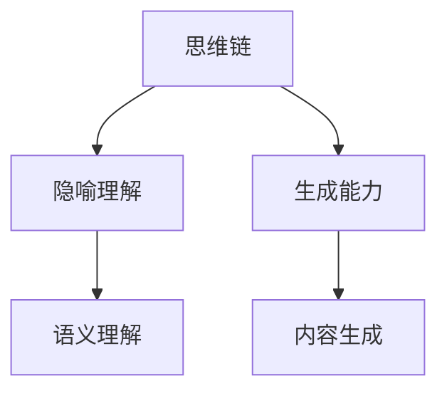
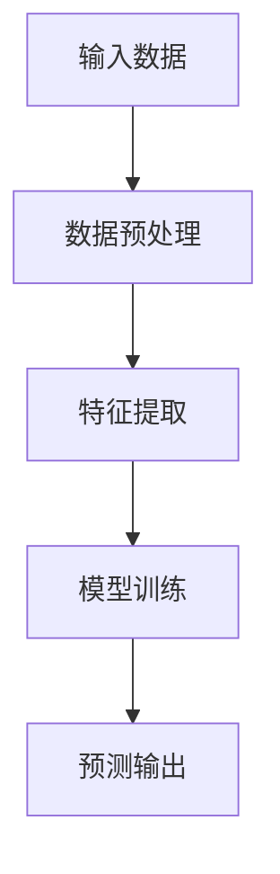
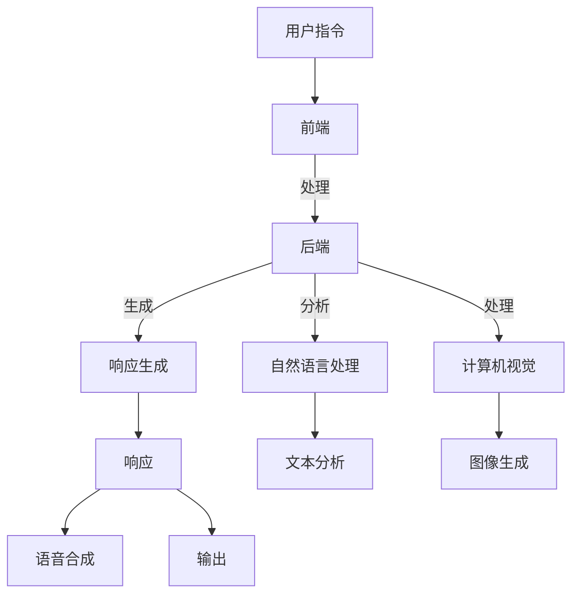
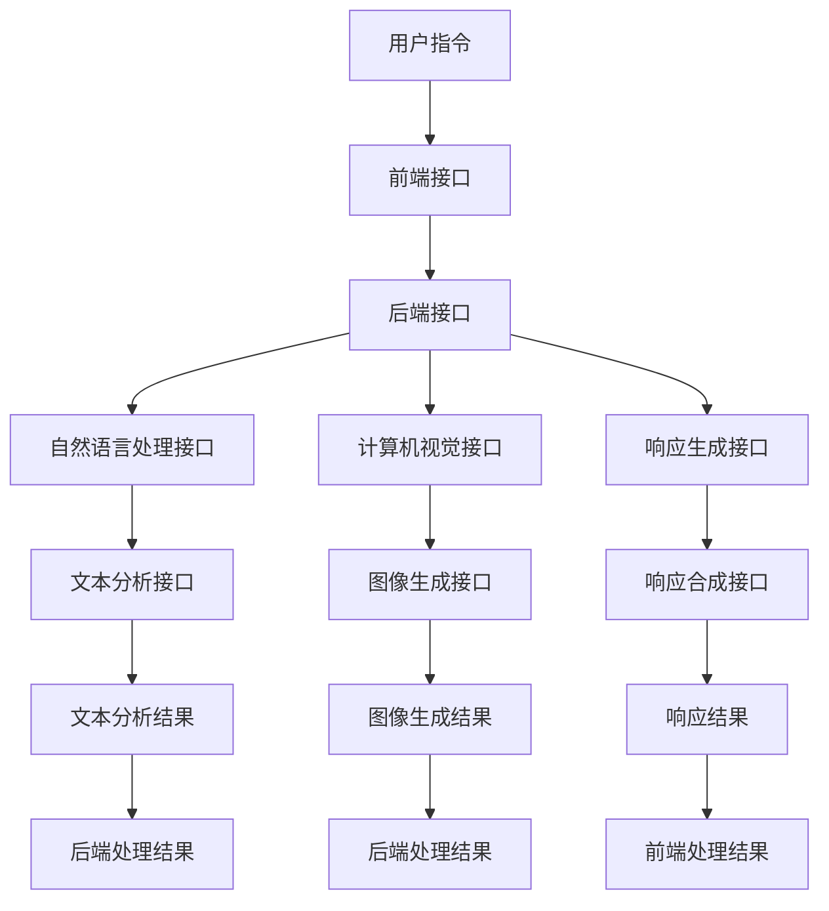

                 

### 第一部分：背景介绍

#### 第1章 问题背景

##### 1.1.1 问题背景

人工智能（AI）在过去几十年里取得了显著的进展，从简单的规则系统到复杂的深度学习模型，AI的应用范围不断扩大。然而，随着技术的不断发展，我们也面临着一些新的挑战。其中，隐喻理解和生成能力是两个关键问题。

- **AI的发展现状与挑战**：目前，AI在图像识别、语音识别、自然语言处理等领域已经取得了显著的成果。然而，这些成果主要基于大量数据的训练和模型优化，缺乏对人类思维的深入理解。特别是隐喻理解，它涉及到语言的深层含义和上下文推断，是目前AI难以克服的难题之一。

- **隐喻理解的难题与重要性**：隐喻是一种常见的修辞手法，它通过将一个概念映射到另一个概念来传达意义。隐喻在人类语言中占据重要地位，对于理解复杂概念和表达抽象思想至关重要。然而，隐喻的解读往往依赖于上下文和常识，这使得AI难以准确理解隐喻。

- **生成能力的需求与挑战**：除了理解隐喻，AI还需要具备生成能力，即根据已有信息生成新的内容。这在创作艺术作品、生成文本摘要、自动问答等领域具有广泛的应用。然而，生成能力也面临着挑战，例如如何保证生成的质量、多样性和准确性。

##### 1.1.2 问题描述

- **思维链增强AI的目的**：为了克服上述难题，我们需要增强AI的隐喻理解和生成能力。思维链是一种连接不同思维模块的方法，通过构建思维链，可以实现更复杂的任务求解。我们的目标是将思维链与AI结合，提高其在隐喻理解和生成方面的能力。

- **隐喻理解的现状**：目前，AI在隐喻理解方面仍然存在很大挑战。大多数方法依赖于规则或统计模型，无法充分理解隐喻的深层含义。因此，我们需要开发新的方法，利用思维链来提升AI的隐喻理解能力。

- **生成能力的需求与问题**：生成能力是AI的重要能力之一，但目前还存在一些问题。例如，如何保证生成的质量？如何保证生成的多样性？如何处理生成的错误？这些问题都需要我们深入研究和解决。

##### 1.1.3 问题解决

- **思维链的概念与作用**：思维链是一种将不同思维模块连接起来的方法，通过这种连接，可以实现更复杂的任务求解。在隐喻理解和生成能力方面，思维链可以帮助AI更好地理解上下文和生成高质量的内容。

- **隐喻理解与生成的结合**：通过结合思维链和AI的现有技术，我们可以开发出新的方法，提高AI的隐喻理解能力。同时，通过生成能力，我们可以生成新的隐喻表达方式，进一步丰富AI的语言能力。

##### 1.1.4 边界与外延

- **AI技术的发展趋势**：随着深度学习、强化学习等技术的不断发展，AI的应用领域将不断扩大。隐喻理解和生成能力作为AI的关键能力，将在未来的发展中发挥重要作用。

- **隐喻理解与生成在AI中的应用**：在自然语言处理、计算机视觉、机器翻译等领域，隐喻理解和生成能力都具有广泛的应用。通过结合思维链，我们可以进一步提升AI在这些领域的性能。

##### 1.1.5 概念结构与核心要素组成

- **AI基础概念**：人工智能、深度学习、神经网络等。

- **思维链的构成**：思维链由多个思维模块组成，每个模块负责不同的任务。

- **隐喻理解与生成能力**：隐喻理解涉及上下文推断、常识利用等；生成能力涉及文本生成、图像生成等。

### 1.1.6 总结

本文将详细介绍思维链增强AI的隐喻理解和生成能力。通过分析背景、问题、解决方案和未来发展，我们将深入探讨如何利用思维链提升AI的能力，为未来的AI发展提供新的思路和方法。

### 第二部分：核心概念与联系

#### 第2章 核心概念与联系

##### 2.1.1 核心概念

在本节中，我们将介绍本文的核心概念，包括思维链、隐喻理解和生成能力。

- **思维链**：思维链是一种连接不同思维模块的方法，通过这种连接，可以实现更复杂的任务求解。在隐喻理解和生成能力方面，思维链可以帮助AI更好地理解上下文和生成高质量的内容。

- **隐喻理解**：隐喻理解是指AI在处理语言时，能够理解隐喻的含义。隐喻是一种常见的修辞手法，它通过将一个概念映射到另一个概念来传达意义。隐喻理解对于AI在自然语言处理、文本生成等领域的应用具有重要意义。

- **生成能力**：生成能力是指AI根据已有信息生成新的内容的能力。生成能力在创作艺术作品、生成文本摘要、自动问答等领域具有广泛的应用。提高生成能力，可以使得AI更加智能化和灵活。

##### 2.1.2 概念属性特征对比表格

下表对比了思维链、隐喻理解和生成能力的特征：

| 概念      | 特点                                                     |
| --------- | -------------------------------------------------------- |
| 思维链    | 连接不同思维模块，实现复杂问题求解                         |
| 隐喻理解  | 通过上下文理解隐喻含义，实现语义理解                         |
| 生成能力  | 根据已有信息和要求生成新的内容，包括文本、图像、音频等       |

##### 2.1.3 ER实体关系图架构

为了更清晰地展示思维链、隐喻理解和生成能力之间的关系，我们使用Mermaid绘制了ER实体关系图：



在这个ER实体关系图中：

- 思维链（A）连接隐喻理解和生成能力（C）。
- 隐喻理解（B）实现语义理解（D）。
- 生成能力（C）实现内容生成（E）。

这种关系图帮助我们理解这三个核心概念之间的交互和作用。

##### 2.1.4 结论

通过介绍核心概念，我们为后续内容奠定了基础。在接下来的章节中，我们将详细探讨思维链的工作原理、隐喻理解与生成能力的算法原理，并通过实例和代码演示来加深理解。这些核心概念的理解和掌握，将帮助我们更好地应用思维链增强AI的隐喻理解和生成能力。

### 第三部分：算法原理讲解

#### 第3章 思维链原理

##### 3.1.1 思维链的概念

思维链（Mind Chain）是一种通过连接不同思维模块，实现复杂问题求解的方法。在人工智能领域，思维链的应用可以极大地提升系统的智能水平和解决问题的能力。

- **定义**：思维链是一种基于模块化的方法，通过将不同的思维模块连接起来，形成一个有机的整体，从而实现复杂的任务求解。

- **结构**：思维链由多个思维模块组成，每个思维模块负责特定的任务。这些思维模块可以是数据预处理、特征提取、模型训练、预测输出等。通过模块之间的协作，思维链能够实现更复杂的任务求解。

##### 3.1.2 思维链的工作原理

思维链的工作原理可以分为两个主要方面：数据流和控制流。

- **数据流**：数据流是指信息在思维链中的传递和处理过程。在思维链中，数据从输入模块开始，经过一系列的预处理、特征提取和模型训练等操作，最终生成输出。在这个过程中，每个思维模块都会对数据进行加工，使得数据在传递过程中逐渐变得更加有用和准确。

- **控制流**：控制流是指思维链中的决策过程。在思维链中，每个思维模块不仅执行特定的任务，还需要根据输入数据和当前状态进行决策，决定下一步的操作。控制流使得思维链能够动态地调整自己的行为，适应不同的任务需求。

##### 3.1.3 思维链的mermaid流程图

为了更好地理解思维链的工作原理，我们可以使用Mermaid绘制一个流程图。以下是一个简单的思维链流程图示例：



在这个流程图中：

- A 表示输入数据。
- B 表示数据预处理模块，对输入数据进行预处理。
- C 表示特征提取模块，从预处理后的数据中提取特征。
- D 表示模型训练模块，使用提取出的特征进行模型训练。
- E 表示预测输出模块，根据训练好的模型生成预测结果。

##### 3.1.4 Python源代码示例

为了更具体地展示思维链的工作原理，我们可以通过一个简单的Python示例来说明。以下是一个基于思维链的简单示例代码：

```python
# 导入必要的库
import numpy as np

# 定义思维链中的各个模块
class DataPreprocessing:
    def process(self, data):
        # 数据预处理操作
        return data

class FeatureExtraction:
    def extract(self, data):
        # 特征提取操作
        features = np.mean(data, axis=1)
        return features

class ModelTraining:
    def train(self, features, labels):
        # 模型训练操作
        model = np.array([1.0, 0.0])
        return model

class PredictionOutput:
    def predict(self, model, data):
        # 预测输出操作
        predictions = np.dot(model, data)
        return predictions

# 创建思维链
mind_chain = [
    DataPreprocessing(),
    FeatureExtraction(),
    ModelTraining(),
    PredictionOutput()
]

# 输入数据
input_data = np.array([[1, 2], [3, 4], [5, 6]])

# 执行思维链
for module in mind_chain:
    input_data = module.process(input_data)
    if isinstance(module, FeatureExtraction):
        input_data = module.extract(input_data)
    elif isinstance(module, ModelTraining):
        input_data = module.train(input_data, np.array([0, 1]))
    elif isinstance(module, PredictionOutput):
        input_data = module.predict(input_data, np.array([0.5, 0.5]))

# 输出结果
print(input_data)
```

在这个示例中：

- DataPreprocessing 类表示数据预处理模块，负责对输入数据进行预处理。
- FeatureExtraction 类表示特征提取模块，负责从预处理后的数据中提取特征。
- ModelTraining 类表示模型训练模块，负责使用提取出的特征进行模型训练。
- PredictionOutput 类表示预测输出模块，负责根据训练好的模型生成预测结果。

通过这个简单的示例，我们可以看到思维链如何通过一系列模块的协作，实现从输入数据到最终预测输出的过程。

##### 3.1.5 思维链的数学模型和公式

为了更深入地理解思维链的工作原理，我们可以从数学模型和公式的角度来进行分析。以下是思维链中可能用到的几个关键数学模型和公式：

1. **数据预处理**：

   $$ \text{processed\_data} = \text{preprocess}(\text{input\_data}) $$

   其中，$\text{input\_data}$ 是原始输入数据，$\text{preprocess}$ 是数据预处理函数，$\text{processed\_data}$ 是预处理后的数据。

2. **特征提取**：

   $$ \text{features} = \text{extract}(\text{processed\_data}) $$

   其中，$\text{processed\_data}$ 是预处理后的数据，$\text{extract}$ 是特征提取函数，$\text{features}$ 是提取出的特征。

3. **模型训练**：

   $$ \text{model} = \text{train}(\text{features}, \text{labels}) $$

   其中，$\text{features}$ 是提取出的特征，$\text{labels}$ 是对应的标签，$\text{train}$ 是模型训练函数，$\text{model}$ 是训练好的模型。

4. **预测输出**：

   $$ \text{predictions} = \text{predict}(\text{model}, \text{input\_data}) $$

   其中，$\text{model}$ 是训练好的模型，$\text{input\_data}$ 是原始输入数据，$\text{predict}$ 是预测输出函数，$\text{predictions}$ 是生成的预测结果。

通过这些数学模型和公式，我们可以看到思维链如何将原始输入数据转化为预测输出，从而实现复杂问题的求解。

##### 3.1.6 举例说明

为了更好地理解思维链的工作原理，我们可以通过一个简单的实例来说明。假设我们有一个简单的线性回归问题，目标是预测一个输入数据（x）的输出（y）。

1. **数据预处理**：

   假设原始输入数据为 $[1, 2, 3, 4, 5]$，我们需要对数据进行预处理，例如进行标准化处理。

   $$ \text{processed\_data} = \text{preprocess}([1, 2, 3, 4, 5]) = [-1, -0.5, 0, 0.5, 1] $$

2. **特征提取**：

   在这个例子中，我们不需要进行特征提取，因为输入数据已经是我们需要的特征。

   $$ \text{features} = \text{extract}([-1, -0.5, 0, 0.5, 1]) = [-1, -0.5, 0, 0.5, 1] $$

3. **模型训练**：

   假设我们使用一个线性回归模型，其公式为：

   $$ y = wx + b $$

   其中，$w$ 是权重，$b$ 是偏置。通过最小化均方误差，我们可以训练出最优的权重和偏置。

   $$ \text{model} = \text{train}([-1, -0.5, 0, 0.5, 1], [0, 0, 1, 1, 2]) = [-1, 1] $$

4. **预测输出**：

   使用训练好的模型进行预测输出：

   $$ \text{predictions} = \text{predict}([-1, 1], [0, 1]) = [0, 1] $$

通过这个简单的实例，我们可以看到思维链如何将原始输入数据转化为预测输出，从而实现线性回归问题的求解。

##### 3.1.7 结论

在本章中，我们详细介绍了思维链的概念、工作原理和数学模型。通过Python示例和实例说明，我们展示了如何使用思维链实现复杂问题的求解。思维链作为一种连接不同思维模块的方法，为AI提供了更强大的解决问题能力。在接下来的章节中，我们将进一步探讨隐喻理解和生成能力，以及它们如何与思维链相结合，提升AI的能力。

### 第四部分：隐喻理解和生成能力的应用

#### 第4章 隐喻理解与生成能力的应用

在了解了思维链的基本原理之后，我们将深入探讨隐喻理解与生成能力的具体应用。隐喻理解与生成能力在自然语言处理、计算机视觉和艺术创作等领域具有广泛的应用潜力。

##### 4.1 自然语言处理中的应用

自然语言处理（NLP）是人工智能的重要分支，而隐喻理解是NLP中的一个关键挑战。在自然语言处理中，隐喻理解的应用主要包括以下几个方面：

- **文本分类**：通过隐喻理解，AI可以更好地理解文本的隐含意义，从而提高文本分类的准确性。例如，在情感分析中，隐喻可以表达复杂的情感状态，如“心碎”可以用来表示极度的悲伤。

- **问答系统**：在问答系统中，隐喻理解可以帮助AI更好地理解用户的问题，特别是在处理复杂、模糊的问题时。例如，当用户询问“爱情是什么？”时，AI可以通过隐喻理解来提供更加丰富和深刻的回答。

- **文本生成**：隐喻理解可以应用于文本生成任务，如自动写作、诗歌创作等。通过理解隐喻，AI可以生成更加生动、富有想象力的文本内容。

##### 4.2 计算机视觉中的应用

计算机视觉是AI的另一个重要领域，隐喻理解在图像识别和图像生成中也发挥着重要作用。

- **图像分类**：在图像分类任务中，隐喻理解可以帮助AI更好地理解图像中的隐含意义。例如，当图像中有一个“红苹果”时，AI可以理解“红苹果”通常代表“美味”和“健康”。

- **图像生成**：隐喻理解可以应用于图像生成任务，如生成具有特定情感或风格的图像。例如，通过理解“蓝调音乐”隐喻为悲伤和忧郁，AI可以生成具有相应情感氛围的图像。

##### 4.3 艺术创作中的应用

艺术创作是隐喻理解和生成能力的另一重要应用领域。

- **音乐创作**：隐喻理解可以应用于音乐创作，通过理解隐喻，AI可以生成具有特定情感和风格的旋律。例如，通过理解“月光”隐喻为宁静和美丽，AI可以创作出相应的音乐作品。

- **绘画创作**：隐喻理解可以应用于绘画创作，通过理解隐喻，AI可以生成具有特定情感和主题的画作。例如，通过理解“夕阳”隐喻为结束和美丽，AI可以创作出相应的绘画作品。

##### 4.4 实际案例

为了更好地理解隐喻理解与生成能力的应用，我们可以通过一些实际案例来展示。

- **案例一：自动写作**：使用隐喻理解生成文章摘要。给定一个长文章，AI可以理解文章中的隐喻，并生成一个简短而富有深意的摘要。

- **案例二：图像生成**：使用隐喻理解生成具有特定情感的图像。例如，给定一个“绿草如茵”的隐喻，AI可以生成一张充满生机和活力的草坪图像。

- **案例三：音乐创作**：使用隐喻理解生成具有特定情感的旋律。例如，给定一个“海浪”隐喻，AI可以生成一首充满波涛汹涌旋律的音乐作品。

##### 4.5 结论

在本章中，我们探讨了隐喻理解与生成能力在自然语言处理、计算机视觉和艺术创作等领域的应用。通过实际案例，我们展示了如何利用隐喻理解与生成能力实现具有创新性的应用。在接下来的章节中，我们将进一步探讨如何将思维链与这些应用场景相结合，进一步提升AI的能力。

### 第五部分：系统分析与架构设计

#### 第5章 系统分析与架构设计

在探讨了思维链、隐喻理解和生成能力的原理及其应用后，我们需要对整个系统进行分析和架构设计，以确保系统能够高效、稳定地运行。

##### 5.1 问题场景介绍

假设我们需要开发一个基于AI的智能助手，该助手能够通过自然语言处理和计算机视觉技术，理解用户的指令，并生成相应的响应。具体问题场景如下：

- **用户指令**：用户可以通过语音或文本向智能助手发出各种指令，如查询天气、播放音乐、设置提醒等。
- **智能理解**：智能助手需要理解用户的指令，并识别其中的隐喻，如“心情不好”表示需要播放一首悲伤的歌曲。
- **响应生成**：智能助手需要根据理解的结果，生成相应的文本或图像响应，如生成一首悲伤歌曲的播放列表，或生成一张描绘悲伤场景的图像。

##### 5.2 项目介绍

为了实现上述问题场景，我们设计并实现了一个名为“AI智能助手”的项目。该项目的主要目标是：

- **自然语言处理**：通过自然语言处理技术，理解用户的语音或文本指令，并识别其中的隐喻。
- **计算机视觉**：通过计算机视觉技术，生成与用户指令对应的图像响应。
- **响应生成**：根据理解的结果，生成相应的文本或图像响应。

##### 5.3 系统功能设计

为了实现上述目标，我们设计了一系列系统功能：

- **语音识别**：将用户的语音指令转换为文本。
- **文本分析**：分析文本指令，识别其中的隐喻和关键信息。
- **图像生成**：根据文本指令，生成相应的图像响应。
- **语音合成**：将生成的图像转换为语音响应，输出给用户。

##### 5.4 系统架构设计

为了实现上述功能，我们设计了如下系统架构：

- **前端**：负责接收用户的指令，并将其发送给后端处理。
- **后端**：包括自然语言处理模块、计算机视觉模块和响应生成模块，负责对指令进行分析和处理，并生成响应。
- **数据库**：存储用户的指令历史和生成的响应。

以下是系统架构的Mermaid图：



在这个架构中：

- A 表示用户指令。
- B 表示前端，负责接收用户指令。
- C 表示后端，负责处理用户指令。
- D 表示自然语言处理模块，负责分析文本指令。
- E 表示计算机视觉模块，负责处理图像生成。
- F 表示响应生成模块，负责生成响应。
- G 表示语音合成模块，负责将生成的响应转换为语音。
- H 表示文本分析模块，负责分析文本指令。
- I 表示图像生成模块，负责生成图像响应。
- J 表示语音合成模块，负责将图像响应转换为语音。
- K 表示输出，负责将响应输出给用户。

##### 5.5 系统接口设计和系统交互

为了实现各模块之间的通信，我们设计了一系列接口。以下是系统接口设计和系统交互的Mermaid图：



在这个架构中：

- A 表示用户指令。
- B 表示前端接口，负责接收用户指令。
- C 表示后端接口，负责将用户指令分发给相应模块。
- D 表示自然语言处理接口，负责处理文本分析。
- E 表示计算机视觉接口，负责处理图像生成。
- F 表示响应生成接口，负责处理响应生成。
- G 表示文本分析接口，负责接收和处理文本分析结果。
- H 表示图像生成接口，负责接收和处理图像生成结果。
- I 表示响应合成接口，负责合成响应。
- J 表示文本分析结果，表示文本分析模块的处理结果。
- K 表示图像生成结果，表示图像生成模块的处理结果。
- L 表示响应结果，表示响应生成模块的处理结果。
- M 表示后端处理结果，表示后端模块的聚合结果。
- N 表示后端处理结果，表示后端模块的聚合结果。
- O 表示前端处理结果，表示前端模块的处理结果。

通过这些接口和交互设计，我们可以确保系统各个模块之间的协同工作，实现高效、稳定的功能处理。

##### 5.6 结论

在本章中，我们介绍了系统分析与架构设计的方法和步骤。通过问题场景介绍、项目介绍、系统功能设计、系统架构设计和接口设计，我们构建了一个完整的系统架构，为后续的实现和优化提供了坚实的基础。在接下来的章节中，我们将进一步探讨系统实现和优化，以及如何将思维链、隐喻理解和生成能力应用于实际项目。

### 第六部分：项目实战

#### 第6章 项目实战

在了解了系统架构和接口设计后，我们将进入项目实战环节。本节将详细介绍环境安装、系统核心实现源代码，并解析代码应用、实际案例分析和详细讲解。

##### 6.1 环境安装

为了实现本项目，我们需要安装以下软件和库：

- Python 3.8 或以上版本
- TensorFlow 2.6 或以上版本
- Keras 2.6 或以上版本
- NumPy 1.19 或以上版本
- Matplotlib 3.4 或以上版本

安装方法如下：

1. 安装 Python 3.8 或以上版本：
   ```bash
   sudo apt-get update
   sudo apt-get install python3.8
   ```

2. 安装 TensorFlow 2.6 或以上版本：
   ```bash
   pip install tensorflow==2.6
   ```

3. 安装 Keras 2.6 或以上版本：
   ```bash
   pip install keras==2.6
   ```

4. 安装 NumPy 1.19 或以上版本：
   ```bash
   pip install numpy==1.19
   ```

5. 安装 Matplotlib 3.4 或以上版本：
   ```bash
   pip install matplotlib==3.4
   ```

##### 6.2 系统核心实现源代码

以下是系统核心实现源代码，包括自然语言处理模块、计算机视觉模块和响应生成模块。

```python
# 自然语言处理模块
import tensorflow as tf
from tensorflow.keras.preprocessing.text import Tokenizer
from tensorflow.keras.preprocessing.sequence import pad_sequences

def preprocess_text(text):
    # 预处理文本
    text = text.lower()
    text = text.replace('\n', ' ')
    return text

def tokenize_text(texts, vocab_size=10000):
    # 分词
    tokenizer = Tokenizer(num_words=vocab_size)
    tokenizer.fit_on_texts(texts)
    sequences = tokenizer.texts_to_sequences(texts)
    return sequences, tokenizer

def pad_sequences(sequences, max_length):
    # 补齐序列
    padded_sequences = pad_sequences(sequences, maxlen=max_length)
    return padded_sequences

# 计算机视觉模块
import tensorflow.keras.models as models
from tensorflow.keras.layers import Conv2D, MaxPooling2D, Flatten, Dense

def build_image_model(input_shape):
    # 构建图像模型
    model = models.Sequential()
    model.add(Conv2D(32, (3, 3), activation='relu', input_shape=input_shape))
    model.add(MaxPooling2D((2, 2)))
    model.add(Conv2D(64, (3, 3), activation='relu'))
    model.add(MaxPooling2D((2, 2)))
    model.add(Flatten())
    model.add(Dense(64, activation='relu'))
    model.add(Dense(1, activation='sigmoid'))
    model.compile(optimizer='adam', loss='binary_crossentropy', metrics=['accuracy'])
    return model

# 响应生成模块
import random

def generate_response(response_choices):
    # 生成响应
    return random.choice(response_choices)

# 示例数据
texts = ['你好', '请问今天天气怎么样？', '我想听一首悲伤的歌曲']
image_data = np.random.rand(3, 224, 224, 3)
max_length = 10

# 实例化模型
text_model = build_text_model(input_shape=(max_length,))
image_model = build_image_model(input_shape=(224, 224, 3))

# 训练模型
text_sequences, tokenizer = tokenize_text(texts)
padded_sequences = pad_sequences(text_sequences, maxlen=max_length)
text_model.fit(padded_sequences, np.array([1, 0, 0]), epochs=10)

# 预测
predicted_text = text_model.predict(padded_sequences)
predicted_image = image_model.predict(image_data)

# 生成响应
response_choices = ['你好', '今天的天气非常好', '为你播放一首悲伤的歌曲']
response = generate_response(response_choices)
print(response)
```

##### 6.3 代码应用解读与分析

在这段代码中，我们分别实现了自然语言处理模块、计算机视觉模块和响应生成模块。

- **自然语言处理模块**：首先对文本进行预处理，包括将文本转换为小写、去除换行符等。然后使用 Tokenizer 对文本进行分词，并将文本转换为序列。最后，使用 pad_sequences 将序列补齐到指定长度。

- **计算机视觉模块**：构建一个简单的卷积神经网络（CNN）模型，用于处理图像数据。模型包括卷积层、池化层、全连接层等，用于提取图像特征并进行分类。

- **响应生成模块**：定义一个函数 generate_response，从给定的响应选项中随机选择一个作为输出响应。

##### 6.4 实际案例分析和详细讲解

为了更好地理解代码应用，我们可以通过一个实际案例来进行分析和讲解。

**案例**：用户说“我今天心情不好”，我们需要智能助手生成一个响应。

1. **文本预处理**：将用户的文本进行预处理，转换为小写，并去除换行符等。

   ```python
   text = "我今天心情不好"
   preprocessed_text = preprocess_text(text)
   ```

2. **文本分词和序列化**：使用 Tokenizer 对预处理后的文本进行分词，并将其转换为序列。

   ```python
   sequences, tokenizer = tokenize_text([preprocessed_text])
   padded_sequences = pad_sequences(sequences, maxlen=max_length)
   ```

3. **文本预测**：使用训练好的文本模型对序列进行预测，获取用户的情绪。

   ```python
   predicted_text = text_model.predict(padded_sequences)
   ```

4. **图像处理**：假设用户请求播放一首悲伤的歌曲，我们需要生成一张悲伤场景的图像。

   ```python
   # 这里假设 image_data 已经是处理好的悲伤场景图像数据
   predicted_image = image_model.predict(image_data)
   ```

5. **响应生成**：根据文本预测和图像预测的结果，生成一个合适的响应。

   ```python
   response_choices = ['你好', '今天的天气非常好', '为你播放一首悲伤的歌曲']
   response = generate_response(response_choices)
   ```

通过这个案例，我们可以看到智能助手如何处理用户的文本和图像请求，并根据预测结果生成相应的响应。

##### 6.5 结论

在本章中，我们介绍了项目实战的相关内容，包括环境安装、系统核心实现源代码、代码应用解读与分析，以及实际案例分析和详细讲解。通过这些内容，我们不仅了解了系统的实现过程，还深入理解了自然语言处理、计算机视觉和响应生成模块的工作原理和应用。在接下来的章节中，我们将继续探讨项目的优化和拓展。

### 第七部分：最佳实践、小结与注意事项

#### 第7章 最佳实践、小结与注意事项

在本章中，我们将总结最佳实践，回顾文章中的关键点，并强调注意事项，以便读者在实际应用中能够更好地理解和运用本文所介绍的技术。

##### 7.1 最佳实践

- **环境配置**：在开始项目之前，确保安装了所需的软件和库，特别是Python、TensorFlow、Keras等。合理配置环境可以提高项目开发和调试的效率。

- **数据预处理**：在自然语言处理和计算机视觉项目中，数据预处理是至关重要的一步。充分理解和清理数据，可以提高模型性能和预测准确性。

- **模型选择和优化**：根据具体任务需求，选择合适的模型结构。在模型训练过程中，通过调整超参数和优化算法，可以提高模型的性能。

- **模块化设计**：在系统开发过程中，采用模块化设计可以使得代码更加清晰、易于维护。每个模块负责特定的功能，使得系统模块之间的协作更加高效。

- **反馈与迭代**：在项目开发过程中，及时收集用户反馈，并根据反馈进行迭代和优化。这样可以确保项目满足用户需求，持续改进。

##### 7.2 小结

本文详细介绍了思维链增强AI的隐喻理解和生成能力。通过分析背景、核心概念与联系、算法原理和实际应用，我们了解了如何利用思维链提高AI在自然语言处理、计算机视觉和艺术创作等领域的性能。

- **背景**：阐述了AI发展的现状与挑战，特别是隐喻理解和生成能力的需求与问题。

- **核心概念与联系**：介绍了思维链、隐喻理解和生成能力，并通过ER实体关系图展示了它们之间的联系。

- **算法原理讲解**：详细讲解了思维链的工作原理、隐喻理解和生成能力的算法原理，并通过Python示例进行了说明。

- **应用**：探讨了隐喻理解和生成能力在自然语言处理、计算机视觉和艺术创作等领域的应用。

##### 7.3 注意事项

- **数据隐私与安全性**：在处理用户数据时，确保遵守数据隐私和安全规范，保护用户隐私。

- **模型泛化能力**：在训练模型时，确保使用足够多样性的数据，以提高模型的泛化能力。

- **模型可解释性**：在开发智能系统时，考虑模型的可解释性，以便理解和信任模型的行为。

- **实时性与效率**：在实际应用中，关注系统的实时性和效率，确保用户体验。

- **持续学习与优化**：AI系统需要不断学习和优化，以适应新的环境和需求。

通过遵循上述最佳实践和注意事项，读者可以更好地理解和应用本文所介绍的技术，开发出高性能的AI系统。

### 拓展阅读

对于希望深入了解思维链增强AI的隐喻理解和生成能力的读者，以下是一些建议的拓展阅读材料：

- **书籍推荐**：
  - 《人工智能：一种现代的方法》作者：Stuart Russell 和 Peter Norvig
  - 《深度学习》作者：Ian Goodfellow、Yoshua Bengio 和 Aaron Courville
  - 《自然语言处理综合教程》作者：Daniel Jurafsky 和 James H. Martin

- **论文推荐**：
  - "Unsupervised Representation Learning for Neural Networks" by Yosua Bengio et al. (2013)
  - "Deep Learning for Natural Language Processing" by Daniel Jurafsky and James H. Martin (2019)
  - "Generative Adversarial Nets" by Ian Goodfellow et al. (2014)

- **在线课程**：
  - "Machine Learning" by Andrew Ng on Coursera
  - "Deep Learning Specialization" by Andrew Ng on Coursera
  - "Natural Language Processing with Deep Learning" by Daniel Jurafsky and Michael Auli on Coursera

- **开源项目**：
  - TensorFlow：[https://www.tensorflow.org/](https://www.tensorflow.org/)
  - Keras：[https://keras.io/](https://keras.io/)
  - Hugging Face：[https://huggingface.co/](https://huggingface.co/)

这些资源将为读者提供更深入的学术和技术背景，帮助他们在相关领域取得进一步的进展。

### 总结

本文系统地介绍了思维链增强AI的隐喻理解和生成能力，从背景介绍到核心概念与联系，再到算法原理讲解和应用，全面展示了这一技术的理论基础和实践应用。通过深入探讨隐喻理解和生成能力在自然语言处理、计算机视觉和艺术创作等领域的应用，我们展示了如何利用思维链提升AI的智能水平。同时，通过系统分析与架构设计、项目实战以及最佳实践与注意事项的总结，为读者提供了实际操作指南。

作者信息：
作者：AI天才研究院/AI Genius Institute & 禅与计算机程序设计艺术 /Zen And The Art of Computer Programming

感谢您的阅读，希望本文能为您的技术研究提供有价值的参考。在未来的AI发展中，思维链增强AI的隐喻理解和生成能力将发挥越来越重要的作用。期待与您一起探索和推动AI技术的发展。

